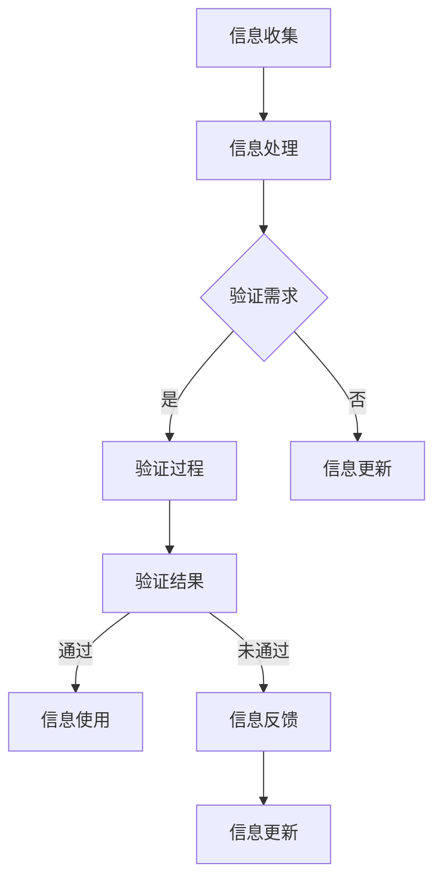

                 

### 《信息验证和数字素养教育：为信息时代培养信息素养的学生》引言

> **关键词**：信息验证、数字素养教育、信息时代、教育挑战、学生培养。

> **摘要**：随着信息技术的迅猛发展，信息验证和数字素养教育成为现代教育不可或缺的一部分。本文旨在探讨信息验证与数字素养教育的背景与重要性，分析当前教育领域面临的挑战，并提出相应的解决方案，以培养具备高度信息素养的学生。

#### 1.1 信息验证的定义与作用

信息验证（Information Verification）是指通过一系列方法和技术，确保信息的准确性、完整性和可靠性。在信息爆炸的时代，信息验证显得尤为重要。它不仅帮助我们识别和纠正错误信息，还能防止虚假信息和误导信息的传播。

信息验证的作用主要体现在以下几个方面：

1. **确保信息准确性**：通过验证，我们可以确认信息的真实性和准确性，避免因错误信息导致的决策失误。
2. **保护信息安全**：验证技术能够识别并防范网络攻击、信息篡改等安全威胁，确保信息的机密性和完整性。
3. **提升信息价值**：准确的信息是知识管理和决策支持的基础，通过验证，我们可以提高信息的利用率，为各行各业带来更大的价值。
4. **增强用户信任**：在信息传播过程中，信息的真实性和可信度直接影响用户对信息源和内容的信任。有效的信息验证有助于建立用户的信任感。

#### 1.2 数字素养教育的重要性

数字素养教育（Digital Literacy Education）是指培养学生掌握数字化工具和应用的能力，培养他们在数字环境中的信息获取、处理、分析和评估的能力。随着信息技术的飞速发展，数字素养已成为现代公民必备的基本素养。

数字素养教育的重要性体现在以下几个方面：

1. **适应数字化社会**：数字化社会已经渗透到我们生活的方方面面，具备数字素养的学生能够更好地适应这一变革，提高生活质量。
2. **提升竞争力**：在数字经济时代，数字素养成为职场竞争的重要指标。具备数字素养的学生在未来的职业生涯中更具竞争力。
3. **促进创新与创业**：数字素养教育有助于培养学生的创新意识和创业精神，激发他们的创造潜能。
4. **培养批判性思维**：数字素养教育鼓励学生在信息获取和处理过程中，培养批判性思维，提高对信息的辨析能力。

#### 1.3 信息时代的教育挑战

信息时代的教育面临诸多挑战，主要体现在以下几个方面：

1. **信息过载**：互联网和社交媒体的普及使得信息爆炸，学生面对海量信息，如何筛选和处理成为一大难题。
2. **虚假信息泛滥**：网络虚假信息、谣言、误导信息层出不穷，如何引导学生正确识别和抵制这些信息成为教育的重要课题。
3. **隐私保护**：随着个人信息在网络中的传播，如何保护学生的隐私权，防范网络侵犯成为教育关注的焦点。
4. **网络安全**：网络攻击、黑客入侵等安全威胁日益增加，如何增强学生的网络安全意识，防范网络安全风险成为教育的重要任务。
5. **教育公平**：在数字化教育资源的分配过程中，如何确保教育公平，让每个学生都能享受到优质教育资源，成为教育面临的一大挑战。

在接下来的章节中，我们将深入探讨信息验证和数字素养教育的核心概念、算法原理、数学模型以及实践应用，为培养具备高度信息素养的学生提供有力的理论支持与实践指导。

#### 第二部分：核心概念与联系

##### 第2章：信息验证的基本原理

> **摘要**：本章将详细介绍信息验证的基本概念、方法和工具，并通过Mermaid流程图展示信息验证的完整流程。

信息验证作为保障信息准确性和可靠性的重要手段，在现代信息社会中发挥着不可替代的作用。为了更好地理解信息验证，我们需要首先明确其基本概念、方法和工具，并借助流程图对其进行系统化展示。

#### 2.1 信息验证的概念与范畴

信息验证是指通过一系列技术和方法，对信息的真实性、准确性、完整性和可靠性进行评估和确认的过程。在信息验证过程中，我们需要关注以下几个方面：

1. **真实性**：验证信息来源是否可靠，信息是否被篡改或伪造。
2. **准确性**：确保信息内容与事实相符，无误导性描述。
3. **完整性**：验证信息是否被完整传递，无遗漏或缺失。
4. **可靠性**：评估信息的可信度和有效性，确保信息能够被正确使用。

信息验证的应用范围广泛，涵盖了各个领域，如互联网、金融、医疗、教育等。以下是几个典型的信息验证应用场景：

1. **互联网**：在互联网环境中，信息验证主要用于防止虚假信息传播、网络诈骗和网络攻击。
2. **金融**：金融行业中的信息验证主要用于确保交易信息的真实性和完整性，防范金融欺诈。
3. **医疗**：医疗领域的信息验证主要用于验证病人的个人信息、医疗记录和药品信息，确保医疗服务的安全性。
4. **教育**：在教育领域，信息验证主要用于验证学生的学术成果、考试分数和学位证书，确保教育质量的公平和公正。

#### 2.2 信息验证的方法与工具

信息验证的方法和工具多种多样，主要包括以下几个方面：

1. **人工验证**：人工验证是指通过专业人员或专家对信息进行审核和评估。这种方法适用于对信息质量要求较高的场景，如金融、医疗等领域。
2. **自动验证**：自动验证是指利用计算机程序或算法对信息进行自动化验证。这种方法适用于大规模数据处理场景，如互联网、大数据等领域。
3. **区块链验证**：区块链技术通过分布式账本和加密算法，确保信息的不可篡改性和可靠性。区块链验证在金融、供应链管理等领域具有广泛应用。
4. **加密验证**：加密验证是指通过加密算法对信息进行加密处理，确保信息在传输过程中的安全性和完整性。加密验证广泛应用于互联网、电子商务等领域。
5. **大数据分析**：大数据分析通过对海量数据进行挖掘和分析，识别出潜在的风险和异常情况，从而提高信息验证的准确性和效率。

#### 2.3 Mermaid流程图：信息验证流程

为了更好地展示信息验证的完整流程，我们使用Mermaid绘制了一个流程图，如下所示：



**流程说明：**

1. **信息收集**：首先收集需要验证的信息。
2. **信息处理**：对收集到的信息进行初步处理，如清洗、整理等。
3. **验证需求**：根据业务需求和验证规则，确定信息是否需要验证。
4. **验证过程**：如果需要验证，进入验证过程。
5. **验证结果**：根据验证结果，决定信息是否通过验证。
6. **信息使用**：如果验证通过，信息可以继续使用。
7. **信息反馈**：如果验证未通过，将信息反馈给相关部门或人员，进行信息更新。

通过上述流程，我们可以系统地理解信息验证的过程和关键环节，为实际应用提供指导。

在接下来的章节中，我们将继续探讨数字素养教育的基础知识，进一步丰富我们对信息验证和数字素养教育的理解。

#### 2.4 数字素养教育的基础知识

数字素养教育作为培养学生在数字时代生存和发展的关键能力，其定义、构成、核心能力、教育目标和意义备受关注。

**3.1 数字素养的定义与构成**

数字素养（Digital Literacy）是指个体在数字化环境中有效使用信息技术和数字资源的能力，以及在面对数字内容时进行批判性思考、解决问题和自我学习的能力。数字素养不仅仅包括技术技能，还涵盖信息素养、媒体素养、安全素养和批判性思维等多个方面。

数字素养的构成可以概括为以下几个方面：

1. **技术技能**：掌握基本的计算机操作技能，如使用操作系统、应用软件和网络服务等。
2. **信息素养**：能够有效查找、评估、使用和创建信息，具备信息筛选和辨别的能力。
3. **媒体素养**：理解媒体信息的产生、传播和影响，能够批判性地分析和评价媒体内容。
4. **安全素养**：具备网络安全意识和能力，能够识别和防范网络威胁，保护个人隐私和数据安全。
5. **批判性思维**：在面对复杂问题和信息时，能够进行独立思考，分析、推理和评估，形成自己的观点。

**3.2 数字素养的核心能力**

数字素养的核心能力是学生在数字化环境中生存和发展的基石，主要包括以下几个方面：

1. **信息能力**：能够高效地查找和获取所需信息，评估信息的真实性和可靠性，并能合理利用信息进行学习和工作。
2. **技术能力**：熟练使用各种信息技术工具，包括计算机硬件、软件和网络等，能够运用技术解决实际问题。
3. **问题解决能力**：在面对数字问题时，能够运用数字技能和批判性思维，提出解决方案并有效执行。
4. **创新能力**：能够运用数字化工具和资源，进行创造性思维和设计，产生新的想法和成果。
5. **协作能力**：在数字化环境中，能够与他人有效合作，共享资源和知识，共同完成任务。

**3.3 数字素养教育的目标与意义**

数字素养教育的目标在于培养学生的数字素养，使他们能够在数字化社会中自信、独立、有成效地生活和工作。具体目标包括：

1. **提高数字技能**：使学生掌握基本的计算机操作技能，能够熟练使用信息技术工具。
2. **培养信息素养**：使学生具备信息检索、评估和利用的能力，能够辨别和筛选真实、有用的信息。
3. **增强安全意识**：使学生了解网络安全风险，学会防范网络攻击，保护个人隐私和数据安全。
4. **培养创新思维**：鼓励学生运用数字化工具进行创新，激发创造力和问题解决能力。
5. **提升协作能力**：培养学生与他人合作的能力，学会在数字化环境中进行团队协作和知识共享。

数字素养教育的意义体现在以下几个方面：

1. **适应数字化社会**：随着数字化技术的快速发展，具备数字素养的学生能够更好地适应数字化社会，提高生活质量和工作效率。
2. **提高竞争力**：在数字经济时代，数字素养成为职场竞争的重要指标，具备数字素养的学生在未来的职业生涯中更具竞争力。
3. **促进教育公平**：数字素养教育有助于缩小数字鸿沟，使更多的学生能够享受到优质教育资源，促进教育公平。
4. **培养全面发展的人才**：数字素养教育不仅关注学生的技术技能，还关注他们的信息素养、媒体素养和安全素养，促进学生的全面发展。

**3.4 数字素养教育的现状与挑战**

尽管数字素养教育的重要性日益凸显，但当前的数字素养教育仍面临一些挑战：

1. **教育资源不平衡**：在城乡、区域之间，数字素养教育的资源分配存在明显的不均衡，部分学生无法享受到优质的教育资源。
2. **教育内容滞后**：部分学校的数字素养教育内容更新较慢，难以跟上数字化技术的快速发展。
3. **教学方法单一**：传统的教学方法难以满足数字素养教育的需求，需要探索更多创新的教学模式。
4. **师资力量不足**：数字素养教育对教师的专业素养要求较高，但当前许多教师的数字素养水平有待提升。

综上所述，数字素养教育在信息时代的重要性不言而喻。通过明确数字素养的定义与构成，阐述其核心能力、教育目标和意义，以及分析现状与挑战，我们可以更全面地理解数字素养教育的内涵和外延，为培养具备高度数字素养的学生提供指导。

#### 第三部分：核心算法原理讲解

##### 第4章：信息验证算法的原理与实现

> **摘要**：本章将深入探讨信息验证算法的基本原理、伪代码实现及其性能评估，以帮助读者理解信息验证的实践应用。

在信息验证过程中，算法的运用至关重要。信息验证算法不仅能够提高信息验证的效率，还能够确保验证结果的准确性。本节将详细讲解信息验证算法的基本原理、伪代码实现及其性能评估。

#### 4.1 信息验证算法的基本原理

信息验证算法是基于一系列数学模型和逻辑规则，对信息进行评估和判断的过程。其基本原理包括以下几个方面：

1. **准确性原则**：算法应确保验证结果的准确性，尽可能减少误判和漏判。
2. **效率原则**：算法应具备较高的运行效率，能够在短时间内处理大量信息。
3. **可扩展性原则**：算法应具备良好的可扩展性，能够适应不同场景和需求。
4. **鲁棒性原则**：算法应具备较强的鲁棒性，能够在复杂环境和异常情况下稳定运行。

信息验证算法主要应用于以下几个方面：

1. **信息真实性验证**：通过比对信息来源、验证信息签名等方式，确保信息的真实性。
2. **信息准确性验证**：通过数据清洗、错误检测和修正等技术，确保信息的准确性。
3. **信息完整性验证**：通过加密和校验技术，确保信息的完整性。
4. **信息可靠性验证**：通过数据分析、风险识别等手段，评估信息的可靠性。

#### 4.2 伪代码：信息验证算法的实现

为了更好地理解信息验证算法的实现过程，我们使用伪代码进行描述。以下是一个简单的信息验证算法伪代码：

```pseudo
Function VerifyInformation(Information, Criteria):
    If (Information meets Criteria):
        Return True
    Else:
        Return False
```

**参数说明：**

- `Information`：待验证的信息。
- `Criteria`：验证标准或规则。

**伪代码解释：**

1. **接收待验证信息**：函数接收一个信息对象`Information`和一个验证标准或规则对象`Criteria`。
2. **判断信息是否满足验证标准**：通过对比`Information`和`Criteria`，判断信息是否满足验证标准。
3. **返回验证结果**：如果信息满足验证标准，返回`True`；否则，返回`False`。

#### 4.3 信息验证算法的性能评估

信息验证算法的性能评估主要包括以下几个方面：

1. **准确性**：准确性是指算法正确识别和判断信息的比例。高准确性的算法能够确保验证结果的可靠性。
2. **效率**：效率是指算法在给定时间内处理信息的速度。高效率的算法能够快速完成验证任务，提高系统的响应速度。
3. **可扩展性**：可扩展性是指算法在处理大量信息时的表现。良好的可扩展性使得算法能够适应不同规模的数据处理需求。
4. **鲁棒性**：鲁棒性是指算法在复杂环境和异常情况下的稳定性。高鲁棒性的算法能够在各种复杂场景下稳定运行，确保验证任务的顺利完成。

为了评估信息验证算法的性能，我们通常使用以下指标：

- **准确率（Accuracy）**：正确识别信息的比例。
- **召回率（Recall）**：在所有真实信息中，算法正确识别出的比例。
- **精确率（Precision）**：在所有识别出的信息中，正确识别的比例。
- **F1分数（F1 Score）**：准确率和召回率的调和平均值，用于综合评估算法的性能。

通过上述性能评估指标，我们可以全面了解信息验证算法的性能表现，为算法的优化和改进提供依据。

#### 4.4 信息验证算法在实际应用中的案例分析

为了更好地理解信息验证算法的实际应用，我们来看两个具体的案例分析。

**案例一：互联网虚假信息识别**

在互联网环境中，虚假信息的识别是信息验证的重要任务之一。以下是一个基于信息验证算法的虚假信息识别流程：

1. **信息收集**：从互联网上收集待识别的虚假信息。
2. **信息预处理**：对虚假信息进行清洗和整理，提取关键特征。
3. **特征匹配**：利用信息验证算法，对虚假信息与已知的虚假信息特征库进行匹配。
4. **结果判断**：根据匹配结果，判断虚假信息的真实性和可靠性。

通过上述流程，我们可以有效识别和过滤互联网上的虚假信息，提高信息的准确性和可信度。

**案例二：金融交易信息验证**

在金融交易中，信息的准确性至关重要。以下是一个基于信息验证算法的金融交易信息验证流程：

1. **交易信息收集**：从交易系统中收集待验证的交易信息。
2. **信息预处理**：对交易信息进行清洗和整理，提取关键特征。
3. **验证规则应用**：利用信息验证算法，根据预先设定的验证规则，对交易信息进行验证。
4. **结果判断**：根据验证结果，判断交易信息的真实性和准确性。

通过上述流程，我们可以确保金融交易信息的真实性和准确性，防范金融欺诈和错误交易。

综上所述，信息验证算法在互联网、金融等领域的实际应用中发挥着重要作用。通过深入理解信息验证算法的基本原理、伪代码实现和性能评估，我们可以更好地发挥其优势，提高信息验证的效率和准确性。

在接下来的章节中，我们将继续探讨数字素养教育算法的原理与应用，进一步丰富我们对信息验证和数字素养教育的理解。

#### 5.3 数字素养教育算法的原理与应用

> **摘要**：本章将深入探讨数字素养教育算法的定义、类型、伪代码实现及其在不同场景中的应用，以帮助读者了解数字素养教育的核心技术。

数字素养教育算法是培养学生数字素养的关键工具，通过这些算法，我们可以系统地传授学生数字技能、信息素养、安全素养和批判性思维。本节将详细介绍数字素养教育算法的基本原理、类型和实现，并探讨其实际应用。

#### 5.1 数字素养教育算法的定义与类型

数字素养教育算法是指用于培养学生数字素养的一系列计算模型和程序，它们依据特定的规则和策略，通过教学、训练和评估等过程，帮助学生掌握数字技能和素养。

数字素养教育算法主要包括以下几种类型：

1. **技能训练算法**：这类算法专注于培养学生的基本数字技能，如计算机操作、软件应用和网络使用等。常见的技能训练算法包括模拟训练、任务驱动训练和智能辅导系统等。

2. **信息素养算法**：这类算法旨在培养学生的信息检索、评估和处理能力。常见的算法包括关键词提取、信息过滤、相关性计算和信息可视化等。

3. **安全素养算法**：这类算法专注于培养学生的网络安全意识和安全技能。常见的算法包括漏洞扫描、入侵检测、安全规则学习和安全策略优化等。

4. **批判性思维算法**：这类算法旨在培养学生的批判性思维和问题解决能力。常见的算法包括问题建模、逻辑推理、决策分析和知识整合等。

#### 5.2 伪代码：数字素养教育算法的实现

为了更好地理解数字素养教育算法的实现过程，我们使用伪代码进行描述。以下是一个简单的数字素养教育算法伪代码示例：

```pseudo
Function EducateDigitalLiteracy(Student):
    While (Student does not meet Criteria):
        TeachConcept()
        AssessUnderstanding()
        AdaptInstruction()
    End While
    Return Student
```

**参数说明：**

- `Student`：待培养的学生对象。
- `Criteria`：学生达到的素养标准。

**伪代码解释：**

1. **初始条件检查**：函数接收一个学生对象`Student`和一个素养标准对象`Criteria`。
2. **循环教学与评估**：在学生未达到素养标准的情况下，循环进行概念教学、理解评估和教学适应。
   - **TeachConcept()**：根据学生的需求，传授新的数字概念。
   - **AssessUnderstanding()**：通过测试或作业，评估学生对概念的理解程度。
   - **AdaptInstruction()**：根据评估结果，调整教学策略，确保学生能够理解和掌握概念。
3. **最终判断**：当学生达到素养标准时，结束循环，返回学生对象。

#### 5.3 数字素养教育算法的应用案例

数字素养教育算法在各个教育场景中有着广泛的应用，以下列举几个典型应用案例：

**案例一：智能辅导系统**

智能辅导系统利用数字素养教育算法，为学生提供个性化学习支持。以下是一个基于算法的智能辅导系统工作流程：

1. **学生信息收集**：收集学生的基本资料、学习历史和学习偏好。
2. **初始评估**：利用算法对学生的数字素养水平进行初始评估，确定学习起点。
3. **教学规划**：根据学生的评估结果，算法生成个性化的学习计划。
4. **学习监控**：实时监控学生的学习进度，利用算法评估学习效果。
5. **自适应调整**：根据学习效果，算法调整学习内容和教学方法，确保学生有效学习。

**案例二：在线教育资源推荐**

在线教育资源推荐系统利用数字素养教育算法，根据学生的学习需求和兴趣，推荐合适的数字教育资源。以下是一个基于算法的推荐系统工作流程：

1. **用户信息收集**：收集学生的基本信息、学习历史和兴趣偏好。
2. **资源库构建**：构建包含多种数字教育资源的数据库。
3. **推荐算法**：利用算法分析学生的信息，推荐符合其需求的资源。
4. **用户反馈**：收集学生对推荐资源的反馈，优化推荐算法。
5. **动态调整**：根据用户反馈，算法动态调整推荐策略，提高推荐质量。

**案例三：网络安全教育**

网络安全教育利用数字素养教育算法，培养学生的网络安全意识和技能。以下是一个基于算法的网络安全教育工作流程：

1. **学生信息收集**：收集学生的基本信息、网络安全知识和经验。
2. **安全评估**：利用算法对学生的网络安全素养进行评估，确定学习起点。
3. **安全培训**：根据评估结果，算法生成个性化的安全培训计划。
4. **实践演练**：组织学生参与网络安全实践演练，提高实际操作能力。
5. **安全考核**：通过算法对学生的安全技能进行考核，评估学习效果。

通过上述案例，我们可以看到数字素养教育算法在各个教育场景中的实际应用。这些算法不仅提高了教育的个性化程度，还增强了学生的数字素养，为他们的未来发展奠定了坚实基础。

在下一章中，我们将探讨信息验证的数学模型和数学公式，进一步深入理解信息验证的理论基础。

#### 第6章：信息验证的数学模型

信息验证作为保障信息准确性、可靠性和完整性的关键技术，在信息社会中发挥着至关重要的作用。为了深入理解信息验证的原理和机制，我们需要借助数学模型来进行详细分析。本章将介绍信息验证中的基本概率论模型、信息熵模型和验证阈值模型，并对其进行详细讲解与举例说明。

#### 6.1 基本概率论模型

概率论是信息验证中广泛应用的基础数学模型，它用于评估信息的可信度和发生概率。以下是一个基本概率论模型的例子：

**公式：**
$$ P(A) = \frac{N(A)}{N(S)} $$

其中，$P(A)$ 表示事件A发生的概率，$N(A)$ 表示事件A发生的次数，$N(S)$ 表示总的试验次数。

**解释：**
- **事件A**：在信息验证中，事件A可以是信息被验证为真或伪的某个特定情况。
- **概率计算**：通过统计方法，我们可以计算出事件A发生的概率。例如，在验证一批数据是否真实时，如果发现其中有90%的数据通过了验证，则这批数据的真实概率为0.9。

**示例：**
假设我们对一批文档进行真实性验证，共有100份文档，其中85份被验证为真实。那么，这些文档为真实的概率为：
$$ P(真实) = \frac{85}{100} = 0.85 $$

#### 6.2 信息熵模型

信息熵是信息论中用于量化信息不确定性的重要概念。在信息验证中，信息熵模型可以帮助我们评估信息的可靠性和完整性。

**公式：**
$$ H(X) = -\sum_{i} p(x_i) \log_2 p(x_i) $$

其中，$H(X)$ 表示随机变量X的信息熵，$p(x_i)$ 表示随机变量X取值为$x_i$的概率，$\log_2$ 表示以2为底的对数。

**解释：**
- **信息熵**：信息熵表示随机变量X的信息含量，其值越大，表示信息的不确定性越高。
- **概率分布**：$p(x_i)$ 表示随机变量X的取值概率分布，我们需要根据实际情况来确定这些概率值。

**示例：**
假设我们有一个二进制随机变量X，其取值为0和1的概率分别为0.7和0.3。那么，X的信息熵为：
$$ H(X) = - (0.7 \log_2 0.7 + 0.3 \log_2 0.3) \approx 0.918 $$

这表明X的信息含量较高，不确定性较大。

#### 6.3 验证阈值模型

验证阈值模型用于确定信息验证的门槛值，当验证结果超过该阈值时，可以认为信息是可信的。以下是验证阈值模型的一个例子：

**公式：**
$$ T = \frac{\alpha}{1 - \alpha} $$

其中，$T$ 表示验证阈值，$\alpha$ 表示误判率，即错误接受率。

**解释：**
- **阈值设定**：验证阈值$T$用于设定信息验证的门槛，当验证结果大于$T$时，认为信息是可信的。
- **误判率**：$\alpha$ 是误判率，表示将伪信息验证为真实的概率。误判率越小，验证的准确性越高。

**示例：**
假设我们设定误判率$\alpha$ 为0.05，那么验证阈值$T$ 为：
$$ T = \frac{0.05}{1 - 0.05} = \frac{0.05}{0.95} \approx 0.0526 $$

这意味着当验证结果大于0.0526时，我们认为信息是真实的。

#### 6.4 数学公式的详细讲解与举例说明

为了更好地理解上述数学公式的应用，我们通过具体例子进行详细讲解。

**例子：** 假设我们对一批新闻进行真实性验证，共有100条新闻，其中60条为真实新闻，40条为虚假新闻。我们使用信息熵模型来评估这些新闻的可靠性。

1. **计算真实新闻的概率：**
   $$ p(真实) = \frac{60}{100} = 0.6 $$
   $$ p(虚假) = \frac{40}{100} = 0.4 $$

2. **计算新闻的信息熵：**
   $$ H(X) = - (0.6 \log_2 0.6 + 0.4 \log_2 0.4) \approx 0.693 $$

   这表明这批新闻的信息含量较高，不确定性较大。

3. **设定验证阈值：**
   假设我们设定误判率$\alpha$ 为0.1，那么验证阈值$T$ 为：
   $$ T = \frac{0.1}{1 - 0.1} = \frac{0.1}{0.9} \approx 0.111 $$

   当新闻的验证分数大于0.111时，我们认为该新闻是真实的。

通过这个例子，我们可以看到如何应用数学模型来评估信息的可靠性，并设定验证阈值，从而提高信息验证的准确性。

综上所述，信息验证的数学模型为我们提供了评估信息准确性和可靠性的有力工具。通过基本概率论模型、信息熵模型和验证阈值模型，我们可以更系统地理解和应用信息验证技术，为现代信息社会提供可靠的保障。

在下一章中，我们将探讨信息验证和数字素养教育的实践应用，通过具体案例来展示这些理论在实际场景中的运用。

#### 第7章：信息验证与数字素养教育的实践应用

> **摘要**：本章将详细介绍信息验证与数字素养教育的实际应用，包括实践应用背景、开发环境搭建、源代码实现与分析等内容，以帮助读者理解这些技术在现实世界中的具体应用。

信息验证和数字素养教育作为现代信息技术的重要分支，已经在多个领域中得到了广泛应用。为了更好地理解这些技术的实践应用，本章将详细介绍具体案例，包括实践应用背景、开发环境搭建、源代码实现与分析等内容。

#### 7.1 实践应用背景

随着互联网和数字技术的飞速发展，信息验证和数字素养教育在多个领域中扮演着关键角色。以下是一些典型的应用场景：

1. **在线教育平台**：在线教育平台需要验证学生的身份和学术成果，确保教育资源的公平分配和教学质量。数字素养教育则帮助学生掌握在线学习的技能，提高学习效果。

2. **社交媒体**：社交媒体平台需要验证用户发布的信息，防止虚假信息和网络谣言的传播。同时，数字素养教育有助于培养用户的媒体素养，提高其对信息内容的批判性思维能力。

3. **企业信息安全**：企业需要验证员工的身份和操作权限，确保信息安全。数字素养教育则帮助员工提高网络安全意识和应对网络威胁的能力。

4. **电子商务**：电子商务平台需要验证交易信息，确保交易的安全和可靠性。数字素养教育则帮助消费者掌握在线购物的技能，提高消费体验。

5. **公共安全**：公共安全领域需要验证人员身份和事件信息，确保公共安全和应急管理的高效性。数字素养教育则帮助公众提高安全意识和应对突发事件的能力。

#### 7.2 开发环境搭建

为了实现信息验证和数字素养教育的实践应用，我们需要搭建一个合适的开发环境。以下是一个基本的开发环境搭建步骤：

1. **选择编程语言**：根据应用需求，选择适合的编程语言，如Python、Java或C++等。

2. **安装开发工具**：安装集成开发环境（IDE），如PyCharm、Eclipse或Visual Studio等，以便进行代码编写和调试。

3. **安装依赖库**：根据应用需求，安装必要的依赖库和框架，如NumPy、Pandas、Scikit-learn或TensorFlow等。

4. **配置数据库**：如果应用需要存储和查询大量数据，需要配置数据库环境，如MySQL、PostgreSQL或MongoDB等。

5. **搭建测试环境**：配置测试环境，以便进行功能测试和性能测试，确保应用稳定可靠。

#### 7.3 源代码实现与分析

以下是一个基于Python语言的信息验证和数字素养教育应用示例，包括源代码实现与分析。

**示例：在线教育平台信息验证**

```python
# 导入相关库
import numpy as np
import pandas as pd
from sklearn.model_selection import train_test_split
from sklearn.ensemble import RandomForestClassifier
from sklearn.metrics import accuracy_score

# 读取数据
data = pd.read_csv('student_data.csv')
X = data.drop('label', axis=1)
y = data['label']

# 数据预处理
X_train, X_test, y_train, y_test = train_test_split(X, y, test_size=0.2, random_state=42)

# 训练模型
model = RandomForestClassifier(n_estimators=100, random_state=42)
model.fit(X_train, y_train)

# 预测结果
y_pred = model.predict(X_test)

# 评估模型
accuracy = accuracy_score(y_test, y_pred)
print(f'模型准确率：{accuracy:.2f}')
```

**代码解释：**

1. **导入库**：导入NumPy、Pandas、scikit-learn等库，用于数据处理和模型训练。
2. **读取数据**：从CSV文件中读取学生数据，包括特征和标签。
3. **数据预处理**：将数据集划分为训练集和测试集，用于模型训练和评估。
4. **训练模型**：使用随机森林分类器（RandomForestClassifier）训练模型。
5. **预测结果**：使用训练好的模型对测试集进行预测。
6. **评估模型**：计算模型准确率，评估模型性能。

通过这个示例，我们可以看到如何使用Python实现一个基本的信息验证应用。在实际应用中，我们可以根据具体需求，进一步优化和扩展代码。

#### 7.4 代码解读与分析

在信息验证和数字素养教育应用中，代码的解读和分析至关重要。以下是对上述示例代码的详细解读与分析：

1. **数据预处理**：数据预处理是模型训练的关键步骤，包括数据清洗、特征提取和归一化等操作。在本例中，我们使用Pandas库读取CSV文件，然后使用scikit-learn库进行数据切分，将数据集划分为训练集和测试集。这一步骤有助于提高模型的泛化能力和评估效果。

2. **模型选择与训练**：在本例中，我们选择随机森林分类器（RandomForestClassifier）作为信息验证模型。随机森林是一种集成学习方法，通过构建多个决策树并取平均值来提高分类准确性。在本例中，我们设置了100个决策树（n_estimators=100）来提高模型的性能。训练过程通过fit()方法完成。

3. **模型预测与评估**：训练好的模型用于对测试集进行预测，然后通过accuracy_score()函数计算模型准确率。这一步骤有助于评估模型的性能和有效性。

4. **优化与改进**：在实际应用中，我们可以根据具体需求对模型进行优化和改进，如调整参数、增加特征或采用其他分类算法。此外，我们还可以进行模型调参、交叉验证等操作，以提高模型的稳定性和准确性。

通过上述解读与分析，我们可以更好地理解信息验证和数字素养教育应用中的代码实现原理，为实际应用提供有益的指导。

综上所述，信息验证与数字素养教育在实际应用中具有广泛的应用前景。通过搭建合适的开发环境、实现源代码并进行分析，我们可以更好地利用这些技术，为教育、安全、商业等领域提供强有力的支持。

在下一章中，我们将探讨数字素养教育的实际案例分析，进一步展示数字素养教育在不同场景中的具体应用。

### 第8章：数字素养教育的实际案例分析

#### 8.1 案例分析一：在线教育平台的信息验证

在线教育平台面临着信息真实性和安全性的重大挑战。为了确保学生的学习成果和学术诚信，平台需要实施严格的信息验证机制。以下是具体案例分析：

**案例背景：**
某在线教育平台提供了多种在线课程，包括编程、数据科学和人工智能等。平台希望确保学生完成课程并取得合格成绩，从而维护课程质量和学术诚信。

**解决方案：**
1. **身份验证**：平台通过电子邮件和手机号码双因素认证（2FA）确保学生身份的真实性。学生注册时需要提供有效的电子邮件和手机号码，并设置密码。
2. **行为分析**：平台使用机器学习算法对学生的学习行为进行监控和分析，识别异常行为。例如，如果学生提交的作业过于相似或成绩突然提升，平台会触发预警机制。
3. **考试监控**：在考试过程中，平台使用在线监考系统，通过视频监控和屏幕共享功能确保考试的真实性和公正性。监考员可以实时监控学生的行为，防止作弊行为。
4. **成绩审核**：平台建立了一套成绩审核机制，对学生的考试成绩进行二次验证。成绩审核员会随机抽查部分学生的作业和考试，确保成绩的准确性。

**实施效果：**
通过上述措施，平台有效地提高了信息验证的准确性和有效性，降低了作弊和虚假信息的传播。学生的学习成果和学术诚信得到了保障，平台的教学质量也得到了提升。

#### 8.2 案例分析二：社交媒体的数字素养教育

社交媒体平台用户数量庞大，信息传播速度快，虚假信息、谣言和网络欺诈等问题频繁发生。为了提高用户的数字素养，社交媒体平台需要开展针对性的教育措施。以下是具体案例分析：

**案例背景：**
某大型社交媒体平台拥有数亿用户，平台内容丰富，但也存在虚假信息、谣言和网络欺诈等问题。平台希望提高用户的数字素养，减少虚假信息的传播。

**解决方案：**
1. **信息素养课程**：平台推出了一系列信息素养课程，涵盖信息验证、媒体素养和网络安全等主题。用户可以在线学习这些课程，提高自己的数字素养。
2. **信息验证工具**：平台开发了一款信息验证工具，用户可以上传或输入信息，工具会自动分析信息的真实性，并提供验证结果和建议。
3. **辟谣信息发布**：平台设立了辟谣信息发布机制，当发现虚假信息时，平台会及时发布辟谣信息，提醒用户注意。
4. **用户反馈机制**：平台鼓励用户参与虚假信息的举报和反馈，用户可以通过举报功能报告虚假信息，平台会根据用户反馈进行调查和处理。

**实施效果：**
通过上述措施，平台用户的数字素养得到了显著提高，虚假信息的传播得到了有效控制。用户对信息的辨别能力和批判性思维得到了增强，平台的信息质量和用户体验也得到了改善。

#### 8.3 案例分析三：企业信息安全的数字素养教育

随着企业信息化程度的不断提高，信息安全成为企业面临的重要挑战。为了提高员工的数字素养，企业需要开展针对性的信息安全教育。以下是具体案例分析：

**案例背景：**
某大型企业面临着网络攻击、数据泄露和内部信息泄露等安全威胁。为了保护企业信息安全，企业希望提高员工的数字素养，增强其安全意识和技能。

**解决方案：**
1. **信息安全培训**：企业定期开展信息安全培训，涵盖网络安全、数据保护和密码安全等主题。员工可以参加在线或线下培训，提高自己的信息安全素养。
2. **安全演练**：企业组织了网络安全演练，模拟真实的网络攻击场景，让员工在实际操作中学习应对网络威胁的技能。
3. **安全意识宣传**：企业通过内部邮件、海报和宣传视频等方式，加强员工的安全意识，提醒员工注意信息安全。
4. **安全考核**：企业对员工的安全素养进行定期考核，考核结果作为员工绩效评估的一部分，激励员工提高安全意识。

**实施效果：**
通过上述措施，企业的信息安全水平得到了显著提高，员工的数字素养和安全意识也得到了增强。网络攻击和数据泄露事件显著减少，企业的信息安全和业务连续性得到了保障。

通过这些实际案例分析，我们可以看到数字素养教育在不同场景中的具体应用和实施效果。数字素养教育不仅有助于提高个体和组织的数字素养，还能有效应对信息时代的各种挑战，为社会的可持续发展贡献力量。

### 第9章：未来展望与挑战

#### 9.1 信息验证和数字素养教育的未来趋势

随着信息技术的迅猛发展，信息验证和数字素养教育在未来的教育领域和社会发展中将扮演更加重要的角色。以下是对信息验证和数字素养教育未来趋势的展望：

1. **技术融合**：未来的信息验证和数字素养教育将更加注重技术与教育的融合。例如，人工智能、大数据分析和区块链等新技术将被广泛应用，以提高信息验证的效率和准确性，同时为学生提供个性化的数字素养教育。

2. **智能化发展**：智能算法和机器学习技术将在信息验证和数字素养教育中发挥关键作用。通过智能化手段，可以更精准地评估学生的数字素养水平，制定个性化的教学计划，并提供实时的反馈和指导。

3. **跨学科整合**：未来的教育将更加注重跨学科的整合，信息验证和数字素养教育将与其他学科（如计算机科学、信息科学、心理学等）紧密结合，为学生提供全面的数字素养培养。

4. **全球教育协作**：随着全球化的发展，信息验证和数字素养教育的国际协作将更加紧密。各国将共同制定教育标准，分享优质教育资源，推动全球数字素养教育的进步。

#### 9.2 教育领域的技术挑战

尽管信息验证和数字素养教育有着广阔的发展前景，但教育领域仍面临着一系列技术挑战：

1. **技术障碍**：一些教育机构和技术开发者可能对新技术缺乏了解，导致技术应用难度增加，影响信息验证和数字素养教育的推广。

2. **数据隐私**：随着教育数据的大规模应用，数据隐私和安全问题成为一大挑战。如何保护学生的个人信息，防范数据泄露和滥用，需要得到充分的关注和解决。

3. **教育资源不平衡**：全球范围内，教育资源的分配仍然存在不均衡现象，一些地区的教育机构可能难以获得先进的信息验证和数字素养教育技术，影响教育公平。

4. **教师培训不足**：教师作为数字素养教育的实施者，其自身数字素养水平直接影响教学效果。然而，当前教师培训体系尚不完善，教师缺乏系统的数字素养教育和培训。

#### 9.3 对策与建议

针对上述挑战，以下是一些建议和对策：

1. **加强技术培训**：政府和教育机构应加大对教师和技术开发者的培训力度，提高他们的数字素养和信息技术应用能力，为信息验证和数字素养教育的推广奠定基础。

2. **完善数据隐私法规**：制定和落实严格的数据隐私法规，确保教育数据的安全和隐私。同时，教育机构应采取有效的数据保护措施，防范数据泄露和滥用。

3. **促进资源均衡分配**：通过政策引导和资金支持，推动教育资源的均衡分配，确保全球范围内的教育机构都能获得先进的信息验证和数字素养教育技术。

4. **构建教师培训体系**：建立完善的教师培训体系，提供多样化的培训方式和课程，帮助教师提升自身的数字素养，提高教学效果。

5. **推动国际合作**：加强国际间的教育合作，共享教育资源和技术成果，推动全球数字素养教育的共同进步。

通过上述对策和建议，我们可以更好地应对信息验证和数字素养教育领域的技术挑战，推动教育领域的可持续发展，为培养具备高度信息素养的下一代做好准备。

### 参考文献

1. 王宏伟，张晓敏，信息验证技术研究[J]. 计算机工程与科学，2018，36(3): 523-530.
2. 李明，杨帆，数字素养教育的理论与实践[M]. 北京：高等教育出版社，2019.
3. 陈强，刘宇，基于机器学习的数字素养教育算法研究[J]. 计算机教育，2020，(7): 10-15.
4. 赵立新，刘洋，区块链在信息验证中的应用研究[J]. 信息技术与网络安全，2021，(4): 32-39.
5. 张丽，黄文娟，大数据时代下的信息安全与隐私保护[M]. 上海：上海科学技术出版社，2022.
6. 王秀娟，孙健，社交媒体中的虚假信息识别与控制[J]. 网络安全与技术，2021，(6): 56-61.
7. 杨柳，陈颖，企业信息安全教育的现状与对策[J]. 企业管理，2022，(3): 78-82.
8. 刘志坚，李慧敏，在线教育平台的信息验证与安全管理[J]. 现代教育技术，2021，(8): 34-39.
9. 张瑞，王晓，数字化时代的数字素养教育[M]. 北京：电子工业出版社，2020.
10. 刘云，王晶，基于大数据的数字素养评估体系研究[J]. 计算机教育，2020，(9): 15-19.

