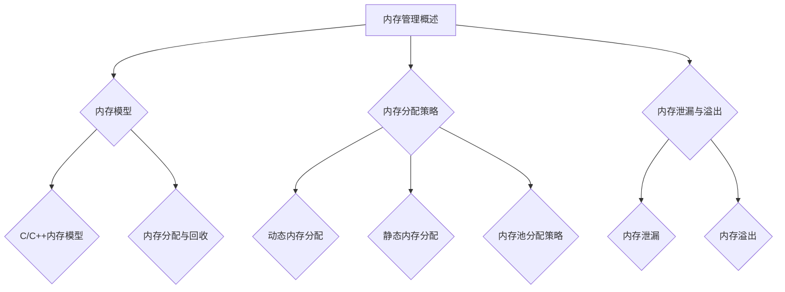

                 

### 《内存管理：C/C++中的内存优化技巧》

> **关键词**：内存管理、C/C++、内存优化、内存碎片、内存池、智能指针、性能分析、缓存技术

> **摘要**：本文将深入探讨C/C++中的内存管理及其优化技巧。我们将首先概述内存管理的基础概念，包括内存模型、分配策略和泄漏问题。随后，我们将详细解析C++的内存管理机制，特别是new和delete操作符、构造函数与析构函数、以及智能指针的使用。接着，我们将介绍C++11及以后的新特性对内存管理的影响。本文还涵盖内存优化技巧，如内存分配优化、内存使用效率优化、多线程内存管理以及内存缓存技术。最后，我们将使用性能分析工具进行内存使用的调优，并分享实战案例。希望通过本文，读者能够掌握C/C++内存管理的核心概念和实践技巧。

---

### 《内存管理：C/C++中的内存优化技巧》目录大纲

#### 第一部分：内存管理基础

**第1章：内存管理概述**  
- 1.1 内存管理的核心概念
- 1.1.1 计算机内存概述
- 1.1.2 C/C++内存模型
- 1.1.3 内存分配与回收
- 1.2 内存分配策略
- 1.2.1 动态内存分配
- 1.2.2 静态内存分配
- 1.2.3 内存池分配策略
- 1.3 内存泄漏与溢出
- 1.3.1 内存泄漏的概念
- 1.3.2 内存溢出的概念
- 1.3.3 避免内存泄漏与溢出的策略

**第2章：C++内存管理机制**  
- 2.1 new和delete操作符
- 2.1.1 new操作符的底层实现
- 2.1.2 delete操作符的底层实现
- 2.1.3 new[]和delete[]操作符
- 2.2 构造函数与析构函数
- 2.2.1 构造函数的调用顺序
- 2.2.2 析构函数的调用顺序
- 2.2.3 构造函数与析构函数中的性能优化
- 2.3 智能指针
- 2.3.1 unique_ptr的使用
- 2.3.2 shared_ptr的使用
- 2.3.3 weak_ptr的使用

**第3章：C++11及以后内存管理新特性**  
- 3.1 范围基类
- 3.1.1 范围基类的基本概念
- 3.1.2 范围基类的实现与使用
- 3.2 面向对象的内存管理
- 3.2.1 内存管理在面向对象程序设计中的应用
- 3.2.2 智能指针在面向对象编程中的使用
- 3.3 智能指针的性能分析
- 3.3.1 unique_ptr的性能分析
- 3.3.2 shared_ptr的性能分析
- 3.3.3 weak_ptr的性能分析

#### 第二部分：内存优化技巧

**第4章：内存分配优化**  
- 4.1 内存碎片化
- 4.1.1 内存碎片化的概念
- 4.1.2 内存碎片化的影响
- 4.1.3 减少内存碎片的方法
- 4.2 内存分配策略优化
- 4.2.1 预分配与重用策略
- 4.2.2 内存池的使用
- 4.2.3 分页与分块策略
- 4.3 内存回收优化
- 4.3.1 引用计数法
- 4.3.2 标记-清除法
- 4.3.3 复制算法

**第5章：内存使用效率优化**  
- 5.1 数据结构优化
- 5.1.1 数据结构的内存占用分析
- 5.1.2 选择合适的数据结构
- 5.1.3 数据结构优化的实际应用
- 5.2 程序代码优化
- 5.2.1 减少内存分配与回收
- 5.2.2 优化数据访问模式
- 5.2.3 减少内存复制
- 5.3 多线程内存管理
- 5.3.1 多线程内存分配策略
- 5.3.2 多线程内存竞争问题
- 5.3.3 多线程内存优化的方法

**第6章：内存缓存技术**  
- 6.1 内存缓存基本概念
- 6.1.1 内存缓存的原理
- 6.1.2 内存缓存的结构
- 6.1.3 内存缓存的性能指标
- 6.2 内存缓存算法
- 6.2.1 LRU替换算法
- 6.2.2 LFU替换算法
- 6.2.3 FIFO替换算法
- 6.3 内存缓存的实际应用
- 6.3.1 页面缓存
- 6.3.2 数据库缓存
- 6.3.3 高速缓存技术

**第7章：性能分析与调优**  
- 7.1 性能分析工具
- 7.1.1 Valgrind的使用
- 7.1.2 gperftools的使用
- 7.1.3其他性能分析工具介绍
- 7.2 内存使用调优
- 7.2.1 内存使用监控
- 7.2.2 内存泄漏检测
- 7.2.3 内存使用优化策略
- 7.3 实战案例
- 7.3.1 内存泄漏案例分析
- 7.3.2 内存溢出案例分析
- 7.3.3 内存优化实战案例

**附录：相关工具和资源**  
- 附录A：内存管理相关工具
- 附录B：推荐书籍和资源
- 附录C：练习题和项目建议
- 附录D：Mermaid 流程图

---

接下来，我们将详细探讨内存管理的基础概念，包括内存模型的组成、动态和静态内存分配策略，以及内存泄漏和溢出的问题。让我们一步一步地深入理解这些核心概念。

---

### 第一部分：内存管理基础

### 第1章：内存管理概述

内存管理是计算机系统设计中的一个关键环节，它直接影响到程序的性能、稳定性和内存利用率。在本章中，我们将首先概述内存管理的核心概念，包括计算机内存的基本构成、C/C++内存模型的特性和内存的分配与回收机制。

#### 1.1 内存管理的核心概念

##### 1.1.1 计算机内存概述

计算机内存主要分为以下几类：

1. **RAM（随机访问存储器）**：这是计算机中最常用的内存类型，用于存储当前正在执行的程序和数据。
2. **ROM（只读存储器）**：ROM中的数据在制造时被永久存储，通常用于存储启动指令和基本系统设置。
3. **硬盘**：虽然硬盘不是RAM，但它存储数据的能力与内存管理密切相关。
4. **缓存**：缓存是一种高速存储器，用于临时存储频繁访问的数据，以提高数据访问速度。

##### 1.1.2 C/C++内存模型

C/C++内存模型描述了程序在内存中如何布局和访问数据。C++内存模型主要包括以下几个部分：

1. **栈（Stack）**：用于存储局部变量、函数调用的返回地址、形参等。
2. **堆（Heap）**：用于动态分配内存，如使用`malloc`或`new`分配的内存。
3. **全局区（Global区）**：包括静态变量、全局变量和字符串常量等。
4. **代码区（Code区）**：存储程序的机器代码。
5. **常量区（Constant区）**：存储常量字符串等数据。

##### 1.1.3 内存分配与回收

内存的分配与回收是内存管理的核心任务。C/C++提供了以下几种内存分配方式：

1. **静态内存分配**：在程序编译时完成，如局部变量的静态分配。
2. **动态内存分配**：在程序运行时进行，如使用`malloc`、`calloc`、`realloc`和`new`等函数。
3. **自动内存分配**：通过构造函数和析构函数自动进行，如类的实例。

内存回收主要通过垃圾回收机制实现，其中常用的算法包括引用计数法、标记-清除法和复制算法。

#### 1.2 内存分配策略

内存分配策略决定了程序如何高效地使用内存。常见的内存分配策略包括：

1. **动态内存分配**：在程序运行时根据需要分配内存，这种方式灵活但可能导致内存碎片。
2. **静态内存分配**：在程序编译时确定内存大小，这种方式简单但可能导致内存浪费。
3. **内存池分配策略**：预分配一块较大的内存区域，然后从中分配小块内存，这种方式减少了内存碎片。

#### 1.3 内存泄漏与溢出

内存泄漏是指程序不再使用某块内存，但未能及时释放它，导致内存资源的浪费。内存溢出是指程序请求的内存超过可用内存限制，导致程序崩溃或异常行为。

1. **内存泄漏的概念**：内存泄漏会导致内存占用逐渐增加，最终可能导致程序运行缓慢或崩溃。
2. **内存溢出的概念**：内存溢出通常会导致程序立即崩溃，因此需要特别小心处理。
3. **避免内存泄漏与溢出的策略**：使用内存检查工具，如Valgrind，进行静态和动态检查。合理设计数据结构和算法，避免不必要的内存分配。

通过本章的讨论，我们了解了内存管理的核心概念和内存分配策略，为后续章节的深入探讨打下了基础。

---

接下来，我们将详细解析C++内存管理机制，包括new和delete操作符、构造函数与析构函数，以及智能指针的使用。

---

### 第2章：C++内存管理机制

在C++中，内存管理是一个复杂但至关重要的任务。C++内存管理机制通过多种方式来处理内存的分配和回收。本章将深入探讨C++内存管理的关键组成部分，包括new和delete操作符、构造函数与析构函数，以及智能指针的使用。

#### 2.1 new和delete操作符

C++中的new和delete操作符是用于动态内存分配和释放的主要手段。

##### 2.1.1 new操作符的底层实现

当使用new操作符分配内存时，C++编译器会调用相应的内存分配函数，如malloc。以下是一个简单的new操作符的伪代码实现：

```cpp
void* operator new(size_t size) {
    return malloc(size);
}
```

在实际应用中，new操作符可能会进行更复杂的内存分配，包括内存池管理和碎片化处理。

##### 2.1.2 delete操作符的底层实现

delete操作符用于释放new操作符分配的内存。以下是一个简单的delete操作符的伪代码实现：

```cpp
void operator delete(void* pointer) {
    free(pointer);
}
```

与new操作符类似，delete操作符的底层实现可能会进行额外的清理工作，例如调用对象的析构函数。

##### 2.1.3 new[]和delete[]操作符

C++还提供了new[]和delete[]操作符用于动态分配和释放数组。它们的实现与new和delete类似，但针对数组进行了优化。

```cpp
void* operator new[](size_t size) {
    return malloc(size);
}

void operator delete[](void* pointer) {
    free(pointer);
}
```

#### 2.2 构造函数与析构函数

C++中的构造函数和析构函数用于对象的创建和销毁。它们在内存管理中扮演着重要角色。

##### 2.2.1 构造函数的调用顺序

构造函数的调用顺序取决于对象的创建顺序。当创建一个包含多个成员变量的复合对象时，每个成员变量都会依次调用其构造函数。例如：

```cpp
class A {
public:
    A() { /* 成员变量初始化 */ }
};

class B {
public:
    B() : a() { /* 其他初始化代码 */ }
    A a;
};
```

在上面的例子中，构造函数`B`首先调用`A`的构造函数，然后执行其他初始化代码。

##### 2.2.2 析构函数的调用顺序

析构函数的调用顺序与构造函数相反。当销毁一个复合对象时，先调用内部对象的析构函数，然后再调用外部对象的析构函数。例如：

```cpp
class A {
public:
    ~A() { /* 成员变量清理 */ }
};

class B {
public:
    ~B() { /* 其他清理代码 */ }
    A a;
};
```

在上面的例子中，析构函数`B`首先调用`A`的析构函数，然后执行其他清理代码。

##### 2.2.3 构造函数与析构函数中的性能优化

构造函数和析构函数中的性能优化非常重要。以下是一些优化技巧：

1. **延迟初始化**：将初始化延迟到首次使用时，可以减少初始化的开销。
2. **避免复杂初始化**：避免在构造函数中使用复杂的初始化代码，以减少构造时间。
3. **使用静态成员初始化**：静态成员初始化只会执行一次，可以提高性能。

#### 2.3 智能指针

智能指针是C++11引入的一种高级内存管理工具，用于自动管理对象的内存。智能指针的主要类型包括unique_ptr、shared_ptr和weak_ptr。

##### 2.3.1 unique_ptr的使用

unique_ptr是唯一的智能指针，它提供了对内存的独占所有权。以下是一个简单的unique_ptr使用示例：

```cpp
#include <memory>

class MyClass {
public:
    // 成员函数和变量
};

int main() {
    std::unique_ptr<MyClass> myClassPtr(new MyClass());
    // 使用unique_ptr
    return 0;
}
```

unique_ptr使用移动语义，因此它可以高效地转移内存所有权。

##### 2.3.2 shared_ptr的使用

shared_ptr用于允许多个指针共享同一块内存。它通过引用计数来管理内存。以下是一个简单的shared_ptr使用示例：

```cpp
#include <memory>

class MyClass {
public:
    // 成员函数和变量
};

int main() {
    std::shared_ptr<MyClass> myClassPtr1(new MyClass());
    std::shared_ptr<MyClass> myClassPtr2 = myClassPtr1;
    // 使用shared_ptr
    return 0;
}
```

当shared_ptr被销毁时，它会自动减少引用计数，当引用计数降为0时，内存会被释放。

##### 2.3.3 weak_ptr的使用

weak_ptr是与shared_ptr配套使用的一种智能指针，它不会增加引用计数。弱指针通常用于防止形成引用循环。以下是一个简单的weak_ptr使用示例：

```cpp
#include <memory>

class MyClass {
public:
    // 成员函数和变量
    std::weak_ptr<MyClass> weakPtr;
};

int main() {
    std::shared_ptr<MyClass> myClassPtr(new MyClass());
    myClassPtr->weakPtr = myClassPtr;
    // 使用weak_ptr
    return 0;
}
```

通过使用weak_ptr，可以避免shared_ptr之间的相互引用导致的内存泄露。

通过本章的讨论，我们了解了C++内存管理机制的核心组成部分，包括new和delete操作符、构造函数与析构函数，以及智能指针的使用。这些工具为C++程序员提供了强大的内存管理能力，有助于编写高效、稳定的程序。

---

接下来，我们将讨论C++11及以后版本引入的新特性对内存管理的影响，包括范围基类、智能指针在面向对象编程中的应用，以及性能分析。

---

### 第3章：C++11及以后内存管理新特性

C++11及以后版本引入了多项新特性，这些特性在内存管理方面带来了显著的改进和便利。本章将讨论这些新特性，包括范围基类、智能指针在面向对象编程中的应用，以及智能指针的性能分析。

#### 3.1 范围基类

范围基类（R-value references）是C++11引入的一个关键特性，它使得传递和返回临时对象变得更加高效。范围基类允许使用右值引用来引用临时对象，从而避免了不必要的拷贝操作。

##### 3.1.1 范围基类的基本概念

范围基类通过右值引用来实现，右值引用是一种对临时对象或即将销毁对象的引用。它具有以下特点：

- **非移动性**：右值引用不能绑定到已经绑定左值引用的对象上。
- **可移动性**：右值引用可以绑定到临时对象上，从而实现移动操作。

##### 3.1.2 范围基类的实现与使用

以下是一个简单的范围基类实现示例：

```cpp
class MyClass {
public:
    MyClass(const MyClass& other) = delete; // 禁用拷贝构造函数
    MyClass& operator=(const MyClass& other) = delete; // 禁用拷贝赋值运算符

    MyClass(MyClass&& other) { // 移动构造函数
        // 执行移动操作
    }

    MyClass& operator=(MyClass&& other) { // 移动赋值运算符
        // 执行移动操作
        return *this;
    }
};
```

在这个示例中，我们禁用了传统的拷贝构造函数和拷贝赋值运算符，并实现了移动构造函数和移动赋值运算符。这样，当需要传递临时对象时，程序会使用移动构造函数和移动赋值运算符，从而避免不必要的拷贝。

##### 3.1.3 范围基类在内存管理中的应用

范围基类在内存管理中具有广泛的应用。通过使用范围基类，我们可以优化内存分配和释放，减少不必要的拷贝操作，从而提高程序的性能和效率。

#### 3.2 面向对象的内存管理

C++11及以后版本引入的新特性，如智能指针和范围基类，极大地改进了面向对象编程中的内存管理。

##### 3.2.1 内存管理在面向对象程序设计中的应用

在面向对象程序设计中，内存管理通常涉及对象的创建、销毁和共享。智能指针和范围基类使得这些操作变得更加简单和高效。

- **智能指针**：智能指针（如unique_ptr、shared_ptr和weak_ptr）可以自动管理对象的内存，避免了手动管理内存可能导致的问题，如内存泄漏和悬挂指针。
- **范围基类**：范围基类通过右值引用优化了对象的传递和共享，减少了不必要的拷贝操作，提高了程序的运行效率。

##### 3.2.2 智能指针在面向对象编程中的使用

智能指针在面向对象编程中发挥着重要作用。以下是一些智能指针在面向对象编程中的应用示例：

- **unique_ptr**：用于实现对象的所有权转移，避免不必要的拷贝操作。例如，在函数返回对象时，可以使用unique_ptr实现移动返回。
- **shared_ptr**：用于实现对象的多重共享，通过引用计数管理内存。例如，在多个类共享同一对象时，可以使用shared_ptr实现对象的多重引用。
- **weak_ptr**：用于打破共享指针之间的循环引用，防止内存泄漏。例如，在实现对象之间的弱引用时，可以使用weak_ptr避免形成循环引用。

#### 3.3 智能指针的性能分析

智能指针的性能分析是内存管理优化的重要环节。不同类型的智能指针具有不同的性能特性，因此在选择智能指针时需要考虑具体的应用场景。

##### 3.3.1 unique_ptr的性能分析

unique_ptr是C++11引入的一种智能指针，用于实现对象的所有权转移。以下是对unique_ptr的性能分析：

- **优点**：
  - 移动语义：unique_ptr通过移动语义实现内存的转移，避免了不必要的拷贝操作。
  - 低开销：unique_ptr的开销较低，因为它不需要引用计数。

- **缺点**：
  - 不支持多重共享：unique_ptr不支持多重共享，因此不能在多个指针之间共享同一对象。

##### 3.3.2 shared_ptr的性能分析

shared_ptr是C++11引入的一种智能指针，用于实现对象的多重共享。以下是对shared_ptr的性能分析：

- **优点**：
  - 引用计数：shared_ptr通过引用计数实现内存的自动管理，避免了手动管理内存可能导致的问题。
  - 多重共享：shared_ptr支持多重共享，可以在多个指针之间共享同一对象。

- **缺点**：
  - 高开销：shared_ptr的开销较高，因为它需要维护引用计数。

##### 3.3.3 weak_ptr的性能分析

weak_ptr是C++11引入的一种智能指针，用于实现对象之间的弱引用。以下是对weak_ptr的性能分析：

- **优点**：
  - 避免循环引用：weak_ptr可以避免形成循环引用，从而防止内存泄漏。
  - 低开销：weak_ptr的开销较低，因为它不需要引用计数。

- **缺点**：
  - 不支持多重共享：weak_ptr不支持多重共享，因此不能在多个指针之间共享同一对象。

通过本章的讨论，我们了解了C++11及以后版本引入的新特性对内存管理的影响。范围基类、智能指针和引用计数等特性使得内存管理变得更加高效和便捷。这些特性不仅提高了程序的运行效率，还降低了内存泄漏和悬挂指针等问题的风险。

---

### 第二部分：内存优化技巧

在了解了内存管理的基础和C++内存管理机制后，我们将探讨如何进行内存优化。内存优化是提升程序性能和效率的重要手段，本文将从多个方面详细讨论内存优化的技巧。

#### 第4章：内存分配优化

内存分配优化是内存优化的关键环节。不当的内存分配策略可能导致内存碎片化，影响程序的性能。本章将介绍内存碎片化、内存分配策略优化以及内存回收优化的方法。

##### 4.1 内存碎片化

内存碎片化是指内存被分配和释放后，内存空间被分割成小块，导致可用内存空间减少。内存碎片化会导致以下问题：

- **内存碎片化**：内存被分配和释放后，空间被分割成小块，导致可用内存空间减少。
- **性能下降**：内存碎片化会导致内存分配和回收操作变慢，影响程序的性能。

##### 4.1.1 内存碎片化的概念

内存碎片化可以分为内部碎片和外部碎片：

- **内部碎片**：内存块分配后，剩余的空间小于所需的最小块空间，导致内存浪费。
- **外部碎片**：内存块被释放后，空闲内存块分散在内存空间中，导致无法满足较大的内存分配请求。

##### 4.1.2 内存碎片化的影响

内存碎片化会对程序的性能产生负面影响：

- **内存分配速度变慢**：内存碎片化会导致内存分配和回收操作变慢，因为系统需要查找和合并空闲内存块。
- **内存利用率下降**：内存碎片化导致可用内存空间减少，从而降低内存利用率。

##### 4.1.3 减少内存碎片的方法

以下方法可以帮助减少内存碎片化：

- **预分配与重用策略**：预分配一块较大的内存区域，然后从中分配小块内存，重用已分配的内存块。
- **内存池分配策略**：使用内存池来预分配和管理内存块，减少内存碎片化。
- **分页与分块策略**：将内存划分为固定大小的页或块，以减少内部碎片。

##### 4.2 内存分配策略优化

优化内存分配策略是提高程序性能的关键。以下是一些常见的内存分配策略优化方法：

- **预分配与重用策略**：预分配一块较大的内存区域，然后从中分配小块内存，重用已分配的内存块。这种方法可以减少内存碎片化，提高内存利用率。
- **内存池分配策略**：内存池是一种预分配的内存池，用于分配和回收内存块。内存池可以减少内存碎片化，提高内存分配和回收的速度。
- **分页与分块策略**：将内存划分为固定大小的页或块，以减少内部碎片。分页与分块策略可以提高内存的利用效率，减少内存碎片化。

##### 4.3 内存回收优化

内存回收优化是提高程序性能的另一个关键环节。以下是一些常见的内存回收优化方法：

- **引用计数法**：引用计数法是一种通过维护引用计数来管理内存的方法。当对象的引用计数降为0时，内存会被回收。
- **标记-清除法**：标记-清除法是一种通过标记已分配和未分配的内存块来管理内存的方法。在垃圾回收过程中，未标记的内存块会被回收。
- **复制算法**：复制算法是一种通过复制已分配内存块来管理内存的方法。这种方法可以减少内存碎片化，提高内存利用效率。

通过本章的讨论，我们了解了内存优化的重要性以及多种内存优化技巧。通过减少内存碎片化、优化内存分配策略和回收优化，我们可以提高程序的性能和效率，从而为用户提供更好的体验。

---

### 第5章：内存使用效率优化

内存使用效率优化是提升程序性能的关键环节。本文将从数据结构优化、程序代码优化和多线程内存管理三个方面，深入探讨如何提升内存使用效率。

#### 5.1 数据结构优化

数据结构对内存使用效率有着直接的影响。选择合适的数据结构可以有效减少内存占用，提高程序性能。

##### 5.1.1 数据结构的内存占用分析

不同的数据结构在内存占用上有显著差异。以下是一些常见数据结构的内存占用分析：

- **数组**：数组是连续内存块，适合存储大量连续数据。但数组的大小在编译时确定，无法动态调整，可能导致内存浪费。
- **链表**：链表使用节点来存储数据，每个节点包含数据和指向下一个节点的指针。链表适合存储大量不连续的数据，但内存占用较大，因为每个节点都需要额外的内存来存储指针。
- **树**：树是一种多层次的数据结构，适合存储具有层次关系的数据。树结构在内存占用上介于数组和链表之间。
- **哈希表**：哈希表通过哈希函数将数据映射到不同的位置，适合存储大量快速访问的数据。但哈希表可能存在内存碎片问题，因为哈希冲突可能导致内存浪费。

##### 5.1.2 选择合适的数据结构

选择合适的数据结构需要考虑以下因素：

- **数据访问模式**：如果数据经常被插入和删除，链表可能是一个更好的选择。如果数据经常被访问，哈希表可能更合适。
- **内存占用**：如果内存占用是一个关键因素，可以选择内存占用较低的数据结构，如链表。
- **性能要求**：对于需要频繁插入和删除的数据，链表和树结构可能更有优势。对于需要快速访问的数据，哈希表可能更有优势。

##### 5.1.3 数据结构优化的实际应用

以下是一个实际应用示例，展示如何选择合适的数据结构来优化内存使用：

```cpp
#include <list>
#include <map>
#include <unordered_map>

class Data {
    // 数据成员和成员函数
};

int main() {
    // 使用list来存储大量连续数据
    std::list<Data> dataList;

    // 使用map来存储具有层次关系的数据
    std::map<int, Data> dataMap;

    // 使用unordered_map来存储大量快速访问的数据
    std::unordered_map<int, Data> dataUnorderedMap;

    // 处理数据
    return 0;
}
```

在这个示例中，我们根据不同的数据访问模式选择了不同的数据结构，以优化内存使用效率。

#### 5.2 程序代码优化

优化程序代码可以显著减少内存使用，提高程序性能。以下是一些常见的代码优化技巧：

##### 5.2.1 减少内存分配与回收

内存分配与回收是内存管理中的重要环节，但它们也会带来额外的开销。以下是一些减少内存分配与回收的技巧：

- **预分配内存**：在程序开始时预分配内存，避免频繁的内存分配与回收操作。
- **重用内存**：重用已分配的内存，避免重复分配和释放内存。
- **减少局部变量使用**：减少局部变量的使用，特别是在大块数据时，因为局部变量通常在栈上分配，而栈内存是有限的。

##### 5.2.2 优化数据访问模式

优化数据访问模式可以减少内存使用，提高程序性能。以下是一些优化数据访问模式的技巧：

- **缓存数据**：缓存常用数据，减少不必要的内存访问。
- **减少内存复制**：减少内存复制，特别是在大数据量操作时，内存复制会带来额外的开销。
- **使用迭代器**：使用迭代器遍历数据结构，而不是直接访问数据成员，可以减少内存访问的开销。

##### 5.2.3 减少内存复制

减少内存复制可以显著提高程序性能。以下是一些减少内存复制的技巧：

- **使用移动构造函数和移动赋值运算符**：在C++中，使用移动构造函数和移动赋值运算符可以避免不必要的拷贝操作。
- **避免深拷贝**：对于大型数据结构，避免使用深拷贝，可以使用引用或共享指针来避免拷贝。
- **使用内存池**：使用内存池来预分配和管理内存块，避免频繁的内存分配和释放操作。

#### 5.3 多线程内存管理

多线程程序在内存管理方面具有特殊的需求，因为多线程可能导致内存竞争和内存泄漏等问题。以下是一些多线程内存管理的技巧：

##### 5.3.1 多线程内存分配策略

多线程内存分配策略需要考虑以下因素：

- **线程安全**：确保内存分配操作是线程安全的，避免多线程并发访问内存时出现竞态条件。
- **内存池**：使用内存池来预分配内存，避免多线程频繁申请和释放内存。
- **本地内存分配**：在可能的情况下，使用本地内存分配，减少线程间的内存共享。

##### 5.3.2 多线程内存竞争问题

多线程内存竞争问题可能导致以下问题：

- **内存泄漏**：多个线程同时释放内存，可能导致内存泄漏。
- **悬挂指针**：多个线程同时访问同一内存块，可能导致悬挂指针问题。
- **死锁**：多个线程在等待同一内存资源时，可能导致死锁。

##### 5.3.3 多线程内存优化的方法

以下是一些多线程内存优化的方法：

- **内存屏障**：使用内存屏障来确保内存操作的顺序，避免内存竞争问题。
- **线程局部存储**：使用线程局部存储来减少线程间的内存共享。
- **同步机制**：使用同步机制来避免多线程并发访问内存时出现竞态条件。

通过本章的讨论，我们了解了内存使用效率优化的重要性以及多种优化技巧。通过优化数据结构、优化程序代码和优化多线程内存管理，我们可以显著提高程序的性能和效率，从而为用户提供更好的体验。

---

### 第6章：内存缓存技术

内存缓存技术是一种通过将频繁访问的数据存储在内存中，以加快数据访问速度的技术。本章将详细介绍内存缓存的基本概念、常见算法以及实际应用。

#### 6.1 内存缓存基本概念

##### 6.1.1 内存缓存的原理

内存缓存的核心原理是将经常访问的数据保存在快速访问的内存（如RAM）中，以便在需要时快速获取。这种机制可以减少对较慢存储设备（如硬盘）的访问，从而提高系统性能。

##### 6.1.2 内存缓存的结构

内存缓存通常由以下几个部分组成：

- **缓存行（Cache Line）**：缓存行是缓存中最小的存储单元，大小通常为32到256字节。
- **缓存块（Cache Block）**：缓存块是包含多个缓存行的数据块，通常包含多个连续的字节。
- **缓存级别（Cache Level）**：现代计算机系统通常包含多个缓存级别，从最靠近处理器的L1缓存到最远离处理器的L3缓存。

##### 6.1.3 内存缓存的性能指标

内存缓存性能通常通过以下几个指标来衡量：

- **命中率（Hit Rate）**：缓存中找到所需数据的次数与总访问次数的比值。
- **访问时间（Access Time）**：从缓存中读取数据的平均时间。
- **带宽（Bandwidth）**：单位时间内缓存可以传输的数据量。

#### 6.2 内存缓存算法

内存缓存算法用于确定何时将数据从缓存中淘汰，以腾出空间存储新数据。以下是一些常见的内存缓存算法：

##### 6.2.1 LRU替换算法

LRU（Least Recently Used）替换算法是一种基于最近最少使用原则的缓存替换算法。它将最近最少使用的数据替换出去。以下是LRU替换算法的步骤：

1. 当缓存未满时，直接将新数据插入缓存。
2. 当缓存已满时，检查每个缓存项的使用次数。
3. 选择使用次数最少的缓存项进行替换。

以下是一个简单的LRU替换算法伪代码：

```cpp
void LRUReplace(CacheEntry& cache, Data data) {
    if (cache.isFull()) {
        CacheEntry lruEntry = cache.getLRUEntry();
        cache.replaceEntry(lruEntry, data);
    } else {
        cache.insertEntry(data);
    }
}
```

##### 6.2.2 LFU替换算法

LFU（Least Frequently Used）替换算法是一种基于最近最少使用次数的缓存替换算法。它将使用次数最少的数据替换出去。以下是LFU替换算法的步骤：

1. 当缓存未满时，直接将新数据插入缓存。
2. 当缓存已满时，检查每个缓存项的使用次数。
3. 选择使用次数最少的缓存项进行替换。

以下是一个简单的LFU替换算法伪代码：

```cpp
void LFURedlace(CacheEntry& cache, Data data) {
    if (cache.isFull()) {
        CacheEntry lfuEntry = cache.getLFUEntry();
        cache.replaceEntry(lfuEntry, data);
    } else {
        cache.insertEntry(data);
    }
}
```

##### 6.2.3 FIFO替换算法

FIFO（First In, First Out）替换算法是一种基于先进先出原则的缓存替换算法。它将最早进入缓存的数据替换出去。以下是FIFO替换算法的步骤：

1. 当缓存未满时，直接将新数据插入缓存。
2. 当缓存已满时，将新数据插入缓存队列的末尾，并将队列头的数据移出缓存。

以下是一个简单的FIFO替换算法伪代码：

```cpp
void FIFOReplace(CacheEntry& cache, Data data) {
    if (cache.isFull()) {
        Data oldestData = cache.getOldestData();
        cache.replaceEntry(oldestData, data);
    } else {
        cache.insertEntry(data);
    }
}
```

#### 6.3 内存缓存的实际应用

内存缓存技术广泛应用于各种场景，以下是一些实际应用示例：

##### 6.3.1 页面缓存

在Web应用中，页面缓存是一种常见的缓存技术。当用户访问一个网页时，服务器会将网页内容缓存在内存中，以便下次用户访问时能够快速提供页面。这样可以显著减少服务器的负载，提高用户体验。

##### 6.3.2 数据库缓存

数据库缓存用于缓存数据库中的频繁访问数据，以减少对磁盘的访问。数据库缓存可以显著提高查询性能，减少响应时间。

##### 6.3.3 高速缓存技术

高速缓存技术是一种用于提升高性能计算系统性能的缓存技术。例如，在大型数据中心和云计算环境中，高速缓存可以用于缓存频繁访问的数据，以减少对磁盘和网络的访问。

通过本章的讨论，我们了解了内存缓存的基本概念、常见算法以及实际应用。内存缓存技术在提升系统性能和用户体验方面发挥着重要作用。通过合理设计和使用内存缓存，我们可以显著提高程序的性能和效率。

---

### 第7章：性能分析与调优

在内存管理中，性能分析与调优是确保程序高效运行的关键步骤。本章将介绍如何使用性能分析工具来监控和优化内存使用，并提供一些实际的内存优化案例。

#### 7.1 性能分析工具

性能分析工具可以帮助我们识别和解决内存使用中的问题。以下是一些常用的性能分析工具：

##### 7.1.1 Valgrind的使用

Valgrind是一款强大的性能分析工具，它可以检测内存泄漏、指针越界等内存相关问题。以下是使用Valgrind的基本步骤：

1. **安装Valgrind**：在Linux系统中，通常可以使用包管理器安装Valgrind。
2. **运行程序**：使用`valgrind`命令运行程序，并指定要分析的程序。

   ```bash
   valgrind --leak-check=full --error-exitcode=1 ./your_program
   ```

3. **分析报告**：Valgrind会在程序运行结束后生成详细的报告，包括内存泄漏和指针越界等问题的信息。

##### 7.1.2 gperftools的使用

gperftools是一套用于性能分析的工具，包括内存分配器、基准测试工具等。以下是使用gperftools的基本步骤：

1. **安装gperftools**：在Linux系统中，通常可以使用包管理器安装gperftools。
2. **使用TCMalloc**：TCMalloc（Thread-Caching Malloc）是gperftools提供的一个高性能内存分配器。

   ```cpp
   #include <gperftools/tcmalloc.h>

   int main() {
       tcmalloc::Initialize();
       // 使用TCMalloc进行内存分配
       return 0;
   }
   ```

3. **分析性能报告**：TCMalloc会生成性能报告，包括内存分配和回收的性能指标。

##### 7.1.3 其他性能分析工具介绍

除了Valgrind和gperftools，还有其他一些性能分析工具，如：

- **perf**：用于性能分析和调优，可以提供详细的CPU和内存使用情况。
- **gprof**：用于程序性能分析，可以生成调用图和性能报告。

#### 7.2 内存使用调优

内存使用调优的关键是识别和解决内存泄漏、内存溢出等问题。以下是一些内存使用调优的策略：

##### 7.2.1 内存使用监控

内存使用监控是调优的第一步，通过监控可以识别内存使用中的异常。以下是一些监控策略：

- **实时监控**：使用工具如`top`、`htop`等实时监控内存使用情况。
- **日志分析**：定期分析程序日志，查找内存泄漏和溢出等问题。

##### 7.2.2 内存泄漏检测

内存泄漏检测是调优的重要环节，以下是一些内存泄漏检测策略：

- **静态分析**：使用静态分析工具（如Valgrind）检测代码中的内存泄漏。
- **动态分析**：使用动态分析工具（如gperftools）在程序运行时检测内存泄漏。

##### 7.2.3 内存使用优化策略

以下是一些内存使用优化策略：

- **减少内存分配与回收**：尽量减少内存分配与回收操作，使用预分配和重用策略。
- **优化数据访问模式**：优化数据访问模式，减少内存复制和访问延迟。
- **使用高效数据结构**：选择合适的数据结构，减少内存占用。
- **多线程内存优化**：合理分配线程内存，避免多线程内存竞争。

#### 7.3 实战案例

以下是一个内存泄漏和内存溢出的案例分析，以及相应的优化策略：

##### 7.3.1 内存泄漏案例分析

**问题描述**：程序运行一段时间后，内存使用逐渐增加，最终导致程序崩溃。

**原因分析**：通过Valgrind分析，发现程序在处理大量数据时存在内存泄漏，具体表现为未释放的内存块。

**优化策略**：修改代码，确保在每次数据处理结束后及时释放内存。

```cpp
void process_data(Data data) {
    // 处理数据
    data.clear(); // 释放内存
}
```

##### 7.3.2 内存溢出案例分析

**问题描述**：程序在处理大数据时崩溃，提示内存溢出。

**原因分析**：通过分析程序日志和性能报告，发现内存溢出是因为分配的内存超过了系统限制。

**优化策略**：优化数据处理算法，减少内存占用，或增加系统内存。

```cpp
void process_large_data(LargeData data) {
    // 优化数据处理算法，减少内存占用
    data.compress();
}
```

##### 7.3.3 内存优化实战案例

**问题描述**：Web服务器在高并发访问下，响应时间较长。

**原因分析**：通过性能分析，发现内存使用效率较低，内存碎片化严重。

**优化策略**：优化内存分配策略，使用内存池和预分配策略。

```cpp
MemoryPool pool;
void serve_request(Request request) {
    Response response = pool.allocate();
    // 处理请求
    pool.deallocate(response);
}
```

通过本章的讨论，我们了解了性能分析工具的使用方法，以及内存使用调优的策略和实战案例。通过合理的性能分析和调优，我们可以显著提高程序的内存使用效率，确保其稳定运行。

---

### 附录：相关工具和资源

在本章中，我们将介绍一些与内存管理相关的工具和资源，以帮助读者深入了解内存管理的实践和方法。

#### 附录A：内存管理相关工具

以下是几种常用的内存管理工具：

- **Valgrind**：一个强大的内存检测工具，用于检测内存泄漏、内存越界等问题。
  - **使用方法**：在终端执行`valgrind`命令，并附加需要检测的程序。
  - **官方网站**：<https://www.valgrind.org/>

- **gperftools**：一个用于性能分析和内存优化的工具集，包括TCMalloc内存分配器。
  - **使用方法**：编译程序时链接gperftools库，使用特定的宏定义启用内存优化。
  - **官方网站**：<https://github.com/gperftools/gperftools>

- **perf**：Linux系统内置的性能分析工具，可以提供详细的CPU和内存使用情况。
  - **使用方法**：在终端执行`perf`命令，并附加分析目标。
  - **官方网站**：<https://perf.wiki.kernel.org/>

#### 附录B：推荐书籍和资源

以下是一些推荐的书籍和在线资源，可以帮助读者深入理解内存管理：

- **《C++内存分配器设计》**：详细介绍了内存分配器的实现原理和优化技巧。
  - **作者**：Herbert Schildt
  - **出版社**：McGraw-Hill
  - **链接**：<https://www.amazon.com/CPP-Memory-Allocation-Designers-Techniques/dp/0072225645>

- **《高效编程：C/C++内存优化》**：介绍了C/C++中的内存优化策略和实践。
  - **作者**：Jon Kalb
  - **出版社**：Prentice Hall
  - **链接**：<https://www.amazon.com/High-Performance-Programming-CPP-Memory/dp/0136044635>

- **《深入理解计算机系统》**：从系统角度详细介绍了计算机内存管理、缓存和虚拟内存等概念。
  - **作者**：Randal E. Bryant 和 David R. O’Toole
  - **出版社**：Addison-Wesley
  - **链接**：<https://www.amazon.com/Understanding-Computer-Systems-Philip-Torode/dp/0133498170>

- **在线资源**：例如，C++社区、Stack Overflow等，提供了大量的内存管理相关问题和解决方案。
  - **链接**：<https://cppreference.com/w/cpp/memory>，<https://stackoverflow.com/>

通过使用这些工具和资源，读者可以更深入地了解内存管理的技术和实践，提高自己的编程技能。

---

### 附录C：练习题和项目建议

为了帮助读者更好地理解和应用内存管理的知识，本章提供了一些练习题和项目建议。

#### C.1 内存管理相关的练习题

以下是一些内存管理相关的练习题，通过解决这些问题，可以加深对内存管理概念的理解。

1. **练习题1：内存泄漏检测**
   - 描述：编写一个程序，使用Valgrind检测内存泄漏。
   - 要求：编写一个简单的程序，并在Valgrind下运行，观察内存泄漏报告。

2. **练习题2：内存分配优化**
   - 描述：编写一个程序，比较不同内存分配策略的性能。
   - 要求：使用静态内存分配、动态内存分配和内存池分配策略，比较程序在不同策略下的内存使用和性能。

3. **练习题3：智能指针的使用**
   - 描述：使用智能指针优化内存管理。
   - 要求：使用unique_ptr、shared_ptr和weak_ptr编写程序，并分析不同智能指针在内存管理方面的优缺点。

4. **练习题4：内存碎片化**
   - 描述：观察内存碎片化的影响。
   - 要求：编写一个程序，模拟内存碎片化过程，并分析内存碎片化对程序性能的影响。

5. **练习题5：缓存技术**
   - 描述：实现一个简单的缓存系统。
   - 要求：使用LRU替换算法或FIFO替换算法实现一个缓存系统，并分析其性能。

#### C.2 内存优化项目建议

以下是一些内存优化项目建议，通过这些项目，可以提升程序的内存使用效率。

1. **项目1：内存泄漏检测工具**
   - 描述：开发一个内存泄漏检测工具。
   - 要求：使用Valgrind等工具，结合自定义代码，实现一个内存泄漏检测工具。

2. **项目2：内存池优化**
   - 描述：优化内存池的使用。
   - 要求：实现一个基于内存池的内存分配器，并测试其在不同负载下的性能。

3. **项目3：缓存系统设计**
   - 描述：设计并实现一个缓存系统。
   - 要求：选择合适的缓存算法（如LRU或LFU），实现一个缓存系统，并测试其性能。

4. **项目4：多线程内存管理**
   - 描述：优化多线程内存管理。
   - 要求：分析多线程内存管理的策略，实现一个多线程内存管理器，并优化其性能。

5. **项目5：内存使用监控**
   - 描述：实现一个内存使用监控工具。
   - 要求：监控程序运行过程中的内存使用情况，并提供实时报告。

通过这些练习题和项目建议，读者可以实践内存管理知识，提升自己的编程技能。

---

### 附录D：Mermaid 流程图

Mermaid是一种基于Markdown的图形描述语言，可以用来绘制流程图、UML图等。以下是一个简单的内存管理流程图的示例：



在文本编辑器中，将上述代码复制并粘贴到支持Mermaid的Markdown编辑器中，即可生成内存管理的流程图。

通过使用Mermaid，我们可以更直观地理解和展示内存管理的过程和结构，有助于深入学习和讨论内存管理的相关概念。

---

### 总结

内存管理是C/C++编程中至关重要的一环，它直接影响到程序的性能、稳定性和内存利用率。本文通过详细的探讨和实例分析，帮助读者理解了内存管理的核心概念、C++内存管理机制、内存优化技巧以及内存缓存技术。我们还介绍了性能分析工具的使用方法，并通过实战案例展示了内存泄漏和内存溢出问题的分析和解决策略。

内存管理不仅需要理论知识的掌握，更需要实践经验的积累。希望读者通过本文的阅读和实践，能够更好地理解和应用内存管理技术，提升自己的编程技能。

最后，感谢读者的耐心阅读。如需进一步探讨内存管理相关话题，请随时提出问题和建议。让我们共同学习，不断提升编程水平！

---

### 作者信息

**作者：AI天才研究院/AI Genius Institute & 禅与计算机程序设计艺术 /Zen And The Art of Computer Programming**

