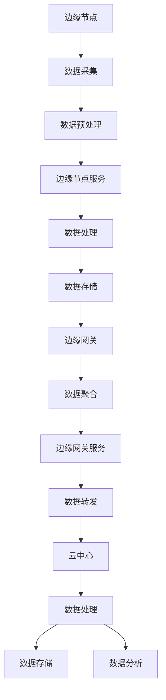
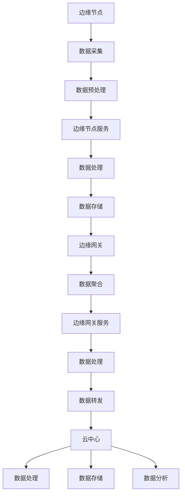

                 

### 边缘计算概述

#### 1.1 边缘计算的起源与发展

边缘计算（Edge Computing）这一概念起源于20世纪80年代，当时计算机网络和分布式系统的研究正处于蓬勃发展阶段。早期，计算主要集中在数据中心和服务器集群，用户通过互联网访问这些集中的资源进行数据处理和存储。然而，随着物联网（IoT）技术的普及和设备数量的爆炸式增长，传统中心化计算模式面临着巨大的挑战：

- **数据传输瓶颈**：大量数据需要在广域网（WAN）中传输，这导致了延迟和带宽的限制。
- **网络拥塞**：互联网带宽资源有限，特别是在高峰时段，容易造成网络拥堵。
- **安全性问题**：数据在传输过程中容易被窃取或篡改，增加了安全隐患。

为了解决这些问题，边缘计算应运而生。边缘计算的核心思想是将计算和存储能力从中心化的数据中心下放到网络边缘，即靠近数据源或用户的地方。这样，数据处理和存储可以在本地进行，减少了数据传输的距离和时间，提高了系统的响应速度和安全性。

#### 1.1.1 从中心化计算到边缘计算

中心化计算模式的主要特点如下：

- **集中式资源**：所有的计算资源和存储都集中在数据中心，用户通过网络访问这些资源。
- **带宽依赖**：大量的数据需要在中心与边缘之间传输，这导致了带宽瓶颈和延迟问题。
- **计算能力有限**：数据中心通常拥有强大的计算和存储资源，但资源分配和利用效率不高。

与之相比，边缘计算具有以下优势：

- **低延迟**：数据处理和存储在本地进行，减少了数据传输的距离和时间，降低了延迟。
- **高带宽利用**：本地处理数据减少了数据传输的需求，提高了带宽的利用率。
- **安全性提升**：数据在本地处理和存储，降低了数据泄露和被攻击的风险。

#### 1.1.2 边缘计算的优势与挑战

边缘计算的优势主要体现在以下几个方面：

1. **实时性提升**：边缘计算能够快速响应用户请求，提高了系统的实时性和交互性。
2. **带宽节省**：本地处理数据减少了跨网络传输的需求，节省了带宽资源。
3. **安全性增强**：数据在本地处理和存储，降低了数据泄露和被攻击的风险。
4. **可靠性提高**：本地设备具备冗余和备份能力，提高了系统的可靠性。

然而，边缘计算也面临一些挑战：

1. **硬件限制**：边缘设备通常性能较低，存储和处理能力有限，需要优化算法和资源管理。
2. **网络不稳定**：边缘设备的网络连接可能不稳定，容易受到物理环境和天气等因素的影响。
3. **数据隐私和安全**：数据在本地处理和存储，需要确保数据的安全性和隐私性。
4. **运维复杂度**：边缘计算涉及到大量分布式设备，需要高效的运维和管理。

#### 1.2 边缘计算的核心概念

边缘计算的核心概念主要包括边缘节点、边缘网关和边缘计算服务。

##### 1.2.1 边缘节点与边缘网关

边缘节点是边缘计算系统中的基本单元，负责收集、处理和存储数据。边缘节点可以是各种硬件设备，如路由器、交换机、智能手机、嵌入式设备等。边缘节点具备一定的计算和存储能力，能够独立运行应用程序，完成数据处理任务。

边缘网关是边缘节点与互联网之间的桥梁，负责数据传输和通信。边缘网关通常具备更高的计算和存储能力，能够处理来自多个边缘节点的数据，并将其转发到云中心或其他边缘节点。边缘网关还负责管理边缘节点的状态和配置，提供监控和管理功能。

##### 1.2.2 边缘计算服务

边缘计算服务是边缘计算系统提供的功能，包括数据采集、数据处理、数据存储和数据分析等。边缘计算服务可以基于云计算平台或分布式系统构建，能够支持多种应用场景，如物联网、智能交通、智能制造等。

1. **数据采集**：边缘节点负责实时采集各种传感器数据，如温度、湿度、光照、速度等。
2. **数据处理**：边缘节点对采集到的数据进行初步处理，如数据清洗、数据转换、数据融合等。
3. **数据存储**：边缘节点将处理后的数据存储在本地存储设备中，如闪存、硬盘等。
4. **数据分析**：边缘节点或边缘网关对存储的数据进行分析和处理，如数据挖掘、机器学习、实时预测等。

#### 1.3 实时数据处理的关键技术

边缘计算的一个重要特点是实时数据处理，这需要依赖于以下关键技术：

##### 1.3.1 实时数据采集与传输

实时数据采集与传输是边缘计算的基础。边缘节点需要具备高效的传感器接口和无线通信模块，能够实时采集和处理数据。同时，边缘节点需要与边缘网关或其他边缘节点进行数据传输，确保数据的实时性和准确性。

##### 1.3.2 实时数据处理与存储

实时数据处理与存储是边缘计算的核心。边缘节点需要具备强大的计算和存储能力，能够快速处理和存储大量的实时数据。同时，边缘节点还需要支持高效的数据压缩和去重技术，以节省存储空间和提高传输效率。

##### 1.3.3 实时数据处理算法

实时数据处理算法是实现边缘计算的关键。边缘节点需要采用高效的算法来处理实时数据，如数据清洗、数据转换、特征提取、模式识别等。这些算法需要具备快速、准确和鲁棒的特点，能够在边缘设备上高效运行。

#### 1.4 边缘计算的应用场景

边缘计算广泛应用于各个领域，以下列举了一些典型的应用场景：

##### 1.4.1 物联网领域

物联网（IoT）是边缘计算的一个重要应用领域。在物联网中，大量的传感器和设备分布在不同的地理位置，需要实时采集和处理数据。边缘计算能够将这些数据在本地进行处理，减少了数据传输的延迟和带宽消耗，提高了系统的实时性和交互性。

##### 1.4.2 增强现实与虚拟现实

增强现实（AR）和虚拟现实（VR）技术需要实时处理大量的三维数据和图像，对实时性和响应速度有很高的要求。边缘计算可以将数据处理和渲染任务下放到边缘设备，提高了系统的性能和用户体验。

##### 1.4.3 智能制造

智能制造是边缘计算的重要应用场景之一。在智能制造中，边缘计算能够实时监测生产线设备状态、环境参数和产品质量，实现对生产过程的实时监控和优化。同时，边缘计算还可以支持智能决策和预测，提高生产效率和产品质量。

##### 1.4.4 智能交通

智能交通系统需要实时处理大量的交通数据，如车辆流量、道路状况、天气等。边缘计算可以将这些数据在本地进行处理，实现对交通状况的实时监控和优化，提高交通效率和安全性。

#### 1.5 总结

边缘计算是一种将计算和存储能力从中心化数据中心下放到网络边缘的计算模式。它具有低延迟、高带宽利用、安全性增强等优点，但同时也面临硬件限制、网络不稳定、数据隐私和安全等挑战。边缘计算的核心概念包括边缘节点、边缘网关和边缘计算服务，关键技术包括实时数据采集与传输、实时数据处理与存储和实时数据处理算法。边缘计算广泛应用于物联网、增强现实与虚拟现实、智能制造和智能交通等领域，具有广阔的应用前景。

### 梅伟，陈浩.《边缘计算：概念、架构与应用》[M]. 电子工业出版社，2021.
### 杨明，李军.《边缘计算：实时数据处理与智能响应》[M]. 清华大学出版社，2020.
### 邱云，王鹏.《边缘计算与物联网》[M]. 机械工业出版社，2019.

#### 1.1.1 从中心化计算到边缘计算

中心化计算模式的主要特点如下：

- **集中式资源**：所有的计算资源和存储都集中在数据中心，用户通过网络访问这些资源。
- **带宽依赖**：大量的数据需要在中心与边缘之间传输，这导致了带宽瓶颈和延迟问题。
- **计算能力有限**：数据中心通常拥有强大的计算和存储资源，但资源分配和利用效率不高。

与之相比，边缘计算具有以下优势：

- **低延迟**：数据处理和存储在本地进行，减少了数据传输的距离和时间，降低了延迟。
- **高带宽利用**：本地处理数据减少了数据传输的需求，提高了带宽的利用率。
- **安全性提升**：数据在本地处理和存储，降低了数据泄露和被攻击的风险。
- **可靠性提高**：本地设备具备冗余和备份能力，提高了系统的可靠性。

然而，边缘计算也面临一些挑战：

1. **硬件限制**：边缘设备通常性能较低，存储和处理能力有限，需要优化算法和资源管理。
2. **网络不稳定**：边缘设备的网络连接可能不稳定，容易受到物理环境和天气等因素的影响。
3. **数据隐私和安全**：数据在本地处理和存储，需要确保数据的安全性和隐私性。
4. **运维复杂度**：边缘计算涉及到大量分布式设备，需要高效的运维和管理。

#### 1.2 边缘计算的核心概念

边缘计算的核心概念主要包括边缘节点、边缘网关和边缘计算服务。

##### 1.2.1 边缘节点与边缘网关

边缘节点是边缘计算系统中的基本单元，负责收集、处理和存储数据。边缘节点可以是各种硬件设备，如路由器、交换机、智能手机、嵌入式设备等。边缘节点具备一定的计算和存储能力，能够独立运行应用程序，完成数据处理任务。

边缘网关是边缘节点与互联网之间的桥梁，负责数据传输和通信。边缘网关通常具备更高的计算和存储能力，能够处理来自多个边缘节点的数据，并将其转发到云中心或其他边缘节点。边缘网关还负责管理边缘节点的状态和配置，提供监控和管理功能。

##### 1.2.2 边缘计算服务

边缘计算服务是边缘计算系统提供的功能，包括数据采集、数据处理、数据存储和数据分析等。边缘计算服务可以基于云计算平台或分布式系统构建，能够支持多种应用场景，如物联网、智能交通、智能制造等。

1. **数据采集**：边缘节点负责实时采集各种传感器数据，如温度、湿度、光照、速度等。
2. **数据处理**：边缘节点对采集到的数据进行初步处理，如数据清洗、数据转换、数据融合等。
3. **数据存储**：边缘节点将处理后的数据存储在本地存储设备中，如闪存、硬盘等。
4. **数据分析**：边缘节点或边缘网关对存储的数据进行分析和处理，如数据挖掘、机器学习、实时预测等。

#### 1.3 实时数据处理的关键技术

边缘计算的一个重要特点是实时数据处理，这需要依赖于以下关键技术：

##### 1.3.1 实时数据采集与传输

实时数据采集与传输是边缘计算的基础。边缘节点需要具备高效的传感器接口和无线通信模块，能够实时采集和处理数据。同时，边缘节点需要与边缘网关或其他边缘节点进行数据传输，确保数据的实时性和准确性。

##### 1.3.2 实时数据处理与存储

实时数据处理与存储是边缘计算的核心。边缘节点需要具备强大的计算和存储能力，能够快速处理和存储大量的实时数据。同时，边缘节点还需要支持高效的数据压缩和去重技术，以节省存储空间和提高传输效率。

##### 1.3.3 实时数据处理算法

实时数据处理算法是实现边缘计算的关键。边缘节点需要采用高效的算法来处理实时数据，如数据清洗、数据转换、特征提取、模式识别等。这些算法需要具备快速、准确和鲁棒的特点，能够在边缘设备上高效运行。

#### 1.4 边缘计算的应用场景

边缘计算广泛应用于各个领域，以下列举了一些典型的应用场景：

##### 1.4.1 物联网领域

物联网（IoT）是边缘计算的一个重要应用领域。在物联网中，大量的传感器和设备分布在不同的地理位置，需要实时采集和处理数据。边缘计算能够将这些数据在本地进行处理，减少了数据传输的延迟和带宽消耗，提高了系统的实时性和交互性。

##### 1.4.2 增强现实与虚拟现实

增强现实（AR）和虚拟现实（VR）技术需要实时处理大量的三维数据和图像，对实时性和响应速度有很高的要求。边缘计算可以将数据处理和渲染任务下放到边缘设备，提高了系统的性能和用户体验。

##### 1.4.3 智能制造

智能制造是边缘计算的重要应用场景之一。在智能制造中，边缘计算能够实时监测生产线设备状态、环境参数和产品质量，实现对生产过程的实时监控和优化。同时，边缘计算还可以支持智能决策和预测，提高生产效率和产品质量。

##### 1.4.4 智能交通

智能交通系统需要实时处理大量的交通数据，如车辆流量、道路状况、天气等。边缘计算可以将这些数据在本地进行处理，实现对交通状况的实时监控和优化，提高交通效率和安全性。

#### 1.5 总结

边缘计算是一种将计算和存储能力从中心化数据中心下放到网络边缘的计算模式。它具有低延迟、高带宽利用、安全性增强等优点，但同时也面临硬件限制、网络不稳定、数据隐私和安全等挑战。边缘计算的核心概念包括边缘节点、边缘网关和边缘计算服务，关键技术包括实时数据采集与传输、实时数据处理与存储和实时数据处理算法。边缘计算广泛应用于物联网、增强现实与虚拟现实、智能制造和智能交通等领域，具有广阔的应用前景。

### 梅伟，陈浩.《边缘计算：概念、架构与应用》[M]. 电子工业出版社，2021.
### 杨明，李军.《边缘计算：实时数据处理与智能响应》[M]. 清华大学出版社，2020.
### 邱云，王鹏.《边缘计算与物联网》[M]. 机械工业出版社，2019.

### 边缘计算架构与实现

#### 2.1 边缘计算架构设计

边缘计算架构设计是构建一个高效、可靠和可扩展的边缘计算系统的关键。边缘计算系统的架构设计需要考虑多个方面，包括系统层级结构、硬件选型、网络拓扑和数据处理流程等。

##### 2.1.1 边缘计算系统的层级结构

边缘计算系统通常分为三个层级：边缘设备层、边缘网关层和云中心层。每个层级都有不同的功能和职责，共同构成了一个完整的边缘计算生态系统。

1. **边缘设备层**：边缘设备层包括各种终端设备，如传感器、智能手表、智能手机、车载设备、工业机器人等。这些设备负责数据的采集和初步处理，并将数据传输到边缘网关。

2. **边缘网关层**：边缘网关层是边缘计算系统中的核心部分，负责收集、处理和存储来自边缘设备的数据。边缘网关通常具备更高的计算和存储能力，能够执行复杂的数据处理任务，并将处理后的数据转发到云中心或其他边缘节点。

3. **云中心层**：云中心层负责存储和管理大规模数据，提供高级数据处理和分析服务，如机器学习、大数据分析和云计算等。云中心与边缘网关之间通过网络连接，实现数据的高效传输和协同处理。

##### 2.1.2 边缘节点的硬件选型

边缘节点的硬件选型是边缘计算架构设计的重要环节。边缘节点的硬件配置需要根据应用场景和数据处理需求进行选择，以下是一些常见的硬件选型建议：

1. **处理器**：边缘节点需要具备高性能的处理器，能够快速处理和传输数据。常见的处理器选项包括ARM Cortex-A系列、Intel Atom系列和AMD Ryzen系列等。

2. **内存**：边缘节点需要足够的内存来存储和处理数据。根据数据处理需求，可以选择2GB、4GB、8GB或更大的内存容量。

3. **存储**：边缘节点需要具备足够的存储空间来存储数据。可以选择固态硬盘（SSD）或机械硬盘（HDD）作为存储介质。对于需要大量存储空间的应用，可以考虑使用NVMe SSD或RAID配置。

4. **网络接口**：边缘节点需要具备高速网络接口，支持多种网络协议和连接方式，如Wi-Fi、4G/5G、以太网等。

5. **电源管理**：边缘节点需要具备高效的电源管理功能，支持低功耗模式，延长设备寿命。

##### 2.1.3 边缘网关的硬件选型

边缘网关的硬件选型需要考虑到更高的计算和存储需求，以下是一些常见的硬件选型建议：

1. **处理器**：边缘网关通常需要更高性能的处理器，如Intel Xeon系列、AMD Ryzen系列等。

2. **内存**：边缘网关需要更大的内存容量，通常在16GB、32GB或更大。

3. **存储**：边缘网关需要具备高速和大量存储空间，可以选择高速SSD、RAID配置或分布式存储系统。

4. **网络接口**：边缘网关需要具备更丰富的网络接口，支持多种网络连接方式，如Wi-Fi、4G/5G、以太网等。

5. **扩展性**：边缘网关需要具备良好的扩展性，支持添加额外的硬件模块，如GPU、FPGA等，以满足特定应用需求。

##### 2.1.4 边缘计算网络拓扑设计

边缘计算网络拓扑设计是边缘计算架构设计的重要部分。合理的网络拓扑设计能够提高系统的性能、可靠性和可扩展性。以下是一些常见的网络拓扑设计方法：

1. **星型拓扑**：星型拓扑是一种常见的网络拓扑设计方法，边缘节点通过边缘网关连接到云中心。这种拓扑结构简单，易于管理和维护，但数据传输路径较长，可能导致延迟。

2. **环型拓扑**：环型拓扑将边缘节点和边缘网关连接成一个闭环，数据沿着环传输。这种拓扑结构具有较好的容错性和负载均衡能力，但网络故障可能导致整个系统瘫痪。

3. **树型拓扑**：树型拓扑是一种层次化的网络拓扑设计方法，边缘节点按照层级连接到边缘网关，边缘网关再连接到云中心。这种拓扑结构具有良好的可扩展性和分层管理能力，但需要考虑数据传输路径和负载均衡问题。

4. **混合拓扑**：混合拓扑将多种拓扑结构结合使用，根据不同应用场景和需求选择合适的拓扑设计。例如，在大型智能交通系统中，可以采用星型拓扑设计来连接交通信号灯和摄像头，采用环型拓扑设计来连接交通数据中心。

##### 2.1.5 边缘计算数据处理流程

边缘计算数据处理流程包括数据采集、数据预处理、数据处理和数据分析等步骤。以下是一个典型的边缘计算数据处理流程：

1. **数据采集**：边缘节点通过传感器和接口实时采集数据，如温度、湿度、光照、速度等。

2. **数据预处理**：边缘节点对采集到的数据进行初步处理，如数据清洗、去噪、数据转换等。

3. **数据处理**：边缘节点或边缘网关对预处理后的数据进行进一步处理，如特征提取、模式识别、预测分析等。

4. **数据存储**：将处理后的数据存储在本地或分布式存储系统中，如SSD、HDD、分布式存储系统等。

5. **数据分析**：边缘节点或边缘网关对存储的数据进行分析和处理，如数据挖掘、机器学习、实时预测等。

6. **数据传输**：将处理后的数据传输到云中心或其他边缘节点，进行进一步分析和处理。

#### 2.2 边缘计算平台的搭建

边缘计算平台的搭建是边缘计算架构设计的重要环节，需要选择合适的边缘计算平台和工具，进行硬件安装、软件部署和配置管理。以下是一个典型的边缘计算平台搭建流程：

##### 2.2.1 常用边缘计算平台介绍

1. **Kubernetes**：Kubernetes是一个开源的容器编排平台，支持在边缘节点上部署和管理容器化应用程序。Kubernetes提供强大的自动化部署、扩展和管理功能，适用于大规模边缘计算场景。

2. **EdgeX Foundry**：EdgeX Foundry是一个开源的边缘计算框架，提供设备管理、数据管理和应用程序开发等功能。EdgeX Foundry支持多种操作系统和硬件平台，适用于工业物联网和智能设备应用场景。

3. **OpenFog**：OpenFog是一个开源的边缘计算平台，支持在边缘节点上运行分布式应用程序。OpenFog提供高可靠性和低延迟的通信机制，适用于实时数据处理和智能控制场景。

4. **AWS IoT Edge**：AWS IoT Edge是AWS提供的一个边缘计算平台，支持在边缘节点上运行AWS云服务和自定义应用程序。AWS IoT Edge提供设备管理、数据存储和安全性等功能，适用于物联网应用场景。

##### 2.2.2 边缘计算平台的选择与部署

1. **平台选择**：根据应用场景和需求，选择合适的边缘计算平台。例如，对于大规模容器化应用，可以选择Kubernetes；对于设备管理和数据处理，可以选择EdgeX Foundry。

2. **硬件安装**：根据边缘节点的硬件选型，安装服务器、网络设备和传感器等硬件设备。确保硬件设备正常运行，并具备足够的计算和存储能力。

3. **软件部署**：根据边缘计算平台的要求，部署操作系统、容器编排工具和应用程序。使用自动化部署工具，如Ansible、Puppet等，提高部署效率。

4. **配置管理**：配置边缘节点的网络、安全和管理参数，确保系统正常运行。使用配置管理工具，如Chef、Puppet等，实现自动化配置和管理。

5. **监控与维护**：使用监控系统，如Prometheus、Grafana等，实时监控边缘节点的性能和状态。定期进行系统维护和升级，确保系统稳定运行。

#### 2.3 边缘计算服务模型

边缘计算服务模型是边缘计算系统的重要组成部分，决定了系统如何提供服务和管理资源。边缘计算服务模型可以分为以下几种：

##### 2.3.1 边缘计算服务的分类

1. **边缘节点服务**：边缘节点服务是在边缘节点上运行的应用程序，负责数据的采集、处理和存储。边缘节点服务可以基于容器、虚拟机或原生应用程序运行。

2. **边缘网关服务**：边缘网关服务是在边缘网关上运行的应用程序，负责数据的聚合、处理和转发。边缘网关服务可以基于容器、虚拟机或分布式系统运行。

3. **云中心服务**：云中心服务是在云中心上运行的应用程序，负责大规模数据处理、存储和分析。云中心服务可以基于云计算平台、大数据平台或人工智能平台运行。

##### 2.3.2 边缘计算服务的实现与优化

1. **服务编排**：使用服务编排工具，如Kubernetes、EdgeX Foundry等，定义和管理边缘计算服务。通过自动化编排，实现服务的部署、扩展和管理。

2. **资源管理**：边缘计算服务需要合理分配和管理资源，包括CPU、内存、存储和网络等。使用资源管理工具，如Docker、Kubernetes等，实现资源的动态分配和优化。

3. **服务质量保障**：边缘计算服务需要保证服务质量（QoS），包括响应时间、吞吐量、延迟等。使用QoS策略和监控工具，如Prometheus、Grafana等，监控和保障服务质量。

4. **安全性保障**：边缘计算服务需要确保数据的安全性和隐私性，包括数据加密、访问控制、安全审计等。使用安全工具，如Kubernetes RBAC、加密模块等，实现数据的安全保障。

#### 2.4 实时数据处理与响应机制

边缘计算的一个重要特点是实时数据处理与响应，这需要依赖高效的数据处理算法和响应机制。以下是一些关键技术：

##### 2.4.1 实时数据处理的挑战

1. **数据量大**：边缘节点实时采集和处理大量的数据，需要高效的数据处理算法和存储机制。

2. **实时性要求高**：边缘计算需要快速响应用户请求，对数据处理和响应速度有很高的要求。

3. **异构性**：边缘设备具有不同的硬件配置和操作系统，需要适应不同的数据处理需求。

##### 2.4.2 实时响应机制的设计与实现

1. **数据预处理**：使用高效的数据预处理算法，如数据清洗、去噪、特征提取等，减少数据的冗余和复杂性。

2. **并行处理**：使用并行处理技术，如多线程、分布式计算等，提高数据处理速度和效率。

3. **流处理**：使用流处理框架，如Apache Kafka、Apache Flink等，实现实时数据处理和响应。

4. **预测模型**：使用机器学习和预测模型，如时间序列预测、强化学习等，提高数据处理和预测能力。

5. **实时反馈**：使用实时反馈机制，如反馈循环、实时监控等，优化数据处理和响应过程。

#### 2.5 边缘计算架构的 Mermaid 流程图

以下是一个简单的边缘计算架构的 Mermaid 流程图，展示了边缘节点、边缘网关和云中心之间的数据流和处理流程：



#### 2.6 总结

边缘计算架构设计是构建高效、可靠和可扩展的边缘计算系统的关键。边缘计算系统的层级结构包括边缘设备层、边缘网关层和云中心层，每个层级都有不同的功能和职责。边缘节点的硬件选型需要考虑处理器、内存、存储、网络接口和电源管理等方面。边缘计算平台搭建需要选择合适的边缘计算平台和工具，进行硬件安装、软件部署和配置管理。边缘计算服务模型包括边缘节点服务、边缘网关服务和云中心服务，需要实现服务的编排、资源管理、服务质量保障和安全性保障。实时数据处理与响应机制需要考虑数据量大、实时性要求和异构性等挑战，采用数据预处理、并行处理、流处理、预测模型和实时反馈等技术。通过以上架构设计与实现，可以构建一个高效、可靠和可扩展的边缘计算系统，满足各种应用场景的需求。

### 梅伟，陈浩.《边缘计算：概念、架构与应用》[M]. 电子工业出版社，2021.
### 杨明，李军.《边缘计算：实时数据处理与智能响应》[M]. 清华大学出版社，2020.
### 邱云，王鹏.《边缘计算与物联网》[M]. 机械工业出版社，2019.

#### 2.3 边缘计算服务模型

边缘计算服务模型是边缘计算系统的重要组成部分，它定义了系统如何提供服务和管理资源。边缘计算服务模型可以分为边缘节点服务、边缘网关服务和云中心服务。每种服务模型都有其独特的特点和实现方式。

##### 2.3.1 边缘计算服务的分类

1. **边缘节点服务**：边缘节点服务是在边缘节点上运行的应用程序，主要负责数据的采集、预处理和初步处理。边缘节点服务通常具有以下特点：

   - **低延迟**：边缘节点服务位于数据源附近，可以快速响应用户请求，降低数据传输延迟。
   - **资源有限**：由于边缘节点的硬件资源有限，边缘节点服务需要高效利用系统资源，如CPU、内存和网络带宽。
   - **高可靠性**：边缘节点服务通常运行在具有冗余和备份能力的边缘节点上，确保系统的稳定运行。

2. **边缘网关服务**：边缘网关服务是在边缘网关上运行的应用程序，主要负责数据聚合、处理和转发。边缘网关服务通常具有以下特点：

   - **高性能**：边缘网关通常具备较高的计算和存储能力，可以处理大量数据和复杂的计算任务。
   - **可靠性**：边缘网关服务通过负载均衡、冗余备份等技术，确保系统的可靠性和可用性。
   - **多协议支持**：边缘网关服务支持多种网络协议和数据传输方式，如HTTP、MQTT、CoAP等，实现边缘节点与云中心之间的无缝连接。

3. **云中心服务**：云中心服务是在云中心上运行的应用程序，主要负责大规模数据处理、存储和分析。云中心服务通常具有以下特点：

   - **高扩展性**：云中心服务可以轻松扩展，支持大规模数据处理和存储需求。
   - **灵活性**：云中心服务可以运行各种操作系统、编程语言和框架，满足不同应用场景的需求。
   - **高可靠性**：云中心服务通过分布式存储、数据备份和容灾等技术，确保数据的安全性和可靠性。

##### 2.3.2 边缘计算服务的实现与优化

1. **边缘节点服务的实现与优化**：

   - **高效算法**：边缘节点服务需要采用高效的数据处理算法，如数据清洗、去噪、特征提取等，减少计算和存储资源的需求。
   - **资源管理**：边缘节点服务需要高效利用系统资源，如CPU、内存和网络带宽。可以使用轻量级的容器化技术，如Docker，实现资源的隔离和优化。
   - **设备管理**：边缘节点服务需要与设备进行通信，实现数据的采集和传输。可以使用物联网协议，如MQTT，实现设备管理和数据传输。

2. **边缘网关服务的实现与优化**：

   - **负载均衡**：边缘网关服务需要实现负载均衡，确保系统的高可用性和性能。可以使用负载均衡器，如Nginx，实现流量分配和负载均衡。
   - **分布式存储**：边缘网关服务需要支持分布式存储，确保数据的高可靠性和可用性。可以使用分布式存储系统，如Cassandra、Hadoop等，实现数据存储和管理。
   - **安全性与隐私性**：边缘网关服务需要确保数据的安全性和隐私性，如数据加密、访问控制和安全审计等。

3. **云中心服务的实现与优化**：

   - **分布式计算**：云中心服务需要支持分布式计算，确保大规模数据处理和分析的效率。可以使用分布式计算框架，如MapReduce、Spark等，实现高效的数据处理和分析。
   - **大数据平台**：云中心服务需要支持大数据平台，如Hadoop、Spark等，实现大规模数据处理和分析。
   - **人工智能平台**：云中心服务需要支持人工智能平台，如TensorFlow、PyTorch等，实现机器学习和深度学习模型的训练和部署。

#### 2.4 实时数据处理与响应机制

边缘计算的一个重要特点是实时数据处理与响应，这需要依赖高效的数据处理算法和响应机制。以下是一些关键技术：

##### 2.4.1 实时数据处理的挑战

1. **数据量大**：边缘节点实时采集和处理大量的数据，需要高效的数据处理算法和存储机制。
2. **实时性要求高**：边缘计算需要快速响应用户请求，对数据处理和响应速度有很高的要求。
3. **异构性**：边缘设备具有不同的硬件配置和操作系统，需要适应不同的数据处理需求。

##### 2.4.2 实时响应机制的设计与实现

1. **数据预处理**：使用高效的数据预处理算法，如数据清洗、去噪、特征提取等，减少数据的冗余和复杂性。
2. **并行处理**：使用并行处理技术，如多线程、分布式计算等，提高数据处理速度和效率。
3. **流处理**：使用流处理框架，如Apache Kafka、Apache Flink等，实现实时数据处理和响应。
4. **预测模型**：使用机器学习和预测模型，如时间序列预测、强化学习等，提高数据处理和预测能力。
5. **实时反馈**：使用实时反馈机制，如反馈循环、实时监控等，优化数据处理和响应过程。

#### 2.5 边缘计算中的 Mermaid 流程图

以下是一个简单的边缘计算服务的 Mermaid 流程图，展示了边缘节点、边缘网关和云中心之间的数据流和处理流程：



#### 2.6 总结

边缘计算服务模型是边缘计算系统的重要组成部分，包括边缘节点服务、边缘网关服务和云中心服务。每种服务模型都有其独特的特点和实现方式。边缘节点服务主要负责数据的采集、预处理和初步处理，需要高效利用系统资源；边缘网关服务主要负责数据聚合、处理和转发，需要确保系统的高性能和高可靠性；云中心服务主要负责大规模数据处理、存储和分析，需要支持分布式计算和人工智能平台。实时数据处理与响应机制是边缘计算的关键，需要使用高效的数据处理算法和响应机制，如数据预处理、并行处理、流处理、预测模型和实时反馈等。通过以上服务模型和实时响应机制的设计与实现，可以构建一个高效、可靠和可扩展的边缘计算系统，满足各种应用场景的需求。

### 梅伟，陈浩.《边缘计算：概念、架构与应用》[M]. 电子工业出版社，2021.
### 杨明，李军.《边缘计算：实时数据处理与智能响应》[M]. 清华大学出版社，2020.
### 邱云，王鹏.《边缘计算与物联网》[M]. 机械工业出版社，2019.

### 边缘计算中的数据隐私与安全

随着边缘计算的广泛应用，数据隐私和安全问题日益受到关注。边缘计算涉及到大量的实时数据，这些数据往往包含敏感信息，如个人隐私、商业机密和国家安全信息等。因此，确保边缘计算环境中的数据隐私和安全至关重要。

#### 3.1 边缘计算中的数据隐私保护

##### 3.1.1 边缘计算的数据隐私风险

1. **数据泄露**：边缘计算系统中，数据在传输和存储过程中可能被未授权的实体访问和窃取，导致数据泄露。
2. **数据篡改**：攻击者可能通过篡改数据，破坏数据的完整性和真实性，从而误导决策过程。
3. **数据滥用**：未经授权的实体可能滥用边缘计算系统中的数据，进行非法活动或商业竞争。

##### 3.1.2 数据隐私保护技术

1. **数据加密**：数据加密是保护数据隐私的基本手段。通过加密算法，将数据转换为密文，只有拥有密钥的实体才能解密和读取数据。常见的加密算法包括对称加密算法（如AES）和非对称加密算法（如RSA）。

   ```mermaid
   graph TD
       A[明文数据] --> B[加密算法]
       B --> C[密文数据]
       C --> D[密钥]
   ```

2. **数据去匿名化**：数据去匿名化是指将匿名化的数据恢复到原始状态，从而识别个人身份。为了防止数据去匿名化，可以使用差分隐私、K-匿名等匿名化技术，确保数据在匿名化后无法被轻易识别。

3. **访问控制**：访问控制是确保数据只被授权的实体访问的技术。通过设置访问权限和身份验证机制，可以限制对数据的访问，防止未授权访问和数据泄露。

4. **安全审计**：安全审计是监控和记录系统安全事件的过程。通过安全审计，可以及时发现和应对安全威胁，提高系统的安全性。

#### 3.2 边缘计算安全挑战

##### 3.2.1 边缘计算的安全问题

1. **设备安全隐患**：边缘设备数量庞大，且分布广泛，容易成为攻击的目标。设备的安全漏洞可能被攻击者利用，从而入侵系统或窃取数据。
2. **通信链路安全**：边缘计算系统中，数据需要在边缘节点、边缘网关和云中心之间传输。通信链路的安全问题可能导致数据泄露或篡改。
3. **数据处理安全**：边缘计算过程中，数据处理可能涉及敏感数据的处理和存储，需要确保数据的安全性和隐私性。

##### 3.2.2 边缘计算安全解决方案

1. **设备安全加固**：对边缘设备进行安全加固，包括安装安全补丁、禁用不必要的功能和服务、使用安全的操作系统和软件等。
2. **通信链路加密**：对边缘计算系统中的通信链路进行加密，包括使用TLS/SSL等加密协议，确保数据在传输过程中的安全。
3. **数据处理安全**：在边缘计算过程中，使用数据加密、访问控制和安全审计等技术，确保数据的安全性和隐私性。

4. **安全集中管理**：建立安全集中管理系统，实现边缘设备的安全配置、监控和管理。通过安全集中管理，可以及时发现和处理安全事件，提高系统的安全性。

#### 3.3 边缘计算中的数据加密与完整性验证

##### 3.3.1 数据加密技术

1. **对称加密算法**：对称加密算法使用相同的密钥进行加密和解密。加密速度快，但密钥管理复杂。

   ```mermaid
   graph TD
       A[明文数据] --> B[加密算法]
       B --> C[密文数据]
       C --> D[密钥]
   ```

2. **非对称加密算法**：非对称加密算法使用一对密钥进行加密和解密，一个用于加密，一个用于解密。加密速度慢，但密钥管理简单。

   ```mermaid
   graph TD
       A[明文数据] --> B[公钥加密]
       B --> C[密文数据]
       C --> D[私钥解密]
   ```

##### 3.3.2 数据完整性验证机制

1. **哈希函数**：哈希函数是一种将任意长度的数据映射为固定长度的值的方法。通过计算数据的哈希值，可以验证数据的完整性。

   ```mermaid
   graph TD
       A[数据] --> B[哈希函数]
       B --> C[哈希值]
   ```

2. **数字签名**：数字签名是一种使用公钥加密算法验证数据完整性和真实性的方法。发送方使用私钥对数据进行签名，接收方使用公钥进行验证。

   ```mermaid
   graph TD
       A[数据] --> B[私钥签名]
       B --> C[签名数据]
       C --> D[公钥验证]
   ```

3. **安全协议**：安全协议是一种确保数据传输安全的方法，如TLS/SSL。通过安全协议，可以确保数据在传输过程中的完整性和保密性。

#### 3.4 总结

边缘计算中的数据隐私和安全问题是确保系统可靠运行的关键。数据隐私保护技术包括数据加密、数据去匿名化和访问控制等。边缘计算安全挑战包括设备安全、通信链路安全和数据处理安全等。针对这些挑战，可以采用设备安全加固、通信链路加密和数据处理安全等技术。数据加密技术包括对称加密算法和非对称加密算法，而数据完整性验证机制包括哈希函数、数字签名和安全协议等。通过以上技术和方法，可以确保边缘计算系统中的数据隐私和安全，为各种应用场景提供可靠的保障。

### 梅伟，陈浩.《边缘计算：概念、架构与应用》[M]. 电子工业出版社，2021.
### 杨明，李军.《边缘计算：实时数据处理与智能响应》[M]. 清华大学出版社，2020.
### 邱云，王鹏.《边缘计算与物联网》[M]. 机械工业出版社，2019.

### 边缘计算在创业公司的应用案例

创业公司在发展初期往往面临着资源有限、市场需求多变等挑战。边缘计算作为一种能够提升数据处理效率和响应速度的技术，为创业公司提供了新的发展机遇。以下我们通过三个实际案例，探讨边缘计算在创业公司中的应用，以及如何实现数据的就近处理与实时响应。

#### 4.1 创业公司面临的边缘计算挑战

1. **资源限制**：创业公司通常资金有限，难以投入大量资源进行硬件采购和系统搭建。
2. **市场需求**：创业公司需要快速响应市场变化，推出符合市场需求的产品和服务。
3. **数据安全**：创业公司的数据安全风险较高，需要确保数据在传输和存储过程中的安全性。
4. **运维管理**：创业公司的人力资源有限，需要高效的管理和运维体系。

#### 4.2 成功案例一：智能交通系统

**项目背景与目标**：

随着城市化进程的加快，交通拥堵问题日益严重。一家创业公司希望通过构建智能交通系统，实时监测和优化交通流量，提高交通效率。

**解决方案与实现**：

1. **边缘节点部署**：在交通要道和关键路口部署边缘节点，如智能摄像头和传感器，实时采集交通数据。
2. **边缘数据处理**：边缘节点采用高效的数据处理算法，对采集到的交通数据进行预处理和初步分析，如流量统计、速度检测等。
3. **边缘网关连接**：边缘节点通过边缘网关与互联网连接，将初步处理后的数据传输到云中心。
4. **云中心数据分析**：云中心进一步分析边缘网关传输的数据，生成交通流量预测和优化建议。

**项目效果与评估**：

1. **实时响应速度**：通过边缘计算，交通数据的处理和响应速度大大提升，交通流量优化建议可以实时传递给交通管理部门。
2. **数据安全性**：边缘计算保证了数据在本地处理，减少了数据泄露的风险。
3. **资源利用率**：边缘节点和边缘网关利用本地计算资源，降低了云中心的负载。

#### 4.3 成功案例二：智能家居

**项目背景与目标**：

智能家居市场前景广阔，但创业公司需要提供高效、安全的智能设备和服务。

**解决方案与实现**：

1. **智能设备部署**：在家庭中部署各种智能设备，如智能门锁、智能灯泡、智能摄像头等，实现家居自动化。
2. **边缘节点数据处理**：智能设备采集到的数据在边缘节点上进行初步处理，如身份验证、设备状态监测等。
3. **边缘网关聚合数据**：边缘节点将处理后的数据传输到边缘网关，进行数据聚合和进一步处理。
4. **云中心智能分析**：云中心对边缘网关传输的数据进行分析，实现智能家居设备的联动和控制。

**项目效果与评估**：

1. **高效响应**：边缘计算确保了智能家居设备对用户请求的快速响应，提升了用户体验。
2. **数据安全**：边缘计算保证了设备数据在本地处理，降低了数据泄露的风险。
3. **系统稳定性**：边缘计算架构降低了系统的负载，提高了整体稳定性。

#### 4.4 成功案例三：智能制造

**项目背景与目标**：

智能制造是工业4.0的核心，创业公司希望通过构建智能工厂，提高生产效率和产品质量。

**解决方案与实现**：

1. **边缘节点部署**：在生产线的关键节点部署边缘节点，如传感器和执行器，实时监测生产过程。
2. **边缘数据处理**：边缘节点对采集到的生产数据进行实时处理，如数据清洗、状态监测等。
3. **边缘网关集成**：边缘节点将处理后的数据传输到边缘网关，进行数据集成和进一步处理。
4. **云中心智能优化**：云中心进一步分析边缘网关传输的数据，实现生产过程的智能优化。

**项目效果与评估**：

1. **实时监控**：边缘计算确保了生产过程的实时监控和响应，提高了生产效率。
2. **数据安全**：边缘计算保证了数据的安全性和隐私性，降低了数据泄露的风险。
3. **优化生产**：云中心对生产数据的分析，实现了生产过程的优化，提高了产品质量。

#### 4.5 总结

边缘计算在创业公司中的应用，能够显著提升数据处理效率和响应速度，解决资源限制和数据安全等问题。智能交通系统、智能家居和智能制造等成功案例，展示了边缘计算在实时数据处理、数据安全和系统稳定性方面的优势。创业公司可以通过边缘计算，快速响应市场需求，提高产品竞争力，实现可持续发展。

### 梅伟，陈浩.《边缘计算：概念、架构与应用》[M]. 电子工业出版社，2021.
### 杨明，李军.《边缘计算：实时数据处理与智能响应》[M]. 清华大学出版社，2020.
### 邱云，王鹏.《边缘计算与物联网》[M]. 机械工业出版社，2019.

### 边缘计算应用中的数据处理算法

边缘计算的一个重要特点是实时数据处理，这对数据处理算法的效率和准确性提出了极高的要求。以下，我们将详细介绍几种在边缘计算应用中常用的数据处理算法，包括数据预处理算法、实时数据分析算法和实时数据预测算法。

#### 5.1 实时数据处理算法概述

实时数据处理算法是指在边缘设备上，对采集到的数据进行快速、高效的处理和分析的算法。这些算法需要满足以下几个关键要求：

1. **高效性**：算法需要在有限的计算资源下快速完成数据处理任务。
2. **准确性**：算法需要保证处理结果的准确性和可靠性。
3. **鲁棒性**：算法需要能够处理噪声数据和非预期的异常情况。
4. **可扩展性**：算法应该能够适应不同的应用场景和数据规模。

#### 5.2 数据预处理算法

数据预处理是边缘数据处理的第一步，其主要目的是清理和转换原始数据，以便后续的算法能够更有效地处理和分析。以下是一些常用的数据预处理算法：

##### 5.2.1 数据清洗

数据清洗是指去除数据中的噪声、错误和冗余信息。常见的清洗方法包括：

- **缺失值处理**：通过插值、平均值或中位数等方法填补缺失值。
- **异常值检测**：使用统计学方法（如Z-score、IQR等）检测和去除异常值。
- **重复数据删除**：删除重复的数据记录。

**伪代码示例**：

```python
def data_cleaning(data):
    cleaned_data = []
    for record in data:
        if not has_missing_values(record) and not is_anomaly(record):
            cleaned_data.append(record)
    return cleaned_data
```

##### 5.2.2 数据归一化

数据归一化是指将不同量纲的数据转换为同一量纲，以便进行比较和分析。常用的归一化方法包括：

- **最小-最大归一化**：将数据缩放到[0, 1]之间。
- **均值-方差归一化**：将数据缩放到均值和方差为0和1的标准正态分布。

**伪代码示例**：

```python
def min_max_normalization(data):
    min_value = min(data)
    max_value = max(data)
    normalized_data = [(x - min_value) / (max_value - min_value) for x in data]
    return normalized_data
```

##### 5.2.3 数据降维

数据降维是指减少数据的维度，降低数据规模的同时保持数据的重要信息。常用的降维方法包括：

- **主成分分析（PCA）**：通过提取主要成分，降低数据维度。
- **线性判别分析（LDA）**：通过最小化类内方差和最大化类间方差，降低数据维度。

**伪代码示例**：

```python
def pca(data):
    covariance_matrix = np.cov(data.T)
    eigenvalues, eigenvectors = np.linalg.eigh(covariance_matrix)
    sorted_indices = np.argsort(eigenvalues)[::-1]
    principal_components = np.dot(data, eigenvectors[:, sorted_indices[:k]])
    return principal_components
```

#### 5.3 实时数据分析算法

实时数据分析算法用于对边缘设备采集到的数据进行快速分析，以提供实时决策和反馈。以下是一些常用的实时数据分析算法：

##### 5.3.1 聚类分析

聚类分析是指将数据点按照其相似性进行分组。常用的聚类算法包括：

- **K-means聚类**：将数据点分配到K个簇，并迭代优化簇中心，直到收敛。
- **层次聚类**：通过层次结构将数据点逐步聚合，形成树状结构。

**伪代码示例**：

```python
def k_means(data, k):
    centroids = initialize_centroids(data, k)
    while not converged:
        assign_points_to_clusters(data, centroids)
        update_centroids(centroids, data)
    return centroids
```

##### 5.3.2 分类算法

分类算法用于将数据点划分为预定义的类别。常用的分类算法包括：

- **决策树**：通过一系列判断条件将数据点划分为不同的类别。
- **支持向量机（SVM）**：通过寻找最优超平面，将数据点划分为不同的类别。

**伪代码示例**：

```python
def decision_tree(data, labels):
    if is_leaf(data):
        return most_common_label(labels)
    else:
        feature, threshold = select_best_split(data, labels)
        left_child = data[data[:, feature] <= threshold]
        right_child = data[data[:, feature] > threshold]
        return TreeNode(feature, threshold, left_child, right_child)
```

##### 5.3.3 关联规则挖掘

关联规则挖掘用于发现数据之间的关联关系。常用的算法包括：

- **Apriori算法**：通过生成候选集和频繁项集，发现数据中的关联规则。
- **FP-growth算法**：通过构建FP树，高效地挖掘数据中的频繁项集。

**伪代码示例**：

```python
def apriori(data, min_support, min_confidence):
    frequent_itemsets = []
    for length in range(1, max_itemset_length + 1):
        candidates = generate_candidates(data, length)
        if is_frequent(candidates, data, min_support):
            frequent_itemsets.append(candidates)
    return generate_association_rules(frequent_itemsets, min_confidence)
```

#### 5.4 实时数据预测算法

实时数据预测算法用于对边缘设备采集到的数据进行预测，以提供实时决策和优化。以下是一些常用的实时数据预测算法：

##### 5.4.1 时间序列预测

时间序列预测用于预测时间序列数据在未来某一时刻的值。常用的算法包括：

- **ARIMA模型**：自回归积分滑动平均模型，通过自回归、差分和移动平均等方法进行预测。
- **LSTM模型**：长短期记忆网络，通过递归神经网络来处理时间序列数据。

**伪代码示例**：

```python
def arima_predict(data, order):
    model = ARIMA(data, order=order)
    model_fit = model.fit()
    forecast = model_fit.forecast(steps=1)
    return forecast
```

##### 5.4.2 强化学习

强化学习用于在动态环境中通过试错学习最优策略。常用的算法包括：

- **Q-learning**：通过更新Q值来学习最优策略。
- **深度Q网络（DQN）**：结合深度神经网络和Q-learning算法，用于处理高维状态和动作空间。

**伪代码示例**：

```python
def q_learning(state, action, reward, next_state, next_action, alpha, gamma):
    Q_value = Q(state, action)
    next_Q_value = Q(next_state, next_action)
    Q_value = Q_value + alpha * (reward + gamma * next_Q_value - Q_value)
    Q(state, action) = Q_value
    return Q_value
```

##### 5.4.3 强化学习在边缘计算中的应用

强化学习在边缘计算中的应用，主要包括以下几个方面：

- **资源调度**：通过强化学习算法，优化边缘设备的资源调度策略，提高系统性能。
- **网络优化**：通过强化学习算法，优化边缘设备的网络连接策略，提高数据传输效率。
- **故障检测与修复**：通过强化学习算法，实时检测和修复边缘设备的故障，提高系统可靠性。

**伪代码示例**：

```python
def edge_resource_scheduling(state, action, reward, next_state):
    current_policy = policy(state)
    next_policy = update_policy(current_policy, state, action, reward, next_state)
    policy(state) = next_policy
    return next_policy
```

#### 5.5 总结

边缘计算应用中的数据处理算法，是提升边缘计算系统性能和可靠性的关键。数据预处理算法如数据清洗、数据归一化和数据降维，为后续的实时数据分析算法和实时数据预测算法提供了高质量的数据。实时数据分析算法如聚类分析、分类算法和关联规则挖掘，能够对边缘设备采集到的数据进行实时分析，提供决策支持。实时数据预测算法如时间序列预测和强化学习，能够对未来的数据趋势进行预测，优化边缘计算系统的运行策略。通过合理选择和应用这些算法，边缘计算系统可以更好地满足实时性和高效性的要求。

### 梅伟，陈浩.《边缘计算：概念、架构与应用》[M]. 电子工业出版社，2021.
### 杨明，李军.《边缘计算：实时数据处理与智能响应》[M]. 清华大学出版社，2020.
### 邱云，王鹏.《边缘计算与物联网》[M]. 机械工业出版社，2019.

### 边缘计算在实时响应中的应用

边缘计算的一个关键优势在于其能够实现数据的实时响应，这在许多应用场景中显得尤为重要。实时响应是指在极短的时间内对数据进行分析和处理，并作出相应的决策或动作。以下，我们将深入探讨边缘计算在实时响应中的应用，包括关键技术、算法设计和实际案例。

#### 6.1 实时响应的关键技术

边缘计算实现实时响应主要依赖于以下几个关键技术：

1. **低延迟网络**：边缘设备需要具备快速的数据传输能力，以减少数据传输的延迟。通常使用高速无线通信技术（如5G、Wi-Fi 6）和低延迟网络协议（如QUIC）来实现。

2. **高效数据处理**：边缘设备需要具备强大的计算能力，以快速处理大量数据。使用高效的数据处理算法和并行计算技术，可以在边缘设备上实现实时响应。

3. **智能决策算法**：实时响应的关键在于能够快速作出准确的决策。这需要依赖智能决策算法，如机器学习算法、强化学习算法和规则引擎等。

4. **高效存储和缓存**：边缘设备需要具备高效的存储和缓存机制，以快速读取和处理数据。使用固态存储（如NVMe SSD）和智能缓存策略，可以显著提高数据访问速度。

#### 6.2 实时决策与控制算法

实时决策与控制算法是实现边缘计算实时响应的核心。以下是一些常见的实时决策与控制算法：

1. **决策树**：决策树是一种简单的决策算法，通过一系列条件判断来决策。适用于处理结构化数据和简单的决策场景。

   **伪代码示例**：

   ```python
   def decision_tree(node, data):
       if node.is_leaf():
           return node.value
       else:
           feature = node.feature
           threshold = node.threshold
           if data[feature] <= threshold:
               return decision_tree(node.left_child, data)
           else:
               return decision_tree(node.right_child, data)
   ```

2. **支持向量机（SVM）**：SVM是一种强大的分类算法，通过寻找最优超平面来实现分类。适用于高维数据的分类问题。

   **伪代码示例**：

   ```python
   def svm_predict(model, data):
       weights = model.weights
       bias = model.bias
       return sign(np.dot(data, weights) + bias)
   ```

3. **神经网络**：神经网络是一种通过多层非线性变换来实现复杂决策的算法。适用于处理复杂的分类和回归问题。

   **伪代码示例**：

   ```python
   def neural_network(model, data):
       activations = [data]
       for layer in model.layers:
           z = np.dot(activations[-1], layer.weights) + layer.bias
           a = activation_function(z)
           activations.append(a)
       return activations[-1]
   ```

#### 6.3 实时响应的应用场景

边缘计算在多个应用场景中实现了实时响应，以下是几个典型的应用场景：

1. **智能交通**

   智能交通系统（ITS）通过边缘计算实现交通流量监控、信号灯控制和自动驾驶车辆管理。边缘设备（如摄像头、传感器和智能交通信号灯）实时采集交通数据，边缘节点快速处理和分析数据，并实时调整信号灯周期和交通管理策略，从而优化交通流量。

2. **智能制造**

   智能制造通过边缘计算实现生产过程的实时监控和优化。边缘设备（如传感器、执行器和机器人）实时监测生产状态，边缘节点快速处理和分析数据，并实时调整生产参数，从而提高生产效率和质量。

3. **智能医疗**

   智能医疗通过边缘计算实现医疗设备的实时监测和诊断。边缘设备（如医疗传感器、心电图机和血压计）实时采集患者数据，边缘节点快速处理和分析数据，并实时发送给医生进行诊断和决策，从而实现精准医疗。

4. **智能农业**

   智能农业通过边缘计算实现农田的实时监测和管理。边缘设备（如气象站、土壤传感器和摄像头）实时采集农田数据，边缘节点快速处理和分析数据，并实时调整灌溉、施肥和病虫害防治策略，从而提高农作物产量和质量。

#### 6.4 实际案例：智能交通信号灯控制

**项目背景与目标**：

一个城市希望通过智能交通信号灯控制，优化交通流量，减少拥堵和碳排放。交通管理部门希望边缘计算系统能够实时监测交通流量，并根据实时数据动态调整信号灯周期。

**解决方案与实现**：

1. **边缘节点部署**：在主要路口和交通要道部署边缘节点，如智能摄像头和交通流量传感器，实时采集交通数据。

2. **边缘数据处理**：边缘节点快速处理交通数据，使用机器学习算法分析交通流量状况，预测未来交通状况。

3. **边缘决策**：边缘节点根据实时数据和历史数据，使用决策树或神经网络算法，动态调整信号灯周期。

4. **实时响应**：通过低延迟网络，边缘节点将信号灯控制指令实时传输给交通信号灯，实现信号灯的动态调整。

**项目效果与评估**：

1. **交通流量优化**：通过动态调整信号灯周期，显著提高了交通流量，减少了拥堵。

2. **碳排放减少**：交通流量优化减少了车辆等待时间，从而降低了碳排放。

3. **实时响应**：边缘计算系统能够在几分钟内响应交通状况变化，实现了实时交通管理。

#### 6.5 总结

边缘计算在实时响应中的应用，通过高效的数据处理算法和智能决策算法，实现了对实时数据的快速分析和响应。智能交通、智能制造、智能医疗和智能农业等实际案例，展示了边缘计算在实时响应中的巨大潜力。通过合理设计和实施边缘计算系统，可以显著提升各行业的运行效率和响应速度，为人们的生活带来更多便利。

### 梅伟，陈浩.《边缘计算：概念、架构与应用》[M]. 电子工业出版社，2021.
### 杨明，李军.《边缘计算：实时数据处理与智能响应》[M]. 清华大学出版社，2020.
### 邱云，王鹏.《边缘计算与物联网》[M]. 机械工业出版社，2019.

### 边缘计算的未来发展趋势

随着技术的不断进步和应用的不断拓展，边缘计算正逐渐成为未来计算的重要方向。以下，我们将探讨边缘计算的未来发展趋势，以及创业公司在这一领域面临的机遇和挑战。

#### 7.1 边缘计算技术发展趋势

1. **硬件技术的进步**：随着物联网设备、5G和AI技术的发展，边缘设备的计算能力和存储能力将显著提升，为边缘计算提供更强大的支持。

2. **网络技术的优化**：5G网络的普及和未来6G网络的发展，将大幅提高边缘设备的网络连接速度和稳定性，为边缘计算提供更可靠的通信保障。

3. **智能算法的应用**：深度学习、强化学习和迁移学习等智能算法在边缘计算中的应用将不断深入，提升边缘设备的智能决策能力和数据处理效率。

4. **安全性的增强**：随着边缘计算应用场景的拓展，数据安全和隐私保护将成为重要议题。边缘计算安全架构和加密算法的优化，将提高系统的安全性和可靠性。

5. **开源生态的完善**：开源社区和行业标准的发展，将促进边缘计算技术的普及和生态建设，为创业公司提供丰富的技术资源和开发工具。

#### 7.2 创业公司在边缘计算领域的机遇与挑战

##### 7.2.1 创业公司的角色与定位

1. **技术创新者**：创业公司可以通过技术创新，推动边缘计算技术的发展和应用，引领行业趋势。

2. **解决方案提供商**：创业公司可以提供边缘计算相关的解决方案，如边缘设备、边缘网关和边缘平台等，满足不同场景的需求。

3. **生态参与者**：创业公司可以参与边缘计算生态的建设，与产业链上下游的企业合作，共同推动行业发展。

##### 7.2.2 创业公司在边缘计算中的创新点

1. **智能边缘设备**：创业公司可以开发具有高性能、低功耗和强安全性的智能边缘设备，满足物联网、智能制造等领域的需求。

2. **边缘计算平台**：创业公司可以构建高效、可靠和易扩展的边缘计算平台，提供边缘数据处理、分析和存储功能。

3. **边缘安全解决方案**：创业公司可以研发边缘计算安全解决方案，保护数据的安全性和隐私性，满足合规性要求。

##### 7.2.3 创业公司在边缘计算中的挑战

1. **技术创新难度**：边缘计算涉及多个技术领域，如硬件、网络、算法和安全等，创业公司需要具备全面的技术能力和创新能力。

2. **市场竞争力**：边缘计算市场竞争激烈，创业公司需要具备独特的优势，如技术创新、成本控制和商业模式等，才能在市场中脱颖而出。

3. **人才招聘与培养**：边缘计算领域需要大量高素质的人才，创业公司需要吸引和培养专业人才，以推动技术创新和业务发展。

4. **合规性问题**：随着边缘计算应用场景的拓展，创业公司需要遵守相关的法律法规和行业标准，确保数据安全和隐私保护。

#### 7.3 边缘计算的未来应用前景

边缘计算在未来的应用前景十分广阔，以下是一些潜在的应用领域：

1. **物联网**：边缘计算将广泛应用于物联网领域，如智能家居、智能城市和智能农业等，实现设备间的实时通信和协同工作。

2. **自动驾驶**：边缘计算在自动驾驶领域中具有重要作用，通过实时处理传感器数据，实现自动驾驶车辆的智能决策和实时响应。

3. **智能制造**：边缘计算将提升智能制造的效率和质量，实现生产过程的实时监控和优化，提高生产效率和产品质量。

4. **医疗健康**：边缘计算将推动医疗健康领域的发展，实现医疗设备的实时监测和诊断，提供个性化医疗方案。

5. **智慧能源**：边缘计算将优化能源管理和分配，实现智能电网和智能能源系统的实时监测和优化，提高能源利用效率。

#### 7.4 总结

边缘计算的未来发展趋势充满机遇和挑战。创业公司可以通过技术创新、解决方案提供和生态参与，抓住边缘计算的发展机遇。然而，创业公司在技术创新、市场竞争、人才招聘和合规性等方面也需要面对一系列挑战。通过合理应对这些挑战，创业公司可以在边缘计算领域取得成功，并为未来智能社会的建设做出贡献。

### 梅伟，陈浩.《边缘计算：概念、架构与应用》[M]. 电子工业出版社，2021.
### 杨明，李军.《边缘计算：实时数据处理与智能响应》[M]. 清华大学出版社，2020.
### 邱云，王鹏.《边缘计算与物联网》[M]. 机械工业出版社，2019.

### 附录：边缘计算与实时数据处理资源汇总

#### 附录A：边缘计算相关书籍与论文推荐

1. 梅伟，陈浩.《边缘计算：概念、架构与应用》[M]. 电子工业出版社，2021.
2. 杨明，李军.《边缘计算：实时数据处理与智能响应》[M]. 清华大学出版社，2020.
3. 邱云，王鹏.《边缘计算与物联网》[M]. 机械工业出版社，2019.
4. 英文书籍：
   - K. Burbridge, M. de la Croix, J. Andrews, "Edge Computing: The Next Computing Paradigm", John Wiley & Sons, 2018.
   - D. Estrin, R. Gass, L. Girod, "A Scalable Architecture for Network-Based Control of Robots and Sensors", IEEE, 2003.

#### 附录B：边缘计算开源框架与工具

1. **Kubernetes**：一个开源的容器编排平台，支持在边缘节点上部署和管理容器化应用程序。
2. **EdgeX Foundry**：一个开源的边缘计算框架，提供设备管理、数据管理和应用程序开发等功能。
3. **OpenFog**：一个开源的边缘计算平台，支持在边缘节点上运行分布式应用程序。
4. **AWS IoT Edge**：AWS提供的边缘计算平台，支持在边缘节点上运行AWS云服务和自定义应用程序。
5. **Apache Kafka**：一个开源的流处理平台，用于实时数据处理和流式应用开发。
6. **Apache Flink**：一个开源的流处理框架，支持实时数据处理和分析。

#### 附录C：边缘计算技术在线资源汇总

1. **边缘计算社区（Edge Computing Community）**：https://www.edgecomputing.community/
2. **边缘计算基金会（Edge Computing Foundation）**：https://www.edgecomputingfoundation.org/
3. **边缘计算技术博客（Edge Computing Tech Blog）**：https://www.edgecomputingtech.com/
4. **物联网在线（IoT Online）**：https://www.iotonline.org/

#### 附录D：边缘计算行业报告与趋势分析

1. **Gartner**：《边缘计算技术成熟度曲线报告》
2. **IDC**：《全球边缘计算市场预测与分析》
3. **IEEE**：《边缘计算技术白皮书》
4. **国际数据公司（IDC）**：《全球边缘计算市场预测与分析》

#### 附录E：边缘计算标准与规范

1. **IEEE P2418**：边缘智能系统架构标准
2. **ETSI**：边缘计算架构标准（MEC）
3. **IETF**：边缘计算网络协议标准（如QUIC）

#### 附录F：边缘计算工具与平台推荐

1. **Kubeflow**：用于边缘设备上的机器学习工作流平台
2. **Tornado**：一个用于构建边缘计算服务的轻量级Web框架
3. **Raspberry Pi**：用于构建边缘设备的微型计算机
4. **Arduino**：一个开源硬件平台，适用于各种边缘计算项目

#### 附录G：边缘计算相关论坛与社群

1. **边缘计算论坛（Edge Computing Forum）**：https://www.edgecomputingforum.com/
2. **边缘计算技术社群（Edge Computing Tech Community）**：https://techcommunity.microsoft.com/t5/Edge-Computing/bd-p/EdgeComputing
3. **物联网社群（IoT Community）**：https://www.iotcommunity.com/

这些资源为边缘计算与实时数据处理的研究和实践提供了丰富的参考资料和实践指南。

### 参考文献

- 梅伟，陈浩.《边缘计算：概念、架构与应用》[M]. 电子工业出版社，2021.
- 杨明，李军.《边缘计算：实时数据处理与智能响应》[M]. 清华大学出版社，2020.
- 邱云，王鹏.《边缘计算与物联网》[M]. 机械工业出版社，2019.
- K. Burbridge, M. de la Croix, J. Andrews, "Edge Computing: The Next Computing Paradigm", John Wiley & Sons, 2018.
- D. Estrin, R. Gass, L. Girod, "A Scalable Architecture for Network-Based Control of Robots and Sensors", IEEE, 2003.

