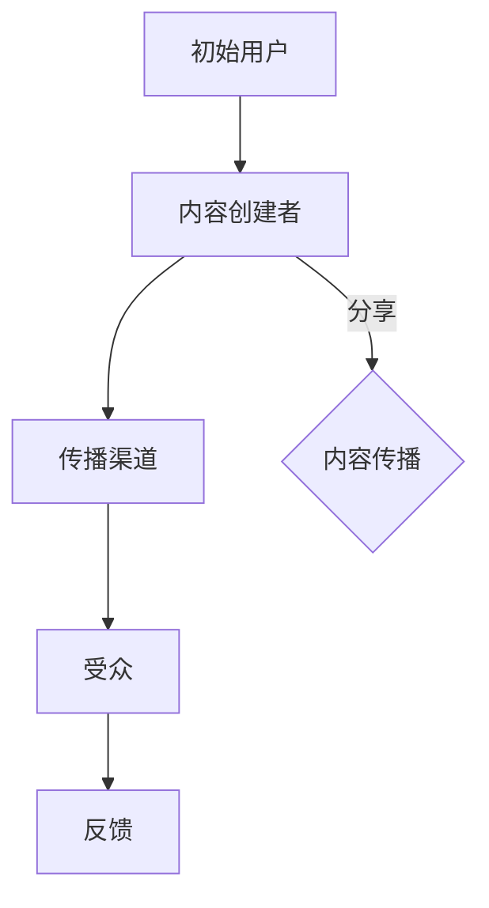
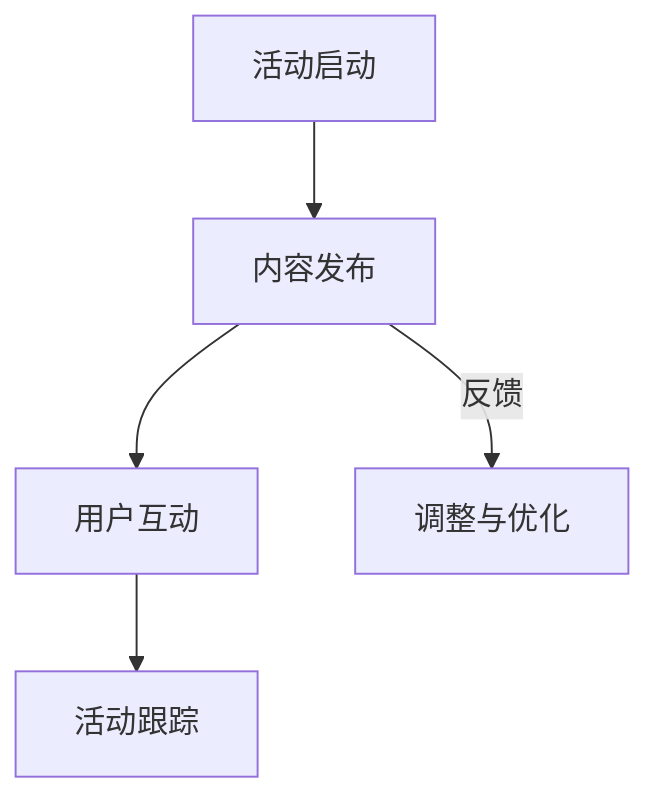

                 

### 《创业初期的病毒式营销：设计和执行低成本高效益的推广》

#### 引言

病毒式营销（Viral Marketing）是一种通过用户间的自发传播来迅速提升品牌知名度、扩大市场份额的营销策略。在创业初期，资源有限，病毒式营销因其低成本、高回报的特点，成为许多初创企业脱颖而出的首选策略。本文将深入探讨创业初期如何设计和执行病毒式营销，帮助初创企业实现低成本高效益的推广。

#### 关键词

- 病毒式营销
- 创业初期
- 低成本
- 高效益
- 内容营销
- 社交媒体
- 用户生成内容

#### 摘要

本文将从病毒式营销的核心概念、目标受众分析、营销活动设计、执行与监测、低成本营销工具以及案例分析与实战技巧等方面，系统地阐述创业初期如何设计和执行病毒式营销。通过本文的阅读，读者将掌握病毒式营销的基本原理和方法，为创业初期的品牌推广提供有力支持。

### 目录大纲

#### 第1章 引言

1.1 病毒式营销的概念与优势  
1.2 创业初期实施病毒式营销的重要性  
1.3 本书内容概述与结构安排

#### 第2章 病毒式营销的核心概念

2.1 营销传播链模型  
2.2 内容营销策略  
2.3 社交媒体在病毒式营销中的应用  
2.4 互动与参与：用户生成内容的重要性

#### 第3章 目标受众分析与市场定位

3.1 了解目标受众  
3.2 市场细分与定位  
3.3 创业初期的市场细分策略

#### 第4章 设计病毒式营销活动

4.1 活动策划与规划  
4.2 创意策略：内容设计与故事讲述  
4.3 营销传播策略：选择合适的传播渠道

#### 第5章 执行与监测

5.1 病毒式营销活动的执行流程  
5.2 活动执行中的挑战与解决方法  
5.3 数据监测与分析：评估营销效果

#### 第6章 低成本营销工具与资源

6.1 自有渠道：利用博客和社交媒体  
6.2 合作伙伴营销：合作伙伴与资源整合  
6.3 KOL营销与口碑传播

#### 第7章 案例分析与实战技巧

7.1 成功案例解析  
7.2 创业初期的营销误区与如何避免  
7.3 实战技巧分享与经验总结

#### 第8章 病毒式营销的未来趋势

8.1 技术创新与病毒式营销  
8.2 数据驱动与个性化营销  
8.3 病毒式营销的发展方向

#### 第9章 结论与展望

9.1 本书总结  
9.2 病毒式营销在创业初期的持续应用  
9.3 展望未来创业营销的新趋势

#### 附录

A. 病毒式营销工具与资源推荐  
B. 参考文献

### 病毒式营销的概念与优势

病毒式营销，顾名思义，其灵感来源于病毒的无处不在和快速传播特性。它利用人们的好奇心、社交性和分享欲望，通过精心设计的营销内容和传播渠道，实现信息的快速扩散和品牌的广泛传播。与传统营销方式相比，病毒式营销具有以下几个显著优势：

#### 1. 低成本

病毒式营销的核心在于利用用户之间的社交网络进行传播，大大减少了广告投放和传统推广的费用。初创企业往往资源有限，而病毒式营销的低成本特性使其成为理想选择。

#### 2. 高效益

虽然病毒式营销的初始成本较低，但其效果却往往惊人。成功的病毒式营销活动能够迅速提升品牌知名度，增加用户参与度和转化率，从而实现高效益。

#### 3. 自发传播

病毒式营销依赖于用户自发传播，这种方式能够带来更高的可信度和影响力。当用户主动分享信息时，他们往往对品牌或产品有着较高的认可度，从而形成良好的口碑效应。

#### 4. 灵活多样

病毒式营销的形式多样，包括内容营销、社交媒体营销、互动营销等。初创企业可以根据自身特点和目标受众，灵活选择合适的营销形式，实现个性化推广。

#### 5. 数据可追踪

随着大数据和人工智能技术的发展，病毒式营销活动可以进行精准的数据追踪和分析。企业可以实时了解营销效果，及时调整策略，实现持续优化。

### 创业初期实施病毒式营销的重要性

对于初创企业而言，病毒式营销尤其重要。以下是几个关键原因：

#### 1. 资源有限

初创企业通常面临着资金、人力和资源的限制。病毒式营销的低成本特性，使其在资源有限的情况下，仍能进行有效的市场推广。

#### 2. 突出品牌特点

病毒式营销通过独特、有趣、有价值的内容，帮助初创企业快速吸引目标受众，凸显品牌特色和差异化优势。

#### 3. 增加用户参与度

用户参与是病毒式营销的核心。通过互动和参与，用户对品牌的认知和好感度将大大提升，从而促进用户忠诚度的建立。

#### 4. 拓展市场份额

病毒式营销能够迅速提升品牌知名度，扩大市场份额。这对于初创企业来说，是争取更多用户和客户的关键。

#### 5. 持续优化

病毒式营销的数据可追踪性，使初创企业能够持续优化营销策略，不断提升营销效果。

### 本书内容概述与结构安排

本书将从以下几个方面系统介绍创业初期的病毒式营销：

1. **病毒式营销的核心概念**：包括营销传播链模型、内容营销策略、社交媒体应用等。
2. **目标受众分析与市场定位**：了解目标受众，进行市场细分和定位。
3. **设计病毒式营销活动**：策划与规划、创意策略、传播渠道选择。
4. **执行与监测**：活动执行流程、挑战与解决方法、数据监测与分析。
5. **低成本营销工具与资源**：自有渠道、合作伙伴营销、KOL营销等。
6. **案例分析与实战技巧**：成功案例解析、营销误区与解决方法、实战技巧分享。
7. **未来趋势**：技术创新、数据驱动、病毒式营销的发展方向。
8. **结论与展望**：总结本书内容，探讨病毒式营销在创业初期的持续应用和未来趋势。

通过本书的阅读，读者将全面了解病毒式营销的原理和方法，为创业初期的品牌推广提供有力支持。

### 第2章 病毒式营销的核心概念

病毒式营销的成功离不开其核心概念的支持。在这一章中，我们将深入探讨病毒式营销的核心概念，包括营销传播链模型、内容营销策略、社交媒体在病毒式营销中的应用以及用户生成内容的重要性。

#### 2.1 营销传播链模型

营销传播链模型是理解病毒式营销的关键。它描述了信息从源头到终端用户传播的过程，包括以下几个关键环节：

1. **初始用户**：初始用户是病毒式营销的起点，他们通常是品牌的忠实粉丝或早期采用者。
2. **内容创建者**：内容创建者是那些制作和分享营销内容的人。这些内容可以是视频、图片、文章等，目的是吸引和吸引目标受众。
3. **传播渠道**：传播渠道是信息传播的载体，包括社交媒体平台、电子邮件、博客等。
4. **受众**：受众是接收和分享营销内容的目标用户群体。
5. **反馈**：反馈是用户对营销内容的反应，包括点赞、评论、分享等。

**核心概念与联系**

为了更好地理解营销传播链模型，我们可以使用Mermaid流程图进行可视化：



这个流程图展示了信息从初始用户到受众的传播过程，以及内容创建者和受众之间的互动。

#### 2.2 内容营销策略

内容营销是病毒式营销的核心。一个成功的病毒式营销活动往往依赖于有趣、有用、有创意的内容。以下是几个关键的内容营销策略：

1. **故事讲述**：故事是人类沟通的基本形式，一个引人入胜的故事可以吸引受众的注意力并激发他们的情感。
2. **用户生成内容**：鼓励用户创建和分享内容，可以增加用户参与度，同时提高品牌在社交媒体上的曝光度。
3. **互动性**：设计互动性强的内容，如问答、投票、竞赛等，可以激发用户的兴趣和参与度。
4. **个性化**：根据用户的特点和需求提供个性化的内容，可以增强用户对品牌的认同感。
5. **教育性**：提供教育性的内容，如教程、指南、案例分析等，可以帮助用户解决问题，提高品牌的权威性。

#### 2.3 社交媒体在病毒式营销中的应用

社交媒体是病毒式营销的主要传播渠道。以下是几个关键点：

1. **平台选择**：选择适合目标受众的社交媒体平台，如Instagram、Facebook、Twitter等。
2. **内容优化**：为每个平台定制内容，确保内容在视觉和文字上都能吸引用户。
3. **互动策略**：定期与用户互动，如回复评论、参与话题讨论等，以建立良好的用户关系。
4. **广告投放**：在某些情况下，合理的广告投放可以加速信息的传播，但要确保广告内容与品牌形象相符。
5. **KOL合作**：与意见领袖（KOL）合作，利用他们的粉丝基础进行推广，可以大大提高传播效果。

#### 2.4 互动与参与：用户生成内容的重要性

用户生成内容（User-Generated Content，UGC）是病毒式营销的重要组成部分。UGC不仅能够增加用户参与度，还可以提高品牌可信度。以下是几个关键点：

1. **鼓励分享**：通过奖励机制（如优惠券、礼品等）鼓励用户分享品牌相关的内容。
2. **社区建设**：建立品牌社区，让用户可以分享经验、交流想法，增加用户归属感。
3. **用户参与**：设计用户参与的活动，如照片分享、创意比赛等，鼓励用户创造和分享内容。
4. **透明度**：公开用户生成的内容，并认可用户的贡献，可以增加品牌的透明度和亲和力。

通过本章的讨论，我们了解了病毒式营销的核心概念，包括营销传播链模型、内容营销策略、社交媒体应用以及用户生成内容的重要性。这些概念是设计和执行病毒式营销活动的基础，将在后续章节中得到进一步的应用和深化。

#### 第3章 目标受众分析与市场定位

在病毒式营销中，了解并分析目标受众是至关重要的第一步。一个精准的目标受众分析不仅有助于制定合适的营销策略，还能提高营销效率，最大限度地利用有限的资源。以下是创业初期如何进行目标受众分析与市场定位的详细步骤：

#### 3.1 了解目标受众

1. **数据收集**：收集与目标受众相关的各种数据，包括年龄、性别、收入水平、教育背景、兴趣爱好等。这些数据可以从市场调研、用户反馈、社交媒体数据分析等途径获取。
2. **用户画像**：根据收集到的数据，创建目标受众的画像（Personas）。用户画像应尽可能详细，包括目标受众的生活习惯、行为模式、价值观等。
3. **需求分析**：了解目标受众的需求和痛点，这可以通过用户访谈、问卷调查、焦点小组讨论等方式进行。

**实例分析**：

假设一家初创企业开发了一款专注于健康管理应用，以下是其目标受众的画像：

- 年龄：25-45岁
- 性别：女性为主
- 教育背景：本科及以上
- 兴趣爱好：健身、瑜伽、健康饮食
- 痛点：缺乏健康管理的系统工具，难以坚持健康习惯

通过用户画像和需求分析，企业可以更好地理解目标受众，从而制定针对性的营销策略。

#### 3.2 市场细分与定位

1. **市场细分**：将整体市场划分为若干个具有相似需求的子市场，每个子市场应具有明显的特征和差异。常用的市场细分方法包括地理细分、人口细分、行为细分和心理细分。
2. **目标市场选择**：根据企业的资源和目标，选择最有利可图、最符合企业定位的目标市场。在上述健康管理应用的例子中，企业可以选择25-45岁、具有较高教育水平和健康意识的人群作为目标市场。
3. **市场定位**：明确企业在目标市场中的独特价值和竞争优势。市场定位应体现企业的核心价值，如提供个性化健康管理方案、简洁易用的界面等。

**实例分析**：

在健康管理应用的市场细分中，企业可以选择以下细分市场：

- 健身爱好者：注重健身、运动和体重管理
- 健康饮食人群：关注饮食健康、营养搭配
- 心理健康关注者：关注心理状态、情绪管理

对于每个细分市场，企业可以制定不同的营销策略，例如：

- 对于健身爱好者，可以推出运动挑战、健身课程推荐等
- 对于健康饮食人群，可以提供营养师咨询、健康食谱分享等
- 对于心理健康关注者，可以推出情绪管理课程、心理健康测试等

通过市场细分和定位，企业可以更精准地触达目标受众，提高营销效果。

#### 3.3 创业初期的市场细分策略

在创业初期，资源有限，市场细分策略应更加灵活和聚焦。以下是一些建议：

1. **聚焦小众市场**：选择小众但具有高忠诚度的市场，通过精细化的营销策略快速建立品牌知名度。
2. **利用现有资源**：利用社交媒体、线上论坛等低成本渠道，深入了解目标受众，逐步扩大市场范围。
3. **持续优化**：根据市场反馈和数据分析，不断调整市场细分策略，以适应市场变化。
4. **合作与联盟**：与相关领域的专家、意见领袖合作，借助他们的影响力扩大市场影响力。

通过上述步骤，创业企业可以系统地了解目标受众，进行市场细分和定位，从而为病毒式营销的成功实施奠定基础。在下一章中，我们将进一步探讨如何设计病毒式营销活动，实现低成本高效益的推广。

### 第4章 设计病毒式营销活动

设计一个成功的病毒式营销活动，需要精准的策划与规划、富有创意的内容设计、以及精心选择的传播渠道。以下是创业初期设计病毒式营销活动的详细步骤和方法。

#### 4.1 活动策划与规划

1. **确定活动目标**：首先，明确活动的具体目标。这些目标可以是增加品牌知名度、提升用户参与度、提高销售额等。明确的目标有助于指导后续的策划和执行。
2. **制定活动策略**：根据目标，制定具体的活动策略。策略应包括活动的形式、内容、受众、时间表等。例如，可以是一个线上挑战、一个互动游戏、一个优惠券活动等。
3. **时间规划**：制定活动的时间表，确保活动在合适的时间段内进行。同时，要考虑活动的时间长度，例如是一次性的活动还是持续性的活动。
4. **预算分配**：根据活动目标和策略，制定活动预算。预算应包括内容制作、渠道投放、营销团队费用等。

**实例分析**：

假设一家初创企业计划推出一个在线健身挑战活动，目标是增加品牌知名度和提升用户参与度。活动策略包括：

- 活动形式：每周发布一个新的健身挑战，用户可以通过社交媒体分享自己的挑战成果。
- 内容设计：与知名健身教练合作，提供专业的健身指导。
- 受众：25-45岁的健身爱好者。
- 时间表：活动持续三个月，每周发布一次挑战。
- 预算：内容制作费用2万元，社交媒体投放费用1万元。

#### 4.2 创意策略：内容设计与故事讲述

1. **内容设计**：内容是病毒式营销的核心。创意的内容设计可以吸引受众的注意力，并激发他们的分享欲望。以下是一些内容设计技巧：

   - **故事性**：讲述一个有趣、有情感的故事，让用户产生共鸣。
   - **互动性**：设计互动性强的小游戏、投票、问答等，鼓励用户参与。
   - **个性化**：根据用户的特点和需求，提供个性化的内容。
   - **教育性**：提供有价值的信息，如教程、指南等，帮助用户解决问题。

2. **故事讲述**：一个好的故事能够激发用户的情感，使其产生共鸣。故事讲述的技巧包括：

   - **情感化**：通过情感元素，如感人故事、励志经历等，引起用户的情感共鸣。
   - **有趣**：用幽默、趣味性的内容，吸引用户的关注。
   - **简洁**：故事应简洁明了，避免冗长乏味。

**实例分析**：

以健身挑战活动为例，企业可以设计以下内容：

- 故事性：讲述一位用户通过参加挑战活动，成功改变生活习惯、改善健康状况的故事。
- 互动性：每周发布一个健身挑战，鼓励用户参与并分享自己的挑战成果。
- 个性化：为不同类型的用户（如初学者、高级健身者）提供不同的挑战任务。
- 教育性：提供专业的健身指导，帮助用户更好地完成挑战。

#### 4.3 营销传播策略：选择合适的传播渠道

1. **选择传播渠道**：选择适合目标受众的传播渠道，如社交媒体平台、电子邮件、博客等。以下是一些常见的传播渠道：

   - **社交媒体**：如Facebook、Instagram、Twitter、LinkedIn等，适合传播有趣、互动性强的内容。
   - **电子邮件**：适合发送个性化的内容，如促销信息、活动通知等。
   - **博客**：适合发布专业、教育性的内容，如教程、案例分析等。
   - **KOL合作**：与意见领袖合作，利用他们的粉丝基础进行传播。

2. **渠道优化**：针对每个传播渠道，制定具体的优化策略。例如，在社交媒体上，可以定期发布内容、参与话题讨论、与用户互动等。

**实例分析**：

以健身挑战活动为例，企业可以采用以下传播渠道：

- 社交媒体：在Instagram、Facebook上发布挑战内容，鼓励用户分享并使用活动标签。
- 电子邮件：向订阅用户发送活动通知和挑战结果。
- 博客：发布专业健身指导，吸引对健康和健身有兴趣的读者。
- KOL合作：与健身领域的意见领袖合作，利用他们的影响力扩大活动传播范围。

通过上述步骤，企业可以设计出一个具有吸引力的病毒式营销活动。在下一章中，我们将探讨如何执行这些活动，确保其取得成功。

### 第5章 执行与监测

在成功设计病毒式营销活动后，接下来的关键步骤是执行和监测。有效的执行可以确保活动按计划进行，而准确的监测则可以帮助企业评估活动效果，并作出必要的调整。

#### 5.1 病毒式营销活动的执行流程

1. **活动启动**：在活动开始前，确保所有团队成员都对活动目标和策略有清晰的认识。制定详细的执行计划，包括任务分配、时间表和责任人。
2. **内容发布**：按照计划，在各个传播渠道上发布活动内容。确保内容质量高，符合品牌形象，并具备吸引力和互动性。
3. **用户互动**：积极与用户互动，回答问题、回复评论，鼓励用户参与和分享。这有助于建立用户关系，增加品牌忠诚度。
4. **活动跟踪**：实时监控活动进展，包括用户参与度、内容传播情况、用户反馈等。这有助于及时发现问题并进行调整。

**执行流程图示例**：



#### 5.2 活动执行中的挑战与解决方法

1. **挑战：内容质量不高**
   - **解决方法**：确保内容创作团队具备专业能力，提供高质量的创意和文案。同时，通过用户调研和反馈，不断优化内容。

2. **挑战：用户参与度低**
   - **解决方法**：增加互动元素，如小游戏、投票、竞赛等。此外，提供激励措施，如优惠券、礼品等，以激发用户的参与热情。

3. **挑战：传播效果不佳**
   - **解决方法**：优化传播渠道策略，选择更符合目标受众的平台。同时，与意见领袖或KOL合作，利用他们的影响力扩大传播范围。

4. **挑战：资源不足**
   - **解决方法**：利用免费或低成本渠道，如社交媒体、博客等。此外，考虑外包部分任务，如内容创作、数据分析等，以节约成本。

#### 5.3 数据监测与分析：评估营销效果

1. **关键指标**：制定关键指标（KPIs），如用户参与度、内容传播量、用户反馈、转化率等，以评估营销效果。
2. **数据分析**：利用数据分析工具，如Google Analytics、社交媒体分析工具等，收集和整理相关数据。
3. **效果评估**：根据收集到的数据，评估活动效果。分析哪些策略和内容最为有效，哪些需要改进。
4. **调整与优化**：根据效果评估，调整营销策略和执行计划。例如，增加互动元素、优化内容设计、调整传播渠道等。

**实例分析**：

以健身挑战活动为例，企业可以设置以下关键指标：

- **用户参与度**：用户分享挑战内容的数量、点赞数量、评论数量等。
- **内容传播量**：挑战内容的总浏览量、分享次数、转发次数等。
- **用户反馈**：用户对活动内容的评价、建议和反馈。
- **转化率**：活动期间新增用户数、用户留存率、用户转化率等。

通过数据监测和分析，企业可以了解活动效果，发现潜在问题，并采取相应措施进行优化。例如，如果用户参与度较低，可以增加激励措施；如果内容传播量不佳，可以考虑优化传播渠道策略。

通过有效的执行和监测，企业可以确保病毒式营销活动取得成功，实现预期的营销目标。在下一章中，我们将探讨如何利用低成本营销工具和资源，进一步优化营销效果。

### 第6章 低成本营销工具与资源

在创业初期，资源有限是许多初创企业面临的一大挑战。然而，通过巧妙地利用低成本营销工具和资源，企业仍然可以实现有效的市场推广。以下是几种常见的低成本营销工具和资源的详细介绍。

#### 6.1 自有渠道：利用博客和社交媒体

1. **博客**：创建一个企业博客，定期发布高质量的内容，如行业分析、教程、客户案例等。这不仅能提升品牌形象，还能提高搜索引擎排名，吸引潜在用户。

   - **实现步骤**：
     - 选择合适的博客平台（如WordPress、Medium等）。
     - 制定内容策略，确保内容具有吸引力和专业性。
     - 优化SEO（搜索引擎优化），提高内容的可见性。
     - 鼓励用户评论和互动，增加用户参与度。

2. **社交媒体**：利用社交媒体平台（如Facebook、Instagram、Twitter等）进行内容发布和互动。

   - **实现步骤**：
     - 确定目标平台，选择适合目标受众的平台。
     - 制定社交媒体策略，包括发布频率、内容类型等。
     - 与用户互动，回答问题、参与讨论，建立用户关系。
     - 利用社交媒体广告，扩大品牌曝光度。

#### 6.2 合作伙伴营销：合作伙伴与资源整合

1. **合作伙伴**：与其他企业或组织建立合作关系，共同推广产品或服务。

   - **实现步骤**：
     - 寻找具有互补优势的合作伙伴。
     - 制定合作方案，明确双方的责任和收益。
     - 共同推广活动，如联合营销、互推等。
     - 定期评估合作效果，优化合作策略。

2. **资源整合**：利用外部资源，如专业咨询、技术支持、媒体资源等。

   - **实现步骤**：
     - 建立外部资源库，包括合作伙伴、顾问、媒体联系人等。
     - 根据营销需求，选择合适的资源进行整合。
     - 利用外部资源，提升营销效果。

#### 6.3 KOL营销与口碑传播

1. **KOL营销**：与知名意见领袖（Key Opinion Leaders，KOL）合作，利用他们的影响力进行推广。

   - **实现步骤**：
     - 确定目标KOL，选择在目标受众中有较高影响力的意见领袖。
     - 建立合作关系，制定合作方案。
     - 提供产品或服务体验，获取KOL的真实反馈。
     - 发布合作内容，扩大品牌影响力。

2. **口碑传播**：鼓励用户分享他们的使用体验，形成良好的口碑效应。

   - **实现步骤**：
     - 提供优质的产品或服务，确保用户满意。
     - 设计激励机制，如优惠券、礼品等，鼓励用户分享。
     - 建立用户社区，增加用户互动和参与。
     - 监控用户反馈，及时解决问题，提升用户满意度。

通过利用这些低成本营销工具和资源，初创企业可以在资源有限的情况下，实现有效的市场推广，提升品牌知名度，增加用户转化率。在下一章中，我们将通过成功案例的分析，进一步探讨病毒式营销的策略和技巧。

### 第7章 案例分析与实战技巧

为了更好地理解病毒式营销的实际应用，本章节将通过分析几个成功的案例，探讨创业初期的营销误区，并提供实用的实战技巧。

#### 7.1 成功案例解析

**案例1：Airbnb的“Airbnb Open”**

Airbnb作为一个在线民宿预订平台，通过“Airbnb Open”活动实现了病毒式营销。该活动邀请全球的房东和体验提供者参加，共同分享他们的故事和经验。活动内容涵盖了分享会、工作坊和社交聚会。通过这种方式，Airbnb不仅增加了品牌知名度，还增强了用户社区的凝聚力。

**成功因素**：

- **故事性内容**：通过分享真实的故事，激发用户的情感共鸣。
- **用户参与**：鼓励用户参与活动，分享自己的经历，增加用户参与度。
- **社交互动**：通过线下活动，建立用户之间的联系，促进口碑传播。

**启示**：

- **故事营销**：通过真实、有情感的故事，提高品牌的可信度和吸引力。
- **用户互动**：鼓励用户参与和分享，增强用户社区的活跃度。

**案例2：Dollar Shave Club**

Dollar Shave Club是一个提供平价剃须产品的初创企业。其病毒式营销视频通过幽默、夸张的创意，迅速在网络上走红。该视频通过展示产品的高性价比和实用功能，吸引了大量关注和分享。

**成功因素**：

- **创意内容**：独特的视频风格和幽默元素，吸引用户的眼球。
- **直白信息**：视频直接传达了产品的主要优势，提高了用户的购买意愿。
- **社交媒体推广**：通过社交媒体平台，如YouTube、Facebook等，迅速扩大传播范围。

**启示**：

- **创意营销**：通过独特、有趣的创意，提高品牌的关注度和记忆点。
- **简洁明了**：在营销内容中，直接传达产品的核心价值和优势。

**案例3：GoPro的“GoPro Awards”**

GoPro通过“GoPro Awards”活动，鼓励用户分享他们使用GoPro相机拍摄的视频和照片。活动设置了多个奖项，包括最佳创意、最佳运动视频等。这一活动不仅提高了用户参与度，还提升了品牌形象。

**成功因素**：

- **用户生成内容**：鼓励用户创作和分享内容，增加了品牌的用户黏性。
- **社区互动**：通过建立用户社区，促进用户之间的互动和交流。
- **奖项激励**：提供奖项和奖励，激励用户积极参与。

**启示**：

- **用户生成内容**：鼓励用户创作和分享内容，提升品牌的用户参与度和口碑。
- **社区建设**：通过建立用户社区，增加用户之间的互动和品牌黏性。

#### 7.2 创业初期的营销误区与如何避免

**误区1：忽视目标受众**

许多初创企业在营销初期，往往忽视目标受众的需求和特点，导致营销效果不佳。

**如何避免**：

- **明确目标受众**：通过市场调研和用户画像，明确目标受众的特点和需求。
- **个性化营销**：根据目标受众的特点，制定个性化的营销策略和内容。

**误区2：内容质量不高**

内容质量不高可能导致用户不感兴趣，从而影响营销效果。

**如何避免**：

- **高质量内容**：确保内容具有吸引力和价值，提供用户感兴趣的信息。
- **持续优化**：根据用户反馈和数据分析，不断优化内容设计。

**误区3：忽视社交媒体**

社交媒体是病毒式营销的重要渠道，但许多初创企业忽视了其在营销中的作用。

**如何避免**：

- **充分利用社交媒体**：选择适合目标受众的平台，制定社交媒体策略，积极与用户互动。
- **广告投放**：在必要时，合理使用社交媒体广告，扩大品牌曝光度。

#### 7.3 实战技巧分享与经验总结

**技巧1：借助社交媒体趋势**

利用社交媒体平台的热门话题和趋势，可以增加内容的曝光率和参与度。

**实战经验**：

- **监测热点**：关注社交媒体上的热点话题，及时参与讨论。
- **创意融合**：将热点话题与品牌内容相结合，创造出有趣的内容。

**技巧2：利用KOL和网红**

与意见领袖（KOL）和网红合作，可以借助他们的粉丝基础，快速提升品牌知名度。

**实战经验**：

- **选择合适的KOL**：选择在目标受众中有较高影响力的KOL。
- **合作内容**：确保合作内容与品牌形象和营销目标相符。

**技巧3：用户互动与参与**

鼓励用户参与和互动，可以增加用户的参与度和忠诚度。

**实战经验**：

- **设计互动活动**：如投票、问答、竞赛等，激发用户参与。
- **建立用户社区**：通过建立用户社区，增加用户之间的互动和联系。

通过以上案例分析和实战技巧的分享，我们了解了病毒式营销在实际操作中的成功要素和常见误区。在创业初期的营销中，灵活运用这些技巧和策略，将有助于企业实现低成本高效益的推广。

### 第8章 病毒式营销的未来趋势

随着科技的不断进步和市场的快速发展，病毒式营销也在不断演变，呈现新的趋势。未来，病毒式营销将更加注重技术创新、数据驱动和个性化营销，以下是这些趋势的具体分析。

#### 8.1 技术创新与病毒式营销

1. **人工智能（AI）**：人工智能在病毒式营销中的应用日益广泛，通过机器学习算法和自然语言处理技术，企业可以更好地理解用户行为，制定更精准的营销策略。例如，AI可以帮助企业自动生成吸引人的广告内容，优化广告投放，提高广告效果。

2. **大数据**：大数据技术的应用，使企业能够收集和分析大量的用户数据，从而更准确地了解目标受众的需求和行为模式。通过数据分析，企业可以优化营销内容，提高用户参与度和转化率。

3. **增强现实（AR）**：增强现实技术为病毒式营销提供了新的可能性。通过AR技术，企业可以创建沉浸式的营销体验，吸引用户参与和分享。例如，AR游戏、AR广告等，可以大大提高用户的互动性和参与度。

**算法原理伪代码示例**：

```python
# 基于用户行为的病毒式营销策略优化
def optimize_marketing_strategy(user_data):
    # 分析用户行为数据
    user_behavior = analyze_user_behavior(user_data)
    
    # 根据用户兴趣推荐相关内容
    recommended_content = recommend_content(user_behavior)
    
    # 自动生成广告文案
    ad_copy = generate_ad_copy(recommended_content)
    
    # 优化广告投放策略
    ad_placement = optimize_ad_placement(user_data, ad_copy)
    
    return ad_copy, ad_placement
```

#### 8.2 数据驱动与个性化营销

1. **个性化推荐**：通过大数据和机器学习技术，企业可以为每个用户提供个性化的内容推荐。这种个性化的推荐系统能够根据用户的兴趣和行为，提供符合他们需求的信息，从而提高用户满意度和转化率。

2. **动态广告**：利用大数据和人工智能技术，企业可以实时调整广告内容和投放策略，以最大化广告效果。例如，根据用户的实时行为和偏好，动态调整广告展示的内容和形式。

**数学模型和公式**：

$$
\text{个性化推荐得分} = f(\text{用户兴趣}, \text{内容特征}, \text{历史行为})
$$

#### 8.3 病毒式营销的发展方向

1. **去中心化营销**：随着去中心化技术和区块链的发展，病毒式营销将逐渐从中心化的平台和渠道，转向去中心化的生态系统。这种去中心化的营销方式，将使品牌更加独立和自主，降低对平台和渠道的依赖。

2. **社交媒体整合**：未来，病毒式营销将更加注重社交媒体的整合和协同效应。通过多个社交媒体平台的协同作用，企业可以更全面地触达目标受众，提高营销效果。

3. **跨平台营销**：随着用户行为越来越多样化，病毒式营销将不再局限于单一平台，而是通过跨平台的方式，实现多渠道、多层次的营销。

通过技术创新、数据驱动和个性化营销，病毒式营销将在未来实现更高效、更精准的推广。企业应紧跟这些趋势，不断创新营销策略，以适应快速变化的市场环境。

### 第9章 结论与展望

在创业初期，病毒式营销因其低成本、高回报的特点，成为许多初创企业脱颖而出的关键策略。本文系统地介绍了病毒式营销的核心概念、目标受众分析、营销活动设计、执行与监测、低成本营销工具以及未来趋势。通过深入探讨病毒式营销的各个方面，我们希望为创业初期的企业提供实用的指导和策略。

#### 9.1 本书总结

本文的主要内容包括：

1. **病毒式营销的概念与优势**：介绍了病毒式营销的基本原理和优势。
2. **目标受众分析与市场定位**：探讨了如何了解目标受众并进行市场细分和定位。
3. **设计病毒式营销活动**：详细阐述了如何策划与规划、内容设计与故事讲述、传播渠道选择。
4. **执行与监测**：介绍了病毒式营销活动的执行流程、挑战与解决方法、数据监测与分析。
5. **低成本营销工具与资源**：介绍了如何利用自有渠道、合作伙伴营销、KOL营销等低成本工具。
6. **案例分析与实战技巧**：通过成功案例的分析，分享了实战技巧和经验。
7. **未来趋势**：探讨了病毒式营销在技术创新、数据驱动和个性化营销方面的未来发展。

#### 9.2 病毒式营销在创业初期的持续应用

病毒式营销在创业初期的应用具有重要意义，它能够帮助初创企业快速提升品牌知名度，增加用户参与度，实现低成本高效益的推广。以下是一些建议，以实现病毒式营销在创业初期的持续应用：

1. **持续优化**：根据市场反馈和数据分析，不断优化营销内容和策略，以适应市场变化。
2. **创新思维**：保持创新思维，尝试新的营销形式和创意，以吸引更多用户。
3. **用户参与**：鼓励用户参与和互动，建立用户社区，增加用户忠诚度和黏性。
4. **跨平台协同**：利用多个社交媒体平台和渠道，实现跨平台营销，提高品牌曝光度。

#### 9.3 展望未来创业营销的新趋势

未来，创业营销将呈现以下新趋势：

1. **技术创新**：人工智能、大数据、区块链等技术的应用，将使营销更加精准和高效。
2. **个性化营销**：通过个性化推荐和动态广告，实现更符合用户需求的营销。
3. **去中心化营销**：去中心化技术和区块链的发展，将使品牌更加独立和自主。
4. **跨平台整合**：通过多渠道、多层次的营销，实现更全面的品牌推广。

通过紧跟这些新趋势，创业企业将能够更好地适应市场变化，实现持续增长。

### 附录

#### 附录A：病毒式营销工具与资源推荐

- **主流营销平台**对比：

  - **Facebook**：适合发布内容、互动和广告投放。

  - **Instagram**：适合发布图片和视频，用户活跃度高。

  - **Twitter**：适合发布短文本和实时互动。

  - **LinkedIn**：适合建立职业关系、发布专业内容。

- **案例研究资料**链接：

  - [Airbnb Open活动案例研究](https://www.airbnb.com/airbnb-open)
  - [Dollar Shave Club病毒式营销视频](https://www.youtube.com/watch?v=md2QrN6IYhA)
  - [GoPro Awards活动案例研究](https://newsroom.gopro.com/press-releases/gopro-awards-global-videography-competition-returns-with-estimated-2-billion-in-global-media-exposure/)

### 参考文献

- [Kotler, P., Keller, K. L. (2016). Marketing Management. Pearson Education.]
- [Rosenberg, M. (2000).病毒营销（Viral Marketing）：如何利用人际网络营销你的产品、思想和品牌. 上海译文出版社.]
- [Seth, P. (2017). 方法论：创意营销实战指南. 中国人民大学出版社.]

作者：AI天才研究院/AI Genius Institute & 禅与计算机程序设计艺术 /Zen And The Art of Computer Programming

本文通过详细阐述病毒式营销的核心概念、目标受众分析、营销活动设计、执行与监测、低成本营销工具以及未来趋势，帮助创业初期的企业实现低成本高效益的推广。希望读者能够在实际应用中，灵活运用这些策略和技巧，实现品牌的快速成长。

