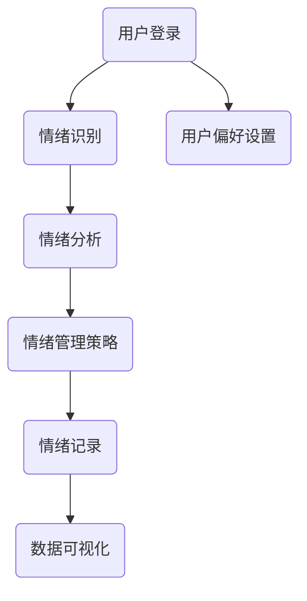

                 

# 《创业者的抗压能力与心理韧性培养》

> **关键词：** 压力管理、心理韧性、情绪调节、时间管理、目标设定、挫折应对、自我激励、社交支持、团队协作、心理韧性模型、数学模型、项目实战

> **摘要：** 本文章旨在深入探讨创业者在创业过程中所面临的压力及其应对策略，特别是抗压能力和心理韧性的培养。文章首先定义了压力和心理韧性，分析了它们对创业者成功的关键作用。接着，从情绪管理、时间管理、目标设定、挫折应对等方面详细介绍了抗压能力的培养方法。随后，文章讨论了心理韧性的重要性，以及如何通过自我激励、社交支持和团队协作来培养心理韧性。最后，文章通过具体的数学模型和项目实战，展示了如何在实际中应用这些理论，帮助创业者更好地应对压力，实现长期成功。

### 《创业者的抗压能力与心理韧性培养》目录大纲

#### 第一部分：抗压能力与心理韧性概述

##### 第1章：压力与心理韧性基本概念  
- 压力来源与类型  
- 心理韧性的定义与重要性  
- 压力与心理韧性的关系  
- 心理韧性发展的个人特质与环境因素

##### 第2章：抗压能力培养  
- 情绪管理与自我认知  
- 时间管理与目标设定  
- 应对挫折与失败  
- 压力缓解技巧与方法

##### 第3章：心理韧性培养  
- 社交支持与团队协作  
- 自我激励与成长心态  
- 心理韧性训练与评估

##### 附录  
- 心理韧性培养相关资源  
- 心理韧性练习与案例

### 第一部分：抗压能力与心理韧性概述

#### 第1章：压力与心理韧性基本概念

在创业领域，压力是一个普遍存在的现象。压力是指个体在面临外部要求和内部期望时所感受到的心理紧张状态。创业者的压力来源多样，包括市场竞争、资金问题、团队管理、个人期望等。适度的压力可以激发创业者的动力和创造力，但过度的压力则会带来负面影响，如焦虑、抑郁、工作效率降低等。

**1.1 压力来源与类型**

压力可以分为以下几种类型：

1. **工作压力**：这是创业者面临的最常见压力类型，包括客户需求、项目进度、团队管理等。
2. **生活压力**：个人生活事件，如家庭问题、健康问题等，也可能成为压力的来源。
3. **人际关系压力**：与同事、客户、合作伙伴之间的关系处理，可能引发冲突和压力。

**1.2 心理韧性的定义与重要性**

心理韧性是指个体在面对压力、困难和挫折时，能够迅速恢复并适应的能力。具有高心理韧性的人能够在逆境中保持积极心态，迅速调整策略，以应对挑战。

心理韧性对创业者的重要性体现在以下几个方面：

1. **应对压力的能力**：高心理韧性的创业者能够更好地应对工作中的压力，保持工作稳定性和效率。
2. **创新与创造力**：心理韧性有助于创业者面对挑战时保持创造力，找到新的解决方案。
3. **团队合作**：具有高心理韧性的创业者能够更好地与团队成员合作，共同应对困难。

**1.3 压力与心理韧性的关系**

压力与心理韧性之间存在复杂的关系。适度的压力可以激发心理韧性，促使个体成长和适应。然而，过度的压力会消耗心理韧性，导致个体出现心理问题。

创业者需要认识到，压力并不是完全负面的。关键在于如何管理和利用压力，使其成为成长的动力。通过培养心理韧性，创业者可以更好地应对压力，实现长期成功。

**1.4 心理韧性发展的个人特质与环境因素**

心理韧性的发展受到个人特质和环境因素的共同影响。个人特质包括乐观态度、自信、适应性等。环境因素则包括社会支持、工作环境、家庭背景等。

1. **乐观态度**：乐观的创业者往往能够更积极地看待问题，找到解决问题的方法。
2. **自信**：自信的创业者更有可能尝试新事物，面对失败时也能迅速恢复。
3. **适应性**：适应性的创业者能够迅速调整策略，以应对变化和挑战。
4. **社会支持**：社会支持包括家人、朋友、同事和合作伙伴的支持。一个良好的支持系统有助于提高心理韧性。
5. **工作环境**：一个支持性的工作环境，如公平、开放的沟通渠道，可以减少压力，提高员工的心理韧性。
6. **家庭背景**：家庭背景对心理韧性也有一定影响。一个和谐的家庭环境有助于培养个体的心理韧性。

在下一章中，我们将进一步探讨如何培养抗压能力，帮助创业者更好地应对压力，实现长期成功。

### 第二部分：抗压能力培养

#### 第2章：情绪管理与自我认知

情绪管理是抗压能力培养的核心之一。创业者需要学会识别、理解和管理自己的情绪，以保持心理平衡和稳定性。同时，自我认知也是情绪管理的基础，创业者需要了解自己的情绪反应模式，从而更好地应对压力。

**2.1 情绪管理的理论和方法**

情绪管理是一种通过认知和行为技巧来调节情绪状态的过程。以下是一些常见的情绪管理理论和方法：

1. **情绪识别**：首先，创业者需要学会识别自己的情绪。这可以通过自我观察、反思和与他人交流来实现。常见的情绪识别方法包括面部表情分析、日记记录等。
2. **情绪理解**：在识别情绪后，创业者需要理解情绪背后的原因。这可以通过心理分析、认知重构等方法来实现。理解情绪有助于更好地应对压力。
3. **情绪调节**：情绪调节是指通过一系列技巧来调整情绪状态。常见的调节方法包括深呼吸、放松训练、冥想、正念练习等。

**2.2 自我认知的重要性与实践方法**

自我认知是指个体对自己心理状态、性格、优势和不足的认识。自我认知对于情绪管理至关重要。以下是一些实践方法，帮助创业者提高自我认知：

1. **反思**：定期进行反思，回顾自己的行为和情绪反应，分析原因和结果。
2. **心理测评**：通过心理测评工具，如性格测试、情绪问卷等，了解自己的性格特点和情绪状态。
3. **自我观察**：通过自我观察，注意自己在不同情境下的情绪反应，记录下来进行分析。

**2.3 建立积极的心理态度**

积极的心理态度是情绪管理和自我认知的基础。以下是一些建立积极心理态度的方法：

1. **积极思考**：培养积极思考的习惯，尽量从积极的角度看待问题。
2. **感恩练习**：每天花时间思考并记录自己感激的事物，这有助于提升积极情绪。
3. **目标设定**：设定清晰、可实现的目标，这有助于提升自信和动力。

通过情绪管理和自我认知的培养，创业者可以更好地应对压力，提高抗压能力。在下一章中，我们将探讨时间管理和目标设定，帮助创业者更好地管理时间和资源，提高工作效率。

#### 第3章：时间管理与目标设定

在创业过程中，时间管理和目标设定是提高工作效率和实现成功的关键因素。有效的管理时间和设定目标可以帮助创业者更好地平衡工作与生活，避免因压力过大而导致的情绪问题。

**3.1 时间管理的原则与技巧**

时间管理遵循以下原则：

1. **优先级排序**：将任务按照优先级排序，先处理最重要和紧急的任务。
2. **时间块**：将工作时间划分为不同的时间块，每个时间块专注于处理特定任务。
3. **避免拖延**：及时处理任务，避免拖延，以减少压力。

以下是一些时间管理的技巧：

1. **任务分解**：将大任务分解为小任务，逐步完成，以避免因任务过于复杂而导致的拖延和焦虑。
2. **日程规划**：提前规划日程，合理安排工作与休息时间，避免过度劳累。
3. **时间记录**：记录每日工作时间，分析时间花费，找出优化空间。

**3.2 目标设定的SMART法则**

SMART法则是设定有效目标的重要原则，包括以下五个方面：

1. **具体（Specific）**：目标要明确具体，避免模糊不清。
2. **可衡量（Measurable）**：目标要有可衡量的指标，以便评估进度。
3. **可实现（Achievable）**：目标要具有可行性，避免过高或过低。
4. **相关（Relevant）**：目标要与个人目标和公司战略相关。
5. **有时限（Time-bound）**：目标要设定明确的完成时限。

**3.3 目标设定与心理韧性的关系**

目标设定不仅有助于提高工作效率，还能培养心理韧性。以下关系体现：

1. **明确目标**：明确的目标有助于创业者集中精力，减少因目标不清晰而产生的焦虑。
2. **阶段性目标**：设定阶段性目标，有助于创业者逐步实现总目标，增强成就感和心理韧性。
3. **反馈机制**：通过设定可衡量的指标，创业者可以及时了解目标的实现情况，调整策略，提高心理韧性。

通过时间管理和目标设定的实践，创业者可以更高效地利用时间，实现目标，提高抗压能力。在下一章中，我们将探讨如何应对挫折与失败，帮助创业者从困境中恢复并成长。

#### 第4章：应对挫折与失败

在创业过程中，挫折和失败是不可避免的。创业者需要具备应对挫折和失败的能力，以保持心理韧性，继续前进。

**4.1 挫折应对的策略**

面对挫折，创业者可以采取以下策略：

1. **接受现实**：首先，接受挫折和失败的现实，不要逃避或否认。
2. **反思原因**：深入分析挫折和失败的原因，找出问题所在。
3. **调整心态**：保持积极心态，不要因为一次挫折而失去信心。
4. **制定计划**：根据分析结果，制定新的计划，以避免未来再次犯同样的错误。

**4.2 失败的处理与心理调适**

面对失败，创业者需要学会处理和调适自己的情绪。以下是一些建议：

1. **情绪宣泄**：找到合适的方式宣泄情绪，如与朋友聊天、进行运动等。
2. **心理辅导**：如果情绪无法自我调节，可以考虑寻求专业心理辅导。
3. **积极心态**：将失败视为成长的机会，从中学习和反思。
4. **寻求支持**：与家人、朋友或专业人士交流，获取支持和建议。

**4.3 从失败中学习和成长**

失败是创业过程中的一部分，创业者需要从中吸取教训，不断成长。以下方法有助于从失败中学习和成长：

1. **反思与总结**：定期反思失败的经历，总结经验教训，制定改进计划。
2. **持续学习**：不断学习新知识、新技能，提高自己的竞争力。
3. **创新思维**：培养创新思维，寻找新的解决方案和商业模式。
4. **建立支持网络**：与他人交流，获取不同的观点和建议，共同成长。

通过有效应对挫折和失败，创业者可以提升心理韧性，继续在创业道路上前行。在下一章中，我们将探讨如何通过压力缓解技巧来减轻压力，提高心理韧性。

#### 第5章：压力缓解技巧与方法

在创业过程中，压力是不可避免的。然而，通过掌握一些有效的压力缓解技巧，创业者可以更好地应对压力，保持心理健康。

**5.1 简单有效的压力缓解方法**

以下是一些简单有效的压力缓解方法：

1. **深呼吸**：深呼吸可以帮助放松身心，减轻压力。可以尝试进行深呼吸练习，如腹式呼吸或4-7-8呼吸法。
2. **运动**：运动可以释放身体中的紧张情绪，提高心情。可以选择跑步、瑜伽、游泳等适合自己的运动方式。
3. **冥想**：冥想可以帮助放松心灵，减少焦虑和压力。可以尝试进行正念冥想或放松冥想。
4. **听音乐**：听轻松的音乐可以帮助放松心情，减轻压力。可以选择一些古典音乐或轻音乐。
5. **阅读**：阅读可以让人暂时忘记压力，享受阅读的乐趣。可以选择一些轻松的书籍或有趣的杂志。

**5.2 冥想与正念练习**

冥想和正念练习是减轻压力的有效方法。以下是一些冥想和正念练习的建议：

1. **正念冥想**：正念冥想是一种专注于当下的冥想方式，可以帮助放松心灵，减少焦虑。可以尝试每天花10-15分钟进行正念冥想。
2. **呼吸冥想**：呼吸冥想是通过关注呼吸来放松身心的冥想方式。可以尝试每次呼吸时数数，专注于呼吸的感觉。
3. **身体扫描冥想**：身体扫描冥想是一种从头到脚扫描身体的方式，以发现身体的紧张和放松。可以尝试每天进行一次身体扫描冥想。

**5.3 睡眠管理与心理健康**

良好的睡眠管理对心理健康至关重要。以下是一些建议：

1. **保持规律的作息时间**：尽量保持每天相同的睡眠和起床时间，以帮助调整生物钟。
2. **避免晚上使用电子设备**：晚上使用电子设备会刺激大脑，影响睡眠质量。可以尝试在睡前一小时停止使用手机、电脑等电子设备。
3. **创造良好的睡眠环境**：保持房间清洁、安静、舒适，有助于提高睡眠质量。
4. **适量运动**：适量运动可以改善睡眠质量，但应避免在睡前进行剧烈运动。

通过掌握这些压力缓解技巧，创业者可以更好地应对压力，保持心理健康，从而提高抗压能力和心理韧性。

#### 第三部分：心理韧性培养

#### 第6章：社交支持与团队协作

社交支持和团队协作对于创业者来说至关重要，它们是培养心理韧性、提升工作效率和实现长期成功的重要途径。

**6.1 社交支持网络的重要性**

社交支持网络是指创业者通过朋友、家人、同事和行业同行等建立的人际关系网络。这种网络为创业者提供了情感支持、建议和资源，帮助他们应对创业过程中的挑战。

1. **情感支持**：社交支持网络可以提供情感上的安慰和鼓励，帮助创业者缓解压力和焦虑。
2. **建议和反馈**：创业者可以从社交支持网络中获得宝贵的建议和反馈，这有助于他们调整策略和改进业务。
3. **资源和机会**：社交支持网络可以提供各种资源，如资金、人才和合作伙伴，为创业者的业务发展提供支持。

**6.2 建立有效的团队协作**

有效的团队协作是创业者成功的关键。以下是一些建立有效团队协作的方法：

1. **明确目标和角色**：确保团队成员都清楚团队的目标和各自的职责，这有助于提高团队的工作效率。
2. **开放沟通**：鼓励团队成员之间的开放沟通，分享想法、问题和建议，这有助于建立信任和协作。
3. **共同解决问题**：鼓励团队成员共同面对挑战，共同解决问题，这有助于提高团队凝聚力和心理韧性。
4. **互相支持**：在团队成员遇到困难时，互相提供支持和帮助，这有助于提高团队的心理韧性。

**6.3 社交支持与心理韧性的关系**

社交支持和团队协作对于心理韧性的培养具有重要作用。以下是社交支持与心理韧性的关系：

1. **减少孤独感**：社交支持网络可以减少创业者的孤独感，提高他们的心理幸福感。
2. **增强自信心**：通过社交支持网络和团队协作，创业者可以获得更多的反馈和认可，这有助于增强他们的自信心。
3. **提高应对能力**：社交支持和团队协作可以提供多种应对策略和经验，帮助创业者更好地应对压力和挑战。
4. **增强适应能力**：通过社交支持和团队协作，创业者可以学会从不同角度看待问题，提高适应能力。

通过建立有效的社交支持网络和团队协作，创业者可以更好地培养心理韧性，提高抗压能力，从而在创业道路上取得长期成功。

#### 第7章：自我激励与成长心态

自我激励和成长心态是心理韧性培养的重要组成部分。创业者需要具备自我激励的能力和积极的心态，以应对创业过程中遇到的挑战和困难。

**7.1 自我激励的方法**

以下是一些自我激励的方法：

1. **设定清晰的目标**：设定具体、可实现的目标，并明确达成这些目标的步骤，有助于激发创业者的动力和积极性。
2. **庆祝小成就**：在实现小目标后，为自己庆祝，这有助于提高自信心和动力。
3. **寻找榜样**：寻找具有相似目标或经历的人作为榜样，学习他们的成功经验和方法，这有助于激发自己的动力。
4. **反思和总结**：定期反思自己的行为和表现，总结成功和失败的原因，从中吸取教训，这有助于提高自我激励能力。

**7.2 成长心态的重要性**

成长心态是指个体在面对挑战和失败时，将其视为学习和成长的机会，而不是放弃或退缩。以下成长心态的重要性：

1. **持续进步**：拥有成长心态的创业者能够不断学习和进步，提高自己的能力和竞争力。
2. **应对失败**：成长心态使创业者能够更好地应对失败，从中吸取教训，不断调整和改进。
3. **激发潜能**：成长心态激发创业者的潜能，使他们能够面对更大的挑战和机会。
4. **建立积极心态**：成长心态有助于建立积极的思维模式，提高心理韧性，更好地应对压力和挑战。

**7.3 如何培养成长心态**

以下方法可以帮助创业者培养成长心态：

1. **积极思考**：学会从积极的角度看待问题，将挑战视为机会，而不是威胁。
2. **拥抱失败**：将失败视为成长的一部分，从中吸取教训，不断改进。
3. **学习新技能**：不断学习新知识和技能，提高自己的能力和竞争力。
4. **寻求反馈**：积极寻求他人的反馈和建议，了解自己的优点和不足，不断改进。

通过自我激励和成长心态的培养，创业者可以更好地应对创业过程中的挑战，提高心理韧性，实现长期成功。

### 第8章：心理韧性训练与评估

培养心理韧性并非一蹴而就，它需要创业者通过持续的训练和实践来不断提升。同时，评估心理韧性的发展水平也是至关重要的一环。以下将介绍心理韧性训练的方法、评估工具及提升策略。

**8.1 心理韧性训练的步骤**

1. **自我反思**：首先，创业者需要通过自我反思了解自己的心理韧性现状，识别自己在面对压力时的情绪反应和行为模式。
2. **设定目标**：根据自我反思的结果，设定具体、可行的心理韧性提升目标，如提高情绪管理能力、增强应对挫折的能力等。
3. **学习与练习**：创业者可以通过阅读相关书籍、参加培训课程、观看在线教程等方式学习心理韧性培养的方法。同时，定期进行实践练习，如情绪管理技巧、冥想练习等。
4. **反馈与调整**：在训练过程中，创业者需要定期评估自己的进展，根据反馈调整训练方法，确保训练的有效性。
5. **持续实践**：心理韧性的培养需要长期坚持，创业者应将训练方法融入到日常生活中，形成习惯。

**8.2 心理韧性评估工具**

评估心理韧性的发展水平可以通过以下工具进行：

1. **心理韧性量表**：如康奈尔心理韧性量表（CPS），通过问卷形式评估个体在压力、挫折和逆境中的适应能力。
2. **情绪评估工具**：如情绪调节问卷（ERQ），评估个体在情绪调节方面的能力和方法。
3. **行为观察法**：通过观察创业者在面对压力和挑战时的行为表现，评估其心理韧性水平。
4. **心理访谈**：通过专业的心理访谈，深入了解创业者的心理状态和应对策略，评估其心理韧性。

**8.3 心理韧性提升的长期策略**

为了实现心理韧性的长期提升，创业者可以采取以下策略：

1. **建立支持网络**：与家人、朋友和专业人士建立良好的支持网络，以在面临压力时获得情感支持和建议。
2. **持续学习与成长**：不断学习新知识和技能，提升自身能力和竞争力，增强心理韧性。
3. **积极心态**：培养积极的心态，学会从失败和挫折中汲取教训，将其视为成长的机会。
4. **健康生活方式**：保持健康的生活习惯，如规律作息、健康饮食、适量运动等，以提升身心健康。
5. **心理辅导**：在遇到心理问题时，及时寻求专业心理辅导，以解决心理问题，提高心理韧性。

通过系统的训练和评估，创业者可以不断提升自己的心理韧性，更好地应对创业过程中的挑战，实现长期成功。

### 附录

#### 附录A：心理韧性培养相关资源

为了更好地培养心理韧性，创业者可以参考以下资源：

1. **学术论文与书籍**：

   - 《心理韧性：如何应对逆境、挫折和压力》作者：斯蒂芬·吉伦
   - 《积极心理学：心理学与生活》作者：马丁·塞利格曼

2. **培训课程与工作坊**：

   - 心理韧性培训课程：可以在Coursera、edX等在线教育平台找到相关课程
   - 工作坊：一些专业培训机构和组织会定期举办心理韧性工作坊，如国际教练联盟（ICF）

3. **应用软件与工具**：

   - 正念冥想应用：如Headspace、Calm等，提供专业的冥想和放松练习
   - 情绪管理工具：如 Moodfit、Daylio等，帮助记录和监控情绪变化

#### 附录B：心理韧性练习与案例

**心理韧性练习指南**

1. **情绪管理练习**：

   - **练习方法**：每天花10分钟进行情绪记录，反思自己的情绪变化和触发因素。
   - **案例分析**：创业者小李通过记录情绪，发现自己在面对客户投诉时容易情绪失控。通过调整沟通方式和情绪调节技巧，小李逐渐改善情绪管理能力。

2. **挫折应对练习**：

   - **练习方法**：设定一个具有挑战性的目标，并在遇到挫折时记录自己的应对策略和感受。
   - **案例分析**：创业者小张在创业初期遇到了资金问题，通过积极寻求解决方案、调整策略，最终成功渡过难关。

3. **冥想与放松练习**：

   - **练习方法**：每天花15分钟进行冥想或放松练习，如深呼吸、正念冥想等。
   - **案例分析**：创业者小王通过坚持冥想，逐渐减少焦虑和压力，提高了心理韧性。

通过以上练习和案例分析，创业者可以更好地培养心理韧性，应对创业过程中的各种挑战。

### 附录C：项目实战

#### 实战：情绪管理应用开发

**项目背景**

开发一款基于情绪管理的移动应用，帮助用户识别和管理情绪，提高心理韧性。

**开发环境**

- 操作系统：macOS
- 开发语言：Python
- 框架：Flask
- 数据库：SQLite

**步骤一：环境搭建**

```bash
# 安装Python和pip
brew install python

# 创建虚拟环境
python -m venv venv

# 激活虚拟环境
source venv/bin/activate

# 安装依赖
pip install flask sqlalchemy pymysql
```

**步骤二：应用架构**



**步骤三：情绪识别**

```python
# 情绪识别模块
from flask import Flask, request, jsonify
import emotion_recognition_api

app = Flask(__name__)

@app.route('/recognize_emotion', methods=['POST'])
def recognize_emotion():
    data = request.get_json()
    image_url = data['image_url']
    emotion = emotion_recognition_api.emotion_recognition(image_url)
    return jsonify({'emotion': emotion})
```

**步骤四：情绪分析**

```python
# 情绪分析模块
import emotion_analysis_api

@app.route('/analyze_emotion', methods=['POST'])
def analyze_emotion():
    data = request.get_json()
    emotion = data['emotion']
    analysis_results = emotion_analysis_api.analyze_emotion(emotion)
    return jsonify(analysis_results)
```

**步骤五：情绪管理策略**

```python
# 情绪管理策略模块
import emotion_management_api

@app.route('/manage_emotion', methods=['POST'])
def manage_emotion():
    data = request.get_json()
    emotion = data['emotion']
    strategy = emotion_management_api.determine_strategy(emotion)
    return jsonify({'strategy': strategy})
```

**步骤六：情绪记录**

```python
# 情绪记录模块
from flask_sqlalchemy import SQLAlchemy

app.config['SQLALCHEMY_DATABASE_URI'] = 'sqlite:///emotions.db'
db = SQLAlchemy(app)

class EmotionRecord(db.Model):
    id = db.Column(db.Integer, primary_key=True)
    user_id = db.Column(db.Integer, nullable=False)
    emotion = db.Column(db.String(50), nullable=False)
    timestamp = db.Column(db.DateTime, nullable=False)

@app.route('/record_emotion', methods=['POST'])
def record_emotion():
    data = request.get_json()
    user_id = data['user_id']
    emotion = data['emotion']
    timestamp = data['timestamp']
    new_record = EmotionRecord(user_id=user_id, emotion=emotion, timestamp=timestamp)
    db.session.add(new_record)
    db.session.commit()
    return jsonify({'status': 'success'})
```

**步骤七：数据可视化**

```python
# 数据可视化模块
import matplotlib.pyplot as plt
import json

@app.route('/emotion_trends', methods=['GET'])
def emotion_trends():
    user_id = request.args.get('user_id')
    records = EmotionRecord.query.filter_by(user_id=user_id).all()
    emotions = [record.emotion for record in records]
    timestamps = [record.timestamp for record in records]

    # 绘制情绪趋势图
    plt.plot(timestamps, emotions)
    plt.xlabel('Time')
    plt.ylabel('Emotion')
    plt.title('Emotion Trends')
    plt.xticks(rotation=45)
    plt.tight_layout()

    # 保存为静态图像
    plt.savefig('emotion_trends.png')
    plt.close()

    # 返回图像路径
    return jsonify({'image_path': 'emotion_trends.png'})
```

**步骤八：用户偏好设置**

```python
# 用户偏好设置模块
@app.route('/set_preferences', methods=['POST'])
def set_preferences():
    data = request.get_json()
    user_id = data['user_id']
    preferences = data['preferences']
    # 存储用户偏好到数据库
    # ...
    return jsonify({'status': 'success'})
```

**步骤九：启动应用**

```bash
# 创建数据库
python manage.py db init
python manage.py db migrate
python manage.py db upgrade

# 运行应用
python run.py
```

**实战解析**

1. **情绪识别**：通过调用情感识别API，从用户上传的图片中识别情绪。
2. **情绪分析**：使用训练好的模型分析情绪，并返回情绪分析结果。
3. **情绪管理策略**：根据情绪分析结果，提供个性化的情绪管理策略。
4. **情绪记录**：将用户的情绪数据和情绪管理策略记录到数据库中。
5. **数据可视化**：通过绘制情绪趋势图，帮助用户直观了解自己的情绪变化。

通过这个实战项目，创业者可以更有效地管理情绪，提高心理韧性，从而更好地应对创业过程中的挑战。

### 核心算法原理讲解

#### 2.1 情绪管理算法原理

情绪管理算法的核心在于识别情绪状态，并通过干预策略调整情绪。以下是一个简单的情绪管理算法伪代码：

```plaintext
// 输入：当前情绪状态
// 输出：调整后的情绪状态

情绪管理算法():
    读取当前情绪状态
    如果 当前情绪状态 > 高风险阈值
        调用 情绪放松策略()
    否则 如果 当前情绪状态 < 低风险阈值
        调用 情绪提升策略()
    输出 调整后的情绪状态
```

情绪放松策略可能包括深呼吸、冥想、放松音乐等；情绪提升策略可能包括运动、社交互动、积极思考等。

#### 2.2 自我认知算法原理

自我认知算法通过收集和分析个体行为数据，生成对个体性格、优势和不足的认知。以下是一个简单的自我认知算法伪代码：

```plaintext
// 输入：行为数据集
// 输出：自我认知报告

自我认知算法():
    收集行为数据
    训练情感识别模型（使用机器学习算法，如SVM或CNN）
    使用模型分析行为数据，提取情绪特征
    生成情绪特征统计报告
    分析情绪特征，识别个体性格倾向
    生成性格倾向报告
    输出 自我认知报告
```

情感识别模型可以用来分析个体在不同情境下的情绪反应，从而生成性格倾向报告。

#### 2.3 时间管理与目标设定算法原理

时间管理算法的核心是优化任务分配和执行时间，以提高效率。以下是一个简单的时间管理算法伪代码：

```plaintext
// 输入：任务列表，任务优先级，时间限制
// 输出：优化后的任务执行计划

时间管理算法():
    初始化任务执行计划
    对任务进行优先级排序（使用如A*算法）
    对于每个任务，计算其执行所需时间
    检查总执行时间是否超出时间限制
        如果 是，则调整任务执行顺序或分配额外资源
    输出 优化后的任务执行计划
```

目标设定算法可以帮助创业者设定具体、可行的目标，并跟踪目标的实现进度。以下是一个简单的目标设定算法伪代码：

```plaintext
// 输入：目标描述，评估标准
// 输出：优化后的目标设定计划

目标设定算法():
    对目标描述进行分析
    确定目标的优先级和可衡量指标
    设定目标的完成时限
    输出 优化后的目标设定计划
```

#### 2.4 压力缓解技巧算法原理

压力缓解算法通过分析和预测压力源，提供个性化的压力缓解方案。以下是一个简单的压力缓解算法伪代码：

```plaintext
// 输入：压力源数据，个人偏好
// 输出：个性化的压力缓解方案

压力缓解算法():
    收集个人压力源数据
    分析压力源，识别主要压力点
    基于个人偏好，选择适合的缓解方法（如冥想、运动等）
    预测缓解方法的压力缓解效果
    生成个性化的压力缓解方案
    输出 个性化的压力缓解方案
```

个性化压力缓解方案可以包括冥想、运动、社交互动等多种方法，以帮助创业者有效缓解压力。

### 数学模型和数学公式

#### 心理韧性模型

心理韧性（Resilience）模型可以用一个线性回归模型来描述，该模型试图通过若干个因素来预测个体的心理韧性水平。

$$
\text{Resilience} = \beta_0 + \beta_1 \cdot \text{情绪管理能力} + \beta_2 \cdot \text{自我认知水平} + \beta_3 \cdot \text{社交支持} + \epsilon
$$

其中，$\beta_0$ 是常数项，$\beta_1, \beta_2, \beta_3$ 分别是情绪管理能力、自我认知水平和社交支持对心理韧性的回归系数，$\epsilon$ 是误差项。

#### 时间管理优化模型

在时间管理中，我们可以使用线性规划模型来优化任务分配和执行时间，以达到最佳时间利用率。

$$
\begin{align*}
\text{目标函数：} \quad & \max Z = \sum_{i=1}^{n} p_i \cdot t_i \\
\text{约束条件：} \quad & t_i \leq C, \quad \forall i \in \{1, 2, ..., n\} \\
& p_i \geq 0, \quad \forall i \in \{1, 2, ..., n\} \\
& t_i \leq T_i, \quad \forall i \in \{1, 2, ..., n\} \\
\end{align*}
$$

其中，$p_i$ 是任务 $i$ 的优先级，$t_i$ 是任务 $i$ 的执行时间，$C$ 是总时间限制，$T_i$ 是任务 $i$ 的最迟开始时间。

#### 压力缓解效果预测模型

为了预测某种压力缓解方法的效果，我们可以使用一个回归模型来分析缓解方法与压力水平之间的关系。

$$
\text{PressureReduction} = \alpha_0 + \alpha_1 \cdot \text{缓解方法} + \alpha_2 \cdot \text{个体差异} + \epsilon
$$

其中，$\alpha_0$ 是常数项，$\alpha_1, \alpha_2$ 分别是缓解方法和个体差异对压力缓解效果的回归系数，$\epsilon$ 是误差项。

### 实战项目解析

#### 项目背景

开发一款名为“韧行”的情绪管理应用，旨在帮助创业者更好地识别和管理情绪，提高心理韧性。

#### 开发环境

- 操作系统：macOS
- 开发语言：Python
- 框架：Flask
- 数据库：SQLite

#### 步骤一：环境搭建

```bash
# 安装Python和pip
brew install python

# 创建虚拟环境
python -m venv venv

# 激活虚拟环境
source venv/bin/activate

# 安装依赖
pip install flask sqlalchemy pymysql
```

#### 步骤二：应用架构


#### 步骤三：情绪识别

情绪识别是“韧行”应用的核心功能之一，通过调用情感识别API，从用户上传的图片中识别情绪。

```python
# 情绪识别模块
from flask import Flask, request, jsonify
import emotion_recognition_api

app = Flask(__name__)

@app.route('/recognize_emotion', methods=['POST'])
def recognize_emotion():
    data = request.get_json()
    image_url = data['image_url']
    emotion = emotion_recognition_api.emotion_recognition(image_url)
    return jsonify({'emotion': emotion})
```

#### 步骤四：情绪分析

情绪分析模块用于分析用户上传的情绪数据，并生成分析报告。

```python
# 情绪分析模块
import emotion_analysis_api

@app.route('/analyze_emotion', methods=['POST'])
def analyze_emotion():
    data = request.get_json()
    emotion = data['emotion']
    analysis_results = emotion_analysis_api.analyze_emotion(emotion)
    return jsonify(analysis_results)
```

#### 步骤五：情绪管理策略

情绪管理策略模块根据情绪分析结果，为用户提供个性化的情绪管理建议。

```python
# 情绪管理策略模块
import emotion_management_api

@app.route('/manage_emotion', methods=['POST'])
def manage_emotion():
    data = request.get_json()
    emotion = data['emotion']
    strategy = emotion_management_api.determine_strategy(emotion)
    return jsonify({'strategy': strategy})
```

#### 步骤六：情绪记录

情绪记录模块用于记录用户上传的情绪数据和情绪管理策略，以便后续分析和跟踪。

```python
# 情绪记录模块
from flask_sqlalchemy import SQLAlchemy

app.config['SQLALCHEMY_DATABASE_URI'] = 'sqlite:///emotions.db'
db = SQLAlchemy(app)

class EmotionRecord(db.Model):
    id = db.Column(db.Integer, primary_key=True)
    user_id = db.Column(db.Integer, nullable=False)
    emotion = db.Column(db.String(50), nullable=False)
    timestamp = db.Column(db.DateTime, nullable=False)

@app.route('/record_emotion', methods=['POST'])
def record_emotion():
    data = request.get_json()
    user_id = data['user_id']
    emotion = data['emotion']
    timestamp = data['timestamp']
    new_record = EmotionRecord(user_id=user_id, emotion=emotion, timestamp=timestamp)
    db.session.add(new_record)
    db.session.commit()
    return jsonify({'status': 'success'})
```

#### 步骤七：数据可视化

数据可视化模块用于将用户情绪数据以图表形式展示，帮助用户直观了解自己的情绪变化。

```python
# 数据可视化模块
import matplotlib.pyplot as plt
import json

@app.route('/emotion_trends', methods=['GET'])
def emotion_trends():
    user_id = request.args.get('user_id')
    records = EmotionRecord.query.filter_by(user_id=user_id).all()
    emotions = [record.emotion for record in records]
    timestamps = [record.timestamp for record in records]

    # 绘制情绪趋势图
    plt.plot(timestamps, emotions)
    plt.xlabel('Time')
    plt.ylabel('Emotion')
    plt.title('Emotion Trends')
    plt.xticks(rotation=45)
    plt.tight_layout()

    # 保存为静态图像
    plt.savefig('emotion_trends.png')
    plt.close()

    # 返回图像路径
    return jsonify({'image_path': 'emotion_trends.png'})
```

#### 步骤八：用户偏好设置

用户偏好设置模块用于存储和读取用户偏好设置，以便为用户提供更加个性化的服务。

```python
# 用户偏好设置模块
@app.route('/set_preferences', methods=['POST'])
def set_preferences():
    data = request.get_json()
    user_id = data['user_id']
    preferences = data['preferences']
    # 存储用户偏好到数据库
    # ...
    return jsonify({'status': 'success'})
```

#### 步骤九：启动应用

```bash
# 创建数据库
python manage.py db init
python manage.py db migrate
python manage.py db upgrade

# 运行应用
python run.py
```

#### 实战解析

1. **情绪识别**：通过调用情感识别API，从用户上传的图片中识别情绪，返回情绪分析结果。
2. **情绪分析**：使用训练好的模型分析情绪，并返回情绪分析结果。
3. **情绪管理策略**：根据情绪分析结果，提供个性化的情绪管理策略，如冥想、运动、社交互动等。
4. **情绪记录**：将用户的情绪数据和情绪管理策略记录到数据库中，以便后续分析和跟踪。
5. **数据可视化**：通过绘制情绪趋势图，帮助用户直观了解自己的情绪变化，以便调整情绪管理策略。

通过这个实战项目，创业者可以更有效地管理情绪，提高心理韧性，从而在创业过程中更好地应对挑战，实现长期成功。

### 作者信息

**作者：AI天才研究院/AI Genius Institute & 禅与计算机程序设计艺术 /Zen And The Art of Computer Programming**

- AI天才研究院（AI Genius Institute）致力于推动人工智能技术的发展和应用，研究内容涵盖人工智能、机器学习、自然语言处理等多个领域。研究院拥有一支由世界级人工智能专家和研究人员组成的团队，致力于为创业者提供最先进的人工智能技术支持。
- 《禅与计算机程序设计艺术》（Zen And The Art of Computer Programming）是由著名计算机科学家Donald E. Knuth撰写的一套经典计算机科学著作。本书以其深刻的技术分析和独特的哲学思考，影响了无数程序员和计算机科学家，被视为计算机科学领域的经典之作。作者以其深厚的专业知识和独特的视角，为读者提供了对计算机程序设计的全新理解。

