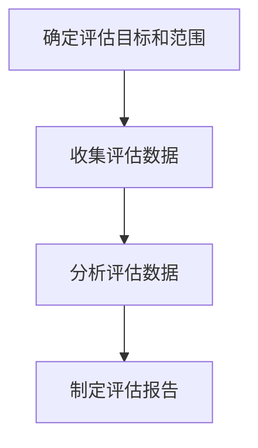

                 

# 利用开源经验提供技术债务评估和重构服务

关键词：开源经验，技术债务，评估方法，重构服务，最佳实践

摘要：
本文旨在探讨如何利用开源经验提供高效的技术债务评估和重构服务。首先，我们介绍了开源经验和技术债务的基本概念及其重要性。接着，详细阐述了技术债务评估的方法和工具，以及实际案例解析。随后，我们探讨了技术债务重构的概述、方法和工具，并提供了相应的案例解析。此外，本文总结了开源经验在技术债务管理中的应用和推广，以及技术债务管理的最佳实践。最后，附录部分提供了相关的开源经验和技术债务管理资源，以供读者参考。

## 第一部分: 引言与概述

### 第1章: 开源经验与技术债务概述

#### 1.1 什么是开源经验？

开源经验是指参与开源软件项目的实践和心得，包括但不限于代码贡献、项目维护、社区协作等方面。开源经验不仅有助于提高个人的编程技能，还能促进技术知识的传播和共享。

开源运动起源于20世纪90年代，当时软件开发者倡导软件的自由和开放，使软件源代码对所有人开放。这种开放性使得开源软件项目的质量不断提升，成为现代软件开发的重要驱动力。

开源经验的重要性主要体现在以下几个方面：

1. **提高软件质量和可维护性**：通过开源，开发者可以更早地发现并修复代码中的问题，从而提高软件的质量和可靠性。
2. **促进知识共享和社区合作**：开源项目为全球开发者提供了一个共同交流和学习的平台，促进了技术知识的传播和合作。
3. **技术债务管理**：开源经验为技术债务管理提供了宝贵的参考和实践经验，有助于团队在项目开发过程中识别和管理技术债务。

#### 1.2 技术债务的概念及其重要性

技术债务是指为了加快项目进度而在代码、设计、架构等方面积累的潜在问题。类似于财务债务，技术债务需要在未来的某个时间点进行偿还。

技术债务的重要性主要体现在以下几个方面：

1. **影响项目后期**：如果不及时解决技术债务，项目可能会在后期出现严重的质量问题，导致维护成本增加、开发效率降低。
2. **影响软件可维护性**：技术债务会导致代码变得复杂和难以维护，增加后续开发的难度和成本。
3. **影响项目进度**：技术债务可能会导致项目延期，影响整体进度和交付时间。

因此，有效管理技术债务是确保软件项目成功的关键。

#### 1.3 开源经验在技术债务管理中的应用

开源经验在技术债务管理中具有重要作用。以下是一些开源经验在技术债务管理中的应用：

1. **参考开源项目**：团队可以参考开源项目的设计和架构，避免重复造轮子，减少技术债务的产生。
2. **利用开源工具**：开源社区提供了许多优秀的工具，如代码质量评估工具、架构设计工具等，有助于团队进行技术债务评估和管理。
3. **学习开源项目的管理经验**：开源项目的成功离不开有效的管理经验，团队可以从开源项目中学习如何制定项目计划、协调团队协作、处理技术债务等。

总之，利用开源经验进行技术债务管理有助于提高项目的质量和效率，确保项目的可持续发展。

## 第二部分: 技术债务评估

### 第2章: 技术债务评估方法

技术债务评估是识别和管理技术债务的重要环节。本章节将详细介绍技术债务评估的重要性、基本原则和步骤。

#### 2.1 技术债务评估的重要性

技术债务评估的重要性体现在以下几个方面：

1. **了解技术债务现状**：通过评估，团队可以清楚地了解项目当前的技术债务状况，为后续的技术债务管理提供依据。
2. **为重构提供指导**：评估结果可以帮助团队确定哪些技术债务需要优先解决，从而为重构工作提供指导。
3. **预防未来问题**：通过对技术债务的评估，团队可以识别潜在的技术债务，提前采取措施预防未来问题。

#### 2.2 技术债务评估的基本原则

在进行技术债务评估时，团队应遵循以下基本原则：

1. **全面性**：评估应覆盖项目的各个方面，包括代码、设计、架构等，以确保全面了解技术债务的情况。
2. **客观性**：评估过程应尽量客观，避免主观判断，以减少评估结果的偏差。
3. **动态性**：技术债务是一个动态的过程，团队应定期进行评估，以跟踪技术债务的变化情况。

#### 2.3 技术债务评估的步骤与流程

技术债务评估的步骤通常包括以下几方面：

1. **确定评估目标和范围**：明确评估的目标和范围，如评估技术债务的类型、影响程度等。
2. **收集评估数据**：通过自动化工具和手动审查等方式，收集与项目相关的技术债务数据。
3. **分析评估数据**：对收集到的数据进行统计分析，识别潜在的技术债务，评估其影响程度和优先级。
4. **制定评估报告**：将评估结果总结成报告，向相关人员传达评估发现和建议。

下面是一个简化的技术债务评估步骤流程图：

#### 2.4 技术债务评估的误区

在进行技术债务评估时，团队可能会陷入以下误区：

1. **忽视评估的重要性**：有些团队可能认为技术债务评估是多余的，从而忽视了评估的重要作用。
2. **评估过于频繁**：频繁的评估可能会增加团队的工作量，但并不能真正解决技术债务问题。
3. **评估不全面**：只关注部分模块或技术的债务，忽视了其他方面的债务，导致评估结果不准确。

为了避免这些误区，团队应在评估过程中保持客观和全面，合理制定评估计划和策略。

通过以上内容，我们可以看到技术债务评估在项目中的重要性，以及如何进行有效的技术债务评估。在下一章中，我们将介绍一些常用的技术债务评估工具，帮助团队更好地进行评估工作。

## 第3章: 技术债务评估工具介绍

为了更高效地进行技术债务评估，团队可以借助一些专门的工具。这些工具可以帮助团队自动化收集和分析技术债务数据，提高评估的准确性和效率。本章节将介绍一些常用的技术债务评估工具，并比较它们的特点。

#### 3.1 自动化技术债务评估工具

自动化技术债务评估工具可以大幅提高评估的效率，以下是几种常用的自动化工具：

1. **SonarQube**
   - **特点**：SonarQube是一个开源的代码质量平台，可以检测代码中的缺陷、漏洞和不符合编程标准的代码。它支持多种编程语言，提供了丰富的报告和分析功能。
   - **使用场景**：适用于大规模项目和多种编程语言，可以帮助团队快速识别代码中的技术债务。

2. **CodeClimate**
   - **特点**：CodeClimate是一个在线的代码健康度评估工具，可以检测代码质量、代码复杂度、代码冗余等指标。它提供了一个直观的代码健康度评分。
   - **使用场景**：适用于中小型项目，可以帮助团队快速了解代码的健康状况，评估技术债务的程度。

3. **Checkstyle**
   - **特点**：Checkstyle是一个Java代码风格检查工具，可以帮助团队确保代码的一致性和可读性。它可以通过配置规则来检查代码中的潜在问题。
   - **使用场景**：适用于Java项目，可以帮助团队保持代码风格的统一，减少技术债务。

#### 3.2 常用技术债务评估工具

除了自动化工具外，还有一些手动和半自动化的技术债务评估工具，以下是几种常用的工具：

1. **TechDebt**
   - **特点**：TechDebt是一个开源的技术债务管理工具，可以帮助团队跟踪和管理技术债务。它提供了用户界面和命令行工具，可以与Git集成。
   - **使用场景**：适用于多种编程语言，可以帮助团队跟踪技术债务的变化，制定重构计划。

2. **DebtTracker**
   - **特点**：DebtTracker是一个开源的技术债务管理工具，可以与JIRA集成，提供技术债务的跟踪和管理功能。
   - **使用场景**：适用于大型项目和团队，可以帮助团队有效地管理技术债务，与项目进度相结合。

3. **BuildMaster**
   - **特点**：BuildMaster是一个自动化构建和债务评估工具，可以与CI/CD工具集成，提供技术债务的自动化评估和报告。
   - **使用场景**：适用于需要自动化债务评估的项目，可以帮助团队在构建过程中及时发现和解决技术债务。

#### 3.3 技术债务评估工具的比较与选择

在选用技术债务评估工具时，团队需要根据项目需求和特点进行比较和选择。以下是几个比较和选择的指标：

1. **功能完整性**：工具是否支持多种编程语言和评估指标，是否能够满足项目的需求。
2. **易用性**：工具的安装和使用是否简单，用户界面是否直观友好。
3. **评估准确性**：工具提供的评估数据是否可靠，评估结果是否符合实际。
4. **社区支持**：工具是否有一个活跃的社区，是否有丰富的文档和教程。

根据以上指标，团队可以评估不同工具的优劣，选择最适合项目需求的评估工具。在实际应用中，团队可以结合自动化工具和手动评估工具，确保技术债务评估的全面性和准确性。

通过以上介绍，我们可以看到技术债务评估工具在项目中的重要作用。在下一章中，我们将通过实际案例解析技术债务评估的过程和方法，帮助团队更好地理解技术债务评估的实践。

### 第4章: 技术债务评估案例解析

为了更好地理解技术债务评估的实际应用，本章节将解析两个不同规模的项目，展示如何进行技术债务评估。这些案例将涵盖大型项目和中小型项目的评估过程，并提供具体的评估步骤和结果分析。

#### 4.1 案例一：大型项目的技术债务评估

**背景介绍**：
项目A是一个大型企业级应用，开发周期长达三年。由于项目规模的庞大和复杂性，技术债务问题逐渐显现，对项目维护和后续开发带来了巨大挑战。

**评估过程**：
1. **确定评估目标和范围**：
   - 目标：全面了解项目的技术债务状况，为后续的重构工作提供依据。
   - 范围：评估涵盖代码质量、架构设计、测试覆盖率等方面。

2. **收集评估数据**：
   - 使用SonarQube自动化工具对代码进行质量评估，收集代码缺陷、漏洞和不符合编程标准的代码。
   - 手动审查项目的架构设计文档，分析现有架构的合理性和扩展性。
   - 检查项目的测试覆盖率，评估测试的全面性和有效性。

3. **分析评估数据**：
   - 通过SonarQube提供的报告，识别项目中的主要技术债务，包括代码缺陷、设计问题、测试漏洞等。
   - 根据技术债务的影响程度和紧急程度，对评估结果进行分类和优先级排序。

4. **制定评估报告**：
   - 将评估结果整理成详细的报告，包括技术债务的类型、数量、影响程度和修复建议。
   - 报告提交给项目团队和相关管理人员，为重构工作提供决策依据。

**结果分析**：
评估结果显示项目A存在大量技术债务，主要集中在代码缺陷、设计问题和测试漏洞方面。具体结果如下：
1. **代码缺陷**：项目A的代码中存在数百个缺陷，其中一部分是严重的安全漏洞，需要立即修复。
2. **设计问题**：项目的架构设计存在不合理之处，影响了系统的扩展性和可维护性。
3. **测试漏洞**：项目A的测试覆盖率较低，部分功能模块未经过充分测试，存在潜在的风险。

通过评估，项目团队明确了技术债务的严重性，制定了详细的修复计划，为后续的重构工作奠定了基础。

#### 4.2 案例二：中小型项目的技术债务评估

**背景介绍**：
项目B是一个中小型企业应用，开发周期约一年。由于项目周期较短，团队在开发过程中可能积累了一些技术债务，需要定期评估和管理。

**评估过程**：
1. **确定评估目标和范围**：
   - 目标：评估项目的技术债务状况，确保项目质量，避免技术债务影响项目进展。
   - 范围：主要关注代码质量和测试覆盖率。

2. **收集评估数据**：
   - 使用CodeClimate在线评估工具，对项目代码进行健康度评估，识别代码复杂度、代码冗余等问题。
   - 手动审查项目测试用例，评估测试的覆盖率和测试质量。

3. **分析评估数据**：
   - 根据CodeClimate提供的评估报告，识别项目中存在的主要技术债务。
   - 分析测试数据，评估测试的全面性和有效性。

4. **制定评估报告**：
   - 将评估结果整理成详细的报告，列出技术债务的具体问题和修复建议。
   - 报告提交给项目团队，为后续的修复工作提供指导。

**结果分析**：
评估结果显示项目B存在一定程度的技术债务，主要集中在代码质量和测试覆盖率方面。具体结果如下：
1. **代码质量**：项目B的代码存在一些复杂度高、冗余代码较多的问题，影响了代码的可读性和可维护性。
2. **测试覆盖率**：项目的测试覆盖率较低，部分功能模块的测试不充分，存在潜在的风险。

通过评估，项目团队及时发现和解决了部分技术债务，确保了项目的质量，避免了技术债务对项目进展的影响。

#### 4.3 案例解析与反思

通过以上两个案例，我们可以看到大型项目和中小型项目在技术债务评估方面有相似之处，也存在不同点。

1. **相似之处**：
   - 评估目标和范围：无论是大型项目还是中小型项目，评估的目标都是了解技术债务状况，为后续的重构工作提供依据。
   - 评估方法和工具：两者都使用了自动化评估工具和手动审查相结合的方式，确保评估的全面性和准确性。

2. **不同点**：
   - 评估深度：大型项目评估的深度更大，涵盖了代码质量、架构设计、测试覆盖率等多个方面，而中小型项目更侧重于代码质量和测试覆盖率。
   - 评估频率：大型项目由于技术债务问题较为严重，需要更频繁的评估，以确保技术债务得到及时解决；中小型项目可以采取定期评估的方式，根据项目周期和进度进行。

通过这两个案例，我们可以得出以下反思和总结：

1. **定期评估**：无论是大型项目还是中小型项目，定期进行技术债务评估都是非常重要的，有助于及时发现和解决技术债务。
2. **全面性和准确性**：评估过程应尽可能全面，涵盖项目各个方面，确保评估结果的准确性。
3. **合理分配资源**：根据评估结果，合理分配资源，优先解决高优先级的技术债务，确保项目的质量和进度。

通过以上案例解析和反思，我们可以更好地理解技术债务评估的实际应用，为项目的技术债务管理提供有效的指导。

### 第5章: 技术债务重构概述

技术债务重构是解决技术债务问题的关键步骤。本章节将介绍技术债务重构的定义、目标和原则，并详细描述重构的步骤和策略。

#### 5.1 什么是技术债务重构？

技术债务重构是指对现有代码、设计、架构进行修改，以解决技术债务问题。重构的目的是提高软件质量、降低维护成本和提升开发效率。

技术债务重构不同于常规的代码优化。它涉及对系统深层结构进行调整，以消除潜在的技术债务，确保软件的可持续性和可维护性。

#### 5.2 技术债务重构的目标与原则

技术债务重构的目标主要包括以下几个方面：

1. **消除技术债务**：通过重构，解决项目中积累的技术债务问题，减少潜在的风险和隐患。
2. **提高软件质量**：重构后的代码更简洁、易读，降低了未来的维护成本。
3. **提升开发效率**：重构后的系统结构更加清晰，有助于团队更高效地进行开发和维护。

在进行技术债务重构时，团队应遵循以下原则：

1. **逐步重构**：技术债务重构是一个逐步进行的过程，避免一次性大规模改动，以免引入新的风险。
2. **遵循最佳实践**：重构应遵循软件工程的最佳实践，如代码规范、设计模式等，以确保重构后的系统质量。
3. **注重团队协作**：重构过程中，团队成员应保持良好的沟通和协作，共同解决技术债务问题。

#### 5.3 技术债务重构的步骤与策略

技术债务重构通常包括以下步骤和策略：

1. **分析技术债务**：
   - 确定技术债务的类型、数量和影响程度。
   - 根据评估结果，制定重构计划，明确重构的目标和优先级。

2. **制定重构计划**：
   - 确定重构的阶段性目标，如重构某个模块、优化某个架构等。
   - 制定详细的实施计划，包括重构任务、时间表和责任人。

3. **分阶段实施重构**：
   - 根据重构计划，逐步进行重构任务，避免一次性大规模改动。
   - 在每个阶段完成后，进行代码审查和测试，确保重构效果。

4. **验证重构效果**：
   - 通过自动化测试和手动测试，验证重构后的系统功能是否正常。
   - 分析重构过程中的变更，评估重构对系统性能的影响。

5. **持续改进**：
   - 根据重构过程中的反馈和问题，持续改进重构策略和方法。
   - 定期评估技术债务状况，确保重构工作持续有效。

通过以上步骤和策略，团队可以有效地进行技术债务重构，提高软件质量和开发效率。

在下一章中，我们将详细介绍技术债务重构的具体方法，包括重构代码、优化数据库设计和重构架构设计等方面。

### 第6章: 技术债务重构方法

技术债务重构是解决项目技术债务问题的核心步骤。本章节将详细探讨技术债务重构的方法，包括重构代码、优化数据库设计和重构架构设计等，并介绍一些实用技巧和最佳实践。

#### 6.1 重构代码

重构代码是技术债务重构的基础。通过重构代码，可以消除代码中的缺陷、提高代码质量，从而降低维护成本。以下是重构代码的几种常见方法：

1. **简化复杂的代码结构**：
   - 将复杂的函数和类分解为更小、更易管理的部分。
   - 使用设计模式（如工厂模式、单例模式等）重构代码，提高代码的可读性和可维护性。

2. **优化代码复用性**：
   - 消除冗余代码，提取公共代码为函数或类。
   - 使用抽象类和接口，提高代码的复用性和可扩展性。

3. **提高代码可读性**：
   - 使用清晰的命名规范，提高代码的可读性。
   - 注释代码，帮助其他开发者理解代码的功能和逻辑。

4. **代码优化**：
   - 优化循环结构，减少不必要的计算和资源消耗。
   - 使用高效的数据结构和算法，提高代码的性能。

**实用技巧**：
1. **逐步重构**：避免一次性重构大量代码，以免引入新的问题。
2. **代码审查**：在重构过程中，进行代码审查，确保重构后的代码质量。
3. **自动化测试**：编写自动化测试，确保重构后的代码功能正常。

**最佳实践**：
1. **重构计划**：制定详细的重构计划，明确重构的目标、步骤和时间表。
2. **重构工具**：使用重构工具（如Eclipse、Visual Studio等）进行代码重构，提高效率。

#### 6.2 优化数据库设计

优化数据库设计是技术债务重构的重要环节。通过优化数据库设计，可以提高数据存储效率、减少数据冗余，从而提升系统性能。

1. **规范化**：
   - 对数据库表进行规范化，消除数据冗余，提高数据一致性。
   - 使用第三范式（3NF）或更高级的范式，确保数据的完整性和一致性。

2. **索引优化**：
   - 分析查询语句，创建合适的索引，提高查询速度。
   - 定期检查索引的性能，优化索引结构。

3. **数据迁移**：
   - 在重构过程中，对现有数据进行迁移和清理，确保数据的一致性和完整性。
   - 使用数据迁移工具（如DataGrip、SQL Server Management Studio等）进行数据迁移。

**实用技巧**：
1. **备份和恢复**：在优化数据库设计前，进行完整的数据备份，确保数据安全。
2. **测试和验证**：在重构完成后，进行全面的测试和验证，确保数据库设计的优化效果。

**最佳实践**：
1. **数据库设计文档**：编写详细的数据库设计文档，明确表结构、索引和查询语句。
2. **数据库重构工具**：使用数据库重构工具（如DBConvert、SQLines等）进行数据库重构，提高效率。

#### 6.3 重构架构设计

重构架构设计是解决技术债务的关键。通过重构架构设计，可以优化系统的整体结构，提高系统的可扩展性和可维护性。

1. **分层架构**：
   - 采用分层架构（如MVC、MVVM等），将系统分为不同的层次，提高模块的独立性和可维护性。
   - 定义清晰的接口和依赖关系，确保各层之间的解耦。

2. **微服务架构**：
   - 将大型系统拆分为多个微服务，提高系统的灵活性和可扩展性。
   - 使用API网关管理微服务之间的通信，简化系统的复杂度。

3. **容器化**：
   - 使用容器化技术（如Docker、Kubernetes等），提高系统的部署和运维效率。
   - 容器化有助于实现微服务架构，提高系统的可靠性和可伸缩性。

**实用技巧**：
1. **架构设计评审**：在重构架构设计前，进行架构设计评审，确保设计方案符合最佳实践。
2. **代码生成工具**：使用代码生成工具（如Spring Boot、Hibernate等），提高架构设计的自动化程度。

**最佳实践**：
1. **架构设计文档**：编写详细的架构设计文档，明确系统架构、模块和接口。
2. **持续集成和部署**：采用持续集成和部署（CI/CD）工具，确保架构重构的顺利进行。

通过以上方法，团队可以有效地进行技术债务重构，提高软件质量和开发效率。在下一章中，我们将介绍一些常用的技术债务重构工具，帮助团队更高效地进行重构工作。

### 第7章: 技术债务重构工具介绍

在进行技术债务重构时，使用适当的工具可以显著提高重构效率和代码质量。本章节将介绍几种常用的技术债务重构工具，包括自动化重构工具和常用重构工具，并探讨如何选择合适的重构工具。

#### 7.1 自动化重构工具

自动化重构工具可以帮助团队快速识别和修复代码中的问题，减少手动重构的工作量。以下是几种常用的自动化重构工具：

1. **Visual Studio Code Extension**
   - **特点**：Visual Studio Code（VSCode）是一款流行的代码编辑器，其内置了许多实用的扩展插件，包括重构插件。
   - **功能**：支持多种编程语言的重构操作，如代码格式化、变量和函数重命名、提取方法等。
   - **使用场景**：适用于日常编码和重构工作，可以显著提高开发效率。

2. **IntelliJ IDEA**
   - **特点**：IntelliJ IDEA 是一款功能强大的集成开发环境（IDE），提供了丰富的重构功能。
   - **功能**：支持代码重构、代码格式化、代码检查等，包括面向Java、Python、JavaScript等多种编程语言。
   - **使用场景**：适用于大型项目和复杂应用，可以帮助团队进行高效的重构。

3. **Eclipse**
   - **特点**：Eclipse 是一款开放源代码的IDE，支持多种编程语言。
   - **功能**：提供强大的代码重构工具，包括提取变量、方法、类等，支持多种编程语言的语法高亮和代码格式化。
   - **使用场景**：适用于Java和Android项目，可以帮助团队快速进行代码重构。

#### 7.2 常用重构工具

除了自动化重构工具外，还有一些独立的重构工具，它们可以在开发环境中集成，提供更全面的重构功能。以下是几种常用的重构工具：

1. **RefactoringBrowser**
   - **特点**：RefactoringBrowser 是一款基于Web的重构工具，可以与多种版本控制系统（如Git、Subversion等）集成。
   - **功能**：支持代码重构、代码格式化、代码检查等，提供直观的用户界面和丰富的重构选项。
   - **使用场景**：适用于跨平台的项目，可以方便地与Git等版本控制系统结合，支持多种编程语言。

2. **JRefractor**
   - **特点**：JRefractor 是一款Java代码重构工具，可以与Eclipse集成。
   - **功能**：提供全面的Java代码重构功能，包括提取方法、变量、类等，支持批量重构和代码格式化。
   - **使用场景**：适用于Java项目，可以帮助团队快速进行代码重构和优化。

3. **CodeTyphon**
   - **特点**：CodeTyphon 是一款跨平台的代码重构工具，支持多种编程语言。
   - **功能**：提供代码重构、代码格式化、代码检查等功能，支持自定义重构规则和插件。
   - **使用场景**：适用于多种编程语言项目，可以帮助团队进行高效的重构和代码优化。

#### 7.3 选择合适的重构工具

选择合适的重构工具对于提高重构效率和代码质量至关重要。以下是一些选择重构工具的考虑因素：

1. **编程语言支持**：选择支持项目所使用的编程语言的工具，确保工具的功能和特性能够满足项目需求。

2. **集成性**：选择可以与项目开发环境（如IDE、版本控制系统等）集成的工具，以便于使用和管理。

3. **功能和性能**：评估工具提供的重构功能是否全面，工具的性能是否能够满足项目需求。

4. **社区和文档**：选择有活跃社区和支持文档的工具，以便在遇到问题时能够得到及时的帮助。

5. **成本**：考虑工具的成本，包括购买费用、维护费用等，选择性价比高的工具。

通过以上考虑因素，团队可以选择最适合自己的重构工具，提高重构效率和代码质量。

### 第8章: 技术债务重构案例解析

为了更好地理解技术债务重构的实际应用，本章节将分析两个技术债务重构的案例，分别是大型项目和中小型项目的重构实践，并提供相应的结果分析。

#### 8.1 案例一：大型项目的重构实践

**背景介绍**：
项目C是一个大型企业级应用，开发周期长达五年，随着功能的不断扩展和需求的变更，项目代码库变得臃肿，技术债务问题日益严重。为了解决这些问题，项目团队决定进行技术债务重构。

**重构过程**：
1. **确定重构目标和范围**：
   - 目标：提高代码质量、优化系统架构、减少技术债务。
   - 范围：重构涵盖代码质量、数据库设计、系统架构等方面。

2. **评估技术债务**：
   - 使用SonarQube进行代码质量评估，识别代码缺陷和不符合编程标准的代码。
   - 手动审查数据库设计和系统架构，分析其合理性和扩展性。

3. **制定重构计划**：
   - 制定详细的重构计划，包括重构任务、时间表和责任人。
   - 将重构任务分为多个阶段，逐步进行重构，避免一次性大规模改动。

4. **实施重构**：
   - 使用IntelliJ IDEA进行代码重构，包括简化复杂的代码结构、优化代码复用性、提高代码可读性。
   - 优化数据库设计，规范化表结构，创建合适的索引。
   - 采用微服务架构，将大型系统拆分为多个微服务，提高系统的灵活性和可扩展性。

5. **验证重构效果**：
   - 进行全面的测试，包括单元测试、集成测试和系统测试，确保重构后的系统功能正常。
   - 分析重构过程中的变更，评估重构对系统性能的影响。

**结果分析**：
重构后，项目C的技术债务问题得到了显著改善，具体结果如下：
1. **代码质量**：代码结构更简洁、清晰，减少了代码冗余，提高了代码可读性和可维护性。
2. **数据库设计**：数据库表结构规范化，索引优化，查询性能显著提高。
3. **系统架构**：采用微服务架构，系统更加灵活，扩展性和可维护性得到提升。

通过重构，项目C的开发效率和质量得到显著提高，技术债务问题得到了有效解决。

#### 8.2 案例二：中小型项目的重构实践

**背景介绍**：
项目D是一个中小型企业应用，开发周期约一年。由于项目周期较短，团队在开发过程中积累了一些技术债务，影响了项目的质量和进度。为了解决这些问题，项目团队决定进行技术债务重构。

**重构过程**：
1. **确定重构目标和范围**：
   - 目标：提高代码质量、优化数据库设计、提升开发效率。
   - 范围：重构涵盖代码质量、数据库设计、系统测试等方面。

2. **评估技术债务**：
   - 使用CodeClimate进行代码健康度评估，识别代码复杂度、代码冗余等问题。
   - 手动审查项目测试用例，分析测试的全面性和有效性。

3. **制定重构计划**：
   - 制定详细的重构计划，包括重构任务、时间表和责任人。
   - 将重构任务分为多个阶段，逐步进行重构，避免一次性大规模改动。

4. **实施重构**：
   - 使用Visual Studio Code进行代码重构，包括简化复杂的代码结构、优化代码复用性、提高代码可读性。
   - 优化数据库设计，规范化表结构，创建合适的索引。
   - 加强系统测试，编写新的测试用例，提高测试覆盖率。

5. **验证重构效果**：
   - 进行全面的测试，包括单元测试、集成测试和系统测试，确保重构后的系统功能正常。
   - 分析重构过程中的变更，评估重构对系统性能的影响。

**结果分析**：
重构后，项目D的技术债务问题得到了显著改善，具体结果如下：
1. **代码质量**：代码结构更简洁、清晰，减少了代码冗余，提高了代码可读性和可维护性。
2. **数据库设计**：数据库表结构规范化，索引优化，查询性能显著提高。
3. **系统测试**：测试覆盖率提高，系统稳定性得到提升。

通过重构，项目D的开发效率和质量得到显著提高，技术债务问题得到了有效解决。

#### 8.3 案例解析与反思

通过以上两个案例，我们可以看到技术债务重构在实际项目中的应用效果。以下是一些解析与反思：

1. **大型项目的重构**：
   - 重构过程中，需要更全面和深入的技术债务评估，确保重构的针对性和有效性。
   - 采用微服务架构等先进技术，可以显著提高系统的灵活性和可扩展性。
   - 重构过程中，要注重团队协作和沟通，确保重构任务的顺利进行。

2. **中小型项目的重构**：
   - 定期进行技术债务评估，及时解决技术债务，避免债务积累影响项目质量。
   - 加强系统测试，提高测试覆盖率，确保重构后的系统稳定性。
   - 使用合适的重构工具和最佳实践，提高重构效率和代码质量。

通过技术债务重构，项目可以显著提高开发效率和质量，确保项目的可持续发展。在实际操作中，团队应根据项目的规模和特点，制定合理的重构计划和策略。

### 第9章: 开源经验总结

开源经验在技术债务管理中发挥着重要作用。本章节将对开源经验进行总结，探讨开源社区的贡献与收获、开源经验对技术债务管理的影响，以及如何推广和应用开源经验。

#### 9.1 开源社区的贡献与收获

开源社区是一个充满活力和创造力的平台，参与者可以通过以下方式做出贡献和收获：

1. **贡献代码**：
   - 参与开源项目，贡献代码和功能，提升个人编程技能。
   - 通过代码审查和合作，学习他人的编程经验和最佳实践。
   - 获得实际项目经验，提高解决问题的能力。

2. **项目维护**：
   - 参与开源项目的维护工作，包括修复漏洞、优化代码、编写文档等。
   - 通过维护开源项目，建立个人品牌，提高职业竞争力。
   - 获得更多的机会参与大型项目和与行业专家交流。

3. **社区协作**：
   - 参与开源社区的讨论和交流，与其他开发者分享经验和心得。
   - 建立人脉关系，拓展视野，发现更多的合作机会。
   - 通过社区协作，推动技术的传播和创新。

#### 9.2 开源经验对技术债务管理的影响

开源经验在技术债务管理中具有显著的影响，主要体现在以下几个方面：

1. **最佳实践**：
   - 开源项目通常遵循最佳实践，如代码规范、设计模式和架构设计，为团队提供了良好的技术债务管理参考。
   - 通过学习开源项目的最佳实践，团队可以避免在开发过程中积累过多的技术债务。

2. **工具和资源**：
   - 开源社区提供了丰富的工具和资源，如代码质量评估工具、重构工具和架构设计工具，帮助团队更高效地进行技术债务管理。
   - 开源工具通常经过社区的长期实践和优化，具有较高的可靠性和实用性。

3. **社区反馈**：
   - 开源项目通常具有活跃的社区，开发者可以及时获得社区的反馈和建议，有助于及时发现和解决技术债务问题。
   - 社区反馈还可以帮助团队改进项目设计，提高软件质量和可维护性。

#### 9.3 开源经验的推广与应用

为了更好地利用开源经验进行技术债务管理，团队可以采取以下措施：

1. **参与开源项目**：
   - 鼓励团队成员参与开源项目，通过贡献代码和参与社区讨论，学习最佳实践和技术债务管理的经验。
   - 选择与团队技术方向相关的开源项目，提高参与的效果和影响力。

2. **建立内部开源项目**：
   - 在团队内部建立开源项目，鼓励团队成员贡献代码和经验，形成良好的技术债务管理文化。
   - 内部开源项目可以作为团队的技术积累和知识共享平台。

3. **培训与交流**：
   - 定期组织开源培训和技术交流活动，分享开源经验和技术债务管理的心得。
   - 邀请开源社区的专家进行讲座和指导，提高团队的技术水平和管理能力。

4. **技术债务管理工具**：
   - 选择合适的开源工具，如代码质量评估工具、重构工具等，用于技术债务评估和管理。
   - 根据团队需求，定制和优化开源工具，提高其适用性和效果。

通过以上措施，团队可以充分利用开源经验，提高技术债务管理的效率和质量，确保项目的可持续发展。

### 第10章: 开源最佳实践

开源项目是一种重要的知识共享和合作模式，通过开源项目，开发者可以共同推动技术的进步。本章节将介绍如何参与开源项目、开源项目的管理与维护，以及如何推广和传播开源项目。

#### 10.1 如何参与开源项目？

参与开源项目对于开发者来说是一个宝贵的机会，以下是一些具体的步骤和建议：

1. **选择开源项目**：
   - 根据个人兴趣和技能选择合适的开源项目。
   - 考虑项目的活跃程度、维护状态以及是否适合自己的技术方向。
   - 查看项目的贡献指南，了解项目的发展方向和贡献规范。

2. **了解项目背景和文档**：
   - 阅读项目的README文件，了解项目的目标、功能和使用方法。
   - 查看项目的文档和代码注释，熟悉项目的代码风格和设计架构。
   - 了解项目的许可协议，确保遵守相关法律法规。

3. **贡献代码**：
   - 根据项目的需求，选择适合的模块进行开发或优化。
   - 编写清晰的代码注释，确保其他开发者能够理解代码的功能和逻辑。
   - 提交代码前进行充分的测试，确保代码的质量和功能正确性。

4. **参与社区讨论**：
   - 在项目的讨论区或邮件列表中参与讨论，分享自己的经验和见解。
   - 积极回应社区成员的问题和建议，共同解决项目中的问题。
   - 鼓励其他开发者参与项目，扩大项目的贡献者和影响力。

#### 10.2 开源项目的管理与维护

一个成功的开源项目需要有良好的管理和维护，以下是一些关键点：

1. **项目管理**：
   - 确定项目的目标和愿景，明确项目的长期发展方向。
   - 制定项目计划和里程碑，确保项目的进度和交付。
   - 管理项目的文档和资源，确保信息的及时更新和共享。

2. **代码维护**：
   - 定期更新代码库，修复漏洞和bug，确保项目的稳定性和安全性。
   - 接受社区成员的反馈和建议，不断改进项目的设计和实现。
   - 保持代码的可读性和一致性，遵循统一的编码规范。

3. **社区协作**：
   - 建立有效的沟通渠道，如GitHub Issues、Discord、邮件列表等。
   - 定期组织线上或线下的活动，促进社区成员之间的交流和合作。
   - 鼓励团队协作，共同推动项目的进展和改进。

#### 10.3 开源项目的推广与传播

推广和传播开源项目是增加项目知名度、吸引更多贡献者的重要手段。以下是一些推广策略：

1. **社交媒体**：
   - 利用Twitter、LinkedIn、GitHub等社交媒体平台宣传项目，发布项目的最新动态和成果。
   - 参与相关技术社区的讨论，分享项目的亮点和优势。

2. **技术会议**：
   - 参加技术会议和讲座，展示项目的应用场景和功能。
   - 与行业专家交流，获得宝贵的反馈和建议。

3. **技术博客**：
   - 撰写技术博客，详细记录项目的技术细节和使用方法。
   - 发布项目的文档和教程，帮助新手快速上手。

4. **开源项目平台**：
   - 在开源项目平台（如GitHub、GitLab等）上建立项目页面，展示项目的功能、文档和贡献指南。
   - 利用平台提供的工具和资源，提升项目的可见度和活跃度。

通过以上措施，开源项目可以更好地传播和推广，吸引更多的贡献者和用户，共同推动开源生态的发展。

### 第11章: 技术债务管理最佳实践

技术债务管理是软件项目成功的关键环节。有效的技术债务管理可以确保项目的可持续发展，提高软件质量。本章节将介绍技术债务管理的最佳策略、具体实践案例以及持续改进的方法。

#### 11.1 技术债务管理的最佳策略

有效的技术债务管理需要制定明确的策略，以下是一些最佳策略：

1. **定期评估**：
   - 设定固定的技术债务评估周期，如季度或年度，确保技术债务得到及时发现和解决。
   - 根据项目进度和需求，灵活调整评估频率，以适应项目的变化。

2. **优先级管理**：
   - 根据技术债务的影响程度和紧急程度，确定优先级，确保资源能够优先解决高优先级的技术债务。
   - 避免同时处理多个高优先级债务，确保每个债务都能得到充分的关注和处理。

3. **自动化与手动结合**：
   - 利用自动化工具进行技术债务评估，提高效率和准确性。
   - 结合手动审查，确保评估的全面性和准确性，特别是针对自动化工具无法覆盖的方面。

4. **反馈机制**：
   - 建立有效的反馈机制，收集项目成员和用户的反馈，及时调整技术债务管理策略。
   - 定期回顾技术债务管理的效果，总结经验和教训，持续改进管理方法。

#### 11.2 技术债务管理的最佳实践案例

以下是一个大型企业级应用的技术债务管理实践案例：

**背景**：
项目E是一个大型企业级应用，随着业务的发展和功能的增加，技术债务问题逐渐显现。为了确保项目的可持续发展，项目团队决定进行技术债务管理。

**实践过程**：

1. **确定评估目标和范围**：
   - 目标：全面了解项目的技术债务状况，为后续的重构工作提供依据。
   - 范围：评估涵盖代码质量、数据库设计、架构设计、测试覆盖率等方面。

2. **评估过程**：
   - 使用SonarQube进行代码质量评估，识别代码缺陷、漏洞和不符合编程标准的代码。
   - 手动审查数据库设计文档，分析表结构和查询效率。
   - 检查项目测试覆盖率，评估测试的全面性和有效性。

3. **制定评估报告**：
   - 将评估结果整理成详细的报告，列出技术债务的具体问题和修复建议。
   - 报告提交给项目团队和相关管理人员，为重构工作提供决策依据。

4. **重构过程**：
   - 使用IntelliJ IDEA进行代码重构，简化复杂的代码结构，提高代码的可读性和可维护性。
   - 优化数据库设计，规范化表结构，创建合适的索引，提高查询效率。
   - 采用微服务架构，将大型系统拆分为多个微服务，提高系统的灵活性和可扩展性。

5. **验证重构效果**：
   - 进行全面的测试，包括单元测试、集成测试和系统测试，确保重构后的系统功能正常。
   - 分析重构过程中的变更，评估重构对系统性能的影响。

**结果分析**：
通过技术债务管理实践，项目E的技术债务问题得到了显著改善，具体结果如下：
1. **代码质量**：代码结构更加简洁、清晰，可读性和可维护性显著提高。
2. **数据库设计**：数据库表结构规范化，查询效率显著提升。
3. **系统架构**：采用微服务架构，系统更加灵活，扩展性和可维护性得到提升。

#### 11.3 技术债务管理的持续改进

技术债务管理是一个持续的过程，需要不断地改进和优化。以下是一些持续改进的方法：

1. **学习与培训**：
   - 定期参加技术债务管理相关的培训和研讨会，了解最新的管理方法和工具。
   - 组织内部培训，提高团队的技术债务管理能力。

2. **反馈与改进**：
   - 及时收集项目成员和用户的反馈，了解技术债务管理的实际效果。
   - 根据反馈结果，调整技术债务管理策略和流程，优化管理方法。

3. **自动化工具的更新**：
   - 定期评估和更新自动化工具，确保工具的功能和性能符合项目需求。
   - 利用新的自动化工具，提高技术债务评估和重构的效率。

4. **文档与知识共享**：
   - 编写详细的技术债务管理文档，记录管理流程、方法和经验。
   - 在团队内部和外部分享技术债务管理的最佳实践，促进知识共享。

通过持续改进，项目团队能够不断提高技术债务管理的效率和质量，确保项目的可持续发展。

### 附录A: 开源经验与技术债务管理资源

为了更好地利用开源经验和技术债务管理工具，本附录提供了相关的开源经验和技术债务管理资源，包括开源经验相关资源、技术债务管理工具资源和开源社区与技术债务管理交流平台。

#### A.1 开源经验相关资源

1. **开源社区**
   - GitHub（https://github.com/）：全球最大的开源代码托管平台，提供丰富的开源项目和资源。
   - GitLab（https://gitlab.com/）：功能丰富的开源代码托管平台，支持自托管和企业级服务。
   - Bitbucket（https://bitbucket.org/）：支持Git的云代码托管平台，适用于团队协作和开源项目。

2. **开源指南**
   - 《贡献开源的指南》（https://opensource.guide/）：提供详细的贡献开源的流程和最佳实践。
   - 《GitHub贡献指南》（https://github.com/github/prime）：GitHub官方贡献指南，包含如何参与开源项目的详细说明。

3. **开源项目与工具**
   - SonarQube（https://www.sonarqube.org/）：开源的代码质量平台，提供代码质量评估和漏洞检测功能。
   - DebtTracker（https://github.com/esteiro/debttracker）：开源的技术债务管理工具，提供技术债务的跟踪和管理功能。
   - CodeClimate（https://codeclimate.com/）：在线的代码健康度评估工具，帮助团队评估代码质量和安全性。

#### A.2 技术债务管理工具资源

1. **开源工具**
   - TechDebt（https://github.com/esteiro/techdebt）：开源的技术债务管理工具，提供技术债务的跟踪和管理功能。
   - DebtTracker（https://github.com/esteiro/debttracker）：开源的技术债务管理工具，提供技术债务的跟踪和管理功能。
   - BuildMaster（https://www.gostatic.io/）：自动化构建和债务评估工具，支持CI/CD流程中的技术债务评估。

2. **工具文档**
   - SonarQube官方文档（https://docs.sonarqube.org/）：详细的SonarQube使用和配置指南。
   - DebtTracker官方文档（https://github.com/esteiro/debttracker）：DebtTracker的使用指南和文档。

3. **参考资源**
   - 《技术债务管理：从原理到实践》（https://www.amazon.com/dp/148423271X）：一本全面介绍技术债务管理的书籍。
   - 《代码整洁之道》（https://www.amazon.com/dp/0321480274）：一本关于代码质量和重构的最佳实践指南。

#### A.3 开源社区与技术债务管理交流平台

1. **技术论坛**
   - Stack Overflow（https://stackoverflow.com/）：全球最大的开发者问答社区，提供丰富的技术问答和讨论。
   - 知乎（https://www.zhihu.com/）：国内知名的知识分享社区，涵盖众多技术话题。
   - CSDN（https://www.csdn.net/）：国内领先的IT技术社区，提供丰富的技术文章和讨论。

2. **技术博客**
   - Medium（https://medium.com/）：全球知名的内容分享平台，许多开发者在这里分享技术心得和见解。
   - 博客园（https://www.cnblogs.com/）：国内领先的开发者博客社区，汇聚众多技术博客。
   - 掘金（https://juejin.cn/）：国内新兴的IT技术社区，提供丰富的技术文章和讨论。

通过以上资源，开发者可以更好地利用开源经验和技术债务管理工具，提高项目的质量和可持续性。同时，参与开源社区和技术债务管理的交流平台，有助于开发者学习和分享经验，推动个人和团队的成长。 

### 结束语

本文详细探讨了如何利用开源经验提供技术债务评估和重构服务。从开源经验和技术债务的基本概念，到评估方法、重构方法，再到开源最佳实践和资源介绍，我们逐步揭示了技术债务管理的重要性和实践方法。

开源经验在技术债务管理中具有重要作用，通过参与开源项目，开发者可以学习最佳实践、积累经验，并为项目贡献代码和智慧。开源经验不仅有助于提高个人技能，还能促进团队协作和技术进步。

技术债务评估和重构是确保软件项目质量和可持续性的关键步骤。通过定期评估技术债务、制定合理的重构计划，团队可以逐步解决技术债务问题，提高软件的可维护性和可靠性。

开源最佳实践提供了参与开源项目、管理开源项目和推广开源项目的具体方法。通过这些实践，团队可以更好地利用开源资源，推动技术债务管理的持续改进。

在文章的附录部分，我们提供了丰富的开源经验和技术债务管理资源，包括开源社区、工具文档和交流平台，以供读者参考和使用。

最后，感谢您的阅读。希望本文能对您的技术债务管理和开源实践提供有益的启示。在未来的项目中，让我们一起利用开源经验，共同推动技术的进步和软件的可持续发展。

