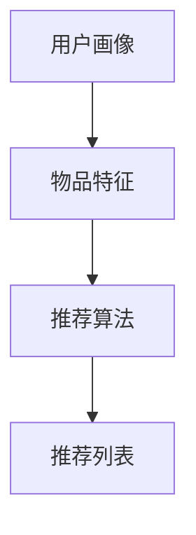

                 

### 《剪枝技术在推荐系统中的实践探索》

#### 关键词：推荐系统、剪枝技术、神经网络、模型压缩、性能优化

#### 摘要：

推荐系统作为现代互联网的核心技术之一，已经广泛应用于电商、新闻推送、社交媒体等多个领域。然而，随着数据规模的扩大和模型复杂性的增加，推荐系统面临着计算资源和存储资源的巨大挑战。剪枝技术作为一种有效的模型压缩方法，通过去除网络中不重要的连接和节点，可以显著减小模型的规模，提高计算效率。本文将探讨剪枝技术在推荐系统中的应用，分析其原理、实现方法和实际效果，为推荐系统的优化提供新的思路。

---

### 第一部分：背景与核心概念

#### 第1章：推荐系统概述

推荐系统是利用机器学习算法从大量数据中提取有用信息，向用户推荐其可能感兴趣的项目。它通常包含三个基本组成部分：用户画像、物品特征和推荐算法。

##### 1.1 推荐系统基本原理

推荐系统的工作流程可以概括为以下几步：

1. **用户画像**：收集并分析用户的历史行为数据，如浏览记录、购买行为等，以建立用户画像。
2. **物品特征**：收集并描述物品的特征信息，如商品类别、价格、用户评价等。
3. **推荐算法**：基于用户画像和物品特征，利用推荐算法计算用户对物品的偏好得分，从而生成推荐列表。

下面是一个简单的Mermaid流程图，展示推荐系统的基本流程：



##### 1.2 剪枝技术的基本概念

剪枝技术是一种用于模型压缩的方法，其核心思想是通过去除模型中不重要的连接和节点，减小模型的规模。剪枝技术的原理可以简单描述为：

1. **筛选**：对模型中的每个连接进行重要性评估，筛选出重要性较低的连接。
2. **删除**：将筛选出的不重要的连接和节点从模型中移除。

剪枝技术的数学模型可以表示为：

$$
Prune(M) = M - \{w_i | w_i \text{ 不重要}\}
$$

其中，$M$代表原始模型，$\{w_i\}$表示模型中的连接或节点。

以下是剪枝算法的基本框架的伪代码：

```python
def prune(model, threshold):
    important_connections = []
    for connection in model.connections:
        if connection.importance > threshold:
            important_connections.append(connection)
    pruned_model = Model(important_connections)
    return pruned_model
```

##### 1.3 剪枝技术在神经网络中的应用

剪枝技术在神经网络中的应用非常广泛。以下是一个简单的案例，展示剪枝技术在神经网络模型压缩中的应用：

假设我们有一个全连接神经网络，包含1000个神经元。通过剪枝技术，我们可以将其中的300个神经元去除，从而减小模型的规模。

以下是神经网络剪枝过程的伪代码：

```python
def neural_network_prune(neural_network, prune_ratio):
    num_to_prune = int(len(neural_network.neurons) * prune_ratio)
    pruned_neurons = random.sample(neural_network.neurons, num_to_prune)
    for neuron in pruned_neurons:
        neural_network.remove_neuron(neuron)
    return neural_network
```

---

在本章中，我们介绍了推荐系统的基础知识和剪枝技术的基本概念。接下来，我们将进一步探讨剪枝技术在推荐系统中的应用，分析其优点与挑战，并深入探讨剪枝算法的原理与实现。

### 第一部分总结

通过本章的介绍，我们了解了推荐系统的工作原理和基本组成，以及剪枝技术的基本概念和原理。这些基础知识的理解，为我们后续探讨剪枝技术在推荐系统中的深入应用提供了必要的背景知识。在下一章中，我们将进一步分析剪枝技术在推荐系统中的应用，探讨其优势与挑战，并详细介绍不同的剪枝算法及其实现细节。让我们继续深入探讨，了解更多关于剪枝技术在推荐系统中的实践应用。

