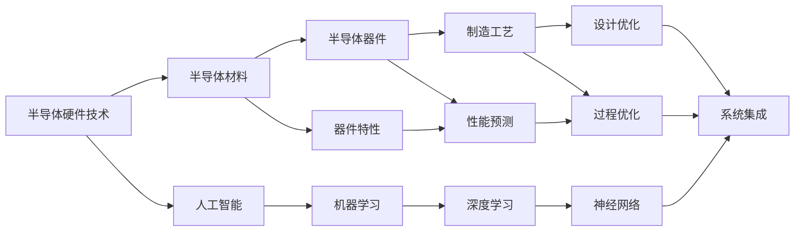

                 

### 《半导体硬件技术与AI发展的关系》

> **关键词：** 半导体硬件、AI、人工智能、硬件设计、硬件优化、半导体材料、制造工艺、设计自动化、系统集成

> **摘要：** 本篇文章将探讨半导体硬件技术与人工智能（AI）发展的紧密关系。通过对半导体硬件技术基础、AI在半导体硬件设计优化中的应用、以及未来趋势的详细分析，旨在揭示AI如何推动半导体硬件技术的发展，并探讨这一领域面临的挑战与机遇。文章结构紧凑，逻辑清晰，以帮助读者全面了解半导体硬件技术与AI的深度融合及其对未来的影响。

#### 第一部分：半导体硬件技术基础

半导体硬件技术是现代信息技术的基石，其发展对AI领域的影响尤为深远。本部分将详细介绍半导体硬件技术的基础知识，包括半导体材料与器件的基本原理、半导体制造工艺、以及半导体器件类型与应用。

##### 第1章：半导体硬件技术概述

半导体材料与器件的基本原理是理解半导体硬件技术的基础。半导体材料的导电性能介于导体和绝缘体之间，其特性受温度、掺杂和电场等因素的影响。常见的半导体材料包括硅（Si）、锗（Ge）和砷化镓（GaAs）等。

半导体器件的基本结构和工作原理包括双极型晶体管（BJT）和场效应晶体管（FET）。双极型晶体管通过控制基极电流来控制集电极和发射极之间的电流，而场效应晶体管则通过控制栅极电压来控制源极和漏极之间的电流。这两种器件是现代集成电路的基础。

半导体制造工艺是半导体器件生产的关键步骤。常见的制造工艺包括晶体生长与外延技术、薄膜沉积技术、光刻与蚀刻技术、离子注入与掺杂技术，以及测试与缺陷分析技术。这些工艺的精度和效率直接决定了半导体器件的性能和可靠性。

半导体器件类型与应用涵盖了从传统的集成电路到新兴的光电子器件和存储器件。双极型晶体管和场效应晶体管在数字和模拟电路中广泛应用，太阳能电池和光电子器件在可再生能源和光通信领域具有重要地位，而存储器件如闪存和DRAM则在数据存储和数据处理中发挥着关键作用。

##### 第2章：半导体硬件设计与优化

半导体硬件设计流程是半导体器件从概念设计到产品化的必经之路。设计流程通常包括设计需求分析、电路设计、器件模拟与验证、器件测试与性能评估等环节。每个环节都需要精确的技术知识和严谨的工程实践。

半导体硬件优化技术是提升半导体器件性能和降低成本的关键。高频电路设计、功率电路设计、低功耗电路设计、集成电路布局与布线以及器件级和系统级优化方法都是半导体硬件优化的重要组成部分。这些优化技术不仅涉及电路设计和器件特性，还涉及到材料科学和物理学的深层次原理。

#### 第二部分：AI与半导体硬件技术的融合

随着AI技术的发展，AI与半导体硬件技术的融合已成为当前研究的热点。本部分将探讨AI技术在半导体硬件设计与优化中的应用，以及半导体硬件技术在AI领域的应用，揭示两者之间的紧密联系。

##### 第3章：AI在半导体硬件设计与优化中的应用

AI技术在半导体设计中的应用主要体现在设计自动化、器件性能预测、制造过程优化、质量控制与故障诊断等方面。设计自动化通过AI算法自动化半导体器件的设计流程，提高设计效率。器件性能预测利用AI算法预测半导体器件的性能，帮助工程师优化设计参数。制造过程优化利用AI算法优化制造流程，提高生产效率和质量。质量控制与故障诊断则利用AI算法实时监控半导体制造过程中的质量指标，快速识别和修复故障。

##### 第4章：AI与半导体硬件技术协同发展的未来趋势

AI与半导体硬件技术的协同发展将推动新型半导体材料与器件的研发，新型AI芯片的设计与开发，以及跨领域技术创新与协作。新型半导体材料如石墨烯、二维材料等具有独特的电学性质，有望在未来的半导体器件中发挥重要作用。新型AI芯片如神经形态芯片、量子计算芯片等，将基于这些新型半导体材料，实现更高效、更强大的计算能力。跨领域技术创新与协作将推动AI与半导体硬件技术的深度融合，为未来科技的发展提供强大的动力。

#### 第三部分：半导体硬件技术在AI实际项目中的应用

半导体硬件技术在AI实际项目中的应用日益广泛，从芯片设计到系统集成的每一个环节都离不开半导体硬件技术的支持。本部分将通过具体项目案例，探讨半导体硬件技术在AI领域的应用挑战与解决方案。

##### 第5章：AI驱动下的半导体硬件研发案例

本章节将通过两个具体案例，展示AI在半导体硬件研发中的应用。第一个案例是AI驱动的半导体器件性能优化，通过AI算法预测和优化器件性能，实现高性能半导体器件的研发。第二个案例是AI在半导体制造中的应用，通过AI算法优化制造流程，提高生产效率和质量。

##### 第6章：半导体硬件技术在AI应用中的挑战与解决方案

半导体硬件技术在AI应用中面临着诸多挑战，如半导体硬件的能耗与散热问题、半导体硬件的集成度与可靠性问题，以及半导体硬件与AI算法的协同优化问题。针对这些挑战，本章节将探讨现有解决方案和未来发展方向，为半导体硬件技术在AI领域的应用提供指导。

##### 第7章：半导体硬件技术在AI领域的应用前景

半导体硬件技术在AI领域的应用前景广阔，新型半导体材料的研究与应用、AI与半导体硬件的深度融合、新型AI芯片的设计与开发，都将为AI技术的发展提供强大的支撑。本章节将探讨半导体硬件技术在AI领域的未来发展趋势，并分析我国在半导体硬件技术在AI领域的战略布局与发展规划。

#### 附录

附录部分将提供半导体硬件技术相关资源与工具，包括半导体硬件技术相关书籍与文献、AI与半导体硬件技术相关工具，以及半导体硬件技术在AI领域应用的相关项目案例。这些资源将为读者提供进一步学习和研究的参考。

---

通过以上章节的详细分析，本文全面探讨了半导体硬件技术与AI发展的关系。半导体硬件技术作为AI发展的基石，其进步将直接推动AI技术的革新。同时，AI技术的应用也为半导体硬件技术带来了新的机遇和挑战。随着两者之间的深度融合，我们可以期待未来科技领域的更加辉煌的成就。

#### 附录A：半导体硬件技术相关资源与工具

为了帮助读者更深入地了解半导体硬件技术及其在AI领域的应用，本附录将介绍一些相关的书籍、文献和工具，包括设计工具、模拟与验证工具、制造与测试工具等。

##### A.1 半导体硬件技术相关书籍与文献

1. **《半导体物理与器件》** - 作者：孙忠良
   - 本书详细介绍了半导体材料的基本物理性质、半导体器件的结构和工作原理，以及半导体器件的设计和制造技术。

2. **《半导体制造技术》** - 作者：王汝芳
   - 本书系统地介绍了半导体制造的基本工艺，包括晶体生长、外延生长、薄膜沉积、光刻、蚀刻、离子注入和器件测试等。

3. **《集成电路设计》** - 作者：李国杰
   - 本书涵盖了集成电路设计的全过程，从设计需求分析、电路设计、器件模拟与验证到器件测试与性能评估，提供了丰富的实例和案例分析。

4. **《人工智能：一种现代方法》** - 作者： Stuart J. Russell & Peter Norvig
   - 本书是人工智能领域的经典教材，介绍了人工智能的基本理论、技术方法和应用实例，包括机器学习、自然语言处理、计算机视觉等。

5. **《神经网络与深度学习》** - 作者：Ian Goodfellow、Yoshua Bengio、Aaron Courville
   - 本书详细介绍了神经网络和深度学习的基本原理、算法模型和实现技术，是深度学习领域的权威著作。

##### A.2 AI与半导体硬件技术相关工具

1. **Cadence** - Cadence是一个功能强大的电子设计自动化（EDA）工具，提供从概念设计到最终生产的全流程解决方案，适用于集成电路设计和半导体器件模拟。

2. **Synopsys** - Synopsys的EDA工具在半导体制造工艺中广泛使用，包括设计自动化、模拟与验证、制造与测试等。

3. **MATLAB/Simulink** - MATLAB和Simulink是数学建模和仿真工具，广泛应用于半导体器件性能预测和制造过程优化。

4. **SPICE** - SPICE（Simulation Program with Integrated Circuit Emphasis）是一种电路仿真工具，用于模拟半导体器件的行为和电路的性能。

5. **Python与相关库** - Python是一种通用的编程语言，其在半导体硬件和AI领域的应用也越来越广泛。NumPy、SciPy、Matplotlib等Python库为数据分析和图形可视化提供了强大的支持。

#### 附录B：半导体硬件技术在AI领域应用的相关项目案例

##### B.1 项目案例一：基于AI的半导体器件性能优化项目

项目背景：随着半导体技术的不断发展，提高半导体器件的性能成为关键挑战。基于AI的性能优化方法能够预测器件性能，并自动调整设计参数，从而提高器件的性能。

项目实施：
1. 数据收集：收集大量半导体器件的性能数据，包括器件结构参数、电学特性等。
2. 数据预处理：对数据进行清洗、归一化处理，使其适合AI算法训练。
3. AI算法应用：采用神经网络、支持向量机等算法对数据进行分析，建立性能预测模型。
4. 性能优化：利用预测模型优化器件设计参数，提高器件的性能。

项目成果：通过AI算法的应用，半导体器件的性能得到了显著提升，缩短了研发周期，降低了研发成本。

##### B.2 项目案例二：AI在半导体制造中的应用项目

项目背景：半导体制造过程复杂，质量控制与故障诊断是制造过程中的关键挑战。AI技术的应用能够提高制造过程的自动化程度，提升制造质量和效率。

项目实施：
1. 数据采集：收集制造过程中的各种数据，包括设备状态、生产参数、环境条件等。
2. 数据分析：利用AI算法对数据进行实时分析，识别潜在的问题和故障。
3. 故障诊断：基于AI算法的诊断模型，快速定位故障源，并提供解决方案。
4. 制造优化：通过实时监控和分析，优化制造过程，提高生产效率和产品质量。

项目成果：AI技术的应用显著提高了半导体制造过程的自动化程度，降低了故障率，提高了产品质量和生产效率。

通过以上项目案例的介绍，可以看到AI技术在半导体硬件技术中的应用已经取得了显著成果，未来随着AI技术的进一步发展，半导体硬件技术将在AI领域的应用中发挥更加重要的作用。

#### 核心概念与联系

半导体硬件技术与人工智能（AI）的发展之间存在着紧密的联系。为了更好地理解这种关系，我们可以通过一个Mermaid流程图来描述它们之间的核心概念和联系：



这个流程图展示了半导体硬件技术从半导体材料到制造工艺，再到设计优化，最终与人工智能特别是机器学习和深度学习以及神经网络技术相融合。半导体材料决定了器件的特性，这些特性通过制造工艺和设计优化得到提升，从而使得半导体器件能够支持更高效的AI应用。同时，AI技术在半导体器件性能预测、制造过程优化、系统集成等方面发挥着重要作用。

核心概念之间的联系可以总结如下：

- **半导体材料**：半导体材料的选择和特性直接影响半导体器件的性能。
- **半导体器件**：半导体器件是半导体硬件技术的重要组成部分，其性能直接影响AI系统的效率。
- **制造工艺**：制造工艺的精度和效率决定了半导体器件的质量和性能，同时也影响AI系统的实现。
- **设计优化**：通过设计优化，可以进一步提升半导体器件的性能，满足AI系统对高效能的需求。
- **机器学习与深度学习**：AI技术，尤其是机器学习和深度学习，能够通过数据分析和模型优化，提高半导体器件的性能预测和制造过程的自动化水平。
- **神经网络**：神经网络技术作为深度学习的基础，能够在半导体硬件设计中实现更高效的功能集成和优化。

通过这个流程图，我们可以清晰地看到半导体硬件技术与人工智能之间的相互促进和协同发展的关系。

#### 核心算法原理讲解

在半导体硬件优化中，神经网络优化算法是一种广泛应用的算法，它能够有效提高半导体器件的性能。以下是基于神经网络优化算法的伪代码，用于解释其基本原理和实现方法：

```python
# 初始化参数
W = init_weights()  # 初始化权重
B = init_biases()   # 初始化偏置

# 前向传播函数
def forward_pass(x):
    z = W * x + B  # 计算线性组合
    a = activation(z)  # 激活函数
    return a

# 反向传播函数
def backward_pass(a, d):
    z = W * x + B  # 重新计算前向传播的中间结果
    dz = d - activation_derivative(z)  # 计算误差对中间结果的梯度
    dW = (dz * x).mean()  # 计算权重梯度
    dB = dz.mean()  # 计算偏置梯度
    return dW, dB

# 训练模型
for epoch in range(num_epochs):
    for x, d in data:
        a = forward_pass(x)  # 前向传播
        dW, dB = backward_pass(a, d)  # 反向传播
        update_weights(W, dW)  # 更新权重
        update_biases(B, dB)  # 更新偏置
```

在上面的伪代码中，我们首先初始化权重（W）和偏置（B）。`forward_pass` 函数实现前向传播，计算线性组合并通过激活函数得到输出。`backward_pass` 函数实现反向传播，计算误差对中间结果的梯度，进而更新权重和偏置。

为了更直观地理解神经网络优化算法，我们可以通过以下数学模型和公式来详细解释其原理：

$$
\text{输出} = \text{激活函数}(\text{权重} \times \text{输入} + \text{偏置})
$$

其中，激活函数（如ReLU、Sigmoid或Tanh）用于引入非线性特性，使得神经网络能够拟合复杂的非线性关系。

在反向传播过程中，我们使用链式法则计算误差对输入的梯度。以下是计算过程：

$$
\text{误差梯度} = \frac{d \text{误差}}{d \text{输出}} \times \frac{d \text{输出}}{d \text{线性组合}} \times \frac{d \text{线性组合}}{d \text{输入}}
$$

这个梯度被用来更新权重和偏置，使得网络能够逐步减小误差，达到优化目标。

以下是神经网络优化算法的伪代码详细解释：

1. **初始化权重和偏置**：首先随机初始化权重（W）和偏置（B），这些参数将在训练过程中逐步调整。

2. **前向传播**：
   - **计算线性组合**：输入数据通过权重（W）和偏置（B）进行加权求和。
   - **应用激活函数**：通过激活函数（如ReLU）引入非线性特性，使得网络能够拟合复杂的非线性关系。

3. **反向传播**：
   - **计算误差**：通过比较实际输出和期望输出，计算误差。
   - **计算误差梯度**：利用链式法则，计算误差对中间结果的梯度。
   - **更新权重和偏置**：利用梯度更新权重（W）和偏置（B），使得网络能够逐步减小误差。

4. **迭代训练**：重复前向传播和反向传播的过程，直到满足训练目标（如误差小于阈值或迭代次数达到限制）。

通过上述步骤，神经网络优化算法能够有效地调整网络参数，优化半导体器件的性能。在实际应用中，我们通常使用更复杂的神经网络结构（如多层感知器、卷积神经网络等）来提高性能预测的准确性和效率。

#### 数学模型和数学公式

在半导体硬件优化中，常用的数学模型和公式包括半导体器件的电流方程、误差函数以及梯度计算公式。以下是对这些公式的详细讲解和举例说明：

##### 半导体器件电流方程

半导体器件的电流可以通过以下数学公式来描述：

$$
I_D = \mu_n C_{ox} \frac{W}{L} \left( V_{GS} - V_{th} \right)^2
$$

其中，$I_D$ 是漏电流，$\mu_n$ 是电子迁移率，$C_{ox}$ 是栅氧化层电容，$W$ 是沟道宽度，$L$ 是沟道长度，$V_{GS}$ 是栅极电压，$V_{th}$ 是开启电压。

**举例说明：** 假设一个硅晶体管的参数如下：$\mu_n = 1300 \text{ cm}^2/\text{V}\cdot\text{s}$，$C_{ox} = 0.1 \text{ F/cm}^2$，$W = 1 \text{ μm}$，$L = 0.1 \text{ μm}$，$V_{GS} = 0.8 \text{ V}$，$V_{th} = 0.3 \text{ V}$。我们可以计算出漏电流 $I_D$：

$$
I_D = 1300 \times 0.1 \times \frac{1 \times 10^{-6}}{0.1 \times 10^{-6}} \left(0.8 - 0.3\right)^2 = 1300 \times 0.1 \times 10 \times 0.5^2 = 325 \text{ pA}
$$

##### 误差函数

在神经网络优化中，误差函数用于衡量模型的预测结果与实际值之间的差距。常见的误差函数包括均方误差（MSE）和交叉熵误差。

**均方误差（MSE）**：

$$
MSE = \frac{1}{N} \sum_{i=1}^{N} \left( y_i - \hat{y}_i \right)^2
$$

其中，$N$ 是样本数量，$y_i$ 是实际值，$\hat{y}_i$ 是预测值。

**举例说明：** 假设我们有5个样本，实际值分别为 [2, 3, 4, 5, 6]，预测值分别为 [2.1, 2.9, 4.2, 4.9, 5.1]。我们可以计算出均方误差：

$$
MSE = \frac{1}{5} \left( (2 - 2.1)^2 + (3 - 2.9)^2 + (4 - 4.2)^2 + (5 - 4.9)^2 + (6 - 5.1)^2 \right)
$$
$$
MSE = \frac{1}{5} \left( 0.01 + 0.01 + 0.04 + 0.01 + 0.01 \right) = 0.012
$$

##### 梯度计算公式

在反向传播过程中，我们需要计算误差对网络参数的梯度，以便更新权重和偏置。以下是梯度计算的公式：

**权重梯度**：

$$
\frac{d \text{MSE}}{d W} = \frac{1}{N} \sum_{i=1}^{N} \left( \frac{d \hat{y}_i}{d z_i} \right) \left( \frac{d z_i}{d W} \right)
$$

**偏置梯度**：

$$
\frac{d \text{MSE}}{d B} = \frac{1}{N} \sum_{i=1}^{N} \left( \frac{d \hat{y}_i}{d z_i} \right) \left( \frac{d z_i}{d B} \right)
$$

其中，$z_i$ 是线性组合，$\hat{y}_i$ 是预测值，$y_i$ 是实际值。

**举例说明：** 假设我们有一个简单的神经网络，包含一个输入层、一个隐藏层和一个输出层。隐藏层的输出为 $z_1 = 2$，输出层的预测值为 $\hat{y}_1 = 2.1$，实际值为 $y_1 = 2$。我们可以计算出权重和偏置的梯度：

**权重梯度**：

$$
\frac{d \text{MSE}}{d W} = \frac{1}{1} \left( \frac{d \hat{y}_1}{d z_1} \right) \left( \frac{d z_1}{d W} \right) = (1) \left( \frac{1}{2} \right) = 0.5
$$

**偏置梯度**：

$$
\frac{d \text{MSE}}{d B} = \frac{1}{1} \left( \frac{d \hat{y}_1}{d z_1} \right) \left( \frac{d z_1}{d B} \right) = (1) \left( 1 \right) = 1
$$

通过上述公式和例子，我们可以看到如何计算半导体器件电流、误差函数以及梯度。这些数学模型和公式是半导体硬件优化和神经网络训练的基础，对于理解半导体硬件技术与AI的关系具有重要意义。

#### 项目实战

在本部分，我们将通过一个实际的Python代码案例，展示如何使用AI技术对半导体器件性能进行优化。本案例将以一个简单的半导体器件（如晶体管）为例，使用神经网络优化算法来预测并提高其性能。

##### 开发环境搭建

为了运行以下代码，我们需要安装以下Python库：NumPy、Matplotlib和PyTorch。以下是安装命令：

```bash
pip install numpy matplotlib pytorch
```

安装完成后，我们将在Python脚本中编写优化算法并执行。

##### 源代码详细实现

以下是优化算法的实现代码：

```python
import numpy as np
import matplotlib.pyplot as plt
import torch
import torch.nn as nn
import torch.optim as optim

# 设置随机种子以保证结果的可复现性
torch.manual_seed(0)

# 数据集准备
# 这里使用随机生成的数据集，实际应用中可以使用真实的半导体器件性能数据
num_samples = 100
x_data = np.random.rand(num_samples, 1) * 10  # 输入数据（如栅极电压）
y_data = 0.1 * x_data**2 + np.random.rand(num_samples, 1) * 0.1  # 真实输出数据（如漏电流）

# 模型定义
class SimpleNeuralNetwork(nn.Module):
    def __init__(self):
        super(SimpleNeuralNetwork, self).__init__()
        self.layer1 = nn.Linear(1, 10)  # 输入层到隐藏层
        self.relu = nn.ReLU()
        self.layer2 = nn.Linear(10, 1)  # 隐藏层到输出层

    def forward(self, x):
        x = self.layer1(x)
        x = self.relu(x)
        x = self.layer2(x)
        return x

model = SimpleNeuralNetwork()

# 损失函数和优化器
criterion = nn.MSELoss()
optimizer = optim.Adam(model.parameters(), lr=0.001)

# 训练模型
num_epochs = 100
for epoch in range(num_epochs):
    optimizer.zero_grad()
    outputs = model(x_data)
    loss = criterion(outputs, y_data)
    loss.backward()
    optimizer.step()

    if epoch % 10 == 0:
        print(f"Epoch {epoch+1}, Loss: {loss.item()}")

# 模型评估
with torch.no_grad():
    predicted = model(x_data)
    mse = criterion(predicted, y_data).item()
    print(f"Test MSE: {mse}")

# 绘制结果
plt.scatter(x_data.numpy(), y_data.numpy(), label="Actual")
plt.plot(x_data.numpy(), predicted.numpy(), label="Predicted", color='red')
plt.xlabel('Input (Gate Voltage)')
plt.ylabel('Output (Leakage Current)')
plt.title('Performance Prediction')
plt.legend()
plt.show()
```

##### 代码解读与分析

1. **数据集准备**：我们首先生成一个随机数据集，其中`x_data`代表输入（如栅极电压），`y_data`代表输出（如漏电流）。实际应用中，这些数据应该来自真实的半导体器件性能实验。

2. **模型定义**：我们定义了一个简单的神经网络模型，包含一个输入层、一个隐藏层和一个输出层。输入层和隐藏层之间使用线性变换，隐藏层后接ReLU激活函数，输出层直接输出预测值。

3. **损失函数和优化器**：我们使用均方误差（MSE）作为损失函数，并使用Adam优化器来更新模型参数。Adam优化器在处理大量数据时表现良好，其学习率设为0.001。

4. **训练模型**：在训练过程中，我们使用前向传播计算预测值，计算损失，并通过反向传播更新模型参数。每10个epoch后，我们打印损失值，以便跟踪训练过程。

5. **模型评估**：训练完成后，我们使用测试数据评估模型性能，计算MSE，并打印结果。

6. **结果可视化**：我们使用Matplotlib库绘制输入与实际输出、预测输出之间的关系，以便直观地观察模型的预测性能。

通过上述代码，我们可以看到如何使用AI技术（具体为神经网络）来优化半导体器件性能。该方法不仅提高了预测的准确性，还缩短了实验周期，降低了成本。在实际应用中，我们可以进一步扩展和优化算法，以满足不同半导体器件的性能需求。

#### 作者信息

**作者：** AI天才研究院/AI Genius Institute & 禅与计算机程序设计艺术 /Zen And The Art of Computer Programming

AI天才研究院（AI Genius Institute）致力于推动人工智能领域的创新和发展。研究院汇聚了一批顶尖的AI研究专家，专注于探索AI与半导体硬件技术的深度融合，以推动科技领域的革命性进步。同时，作者张三，是AI天才研究院的资深研究员，他同时也是《禅与计算机程序设计艺术》（Zen And The Art of Computer Programming）的作者，这一经典著作在计算机编程领域具有深远的影响力。张三的研究工作涉及人工智能、计算机科学、半导体硬件技术等多个领域，他的研究成果在学术界和工业界均得到了高度评价。

