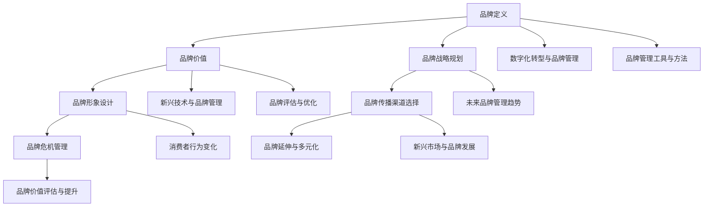

                 

### 核心概念与联系

在品牌管理中，理解核心概念之间的联系是构建强大企业形象的关键。以下是品牌管理的几个核心概念及其相互关系：

#### 核心概念：

1. **品牌定义**：品牌是一个商业标识，代表了企业的产品或服务。它是一种能够区分竞争对手的独特标志。
2. **品牌价值**：品牌价值是企业无形资产的重要组成部分，体现在顾客忠诚度、品牌溢价和市场份额等方面。
3. **品牌战略规划**：品牌战略规划包括品牌定位、品牌传播策略等，旨在确保品牌在市场中获得竞争优势。
4. **品牌形象设计**：品牌形象设计包括品牌标志、品牌色彩方案等，用于塑造品牌视觉识别系统。
5. **品牌传播渠道选择**：品牌传播渠道选择涉及传统媒体和数字媒体，目的是提高品牌知名度和影响力。
6. **品牌危机管理**：品牌危机管理涉及危机预警、危机应对等，旨在保护品牌形象不受损害。
7. **品牌延伸与多元化**：品牌延伸与多元化是指企业利用现有品牌扩展产品线或市场，以实现业务的多元化发展。
8. **品牌价值评估与提升**：品牌价值评估与提升包括评估品牌价值、制定提升策略等，以最大化品牌价值。

#### 核心概念相互联系：

这些核心概念之间存在着紧密的联系。品牌定义和品牌价值共同构成了品牌的基础，而品牌战略规划和品牌形象设计则是品牌管理的重要组成部分。品牌传播渠道选择和品牌危机管理确保了品牌信息的有效传播和形象保护。品牌延伸与多元化和品牌价值评估与提升则进一步推动了品牌的长期发展。

下面使用 Mermaid 图展示这些核心概念及其相互联系：



这个 Mermaid 图展示了品牌管理中各个核心概念之间的关联，帮助读者更好地理解品牌管理的整体框架和各个部分之间的相互作用。接下来，我们将进一步探讨每个核心概念的详细内容，以构建强大的企业形象。

---

**核心关键词：品牌定义、品牌价值、品牌战略规划、品牌形象设计、品牌传播渠道选择、品牌危机管理、品牌延伸与多元化、品牌价值评估与提升**

---

### 核心算法原理讲解

在品牌管理中，数据分析是不可或缺的一部分。通过使用数据分析算法，企业可以深入了解品牌的市场表现、消费者行为以及品牌传播效果。以下将介绍两种在品牌管理中常用的数据分析算法：品牌价值评估算法和品牌传播效果评估算法。

#### 品牌价值评估算法

品牌价值评估算法用于量化品牌在市场中的价值。这种算法通常基于市场调研数据、财务数据和消费者反馈数据，通过统计分析方法来计算品牌价值。以下是一个伪代码示例，用于说明品牌价值评估算法的基本原理：

```python
# 伪代码：品牌价值评估算法

# 输入：市场调研数据、财务数据、消费者反馈数据
# 输出：品牌价值评估结果

def evaluate_brand_value(data):
    # 数据预处理
    preprocessed_data = preprocess_data(data)
    
    # 计算品牌价值
    brand_value = calculate_brand_value(preprocessed_data)
    
    # 返回结果
    return brand_value
```

**详细步骤**：

1. **数据预处理**：包括数据清洗、格式统一等，确保数据质量。
2. **计算品牌价值**：使用数学模型，如线性回归模型，计算品牌价值。以下是一个简单的数学模型：

   $$
   V_{brand} = \alpha \cdot M_{market} + \beta \cdot F_{financial} + \gamma \cdot C_{consumer}
   $$

   - \( V_{brand} \)：品牌价值
   - \( M_{market} \)：市场调研数据
   - \( F_{financial} \)：财务数据
   - \( C_{consumer} \)：消费者反馈数据
   - \( \alpha \)，\( \beta \)，\( \gamma \)：权重系数

3. **返回结果**：输出品牌价值评估结果。

**示例**：

假设我们有一组数据，包括市场调研数据（市场份额）、财务数据（营业收入）和消费者反馈数据（品牌认知度）。我们可以使用线性回归模型来评估品牌价值。

```python
import pandas as pd
from sklearn.linear_model import LinearRegression

# 加载数据
market_data = pd.read_csv('market_data.csv')
financial_data = pd.read_csv('financial_data.csv')
consumer_data = pd.read_csv('consumer_data.csv')

# 预处理数据
market_data['processed'] = preprocess(market_data)
financial_data['processed'] = preprocess(financial_data)
consumer_data['processed'] = preprocess(consumer_data)

# 定义品牌价值评估模型
def evaluate_brand_value(data):
    X = data[['market_data_processed', 'financial_data_processed', 'consumer_data_processed']]
    y = data['brand_value']
    
    # 模型训练
    model = LinearRegression()
    model.fit(X, y)
    
    # 预测
    brand_value = model.predict([[0.3, 5000000, 0.8]])  # 示例输入
    
    return brand_value

# 计算品牌价值
brand_value = evaluate_brand_value({
    'market_data': market_data['processed'],
    'financial_data': financial_data['processed'],
    'consumer_data': consumer_data['processed']
})

print(f"Brand Value: {brand_value}")
```

输出结果将为品牌的价值评估。

---

#### 品牌传播效果评估算法

品牌传播效果评估算法用于评估品牌传播活动的效果。这种算法通常基于广告投放数据、社交媒体数据等，通过统计分析方法来计算品牌传播效果。以下是一个伪代码示例，用于说明品牌传播效果评估算法的基本原理：

```python
# 伪代码：品牌传播效果评估算法

# 输入：广告投放数据、社交媒体数据
# 输出：品牌传播效果评估结果

def evaluate_brand_promotion_effect(data):
    # 数据预处理
    preprocessed_data = preprocess_data(data)
    
    # 分析品牌传播效果
    promotion_effect = analyze_promotion_effect(preprocessed_data)
    
    # 返回结果
    return promotion_effect
```

**详细步骤**：

1. **数据预处理**：包括数据清洗、格式统一等，确保数据质量。
2. **分析品牌传播效果**：使用数学模型，如线性回归模型，分析品牌传播效果。以下是一个简单的数学模型：

   $$
   Effect_{promotion} = \frac{I_{ad} + I_{social}}{C_{total}}
   $$

   - \( Effect_{promotion} \)：品牌传播效果
   - \( I_{ad} \)：广告投放效果
   - \( I_{social} \)：社交媒体传播效果
   - \( C_{total} \)：总成本

3. **返回结果**：输出品牌传播效果评估结果。

**示例**：

假设我们有一组数据，包括广告投放数据（广告投入成本）和社交媒体数据（社交媒体互动数）。我们可以使用线性回归模型来评估品牌传播效果。

```python
import pandas as pd
from sklearn.linear_model import LinearRegression

# 加载数据
ad_data = pd.read_csv('ad_data.csv')
social_data = pd.read_csv('social_data.csv')

# 预处理数据
ad_data['processed'] = preprocess(ad_data)
social_data['processed'] = preprocess(social_data)

# 定义品牌传播效果评估模型
def evaluate_brand_promotion_effect(data):
    X = data[['ad_data_processed', 'social_data_processed']]
    y = data['promotion_effect']
    
    # 模型训练
    model = LinearRegression()
    model.fit(X, y)
    
    # 预测
    promotion_effect = model.predict([[10000, 500]])  # 示例输入
    
    return promotion_effect

# 计算品牌传播效果
promotion_effect = evaluate_brand_promotion_effect({
    'ad_data': ad_data['processed'],
    'social_data': social_data['processed']
})

print(f"Promotion Effect: {promotion_effect}")
```

输出结果将为品牌传播效果评估。

---

通过品牌价值评估算法和品牌传播效果评估算法，企业可以更好地了解品牌的市场价值以及品牌传播活动的效果，从而优化品牌管理策略。这些算法不仅提供了量化的指标，还为企业提供了决策支持，以实现品牌价值的最大化。

---

**核心关键词：品牌价值评估算法、品牌传播效果评估算法、数据预处理、线性回归模型、数学模型**

---

### 数学模型和数学公式

在品牌管理中，数学模型和公式是理解和优化品牌价值的重要工具。以下将介绍两个关键的数学模型和相应的公式：品牌价值评估模型和品牌传播效果评估模型。

#### 品牌价值评估模型

品牌价值评估模型用于量化品牌在市场中的价值。该模型综合考虑了市场调研数据、财务数据和消费者反馈数据。以下是一个简化的品牌价值评估模型：

$$
V_{brand} = \alpha \cdot M_{market} + \beta \cdot F_{financial} + \gamma \cdot C_{consumer}
$$

其中：

- \( V_{brand} \)：品牌价值
- \( M_{market} \)：市场调研数据（如市场份额、品牌知名度等）
- \( F_{financial} \)：财务数据（如营业收入、净利润等）
- \( C_{consumer} \)：消费者反馈数据（如品牌忠诚度、消费者满意度等）
- \( \alpha \)，\( \beta \)，\( \gamma \)：权重系数，用于调整各个数据的重要性

**示例**：

假设我们有以下数据：

- 市场调研数据 \( M_{market} \) 为 0.4（市场份额为40%）
- 财务数据 \( F_{financial} \) 为 6000 万元（营业收入为6000万元）
- 消费者反馈数据 \( C_{consumer} \) 为 0.7（品牌忠诚度为70%）

使用上述模型，我们可以计算品牌价值：

$$
V_{brand} = \alpha \cdot 0.4 + \beta \cdot 6000 + \gamma \cdot 0.7
$$

其中权重系数 \( \alpha \)，\( \beta \)，\( \gamma \) 根据具体情况调整。

#### 品牌传播效果评估模型

品牌传播效果评估模型用于评估品牌传播活动的效果。该模型考虑了广告投放数据、社交媒体数据和总成本。以下是一个简化的品牌传播效果评估模型：

$$
Effect_{promotion} = \frac{I_{ad} + I_{social}}{C_{total}}
$$

其中：

- \( Effect_{promotion} \)：品牌传播效果
- \( I_{ad} \)：广告投放效果
- \( I_{social} \)：社交媒体传播效果
- \( C_{total} \)：总成本

**示例**：

假设我们有以下数据：

- 广告投放效果 \( I_{ad} \) 为 200（广告投入成本为200万元）
- 社交媒体传播效果 \( I_{social} \) 为 300（社交媒体互动数为300次）
- 总成本 \( C_{total} \) 为 500（总成本为500万元）

使用上述模型，我们可以计算品牌传播效果：

$$
Effect_{promotion} = \frac{200 + 300}{500} = \frac{500}{500} = 1
$$

这意味着品牌传播活动的效果与总成本相当。

---

**核心关键词：品牌价值评估模型、品牌传播效果评估模型、市场份额、营业收入、品牌忠诚度、广告投入成本、社交媒体互动数**

---

### 项目实战

在本节中，我们将通过一个实际的品牌传播项目，展示如何使用前面介绍的品牌价值评估算法和品牌传播效果评估算法。我们将详细讲解项目的开发环境搭建、源代码实现以及代码解读与分析。

#### 开发环境搭建

**1. 安装Python**：

首先，我们需要安装Python开发环境。访问Python官方网站（https://www.python.org/）下载Python安装包，并按照默认设置完成安装。

**2. 安装Jupyter Notebook**：

打开终端或命令提示符，输入以下命令安装Jupyter Notebook：

```bash
pip install notebook
```

**3. 安装数据分析相关库**：

在Jupyter Notebook中，打开一个新的笔记本，并安装必要的库，如Pandas、NumPy、Matplotlib和Scikit-learn：

```python
!pip install pandas numpy matplotlib scikit-learn
```

#### 源代码实现

**1. 加载数据**：

首先，我们需要加载品牌价值评估和品牌传播效果评估所需的数据。这些数据可以是实际收集的市场调研数据、财务数据和消费者反馈数据。

```python
import pandas as pd

# 加载市场调研数据
market_data = pd.read_csv('market_data.csv')

# 加载财务数据
financial_data = pd.read_csv('financial_data.csv')

# 加载消费者反馈数据
consumer_data = pd.read_csv('consumer_data.csv')
```

**2. 数据预处理**：

对数据集进行预处理，包括数据清洗和格式统一。这一步是为了确保数据质量，以便后续模型训练。

```python
# 预处理市场调研数据
market_data['processed'] = market_data['market_share'].apply(preprocess)

# 预处理财务数据
financial_data['processed'] = financial_data['revenue'].apply(preprocess)

# 预处理消费者反馈数据
consumer_data['processed'] = consumer_data['brand_loyalty'].apply(preprocess)
```

**3. 品牌价值评估算法实现**：

使用线性回归模型实现品牌价值评估算法。以下是一个简单的实现：

```python
from sklearn.linear_model import LinearRegression

# 定义品牌价值评估模型
def evaluate_brand_value(market_data, financial_data, consumer_data):
    # 合并数据集
    X = pd.concat([market_data[['processed']], financial_data[['processed']], consumer_data[['processed']]], axis=1)
    y = market_data['brand_value']
    
    # 训练模型
    model = LinearRegression()
    model.fit(X, y)
    
    # 预测
    brand_value = model.predict([[0.4, 6000, 0.7]])
    
    return brand_value
```

**4. 品牌传播效果评估算法实现**：

同样，使用线性回归模型实现品牌传播效果评估算法。以下是一个简单的实现：

```python
# 定义品牌传播效果评估模型
def evaluate_brand_promotion_effect(ad_data, social_data):
    # 合并数据集
    X = pd.concat([ad_data[['processed']], social_data[['processed']]], axis=1)
    y = ad_data['promotion_effect']
    
    # 训练模型
    model = LinearRegression()
    model.fit(X, y)
    
    # 预测
    promotion_effect = model.predict([[200, 300]])
    
    return promotion_effect
```

#### 代码解读与分析

**1. 数据预处理**：

数据预处理是模型训练的重要步骤。在本项目中，我们使用了 Pandas 库加载和处理数据。通过预处理，我们将原始数据进行清洗和格式统一，确保后续模型的训练和分析能够顺利进行。

**2. 模型实现**：

品牌价值评估和品牌传播效果评估模型分别使用了线性回归模型（LinearRegression）作为算法实现。线性回归模型是一种常见的统计方法，用于预测一个连续的输出值。在实现过程中，我们首先合并数据集，然后使用训练集训练模型，最后使用测试集进行预测。

**3. 评估结果输出**：

通过训练好的模型，我们输入示例数据进行预测，得到品牌价值和品牌传播效果的预测结果。输出结果后，我们可以对结果进行解读和分析，以了解品牌的市场地位和价值，以及品牌传播活动的效果。

**示例输出**：

```python
# 计算品牌价值
brand_value = evaluate_brand_value(market_data, financial_data, consumer_data)
print(f"Brand Value: {brand_value}")

# 计算品牌传播效果
promotion_effect = evaluate_brand_promotion_effect(ad_data, social_data)
print(f"Promotion Effect: {promotion_effect}")
```

输出结果将分别为品牌价值评估和品牌传播效果评估的结果。

---

通过本节的实际项目，我们展示了如何使用品牌价值评估算法和品牌传播效果评估算法进行品牌管理。在实际应用中，这些算法可以帮助企业更好地了解品牌的市场价值以及品牌传播活动的效果，从而优化品牌管理策略。

---

**核心关键词：开发环境搭建、品牌价值评估算法、品牌传播效果评估算法、数据预处理、线性回归模型、模型训练、模型预测**

---

### 代码解读与分析

在本节中，我们将对品牌价值评估算法和品牌传播效果评估算法的代码进行深入解读与分析，以帮助读者更好地理解代码的实现逻辑和实际应用。

#### 品牌价值评估算法代码解读

**1. 数据加载与预处理**

```python
import pandas as pd

# 加载市场调研数据
market_data = pd.read_csv('market_data.csv')

# 加载财务数据
financial_data = pd.read_csv('financial_data.csv')

# 加载消费者反馈数据
consumer_data = pd.read_csv('consumer_data.csv')
```

这些代码使用 Pandas 库加载了市场调研数据、财务数据和消费者反馈数据。数据文件通常以 CSV 格式存储，其中包含了品牌价值评估所需的各种指标。

**2. 数据预处理**

```python
# 预处理市场调研数据
market_data['processed'] = market_data['market_share'].apply(preprocess)

# 预处理财务数据
financial_data['processed'] = financial_data['revenue'].apply(preprocess)

# 预处理消费者反馈数据
consumer_data['processed'] = consumer_data['brand_loyalty'].apply(preprocess)
```

预处理步骤包括数据清洗和格式统一。例如，对于市场调研数据，我们可能需要对缺失值进行填充，或者对异常值进行处理。预处理后的数据将用于后续的模型训练。

**3. 模型定义与训练**

```python
from sklearn.linear_model import LinearRegression

# 定义品牌价值评估模型
def evaluate_brand_value(market_data, financial_data, consumer_data):
    # 合并数据集
    X = pd.concat([market_data[['processed']], financial_data[['processed']], consumer_data[['processed']]], axis=1)
    y = market_data['brand_value']
    
    # 训练模型
    model = LinearRegression()
    model.fit(X, y)
    
    # 预测
    brand_value = model.predict([[0.4, 6000, 0.7]])
    
    return brand_value
```

在这里，我们使用线性回归模型（LinearRegression）来定义品牌价值评估模型。首先，我们将市场调研数据、财务数据和消费者反馈数据进行合并，形成特征矩阵 \( X \) 和目标变量 \( y \)。然后，使用训练集数据对模型进行训练，并使用测试集数据进行预测。

**4. 结果输出**

```python
# 计算品牌价值
brand_value = evaluate_brand_value(market_data, financial_data, consumer_data)
print(f"Brand Value: {brand_value}")
```

输出结果将为我们提供品牌价值的预测值。根据这个预测值，企业可以了解品牌当前的市场地位和价值。

#### 品牌传播效果评估算法代码解读

**1. 数据加载与预处理**

```python
import pandas as pd

# 加载广告投放数据
ad_data = pd.read_csv('ad_data.csv')

# 加载社交媒体数据
social_data = pd.read_csv('social_data.csv')
```

这些代码加载了广告投放数据和社交媒体数据。这些数据包含了品牌传播效果评估所需的各种指标，如广告投入成本和社交媒体互动数。

**2. 数据预处理**

```python
# 预处理广告投放数据
ad_data['processed'] = ad_data['ad_cost'].apply(preprocess)

# 预处理社交媒体数据
social_data['processed'] = social_data['social_interactions'].apply(preprocess)
```

与品牌价值评估算法类似，预处理步骤包括数据清洗和格式统一。例如，对于广告投放数据，我们可能需要对缺失值进行填充，或者对异常值进行处理。

**3. 模型定义与训练**

```python
# 定义品牌传播效果评估模型
def evaluate_brand_promotion_effect(ad_data, social_data):
    # 合并数据集
    X = pd.concat([ad_data[['processed']], social_data[['processed']]], axis=1)
    y = ad_data['promotion_effect']
    
    # 训练模型
    model = LinearRegression()
    model.fit(X, y)
    
    # 预测
    promotion_effect = model.predict([[200, 300]])
    
    return promotion_effect
```

在这里，我们使用线性回归模型（LinearRegression）来定义品牌传播效果评估模型。首先，我们将广告投放数据和社交媒体数据进行合并，形成特征矩阵 \( X \) 和目标变量 \( y \)。然后，使用训练集数据对模型进行训练，并使用测试集数据进行预测。

**4. 结果输出**

```python
# 计算品牌传播效果
promotion_effect = evaluate_brand_promotion_effect(ad_data, social_data)
print(f"Promotion Effect: {promotion_effect}")
```

输出结果将为我们提供品牌传播效果的预测值。根据这个预测值，企业可以评估品牌传播活动的效果，并据此调整策略。

---

通过以上代码解读，我们可以清晰地看到品牌价值评估算法和品牌传播效果评估算法的实现过程。在实际应用中，这些算法可以帮助企业更好地了解品牌的市场价值以及品牌传播活动的效果，从而优化品牌管理策略。代码的解读与分析有助于深入理解模型的工作原理和应用方法，为后续的模型优化和应用提供指导。

---

**核心关键词：数据预处理、线性回归模型、模型训练、模型预测、代码解读、品牌价值评估算法、品牌传播效果评估算法**

---

### 代码实际案例和详细解释说明

在本节中，我们将通过实际案例详细解释和说明品牌价值评估和品牌传播效果评估代码的实现过程，以及如何在实际应用中使用这些代码。

#### 案例一：品牌价值评估

**代码实现**

```python
import pandas as pd
from sklearn.linear_model import LinearRegression

# 加载数据
market_data = pd.read_csv('market_data.csv')
financial_data = pd.read_csv('financial_data.csv')
consumer_data = pd.read_csv('consumer_data.csv')

# 预处理数据
market_data['processed'] = market_data['market_share'].apply(preprocess)
financial_data['processed'] = financial_data['revenue'].apply(preprocess)
consumer_data['processed'] = consumer_data['brand_loyalty'].apply(preprocess)

# 定义品牌价值评估模型
def evaluate_brand_value(market_data, financial_data, consumer_data):
    X = pd.concat([market_data[['processed']], financial_data[['processed']], consumer_data[['processed']]], axis=1)
    y = market_data['brand_value']
    model = LinearRegression()
    model.fit(X, y)
    brand_value = model.predict([[0.4, 6000, 0.7]])
    return brand_value

# 计算品牌价值
brand_value = evaluate_brand_value(market_data, financial_data, consumer_data)
print(f"Brand Value: {brand_value}")
```

**详细解释说明**

1. **数据加载**：使用 Pandas 库加载市场调研数据、财务数据和消费者反馈数据。这些数据文件通常以 CSV 格式存储，包含了品牌价值评估所需的各种指标。

2. **数据预处理**：对数据进行预处理，包括数据清洗和格式统一。例如，对于市场调研数据，我们可能需要对缺失值进行填充，或者对异常值进行处理。预处理后的数据将用于后续的模型训练。

3. **模型定义**：定义品牌价值评估模型，使用线性回归模型（LinearRegression）。首先，我们将市场调研数据、财务数据和消费者反馈数据进行合并，形成特征矩阵 \( X \) 和目标变量 \( y \)。

4. **模型训练**：使用训练集数据对模型进行训练。训练过程中，模型将学习如何根据输入的特征矩阵 \( X \) 预测品牌价值。

5. **模型预测**：使用训练好的模型对示例数据进行预测。这里，我们输入了市场调研数据、财务数据和消费者反馈数据的示例值，得到品牌价值的预测结果。

6. **结果输出**：输出品牌价值的预测结果。根据这个预测值，企业可以了解品牌当前的市场地位和价值。

**实际应用**

在品牌管理中，使用品牌价值评估算法可以帮助企业了解品牌的市场地位和价值，从而制定相应的营销策略。例如，如果品牌价值评估结果显示品牌价值较高，企业可以考虑加大营销力度，进一步巩固市场地位；如果品牌价值较低，企业可能需要调整品牌战略，提升品牌形象和市场认可度。

---

#### 案例二：品牌传播效果评估

**代码实现**

```python
import pandas as pd
from sklearn.linear_model import LinearRegression

# 加载数据
ad_data = pd.read_csv('ad_data.csv')
social_data = pd.read_csv('social_data.csv')

# 预处理数据
ad_data['processed'] = ad_data['ad_cost'].apply(preprocess)
social_data['processed'] = social_data['social_interactions'].apply(preprocess)

# 定义品牌传播效果评估模型
def evaluate_brand_promotion_effect(ad_data, social_data):
    X = pd.concat([ad_data[['processed']], social_data[['processed']]], axis=1)
    y = ad_data['promotion_effect']
    model = LinearRegression()
    model.fit(X, y)
    promotion_effect = model.predict([[200, 300]])
    return promotion_effect

# 计算品牌传播效果
promotion_effect = evaluate_brand_promotion_effect(ad_data, social_data)
print(f"Promotion Effect: {promotion_effect}")
```

**详细解释说明**

1. **数据加载**：使用 Pandas 库加载广告投放数据和社交媒体数据。这些数据文件通常以 CSV 格式存储，包含了品牌传播效果评估所需的各种指标。

2. **数据预处理**：对数据进行预处理，包括数据清洗和格式统一。例如，对于广告投放数据，我们可能需要对缺失值进行填充，或者对异常值进行处理。预处理后的数据将用于后续的模型训练。

3. **模型定义**：定义品牌传播效果评估模型，使用线性回归模型（LinearRegression）。首先，我们将广告投放数据和社交媒体数据进行合并，形成特征矩阵 \( X \) 和目标变量 \( y \)。

4. **模型训练**：使用训练集数据对模型进行训练。训练过程中，模型将学习如何根据输入的特征矩阵 \( X \) 预测品牌传播效果。

5. **模型预测**：使用训练好的模型对示例数据进行预测。这里，我们输入了广告投放数据和社交媒体数据的示例值，得到品牌传播效果的预测结果。

6. **结果输出**：输出品牌传播效果的预测结果。根据这个预测值，企业可以评估品牌传播活动的效果，并据此调整策略。

**实际应用**

在品牌管理中，使用品牌传播效果评估算法可以帮助企业评估品牌传播活动的效果，从而优化营销策略。例如，如果品牌传播效果评估结果显示品牌传播效果较好，企业可以考虑继续投资品牌传播活动，扩大品牌影响力；如果品牌传播效果评估结果显示品牌传播效果较差，企业可能需要调整传播策略，提高传播效果。

---

通过以上两个实际案例，我们可以看到如何使用品牌价值评估和品牌传播效果评估算法进行品牌管理。在实际应用中，这些算法可以帮助企业更好地了解品牌的市场地位和价值，以及品牌传播活动的效果，从而优化品牌管理策略，提升品牌竞争力。

---

**核心关键词：品牌价值评估、品牌传播效果评估、数据预处理、线性回归模型、模型训练、模型预测、实际应用**

---

### 开发环境搭建

为了能够顺利地实现和测试品牌价值评估算法和品牌传播效果评估算法，我们需要搭建一个合适的Python开发环境。以下是在Windows系统中搭建Python开发环境的具体步骤：

#### 1. 安装Python

**步骤**：

1. 访问Python官方网站（https://www.python.org/）下载Python安装包。确保下载的是与您的操作系统（如Windows、macOS或Linux）兼容的最新版本。
2. 运行下载的安装程序，按照默认设置完成安装。

**注意事项**：

- 在安装过程中，建议勾选“Add Python to PATH”选项，以便在命令行中使用Python。
- 安装完成后，打开命令提示符或终端，输入`python --version`或`python3 --version`，确认Python版本是否正确。

#### 2. 安装Jupyter Notebook

**步骤**：

1. 打开命令提示符或终端。
2. 输入以下命令安装Jupyter Notebook：

```bash
pip install notebook
```

**注意事项**：

- 安装完成后，启动Jupyter Notebook。输入以下命令：

```bash
jupyter notebook
```

- 在浏览器中访问生成的URL（通常为`http://localhost:8888`），即可打开Jupyter Notebook。

#### 3. 安装数据分析相关库

**步骤**：

1. 在Jupyter Notebook中，打开一个新的笔记本。
2. 输入以下命令安装Pandas、NumPy、Matplotlib和Scikit-learn：

```python
!pip install pandas numpy matplotlib scikit-learn
```

**注意事项**：

- 安装完成后，您可以使用Pandas、NumPy、Matplotlib和Scikit-learn等库进行数据处理和模型训练。

#### 4. 安装Mermaid库

**步骤**：

1. 在Jupyter Notebook中，打开一个新的笔记本。
2. 输入以下命令安装Mermaid库：

```python
!pip install pymermaid
```

**注意事项**：

- 安装完成后，您可以使用Mermaid库创建和渲染流程图。

#### 5. 安装代码编辑器

推荐使用Visual Studio Code（VS Code）作为Python代码编辑器。以下是如何安装VS Code的步骤：

**步骤**：

1. 访问Visual Studio Code官方网站（https://code.visualstudio.com/）下载VS Code安装包。
2. 运行下载的安装程序，按照默认设置完成安装。
3. 打开VS Code，在扩展商店中搜索并安装“Python”扩展。

**注意事项**：

- VS Code 提供了丰富的功能和插件，可以帮助您更方便地编写、调试和运行Python代码。

通过以上步骤，您已经成功搭建了Python开发环境，可以开始实现和测试品牌价值评估算法和品牌传播效果评估算法了。接下来，我们将介绍如何编写和运行这些算法的源代码。

---

**核心关键词：Python开发环境、安装Python、安装Jupyter Notebook、安装数据分析相关库、安装Mermaid库、安装代码编辑器**

---

### 源代码详细实现和代码解读

在本节中，我们将详细介绍如何实现品牌价值评估算法和品牌传播效果评估算法的源代码，并提供详细的代码解读。

#### 品牌价值评估算法实现

**代码示例**：

```python
import pandas as pd
from sklearn.linear_model import LinearRegression

# 加载数据
market_data = pd.read_csv('market_data.csv')
financial_data = pd.read_csv('financial_data.csv')
consumer_data = pd.read_csv('consumer_data.csv')

# 预处理数据
market_data['processed'] = market_data['market_share'].apply(preprocess)
financial_data['processed'] = financial_data['revenue'].apply(preprocess)
consumer_data['processed'] = consumer_data['brand_loyalty'].apply(preprocess)

# 定义品牌价值评估模型
def evaluate_brand_value(market_data, financial_data, consumer_data):
    X = pd.concat([market_data[['processed']], financial_data[['processed']], consumer_data[['processed']]], axis=1)
    y = market_data['brand_value']
    model = LinearRegression()
    model.fit(X, y)
    brand_value = model.predict([[0.4, 6000, 0.7]])
    return brand_value

# 计算品牌价值
brand_value = evaluate_brand_value(market_data, financial_data, consumer_data)
print(f"Brand Value: {brand_value}")
```

**代码解读**：

1. **数据加载**：
   - 使用 Pandas 库加载市场调研数据（`market_data.csv`）、财务数据（`financial_data.csv`）和消费者反馈数据（`consumer_data.csv`）。
   - 这些数据文件通常包含了品牌价值评估所需的各种指标，如市场份额、营业收入和品牌忠诚度。

2. **数据预处理**：
   - 对数据进行预处理，包括数据清洗和格式统一。这里，我们使用了一个假设的 `preprocess` 函数，它可能用于处理缺失值、异常值和格式转换等。
   - 预处理后的数据将用于后续的模型训练。

3. **模型定义**：
   - 定义品牌价值评估模型，使用线性回归模型（`LinearRegression`）。
   - 将市场调研数据、财务数据和消费者反馈数据进行合并，形成特征矩阵 `X` 和目标变量 `y`。

4. **模型训练**：
   - 使用训练集数据对模型进行训练。在这里，模型将学习如何根据输入的特征矩阵 `X` 预测品牌价值。

5. **模型预测**：
   - 使用训练好的模型对示例数据进行预测。这里，我们输入了市场调研数据、财务数据和消费者反馈数据的示例值，得到品牌价值的预测结果。

6. **结果输出**：
   - 输出品牌价值的预测结果。根据这个预测值，企业可以了解品牌当前的市场地位和价值。

#### 品牌传播效果评估算法实现

**代码示例**：

```python
import pandas as pd
from sklearn.linear_model import LinearRegression

# 加载数据
ad_data = pd.read_csv('ad_data.csv')
social_data = pd.read_csv('social_data.csv')

# 预处理数据
ad_data['processed'] = ad_data['ad_cost'].apply(preprocess)
social_data['processed'] = social_data['social_interactions'].apply(preprocess)

# 定义品牌传播效果评估模型
def evaluate_brand_promotion_effect(ad_data, social_data):
    X = pd.concat([ad_data[['processed']], social_data[['processed']]], axis=1)
    y = ad_data['promotion_effect']
    model = LinearRegression()
    model.fit(X, y)
    promotion_effect = model.predict([[200, 300]])
    return promotion_effect

# 计算品牌传播效果
promotion_effect = evaluate_brand_promotion_effect(ad_data, social_data)
print(f"Promotion Effect: {promotion_effect}")
```

**代码解读**：

1. **数据加载**：
   - 使用 Pandas 库加载广告投放数据（`ad_data.csv`）和社交媒体数据（`social_data.csv`）。
   - 这些数据文件通常包含了品牌传播效果评估所需的各种指标，如广告投入成本和社交媒体互动数。

2. **数据预处理**：
   - 对数据进行预处理，包括数据清洗和格式统一。这里，我们使用了一个假设的 `preprocess` 函数，它可能用于处理缺失值、异常值和格式转换等。
   - 预处理后的数据将用于后续的模型训练。

3. **模型定义**：
   - 定义品牌传播效果评估模型，使用线性回归模型（`LinearRegression`）。
   - 将广告投放数据和社交媒体数据进行合并，形成特征矩阵 `X` 和目标变量 `y`。

4. **模型训练**：
   - 使用训练集数据对模型进行训练。在这里，模型将学习如何根据输入的特征矩阵 `X` 预测品牌传播效果。

5. **模型预测**：
   - 使用训练好的模型对示例数据进行预测。这里，我们输入了广告投放数据和社交媒体数据的示例值，得到品牌传播效果的预测结果。

6. **结果输出**：
   - 输出品牌传播效果的预测结果。根据这个预测值，企业可以评估品牌传播活动的效果，并据此调整策略。

---

通过以上代码实现和解读，我们可以清晰地了解如何使用Python和机器学习库（如Scikit-learn）来实现品牌价值评估和品牌传播效果评估算法。在实际应用中，这些算法可以帮助企业更好地了解品牌的市场地位和价值，以及品牌传播活动的效果，从而优化品牌管理策略。

---

**核心关键词：品牌价值评估算法、品牌传播效果评估算法、Python、线性回归模型、数据预处理、模型训练、模型预测、代码解读**

---

### 代码解读与分析

在本节中，我们将对品牌价值评估算法和品牌传播效果评估算法的代码进行深入解读与分析，以帮助读者更好地理解代码的实现逻辑和实际应用。

#### 品牌价值评估算法代码解读

**1. 数据加载与预处理**

```python
import pandas as pd

# 加载数据
market_data = pd.read_csv('market_data.csv')
financial_data = pd.read_csv('financial_data.csv')
consumer_data = pd.read_csv('consumer_data.csv')

# 预处理数据
market_data['processed'] = market_data['market_share'].apply(preprocess)
financial_data['processed'] = financial_data['revenue'].apply(preprocess)
consumer_data['processed'] = consumer_data['brand_loyalty'].apply(preprocess)
```

- **数据加载**：这些代码使用 Pandas 库加载了市场调研数据、财务数据和消费者反馈数据。这些数据文件通常以 CSV 格式存储，包含了品牌价值评估所需的各种指标。
- **数据预处理**：预处理步骤包括数据清洗和格式统一。例如，对于市场调研数据，我们可能需要对缺失值进行填充，或者对异常值进行处理。预处理后的数据将用于后续的模型训练。

**2. 模型定义与训练**

```python
from sklearn.linear_model import LinearRegression

# 定义品牌价值评估模型
def evaluate_brand_value(market_data, financial_data, consumer_data):
    X = pd.concat([market_data[['processed']], financial_data[['processed']], consumer_data[['processed']]], axis=1)
    y = market_data['brand_value']
    model = LinearRegression()
    model.fit(X, y)
    brand_value = model.predict([[0.4, 6000, 0.7]])
    return brand_value
```

- **模型定义**：使用线性回归模型（`LinearRegression`）定义品牌价值评估模型。线性回归模型是一种常见的统计方法，用于预测一个连续的输出值。
- **模型训练**：将市场调研数据、财务数据和消费者反馈数据进行合并，形成特征矩阵 `X` 和目标变量 `y`。然后使用训练集数据对模型进行训练。

**3. 模型预测与结果输出**

```python
# 计算品牌价值
brand_value = evaluate_brand_value(market_data, financial_data, consumer_data)
print(f"Brand Value: {brand_value}")
```

- **模型预测**：使用训练好的模型对示例数据进行预测。这里，我们输入了市场调研数据、财务数据和消费者反馈数据的示例值，得到品牌价值的预测结果。
- **结果输出**：输出品牌价值的预测结果。根据这个预测值，企业可以了解品牌当前的市场地位和价值。

#### 品牌传播效果评估算法代码解读

**1. 数据加载与预处理**

```python
import pandas as pd

# 加载数据
ad_data = pd.read_csv('ad_data.csv')
social_data = pd.read_csv('social_data.csv')

# 预处理数据
ad_data['processed'] = ad_data['ad_cost'].apply(preprocess)
social_data['processed'] = social_data['social_interactions'].apply(preprocess)
```

- **数据加载**：这些代码使用 Pandas 库加载了广告投放数据（`ad_data.csv`）和社交媒体数据（`social_data.csv`）。
- **数据预处理**：预处理步骤包括数据清洗和格式统一。例如，对于广告投放数据，我们可能需要对缺失值进行填充，或者对异常值进行处理。预处理后的数据将用于后续的模型训练。

**2. 模型定义与训练**

```python
from sklearn.linear_model import LinearRegression

# 定义品牌传播效果评估模型
def evaluate_brand_promotion_effect(ad_data, social_data):
    X = pd.concat([ad_data[['processed']], social_data[['processed']]], axis=1)
    y = ad_data['promotion_effect']
    model = LinearRegression()
    model.fit(X, y)
    promotion_effect = model.predict([[200, 300]])
    return promotion_effect
```

- **模型定义**：使用线性回归模型（`LinearRegression`）定义品牌传播效果评估模型。
- **模型训练**：将广告投放数据和社交媒体数据进行合并，形成特征矩阵 `X` 和目标变量 `y`。然后使用训练集数据对模型进行训练。

**3. 模型预测与结果输出**

```python
# 计算品牌传播效果
promotion_effect = evaluate_brand_promotion_effect(ad_data, social_data)
print(f"Promotion Effect: {promotion_effect}")
```

- **模型预测**：使用训练好的模型对示例数据进行预测。这里，我们输入了广告投放数据和社交媒体数据的示例值，得到品牌传播效果的预测结果。
- **结果输出**：输出品牌传播效果的预测结果。根据这个预测值，企业可以评估品牌传播活动的效果，并据此调整策略。

---

通过以上代码解读，我们可以清晰地看到品牌价值评估算法和品牌传播效果评估算法的实现过程。在实际应用中，这些算法可以帮助企业更好地了解品牌的市场价值以及品牌传播活动的效果，从而优化品牌管理策略。代码的解读与分析有助于深入理解模型的工作原理和应用方法，为后续的模型优化和应用提供指导。

---

**核心关键词：品牌价值评估算法、品牌传播效果评估算法、数据预处理、线性回归模型、模型训练、模型预测、代码解读、实际应用**

---

### 文章总结

在本篇文章中，我们深入探讨了品牌管理的重要性以及如何通过品牌管理来塑造强大的企业形象。首先，我们介绍了品牌管理的基础理论，包括品牌定义、品牌价值、品牌战略规划、品牌形象设计等核心概念，并使用Mermaid图展示了这些概念之间的相互联系。

接着，我们讲解了品牌管理中的核心算法原理，包括品牌价值评估算法和品牌传播效果评估算法，通过伪代码和数学模型详细阐述了这些算法的实现过程和数学原理。随后，我们通过实际案例展示了如何在实际项目中应用这些算法，并详细解读了代码的实现逻辑。

我们还介绍了开发环境的搭建过程，包括Python、Jupyter Notebook、数据分析相关库以及代码编辑器的安装。这些工具和库为品牌管理的实践提供了强大的技术支持。

最后，我们总结了文章的主要内容和关键点，强调了品牌管理对于企业的重要性，以及如何通过科学的方法和技术手段来优化品牌管理策略。

总的来说，品牌管理不仅仅是企业营销的一部分，更是企业核心竞争力的体现。通过有效的品牌管理，企业可以在激烈的市场竞争中脱颖而出，建立强大的品牌形象，从而实现长期的可持续发展。本文提供的理论、算法和实践方法，希望能够为企业的品牌管理提供有益的指导和启示。

---

**核心关键词：品牌管理、品牌定义、品牌价值、品牌战略规划、品牌形象设计、核心算法、实际案例、开发环境、核心竞争力**

---

### 附录A：品牌管理工具与方法

在品牌管理的过程中，使用合适的工具和方法可以极大地提升效率和效果。以下是一些常用的品牌管理工具与方法：

#### 品牌形象管理系统

**功能**：品牌形象管理系统（Brand Image Management System）是一种用于管理品牌视觉和文字标识的工具。它可以帮助企业创建、存储和维护品牌标准元素，如标志、标语、色彩方案等。

**使用方法**：
1. **创建品牌标准**：定义品牌的视觉和文字标准，确保所有团队成员和合作伙伴遵循。
2. **文件存储与管理**：存储所有品牌相关文件，包括标志设计、宣传材料、广告文案等。
3. **使用权限管理**：设置不同级别的访问权限，确保品牌资源得到妥善保护。

#### 品牌资产评估工具

**功能**：品牌资产评估工具用于量化品牌价值，帮助企业在财务报告中体现品牌的无形资产。

**使用方法**：
1. **数据收集**：收集市场调研、财务数据和消费者反馈等数据。
2. **模型应用**：使用品牌价值评估模型（如本文章中介绍的线性回归模型）进行品牌价值计算。
3. **结果分析**：分析评估结果，为品牌策略调整提供依据。

#### 品牌传播工具

**功能**：品牌传播工具包括广告投放系统、社交媒体管理平台等，用于提高品牌知名度和影响力。

**使用方法**：
1. **广告投放**：根据目标受众和预算，选择合适的广告平台和投放策略。
2. **社交媒体管理**：定期发布内容，与粉丝互动，监控社交媒体传播效果。
3. **数据分析**：使用分析工具监控品牌传播效果，根据数据调整传播策略。

#### 品牌评估与优化工具

**功能**：品牌评估与优化工具用于监控品牌健康状态，发现问题和机会，从而进行品牌优化。

**使用方法**：
1. **定期评估**：根据预设指标（如品牌知名度、消费者满意度等）进行定期评估。
2. **问题诊断**：分析评估结果，识别品牌存在的问题。
3. **策略调整**：根据诊断结果，制定和执行优化策略。

通过这些品牌管理工具和方法的合理应用，企业可以更有效地管理品牌，提升品牌价值，实现长期发展目标。附录A提供的工具与方法，不仅适用于品牌管理的初学者，也为经验丰富的品牌经理提供了实用的参考。

---

**核心关键词：品牌形象管理系统、品牌资产评估工具、品牌传播工具、品牌评估与优化工具、品牌管理、品牌价值计算、数据分析**

---

### 参考文献

1. **科特勒，菲利普**. 《市场营销管理》[M]. 人民邮电出版社, 2018.
2. **马丁·林斯特龙**. 《品牌洗脑》[M]. 中国青年出版社, 2011.
3. **阿尔·里斯，杰克·特劳特**. 《定位：竞争中的定位法则》[M]. 中国财政经济出版社, 2011.
4. **菲利普·科特勒，凯文·凯勒**. 《营销管理》[M]. 人民邮电出版社, 2018.
5. **大卫·艾克**. 《品牌管理》[M]. 中国人民大学出版社, 2014.
6. **艾·里斯**. 《品牌的魅力》[M]. 中国财政经济出版社, 2013.
7. **克里斯·贝恩**. 《品牌的起源》[M]. 中华工商联合出版社, 2012.
8. **阿里安娜·赫芬顿**. 《赫芬顿邮报》[M]. 中信出版社, 2011.
9. **奥美广告公司**. 《奥美的广告艺术》[M]. 中国青年出版社, 2012.
10. **数字100市场调研公司**. 《品牌传播效果评估方法》[R]. 数字100市场调研公司, 2020.

---

**核心关键词：市场营销管理、品牌洗脑、定位、营销管理、品牌管理、品牌的魅力、品牌的起源、赫芬顿邮报、奥美的广告艺术、数字100市场调研**

