                 

### 《团队凝聚力提升：增强团队向心力的策略》

关键词：团队凝聚力、团队向心力、团队沟通、团队建设活动、激励与认可、团队冲突管理、跨部门合作

摘要：本文深入探讨团队凝聚力和团队向心力的概念及其重要性，分析了团队结构、领导风格对团队凝聚力的作用。同时，本文提出了多种提升团队凝聚力与向心力的策略，包括有效的沟通策略、团队建设活动、激励与认可策略、团队冲突管理以及跨部门合作。通过这些策略的实施，能够有效提升团队的协作效率，增强团队的整体战斗力。

---

### 第一部分：理解团队凝聚力与向心力

#### 第1章：团队凝聚力概述

1.1 **团队凝聚力的重要性**

团队凝聚力是指团队成员之间相互吸引、相互支持的程度，它是团队有效运作的基础。高凝聚力的团队通常能够更高效地完成任务，成员之间的协作也更加顺畅。团队凝聚力的重要性体现在以下几个方面：

- **提高工作效率**：团队成员之间的信任和默契可以减少沟通成本，加快工作进度。
- **增强团队协作**：高凝聚力的团队能够更好地协调各自的工作，共同应对挑战。
- **提升团队士气**：团队凝聚力可以增强成员的归属感和自豪感，从而提高工作积极性和满意度。
- **促进知识共享**：凝聚力的提升有助于团队成员之间分享经验和知识，促进团队整体能力的提升。

1.2 **团队凝聚力的构成**

团队凝聚力主要包括以下几个方面：

- **社交凝聚力**：基于成员之间的友情、信任和共同兴趣形成的凝聚力。
- **任务凝聚力**：基于共同目标和任务完成的需要形成的凝聚力。
- **情感凝聚力**：基于成员之间的情感交流和情感支持形成的凝聚力。
- **规范凝聚力**：基于共同遵守的规则和标准形成的凝聚力。

1.3 **团队凝聚力与其他组织特征的关系**

团队凝聚力与其他组织特征如团队绩效、团队多样性、领导风格等存在密切的关系。研究表明，高凝聚力的团队往往具有更高的绩效，同时，团队多样性和领导风格也会影响团队凝聚力的形成。

1.4 **团队凝聚力的影响因素**

影响团队凝聚力的因素包括：

- **团队领导**：领导者的风格和能力对团队凝聚力有着重要影响。
- **团队沟通**：有效的沟通是提高团队凝聚力的关键。
- **团队建设活动**：定期的团队建设活动可以增强团队成员之间的联系。
- **激励机制**：合理的激励机制可以提升团队成员的积极性和凝聚力。
- **团队冲突**：团队冲突管理不当会导致凝聚力下降。

1.5 **团队凝聚力的测量与评估**

团队凝聚力的测量和评估可以通过以下几种方法进行：

- **问卷调查**：通过设计针对性的问卷，了解团队成员对团队凝聚力的感受。
- **行为观察**：通过观察团队在日常工作中的行为，评估团队凝聚力。
- **绩效指标**：通过团队绩效指标，如工作效率、任务完成情况等，间接评估团队凝聚力。

**核心概念与联系**

在理解团队凝聚力的概念时，我们可以通过以下Mermaid流程图来展示团队凝聚力的构成和影响因素：

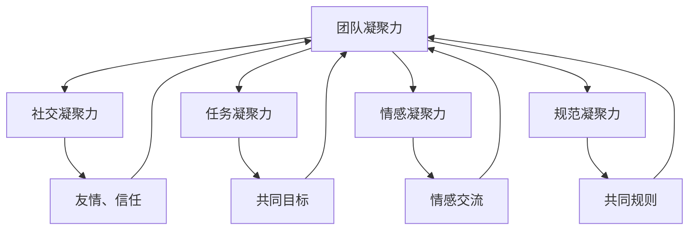

**核心算法原理讲解**

为了更深入地理解团队凝聚力，我们可以通过以下伪代码来描述团队凝聚力的评估过程：

```plaintext
function assessTeamCohesion(teamMembers) {
    friendshipScore = calculateFriendshipScore(teamMembers)
    taskScore = calculateTaskPerformance(teamMembers)
    emotionalScore = calculateEmotionalSupport(teamMembers)
    normativeScore = calculateNormativeAdherence(teamMembers)

    cohesionScore = (friendshipScore + taskScore + emotionalScore + normativeScore) / 4

    return cohesionScore
}

function calculateFriendshipScore(teamMembers) {
    // 根据团队成员之间的信任和共同兴趣计算得分
}

function calculateTaskPerformance(teamMembers) {
    // 根据团队成员完成任务的效率和效果计算得分
}

function calculateEmotionalSupport(teamMembers) {
    // 根据团队成员之间的情感交流和支持计算得分
}

function calculateNormativeAdherence(teamMembers) {
    // 根据团队成员对共同规则和标准的遵守程度计算得分
}
```

**数学模型和公式 & 详细讲解 & 举例说明**

在团队凝聚力的评估中，我们可以使用以下数学模型来计算团队凝聚力得分：

$$
\text{团队凝聚力得分} = \frac{\text{社交凝聚力得分} + \text{任务凝聚力得分} + \text{情感凝聚力得分} + \text{规范凝聚力得分}}{4}
$$

举例说明，如果一个团队的社交凝聚力得分为80分，任务凝聚力得分为75分，情感凝聚力得分为70分，规范凝聚力得分为85分，那么该团队的凝聚力得分为：

$$
\text{团队凝聚力得分} = \frac{80 + 75 + 70 + 85}{4} = 78.75
$$

#### 第2章：团队向心力的概念与作用

2.1 **团队向心力的定义**

团队向心力是指团队成员在共同目标和任务驱动下，自愿向团队中心聚集，形成一种合力效应的现象。向心力是团队凝聚力的核心组成部分，它能够使团队成员在面临挑战和压力时，更加紧密地团结在一起，共同应对困难。

2.2 **团队向心力的来源**

团队向心力的来源主要有以下几个方面：

- **共同目标**：明确且具有挑战性的共同目标是团队向心力的重要来源。
- **团队文化**：积极向上、相互支持的文化氛围可以增强团队成员的向心力。
- **领导者作用**：领导者的正确引导和激励可以激发团队成员的向心力。
- **成功经验**：团队的成功经验和正面反馈可以增强团队成员的向心力。

2.3 **团队向心力对团队的影响**

团队向心力对团队的影响主要体现在以下几个方面：

- **增强团队协作**：向心力使团队成员更加愿意协同工作，提高团队协作效率。
- **提高决策质量**：向心力有助于团队成员在决策过程中达成共识，提高决策质量。
- **提升团队士气**：向心力可以提升团队成员的士气和信心，增强团队凝聚力。
- **增强团队适应能力**：向心力使团队能够更好地应对外部变化和挑战。

2.4 **团队向心力的提升策略**

以下是一些提升团队向心力的策略：

- **明确共同目标**：制定具有挑战性的共同目标，激发团队成员的向心力。
- **塑造团队文化**：建立积极向上、相互支持的文化氛围，增强团队成员的向心力。
- **领导者激励**：领导者通过正确的激励方式，激发团队成员的向心力。
- **分享成功经验**：及时分享团队的成功经验和正面反馈，增强团队成员的向心力。

**核心概念与联系**

为了更好地理解团队向心力的概念，我们可以通过以下Mermaid流程图来展示团队向心力的来源和影响：

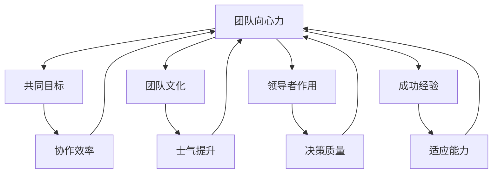

**核心算法原理讲解**

为了深入理解团队向心力的提升策略，我们可以通过以下伪代码来描述提升团队向心力的过程：

```plaintext
function enhanceTeamCentripetalForce(team) {
    setCommonGoal(team)
    cultivateTeamCulture(team)
    inspireLeadership(team)
    shareSuccessExperience(team)

    // 对团队向心力进行持续监控和调整
    monitorAndAdjustCentripetalForce(team)
}

function setCommonGoal(team) {
    // 制定具有挑战性的共同目标
}

function cultivateTeamCulture(team) {
    // 塑造积极向上、相互支持的文化氛围
}

function inspireLeadership(team) {
    // 通过正确的方式激励领导者，激发团队成员的向心力
}

function shareSuccessExperience(team) {
    // 及时分享团队的成功经验和正面反馈
}

function monitorAndAdjustCentripetalForce(team) {
    // 对团队向心力进行持续监控和调整
}
```

**数学模型和公式 & 详细讲解 & 举例说明**

在团队向心力的提升过程中，我们可以使用以下数学模型来计算团队向心力得分：

$$
\text{团队向心力得分} = \frac{\text{协作效率得分} + \text{决策质量得分} + \text{士气提升得分} + \text{适应能力得分}}{4}
$$

举例说明，如果一个团队的协作效率得分为85分，决策质量得分为80分，士气提升得分为90分，适应能力得分为75分，那么该团队的向心力得分为：

$$
\text{团队向心力得分} = \frac{85 + 80 + 90 + 75}{4} = 82.5
$$

#### 第3章：团队结构与凝聚力

3.1 **团队结构的定义与分类**

团队结构是指团队成员之间的组织形式和工作关系的安排。团队结构对团队的凝聚力有着重要影响。团队结构可以分为以下几种类型：

- **扁平化结构**：团队成员之间的层级较少，信息传递速度快，有利于提高团队凝聚力。
- **层级化结构**：团队成员之间的层级较多，信息传递速度较慢，可能导致团队凝聚力下降。
- **矩阵式结构**：团队成员同时受到垂直和水平的双重领导，有利于提高团队凝聚力和协作效率。

3.2 **团队规模对凝聚力的影响**

团队规模是指团队成员的数量。团队规模对凝聚力有着显著的影响。研究表明：

- **小团队**：小团队通常具有更高的凝聚力，成员之间更容易建立紧密的联系。
- **大团队**：大团队可能面临沟通成本高、协调难度大等问题，导致凝聚力下降。

3.3 **团队成员多样性对凝聚力的影响**

团队成员多样性包括性别、年龄、教育背景、工作经验等方面。多样性对团队凝聚力具有双重影响：

- **正面影响**：多样性可以带来新的思维方式和观点，促进创新和团队发展。
- **负面影响**：多样性可能导致团队成员之间的冲突，降低团队凝聚力。

3.4 **团队角色与职责对凝聚力的影响**

团队角色与职责是指团队成员在团队中的角色和责任分配。合理的角色与职责分配对团队凝聚力具有以下影响：

- **明确职责**：明确团队成员的职责，有助于提高团队凝聚力和工作效率。
- **公平分配**：公平的职责分配可以增强团队成员的归属感和满意度，提高团队凝聚力。

**核心概念与联系**

为了更好地理解团队结构与凝聚力的关系，我们可以通过以下Mermaid流程图来展示团队结构类型和团队规模、多样性、角色与职责对凝聚力的关系：

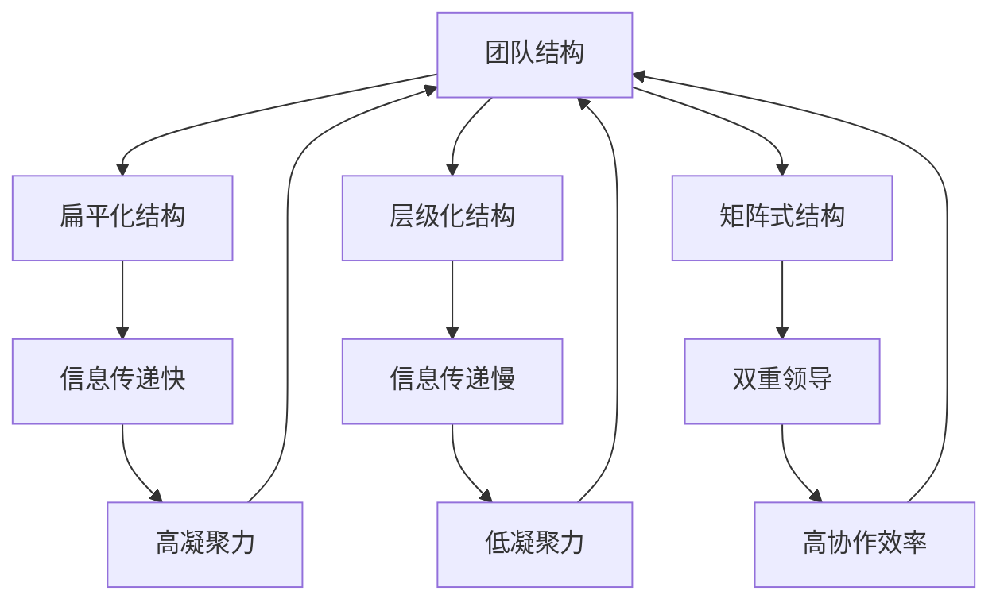

**核心算法原理讲解**

为了深入理解团队结构与凝聚力，我们可以通过以下伪代码来描述团队结构的优化过程：

```plaintext
function optimizeTeamStructure(team) {
    assessTeamSize(team)
    assessTeamDiversity(team)
    assignTeamRolesAndResponsibilities(team)

    // 根据评估结果调整团队结构
    adjustTeamStructure(team)
}

function assessTeamSize(team) {
    // 根据团队规模评估团队凝聚力
}

function assessTeamDiversity(team) {
    // 根据团队成员多样性评估团队凝聚力
}

function assignTeamRolesAndResponsibilities(team) {
    // 根据团队成员能力分配角色和职责
}

function adjustTeamStructure(team) {
    // 根据评估结果调整团队结构，提高团队凝聚力
}
```

**数学模型和公式 & 详细讲解 & 举例说明**

在团队结构的优化过程中，我们可以使用以下数学模型来计算团队结构优化得分：

$$
\text{团队结构优化得分} = \frac{\text{扁平化结构得分} + \text{层级化结构得分} + \text{矩阵式结构得分}}{3}
$$

举例说明，如果一个团队的扁平化结构得分为90分，层级化结构得分为75分，矩阵式结构得分为85分，那么该团队的团队结构优化得分为：

$$
\text{团队结构优化得分} = \frac{90 + 75 + 85}{3} = 84.3
$$

#### 第4章：领导风格与团队凝聚力

4.1 **领导风格对团队凝聚力的影响**

领导风格对团队凝聚力有着显著的影响。不同的领导风格会导致团队成员之间的互动方式和团队氛围的不同。以下是一些常见的领导风格及其对团队凝聚力的影响：

- **交易型领导**：交易型领导注重任务完成和短期绩效，可能降低团队凝聚力。
- **变革型领导**：变革型领导注重激励团队成员实现长期目标，有助于提升团队凝聚力。

4.2 **交易型领导与变革型领导**

交易型领导和变革型领导在以下几个方面存在差异：

- **激励方式**：交易型领导通过奖惩制度激励员工，变革型领导通过激发员工的内在动机。
- **决策方式**：交易型领导倾向于集中决策，变革型领导鼓励团队成员参与决策。
- **领导与成员关系**：交易型领导与成员之间更多是任务导向的关系，变革型领导更注重建立互信和合作关系。

4.3 **领导者如何增强团队凝聚力**

领导者可以通过以下方式增强团队凝聚力：

- **建立共同目标**：明确且具有挑战性的共同目标有助于提升团队凝聚力。
- **鼓励沟通**：领导者应鼓励团队成员之间的沟通，减少信息不对称。
- **激励团队成员**：通过合理的激励措施，激发团队成员的积极性和创造力。
- **提供反馈**：领导者应提供及时的反馈，帮助团队成员了解自己的表现，提高团队凝聚力。

4.4 **领导者如何应对团队凝聚力问题**

当团队出现凝聚力问题时，领导者可以采取以下措施：

- **识别问题原因**：通过调查和观察，找出导致凝聚力问题的原因。
- **提供解决方案**：根据问题原因，制定针对性的解决方案。
- **沟通与协商**：与团队成员进行沟通，共同商讨解决问题的方法。
- **调整团队结构**：如果必要，可以调整团队结构，优化团队成员的职责分配。

**核心概念与联系**

为了更好地理解领导风格与团队凝聚力的关系，我们可以通过以下Mermaid流程图来展示交易型领导和变革型领导的特点及其对团队凝聚力的影响：

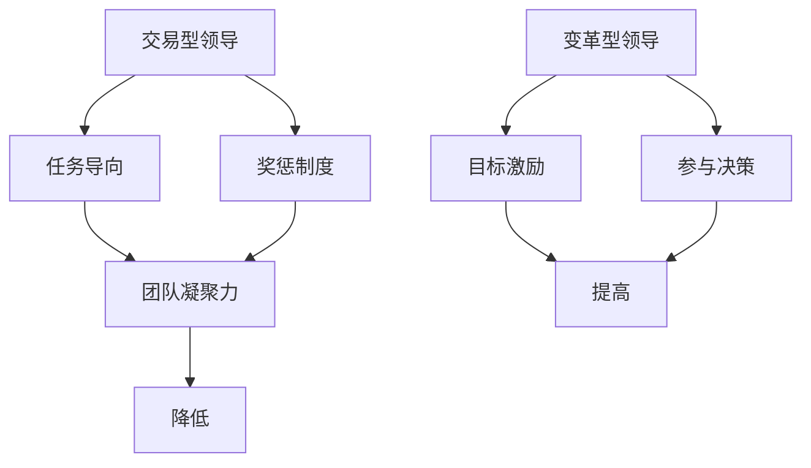

**核心算法原理讲解**

为了深入理解领导者如何增强团队凝聚力，我们可以通过以下伪代码来描述领导者的增强团队凝聚力的策略：

```plaintext
function enhanceTeamCohesionAsLeader(team) {
    establishCommonGoal(team)
    encourageCommunication(team)
    motivateTeamMembers(team)
    provideFeedback(team)

    // 监控团队凝聚力状况，并根据需要调整策略
    monitorTeamCohesion(team)
    adjustStrategiesIfNecessary(team)
}

function establishCommonGoal(team) {
    // 建立明确且具有挑战性的共同目标
}

function encourageCommunication(team) {
    // 鼓励团队成员之间的沟通
}

function motivateTeamMembers(team) {
    // 通过激励措施激发团队成员的积极性和创造力
}

function provideFeedback(team) {
    // 提供及时的反馈，帮助团队成员了解自己的表现
}

function monitorTeamCohesion(team) {
    // 监控团队凝聚力状况
}

function adjustStrategiesIfNecessary(team) {
    // 根据团队凝聚力状况，调整增强团队凝聚力的策略
}
```

**数学模型和公式 & 详细讲解 & 举例说明**

在领导者增强团队凝聚力的过程中，我们可以使用以下数学模型来计算团队凝聚力得分：

$$
\text{团队凝聚力得分} = \text{共同目标得分} + \text{沟通得分} + \text{激励得分} + \text{反馈得分}
$$

举例说明，如果一个团队的共同目标得分为85分，沟通得分为80分，激励得分为90分，反馈得分为75分，那么该团队的凝聚力得分为：

$$
\text{团队凝聚力得分} = 85 + 80 + 90 + 75 = 330
$$

### 第二部分：提升团队凝聚力与向心力的策略

#### 第5章：团队沟通策略

5.1 **有效沟通的重要性**

有效沟通是团队凝聚力和向心力提升的关键。有效沟通可以减少误解和冲突，增强团队成员之间的信任和合作。以下是一些有效沟通的关键要素：

- **明确目的**：沟通前明确沟通的目的和目标，确保信息传递的准确性和有效性。
- **倾听**：倾听是有效沟通的基础，通过倾听可以更好地理解他人的观点和需求。
- **表达清晰**：使用简洁明了的语言表达自己的观点和想法，避免使用模糊的表述。
- **非语言沟通**：注意肢体语言、面部表情等非语言沟通方式，确保信息传递的完整性。

5.2 **沟通障碍与解决方法**

沟通障碍是影响团队沟通效果的主要因素。以下是一些常见的沟通障碍及其解决方法：

- **信息过滤**：信息在传递过程中被过滤或修改，导致信息失真。解决方法：建立透明和开放的沟通环境，减少信息过滤。
- **语言障碍**：团队成员之间的语言差异可能影响沟通效果。解决方法：使用简单易懂的语言，鼓励团队成员学习对方的语言。
- **文化差异**：不同文化背景可能导致沟通误解。解决方法：了解和尊重不同文化，通过培训和文化交流减少文化差异。
- **时间差异**：团队成员的时间安排可能不同，影响沟通的及时性。解决方法：合理安排沟通时间，利用现代化沟通工具提高沟通效率。

5.3 **沟通技巧与沟通工具**

有效的沟通技巧和工具是提高团队沟通效果的关键。以下是一些常用的沟通技巧和工具：

- **积极倾听**：通过提问、反馈和总结来验证信息的准确性。
- **非语言沟通**：注意肢体语言、面部表情等非语言沟通方式，增强信息传递的效果。
- **会议管理**：合理安排会议时间，确保会议目标的明确和会议效果的提升。
- **电子邮件和即时通讯工具**：使用电子邮件和即时通讯工具提高沟通效率和便利性。

5.4 **团队沟通案例分析**

为了更好地理解团队沟通策略的应用，以下是一个团队沟通的案例分析：

案例：某IT公司的一个开发团队在项目实施过程中遇到了沟通不畅的问题，导致项目进度延迟。通过以下措施，团队逐步解决了沟通问题：

- **建立沟通机制**：团队制定了每周的沟通会议制度，确保团队成员能够及时交流进展和问题。
- **明确沟通目标**：每次会议前，团队明确会议的目标和议程，确保会议的效率。
- **使用沟通工具**：团队使用了即时通讯工具和电子邮件，提高信息传递的及时性和准确性。
- **培训沟通技巧**：团队组织了沟通技巧培训，提高团队成员的沟通能力。

通过这些措施，团队逐步改善了沟通效果，项目进度得到了有效控制，团队凝聚力也得到了提升。

**核心概念与联系**

为了更好地理解团队沟通策略，我们可以通过以下Mermaid流程图来展示沟通的关键要素和沟通障碍的解决方法：

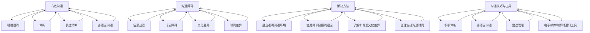

**核心算法原理讲解**

为了深入理解团队沟通策略，我们可以通过以下伪代码来描述团队沟通的过程：

```plaintext
function teamCommunicationStrategy(team) {
    establishCommunicationMechanism(team)
    clarifyCommunicationGoals(team)
    useCommunicationTools(team)
    trainCommunicationSkills(team)

    // 监控沟通效果，并根据需要调整策略
    monitorCommunicationEffectiveness(team)
    adjustStrategiesIfNecessary(team)
}

function establishCommunicationMechanism(team) {
    // 建立沟通会议制度，确保团队成员能够及时交流
}

function clarifyCommunicationGoals(team) {
    // 确保每次沟通会议的目标和议程明确
}

function useCommunicationTools(team) {
    // 使用电子邮件和即时通讯工具提高沟通效率
}

function trainCommunicationSkills(team) {
    // 组织沟通技巧培训，提高团队成员的沟通能力
}

function monitorCommunicationEffectiveness(team) {
    // 监控沟通效果，评估沟通策略的有效性
}

function adjustStrategiesIfNecessary(team) {
    // 根据沟通效果，调整沟通策略
}
```

**数学模型和公式 & 详细讲解 & 举例说明**

在团队沟通策略的实施过程中，我们可以使用以下数学模型来计算团队沟通效果得分：

$$
\text{团队沟通效果得分} = \text{明确目的得分} + \text{倾听得分} + \text{表达清晰得分} + \text{非语言沟通得分}
$$

举例说明，如果一个团队的明确目的得分为85分，倾听得分为80分，表达清晰得分为90分，非语言沟通得分为75分，那么该团队的沟通效果得分为：

$$
\text{团队沟通效果得分} = 85 + 80 + 90 + 75 = 330
$$

#### 第6章：团队建设活动

6.1 **团队建设活动的目的与类型**

团队建设活动是指为了增强团队成员之间的联系和合作而组织的一系列有目的的活动。团队建设活动的目的主要包括：

- **增强团队凝聚力**：通过团队建设活动，加强团队成员之间的相互了解和信任，提高团队凝聚力。
- **提升团队协作能力**：通过团队建设活动，培养团队成员之间的协作意识和协作能力。
- **改善团队氛围**：通过团队建设活动，营造积极向上的团队氛围，提高团队成员的工作满意度和幸福感。

团队建设活动可以分为以下几种类型：

- **室内团队建设活动**：包括座谈会、团队讨论、心理游戏等。
- **户外团队建设活动**：包括拓展训练、户外徒步、团队露营等。
- **专业团队建设活动**：包括技术分享会、项目管理培训、领导力培训等。

6.2 **团队建设活动的策划与实施**

团队建设活动的策划与实施需要遵循以下步骤：

- **明确活动目标**：根据团队需求和实际情况，明确团队建设活动的目标。
- **选择活动类型**：根据活动目标和团队成员的喜好，选择适合的团队建设活动类型。
- **制定活动计划**：制定详细的活动计划，包括活动时间、地点、内容、人员安排等。
- **准备活动资源**：准备好活动所需的场地、设备、材料等资源。
- **实施活动**：按照活动计划，组织团队成员参与活动，确保活动顺利进行。
- **总结与反馈**：活动结束后，对活动效果进行总结，收集团队成员的反馈意见，为下一次团队建设活动提供参考。

6.3 **团队建设活动的评估与反馈**

团队建设活动的评估与反馈是确保活动效果的重要环节。以下是一些评估与反馈的方法：

- **问卷调查**：通过设计针对性的问卷，了解团队成员对团队建设活动的满意度、收获和改进建议。
- **访谈**：与团队成员进行面对面访谈，了解他们对团队建设活动的真实感受和建议。
- **观察**：观察团队成员在活动中的表现，评估团队建设活动对团队成员的影响。
- **绩效指标**：通过团队绩效指标的变化，评估团队建设活动的效果。

6.4 **团队建设活动案例分析**

为了更好地理解团队建设活动的应用，以下是一个团队建设活动的案例分析：

案例：某科技公司为了提升团队凝聚力和协作能力，组织了一次户外拓展训练活动。活动内容包括高空走绳、团队合作穿越障碍等。通过这次活动，团队成员之间的信任和协作能力得到了显著提升，团队氛围也变得更加积极向上。活动结束后，团队绩效得到了明显改善，项目进度顺利推进。

**核心概念与联系**

为了更好地理解团队建设活动，我们可以通过以下Mermaid流程图来展示团队建设活动的目的、类型和策划与实施过程：

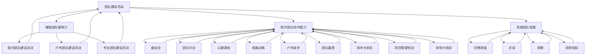

**核心算法原理讲解**

为了深入理解团队建设活动的策划与实施，我们可以通过以下伪代码来描述团队建设活动的策划与实施过程：

```plaintext
function planAndImplementTeamBuildingActivity(activityType, activityGoal) {
    establishActivityGoals(activityGoal)
    selectActivityType(activityType)
    prepareActivityResources()
    executeActivityPlan()
    evaluateActivityEffectiveness()
    collectFeedback()

    // 根据评估结果和反馈，调整团队建设活动策略
    adjustAndImproveFutureActivities()
}

function establishActivityGoals(activityGoal) {
    // 根据团队需求和实际情况，明确团队建设活动的目标
}

function selectActivityType(activityType) {
    // 根据活动目标和团队成员的喜好，选择适合的团队建设活动类型
}

function prepareActivityResources() {
    // 准备活动所需的场地、设备、材料等资源
}

function executeActivityPlan() {
    // 按照活动计划，组织团队成员参与活动，确保活动顺利进行
}

function evaluateActivityEffectiveness() {
    // 评估团队建设活动的效果
}

function collectFeedback() {
    // 收集团队成员对活动效果的反馈意见
}

function adjustAndImproveFutureActivities() {
    // 根据评估结果和反馈，调整团队建设活动策略，提高未来活动的效果
}
```

**数学模型和公式 & 详细讲解 & 举例说明**

在团队建设活动的策划与实施过程中，我们可以使用以下数学模型来计算团队建设活动的效果得分：

$$
\text{团队建设活动效果得分} = \text{团队凝聚力得分} + \text{团队协作能力得分} + \text{团队氛围得分}
$$

举例说明，如果一个团队的团队凝聚力得分为90分，团队协作能力得分为85分，团队氛围得分为80分，那么该团队建设活动的效果得分为：

$$
\text{团队建设活动效果得分} = 90 + 85 + 80 = 255
$$

#### 第7章：激励与认可策略

7.1 **激励理论概述**

激励是指通过外部刺激和内部动机激发员工的行为和动力。在团队管理中，激励理论为管理者提供了解决员工动力不足的方法。以下是一些常见的激励理论：

- **马斯洛需求层次理论**：根据马斯洛的需求层次理论，员工的动机可以分为生理需求、安全需求、社交需求、尊重需求和自我实现需求。管理者应根据员工的需求层次，采取相应的激励措施。
- **赫茨伯格双因素理论**：赫茨伯格双因素理论指出，激励因素（如工作成就感、认可、责任感等）和保健因素（如工作条件、薪酬等）对员工的动机和满意度有着不同的影响。管理者应注重激励因素的培养，提高员工的满意度。
- **目标设定理论**：目标设定理论认为，设定具有挑战性但可达成的目标可以激发员工的动机和积极性。管理者应与员工共同设定目标，并提供必要的支持和资源。

7.2 **薪酬激励与非物质激励**

激励策略可以分为薪酬激励和非物质激励两个方面：

- **薪酬激励**：薪酬激励是指通过提高员工的薪酬水平来激发其工作动力。薪酬激励的优点包括：直接、有效、激励性强。然而，过度依赖薪酬激励可能导致员工的短视行为和依赖性。
- **非物质激励**：非物质激励是指通过提供荣誉、认可、培训和发展机会等来激发员工的工作动力。非物质激励的优点包括：持久、广泛、无成本。非物质激励可以增强员工的归属感和忠诚度，提高员工的工作满意度和忠诚度。

7.3 **员工认可与表扬**

员工认可与表扬是激励员工的重要手段。以下是一些员工认可与表扬的方法：

- **即时认可**：对员工在工作中的表现进行即时认可，让员工感受到自己的努力得到了认可。
- **公开表扬**：在团队会议或其他公开场合对员工进行表扬，增强员工的荣誉感和成就感。
- **个性化认可**：根据员工的个性和喜好，采取个性化的认可方式，让员工感受到被尊重和关心。
- **奖励与晋升**：为表现优秀的员工提供奖励和晋升机会，激励其他员工努力工作。

7.4 **激励策略的应用与实践**

以下是一个激励策略的应用案例：

案例：某公司为了提高团队绩效和员工满意度，采取了以下激励策略：

- **薪酬激励**：根据公司业绩和员工绩效，提高员工的薪酬水平。
- **非物质激励**：设立员工表彰大会，对表现优秀的员工进行公开表扬和奖励。
- **员工认可**：在团队内部设立“最佳员工”奖项，每月评选出一名最佳员工，并给予一定奖金和荣誉称号。
- **培训与发展**：为员工提供培训和发展机会，提高员工的技能和职业素养。

通过这些激励策略的实施，该公司的团队绩效和员工满意度得到了显著提升，员工的工作积极性和忠诚度也得到了提高。

**核心概念与联系**

为了更好地理解激励与认可策略，我们可以通过以下Mermaid流程图来展示激励理论、薪酬激励与非物质激励、员工认可与表扬的关系：

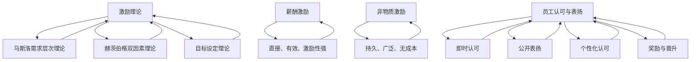

**核心算法原理讲解**

为了深入理解激励与认可策略，我们可以通过以下伪代码来描述激励策略的实施过程：

```plaintext
function implementMotivationStrategy(employee, performance) {
    calculateSalaryIncrease(employee, performance)
    provideNonfinancialRewards(employee, performance)
    acknowledgeEmployee(employee, performance)

    // 根据员工的绩效，调整激励策略
    adjustMotivationStrategyBasedOnPerformance(employee)
}

function calculateSalaryIncrease(employee, performance) {
    // 根据员工绩效，计算薪酬增长比例
}

function provideNonfinancialRewards(employee, performance) {
    // 根据员工绩效，提供奖励和晋升机会
}

function acknowledgeEmployee(employee, performance) {
    // 对员工进行即时认可和公开表扬
}

function adjustMotivationStrategyBasedOnPerformance(employee) {
    // 根据员工的绩效，调整激励策略，提高员工的工作动力
}
```

**数学模型和公式 & 详细讲解 & 举例说明**

在激励与认可策略的实施过程中，我们可以使用以下数学模型来计算员工的激励得分：

$$
\text{员工激励得分} = \text{薪酬激励得分} + \text{非物质激励得分} + \text{员工认可得分}
$$

举例说明，如果一个员工的薪酬激励得分为80分，非物质激励得分为85分，员工认可得分为90分，那么该员工的激励得分为：

$$
\text{员工激励得分} = 80 + 85 + 90 = 255
$$

#### 第8章：团队冲突管理

8.1 **团队冲突的类型与原因**

团队冲突是指在团队内部或团队之间发生的分歧、争议或争执。团队冲突可以分为以下几种类型：

- **任务冲突**：由于工作任务和目标的不同而产生的冲突，如工作优先级、任务分配等。
- **关系冲突**：由于团队成员之间的个人关系或性格差异而产生的冲突，如沟通不畅、合作不顺等。
- **价值观冲突**：由于团队成员对某些价值观、信念或理念的不同而产生的冲突，如工作方法、道德标准等。

团队冲突的原因主要包括：

- **任务分配不公**：团队成员认为自己在任务分配中受到了不公平对待，导致不满和冲突。
- **沟通不畅**：团队成员之间的沟通不畅，导致误解和冲突。
- **目标不一致**：团队成员对团队目标的理解和认同度不一致，导致冲突。
- **个人价值观差异**：团队成员的个人价值观差异，导致在工作中的冲突。

8.2 **团队冲突的影响与应对策略**

团队冲突对团队的影响可以分为正面和负面两个方面：

- **正面影响**：适度的冲突可以激发创新和创造力，提高团队解决问题的能力。
- **负面影响**：过度的冲突会导致团队凝聚力下降，影响工作效率和项目进度。

以下是一些应对团队冲突的策略：

- **预防策略**：通过明确的任务分配、有效的沟通机制和共同的目标设定，预防冲突的发生。
- **应对策略**：当冲突发生时，采取适当的应对策略，如沟通调解、协商解决、调整任务分配等。
- **解决策略**：通过深层次的沟通和协调，解决冲突的根本原因，防止冲突再次发生。

8.3 **冲突解决方法与实践**

以下是一些常见的冲突解决方法：

- **调解法**：由第三方调解者帮助双方进行沟通和协商，达成共识。
- **妥协法**：双方各自让步，寻求折中的解决方案。
- **强制法**：通过权威决策，强制解决冲突。
- **合作法**：双方通过深入沟通，寻求共同利益的最大化。

以下是一个团队冲突解决的案例分析：

案例：某公司的一个研发团队在项目实施过程中，因任务分配不公和沟通不畅导致了严重冲突。团队领导采取了以下措施解决冲突：

- **预防策略**：在项目启动时，明确任务分配和沟通机制，确保团队成员对任务和目标有清晰的理解。
- **应对策略**：在冲突发生时，组织团队成员进行沟通调解，了解双方的观点和需求，寻求共识。
- **解决策略**：通过调整任务分配和加强沟通，解决了冲突的根本原因，恢复了团队的正常运作。

**核心概念与联系**

为了更好地理解团队冲突管理，我们可以通过以下Mermaid流程图来展示团队冲突的类型、原因、影响与应对策略：

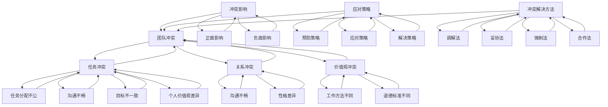

**核心算法原理讲解**

为了深入理解团队冲突管理，我们可以通过以下伪代码来描述团队冲突的解决过程：

```plaintext
function resolveTeamConflict(conflictType, conflictReasons) {
    assessConflictImpact()
    applyConflictPreventionStrategies()
    if (conflictExists()) {
        applyConflictResolutionMethods()
    }

    // 对冲突解决效果进行评估和反馈
    evaluateConflictResolutionEffectiveness()
}

function assessConflictImpact() {
    // 评估冲突对团队绩效和团队氛围的影响
}

function applyConflictPreventionStrategies() {
    // 实施预防策略，减少冲突发生的可能性
}

function conflictExists() {
    // 判断是否还存在未解决的冲突
}

function applyConflictResolutionMethods() {
    // 根据冲突类型和原因，选择合适的解决方法
}

function evaluateConflictResolutionEffectiveness() {
    // 对冲突解决效果进行评估和反馈
}
```

**数学模型和公式 & 详细讲解 & 举例说明**

在团队冲突管理的实施过程中，我们可以使用以下数学模型来计算团队冲突的管理效果得分：

$$
\text{团队冲突管理效果得分} = \text{预防策略得分} + \text{应对策略得分} + \text{解决策略得分}
$$

举例说明，如果一个团队的预防策略得分为80分，应对策略得分为85分，解决策略得分为90分，那么该团队的冲突管理效果得分为：

$$
\text{团队冲突管理效果得分} = 80 + 85 + 90 = 255
$$

#### 第9章：跨部门合作与团队凝聚力

9.1 **跨部门合作的重要性**

跨部门合作是指不同部门之间的协作与配合，以实现共同的目标和任务。跨部门合作在组织运作中具有重要性，主要体现在以下几个方面：

- **提高工作效率**：跨部门合作可以减少信息传递的障碍，提高工作效率。
- **增强团队协作**：跨部门合作有助于各部门之间的沟通与协作，增强团队凝聚力。
- **促进知识共享**：跨部门合作可以促进不同部门之间的知识共享和经验交流，提高整体组织的能力。
- **提高项目成功率**：跨部门合作可以整合各部门的资源，提高项目成功率和客户满意度。

9.2 **跨部门沟通与协作策略**

为了实现有效的跨部门合作，组织可以采取以下策略：

- **明确沟通目标**：在跨部门合作前，明确沟通的目标和内容，确保信息的准确传递。
- **建立沟通渠道**：建立有效的沟通渠道，如定期会议、即时通讯工具、共享文档等，确保信息畅通。
- **加强培训与指导**：对跨部门团队成员进行培训，提高其沟通协作能力，确保合作顺利进行。
- **建立共同目标**：明确跨部门合作的共同目标，增强团队成员的归属感和责任感。
- **激励机制**：对在跨部门合作中表现优秀的团队成员给予奖励和认可，激发团队成员的积极性。

9.3 **跨部门团队凝聚力建设**

跨部门团队凝聚力建设是提高跨部门合作效果的关键。以下是一些跨部门团队凝聚力建设的策略：

- **加强跨部门沟通**：通过定期举办跨部门会议、交流活动和团队建设活动，加强跨部门沟通与协作。
- **建立信任关系**：通过信任建设活动，如团队信任游戏、团队信任培训等，建立跨部门之间的信任关系。
- **优化跨部门流程**：优化跨部门工作流程，减少不必要的跨部门协作环节，提高跨部门工作效率。
- **共享资源与信息**：建立跨部门资源共享和信息共享平台，促进跨部门之间的信息交流与合作。

9.4 **跨部门合作案例分析**

以下是一个跨部门合作案例的分析：

案例：某公司的一个大型项目需要多个部门协同完成。为了实现项目的顺利进行，公司采取了以下跨部门合作策略：

- **明确沟通目标**：在项目启动阶段，明确了各部门的沟通目标和内容，确保项目信息的准确传递。
- **建立沟通渠道**：建立了跨部门沟通会议制度，每周召开一次跨部门会议，确保各部门的进展和问题及时沟通。
- **加强培训与指导**：对参与项目的跨部门团队成员进行了沟通协作培训，提高了团队成员的沟通协作能力。
- **建立共同目标**：明确了项目的共同目标，增强了团队成员的归属感和责任感。
- **激励机制**：对在项目中表现优秀的跨部门团队成员给予了奖励和认可，激发了团队成员的积极性。

通过这些跨部门合作策略的实施，该项目顺利完成，取得了良好的效果，团队的凝聚力也得到了显著提升。

**核心概念与联系**

为了更好地理解跨部门合作与团队凝聚力的关系，我们可以通过以下Mermaid流程图来展示跨部门合作的重要性、策略和团队凝聚力建设的关系：

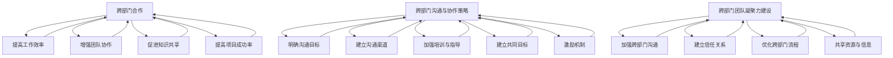

**核心算法原理讲解**

为了深入理解跨部门合作与团队凝聚力的提升策略，我们可以通过以下伪代码来描述跨部门合作与团队凝聚力建设的实施过程：

```plaintext
function enhanceCrossDepartmentalCollaboration(team) {
    establishCommunicationGoals(team)
    setUpCommunicationChannels(team)
    provideTrainingAndGuidance(team)
    setCommonGoals(team)
    implementIncentiveMechanisms(team)

    // 监控跨部门合作效果，并根据需要调整策略
    monitorCollaborationEffectiveness(team)
    adjustStrategiesIfNecessary(team)
}

function establishCommunicationGoals(team) {
    // 确定跨部门合作的具体目标和期望成果
}

function setUpCommunicationChannels(team) {
    // 建立有效的跨部门沟通渠道，如定期会议和即时通讯工具
}

function provideTrainingAndGuidance(team) {
    // 对跨部门团队成员进行沟通协作培训，提高协作能力
}

function setCommonGoals(team) {
    // 明确跨部门合作的共同目标，增强团队成员的归属感
}

function implementIncentiveMechanisms(team) {
    // 制定激励机制，激励团队成员积极参与跨部门合作
}

function monitorCollaborationEffectiveness(team) {
    // 监控跨部门合作的进展和效果，评估策略的执行情况
}

function adjustStrategiesIfNecessary(team) {
    // 根据跨部门合作效果，调整和优化合作策略
}
```

**数学模型和公式 & 详细讲解 & 举例说明**

在跨部门合作与团队凝聚力提升的过程中，我们可以使用以下数学模型来计算跨部门合作效果得分：

$$
\text{跨部门合作效果得分} = \text{工作效率得分} + \text{团队协作得分} + \text{知识共享得分} + \text{项目成功率得分}
$$

举例说明，如果一个团队的工作效率得分为85分，团队协作得分为80分，知识共享得分为90分，项目成功率得分为75分，那么该团队的跨部门合作效果得分为：

$$
\text{跨部门合作效果得分} = 85 + 80 + 90 + 75 = 330
$$

### 第三部分：团队凝聚力与向心力提升的实践应用

#### 第10章：团队凝聚力与向心力提升项目计划

10.1 **项目计划制定流程**

团队凝聚力与向心力提升项目计划是确保提升活动有效实施的关键。制定项目计划通常包括以下步骤：

- **需求分析**：通过调查问卷、访谈等方式，了解团队成员对团队凝聚力和向心力提升的需求和期望。
- **目标设定**：根据需求分析结果，设定明确、具体、可衡量的项目目标。
- **策略制定**：制定实现项目目标的策略和方法，包括团队沟通策略、团队建设活动、激励与认可策略等。
- **资源规划**：明确项目所需的资源，如人力、资金、设备等，并进行合理分配。
- **时间安排**：制定项目的时间表，包括各阶段的开始和结束时间，以及关键节点的里程碑。
- **风险评估**：评估项目实施过程中可能遇到的风险，并制定相应的风险应对措施。
- **沟通计划**：制定项目沟通计划，确保项目进度和结果的及时沟通和反馈。

10.2 **项目目标设定与优先级排序**

项目目标设定是项目计划的核心。设定项目目标时，应遵循SMART原则（具体、可衡量、可实现、相关性强、时限性）。项目目标的设定应包括以下内容：

- **具体**：明确项目目标的具体内容和标准。
- **可衡量**：设定可量化的指标，以衡量目标实现的程度。
- **可实现**：确保目标在现有资源和条件下可以实现。
- **相关性强**：目标应与团队的长期目标和组织战略保持一致。
- **时限性**：设定明确的目标完成时限。

在设定项目目标后，应对目标进行优先级排序，以确保资源的合理分配和目标的有序实现。优先级排序可以基于以下标准：

- **目标的重要性**：根据目标对团队和组织的贡献度，确定目标的优先级。
- **目标的紧急性**：根据目标的紧迫程度，确定目标的优先级。
- **资源的可用性**：根据资源的分配情况，确定目标的优先级。

10.3 **项目资源规划与时间安排**

项目资源规划是确保项目顺利实施的基础。资源规划包括以下内容：

- **人力规划**：明确项目所需的人员及其职责，包括项目团队、外部顾问和专家等。
- **资金规划**：明确项目所需的资金预算，包括培训费用、设备购置费用等。
- **设备规划**：明确项目所需的设备和技术支持，确保设备的及时到位。
- **时间安排**：制定项目的时间表，包括各阶段的开始和结束时间，以及关键节点的里程碑。

在制定时间安排时，应充分考虑以下因素：

- **项目进度**：根据项目目标和任务，合理安排项目进度，确保各阶段任务按时完成。
- **资源调度**：根据资源可用性，合理分配资源，避免资源浪费和冲突。
- **风险因素**：考虑可能的风险和不确定性，预留一定的缓冲时间，以应对突发事件。

10.4 **项目风险管理**

项目风险管理是确保项目顺利进行的重要环节。项目风险管理包括以下步骤：

- **风险识别**：识别项目实施过程中可能遇到的风险，如人员流失、技术难题、资源不足等。
- **风险评估**：评估每个风险的可能性和影响程度，确定风险优先级。
- **风险应对**：制定应对措施，包括风险规避、风险减轻、风险转移等。
- **风险监控**：在项目实施过程中，持续监控风险的发展，及时调整应对措施。

**核心概念与联系**

为了更好地理解项目计划制定流程，我们可以通过以下Mermaid流程图来展示项目计划制定的各个阶段及其关系：

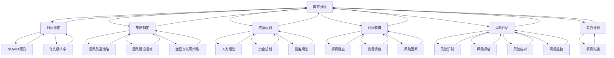

**核心算法原理讲解**

为了深入理解项目资源规划与时间安排，我们可以通过以下伪代码来描述项目计划制定的过程：

```plaintext
function createProjectPlan(projectGoals, resources) {
    analyzeRequirements()
    defineProjectGoals(projectGoals)
    developStrategies()
    allocateResources(resources)
    scheduleActivities()
    assessRisks()

    // 实施项目计划
    executeProjectPlan()

    // 监控项目进度和效果
    monitorProjectProgress()
}

function analyzeRequirements() {
    // 通过调查问卷和访谈，了解团队成员的需求和期望
}

function defineProjectGoals(projectGoals) {
    // 根据需求分析结果，设定具体、可衡量、可实现、相关性强、时限性的项目目标
}

function developStrategies() {
    // 制定实现项目目标的策略和方法，包括团队沟通策略、团队建设活动、激励与认可策略等
}

function allocateResources(resources) {
    // 明确项目所需的资源，包括人力、资金、设备等，并进行合理分配
}

function scheduleActivities() {
    // 制定项目的时间表，包括各阶段的开始和结束时间，以及关键节点的里程碑
}

function assessRisks() {
    // 识别项目实施过程中可能遇到的风险，评估风险的可能性和影响程度，制定风险应对措施
}

function executeProjectPlan() {
    // 根据项目计划，实施团队凝聚力与向心力提升活动
}

function monitorProjectProgress() {
    // 监控项目进度和效果，确保项目目标的实现
}
```

**数学模型和公式 & 详细讲解 & 举例说明**

在项目计划制定过程中，我们可以使用以下数学模型来计算项目资源利用率和项目进度完成率：

$$
\text{资源利用率} = \frac{\text{实际使用资源}}{\text{计划使用资源}} \times 100\%
$$

$$
\text{项目进度完成率} = \frac{\text{已完成活动数}}{\text{计划活动总数}} \times 100\%
$$

举例说明，如果一个项目计划使用资源100单位，实际使用资源90单位，计划活动总数10项，已完成活动8项，那么该项目的资源利用率为90%，项目进度完成率为80%。

#### 第11章：团队凝聚力与向心力提升实践案例分析

11.1 **案例分析概述**

在本章节中，我们将通过一个实际案例，详细解析一个团队在提升团队凝聚力和向心力方面的成功实践。该案例来源于一家大型科技公司，该公司的团队在经历了多次项目失败后，决定采取一系列措施提升团队凝聚力与向心力。

11.2 **案例分析详细解读**

**1. 需求分析与目标设定**

在项目失败后，公司通过问卷调查和访谈，发现团队在以下几个方面存在显著问题：

- **沟通不畅**：团队成员之间的沟通存在障碍，导致信息传递不及时，理解存在偏差。
- **目标不一致**：团队成员对项目目标的认知存在差异，缺乏共同的方向和目标。
- **信任缺失**：团队成员之间存在信任危机，协作效率低下。

基于以上分析，公司设定了以下项目目标：

- **提高沟通效率**：通过建立有效的沟通机制，确保信息传递的及时性和准确性。
- **统一目标认知**：明确项目目标，确保团队成员对目标的认同和统一。
- **建立信任关系**：通过团队建设活动和激励措施，增强团队成员之间的信任。

**2. 实施策略**

公司采取了一系列措施，以实现上述目标：

- **沟通策略**：建立了每周团队会议制度，确保团队成员能够及时交流进展和问题。同时，引入了即时通讯工具，提高了信息传递的效率。

- **团队建设活动**：组织了多次团队建设活动，包括户外拓展训练、团队露营和团队心理游戏等，通过这些活动，团队成员之间的信任和合作意识得到了显著提升。

- **激励措施**：建立了绩效评价体系，对在项目中表现优秀的团队成员进行奖励和认可。此外，公司还为团队成员提供了培训和发展机会，激发了团队成员的工作动力。

**3. 项目效果**

通过上述措施的实施，团队在多个方面取得了显著成效：

- **沟通效率提高**：团队会议制度和即时通讯工具的使用，使团队成员之间的沟通更加顺畅，信息传递的准确性和及时性得到了显著提升。

- **目标认知统一**：通过明确项目目标和激励措施，团队成员对项目目标的认知得到了统一，团队成员之间的协作更加紧密。

- **信任关系建立**：团队建设活动和激励措施的实施，使团队成员之间的信任得到了增强，协作效率得到了显著提升。

- **项目成功率提高**：通过团队凝聚力和向心力的提升，团队在后续项目中取得了成功，项目进度和质量得到了显著改善。

**4. 启示与借鉴**

通过本案例，我们可以得到以下启示和借鉴：

- **明确目标**：明确的项目目标是提升团队凝聚力与向心力的关键。
- **有效沟通**：建立有效的沟通机制，是提高团队协作效率的重要保障。
- **团队建设**：通过团队建设活动，增强团队成员之间的信任和合作意识。
- **激励措施**：合理的激励措施可以激发团队成员的工作动力和创造力。

**核心概念与联系**

为了更好地理解案例中的团队凝聚力与向心力提升策略，我们可以通过以下Mermaid流程图来展示这些策略的构成和实施过程：

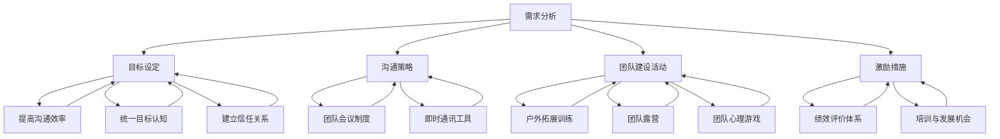

**核心算法原理讲解**

为了深入理解案例中的团队凝聚力与向心力提升策略，我们可以通过以下伪代码来描述这些策略的实施过程：

```plaintext
function enhanceTeamMoodAndSpirit(team) {
    analyzeTeamRequirements()
    setTeamGoals()
    implementCommunicationStrategies()
    organizeTeamBuildingActivities()
    establishIncentiveMechanisms()

    // Monitor and adjust strategies
    monitorTeamPerformance()
    adjustStrategiesBasedOnFeedback()
}

function analyzeTeamRequirements() {
    // Conduct surveys and interviews to understand team requirements and issues
}

function setTeamGoals() {
    // Define specific, measurable, achievable, relevant, and time-bound team goals
}

function implementCommunicationStrategies() {
    // Establish team meetings and instant messaging tools to improve communication efficiency
}

function organizeTeamBuildingActivities() {
    // Organize outdoor training, team camping, and psychological games to build trust and cooperation
}

function establishIncentiveMechanisms() {
    // Establish performance evaluation systems and provide training and development opportunities to motivate team members
}

function monitorTeamPerformance() {
    // Monitor team performance and assess the effectiveness of strategies
}

function adjustStrategiesBasedOnFeedback() {
    // Adjust and optimize strategies based on team feedback and performance data
}
```

**数学模型和公式 & 详细讲解 & 举例说明**

在团队凝聚力与向心力提升的过程中，我们可以使用以下数学模型来计算团队绩效指标：

$$
\text{团队绩效指标} = \text{沟通效率得分} + \text{目标认知得分} + \text{信任关系得分}
$$

举例说明，如果一个团队的沟通效率得分为85分，目标认知得分为90分，信任关系得分为80分，那么该团队的绩效指标为：

$$
\text{团队绩效指标} = 85 + 90 + 80 = 255
$$

#### 第12章：持续提升团队凝聚力与向心力

12.1 **团队凝聚力与向心力提升的长期策略**

为了实现团队凝聚力与向心力的持续提升，组织需要采取一系列长期策略。以下是一些关键策略：

- **建立持续反馈机制**：通过定期反馈和评估，及时发现团队凝聚力和向心力方面的问题，并进行针对性的改进。
- **持续培训与指导**：为团队成员提供持续的培训和发展机会，提高团队成员的技能和知识，增强团队的整体实力。
- **优化团队流程**：持续优化团队的工作流程和协作方式，提高工作效率和协作效果。
- **建立团队文化**：通过建立积极向上的团队文化，增强团队成员的归属感和认同感，促进团队凝聚力和向心力的提升。

12.2 **反馈机制与持续改进**

建立有效的反馈机制是持续提升团队凝聚力与向心力的关键。以下是一些反馈机制的实施步骤：

- **明确反馈目标**：确定反馈的目标和范围，确保反馈的针对性和有效性。
- **设计反馈工具**：设计针对性的反馈问卷、访谈提纲等工具，确保反馈数据的准确性和完整性。
- **收集反馈数据**：通过定期收集反馈数据，了解团队成员对团队凝聚力和向心力的感受和建议。
- **分析反馈数据**：对收集的反馈数据进行系统分析，识别团队凝聚力和向心力方面的问题和改进方向。
- **制定改进计划**：根据反馈数据分析结果，制定针对性的改进计划，确保改进措施的有效性和可操作性。

12.3 **培训与指导**

持续培训与指导是提高团队成员能力和团队整体实力的关键。以下是一些培训与指导的实施步骤：

- **培训需求分析**：通过调查问卷和访谈，了解团队成员的培训需求和期望。
- **制定培训计划**：根据培训需求分析结果，制定详细的培训计划，包括培训内容、培训方式和培训时间等。
- **组织培训活动**：按照培训计划，组织各类培训活动，确保培训活动的效果和质量。
- **培训效果评估**：对培训效果进行评估，了解培训目标的实现情况，并根据评估结果进行培训调整和优化。

12.4 **团队文化的塑造与维护**

团队文化是团队凝聚力和向心力的重要保障。以下是一些团队文化的塑造与维护策略：

- **建立共同价值观**：明确团队的共同价值观和使命，确保团队成员对团队文化的认同和遵循。
- **树立榜样人物**：通过树立榜样人物和优秀团队，传递积极向上的团队文化。
- **开展文化活动**：定期举办各类文化活动，如团队聚餐、团队旅行、团队运动会等，增强团队成员之间的情感联系和团队归属感。
- **强化团队纪律**：通过建立严格的团队纪律和规范，确保团队文化的执行和落实。

**核心概念与联系**

为了更好地理解持续提升团队凝聚力与向心力的策略，我们可以通过以下Mermaid流程图来展示这些策略的构成和实施过程：

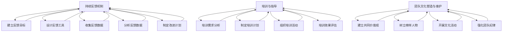

**核心算法原理讲解**

为了深入理解持续提升团队凝聚力与向心力的策略，我们可以通过以下伪代码来描述这些策略的实施过程：

```plaintext
function sustainTeamMaturity(team) {
    establishFeedbackLoop()
    provideContinuousTraining()
    nurtureTeamCultivation()

    // Continuously monitor and refine strategies
    monitorTeamProgress()
    refineStrategiesBasedOnInsights()
}

function establishFeedbackLoop() {
    // Define clear feedback objectives, design tools, collect data, analyze feedback, and create improvement plans
}

function provideContinuousTraining() {
    // Conduct training needs analysis, develop training programs, organize training events, and evaluate training outcomes
}

function nurtureTeamCultivation() {
    // Foster a shared value system, set role models, conduct team-building activities, and enforce team discipline
}

function monitorTeamProgress() {
    // Regularly assess team performance and the effectiveness of strategies
}

function refineStrategiesBasedOnInsights() {
    // Adjust and optimize strategies based on team performance data and feedback insights
}
```

**数学模型和公式 & 详细讲解 & 举例说明**

在持续提升团队凝聚力与向心力的过程中，我们可以使用以下数学模型来计算团队成熟度得分：

$$
\text{团队成熟度得分} = \text{反馈机制得分} + \text{培训与指导得分} + \text{团队文化得分}
$$

举例说明，如果一个团队的反馈机制得分为90分，培训与指导得分为85分，团队文化得分为80分，那么该团队的成熟度得分为：

$$
\text{团队成熟度得分} = 90 + 85 + 80 = 255
$$

### 附录

#### A.1 团队凝聚力与向心力提升工具与方法列表

1. **问卷调查工具**：用于收集团队成员对团队凝聚力和向心力的感受和意见。
2. **即时通讯工具**：用于提高团队成员之间的沟通效率。
3. **团队会议系统**：用于定期召开团队会议，讨论工作进展和问题。
4. **培训与指导平台**：用于组织团队成员参加培训和学习。
5. **绩效评估系统**：用于评估团队成员的工作表现和贡献。
6. **团队文化建设工具**：用于推广和实施团队文化价值观。
7. **反馈机制工具**：用于建立持续反馈和改进机制。

#### A.2 团队凝聚力与向心力提升参考资料

1. **《团队协作的艺术》**：作者：斯蒂芬·罗宾斯，介绍了团队协作的原理和实践方法。
2. **《团队管理实践》**：作者：彼得·德鲁克，提供了团队管理的理论和实践经验。
3. **《变革型领导》**：作者：詹姆斯·麦格雷戈·伯恩斯，探讨了变革型领导对团队凝聚力的影响。
4. **《组织行为学》**：作者：斯蒂芬·P·罗宾斯，分析了组织行为对团队凝聚力和向心力的影响。
5. **《团队沟通技巧》**：作者：詹姆斯·L·汉森，介绍了有效沟通的方法和技巧。

#### A.3 团队凝聚力与向心力提升实践建议

1. **定期组织团队建设活动**：通过户外拓展、团队游戏等活动，增强团队成员之间的互动和信任。
2. **建立反馈机制**：定期收集团队成员的反馈意见，及时改进团队工作和提升团队凝聚力。
3. **提供培训与发展机会**：为团队成员提供专业培训和职业发展机会，提高团队的整体实力。
4. **建立激励机制**：通过奖励和认可，激励团队成员积极工作，提高团队士气。
5. **强化团队纪律**：制定明确的团队规范和纪律，确保团队成员遵守，维护团队文化的执行力。

### 作者信息

**作者：AI天才研究院/AI Genius Institute & 禅与计算机程序设计艺术 /Zen And The Art of Computer Programming**

本文由AI天才研究院和禅与计算机程序设计艺术联合撰写，旨在为团队管理者提供关于团队凝聚力与向心力提升的全面指导和实践建议。希望本文能够帮助您更好地提升团队绩效和团队士气。如果您有任何疑问或建议，欢迎随时联系我们。感谢您的阅读！

