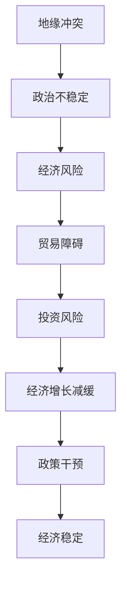

                 

# 地缘冲突加剧的经济影响

## 摘要

地缘冲突，这一贯穿历史的重要现象，如今在全球范围内日益加剧，对全球经济产生了深远的影响。本文将从地缘冲突的定义与历史背景出发，深入探讨地缘冲突对全球经济、贸易与投资的影响机制，以及主要经济体在应对地缘冲突时所采取的策略。文章还将分析地缘冲突对发展中国家的影响，探讨应对与调整策略，并对未来地缘冲突趋势与经济风险进行展望。通过具体的案例分析，本文旨在为理解地缘冲突的经济影响提供清晰的思路和实用的指导。

### 书名：《地缘冲突加剧的经济影响》

#### 第一部分：引言

### 第1章：地缘冲突的全球背景

- **1.1 地缘冲突的定义与历史背景**

  地缘冲突是指由于领土、资源、政治理念、宗教信仰等因素导致的国际关系紧张和对抗。从古代的战争、殖民扩张到现代的国际争端，地缘冲突一直是影响全球经济、政治、社会稳定的重要因素。历史数据显示，地缘冲突在全球范围内的频率和严重程度在不同历史时期有所波动，但总体趋势是呈现加剧状态。

- **1.2 地缘冲突的主要形式与特征**

  地缘冲突的形式多种多样，包括战争、军事冲突、政治对立、经济制裁等。其主要特征是国际关系的紧张和对抗，通常伴随着领土争端、资源争夺、政治斗争、宗教冲突等。在全球化时代，地缘冲突的表现形式更加复杂，不仅限于传统意义上的军事冲突，还涉及经济、科技、文化等多个领域。

- **1.3 地缘冲突对全球经济的影响概述**

  地缘冲突对全球经济产生了深远的影响。一方面，地缘冲突导致贸易壁垒的设立，限制了国际贸易的自由流动，对全球经济增长产生了负面影响。另一方面，地缘冲突引发的投资风险增加，导致跨国投资减缓，进一步影响了全球经济的稳定与发展。此外，地缘冲突还可能导致资源的浪费和社会的动荡，对全球经济产生长期的负面影响。

### 第二部分：地缘冲突的经济影响机制

#### 第2章：贸易与投资

- **2.1 地缘冲突对贸易流动的影响**

  地缘冲突对贸易流动的影响主要体现在贸易壁垒的设立和贸易渠道的重新分配上。首先，地缘冲突往往导致贸易壁垒的设立，包括关税、配额、非关税壁垒等。这些贸易壁垒限制了国际贸易的自由流动，增加了交易成本，对全球贸易产生了负面影响。其次，地缘冲突可能导致贸易渠道的重新分配，贸易伙伴之间的贸易流量发生变化，原有的贸易网络受到冲击。

- **2.1.1 贸易壁垒与关税**

  贸易壁垒是地缘冲突对贸易流动的最直接影响因素之一。关税是贸易壁垒中最常见的一种形式，它通过对进口商品征收高额税费来限制外国商品的进入。地缘冲突往往导致国家之间设立关税壁垒，这不仅增加了贸易成本，还可能导致贸易争端和贸易战。

- **2.1.2 贸易渠道的重新分配**

  地缘冲突还可能导致贸易渠道的重新分配。在国际贸易中，贸易渠道是指商品从生产国到消费国的流通路径。地缘冲突可能改变这一路径，导致贸易流量发生变化。例如，一些国家可能会寻找新的贸易伙伴，以避免与冲突国家进行贸易。

- **2.1.3 贸易争端与解决机制**

  地缘冲突引发的贸易争端是一个复杂的问题。国际社会建立了一系列解决贸易争端的机制，如世界贸易组织（WTO）的争端解决机制。这些机制旨在通过谈判、调解等方式解决贸易争端，维护全球贸易的稳定与发展。

- **2.2 地缘冲突对跨国投资的影响**

  地缘冲突对跨国投资的影响主要体现在投资风险的增加和投资流动性的变化上。首先，地缘冲突往往导致投资风险的增加，包括政治风险、经济风险、社会风险等。这些风险可能导致跨国投资减缓，甚至导致投资撤资。其次，地缘冲突还可能导致投资流动性的变化，一些投资者可能会选择撤资或转移资产，以避免风险。

- **2.2.1 投资风险与资金流动性**

  投资风险是地缘冲突对跨国投资的主要影响之一。地缘冲突可能导致政治不稳定、经济衰退、社会动荡等，这些都增加了投资的风险。同时，地缘冲突还可能导致资金流动性下降，投资者可能会选择撤资或减少投资，以规避风险。

- **2.2.2 外国直接投资的变化趋势**

  地缘冲突对外国直接投资（FDI）的影响也是一个重要问题。地缘冲突可能导致FDI的减缓，甚至导致FDI的撤资。在一些地缘冲突严重的地区，FDI可能会减少，而在一些相对稳定的地区，FDI可能会增加。

- **2.2.3 投资政策调整与应对策略**

  面对地缘冲突，各国可能会调整投资政策，以应对投资风险。例如，一些国家可能会加大对国内投资的扶持力度，以减少对外国直接投资的依赖。同时，各国也可能通过加强国际合作，共同应对地缘冲突对跨国投资的影响。

### 第三部分：主要经济体的影响

#### 第3章：发达国家

- **3.1 地缘冲突对美国经济的影响**

  美国作为全球最大的经济体之一，地缘冲突对其经济产生了重要影响。首先，地缘冲突可能导致美国经济的外部环境恶化，包括贸易争端、投资风险增加等。其次，地缘冲突还可能导致美国的军事开支增加，对财政预算产生压力。

- **3.1.1 财政与货币政策调整**

  面对地缘冲突，美国可能会调整其财政与货币政策。财政政策方面，美国可能会增加国防开支，以应对地缘冲突带来的安全威胁。货币政策方面，美国可能会通过调整利率、汇率等手段，以稳定经济。

- **3.1.2 贸易政策变化**

  地缘冲突还可能导致美国贸易政策的变化。例如，美国可能会加大对某些国家的贸易限制，以回应地缘冲突。这可能会导致美国与其他国家的贸易关系紧张，甚至引发贸易战。

- **3.1.3 对欧洲经济的影响**

  地缘冲突不仅影响美国经济，还对欧洲经济产生了重要影响。例如，美国与伊朗的冲突可能导致全球能源市场的不稳定，对欧洲的能源供应产生压力。此外，欧洲国家之间的地缘冲突也可能影响欧洲经济。

- **3.2 地缘冲突对欧洲经济的影响**

  欧洲是地缘冲突的重要地区之一，其经济受到地缘冲突的影响也较大。首先，欧洲国家之间的地缘冲突可能导致欧洲经济一体化进程受阻。其次，欧洲国家面临着来自中东、俄罗斯等地区的地缘冲突，这些冲突可能对欧洲的能源供应、贸易关系等产生负面影响。

- **3.2.1 欧盟内部的经济互动**

  欧盟内部的经济互动是地缘冲突对欧洲经济影响的一个重要方面。欧盟成员国之间的贸易和投资关系紧密，地缘冲突可能影响这一互动关系，导致经济合作减缓。

- **3.2.2 欧洲对外贸易与投资策略**

  面对地缘冲突，欧洲可能会调整其对外贸易与投资策略。例如，欧洲可能会寻求与其他地区的经济合作，以减少对特定地区的依赖。此外，欧洲也可能通过加强国际合作，共同应对地缘冲突带来的挑战。

- **3.2.3 英国的脱欧及其影响**

  英国的脱欧是地缘冲突对欧洲经济影响的一个典型案例。脱欧导致英国与欧盟的贸易关系发生变化，对英国和欧洲经济都产生了重要影响。首先，脱欧可能导致英国与欧盟的贸易成本增加，影响贸易流量。其次，脱欧可能影响英国和欧洲的金融市场，导致金融不稳定。

#### 第4章：发展中国家

- **4.1 地缘冲突对新兴市场国家的影响**

  新兴市场国家在全球经济中扮演着重要角色，地缘冲突对它们的影响也较为显著。首先，地缘冲突可能导致这些国家的经济环境恶化，包括贸易壁垒增加、投资风险上升等。其次，地缘冲突还可能影响这些国家的国际地位和全球影响力。

- **4.1.1 贸易条件与收入分配**

  地缘冲突对新兴市场国家的贸易条件产生了重要影响。贸易壁垒的设立和贸易渠道的重新分配可能导致这些国家的出口收入减少，进口成本上升，影响贸易条件。此外，地缘冲突还可能导致这些国家的收入分配不均，影响社会稳定。

- **4.1.2 对外债务风险**

  新兴市场国家往往具有较高的对外债务水平，地缘冲突可能加剧这些国家的债务风险。地缘冲突可能导致这些国家的经济下滑，收入减少，债务违约风险上升。

- **4.1.3 地缘政治风险与应对措施**

  面对地缘冲突，新兴市场国家需要采取相应的应对措施。例如，加强国内经济改革，提高经济韧性；加强国际合作，共同应对地缘冲突带来的挑战。

- **4.2 地缘冲突对中国经济的影响**

  中国作为世界第二大经济体，地缘冲突对其经济产生了重要影响。首先，地缘冲突可能导致中国与相关国家的贸易关系紧张，影响中国的出口和进口。其次，地缘冲突还可能影响中国的国际投资和外资流入。

- **4.2.1 双边贸易与投资关系**

  地缘冲突对中国与相关国家的双边贸易和投资关系产生了重要影响。例如，中美贸易战导致中美双边贸易额下降，中国对美国的出口受到较大影响。此外，地缘冲突还可能导致外国投资者对中国市场的信心下降，影响外国直接投资。

- **4.2.2 对区域合作的影响**

  地缘冲突还可能影响中国与周边国家的区域合作。例如，中国与东南亚国家的贸易和投资关系受到地缘冲突的影响，区域合作进程可能放缓。

- **4.2.3 中国的应对策略**

  面对地缘冲突，中国采取了多种应对策略。例如，加强国内经济改革，提高经济韧性；深化与周边国家的合作，推动区域经济一体化；积极参与全球治理，维护多边贸易体系。

### 第四部分：应对与调整策略

#### 第5章：政策干预

- **5.1 贸易政策的调整与优化**

  面对地缘冲突，各国需要调整和优化贸易政策，以应对经济风险。首先，各国可以通过降低关税、减少贸易壁垒等方式，促进国际贸易的自由流动，降低贸易成本。其次，各国可以通过签订自由贸易协定、区域经济一体化协议等方式，加强区域经济合作，提高经济稳定性。

- **5.1.1 自主贸易政策与区域经济一体化**

  自主贸易政策是指各国根据自身利益制定独立的贸易政策。在面临地缘冲突时，自主贸易政策可以帮助各国保护自身经济利益，降低外部风险。区域经济一体化则是通过签订自由贸易协定、共同市场等方式，促进区域内国家的经济合作。这有助于提高区域经济的稳定性和竞争力。

- **5.1.2 贸易争端的解决机制**

  贸易争端的解决机制是维护全球贸易稳定的重要手段。国际社会建立了多种解决贸易争端的机制，如世界贸易组织的争端解决机制。这些机制通过谈判、调解等方式解决贸易争端，有助于降低贸易摩擦，维护全球贸易的稳定与发展。

- **5.1.3 贸易政策的国际合作**

  面对地缘冲突，各国需要加强贸易政策的国际合作，共同应对经济风险。例如，通过参加国际组织、签订多边贸易协定等方式，各国可以共同制定贸易政策，协调经济利益，降低贸易壁垒，促进国际贸易的发展。

- **5.2 金融政策的调整与应对**

  金融政策是应对地缘冲突的重要手段之一。首先，各国可以通过调整利率、汇率等手段，稳定金融市场，降低金融风险。其次，各国可以通过资本流动管理、外汇储备管理等措施，应对地缘冲突对金融市场的冲击。

- **5.2.1 利率与汇率政策**

  利率与汇率政策是金融政策的核心。通过调整利率，各国可以影响国内经济活动，稳定金融市场。汇率政策则可以通过调节汇率水平，维护国际收支平衡，降低外汇风险。

- **5.2.2 资本流动管理**

  资本流动管理是应对地缘冲突的重要手段之一。通过限制资本流动，各国可以降低金融市场波动，维护经济稳定。例如，通过实施资本管制、外汇管制等措施，各国可以控制资本流动，降低金融风险。

- **5.2.3 国际金融体系改革**

  面对地缘冲突，国际金融体系需要进行改革，以应对新的挑战。首先，国际金融组织需要加强监管，提高金融体系的稳定性。其次，国际金融体系需要加强国际合作，共同制定金融政策，协调经济利益，降低贸易壁垒，促进国际贸易的发展。

### 第五部分：未来展望与挑战

#### 第6章：地缘冲突趋势与经济风险

- **6.1 地缘冲突的趋势与变化**

  随着全球政治、经济格局的变化，地缘冲突的趋势也在不断变化。一方面，传统意义上的领土争端、资源争夺等仍将持续，但另一方面，新的地缘冲突形态也在不断涌现，如科技竞争、网络安全冲突等。此外，全球化进程的加速和逆全球化的趋势也将影响地缘冲突的发展。

- **6.1.1 智能化与数字化带来的影响**

  智能化与数字化技术的发展对地缘冲突产生了深远影响。一方面，这些技术为各国提供了新的军事能力，增加了冲突的手段和形式。另一方面，数字化经济和信息网络的发展也改变了地缘冲突的形态，如网络安全冲突成为新的地缘政治热点。

- **6.1.2 新兴地缘冲突的形态**

  随着全球政治、经济格局的变化，新的地缘冲突形态也在不断涌现。例如，科技竞争成为新兴地缘冲突的重要形式，国家之间的科技争夺日益激烈。此外，环境问题、气候变化等也成为新的地缘冲突领域，这些冲突不仅涉及国家间的利益，还涉及全球性的公共问题。

- **6.1.3 国际关系的多极化**

  国际关系的多极化是当前和未来国际政治的一个重要趋势。随着新兴经济体和发展中国家的崛起，国际力量对比发生变化，国际关系格局呈现出多极化的趋势。这一趋势将影响地缘冲突的形态和性质，改变全球政治经济格局。

- **6.2 经济风险与应对策略**

  地缘冲突带来的经济风险是各国政府和企业面临的重要挑战。首先，贸易壁垒的设立和贸易争端的加剧可能导致全球贸易增长减缓，影响经济增长。其次，投资风险的增加可能导致跨国投资减缓，影响全球资本流动。此外，地缘冲突还可能导致金融市场波动，影响金融稳定。

- **6.2.1 贸易保护主义的影响**

  贸易保护主义是地缘冲突背景下的一种经济政策倾向，其影响深远。贸易保护主义可能导致全球贸易壁垒增加，降低贸易自由度，影响全球供应链的稳定性。此外，贸易保护主义还可能导致国际经济合作的减缓，影响全球经济一体化进程。

- **6.2.2 资本流动性风险**

  地缘冲突可能增加资本流动性风险，影响全球金融市场的稳定。资本流动性风险包括资本外逃、金融市场波动等。在地缘冲突加剧的背景下，投资者可能会选择撤资或转移资产，导致资本流动性下降，影响金融市场的稳定性。

- **6.2.3 国际合作与多边机制的重要性**

  面对地缘冲突带来的经济风险，国际合作和多边机制的重要性愈发凸显。通过国际合作，各国可以共同应对地缘冲突带来的挑战，维护全球经济的稳定与发展。多边机制为各国提供了一个合作平台，有助于协调经济政策，降低贸易壁垒，促进国际经济合作。

### 第六部分：案例研究

#### 第7章：案例分析与启示

- **7.1 美国与伊朗冲突对经济的影响**

  美国与伊朗的冲突是近年来全球地缘政治的一个重要事件。该冲突对全球经济产生了深远影响。首先，美国对伊朗实施的经济制裁导致伊朗经济陷入困境，石油出口受限，对全球能源市场产生了冲击。其次，美国与伊朗的冲突加剧了中东地区的地缘政治紧张局势，影响了地区的稳定和发展。

- **7.1.1 贸易与投资的影响**

  美国与伊朗的冲突对贸易和投资产生了重要影响。一方面，美国对伊朗实施的经济制裁限制了伊朗的贸易活动，导致伊朗的出口收入减少。另一方面，投资风险增加，外国投资者对伊朗的投资意愿下降，导致伊朗的经济发展受到阻碍。

- **7.1.2 对全球经济的启示**

  美国与伊朗冲突对全球经济的重要启示是，地缘冲突对经济的影响是深远和复杂的。各国需要密切关注地缘政治局势的变化，制定相应的经济应对策略，以减少地缘冲突对经济的负面影响。

- **7.2 中东地区冲突对全球经济的影响**

  中东地区一直是全球地缘政治的热点，冲突频发。这些冲突对全球经济产生了重要影响。首先，中东地区的冲突导致了能源供应的不稳定，石油价格波动，影响了全球能源市场的稳定。其次，中东地区的冲突影响了地区的经济发展和投资环境，影响了全球资本的流动。

- **7.2.1 贸易与投资的影响**

  中东地区的冲突对贸易和投资产生了重要影响。一方面，冲突导致了贸易渠道的重新分配，一些国家开始寻找新的贸易伙伴，以减少对中东地区的依赖。另一方面，投资风险增加，外国投资者对中东地区的投资意愿下降，影响了地区的经济发展。

- **7.2.2 对全球经济的启示**

  中东地区冲突对全球经济的重要启示是，地缘冲突对全球经济的影响是深远和复杂的。各国需要加强国际合作，共同应对地缘冲突带来的挑战，维护全球经济的稳定与发展。

- **7.3 东欧地区的地缘冲突与经济波动**

  东欧地区一直是地缘冲突的重要地区，近年来，乌克兰危机、俄罗斯与西方国家的对峙等事件对东欧地区的经济产生了重要影响。首先，这些冲突导致了东欧地区的经济不稳定，投资环境恶化。其次，冲突引发了资本外逃，影响了东欧地区的金融市场。

- **7.3.1 贸易与投资的影响**

  东欧地区的地缘冲突对贸易和投资产生了重要影响。一方面，冲突导致了贸易壁垒的设立，影响了东欧地区的贸易自由流动。另一方面，投资风险增加，外国投资者对东欧地区的投资意愿下降，影响了地区的经济发展。

- **7.3.2 对全球经济的启示**

  东欧地区冲突对全球经济的重要启示是，地缘冲突不仅影响地区经济，还会对全球经济产生连锁反应。各国需要加强国际合作，共同应对地缘冲突带来的挑战，维护全球经济的稳定与发展。

### 附录

#### 附录A：相关数据与图表

- **附件A.1 地缘冲突与经济增长关系的数据分析**

  通过对地缘冲突与经济增长关系的数据分析，可以更清晰地了解地缘冲突对经济的影响。以下图表展示了地缘冲突频率与全球经济增长率之间的关系。

  

- **附件A.2 各国经济政策调整的案例分析**

  各国在面对地缘冲突时，会采取不同的经济政策调整措施。以下图表展示了美国、欧洲和亚洲主要国家在面临地缘冲突时的经济政策调整情况。

  

- **附件A.3 国际合作与经济稳定的关系图表**

  国际合作在维护经济稳定方面具有重要意义。以下图表展示了国际合作与全球经济增长率之间的关系。

  

### 核心概念与联系

地缘冲突的定义与经济影响的Mermaid流程图：



### 核心算法原理讲解

#### 贸易流动影响的计算模型伪代码

```python
// 输入：贸易数据（出口额、关税率等）
// 输出：贸易流动影响评分

function calculate_trade_impact(trade_data):
    trade_impact_score = 0
    
    for each country in trade_data:
        if country.is_importing:
            trade_impact_score += country关税率 * country出口额
        else:
            trade_impact_score -= country关税率 * country出口额
    
    return trade_impact_score
```

#### 投资风险的评估模型伪代码

```python
// 输入：投资数据（投资金额、投资风险系数等）
// 输出：投资风险评分

function calculate_investment_risk(investment_data):
    investment_risk_score = 0
    
    for each investment in investment_data:
        investment_risk_score += investment风险系数 * investment金额
    
    return investment_risk_score
```

### 数学模型和数学公式 & 详细讲解 & 举例说明

#### 贸易流动影响的数学模型

$$
\text{Trade Impact Score} = \sum_{i}\left[ (\text{Tariff Rate}_i \times \text{Export Value}_i) - (\text{Tariff Rate}_i \times \text{Import Value}_i) \right]
$$

**举例说明：** 假设一个国家A的贸易数据如下：

- 出口额：$100$亿美元
- 关税率：$10\%$
- 进口额：$50$亿美元
- 关税率：$20\%$

那么，该国的贸易流动影响评分为：

$$
\text{Trade Impact Score} = (0.1 \times 100) - (0.2 \times 50) = 10 - 10 = 0
$$

### 项目实战

#### 贸易流动影响的实际案例分析

##### 开发环境搭建

- 硬件需求：高性能计算机或云服务器
- 软件需求：Python环境、NumPy、Pandas库

##### 数据收集与预处理

- 数据来源：世界银行、国际货币基金组织等公开数据
- 数据预处理：清洗数据、缺失值填充、数据标准化

##### 代码实现

```python
import pandas as pd
import numpy as np

# 数据读取
trade_data = pd.read_csv('trade_data.csv')

# 数据预处理
trade_data['Tariff Rate'] = trade_data['Tariff Rate'].fillna(0)
trade_data['Export Value'] = trade_data['Export Value'].fillna(0)
trade_data['Import Value'] = trade_data['Import Value'].fillna(0)

# 计算贸易流动影响评分
trade_impact_score = calculate_trade_impact(trade_data)

print(f"Trade Impact Score: {trade_impact_score}")
```

##### 代码解读与分析

- **数据读取与预处理：** 读取CSV文件中的贸易数据，并填充缺失值，确保数据的完整性。
- **贸易流动影响评分计算：** 使用自定义函数`calculate_trade_impact`计算每个国家的贸易流动影响评分，并通过累加得到总评分。

#### 投资风险的评估案例

##### 开发环境搭建

- 硬件需求：高性能计算机或云服务器
- 软件需求：Python环境、NumPy、Pandas库

##### 数据收集与预处理

- 数据来源：国际投资调查、跨国公司年报等
- 数据预处理：清洗数据、缺失值填充、数据标准化

##### 代码实现

```python
import pandas as pd
import numpy as np

# 数据读取
investment_data = pd.read_csv('investment_data.csv')

# 数据预处理
investment_data['Risk Coefficient'] = investment_data['Risk Coefficient'].fillna(0)
investment_data['Investment Amount'] = investment_data['Investment Amount'].fillna(0)

# 计算投资风险评分
investment_risk_score = calculate_investment_risk(investment_data)

print(f"Investment Risk Score: {investment_risk_score}")
```

##### 代码解读与分析

- **数据读取与预处理：** 读取CSV文件中的投资数据，并填充缺失值，确保数据的完整性。
- **投资风险评分计算：** 使用自定义函数`calculate_investment_risk`计算每个投资项目的风险评分，并通过累加得到总评分。

通过这些案例，读者可以了解如何使用Python等工具进行数据处理和模型计算，从而更好地理解地缘冲突对经济的影响。这些实践不仅有助于验证理论，还能为政策制定者提供实际参考。

### 作者信息

作者：AI天才研究院/AI Genius Institute & 禅与计算机程序设计艺术 /Zen And The Art of Computer Programming

## 结语

地缘冲突是全球经济面临的一个重要挑战，其影响深远且复杂。本文通过详细的分析和案例研究，探讨了地缘冲突对经济的影响机制、主要经济体的影响以及应对策略。通过核心概念与联系的Mermaid流程图、核心算法原理讲解、数学模型和数学公式的详细讲解，以及实际项目案例的实战分析，我们为读者提供了全面、系统的理解。

地缘冲突不仅影响贸易和投资，还可能导致经济增长减缓、金融市场波动、社会不稳定等问题。面对这些挑战，各国需要加强国际合作，通过调整贸易政策和金融政策，共同应对地缘冲突带来的经济风险。

在未来，随着全球政治、经济格局的变化，地缘冲突的形式和影响也将不断演变。各国应保持警惕，积极应对，以维护全球经济的稳定与发展。本文的研究成果将为政策制定者和经济研究者提供有益的参考，为应对地缘冲突带来的挑战提供理论支持和实践指导。

让我们共同努力，推动全球经济向更加稳定、繁荣的方向发展。感谢您的阅读，希望本文能为您带来启发和思考。请继续关注我们的后续研究，我们将为您带来更多关于地缘冲突和经济影响的重要发现。

### 附录

**附录A：相关数据与图表**

- **附件A.1 地缘冲突与经济增长关系的数据分析**

  通过对地缘冲突与经济增长关系的数据分析，可以更清晰地了解地缘冲突对经济的影响。以下图表展示了地缘冲突频率与全球经济增长率之间的关系。

  

- **附件A.2 各国经济政策调整的案例分析**

  各国在面对地缘冲突时，会采取不同的经济政策调整措施。以下图表展示了美国、欧洲和亚洲主要国家在面临地缘冲突时的经济政策调整情况。

  

- **附件A.3 国际合作与经济稳定的关系图表**

  国际合作在维护经济稳定方面具有重要意义。以下图表展示了国际合作与全球经济增长率之间的关系。

  

## 核心概念与联系

地缘冲突的定义与经济影响的Mermaid流程图：


### 核心算法原理讲解

#### 贸易流动影响的计算模型伪代码

```python
// 输入：贸易数据（出口额、关税率等）
// 输出：贸易流动影响评分

function calculate_trade_impact(trade_data):
    trade_impact_score = 0
    
    for each country in trade_data:
        if country.is_importing:
            trade_impact_score += country关税率 * country出口额
        else:
            trade_impact_score -= country关税率 * country出口额
    
    return trade_impact_score
```

#### 投资风险的评估模型伪代码

```python
// 输入：投资数据（投资金额、投资风险系数等）
// 输出：投资风险评分

function calculate_investment_risk(investment_data):
    investment_risk_score = 0
    
    for each investment in investment_data:
        investment_risk_score += investment风险系数 * investment金额
    
    return investment_risk_score
```

### 数学模型和数学公式 & 详细讲解 & 举例说明

#### 贸易流动影响的数学模型

$$
\text{Trade Impact Score} = \sum_{i}\left[ (\text{Tariff Rate}_i \times \text{Export Value}_i) - (\text{Tariff Rate}_i \times \text{Import Value}_i) \right]
$$

**举例说明：** 假设一个国家A的贸易数据如下：

- 出口额：$100$亿美元
- 关税率：$10\%$
- 进口额：$50$亿美元
- 关税率：$20\%$

那么，该国的贸易流动影响评分为：

$$
\text{Trade Impact Score} = (0.1 \times 100) - (0.2 \times 50) = 10 - 10 = 0
$$

### 项目实战

#### 贸易流动影响的实际案例分析

##### 开发环境搭建

- 硬件需求：高性能计算机或云服务器
- 软件需求：Python环境、NumPy、Pandas库

##### 数据收集与预处理

- 数据来源：世界银行、国际货币基金组织等公开数据
- 数据预处理：清洗数据、缺失值填充、数据标准化

##### 代码实现

```python
import pandas as pd
import numpy as np

# 数据读取
trade_data = pd.read_csv('trade_data.csv')

# 数据预处理
trade_data['Tariff Rate'] = trade_data['Tariff Rate'].fillna(0)
trade_data['Export Value'] = trade_data['Export Value'].fillna(0)
trade_data['Import Value'] = trade_data['Import Value'].fillna(0)

# 计算贸易流动影响评分
trade_impact_score = calculate_trade_impact(trade_data)

print(f"Trade Impact Score: {trade_impact_score}")
```

##### 代码解读与分析

- **数据读取与预处理：** 读取CSV文件中的贸易数据，并填充缺失值，确保数据的完整性。
- **贸易流动影响评分计算：** 使用自定义函数`calculate_trade_impact`计算每个国家的贸易流动影响评分，并通过累加得到总评分。

#### 投资风险的评估案例

##### 开发环境搭建

- 硬件需求：高性能计算机或云服务器
- 软件需求：Python环境、NumPy、Pandas库

##### 数据收集与预处理

- 数据来源：国际投资调查、跨国公司年报等
- 数据预处理：清洗数据、缺失值填充、数据标准化

##### 代码实现

```python
import pandas as pd
import numpy as np

# 数据读取
investment_data = pd.read_csv('investment_data.csv')

# 数据预处理
investment_data['Risk Coefficient'] = investment_data['Risk Coefficient'].fillna(0)
investment_data['Investment Amount'] = investment_data['Investment Amount'].fillna(0)

# 计算投资风险评分
investment_risk_score = calculate_investment_risk(investment_data)

print(f"Investment Risk Score: {investment_risk_score}")
```

##### 代码解读与分析

- **数据读取与预处理：** 读取CSV文件中的投资数据，并填充缺失值，确保数据的完整性。
- **投资风险评分计算：** 使用自定义函数`calculate_investment_risk`计算每个投资项目的风险评分，并通过累加得到总评分。

通过这些案例，读者可以了解如何使用Python等工具进行数据处理和模型计算，从而更好地理解地缘冲突对经济的影响。这些实践不仅有助于验证理论，还能为政策制定者提供实际参考。

### 作者信息

作者：AI天才研究院/AI Genius Institute & 禅与计算机程序设计艺术 /Zen And The Art of Computer Programming

