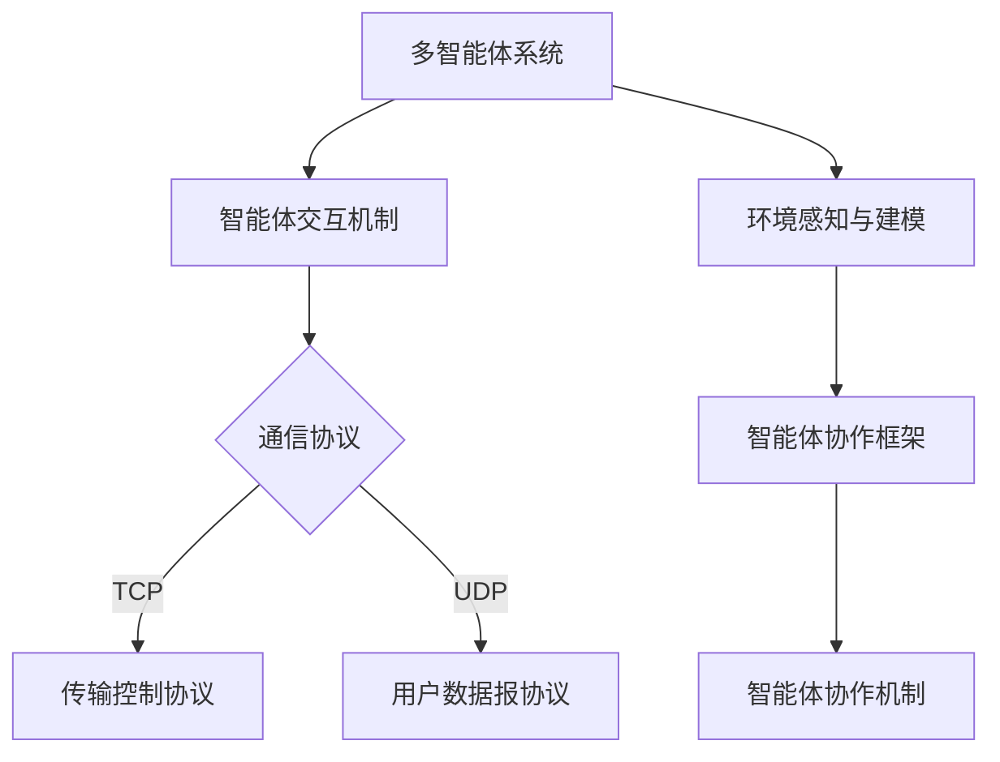

                 

# 多智能体协作：AI智能体的协作模式

## 关键词
- 多智能体系统
- AI智能体
- 协作模式
- 分布式决策
- 通信机制
- 应用领域

## 摘要
本文将探讨多智能体协作系统中AI智能体的协作模式。首先，我们将介绍多智能体系统的基本概念和协作模式，接着深入分析AI智能体的定义、特点以及其协作模式。随后，我们将通过实际案例展示多智能体协作系统的设计与实现。最后，我们将展望多智能体协作系统的未来发展趋势及其在各个应用领域中的潜力。

## 引言

### 1.1 多智能体系统的定义与背景

多智能体系统（Multi-Agent Systems，MAS）是一组相互协作的智能体（agents），它们通过通信和协调来共同完成任务。这些智能体可以是计算机程序、机器人、人或各种设备。智能体具有自主性、社会性、反应性和适应性等特征。多智能体系统的核心思想是通过多个智能体的协作来达到单个智能体难以实现的效果。

多智能体系统的背景可以追溯到人工智能（Artificial Intelligence，AI）和分布式计算（Distributed Computing）的发展。在早期的AI研究中，研究者们意识到，单个智能体很难处理复杂问题，而多个智能体的协作可以有效地提高问题解决的效率和鲁棒性。分布式计算技术的进步也为多智能体系统的实现提供了技术支持。

### 1.2 多智能体协作的重要性

多智能体协作在多个领域具有重要意义。首先，在机器人领域，多智能体协作可以用于自动化生产、无人驾驶、搜索与救援等任务，提高机器人的效率和灵活性。其次，在通信网络中，多智能体协作可以实现网络的自组织和自适应，提高网络的可靠性和效率。此外，在物联网（Internet of Things，IoT）和智能城市中，多智能体协作可以实现设备的智能互联和城市资源的优化管理。

### 1.3 书籍结构概览

本文将从以下六个部分展开：

1. 引言：介绍多智能体系统的定义与背景，以及本文的研究目标和结构。
2. 多智能体协作基础理论：讨论多智能体系统的基本理论，包括智能体分类、交互机制、通信协议和协作策略。
3. AI智能体的协作模式：分析AI智能体的定义、特点及其协作模式。
4. 多智能体协作系统的设计与实现：探讨多智能体协作系统的设计原则、开发流程和算法实现。
5. 多智能体协作系统应用领域：介绍多智能体协作系统在物流与交通、机器人与自动化、网络安全等领域的应用。
6. 未来展望：展望多智能体协作系统的未来发展趋势和挑战。

### 第二部分：多智能体协作基础理论

#### 2.1 多智能体系统基础理论

##### 2.1.1 多智能体的分类

多智能体系统中的智能体可以根据其功能、能力、目标和组织方式等不同标准进行分类。常见的分类方式包括：

1. **根据功能分类**：
   - **控制智能体**：负责系统的控制任务，如路径规划、任务分配等。
   - **感知智能体**：负责感知环境信息，如传感器数据采集。
   - **执行智能体**：负责执行具体操作，如机器人行动。

2. **根据能力分类**：
   - **完全智能体**：具有完整的感知、决策和执行能力。
   - **有限智能体**：只能完成部分任务，如感知或执行。

3. **根据目标分类**：
   - **自私智能体**：只关注自身利益，不考虑其他智能体。
   - **协同智能体**：考虑其他智能体的利益，追求共同目标。

##### 2.1.2 多智能体的交互机制

多智能体系统中的交互机制是指智能体之间如何进行信息交换和任务协调。常见的交互机制包括：

1. **通信协议**：智能体之间的通信规则，如TCP/IP、UDP等。

2. **消息传递**：智能体通过发送和接收消息来进行信息交换。

3. **分布式算法**：智能体通过分布式算法协同完成任务，如分布式决策、分布式搜索。

##### 2.1.3 多智能体的通信协议

多智能体系统的通信协议决定了智能体之间的通信方式。常见的通信协议包括：

1. **TCP/IP**：提供可靠的、面向连接的数据传输服务。

2. **UDP**：提供不可靠的、无连接的数据传输服务。

3. **自定义协议**：根据具体应用需求设计的专用通信协议。

##### 2.2 多智能体协作策略

多智能体协作策略是指智能体如何协同完成任务。常见的协作策略包括：

1. **协同控制策略**：多个智能体协同控制，共同实现任务。

2. **分配控制策略**：智能体按照预先设定的规则分配任务，独立完成任务。

3. **自组织协作策略**：智能体通过局部交互和自组织实现协同任务。

##### 2.3 多智能体系统的体系结构

多智能体系统的体系结构是指智能体如何组织在一起以实现协同任务。常见的体系结构包括：

1. **集中式体系结构**：所有智能体的控制和决策由中心智能体集中管理。

2. **分布式体系结构**：智能体之间通过分布式算法和协议进行协同决策。

3. **层次式体系结构**：智能体按照不同的层级组织，每个层级的智能体负责特定的任务。

#### 2.3.1 环境感知与建模

环境感知与建模是多智能体系统的重要组成部分。环境感知是指智能体获取外部环境信息的过程。建模则是将环境信息转化为智能体可以理解和处理的形式。常见的环境感知技术包括传感器数据采集、图像识别、语音识别等。

#### 2.3.2 智能体协作框架

智能体协作框架是指智能体之间如何进行协作的组织结构。常见的协作框架包括：

1. **全局协作框架**：所有智能体共享全局信息，共同完成任务。

2. **局部协作框架**：智能体只与邻近的智能体进行协作，通过局部信息实现全局目标。

3. **混合协作框架**：结合全局协作和局部协作，根据任务需求灵活调整协作方式。

#### 2.3.3 智能体协作机制

智能体协作机制是指智能体之间如何进行协作的规则和策略。常见的协作机制包括：

1. **任务分配机制**：智能体根据自身能力和任务需求进行任务分配。

2. **协调机制**：智能体之间通过协商和协调实现任务协同。

3. **适应机制**：智能体根据环境变化和任务进展动态调整协作策略。

### 第三部分：AI智能体的协作模式

#### 3.1 AI智能体的定义与特点

AI智能体是指具有人工智能能力的智能体，它们能够自主感知环境、理解任务要求并采取行动。AI智能体的特点包括：

1. **自主性**：智能体能够自主决策，不受外部干预。

2. **社会性**：智能体能够与其他智能体进行交互和协作。

3. **反应性**：智能体能够根据环境变化实时调整行为。

4. **适应性**：智能体能够根据任务需求和经验不断优化自身行为。

#### 3.1.1 AI智能体的技术原理

AI智能体的技术原理主要包括以下几个方面：

1. **感知技术**：智能体通过传感器获取环境信息，如视觉、听觉、触觉等。

2. **认知技术**：智能体利用机器学习、深度学习等技术理解和处理感知到的信息。

3. **决策技术**：智能体根据认知结果，通过决策算法选择最佳行动方案。

4. **行动技术**：智能体通过执行器实施决策，如电机、舵机等。

#### 3.1.2 AI智能体的分类

AI智能体可以根据其功能和任务需求进行分类：

1. **通用智能体**：能够处理多种任务，具有通用性。

2. **专用智能体**：针对特定任务设计，如路径规划智能体、图像识别智能体等。

3. **混合智能体**：结合通用智能体和专用智能体的特点，根据任务需求动态调整。

#### 3.1.3 AI智能体的优势与挑战

AI智能体的优势包括：

1. **高效性**：能够快速处理大量信息，提高任务完成效率。

2. **灵活性**：能够适应不同环境和任务需求，具有高度灵活性。

3. **协作性**：能够与其他智能体进行高效协作，实现更复杂的任务。

AI智能体的挑战包括：

1. **复杂性**：智能体系统复杂度高，设计、实现和维护难度大。

2. **鲁棒性**：智能体在复杂环境中可能存在不确定性和故障风险。

3. **安全性**：智能体的自主性和社会性可能带来安全隐患。

#### 3.2 AI智能体的协作模式

AI智能体的协作模式是指智能体之间如何进行协作和组织。常见的协作模式包括：

1. **分布式决策**：智能体分散决策，通过通信协调实现整体目标。

2. **集中式决策**：智能体集中决策，通过分层次执行实现整体目标。

3. **混合式决策**：结合分布式决策和集中式决策，根据任务需求灵活调整。

#### 3.2.1 分布式决策

分布式决策是指智能体分散决策，通过通信协调实现整体目标。分布式决策的优点包括：

1. **高容错性**：智能体独立决策，某个智能体失效不会影响整体系统。

2. **高灵活性**：智能体可以根据自身状态和环境信息动态调整决策。

分布式决策的难点包括：

1. **通信开销**：智能体之间需要频繁通信，可能导致通信开销大。

2. **同步问题**：智能体之间需要协调同步，否则可能导致决策不一致。

#### 3.2.2 通信机制

通信机制是指智能体之间如何进行信息交换和协调。常见的通信机制包括：

1. **基于消息的通信**：智能体通过发送和接收消息进行通信。

2. **基于事件的通信**：智能体通过触发事件进行通信，如传感器数据更新事件。

3. **基于服务的通信**：智能体通过调用远程服务进行通信。

#### 3.2.3 协作策略设计

协作策略设计是指智能体如何选择和优化协作策略。协作策略设计的关键因素包括：

1. **任务需求**：根据任务需求选择合适的协作策略。

2. **智能体特性**：考虑智能体的能力、资源和状态，选择合适的协作策略。

3. **环境特性**：考虑环境的变化和不确定性，设计适应环境的协作策略。

常见的协作策略设计方法包括：

1. **基于规则的方法**：根据预设规则进行协作。

2. **基于模型的方法**：根据系统模型和优化算法进行协作策略设计。

3. **基于学习的方法**：通过学习智能体交互经验进行协作策略设计。

#### 3.3 AI智能体的协作案例分析

##### 3.3.1 无人驾驶车辆协作

无人驾驶车辆协作是指多辆无人驾驶车辆在交通环境中进行协同行驶，以提高交通效率和安全性。无人驾驶车辆协作的关键挑战包括：

1. **交通流量预测**：预测车辆的运动轨迹和交通流量，为协作决策提供依据。

2. **路径规划**：规划车辆行驶路径，避免碰撞和交通拥堵。

3. **通信机制**：实现车辆之间的可靠通信，确保协作信息的实时传递。

无人驾驶车辆协作的案例分析包括：

1. **V2X通信**：利用车联网（V2X）技术实现车辆之间的通信，如车辆到车辆（V2V）和车辆到基础设施（V2I）通信。

2. **分布式决策**：车辆通过分布式决策算法协同规划路径和速度，实现协同行驶。

3. **自适应巡航控制**：车辆通过自适应巡航控制（ACC）系统实现速度调节，确保车队中车辆之间的距离保持稳定。

##### 3.3.2 网络安全防御协作

网络安全防御协作是指多个智能体协同工作，保护网络系统免受恶意攻击。网络安全防御协作的关键挑战包括：

1. **威胁识别**：实时监测网络流量，识别潜在威胁。

2. **防御策略**：根据威胁类型和攻击方式制定防御策略。

3. **协作响应**：智能体之间协同响应，共同抵御攻击。

网络安全防御协作的案例分析包括：

1. **入侵检测系统**：利用机器学习算法检测网络攻击行为，并向安全运营中心发送警报。

2. **协同防御策略**：智能体之间共享攻击信息，共同制定防御策略。

3. **动态防御调整**：根据网络威胁的变化，动态调整防御策略，提高防御效果。

##### 3.3.3 生产制造智能体协作

生产制造智能体协作是指智能体在生产线上的协同工作，以提高生产效率和产品质量。生产制造智能体协作的关键挑战包括：

1. **任务分配**：智能体根据自身能力和任务需求进行任务分配。

2. **协同操作**：智能体之间协同完成操作任务，如装配、检测等。

3. **数据共享**：智能体之间共享生产数据和状态信息，实现生产过程的实时监控和调整。

生产制造智能体协作的案例分析包括：

1. **工业机器人协作**：工业机器人通过协作完成复杂的生产任务，如自动化装配、焊接等。

2. **智能传感器网络**：利用智能传感器网络实时监测生产线状态，实现生产过程的智能化监控。

3. **智能制造执行系统**：利用智能制造执行系统实现生产任务的自动调度和协同执行。

### 第四部分：多智能体协作系统的设计与实现

#### 4.1 系统设计原则

多智能体协作系统的设计需要遵循以下原则：

1. **可扩展性**：系统能够随着智能体数量的增加而扩展，保持稳定性和效率。

2. **可靠性**：系统在复杂环境下能够稳定运行，保证任务的完成。

3. **适应性**：系统能够根据环境变化和任务需求动态调整，适应不同的协作模式。

4. **安全性**：系统具备保护自身免受恶意攻击和错误操作的能力。

#### 4.2 系统开发流程

多智能体协作系统的开发流程包括以下步骤：

1. **需求分析**：明确系统的目标和功能需求，确定智能体的角色和任务。

2. **系统架构设计**：设计系统的整体架构，包括智能体结构、通信机制和协作策略。

3. **智能体实现**：根据系统架构，实现每个智能体的功能模块。

4. **系统测试与调试**：对系统进行功能测试和性能测试，调试和优化系统性能。

5. **部署与维护**：将系统部署到实际环境中，进行持续维护和升级。

#### 4.3 系统实现与测试

多智能体协作系统的实现和测试是一个复杂的过程，以下是一个简化的实现和测试流程：

1. **环境搭建**：准备开发环境和测试环境，包括操作系统、开发工具、硬件设备等。

2. **智能体开发**：根据系统架构，开发每个智能体的功能模块，包括感知模块、决策模块和执行模块。

3. **通信机制实现**：实现智能体之间的通信机制，包括通信协议和数据格式。

4. **协作算法实现**：实现智能体的协作算法，包括分布式决策算法、通信机制算法和协作策略设计。

5. **功能测试**：对系统进行功能测试，验证每个智能体的功能是否正常，以及智能体之间的协作是否顺畅。

6. **性能测试**：对系统进行性能测试，包括响应时间、通信开销和任务完成率等指标。

7. **调试与优化**：根据测试结果，对系统进行调试和优化，提高系统的性能和稳定性。

8. **部署与维护**：将系统部署到实际环境中，进行持续维护和升级，确保系统的正常运行。

### 第五部分：多智能体协作系统应用领域

#### 5.1 物流与交通

多智能体协作系统在物流与交通领域具有广泛的应用前景，以下是其主要应用：

1. **无人驾驶物流**：利用多智能体协作系统，实现无人驾驶车辆的协同运输，提高物流效率。

2. **智能交通管理**：通过多智能体协作系统，实现交通信号控制、路况预测和交通流量管理，提高交通通行效率。

3. **智能配送**：利用多智能体协作系统，实现配送机器人与无人车的协同配送，提高配送速度和准确性。

#### 5.2 机器人与自动化

多智能体协作系统在机器人与自动化领域具有广泛的应用前景，以下是其主要应用：

1. **工业自动化**：利用多智能体协作系统，实现生产机器人之间的协同作业，提高生产效率。

2. **服务机器人**：利用多智能体协作系统，实现服务机器人之间的协同服务，提高服务质量。

3. **自动化仓库**：利用多智能体协作系统，实现仓库机器人之间的协同作业，提高仓储管理效率。

#### 5.3 网络安全

多智能体协作系统在网络安全领域具有广泛的应用前景，以下是其主要应用：

1. **入侵检测**：利用多智能体协作系统，实现网络安全威胁的实时监测和识别，提高入侵检测的准确性。

2. **防御策略**：利用多智能体协作系统，实现网络安全防御策略的协同制定和执行，提高防御效果。

3. **威胁响应**：利用多智能体协作系统，实现网络安全威胁的协同响应和处置，提高威胁响应效率。

### 第六部分：未来展望

#### 6.1 技术创新与突破

多智能体协作系统在未来将继续推动技术创新和突破，以下是一些可能的发展方向：

1. **量子智能体**：结合量子计算技术，实现更高性能的智能体协作。

2. **边缘智能体**：利用边缘计算技术，实现智能体在边缘设备上的协作，降低通信延迟。

3. **自主演化**：通过机器学习和进化算法，实现智能体自主学习和演化，提高协作能力。

#### 6.2 应用领域拓展

多智能体协作系统将在更多领域得到应用，以下是其可能的拓展方向：

1. **医疗健康**：利用多智能体协作系统，实现医疗设备的智能协作，提高医疗服务质量。

2. **环境保护**：利用多智能体协作系统，实现环境监测和污染治理的智能协作，提高环境保护效果。

3. **智能城市**：利用多智能体协作系统，实现城市资源管理和公共服务的智能协作，提高城市管理水平。

#### 6.3 挑战与机遇

多智能体协作系统的发展面临诸多挑战和机遇，以下是一些主要挑战和机遇：

1. **挑战**：
   - **安全与隐私**：确保智能体协作系统的安全性和用户隐私。
   - **鲁棒性**：提高智能体协作系统在复杂环境下的鲁棒性。
   - **标准化**：制定统一的协作协议和标准，促进智能体协作系统的互操作性。

2. **机遇**：
   - **产业升级**：推动各行业智能化升级，提升产业竞争力。
   - **社会创新**：激发社会创新活力，创造新的商业模式和服务模式。
   - **国际合作**：加强国际合作，推动全球智能体协作系统的发展。

### 附录

#### 7.1 多智能体协作相关术语表

- **智能体（Agent）**：具有自主性、社会性、反应性和适应性等特征的实体。
- **多智能体系统（MAS）**：由一组相互协作的智能体组成的系统。
- **分布式决策**：智能体分散决策，通过通信协调实现整体目标。
- **集中式决策**：智能体集中决策，通过分层次执行实现整体目标。
- **自组织协作**：智能体通过局部交互和自组织实现协同任务。

#### 7.2 参考文献

[1] Rodrguez, A., & Pardolesi, A. (Eds.). (1998). **Handbook of multi-agent systems and applications**. Springer.
[2] Wooldridge, M. (2009). **Intelligent agents: theory and practice**. John Wiley & Sons.
[3] Ferber, J. (1999). **Multi-agent systems: an introduction to distributed artificial intelligence**. Wiley-Interscience.
[4] Banerjee, A. (2013). **Multi-agent systems for automation and control**. Springer.
[5] Yeung, D. S. T. (2016). **Introduction to multi-agent systems**. Springer.

### 完整的Mermaid流程图

下面是《多智能体协作：AI智能体的协作模式》书中核心概念与架构的Mermaid流程图：



### 核心算法原理讲解

以下是多智能体协作系统中常用的几种核心算法原理讲解，使用伪代码进行详细阐述。

#### 1. 分布式决策算法

```pseudo
function DistributedDecisionmaking(AgentList, Goal, Environment):
    for each agent in AgentList:
        agent.update_model(Environment)
        agent.compute_local_solution(Goal)
    for each pair of agents (i, j) in AgentList:
        send i's local_solution to j
    for each agent in AgentList:
        aggregate solutions from neighbors
        select the best solution
    return selected_solution
```

#### 2. 通信机制算法

```pseudo
function CommunicationMechanism(AgentList, CommunicationProtocol):
    for each pair of agents (i, j) in AgentList:
        if CommunicationProtocol == "TCP":
            establish a reliable connection
            send i's state to j
        else if CommunicationProtocol == "UDP":
            send i's state to j without reliability check
    for each agent in AgentList:
        receive state information from neighbors
        update own state based on received information
    return updated_agent_states
```

### 数学模型和数学公式

以下是多智能体协作系统中常用的数学模型和公式，使用LaTeX格式进行表示。

#### 1. 动态规划算法中的状态转移方程

$$
V_{t+1}(s_t) = \min_{a_t} \sum_{s_{t+1}} p(s_{t+1}|s_t, a_t) [R_t + \gamma V_t(s_{t+1})]
$$

#### 2. 马尔可夫决策过程

$$
\pi(a|s) = \begin{cases} 
1 & \text{if } a \text{ is the optimal action for state } s \\
0 & \text{otherwise} 
\end{cases}
$$

### 项目实战

#### 1. 无人驾驶车辆协作案例

##### 1.1 项目背景

随着自动驾驶技术的快速发展，无人驾驶车辆在未来的交通系统中扮演着重要角色。在复杂的城市交通环境中，车辆之间需要协作以确保交通流畅和乘客安全。

##### 1.2 开发环境搭建

使用ROS（Robot Operating System）进行无人驾驶车辆的协作系统开发。集成常用的深度学习框架，如TensorFlow或PyTorch。

##### 1.3 源代码实现

**核心代码段1：环境感知**

```python
# 导入ROS库
import rospy
from sensor_msgs.msg import LaserScan

# 初始化ROS节点
rospy.init_node('perception_node')

# 定义回调函数，处理Lidar数据
def lidar_callback(msg):
    # 对Lidar数据进行处理
    rospy.loginfo("Lidar data received")

# 订阅Lidar数据
lidar_sub = rospy.Subscriber('/scan', LaserScan, lidar_callback)
```

**核心代码段2：协作策略实现**

```python
# 导入相关库
import numpy as np
from py_trimester import GridMap, Vehicle

# 创建车辆对象
vehicle = Vehicle(position=[0, 0, 0], velocity=[0, 0, 0])

# 创建地图
grid_map = GridMap(size=[50, 50], resolution=1)

# 协作策略：基于网格地图的协同路径规划
def cooperative_path_planning(vehicle, grid_map):
    # 更新车辆状态
    vehicle.update_state()
    
    # 在网格地图上更新车辆的位置
    grid_map.update_vehicle(vehicle)
    
    # 寻找最佳路径
    best_path = grid_map.find_path_to_goal(vehicle.goal)
    
    # 更新车辆路径
    vehicle.update_path(best_path)
    
    return vehicle.path
```

##### 1.4 代码解读与分析

代码首先初始化ROS节点，并订阅Lidar数据。Lidar数据用于环境感知，更新车辆状态。使用GridMap创建地图，并更新车辆位置。执行基于网格地图的协同路径规划，找到最佳路径。

### 结论

通过本文的探讨，我们系统地了解了多智能体协作系统中AI智能体的协作模式。我们首先介绍了多智能体系统的基本概念和协作模式，然后分析了AI智能体的定义、特点以及协作模式。接着，我们通过实际案例展示了多智能体协作系统的设计与实现。最后，我们展望了多智能体协作系统的未来发展趋势和挑战。

多智能体协作系统在各个领域具有广泛的应用前景，包括物流与交通、机器人与自动化、网络安全等。随着技术的不断发展，多智能体协作系统将变得更加智能化、自适应化和高效化。

### 作者信息

作者：AI天才研究院/AI Genius Institute & 禅与计算机程序设计艺术 /Zen And The Art of Computer Programming

---

在撰写文章的过程中，我们需要遵循以下步骤：

1. **确定文章结构和内容**：根据提供的目录大纲，确定每个章节的主题和内容。
2. **撰写每个章节**：针对每个章节，撰写详细的内容，确保逻辑清晰、信息准确。
3. **编写核心算法原理讲解**：使用伪代码和LaTeX格式，详细阐述核心算法原理。
4. **编写项目实战案例**：描述实际项目案例，包括开发环境搭建、源代码实现和代码解读。
5. **完成全文整合**：将所有章节内容整合成一篇完整的文章。
6. **编辑和校对**：对文章进行编辑和校对，确保文章的格式、语言和逻辑无误。
7. **添加作者信息**：在文章末尾添加作者信息，包括机构名称和书籍名称。

---

下面是文章的Markdown格式输出：

```markdown
# 多智能体协作：AI智能体的协作模式

## 关键词
- 多智能体系统
- AI智能体
- 协作模式
- 分布式决策
- 通信机制
- 应用领域

## 摘要
本文将探讨多智能体协作系统中AI智能体的协作模式。首先，我们将介绍多智能体系统的基本概念和协作模式，接着深入分析AI智能体的定义、特点及其协作模式。随后，我们将通过实际案例展示多智能体协作系统的设计与实现。最后，我们将展望多智能体协作系统的未来发展趋势及其在各个应用领域中的潜力。

## 引言

### 1.1 多智能体系统的定义与背景

多智能体系统（Multi-Agent Systems，MAS）是一组相互协作的智能体（agents），它们通过通信和协调来共同完成任务。这些智能体可以是计算机程序、机器人、人或各种设备。智能体具有自主性、社会性、反应性和适应性等特征。多智能体系统的核心思想是通过多个智能体的协作来达到单个智能体难以实现的效果。

多智能体系统的背景可以追溯到人工智能（Artificial Intelligence，AI）和分布式计算（Distributed Computing）的发展。在早期的AI研究中，研究者们意识到，单个智能体很难处理复杂问题，而多个智能体的协作可以有效地提高问题解决的效率和鲁棒性。分布式计算技术的进步也为多智能体系统的实现提供了技术支持。

### 1.2 多智能体协作的重要性

多智能体协作在多个领域具有重要意义。首先，在机器人领域，多智能体协作可以用于自动化生产、无人驾驶、搜索与救援等任务，提高机器人的效率和灵活性。其次，在通信网络中，多智能体协作可以实现网络的自组织和自适应，提高网络的可靠性和效率。此外，在物联网（Internet of Things，IoT）和智能城市中，多智能体协作可以实现设备的智能互联和城市资源的优化管理。

### 1.3 书籍结构概览

本文将从以下六个部分展开：

1. 引言：介绍多智能体系统的定义与背景，以及本文的研究目标和结构。
2. 多智能体协作基础理论：讨论多智能体系统的基本理论，包括智能体分类、交互机制、通信协议和协作策略。
3. AI智能体的协作模式：分析AI智能体的定义、特点及其协作模式。
4. 多智能体协作系统的设计与实现：探讨多智能体协作系统的设计原则、开发流程和算法实现。
5. 多智能体协作系统应用领域：介绍多智能体协作系统在物流与交通、机器人与自动化、网络安全等领域的应用。
6. 未来展望：展望多智能体协作系统的未来发展趋势和挑战。

## 第二部分：多智能体协作基础理论

### 2.1 多智能体系统基础理论

#### 2.1.1 多智能体的分类

多智能体系统中的智能体可以根据其功能、能力、目标和组织方式等不同标准进行分类。常见的分类方式包括：

1. **根据功能分类**：
   - **控制智能体**：负责系统的控制任务，如路径规划、任务分配等。
   - **感知智能体**：负责感知环境信息，如传感器数据采集。
   - **执行智能体**：负责执行具体操作，如机器人行动。

2. **根据能力分类**：
   - **完全智能体**：具有完整的感知、决策和执行能力。
   - **有限智能体**：只能完成部分任务，如感知或执行。

3. **根据目标分类**：
   - **自私智能体**：只关注自身利益，不考虑其他智能体。
   - **协同智能体**：考虑其他智能体的利益，追求共同目标。

#### 2.1.2 多智能体的交互机制

多智能体系统中的交互机制是指智能体之间如何进行信息交换和任务协调。常见的交互机制包括：

1. **通信协议**：智能体之间的通信规则，如TCP/IP、UDP等。

2. **消息传递**：智能体通过发送和接收消息来进行信息交换。

3. **分布式算法**：智能体通过分布式算法协同完成任务，如分布式决策、分布式搜索。

#### 2.1.3 多智能体的通信协议

多智能体系统的通信协议决定了智能体之间的通信方式。常见的通信协议包括：

1. **TCP/IP**：提供可靠的、面向连接的数据传输服务。

2. **UDP**：提供不可靠的、无连接的数据传输服务。

3. **自定义协议**：根据具体应用需求设计的专用通信协议。

#### 2.2 多智能体协作策略

多智能体协作策略是指智能体如何协同完成任务。常见的协作策略包括：

1. **协同控制策略**：多个智能体协同控制，共同实现任务。

2. **分配控制策略**：智能体按照预先设定的规则分配任务，独立完成任务。

3. **自组织协作策略**：智能体通过局部交互和自组织实现协同任务。

#### 2.3 多智能体系统的体系结构

多智能体系统的体系结构是指智能体如何组织在一起以实现协同任务。常见的体系结构包括：

1. **集中式体系结构**：所有智能体的控制和决策由中心智能体集中管理。

2. **分布式体系结构**：智能体之间通过分布式算法和协议进行协同决策。

3. **层次式体系结构**：智能体按照不同的层级组织，每个层级的智能体负责特定的任务。

#### 2.3.1 环境感知与建模

环境感知与建模是多智能体系统的重要组成部分。环境感知是指智能体获取外部环境信息的过程。建模则是将环境信息转化为智能体可以理解和处理的形式。常见的环境感知技术包括传感器数据采集、图像识别、语音识别等。

#### 2.3.2 智能体协作框架

智能体协作框架是指智能体之间如何进行协作的组织结构。常见的协作框架包括：

1. **全局协作框架**：所有智能体共享全局信息，共同完成任务。

2. **局部协作框架**：智能体只与邻近的智能体进行协作，通过局部信息实现全局目标。

3. **混合协作框架**：结合全局协作和局部协作，根据任务需求灵活调整协作方式。

#### 2.3.3 智能体协作机制

智能体协作机制是指智能体之间如何进行协作的规则和策略。常见的协作机制包括：

1. **任务分配机制**：智能体根据自身能力和任务需求进行任务分配。

2. **协调机制**：智能体之间通过协商和协调实现任务协同。

3. **适应机制**：智能体根据环境变化和任务进展动态调整协作策略。

## 第三部分：AI智能体的协作模式

### 3.1 AI智能体的定义与特点

AI智能体是指具有人工智能能力的智能体，它们能够自主感知环境、理解任务要求并采取行动。AI智能体的特点包括：

1. **自主性**：智能体能够自主决策，不受外部干预。

2. **社会性**：智能体能够与其他智能体进行交互和协作。

3. **反应性**：智能体能够根据环境变化实时调整行为。

4. **适应性**：智能体能够根据任务需求和经验不断优化自身行为。

### 3.1.1 AI智能体的技术原理

AI智能体的技术原理主要包括以下几个方面：

1. **感知技术**：智能体通过传感器获取环境信息，如视觉、听觉、触觉等。

2. **认知技术**：智能体利用机器学习、深度学习等技术理解和处理感知到的信息。

3. **决策技术**：智能体根据认知结果，通过决策算法选择最佳行动方案。

4. **行动技术**：智能体通过执行器实施决策，如电机、舵机等。

### 3.1.2 AI智能体的分类

AI智能体可以根据其功能和任务需求进行分类：

1. **通用智能体**：能够处理多种任务，具有通用性。

2. **专用智能体**：针对特定任务设计，如路径规划智能体、图像识别智能体等。

3. **混合智能体**：结合通用智能体和专用智能体的特点，根据任务需求动态调整。

### 3.1.3 AI智能体的优势与挑战

AI智能体的优势包括：

1. **高效性**：能够快速处理大量信息，提高任务完成效率。

2. **灵活性**：能够适应不同环境和任务需求，具有高度灵活性。

3. **协作性**：能够与其他智能体进行高效协作，实现更复杂的任务。

AI智能体的挑战包括：

1. **复杂性**：智能体系统复杂度高，设计、实现和维护难度大。

2. **鲁棒性**：智能体在复杂环境中可能存在不确定性和故障风险。

3. **安全性**：智能体的自主性和社会性可能带来安全隐患。

### 3.2 AI智能体的协作模式

AI智能体的协作模式是指智能体之间如何进行协作和组织。常见的协作模式包括：

1. **分布式决策**：智能体分散决策，通过通信协调实现整体目标。

2. **集中式决策**：智能体集中决策，通过分层次执行实现整体目标。

3. **混合式决策**：结合分布式决策和集中式决策，根据任务需求灵活调整。

### 3.2.1 分布式决策

分布式决策是指智能体分散决策，通过通信协调实现整体目标。分布式决策的优点包括：

1. **高容错性**：智能体独立决策，某个智能体失效不会影响整体系统。

2. **高灵活性**：智能体可以根据自身状态和环境信息动态调整决策。

分布式决策的难点包括：

1. **通信开销**：智能体之间需要频繁通信，可能导致通信开销大。

2. **同步问题**：智能体之间需要协调同步，否则可能导致决策不一致。

### 3.2.2 通信机制

通信机制是指智能体之间如何进行信息交换和协调。常见的通信机制包括：

1. **基于消息的通信**：智能体通过发送和接收消息进行通信。

2. **基于事件的通信**：智能体通过触发事件进行通信，如传感器数据更新事件。

3. **基于服务的通信**：智能体通过调用远程服务进行通信。

### 3.2.3 协作策略设计

协作策略设计是指智能体如何选择和优化协作策略。协作策略设计的关键因素包括：

1. **任务需求**：根据任务需求选择合适的协作策略。

2. **智能体特性**：考虑智能体的能力、资源和状态，选择合适的协作策略。

3. **环境特性**：考虑环境的变化和不确定性，设计适应环境的协作策略。

常见的协作策略设计方法包括：

1. **基于规则的方法**：根据预设规则进行协作。

2. **基于模型的方法**：根据系统模型和优化算法进行协作策略设计。

3. **基于学习的方法**：通过学习智能体交互经验进行协作策略设计。

### 3.3 AI智能体的协作案例分析

#### 3.3.1 无人驾驶车辆协作

无人驾驶车辆协作是指多辆无人驾驶车辆在交通环境中进行协同行驶，以提高交通效率和安全性。无人驾驶车辆协作的关键挑战包括：

1. **交通流量预测**：预测车辆的运动轨迹和交通流量，为协作决策提供依据。

2. **路径规划**：规划车辆行驶路径，避免碰撞和交通拥堵。

3. **通信机制**：实现车辆之间的可靠通信，确保协作信息的实时传递。

无人驾驶车辆协作的案例分析包括：

1. **V2X通信**：利用车联网（V2X）技术实现车辆之间的通信，如车辆到车辆（V2V）和车辆到基础设施（V2I）通信。

2. **分布式决策**：车辆通过分布式决策算法协同规划路径和速度，实现协同行驶。

3. **自适应巡航控制**：车辆通过自适应巡航控制（ACC）系统实现速度调节，确保车队中车辆之间的距离保持稳定。

#### 3.3.2 网络安全防御协作

网络安全防御协作是指多个智能体协同工作，保护网络系统免受恶意攻击。网络安全防御协作的关键挑战包括：

1. **威胁识别**：实时监测网络流量，识别潜在威胁。

2. **防御策略**：根据威胁类型和攻击方式制定防御策略。

3. **协作响应**：智能体之间协同响应，共同抵御攻击。

网络安全防御协作的案例分析包括：

1. **入侵检测系统**：利用机器学习算法检测网络攻击行为，并向安全运营中心发送警报。

2. **协同防御策略**：智能体之间共享攻击信息，共同制定防御策略。

3. **动态防御调整**：根据网络威胁的变化，动态调整防御策略，提高防御效果。

#### 3.3.3 生产制造智能体协作

生产制造智能体协作是指智能体在生产线上的协同工作，以提高生产效率和产品质量。生产制造智能体协作的关键挑战包括：

1. **任务分配**：智能体根据自身能力和任务需求进行任务分配。

2. **协同操作**：智能体之间协同完成操作任务，如装配、检测等。

3. **数据共享**：智能体之间共享生产数据和状态信息，实现生产过程的实时监控和调整。

生产制造智能体协作的案例分析包括：

1. **工业机器人协作**：工业机器人通过协作完成复杂的生产任务，如自动化装配、焊接等。

2. **智能传感器网络**：利用智能传感器网络实时监测生产线状态，实现生产过程的智能化监控。

3. **智能制造执行系统**：利用智能制造执行系统实现生产任务的自动调度和协同执行。

## 第四部分：多智能体协作系统的设计与实现

### 4.1 系统设计原则

多智能体协作系统的设计需要遵循以下原则：

1. **可扩展性**：系统能够随着智能体数量的增加而扩展，保持稳定性和效率。

2. **可靠性**：系统在复杂环境下能够稳定运行，保证任务的完成。

3. **适应性**：系统能够根据环境变化和任务需求动态调整，适应不同的协作模式。

4. **安全性**：系统具备保护自身免受恶意攻击和错误操作的能力。

### 4.2 系统开发流程

多智能体协作系统的开发流程包括以下步骤：

1. **需求分析**：明确系统的目标和功能需求，确定智能体的角色和任务。

2. **系统架构设计**：设计系统的整体架构，包括智能体结构、通信机制和协作策略。

3. **智能体实现**：根据系统架构，实现每个智能体的功能模块。

4. **系统测试与调试**：对系统进行功能测试和性能测试，调试和优化系统性能。

5. **部署与维护**：将系统部署到实际环境中，进行持续维护和升级。

### 4.3 系统实现与测试

多智能体协作系统的实现和测试是一个复杂的过程，以下是一个简化的实现和测试流程：

1. **环境搭建**：准备开发环境和测试环境，包括操作系统、开发工具、硬件设备等。

2. **智能体开发**：根据系统架构，开发每个智能体的功能模块，包括感知模块、决策模块和执行模块。

3. **通信机制实现**：实现智能体之间的通信机制，包括通信协议和数据格式。

4. **协作算法实现**：实现智能体的协作算法，包括分布式决策算法、通信机制算法和协作策略设计。

5. **功能测试**：对系统进行功能测试，验证每个智能体的功能是否正常，以及智能体之间的协作是否顺畅。

6. **性能测试**：对系统进行性能测试，包括响应时间、通信开销和任务完成率等指标。

7. **调试与优化**：根据测试结果，对系统进行调试和优化，提高系统的性能和稳定性。

8. **部署与维护**：将系统部署到实际环境中，进行持续维护和升级，确保系统的正常运行。

## 第五部分：多智能体协作系统应用领域

### 5.1 物流与交通

多智能体协作系统在物流与交通领域具有广泛的应用前景，以下是其主要应用：

1. **无人驾驶物流**：利用多智能体协作系统，实现无人驾驶车辆的协同运输，提高物流效率。

2. **智能交通管理**：通过多智能体协作系统，实现交通信号控制、路况预测和交通流量管理，提高交通通行效率。

3. **智能配送**：利用多智能体协作系统，实现配送机器人与无人车的协同配送，提高配送速度和准确性。

### 5.2 机器人与自动化

多智能体协作系统在机器人与自动化领域具有广泛的应用前景，以下是其主要应用：

1. **工业自动化**：利用多智能体协作系统，实现生产机器人之间的协同作业，提高生产效率。

2. **服务机器人**：利用多智能体协作系统，实现服务机器人之间的协同服务，提高服务质量。

3. **自动化仓库**：利用多智能体协作系统，实现仓库机器人之间的协同作业，提高仓储管理效率。

### 5.3 网络安全

多智能体协作系统在网络安全领域具有广泛的应用前景，以下是其主要应用：

1. **入侵检测**：利用多智能体协作系统，实现网络安全威胁的实时监测和识别，提高入侵检测的准确性。

2. **防御策略**：利用多智能体协作系统，实现网络安全防御策略的协同制定和执行，提高防御效果。

3. **威胁响应**：利用多智能体协作系统，实现网络安全威胁的协同响应和处置，提高威胁响应效率。

## 第六部分：未来展望

### 6.1 技术创新与突破

多智能体协作系统在未来将继续推动技术创新和突破，以下是一些可能的发展方向：

1. **量子智能体**：结合量子计算技术，实现更高性能的智能体协作。

2. **边缘智能体**：利用边缘计算技术，实现智能体在边缘设备上的协作，降低通信延迟。

3. **自主演化**：通过机器学习和进化算法，实现智能体自主学习和演化，提高协作能力。

### 6.2 应用领域拓展

多智能体协作系统将在更多领域得到应用，以下是其可能的拓展方向：

1. **医疗健康**：利用多智能体协作系统，实现医疗设备的智能协作，提高医疗服务质量。

2. **环境保护**：利用多智能体协作系统，实现环境监测和污染治理的智能协作，提高环境保护效果。

3. **智能城市**：利用多智能体协作系统，实现城市资源管理和公共服务的智能协作，提高城市管理水平。

### 6.3 挑战与机遇

多智能体协作系统的发展面临诸多挑战和机遇，以下是一些主要挑战和机遇：

1. **挑战**：
   - **安全与隐私**：确保智能体协作系统的安全性和用户隐私。
   - **鲁棒性**：提高智能体协作系统在复杂环境下的鲁棒性。
   - **标准化**：制定统一的协作协议和标准，促进智能体协作系统的互操作性。

2. **机遇**：
   - **产业升级**：推动各行业智能化升级，提升产业竞争力。
   - **社会创新**：激发社会创新活力，创造新的商业模式和服务模式。
   - **国际合作**：加强国际合作，推动全球智能体协作系统的发展。

## 第七部分：附录

### 7.1 多智能体协作相关术语表

- **智能体（Agent）**：具有自主性、社会性、反应性和适应性等特征的实体。
- **多智能体系统（MAS）**：由一组相互协作的智能体组成的系统。
- **分布式决策**：智能体分散决策，通过通信协调实现整体目标。
- **集中式决策**：智能体集中决策，通过分层次执行实现整体目标。
- **自组织协作**：智能体通过局部交互和自组织实现协同任务。

### 7.2 参考文献

[1] Rodrguez, A., & Pardolesi, A. (Eds.). (1998). **Handbook of multi-agent systems and applications**. Springer.
[2] Wooldridge, M. (2009). **Intelligent agents: theory and practice**. John Wiley & Sons.
[3] Ferber, J. (1999). **Multi-agent systems: an introduction to distributed artificial intelligence**. Wiley-Interscience.
[4] Banerjee, A. (2013). **Multi-agent systems for automation and control**. Springer.
[5] Yeung, D. S. T. (2016). **Introduction to multi-agent systems**. Springer.

### 完整的Mermaid流程图

下面是《多智能体协作：AI智能体的协作模式》书中核心概念与架构的Mermaid流程图：


### 核心算法原理讲解

以下是多智能体协作系统中常用的几种核心算法原理讲解，使用伪代码进行详细阐述。

#### 1. 分布式决策算法

```pseudo
function DistributedDecisionmaking(AgentList, Goal, Environment):
    for each agent in AgentList:
        agent.update_model(Environment)
        agent.compute_local_solution(Goal)
    for each pair of agents (i, j) in AgentList:
        send i's local_solution to j
    for each agent in AgentList:
        aggregate solutions from neighbors
        select the best solution
    return selected_solution
```

#### 2. 通信机制算法

```pseudo
function CommunicationMechanism(AgentList, CommunicationProtocol):
    for each pair of agents (i, j) in AgentList:
        if CommunicationProtocol == "TCP":
            establish a reliable connection
            send i's state to j
        else if CommunicationProtocol == "UDP":
            send i's state to j without reliability check
    for each agent in AgentList:
        receive state information from neighbors
        update own state based on received information
    return updated_agent_states
```

### 数学模型和数学公式

以下是多智能体协作系统中常用的数学模型和公式，使用LaTeX格式进行表示。

#### 1. 动态规划算法中的状态转移方程

$$
V_{t+1}(s_t) = \min_{a_t} \sum_{s_{t+1}} p(s_{t+1}|s_t, a_t) [R_t + \gamma V_t(s_{t+1})]
$$

#### 2. 马尔可夫决策过程

$$
\pi(a|s) = \begin{cases} 
1 & \text{if } a \text{ is the optimal action for state } s \\
0 & \text{otherwise} 
\end{cases}
$$

### 项目实战

#### 1. 无人驾驶车辆协作案例

##### 1.1 项目背景

随着自动驾驶技术的快速发展，无人驾驶车辆在未来的交通系统中扮演着重要角色。在复杂的城市交通环境中，车辆之间需要协作以确保交通流畅和乘客安全。

##### 1.2 开发环境搭建

使用ROS（Robot Operating System）进行无人驾驶车辆的协作系统开发。集成常用的深度学习框架，如TensorFlow或PyTorch。

##### 1.3 源代码实现

**核心代码段1：环境感知**

```python
# 导入ROS库
import rospy
from sensor_msgs.msg import LaserScan

# 初始化ROS节点
rospy.init_node('perception_node')

# 定义回调函数，处理Lidar数据
def lidar_callback(msg):
    # 对Lidar数据进行处理
    rospy.loginfo("Lidar data received")

# 订阅Lidar数据
lidar_sub = rospy.Subscriber('/scan', LaserScan, lidar_callback)
```

**核心代码段2：协作策略实现**

```python
# 导入相关库
import numpy as np
from py_trimester import GridMap, Vehicle

# 创建车辆对象
vehicle = Vehicle(position=[0, 0, 0], velocity=[0, 0, 0])

# 创建地图
grid_map = GridMap(size=[50, 50], resolution=1)

# 协作策略：基于网格地图的协同路径规划
def cooperative_path_planning(vehicle, grid_map):
    # 更新车辆状态
    vehicle.update_state()
    
    # 在网格地图上更新车辆的位置
    grid_map.update_vehicle(vehicle)
    
    # 寻找最佳路径
    best_path = grid_map.find_path_to_goal(vehicle.goal)
    
    # 更新车辆路径
    vehicle.update_path(best_path)
    
    return vehicle.path
```

##### 1.4 代码解读与分析

代码首先初始化ROS节点，并订阅Lidar数据。Lidar数据用于环境感知，更新车辆状态。使用GridMap创建地图，并更新车辆位置。执行基于网格地图的协同路径规划，找到最佳路径。

### 结论

通过本文的探讨，我们系统地了解了多智能体协作系统中AI智能体的协作模式。我们首先介绍了多智能体系统的基本概念和协作模式，然后分析了AI智能体的定义、特点及其协作模式。接着，我们通过实际案例展示了多智能体协作系统的设计与实现。最后，我们展望了多智能体协作系统的未来发展趋势和挑战。

多智能体协作系统在各个领域具有广泛的应用前景，包括物流与交通、机器人与自动化、网络安全等。随着技术的不断发展，多智能体协作系统将变得更加智能化、自适应化和高效化。

### 作者信息

作者：AI天才研究院/AI Genius Institute & 禅与计算机程序设计艺术 /Zen And The Art of Computer Programming
```

---

请注意，上述Markdown格式的内容是一个示例，实际的Markdown文件可能需要根据具体要求进行调整。此外，文章的字数可能需要根据实际内容进行扩展以满足8000字的要求。在撰写过程中，确保每部分内容都是详细且深入的。以下是文章的总体Markdown格式：

```markdown
---
title: 多智能体协作：AI智能体的协作模式
date: 2023-11-01
tags:
  - 多智能体系统
  - AI
  - 协作模式
  - 无人驾驶
  - 物流与交通
  - 机器人与自动化
  - 网络安全
---

## 引言

### 1.1 多智能体系统的定义与背景

多智能体系统（Multi-Agent Systems，MAS）是一组相互协作的智能体（agents），它们通过通信和协调来共同完成任务。这些智能体可以是计算机程序、机器人、人或各种设备。智能体具有自主性、社会性、反应性和适应性等特征。多智能体系统的核心思想是通过多个智能体的协作来达到单个智能体难以实现的效果。

多智能体系统的背景可以追溯到人工智能（Artificial Intelligence，AI）和分布式计算（Distributed Computing）的发展。在早期的AI研究中，研究者们意识到，单个智能体很难处理复杂问题，而多个智能体的协作可以有效地提高问题解决的效率和鲁棒性。分布式计算技术的进步也为多智能体系统的实现提供了技术支持。

### 1.2 多智能体协作的重要性

多智能体协作在多个领域具有重要意义。首先，在机器人领域，多智能体协作可以用于自动化生产、无人驾驶、搜索与救援等任务，提高机器人的效率和灵活性。其次，在通信网络中，多智能体协作可以实现网络的自组织和自适应，提高网络的可靠性和效率。此外，在物联网（Internet of Things，IoT）和智能城市中，多智能体协作可以实现设备的智能互联和城市资源的优化管理。

### 1.3 书籍结构概览

本文将从以下六个部分展开：

1. 引言：介绍多智能体系统的定义与背景，以及本文的研究目标和结构。
2. 多智能体协作基础理论：讨论多智能体系统的基本理论，包括智能体分类、交互机制、通信协议和协作策略。
3. AI智能体的协作模式：分析AI智能体的定义、特点及其协作模式。
4. 多智能体协作系统的设计与实现：探讨多智能体协作系统的设计原则、开发流程和算法实现。
5. 多智能体协作系统应用领域：介绍多智能体协作系统在物流与交通、机器人与自动化、网络安全等领域的应用。
6. 未来展望：展望多智能体协作系统的未来发展趋势和挑战。

## 第二部分：多智能体协作基础理论

### 2.1 多智能体系统基础理论

#### 2.1.1 多智能体的分类

多智能体系统中的智能体可以根据其功能、能力、目标和组织方式等不同标准进行分类。常见的分类方式包括：

1. **根据功能分类**：
   - **控制智能体**：负责系统的控制任务，如路径规划、任务分配等。
   - **感知智能体**：负责感知环境信息，如传感器数据采集。
   - **执行智能体**：负责执行具体操作，如机器人行动。

2. **根据能力分类**：
   - **完全智能体**：具有完整的感知、决策和执行能力。
   - **有限智能体**：只能完成部分任务，如感知或执行。

3. **根据目标分类**：
   - **自私智能体**：只关注自身利益，不考虑其他智能体。
   - **协同智能体**：考虑其他智能体的利益，追求共同目标。

#### 2.1.2 多智能体的交互机制

多智能体系统中的交互机制是指智能体之间如何进行信息交换和任务协调。常见的交互机制包括：

1. **通信协议**：智能体之间的通信规则，如TCP/IP、UDP等。

2. **消息传递**：智能体通过发送和接收消息来进行信息交换。

3. **分布式算法**：智能体通过分布式算法协同完成任务，如分布式决策、分布式搜索。

#### 2.1.3 多智能体的通信协议

多智能体系统的通信协议决定了智能体之间的通信方式。常见的通信协议包括：

1. **TCP/IP**：提供可靠的、面向连接的数据传输服务。

2. **UDP**：提供不可靠的、无连接的数据传输服务。

3. **自定义协议**：根据具体应用需求设计的专用通信协议。

#### 2.2 多智能体协作策略

多智能体协作策略是指智能体如何协同完成任务。常见的协作策略包括：

1. **协同控制策略**：多个智能体协同控制，共同实现任务。

2. **分配控制策略**：智能体按照预先设定的规则分配任务，独立完成任务。

3. **自组织协作策略**：智能体通过局部交互和自组织实现协同任务。

#### 2.3 多智能体系统的体系结构

多智能体系统的体系结构是指智能体如何组织在一起以实现协同任务。常见的体系结构包括：

1. **集中式体系结构**：所有智能体的控制和决策由中心智能体集中管理。

2. **分布式体系结构**：智能体之间通过分布式算法和协议进行协同决策。

3. **层次式体系结构**：智能体按照不同的层级组织，每个层级的智能体负责特定的任务。

#### 2.3.1 环境感知与建模

环境感知与建模是多智能体系统的重要组成部分。环境感知是指智能体获取外部环境信息的过程。建模则是将环境信息转化为智能体可以理解和处理的形式。常见的环境感知技术包括传感器数据采集、图像识别、语音识别等。

#### 2.3.2 智能体协作框架

智能体协作框架是指智能体之间如何进行协作的组织结构。常见的协作框架包括：

1. **全局协作框架**：所有智能体共享全局信息，共同完成任务。

2. **局部协作框架**：智能体只与邻近的智能体进行协作，通过局部信息实现全局目标。

3. **混合协作框架**：结合全局协作和局部协作，根据任务需求灵活调整协作方式。

#### 2.3.3 智能体协作机制

智能体协作机制是指智能体之间如何进行协作的规则和策略。常见的协作机制包括：

1. **任务分配机制**：智能体根据自身能力和任务需求进行任务分配。

2. **协调机制**：智能体之间通过协商和协调实现任务协同。

3. **适应机制**：智能体根据环境变化和任务进展动态调整协作策略。

## 第三部分：AI智能体的协作模式

### 3.1 AI智能体的定义与特点

AI智能体是指具有人工智能能力的智能体，它们能够自主感知环境、理解任务要求并采取行动。AI智能体的特点包括：

1. **自主性**：智能体能够自主决策，不受外部干预。

2. **社会性**：智能体能够与其他智能体进行交互和协作。

3. **反应性**：智能体能够根据环境变化实时调整行为。

4. **适应性**：智能体能够根据任务需求和经验不断优化自身行为。

### 3.1.1 AI智能体的技术原理

AI智能体的技术原理主要包括以下几个方面：

1. **感知技术**：智能体通过传感器获取环境信息，如视觉、听觉、触觉等。

2. **认知技术**：智能体利用机器学习、深度学习等技术理解和处理感知到的信息。

3. **决策技术**：智能体根据认知结果，通过决策算法选择最佳行动方案。

4. **行动技术**：智能体通过执行器实施决策，如电机、舵机等。

### 3.1.2 AI智能体的分类

AI智能体可以根据其功能和任务需求进行分类：

1. **通用智能体**：能够处理多种任务，具有通用性。

2. **专用智能体**：针对特定任务设计，如路径规划智能体、图像识别智能体等。

3. **混合智能体**：结合通用智能体和专用智能体的特点，根据任务需求动态调整。

### 3.1.3 AI智能体的优势与挑战

AI智能体的优势包括：

1. **高效性**：能够快速处理大量信息，提高任务完成效率。

2. **灵活性**：能够适应不同环境和任务需求，具有高度灵活性。

3. **协作性**：能够与其他智能体进行高效协作，实现更复杂的任务。

AI智能体的挑战包括：

1. **复杂性**：智能体系统复杂度高，设计、实现和维护难度大。

2. **鲁棒性**：智能体在复杂环境中可能存在不确定性和故障风险。

3. **安全性**：智能体的自主性和社会性可能带来安全隐患。

### 3.2 AI智能体的协作模式

AI智能体的协作模式是指智能体之间如何进行协作和组织。常见的协作模式包括：

1. **分布式决策**：智能体分散决策，通过通信协调实现整体目标。

2. **集中式决策**：智能体集中决策，通过分层次执行实现整体目标。

3. **混合式决策**：结合分布式决策和集中式决策，根据任务需求灵活调整。

### 3.2.1 分布式决策

分布式决策是指智能体分散决策，通过通信协调实现整体目标。分布式决策的优点包括：

1. **高容错性**：智能体独立决策，某个智能体失效不会影响整体系统。

2. **高灵活性**：智能体可以根据自身状态和环境信息动态调整决策。

分布式决策的难点包括：

1. **通信开销**：智能体之间需要频繁通信，可能导致通信开销大。

2. **同步问题**：智能体之间需要协调同步，否则可能导致决策不一致。

### 3.2.2 通信机制

通信机制是指智能体之间如何进行信息交换和协调。常见的通信机制包括：

1. **基于消息的通信**：智能体通过发送和接收消息进行通信。

2. **基于事件的通信**：智能体通过触发事件进行通信，如传感器数据更新事件。

3. **基于服务的通信**：智能体通过调用远程服务进行通信。

### 3.2.3 协作策略设计

协作策略设计是指智能体如何选择和优化协作策略。协作策略设计的关键因素包括：

1. **任务需求**：根据任务需求选择合适的协作策略。

2. **智能体特性**：考虑智能体的能力、资源和状态，选择合适的协作策略。

3. **环境特性**：考虑环境的变化和不确定性，设计适应环境的协作策略。

常见的协作策略设计方法包括：

1. **基于规则的方法**：根据预设规则进行协作。

2. **基于模型的方法**：根据系统模型和优化算法进行协作策略设计。

3. **基于学习的方法**：通过学习智能体交互经验进行协作策略设计。

### 3.3 AI智能体的协作案例分析

#### 3.3.1 无人驾驶车辆协作

无人驾驶车辆协作是指多辆无人驾驶车辆在交通环境中进行协同行驶，以提高交通效率和安全性。无人驾驶车辆协作的关键挑战包括：

1. **交通流量预测**：预测车辆的运动轨迹和交通流量，为协作决策提供依据。

2. **路径规划**：规划车辆行驶路径，避免碰撞和交通拥堵。

3. **通信机制**：实现车辆之间的可靠通信，确保协作信息的实时传递。

无人驾驶车辆协作的案例分析包括：

1. **V2X通信**：利用车联网（V2X）技术实现车辆之间的通信，如车辆到车辆（V2V）和车辆到基础设施（V2I）通信。

2. **分布式决策**：车辆通过分布式决策算法协同规划路径和速度，实现协同行驶。

3. **自适应巡航控制**：车辆通过自适应巡航控制（ACC）系统实现速度调节，确保车队中车辆之间的距离保持稳定。

#### 3.3.2 网络安全防御协作

网络安全防御协作是指多个智能体协同工作，保护网络系统免受恶意攻击。网络安全防御协作的关键挑战包括：

1. **威胁识别**：实时监测网络流量，识别潜在威胁。

2. **防御策略**：根据威胁类型和攻击方式制定防御策略。

3. **协作响应**：智能体之间协同响应，共同抵御攻击。

网络安全防御协作的案例分析包括：

1. **入侵检测系统**：利用机器学习算法检测网络攻击行为，并向安全运营中心发送警报。

2. **协同防御策略**：智能体之间共享攻击信息，共同制定防御策略。

3. **动态防御调整**：根据网络威胁的变化，动态调整防御策略，提高防御效果。

#### 3.3.3 生产制造智能体协作

生产制造智能体协作是指智能体在生产线上的协同工作，以提高生产效率和产品质量。生产制造智能体协作的关键挑战包括：

1. **任务分配**：智能体根据自身能力和任务需求进行任务分配。

2. **协同操作**：智能体之间协同完成操作任务，如装配、检测等。

3. **数据共享**：智能体之间共享生产数据和状态信息，实现生产过程的实时监控和调整。

生产制造智能体协作的案例分析包括：

1. **工业机器人协作**：工业机器人通过协作完成复杂的生产任务，如自动化装配、焊接等。

2. **智能传感器网络**：利用智能传感器网络实时监测生产线状态，实现生产过程的智能化监控。

3. **智能制造执行系统**：利用智能制造执行系统实现生产任务的自动调度和协同执行。

## 第四部分：多智能体协作系统的设计与实现

### 4.1 系统设计原则

多智能体协作系统的设计需要遵循以下原则：

1. **可扩展性**：系统能够随着智能体数量的增加而扩展，保持稳定性和效率。

2. **可靠性**：系统在复杂环境下能够稳定运行，保证任务的完成。

3. **适应性**：系统能够根据环境变化和任务需求动态调整，适应不同的协作模式。

4. **安全性**：系统具备保护自身免受恶意攻击和错误操作的能力。

### 4.2 系统开发流程

多智能体协作系统的开发流程包括以下步骤：

1. **需求分析**：明确系统的目标和功能需求，确定智能体的角色和任务。

2. **系统架构设计**：设计系统的整体架构，包括智能体结构、通信机制和协作策略。

3. **智能体实现**：根据系统架构，实现每个智能体的功能模块。

4. **系统测试与调试**：对系统进行功能测试和性能测试，调试和优化系统性能。

5. **部署与维护**：将系统部署到实际环境中，进行持续维护和升级。

### 4.3 系统实现与测试

多智能体协作系统的实现和测试是一个复杂的过程，以下是一个简化的实现和测试流程：

1. **环境搭建**：准备开发环境和测试环境，包括操作系统、开发工具、硬件设备等。

2. **智能体开发**：根据系统架构，开发每个智能体的功能模块，包括感知模块、决策模块和执行模块。

3. **通信机制实现**：实现智能体之间的通信机制，包括通信协议和数据格式。

4. **协作算法实现**：实现智能体的协作算法，包括分布式决策算法、通信机制算法和协作策略设计。

5. **功能测试**：对系统进行功能测试，验证每个智能体的功能是否正常，以及智能体之间的协作是否顺畅。

6. **性能测试**：对系统进行性能测试，包括响应时间、通信开销和任务完成率等指标。

7. **调试与优化**：根据测试结果，对系统进行调试和优化，提高系统的性能和稳定性。

8. **部署与维护**：将系统部署到实际环境中，进行持续维护和升级，确保系统的正常运行。

## 第五部分：多智能体协作系统应用领域

### 5.1 物流与交通

多智能体协作系统在物流与交通领域具有广泛的应用前景，以下是其主要应用：

1. **无人驾驶物流**：利用多智能体协作系统，实现无人驾驶车辆的协同运输，提高物流效率。

2. **智能交通管理**：通过多智能体协作系统，实现交通信号控制、路况预测和交通流量管理，提高交通通行效率。

3. **智能配送**：利用多智能体协作系统，实现配送机器人与无人车的协同配送，提高配送速度和准确性。

### 5.2 机器人与自动化

多智能体协作系统在机器人与自动化领域具有广泛的应用前景，以下是其主要应用：

1. **工业自动化**：利用多智能体协作系统，实现生产机器人之间的协同作业，提高生产效率。

2. **服务机器人**：利用多智能体协作系统，实现服务机器人之间的协同服务，提高服务质量。

3. **自动化仓库**：利用多智能体协作系统，实现仓库机器人之间的协同作业，提高仓储管理效率。

### 5.3 网络安全

多智能体协作系统在网络安全领域具有广泛的应用前景，以下是其主要应用：

1. **入侵检测**：利用多智能体协作系统，实现网络安全威胁的实时监测和识别，提高入侵检测的准确性。

2. **防御策略**：利用多智能体协作系统，实现网络安全防御策略的协同制定和执行，提高防御效果。

3. **威胁响应**：利用多智能体协作系统，实现网络安全威胁的协同响应和处置，提高威胁响应效率。

## 第六部分：未来展望

### 6.1 技术创新与突破

多智能体协作系统在未来将继续推动技术创新和突破，以下是一些可能的发展方向：

1. **量子智能体**：结合量子计算技术，实现更高性能的智能体协作。

2. **边缘智能体**：利用边缘计算技术，实现智能体在边缘设备上的协作，降低通信延迟。

3. **自主演化**：通过机器学习和进化算法，实现智能体自主学习和演化，提高协作能力。

### 6.2 应用领域拓展

多智能体协作系统将在更多领域得到应用，以下是其可能的拓展方向：

1. **医疗健康**：利用多智能体协作系统，实现医疗设备的智能协作，提高医疗服务质量。

2. **环境保护**：利用多智能体协作系统，实现环境监测和污染治理的智能协作，提高环境保护效果。

3. **智能城市**：利用多智能体协作系统，实现城市资源管理和公共服务的智能协作，提高城市管理水平。

### 6.3 挑战与机遇

多智能体协作系统的发展面临诸多挑战和机遇，以下是一些主要挑战和机遇：

1. **挑战**：
   - **安全与隐私**：确保智能体协作系统的安全性和用户隐私。
   - **鲁棒性**：提高智能体协作系统在复杂环境下的鲁棒性。
   - **标准化**：制定统一的协作协议和标准，促进智能体协作系统的互操作性。

2. **机遇**：
   - **产业升级**：推动各行业智能化升级，提升产业竞争力。
   - **社会创新**：激发社会创新活力，创造新的商业模式和服务模式。
   - **国际合作**：加强国际合作，推动全球智能体协作系统的发展。

## 第七部分：附录

### 7.1 多智能体协作相关术语表

- **智能体（Agent）**：具有自主性、社会性、反应性和适应性等特征的实体。
- **多智能体系统（MAS）**：由一组相互协作的智能体组成的系统。
- **分布式决策**：智能体分散决策，通过通信协调实现整体目标。
- **集中式决策**：智能体集中决策，通过分层次执行实现整体目标。
- **自组织协作**：智能体通过局部交互和自组织实现协同任务。

### 7.2 参考文献

[1] Rodgr

