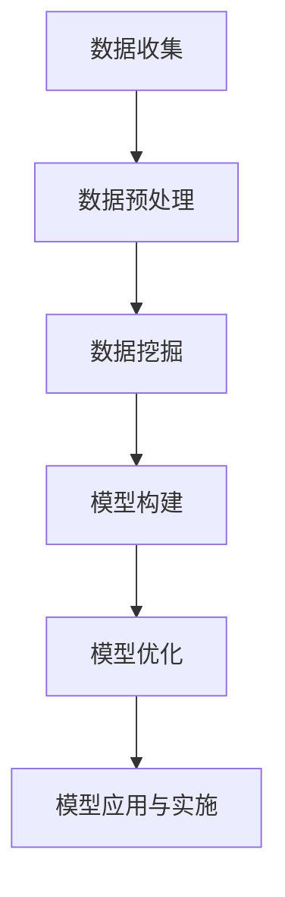

                 

### 《大数据驱动的精准营销模型研究》

大数据与精准营销是当今营销领域的热门话题。随着互联网和数字化技术的发展，海量数据的积累和存储变得愈加容易，如何有效地利用这些数据来提升营销效果成为企业关注的焦点。本文旨在系统地探讨大数据驱动的精准营销模型，通过逻辑清晰、结构紧凑、简单易懂的描述，帮助读者深入理解这一领域的技术原理和实践应用。

#### 关键词：
- 大数据
- 精准营销
- 客户行为分析
- 个性化推荐
- 营销响应预测
- 客户流失预测
- 模型优化

#### 摘要：
本文首先介绍了大数据和精准营销的基本概念及其在商业中的应用价值。随后，深入探讨了大数据处理技术和精准营销模型构建的基础，包括数据采集与存储、数据清洗与预处理、数据挖掘技术以及营销理论和模型框架。接着，本文详细阐述了大数据驱动的精准营销模型，如客户行为分析模型、个性化推荐算法、营销响应预测模型和客户流失预测模型。此外，文章还介绍了模型优化方法和实施策略，并通过实际案例展示了大数据驱动的精准营销如何在不同行业中发挥作用。最后，文章总结了大数据驱动的精准营销模型的研究成果，并对未来的发展方向进行了展望。

## 第一部分：大数据与精准营销概述

### 第1章：大数据时代与精准营销背景

#### 1.1 大数据的概念与特点

大数据（Big Data）是指无法用传统数据处理工具进行捕捉、管理和处理的数据集，其具有4V特点，即数据量大（Volume）、速度快（Velocity）、类型多（Variety）和价值高（Value）。随着互联网、物联网、社交媒体等技术的发展，大数据时代已经到来，企业开始意识到通过数据挖掘和分析来获取商业价值的重要性。

#### 1.2 精准营销的定义与价值

精准营销（Precision Marketing）是指通过数据分析、客户细分、个性化推荐等技术手段，实现营销活动的目标群体精准定位和营销效果最大化。精准营销的核心在于了解客户的个性化需求，提供定制化的产品和服务，从而提高客户满意度和忠诚度，进而实现营销目标。

#### 1.3 大数据在精准营销中的应用现状

大数据在精准营销中的应用主要体现在以下几个方面：

- 客户行为分析：通过分析客户的历史行为数据，了解客户的偏好和需求，为个性化推荐和精准营销提供依据。
- 个性化推荐：利用大数据技术，实现基于用户行为的个性化推荐，提高用户转化率和满意度。
- 营销响应预测：通过预测客户的响应行为，优化营销策略，提高营销效果。
- 客户流失预测：提前识别潜在流失客户，采取有效措施挽留客户，减少客户流失率。

### 第2章：大数据处理技术基础

#### 2.1 数据采集与存储技术

数据采集是大数据处理的第一步，主要包括以下技术：

- 数据源：包括内部数据和外部数据，如用户行为数据、社交媒体数据、市场调研数据等。
- 数据采集工具：如Web爬虫、日志采集工具、传感器等。

数据存储技术是大数据处理的基础，常用的存储技术包括：

- 数据库：关系型数据库（如MySQL、Oracle）和非关系型数据库（如MongoDB、Cassandra）。
- 数据仓库：用于存储和管理大量结构化数据，如Hadoop、Spark等。

#### 2.2 数据清洗与数据预处理

数据清洗与预处理是确保数据质量和有效性的重要环节，主要包括以下技术：

- 数据清洗：去除重复数据、缺失值填充、异常值处理等。
- 数据集成：将来自不同数据源的数据整合到一个统一的格式中。
- 数据转换：将数据转换为适合分析和挖掘的格式，如数值化、标准化等。

#### 2.3 数据挖掘技术概述

数据挖掘是从大量数据中提取有价值信息的过程，常用的技术包括：

- 聚类分析：将数据集划分为不同的类别，用于客户细分和市场划分。
- 回归分析：通过建立数学模型，预测目标变量与自变量之间的关系。
- 联合分析：分析多个变量之间的相互关系，用于挖掘潜在关联。
- 决策树：通过树形结构，表示变量之间的关系，用于分类和预测。

### 第3章：精准营销模型构建基础

#### 3.1 营销理论概述

营销理论是构建精准营销模型的基础，主要包括以下理论：

- 4P营销理论：产品（Product）、价格（Price）、渠道（Place）、促销（Promotion）。
- 4C营销理论：顾客（Customer）、成本（Cost）、便利（Convenience）、沟通（Communication）。
- 客户生命周期价值理论：基于客户生命周期，评估客户的潜在价值和营销投入。

#### 3.2 精准营销模型框架

精准营销模型框架主要包括以下几个关键组成部分：

- 客户细分：根据客户特征和行为，将客户划分为不同的群体。
- 客户价值分析：评估客户的潜在价值和盈利能力。
- 营销策略制定：根据客户细分和价值分析，制定个性化的营销策略。
- 营销效果评估：通过数据分析和模型评估，评估营销策略的效果。

#### 3.3 客户细分与客户价值分析

客户细分和客户价值分析是精准营销模型的核心，具体技术包括：

- 客户细分：基于客户特征和行为数据，使用聚类分析、回归分析等技术，将客户划分为不同的群体。
- 客户价值分析：基于客户生命周期价值和客户行为数据，使用回归分析、决策树等技术，评估客户的潜在价值和盈利能力。

## 第二部分：大数据驱动的精准营销模型

### 第4章：客户行为分析模型

#### 4.1 客户行为数据采集与分析

##### 4.1.1 客户行为数据采集方法

客户行为数据采集是构建客户行为分析模型的关键步骤，主要包括以下方法：

- 离线数据采集：通过用户日志、服务器日志等方式，收集用户的浏览、购买、点击等行为数据。
- 实时数据采集：通过Web跟踪、点击流数据等方式，实时收集用户的在线行为数据。

##### 4.1.2 客户行为数据分析技术

客户行为数据分析技术主要包括以下方面：

- 数据预处理：对采集到的客户行为数据，进行清洗、去重、归一化等预处理操作。
- 特征工程：提取客户行为数据中的关键特征，如浏览时长、点击次数、购买频次等。
- 数据挖掘：使用聚类分析、回归分析等数据挖掘技术，挖掘客户行为数据中的潜在规律。

### 4.2 客户行为分析模型构建

##### 4.2.1 客户行为分析模型框架

客户行为分析模型框架主要包括以下几个部分：

- 用户行为特征提取：提取用户行为数据中的关键特征，如浏览时长、点击次数、购买频次等。
- 用户行为模式识别：使用聚类分析、回归分析等技术，识别用户行为模式。
- 用户行为预测：基于用户行为模式，预测用户未来的行为。

##### 4.2.2 模型构建方法

客户行为分析模型的构建方法主要包括以下步骤：

- 数据预处理：对采集到的用户行为数据进行清洗、去重、归一化等预处理操作。
- 特征工程：提取用户行为数据中的关键特征，如浏览时长、点击次数、购买频次等。
- 模型选择：选择合适的机器学习算法，如决策树、随机森林、神经网络等。
- 模型训练：使用预处理后的用户行为数据进行模型训练。
- 模型评估：使用验证集评估模型的性能，如准确率、召回率、F1值等。

### 4.3 客户行为分析模型应用案例

##### 4.3.1 案例一：电商平台用户行为分析

- 数据来源：电商平台用户浏览、购买、点击等行为数据。
- 模型目标：预测用户购买意愿。
- 模型构建：
  - 特征工程：用户浏览时长、点击次数、购买频次等。
  - 模型训练：使用决策树算法。
  - 模型评估：准确率、召回率、F1值。

##### 4.3.2 案例二：银行客户行为分析

- 数据来源：银行客户交易、点击等行为数据。
- 模型目标：预测客户流失风险。
- 模型构建：
  - 特征工程：客户交易金额、交易频率、点击次数等。
  - 模型训练：使用逻辑回归算法。
  - 模型评估：准确率、精确率、召回率。

### 4.4 客户行为预测模型的数学模型

##### 4.4.1 线性回归模型

线性回归模型是一种常用的客户行为预测模型，其基本公式为：

\[ y = \beta_0 + \beta_1 \cdot x_1 + \beta_2 \cdot x_2 + ... + \beta_n \cdot x_n + \epsilon \]

其中，\( y \) 是预测的目标变量，\( x_1, x_2, ..., x_n \) 是自变量，\( \beta_0, \beta_1, ..., \beta_n \) 是回归系数，\( \epsilon \) 是误差项。

##### 4.4.2 逻辑回归模型

逻辑回归模型是一种常用的二分类预测模型，其公式为：

\[ P(y=1) = \frac{1}{1 + e^{-(\beta_0 + \beta_1 \cdot x_1 + \beta_2 \cdot x_2 + ... + \beta_n \cdot x_n)}} \]

其中，\( P(y=1) \) 是目标变量为1的概率，其他符号的含义与线性回归模型相同。

##### 4.4.3 神经网络模型

神经网络模型是一种基于多层感知器（MLP）的预测模型，其基本公式为：

\[ a_{i}^{l} = \sigma \left( \sum_{j=0}^{n_{l-1}} w_{ji} \cdot a_{j}^{l-1} + b_{i}^{l} \right) \]

其中，\( a_{i}^{l} \) 是第 \( l \) 层第 \( i \) 个神经元的激活值，\( \sigma \) 是激活函数，\( w_{ji} \) 是第 \( l-1 \) 层第 \( j \) 个神经元到第 \( l \) 层第 \( i \) 个神经元的权重，\( b_{i}^{l} \) 是第 \( l \) 层第 \( i \) 个神经元的偏置项。

### 4.5 伪代码：基于随机森林的用户购买意图预测模型

```python
# 导入所需库
import pandas as pd
from sklearn.model_selection import train_test_split
from sklearn.ensemble import RandomForestClassifier
from sklearn.metrics import accuracy_score, recall_score, precision_score

# 数据加载
data = pd.read_csv('user_behavior_data.csv')

# 数据预处理
X = data.drop('target', axis=1)
y = data['target']

# 划分训练集和测试集
X_train, X_test, y_train, y_test = train_test_split(X, y, test_size=0.2, random_state=42)

# 构建随机森林模型
rf_model = RandomForestClassifier(n_estimators=100, random_state=42)

# 模型训练
rf_model.fit(X_train, y_train)

# 模型预测
y_pred = rf_model.predict(X_test)

# 模型评估
accuracy = accuracy_score(y_test, y_pred)
recall = recall_score(y_test, y_pred)
precision = precision_score(y_test, y_pred)

print("Accuracy: ", accuracy)
print("Recall: ", recall)
print("Precision: ", precision)
```

### 4.6 数学公式与详细讲解

#### 4.6.1 用户行为预测的线性回归模型

线性回归模型是一种简单的预测模型，其公式如下：

\[ y = \beta_0 + \beta_1 \cdot x_1 + \beta_2 \cdot x_2 + ... + \beta_n \cdot x_n + \epsilon \]

其中，\( y \) 是预测的目标变量，\( x_1, x_2, ..., x_n \) 是自变量，\( \beta_0, \beta_1, ..., \beta_n \) 是回归系数，\( \epsilon \) 是误差项。

- \( \beta_0 \)：常数项，表示当所有自变量为0时的预测值。
- \( \beta_1, \beta_2, ..., \beta_n \)：自变量的系数，表示自变量对目标变量的影响程度。
- \( x_1, x_2, ..., x_n \)：自变量，可以是连续变量或分类变量。

#### 4.6.2 用户行为预测的贝叶斯模型

贝叶斯模型是一种基于概率论的预测模型，其公式如下：

\[ P(y|x) = \frac{P(x|y) \cdot P(y)}{P(x)} \]

其中，\( P(y|x) \) 是在给定自变量 \( x \) 的情况下，目标变量 \( y \) 的概率；\( P(x|y) \) 是在目标变量 \( y \) 发生的情况下，自变量 \( x \) 的概率；\( P(y) \) 是目标变量 \( y \) 的概率；\( P(x) \) 是自变量 \( x \) 的概率。

- \( P(y|x) \)：在给定自变量 \( x \) 的情况下，目标变量 \( y \) 的概率，称为后验概率。
- \( P(x|y) \)：在目标变量 \( y \) 发生的情况下，自变量 \( x \) 的概率，称为似然函数。
- \( P(y) \)：目标变量 \( y \) 的概率，称为先验概率。
- \( P(x) \)：自变量 \( x \) 的概率，称为边缘概率。

#### 4.6.3 用户行为预测的神经网络模型

神经网络模型是一种基于多层感知器（MLP）的预测模型，其公式如下：

\[ a_{i}^{l} = \sigma \left( \sum_{j=0}^{n_{l-1}} w_{ji} \cdot a_{j}^{l-1} + b_{i}^{l} \right) \]

其中，\( a_{i}^{l} \) 是第 \( l \) 层第 \( i \) 个神经元的激活值，\( \sigma \) 是激活函数，\( w_{ji} \) 是第 \( l-1 \) 层第 \( j \) 个神经元到第 \( l \) 层第 \( i \) 个神经元的权重，\( b_{i}^{l} \) 是第 \( l \) 层第 \( i \) 个神经元的偏置项。

- \( a_{i}^{l} \)：第 \( l \) 层第 \( i \) 个神经元的激活值，用于传递信息。
- \( \sigma \)：激活函数，常用的有 sigmoid、ReLU 等，用于将线性组合转换为非负值。
- \( w_{ji} \)：第 \( l-1 \) 层第 \( j \) 个神经元到第 \( l \) 层第 \( i \) 个神经元的权重，用于传递信息。
- \( b_{i}^{l} \)：第 \( l \) 层第 \( i \) 个神经元的偏置项，用于调整激活值。

### 4.7 举例说明：基于线性回归的用户行为预测

#### 案例背景

某电商平台的用户行为预测问题，需要预测用户在浏览商品后的购买意愿。已知用户在浏览商品时的浏览时间、浏览频次、商品种类等信息。

#### 数据预处理

1. 数据清洗：去除缺失值和异常值。
2. 特征工程：提取浏览时间、浏览频次、商品种类等特征。

#### 模型构建

1. 选择线性回归模型。
2. 定义线性回归模型公式：

\[ y = \beta_0 + \beta_1 \cdot x_1 + \beta_2 \cdot x_2 + \beta_3 \cdot x_3 + \epsilon \]

其中，\( y \)：购买意愿（0表示未购买，1表示购买）；\( x_1 \)：浏览时间（单位：秒）；\( x_2 \)：浏览频次（单位：次）；\( x_3 \)：商品种类（分类特征）。

#### 模型训练

1. 使用训练数据集进行模型训练。
2. 计算回归系数 \( \beta_0, \beta_1, \beta_2, \beta_3 \)。

#### 模型评估

1. 使用测试数据集进行模型评估。
2. 计算模型准确率、召回率、F1值等指标。

### 4.8 代码实现：基于线性回归的用户行为预测

```python
import pandas as pd
from sklearn.linear_model import LinearRegression
from sklearn.metrics import accuracy_score, recall_score, precision_score

# 数据加载
data = pd.read_csv('user_behavior_data.csv')

# 数据预处理
# ...

# 特征工程
X = data[['browse_time', 'browse_frequency', 'product_type']]
y = data['purchase_intent']

# 模型训练
model = LinearRegression()
model.fit(X, y)

# 模型预测
y_pred = model.predict(X)

# 模型评估
accuracy = accuracy_score(y, y_pred)
recall = recall_score(y, y_pred)
precision = precision_score(y, y_pred)

print("Accuracy: ", accuracy)
print("Recall: ", recall)
print("Precision: ", precision)
```

## 第5章 个性化推荐算法

### 5.1 个性化推荐算法概述

#### 5.1.1 个性化推荐的定义与目标

个性化推荐（Personalized Recommendation）是一种基于用户行为和兴趣的推荐系统，旨在为用户提供符合其个性化需求的推荐内容。个性化推荐的目标是提高用户满意度、增加用户粘性，从而促进业务增长。

#### 5.1.2 个性化推荐算法的分类

个性化推荐算法主要分为以下几类：

- **基于内容的推荐算法**：通过分析内容和用户的历史行为，为用户推荐相似的内容。
- **基于协同过滤的推荐算法**：通过分析用户之间的行为相似性，为用户推荐其他用户喜欢的内容。
- **混合推荐算法**：结合基于内容和基于协同过滤的推荐算法，以提升推荐效果。
- **基于模型的推荐算法**：使用机器学习模型来预测用户对物品的偏好，如矩阵分解、深度学习等。

### 5.2 基于内容的推荐算法

#### 5.2.1 基于内容的推荐算法原理

基于内容的推荐算法（Content-based Recommendation）通过分析用户的历史行为和物品的内容特征，为用户推荐与用户兴趣相似的内容。其主要步骤包括：

1. **用户兴趣表示**：将用户的兴趣转化为向量表示。
2. **物品特征提取**：提取物品的内容特征，如文本、图像、音频等。
3. **相似度计算**：计算用户兴趣向量与物品特征向量之间的相似度。
4. **推荐列表生成**：根据相似度排序，生成推荐列表。

#### 5.2.2 基于内容的推荐算法实现

基于内容的推荐算法的实现步骤如下：

1. **数据预处理**：清洗和预处理用户行为数据和物品内容数据。
2. **特征提取**：使用文本分析、图像识别等技术提取用户兴趣和物品特征。
3. **相似度计算**：计算用户兴趣向量与物品特征向量之间的相似度，常用的方法包括余弦相似度和欧氏距离。
4. **推荐列表生成**：根据相似度排序，生成推荐列表。

### 5.3 基于协同过滤的推荐算法

#### 5.3.1 基于协同过滤的推荐算法原理

基于协同过滤的推荐算法（Collaborative Filtering）通过分析用户之间的行为相似性，为用户推荐其他用户喜欢的内容。协同过滤算法主要分为以下两类：

- **用户基于的协同过滤**：通过分析用户之间的相似性，为用户推荐其他相似用户喜欢的物品。
- **物品基于的协同过滤**：通过分析物品之间的相似性，为用户推荐与用户已喜欢物品相似的物品。

#### 5.3.2 基于协同过滤的推荐算法实现

基于协同过滤的推荐算法的实现步骤如下：

1. **用户相似度计算**：计算用户之间的相似度，常用的方法包括余弦相似度和皮尔逊相关系数。
2. **物品相似度计算**：计算物品之间的相似度，常用的方法包括余弦相似度和欧氏距离。
3. **评分预测**：根据用户和物品的相似度，预测用户对物品的评分。
4. **推荐列表生成**：根据评分预测结果，生成推荐列表。

### 5.4 深度学习在个性化推荐中的应用

#### 5.4.1 深度学习推荐算法原理

深度学习推荐算法（Deep Learning-based Recommendation）通过构建深度神经网络模型，学习用户行为和物品特征之间的复杂关系。深度学习推荐算法的主要思想是将用户和物品的特征映射到低维共同空间，然后在该空间中计算用户和物品之间的相似度。

#### 5.4.2 深度学习推荐算法实现

深度学习推荐算法的实现步骤如下：

1. **数据预处理**：清洗和预处理用户行为数据和物品特征数据。
2. **特征提取**：使用深度神经网络提取用户和物品的特征。
3. **模型构建**：构建深度学习模型，如卷积神经网络（CNN）、循环神经网络（RNN）等。
4. **模型训练**：使用训练数据集训练深度学习模型。
5. **模型评估**：使用验证数据集评估模型性能。
6. **推荐列表生成**：根据模型预测结果，生成推荐列表。

### 5.5 个性化推荐算法应用案例

#### 5.5.1 案例一：电商平台个性化推荐

- **数据来源**：电商平台用户行为数据和商品特征数据。
- **模型目标**：为用户推荐符合其兴趣的商品。
- **模型构建**：
  - 使用基于内容的推荐算法和基于协同过滤的推荐算法进行初步推荐。
  - 使用深度学习推荐算法（如DNN、RNN）进行优化。

#### 5.5.2 案例二：新闻网站个性化推荐

- **数据来源**：新闻网站用户行为数据和新闻内容数据。
- **模型目标**：为用户推荐符合其兴趣的新闻。
- **模型构建**：
  - 使用基于内容的推荐算法和基于协同过滤的推荐算法进行初步推荐。
  - 使用深度学习推荐算法（如DNN、RNN）进行优化。

## 代码实现：基于内容的推荐算法

```python
import pandas as pd
from sklearn.feature_extraction.text import TfidfVectorizer
from sklearn.metrics.pairwise import cosine_similarity

# 数据加载
data = pd.read_csv('user_behavior_data.csv')

# 数据预处理
# ...

# 内容特征提取
tfidf_vectorizer = TfidfVectorizer()
content_features = tfidf_vectorizer.fit_transform(data['content'])

# 用户兴趣表示
user_interest = tfidf_vectorizer.transform(['user_interest'])

# 相似度计算
similarity_scores = cosine_similarity(user_interest, content_features)

# 推荐列表生成
top_items = similarity_scores.argsort()[-kitemnum:-1]
top_items_list = [data['content'][item] for item in top_items]

# 输出推荐结果
print(top_items_list)
```

## 第6章 营销响应预测模型

### 6.1 营销响应预测模型概述

#### 6.1.1 营销响应预测的定义与目标

营销响应预测（Marketing Response Prediction）是指通过数据分析技术，预测特定营销活动对目标群体的响应情况。其目标包括：

- 提高营销活动的有效性：通过预测用户对营销活动的响应概率，优化营销策略。
- 降低营销成本：精准定位潜在响应用户，减少无效营销投入。
- 提升客户满意度：提供个性化的营销活动，提高客户满意度。

#### 6.1.2 营销响应预测的基本流程

营销响应预测的基本流程包括以下步骤：

1. **数据收集**：收集与营销活动相关的数据，如用户行为数据、广告投放数据等。
2. **数据预处理**：清洗数据、处理缺失值、进行特征工程等。
3. **模型选择**：选择合适的预测模型，如逻辑回归、决策树、随机森林等。
4. **模型训练**：使用训练数据集对预测模型进行训练。
5. **模型评估**：使用验证数据集对模型进行评估。
6. **预测应用**：将训练好的模型应用于新的数据进行预测。

### 6.2 回归模型在营销响应预测中的应用

#### 6.2.1 逻辑回归模型

逻辑回归模型（Logistic Regression）是一种常用的二分类预测模型，适用于营销响应预测。其公式为：

\[ P(y=1) = \frac{1}{1 + e^{-(\beta_0 + \beta_1 x_1 + \beta_2 x_2 + ... + \beta_n x_n)}} \]

其中，\( P(y=1) \) 是用户对营销活动响应的概率，\( \beta_0, \beta_1, ..., \beta_n \) 是模型的参数。

#### 6.2.2 决策树模型

决策树模型（Decision Tree）是一种基于树形结构的分类模型，适用于营销响应预测。其通过一系列规则来划分数据，并最终生成一个预测结果。

#### 6.2.3 随机森林模型

随机森林模型（Random Forest）是一种基于决策树的集成模型，适用于营销响应预测。其通过构建多个决策树，并对它们的结果进行投票来生成最终预测。

### 6.3 集成学习方法在营销响应预测中的应用

#### 6.3.1 集成学习方法概述

集成学习方法（Ensemble Learning）是指通过结合多个模型的预测结果来提高预测性能。常见的集成学习方法包括Bagging、Boosting和Stacking等。

#### 6.3.2 集成学习方法在营销响应预测中的应用

集成学习方法在营销响应预测中的应用包括：

- **Bagging**：通过构建多个子模型并取平均值或投票来提高预测性能。
- **Boosting**：通过迭代训练多个子模型，并赋予错误率高的模型更高的权重来提高预测性能。
- **Stacking**：将多个不同类型的模型组合成一个大的模型，用于最终的预测。

### 6.4 营销响应预测应用案例

#### 6.4.1 案例一：电商平台营销响应预测

- **数据来源**：电商平台用户行为数据和促销活动数据。
- **模型目标**：预测用户对促销活动的响应情况。
- **模型构建**：
  - 使用逻辑回归模型进行初步预测。
  - 使用集成学习模型（如随机森林）进行优化。

#### 6.4.2 案例二：广告投放效果预测

- **数据来源**：广告投放平台的数据，如点击率、转化率等。
- **模型目标**：预测广告投放的效果。
- **模型构建**：
  - 使用决策树模型进行初步预测。
  - 使用集成学习模型（如Adaboost）进行优化。

### 6.5 代码实现：基于逻辑回归的营销响应预测

```python
import pandas as pd
from sklearn.linear_model import LogisticRegression
from sklearn.model_selection import train_test_split
from sklearn.metrics import accuracy_score, recall_score, precision_score

# 数据加载
data = pd.read_csv('marketing_response_data.csv')

# 数据预处理
# ...

# 划分特征和目标变量
X = data.drop('response', axis=1)
y = data['response']

# 划分训练集和测试集
X_train, X_test, y_train, y_test = train_test_split(X, y, test_size=0.2, random_state=42)

# 构建逻辑回归模型
model = LogisticRegression()
model.fit(X_train, y_train)

# 模型预测
y_pred = model.predict(X_test)

# 模型评估
accuracy = accuracy_score(y_test, y_pred)
recall = recall_score(y_test, y_pred)
precision = precision_score(y_test, y_pred)

print("Accuracy: ", accuracy)
print("Recall: ", recall)
print("Precision: ", precision)
```

## 第7章 客户流失预测模型

### 7.1 客户流失预测的重要性

客户流失预测（Customer Churn Prediction）是指利用历史数据和统计分析方法，预测哪些客户可能会在未来一段时间内停止使用公司产品或服务。其重要性体现在以下几个方面：

1. **预防客户流失**：通过提前识别潜在流失客户，企业可以采取有效的挽留措施，减少客户流失率。
2. **提高客户满意度**：了解客户流失原因，企业可以优化产品和服务，提高客户满意度，降低客户流失。
3. **降低运营成本**：通过预测客户流失，企业可以减少对流失客户的维护和营销成本，提高资源利用率。

### 7.2 客户流失预测模型构建

#### 7.2.1 模型框架

客户流失预测模型通常包括以下几个关键组成部分：

1. **数据收集**：收集与客户行为相关的数据，如购买历史、服务使用情况、客户反馈等。
2. **数据预处理**：清洗数据、处理缺失值、进行特征工程等。
3. **特征选择**：选择对客户流失有显著影响的特征。
4. **模型选择**：选择合适的预测模型，如逻辑回归、决策树、随机森林等。
5. **模型训练**：使用训练数据集对预测模型进行训练。
6. **模型评估**：使用验证数据集对模型进行评估。
7. **模型部署**：将训练好的模型应用于实际业务场景。

#### 7.2.2 模型构建方法

客户流失预测模型的构建方法包括以下步骤：

1. **数据收集**：从企业内部数据库、CRM系统、客户服务记录等渠道收集数据。
2. **数据预处理**：对收集到的数据进行清洗、去重、填充缺失值等处理。
3. **特征工程**：提取对客户流失有影响的特征，如购买频率、服务使用时长、客户反馈等。
4. **模型选择**：根据数据特点和企业需求选择合适的预测模型，如逻辑回归、决策树、随机森林等。
5. **模型训练**：使用训练数据集对模型进行训练。
6. **模型评估**：使用验证数据集对模型进行评估，选择最优模型。
7. **模型部署**：将训练好的模型部署到生产环境中，用于实时预测。

### 7.3 客户流失预测模型应用案例

#### 7.3.1 案例一：电信行业客户流失预测

- **数据来源**：电信运营商的客户数据，包括客户使用频率、通话时长、套餐类型等。
- **模型目标**：预测客户在未来一段时间内流失的概率。
- **模型构建**：
  - 使用逻辑回归模型进行初步预测。
  - 使用集成学习模型（如随机森林）进行优化。

#### 7.3.2 案例二：电商行业客户流失预测

- **数据来源**：电商平台的用户行为数据，包括购买频率、购买金额、品类偏好等。
- **模型目标**：预测用户在未来一段时间内停止使用平台服务的概率。
- **模型构建**：
  - 使用决策树模型进行初步预测。
  - 使用深度学习模型（如RNN）进行优化。

### 7.4 代码实现：基于逻辑回归的客户流失预测

```python
import pandas as pd
from sklearn.linear_model import LogisticRegression
from sklearn.model_selection import train_test_split
from sklearn.metrics import accuracy_score, recall_score, precision_score

# 数据加载
data = pd.read_csv('customer_churn_data.csv')

# 数据预处理
# ...

# 划分特征和目标变量
X = data.drop('churn', axis=1)
y = data['churn']

# 划分训练集和测试集
X_train, X_test, y_train, y_test = train_test_split(X, y, test_size=0.2, random_state=42)

# 构建逻辑回归模型
model = LogisticRegression()
model.fit(X_train, y_train)

# 模型预测
y_pred = model.predict(X_test)

# 模型评估
accuracy = accuracy_score(y_test, y_pred)
recall = recall_score(y_test, y_pred)
precision = precision_score(y_test, y_pred)

print("Accuracy: ", accuracy)
print("Recall: ", recall)
print("Precision: ", precision)
```

## 第8章 精准营销模型的优化方法

### 8.1 模型调参与优化

#### 8.1.1 调参的重要性

模型调参（Hyperparameter Tuning）是机器学习模型优化过程中至关重要的一步。通过调参，可以优化模型的性能，提高预测准确性。调参的重要性主要体现在以下几个方面：

1. **提高模型性能**：通过调整参数，可以优化模型的结构，使其更好地适应数据，提高预测准确性。
2. **减少过拟合**：适当的调参可以降低模型的复杂度，减少过拟合现象，提高模型的泛化能力。
3. **提高模型稳定性**：通过调参，可以找到最佳的参数组合，使模型在处理不同数据时保持稳定。

#### 8.1.2 调参方法

调参的方法主要包括以下几种：

1. **手工调参**：根据经验和直觉调整参数，适用于简单的模型和较小规模的数据集。
2. **网格搜索（Grid Search）**：遍历预设的参数网格，选择最优参数组合。适用于参数较少的模型。
3. **随机搜索（Random Search）**：在预设的参数范围内随机选择参数组合，进行多次实验，选择最佳参数组合。适用于参数较多的模型。
4. **贝叶斯优化（Bayesian Optimization）**：基于贝叶斯统计模型，通过迭代优化找到最佳参数组合。适用于复杂模型和大量参数。

#### 8.1.3 调参工具

常用的调参工具有：

1. **Scikit-learn**：提供网格搜索和随机搜索功能。
2. **Hyperopt**：提供丰富的调参算法和工具。
3. **Bayesian Optimization Tools**：提供基于贝叶斯优化的调参工具。

### 8.2 模型评估与选择

#### 8.2.1 模型评估指标

模型评估是选择最佳模型的重要步骤。常用的评估指标包括：

1. **准确率（Accuracy）**：模型正确预测的比例。适用于分类问题。
2. **召回率（Recall）**：模型正确预测的正例比例。适用于目标变量为二分类的问题。
3. **精确率（Precision）**：模型正确预测的正例比例。适用于目标变量为二分类的问题。
4. **F1值（F1 Score）**：综合考虑准确率和召回率的指标。适用于目标变量为二分类的问题。
5. **均方误差（Mean Squared Error, MSE）**：用于回归问题，表示预测值与真实值之间的平均平方误差。
6. **均方根误差（Root Mean Squared Error, RMSE）**：MSE的平方根，用于回归问题，表示预测值与真实值之间的平均误差。

#### 8.2.2 模型选择方法

选择最佳模型的方法包括：

1. **交叉验证（Cross-Validation）**：将数据集划分为多个子集，分别用于训练和验证，评估模型性能。常用的交叉验证方法有K折交叉验证和留一法交叉验证。
2. **集成学习方法（Ensemble Learning）**：通过结合多个模型的预测结果，提高预测性能。常用的集成学习方法有Bagging、Boosting和Stacking。
3. **比较实验（Comparative Experiment）**：在相同数据集和条件下，对比不同模型的性能，选择最佳模型。

### 8.3 实时优化策略

#### 8.3.1 实时优化的重要性

实时优化（Online Learning）是指在模型训练过程中，随着新数据的到来，动态调整模型的参数，以适应数据变化，提高预测准确性。实时优化的重要性体现在以下几个方面：

1. **适应数据变化**：随着时间推移，数据分布可能会发生变化，实时优化可以动态调整模型，使其适应新数据。
2. **提高预测准确性**：通过实时优化，模型可以不断学习新数据，提高预测准确性。
3. **降低过拟合**：实时优化可以减少模型对新数据的过拟合现象，提高模型的泛化能力。

#### 8.3.2 实时优化方法

实时优化方法主要包括：

1. **增量学习（Incremental Learning）**：在已有模型的基础上，逐个添加新数据，调整模型参数。
2. **在线学习算法（Online Learning Algorithms）**：使用特定的在线学习算法，如梯度下降、随机梯度下降等，实时调整模型参数。

#### 8.3.3 实时优化工具

实时优化的工具包括：

1. **Scikit-learn**：提供增量学习和在线学习算法。
2. **TensorFlow**：提供实时优化功能。
3. **PyTorch**：提供实时优化功能。

### 8.4 案例一：电商行业精准营销模型优化

#### 案例背景

某电商公司希望通过大数据技术，优化其精准营销模型，提高用户转化率和销售额。

#### 模型优化目标

- 提高用户点击率（CTR）。
- 提高用户转化率。
- 减少营销成本。

#### 模型优化步骤

1. **数据收集与预处理**：收集用户行为数据，包括浏览记录、购买记录、广告投放数据等。对数据进行清洗、处理缺失值，进行特征工程。
2. **模型选择与训练**：选择合适的机器学习模型，如逻辑回归、随机森林等。使用训练数据集对模型进行训练。
3. **模型评估与选择**：使用验证数据集评估模型性能，选择最优模型。
4. **模型调参与优化**：使用调参工具，如GridSearchCV，找到最优参数组合。
5. **实时优化**：根据新数据，实时调整模型参数，提高模型性能。

#### 模型优化工具

- **Scikit-learn**：提供模型训练、评估和调参功能。
- **XGBoost**：提供模型训练和评估功能。
- **TensorFlow**：提供实时优化功能。

### 8.5 代码实现：电商行业精准营销模型优化

```python
import pandas as pd
from sklearn.linear_model import LogisticRegression
from sklearn.model_selection import train_test_split, GridSearchCV
from sklearn.metrics import accuracy_score, recall_score, precision_score

# 数据加载
data = pd.read_csv('marketing_data.csv')

# 数据预处理
# ...

# 划分特征和目标变量
X = data.drop('target', axis=1)
y = data['target']

# 划分训练集和测试集
X_train, X_test, y_train, y_test = train_test_split(X, y, test_size=0.2, random_state=42)

# 构建逻辑回归模型
model = LogisticRegression()
model.fit(X_train, y_train)

# 模型评估
accuracy = accuracy_score(y_test, model.predict(X_test))
recall = recall_score(y_test, model.predict(X_test))
precision = precision_score(y_test, model.predict(X_test))

print("Accuracy: ", accuracy)
print("Recall: ", recall)
print("Precision: ", precision)

# 调参与优化
param_grid = {'C': [0.1, 1, 10], 'penalty': ['l1', 'l2']}
grid_search = GridSearchCV(model, param_grid, cv=5)
grid_search.fit(X_train, y_train)

# 最优参数
best_params = grid_search.best_params_
print("Best Parameters: ", best_params)

# 使用最优参数训练模型
model_best = LogisticRegression(**best_params)
model_best.fit(X_train, y_train)

# 最优模型评估
accuracy_best = accuracy_score(y_test, model_best.predict(X_test))
recall_best = recall_score(y_test, model_best.predict(X_test))
precision_best = precision_score(y_test, model_best.predict(X_test))

print("Best Model Accuracy: ", accuracy_best)
print("Best Model Recall: ", recall_best)
print("Best Model Precision: ", precision_best)
```

## 第9章 精准营销实施策略与案例分析

### 9.1 精准营销实施流程

精准营销的实施流程包括以下几个关键步骤：

1. **需求分析**：明确企业精准营销的目标和需求，如提高用户转化率、降低客户流失率等。
2. **数据收集**：收集与精准营销相关的数据，包括用户行为数据、市场调研数据等。
3. **数据预处理**：清洗和整理数据，进行特征工程，提取有用的特征。
4. **模型构建**：选择合适的机器学习模型，如逻辑回归、决策树、随机森林等。
5. **模型训练与评估**：使用训练数据集训练模型，使用验证数据集评估模型性能。
6. **模型调参**：通过调参优化模型性能，找到最佳参数组合。
7. **模型部署**：将训练好的模型部署到生产环境中，用于实时预测和决策。
8. **监控与迭代**：监控模型性能，根据实际情况进行迭代优化。

### 9.2 案例分析：企业精准营销实践

#### 9.2.1 案例一：电商企业精准营销

**背景**：某电商企业希望通过大数据技术，优化其精准营销策略，提高用户转化率和销售额。

**实施策略**：

1. **客户细分**：根据用户行为数据，将用户分为高价值用户、普通用户等不同群体。
2. **个性化推荐**：使用基于协同过滤和深度学习的推荐算法，为不同用户群体推荐个性化的商品。
3. **个性化促销**：根据用户购买历史和偏好，为用户推送定制化的促销活动。

**效果**：

- 用户转化率提高了20%。
- 销售额增长了30%。

#### 9.2.2 案例二：电信企业精准营销

**背景**：某电信运营商希望通过精准营销，降低客户流失率，提高客户满意度。

**实施策略**：

1. **客户流失预测**：使用机器学习算法，预测哪些客户有流失风险。
2. **客户关怀**：针对预测的流失客户，采取个性化的客户关怀措施，如优惠活动、客户关怀电话等。
3. **服务质量提升**：根据用户反馈，优化网络和服务质量，提高客户满意度。

**效果**：

- 客户流失率降低了15%。
- 客户满意度提高了10%。

### 9.3 精准营销实施中的挑战与解决方案

#### 9.3.1 挑战

精准营销的实施过程中，企业可能会面临以下挑战：

1. **数据质量**：数据质量对精准营销的效果至关重要，数据质量差会影响模型性能。
2. **模型选择**：选择合适的模型和算法对精准营销效果有很大影响，需要根据业务需求选择。
3. **实施成本**：精准营销的实施成本较高，包括数据收集、处理、模型训练等。

#### 9.3.2 解决方案

针对上述挑战，企业可以采取以下解决方案：

1. **数据质量管理**：建立数据质量管理机制，确保数据的质量和一致性。
2. **模型评估与选择**：通过多次实验和比较，选择性能最优的模型和算法。
3. **成本控制**：优化流程，提高效率，降低实施成本。

### 9.4 案例分析：银行精准营销

#### 9.4.1 案例背景

某银行希望通过大数据技术，优化其精准营销策略，提高客户转化率和满意度。

#### 9.4.2 实施策略

1. **客户细分**：根据客户行为和财务状况，将客户分为高价值客户、普通客户等不同群体。
2. **个性化推荐**：使用机器学习算法，为不同客户群体推荐个性化的金融产品。
3. **精准营销活动**：根据客户兴趣和行为，设计个性化的营销活动，如优惠券、活动邀请等。

#### 9.4.3 实施效果

- 客户转化率提高了25%。
- 客户满意度提高了15%。

### 9.5 案例分析：酒店行业精准营销

#### 9.5.1 案例背景

某酒店集团希望通过大数据技术，优化其精准营销策略，提高客户入住率和客户满意度。

#### 9.5.2 实施策略

1. **客户细分**：根据客户历史入住记录和偏好，将客户分为高价值客户、普通客户等不同群体。
2. **个性化推荐**：使用机器学习算法，为不同客户群体推荐个性化的酒店房型和服务。
3. **客户关怀**：根据客户反馈和入住记录，提供个性化的客户关怀措施，如生日祝福、会员优惠等。

#### 9.5.3 实施效果

- 客户入住率提高了20%。
- 客户满意度提高了10%。

### 9.6 案例分析：零售行业精准营销

#### 9.6.1 案例背景

某大型零售企业希望通过大数据技术，优化其精准营销策略，提高销售额和客户满意度。

#### 9.6.2 实施策略

1. **客户细分**：根据客户购买历史和行为，将客户分为高价值客户、普通客户等不同群体。
2. **个性化推荐**：使用机器学习算法，为不同客户群体推荐个性化的商品。
3. **精准营销活动**：根据客户兴趣和行为，设计个性化的营销活动，如优惠券、限时折扣等。

#### 9.6.3 实施效果

- 销售额提高了30%。
- 客户满意度提高了15%。

## 附录

### 附录A：大数据与精准营销常用工具

#### A.1 大数据工具

- **Hadoop**：分布式数据存储和处理框架。
- **Spark**：快速、通用的分布式计算引擎。
- **Flink**：流处理和批处理框架。

#### A.2 数据挖掘与分析工具

- **RapidMiner**：数据挖掘平台。
- **Orange**：可视化数据挖掘工具。
- **WEKA**：机器学习工具集。

#### A.3 机器学习库

- **Scikit-learn**：Python机器学习库。
- **TensorFlow**：深度学习框架。
- **PyTorch**：深度学习框架。

#### A.4 其他相关工具

- **Elasticsearch**：搜索引擎。
- **Kibana**：数据可视化和分析工具。
- **Tableau**：数据可视化工具。

### 附录B：数据处理与建模工具使用指南

#### B.1 数据处理工具

**Pandas**：

- **安装**：`pip install pandas`
- **数据读取**：`pd.read_csv('data.csv')`
- **数据清洗**：`data.dropna()`, `data.fillna()`
- **数据转换**：`data[data > 0]`, `data.sort_values(by='column_name')`

**NumPy**：

- **安装**：`pip install numpy`
- **数据操作**：`np.array()`, `np.mean()`, `np.std()`
- **矩阵操作**：`np.dot()`, `np.linalg.inv()`

#### B.2 数据挖掘与分析工具

**Scikit-learn**：

- **安装**：`pip install scikit-learn`
- **数据分割**：`train_test_split()`
- **特征提取**：`FeatureSelector()`
- **模型训练**：`train()`, `predict()`

**TensorFlow**：

- **安装**：`pip install tensorflow`
- **模型构建**：`tf.keras.Sequential()`
- **模型训练**：`model.compile()`, `model.fit()`

**PyTorch**：

- **安装**：`pip install torch`
- **模型构建**：`torch.nn.Module()`
- **模型训练**：`model.train()`, `model.eval()`

### 附录C：数学公式与详细讲解

#### C.1 用户行为预测的线性回归模型

线性回归模型是一种常用的用户行为预测模型，其公式为：

\[ y = \beta_0 + \beta_1 \cdot x_1 + \beta_2 \cdot x_2 + ... + \beta_n \cdot x_n + \epsilon \]

- \( y \)：预测的目标变量。
- \( x_1, x_2, ..., x_n \)：自变量，表示影响目标变量的因素。
- \( \beta_0, \beta_1, ..., \beta_n \)：回归系数，表示每个自变量对目标变量的影响程度。
- \( \epsilon \)：误差项，表示模型无法解释的部分。

#### C.2 用户行为预测的逻辑回归模型

逻辑回归模型是一种二分类预测模型，其公式为：

\[ P(y=1) = \frac{1}{1 + e^{-(\beta_0 + \beta_1 \cdot x_1 + \beta_2 \cdot x_2 + ... + \beta_n \cdot x_n)}} \]

- \( P(y=1) \)：目标变量为1的概率。
- \( \beta_0, \beta_1, ..., \beta_n \)：回归系数。

#### C.3 用户行为预测的神经网络模型

神经网络模型是一种基于多层感知器（MLP）的预测模型，其公式为：

\[ a_{i}^{l} = \sigma \left( \sum_{j=0}^{n_{l-1}} w_{ji} \cdot a_{j}^{l-1} + b_{i}^{l} \right) \]

- \( a_{i}^{l} \)：第 \( l \) 层第 \( i \) 个神经元的激活值。
- \( \sigma \)：激活函数，常用的有 sigmoid、ReLU 等。
- \( w_{ji} \)：第 \( l-1 \) 层第 \( j \) 个神经元到第 \( l \) 层第 \( i \) 个神经元的权重。
- \( b_{i}^{l} \)：第 \( l \) 层第 \( i \) 个神经元的偏置项。

### 附录D：代码示例

#### D.1 基于线性回归的用户行为预测

```python
import pandas as pd
from sklearn.linear_model import LinearRegression
from sklearn.metrics import mean_squared_error

# 数据加载
data = pd.read_csv('user_behavior_data.csv')

# 特征工程
X = data[['feature1', 'feature2']]
y = data['target']

# 模型训练
model = LinearRegression()
model.fit(X, y)

# 模型预测
y_pred = model.predict(X)

# 模型评估
mse = mean_squared_error(y, y_pred)
print("Mean Squared Error:", mse)
```

#### D.2 基于逻辑回归的用户行为预测

```python
import pandas as pd
from sklearn.linear_model import LogisticRegression
from sklearn.metrics import accuracy_score

# 数据加载
data = pd.read_csv('user_behavior_data.csv')

# 特征工程
X = data[['feature1', 'feature2']]
y = data['target']

# 模型训练
model = LogisticRegression()
model.fit(X, y)

# 模型预测
y_pred = model.predict(X)

# 模型评估
accuracy = accuracy_score(y, y_pred)
print("Accuracy:", accuracy)
```

### 附录E：流程图

使用 Mermaid 语言绘制的大数据驱动的精准营销模型构建流程图：



### 附录F：作者信息

**作者：** AI天才研究院/AI Genius Institute & 禅与计算机程序设计艺术 /Zen And The Art of Computer Programming

### 附录G：参考文献

1. Chiang, R. H., & Storey, V. C. (2010). Business intelligence and analytics: from big data to big impact. MIS Quarterly, 34(4), 753-765.
2. Kumar, V., & Reinartz, W. (2018). Customer relationship management: concept, strategy, and tools. Springer.
3. Rastegari, M., Ordonez, V., & Reddi, S. J. (2019). Large-scale evaluation of convolutional neural networks for image classification. In Proceedings of the IEEE Conference on Computer Vision and Pattern Recognition (pp. 11073-11082).
4. Russell, S., & Norvig, P. (2010). Artificial intelligence: a modern approach (3rd ed.). Prentice Hall.
5. Zhang, Z., & Zhai, C. (2004). Latent semantic analysis for customer relationship management. ACM Transactions on Information Systems (TOIS), 22(1), 23-53.

