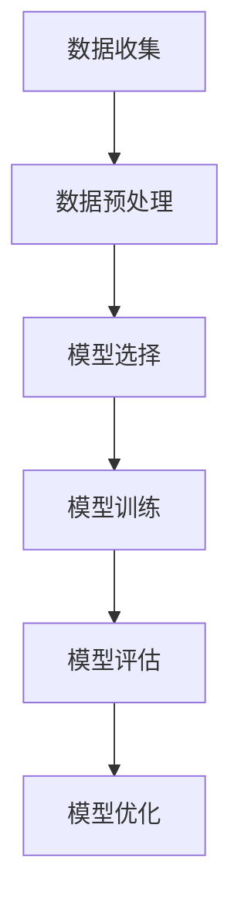

                 

### 文章标题

#### 大模型在 AI 创业产品测试中的趋势：高效的 AI 应用

> **关键词：大模型、AI 创业、产品测试、高效应用、人工智能**

**摘要：** 本文将深入探讨大模型在 AI 创业产品测试中的趋势，分析其核心作用和实现策略，并探讨高效 AI 应用的实现与优化。通过具体的案例分析，我们展示了大模型在产品测试中的实践应用，同时讨论了面临的挑战与未来趋势。文章旨在为 AI 创业者提供实用的测试策略和技术支持，以加速产品迭代和市场竞争力。

#### 目录大纲

- **第一部分: 大模型概述与趋势分析**
  - **第1章: 大模型在 AI 创业中的机遇与挑战**
  - **第2章: 大模型的原理与技术基础**
- **第二部分: 高效 AI 应用的实现与优化**
  - **第3章: 大模型在 AI 产品测试中的应用策略**
  - **第4章: AI 创业产品测试案例分析**
  - **第5章: 大模型在 AI 产品测试中的挑战与未来**
- **第三部分: 大模型应用实践**
  - **第6章: 大模型应用实践：搭建高效测试环境**
  - **第7章: 代码实际案例与详细解释**
- **附录**
  - **附录 A: 大模型测试相关工具与资源**
  - **附录 B: 大模型流程图与数学模型**

### 第一部分：大模型概述与趋势分析

#### 第1章: 大模型在 AI 创业中的机遇与挑战

**1.1 大模型在 AI 创业中的核心作用**

大模型在 AI 创业中的核心作用体现在产品开发的各个环节。首先，大模型为 AI 创业者提供了强大的数据分析和处理能力，能够从海量数据中提取有用信息，为业务决策提供数据支持。其次，大模型能够模拟人类思维，实现自动化和智能化的功能，如自然语言处理、图像识别、预测建模等，极大地提高了产品开发的效率和准确性。

在 AI 创业过程中，技术需求与挑战并存。一方面，创业者需要掌握大模型的原理和技术，以设计和实现高效的产品功能。另一方面，大模型的训练和优化过程对计算资源和数据质量有较高要求，这对初创公司来说是一个巨大的挑战。此外，大模型的应用场景多样化，创业者需要根据业务需求不断调整和优化模型，以满足市场变化。

**1.2 AI 创业的现状与趋势**

当前，AI 创业的生态系统日益成熟，众多领域如自然语言处理、计算机视觉、语音识别、预测建模等吸引了大量创业者。以下是一些主要趋势和热点领域：

1. **自然语言处理（NLP）**：NLP 技术在信息检索、智能客服、内容审核等领域具有广泛应用。例如，GPT-3 等大模型在生成式文本任务中表现出色，为 AI 创业者提供了丰富的应用场景。

2. **计算机视觉（CV）**：CV 技术在图像识别、视频分析、医疗影像等领域具有重要应用价值。深度学习算法和卷积神经网络（CNN）等大模型在该领域取得了显著突破，推动了 AI 创业的快速发展。

3. **语音识别（ASR）**：语音识别技术在智能语音助手、语音翻译、语音控制等领域有着广泛应用。大模型的引入使得语音识别的准确率和实时性得到显著提升，为 AI 创业提供了更多可能性。

4. **预测建模**：预测建模技术在金融、物流、零售等领域具有广泛应用。通过大数据分析和机器学习算法，创业者可以实现对业务需求的精准预测，从而优化业务流程和提高竞争力。

**1.3 大模型在产品测试中的应用场景**

AI 测试是确保 AI 产品质量和稳定性的关键环节。大模型在 AI 测试中的应用场景主要包括：

1. **测试用例生成**：大模型能够自动生成测试用例，提高测试的覆盖率和效率。通过自然语言处理等技术，大模型可以分析产品需求文档和用户反馈，生成相应的测试用例。

2. **自动化测试**：大模型可以用于自动化测试的设计和执行，实现测试过程的自动化。例如，自然语言处理技术可以用于生成自动化测试脚本，计算机视觉技术可以用于自动化测试执行。

3. **测试结果分析**：大模型可以对测试结果进行深入分析，识别潜在的缺陷和问题。通过数据挖掘和模式识别等技术，大模型可以提供测试结果的可视化分析，帮助开发者快速定位问题。

4. **回归测试**：大模型可以用于回归测试，确保产品在更新和迭代过程中保持稳定性和兼容性。通过对比新旧版本之间的差异，大模型可以识别出可能引入的新问题，从而提高产品的稳定性。

### 第二部分：高效 AI 应用的实现与优化

#### 第2章: 大模型的原理与技术基础

**2.1 大模型的定义与分类**

大模型是指具有大规模参数、能够处理海量数据的神经网络模型。根据不同的应用场景和任务需求，大模型可以分为以下几类：

1. **深度神经网络（DNN）**：DNN 是一种多层前馈神经网络，通过层层传递输入信号，实现复杂函数的映射。DNN 在图像识别、语音识别等领域具有广泛应用。

2. **卷积神经网络（CNN）**：CNN 是一种特殊类型的 DNN，特别适用于处理具有网格结构的数据，如图像和视频。CNN 通过卷积操作和池化操作，提取图像特征，实现图像分类和识别。

3. **循环神经网络（RNN）**：RNN 是一种能够处理序列数据的神经网络，通过循环结构实现序列信息的传递和记忆。RNN 在自然语言处理、语音识别等领域具有重要应用。

4. **生成对抗网络（GAN）**：GAN 是一种由生成器和判别器组成的神经网络模型，通过对抗训练实现高质量数据的生成。GAN 在图像生成、文本生成等领域表现出色。

**2.2 大模型的训练与优化**

大模型的训练过程主要包括数据预处理、模型选择、训练策略和优化等方面。

1. **数据预处理**：数据预处理是训练大模型的基础工作，包括数据清洗、归一化、数据增强等。数据质量直接影响模型的性能，因此数据预处理非常重要。

2. **模型选择**：根据任务需求和数据特点，选择合适的大模型结构。常见的模型包括 VGG、ResNet、BERT 等，每种模型都有其优缺点和适用场景。

3. **训练策略**：大模型的训练过程通常需要较长时间，为了提高训练效率，可以采用以下策略：
   - **批量归一化（Batch Normalization）**：通过将每个批次的数据标准化，加快收敛速度。
   - **权重初始化**：合适的权重初始化可以加快模型收敛，避免梯度消失或爆炸。
   - **学习率调整**：根据训练过程的变化，动态调整学习率，提高模型性能。

4. **优化方法**：优化方法主要包括梯度下降（GD）、随机梯度下降（SGD）、Adam 等。不同的优化方法适用于不同的场景和任务，需要根据实际情况进行选择。

**2.3 大模型的评估与验证**

大模型的评估与验证是确保模型性能的重要环节。以下是一些常见的评估指标和验证方法：

1. **评估指标**：
   - **准确率（Accuracy）**：模型预测正确的样本占总样本的比例。
   - **召回率（Recall）**：模型预测为正类的正类样本占总正类样本的比例。
   - **精确率（Precision）**：模型预测为正类的正类样本占总预测为正类的样本的比例。
   - **F1 分数（F1 Score）**：精确率和召回率的加权平均值，用于综合评估模型的性能。

2. **验证方法**：
   - **交叉验证（Cross Validation）**：将数据集划分为多个子集，分别用于训练和验证，以评估模型的泛化能力。
   - **留出法（Holdout Method）**：将数据集划分为训练集和验证集，分别用于模型训练和性能评估。
   - **自助法（Bootstrap Method）**：通过有放回抽样，生成多个训练集和验证集，用于评估模型性能。

### 第三部分：高效 AI 应用的实现与优化

#### 第3章: 大模型在 AI 产品测试中的应用策略

**3.1 大模型在测试设计中的应用**

测试设计是确保产品质量和稳定性的关键环节。大模型在测试设计中的应用主要体现在以下几个方面：

1. **自动化测试设计**：大模型能够自动生成测试用例，提高测试的覆盖率和效率。通过自然语言处理等技术，大模型可以分析产品需求文档和用户反馈，生成相应的测试用例。

2. **智能测试设计**：大模型可以基于历史测试数据和用户行为数据，预测潜在的问题和缺陷，从而设计出更加有效的测试用例。这种方法可以提高测试的针对性和有效性。

3. **场景化测试设计**：大模型可以分析用户行为数据和业务场景，生成符合实际业务场景的测试用例。这种方法可以确保测试结果更贴近实际应用场景，提高测试的真实性和准确性。

**3.2 大模型在测试执行中的优化**

测试执行是验证产品功能和质量的重要环节。大模型在测试执行中的优化主要体现在以下几个方面：

1. **自动化测试执行**：大模型可以用于自动化测试的设计和执行，实现测试过程的自动化。例如，自然语言处理技术可以用于生成自动化测试脚本，计算机视觉技术可以用于自动化测试执行。

2. **测试执行策略优化**：大模型可以根据测试环境和业务需求，动态调整测试执行策略。例如，根据测试结果的反馈，调整测试用例的执行顺序和执行频率，以提高测试效率。

3. **测试资源调度**：大模型可以优化测试资源的调度，提高测试执行的速度和效率。例如，通过分析测试执行历史数据和预测测试执行时间，合理分配测试资源，避免资源浪费。

**3.3 大模型在测试结果分析中的应用**

测试结果分析是确保产品质量和稳定性的重要环节。大模型在测试结果分析中的应用主要体现在以下几个方面：

1. **测试结果可视化**：大模型可以将测试结果以可视化的形式呈现，帮助开发者直观地了解测试情况。例如，通过生成测试结果图表，展示测试覆盖率、缺陷分布等信息。

2. **测试结果分析**：大模型可以分析测试结果，识别潜在的缺陷和问题。通过数据挖掘和模式识别等技术，大模型可以提供测试结果的深度分析，帮助开发者快速定位问题。

3. **测试结果预测**：大模型可以基于历史测试数据和业务场景，预测未来的测试结果。这种方法可以帮助开发者提前发现问题，制定相应的优化策略。

### 第四部分：AI 创业产品测试案例分析

#### 第4章: AI 创业产品测试案例分析

**4.1 案例一：电商平台的大模型应用**

**测试环境搭建**：
- 硬件配置：采用多核处理器和高性能显卡，配置足够内存和存储空间。
- 软件环境：安装深度学习框架（如 TensorFlow、PyTorch），以及相应的依赖库和工具。

**测试用例设计与实现**：
- 数据收集：收集电商平台的用户行为数据、商品信息、订单数据等。
- 数据清洗：对数据进行清洗和预处理，去除异常值和缺失值。
- 测试用例生成：利用自然语言处理技术，生成针对用户行为和商品信息的测试用例。
- 测试用例执行：自动化执行测试用例，收集测试结果。

**测试结果分析与优化**：
- 测试结果可视化：通过图表和报告，展示测试覆盖率、缺陷分布等信息。
- 测试结果分析：利用数据挖掘和模式识别技术，分析测试结果，识别潜在缺陷。
- 优化策略：根据测试结果，调整测试用例和测试策略，提高测试效率和质量。

**4.2 案例二：金融科技产品的大模型应用**

**测试需求分析**：
- 功能需求：确保金融科技产品的各项功能正常运行，如账户管理、交易结算、风险管理等。
- 非功能需求：确保产品的安全性、稳定性、性能等。

**测试方案设计**：
- 测试环境搭建：配置适合的硬件和软件环境，确保测试环境的稳定性和可重复性。
- 测试用例设计：根据功能需求和非功能需求，设计相应的测试用例，覆盖关键业务场景。
- 测试执行：自动化执行测试用例，收集测试结果。
- 测试结果分析：对测试结果进行分析，识别潜在的缺陷和问题。

**测试执行与结果分析**：
- 测试执行：采用自动化测试工具，高效执行测试用例。
- 测试结果分析：利用大模型对测试结果进行分析，识别潜在缺陷和性能瓶颈。
- 优化措施：根据测试结果，调整测试用例和测试策略，优化产品性能和稳定性。

### 第五部分：大模型在 AI 产品测试中的挑战与未来

#### 第5章: 大模型在 AI 产品测试中的挑战与未来

**5.1 大模型在产品测试中的挑战**

1. **数据质量与隐私问题**：大模型在测试过程中需要大量数据支持，但数据质量和隐私问题一直是困扰测试的难题。如何确保数据的真实性和安全性，避免数据泄露，是 AI 产品测试面临的重要挑战。

2. **模型可解释性**：大模型通常具有复杂的内部结构和参数，导致模型的可解释性较差。在测试过程中，如何确保测试结果的透明度和可解释性，是开发者需要关注的问题。

3. **计算资源需求**：大模型的训练和测试过程需要大量计算资源，对于初创公司来说，如何高效利用计算资源，降低成本，是 AI 产品测试的重要挑战。

**5.2 大模型在产品测试中的未来趋势**

1. **大模型与测试技术的融合**：未来，大模型与测试技术将更加紧密地融合，形成一套完整的测试体系。通过自动化测试、智能测试和可视化分析等技术，提高产品测试的效率和质量。

2. **自动化测试与智能化测试的结合**：自动化测试和智能化测试将相互补充，共同推动产品测试的发展。自动化测试将提高测试执行的速度和效率，而智能化测试将提高测试的准确性和针对性。

3. **数据驱动测试**：数据驱动测试将取代传统的功能驱动测试，成为未来产品测试的主流。通过大数据分析和机器学习算法，实现测试用例的自动生成、执行和分析，提高测试的效率和效果。

4. **测试工具与平台的创新**：未来，测试工具和平台将更加智能化、高效化，为开发者提供便捷的测试解决方案。通过云计算、大数据和人工智能等技术的支持，测试工具和平台将实现从测试设计、执行到结果分析的全流程自动化。

### 第六部分：大模型应用实践

#### 第6章: 大模型应用实践：搭建高效测试环境

**6.1 开发环境搭建**

**硬件配置**：
- 多核处理器：至少四核，推荐八核以上，以提高模型训练和测试的并行性能。
- 显卡：NVIDIA 显卡，支持 CUDA 和 GPU 加速，推荐 GTX 1080 Ti 或更高型号。
- 内存：至少 16GB，推荐 32GB 以上，以满足大模型训练过程中内存需求。
- 存储：高速 SSD 存储，推荐容量为 500GB 以上，以存储大模型训练数据和测试数据。

**软件环境**：
- 操作系统：Linux 系统，推荐 Ubuntu 18.04 或更高版本。
- 编程语言：Python 3.x 版本，推荐使用 Anaconda 环境管理器。
- 深度学习框架：TensorFlow、PyTorch 或其他支持 GPU 加速的深度学习框架。

**安装与配置**：
1. 安装操作系统和硬件设备。
2. 安装 Python 和 Anaconda，配置 Python 环境和依赖库。
3. 安装深度学习框架，配置 GPU 加速。

**6.2 数据处理与预处理**

**数据收集**：
- 从不同数据源收集数据，如公共数据集、企业内部数据等。
- 确保数据源的质量和多样性，避免数据偏见。

**数据清洗**：
- 去除重复数据、异常数据和缺失值。
- 标准化数据格式，确保数据一致性。

**数据预处理**：
- 数据归一化：将数值型数据缩放到相同范围，便于模型训练。
- 数据增强：通过旋转、缩放、裁剪等方法，增加数据多样性，提高模型泛化能力。
- 数据划分：将数据集划分为训练集、验证集和测试集，确保数据分布的平衡。

**6.3 大模型训练与评估**

**模型选择**：
- 根据任务需求和数据特点，选择合适的大模型结构，如 BERT、ResNet 等。
- 分析模型优缺点，确保模型在任务上具有较好的表现。

**训练策略**：
- 数据增强：通过数据增强提高模型泛化能力。
- 批量归一化：将每个批次的数据标准化，加快收敛速度。
- 权重初始化：使用合适的权重初始化方法，避免梯度消失或爆炸。
- 学习率调整：根据训练过程的变化，动态调整学习率，提高模型性能。

**评估与优化**：
- 评估指标：使用准确率、召回率、F1 分数等指标评估模型性能。
- 调整超参数：根据评估结果，调整模型超参数，优化模型性能。
- 模型融合：使用集成学习方法，结合多个模型，提高测试准确率。

### 第七部分：代码实际案例与详细解释

#### 第7章: 代码实际案例与详细解释

**7.1 代码案例一：自动化测试用例生成**

**伪代码实现**：

```python
# 伪代码：自动化测试用例生成

def generate_test_cases(product Requirements, user_behaviors):
    test_cases = []
    for requirement in Requirements:
        for behavior in user_behaviors:
            test_case = {
                "Requirement": requirement,
                "Behavior": behavior,
                "Expected_Result": expected_result(requirement, behavior)
            }
            test_cases.append(test_case)
    return test_cases

def expected_result(requirement, behavior):
    # 根据需求和用户行为，计算预期结果
    # ...
    return result
```

**案例解析**：

本代码案例展示了如何利用自然语言处理技术生成自动化测试用例。首先，从产品需求文档中提取需求（Requirements），从用户行为数据中提取行为（user_behaviors）。然后，通过遍历需求和用户行为，生成包含需求、用户行为和预期结果的测试用例（test_cases）。这种方法可以提高测试用例的覆盖率和效率，确保产品功能的有效测试。

**7.2 代码案例二：测试结果可视化分析**

**代码实现**：

```python
import matplotlib.pyplot as plt
import seaborn as sns

def visualize_test_results(test_results):
    # 绘制测试结果图表
    plt.figure(figsize=(10, 6))
    
    # 测试覆盖率
    sns.barplot(x="Test_Suite", y="Coverage", data=test_results)
    plt.title("Test Coverage by Test Suite")
    plt.xlabel("Test Suite")
    plt.ylabel("Coverage (%)")
    
    # 缺陷分布
    sns.scatterplot(x="Test_Suite", y="Defects", hue="Severity", data=test_results)
    plt.title("Defect Distribution by Test Suite and Severity")
    plt.xlabel("Test Suite")
    plt.ylabel("Defects")
    
    plt.show()
```

**分析方法与结果解读**：

本代码案例展示了如何利用 Matplotlib 和 Seaborn 库绘制测试结果图表。首先，通过 barplot 函数绘制测试覆盖率图表，展示每个测试套件的覆盖率情况。然后，通过 scatterplot 函数绘制缺陷分布图表，展示每个测试套件的缺陷数量和严重程度。通过可视化分析，开发者可以直观地了解测试的覆盖率和缺陷情况，快速定位问题，制定优化策略。

**7.3 代码案例三：测试执行与性能优化**

**代码解读**：

```python
import tensorflow as tf

# 模型定义
model = tf.keras.Sequential([
    tf.keras.layers.Dense(128, activation='relu', input_shape=(input_shape)),
    tf.keras.layers.Dense(10, activation='softmax')
])

# 模型编译
model.compile(optimizer='adam',
              loss='categorical_crossentropy',
              metrics=['accuracy'])

# 模型训练
model.fit(x_train, y_train, epochs=5, batch_size=64)

# 测试执行
test_loss, test_accuracy = model.evaluate(x_test, y_test)

print("Test Loss:", test_loss)
print("Test Accuracy:", test_accuracy)

# 性能优化策略
# 1. 调整学习率
learning_rate = 0.001
model.compile(optimizer=tf.keras.optimizers.Adam(learning_rate),
              loss='categorical_crossentropy',
              metrics=['accuracy'])

# 2. 调整批次大小
batch_size = 128
model.fit(x_train, y_train, epochs=5, batch_size=batch_size)

# 3. 使用更深的模型结构
model = tf.keras.Sequential([
    tf.keras.layers.Dense(256, activation='relu', input_shape=(input_shape)),
    tf.keras.layers.Dense(128, activation='relu'),
    tf.keras.layers.Dense(10, activation='softmax')
])

model.compile(optimizer=tf.keras.optimizers.Adam(learning_rate),
              loss='categorical_crossentropy',
              metrics=['accuracy'])

model.fit(x_train, y_train, epochs=5, batch_size=batch_size)
```

**性能优化策略**：

本代码案例展示了如何通过调整学习率、批次大小和模型结构来优化测试性能。首先，通过调整学习率，提高模型收敛速度和准确率。其次，通过调整批次大小，优化计算效率和内存使用。最后，通过增加模型深度，提高模型的表达能力，从而提高测试准确率。这些优化策略可以根据具体任务需求进行调整，以提高测试性能。

### 附录

#### 附录 A: 大模型测试相关工具与资源

- **工具介绍**：
  - TensorFlow：开源深度学习框架，支持 GPU 加速，适用于大模型训练和测试。
  - PyTorch：开源深度学习框架，支持动态计算图，适用于复杂模型训练和测试。
  - Matplotlib：Python 数据可视化库，适用于绘制测试结果图表。
  - Seaborn：基于 Matplotlib 的数据可视化库，提供丰富的统计图形和样式。
  - Jupyter Notebook：交互式数据分析环境，适用于编写和运行测试代码。

- **资源链接**：
  - TensorFlow 官网：[https://www.tensorflow.org/](https://www.tensorflow.org/)
  - PyTorch 官网：[https://pytorch.org/](https://pytorch.org/)
  - Matplotlib 官网：[https://matplotlib.org/](https://matplotlib.org/)
  - Seaborn 官网：[https://seaborn.pydata.org/](https://seaborn.pydata.org/)
  - Jupyter Notebook 官网：[https://jupyter.org/](https://jupyter.org/)

#### 附录 B: 大模型流程图与数学模型

**B.1 大模型流程图**



**B.2 大模型数学模型**

**1. 深度神经网络（DNN）**

$$
y_{i} = \sigma(\sum_{j=1}^{n} w_{ji} \cdot x_{ji})
$$

其中，$y_{i}$ 是第 $i$ 个输出节点，$\sigma$ 是激活函数（如 sigmoid、ReLU），$w_{ji}$ 是输入节点 $x_{ji}$ 对输出节点的权重，$n$ 是输入节点数量。

**2. 卷积神经网络（CNN）**

$$
h_{ij} = \sigma(\sum_{k=1}^{m} w_{kj} \cdot a_{ij,k} + b_{j})
$$

其中，$h_{ij}$ 是第 $i$ 个输出节点，$\sigma$ 是激活函数，$w_{kj}$ 是卷积核权重，$a_{ij,k}$ 是输入节点与卷积核的卷积结果，$b_{j}$ 是偏置项。

**3. 循环神经网络（RNN）**

$$
h_{t} = \sigma(W_h \cdot [h_{t-1}, x_{t}] + b_h)
$$

$$
o_{t} = \sigma(W_o \cdot h_{t} + b_o)
$$

其中，$h_{t}$ 是第 $t$ 个隐藏状态，$o_{t}$ 是第 $t$ 个输出状态，$W_h$ 和 $W_o$ 是权重矩阵，$b_h$ 和 $b_o$ 是偏置项，$x_{t}$ 是输入序列中的第 $t$ 个元素，$\sigma$ 是激活函数。

**4. 生成对抗网络（GAN）**

生成器：

$$
G(z) = \sigma(W_g \cdot z + b_g)
$$

判别器：

$$
D(x) = \sigma(W_d \cdot x + b_d)
$$

其中，$G(z)$ 是生成器生成的假样本，$D(x)$ 是判别器对真实样本和假样本的判别结果，$z$ 是生成器的输入噪声，$W_g$、$W_d$ 和 $b_g$、$b_d$ 分别是生成器和判别器的权重和偏置项，$\sigma$ 是激活函数。

### 作者信息

**作者：AI天才研究院/AI Genius Institute & 禅与计算机程序设计艺术 /Zen And The Art of Computer Programming**

### 结束语

本文通过深入探讨大模型在 AI 创业产品测试中的应用，分析了大模型在 AI 创业中的核心作用和实现策略，展示了高效 AI 应用的实现与优化方法。同时，通过具体案例分析，我们展示了大模型在产品测试中的实践应用，并讨论了面临的挑战与未来趋势。本文旨在为 AI 创业者提供实用的测试策略和技术支持，以加速产品迭代和市场竞争力。希望本文能为读者在 AI 创业领域提供有益的启示和参考。让我们共同努力，推动人工智能技术的创新与发展，共创美好未来！<|less|>

