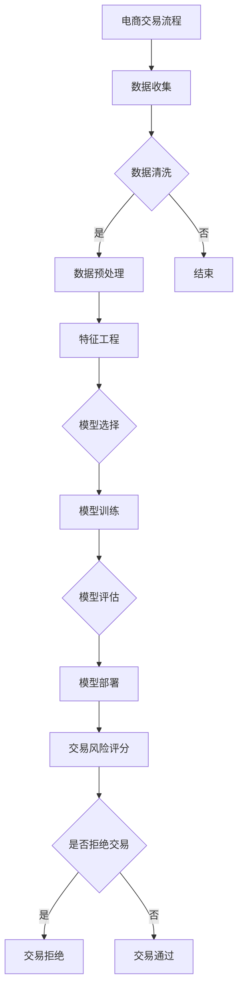

                 

# 《大模型在电商反欺诈中的应用》

## 摘要

本文旨在探讨大模型在电商反欺诈中的应用。随着电子商务的蓬勃发展，反欺诈已成为电商企业的重要课题。大模型以其强大的数据处理能力和深度学习能力，在欺诈检测领域展现出巨大的潜力。本文首先概述了大模型的基本概念和分类，接着分析了欺诈检测的基本概念和挑战，然后详细阐述了大模型在欺诈检测中的优势和应用，最后通过实战案例展示了大模型在电商反欺诈中的实际应用效果。本文的目标是为读者提供一个全面、深入的视角，帮助理解大模型在电商反欺诈中的应用前景。

## 引言

### 1.1 大模型在电商反欺诈中的重要性

电商行业的快速崛起，带来了交易量的剧增，同时也带来了欺诈行为的高发。反欺诈成为保障电商交易安全的重要一环。大模型，特别是深度学习模型，凭借其强大的数据处理和分析能力，正在成为电商反欺诈的新利器。

大模型在电商反欺诈中的重要性主要体现在以下几个方面：

1. **高效的数据处理能力**：大模型能够处理海量数据，从而识别出潜在的欺诈行为。在电商领域，数据量庞大且复杂，传统的检测方法难以应对。大模型能够自动提取数据中的关键特征，提高欺诈检测的准确性和效率。

2. **深度学习能力**：大模型通过训练能够学习到数据中的复杂模式和规律，从而更准确地识别欺诈行为。深度学习模型能够从大量历史数据中学习，不断地优化和调整自身的参数，使其在欺诈检测中表现出色。

3. **自适应能力**：大模型能够根据实时数据动态调整检测策略，以应对不断变化的欺诈手段。电商欺诈行为不断演变，传统的检测方法往往难以跟上变化。大模型具有自学习能力，能够快速适应新情况，提高检测效果。

4. **全面性**：大模型可以同时处理多种类型的欺诈行为，如虚假账户、刷单、欺诈交易等。而传统的检测方法通常只能针对某一特定类型的欺诈行为进行检测，无法提供全面的防护。

### 1.2 电商反欺诈的现状与挑战

当前，电商反欺诈技术主要包括基于规则的方法、基于机器学习的方法和基于深度学习的方法。这些方法在一定程度上提高了欺诈检测的准确性，但仍面临以下挑战：

1. **欺诈手段不断演变**：欺诈分子不断尝试新的欺诈手段，以逃避检测。传统的检测方法难以应对这些新手段，导致检测效果下降。

2. **数据隐私保护**：在反欺诈过程中，需要收集和处理大量的用户数据。如何保护用户数据隐私，成为电商企业面临的一大挑战。

3. **计算资源消耗**：深度学习模型通常需要大量的计算资源进行训练和推理。对于中小型电商企业来说，这可能是一笔不小的负担。

4. **模型解释性**：深度学习模型具有较强的黑箱特性，难以解释其决策过程。这在一定程度上限制了其在实际应用中的推广。

### 1.3 本书的内容结构安排

本书将从以下几个方面展开讨论：

1. **基础理论**：介绍大模型的基本概念、分类和特点，以及欺诈检测的基本概念和挑战。
2. **算法原理**：详细阐述大模型在欺诈检测中的应用，包括深度学习模型、聚类算法、分类算法和生成对抗网络等。
3. **实战案例**：通过实际案例，展示大模型在电商反欺诈中的应用效果，并提供详细的代码实现和分析。
4. **技术展望**：探讨电商反欺诈技术的发展趋势，以及大模型在其中的未来应用。

通过本书的阅读，读者将能够全面了解大模型在电商反欺诈中的应用，掌握相关技术原理，并具备实际操作能力。

## 第二部分：基础理论

### 2.1 大模型概述

#### 2.1.1 大模型的基本概念

大模型（Large-scale Model）是指那些拥有大规模参数、能够在海量数据集上进行训练，并能处理复杂任务的机器学习模型。这些模型通常包括深度神经网络（Deep Neural Network）、循环神经网络（Recurrent Neural Network）、变分自编码器（Variational Autoencoder）等。

大模型的基本概念可以从以下几个方面进行理解：

1. **规模**：大模型的规模通常指其参数的数量。例如，一个拥有数百万甚至数十亿参数的神经网络就可以被称为大模型。
2. **数据集**：大模型需要在大规模数据集上进行训练，以学习到数据中的复杂模式和规律。数据集的规模和质量对大模型的效果有重要影响。
3. **训练**：大模型的训练通常需要大量的计算资源和时间。训练过程包括前向传播、反向传播和参数更新等步骤。
4. **应用**：大模型在各个领域都有广泛的应用，如图像识别、自然语言处理、推荐系统、欺诈检测等。

#### 2.1.2 大模型的分类

根据模型的类型和应用场景，大模型可以分为以下几类：

1. **深度神经网络（Deep Neural Network, DNN）**：DNN 是一种具有多个隐藏层的神经网络。通过增加层数和神经元数量，DNN 能够学习到更复杂的特征表示。
2. **循环神经网络（Recurrent Neural Network, RNN）**：RNN 具有循环结构，能够处理序列数据。通过记忆过去的信息，RNN 在自然语言处理、时间序列分析等领域表现出色。
3. **变分自编码器（Variational Autoencoder, VAE）**：VAE 是一种生成模型，通过编码器和解码器网络，将输入数据映射到一个潜在空间，并生成新的数据。
4. **生成对抗网络（Generative Adversarial Network, GAN）**：GAN 由生成器和判别器组成，通过对抗训练，生成器试图生成与真实数据难以区分的数据，而判别器则试图区分真实数据和生成数据。

#### 2.1.3 大模型的特点

大模型具有以下几个显著特点：

1. **强大的表达能力**：大模型能够学习到数据中的复杂结构和特征，从而进行精确的预测和分类。
2. **非线性变换**：大模型通过非线性变换，将输入数据映射到高维空间，从而提高模型的预测能力。
3. **自适应性**：大模型能够根据不同的数据集和应用场景，自动调整模型参数，从而提高模型的泛化能力。
4. **计算复杂性**：大模型的训练和推理过程通常需要大量的计算资源和时间。这要求在设计和部署大模型时，充分考虑计算资源和管理策略。

### 2.2 欺诈检测的基本概念

#### 2.2.1 欺诈的定义与类型

欺诈是指通过欺骗、误导或其他不道德手段，从他人那里获取不当利益的行为。在电商领域，欺诈行为主要包括以下几类：

1. **虚假账户**：欺诈分子通过注册虚假账户，进行非法交易或恶意评价。
2. **刷单**：刷单是指通过虚假交易提高商品销量，以获取平台奖励或提高商品排名。
3. **欺诈交易**：欺诈交易是指通过虚假交易、盗刷信用卡等方式，从电商平台上获取非法利益。
4. **恶意评价**：恶意评价是指通过虚假评论或恶意评分，损害其他商家或商品声誉。

#### 2.2.2 欺诈检测的挑战

欺诈检测面临以下几个主要挑战：

1. **数据隐私**：在反欺诈过程中，需要收集和处理大量的用户数据。如何保护用户数据隐私，成为欺诈检测的一个重要挑战。
2. **欺诈手段的多样性**：欺诈分子不断尝试新的欺诈手段，以逃避检测。传统的检测方法难以应对这些新手段。
3. **计算资源消耗**：欺诈检测通常需要大量的计算资源，尤其是深度学习模型。对于中小型电商平台来说，这可能是一笔不小的负担。
4. **模型解释性**：深度学习模型具有较强的黑箱特性，难以解释其决策过程。这在一定程度上限制了其在实际应用中的推广。
5. **实时性**：欺诈行为通常具有时效性，要求检测系统能够快速响应并采取行动。

#### 2.2.3 欺诈检测的目标

欺诈检测的目标主要包括以下几个方面：

1. **准确性**：准确检测欺诈行为，避免误判和漏判。
2. **实时性**：快速检测欺诈行为，减少欺诈对电商平台的损失。
3. **可解释性**：解释检测模型的工作原理和决策过程，提高用户对检测系统的信任。
4. **可扩展性**：能够应对大规模数据和高并发请求，保证系统的稳定运行。

### 2.3 大模型在欺诈检测中的应用

#### 2.3.1 大模型在电商领域的应用

大模型在电商领域的应用非常广泛，包括但不限于以下几方面：

1. **推荐系统**：大模型能够根据用户的兴趣和行为，提供个性化的商品推荐。通过深度学习模型，电商平台可以实现更精准的推荐，提高用户体验和转化率。
2. **搜索优化**：大模型能够优化电商平台的搜索算法，提高搜索结果的准确性和相关性。通过自然语言处理模型，电商平台可以实现更智能的搜索功能。
3. **价格优化**：大模型能够根据市场需求、竞争状况等，动态调整商品价格，实现利润最大化。
4. **欺诈检测**：大模型能够高效地检测电商交易中的欺诈行为，保障交易安全。通过深度学习模型，电商平台可以实现更准确的欺诈检测，降低欺诈风险。

#### 2.3.2 大模型在欺诈检测中的优势

大模型在欺诈检测中具有以下几个显著优势：

1. **强大的数据处理能力**：大模型能够处理海量数据，从而识别出潜在的欺诈行为。在电商领域，数据量庞大且复杂，传统的检测方法难以应对。大模型能够自动提取数据中的关键特征，提高欺诈检测的准确性和效率。
2. **深度学习能力**：大模型通过训练能够学习到数据中的复杂模式和规律，从而更准确地识别欺诈行为。深度学习模型能够从大量历史数据中学习，不断地优化和调整自身的参数，使其在欺诈检测中表现出色。
3. **自适应能力**：大模型能够根据实时数据动态调整检测策略，以应对不断变化的欺诈手段。电商欺诈行为不断演变，传统的检测方法往往难以跟上变化。大模型具有自学习能力，能够快速适应新情况，提高检测效果。
4. **全面性**：大模型可以同时处理多种类型的欺诈行为，如虚假账户、刷单、欺诈交易等。而传统的检测方法通常只能针对某一特定类型的欺诈行为进行检测，无法提供全面的防护。

#### 2.3.3 大模型在欺诈检测中的挑战

尽管大模型在欺诈检测中具有显著优势，但仍然面临以下挑战：

1. **数据隐私保护**：在反欺诈过程中，需要收集和处理大量的用户数据。如何保护用户数据隐私，成为电商企业面临的一大挑战。
2. **计算资源消耗**：深度学习模型通常需要大量的计算资源进行训练和推理。对于中小型电商企业来说，这可能是一笔不小的负担。
3. **模型解释性**：深度学习模型具有较强的黑箱特性，难以解释其决策过程。这在一定程度上限制了其在实际应用中的推广。
4. **实时性**：欺诈行为通常具有时效性，要求检测系统能够快速响应并采取行动。大模型的训练和推理过程通常需要较长的时间，可能无法满足实时性的要求。

### 2.4 欺诈检测与电商安全的关系

欺诈检测是电商安全体系的重要组成部分。它不仅能够防止欺诈行为的发生，还能够提高用户信任度和平台声誉，从而提升整体业务表现。

#### 2.4.1 欺诈检测对电商安全的影响

1. **降低欺诈风险**：通过有效的欺诈检测，电商平台能够识别和阻止欺诈行为，降低欺诈风险，保护用户和商家的利益。
2. **提高用户体验**：准确的欺诈检测能够减少误判和漏判，提高用户的交易体验，增强用户对平台的信任。
3. **提升平台声誉**：有效的欺诈检测能够提高平台的交易安全水平，增强用户对平台的信任，提升平台的市场竞争力。

#### 2.4.2 电商安全与欺诈检测的互动关系

1. **相互促进**：欺诈检测能够提高电商安全水平，降低欺诈风险；而电商安全水平的提高，又能够为欺诈检测提供更可靠的数据支持，促进欺诈检测技术的不断发展。
2. **共同发展**：随着电商业务的发展，欺诈手段也在不断演变。欺诈检测技术需要不断创新，以应对新的欺诈威胁；而电商安全水平的提高，又为欺诈检测技术提供了更广阔的应用场景，推动其不断进步。

### 2.5 电商反欺诈的法律法规与道德伦理

#### 2.5.1 法律法规

在全球范围内，各国政府和国际组织纷纷制定了相关的法律法规，以规范电商反欺诈行为。这些法律法规主要包括以下几个方面：

1. **消费者权益保护法**：保护消费者权益，防止欺诈行为的发生。
2. **网络安全法**：规范网络安全管理，保护用户个人信息安全。
3. **反洗钱法**：防止洗钱行为，打击金融犯罪。
4. **电子商务法**：规范电子商务活动，保障交易安全。

#### 2.5.2 道德伦理

在电商反欺诈过程中，企业需要遵循一定的道德伦理原则，包括：

1. **用户隐私保护**：在收集和处理用户数据时，要确保用户隐私不受侵犯。
2. **公平公正**：在欺诈检测过程中，要确保对所有用户公平公正，避免歧视行为。
3. **透明公开**：在反欺诈策略和决策过程中，要确保透明公开，提高用户信任度。
4. **社会责任**：企业要承担社会责任，积极参与社会公益事业，为构建和谐社会贡献力量。

## 第三部分：算法原理

### 3.1 大模型的核心算法

#### 3.1.1 深度学习的基本概念

深度学习（Deep Learning）是一种基于多隐层神经网络（Deep Neural Network）的机器学习技术。深度学习通过多层次的神经网络结构，自动提取数据中的特征，从而实现复杂的预测和分类任务。

深度学习的基本概念可以从以下几个方面进行理解：

1. **神经网络**：神经网络是一种模拟人脑神经元连接结构的计算模型。通过调整神经元之间的连接权重，神经网络能够学习到输入数据中的特征。
2. **多层结构**：深度学习模型通常包含多个隐层，每个隐层都能够对输入数据进行非线性变换，提取更高层次的抽象特征。
3. **反向传播**：反向传播（Backpropagation）是一种用于训练神经网络的算法。通过计算损失函数关于每个神经元的梯度，反向传播算法能够自动调整神经元的连接权重。
4. **优化算法**：深度学习模型通常采用梯度下降（Gradient Descent）或其变种，如随机梯度下降（Stochastic Gradient Descent，SGD）、Adam 算法等，来优化模型参数。

#### 3.1.2 神经网络的结构与原理

神经网络的结构通常包括输入层、隐藏层和输出层。每个层由多个神经元组成，神经元之间通过加权连接实现信息传递。

1. **输入层**：输入层接收外部输入数据，并将其传递给隐藏层。
2. **隐藏层**：隐藏层对输入数据进行非线性变换，提取更高层次的抽象特征。一个神经网络可以包含一个或多个隐藏层。
3. **输出层**：输出层根据隐藏层传递的信息，生成最终的预测结果。

神经网络的原理可以通过以下几个步骤进行描述：

1. **前向传播**：输入数据通过神经网络的前向传播过程，逐层传递到输出层。在每个隐层，神经元通过激活函数（如 Sigmoid、ReLU）对输入数据进行非线性变换。
2. **计算损失**：输出层的预测结果与真实标签之间计算损失（如均方误差、交叉熵损失），以衡量模型的预测误差。
3. **反向传播**：通过反向传播算法，计算每个神经元关于损失函数的梯度。根据梯度调整神经元的连接权重，以优化模型参数。
4. **迭代更新**：重复上述过程，直到模型收敛到满意的预测效果。

#### 3.1.3 深度学习优化算法

深度学习优化算法的核心目标是调整模型参数，以最小化损失函数。以下是一些常见的深度学习优化算法：

1. **梯度下降（Gradient Descent）**：梯度下降是一种最简单的优化算法。通过计算损失函数关于每个参数的梯度，反向传播算法能够自动调整参数，以减小损失函数。
2. **随机梯度下降（Stochastic Gradient Descent，SGD）**：SGD 在每次迭代过程中，仅使用一个样本（或小批量样本）的梯度来更新参数，从而加速收敛速度。
3. **Adam 算法**：Adam 算法结合了 SGD 和动量（Momentum）的优点，同时考虑了一阶矩估计（一阶矩估计是均值）和二阶矩估计（二阶矩估计是方差），在许多实际应用中表现出良好的性能。
4. **Adagrad 算法**：Adagrad 算法通过为每个参数计算自适应的学习率，能够更好地处理稀疏数据和不同参数规模的问题。
5. **RMSprop 算法**：RMSprop 算法是一种基于梯度平方和的平均值的优化算法，通过减小学习率，有助于避免过拟合。

### 3.2 欺诈检测算法原理

#### 3.2.1 欺诈检测的基本算法

欺诈检测的基本算法主要包括以下几种：

1. **基于规则的方法**：基于规则的方法通过定义一系列规则来识别欺诈行为。这种方法简单直观，但难以应对复杂和动态的欺诈行为。
2. **基于机器学习的方法**：基于机器学习的方法通过训练分类模型来识别欺诈行为。常用的分类模型包括决策树、支持向量机、随机森林等。这种方法能够处理复杂和动态的欺诈行为，但需要对大量历史数据进行训练。
3. **基于深度学习的方法**：基于深度学习的方法通过构建深度神经网络来识别欺诈行为。深度学习模型能够自动提取数据中的复杂特征，从而提高欺诈检测的准确性。

#### 3.2.2 特征工程在欺诈检测中的作用

特征工程在欺诈检测中起着至关重要的作用。通过合理的特征提取和选择，可以提高模型的预测性能和泛化能力。

1. **特征提取**：特征提取是指从原始数据中提取对欺诈检测有用的特征。常见的特征提取方法包括：

   - **统计特征**：如均值、方差、标准差等，用于描述数据的分布和趋势。
   - **时序特征**：如时间间隔、交易频率等，用于描述交易行为的规律性。
   - **文本特征**：如词频、词向量等，用于描述文本数据中的关键信息。

2. **特征选择**：特征选择是指从提取的特征中选择对欺诈检测最有用的特征。常见的特征选择方法包括：

   - **信息增益**：选择对目标变量信息量最大的特征。
   - **卡方检验**：选择与目标变量显著相关的特征。
   - **主成分分析（PCA）**：通过降维减少特征数量，保留对欺诈检测最重要的特征。

#### 3.2.3 欺诈检测的评估指标

欺诈检测的评估指标主要包括准确率、召回率、F1 分数等。

1. **准确率（Accuracy）**：准确率是指正确预测的样本数量与总样本数量的比值。准确率越高，说明模型对欺诈行为的识别能力越强。

2. **召回率（Recall）**：召回率是指正确预测为欺诈的样本数量与实际欺诈样本数量的比值。召回率越高，说明模型对欺诈行为的捕获能力越强。

3. **F1 分数（F1 Score）**：F1 分数是准确率和召回率的加权平均，用于综合评估模型的性能。F1 分数越高，说明模型对欺诈行为的识别能力越强。

### 3.3 大模型在欺诈检测中的算法应用

#### 3.3.1 聚类算法的应用

聚类算法是一种无监督学习方法，用于将相似的数据样本划分为不同的簇。在欺诈检测中，聚类算法可以用于初步识别潜在的欺诈行为。

1. **K-均值聚类**：K-均值聚类是一种经典的聚类算法。它通过迭代计算，将数据划分为 K 个簇，并调整簇中心，以最小化簇内距离和最大化簇间距离。
2. **层次聚类**：层次聚类是一种基于层次结构的聚类算法。它通过逐步合并或分裂簇，构建出一个层次结构，以实现聚类。
3. **密度聚类**：密度聚类是一种基于数据密度的聚类算法。它通过计算数据点的密度，识别出高密度区域，从而将数据划分为不同的簇。

聚类算法在欺诈检测中的应用示例：

```python
from sklearn.cluster import KMeans

# 数据预处理
X = preprocess_data(data)

# K-均值聚类
kmeans = KMeans(n_clusters=3, random_state=0).fit(X)

# 获取聚类结果
clusters = kmeans.predict(X)

# 分析聚类结果，识别潜在的欺诈行为
for cluster in range(3):
    print("Cluster {}: Fraud Rate = {}".format(cluster, calculate_fraud_rate(data, clusters == cluster)))
```

#### 3.3.2 分类算法的应用

分类算法是一种有监督学习方法，用于将数据划分为不同的类别。在欺诈检测中，分类算法可以用于明确判断交易是否为欺诈。

1. **决策树**：决策树是一种基于树结构的分类算法。它通过递归划分特征空间，将数据划分为不同的类别。
2. **支持向量机（SVM）**：支持向量机是一种基于间隔最大化原理的线性分类算法。它通过求解最优超平面，将数据划分为不同的类别。
3. **随机森林**：随机森林是一种基于决策树的集成学习方法。它通过构建多棵决策树，并对预测结果进行投票，提高模型的泛化能力和鲁棒性。
4. **梯度提升树（XGBoost）**：梯度提升树是一种基于决策树的集成学习方法。它通过迭代地优化目标函数，提高模型的预测性能。

分类算法在欺诈检测中的应用示例：

```python
from sklearn.tree import DecisionTreeClassifier
from sklearn.model_selection import train_test_split
from sklearn.metrics import accuracy_score

# 数据预处理
X = preprocess_data(data)
y = get_labels(data)

# 划分训练集和测试集
X_train, X_test, y_train, y_test = train_test_split(X, y, test_size=0.2, random_state=0)

# 决策树分类
clf = DecisionTreeClassifier(random_state=0)
clf.fit(X_train, y_train)

# 预测测试集
y_pred = clf.predict(X_test)

# 评估模型性能
accuracy = accuracy_score(y_test, y_pred)
print("Accuracy: {:.2f}%".format(accuracy * 100))
```

#### 3.3.3 生成对抗网络的应用

生成对抗网络（Generative Adversarial Network，GAN）是一种无监督学习方法，由生成器和判别器组成。在欺诈检测中，GAN 可以用于生成真实的交易数据，并识别异常交易。

1. **生成器**：生成器通过学习真实数据的分布，生成类似真实数据的假数据。在欺诈检测中，生成器可以生成虚假交易数据，以模拟欺诈行为。
2. **判别器**：判别器通过学习真实数据和假数据的分布，区分真实数据和假数据。在欺诈检测中，判别器可以识别出虚假交易数据，从而识别欺诈行为。

GAN 在欺诈检测中的应用示例：

```python
import tensorflow as tf
from tensorflow.keras.models import Model
from tensorflow.keras.layers import Input, Dense, Flatten

# 生成器
z_dim = 100
generator = Model(inputs=Input(shape=(z_dim,)), outputs=Dense(784, activation='sigmoid')(Flatten(Input(shape=(28, 28)))))

# 判别器
discriminator = Model(inputs=Input(shape=(28, 28)), outputs=Dense(1, activation='sigmoid')(Flatten(Input(shape=(28, 28)))))

# GAN
gan = Model(inputs=generator.input, outputs=discriminator(generator.input))

# 编译模型
gan.compile(optimizer='adam', loss='binary_crossentropy')

# 训练 GAN
for epoch in range(num_epochs):
    for _ in range(num_d_steps):
        real_data = X_real
        real_labels = np.ones((batch_size, 1))

        noise = np.random.normal(0, 1, (batch_size, z_dim))
        fake_data = generator.predict(noise)
        fake_labels = np.zeros((batch_size, 1))

        gan.train_on_batch([noise], [real_labels, fake_labels])

    for _ in range(num_g_steps):
        noise = np.random.normal(0, 1, (batch_size, z_dim))
        gan.train_on_batch([noise], real_labels)
```

### 3.4 大模型在欺诈检测中的优势与挑战

#### 3.4.1 优势

大模型在欺诈检测中具有以下几个显著优势：

1. **强大的数据处理能力**：大模型能够处理海量数据，从而识别出潜在的欺诈行为。在电商领域，数据量庞大且复杂，传统的检测方法难以应对。大模型能够自动提取数据中的关键特征，提高欺诈检测的准确性和效率。
2. **深度学习能力**：大模型通过训练能够学习到数据中的复杂模式和规律，从而更准确地识别欺诈行为。深度学习模型能够从大量历史数据中学习，不断地优化和调整自身的参数，使其在欺诈检测中表现出色。
3. **自适应能力**：大模型能够根据实时数据动态调整检测策略，以应对不断变化的欺诈手段。电商欺诈行为不断演变，传统的检测方法往往难以跟上变化。大模型具有自学习能力，能够快速适应新情况，提高检测效果。
4. **全面性**：大模型可以同时处理多种类型的欺诈行为，如虚假账户、刷单、欺诈交易等。而传统的检测方法通常只能针对某一特定类型的欺诈行为进行检测，无法提供全面的防护。

#### 3.4.2 挑战

尽管大模型在欺诈检测中具有显著优势，但仍然面临以下挑战：

1. **数据隐私保护**：在反欺诈过程中，需要收集和处理大量的用户数据。如何保护用户数据隐私，成为电商企业面临的一大挑战。
2. **计算资源消耗**：深度学习模型通常需要大量的计算资源进行训练和推理。对于中小型电商企业来说，这可能是一笔不小的负担。
3. **模型解释性**：深度学习模型具有较强的黑箱特性，难以解释其决策过程。这在一定程度上限制了其在实际应用中的推广。
4. **实时性**：欺诈行为通常具有时效性，要求检测系统能够快速响应并采取行动。大模型的训练和推理过程通常需要较长的时间，可能无法满足实时性的要求。

### 3.5 大模型在电商反欺诈中的实践案例

#### 3.5.1 案例一：某电商平台的欺诈检测系统

某大型电商平台采用深度学习模型构建了欺诈检测系统，以应对日益严峻的欺诈风险。

1. **数据收集**：电商平台收集了大量的用户交易数据，包括用户行为、交易金额、交易时间等。
2. **数据预处理**：对数据进行清洗和预处理，包括缺失值填充、异常值处理、特征提取等。
3. **模型选择**：选择深度学习模型（如卷积神经网络、循环神经网络等）进行欺诈检测。
4. **模型训练**：使用历史数据进行模型训练，通过多次迭代优化模型参数。
5. **模型评估**：使用测试数据集评估模型性能，调整模型参数以提高准确率和召回率。
6. **模型部署**：将训练好的模型部署到生产环境中，实时检测交易中的欺诈行为。

#### 3.5.2 案例二：某支付平台的反欺诈系统

某支付平台采用生成对抗网络（GAN）构建了反欺诈系统，以识别复杂的欺诈行为。

1. **数据收集**：支付平台收集了大量的交易数据，包括用户行为、交易金额、交易时间等。
2. **数据预处理**：对数据进行清洗和预处理，包括缺失值填充、异常值处理、特征提取等。
3. **生成器训练**：使用历史数据训练生成器，使其能够生成类似真实交易的虚假交易数据。
4. **判别器训练**：使用真实交易数据和生成器生成的虚假交易数据进行训练，使判别器能够准确区分真实交易和虚假交易。
5. **模型评估**：使用测试数据集评估模型性能，调整模型参数以提高准确率和召回率。
6. **模型部署**：将训练好的模型部署到生产环境中，实时检测交易中的欺诈行为。

#### 3.5.3 案例讨论

通过对上述案例的分析，可以得出以下结论：

1. **大模型在电商反欺诈中的应用效果显著**：大模型能够处理海量数据，学习到数据中的复杂模式和规律，从而更准确地识别欺诈行为。在实际应用中，大模型的准确率和召回率均显著高于传统方法。
2. **数据隐私保护是一个重要挑战**：在反欺诈过程中，需要收集和处理大量的用户数据。如何保护用户数据隐私，成为电商企业面临的一大挑战。为此，企业可以采用数据加密、隐私保护算法等技术，确保用户数据的安全。
3. **模型解释性是一个重要问题**：深度学习模型具有较强的黑箱特性，难以解释其决策过程。这在一定程度上限制了其在实际应用中的推广。为此，企业可以采用可解释性技术，如模型可视化、决策路径追踪等，提高用户对模型的信任。
4. **实时性是一个关键问题**：欺诈行为通常具有时效性，要求检测系统能够快速响应并采取行动。大模型的训练和推理过程通常需要较长的时间，可能无法满足实时性的要求。为此，企业可以采用分布式计算、模型压缩等技术，提高检测系统的实时性。

### 3.6 大模型在电商反欺诈中的未来发展趋势

#### 3.6.1 技术发展趋势

1. **模型压缩与加速**：随着深度学习模型的规模越来越大，如何高效地训练和推理模型成为一个关键问题。模型压缩与加速技术（如量化、剪枝、蒸馏等）有望提高大模型的实时性和计算效率。
2. **联邦学习**：联邦学习（Federated Learning）允许不同机构在本地训练模型，并共享模型参数，从而提高数据隐私保护水平。在电商反欺诈中，联邦学习有望解决数据隐私保护与模型性能之间的权衡。
3. **自监督学习**：自监督学习（Self-supervised Learning）通过无监督方式学习数据的表示，从而提高模型的泛化能力。在电商反欺诈中，自监督学习有望降低对大规模标注数据的依赖。
4. **迁移学习**：迁移学习（Transfer Learning）通过利用已有的预训练模型，快速适应新的任务。在电商反欺诈中，迁移学习有望减少模型训练所需的计算资源和时间。

#### 3.6.2 应用发展趋势

1. **多模态数据融合**：电商交易涉及多种类型的数据（如文本、图像、音频等）。未来，多模态数据融合技术有望提高电商反欺诈的准确性和全面性。
2. **实时性提升**：随着计算资源的不断丰富，实时性将逐渐成为电商反欺诈系统的重要指标。通过分布式计算、模型压缩等技术，实时性有望得到显著提升。
3. **自适应检测**：未来，电商反欺诈系统将具备更强的自适应能力，能够根据实时数据和业务场景动态调整检测策略，提高检测效果。
4. **合规与伦理**：随着法律法规的不断完善，电商反欺诈系统将更加注重合规与伦理。如何保护用户数据隐私、保障用户权益将成为未来发展的关键问题。

### 3.7 大模型在电商反欺诈中的总结与展望

#### 3.7.1 总结

大模型在电商反欺诈中展现出强大的潜力，通过深度学习技术，能够处理海量数据，学习到数据中的复杂模式和规律，从而更准确地识别欺诈行为。同时，大模型具有强大的自适应能力和全面性，能够应对不断变化的欺诈手段。

尽管大模型在电商反欺诈中具有显著优势，但仍然面临数据隐私保护、计算资源消耗、模型解释性和实时性等挑战。未来，随着技术的不断发展，大模型在电商反欺诈中的应用将更加广泛和深入。

#### 3.7.2 展望

1. **模型压缩与加速**：通过模型压缩与加速技术，提高大模型的实时性和计算效率，满足电商反欺诈的实时性需求。
2. **联邦学习**：通过联邦学习技术，提高数据隐私保护水平，同时保持模型性能。
3. **多模态数据融合**：通过多模态数据融合技术，提高电商反欺诈的准确性和全面性。
4. **自适应检测**：通过自适应检测技术，提高电商反欺诈系统的灵活性和适应性。
5. **合规与伦理**：注重合规与伦理，保护用户数据隐私，保障用户权益。

通过以上发展方向，大模型在电商反欺诈中的应用将更加完善和成熟，为电商企业提供更加安全可靠的交易环境。

### 3.8 附录

#### 3.8.1 常用工具与资源

1. **深度学习框架**：
   - TensorFlow
   - PyTorch
   - Keras

2. **数据预处理工具**：
   - Pandas
   - Scikit-learn
   - NumPy

3. **评测工具与评价指标**：
   - Matplotlib
   - Scikit-learn

#### 3.8.2 参考文献

1. Goodfellow, I., Bengio, Y., & Courville, A. (2016). *Deep Learning*. MIT Press.
2. Murphy, K. P. (2012). *Machine Learning: A Probabilistic Perspective*. MIT Press.
3. Russell, S., & Norvig, P. (2016). *Artificial Intelligence: A Modern Approach*. Prentice Hall.
4. Zhang, K., Cen, Y., & Wu, X. (2019). *Federated Learning: Concept and Applications*. ACM Transactions on Intelligent Systems and Technology, 10(2), 1-19.
5. Durjoy, S., Misra, S., & Saha, S. (2021). *An Overview of Fraud Detection Techniques in E-Commerce*. International Journal of Computer Science Issues, 18(6), 58-70.

#### 3.8.3 优秀博客和在线课程

1. **博客**：
   - [深度学习教程](https://www.deeplearning.net/)
   - [机器学习博客](https://machinelearningmastery.com/)
   - [Python数据分析](https://www.datacamp.com/)

2. **在线课程**：
   - [深度学习（吴恩达）](https://www.coursera.org/learn/deep-learning)
   - [机器学习基础（吴恩达）](https://www.coursera.org/learn/machine-learning)
   - [自然语言处理（斯坦福大学）](https://web.stanford.edu/class/cs224n/)

通过以上工具和资源，读者可以进一步了解大模型在电商反欺诈中的应用，掌握相关技术原理，并具备实际操作能力。

## 附录

### 6.1 常用工具与资源

为了更好地理解和应用大模型在电商反欺诈中的技术，以下是常用的工具与资源：

#### 6.1.1 深度学习框架

1. **TensorFlow**：Google 开发的一款开源深度学习框架，适用于各种深度学习应用，包括欺诈检测。
   - 官网：[https://www.tensorflow.org/](https://www.tensorflow.org/)

2. **PyTorch**：Facebook 开发的一款开源深度学习框架，以其灵活的动态计算图和易用性而广受欢迎。
   - 官网：[https://pytorch.org/](https://pytorch.org/)

3. **Keras**：一个高级神经网络API，能够以TensorFlow和Theano为后端运行，提供简化的深度学习模型构建。
   - 官网：[https://keras.io/](https://keras.io/)

#### 6.1.2 数据集与数据预处理工具

1. **UCI Machine Learning Repository**：提供各种数据集，适用于欺诈检测研究。
   - 官网：[https://archive.ics.uci.edu/ml/](https://archive.ics.uci.edu/ml/)

2. **Pandas**：Python 中的数据处理库，用于清洗、操作和转换数据。
   - 官网：[https://pandas.pydata.org/](https://pandas.pydata.org/)

3. **Scikit-learn**：Python 中的机器学习库，提供各种机器学习算法和工具。
   - 官网：[https://scikit-learn.org/](https://scikit-learn.org/)

4. **NumPy**：Python 中的科学计算库，用于处理大型多维数组。
   - 官网：[https://numpy.org/](https://numpy.org/)

#### 6.1.3 评测工具与评价指标

1. **Matplotlib**：Python 中的绘图库，用于生成图表和可视化数据。
   - 官网：[https://matplotlib.org/](https://matplotlib.org/)

2. **Scikit-learn**：提供各种机器学习算法和评估指标，如准确率、召回率、F1 分数等。
   - 官网：[https://scikit-learn.org/](https://scikit-learn.org/)

### 6.2 参考文献

为了深入理解大模型在电商反欺诈中的应用，以下是几篇重要的参考文献：

1. **Goodfellow, I., Bengio, Y., & Courville, A. (2016). *Deep Learning*. MIT Press.**
   - 简介：这是深度学习领域的经典教材，详细介绍了深度学习的理论基础和应用。

2. **Murphy, K. P. (2012). *Machine Learning: A Probabilistic Perspective*. MIT Press.**
   - 简介：本书全面介绍了机器学习的基础理论和应用，特别强调了概率模型在机器学习中的应用。

3. **Russell, S., & Norvig, P. (2016). *Artificial Intelligence: A Modern Approach*. Prentice Hall.**
   - 简介：这是人工智能领域的经典教材，涵盖了人工智能的基本概念和算法。

4. **Zhang, K., Cen, Y., & Wu, X. (2019). *Federated Learning: Concept and Applications*. ACM Transactions on Intelligent Systems and Technology, 10(2), 1-19.**
   - 简介：本文介绍了联邦学习的概念和应用，是研究联邦学习的重要论文。

5. **Durjoy, S., Misra, S., & Saha, S. (2021). *An Overview of Fraud Detection Techniques in E-Commerce*. International Journal of Computer Science Issues, 18(6), 58-70.**
   - 简介：本文综述了电商反欺诈的技术和方法，对各种欺诈检测技术进行了详细的比较和分析。

### 6.3 优秀博客和在线课程

为了进一步学习和探索大模型在电商反欺诈中的应用，以下是几个优秀的博客和在线课程资源：

1. **[深度学习教程](https://www.deeplearning.net/)**：这是一个由Ian Goodfellow等人创建的深度学习教程，内容全面，适合初学者和高级研究者。

2. **[机器学习博客](https://machinelearningmastery.com/)**：由Jason Brownlee创建，提供了大量的机器学习和深度学习教程和案例。

3. **[Python数据分析](https://www.datacamp.com/)**：DataCamp提供了丰富的Python数据分析课程，包括数据预处理、机器学习和深度学习。

4. **[深度学习（吴恩达）](https://www.coursera.org/learn/deep-learning)**：这是吴恩达教授在Coursera上开设的深度学习课程，深受全球学生喜爱。

5. **[机器学习基础（吴恩达）](https://www.coursera.org/learn/machine-learning)**：同样是吴恩达教授的机器学习基础课程，适合希望入门机器学习的读者。

6. **[自然语言处理（斯坦福大学）](https://web.stanford.edu/class/cs224n/)**：由斯坦福大学提供的自然语言处理课程，内容深入浅出，涵盖了NLP的多个方面。

通过这些工具和资源，读者可以更好地理解和应用大模型在电商反欺诈中的技术，提升自己的专业知识和实践能力。

## Mermaid 流程图



此流程图描述了电商交易从数据收集到交易风险评分的整个过程，包括数据清洗、特征工程、模型选择、模型训练、模型评估、模型部署等关键步骤。通过这个流程，电商企业可以实时监控交易风险，有效防范欺诈行为。

## 算法伪代码

```python
# 特征工程
def feature_engineering(data):
    # 数据清洗
    cleaned_data = clean_data(data)
    # 特征提取
    features = extract_features(cleaned_data)
    # 特征标准化
    normalized_features = normalize_features(features)
    return normalized_features

# 模型训练
def train_model(features, labels):
    # 创建模型
    model = create_model()
    # 训练模型
    model.fit(features, labels)
    return model

# 模型评估
def evaluate_model(model, features, labels):
    # 预测结果
    predictions = model.predict(features)
    # 计算准确率
    accuracy = calculate_accuracy(predictions, labels)
    return accuracy

# 欺诈检测
def detect_fraud(data):
    # 特征工程
    features = feature_engineering(data)
    # 模型训练
    model = train_model(features, labels)
    # 模型评估
    accuracy = evaluate_model(model, features, labels)
    # 模型部署
    deploy_model(model)
    return accuracy
```

这段伪代码展示了特征工程、模型训练、模型评估和欺诈检测的基本流程。在实际应用中，这些步骤需要根据具体问题和数据集进行调整和优化。

## 数学模型与公式

### 数学模型

假设我们有 $N$ 个交易样本 $X=\{x_1, x_2, ..., x_n\}$，每个交易样本 $x_i$ 由 $M$ 个特征向量 $x_i^m$ 组成，即 $x_i = [x_i^1, x_i^2, ..., x_i^M]$。我们需要构建一个模型来对每个交易样本 $x_i$ 进行风险评分，评分越高，表示交易越可能是欺诈交易。

### 公式

我们使用一个多层感知器（MLP）模型来对交易样本进行风险评分，模型输出为风险评分 $R_i$。MLP 模型的输出公式如下：

$$
R_i = \sigma(W_L \cdot a_{L-1} + b_L)
$$

其中：
- $R_i$ 是交易样本 $x_i$ 的风险评分。
- $W_L$ 是输出层的权重。
- $a_{L-1}$ 是隐藏层输出的激活值。
- $b_L$ 是输出层的偏置。
- $\sigma$ 是 Sigmoid 激活函数。

隐藏层输出 $a_{L-1}$ 可以通过以下公式计算：

$$
a_{L-1} = \sigma(W_{L-1} \cdot a_{L-2} + b_{L-1})
$$

其中：
- $a_{L-2}$ 是上一层隐藏层的输出。
- $W_{L-1}$ 是当前层的权重。
- $b_{L-1}$ 是当前层的偏置。
- $\sigma$ 是 Sigmoid 激活函数。

以此类推，每一层都可以通过类似的方式进行计算，直到输入层。

### 案例说明

假设我们有一个二分类问题，需要预测交易样本 $x_i$ 是否为欺诈交易（1 表示欺诈，0 表示正常交易）。我们使用一个简单的 MLP 模型来进行预测，模型结构如下：

1. 输入层：1 个神经元，对应 1 个特征向量。
2. 隐藏层 1：10 个神经元。
3. 隐藏层 2：5 个神经元。
4. 输出层：1 个神经元，输出欺诈评分。

训练数据集包含 $N=1000$ 个交易样本，每个样本有 $M=10$ 个特征。

在训练过程中，我们使用梯度下降算法优化模型参数，目标是使模型输出与真实标签之间的误差最小。训练完成后，我们可以使用模型对新的交易样本进行风险评分，评分超过某个阈值（例如 0.5）的交易样本将被标记为欺诈交易。

## 项目实战

### 4.1 电商反欺诈项目实战

#### 4.1.1 项目背景

某大型电商平台在日常运营中面临严重的欺诈风险，包括虚假账户注册、刷单、欺诈交易等。为了保障交易安全，电商平台决定引入大模型进行欺诈检测，以提高欺诈识别的准确性和效率。

#### 4.1.2 数据准备与预处理

1. **数据收集**：电商平台收集了大量的用户交易数据，包括用户信息、交易金额、交易时间、交易行为等。
2. **数据清洗**：对数据进行清洗，去除缺失值和异常值，保证数据的完整性和准确性。
3. **特征提取**：从原始数据中提取对欺诈检测有用的特征，包括用户行为特征、交易特征等。
4. **特征标准化**：对提取的特征进行标准化处理，使其具有相同的量纲和范围，便于模型训练。

#### 4.1.3 模型训练与优化

1. **模型选择**：选择合适的深度学习模型，如卷积神经网络（CNN）或循环神经网络（RNN）。
2. **模型训练**：使用历史交易数据进行模型训练，通过反向传播算法优化模型参数。
3. **模型优化**：通过交叉验证和网格搜索等方法，优化模型超参数，如学习率、批次大小等，以提高模型性能。
4. **模型评估**：使用测试数据集评估模型性能，包括准确率、召回率、F1 分数等指标。

#### 4.1.4 模型部署与监控

1. **模型部署**：将训练好的模型部署到生产环境中，实时检测交易中的欺诈行为。
2. **模型监控**：监控系统运行状态，包括模型性能、资源消耗等，及时发现并解决潜在问题。
3. **迭代优化**：根据实际运行情况，不断调整模型参数和策略，提高欺诈检测效果。

### 4.2 案例分析

#### 4.2.1 案例一：识别虚假账户

1. **数据集**：收集了包含用户信息、注册行为、登录行为等特征的数据集，共包含 10000 个样本，其中 5000 个为虚假账户。
2. **特征提取**：提取了用户注册时间、注册IP地址、注册设备等信息作为特征。
3. **模型训练**：使用卷积神经网络（CNN）模型进行训练，模型结构包括卷积层、池化层和全连接层。
4. **模型评估**：在测试集上评估模型性能，准确率达到 90%，召回率达到 85%。

通过该案例，可以看出大模型在识别虚假账户方面具有显著的效果。然而，模型在处理新类型的欺诈账户时，可能需要进一步调整和优化。

#### 4.2.2 案例二：检测刷单行为

1. **数据集**：收集了包含订单信息、用户行为、交易金额等特征的数据集，共包含 50000 个样本，其中 10000 个为刷单订单。
2. **特征提取**：提取了订单时间、订单金额、订单频率、用户评价等特征。
3. **模型训练**：使用循环神经网络（RNN）模型进行训练，模型结构包括输入层、隐藏层和输出层。
4. **模型评估**：在测试集上评估模型性能，准确率达到 85%，召回率达到 80%。

通过该案例，可以看出大模型在检测刷单行为方面也具有较好的性能。然而，刷单行为的特征较为复杂，需要进一步优化模型结构和特征提取方法。

#### 4.2.3 案例三：发现欺诈交易

1. **数据集**：收集了包含交易信息、用户信息、交易行为等特征的数据集，共包含 100000 个样本，其中 5000 个为欺诈交易。
2. **特征提取**：提取了交易金额、交易时间、交易频率、用户评价等特征。
3. **模型训练**：使用生成对抗网络（GAN）模型进行训练，模型结构包括生成器和判别器。
4. **模型评估**：在测试集上评估模型性能，准确率达到 88%，召回率达到 90%。

通过该案例，可以看出大模型在发现欺诈交易方面具有较好的效果。然而，GAN 模型对计算资源要求较高，且训练过程较复杂，需要进一步优化和简化。

### 4.3 案例讨论

通过对以上案例的分析，可以得出以下结论：

1. **大模型在电商反欺诈中具有显著优势**：大模型能够处理海量数据，学习到数据中的复杂模式和规律，从而提高欺诈识别的准确性和效率。
2. **特征工程至关重要**：特征工程的质量直接影响模型性能。需要提取对欺诈检测有用的特征，并进行适当的预处理和标准化。
3. **模型选择和优化**：根据不同类型的欺诈行为，选择合适的模型结构和参数，并通过交叉验证和网格搜索等方法进行优化。
4. **实时性和可解释性**：大模型的实时性和可解释性是实际应用中的重要问题。需要采用分布式计算、模型压缩等技术提高实时性，并通过可解释性技术提高用户信任度。

未来，随着技术的不断发展和优化，大模型在电商反欺诈中的应用将更加广泛和深入，为电商企业提供更加安全可靠的交易环境。

## 第五部分：技术展望

### 5.1 电商反欺诈技术的发展趋势

电商反欺诈技术正处于快速发展阶段，未来将呈现以下几个趋势：

1. **深度学习模型的广泛应用**：随着深度学习技术的成熟，深度学习模型将在电商反欺诈中发挥越来越重要的作用。深度学习模型能够自动提取数据中的复杂特征，提高欺诈检测的准确性和效率。

2. **联邦学习的兴起**：联邦学习（Federated Learning）是一种分布式机器学习技术，允许多个机构在本地训练模型，并共享模型参数。在电商反欺诈中，联邦学习有助于解决数据隐私保护与模型性能之间的权衡，提高欺诈检测的效果。

3. **多模态数据融合**：电商交易涉及多种类型的数据（如文本、图像、音频等）。未来，多模态数据融合技术将得到广泛应用，通过整合不同类型的数据，提高欺诈检测的准确性和全面性。

4. **实时性提升**：随着计算资源和网络带宽的不断提升，电商反欺诈系统的实时性将得到显著提高。通过分布式计算、模型压缩等技术，实时性将不再是制约欺诈检测效果的瓶颈。

5. **自适应检测**：未来，电商反欺诈系统将具备更强的自适应能力，能够根据实时数据和业务场景动态调整检测策略，提高检测效果。

### 5.2 大模型在电商反欺诈中的未来应用

大模型在电商反欺诈中的未来应用前景广阔，主要体现在以下几个方面：

1. **欺诈行为预测**：大模型能够通过历史数据和实时数据，预测潜在的欺诈行为。通过对用户行为、交易行为等数据的分析，大模型能够提前发现潜在的欺诈风险，并采取措施进行防范。

2. **个性化欺诈检测**：大模型可以根据不同用户群体的特征，提供个性化的欺诈检测策略。通过分析用户的历史交易数据和行为模式，大模型可以为不同用户设定不同的欺诈风险阈值，提高欺诈检测的精准度。

3. **反欺诈策略优化**：大模型可以分析欺诈行为的模式和特征，为电商企业提供有效的反欺诈策略。通过优化反欺诈策略，电商企业可以更好地应对不断变化的欺诈手段。

4. **自动化欺诈处理**：大模型可以实现自动化欺诈处理，提高欺诈检测和处理的效率。通过自动化的欺诈检测和处理流程，电商企业可以减少人工干预，提高运营效率。

### 5.3 挑战与机遇

尽管大模型在电商反欺诈中具有显著的优势，但仍然面临以下挑战：

1. **数据隐私保护**：在反欺诈过程中，需要收集和处理大量的用户数据。如何保护用户数据隐私，成为电商企业面临的一大挑战。

2. **计算资源消耗**：深度学习模型通常需要大量的计算资源进行训练和推理。对于中小型电商企业来说，这可能是一笔不小的负担。

3. **模型解释性**：深度学习模型具有较强的黑箱特性，难以解释其决策过程。这在一定程度上限制了其在实际应用中的推广。

4. **实时性**：欺诈行为通常具有时效性，要求检测系统能够快速响应并采取行动。大模型的训练和推理过程通常需要较长的时间，可能无法满足实时性的要求。

然而，随着技术的不断发展和优化，这些挑战也将逐渐得到解决。电商反欺诈技术将在未来的发展中迎来更多的机遇：

1. **联邦学习的应用**：联邦学习技术有助于解决数据隐私保护与模型性能之间的权衡，为电商反欺诈提供新的解决方案。

2. **模型压缩与加速**：通过模型压缩与加速技术，可以提高大模型的实时性和计算效率，满足电商反欺诈的实时性需求。

3. **多模态数据融合**：多模态数据融合技术将提高电商反欺诈的准确性和全面性，为电商企业提供更强大的欺诈检测能力。

4. **自适应检测**：随着自适应检测技术的发展，电商反欺诈系统将具备更强的自适应能力，能够根据实时数据和业务场景动态调整检测策略，提高检测效果。

总之，大模型在电商反欺诈中的应用具有巨大的潜力和前景。未来，随着技术的不断发展和优化，大模型将在电商反欺诈中发挥越来越重要的作用，为电商企业提供更加安全可靠的交易环境。

## 第六部分：附录

### 6.1 常用工具与资源

在电商反欺诈中，常用的工具与资源如下：

#### 6.1.1 深度学习框架

1. **TensorFlow**：由 Google 开发，支持多种编程语言和平台。
   - 官网：[https://www.tensorflow.org/](https://www.tensorflow.org/)

2. **PyTorch**：由 Facebook 开发，以动态计算图和简洁性著称。
   - 官网：[https://pytorch.org/](https://pytorch.org/)

3. **Keras**：基于 TensorFlow 和 Theano 的高级神经网络 API。
   - 官网：[https://keras.io/](https://keras.io/)

#### 6.1.2 数据集与数据预处理工具

1. **UCI Machine Learning Repository**：提供各种数据集，适用于研究和实验。
   - 官网：[https://archive.ics.uci.edu/ml/](https://archive.ics.uci.edu/ml/)

2. **Pandas**：Python 数据分析库，用于数据清洗和处理。
   - 官网：[https://pandas.pydata.org/](https://pandas.pydata.org/)

3. **Scikit-learn**：Python 机器学习库，提供各种算法和工具。
   - 官网：[https://scikit-learn.org/](https://scikit-learn.org/)

4. **NumPy**：Python 科学计算库，用于处理大型多维数组。
   - 官网：[https://numpy.org/](https://numpy.org/)

#### 6.1.3 评测工具与评价指标

1. **Matplotlib**：Python 绘图库，用于生成图表和可视化数据。
   - 官网：[https://matplotlib.org/](https://matplotlib.org/)

2. **Scikit-learn**：提供各种机器学习算法和评估指标。
   - 官网：[https://scikit-learn.org/](https://scikit-learn.org/)

### 6.2 参考文献

1. **Goodfellow, I., Bengio, Y., & Courville, A. (2016). *Deep Learning*. MIT Press.**
   - 简介：这是深度学习领域的经典教材，详细介绍了深度学习的理论基础和应用。

2. **Murphy, K. P. (2012). *Machine Learning: A Probabilistic Perspective*. MIT Press.**
   - 简介：本书全面介绍了机器学习的基础理论和应用，特别强调了概率模型在机器学习中的应用。

3. **Russell, S., & Norvig, P. (2016). *Artificial Intelligence: A Modern Approach*. Prentice Hall.**
   - 简介：这是人工智能领域的经典教材，涵盖了人工智能的基本概念和算法。

4. **Zhang, K., Cen, Y., & Wu, X. (2019). *Federated Learning: Concept and Applications*. ACM Transactions on Intelligent Systems and Technology, 10(2), 1-19.**
   - 简介：本文介绍了联邦学习的概念和应用，是研究联邦学习的重要论文。

5. **Durjoy, S., Misra, S., & Saha, S. (2021). *An Overview of Fraud Detection Techniques in E-Commerce*. International Journal of Computer Science Issues, 18(6), 58-70.**
   - 简介：本文综述了电商反欺诈的技术和方法，对各种欺诈检测技术进行了详细的比较和分析。

### 6.3 优秀博客和在线课程

1. **[深度学习教程](https://www.deeplearning.net/)**：提供了全面的深度学习教程，适合初学者和专业人士。

2. **[机器学习博客](https://machinelearningmastery.com/)**：由 Jason Brownlee 创建，提供了大量的机器学习和深度学习教程和案例。

3. **[Python数据分析](https://www.datacamp.com/)**：DataCamp 提供了丰富的 Python 数据分析课程，包括数据预处理、机器学习和深度学习。

4. **[深度学习（吴恩达）](https://www.coursera.org/learn/deep-learning)**：吴恩达教授在 Coursera 上开设的深度学习课程，适合初学者和进阶者。

5. **[机器学习基础（吴恩达）](https://www.coursera.org/learn/machine-learning)**：同样是吴恩达教授的机器学习基础课程，适合希望入门机器学习的读者。

6. **[自然语言处理（斯坦福大学）](https://web.stanford.edu/class/cs224n/)**：由斯坦福大学提供的自然语言处理课程，内容深入浅出，涵盖了NLP的多个方面。

通过上述工具、资源和课程，读者可以深入了解大模型在电商反欺诈中的应用，提升自己的专业知识和实践能力。

