                 

# 《大模型的技术创新与市场需求》

> **关键词：** 大模型、技术创新、市场需求、自动化机器学习、对抗性神经网络、图像识别、自然语言处理、语音识别、数据隐私、算法公平性、智能制造、自动驾驶、人工智能医疗。

> **摘要：** 本文旨在深入探讨大模型在人工智能领域的技术创新及其市场需求。通过分析大模型的技术原理、核心算法、应用场景和面临的挑战，以及市场需求分析、技术创新驱动、实战案例和技术部署与运维，本文为大模型的发展提供了一条清晰的路径，并对未来趋势进行了展望。

## 目录

### 第一部分：大模型技术基础

#### 第1章：大模型概述
1.1 大模型的定义与特点  
1.2 大模型的技术创新  
1.3 大模型的市场需求

#### 第2章：大模型技术原理
2.1 大模型架构概述  
2.2 大模型训练方法  
2.3 大模型推理与部署

#### 第3章：大模型核心算法
3.1 自动化机器学习  
3.2 对抗性神经网络  
3.3 大模型优化算法

#### 第4章：大模型应用场景
4.1 图像识别  
4.2 自然语言处理  
4.3 语音识别

#### 第5章：大模型风险与挑战
5.1 数据隐私与安全  
5.2 算法公平性与透明度  
5.3 大模型伦理问题

### 第二部分：大模型市场需求分析

#### 第6章：市场需求分析
6.1 市场规模与增长趋势  
6.2 行业应用分析  
6.3 市场竞争格局

#### 第7章：市场需求驱动的技术创新
7.1 大模型定制化需求  
7.2 大模型融合应用  
7.3 大模型产业链构建

#### 第8章：大模型市场需求案例分析
8.1 案例一：人工智能医疗  
8.2 案例二：自动驾驶  
8.3 案例三：智能制造

### 第三部分：大模型技术创新实践

#### 第9章：大模型开发与优化
9.1 大模型开发流程  
9.2 大模型优化方法  
9.3 大模型评估与测试

#### 第10章：大模型应用实战
10.1 实战一：图像分类  
10.2 实战二：情感分析  
10.3 实战三：智能问答

#### 第11章：大模型部署与运维
11.1 大模型部署策略  
11.2 大模型运维管理  
11.3 大模型安全与合规

#### 第12章：未来展望与趋势
12.1 大模型技术发展趋势  
12.2 大模型市场需求前景  
12.3 大模型产业生态构建

## 第一部分：大模型技术基础

### 第1章：大模型概述

#### 1.1 大模型的定义与特点

大模型是指具有数十亿甚至千亿参数的神经网络模型，它们在人工智能领域扮演着越来越重要的角色。大模型的主要特点包括：

- **参数量庞大**：大模型的参数量通常远超传统模型，这使得它们具有更强的表示能力和泛化能力。
- **计算资源需求高**：大模型的训练和推理过程需要大量的计算资源和存储资源。
- **强适应性**：大模型能够适应多种任务和数据集，具有较强的泛化能力。
- **数据依赖性**：大模型的表现很大程度上依赖于数据集的质量和数量。

#### 1.2 大模型的技术创新

大模型的技术创新主要体现在以下几个方面：

- **深度学习**：深度学习技术的发展使得大模型能够通过多层神经网络结构更好地提取特征。
- **分布式计算**：分布式计算技术能够有效地提高大模型的训练和推理效率。
- **自动化机器学习**：自动化机器学习技术能够自动调整大模型的超参数，提高模型性能。
- **数据增强**：数据增强技术能够生成更多样化的数据集，提高大模型的泛化能力。

#### 1.3 大模型的市场需求

随着人工智能技术的快速发展，大模型在各个领域都展现出了巨大的市场需求：

- **图像识别**：大模型在图像识别任务中能够实现更高的准确率，被广泛应用于安防、医疗、零售等领域。
- **自然语言处理**：大模型在自然语言处理任务中能够实现更准确的理解和生成，被广泛应用于聊天机器人、翻译、文本生成等领域。
- **语音识别**：大模型在语音识别任务中能够实现更准确的识别，被广泛应用于智能语音助手、智能家居等领域。

## 第2章：大模型技术原理

### 2.1 大模型架构概述

大模型通常采用深度神经网络（DNN）结构，包括输入层、隐藏层和输出层。其中，隐藏层可以多层嵌套，以实现更复杂的特征提取和表示。

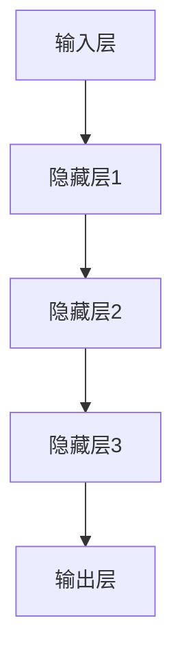

### 2.2 大模型训练方法

大模型的训练方法主要包括前向传播和反向传播。前向传播用于计算神经网络各层的输出，反向传播用于更新网络参数。

```mermaid
graph TD
A[输入] --> B{前向传播}
B --> C[计算损失}
C --> D{反向传播}
D --> E[更新参数]
```

### 2.3 大模型推理与部署

大模型的推理过程是指在给定输入数据时，通过已经训练好的模型进行预测。部署大模型通常需要考虑计算资源、存储资源和网络带宽等因素。

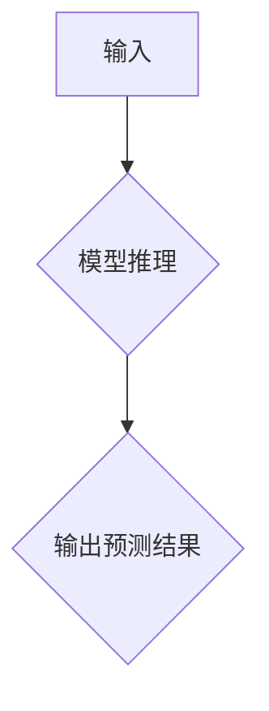

## 第3章：大模型核心算法

### 3.1 自动化机器学习

自动化机器学习（AutoML）旨在自动化大模型的开发过程，包括模型选择、特征工程、超参数优化等。

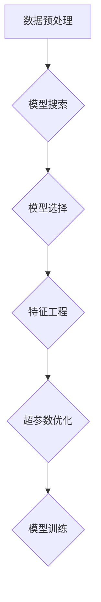

### 3.2 对抗性神经网络

对抗性神经网络（GAN）是一种生成模型，通过生成器（Generator）和判别器（Discriminator）的对抗训练，生成逼真的数据。

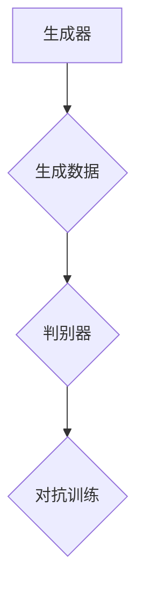

### 3.3 大模型优化算法

大模型优化算法主要包括随机梯度下降（SGD）、Adam优化器等，用于加速大模型的训练过程。

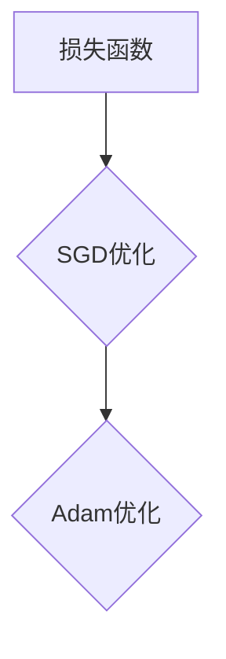

## 第4章：大模型应用场景

### 4.1 图像识别

图像识别是大模型的重要应用场景之一，通过大模型可以实现高精度的图像分类、目标检测、人脸识别等任务。

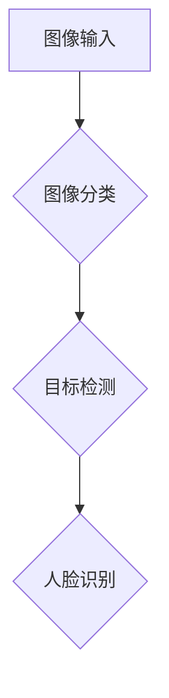

### 4.2 自然语言处理

自然语言处理是大模型的另一个重要应用场景，通过大模型可以实现文本分类、情感分析、机器翻译等任务。

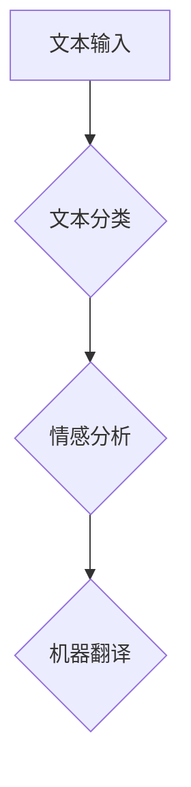

### 4.3 语音识别

语音识别是大模型在语音领域的应用，通过大模型可以实现高精度的语音识别、语音合成等任务。

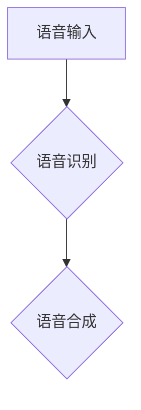

## 第5章：大模型风险与挑战

### 5.1 数据隐私与安全

大模型在训练和推理过程中需要处理大量的敏感数据，因此数据隐私与安全是面临的主要挑战。

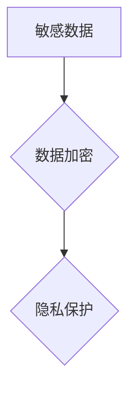

### 5.2 算法公平性与透明度

大模型的算法决策往往涉及社会伦理问题，因此算法公平性与透明度是重要的挑战。

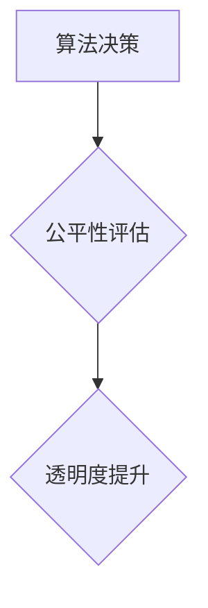

### 5.3 大模型伦理问题

大模型的发展可能引发一系列伦理问题，如数据滥用、算法偏见等，需要引起重视。

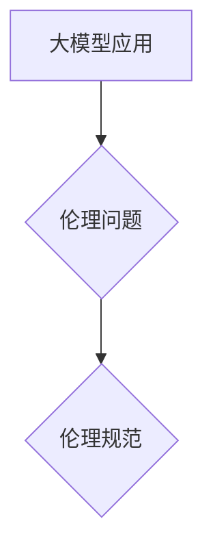

## 第二部分：大模型市场需求分析

### 第6章：市场需求分析

#### 6.1 市场规模与增长趋势

大模型市场的规模持续增长，预计未来几年将保持高速增长。根据市场研究报告，全球大模型市场预计将在2025年达到数十亿美元规模。

#### 6.2 行业应用分析

大模型在各个行业的应用越来越广泛，如金融、医疗、零售、自动驾驶等。特别是在金融领域，大模型在风险控制、信用评估等方面具有显著优势。

#### 6.3 市场竞争格局

大模型市场竞争激烈，主要参与者包括谷歌、微软、亚马逊等国际巨头，以及国内的阿里巴巴、腾讯等。同时，许多初创公司也在大模型领域展开竞争。

## 第7章：市场需求驱动的技术创新

### 7.1 大模型定制化需求

随着大模型在各个领域的应用，用户对于定制化大模型的需求日益增长。定制化大模型能够更好地满足特定应用场景的需求。

### 7.2 大模型融合应用

大模型与其他技术的融合应用，如物联网、区块链等，将进一步推动大模型市场的发展。

### 7.3 大模型产业链构建

大模型产业链的构建将有助于推动大模型市场的快速发展。产业链包括硬件设备、算法研发、数据服务等多个环节。

## 第8章：大模型市场需求案例分析

### 8.1 案例一：人工智能医疗

人工智能医疗是大模型的重要应用场景之一。通过大模型，可以实现疾病诊断、药物研发等任务。

### 8.2 案例二：自动驾驶

自动驾驶领域对大模型的需求日益增长。大模型在图像识别、语音识别等方面发挥着重要作用，有助于提升自动驾驶系统的性能。

### 8.3 案例三：智能制造

智能制造是大模型的重要应用领域之一。通过大模型，可以实现生产过程优化、质量控制等任务。

## 第三部分：大模型技术创新实践

### 第9章：大模型开发与优化

#### 9.1 大模型开发流程

大模型开发流程包括数据收集、数据预处理、模型设计、模型训练、模型评估和模型部署等环节。

#### 9.2 大模型优化方法

大模型优化方法包括超参数调整、数据增强、模型压缩等，以提高模型性能。

#### 9.3 大模型评估与测试

大模型评估与测试包括准确率、召回率、F1分数等指标，用于评估模型性能。

### 第10章：大模型应用实战

#### 10.1 实战一：图像分类

通过TensorFlow实现一个基于卷积神经网络的图像分类模型，用于分类不同类型的图像。

```python
import tensorflow as tf
from tensorflow.keras import layers

# 构建模型
model = tf.keras.Sequential([
    layers.Conv2D(32, (3, 3), activation='relu', input_shape=(28, 28, 1)),
    layers.MaxPooling2D((2, 2)),
    layers.Conv2D(64, (3, 3), activation='relu'),
    layers.MaxPooling2D((2, 2)),
    layers.Conv2D(64, (3, 3), activation='relu'),
    layers.Flatten(),
    layers.Dense(64, activation='relu'),
    layers.Dense(10, activation='softmax')
])

# 编译模型
model.compile(optimizer='adam',
              loss='categorical_crossentropy',
              metrics=['accuracy'])

# 训练模型
model.fit(train_images, train_labels, epochs=5)
```

#### 10.2 实战二：情感分析

通过TensorFlow实现一个基于循环神经网络的文本情感分析模型，用于判断文本的情感极性。

```python
import tensorflow as tf
from tensorflow.keras import layers, models

# 构建模型
model = models.Sequential()
model.add(layers.Embedding(vocab_size, embedding_dim))
model.add(layers.LSTM(64))
model.add(layers.Dense(1, activation='sigmoid'))

# 编译模型
model.compile(optimizer='adam',
              loss='binary_crossentropy',
              metrics=['accuracy'])

# 训练模型
model.fit(x_train, y_train, epochs=10, batch_size=32)
```

#### 10.3 实战三：智能问答

通过TensorFlow实现一个基于生成对抗网络的智能问答模型，用于回答用户的问题。

```python
import tensorflow as tf
from tensorflow.keras import layers

# 构建生成器
generator = tf.keras.Sequential([
    layers.Dense(units=50, activation='relu', input_shape=(300,)),
    layers.Dense(units=200, activation='relu'),
    layers.Dense(units=1000, activation='softmax')
])

# 构建判别器
discriminator = tf.keras.Sequential([
    layers.Dense(units=50, activation='relu', input_shape=(300,)),
    layers.Dense(units=200, activation='relu'),
    layers.Dense(units=1, activation='sigmoid')
])

# 编译模型
discriminator.compile(optimizer='adam',
                      loss='binary_crossentropy')
generator.compile(optimizer='adam',
                  loss='binary_crossentropy')

# 对抗训练
for epoch in range(epochs):
    for _ in range(batch_size):
        noise = np.random.normal(size=(300,))
        generated = generator.predict(noise)
        real_data = np.random.normal(size=(300,))
        discriminator.train_on_batch(real_data, np.ones((batch_size, 1)))
        discriminator.train_on_batch(generated, np.zeros((batch_size, 1)))
    print(f'Epoch {epoch+1}, loss: {discriminator.loss_function(generated, np.zeros((batch_size, 1))).mean()}')
```

### 第11章：大模型部署与运维

#### 11.1 大模型部署策略

大模型部署策略包括云端部署、边缘部署和混合部署等，根据应用场景选择合适的部署方式。

#### 11.2 大模型运维管理

大模型运维管理包括监控、日志记录、故障排除等，确保大模型的稳定运行。

#### 11.3 大模型安全与合规

大模型安全与合规包括数据安全、算法安全、伦理合规等，保障大模型的应用安全。

## 第12章：未来展望与趋势

#### 12.1 大模型技术发展趋势

大模型技术发展趋势包括模型压缩、模型量化、迁移学习等，以提高模型性能和降低计算资源需求。

#### 12.2 大模型市场需求前景

大模型市场需求前景广阔，随着人工智能技术的不断进步，大模型将在更多领域得到广泛应用。

#### 12.3 大模型产业生态构建

大模型产业生态构建包括硬件、算法、数据、应用等环节，形成完整的产业链。

## 作者信息

作者：AI天才研究院/AI Genius Institute & 禅与计算机程序设计艺术 /Zen And The Art of Computer Programming

