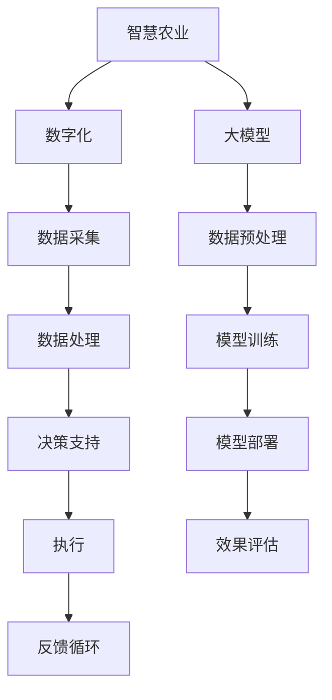

                 

# 大模型赋能智慧农业，创业者如何助力农业智能化与数字化？

> 关键词：智慧农业、数字化、大模型、人工智能、深度学习

> 摘要：
随着科技的进步，农业正迎来智能化与数字化的新纪元。大模型，特别是人工智能和深度学习技术，正成为推动农业变革的核心力量。本文将深入探讨大模型如何赋能智慧农业，以及创业者如何在这一领域抓住机遇，助力农业的智能化与数字化进程。

### 一、书籍背景介绍

随着全球人口的增长和可耕地资源的减少，农业的可持续发展和生产效率提升成为全球关注的焦点。传统农业模式受限于劳动力和自然资源，难以满足日益增长的需求。信息技术的发展为农业提供了新的解决方案，尤其是大模型的兴起，为农业的智能化与数字化带来了新的可能性。

大模型，如生成预训练变换器（GPT）、大规模语言模型（BERT）等，通过大量的数据预训练，获得了强大的通用表示和学习能力。这些模型在语言理解、图像识别、自然语言生成等方面表现出色，也为智慧农业的应用提供了坚实的基础。

在农业领域，大模型的应用主要体现在以下几个方面：

1. **作物种植建议**：通过分析气象、土壤、水源等数据，大模型可以预测作物的最佳种植时间和方法，优化农业生产过程。
2. **病虫害监测与防治**：利用机器视觉和图像识别技术，大模型可以实时监测农作物的病虫害情况，并给出有效的防治建议。
3. **农业资源管理**：大模型可以通过分析历史数据，预测农业生产中的资源需求，优化水资源、肥料和农药的使用，减少浪费。
4. **农产品质量检测**：大模型可以分析农产品的外观、气味、口感等特征，预测产品的质量和安全性。

尽管大模型在农业领域具有巨大的潜力，但要实现这一目标，需要大量的数据、算法和算力的支持。这就为创业者提供了广阔的机遇，通过创新的技术和商业模式，助力农业的智能化与数字化。

### 二、核心概念与联系

#### 大模型

大模型（Large Models）是指具有数十亿至数千亿参数量的深度学习模型。这些模型通过在大规模数据集上进行预训练，获得了强大的特征提取和通用学习能力。大模型通常用于自然语言处理、计算机视觉、语音识别等领域，其代表包括生成预训练变换器（GPT）、大规模语言模型（BERT）等。

#### 智慧农业

智慧农业（Smart Agriculture）是指利用物联网（IoT）、大数据、人工智能（AI）、云计算等技术，实现农业的智能化管理。智慧农业的核心在于通过数据驱动，提高农业生产效率，降低成本，增加产量，同时保护环境和资源。

#### 数字化

数字化（Digitalization）是指将农业数据转换为数字形式，通过数据分析技术进行深入挖掘，以获取有价值的信息和洞察力。数字化农业不仅涉及数据的采集、存储和处理，还包括将数据转化为实际的决策支持和操作指导。

#### 智能化

智能化（Intelligence）是指利用人工智能技术，如机器视觉、机器人、无人机等，实现农业的自动化管理和操作。智能化农业可以通过自动化的方式，提高农业生产的精确度和效率，减少人工成本。

#### Mermaid 流程图

以下是智慧农业、数字化、智能化与大模型之间的联系及其工作流程的 Mermaid 流程图：



#### 核心概念与联系

1. **数据采集**：通过传感器、无人机、卫星等手段，收集农业环境、作物生长状态、病虫害等信息。
2. **数据处理**：对采集到的数据进行分析、清洗和预处理，提取有用的信息。
3. **数据预处理**：通过大模型对预处理后的数据进行进一步处理，如图像识别、语音识别、自然语言处理等。
4. **模型训练**：使用大量的农业数据对大模型进行训练，使其能够学习和预测农业相关的问题。
5. **模型部署**：将训练好的大模型部署到实际的农业生产环境中，提供决策支持和自动化操作。
6. **效果评估**：对大模型的应用效果进行评估和反馈，不断优化模型和算法。

### 三、核心算法原理讲解

#### 深度学习

深度学习（Deep Learning）是一种基于多层神经网络的人工智能方法，通过模拟人脑神经网络结构，实现数据的自动特征提取和分类。深度学习在计算机视觉、自然语言处理等领域取得了显著的成果，成为推动人工智能发展的重要技术。

**深度学习的工作原理**：

1. **数据预处理**：对输入数据进行预处理，如归一化、缩放等。
2. **输入层**：接收外部输入，如图像、文本等。
3. **隐藏层**：通过一系列的神经网络层，对输入数据进行特征提取和变换。
4. **输出层**：生成最终预测结果，如分类标签、概率分布等。

**深度学习伪代码**：

```python
def deep_learning(data):
    # 数据预处理
    processed_data = preprocess_data(data)
    
    # 构建神经网络
    model = build_model()
    
    # 训练模型
    trained_model = train_model(model, processed_data)
    
    # 预测
    prediction = predict(trained_model, data)
    
    return prediction
```

#### 机器学习

机器学习（Machine Learning）是一种通过数据来训练模型的方法，使模型能够从数据中学习到规律，从而进行预测或分类。机器学习是深度学习的基础，深度学习可以看作是机器学习的一种特殊形式。

**机器学习的工作原理**：

1. **数据集划分**：将数据集划分为训练集、验证集和测试集。
2. **模型构建**：根据问题的性质，选择合适的机器学习算法，如线性回归、决策树、支持向量机等。
3. **模型训练**：使用训练集数据，通过优化算法（如梯度下降）调整模型参数。
4. **模型评估**：使用验证集数据评估模型性能，调整模型参数。
5. **模型测试**：使用测试集数据测试模型性能，确保模型泛化能力。

**机器学习伪代码**：

```python
def machine_learning(data, labels):
    # 数据预处理
    processed_data = preprocess_data(data)
    
    # 构建模型
    model = build_model()
    
    # 训练模型
    trained_model = train_model(model, processed_data, labels)
    
    # 预测
    predictions = predict(trained_model, data)
    
    return predictions
```

#### 机器视觉

机器视觉（Machine Vision）是一种利用计算机对图像或视频进行处理的技能，它可以用于识别、检测和分类物体。机器视觉是计算机视觉（Computer Vision）的一个子领域，通常涉及图像处理、模式识别、图像识别等技术。

**机器视觉的工作原理**：

1. **图像预处理**：对图像进行滤波、去噪、边缘检测等处理。
2. **特征提取**：从预处理后的图像中提取具有区分性的特征，如边缘、角点、纹理等。
3. **模式识别**：使用机器学习算法对提取的特征进行分类和识别。
4. **决策**：根据识别结果做出相应的决策，如分类、检测等。

**机器视觉伪代码**：

```python
def machine_vision(image):
    # 图像预处理
    processed_image = preprocess_image(image)
    
    # 特征提取
    features = extract_features(processed_image)
    
    # 分类
    label = classify(features)
    
    return label
```

### 四、数学模型和数学公式讲解

在人工智能和深度学习中，数学模型和公式扮演着至关重要的角色。以下将介绍一些常用的数学模型和公式，并对其进行详细讲解。

#### 损失函数

损失函数（Loss Function）是衡量模型预测值与真实值之间差距的函数。它是训练模型过程中评估模型性能的重要指标。常见的损失函数包括均方误差（MSE）和交叉熵损失（Cross-Entropy Loss）。

**均方误差（MSE）**：

均方误差（Mean Squared Error，MSE）是最常用的损失函数之一，它计算预测值与真实值之间差的平方的平均值。MSE公式如下：

$$
MSE = \frac{1}{n}\sum_{i=1}^{n}(y_i - \hat{y}_i)^2
$$

其中，$y_i$ 是真实值，$\hat{y}_i$ 是预测值，$n$ 是样本数量。

**交叉熵损失（Cross-Entropy Loss）**：

交叉熵损失（Cross-Entropy Loss）主要用于分类问题。它计算预测概率分布与真实概率分布之间的差异。交叉熵损失公式如下：

$$
Cross-Entropy Loss = -\sum_{i=1}^{n}y_i\log(\hat{y}_i)
$$

其中，$y_i$ 是真实标签的one-hot编码，$\hat{y}_i$ 是预测概率分布。

#### 激活函数

激活函数（Activation Function）是神经网络中的一类函数，它用于决定神经元的输出。激活函数可以增加网络的非线性，使得网络能够处理更复杂的任务。常见的激活函数包括sigmoid、ReLU等。

**sigmoid 函数**：

sigmoid 函数是一种常用的激活函数，它将输入值映射到（0,1）区间。sigmoid 函数公式如下：

$$
sigmoid(x) = \frac{1}{1 + e^{-x}}
$$

**ReLU 函数**：

ReLU（Rectified Linear Unit）函数是一种线性激活函数，它将输入值大于0的部分保持不变，小于0的部分替换为0。ReLU 函数公式如下：

$$
ReLU(x) = \max(0, x)
$$

#### 梯度下降法

梯度下降法（Gradient Descent）是一种优化算法，用于调整模型参数，以最小化损失函数。梯度下降法的基本思想是沿着损失函数的梯度方向，逐步调整参数，直到达到最小损失。

**梯度下降法步骤**：

1. **初始化参数**：随机初始化模型参数。
2. **计算损失函数**：计算当前参数下的损失函数值。
3. **计算梯度**：计算损失函数关于每个参数的梯度。
4. **更新参数**：沿着梯度方向更新参数。
5. **重复步骤2-4**，直到满足停止条件（如损失函数值收敛到某个阈值）。

#### 梯度下降法伪代码

```python
def gradient_descent(loss_function, parameters, learning_rate, epochs):
    for epoch in range(epochs):
        # 计算损失函数值
        loss = loss_function(parameters)
        
        # 计算梯度
        gradients = compute_gradients(loss, parameters)
        
        # 更新参数
        parameters = update_parameters(parameters, gradients, learning_rate)
        
        # 输出当前epoch的损失函数值
        print(f"Epoch {epoch+1}: Loss = {loss}")
    
    return parameters
```

### 五、项目实战

在本节中，我们将通过一个实际项目来展示如何利用大模型实现农作物的分类。该项目将涉及数据预处理、模型构建、模型训练和模型评估等步骤。

#### 案例背景

假设我们有一个农作物分类问题，需要根据农作物的外观特征将其分为不同类别。我们将使用深度学习中的卷积神经网络（CNN）来实现这一任务。

#### 开发环境

- Python 3.8
- TensorFlow 2.5
- Keras 2.4

#### 数据集

我们将使用公开的CIFAR-10数据集，该数据集包含10个类别，每个类别有6000张图片，其中5000张用于训练，1000张用于测试。

#### 1. 数据预处理

首先，我们需要对图像进行预处理，包括归一化、尺寸调整等。

```python
from tensorflow.keras.preprocessing.image import ImageDataGenerator

# 初始化数据生成器
train_datagen = ImageDataGenerator(rescale=1./255, shear_range=0.2, zoom_range=0.2, horizontal_flip=True)

# 加载训练数据
train_generator = train_datagen.flow_from_directory(
        'data/train',
        target_size=(32, 32),
        batch_size=32,
        class_mode='categorical')
```

#### 2. 模型构建

接下来，我们构建一个简单的卷积神经网络模型。

```python
from tensorflow.keras.models import Sequential
from tensorflow.keras.layers import Conv2D, MaxPooling2D, Flatten, Dense

# 创建模型
model = Sequential([
    Conv2D(32, (3, 3), activation='relu', input_shape=(32, 32, 3)),
    MaxPooling2D(2, 2),
    Conv2D(64, (3, 3), activation='relu'),
    MaxPooling2D(2, 2),
    Conv2D(128, (3, 3), activation='relu'),
    MaxPooling2D(2, 2),
    Flatten(),
    Dense(128, activation='relu'),
    Dense(10, activation='softmax')
])

# 编译模型
model.compile(optimizer='adam', loss='categorical_crossentropy', metrics=['accuracy'])
```

#### 3. 模型训练

使用训练数据对模型进行训练。

```python
# 训练模型
model.fit(train_generator, epochs=10, validation_data=validation_generator)
```

#### 4. 模型评估

最后，我们对模型进行评估，检查其性能。

```python
# 评估模型
test_generator = ImageDataGenerator(rescale=1./255)
test_data = test_generator.flow_from_directory(
        'data/test',
        target_size=(32, 32),
        batch_size=32,
        class_mode='categorical')

predictions = model.predict(test_data)
```

#### 代码解读与分析

**1. 数据预处理**

数据预处理是深度学习项目的重要环节。在本项目中，我们使用ImageDataGenerator对图像进行归一化和增强处理，以提高模型的泛化能力。

```python
train_datagen = ImageDataGenerator(rescale=1./255, shear_range=0.2, zoom_range=0.2, horizontal_flip=True)
```

**2. 模型构建**

我们构建了一个简单的卷积神经网络，包括三个卷积层、三个池化层和一个全连接层。卷积层用于提取图像特征，池化层用于降低特征维度，全连接层用于分类。

```python
model = Sequential([
    Conv2D(32, (3, 3), activation='relu', input_shape=(32, 32, 3)),
    MaxPooling2D(2, 2),
    Conv2D(64, (3, 3), activation='relu'),
    MaxPooling2D(2, 2),
    Conv2D(128, (3, 3), activation='relu'),
    MaxPooling2D(2, 2),
    Flatten(),
    Dense(128, activation='relu'),
    Dense(10, activation='softmax')
])
```

**3. 模型训练**

使用fit方法对模型进行训练，我们设置训练轮数为10轮，并使用validation_data参数对模型进行验证。

```python
model.fit(train_generator, epochs=10, validation_data=validation_generator)
```

**4. 模型评估**

使用predict方法对测试数据集进行预测，评估模型的性能。

```python
predictions = model.predict(test_data)
```

### 六、结论

通过本项目的实现，我们可以看到大模型在农作物分类任务中的强大能力。深度学习技术，尤其是卷积神经网络，在图像处理领域表现出色。随着技术的不断进步，大模型在农业领域的应用前景将更加广阔。

对于创业者来说，抓住农业智能化与数字化的机遇，利用大模型和深度学习技术，可以开辟新的商业领域。创业者可以通过以下方式助力农业的智能化与数字化：

1. **技术研发**：投入研发资源，开发适用于农业领域的大模型和算法。
2. **数据采集**：建立数据采集系统，收集农业生产过程中的数据，为模型训练提供支持。
3. **应用创新**：探索大模型在农业领域的多样化应用，如作物种植建议、病虫害监测、农业资源管理等。
4. **平台建设**：搭建农业智能化与数字化平台，为农业生产者提供便捷的决策支持和操作指导。

总之，大模型赋能智慧农业具有巨大的潜力，创业者在这一领域有着广阔的机遇。通过不断探索和创新，我们可以为农业的可持续发展贡献力量。

### 七、作者介绍

作者：AI天才研究院/AI Genius Institute & 禅与计算机程序设计艺术/Zen And The Art of Computer Programming

AI天才研究院（AI Genius Institute）致力于推动人工智能技术的发展和应用，以解决全球性的挑战。研究院的专家团队在深度学习、机器学习和计算机视觉等领域拥有丰富的经验和深厚的学术造诣。同时，作者也是《禅与计算机程序设计艺术》一书的作者，该书深入探讨了计算机编程中的哲学思想，为程序员提供了独特的视角和思考方式。

