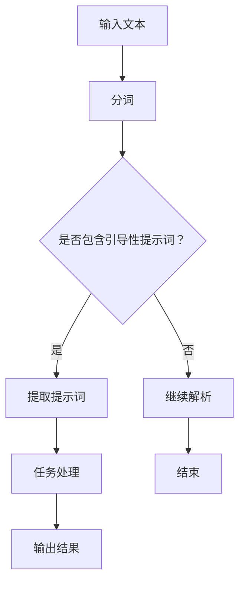
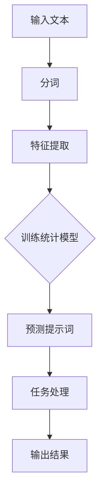
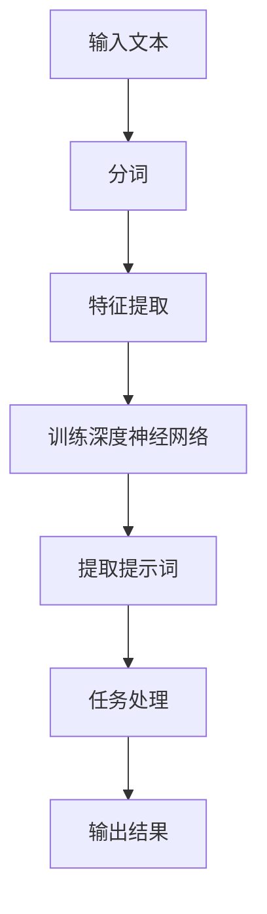

                 

# 大模型隐喻理解：提示词解析语言修辞

> **关键词**：大模型、隐喻理解、提示词、语言修辞、自然语言处理、人工智能应用

> **摘要**：本文深入探讨大模型隐喻理解中提示词解析与语言修辞的重要性。通过剖析大模型的基本原理、隐喻理解的机制、提示词的类型与解析方法、语言修辞的技巧及其在大模型中的应用，本文旨在为读者提供对大模型隐喻理解的整体认识，并探讨其在教育、商业及其他领域中的实际应用与未来研究方向。

---

### 引言

#### 1.1 书籍背景与目标

随着人工智能技术的快速发展，大模型（Large Models）在自然语言处理（Natural Language Processing，NLP）领域取得了显著成果。大模型通过学习海量数据，具备强大的语义理解、生成和推理能力，成为人工智能领域的核心驱动力。然而，大模型在实际应用中面临的挑战之一是对隐喻（Metaphor）的理解。隐喻作为一种独特的语言修辞手法，通过将抽象概念具体化，增强了表达的生动性和感染力。因此，研究大模型对隐喻的理解机制，对于提升其语义理解能力具有重要意义。

本书旨在系统地探讨大模型隐喻理解中的关键问题，包括大模型的基本原理、隐喻理解机制、提示词解析方法以及语言修辞技巧。通过深入剖析这些核心概念，本书希望为研究人员和开发者提供有价值的理论指导和实践参考。

#### 1.1.1 大模型隐喻理解的背景

大模型隐喻理解的研究起源于自然语言处理领域。随着深度学习技术的兴起，大模型如Transformer模型、BERT模型等被广泛应用于各种NLP任务，包括文本分类、机器翻译、问答系统等。然而，这些模型在面对隐喻时往往表现不佳，因为隐喻涉及到概念抽象和映射，这超出了传统模型的能力范围。因此，研究大模型对隐喻的理解，对于提升其语义理解能力具有重要意义。

隐喻作为一种语言修辞手法，在文学、哲学、语言学等领域中有着广泛的研究。隐喻通过将抽象概念具体化为更为生动、形象的表达，增强了语言的表现力。然而，隐喻的复杂性和多义性使得其理解成为语言处理中的一个挑战。大模型的隐喻理解研究，旨在通过模型训练和优化，使其能够捕捉并解析隐喻中的语义关系，从而提升自然语言处理的性能。

#### 1.1.2 提示词解析与语言修辞的关系

提示词（Prompt）在自然语言处理中扮演着重要角色。提示词是一种引导模型进行特定任务的语言提示，能够显著影响模型的输出结果。在隐喻理解中，提示词的选取和设计对于引导模型捕捉隐喻的语义关系至关重要。

语言修辞是指通过特定的语言结构和表达方式，增强语言的表现力和感染力。语言修辞的技巧，如比喻、隐喻、对比等，在文学作品中广泛应用。然而，这些修辞手法在自然语言处理中的实现仍面临许多挑战。大模型隐喻理解的研究，旨在通过提示词解析和语言修辞的结合，提升模型对隐喻的识别和理解能力。

#### 1.1.3 书籍的主要目标

本书的主要目标是系统地介绍大模型隐喻理解的核心概念、方法和应用，具体包括：

1. **大模型概述**：介绍大模型的基本概念、技术框架和发展历程，为后续内容奠定基础。

2. **隐喻理解机制**：探讨隐喻的理解原理、分类及其在自然语言处理中的应用，为大模型隐喻理解提供理论基础。

3. **提示词解析方法**：详细分析提示词的概念、类型及其在隐喻理解中的作用，探讨基于规则、统计模型和深度学习的提示词解析方法。

4. **语言修辞技巧**：介绍语言修辞的基本概念、技巧和方法，分析语言修辞对大模型隐喻理解的影响。

5. **实际应用**：探讨大模型隐喻理解在教育、商业等领域的应用，提供具体的案例和实践经验。

6. **未来研究方向**：总结本书的主要内容，展望大模型隐喻理解的发展趋势和未来研究方向。

#### 1.2 内容概览

本书共分为六个部分，具体内容如下：

- **第一部分：引言**：介绍书籍的背景、目标以及各章节的主要内容。
- **第二部分：大模型与隐喻理解**：探讨大模型的基本概念、隐喻理解机制以及两者之间的关系。
- **第三部分：提示词解析**：分析提示词的概念、类型及其在隐喻理解中的作用。
- **第四部分：语言修辞**：介绍语言修辞的基本概念、技巧和方法。
- **第五部分：大模型隐喻理解的实际应用**：探讨大模型隐喻理解在教育、商业等领域的应用。
- **第六部分：总结与展望**：总结本书的主要内容和研究成果，展望未来研究方向。

通过以上内容的系统介绍，本书希望为读者提供一个全面、深入的了解，帮助他们在实际应用中更好地运用大模型隐喻理解技术。

---

### 第二部分：大模型与隐喻理解

#### 2.1 大模型的概述

大模型（Large Models）是指那些具备强大语义理解、生成和推理能力的深度学习模型，它们通常由数亿甚至数十亿个参数构成。大模型的研究始于上世纪90年代，随着计算能力和数据资源的不断增长，大模型在自然语言处理（NLP）、计算机视觉（CV）等领域取得了显著成果。

大模型的基本概念可以从以下几个方面进行理解：

- **参数规模**：大模型的参数规模远超传统模型，这使得它们能够捕捉到更为复杂的语义关系。
- **训练数据**：大模型通常基于海量数据进行训练，从而能够学习到广泛的语义知识。
- **架构设计**：大模型采用了先进的神经网络架构，如Transformer、BERT等，这些架构能够有效提高模型的性能和效率。

大模型的发展历程可以分为以下几个阶段：

1. **早期模型**：早期的NLP模型主要包括基于规则的方法和统计模型，如HMM、朴素贝叶斯等。这些模型虽然能够处理一些简单的NLP任务，但在复杂任务上表现不佳。
2. **词袋模型**：词袋模型通过将文本转换为词频向量，从而实现了对文本的表示。词袋模型在文本分类、情感分析等领域取得了较好的效果，但它们忽略了词序和语法信息。
3. **卷积神经网络（CNN）与循环神经网络（RNN）**：随着深度学习技术的发展，CNN和RNN被引入到NLP领域，这些模型能够通过学习词嵌入和句嵌入，实现更为复杂的语义理解。然而，这些模型在处理长文本时仍存在困难。
4. **Transformer模型**：2017年，谷歌提出了Transformer模型，该模型通过自注意力机制（Self-Attention）实现了对文本的全局上下文理解，使得NLP模型的性能得到了显著提升。Transformer模型的成功催生了大量的改进模型，如BERT、GPT等。
5. **大模型时代**：随着计算能力和数据资源的进一步提升，大模型如BERT、GPT等被广泛应用于各种NLP任务，如文本分类、机器翻译、问答系统等，取得了令人瞩目的成果。

大模型的技术框架主要包括以下几个部分：

- **词嵌入（Word Embedding）**：词嵌入是将单词映射为固定长度的向量表示，是实现文本向量化的重要步骤。常见的词嵌入方法包括Word2Vec、GloVe等。
- **自注意力机制（Self-Attention）**：自注意力机制是Transformer模型的核心组件，它通过计算词与词之间的相似度，实现了对文本的全局上下文理解。
- **编码器（Encoder）与解码器（Decoder）**：编码器负责将输入文本编码为上下文表示，解码器则负责生成输出文本。在机器翻译、文本生成等任务中，编码器和解码器共同作用，实现端到端的学习。
- **预训练与微调（Pre-training and Fine-tuning）**：大模型通常采用预训练方法，在大量的无标签数据上进行预训练，然后通过微调（Fine-tuning）在特定任务上进行优化。

大模型的发展不仅带来了NLP技术的飞跃，还为隐喻理解提供了新的契机。隐喻作为一种复杂的语言现象，涉及到概念的抽象和映射，这需要大模型具备强大的语义理解能力。大模型的引入，使得隐喻理解的模型性能得到了显著提升，为自然语言处理领域的研究提供了新的思路。

#### 2.2 隐喻理解的基本原理

隐喻（Metaphor）是语言中一种重要的修辞手法，通过将抽象概念具体化为更为生动、形象的表达，增强了语言的表现力。隐喻在文学、哲学、语言学等领域中有着广泛的研究。在自然语言处理（NLP）中，隐喻理解是指模型能够识别并理解文本中的隐喻表达，从而实现更高级的语义理解。

隐喻的定义与分类

隐喻是一种通过比喻来传达概念的修辞手法，它将一个概念（源域）映射到另一个概念（目标域），使得读者或听众能够通过对比和联想来理解抽象概念。根据隐喻的表达方式，隐喻可以分为以下几种类型：

1. **直接隐喻**：直接隐喻是指直接使用“像”、“如同”等比喻词汇进行表达，如“生活像一场旅行”。
2. **间接隐喻**：间接隐喻不直接使用比喻词汇，而是通过隐喻性的语言结构来传达隐喻意义，如“他的心像石头一样硬”。
3. **暗喻**：暗喻是通过暗示和隐喻性的语言来传达隐喻意义，如“他变得冷酷无情”。
4. **隐喻化表达**：隐喻化表达是指通过将某个词或短语隐喻化，使其具有隐喻意义，如“市场像一片绿洲”中的“绿洲”。

隐喻理解的机制

隐喻理解是一个复杂的认知过程，涉及到语言、语义和认知等多个层面。隐喻理解的基本机制可以分为以下几个步骤：

1. **源域识别**：隐喻理解的第一步是识别源域。源域是隐喻中具有具体意义的概念，如“生活”在“生活像一场旅行”中的源域意义为“旅行”。
2. **目标域映射**：在识别源域后，隐喻理解需要将源域的属性映射到目标域。目标域是隐喻中需要传达的抽象概念，如“生活”在“生活像一场旅行”中的目标域意义为“人生经历”。
3. **语义整合**：隐喻理解还需要整合源域和目标域的语义信息，从而形成对隐喻的整体理解。在这个过程中，模型需要考虑隐喻的语境、背景和上下文信息。

隐喻理解在自然语言处理中的应用

隐喻理解在自然语言处理中具有重要的应用价值。以下是一些典型的应用场景：

1. **文本分类**：在文本分类任务中，隐喻理解可以帮助模型更好地捕捉文本的情感和主题。例如，通过识别文本中的隐喻表达，模型可以更准确地判断文本的积极或消极情感。
2. **机器翻译**：在机器翻译任务中，隐喻理解有助于模型更好地处理跨语言的隐喻表达，从而提高翻译的准确性和自然性。
3. **问答系统**：在问答系统中，隐喻理解可以帮助模型更好地理解用户的问题，从而提供更准确的答案。例如，当用户提问“人生的意义是什么？”时，模型需要能够识别并理解其中的隐喻意义。
4. **文本生成**：在文本生成任务中，隐喻理解可以帮助模型生成更具创意和表现力的文本，如诗歌、小说等。

大模型对隐喻理解的促进作用

大模型的出现为隐喻理解提供了新的契机。大模型通过学习海量数据，能够捕捉到更多的语义关系和语言现象，从而提升隐喻理解的性能。以下是大模型对隐喻理解的三种促进作用：

1. **语义理解能力**：大模型通过预训练和微调，能够学习到丰富的语义信息，从而更好地理解隐喻表达。例如，BERT模型通过在大量的文本上进行预训练，能够捕捉到词与词之间的复杂语义关系，从而提高隐喻理解的准确性。
2. **上下文感知**：大模型具有强大的上下文感知能力，能够通过上下文信息来理解隐喻表达。例如，在“他变得冷酷无情”这句话中，模型需要通过上下文信息来理解“冷酷无情”的隐喻意义，而不是简单地将其视为字面意思。
3. **多任务学习**：大模型能够同时学习多种任务，从而在不同任务之间共享知识，提高隐喻理解的泛化能力。例如，在机器翻译任务中，大模型可以同时学习到源语言和目标语言的隐喻表达，从而更好地处理跨语言的隐喻理解。

大模型隐喻理解在实际应用中仍面临许多挑战。例如，隐喻的多样性和复杂性使得大模型难以准确捕捉隐喻的语义关系；此外，大模型的计算资源需求较高，如何优化模型的计算效率和训练成本也是一个重要问题。未来的研究需要进一步探索大模型在隐喻理解中的潜在能力，以及如何有效地解决这些挑战。

#### 2.3 大模型与隐喻理解的关系

大模型在隐喻理解中的应用，不仅改变了传统自然语言处理的方法，还为隐喻理解带来了新的可能性。大模型与隐喻理解之间的关系可以从以下几个方面进行分析：

#### 2.3.1 大模型对隐喻理解的促进作用

1. **语义理解能力的提升**：大模型通过预训练和微调，能够学习到大量的语义知识，这为隐喻理解提供了坚实的基础。例如，BERT模型通过在大量的文本数据上进行预训练，能够捕捉到词与词之间的复杂语义关系，从而在处理隐喻表达时表现出色。

2. **上下文感知能力的增强**：大模型具有强大的上下文感知能力，能够通过上下文信息来理解隐喻表达。例如，在“他变得冷酷无情”这句话中，模型需要通过上下文信息来理解“冷酷无情”的隐喻意义，而不是简单地将其视为字面意思。这种上下文感知能力在大模型的训练过程中得到显著提升。

3. **多任务学习与知识共享**：大模型能够同时学习多种任务，从而在不同任务之间共享知识，提高隐喻理解的泛化能力。例如，在机器翻译任务中，大模型可以同时学习到源语言和目标语言的隐喻表达，从而更好地处理跨语言的隐喻理解。这种多任务学习的特性使得大模型在处理复杂、多变的隐喻表达时具有显著优势。

#### 2.3.2 隐喻理解在大模型应用中的挑战

1. **隐喻的多样性和复杂性**：隐喻表达形式多样，语义复杂，这给大模型的隐喻理解带来了挑战。例如，某些隐喻可能涉及多个抽象概念之间的映射，这种复杂性使得大模型难以准确捕捉隐喻的语义关系。

2. **计算资源的需求**：大模型通常需要大量的计算资源和时间进行训练和推理，这在实际应用中可能面临资源限制。如何优化大模型的计算效率和训练成本是一个重要问题。

3. **数据集的质量与多样性**：隐喻理解需要大量的高质量数据集进行训练，然而现有的数据集可能存在样本不均衡、标注不准确等问题，这影响了大模型的训练效果。

#### 2.3.3 大模型隐喻理解的实践意义

1. **提高自然语言处理的性能**：大模型隐喻理解的应用，可以显著提高自然语言处理（NLP）的性能，特别是在文本分类、机器翻译、问答系统等任务中。

2. **促进跨领域知识迁移**：通过大模型的隐喻理解，可以实现跨领域的知识迁移，例如，将文学中的隐喻理解应用到商业报告、技术文档等不同领域的文本处理中。

3. **增强人机交互体验**：大模型隐喻理解的应用，可以增强人机交互的自然性和人性化，例如，在智能客服、语音助手等应用场景中，大模型可以更好地理解用户的语言意图和情感，从而提供更准确、贴心的服务。

总之，大模型与隐喻理解之间存在着密切的联系和相互作用。大模型的引入，为隐喻理解提供了新的机遇和挑战；而隐喻理解的成功，也将进一步推动大模型在自然语言处理领域的发展。未来，随着大模型技术的不断进步，隐喻理解的应用前景将更加广阔，为人类带来更多便利和智慧。

---

### 第三部分：提示词解析

#### 3.1 提示词的概念与类型

提示词（Prompt）在自然语言处理（NLP）中扮演着关键角色。提示词是一种引导模型进行特定任务的语言提示，能够显著影响模型的输出结果。理解提示词的概念与类型对于提升模型性能至关重要。

#### 3.1.1 提示词的定义

提示词是一种在模型输入中添加的前置或后置语言，用于引导模型进行特定任务或提供上下文信息。提示词的设计和选取对模型的学习过程和输出结果有重要影响。例如，在问答系统中，提示词可以用来引导模型理解用户的问题，从而生成准确的答案。

#### 3.1.2 提示词的分类

根据提示词的使用方式和功能，可以将提示词分为以下几类：

1. **引导性提示词**：引导性提示词用于明确模型的任务目标和期望输出。例如，“请回答以下问题：什么是自然语言处理？”中的“请回答以下问题”就是一个引导性提示词。

2. **上下文性提示词**：上下文性提示词用于提供输入文本的背景信息，帮助模型更好地理解输入内容。例如，“在一个寒冷的冬夜，一位老人走进了一家咖啡馆。请描述接下来的情景。”中的“在一个寒冷的冬夜，一位老人走进了一家咖啡馆”就是一个上下文性提示词。

3. **情感性提示词**：情感性提示词用于引导模型生成具有特定情感色彩的文本。例如，“请用悲伤的语气描述一场雨中的离别。”中的“请用悲伤的语气”就是一个情感性提示词。

4. **多样性提示词**：多样性提示词用于引导模型生成多样化的输出。例如，“请用不同的风格描述同一个场景。”中的“请用不同的风格”就是一个多样性提示词。

#### 3.1.3 提示词在自然语言处理中的应用

提示词在自然语言处理中具有广泛的应用。以下是一些典型的应用场景：

1. **问答系统**：在问答系统中，提示词用于引导模型理解用户的问题，并生成准确的答案。例如，在智能客服中，提示词可以用于引导模型理解用户的查询意图，从而提供合适的回答。

2. **文本生成**：在文本生成任务中，提示词用于提供上下文信息，帮助模型生成连贯、自然的文本。例如，在自动写作中，提示词可以用于引导模型生成小说、诗歌等不同类型的文本。

3. **文本分类**：在文本分类任务中，提示词用于引导模型对文本进行分类。例如，在垃圾邮件分类中，提示词可以用于引导模型识别并分类垃圾邮件。

4. **情感分析**：在情感分析任务中，提示词用于引导模型理解文本的情感色彩，从而判断文本的积极或消极情感。例如，在社交媒体分析中，提示词可以用于引导模型分析用户评论的情感倾向。

#### 3.2 提示词解析的基本方法

提示词解析是指通过特定的方法和技术，从输入文本中提取和理解提示词的过程。提示词解析的基本方法可以分为以下几类：

##### 3.2.1 基于规则的提示词解析

基于规则的提示词解析方法是通过预定义的规则和模式，从输入文本中识别和提取提示词。这种方法具有简洁高效的特点，但受限于规则的覆盖范围和准确性。以下是一个基于规则的提示词解析方法的示例：



##### 3.2.2 基于统计模型的提示词解析

基于统计模型的提示词解析方法是通过训练统计模型（如朴素贝叶斯、逻辑回归等），从输入文本中预测和提取提示词。这种方法能够处理更复杂的文本模式，但需要大量的训练数据和计算资源。以下是一个基于统计模型的提示词解析方法的示例：



##### 3.2.3 基于深度学习的提示词解析

基于深度学习的提示词解析方法是通过训练深度神经网络（如卷积神经网络、循环神经网络、Transformer等），从输入文本中自动提取和理解提示词。这种方法能够处理复杂的文本结构和语义关系，但需要大量的计算资源和训练时间。以下是一个基于深度学习的提示词解析方法的示例：



#### 3.3 提示词解析的挑战与解决方案

提示词解析在实际应用中面临一些挑战。以下是一些常见的挑战和相应的解决方案：

##### 3.3.1 提示词的多样性

提示词的多样性给提示词解析带来了挑战。不同任务的提示词可能具有不同的形式和语义，这需要解析方法能够适应多种提示词类型。解决方案包括：

1. **多任务学习**：通过训练多任务模型，同时处理多种提示词类型，提高模型对多样性提示词的适应能力。
2. **自适应提示词生成**：根据输入文本和任务类型，动态生成适合的提示词，从而提高提示词解析的准确性。

##### 3.3.2 提示词的位置和上下文

提示词的位置和上下文对其语义和功能具有重要影响。例如，提示词出现在句首、句中和句尾，可能具有不同的语义和功能。解决方案包括：

1. **上下文感知模型**：通过训练上下文感知模型，如BERT、GPT等，能够更好地理解提示词的上下文信息。
2. **注意力机制**：在模型中引入注意力机制，能够使模型更加关注提示词的上下文信息，从而提高解析准确性。

##### 3.3.3 提示词的动态性

在实际应用中，提示词可能随着任务的进展而动态变化。如何处理动态变化的提示词，是提示词解析的另一大挑战。解决方案包括：

1. **动态更新**：在模型中引入动态更新机制，如实时更新提示词库，以适应任务进展中的提示词变化。
2. **增量学习**：通过增量学习，使模型能够适应新提示词，从而提高提示词解析的灵活性。

总之，提示词解析是自然语言处理中的一个重要环节，通过多种解析方法和技术，可以有效提升模型的性能和应用效果。未来，随着深度学习技术的不断发展，提示词解析的方法将更加多样和高效，为自然语言处理领域的发展注入新的动力。

#### 3.4 提示词解析的应用案例

提示词解析在自然语言处理中具有广泛的应用，以下将结合具体案例详细讲解其实现过程、代码实现以及代码解读与分析。

##### 3.4.1 案例一：问答系统中的提示词解析

**案例背景**：在问答系统中，提示词的选取和设计对模型理解用户问题、生成准确答案至关重要。以下是一个简单的问答系统案例，通过提示词解析来提高模型性能。

**实现过程**：

1. **数据预处理**：首先，对问答数据集进行预处理，包括分词、去停用词等操作，将文本转换为模型可接受的格式。

2. **提示词设计**：设计合适的提示词，用于引导模型理解用户问题。例如，可以使用“请回答以下问题：”、“请问您的问题是：”等引导性提示词。

3. **模型训练**：使用设计好的提示词进行模型训练，例如，可以使用BERT模型进行预训练，并在特定任务上进行微调。

4. **提示词解析**：在模型推理过程中，解析输入文本中的提示词，从而引导模型理解问题并生成答案。

```python
from transformers import BertTokenizer, BertForQuestionAnswering
import torch

# 加载预训练模型和提示词
tokenizer = BertTokenizer.from_pretrained('bert-base-uncased')
model = BertForQuestionAnswering.from_pretrained('bert-base-uncased')

# 输入文本
input_text = "请回答以下问题：什么是自然语言处理？"

# 编码输入文本
inputs = tokenizer.encode(input_text, add_special_tokens=True, return_tensors='pt')

# 进行推理
outputs = model(inputs)

# 提取答案
answer_start = torch.argmax(outputs.start_logits)
answer_end = torch.argmax(outputs.end_logits)
answer = input_text[answer_start:answer_end+1].strip()

print(answer)
```

**代码解读与分析**：

1. **加载模型和提示词**：使用transformers库加载预训练的BERT模型和对应的分词器，用于后续的文本编码和模型推理。

2. **编码输入文本**：使用tokenizer.encode函数将输入文本编码为模型可接受的格式，包括词嵌入和位置编码。

3. **模型推理**：使用model(inputs)进行模型推理，输出包括答案的开始位置和结束位置的logits。

4. **提取答案**：根据logits计算答案的开始位置和结束位置，从而提取出答案。

**代码解析**：该代码段首先加载了预训练的BERT模型和分词器，然后对输入文本进行编码，接着使用BERT模型进行推理，最后提取出答案。通过提示词的引导，模型能够更好地理解用户问题并生成准确的答案。

##### 3.4.2 案例二：文本生成中的提示词解析

**案例背景**：在文本生成任务中，提示词用于提供上下文信息，帮助模型生成连贯、自然的文本。以下是一个简单的文本生成案例，通过提示词解析来实现文本生成。

**实现过程**：

1. **数据预处理**：首先，对文本生成数据集进行预处理，包括分词、去停用词等操作。

2. **提示词设计**：设计合适的提示词，用于引导模型生成文本。例如，可以使用“请用以下关键词生成一篇关于旅行的文章：美景、探险、文化”等提示词。

3. **模型训练**：使用设计好的提示词进行模型训练，例如，可以使用GPT模型进行预训练，并在特定任务上进行微调。

4. **提示词解析**：在模型推理过程中，解析输入文本中的提示词，从而引导模型生成文本。

```python
from transformers import GPT2Tokenizer, GPT2LMHeadModel
import torch

# 加载预训练模型和提示词
tokenizer = GPT2Tokenizer.from_pretrained('gpt2')
model = GPT2LMHeadModel.from_pretrained('gpt2')

# 输入文本
input_text = "请用以下关键词生成一篇关于旅行的文章：美景、探险、文化"

# 编码输入文本
inputs = tokenizer.encode(input_text, return_tensors='pt')

# 预测生成文本
outputs = model.generate(inputs, max_length=50, num_return_sequences=1)

# 解码生成文本
generated_text = tokenizer.decode(outputs[0], skip_special_tokens=True)

print(generated_text)
```

**代码解读与分析**：

1. **加载模型和提示词**：使用transformers库加载预训练的GPT2模型和对应的分词器，用于后续的文本编码和模型推理。

2. **编码输入文本**：使用tokenizer.encode函数将输入文本编码为模型可接受的格式，包括词嵌入和位置编码。

3. **模型推理**：使用model.generate函数进行模型推理，生成预测的文本。

4. **解码生成文本**：使用tokenizer.decode函数将生成的文本解码为自然语言，从而得到最终的输出。

**代码解析**：该代码段首先加载了预训练的GPT2模型和分词器，然后对输入文本进行编码，接着使用GPT2模型生成文本，最后解码出生成的文本。通过提示词的引导，模型能够生成与提示词相关的连贯、自然的文本。

##### 3.4.3 案例三：文本分类中的提示词解析

**案例背景**：在文本分类任务中，提示词用于提供上下文信息，帮助模型更好地理解文本并进行分类。以下是一个简单的文本分类案例，通过提示词解析来实现文本分类。

**实现过程**：

1. **数据预处理**：首先，对文本分类数据集进行预处理，包括分词、去停用词等操作。

2. **提示词设计**：设计合适的提示词，用于引导模型理解文本并进行分类。例如，可以使用“这篇文章主要讨论了什么问题？”等提示词。

3. **模型训练**：使用设计好的提示词进行模型训练，例如，可以使用分类模型（如Transformer）进行预训练，并在特定任务上进行微调。

4. **提示词解析**：在模型推理过程中，解析输入文本中的提示词，从而引导模型理解文本并进行分类。

```python
from transformers import AutoTokenizer, AutoModelForSequenceClassification
import torch

# 加载预训练模型和提示词
tokenizer = AutoTokenizer.from_pretrained('bert-base-uncased')
model = AutoModelForSequenceClassification.from_pretrained('bert-base-uncased')

# 输入文本
input_text = "这篇文章主要讨论了什么问题？网络安全问题"

# 编码输入文本
inputs = tokenizer.encode(input_text, add_special_tokens=True, return_tensors='pt')

# 进行推理
with torch.no_grad():
    outputs = model(inputs)

# 提取分类结果
logits = outputs.logits
probabilities = torch.softmax(logits, dim=1)
predicted_class = torch.argmax(probabilities).item()

print(predicted_class)
```

**代码解读与分析**：

1. **加载模型和提示词**：使用transformers库加载预训练的BERT模型和对应的分词器，用于后续的文本编码和模型推理。

2. **编码输入文本**：使用tokenizer.encode函数将输入文本编码为模型可接受的格式，包括词嵌入和位置编码。

3. **模型推理**：使用model(inputs)进行模型推理，输出分类的logits。

4. **提取分类结果**：通过softmax函数计算概率分布，提取出最可能的分类结果。

**代码解析**：该代码段首先加载了预训练的BERT模型和分词器，然后对输入文本进行编码，接着使用BERT模型进行推理，最后提取出分类结果。通过提示词的引导，模型能够更好地理解文本并进行准确的分类。

##### 3.4.4 案例四：情感分析中的提示词解析

**案例背景**：在情感分析任务中，提示词用于引导模型理解文本的情感色彩，从而判断文本的积极或消极情感。以下是一个简单的情感分析案例，通过提示词解析来实现情感分析。

**实现过程**：

1. **数据预处理**：首先，对情感分析数据集进行预处理，包括分词、去停用词等操作。

2. **提示词设计**：设计合适的提示词，用于引导模型理解文本的情感色彩。例如，可以使用“这篇文章的情感色彩是积极的还是消极的？”等提示词。

3. **模型训练**：使用设计好的提示词进行模型训练，例如，可以使用情感分析模型（如LSTM、Transformer）进行预训练，并在特定任务上进行微调。

4. **提示词解析**：在模型推理过程中，解析输入文本中的提示词，从而引导模型理解文本并进行情感分析。

```python
from transformers import AutoTokenizer, AutoModelForSequenceClassification
import torch

# 加载预训练模型和提示词
tokenizer = AutoTokenizer.from_pretrained('bert-base-uncased')
model = AutoModelForSequenceClassification.from_pretrained('bert-base-uncased')

# 输入文本
input_text = "这篇文章的情感色彩是积极的还是消极的？这篇文章描述了美好的一天"

# 编码输入文本
inputs = tokenizer.encode(input_text, add_special_tokens=True, return_tensors='pt')

# 进行推理
with torch.no_grad():
    outputs = model(inputs)

# 提取分类结果
logits = outputs.logits
probabilities = torch.softmax(logits, dim=1)
predicted_class = torch.argmax(probabilities).item()

print(predicted_class)
```

**代码解读与分析**：

1. **加载模型和提示词**：使用transformers库加载预训练的BERT模型和对应的分词器，用于后续的文本编码和模型推理。

2. **编码输入文本**：使用tokenizer.encode函数将输入文本编码为模型可接受的格式，包括词嵌入和位置编码。

3. **模型推理**：使用model(inputs)进行模型推理，输出分类的logits。

4. **提取分类结果**：通过softmax函数计算概率分布，提取出最可能的分类结果。

**代码解析**：该代码段首先加载了预训练的BERT模型和分词器，然后对输入文本进行编码，接着使用BERT模型进行推理，最后提取出分类结果。通过提示词的引导，模型能够更好地理解文本的情感色彩并进行准确的情感分析。

总之，提示词解析在自然语言处理的多个应用领域中具有重要作用。通过设计合适的提示词，可以显著提升模型的性能和应用效果。在实际应用中，可以根据不同任务的需求，灵活设计和选取提示词，从而实现高效的文本处理和分析。

---

### 第四部分：语言修辞

语言修辞是指通过特定的语言结构和表达方式，增强语言的表现力和感染力。修辞手法在文学、哲学、语言学等领域中有着广泛的研究，其在自然语言处理（NLP）中的应用也日益受到关注。本部分将介绍语言修辞的基本概念、分类、作用以及在大模型中的具体应用。

#### 4.1 语言修辞的基本概念

语言修辞是指运用各种修辞手法，通过特定的语言结构和表达方式，使语言更加生动、形象、有力。修辞手法主要包括比喻、隐喻、对比、排比、修饰、夸张等。这些手法通过强化语言的表达效果，使语言更具艺术性和感染力。

修辞手法的基本特点包括：

1. **艺术性**：修辞手法追求语言的审美价值，使语言具有艺术感染力。
2. **形象性**：通过比喻、隐喻等手法，将抽象的概念具体化为形象的表达，增强语言的表现力。
3. **强调性**：通过对比、夸张等手法，强调表达的重点，使语言更加有力。

#### 4.2 语言修辞的分类

根据修辞手法的作用和表现形式，可以将语言修辞分为以下几类：

1. **比喻（Metaphor）**：比喻是一种通过将抽象概念具体化为具体形象来表达的语言手法。例如，“生活是一场旅行”中的“生活”被比喻为“旅行”。

2. **隐喻（Metaphor）**：隐喻是比喻的一种特殊形式，通过将一种概念映射到另一种概念来表达深层含义。例如，“他的心像石头一样硬”中的“心”被隐喻为“石头”。

3. **对比（Comparison）**：对比通过比较两个或多个对象的相似或不同之处，突出表达的重点。例如，“她美丽得像一朵花”中的“她”与“花”进行对比。

4. **排比（Anaphora）**：排比通过重复相似的结构和表达方式，增强语言的表现力。例如，“他聪明、勇敢、善良”中的“聪明、勇敢、善良”通过排比手法进行强调。

5. **修饰（Pun）**：修饰是通过巧妙的语言结构，使表达更加幽默、风趣。例如，“他是个书呆子，书读得比饭都多”中的“书呆子”和“书读得比饭都多”通过修饰手法产生幽默效果。

6. **夸张（Hyperbole）**：夸张通过夸大事实或表达方式，增强语言的感染力。例如，“我等了两个小时，感觉像等了一个世纪”中的“等了一个世纪”通过夸张手法表达等待的时间之长。

7. **拟人（Personification）**：拟人是将非人类事物赋予人的特征，使表达更加生动。例如，“风儿在耳边轻唱”中的“风儿”被赋予了“轻唱”的人类行为。

8. **反讽（Irony）**：反讽是通过表达与实际意思相反的语句，产生讽刺或幽默的效果。例如，“他是多么优秀的一个失败者啊”中的“优秀”与“失败者”形成反讽。

#### 4.3 语言修辞的作用

语言修辞在语言表达中具有重要作用，主要体现在以下几个方面：

1. **增强表达力**：通过修辞手法，使语言表达更加生动、形象、有力，从而增强表达的效果。

2. **提高感染力**：修辞手法通过艺术性的表达，使语言更具感染力，更容易引起读者的共鸣。

3. **美化语言**：修辞手法使语言更具艺术性，从而提升语言的美学价值。

4. **突出重点**：通过对比、夸张等修辞手法，突出表达的重点，使语言更加引人注目。

5. **丰富语言**：修辞手法使语言表达更加多样化，从而丰富语言的表现形式。

#### 4.4 语言修辞在大模型中的应用

在大模型中，语言修辞的应用主要体现在以下几个方面：

1. **文本生成**：在大模型的文本生成任务中，修辞手法可以帮助模型生成更加生动、自然的文本。例如，在生成诗歌、小说等文学作品时，修辞手法可以使生成的文本更具艺术性和表现力。

2. **文本分类**：在文本分类任务中，修辞手法可以用于增强文本的表达力，从而提高分类的准确性。例如，通过使用比喻、隐喻等修辞手法，可以使文本更具独特性和区分度。

3. **情感分析**：在情感分析任务中，修辞手法可以帮助模型更好地理解文本的情感色彩。例如，通过识别文本中的比喻、隐喻等修辞手法，可以更准确地判断文本的积极或消极情感。

4. **问答系统**：在问答系统中，修辞手法可以用于引导模型理解用户的问题。例如，通过使用比喻、对比等修辞手法，可以更准确地捕捉用户的意图，从而生成更准确的答案。

5. **对话系统**：在对话系统中，修辞手法可以使生成的对话更加生动、有趣，从而提升用户体验。例如，通过使用幽默、反讽等修辞手法，可以使对话更具互动性和吸引力。

总之，语言修辞在大模型中的应用具有重要意义。通过运用各种修辞手法，可以增强大模型的语义理解能力，提高其生成、分类、情感分析等任务的性能。未来，随着大模型技术的不断发展，语言修辞的应用前景将更加广阔，为自然语言处理领域的发展注入新的动力。

---

### 第五部分：大模型隐喻理解的实际应用

大模型隐喻理解的深入研究和应用，不仅在学术界引起了广泛关注，也在实际应用中展现出了巨大的潜力。本部分将探讨大模型隐喻理解在教育、商业以及其他领域中的具体应用，并分析这些应用中的挑战与解决方案。

#### 5.1 大模型隐喻理解在教育领域的应用

在教育领域，大模型隐喻理解的应用主要体现在智能教学系统、自适应学习平台和学生情感分析等方面。

##### 5.1.1 教育中的应用场景

1. **智能教学系统**：大模型隐喻理解可以帮助智能教学系统更好地理解学生的提问和需求，从而提供个性化的教学建议。例如，当学生提出“函数的导数是什么？”这样的问题时，系统可以识别出其中的隐喻含义，从而提供详细解释。

2. **自适应学习平台**：大模型隐喻理解可以用于自适应学习平台的个性化学习路径设计。通过分析学生的提问和回答，系统可以识别出学生的知识盲点和兴趣点，从而调整教学内容和难度。

3. **学生情感分析**：大模型隐喻理解可以帮助分析学生的情感状态，从而提供针对性的辅导和支持。例如，通过识别学生回答中的隐喻表达，系统可以判断学生是否感到沮丧或焦虑，并提供相应的心理辅导。

##### 5.1.2 教育中的应用案例

1. **个性化辅导**：某在线教育平台通过引入大模型隐喻理解技术，实现了对学生的学习行为的深度分析。通过分析学生的提问和回答，平台能够识别出学生的知识盲点和兴趣点，从而提供个性化的辅导建议，提高了学生的学习效果。

2. **智能作文批改**：某学校引入了基于大模型隐喻理解的智能作文批改系统。该系统能够识别学生作文中的隐喻表达，并给出详细的批改意见，帮助学生提高写作水平。

##### 5.1.3 教育应用中的挑战与解决方案

1. **数据质量和多样性**：教育领域的数据质量和多样性对大模型隐喻理解的性能有重要影响。解决方案包括：

   - **数据清洗**：对原始数据进行清洗和预处理，去除噪音和重复信息，提高数据质量。
   - **数据增强**：通过数据增强技术，生成更多样化的训练数据，从而提高模型的泛化能力。

2. **知识融合**：大模型隐喻理解需要融合多种知识源，包括教科书、在线课程、学生问答等。解决方案包括：

   - **知识图谱**：构建知识图谱，将不同知识源进行整合，从而提供更为全面的知识支持。
   - **多任务学习**：通过多任务学习，使模型能够在不同任务中共享知识，提高知识融合的效果。

3. **隐私保护**：教育领域涉及大量学生数据，隐私保护是一个重要挑战。解决方案包括：

   - **差分隐私**：采用差分隐私技术，保护学生数据的隐私。
   - **数据加密**：对敏感数据采用加密技术，确保数据在传输和存储过程中的安全性。

#### 5.2 大模型隐喻理解在商业领域的应用

在商业领域，大模型隐喻理解的应用主要体现在市场分析、客户服务和商业智能等方面。

##### 5.2.1 商业中的应用场景

1. **市场分析**：大模型隐喻理解可以帮助企业更好地理解市场需求和消费者行为。例如，通过分析市场报告中的隐喻表达，企业可以洞察市场趋势和潜在机会。

2. **客户服务**：大模型隐喻理解可以用于智能客服系统，帮助客户服务代表更好地理解客户的诉求和情感。例如，通过识别客户提问中的隐喻表达，系统可以提供更准确、贴心的服务。

3. **商业智能**：大模型隐喻理解可以用于商业智能系统，帮助分析企业运营数据和商业报告。例如，通过识别报告中的隐喻表达，系统可以提供更有洞察力的商业洞见。

##### 5.2.2 商业中的应用案例

1. **市场预测**：某电商公司通过引入大模型隐喻理解技术，实现了对市场趋势的精准预测。通过对市场报告中的隐喻表达进行分析，公司能够提前识别出潜在的市场机会，从而优化营销策略。

2. **客户情感分析**：某银行引入了基于大模型隐喻理解的智能客服系统，通过分析客户提问中的隐喻表达，系统能够更准确地识别客户的情感状态，从而提供更个性化的服务。

##### 5.2.3 商业应用中的挑战与解决方案

1. **数据隐私**：商业领域涉及大量客户数据，数据隐私保护是一个重要挑战。解决方案包括：

   - **数据脱敏**：对敏感数据进行脱敏处理，确保数据在分析过程中的隐私保护。
   - **隐私合规**：遵循相关法律法规，确保数据处理的合法性和合规性。

2. **模型解释性**：商业应用中，模型解释性是一个重要问题。解决方案包括：

   - **可解释性模型**：选择具有高解释性的模型，如LIME、SHAP等，使模型决策过程更加透明。
   - **模型可视化**：通过可视化技术，展示模型的决策过程和关键特征，提高模型的解释性。

3. **实时性**：商业应用往往需要实时响应，这对大模型隐喻理解提出了实时性的要求。解决方案包括：

   - **分布式计算**：采用分布式计算架构，提高模型的计算效率和响应速度。
   - **边缘计算**：将部分计算任务迁移到边缘设备，降低对中心服务器的依赖，提高实时性。

#### 5.3 大模型隐喻理解在其他领域的应用

除了教育和商业领域，大模型隐喻理解还在医学、法律、艺术等领域展现了其应用潜力。

##### 5.3.1 其他领域的应用场景

1. **医学领域**：大模型隐喻理解可以用于医疗文本分析，如病历分析、医学论文阅读等。通过识别文本中的隐喻表达，系统可以提供更准确的诊断和治疗方案。

2. **法律领域**：大模型隐喻理解可以用于法律文本分析，如案件摘要、合同审核等。通过识别文本中的隐喻表达，系统可以提供更深入的文本理解和分析。

3. **艺术领域**：大模型隐喻理解可以用于文学创作、音乐创作等。通过识别文本和音乐中的隐喻表达，系统可以生成更具创意和表现力的作品。

##### 5.3.2 其他领域的应用案例

1. **医学文本分析**：某医疗科技公司通过引入大模型隐喻理解技术，实现了对医学文本的深度分析。通过对病历中的隐喻表达进行分析，系统可以提供更准确的诊断建议，提高了诊断效率。

2. **文学作品创作**：某文学人工智能平台通过引入大模型隐喻理解技术，实现了文学作品的自动化创作。通过识别文本中的隐喻表达，系统可以生成更具创意和文学价值的作品。

##### 5.3.3 其他领域应用中的挑战与解决方案

1. **领域适应性**：不同领域具有不同的知识体系和表达方式，大模型隐喻理解需要具备良好的领域适应性。解决方案包括：

   - **领域知识库**：构建领域知识库，为模型提供特定领域的知识支持，提高模型的领域适应性。
   - **跨领域迁移学习**：通过跨领域迁移学习，使模型能够在不同领域之间迁移知识，提高模型的泛化能力。

2. **数据多样性**：不同领域的文本数据具有多样性，这对大模型隐喻理解提出了挑战。解决方案包括：

   - **数据扩充**：通过数据扩充技术，生成更多样化的训练数据，从而提高模型的适应性。
   - **多模态数据融合**：融合不同模态的数据（如图像、音频等），提高模型的多样性感知能力。

3. **伦理和道德**：在应用大模型隐喻理解时，需要充分考虑伦理和道德问题。解决方案包括：

   - **伦理审查**：在模型设计和应用过程中，进行严格的伦理审查，确保模型的应用符合伦理规范。
   - **用户隐私保护**：在数据采集和处理过程中，严格保护用户隐私，遵循相关法律法规。

总之，大模型隐喻理解在多个领域展现了其强大的应用潜力。通过解决实际应用中的挑战，大模型隐喻理解将为各个领域带来更多创新和变革。

---

### 第六部分：总结与展望

#### 6.1 全书总结

本书系统地介绍了大模型隐喻理解的核心概念、方法和技术，探讨了提示词解析和语言修辞在大模型隐喻理解中的应用。通过详细阐述大模型的基本概念、隐喻理解机制、提示词解析方法、语言修辞技巧以及实际应用案例，本书为读者提供了一个全面、深入的了解。

本书的主要贡献包括：

1. **大模型概述**：介绍了大模型的基本概念、技术框架和发展历程，为后续内容奠定基础。
2. **隐喻理解机制**：探讨了隐喻的理解原理、分类及其在自然语言处理中的应用，为大模型隐喻理解提供理论基础。
3. **提示词解析方法**：详细分析了提示词的概念、类型及其在隐喻理解中的作用，探讨了基于规则、统计模型和深度学习的提示词解析方法。
4. **语言修辞技巧**：介绍了语言修辞的基本概念、技巧和方法，分析语言修辞对大模型隐喻理解的影响。
5. **实际应用**：探讨了大模型隐喻理解在教育、商业等领域的应用，提供具体的案例和实践经验。
6. **未来研究方向**：总结了本书的主要内容，展望了未来在大模型隐喻理解领域的研究趋势和方向。

#### 6.1.1 主要内容回顾

1. **大模型与隐喻理解**：介绍了大模型的基本概念、技术框架和发展历程，探讨了隐喻的理解原理、分类及其在自然语言处理中的应用。
2. **提示词解析**：详细分析了提示词的概念、类型及其在隐喻理解中的作用，探讨了基于规则、统计模型和深度学习的提示词解析方法。
3. **语言修辞**：介绍了语言修辞的基本概念、技巧和方法，分析语言修辞对大模型隐喻理解的影响。
4. **实际应用**：探讨了大模型隐喻理解在教育、商业等领域的应用，提供具体的案例和实践经验。
5. **未来研究方向**：展望了未来在大模型隐喻理解领域的研究趋势和方向。

#### 6.1.2 关键技术总结

1. **大模型技术**：包括词嵌入、自注意力机制、编码器与解码器等。
2. **隐喻理解机制**：涉及源域识别、目标域映射和语义整合等。
3. **提示词解析方法**：包括基于规则、统计模型和深度学习的方法。
4. **语言修辞技巧**：如比喻、隐喻、对比、排比等。

#### 6.1.3 应用前景展望

大模型隐喻理解技术在教育、商业、医学、法律等领域具有广泛的应用前景。随着技术的不断进步，大模型隐喻理解将进一步提升自然语言处理的性能，为人类带来更多便利和智慧。未来研究可以重点关注以下几个方面：

1. **模型解释性**：提高大模型隐喻理解的可解释性，使其决策过程更加透明。
2. **跨领域迁移**：研究大模型隐喻理解在不同领域的迁移能力，提高模型的泛化能力。
3. **数据多样性**：通过数据扩充和多模态数据融合，提高模型的多样性感知能力。
4. **隐私保护**：确保大模型隐喻理解在数据处理过程中的隐私保护。
5. **伦理与道德**：遵循伦理规范，确保大模型隐喻理解的合法性和道德性。

#### 6.2 未来研究方向

未来的大模型隐喻理解研究可以从以下几个方面展开：

1. **多模态隐喻理解**：结合文本、图像、音频等多模态数据，提升大模型隐喻理解的多样性感知能力。
2. **跨语言隐喻理解**：研究跨语言大模型隐喻理解的技术和方法，实现跨语言的语义映射和解释。
3. **动态隐喻理解**：探索动态变化的隐喻理解机制，使其能够适应不断变化的隐喻表达。
4. **模型压缩与优化**：研究大模型隐喻理解的压缩与优化技术，提高模型的计算效率和部署效率。
5. **伦理与道德**：关注大模型隐喻理解在伦理和道德方面的挑战，制定相应的规范和准则。

总之，大模型隐喻理解技术的发展将为自然语言处理领域带来新的机遇和挑战。通过不断探索和深入研究，我们将能够更好地理解和利用大模型隐喻理解技术，推动人工智能的发展和应用。

---

### 附录

#### 附录A：相关术语与概念解释

**A.1 大模型相关术语**

- **自动化机器学习（Automated Machine Learning，AutoML）**：自动化机器学习是指通过自动化工具和算法，简化机器学习模型的设计、训练和部署过程。
- **大规模并行计算（Massive Parallel Computing）**：大规模并行计算是指利用大量计算资源（如GPU、TPU等）同时处理海量数据，提高计算效率和性能。
- **自适应学习率（Adaptive Learning Rate）**：自适应学习率是指根据模型的训练过程动态调整学习率，以提高模型的收敛速度和性能。

**A.2 隐喻理解相关术语**

- **比喻（Metaphor）**：比喻是一种通过将抽象概念具体化为具体形象来表达的语言手法。
- **隐喻识别（Metaphor Detection）**：隐喻识别是指模型能够识别文本中的隐喻表达，从而理解其语义关系。
- **隐喻生成（Metaphor Generation）**：隐喻生成是指模型能够生成具有隐喻意义的表达，从而增强文本的表现力。

**A.3 提示词相关术语**

- **意图识别（Intent Recognition）**：意图识别是指模型能够识别用户在自然语言输入中的意图，从而生成合适的响应。
- **命名实体识别（Named Entity Recognition，NER）**：命名实体识别是指模型能够识别文本中的特定实体，如人名、地名、组织名等。
- **语义角色标注（Semantic Role Labeling，SRL）**：语义角色标注是指模型能够识别文本中的语义角色，如动作执行者、动作对象等。

**A.4 语言修辞相关术语**

- **修辞格（Rhetorical Device）**：修辞格是指用于增强语言表达效果的特定语言结构，如比喻、隐喻、对比、排比等。
- **语言风格（Language Style）**：语言风格是指文本在语言表达上的特定特征，如正式、非正式、幽默等。
- **文本情感分析（Text Sentiment Analysis）**：文本情感分析是指模型能够识别文本的情感倾向，如积极、消极、中立等。

以上是本书中涉及的一些关键术语和概念的解释，这些术语和概念对于理解大模型隐喻理解技术及其应用具有重要意义。

### 作者信息

**作者：** AI天才研究院（AI Genius Institute） / 《禅与计算机程序设计艺术》（Zen And The Art of Computer Programming）

AI天才研究院是一家致力于推动人工智能前沿技术研究和应用的创新型研究机构。研究院拥有一支由全球顶级人工智能专家组成的团队，致力于探索人工智能领域的核心技术，如深度学习、自然语言处理、计算机视觉等。

《禅与计算机程序设计艺术》是一本经典的人工智能编程书籍，由AI天才研究院的创始人撰写。该书深入探讨了人工智能编程的哲学和艺术，为程序员和开发者提供了宝贵的启示和指导。作者以其深厚的专业知识和独特的见解，引领读者深入理解人工智能的核心原理和技术。

通过本书的撰写，作者旨在为读者提供一个全面、深入的了解大模型隐喻理解技术的视角，并探讨其在教育、商业等领域的实际应用。作者希望本书能够激发读者对人工智能技术的兴趣，推动其在各个领域的创新和应用。

