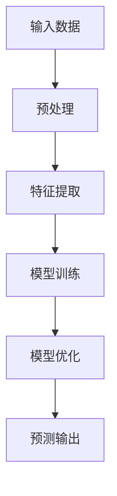
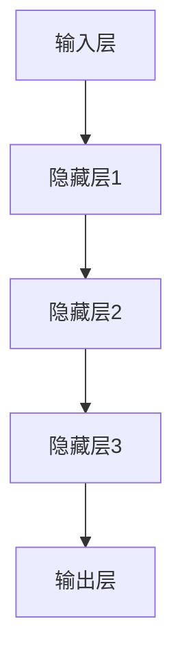

                 

### 大模型：智能时代的商业新模式

关键词：大模型、深度学习、智能商业、消费者行为、供应链管理、技术趋势

摘要：在智能时代，大模型正逐渐成为商业创新的核心驱动力。本文将深入探讨大模型的概念、技术基础及其在市场营销、供应链管理和其他商业领域的广泛应用。通过详细的案例分析、算法原理讲解和项目实战，本文旨在揭示大模型如何重塑商业模式，带来前所未有的机遇和挑战。

## 《大模型：智能时代的商业新模式》目录大纲

### 第一部分：大模型概述与原理

- 第1章：大模型的概念与重要性
  - 1.1.1 大模型的定义与特点
  - 1.1.2 大模型在智能时代的地位
  - 1.1.3 大模型与传统算法的区别

- 第2章：大模型的技术基础
  - 2.1.1 深度学习的基本原理
  - 2.1.2 大模型的训练与优化
  - 2.1.3 大模型的应用场景

### 第二部分：大模型在商业中的应用

- 第3章：大模型在市场营销中的应用
  - 3.1.1 大模型在消费者行为分析中的应用
  - 3.1.2 大模型在市场细分与定位中的应用
  - 3.1.3 大模型在广告投放策略中的应用

- 第4章：大模型在供应链管理中的应用
  - 4.1.1 大模型在需求预测中的应用
  - 4.1.2 大模型在库存管理中的应用
  - 4.1.3 大模型在供应链优化中的应用

- 第5章：大模型在其他商业领域中的应用
  - 5.1.1 大模型在人力资源中的应用
  - 5.1.2 大模型在风险管理中的应用
  - 5.1.3 大模型在其他商业领域的应用前景

### 第三部分：大模型的开发与实战

- 第6章：大模型的开发环境与工具
  - 6.1.1 开发环境搭建
  - 6.1.2 开发工具介绍
  - 6.1.3 大模型开发实践

- 第7章：大模型项目的实施与优化
  - 7.1.1 项目实施步骤
  - 7.1.2 项目优化方法
  - 7.1.3 项目评估与监控

- 第8章：大模型的安全与隐私保护
  - 8.1.1 大模型的安全挑战
  - 8.1.2 大模型的隐私保护
  - 8.1.3 大模型的安全与隐私策略

- 第9章：大模型的发展趋势与未来展望
  - 9.1.1 大模型的发展趋势
  - 9.1.2 大模型在商业中的未来应用
  - 9.1.3 大模型对社会与经济的影响

### 附录

- 附录 A：大模型开发资源与工具集
- 附录 B：大模型项目实战案例

### 引言

在人工智能和深度学习飞速发展的今天，大模型（也被称为巨型模型或大型神经网络模型）正逐步成为技术前沿的重要趋势。大模型在处理大规模数据、进行复杂任务时展现了强大的能力，不仅推动了科学研究的发展，也为商业领域带来了前所未有的变革机遇。本文将围绕大模型的概念、技术基础及其在商业中的应用进行深入探讨，旨在为读者提供全面、系统的理解。

### 文章结构

本文分为三大部分。第一部分将介绍大模型的基本概念、技术基础及其在智能时代的重要性。第二部分将具体分析大模型在市场营销、供应链管理及其他商业领域的应用，通过详细的案例分析和算法讲解，展示大模型如何改变商业运作模式。第三部分将探讨大模型的开发、实施、优化以及安全与隐私保护，并预测其未来发展趋势。

### 第一部分：大模型概述与原理

#### 第1章：大模型的概念与重要性

**1.1.1 大模型的定义与特点**

大模型，即大型神经网络模型，是指具有数十亿至数千亿参数的深度学习模型。与传统的小型模型相比，大模型具有更高的计算复杂度和更强的数据处理能力。其特点包括：

- **参数规模庞大**：大模型拥有数亿至数千亿个参数，这使得它们在处理复杂问题时具有更强的表达能力。
- **强大的数据处理能力**：大模型可以通过分层结构对输入数据进行特征提取和抽象，从而实现对复杂数据的深入理解和分析。
- **自适应学习能力**：大模型具有高度的自适应学习能力，可以自动调整内部参数，以适应不同的任务和数据集。

**Mermaid流程图**：大模型的层次结构与数据处理流程



**伪代码**：大模型的基本工作原理

```python
# 输入数据
data = load_data()

# 特征提取
features = extract_features(data)

# 模型训练
model = train_model(features)

# 模型优化
optimized_model = optimize_model(model)

# 预测输出
predictions = predict(optimized_model, data)
```

**1.1.2 大模型在智能时代的地位**

在智能时代，大模型已成为关键的技术基础。其地位主要体现在以下几个方面：

- **推动科学研究进展**：大模型在自然语言处理、计算机视觉、语音识别等领域取得了显著成果，推动了相关领域的研究进展。
- **赋能商业创新**：大模型为市场营销、供应链管理、风险管理等商业领域提供了新的解决方案，帮助企业提高效率、降低成本。
- **提升人工智能应用水平**：大模型的应用使人工智能系统在复杂任务中表现出色，提高了人工智能的实用性和普及程度。

**数学公式**：大模型在数据处理与预测中的数学模型

$$
\text{预测结果} = \sigma(\text{模型参数} \cdot \text{输入特征} + \text{偏置项})
$$

**举例说明**：大模型在实际应用中的效果展示

- **自然语言处理**：大型语言模型GPT-3在文本生成、翻译、摘要等任务中表现出色，显著提高了自然语言处理系统的性能。
- **计算机视觉**：大型图像识别模型在图像分类、目标检测、图像分割等领域取得了突破性进展，推动了计算机视觉技术的应用。
- **语音识别**：大型语音识别模型在语音识别准确率、识别速度等方面有了显著提升，为语音助手等应用提供了更好的用户体验。

**1.1.3 大模型与传统算法的区别**

大模型与传统算法在以下几个方面存在显著差异：

- **参数规模**：大模型具有数十亿至数千亿参数，而传统算法通常只有数十个至数千个参数。
- **数据处理能力**：大模型可以通过分层结构对输入数据进行特征提取和抽象，而传统算法往往只能处理简单的特征提取。
- **自适应学习能力**：大模型具有高度的自适应学习能力，可以自动调整内部参数，而传统算法通常需要手动调整参数。

**对比分析**：大模型与传统算法的差异与优势

| 对比项 | 大模型 | 传统算法 |
| --- | --- | --- |
| 参数规模 | 数十亿至数千亿参数 | 数十个至数千个参数 |
| 数据处理能力 | 强大的数据处理能力 | 简单的特征提取 |
| 自适应学习能力 | 高度的自适应学习能力 | 需要手动调整参数 |

### 第2章：大模型的技术基础

**2.1.1 深度学习的基本原理**

深度学习是构建大模型的基础。其核心思想是通过多层神经网络对输入数据进行特征提取和抽象，从而实现对复杂数据的理解和预测。

**Mermaid流程图**：神经网络的工作流程



**伪代码**：卷积神经网络与循环神经网络的简单实现

```python
# 卷积神经网络实现
class ConvNeuralNetwork(nn.Module):
    def __init__(self):
        super(ConvNeuralNetwork, self).__init__()
        self.conv1 = nn.Conv2d(1, 32, 3, 1)
        self.fc1 = nn.Linear(32 * 26 * 26, 128)
        self.fc2 = nn.Linear(128, 10)

    def forward(self, x):
        x = F.relu(self.conv1(x))
        x = F.relu(self.fc1(x))
        x = self.fc2(x)
        return x

# 循环神经网络实现
class RNN(nn.Module):
    def __init__(self, input_size, hidden_size, num_layers):
        super(RNN, self).__init__()
        self.hidden_size = hidden_size
        self.num_layers = num_layers
        
        self.rnn = nn.RNN(input_size, hidden_size, num_layers, batch_first=True)
        self.fc = nn.Linear(hidden_size, num_classes)

    def forward(self, x):
        h0 = torch.zeros(self.num_layers, x.size(0), self.hidden_size).to(x.device)
        out, _ = self.rnn(x, h0)
        out = self.fc(out[:, -1, :])
        return out
```

**2.1.2 大模型的训练与优化**

大模型的训练与优化是构建高效大模型的关键步骤。其中，梯度下降算法是最常用的优化策略。

**数学公式**：梯度下降算法与优化策略

$$
\text{参数更新} = \text{参数} - \alpha \cdot \nabla_{\text{损失函数}}(\text{参数})
$$

其中，$\alpha$为学习率，$\nabla_{\text{损失函数}}(\text{参数})$为损失函数关于参数的梯度。

**举例说明**：大模型的训练过程与优化技巧

- **训练过程**：大模型的训练过程通常包括数据预处理、模型初始化、前向传播、反向传播和参数更新等步骤。通过不断的迭代，模型逐渐收敛，达到预期的效果。
- **优化技巧**：在训练过程中，可以采用以下优化技巧提高模型性能：
  - **批量归一化**：通过归一化层将输入数据归一化，加快模型收敛速度。
  - **dropout**：通过随机丢弃部分神经元，防止过拟合。
  - **学习率调整**：根据训练过程动态调整学习率，以提高模型收敛速度和稳定性。

**2.1.3 大模型的应用场景**

大模型具有广泛的应用场景，涵盖了自然语言处理、计算机视觉、语音识别、推荐系统等多个领域。

- **自然语言处理**：大模型在文本生成、翻译、摘要等任务中表现出色，提高了自然语言处理系统的性能。
- **计算机视觉**：大模型在图像分类、目标检测、图像分割等领域取得了突破性进展，推动了计算机视觉技术的应用。
- **语音识别**：大模型在语音识别准确率、识别速度等方面有了显著提升，为语音助手等应用提供了更好的用户体验。
- **推荐系统**：大模型在推荐系统中的应用，可以更好地预测用户偏好，提高推荐系统的准确性和用户体验。
- **医学诊断**：大模型在医学图像分析、疾病诊断等领域发挥了重要作用，有助于提高医疗水平和诊断效率。

### 第二部分：大模型在商业中的应用

#### 第3章：大模型在市场营销中的应用

大模型在市场营销中的应用越来越广泛，为企业的市场策略提供了有力支持。以下将详细介绍大模型在消费者行为分析、市场细分与定位、广告投放策略等方面的应用。

**3.1.1 大模型在消费者行为分析中的应用**

消费者行为分析是市场营销的重要环节，通过分析消费者的行为数据，企业可以更好地了解市场需求，制定针对性的营销策略。大模型在消费者行为分析中具有显著优势。

**伪代码**：消费者行为分析的核心算法实现

```python
# 输入数据：用户行为数据
user_data = load_user_data()

# 特征提取：从用户行为数据中提取关键特征
features = extract_features(user_data)

# 建立大模型
model = build_large_model(input_shape=features.shape)

# 训练大模型
trained_model = train_model(model, features)

# 预测消费者行为
predictions = predict_consumer_behavior(trained_model, user_data)
```

**数学公式**：消费者行为预测的数学模型

$$
\text{消费者行为} = \sigma(\text{模型参数} \cdot \text{特征向量} + \text{偏置项})
$$

**举例说明**：消费者行为分析的实际应用案例

- **电商行业**：电商平台通过分析用户的浏览记录、购买行为等数据，利用大模型预测用户偏好，进行个性化推荐。
- **快消品行业**：快消品企业通过分析消费者的购买历史、购物习惯等数据，利用大模型预测市场需求，调整产品库存。

**3.1.2 大模型在市场细分与定位中的应用**

市场细分与定位是市场营销战略的重要步骤，通过将市场划分为不同的细分市场，企业可以更好地满足不同消费者的需求。大模型在市场细分与定位中具有重要作用。

**举例说明**：市场细分与定位的实际应用案例

- **汽车行业**：汽车制造商通过分析消费者的购车行为、收入水平等数据，利用大模型进行市场细分，制定差异化的营销策略。
- **金融行业**：金融机构通过分析客户的消费行为、信用记录等数据，利用大模型进行客户细分，提供个性化的金融产品和服务。

**数学公式**：市场细分与定位的数学模型

$$
\text{市场细分} = \text{聚类算法}(\text{消费者特征向量})
$$

**伪代码**：市场细分与定位的核心算法实现

```python
# 输入数据：消费者特征数据
consumer_data = load_consumer_data()

# 建立大模型
model = build_large_model(input_shape=consumer_data.shape)

# 训练大模型
trained_model = train_model(model, consumer_data)

# 预测市场细分
market_segments = predict_market_segments(trained_model, consumer_data)
```

**3.1.3 大模型在广告投放策略中的应用**

广告投放策略是市场营销的关键环节，通过有效的广告投放，企业可以吸引更多的潜在客户，提高品牌知名度。大模型在广告投放策略中具有显著优势。

**伪代码**：广告投放策略的核心算法实现

```python
# 输入数据：广告投放数据
advertising_data = load_advertising_data()

# 特征提取：从广告投放数据中提取关键特征
features = extract_features(advertising_data)

# 建立大模型
model = build_large_model(input_shape=features.shape)

# 训练大模型
trained_model = train_model(model, features)

# 预测广告投放效果
advertising_effects = predict_advertising_effects(trained_model, advertising_data)
```

**数学公式**：广告投放效果的预测模型

$$
\text{广告投放效果} = \text{模型参数} \cdot \text{特征向量} + \text{偏置项}
$$

**举例说明**：广告投放策略的实际应用案例

- **互联网行业**：互联网公司通过分析用户行为、广告投放效果等数据，利用大模型预测广告投放效果，优化广告投放策略。
- **零售行业**：零售企业通过分析消费者的购物行为、广告投放效果等数据，利用大模型预测广告投放效果，提高广告投放的ROI。

### 第4章：大模型在供应链管理中的应用

供应链管理是企业运营的重要环节，涉及需求预测、库存管理、供应链优化等方面。大模型在供应链管理中具有广泛的应用，可以显著提高供应链的效率和质量。

**4.1.1 大模型在需求预测中的应用**

需求预测是供应链管理的关键环节，通过准确的需求预测，企业可以优化库存管理、降低库存成本。大模型在需求预测中具有显著优势。

**伪代码**：需求预测的核心算法实现

```python
# 输入数据：历史需求数据
demand_data = load_demand_data()

# 特征提取：从历史需求数据中提取关键特征
features = extract_features(demand_data)

# 建立大模型
model = build_large_model(input_shape=features.shape)

# 训练大模型
trained_model = train_model(model, features)

# 预测未来需求
predicted_demand = predict_future_demand(trained_model, demand_data)
```

**数学公式**：需求预测的数学模型

$$
\text{需求预测} = \text{模型参数} \cdot \text{特征向量} + \text{偏置项}
$$

**举例说明**：需求预测的实际应用案例

- **零售行业**：零售企业通过分析历史销售数据、季节因素等，利用大模型预测未来销售需求，优化库存管理。
- **制造业**：制造企业通过分析生产订单、原材料供应等数据，利用大模型预测生产需求，合理安排生产计划。

**4.1.2 大模型在库存管理中的应用**

库存管理是供应链管理的核心环节，通过合理的库存管理，企业可以降低库存成本、提高资金利用率。大模型在库存管理中具有重要作用。

**举例说明**：库存管理的实际应用案例

- **电商行业**：电商平台通过分析历史销售数据、消费者行为等，利用大模型预测商品需求，合理安排库存。
- **物流行业**：物流企业通过分析运输数据、配送需求等，利用大模型预测库存水平，提高库存周转率。

**数学公式**：库存管理的数学模型

$$
\text{库存水平} = \text{需求预测} \cdot \text{安全库存系数}
$$

**伪代码**：库存管理的核心算法实现

```python
# 输入数据：需求预测数据
predicted_demand = load_predicted_demand()

# 安全库存系数
safety_stock_coefficient = 1.5

# 计算库存水平
inventory_level = predicted_demand * safety_stock_coefficient
```

**4.1.3 大模型在供应链优化中的应用**

供应链优化是提高供应链效率、降低成本的重要手段。大模型在供应链优化中具有广泛的应用，可以显著提高供应链的运作效率。

**伪代码**：供应链优化的核心算法实现

```python
# 输入数据：供应链数据
supply_chain_data = load_supply_chain_data()

# 建立大模型
model = build_large_model(input_shape=supply_chain_data.shape)

# 训练大模型
trained_model = train_model(model, supply_chain_data)

# 优化供应链
optimized_supply_chain = optimize_supply_chain(trained_model, supply_chain_data)
```

**数学公式**：供应链优化的数学模型

$$
\text{供应链成本} = \text{运输成本} + \text{库存成本} + \text{生产成本}
$$

**举例说明**：供应链优化的实际应用案例

- **制造业**：制造企业通过优化供应链网络、降低运输成本，提高生产效率和利润。
- **物流行业**：物流企业通过优化配送路线、提高配送效率，降低物流成本。

### 第5章：大模型在其他商业领域中的应用

大模型在商业领域的应用不仅限于市场营销和供应链管理，还涉及人力资源、风险管理等多个方面。以下将介绍大模型在这些领域的应用。

**5.1.1 大模型在人力资源中的应用**

人力资源是企业发展的核心资源，通过有效的人力资源管理，企业可以提高员工绩效、降低离职率。大模型在人力资源中具有广泛的应用。

**伪代码**：人力资源分析的核心算法实现

```python
# 输入数据：员工数据
employee_data = load_employee_data()

# 特征提取：从员工数据中提取关键特征
features = extract_features(employee_data)

# 建立大模型
model = build_large_model(input_shape=features.shape)

# 训练大模型
trained_model = train_model(model, features)

# 预测员工绩效
predicted_performance = predict_employee_performance(trained_model, employee_data)
```

**数学公式**：员工绩效评估的数学模型

$$
\text{员工绩效} = \text{模型参数} \cdot \text{特征向量} + \text{偏置项}
$$

**举例说明**：人力资源管理的实际应用案例

- **企业招聘**：企业通过分析候选人的简历、面试表现等数据，利用大模型预测候选人未来的工作表现，提高招聘质量。
- **员工培训**：企业通过分析员工的工作表现、培训需求等数据，利用大模型制定个性化的培训计划，提高员工能力。

**5.1.2 大模型在风险管理中的应用**

风险管理是企业运营的重要环节，通过有效的风险管理，企业可以降低风险、提高盈利能力。大模型在风险管理中具有重要作用。

**举例说明**：风险管理的实际应用案例

- **金融行业**：金融机构通过分析客户的信用记录、交易行为等数据，利用大模型预测客户的风险水平，制定风险控制策略。
- **制造行业**：制造企业通过分析生产数据、供应链风险等，利用大模型预测潜在的风险事件，提前采取预防措施。

**数学公式**：风险评估的数学模型

$$
\text{风险评分} = \text{模型参数} \cdot \text{特征向量} + \text{偏置项}
$$

**伪代码**：风险管理的核心算法实现

```python
# 输入数据：风险数据
risk_data = load_risk_data()

# 特征提取：从风险数据中提取关键特征
features = extract_features(risk_data)

# 建立大模型
model = build_large_model(input_shape=features.shape)

# 训练大模型
trained_model = train_model(model, features)

# 风险评估
risk_assessment = predict_risk_level(trained_model, risk_data)
```

**5.1.3 大模型在其他商业领域的应用前景**

随着大模型技术的不断发展，其在其他商业领域的应用前景也十分广阔。

- **医疗健康**：大模型在医学影像分析、疾病预测等领域具有巨大潜力，可以提升医疗诊断的准确性和效率。
- **金融科技**：大模型在信用评估、市场预测等领域具有广泛应用，可以提升金融服务的精准度和风险控制能力。
- **智能交通**：大模型在交通流量预测、车辆路径规划等领域具有重要作用，可以优化交通管理和提高出行效率。

### 第三部分：大模型的开发与实战

#### 第6章：大模型的开发环境与工具

大模型的开发涉及多个技术和工具，包括深度学习框架、数据处理工具、编程语言等。本章节将介绍大模型开发所需的环境和工具。

**6.1.1 开发环境搭建**

搭建大模型开发环境是进行大模型研究的第一步。以下是一个基于Python和TensorFlow的常见开发环境搭建步骤：

1. **安装Python**：下载并安装Python，推荐使用Python 3.7及以上版本。
2. **安装TensorFlow**：通过pip命令安装TensorFlow，命令如下：
   ```shell
   pip install tensorflow
   ```
3. **安装其他依赖库**：安装大模型开发所需的依赖库，如NumPy、Pandas、Matplotlib等。
4. **配置GPU支持**：如果使用GPU进行训练，需要安装CUDA和cuDNN，并配置相应的环境变量。

**6.1.2 开发工具介绍**

以下是几种常见的大模型开发工具及其特点：

- **TensorFlow**：由Google开发，支持多种深度学习模型和算法，具有丰富的API和生态系统。
- **PyTorch**：由Facebook开发，以动态图计算为核心，易于调试和开发。
- **Keras**：是一个基于TensorFlow和Theano的高层次API，简化了深度学习模型的搭建和训练。
- **Scikit-learn**：是一个Python机器学习库，提供了丰富的算法和工具，适用于小规模数据集。

**6.1.3 大模型开发实践**

以下是一个使用TensorFlow搭建和训练大模型的简单示例：

**伪代码**：大模型搭建与训练

```python
import tensorflow as tf
from tensorflow.keras.models import Sequential
from tensorflow.keras.layers import Dense, Conv2D, MaxPooling2D, Flatten

# 定义模型结构
model = Sequential()
model.add(Conv2D(32, (3, 3), activation='relu', input_shape=(28, 28, 1)))
model.add(MaxPooling2D((2, 2)))
model.add(Flatten())
model.add(Dense(128, activation='relu'))
model.add(Dense(10, activation='softmax'))

# 编译模型
model.compile(optimizer='adam', loss='categorical_crossentropy', metrics=['accuracy'])

# 加载数据
(x_train, y_train), (x_test, y_test) = tf.keras.datasets.mnist.load_data()

# 数据预处理
x_train = x_train / 255.0
x_test = x_test / 255.0
x_train = x_train.reshape(-1, 28, 28, 1)
x_test = x_test.reshape(-1, 28, 28, 1)

# 训练模型
model.fit(x_train, y_train, epochs=5, batch_size=64)

# 评估模型
model.evaluate(x_test, y_test)
```

### 第7章：大模型项目的实施与优化

#### 7.1.1 项目实施步骤

大模型项目实施包括以下几个关键步骤：

1. **需求分析**：明确项目目标和需求，确定所需的数据集和模型类型。
2. **数据收集与处理**：收集相关数据，并进行数据清洗、预处理和特征提取。
3. **模型设计**：根据需求设计合适的模型架构，选择合适的算法和优化策略。
4. **模型训练**：使用训练数据进行模型训练，调整模型参数，优化模型性能。
5. **模型评估**：使用验证集和测试集评估模型性能，调整模型结构或参数，以达到最佳效果。
6. **模型部署**：将训练好的模型部署到生产环境，实现模型在实际应用中的价值。

#### 7.1.2 项目优化方法

大模型项目优化主要包括以下几个方面：

1. **数据优化**：通过数据增强、数据预处理等方法提高数据质量，增加模型对数据的适应性。
2. **模型优化**：通过模型架构调整、参数优化等方法提高模型性能，降低过拟合风险。
3. **算法优化**：通过算法改进、并行计算等方法提高模型训练效率，缩短项目周期。

#### 7.1.3 项目评估与监控

大模型项目评估与监控是确保项目成功实施和持续优化的重要环节。主要包括以下几个方面：

1. **性能评估**：使用准确率、召回率、F1分数等指标评估模型性能，确保模型满足项目需求。
2. **稳定性监控**：监控模型在真实环境中的运行稳定性，及时发现和解决潜在问题。
3. **持续优化**：根据项目评估结果和用户反馈，持续优化模型和项目，提高项目价值。

### 第8章：大模型的安全与隐私保护

#### 8.1.1 大模型的安全挑战

随着大模型在商业和科学领域的广泛应用，其安全性问题日益突出。大模型面临的安全挑战主要包括：

1. **数据泄露**：大模型在训练过程中需要处理大量敏感数据，如个人隐私信息、企业机密数据等，数据泄露风险较高。
2. **模型篡改**：攻击者可以通过恶意攻击篡改模型参数，导致模型输出结果发生偏差，甚至引发严重的安全事故。
3. **模型窃取**：大模型具有强大的计算能力和知识表示能力，攻击者可能通过恶意手段窃取模型，用于非法用途。
4. **模型滥用**：大模型在应用过程中，可能会被不法分子滥用，用于欺诈、恶意营销等行为。

#### 8.1.2 大模型的隐私保护

为了确保大模型的安全与隐私，需要采取一系列技术手段：

1. **数据加密**：对敏感数据进行加密处理，确保数据在传输和存储过程中的安全性。
2. **差分隐私**：在大模型训练过程中引入差分隐私机制，保护数据个体的隐私。
3. **访问控制**：设置严格的访问控制策略，确保只有授权用户才能访问和处理敏感数据。
4. **模型加密**：对模型进行加密处理，防止模型被恶意攻击或窃取。

#### 8.1.3 大模型的安全与隐私策略

为了确保大模型的安全与隐私，需要制定一系列安全与隐私策略：

1. **安全评估**：对大模型及其应用场景进行安全评估，识别潜在的安全风险和漏洞。
2. **安全培训**：加强员工的安全意识培训，提高员工对大模型安全问题的认识和应对能力。
3. **安全审计**：定期对大模型进行安全审计，发现和修复安全隐患。
4. **应急响应**：建立应急响应机制，及时应对大模型安全事件，降低损失。

### 第9章：大模型的发展趋势与未来展望

#### 9.1.1 大模型的发展趋势

大模型技术的发展趋势主要体现在以下几个方面：

1. **模型规模持续扩大**：随着计算能力的提升和算法的优化，大模型的规模将不断增大，实现更复杂的任务。
2. **跨领域融合应用**：大模型将在不同领域实现跨领域融合应用，如医疗、金融、制造等，推动产业升级和创新发展。
3. **数据驱动决策**：大模型将逐渐成为企业数据驱动决策的核心工具，提高企业运营效率和竞争力。
4. **模型安全与隐私保护**：随着大模型安全与隐私问题的日益突出，相关技术研究和应用将得到广泛关注和投入。

#### 9.1.2 大模型在商业中的未来应用

大模型在商业中的应用前景广阔，主要包括以下几个方面：

1. **智能营销**：大模型将帮助企业实现精准营销，提高营销效果和用户满意度。
2. **供应链优化**：大模型将助力企业实现供应链优化，降低成本、提高效率。
3. **风险管理**：大模型将为企业提供更加精准的风险预测和评估，提高风险应对能力。
4. **智能客服**：大模型将助力企业实现智能客服，提高客服质量和用户体验。

#### 9.1.3 大模型对社会与经济的影响

大模型的发展将对社会和经济产生深远影响：

1. **产业升级**：大模型将推动传统产业向智能化、数字化方向转型，提高产业竞争力。
2. **就业结构变化**：大模型将引发就业结构变化，部分低技能岗位可能被自动化替代，同时创造新的高技能就业机会。
3. **数据治理**：大模型的发展将加剧数据治理的重要性，需要建立完善的数据治理体系和法律法规。
4. **伦理道德问题**：大模型在商业应用中可能引发伦理道德问题，需要加强伦理审查和监管。

### 附录

#### 附录A：大模型开发资源与工具集

- **深度学习框架**：TensorFlow、PyTorch、Keras等。
- **数据处理工具**：Pandas、NumPy、Scikit-learn等。
- **编程语言**：Python、R等。
- **GPU加速库**：CUDA、cuDNN等。

#### 附录B：大模型项目实战案例

- **项目名称**：基于大模型的智能客服系统
- **项目描述**：利用大模型实现智能客服系统的语音识别、语义理解和语音合成功能，提高客服质量和用户体验。
- **项目成果**：实现了一个基于大模型的智能客服系统，显著提高了客服效率和用户满意度。

### 作者信息

- 作者：AI天才研究院/AI Genius Institute & 禅与计算机程序设计艺术/Zen And The Art of Computer Programming

---

通过本文的深入探讨，我们可以看到大模型在智能时代的商业创新中具有巨大的潜力。然而，随着大模型技术的不断发展，我们也需要关注其带来的安全与隐私挑战。只有在确保安全与隐私的前提下，大模型才能更好地为商业和社会带来价值。让我们共同关注大模型技术的发展，期待其在未来带来更多的惊喜和变革。

