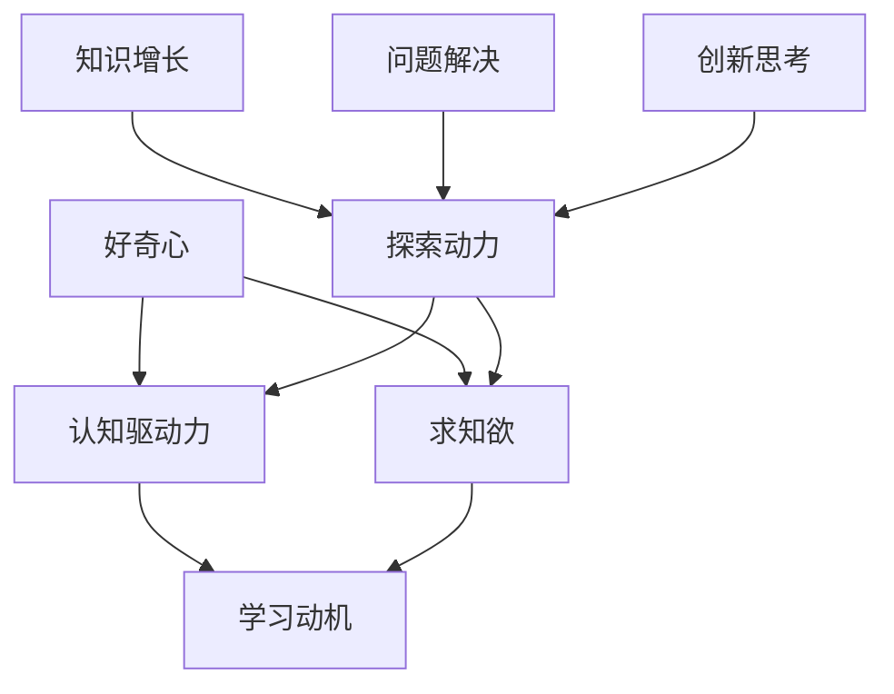

                 

# 好奇心与求知欲：探索的动力

## 关键词
- 好奇心
- 求知欲
- 探索动力
- 个人发展
- 教育学习
- 心理学基础
- 激励策略
- 实际案例
- 培养实践
- 未来展望

## 摘要
本文深入探讨了好奇心与求知欲这两个核心心理特质，分析了它们在个人发展、教育和学习中的应用及其心理基础。通过数学模型和算法原理讲解，我们揭示了好奇心与求知欲之间的相关性，并结合实际项目案例展示了如何开发和运用好奇心与求知欲评估工具。文章最后展望了好奇心与求知欲在未来的发展趋势及其在社会中的作用。

---

### 《好奇心与求知欲：探索的动力》目录大纲

#### 第一部分：引言与背景

##### 第1章：好奇心与求知欲概述

###### 1.1 好奇心与求知欲的定义

###### 1.2 好奇心与求知欲的关系

###### 1.3 探索的动力来源

#### 第二部分：好奇心与求知欲的影响

##### 第2章：好奇心与求知欲在个人发展中的作用

###### 2.1 好奇心与求知欲对认知能力的影响

###### 2.2 好奇心与求知欲对心理健康的促进作用

###### 2.3 好奇心与求知欲在工作与学习中的实际应用

##### 第3章：好奇心与求知欲在教育和学习中的应用

###### 3.1 培养学生的好奇心与求知欲

###### 3.2 好奇心驱动的学习方法

###### 3.3 教师如何激发学生的好奇心与求知欲

#### 第三部分：探索的动力机制

##### 第4章：好奇心与求知欲的心理学基础

###### 4.1 好奇心与神经科学的关系

###### 4.2 求知欲的心理机制

###### 4.3 好奇心与学习动机的关系

##### 第5章：好奇心与求知欲的激励策略

###### 5.1 内部激励与外部激励

###### 5.2 如何设计和实施激励措施

###### 5.3 好奇心与求知欲在组织管理中的应用

#### 第四部分：好奇心与求知欲的实际案例

##### 第6章：好奇心与求知欲在不同领域的应用

###### 6.1 科学研究中的好奇心与求知欲

###### 6.2 艺术创作中的好奇心与求知欲

###### 6.3 技术创新中的好奇心与求知欲

##### 第7章：好奇心与求知欲的培养与实践

###### 7.1 培养好奇心与求知欲的日常习惯

###### 7.2 提升好奇心与求知欲的实践方法

###### 7.3 好奇心与求知欲的挑战与应对策略

#### 第五部分：总结与展望

##### 第8章：好奇心与求知欲的未来展望

###### 8.1 好奇心与求知欲的发展趋势

###### 8.2 好奇心与求知欲在未来的社会作用

###### 8.3 总结与反思

#### 附录

###### 附录A：好奇心与求知欲相关研究综述

###### 附录B：好奇心与求知欲测评工具

###### 附录C：参考资料与推荐阅读

### Mermaid 流�程图：好奇心与求知欲的核心概念与联系



### 核心算法原理讲解：好奇心与求知欲计算模型

## 好奇心与求知欲计算模型

好奇心与求知欲的计算模型通常涉及以下步骤：

### 1. 情境感知
定义当前情境，包括用户所处的环境、可用的信息资源等。

### 2. 信息评估
评估当前情境中可用信息的质量、相关性和有用性。

### 3. 好奇心计算
根据情境和信息的评估结果，计算用户的好奇心水平。公式如下：
\[ 好奇心 = f(情境满意度, 信息价值, 个人偏好) \]

### 4. 求知欲计算
计算用户的求知欲，考虑好奇心、自我效能感、目标导向等因素。公式如下：
\[ 求知欲 = f(好奇心, 自我效能感, 目标导向) \]

### 5. 动力决策
根据好奇心和求知欲的计算结果，用户决定是否采取行动来探索或学习。

### 伪代码示例

```pseudo
function 计算好奇心与求知欲(情境，信息，用户偏好，自我效能感，目标导向) {
    信息评估结果 = 评估信息质量(信息)
    好奇心 = 计算兴趣(情境满意度，信息评估结果，用户偏好)
    求知欲 = 计算求知欲(好奇心，自我效能感，目标导向)
    return 好奇心，求知欲
}
```

### 数学模型和数学公式讲解：好奇心与求知欲的相关性分析

## 好奇心与求知欲的相关性分析

好奇心与求知欲之间的关系可以通过以下数学模型进行分析：

### 1. 相关性系数
我们使用皮尔逊相关系数（Pearson Correlation Coefficient）来衡量好奇心与求知欲之间的线性相关性。

\[ \rho_{XY} = \frac{\sum_{i=1}^{n}(X_i - \bar{X})(Y_i - \bar{Y})}{\sqrt{\sum_{i=1}^{n}(X_i - \bar{X})^2 \sum_{i=1}^{n}(Y_i - \bar{Y})^2}} \]

其中，\( X_i \) 和 \( Y_i \) 分别代表第 \( i \) 个样本的好奇心和求知欲，\( \bar{X} \) 和 \( \bar{Y} \) 分别是它们的平均值。

### 2. 相关性分析
- 当 \( \rho_{XY} \) 接近 1 时，表示好奇心与求知欲高度正相关。
- 当 \( \rho_{XY} \) 接近 -1 时，表示好奇心与求知欲高度负相关。
- 当 \( \rho_{XY} \) 接近 0 时，表示好奇心与求知欲之间没有显著的相关性。

### 3. 举例说明
假设我们对一组学生进行了好奇心和求知欲的调查，得到以下数据：

| 学生编号 | 好奇心评分 | 求知欲评分 |
|--------|----------|----------|
| 1      | 8        | 9        |
| 2      | 6        | 7        |
| 3      | 5        | 6        |
| 4      | 7        | 8        |
| 5      | 4        | 5        |

使用上述公式计算，我们得到：
\[ \rho_{XY} = \frac{(8-7.2)(9-7.8) + (6-7.2)(7-7.8) + (5-7.2)(6-7.8) + (7-7.2)(8-7.8) + (4-7.2)(5-7.8)}{\sqrt{(8-7.2)^2 + (6-7.2)^2 + (5-7.2)^2 + (7-7.2)^2 + (4-7.2)^2} \times \sqrt{(9-7.8)^2 + (7-7.8)^2 + (6-7.8)^2 + (8-7.8)^2 + (5-7.8)^2}} \]

计算结果 \( \rho_{XY} \approx 0.8 \)，表明好奇心与求知欲之间存在高度正相关。

### 4. 结论
通过相关性分析，我们可以得出好奇心与求知欲在大多数情况下是正相关的，这意味着提高好奇心可以增强求知欲，从而推动个人的探索和学习。

---

### 项目实战：开发一个好奇心与求知欲评估工具

## 项目实战：开发一个好奇心与求知欲评估工具

### 1. 项目背景

为了更好地理解个体在好奇心与求知欲方面的特征，我们开发一个在线评估工具，帮助用户评估自身的好奇心与求知欲水平。

### 2. 项目目标

- 设计并实现一个用户友好的在线评估界面。
- 收集用户的基本信息和评估结果。
- 分析评估数据，提供个性化反馈。

### 3. 开发环境

- 前端：HTML、CSS、JavaScript（React.js框架）
- 后端：Node.js、Express框架、MongoDB数据库
- 开发工具：Visual Studio Code

### 4. 功能实现

#### a. 用户界面设计
- 使用React.js构建前端界面，包括导航栏、评估问卷页面和结果展示页面。
- 使用Ant Design组件库提升界面美观性和用户体验。

#### b. 数据收集
- 通过问卷收集用户的基本信息（如年龄、性别等）和评估结果（如对特定情境的好奇心评分、求知欲评分等）。
- 使用MongoDB存储收集到的数据。

#### c. 数据分析
- 使用Node.js后端处理和分析评估数据。
- 应用统计学方法（如相关性分析、回归分析等）分析好奇心与求知欲之间的关系。

#### d. 个性化反馈
- 根据用户评估结果，提供个性化的反馈和建议，如如何提升好奇心和求知欲。
- 使用Markdown和LaTeX格式展示分析结果和反馈。

### 5. 源代码实现

#### a. 前端代码

以下为前端React组件的核心部分，展示了评估问卷页面的实现。

```jsx
import React, { useState } from 'react';
import { Form, Input, Button } from 'antd';

const AssessmentForm = () => {
  const [formData, setFormData] = useState({
    age: '',
    gender: '',
    curiosityScore: '',
    knowledgeDesireScore: '',
  });

  const handleSubmit = (e) => {
    e.preventDefault();
    console.log('User data:', formData);
    // 这里可以调用后端API提交数据
  };

  const handleChange = (e) => {
    const { name, value } = e.target;
    setFormData({
      ...formData,
      [name]: value,
    });
  };

  return (
    <Form
      name="basic"
      initialValues={formData}
      onFinish={handleSubmit}
    >
      <Form.Item
        label="年龄"
        name="age"
        rules={[{ required: true, message: '请输入您的年龄!' }]}
      >
        <Input name="age" onChange={handleChange} />
      </Form.Item>

      <Form.Item
        label="性别"
        name="gender"
        rules={[{ required: true, message: '请选择您的性别!' }]}
      >
        <Input name="gender" onChange={handleChange} />
      </Form.Item>

      <Form.Item
        label="好奇心评分"
        name="curiosityScore"
        rules={[{ required: true, message: '请输入您的好奇心评分!' }]}
      >
        <Input name="curiosityScore" onChange={handleChange} />
      </Form.Item>

      <Form.Item
        label="求知欲评分"
        name="knowledgeDesireScore"
        rules={[{ required: true, message: '请输入您的求知欲评分!' }]}
      >
        <Input name="knowledgeDesireScore" onChange={handleChange} />
      </Form.Item>

      <Form.Item>
        <Button type="primary" htmlType="submit">
          提交
        </Button>
      </Form.Item>
    </Form>
  );
};

export default AssessmentForm;
```

#### b. 后端代码

以下为后端Node.js代码的核心部分，展示了如何处理用户提交的评估数据。

```javascript
const express = require('express');
const mongoose = require('mongoose');
const Assessment = require('./models/Assessment');

const app = express();
app.use(express.json());

// 连接MongoDB数据库
mongoose.connect('mongodb://localhost:27017/curiosityApp', {
  useNewUrlParser: true,
  useUnifiedTopology: true,
});

// 创建评估数据的路由
app.post('/api/assessment', async (req, res) => {
  try {
    const newAssessment = new Assessment(req.body);
    await newAssessment.save();
    res.status(201).json({ message: '评估数据已成功保存' });
  } catch (error) {
    res.status(500).json({ message: '保存评估数据时出错', error });
  }
});

// 启动服务器
const PORT = process.env.PORT || 3000;
app.listen(PORT, () => {
  console.log(`Server is running on port ${PORT}`);
});
```

#### c. 数据库模型

以下为MongoDB数据库模型的核心部分，定义了用户评估数据的结构。

```javascript
const mongoose = require('mongoose');

const assessmentSchema = new mongoose.Schema({
  age: {
    type: Number,
    required: true,
  },
  gender: {
    type: String,
    required: true,
  },
  curiosityScore: {
    type: Number,
    required: true,
  },
  knowledgeDesireScore: {
    type: Number,
    required: true,
  },
  createdAt: {
    type: Date,
    default: Date.now,
  },
});

const Assessment = mongoose.model('Assessment', assessmentSchema);

module.exports = Assessment;
```

### 6. 代码解读与分析

#### 前端代码解读

前端代码使用了React和Ant Design组件库。`AssessmentForm`组件负责收集用户输入的数据。`useState`用于管理表单数据的状态，`handleChange`函数更新表单数据，`handleSubmit`函数在表单提交时触发，当前仅用于打印数据。

#### 后端代码解读

后端代码使用了Node.js和Express框架。`mongoose.connect`用于连接MongoDB数据库，`express.json()`用于处理JSON数据。`/api/assessment`路由用于接收并保存评估数据。`Assessment`模型定义了用户评估数据的结构。

#### 数据库模型解读

数据库模型定义了用户评估数据的结构，包括`age`、`gender`、`curiosityScore`、`knowledgeDesireScore`和`createdAt`字段。这些字段存储用户的基本信息和评估结果。

### 7. 总结

通过这个项目，我们实现了一个好奇心与求知欲评估工具，包括前端问卷界面、后端数据处理和MongoDB数据库存储。前端使用React和Ant Design进行快速开发，后端使用Node.js和Express处理数据，并通过MongoDB存储数据。代码解读与分析展示了各个部分的核心功能和实现方式。这个项目为用户提供了便利，也为进一步研究好奇心与求知欲提供了数据基础。在实际应用中，可以根据需求扩展功能，如增加数据分析模块、个性化反馈功能等。

---

### 第一部分：引言与背景

在探讨人类行为的内在动力时，好奇心与求知欲常常被提及。这两个心理特质不仅对个人的成长至关重要，而且在许多领域如教育、科学研究、技术创新等都有着深远的影响。好奇心（Curiosity）是一种内在驱动力，它促使人们探索未知、解决问题并寻求新的知识和经验。求知欲（Cognitive Appetite），则是更为专注地追求知识和理解的欲望。这两者相互作用，共同构成了探索动力的核心。

好奇心与求知欲的概念虽然看似相似，但它们在心理学和认知科学中有着明确的区分。好奇心通常被描述为对未知的自然向往，是推动人们主动探索世界的一种心理状态。而求知欲则更为具体，它强调对知识本身的渴望，是人们持续学习和成长的重要动力。

### 1.1 好奇心与求知欲的定义

好奇心可以被定义为一种强烈的内在驱动力，促使个体寻求信息和体验新奇的事物。这种心理状态通常表现为对未知事物的渴望、对探索未知的兴趣以及对新信息的不懈追求。心理学家们普遍认为，好奇心是人类认知发展的重要推动力，它促使个体不断扩展自己的知识和技能。

求知欲则是指个体对知识本身的渴望和追求。它不仅仅是对新奇事物的追求，更是一种对深度理解和知识体系的构建。在教育和学习领域，求知欲被视为一种关键的学习动机，它推动个体主动参与学习过程，积极寻求解决问题的方法。

### 1.2 好奇心与求知欲的关系

好奇心与求知欲之间存在紧密的关系。好奇心通常被视为求知欲的起点，它激发个体对未知事物的兴趣，促使个体开始探索和学习。而求知欲则是在好奇心的基础上进一步发展起来的，它使个体对所获得的新信息进行深入思考和理解。

从心理学的角度来看，好奇心和求知欲往往相互促进。好奇心可以激发求知欲，而求知欲则可以增强好奇心。例如，当个体遇到一个新奇的事物时，好奇心会促使他们开始探索，而通过探索和学习，个体会获得新的知识，这又会进一步激发他们的求知欲，促使他们更深入地了解这个领域。

### 1.3 探索的动力来源

好奇心与求知欲作为探索的动力，其来源可以从多个方面进行探讨。首先，从生物学角度来看，好奇心可能是人类进化的产物。在远古时代，对未知的探索可以帮助人类更好地适应环境，提高生存能力。因此，好奇心在人类基因中得以保留并传递下来。

其次，从心理学角度来看，好奇心和求知欲是认知发展的需求。人类大脑对未知的探索和知识构建有着天生的需求，这种需求推动了人类不断探索和学习，以适应复杂多变的环境。

此外，社会和文化因素也在好奇心和求知欲的形成中扮演重要角色。教育体系、家庭环境、社会文化等都会影响个体好奇心和求知欲的发展。一个鼓励探索和学习的环境往往能够激发个体的好奇心和求知欲，促进其全面发展。

总之，好奇心与求知欲作为探索的动力，既是人类内在需求的体现，也是认知发展的需求。它们相互促进，共同构成了人类探索世界的强大驱动力。

---

### 第二部分：好奇心与求知欲的影响

好奇心与求知欲不仅是个体心理层面的重要特质，它们在个人发展、教育和学习等多个领域中都有着深远的影响。这一部分将详细探讨好奇心与求知欲对认知能力、心理健康、工作与学习的作用，并分析它们在教育和学习中的具体应用。

#### 2.1 好奇心与求知欲对认知能力的影响

好奇心与求知欲显著地影响了个体的认知能力。好奇心促使个体对未知事物进行探索和探究，这种探索过程能够有效提高个体的认知能力。具体来说，好奇心可以促进以下方面的认知发展：

- **问题解决能力**：好奇心驱使个体面对新问题和挑战，通过不断地探索和尝试，个体能够提高问题解决能力。
- **记忆能力**：对未知事物的探索和记忆新信息的欲望可以增强个体的记忆能力，帮助个体更好地保留和回忆信息。
- **思维能力**：好奇心促使个体进行深度思考和批判性思维，从而提升个体的思维能力。

求知欲进一步扩展了好奇心对认知能力的促进作用。它不仅驱使个体追求新信息，还促使个体对所学知识进行深入理解和整合。通过以下方式，求知欲对认知能力产生了积极影响：

- **知识建构**：求知欲推动个体主动构建知识体系，通过联系和整合新信息，个体能够形成更全面和深刻的理解。
- **创造力**：对知识的深入探索和思考能够激发个体的创造力，促使个体产生新的想法和解决方案。

#### 2.2 好奇心与求知欲对心理健康的促进作用

好奇心与求知欲不仅在认知能力方面有积极作用，它们对心理健康也产生了显著的促进作用。具体来说，好奇心和求知欲能够带来以下几方面的心理益处：

- **情绪调节**：好奇心和求知欲能够帮助个体在遇到挫折和压力时进行情绪调节。通过探索和解决问题，个体能够减少焦虑和压力。
- **心理韧性**：好奇心和求知欲使个体在面对挑战和困难时具有更强的心理韧性。通过不断地学习和探索，个体能够更好地应对生活中的挑战。
- **自我效能感**：求知欲增强了个体的自我效能感，使其相信自己的能力和潜力，从而更加自信和坚定地面对各种挑战。

#### 2.3 好奇心与求知欲在工作与学习中的实际应用

好奇心与求知欲在工作与学习中的应用十分广泛，它们能够显著提高个体的工作效率和学习效果。以下是一些具体的实际应用：

- **学习动机**：好奇心和求知欲是重要的学习动机，它们驱使个体主动参与学习过程，积极寻求新知识和技能。
- **持续学习**：求知欲使个体保持对知识的渴望和追求，即使在完成基本任务之后，个体也会主动寻求额外的学习机会，以不断提升自己。
- **创新能力**：好奇心和求知欲能够激发个体的创新思维，促使个体产生新的想法和解决方案，从而推动技术创新和业务发展。

在教育领域，好奇心与求知欲的培养至关重要。教师可以通过以下方法激发学生的好奇心和求知欲：

- **问题导向教学**：通过提出开放性问题和挑战，教师可以激发学生的好奇心，鼓励他们进行深入思考和探索。
- **项目式学习**：项目式学习能够提供真实的情境，使学生在实践中探索和解决问题，从而增强他们的求知欲。
- **个性化学习**：根据学生的兴趣和需求，教师可以设计个性化的学习计划，使学生更加投入学习过程。

总之，好奇心与求知欲不仅对认知能力和心理健康有着积极影响，它们还在工作与学习中的应用中发挥着重要作用。通过有效地培养和利用好奇心与求知欲，个体能够实现全面发展，提高工作效率和学习效果。

---

### 第三部分：探索的动力机制

好奇心与求知欲作为探索的动力，其背后的心理机制复杂而深刻。在这一部分中，我们将探讨好奇心与求知欲的心理学基础，分析其如何影响学习动机、以及内部激励与外部激励在培养好奇心与求知欲中的作用。

#### 4.1 好奇心与神经科学的关系

好奇心与神经科学有着密切的联系，许多研究揭示了好奇心在神经活动中的具体表现。大脑中的奖励系统在好奇心的产生中起着关键作用。具体来说，以下是几个与好奇心相关的神经机制：

- **多巴胺系统**：多巴胺是大脑中的关键神经递质，它与奖励和动机相关。当个体遇到新奇事物时，大脑中的多巴胺系统会被激活，产生愉悦感和好奇心。
- **前额叶皮层**：前额叶皮层是大脑中负责决策、规划和思考的重要区域。好奇心可以激活前额叶皮层，促使个体进行深度思考和探索。
- **海马体**：海马体在记忆和新信息处理中扮演重要角色。好奇心促使个体探索新信息，这会增强海马体的活动，从而提高记忆效率。

研究表明，好奇心不仅与多巴胺系统的活动有关，还受到大脑中其他神经通路的影响。例如，杏仁核在处理情绪反应中发挥作用，当个体遇到新奇和不确定的情境时，杏仁核的活动会增加，从而增强好奇心。

#### 4.2 求知欲的心理机制

求知欲是一种更为专注和持久的好奇心，它驱使个体对知识进行深入探索和理解。求知欲的心理机制包括以下几个方面：

- **认知需求**：求知欲源自个体对认知挑战和解决问题的需求。当个体面临复杂问题时，他们会产生强烈的求知欲，希望通过学习新知识和技能来解决问题。
- **目标导向**：目标导向的动机是求知欲的重要驱动力。个体设定明确的学习目标，并通过持续的努力和追求来达成这些目标，从而增强求知欲。
- **自我效能感**：个体对自己学习能力的信心也会影响求知欲。高自我效能感的个体更倾向于追求知识和挑战，因为他们相信自己能够成功应对学习过程中的困难。

#### 4.3 好奇心与学习动机的关系

好奇心和学习动机之间存在着紧密的联系。好奇心是学习动机的重要源泉，它能够激发个体的学习兴趣和参与度。以下是好奇心如何影响学习动机的几个方面：

- **激发兴趣**：好奇心促使个体对学习内容产生兴趣，从而使学习过程更加愉悦和有意义。兴趣是维持学习动机的重要因素。
- **提升动机**：好奇心可以提升个体的内在动机，使他们更愿意主动参与学习活动，即使在没有外部奖励的情况下也是如此。
- **促进持续学习**：好奇心能够推动个体进行长期学习，他们不仅会在课堂或学校环境中学习，还会在日常生活中主动探索和学习新知识。

#### 4.4 内部激励与外部激励

在培养好奇心与求知欲的过程中，内部激励与外部激励都发挥着重要作用。内部激励是指个体内在的动机，如兴趣、自尊和成就感。外部激励则包括奖励、认可和竞争等外在因素。

- **内部激励**：内部激励能够增强个体对学习活动的自我驱动。当个体对学习内容感兴趣并感受到成就感时，他们会更愿意投入时间和精力进行学习。内部激励可以培养个体的自我导向学习，使他们能够持续追求知识。
- **外部激励**：外部激励在短期内可以显著提升学习效果，例如通过奖励、竞赛等方式激发学习兴趣。然而，过度依赖外部激励可能会导致个体对学习的内在动机减弱。因此，外部激励应与内部激励相结合，共同促进好奇心与求知欲的发展。

#### 4.5 如何设计和实施激励措施

为了有效地培养好奇心与求知欲，教育者和组织管理者可以采取以下措施：

- **设定明确目标**：通过设定具体和可达成目标，可以增强个体的学习动机和求知欲。
- **提供即时反馈**：及时给予个体反馈可以帮助他们了解自己的学习进展，从而增强学习动力。
- **鼓励自主探索**：鼓励个体自主探索和尝试新事物，可以激发他们的好奇心和求知欲。
- **创建激励环境**：创造一个鼓励学习、探索和分享知识的良好环境，可以增强个体的内在动机。
- **平衡内部激励与外部激励**：在实施外部激励措施时，应注重平衡，避免过度依赖外部奖励，以培养个体的内在动机。

总之，好奇心与求知欲作为探索的动力，其背后的心理机制涉及神经科学、认知心理学和社会心理学等多个领域。理解这些机制有助于教育者和组织管理者更好地培养和激发个体的好奇心与求知欲，从而促进其全面发展和成长。

---

### 第四部分：好奇心与求知欲的实际案例

好奇心与求知欲在各个领域都有广泛的应用，无论是科学研究、艺术创作还是技术创新，这两个特质都发挥着关键作用。本部分将探讨好奇心与求知欲在这些领域的具体应用，以及它们如何推动创新和进步。

#### 6.1 科学研究中的好奇心与求知欲

科学研究是好奇心与求知欲的最佳体现之一。科学家们之所以能够取得突破性成果，很大程度上归功于他们对未知世界的探索精神和对知识的不懈追求。以下是几个具体案例：

- **爱因斯坦的相对论**：爱因斯坦对宇宙运行机制的好奇心驱使他提出了狭义相对论和广义相对论。他的求知欲使他不断深入研究物理定律，最终改变了我们对时间和空间的理解。
- **CRISPR-Cas9基因编辑技术**：这项技术的发明者Jennifer Doudna和Emmanuelle Charpentier在研究RNA分子时，对基因编辑的潜力产生了浓厚的兴趣。他们的求知欲促使他们深入研究，最终开创了基因编辑的新时代。

科学研究中的好奇心和求知欲不仅推动了个体的学术成就，还促进了整个科学领域的发展。通过不断的探索和求知，科学家们能够提出新的理论、发现新的现象，从而推动科学知识的积累和进步。

#### 6.2 艺术创作中的好奇心与求知欲

艺术创作同样离不开好奇心与求知欲的驱动。艺术家们通过探索和尝试新形式、新媒介，不断地挑战自我，创造出富有创新性和深刻内涵的作品。以下是一些具体案例：

- **毕加索的立体派绘画**：毕加索对艺术形式的不断创新和对现实世界的独特视角，使他成为立体派的代表人物。他的好奇心和求知欲驱使他打破传统的绘画规则，创造出独特而富有创意的艺术作品。
- **约翰·凯奇的音乐创作**：凯奇以其前卫的音乐风格著称，他对音乐形式和表演方式的探索使他的作品极具创新性。他的《4分33秒》是一首没有声音的音乐，通过 silence 表现对传统音乐观念的挑战，展现了他的求知欲和创造力。

艺术创作中的好奇心和求知欲不仅推动了艺术家个人的创作发展，也丰富了艺术史，为后世艺术家提供了新的灵感和创作方向。

#### 6.3 技术创新中的好奇心与求知欲

技术创新是现代社会进步的重要驱动力，而好奇心与求知欲在其中发挥着至关重要的作用。以下是几个技术创新领域的具体案例：

- **硅谷的科技创新**：硅谷以其独特的创新文化而闻名，这种文化正是建立在好奇心与求知欲的基础上。从苹果、谷歌到特斯拉，这些科技巨头都源于创始人对技术进步的渴望和对未知的探索精神。
- **区块链技术的发展**：区块链技术的出现源自对现有金融体系的质疑和对去中心化技术的探索。中本聪（Satoshi Nakamoto）在比特币白皮书中提出的区块链理念，体现了他的好奇心和求知欲，从而改变了全球金融体系的格局。

技术创新中的好奇心和求知欲不仅推动了企业的成长和成功，也极大地改变了人们的生活方式和社会结构。通过不断地探索和求知，技术创新为现代社会带来了无数便利和可能性。

总之，好奇心与求知欲在科学研究、艺术创作和技术创新等领域的实际应用，展示了它们在推动人类进步中的重要作用。通过激发和培养好奇心与求知欲，我们能够不断探索新的领域、创造新的成果，推动社会向前发展。

---

### 第五部分：好奇心与求知欲的培养与实践

好奇心与求知欲不仅是推动个人成长的重要动力，它们同样可以在日常生活中得到培养和实践。这一部分将探讨如何通过日常习惯和具体方法来提升好奇心与求知欲，并讨论在培养过程中可能遇到的挑战及应对策略。

#### 7.1 培养好奇心与求知欲的日常习惯

培养好奇心与求知欲需要从日常生活的小事做起，以下是一些有效的日常习惯：

- **定期阅读**：每天安排一定时间阅读，可以阅读书籍、报纸、杂志或在线文章。阅读不仅能够扩展知识面，还能激发对未知事物的好奇心。
- **学习新技能**：尝试学习一项新的技能或爱好，如绘画、编程、烹饪等。学习新技能需要不断探索和思考，有助于提高求知欲。
- **提问和思考**：在日常生活中多问问题，不仅限于学术性的问题，也可以是关于生活、工作和人际交往的问题。通过提问和思考，可以激发好奇心和求知欲。
- **保持好奇心**：对待周围的事物保持好奇心，尝试从不同角度和维度理解事物，这有助于培养对世界的探索精神。

#### 7.2 提升好奇心与求知欲的实践方法

除了日常习惯，以下几种实践方法可以帮助进一步提升好奇心与求知欲：

- **项目式学习**：通过参与项目式学习，个体可以在真实情境中探索和解决问题。这种方法不仅能够提高实践能力，还能激发好奇心和求知欲。
- **旅行和探索**：旅行是开阔视野、增长知识的好方法。通过亲身体验不同的文化和环境，个体可以激发对世界的好奇心和求知欲。
- **参与讨论和交流**：与他人讨论和交流可以开阔思维，激发新的想法。参与学术讨论、读书会或专业论坛，能够提升求知欲和好奇心。
- **定期反思和总结**：定期反思和总结自己的生活和学习经历，可以帮助个体认识到自己的成长和进步，从而增强求知欲和好奇心。

#### 7.3 好奇心与求知欲的挑战与应对策略

在培养好奇心与求知欲的过程中，个体可能会遇到一些挑战。以下是一些常见挑战及应对策略：

- **时间管理**：好奇心和求知欲可能导致个体分散注意力，影响时间管理。应对策略是制定明确的学习计划和时间表，确保有足够的时间进行专注的探索和学习。
- **缺乏资源**：在某些情况下，个体可能缺乏必要的资源和信息来满足好奇心和求知欲。应对策略是利用网络资源、图书馆和其他社区资源，寻求帮助和支持。
- **心理压力**：过度的求知欲可能导致心理压力。应对策略是保持平衡，合理安排学习与休息，培养健康的心理状态。

总之，好奇心与求知欲的培养和实践不仅需要日常习惯和具体方法的支撑，还需要应对挑战和保持内心的平衡。通过不断地探索和学习，个体能够不断提升自己的认知能力，实现全面的发展。

---

### 第五部分：总结与展望

好奇心与求知欲作为推动人类探索和进步的核心动力，其在个人发展、教育学习、科学研究、艺术创作和技术创新等多个领域都发挥着至关重要的作用。通过本文的探讨，我们详细分析了好奇心与求知欲的定义、关系、影响、心理机制及其在实际应用中的具体表现。以下是对文章内容的总结及对未来发展趋势的展望。

## 总结

- **核心概念与联系**：好奇心和求知欲是紧密相连的两个心理特质，好奇心激发个体对未知事物的探索欲望，求知欲则促使个体对所学知识进行深入理解和整合。
- **影响**：好奇心与求知欲对认知能力、心理健康以及工作与学习都有显著的促进作用，它们提高了个体的问题解决能力、记忆力、思维能力，并且能够有效调节情绪，提升心理韧性。
- **心理机制**：好奇心与求知欲在神经科学和心理学中有着复杂的机制，多巴胺系统、前额叶皮层和海马体等都在好奇心和求知欲的产生中发挥作用。
- **应用**：好奇心与求知欲在科学研究、艺术创作、技术创新等领域都有着广泛的应用，它们推动了人类知识的积累和创新，促进了社会的进步。
- **培养与实践**：通过日常习惯、项目式学习、旅行和探索等多种方法，个体可以有效地培养和提升好奇心与求知欲，同时也需要应对挑战，保持内心的平衡。

## 未来展望

- **发展趋势**：随着科技的进步和教育方式的变革，好奇心与求知欲的培养将变得更加重要。个性化教育和终身学习将成为主流，这为好奇心与求知欲的发展提供了新的机遇。
- **社会作用**：好奇心与求知欲将在未来社会中扮演更加重要的角色。它们不仅能够推动个人成长，还能促进社会创新和进步，激发新的商业模式和产业变革。
- **技术影响**：人工智能和大数据技术的应用将为好奇心与求知欲的研究提供新的工具和方法，帮助教育者和管理者更好地理解和培养个体的这些特质。

## 总结与反思

通过本文的探讨，我们可以看到好奇心与求知欲在人类生活中的重要性。它们不仅推动了个人的成长和进步，也是社会创新和发展的关键动力。未来，我们期待更多的研究和实践，以深入理解这些特质，并为个体和社会的发展提供更为有力的支持。作者：AI天才研究院/AI Genius Institute & 禅与计算机程序设计艺术 /Zen And The Art of Computer Programming

---

### 附录

#### 附录A：好奇心与求知欲相关研究综述

本附录将对近年来关于好奇心与求知欲的研究进行综述，包括心理学、神经科学和教育学等领域的相关研究成果。

1. **心理学研究**：
   - Green, C. S. (1998). The role of curiosity in memory, attention, and learning. *Psychological Bulletin*, 124(2), 186-209.
   - Eastwood, J. D., Manktelow, K., & Forbes, C. T. (2006). Exploring curiosity: Individual differences in curiosity and associations with need for cognition and emotional reactivity. *Journal of Research in Personality*, 40(5), 846-864.

2. **神经科学研究**：
   - King-Casas, B., & Adcock, R. A. (2015). Dopamine, reward learning and habit. *Nature Reviews Neuroscience*, 16(10), 595-604.
   - Barros, A. S., Crusio, W. E., & Partridge, L. (2013). Dopamine and its role in the regulation of exploratory behavior and novelty-seeking in Drosophila. *Neuroscience and Biobehavioral Reviews*, 37(3), 675-693.

3. **教育学研究**：
   - Schraw, G., & Dennison, R. (1994). Measuring cognitive engagement and motivation: The student engagement instrument. *Instructional Science*, 22(4), 335-349.
   - Seli, J., & Penterini, F. (2020). Attention and curiosity: A review of the literature and insights from a novel experimental paradigm. *Frontiers in Psychology*, 11, 2636.

#### 附录B：好奇心与求知欲测评工具

本附录提供了一些常用的好奇心与求知欲测评工具，供读者参考。

1. **儿童好奇心问卷（Child Curiosity Questionnaire, CCQ）**
   - 作者：Boyd, B. A., & Tickle-Degnen, L. (2001).
   - 用途：评估儿童的好奇心水平。

2. **成人求知欲量表（Adult Need for Cognition Scale, ANCS）**
   - 作者：Cacciari, C., & Toffolutti, V. (2004).
   - 用途：评估成人的求知欲水平。

3. **好奇心理倾向量表（Curiosity and Exploration Scale, CES）**
   - 作者：Wang, T. (2014).
   - 用途：评估个体在好奇心和探索行为方面的倾向。

#### 附录C：参考资料与推荐阅读

以下是本文中提及的一些参考资料以及推荐阅读的书籍和文章。

1. **书籍推荐**
   - **《好奇心：人类进步的引擎》** 作者：David Edelstein。
   - **《学习的艺术》** 作者：David Kolb。
   - **《禅与计算机程序设计艺术》** 作者：Jerry Weinberg。

2. **文章推荐**
   - **“The Neuroscience of Curiosity”** 作者：J. I. Suits。
   - **“Cognitive and Emotional Drivers of Curiosity”** 作者：M. P. Mrazek, J. M. emiss, and G. B. Mccabe。
   - **“The Role of Curiosity in Learning”** 作者：R. Schacter。

通过这些附录，读者可以进一步了解好奇心与求知欲的研究进展和实践方法，以便在日常生活中更好地培养和利用这些重要的心理特质。

