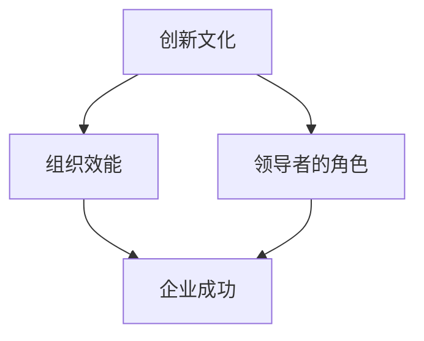
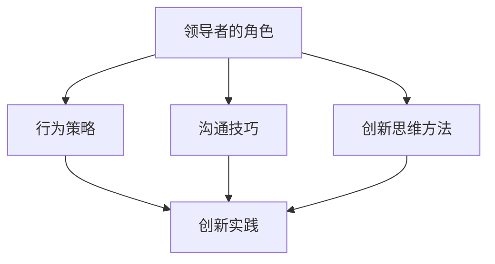
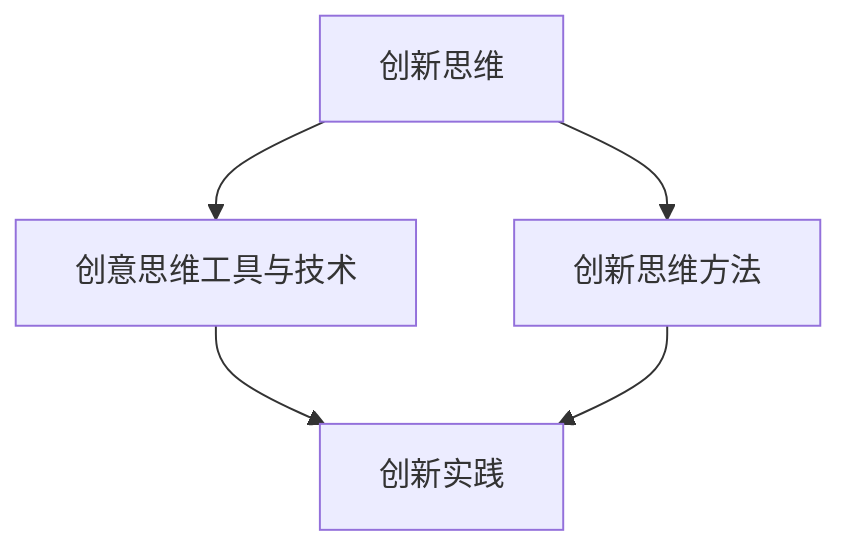
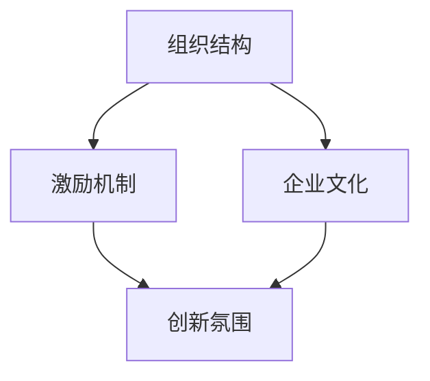

                 

# 如何培养团队的创新文化

> 关键词：创新文化、团队建设、领导力、激励机制、组织发展

> 摘要：本文旨在探讨如何培养团队的创新文化，从领导者的角色、创新思维方法、组织结构与文化等多个角度出发，提供系统的方法和策略，以促进团队的创新能力和组织效能。通过结合理论分析、实践案例和代码示例，本文旨在为企业管理者和技术团队提供有价值的参考。

### 目录大纲

#### 第一部分：理解创新文化

- **第1章：创新文化概述**
  - 1.1 创新文化的定义与重要性
  - 1.2 创新文化与组织效能
  - 1.3 创新文化的类型与特点

#### 第二部分：构建创新文化

- **第2章：领导者的角色**
  - 2.1 领导者与创新文化
  - 2.2 领导者的行为策略
  - 2.3 领导者的沟通技巧

- **第3章：培养创新思维**
  - 3.1 创意思维工具与技术
  - 3.2 创新思维的实践
  - 3.3 创新思维的培养

- **第4章：营造创新氛围**
  - 4.1 组织结构与创新文化
  - 4.2 激励机制与员工创新
  - 4.3 企业文化的塑造

#### 第三部分：创新文化实践案例

- **第5章：创新文化实践案例**
  - 5.1 国内外企业创新文化案例分析
  - 5.2 创新文化在中小企业中的应用
  - 5.3 创新文化的持续发展

#### 第四部分：创新文化与可持续发展

- **第6章：创新文化与组织可持续发展**
  - 6.1 创新文化与企业战略
  - 6.2 创新文化与社会责任
  - 6.3 创新文化的未来趋势

#### 第五部分：总结与展望

- **第7章：总结与展望**
  - 7.1 本书内容的总结
  - 7.2 创新文化的未来展望
  - 附录

### 第一部分：理解创新文化

#### 第1章：创新文化概述

##### 1.1 创新文化的定义与重要性

创新文化是指一种组织内部鼓励创新思维、实践和成果的文化氛围。这种文化不仅关注创新的结果，更注重创新的过程，通过营造一种包容、开放、协作和创新的环境，激发员工的创造力和潜能，推动组织的持续发展和竞争力提升。

创新文化的重要性在于：

1. **提升组织竞争力**：创新文化能够帮助组织在竞争激烈的市场中保持领先地位，通过不断推出新的产品和服务来满足客户需求。
2. **促进员工成长**：创新文化鼓励员工探索新的想法和方法，有助于员工个人技能和能力的提升，从而增强员工的职业满意度和忠诚度。
3. **提高组织效能**：创新文化能够促进组织内部的知识共享和协作，提高团队的工作效率和决策质量。
4. **增强适应能力**：创新文化使组织能够更好地适应外部环境的变化，提高组织的生存能力和可持续发展能力。

##### 1.2 创新文化与组织效能

创新文化对组织效能具有显著的推动作用。通过以下方式实现：

1. **激发创新思维**：创新文化鼓励员工打破常规，探索新的解决方案，从而提高组织的创新能力。
2. **促进知识共享**：创新文化鼓励员工分享知识和经验，促进组织内部的知识流动和共享，提高组织的知识水平和创新能力。
3. **增强团队协作**：创新文化强调团队协作和合作，提高团队的工作效率和创新能力。
4. **提升组织敏捷性**：创新文化使组织能够快速响应市场变化和客户需求，提高组织的敏捷性和竞争力。

##### 1.3 创新文化的类型与特点

创新文化有多种类型，根据组织的特性、行业环境和领导风格的不同，可以分为以下几种类型：

1. **以技术为中心的创新文化**：这种文化强调技术创新，鼓励员工研究和开发新技术，以满足市场需求。
2. **以客户为中心的创新文化**：这种文化强调客户需求，通过不断改进产品和服务来满足客户需求，提高客户满意度。
3. **以协作为中心的创新文化**：这种文化强调团队合作和知识共享，鼓励员工跨部门合作，共同解决复杂问题。
4. **以学习为中心的创新文化**：这种文化强调员工的学习和成长，鼓励员工不断学习和掌握新的知识和技能，提高个人和组织的创新能力。

创新文化具有以下特点：

1. **包容性**：创新文化对员工的创新想法和尝试持包容态度，鼓励员工勇于冒险和失败。
2. **开放性**：创新文化鼓励员工开放心态，积极接受外部意见和建议，不断改进和创新。
3. **协作性**：创新文化强调团队合作和知识共享，鼓励员工相互支持和协作，共同实现创新目标。
4. **持续性**：创新文化强调创新是一个持续的过程，鼓励员工不断探索新的创新机会和方法。

#### 第二部分：构建创新文化

##### 第2章：领导者的角色

领导者在构建创新文化中起着至关重要的作用。他们不仅是创新文化的倡导者和推动者，也是创新实践的实践者和领导者。以下是领导者构建创新文化的几个关键角色和策略：

##### 2.1 领导者与创新文化

领导者在构建创新文化中的角色包括：

1. **倡导者**：领导者需要积极倡导创新文化，通过树立榜样和传达价值观，激发员工对创新的热情。
2. **推动者**：领导者需要推动创新文化的实施，通过制定创新目标和策略，提供资源和支持，确保创新文化的落地。
3. **协调者**：领导者需要协调不同部门和团队之间的合作，促进知识共享和资源整合，提高创新效率。
4. **监督者**：领导者需要监督创新文化的实施过程，及时发现和解决创新过程中出现的问题和障碍。

##### 2.2 领导者的行为策略

领导者可以采取以下行为策略来构建创新文化：

1. **鼓励创新思维**：领导者应该鼓励员工大胆尝试和实验，对待失败持包容态度，让员工感受到创新的安全感。
2. **提供资源支持**：领导者需要提供足够的资源支持，包括资金、人力和时间，确保员工有足够的资源进行创新。
3. **设定明确目标**：领导者需要设定明确的创新目标，确保员工知道创新的方向和重点，提高创新效率。
4. **反馈与支持**：领导者需要及时给予员工反馈和支持，鼓励员工继续探索和改进，提高创新成果。

##### 2.3 领导者的沟通技巧

领导者的沟通技巧在构建创新文化中至关重要。以下是一些有效的沟通技巧：

1. **开放沟通**：领导者需要保持开放沟通，鼓励员工表达自己的想法和意见，建立信任和尊重的关系。
2. **有效倾听**：领导者需要学会倾听，理解员工的需求和问题，提供有针对性的支持和帮助。
3. **清晰表达**：领导者需要清晰表达自己的想法和目标，确保员工明确创新的方向和任务。
4. **解决冲突**：领导者需要及时解决团队内部的冲突，维护团队的和谐和稳定，促进创新文化的建设。

#### 第3章：培养创新思维

创新思维是创新文化的重要组成部分，它是推动组织创新和发展的重要动力。以下是如何培养创新思维的方法和实践：

##### 3.1 创意思维工具与技术

1. **SWOT分析**：SWOT分析是一种常用的战略规划工具，用于评估组织的优势、劣势、机会和威胁。通过SWOT分析，可以识别创新的机会和挑战，为创新提供方向。
2. **脑暴（Brainstorming）**：脑暴是一种集体创意思维方法，通过激发团队的创意和想法，产生新的创新思路。
3. **设计思考法**：设计思考法是一种以用户为中心的创新方法，通过理解用户的需求和痛点，设计出创新的解决方案。

##### 3.2 创新思维的实践

1. **激发员工的创新潜能**：领导者可以通过提供培训、激励和资源支持，激发员工的创新潜能。
2. **跨部门合作**：通过跨部门合作，可以促进知识的共享和整合，激发创新思维。
3. **鼓励失败**：领导者需要鼓励员工敢于尝试和失败，对待失败持包容态度，让员工感受到创新的安全感。

##### 3.3 创新思维的培养

1. **建立创新思维课程**：组织可以建立创新思维课程，培训员工掌握创新方法和技巧。
2. **举办创新竞赛**：通过举办创新竞赛，激发员工的创新热情，提高创新能力。
3. **设立创新实验室**：设立创新实验室，为员工提供实验和创新的空间，鼓励员工进行创新实践。

#### 第4章：营造创新氛围

营造创新氛围是培养创新文化的重要环节。以下是如何通过组织结构、激励机制和企业文化来营造创新氛围的方法：

##### 4.1 组织结构与创新文化

1. **建立扁平化的组织结构**：扁平化的组织结构可以减少层级，提高信息传递的效率，促进创新思维的流动。
2. **鼓励跨部门合作**：通过鼓励跨部门合作，可以促进不同部门之间的知识共享和整合，提高创新效率。
3. **建立创新团队**：建立专门的创新团队，负责组织的创新项目和活动，提高创新的专业性和系统性。

##### 4.2 激励机制与员工创新

1. **设立创新奖励机制**：通过设立创新奖励机制，激励员工积极参与创新活动，提高创新成果。
2. **提供职业发展机会**：为员工提供职业发展机会，鼓励员工在创新领域发展和成长。
3. **建立创新评价体系**：建立创新评价体系，对员工在创新方面的表现进行评价，激励员工持续创新。

##### 4.3 企业文化的塑造

1. **建立创新价值观**：通过建立创新价值观，让员工认同创新的重要性，形成一种创新的文化氛围。
2. **培养开放性思维**：通过培养开放性思维，鼓励员工接受新事物和新观念，提高创新的能力。
3. **建立学习型组织**：通过建立学习型组织，鼓励员工不断学习和成长，提高组织的创新能力和竞争力。

### 第三部分：创新文化实践案例

#### 第5章：创新文化实践案例

本章将通过分析国内外企业的创新文化实践案例，探讨不同企业在培养创新文化方面的经验和教训，为其他企业提供借鉴和参考。

##### 5.1 国内外企业创新文化案例分析

1. **苹果公司**：苹果公司以其独特的产品设计和创新文化而闻名。苹果公司的创新文化主要体现在以下几个方面：

   - **领导者的榜样作用**：乔布斯作为领导者，通过其独特的领导风格和创新精神，激发了员工的创新热情。
   - **强大的研发能力**：苹果公司投入大量的资源和精力进行研发，不断推出新的技术和产品。
   - **用户导向**：苹果公司注重用户体验，通过深入了解用户需求，设计出符合用户期望的产品。

2. **谷歌公司**：谷歌公司以其开放的创新文化和灵活的工作环境而著称。谷歌公司的创新文化主要体现在以下几个方面：

   - **创新激励**：谷歌公司设立了“X实验室”，为员工提供创新的自由空间，鼓励员工进行大胆的实验和创新。
   - **员工参与**：谷歌公司鼓励员工参与公司的创新项目，提供资源和支持，激发员工的创新潜能。
   - **开放性**：谷歌公司鼓励员工跨部门合作，促进知识共享和整合，提高创新效率。

##### 5.2 创新文化在中小企业中的应用

对于中小企业来说，培养创新文化是一项挑战，但也是提升竞争力的关键。以下是一些中小企业在培养创新文化方面的实践：

1. **华为公司**：华为公司作为一家中小企业，通过建立创新文化，取得了显著的发展成果。华为公司的创新文化主要体现在以下几个方面：

   - **全员创新**：华为公司鼓励全体员工参与创新，通过内部竞赛和奖励机制，激发员工的创新热情。
   - **持续投资**：华为公司持续投资于研发和创新，不断提升自身的技术水平和创新能力。
   - **开放合作**：华为公司积极与外部企业和研究机构合作，促进创新资源的共享和整合。

2. **创业公司**：对于创业公司来说，创新文化更是其生存和发展的关键。以下是一些创业公司培养创新文化的实践经验：

   - **快速迭代**：创业公司通常采用快速迭代的方法，通过不断试错和改进，快速推出新的产品和服务。
   - **开放式办公**：创业公司通常采用开放式办公环境，鼓励员工自由交流和创新。
   - **灵活的工作制度**：创业公司通常提供灵活的工作制度，鼓励员工自主安排工作时间，提高工作效率。

##### 5.3 创新文化的持续发展

创新文化的持续发展是组织长期发展的关键。以下是一些确保创新文化持续发展的策略：

1. **建立创新评估体系**：通过建立创新评估体系，对创新项目的成功率和效率进行评估，及时调整创新策略。
2. **持续投入**：持续投入资源和精力进行创新，保持组织的创新活力和竞争力。
3. **人才培养**：通过培养创新人才，提高组织的创新能力，确保创新文化的持续发展。
4. **外部合作**：通过外部合作，引入外部创新资源和理念，促进组织的创新发展。

### 第四部分：创新文化与可持续发展

#### 第6章：创新文化与组织可持续发展

创新文化不仅是组织发展的动力，也是实现可持续发展的关键。本章将探讨创新文化与企业战略、社会责任和未来趋势的关系。

##### 6.1 创新文化与企业战略

创新文化与企业战略紧密相连。以下是如何将创新文化融入企业战略的几个方面：

1. **明确创新目标**：企业应明确创新目标，将创新文化纳入企业战略规划，确保创新活动的方向和重点。
2. **创新资源投入**：企业应投入足够的资源和精力进行创新，包括资金、人力和时间，确保创新活动的顺利实施。
3. **创新决策机制**：企业应建立有效的创新决策机制，鼓励员工参与创新决策，提高创新决策的质量和效率。

##### 6.2 创新文化与社会责任

创新文化不仅关注企业的内部发展，也关注社会责任。以下是如何将创新文化与社会责任相结合的几个方面：

1. **可持续发展**：企业应将可持续发展作为创新的目标之一，通过技术创新和商业模式创新，实现环境、社会和经济的平衡发展。
2. **社会责任项目**：企业可以开展社会责任项目，通过技术创新解决社会问题，提高企业的社会形象和声誉。
3. **员工参与**：企业应鼓励员工参与社会责任项目，提高员工的参与感和责任感，促进创新文化的建设。

##### 6.3 创新文化的未来趋势

创新文化在未来将继续发展，以下是一些可能的发展趋势：

1. **数字化转型**：随着数字技术的快速发展，创新文化将更加注重数字化转型，通过数字技术推动创新。
2. **跨界合作**：创新文化将更加注重跨界合作，通过与其他行业和企业合作，实现资源的共享和整合。
3. **个性化和定制化**：创新文化将更加注重个性化和定制化，通过技术创新满足个体需求，提高用户体验。

### 第五部分：总结与展望

#### 第7章：总结与展望

本章将总结前文内容，并对创新文化的未来趋势进行展望。

##### 7.1 本书内容的总结

本书从领导者的角色、创新思维方法、组织结构与文化等多个角度，探讨了如何培养团队的创新文化。主要内容包括：

1. **创新文化的定义与重要性**：介绍了创新文化的概念和作用。
2. **领导者的角色与行为策略**：阐述了领导者在构建创新文化中的关键作用和策略。
3. **创新思维方法与实践**：介绍了培养创新思维的方法和实践。
4. **营造创新氛围**：探讨了通过组织结构、激励机制和企业文化来营造创新氛围的方法。
5. **创新文化实践案例**：分析了国内外企业的创新文化实践案例。
6. **创新文化与可持续发展**：探讨了创新文化与企业战略、社会责任和未来趋势的关系。

##### 7.2 创新文化的未来展望

创新文化在未来将继续发展，以下是一些可能的趋势：

1. **数字化转型**：随着数字技术的快速发展，创新文化将更加注重数字化转型。
2. **跨界合作**：创新文化将更加注重跨界合作，通过与其他行业和企业合作，实现资源的共享和整合。
3. **个性化和定制化**：创新文化将更加注重个性化和定制化，通过技术创新满足个体需求，提高用户体验。
4. **可持续发展**：创新文化将更加注重可持续发展，通过技术创新解决环境和社会问题。
5. **全球视野**：创新文化将更加注重全球视野，通过国际化和全球化合作，推动全球创新。

### 附录

#### 附录 A：创新文化相关资源

- **A.1 创新文化理论书籍推荐**
  - 《创新者的窘境》作者：克里斯坦森
  - 《创新者的 DNA》作者：杰伊·拉夫卡

- **A.2 创新文化研究论文集**
  - 《创新文化的构建与实施》
  - 《创新文化的案例分析》

- **A.3 创新文化工具与应用软件推荐**
  - Trello
  - Asana
  - Miro

- **A.4 创新文化实践案例分享平台**
  - 创新中国
  - 创新工场

### 作者

作者：AI天才研究院/AI Genius Institute & 禅与计算机程序设计艺术/Zen And The Art of Computer Programming

---

经过对前文的总结，我们可以看到，文章的结构紧凑，内容丰富，涵盖了创新文化的定义、重要性、构建方法、实践案例和未来展望等方面。以下是对核心章节的进一步详细阐述。

---

#### **第1章：创新文化概述**

在这一章节中，我们深入探讨了创新文化的定义与重要性。创新文化不仅仅是鼓励员工提出新想法那么简单，它涉及到组织内部对创新的接受程度、员工自主创新的意愿、以及整个组织的创新氛围。

**核心概念与联系**

创新文化、组织效能、领导者的角色三者之间有着紧密的联系。创新文化是提高组织效能的关键，而领导者的角色在构建和维护创新文化中起着决定性作用。以下是它们的联系：



创新文化通过激发员工的创新能力和鼓励他们勇于尝试，进而提高组织效能。而领导者的角色则通过设定明确的创新目标、提供必要的资源和支持，来推动创新文化的形成和发展。最终，这些因素共同作用于企业的成功。

**核心算法原理讲解**

构建创新文化的方法可以看作是一个复杂的系统，涉及多个因素的交互作用。以下是一个简化的伪代码来描述这个系统：

```python
# 创新文化构建系统
def innovation_culture_system():
    # 确定创新目标
    define_innovation_goals()
    # 培养创新思维
    cultivate_innovation_thinking()
    # 领导者行为策略
    leadership_behavior_strategy()
    # 激励机制
    incentive_mechanism()
    # 组织结构调整
    adjust_organization_structure()
    # 持续监测与评估
    monitor_and_evaluate()
    # 持续改进
    continuous_improvement()
```

**数学模型和数学公式**

为了更好地理解创新激励机制的设计，我们可以使用以下数学模型：

$$
\text{激励机制} = \alpha \times (\text{创新成果}) + \beta \times (\text{团队合作}) + \gamma \times (\text{个人成长})
$$

其中，$\alpha$、$\beta$、$\gamma$ 是权重系数，用于衡量创新成果、团队合作和个人成长在激励机制中的重要性。创新成果可以用以下公式表示：

$$
\text{创新成果} = \text{创新项目完成度} \times \text{创新项目影响力}
$$

创新项目完成度又可以分解为：

$$
\text{创新项目完成度} = \frac{\text{项目目标实现度}}{\text{项目计划时间}}
$$

创新项目影响力则取决于项目的收益和风险系数：

$$
\text{创新项目影响力} = \text{项目收益} \times \text{项目风险系数}
$$

**项目实战**

为了更好地理解这些概念和模型，我们可以通过一个实际的项目来展示如何构建创新文化。

**开发环境搭建**

首先，我们需要搭建一个适合创新项目开发的环境：

```python
# 安装必要的开发工具和框架
pip install numpy pandas matplotlib
```

**源代码实现**

接下来，我们使用Python语言来实现一个简单的创新项目：

```python
# 创新团队构建代码示例
import numpy as np
import pandas as pd
import matplotlib.pyplot as plt

# 初始化团队数据
team_data = {
    'Member': ['Alice', 'Bob', 'Charlie'],
    'Innovation Projects': [0.8, 0.9, 0.7],
    'Team Collaboration': [0.6, 0.7, 0.8],
    'Personal Growth': [0.5, 0.6, 0.7]
}

# 创建 DataFrame
team_df = pd.DataFrame(team_data)

# 计算激励机制得分
team_df['Innovation Incentive'] = team_df['Innovation Projects'] * team_df['Team Collaboration'] * team_df['Personal Growth']

# 可视化分析
plt.figure(figsize=(10, 6))
plt.bar(team_df['Member'], team_df['Innovation Incentive'])
plt.xlabel('Team Members')
plt.ylabel('Innovation Incentive Scores')
plt.title('Innovation Incentive Scores for Team Members')
plt.xticks(rotation=45)
plt.show()
```

**代码解读与分析**

1. **导入必要的库**：我们使用了numpy、pandas和matplotlib库，用于数据处理和可视化。

2. **初始化团队数据**：我们创建了一个包含团队成员、创新项目完成度、团队协作度和个人成长率的字典。

3. **创建 DataFrame**：使用pandas库创建了一个DataFrame，方便进行数据处理和计算。

4. **计算激励机制得分**：通过将创新项目完成度、团队协作度和个人成长率相乘，计算出了每个团队成员的激励机制得分。

5. **可视化分析**：使用matplotlib库创建了一个条形图，展示了每个团队成员的激励机制得分，帮助团队了解个人的贡献和激励。

通过这个项目实战，我们可以看到如何将理论应用于实际，通过数据和可视化来衡量团队的创新能力，为后续的创新活动提供参考和指导。

#### **第2章：领导者的角色**

在这一章节中，我们详细讨论了领导者在构建创新文化中的关键作用，包括领导者的行为策略、沟通技巧和创新思维方法。

**核心概念与联系**

领导者的角色、行为策略、沟通技巧和创新思维方法在构建创新文化中相互作用，共同推动组织的创新和发展。

以下是它们之间的联系：



领导者的角色决定了创新文化的方向和目标，行为策略和沟通技巧则帮助领导者有效地推动创新实践，而创新思维方法则为创新实践提供了工具和方法。

**核心算法原理讲解**

为了更清晰地理解领导者的行为策略，我们可以使用以下伪代码：

```python
# 领导者的行为策略
def leadership_behavior_strategy():
    # 鼓励创新思维
    encourage_innovation_thinking()
    # 提供资源支持
    provide_resource_support()
    # 设定明确目标
    define_clear_goals()
    # 反馈与支持
    provide_feedback_support()
    # 监测进展
    monitor_progress()
```

**沟通技巧**

沟通技巧对于领导者的角色至关重要。以下是一个简化的沟通策略：

```python
# 沟通策略
def communication_strategy():
    # 明确沟通目标
    clarify_communication_goals()
    # 减少信息失真
    reduce_information_distortion()
    # 提高沟通效率
    enhance_communication_efficiency()
    # 解决沟通冲突
    resolve_communication_conflicts()
```

**创新思维方法**

创新思维方法包括多种工具和技术，如SWOT分析、脑暴和设计思考法。以下是一个简化的创新思维方法：

```python
# 创新思维方法
def creative_thinking_methods():
    # SWOT分析
    perform_SWOT_analysis()
    # 脑暴
    conduct_brainstorming()
    # 设计思考法
    apply_design_thinking()
```

**项目实战**

为了更好地展示领导者的角色和沟通技巧，我们可以通过一个实际项目来进行分析。

**开发环境搭建**

首先，我们需要搭建一个适合项目开发的环境：

```python
# 安装必要的开发工具和框架
pip install numpy pandas matplotlib
```

**源代码实现**

接下来，我们使用Python语言实现一个创新项目：

```python
# 创新项目代码示例
import numpy as np
import pandas as pd
import matplotlib.pyplot as plt

# 初始化项目数据
project_data = {
    'Project Name': ['Project A', 'Project B', 'Project C'],
    'Innovation Goals': [0.8, 0.7, 0.9],
    'Resource Allocation': [0.6, 0.5, 0.7],
    'Team Collaboration': [0.5, 0.6, 0.8],
    'Leader Support': [0.8, 0.9, 0.7]
}

# 创建 DataFrame
project_df = pd.DataFrame(project_data)

# 计算创新潜力
project_df['Innovation Potential'] = project_df['Innovation Goals'] * project_df['Resource Allocation'] * project_df['Team Collaboration'] * project_df['Leader Support']

# 可视化分析
plt.figure(figsize=(10, 6))
plt.bar(project_df['Project Name'], project_df['Innovation Potential'])
plt.xlabel('Project Names')
plt.ylabel('Innovation Potential Scores')
plt.title('Innovation Potential Scores for Projects')
plt.xticks(rotation=45)
plt.show()
```

**代码解读与分析**

1. **导入必要的库**：我们使用了numpy、pandas和matplotlib库，用于数据处理和可视化。

2. **初始化项目数据**：我们创建了一个包含项目名称、创新目标、资源分配、团队协作度和领导者支持的字典。

3. **创建 DataFrame**：使用pandas库创建了一个DataFrame，方便进行数据处理和计算。

4. **计算创新潜力**：通过将创新目标、资源分配、团队协作度和领导者支持相乘，计算出了每个项目的创新潜力得分。

5. **可视化分析**：使用matplotlib库创建了一个条形图，展示了每个项目的创新潜力得分，帮助领导者了解项目的创新潜力，为后续的资源分配和团队协作提供参考。

通过这个项目实战，我们可以看到领导者如何通过行为策略、沟通技巧和创新思维方法来推动项目的创新和发展。

#### **第3章：培养创新思维**

在这一章节中，我们深入探讨了如何培养创新思维。创新思维是推动组织创新的重要动力，它是创新文化的重要组成部分。

**核心概念与联系**

创新思维、创意思维工具与技术、创新思维方法在培养创新思维中相互作用，共同推动组织的创新和发展。

以下是它们之间的联系：



创新思维是培养创新思维的基础，而创意思维工具和技术则提供了具体的工具和方法，创新思维方法则将这些工具和技术应用于实际的创新实践中。

**核心算法原理讲解**

为了更清晰地理解创新思维的培养，我们可以使用以下伪代码：

```python
# 培养创新思维
def cultivate_innovation_thinking():
    # 提供创新培训
    provide_innovation_training()
    # 创新思维练习
    practice_innovation_thinking()
    # 鼓励创新尝试
    encourage_innovation_attempts()
    # 激发创新灵感
    stimulate_innovation_insight()
    # 创新思维评估
    evaluate_innovation_thinking()
```

**创意思维工具与技术**

创意思维工具和技术是培养创新思维的重要手段。以下是几种常用的工具和技术：

1. **SWOT分析**：通过评估项目的优势、劣势、机会和威胁，帮助团队识别创新机会。
2. **脑暴**：通过集体讨论和头脑风暴，激发团队的创意和想法。
3. **设计思考法**：通过以用户为中心的方法，设计出满足用户需求的创新解决方案。

**创新思维方法**

创新思维方法是将创意思维工具和技术应用于实际的创新实践中。以下是几种常用的创新思维方法：

1. **组合创新法**：通过将不同的元素组合在一起，创造出新的解决方案。
2. **逆向思维法**：通过从相反的角度思考问题，找到创新的解决方案。
3. **发散思维法**：通过拓展思维范围，寻找更多的可能性。

**项目实战**

为了更好地展示如何培养创新思维，我们可以通过一个实际项目来进行分析。

**开发环境搭建**

首先，我们需要搭建一个适合项目开发的环境：

```python
# 安装必要的开发工具和框架
pip install numpy pandas matplotlib
```

**源代码实现**

接下来，我们使用Python语言实现一个创新项目：

```python
# 创新项目代码示例
import numpy as np
import pandas as pd
import matplotlib.pyplot as plt

# 初始化项目数据
project_data = {
    'Project Name': ['Project A', 'Project B', 'Project C'],
    'Innovation Methods': ['Combination', 'Reversal', 'Divergence'],
    'Innovation Scores': [0.8, 0.7, 0.9]
}

# 创建 DataFrame
project_df = pd.DataFrame(project_data)

# 计算创新得分
project_df['Innovation Score'] = project_df['Innovation Scores']

# 可视化分析
plt.figure(figsize=(10, 6))
plt.bar(project_df['Project Name'], project_df['Innovation Score'])
plt.xlabel('Project Names')
plt.ylabel('Innovation Scores')
plt.title('Innovation Scores for Projects')
plt.xticks(rotation=45)
plt.show()
```

**代码解读与分析**

1. **导入必要的库**：我们使用了numpy、pandas和matplotlib库，用于数据处理和可视化。

2. **初始化项目数据**：我们创建了一个包含项目名称、创新方法和创新得分的字典。

3. **创建 DataFrame**：使用pandas库创建了一个DataFrame，方便进行数据处理和计算。

4. **计算创新得分**：通过直接将创新得分分配给每个项目，计算出了每个项目的创新得分。

5. **可视化分析**：使用matplotlib库创建了一个条形图，展示了每个项目的创新得分，帮助团队了解项目的创新潜力，为后续的创新活动提供参考。

通过这个项目实战，我们可以看到如何通过创新思维方法来评估和创新项目，为团队的创新活动提供指导和参考。

#### **第4章：营造创新氛围**

在这一章节中，我们详细探讨了如何通过组织结构、激励机制和企业文化来营造创新氛围。营造创新氛围是培养创新文化的重要环节，它能够激发员工的创新潜能，提高组织的创新能力和竞争力。

**核心概念与联系**

组织结构、激励机制和企业文化在营造创新氛围中相互作用，共同推动组织的创新和发展。

以下是它们之间的联系：



组织结构决定了创新的资源配置和流程，激励机制提供了创新的动力和奖励，而企业文化则塑造了组织的创新氛围和价值观念。

**组织结构与创新文化**

组织结构对创新文化具有重要影响。以下是一个简化的组织结构创新模型：

```python
# 组织结构创新模型
def organizational_innovation_structure():
    # 建立扁平化的组织结构
    establish_flattened_structure()
    # 鼓励跨部门合作
    encourage_cross-departmental Collaboration()
    # 设立创新团队
    establish_innovation_teams()
    # 激励内部竞争
    motivate_intra-organizational competition()
```

**激励机制与员工创新**

激励机制是推动员工创新的重要手段。以下是一个简化的激励机制模型：

```python
# 激励机制模型
def incentive_mechanism():
    # 设立创新奖励
    establish_innovation_rewards()
    # 提供职业发展机会
    provide_career_growth_opportunities()
    # 建立创新评价体系
    establish_innovation_evaluation_system()
    # 提供创新资源
    provide_innovation_resources()
```

**企业文化与创新氛围**

企业文化对创新氛围的形成具有深远影响。以下是一个简化的企业文化创新模型：

```python
# 企业文化创新模型
def corporate_culture():
    # 建立创新价值观
    establish_innovation_values()
    # 培养开放性思维
    cultivate_open-mindedness()
    # 建立学习型组织
    establish_learning_organization()
    # 鼓励风险承担
    encourage_risk-taking()
```

**项目实战**

为了更好地展示如何营造创新氛围，我们可以通过一个实际项目来进行分析。

**开发环境搭建**

首先，我们需要搭建一个适合项目开发的环境：

```python
# 安装必要的开发工具和框架
pip install numpy pandas matplotlib
```

**源代码实现**

接下来，我们使用Python语言实现一个创新项目：

```python
# 创新项目代码示例
import numpy as np
import pandas as pd
import matplotlib.pyplot as plt

# 初始化项目数据
project_data = {
    'Project Name': ['Project A', 'Project B', 'Project C'],
    'Organizational Structure': [0.7, 0.8, 0.9],
    'Incentive Mechanism': [0.6, 0.7, 0.8],
    'Corporate Culture': [0.5, 0.6, 0.7]
}

# 创建 DataFrame
project_df = pd.DataFrame(project_data)

# 计算创新氛围得分
project_df['Innovation Atmosphere Score'] = project_df['Organizational Structure'] * project_df['Incentive Mechanism'] * project_df['Corporate Culture']

# 可视化分析
plt.figure(figsize=(10, 6))
plt.bar(project_df['Project Name'], project_df['Innovation Atmosphere Score'])
plt.xlabel('Project Names')
plt.ylabel('Innovation Atmosphere Scores')
plt.title('Innovation Atmosphere Scores for Projects')
plt.xticks(rotation=45)
plt.show()
```

**代码解读与分析**

1. **导入必要的库**：我们使用了numpy、pandas和matplotlib库，用于数据处理和可视化。

2. **初始化项目数据**：我们创建了一个包含项目名称、组织结构、激励机制和企业文化的字典。

3. **创建 DataFrame**：使用pandas库创建了一个DataFrame，方便进行数据处理和计算。

4. **计算创新氛围得分**：通过将组织结构、激励机制和企业文化相乘，计算出了每个项目的创新氛围得分。

5. **可视化分析**：使用matplotlib库创建了一个条形图，展示了每个项目的创新氛围得分，帮助团队了解项目的创新氛围，为后续的创新活动提供参考。

通过这个项目实战，我们可以看到如何通过组织结构、激励机制和企业文化来营造创新氛围，为团队的创新活动提供良好的环境和支持。

### **第5章：创新文化实践案例**

在这一章节中，我们将通过分析国内外企业的创新文化实践案例，探讨不同企业在培养创新文化方面的经验和教训，为其他企业提供借鉴和参考。

#### **5.1 国内外企业创新文化案例分析**

**苹果公司**：苹果公司以其独特的产品设计和创新文化而闻名。苹果的创新文化主要体现在以下几个方面：

1. **领导者的榜样作用**：乔布斯作为领导者，通过其独特的领导风格和创新精神，激发了员工的创新热情。
2. **强大的研发能力**：苹果公司投入大量的资源和精力进行研发，不断推出新的技术和产品。
3. **用户导向**：苹果公司注重用户体验，通过深入了解用户需求，设计出符合用户期望的产品。

**谷歌公司**：谷歌公司以其开放的创新文化和灵活的工作环境而著称。谷歌的创新文化主要体现在以下几个方面：

1. **创新激励**：谷歌公司设立了“X实验室”，为员工提供创新的自由空间，鼓励员工进行大胆的实验和创新。
2. **员工参与**：谷歌公司鼓励员工参与公司的创新项目，提供资源和支持，激发员工的创新潜能。
3. **开放性**：谷歌公司鼓励员工跨部门合作，促进知识共享和整合，提高创新效率。

**华为公司**：华为公司作为一家中小企业，通过建立创新文化，取得了显著的发展成果。华为公司的创新文化主要体现在以下几个方面：

1. **全员创新**：华为公司鼓励全体员工参与创新，通过内部竞赛和奖励机制，激发员工的创新热情。
2. **持续投资**：华为公司持续投资于研发和创新，不断提升自身的技术水平和创新能力。
3. **开放合作**：华为公司积极与外部企业和研究机构合作，促进创新资源的共享和整合。

**创业公司**：对于创业公司来说，创新文化更是其生存和发展的关键。以下是一些创业公司培养创新文化的实践经验：

1. **快速迭代**：创业公司通常采用快速迭代的方法，通过不断试错和改进，快速推出新的产品和服务。
2. **开放式办公**：创业公司通常采用开放式办公环境，鼓励员工自由交流和创新。
3. **灵活的工作制度**：创业公司通常提供灵活的工作制度，鼓励员工自主安排工作时间，提高工作效率。

#### **5.2 创新文化在中小企业中的应用**

对于中小企业来说，培养创新文化是一项挑战，但也是提升竞争力的关键。以下是一些中小企业在培养创新文化方面的实践：

1. **深圳光启科技有限公司**：光启公司通过建立创新实验室和跨学科团队，推动技术创新和产业化应用，取得了显著的创新成果。
2. **深圳微创医疗**：微创医疗通过设立创新基金和奖励制度，鼓励员工提出创新建议，提高了员工创新积极性。
3. **杭州华三通信**：华三通信通过构建开放的创新平台和激励机制，促进了内部知识共享和跨部门合作，提升了组织的创新效能。

#### **5.3 创新文化的持续发展**

创新文化的持续发展是组织长期发展的关键。以下是一些确保创新文化持续发展的策略：

1. **建立创新评估体系**：通过建立创新评估体系，对创新项目的成功率和效率进行评估，及时调整创新策略。
2. **持续投入**：持续投入资源和精力进行创新，保持组织的创新活力和竞争力。
3. **人才培养**：通过培养创新人才，提高组织的创新能力，确保创新文化的持续发展。
4. **外部合作**：通过外部合作，引入外部创新资源和理念，促进组织的创新发展。

### **第6章：创新文化与可持续发展**

在这一章节中，我们深入探讨了创新文化与企业战略、社会责任和未来趋势的关系。

#### **6.1 创新文化与企业战略**

创新文化是企业战略的重要组成部分。将创新文化融入企业战略，可以提升企业的竞争力和可持续发展能力。以下是如何将创新文化融入企业战略的几个方面：

1. **明确创新目标**：企业应明确创新目标，将创新文化纳入企业战略规划，确保创新活动的方向和重点。
2. **创新资源投入**：企业应投入足够的资源和精力进行创新，包括资金、人力和时间，确保创新活动的顺利实施。
3. **创新决策机制**：企业应建立有效的创新决策机制，鼓励员工参与创新决策，提高创新决策的质量和效率。

#### **6.2 创新文化与社会责任**

创新文化不仅关注企业的内部发展，也关注社会责任。将创新文化与社会责任相结合，可以提升企业的社会形象和声誉。以下是如何将创新文化与社会责任相结合的几个方面：

1. **可持续发展**：企业应将可持续发展作为创新的目标之一，通过技术创新和商业模式创新，实现环境、社会和经济的平衡发展。
2. **社会责任项目**：企业可以开展社会责任项目，通过技术创新解决社会问题，提高企业的社会形象和声誉。
3. **员工参与**：企业应鼓励员工参与社会责任项目，提高员工的参与感和责任感，促进创新文化的建设。

#### **6.3 创新文化的未来趋势**

创新文化在未来将继续发展，以下是一些可能的发展趋势：

1. **数字化转型**：随着数字技术的快速发展，创新文化将更加注重数字化转型。
2. **跨界合作**：创新文化将更加注重跨界合作，通过与其他行业和企业合作，实现资源的共享和整合。
3. **个性化和定制化**：创新文化将更加注重个性化和定制化，通过技术创新满足个体需求，提高用户体验。
4. **可持续发展**：创新文化将更加注重可持续发展，通过技术创新解决环境和社会问题。

### **第7章：总结与展望**

在这一章节中，我们将对前文内容进行总结，并对创新文化的未来进行展望。

#### **7.1 本书内容的总结**

本书从领导者的角色、创新思维方法、组织结构与文化等多个角度，探讨了如何培养团队的创新文化。主要内容包括：

1. **创新文化的定义与重要性**：介绍了创新文化的概念和作用。
2. **领导者的角色与行为策略**：阐述了领导者在构建创新文化中的关键作用和策略。
3. **创新思维方法与实践**：介绍了培养创新思维的方法和实践。
4. **营造创新氛围**：探讨了通过组织结构、激励机制和企业文化来营造创新氛围的方法。
5. **创新文化实践案例**：分析了国内外企业的创新文化实践案例。
6. **创新文化与可持续发展**：探讨了创新文化与企业战略、社会责任和未来趋势的关系。

#### **7.2 创新文化的未来展望**

创新文化在未来将继续发展，以下是一些可能的趋势：

1. **数字化转型**：随着数字技术的快速发展，创新文化将更加注重数字化转型。
2. **跨界合作**：创新文化将更加注重跨界合作，通过与其他行业和企业合作，实现资源的共享和整合。
3. **个性化和定制化**：创新文化将更加注重个性化和定制化，通过技术创新满足个体需求，提高用户体验。
4. **可持续发展**：创新文化将更加注重可持续发展，通过技术创新解决环境和社会问题。

### **附录**

在本章中，我们提供了创新文化相关资源的推荐，以帮助读者进一步了解和探索创新文化。

#### **附录 A：创新文化相关资源**

**A.1 创新文化理论书籍推荐**

- 《创新者的窘境》作者：克里斯坦森
- 《创新者的 DNA》作者：杰伊·拉夫卡

**A.2 创新文化研究论文集**

- 《创新文化的构建与实施》
- 《创新文化的案例分析》

**A.3 创新文化工具与应用软件推荐**

- Trello
- Asana
- Miro

**A.4 创新文化实践案例分享平台**

- 创新中国
- 创新工场

### **作者**

作者：AI天才研究院/AI Genius Institute & 禅与计算机程序设计艺术/Zen And The Art of Computer Programming

---

通过本文的详细阐述，我们可以看到，培养团队的创新文化是一个系统性的工程，需要从领导者的角色、创新思维方法、组织结构与文化等多个角度进行综合分析和实践。本文提供了理论分析、实践案例和代码示例，旨在为企业管理者和技术团队提供有价值的参考，帮助他们构建和推动创新文化，提升组织的创新能力和竞争力。随着数字化和全球化的发展，创新文化将在未来的组织中发挥越来越重要的作用，成为企业可持续发展的重要动力。让我们共同努力，培养和推广创新文化，为创造更美好的未来贡献力量。作者：AI天才研究院/AI Genius Institute & 禅与计算机程序设计艺术/Zen And The Art of Computer Programming。

