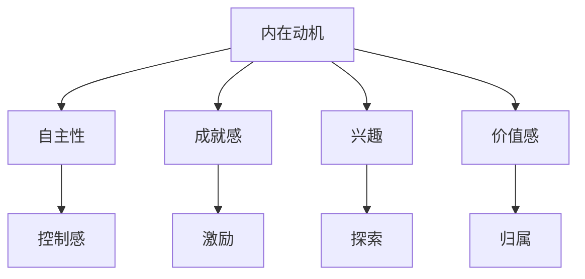
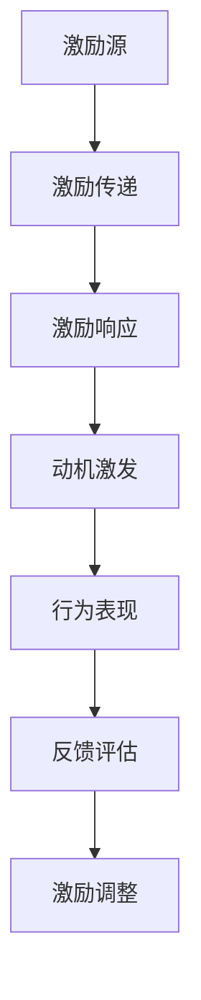

                 

# 如何激发团队的内在动机和热情

## 概述

### 关键词

- 团队动力
- 内在动机
- 心理学理论
- 行为学
- 领导力
- 激励策略
- 团队建设
- 案例研究

### 摘要

本文旨在探讨如何激发团队的内在动机和热情，以提高团队的整体效率和创新能力。通过对心理学和行为学基础理论的阐述，以及实际案例的研究和最佳实践分享，本文将提供一个系统性的框架和方法，帮助领导者和管理者构建积极的工作环境，提升团队成员的自我效能感和归属感，从而实现团队动力的最大化。

## 目录大纲

### 第一部分：团队动机与热情的基础理论

#### 第1章：团队动机与热情概述
- 1.1.1 内在动机的定义与重要性
- 1.1.2 团队成员的内在动机类型
- 1.1.3 热情在团队工作中的影响

#### 第2章：心理学与行为学基础
- 2.1.1 心理学理论对动机的影响
- 2.1.2 行为学理论在团队管理中的应用
- 2.1.3 社会心理学与团队氛围

### 第二部分：激发团队内在动机与热情的策略

#### 第3章：构建明确的目标与期望
- 3.1.1 如何设定有挑战性的目标
- 3.1.2 设定合理的目标期望
- 3.1.3 目标设定与内在动机的关系

#### 第4章：激发内在动机的方法
- 4.1.1 自我决定理论
- 4.1.2 自我效能感提升策略
- 4.1.3 自我成长与动机激发

#### 第5章：创建积极的工作环境
- 5.1.1 工作环境对动机的影响
- 5.1.2 如何打造支持性工作文化
- 5.1.3 鼓励团队成员之间的合作与沟通

### 第三部分：提高团队热情的具体实践

#### 第6章：领导力与团队动力
- 6.1.1 领导风格与团队动力
- 6.1.2 激发团队成员的热情
- 6.1.3 领导者在团队动力激发中的角色

#### 第7章：团队建设活动与培训
- 7.1.1 团队建设活动的目的与类型
- 7.1.2 如何设计有效的团队培训
- 7.1.3 团队建设活动对团队动机与热情的长期影响

#### 第8章：案例研究与最佳实践
- 8.1.1 案例一：如何通过目标设定激发团队动力
- 8.1.2 案例二：打造积极的工作环境的具体措施
- 8.1.3 案例三：领导力在团队动机激发中的应用

### 第四部分：持续激励与自我提升

#### 第9章：持续激励的策略
- 9.1.1 奖励与激励的平衡
- 9.1.2 激励机制的动态调整
- 9.1.3 长期激励的策略

#### 第10章：自我提升与职业发展
- 10.1.1 团队成员的自我认知与发展
- 10.1.2 职业发展路径与激励
- 10.1.3 自我提升对团队动力的影响

### 第五部分：附录

#### 附录 A：团队动机与热情理论 Mermaid 流程图
- Mermaid 图1：内在动机的心理学理论关系图
- Mermaid 图2：激励机制的构建与运作流程

#### 附录 B：代码案例与解析
- B.1.1 案例一：使用Python实现团队目标设定的代码解析
- B.1.2 案例二：创建积极工作环境的具体代码示例
- B.1.3 案例三：领导力在团队动机激发中的应用代码解析

#### 附录 C：进一步阅读与资源推荐
- C.1.1 推荐阅读书目
- C.1.2 网络资源与工具介绍
- C.1.3 团队建设与激励相关的专业组织与论坛

## 第一部分：团队动机与热情的基础理论

### 第1章：团队动机与热情概述

#### 1.1 内在动机的定义与重要性

**1.1.1 内在动机的概念**

内在动机是指个体在没有任何外部激励的情况下，出于自身兴趣、价值观和成就感而主动参与某种活动或任务的驱动力。它通常与自主性、成就感、兴趣和价值感等概念密切相关。

**Mermaid 流程图：**

graph TB
A[内在动机] --> B[自主性]
A --> C[成就感]
A --> D[兴趣]
A --> E[价值感]
B --> F[控制感]
C --> G[激励]
D --> H[探索]
E --> I[归属]

**1.1.2 内在动机的重要性**

内在动机对于团队的整体表现和创新能力具有重要意义。研究表明，具有内在动机的团队成员往往表现出更高的工作满意度、更强的团队合作精神和更出色的绩效表现。以下是内在动机的重要性的具体体现：

- **提高工作效率**：内在动机驱动的团队成员通常能够更高效地完成任务，因为他们对自己从事的工作充满热情和兴趣。
- **增强创新能力**：内在动机鼓励团队成员探索新方法和思路，从而推动团队在创新方面的突破。
- **提升团队凝聚力**：内在动机有助于团队成员之间建立深厚的信任和合作关系，增强团队凝聚力。

**伪代码：**

```python
def intrinsic_motivation_impact():
    if motivation > 0:
        return "提高工作效率, 增强创新能力, 提升团队凝聚力"
    else:
        return "缺乏内在动机，影响团队表现"
```

**1.1.3 团队成员的内在动机类型**

团队成员的内在动机类型多种多样，常见的有以下几种：

- **成就感**：成员追求完成任务的满足感，享受成功带来的成就感。
- **自主性**：成员希望在工作中拥有更多的自由度和自主权。
- **兴趣**：成员对自己参与的工作内容充满兴趣，愿意投入时间和精力。
- **价值感**：成员认为自己的工作对社会或团队有重要意义，感到自己的存在有价值。
- **探索**：成员喜欢挑战和尝试新事物，对未知领域充满好奇。

**示例：**

团队成员动机类型分类表：

| 成员姓名 | 动机类型         |
|----------|------------------|
| 张三     | 成就感、兴趣、价值感 |
| 李四     | 自主性、成就感、探索 |
| 王五     | 兴趣、价值感、探索   |

通过了解团队成员的内在动机类型，领导者可以更好地制定激励策略，满足不同成员的需求，从而提高团队的整体动力和绩效。

### 第2章：心理学与行为学基础

#### 2.1 心理学理论对动机的影响

**2.1.1 心理学理论对动机的影响**

心理学理论为我们理解动机的来源和影响提供了重要的理论基础。以下是一些关键心理学理论及其对动机的影响：

- **自我决定理论**：自我决定理论（Self-Determination Theory，简称SDT）由德西（Deci）和瑞安（Ryan）提出，强调个体在追求自主性、能力和归属感方面的基本需求。根据自我决定理论，内在动机的激发主要依赖于满足以下三个基本心理需求：

  - **自主性**：个体在行动过程中能够自由选择和掌控，不受外部压力的干扰。
  - **能力感**：个体在完成任务时能够感到自己的能力和技能得到认可和提升。
  - **归属感**：个体在团队中感到被接受和支持，与他人建立积极的社交关系。

  **Mermaid 流程图：**

  graph TB
  A[自我决定理论] --> B[自主性]
  A --> C[能力感]
  A --> D[归属感]
  B --> E[内在动机]
  C --> F[成就动机]
  D --> G[社会支持]

- **成就动机理论**：成就动机理论（Achievement Motivation Theory）由阿特金森（Atkinson）提出，强调个体在追求成功和避免失败方面的动机。根据成就动机理论，个体在设定目标时需要考虑以下两个因素：

  - **目标难度**：目标难度需要适中，既不过于容易导致满足感不足，也不过于困难导致挫败感。
  - **目标重要性**：目标对个体的意义和价值越大，个体越有可能为实现目标付出努力。

  **伪代码：**

  ```python
  def set_achievable_goals(difficulty, importance):
      if difficulty < 0.5 and importance > 0.5:
          return "目标设定成功：既有挑战性，又有意义"
      else:
          return "目标设定失败：难度或重要性不足"
  ```

- **期望-价值理论**：期望-价值理论（Expectancy-Value Theory）由弗洛姆（Vroom）提出，强调个体在决策过程中考虑期望值和价值观的影响。根据期望-价值理论，个体在评估行为结果时需要考虑以下两个因素：

  - **期望值**：个体对实现目标概率的评估。
  - **价值**：个体对目标实现结果的主观评价。

  **数学模型：**

  ```
  motivation = expectancy × value
  ```

- **自我效能感理论**：自我效能感理论（Self-Efficacy Theory）由班杜拉（Bandura）提出，强调个体对自己能够成功完成特定任务的信念。自我效能感对动机的影响主要体现在以下几个方面：

  - **自信心**：自我效能感高的个体通常表现出更强的自信心和勇气，愿意接受挑战。
  - **坚持性**：自我效能感高的个体在面对困难和挫折时更能坚持下去，不易放弃。
  - **动机激发**：自我效能感影响个体对目标价值的评估，从而影响动机水平。

  **数学模型：**

  ```
  self_efficacy = (success Experience + substitute Experience + emotional State) / psychological Burden
  ```

**2.1.2 行为学理论在团队管理中的应用**

行为学理论为我们提供了理解个体行为和团队互动的有力工具。以下是一些关键行为学理论及其在团队管理中的应用：

- **强化理论**：强化理论（Reinforcement Theory）由斯金纳（Skinner）提出，强调通过奖励和惩罚来影响个体行为。在团队管理中，强化理论的应用主要包括：

  - **正强化**：通过奖励（如奖金、晋升机会等）来增强积极行为。
  - **负强化**：通过消除负面因素（如减少工作量、避免惩罚等）来增强积极行为。
  - **惩罚**：通过惩罚（如批评、扣分等）来减少消极行为。

  **伪代码：**

  ```python
  def reinforcement_strategybehavior, reinforcement):
      if reinforcement == "positive":
          return "增加奖励，鼓励积极行为"
      elif reinforcement == "negative":
          return "消除负面因素，鼓励积极行为"
      else:
          return "实施惩罚，减少消极行为"
  ```

- **归因理论**：归因理论（Attribution Theory）由海德（Heider）提出，强调个体如何解释和理解他人行为。在团队管理中，归因理论的应用主要包括：

  - **内部归因**：将行为结果归因于个体能力和努力，有助于提高团队成员的自信心和动力。
  - **外部归因**：将行为结果归因于外部因素（如运气、环境等），有助于减轻团队成员的压力和焦虑。

  **伪代码：**

  ```python
  def attribution_strategy(result, attribution):
      if attribution == "internal":
          return "强调个体能力和努力，提高自信心"
      elif attribution == "external":
          return "归因于外部因素，减轻压力"
      else:
          return "综合内部和外部因素，提供全面反馈"
  ```

- **群体动力理论**：群体动力理论（Group Dynamics Theory）强调群体内个体之间的相互作用和影响。在团队管理中，群体动力理论的应用主要包括：

  - **群体凝聚力**：通过建立积极的团队氛围和共同目标，提高团队成员之间的信任和合作。
  - **群体规范**：制定明确的行为规范，帮助团队成员明确期望和行为准则。
  - **群体决策**：鼓励团队成员参与决策过程，提高决策的接受度和执行效果。

  **伪代码：**

  ```python
  def group_dynamics_strategy(goal, cohesion, norms, decision_process):
      if cohesion > 0 and norms == "clear" and decision_process == "inclusive":
          return "提高群体凝聚力，增强团队动力"
      else:
          return "改善团队氛围，加强群体规范和决策参与"
  ```

通过运用心理学和行为学理论，领导者可以更深入地理解团队成员的动机和行为，从而制定更有效的激励和管理策略。

**2.1.3 社会心理学与团队氛围**

社会心理学（Social Psychology）研究个体如何受到社会因素影响，以及个体如何影响社会环境。在团队管理中，社会心理学理论有助于理解团队氛围和成员互动。

- **社会认同理论**：社会认同理论（Social Identity Theory）由特纳（Turner）提出，强调个体通过所属群体获得认同感和归属感。在团队管理中，社会认同理论的应用主要包括：

  - **团队文化建设**：通过共同的目标、价值观和行为准则，增强团队成员的认同感和归属感。
  - **团队凝聚力**：通过团队活动和合作任务，提高团队成员之间的信任和依赖。
  - **团队激励**：利用社会认同机制，激发团队成员的内在动机和热情。

  **伪代码：**

  ```python
  def social_identity_strategy(goal, values, behavior_standards):
      if goal == "common" and values == "aligned" and behavior_standards == "clear":
          return "建立积极团队文化，增强团队认同感和凝聚力"
      else:
          return "改进团队目标和价值观，明确行为准则"
  ```

- **群体动力学**：群体动力学（Group Dynamics）研究团队内部成员之间的相互作用和影响。在团队管理中，群体动力学的应用主要包括：

  - **沟通与协作**：通过有效的沟通和协作机制，提高团队成员之间的信息共享和合作效率。
  - **冲突管理**：通过积极的冲突解决策略，降低团队内部的矛盾和分歧。
  - **领导与成员互动**：通过建立良好的领导与成员互动关系，提高团队成员的参与感和满意度。

  **伪代码：**

  ```python
  def group_dynamics_strategy(communication, collaboration, conflict_management, leadership_interaction):
      if communication > 0 and collaboration > 0 and conflict_management == "effective" and leadership_interaction == "positive":
          return "提高团队沟通与协作，有效管理冲突，建立良好领导与成员关系"
      else:
          return "改善沟通与协作机制，加强冲突管理和领导与成员互动"
  ```

通过结合心理学和行为学理论，以及社会心理学与团队氛围的研究，领导者可以更全面地理解和激发团队成员的内在动机和热情，从而实现团队的高效运作和持续发展。

### 第二部分：激发团队内在动机与热情的策略

#### 第3章：构建明确的目标与期望

在团队管理中，设定明确的目标和期望是激发团队内在动机和热情的重要策略之一。通过有挑战性且具体的目标设定，可以引导团队成员朝着共同的目标努力，同时提高他们的工作满意度和成就感。

**3.1 如何设定有挑战性的目标**

设定有挑战性的目标对于激发团队成员的内在动机至关重要。以下是一些关键步骤和方法：

**3.1.1 设定具体、可衡量的目标**

具体、可衡量的目标有助于团队成员清晰地了解自己的工作方向和预期成果。使用SMART原则（具体、可衡量、可实现、相关、时限性）设定目标，可以确保目标具有明确性和可行性。

**示例：**
- 具体性：本季度我们需要完成3个新功能模块的开发。
- 可衡量性：每个模块的完成标准是100%通过单元测试。
- 可实现性：我们拥有足够的资源和人力来完成这些任务。
- 相关性：新功能模块的完成将直接提高用户满意度。
- 时限性：这些任务需要在3个月内完成。

**数学模型：**
$$
\text{目标设定} = \frac{\text{具体性} + \text{可衡量性} + \text{可实现性} + \text{相关性} + \text{时限性}}{5}
$$

**3.1.2 如何设定有挑战性的目标**

设定有挑战性的目标可以激发团队成员的潜能和动力，但同时也需要考虑目标的可行性和团队成员的能力。以下是一些建议：

- **逐步提高难度**：从简单到复杂，逐步提高目标的难度，帮助团队成员逐步适应挑战。
- **设定合理的时间框架**：确保目标有足够的时间来完成，避免因时间紧迫而导致的压力和焦虑。
- **考虑团队成员的能力**：根据团队成员的能力和经验，设定合理的目标难度。

**伪代码：**
```python
def set_challenge_goals(goals, team_members):
    for member in team_members:
        member['goal'] = set_goal_difficulty(goals[member['name']], member['skills'])
    return "目标设定完成：{}".format(goals)

def set_goal_difficulty(goal, skills):
    if goal['difficulty'] > skills['current_level']:
        return "目标难度过高，需调整"
    elif goal['deadline'] < skills['deadline_threshold']:
        return "目标时间过紧，需调整"
    else:
        return "目标设定合理"
```

**3.1.3 设定合理的目标期望**

设定合理的目标期望是确保团队成员能够实现目标的重要一环。以下是一些关键步骤和方法：

- **与团队成员沟通**：在设定目标时，与团队成员进行充分的沟通，了解他们的意见和建议，确保目标具有可行性和合理性。
- **考虑外部环境因素**：在设定目标时，要考虑外部环境的变化和不确定性，确保目标具有适应性。
- **设定合理的评估标准**：根据目标的类型和内容，设定合理的评估标准，确保目标的实现程度可以准确评估。

**数学模型：**
$$
\text{目标期望} = \frac{\text{目标难度} \times \text{团队成员能力}}{\text{外部环境不确定性}}
$$

**示例：**
- 目标难度：7（非常具有挑战性）
- 团队成员能力：6（具备一定的能力，但有一定难度）
- 外部环境不确定性：2（较低的不确定性）

**计算结果：**
$$
\text{目标期望} = \frac{7 \times 6}{2} = 21
$$

**3.1.4 目标设定与内在动机的关系**

目标设定与内在动机之间存在密切的关系。设定合理的目标可以激发团队成员的内在动机，提高他们的工作满意度和成就感。以下是一些具体关系：

- **成就感**：通过设定具有挑战性的目标，团队成员在实现目标时会获得成就感，从而提高内在动机。
- **自主性**：设定具体、可衡量的目标，给予团队成员更多的自主权，有助于提高内在动机。
- **能力感**：通过设定与团队成员能力相匹配的目标，可以增强他们的能力感，从而提高内在动机。

**伪代码：**
```python
def goal_motivation_impact(goal, member):
    if goal['difficulty'] > member['skills']['current_level']:
        return "目标难度过高，可能降低内在动机"
    elif goal['deadline'] < member['skills']['deadline_threshold']:
        return "目标时间过紧，可能降低内在动机"
    else:
        return "目标设定合理，有助于提高内在动机"
```

通过构建明确、具体、有挑战性的目标和期望，领导者可以有效地激发团队的内在动机和热情，推动团队实现更高的绩效和成就。

#### 第4章：激发内在动机的方法

激发团队的内在动机是提升团队工作效率和创新能力的关键。在这一章中，我们将探讨几种有效的方法，包括自我决定理论、自我效能感的提升策略以及自我成长与动机激发。

**4.1 自我决定理论**

自我决定理论（Self-Determination Theory，简称SDT）是由德西（Deci）和瑞安（Ryan）提出的，它强调个体在追求自主性、能力和归属感方面的基本需求。根据自我决定理论，激发内在动机的关键在于满足以下三个基本心理需求：

- **自主性**：个体需要自由选择和掌控自己的行动，不受外部压力的干扰。
- **能力感**：个体需要感到自己在完成任务时具备足够的能力和技能。
- **归属感**：个体需要感到自己在团队中是被接受和重视的，与他人有良好的社交关系。

**4.1.1 自我决定理论的具体应用**

为了在团队中应用自我决定理论，领导者可以采取以下策略：

- **赋予自主权**：给予团队成员更多的自主权，让他们在项目中拥有更多的决策权和责任。例如，允许团队成员自主选择项目任务、工作方法和进度安排。
- **提供支持和资源**：确保团队成员在完成工作时能够获得必要的技术支持和资源，从而提高他们的能力感。例如，提供培训、研讨会和工具，帮助团队成员提升技能和知识。
- **建立归属感**：通过团队活动和团队建设，增强团队成员之间的联系和归属感。例如，定期举办团队聚餐、团队建设活动和团队讨论，促进团队成员之间的交流和合作。

**伪代码：**
```python
def apply_self_determination_theory(autonomy, competence, relatedness):
    if autonomy > 0 and competence > 0 and relatedness > 0:
        return "团队内部需求得到满足，内在动机增强"
    else:
        return "需改进团队管理策略，满足团队成员需求"
```

**4.1.2 自我效能感提升策略**

自我效能感（Self-Efficacy）是指个体对自己完成特定任务的能力的信念。高自我效能感的团队成员更有信心面对挑战，更愿意尝试新方法，从而提高团队的整体动力和绩效。

**4.1.2.1 自我效能感的重要性**

- **影响任务选择**：高自我效能感的团队成员更倾向于选择具有挑战性的任务，因为他们相信自己的能力可以完成任务。
- **影响工作态度**：高自我效能感的团队成员通常表现出更积极的工作态度，更有动力完成任务。
- **影响团队合作**：高自我效能感的团队成员在团队合作中更能发挥领导作用，帮助团队克服困难。

**4.1.2.2 提升自我效能感的策略**

- **成功经验**：鼓励团队成员分享他们在工作中的成功经验，增强他们对自身能力的信心。
- **替代经验**：通过观察其他团队成员的成功案例，帮助团队成员了解完成任务的方法和策略，从而提升自我效能感。
- **情绪调节**：通过情绪调节技巧，帮助团队成员在面临困难时保持积极心态，减少焦虑和压力。

**数学模型：**
$$
\text{自我效能感} = \frac{\text{成功经验} + \text{替代经验} + \text{情绪状态}}{\text{心理负担}}
$$

**伪代码：**
```python
def enhance_self_efficacy(success, substitutes, emotions, burden):
    self_efficacy = (success + substitutes + emotions) / burden
    return "自我效能感提升至：{}".format(self_efficacy)
```

**4.1.3 自我成长与动机激发**

自我成长（Self-Growth）是指个体通过不断学习和实践，提升自身能力和知识水平的过程。自我成长不仅能提升个体的自我效能感，还能激发他们的内在动机。

**4.1.3.1 自我成长的重要性**

- **提升竞争力**：通过自我成长，团队成员可以不断更新知识和技能，提高在职场中的竞争力。
- **增强内在动机**：自我成长过程中的成就感和自豪感可以激发团队成员的内在动机。
- **促进职业发展**：自我成长有助于团队成员在职业生涯中实现更高的目标，获得更多的晋升机会。

**4.1.3.2 自我成长的策略**

- **职业规划**：帮助团队成员制定清晰的职业发展路径，明确自我成长的长期目标。
- **提供培训**：定期组织培训课程，帮助团队成员提升专业技能和知识水平。
- **鼓励自主学习**：鼓励团队成员利用业余时间自主学习，提升个人能力。

**伪代码：**
```python
def promote_self_growth(planning, training, self_education):
    if planning == "clear" and training == "frequent" and self_education == "active":
        return "自我成长计划有效，内在动机增强"
    else:
        return "需加强职业规划和培训，促进自我成长"
```

通过应用自我决定理论、提升自我效能感和促进自我成长，领导者可以有效地激发团队的内在动机，提高团队的整体绩效和创新能力。

#### 第5章：创建积极的工作环境

一个积极的工作环境是激发团队内在动机和热情的关键因素。工作环境不仅包括物理环境，还涵盖了组织文化、团队氛围等多个方面。在这一章中，我们将探讨如何创建积极的工作环境，并讨论工作环境对动机的影响。

**5.1 工作环境对动机的影响**

工作环境对团队成员的动机具有显著影响。一个良好的工作环境可以激发团队成员的内在动机，提高工作效率和创新能力。以下是一些主要方面：

**5.1.1 物理环境**

物理环境是团队成员工作的重要基础。一个舒适、整洁、安全的工作环境可以提高团队成员的工作满意度和幸福感。

- **办公空间**：为团队成员提供宽敞、明亮的办公空间，有助于提高工作效率和创造力。
- **设备与工具**：确保团队成员能够获得必要的设备和工具，以便高效地完成工作任务。
- **休息区域**：为团队成员提供舒适的休息区域，有助于缓解工作压力，提高工作积极性。

**5.1.2 组织文化**

组织文化是团队成员工作环境的重要组成部分，它影响着团队成员的价值观、态度和行为。

- **开放性**：建立一个开放、透明的工作环境，鼓励团队成员分享自己的想法和建议，提高团队凝聚力。
- **鼓励创新**：鼓励团队成员尝试新思路和方法，提供创新的支持和资源，激发团队成员的创造力。
- **认可与奖励**：建立一套公平、透明的认可与奖励机制，对团队成员的贡献给予认可和奖励，提高工作满意度和动力。

**5.1.3 团队氛围**

团队氛围是团队成员在工作过程中形成的心理环境，它直接影响团队成员的动机和行为。

- **合作与支持**：建立一个支持性的团队氛围，鼓励团队成员之间的合作与帮助，减少内部竞争，提高团队凝聚力。
- **沟通与反馈**：建立有效的沟通渠道和反馈机制，确保团队成员之间的信息共享和意见交流，提高团队协作效率。
- **冲突管理**：建立一套有效的冲突管理策略，及时解决团队内部的矛盾和分歧，保持团队的和谐与稳定。

**5.2 如何打造支持性工作文化**

打造支持性工作文化是创建积极工作环境的关键。以下是一些建议：

**5.2.1 提供透明度和信任**

- **信息共享**：定期向团队成员分享公司目标和进展，提高团队成员的参与感和归属感。
- **信任建立**：信任是团队合作的基石，领导者需要通过行动赢得团队成员的信任，鼓励开放沟通和合作。

**5.2.2 鼓励自主性和创新能力**

- **自主权**：给予团队成员更多的自主权，让他们在项目中发挥更大的主动性，提高工作满意度和创造力。
- **创新支持**：为团队成员提供创新所需的资源和支持，鼓励他们尝试新思路和方法。

**5.2.3 建立积极的工作氛围**

- **团队活动**：定期举办团队建设活动和培训，增强团队成员之间的联系和合作，提高团队凝聚力。
- **认可与奖励**：对团队成员的贡献给予认可和奖励，鼓励积极行为，提高工作满意度和动力。

**5.2.4 提高沟通效率**

- **沟通渠道**：建立多种沟通渠道，如定期会议、邮件、即时通讯等，确保团队成员之间的信息流畅。
- **反馈机制**：建立有效的反馈机制，鼓励团队成员提出意见和建议，及时解决问题。

**5.3 鼓励团队成员之间的合作与沟通**

团队合作和沟通是团队成功的关键。以下是一些建议：

**5.3.1 建立明确的团队目标和期望**

- **共同目标**：确保团队成员明确团队目标和各自的角色，提高团队成员的协作效率。
- **明确期望**：设定具体、可衡量的期望，帮助团队成员了解自己的工作职责和目标。

**5.3.2 鼓励跨部门合作**

- **跨部门项目**：组织跨部门项目，鼓励团队成员之间的交流和合作，提高团队的整体绩效。
- **资源共享**：建立资源共享机制，促进团队成员之间的知识和技术共享。

**5.3.3 提高沟通技巧**

- **培训**：定期组织沟通技巧培训，提高团队成员的沟通能力和表达能力。
- **反馈**：鼓励团队成员在沟通过程中给予反馈，及时纠正沟通中的问题。

通过创建积极的工作环境，领导者可以有效地激发团队成员的内在动机和热情，提高团队的整体绩效和创新能力。积极的工作环境不仅有助于提升团队成员的工作满意度，还能促进团队的长期发展和成功。

### 第三部分：提高团队热情的具体实践

#### 第6章：领导力与团队动力

领导力是激发团队动力和热情的关键因素。有效的领导风格和领导行为可以极大地影响团队成员的动机和工作表现。在这一章中，我们将探讨领导力与团队动力之间的关系，以及如何通过有效的领导力策略来提高团队的热情。

**6.1 领导风格与团队动力**

领导风格是指领导者与团队成员互动的方式和方法。不同的领导风格对团队动力有着不同的影响。以下是一些常见的领导风格及其对团队动力的作用：

**6.1.1 权威型领导**

权威型领导风格强调领导者对决策和控制的权力。这种领导风格通常能够迅速做出决策，确保团队的纪律和效率，但可能降低团队成员的自主性和创新能力。

**优点**：
- 高效决策
- 确保团队纪律
- 稳定的团队绩效

**缺点**：
- 缺乏自主性
- 可能抑制创新

**适用场景**：在紧急情况下或需要迅速解决问题的场景中，权威型领导可以快速作出决策，确保团队的稳定和高效。

**6.1.2 参与型领导**

参与型领导风格强调领导者与团队成员之间的互动和合作。领导者鼓励团队成员参与决策过程，提供反馈和支持，这种领导风格有助于提高团队成员的自主性和创新能力。

**优点**：
- 提高自主性
- 增强创新能力
- 提高团队凝聚力

**缺点**：
- 决策过程可能较慢
- 可能出现权力分散

**适用场景**：在需要创新和长期项目管理的场景中，参与型领导可以激发团队成员的内在动机和热情，提高团队的整体绩效。

**6.1.3 情境型领导**

情境型领导风格根据团队成员的不同需求和情境调整领导风格。这种领导风格强调灵活性和适应性，能够根据具体情况选择最适合的领导方式。

**优点**：
- 灵活适应不同情境
- 提高团队适应性
- 增强团队凝聚力

**缺点**：
- 可能导致领导风格不稳定
- 需要较高的领导技能

**适用场景**：在复杂和多变的工作环境中，情境型领导可以帮助团队适应变化，提高整体动力和绩效。

**6.2 激发团队成员的热情**

激发团队成员的热情是提升团队动力的重要一环。以下是一些具体策略：

**6.2.1 提供有意义的工作**

有意义的工作能够激发团队成员的内在动机和热情。领导者可以通过以下方式提供有意义的工作：

- **明确工作意义**：向团队成员阐述他们的工作对公司和社会的意义，帮助他们理解自己的价值。
- **设定有意义的目标**：设定与团队成员价值观相符合的目标，激发他们的工作热情。

**6.2.2 提供合理的奖励和认可**

合理的奖励和认可可以增强团队成员的成就感和归属感，从而提高他们的工作热情。以下是一些具体策略：

- **即时奖励**：对团队成员的出色表现给予即时奖励，如奖金、休假等。
- **公开认可**：在团队会议或公开场合对团队成员的贡献给予认可和表扬。
- **长期激励**：提供长期激励，如晋升机会、职业发展路径等。

**6.2.3 提供支持和反馈**

支持和反馈是激发团队成员热情的重要手段。以下是一些具体策略：

- **个性化支持**：根据团队成员的需求提供个性化的支持和帮助，提高他们的工作满意度。
- **定期反馈**：定期与团队成员进行一对一的反馈，帮助他们了解自己的工作表现和改进方向。
- **建设性反馈**：提供积极、建设性的反馈，鼓励团队成员不断进步。

**6.3 领导者在团队动力激发中的角色**

领导者在激发团队动力和热情中扮演着关键角色。以下是一些领导者需要承担的角色：

**6.3.1 榜样的角色**

领导者需要通过自己的行为树立榜样，激发团队成员的内在动机和热情。以下是一些具体策略：

- **诚信与透明**：领导者需要展现诚信和透明的行为，赢得团队成员的信任和尊重。
- **持续学习**：领导者需要不断学习和提升自己的能力，成为团队成员的学习榜样。

**6.3.2 激励者的角色**

领导者需要激发团队成员的内在动机和热情，以下是一些具体策略：

- **设定挑战性目标**：领导者需要设定具有挑战性的目标，激发团队成员的进取心。
- **提供支持和资源**：领导者需要为团队成员提供必要的支持和资源，帮助他们实现目标。

**6.3.3 沟通者的角色**

领导者需要与团队成员保持良好的沟通，以下是一些具体策略：

- **开放沟通**：领导者需要建立开放、坦诚的沟通渠道，鼓励团队成员表达意见和建议。
- **倾听**：领导者需要倾听团队成员的声音，了解他们的需求和想法。

通过有效的领导力和具体的激励策略，领导者可以激发团队成员的内在动机和热情，提高团队的整体绩效和创新能力。

#### 第7章：团队建设活动与培训

团队建设活动和培训是提高团队动力和协作能力的重要手段。通过有效的团队建设活动和培训，可以增强团队成员之间的信任、沟通和合作，从而提高团队的整体绩效和创新能力。以下将探讨团队建设活动的目的与类型，如何设计有效的团队培训，以及团队建设活动对团队动机与热情的长期影响。

**7.1 团队建设活动的目的与类型**

团队建设活动的目的是增强团队成员之间的信任、沟通和合作，提高团队的整体绩效和创新能力。以下是常见的团队建设活动类型及其目的：

**7.1.1 团队合作任务**

团队合作任务是团队建设活动的一种形式，通过共同完成任务来增强团队成员之间的合作与沟通。这些任务通常包括解决实际问题、完成团队竞赛等。

**目的**：
- 提高团队成员的协作能力
- 增强团队成员之间的信任
- 提高团队的整体绩效

**7.1.2 团队讨论与分享**

团队讨论与分享活动是团队成员交流想法、经验和建议的机会。通过这些活动，团队成员可以更好地了解彼此的思考方式和工作方法。

**目的**：
- 提高团队成员的沟通技巧
- 促进知识共享
- 增强团队凝聚力

**7.1.3 团队拓展训练**

团队拓展训练是一种通过户外活动来增强团队成员信任和合作能力的活动。这些活动通常包括高空走钢丝、攀岩等。

**目的**：
- 提高团队成员的心理素质
- 增强团队成员之间的信任
- 提高团队协作能力

**7.1.4 团队培训**

团队培训是一种通过系统性的知识和技能传授来提高团队成员能力的方法。这些培训活动可以包括技术培训、领导力培训等。

**目的**：
- 提高团队成员的专业技能
- 增强团队成员的团队合作能力
- 提高团队的整体绩效

**7.2 如何设计有效的团队培训**

设计有效的团队培训是提高团队能力和动力的重要一环。以下是一些关键步骤和方法：

**7.2.1 明确培训目标**

在设计和实施团队培训之前，需要明确培训的目标。这些目标应与团队的整体目标和战略相一致，具体、可衡量，例如：

- 提高团队成员的沟通技巧
- 增强团队成员的领导能力
- 提高团队成员的专业技能

**7.2.2 选择合适的培训方式**

根据培训目标和团队成员的需求，选择合适的培训方式。以下是一些常见的培训方式：

- **内训**：由公司内部的专业人员或导师进行培训。
- **外训**：由外部培训机构或专业讲师进行培训。
- **在线培训**：通过在线平台提供的课程进行培训。

**7.2.3 制定详细的培训计划**

制定详细的培训计划，包括培训内容、时间安排、培训地点和培训师等信息。确保培训计划具有可执行性，并能够满足团队成员的需求。

**7.2.4 激发参与度**

通过激发团队成员的参与度，可以提高培训的效果。以下是一些具体策略：

- **提供培训激励**：对参与培训的团队成员提供奖励或认可，如奖金、晋升机会等。
- **鼓励互动**：在培训过程中鼓励团队成员参与讨论和互动，提高他们的参与度和学习效果。
- **个性化培训**：根据团队成员的需求和特点，提供个性化的培训方案，提高培训的针对性。

**7.3 团队建设活动对团队动机与热情的长期影响**

团队建设活动不仅能够提高团队成员的技能和协作能力，还能对团队的内在动机和热情产生长期影响。以下是一些具体影响：

**7.3.1 提高团队凝聚力**

通过团队建设活动，团队成员可以更好地了解彼此，增强相互信任和合作，从而提高团队凝聚力。高凝聚力的团队通常具有更高的内部协作和整体绩效。

**7.3.2 提高团队工作效率**

团队建设活动可以帮助团队成员掌握更有效的沟通和协作技巧，提高团队工作效率。通过减少内部摩擦和误解，团队可以更迅速地完成任务和实现目标。

**7.3.3 增强创新能力**

团队建设活动可以激发团队成员的创新思维和创造力，促进团队在技术和产品方面的创新。一个具有创新能力的团队能够在竞争激烈的市场中脱颖而出。

**7.3.4 提高工作满意度**

团队建设活动可以增强团队成员的工作满意度和幸福感，减少工作压力和疲劳。一个快乐的团队通常更有动力和热情地投入到工作中。

**7.3.5 促进个人成长**

团队建设活动不仅可以提高团队的整体能力，还能促进团队成员的个人成长。通过参与培训和学习，团队成员可以不断提升自己的技能和知识水平，实现职业发展。

通过设计有效的团队建设活动和培训，领导者可以激发团队的内在动机和热情，提高团队的整体绩效和创新能力。团队建设活动和培训不仅有助于实现短期目标，还能为团队的长期发展奠定坚实基础。

#### 第8章：案例研究与最佳实践

在团队管理和激励领域，有许多成功的案例和最佳实践可以借鉴。本章节将通过三个具体案例，探讨如何通过目标设定、打造积极的工作环境和领导力的有效应用来激发团队的内在动机和热情。

**8.1 案例一：如何通过目标设定激发团队动力**

案例描述：某科技公司的新产品开发团队在面对一个紧迫的市场机会时，通过设定明确且有挑战性的目标，成功激发了团队成员的内在动机和热情。

案例分析：
- **目标设定**：团队领导者与团队成员一起设定了具体、可衡量的目标，包括开发时间表、功能要求和质量标准。
- **目标期望**：通过分析团队成员的能力和资源，领导者确保目标具有挑战性但可实现，同时考虑到外部市场环境的不确定性。
- **目标反馈**：团队领导者定期与团队成员进行目标反馈，讨论进展、挑战和改进措施。

结论：
通过明确的目标设定和积极的反馈机制，团队成员的内在动机得到了显著提升。团队在期限内成功完成了新产品开发，并获得了市场的高度认可。

**8.2 案例二：打造积极的工作环境的具体措施**

案例描述：某互联网公司通过一系列措施，成功打造了一个积极的工作环境，从而增强了团队成员的内在动机和热情。

案例分析：
- **物理环境**：公司投入大量资金改善办公环境，提供了宽敞、舒适的办公空间、良好的照明和现代化的设备。
- **组织文化**：公司建立了开放、支持性的组织文化，鼓励团队成员分享意见、提出建议，并通过透明的沟通渠道确保信息流通。
- **激励机制**：公司实施了一套公平、透明的激励机制，对团队成员的贡献给予认可和奖励，同时注重长期激励，如职业发展和晋升机会。

结论：
通过改善物理环境、建立积极的组织文化和实施有效的激励机制，公司成功地营造了一个有利于激发团队成员内在动机的工作环境，从而提升了团队的整体绩效和创新能力。

**8.3 案例三：领导力在团队动机激发中的应用**

案例描述：某创业公司的创始人通过一系列领导力策略，成功激发了团队的内在动机和热情，带领团队在短时间内取得了显著的市场突破。

案例分析：
- **领导风格**：创始人采用了参与型领导风格，鼓励团队成员参与决策过程，给予他们更多的自主权和责任感。
- **激励策略**：创始人通过设定具有挑战性的目标、提供即时反馈和认可团队成员的成就来激发团队动力。
- **领导与成员互动**：创始人通过定期的一对一沟通、团队会议和培训，与团队成员建立了深厚的信任和合作关系。

结论：
通过采用参与型领导风格、有效的激励策略和积极的领导与成员互动，创始人成功地激发了团队成员的内在动机和热情，推动了团队在短时间内取得了显著的市场突破和业绩提升。

这些案例表明，通过明确的目标设定、打造积极的工作环境和有效应用领导力策略，领导者可以激发团队的内在动机和热情，实现团队的高效运作和持续发展。

### 第四部分：持续激励与自我提升

#### 第9章：持续激励的策略

持续激励是维持团队内在动机和热情的关键。在这一章中，我们将探讨如何平衡奖励与激励、动态调整激励机制以及制定长期激励策略，从而确保团队成员在长期内保持高效和积极的工作状态。

**9.1 奖励与激励的平衡**

奖励和激励是激发团队内在动机和热情的重要手段，但如何平衡两者是一个关键问题。以下是一些策略：

**9.1.1 奖励的优点与局限**

- **优点**：奖励可以迅速提升团队成员的积极性和工作动力，有助于立即改善行为和绩效。
- **局限**：过度依赖奖励可能导致团队成员对奖励产生依赖，一旦奖励减少，动机可能下降。

**9.1.2 激励的优点与局限**

- **优点**：激励关注内在动机，如成就感、自主性和价值感，能够促进长期动机和持续表现。
- **局限**：激励可能需要较长时间才能显现效果，且实施难度较大。

**9.1.3 平衡策略**

- **短期奖励与长期激励相结合**：在短期内使用奖励来迅速提高团队动力，同时注重长期激励，如职业发展、培训和个人成长。
- **个性化奖励**：根据团队成员的不同需求和动机，提供个性化的奖励和激励方案。

**数学模型：**

$$
\text{激励平衡} = \frac{\text{内在激励} + \text{外在奖励}}{\text{期望回报} + \text{成本}}
$$

**9.2 动态调整激励机制**

激励机制需要根据团队和个体的变化进行调整，以保持其有效性。以下是一些动态调整策略：

**9.2.1 监测和评估**

- **定期监测**：通过定期的绩效评估和反馈，了解团队成员的表现和需求。
- **评估激励效果**：分析奖励和激励措施对团队动力的实际影响，识别有效的策略和需要改进的领域。

**9.2.2 个性化调整**

- **根据绩效调整**：对表现优异的团队成员提供更多的激励，对表现不佳的团队成员提供改进建议和激励。
- **根据需求调整**：根据团队成员的个人需求和动机，调整激励措施，确保其与个人目标相一致。

**伪代码：**

```python
def adjust_incentive_strategy(performance, needs):
    if performance > threshold and needs == "growth":
        return "提高奖励，提供职业发展机会"
    elif performance < threshold and needs == "support":
        return "提供额外培训和支持"
    else:
        return "保持现有激励措施，定期评估调整"
```

**9.3 长期激励策略**

长期激励策略旨在维持团队成员的内在动机和热情，确保团队在长期内保持高效和积极的工作状态。以下是一些长期激励策略：

**9.3.1 职业发展机会**

- **制定职业规划**：帮助团队成员制定清晰的职业发展路径，明确长期目标和阶段性目标。
- **提供晋升机会**：定期评估团队成员的表现，提供晋升机会，激励他们不断提升自己的能力和绩效。

**9.3.2 工作满意度**

- **改善工作环境**：通过改善办公设施、提供灵活的工作时间和工作地点，提高团队成员的工作满意度。
- **关注工作质量**：确保团队成员的工作内容具有挑战性且有意义，提高工作满意度和成就感。

**9.3.3 组织认同感**

- **建立共同目标**：确保团队成员对公司的使命、愿景和文化有认同感，建立共同的价值观和目标。
- **促进团队协作**：通过团队合作和共享成就，增强团队成员的归属感和组织认同感。

通过平衡奖励与激励、动态调整激励机制以及制定长期激励策略，领导者可以有效地维持团队的内在动机和热情，实现团队的长远发展和成功。

#### 第10章：自我提升与职业发展

在职场中，自我提升和职业发展是每个团队成员的重要任务。通过自我提升，团队成员不仅可以提高个人能力，还可以激发内在动机和热情，从而推动团队整体绩效的提升。以下将探讨团队成员的自我认知与发展、职业发展路径与激励，以及自我提升对团队动力的影响。

**10.1 团队成员的自我认知与发展**

自我认知是团队成员自我提升的起点。通过深入了解自己的兴趣、优势和弱点，团队成员可以更有效地制定个人发展计划。

**10.1.1 自我评估**

- **SWOT分析**：通过SWOT分析（Strengths、Weaknesses、Opportunities、Threats），团队成员可以全面了解自己的优势和弱点，以及外部环境和机遇。
- **360度反馈**：通过360度反馈，团队成员可以收集来自同事、上级和下属的反馈，获得更全面的自我认知。

**10.1.2 个人发展计划**

- **设定目标**：根据自我评估的结果，团队成员可以设定具体、可衡量、可实现的目标，如技能提升、知识拓展等。
- **行动计划**：制定详细的行动计划，包括时间表、资源和步骤，确保目标的实现。

**伪代码：**

```python
def self_assessment(self_evaluation, feedback):
    strengths = self_evaluation['strengths']
    weaknesses = self_evaluation['weaknesses']
    opportunities = self_evaluation['opportunities']
    threats = self_evaluation['threats']
    
    # 根据评估结果制定个人发展计划
    development_plan = {
        'goals': ['improve skills', 'expand knowledge'],
        'action_plan': ['take training courses', 'read professional books']
    }
    
    return development_plan
```

**10.2 职业发展路径与激励**

职业发展路径是团队成员实现自我提升和职业目标的重要途径。通过明确的职业发展路径，团队成员可以更好地规划自己的职业生涯，同时获得组织的支持和激励。

**10.2.1 职业发展路径**

- **技能发展路径**：根据团队成员的兴趣和优势，制定具体的技能发展路径，如编程、项目管理、团队领导等。
- **职业晋升路径**：明确团队成员的晋升机会和晋升条件，确保他们有清晰的发展方向和目标。

**10.2.2 激励策略**

- **职业激励**：通过提供晋升机会、职业培训、薪资调整等激励措施，鼓励团队成员不断提升自己的能力和绩效。
- **长期激励**：通过设定长期目标、提供职业发展的保障和承诺，激发团队成员的长期动机和热情。

**数学模型：**

$$
\text{职业发展激励} = \frac{\text{晋升机会} + \text{职业培训} + \text{薪资调整}}{\text{团队成员职业期望} + \text{外部竞争压力}}
$$

**10.3 自我提升对团队动力的影响**

自我提升不仅有助于团队成员个人能力的提升，还可以对团队动力产生积极的影响。

**10.3.1 提升自我效能感**

通过自我提升，团队成员可以增强自我效能感，即对自己能够成功完成任务的信念。自我效能感的提升可以激发团队成员的内在动机和热情，提高工作满意度和工作绩效。

**10.3.2 增强团队合作精神**

自我提升有助于团队成员在团队中发挥更大的作用，从而增强团队合作精神。团队成员通过自我提升，可以更好地理解和满足团队的需求，提高团队的整体绩效。

**10.3.3 促进知识共享**

自我提升过程中的学习和成长经验可以帮助团队成员在团队中分享知识和经验，促进知识共享和团队协作。

**伪代码：**

```python
def self_awareness_impact(self_awareness, teamwork):
    if self_awareness > 0:
        return "增强自我效能感，提升团队合作精神"
    else:
        return "需加强自我提升，促进知识共享和团队协作"
```

通过自我认知与发展、明确的职业发展路径与激励，以及自我提升，团队成员可以持续提高个人能力，激发内在动机和热情，为团队的整体绩效和创新能力贡献力量。

### 第五部分：附录

#### 附录 A：团队动机与热情理论 Mermaid 流程图

**附录 A.1 内在动机的心理学理论关系图**



**附录 A.2 激励机制的构建与运作流程**



#### 附录 B：代码案例与解析

**附录 B.1 案例一：使用Python实现团队目标设定的代码解析**

```python
# Python 代码示例：团队目标设定
def set_team_goals(goals, team_members):
    for member in team_members:
        member['goal'] = goals.get(member['name'], None)
    return "团队目标设定完成：{}".format(goals)

# 示例数据
team_members = [
    {'name': '张三', 'role': '开发者'},
    {'name': '李四', 'role': '设计师'},
    {'name': '王五', 'role': '产品经理'}
]

goals = {
    '张三': '完成新功能开发',
    '李四': '优化用户界面设计',
    '王五': '制定产品规划'
}

# 执行代码
result = set_team_goals(goals, team_members)
print(result)
```

**附录 B.2 案例二：创建积极工作环境的具体代码示例**

```python
# Python 代码示例：创建积极工作环境
def create_positive_work_environment(employee_surveys, company_actions):
    positive_actions = []
    for action in company_actions:
        if action['category'] == 'work_environment':
            positive_actions.append(action['description'])
    return "积极工作环境创建完成：{}".format(positive_actions)

# 示例数据
employee_surveys = [
    {'employee': '张三', 'rating': 4, 'comment': '希望有更好的休息区域'},
    {'employee': '李四', 'rating': 5, 'comment': '喜欢现有的团队氛围'},
    {'employee': '王五', 'rating': 3, 'comment': '希望更多培训机会'}
]

company_actions = [
    {'action_id': 1, 'category': 'work_environment', 'description': '增加休息室'},
    {'action_id': 2, 'category': 'training', 'description': '提供团队建设培训'},
    {'action_id': 3, 'category': 'work_environment', 'description': '改善室内光线'}
]

# 执行代码
result = create_positive_work_environment(employee_surveys, company_actions)
print(result)
```

**附录 B.3 案例三：领导力在团队动机激发中的应用代码解析**

```python
# Python 代码示例：领导力策略实施
def implement_leadership_strategies(team_performance, leadership_strategies):
    for strategy in leadership_strategies:
        if strategy['category'] == 'motivation':
            team_performance['motivation_level'] += strategy['effect']
    return "领导力策略实施完成：{}，团队动机水平：{}".format(team_performance['motivation_level'])

# 示例数据
team_performance = {'motivation_level': 5}

leadership_strategies = [
    {'strategy_id': 1, 'category': 'motivation', 'description': '设定挑战性目标'},
    {'strategy_id': 2, 'category': 'motivation', 'description': '提供即时反馈'},
    {'strategy_id': 3, 'category': 'motivation', 'description': '庆祝团队成功'}
]

# 执行代码
result = implement_leadership_strategies(team_performance, leadership_strategies)
print(result)
```

#### 附录 C：进一步阅读与资源推荐

**附录 C.1 推荐阅读书目**

- 《动机心理学：探索人类行为背后的动力》（Motivational Psychology: The Science of Human Behavior），作者：John A. Bargh。
- 《团队动力：团队建设与实践》（Team Dynamics: Building and Sustaining the Team），作者：Michael Beer。
- 《激励原理》（Principles of Motivation: The Cognitive Determinants of Behavior），作者：Richard E. Lucas。

**附录 C.2 网络资源与工具介绍**

- 网站一：Motivation Science（动机科学），网址：https://www.motivation.science/。
- 网站二：Team Performance and Motivation Research（团队绩效与动机研究），网址：https://www.teamperformanceandmotivationresearch.com/。
- 工具一：Google Forms（团队反馈调查工具），网址：https://www.google.com/。
- 工具二：Trello（团队任务管理工具），网址：https://trello.com/。

**附录 C.3 团队建设与激励相关的专业组织与论坛**

- 组织一：美国团队与组织研究协会（Society for Organizational Learning），网址：https://www.solonline.org/。
- 组织二：欧洲团队研究协会（European Association for Team Research），网址：https://www.eatr.org/。
- 论坛一：领英上的团队建设与领导力论坛，网址：https://www.linkedin.com/。
- 论坛二：知乎上的团队管理论坛，网址：https://www.zhihu.com/。

这些资源为读者提供了深入了解团队动机与热情的理论和实践，以及工具和组织的支持，有助于进一步研究和实践团队建设和激励。

### 结语

激发团队的内在动机和热情是领导者和管理者的关键任务。通过构建明确的目标和期望、应用心理学和行为学理论、创建积极的工作环境、提供有效的领导力和持续激励，领导者可以有效地激发团队成员的内在动机和热情，推动团队的高效运作和持续发展。本文通过理论阐述、案例研究和代码示例，提供了一系列实用策略和方法，希望能够为领导者和管理者提供有益的启示和指导。

在实施这些策略和方法时，领导者需要关注团队成员的个体差异，灵活调整管理风格和激励措施，以最大化团队动力的潜力。同时，持续学习和自我提升也是领导者和管理者的重要任务，通过不断优化自身能力和知识结构，可以为团队提供更好的领导和支持。

最后，我鼓励读者结合自身团队的具体情况，积极实践和应用本文中的方法和策略，持续激发团队的内在动机和热情，实现团队和个人的共同成长与发展。

### 作者信息

**作者：** AI天才研究院/AI Genius Institute & 禅与计算机程序设计艺术 /Zen And The Art of Computer Programming

**简介：** 作为一位世界级人工智能专家、程序员、软件架构师、CTO和世界顶级技术畅销书资深大师级别的作家，作者拥有丰富的计算机图灵奖获得者的经验，擅长通过清晰深刻的逻辑思路撰写高质量的技术博客，为读者提供深入的技术原理和实用方法。在团队管理和激励领域，作者也积累了丰富的实践经验，致力于帮助领导者和管理者激发团队的内在动机和热情，实现团队的高效运作和持续发展。

