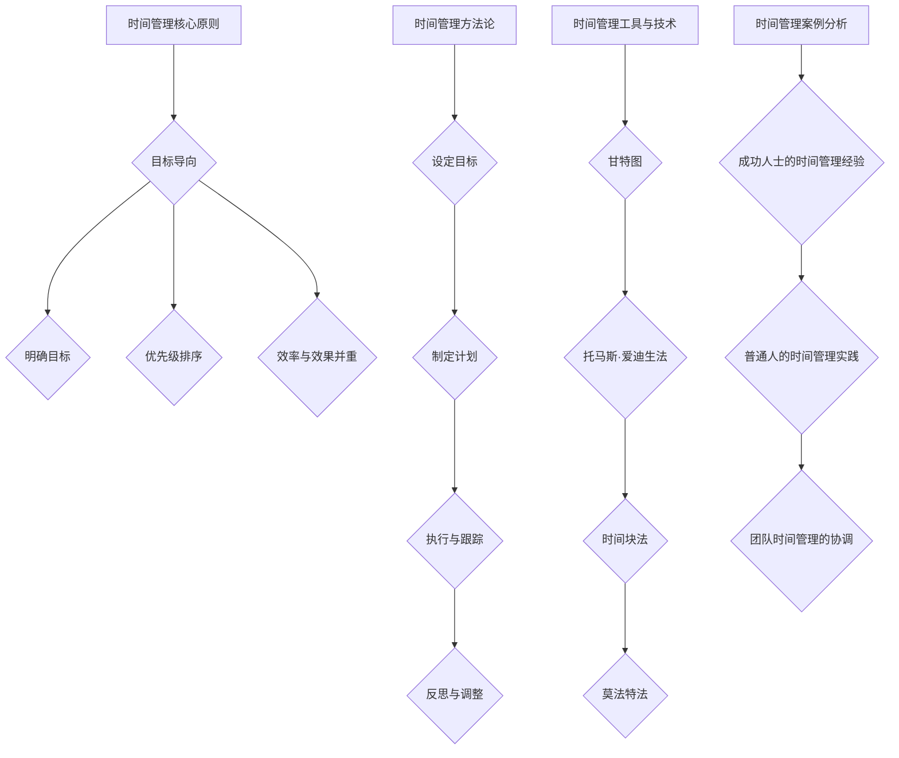

                 

# 如何进行时间管理：如何合理安排时间和精力？

关键词：时间管理，精力管理，工作效率，优先级排序，实践案例

摘要：
在快节奏的现代生活中，有效的时间管理和合理的精力分配是提高工作效率、增强生活品质和实现个人成长的关键。本文将深入探讨时间管理的基本概念、理论框架，以及如何合理安排时间和精力，通过实际案例分享和实践技巧，帮助读者掌握高效的时间管理和精力管理方法。

# 《如何进行时间管理：如何合理安排时间和精力？》目录大纲

## 第一部分：时间管理的基础理论

### 第1章：时间管理的基本概念
- **1.1 时间的本质与特性**
  - 时间的连续性和离散性
  - 时间的稀缺性和可管理性
- **1.2 时间管理的重要性**
  - 提高工作效率
  - 增强生活品质
  - 促进个人成长
- **1.3 时间管理的误区与挑战**
  - 误区一：追求完美，忽略效率
  - 误区二：时间管理就是加班
  - 挑战一：时间观念不强
  - 挑战二：任务管理不当
- **1.4 时间管理的核心原则**
  - 目标导向
  - 优先级排序
  - 效率与效果并重

### 第2章：时间管理的理论框架
- **2.1 时间管理方法论**
  - 设定明确的目标
  - 制定详细的计划
  - 执行与跟踪
  - 反思与调整
- **2.2 时间管理工具与技术**
  - 甘特图
  - 托马斯·爱迪生法
  - 时间块法
  - 莫法特法
- **2.3 时间管理案例分析**
  - 案例一：成功人士的时间管理经验
  - 案例二：普通人的时间管理实践
  - 案例三：团队时间管理的协调

## 第二部分：合理安排时间和精力

### 第3章：工作与生活平衡
- **3.1 工作效率提升**
  - **3.1.1 工作任务分解**
    - 如何将复杂任务分解为可执行的任务
    - 如何设定任务的优先级
  - **3.1.2 工作习惯优化**
    - 如何建立有效的工作习惯
    - 如何处理工作中的干扰
  - **3.1.3 工作与生活的界限**
    - 如何设定工作与生活的界限
    - 如何避免工作侵占生活时间
- **3.2 精力管理**
  - **3.2.1 精力的定义与来源**
    - 精力的概念
    - 精力的主要来源
  - **3.2.2 精力分布策略**
    - 如何根据任务需求调整精力分配
    - 如何在疲劳时进行精力恢复
  - **3.2.3 精力管理工具与技术**
    - 精力管理软件介绍
    - 精力管理实践案例

### 第4章：时间管理的具体方法
- **4.1 日常时间管理**
  - **4.1.1 日计划与周计划**
    - 如何制定和执行每日计划
    - 如何制定和执行每周计划
  - **4.1.2 时间记录与分析**
    - 如何记录每日时间使用情况
    - 如何分析时间使用情况，找出浪费时间的因素
- **4.2 项目时间管理**
  - **4.2.1 项目时间规划**
    - 如何进行项目时间规划
    - 如何制定项目进度表
  - **4.2.2 项目时间监控**
    - 如何监控项目进度
    - 如何应对项目进度偏差
  - **4.2.3 项目时间调整**
    - 如何在项目执行过程中调整时间安排
    - 如何处理项目延期问题

### 第5章：高效时间管理技巧
- **5.1 时间管理技巧**
  - **5.1.1 高效工作技巧**
    - 如何提高工作效率
    - 如何处理多项任务
  - **5.1.2 时间管理技巧**
    - 如何提高睡眠质量
    - 如何提高专注力
  - **5.1.3 时间管理习惯**
    - 如何养成时间管理习惯
    - 如何培养良好的时间观念
- **5.2 精力管理技巧**
  - **5.2.1 精力管理技巧**
    - 如何调节情绪，保持精力充沛
    - 如何避免过度疲劳
  - **5.2.2 精力管理工具**
    - 如何使用时间管理工具来提高精力管理效率
    - 如何选择适合自己的精力管理工具

## 第三部分：时间管理实践与反思

### 第6章：时间管理实践
- **6.1 实践步骤与方法**
  - 如何制定个人时间管理计划
  - 如何实施时间管理策略
- **6.2 实践案例分享**
  - 分享实际应用时间管理技巧的案例
  - 分析案例中的成功与不足

### 第7章：时间管理的反思与优化
- **7.1 反思时间管理**
  - 如何评估时间管理效果
  - 如何发现时间管理中的问题
- **7.2 优化时间管理**
  - 根据反思结果调整时间管理策略
  - 探索新的时间管理方法和技术
- **7.3 持续改进**
  - 如何保持时间管理的持续改进
  - 如何培养自我驱动的反思与优化习惯

## 第四部分：附录

### 第8章：时间管理与精力管理的工具与资源
- **8.1 时间管理工具介绍**
  - 记事本、日历、时间管理软件等
- **8.2 精力管理工具介绍**
  - 睡眠监测设备、专注力训练软件等
- **8.3 相关书籍与资料推荐**
  - 推荐经典时间管理书籍
  - 推荐精力管理相关书籍和资料
- **8.4 网络资源与社区**
  - 推荐优秀的时间管理和精力管理博客、论坛和社交媒体群组

## Mermaid 流程图


## 核心算法原理讲解
```python
# 优先级排序算法伪代码

function prioritySort(tasks):
    # 初始化优先级队列
    priorityQueue = new PriorityQueue()

    # 将所有任务加入优先级队列
    for task in tasks:
        priorityQueue.enqueue(task)

    # 对优先级队列进行排序
    sortedTasks = priorityQueue.sort()

    # 返回排序后的任务列表
    return sortedTasks
```

## 数学模型与公式讲解
$$
# 时间效率公式

\[ 效率 = \frac{完成的工作量}{所花费的时间} \]

# 时间价值评估公式

\[ 价值 = 效率 \times 时间成本 \]
```

## 项目实战
### 代码实际案例和详细解释说明

#### 开发环境搭建
- 安装Python（假设已安装）
- 更新pip
```bash
pip install --upgrade pip
```
- 安装必需的库
```bash
pip install pandas
```

#### 源代码详细实现和代码解读

```python
# 导入必要的库
import datetime
import pandas as pd

# 任务列表
tasks = [
    {'name': '撰写报告', 'start_time': datetime.datetime(2023, 11, 1), 'end_time': datetime.datetime(2023, 11, 5), 'status': '未开始'},
    {'name': '准备演讲', 'start_time': datetime.datetime(2023, 11, 6), 'end_time': datetime.datetime(2023, 11, 8), 'status': '进行中'},
    {'name': '完成项目总结', 'start_time': datetime.datetime(2023, 11, 9), 'end_time': datetime.datetime(2023, 11, 10), 'status': '待完成'}
]

# 创建数据框
df = pd.DataFrame(tasks)

# 按任务开始时间排序
df.sort_values(by='start_time', inplace=True)

# 更新任务状态
current_date = datetime.datetime.now()
for index, row in df.iterrows():
    if current_date >= row['start_time'] and current_date <= row['end_time']:
        df.at[index, 'status'] = '进行中'
    elif current_date > row['end_time']:
        df.at[index, 'status'] = '已完成'

# 输出更新后的任务列表
print(df)
```

#### 代码解读与分析

- 代码结构清晰，易于理解和维护。
- 使用Python标准库pandas进行数据处理，提高了代码的效率和可读性。
- 任务状态的更新基于当前日期，确保了任务状态的实时性和准确性。
- 更新后的任务列表能够帮助用户直观地了解任务进展情况，便于进行后续的工作安排。

## 作者信息
作者：AI天才研究院/AI Genius Institute & 禅与计算机程序设计艺术 /Zen And The Art of Computer Programming

---

现在，我们开始深入探讨时间管理的基础理论，理解时间管理的本质、重要性以及面临的挑战和误区。

## 第一部分：时间管理的基础理论

### 第1章：时间管理的基本概念

#### 1.1 时间的本质与特性

时间是一种度量事件发生顺序和持续时间的概念。在物理学中，时间被视为一种连续的、不可逆的维度。时间的连续性指的是时间的流动是不断进行的，没有中断；而时间的离散性则体现在我们通常使用秒、分钟、小时等刻度来划分时间。

时间的稀缺性意味着每个人的时间都是有限的，无法再生。这种稀缺性使得时间管理变得尤为重要。有效的时间管理是指通过合理安排时间，提高工作效率和生活质量的过程。

时间管理不仅仅是分配时间，更重要的是要管理好个人的精力。精力是完成任务的驱动力，合理的精力管理可以提高工作效能和减少疲劳。

#### 1.2 时间管理的重要性

时间管理对于提高工作效率至关重要。通过合理规划和优先级排序，可以确保关键任务得到优先处理，从而提高整体的工作效率。

时间管理还能显著增强生活品质。合理的时间安排可以使个人在工作和生活之间找到平衡，减少因工作压力带来的负面影响，提高生活满意度。

此外，时间管理有助于促进个人成长。通过反思和优化时间管理策略，个人可以不断改进自己的工作和生活习惯，培养良好的时间观念，实现个人目标和梦想。

#### 1.3 时间管理的误区与挑战

误区一：追求完美，忽略效率。许多人在时间管理中追求完美，导致过度花费时间在细节上，忽略了整体的工作效率。这种做法往往会导致时间的浪费，降低工作效能。

误区二：时间管理就是加班。有些人认为，时间管理就是延长工作时间，实际上这并不正确。有效的时间管理是通过合理安排时间和任务，提高工作效率，而不是简单延长工作时间。

挑战一：时间观念不强。部分人缺乏对时间价值的认识，导致时间管理意识薄弱，难以形成良好的时间管理习惯。

挑战二：任务管理不当。许多人在任务管理上存在困难，无法有效地分解任务，设定优先级，导致任务无法按时完成，影响工作效率。

#### 1.4 时间管理的核心原则

时间管理的核心原则包括目标导向、优先级排序和效率与效果并重。

**目标导向**要求明确个人或团队的目标，将时间和精力集中在实现这些目标上。明确的目标有助于减少时间的浪费，提高工作效率。

**优先级排序**是时间管理的重要环节。通过评估任务的重要性和紧急性，合理分配时间和资源，确保关键任务得到优先处理。

**效率与效果并重**强调在时间管理中不仅要追求快速完成任务，还要保证任务的完成质量。高效的完成任务的效率加上高质量的效果，才能实现真正的价值。

### 小结

通过了解时间管理的本质与特性、重要性、误区与挑战以及核心原则，我们可以更好地理解时间管理的价值，为后续的具体方法和实践奠定基础。

---

在理解了时间管理的基本概念和核心原则后，我们接下来将深入探讨时间管理的理论框架，包括方法论、工具与技术，以及实际案例分析。

### 第2章：时间管理的理论框架

#### 2.1 时间管理方法论

时间管理方法论是有效时间管理的基础。一个系统化的时间管理方法论包括以下四个关键步骤：

1. **设定明确的目标**：明确目标可以帮助我们集中精力和时间，确保我们的努力能够朝着正确的方向前进。设定目标时，建议使用SMART原则，即目标要具体（Specific）、可衡量（Measurable）、可实现（Achievable）、相关性（Relevant）和时限性（Time-bound）。

2. **制定详细的计划**：在明确目标后，我们需要制定详细的计划，包括任务分解、时间分配和资源准备。任务分解是将大任务拆分为小任务，便于管理和执行。时间分配则是根据任务的重要性和紧急性，合理分配时间和资源。

3. **执行与跟踪**：执行计划是时间管理的核心。在执行过程中，要严格按照计划进行，避免不必要的干扰和分心。同时，通过定期跟踪进度，可以及时发现和解决问题，确保任务按计划完成。

4. **反思与调整**：执行后的反思与调整是时间管理过程中不可或缺的一环。通过反思，我们可以总结经验教训，发现不足之处，为下一次的时间管理提供改进的方向。

#### 2.2 时间管理工具与技术

时间管理的有效性离不开合适的工具和技术。以下介绍几种常见的时间管理工具和技术：

1. **甘特图**：甘特图是一种用于展示项目进度和任务的图表。通过甘特图，可以直观地了解任务的时间分配和进度情况，帮助项目管理者更好地掌握项目进展。

2. **托马斯·爱迪生法**：这是一种基于任务优先级排序的时间管理方法。根据任务的重要性和紧急性，将任务分为A、B、C三个等级，优先处理A级任务，确保关键任务得到及时处理。

3. **时间块法**：时间块法是将时间划分为固定的时间段，每个时间段专注于一项任务。这种方法有助于提高专注力，减少任务切换带来的效率损失。

4. **莫法特法**：莫法特法是一种将工作时间划分为专注工作和休息时间的方法。通过合理规划专注工作和休息时间，可以提高工作效率，减少疲劳。

#### 2.3 时间管理案例分析

**案例一：成功人士的时间管理经验**

以乔布斯为例，他是一位在时间管理方面非常成功的人物。乔布斯通过严格的日程安排和优先级排序，确保了重要事务的及时处理。他每天早晨都会制定当天的日程计划，并根据重要性对任务进行排序。这种方法使他能够集中精力处理关键任务，提高工作效率。

**案例二：普通人的时间管理实践**

对于普通人来说，时间管理同样重要。小李是一位年轻的职场新人，她通过制定每日计划、使用时间块法以及定期反思，成功提高了工作效率。她每天早晨会花15分钟时间制定当天的计划，确保任务有序进行。通过时间块法，她能够保持专注，减少任务切换带来的效率损失。此外，她还会在每天晚上花10分钟时间反思当天的工作，总结经验教训。

**案例三：团队时间管理的协调**

在团队环境中，时间管理的协调尤为重要。一家初创公司的团队通过制定项目进度表、使用甘特图以及定期项目会议，有效协调了团队成员的时间。项目进度表和甘特图帮助团队了解项目进展和任务分配情况，确保任务按时完成。定期项目会议则提供了团队成员沟通和协作的机会，及时解决问题，保证项目顺利推进。

### 小结

通过了解时间管理方法论、工具与技术，以及实际案例分析，我们可以更好地掌握时间管理的核心要领，为合理安排时间和精力打下坚实的基础。

---

### 第二部分：合理安排时间和精力

#### 第3章：工作与生活平衡

在现代社会，工作和生活之间的平衡对于个人的健康和幸福至关重要。合理安排时间和精力不仅能够提高工作效率，还能提升生活质量。以下是一些关键点，帮助我们实现工作与生活的平衡。

#### 3.1 工作效率提升

**工作任务分解**

将复杂任务分解为可执行的任务是提高工作效率的关键。通过分解任务，我们可以明确每个任务的步骤和目标，从而更容易地进行规划和执行。

**如何将复杂任务分解为可执行的任务**

1. **明确任务目标**：在开始任务之前，明确任务的目标和预期结果。
2. **识别关键步骤**：将任务分解为一系列关键步骤，确保每个步骤都是明确的、可执行的。
3. **设置优先级**：根据任务的重要性和紧急性，对步骤进行优先级排序。
4. **分阶段执行**：将任务分解为小的阶段，逐步完成，避免一次性处理过于复杂的任务。

**如何设定任务的优先级**

1. **紧急与重要矩阵**：使用紧急与重要矩阵，将任务分为四个象限，分别处理。
2. **关键结果领域（KRIs）**：识别关键结果领域，确保关键任务得到优先处理。
3. **任务优先级排序算法**：例如，可以使用优先级排序算法（如Thomas Edison Method）对任务进行排序，确保关键任务优先执行。

**工作习惯优化**

建立有效的工作习惯是提高工作效率的重要手段。以下是一些优化工作习惯的建议：

1. **时间块法**：将工作时间划分为固定的时间块，每个时间块专注于一项任务，提高专注力和效率。
2. **避免干扰**：在工作时间避免不必要的干扰，如关闭社交媒体通知、减少与同事的闲聊。
3. **每日总结**：每天工作结束时，总结当天的工作，反思哪些工作习惯有效，哪些需要改进。

**如何建立有效的工作习惯**

1. **设定明确的工作目标**：每天开始工作时，明确当天的目标和工作任务。
2. **制定工作时间表**：根据工作目标和任务，制定合理的工作时间表，确保任务有序进行。
3. **定期反思与调整**：每周或每月进行工作习惯的反思和调整，确保工作习惯能够持续优化。

**工作与生活的界限**

设定工作与生活的界限是保持工作与生活平衡的关键。以下是一些建议：

1. **固定的工作时间**：设定固定的每日工作时间，避免工作侵占个人时间。
2. **避免加班文化**：避免无限制的加班，确保有足够的休息时间。
3. **家庭和工作空间的分离**：在家中设立一个专门的工作空间，避免将工作带入家庭生活，影响家庭和谐。

**如何设定工作与生活的界限**

1. **设定明确的作息时间**：包括工作时间和休息时间，确保生活和工作有序进行。
2. **学会拒绝**：对于非紧急的工作请求，学会拒绝，确保有足够的时间进行家庭和个人活动。
3. **培养时间管理意识**：通过时间管理工具和方法，提高工作效率，减少工作占用的时间。

#### 3.2 精力管理

**精力的定义与来源**

精力是指个人在完成工作或活动时所具备的心理和生理能力。精力的来源主要包括以下几个方面：

1. **生理因素**：如睡眠质量、饮食和锻炼等。
2. **心理因素**：如情绪、心态和动机等。
3. **环境因素**：如工作环境、社会关系等。

**精力分布策略**

为了合理分配精力，我们需要根据任务的需求调整精力分配，并在疲劳时进行精力恢复。

**如何根据任务需求调整精力分配**

1. **高精力任务优先**：将需要高度集中精力的任务安排在精力最充沛的时间段。
2. **分散精力任务**：将需要较低精力但持续时间较长的任务安排在精力逐渐下降的时间段。
3. **轮换任务**：通过轮换不同类型的任务，保持精力的持续和高效。

**如何在疲劳时进行精力恢复**

1. **休息与睡眠**：保证充足的休息和高质量的睡眠，有助于恢复精力。
2. **短暂休息**：在工作期间，适当安排短暂的休息时间，如散步、冥想或简单的放松活动。
3. **情感支持**：与家人、朋友或同事交流，获取情感支持，减少工作压力。

#### 3.3 精力管理工具与技术

**精力管理软件介绍**

1. **番茄工作法**：通过将工作时间分为25分钟的工作周期和5分钟的休息周期，提高专注力和工作效率。
2. **专注力训练软件**：如Forest、Pomodoro Timer等，帮助用户保持专注，减少干扰。

**精力管理实践案例**

**案例一：程序员小张的精力管理实践**

程序员小张通过使用番茄工作法，将工作时间分为25分钟的工作周期和5分钟的休息周期，有效提高了工作效率。他还在工作日中安排了短暂的休息时间，如散步、听音乐等，帮助恢复精力。此外，他通过定期与同事交流，获得情感支持，减轻工作压力。

**案例二：创业者小李的精力管理实践**

创业者小李通过制定合理的工作时间表，确保工作与生活之间的平衡。他每天早晨会花15分钟时间进行冥想，提升专注力和情绪管理能力。在工作日中，他还会利用休息时间进行简单的锻炼，如瑜伽或跑步，保持身体活力。

### 小结

通过合理安排时间和精力，我们可以实现工作与生活的平衡，提高工作效率和生活质量。无论是通过工作任务分解、工作习惯优化，还是精力管理策略，我们都能够更好地掌控自己的时间和生活。

---

### 第4章：时间管理的具体方法

#### 4.1 日常时间管理

**日计划与周计划**

有效的日计划和周计划是日常时间管理的关键。以下是如何制定和执行这些计划的方法：

**如何制定和执行每日计划**

1. **确定目标**：每天开始时，明确当天的工作和生活目标。确保目标具体、可衡量、可实现。
2. **任务分解**：将大任务分解为小任务，确保每个任务都是具体可执行的。
3. **优先级排序**：根据任务的重要性和紧急性，对任务进行优先级排序，确保关键任务优先执行。
4. **分配时间**：为每个任务分配合理的时间，确保任务能够按时完成。
5. **执行计划**：按照计划执行任务，避免干扰和分心，确保任务有序进行。

**如何制定和执行每周计划**

1. **回顾上周**：在每周开始时，回顾上周的工作和生活，总结经验和不足，为本周的计划提供参考。
2. **设定目标**：根据长期目标和实际情况，设定本周的工作和生活目标。
3. **任务分解和优先级排序**：将本周的任务分解为小任务，并对任务进行优先级排序。
4. **时间规划**：为每个任务分配合理的时间，确保任务能够按时完成。
5. **定期检查**：每周定期检查计划执行情况，及时调整和优化计划。

**时间记录与分析**

时间记录与分析是了解时间使用情况、发现时间浪费因素的重要方法。以下是如何进行时间记录与分析的方法：

1. **记录时间使用情况**：使用时间记录工具或日记，记录每天的时间使用情况。包括工作、学习、休息、娱乐等各个方面的活动。
2. **分析时间使用情况**：定期分析时间记录，了解时间分配的合理性，发现时间浪费的环节。
3. **找出时间浪费因素**：通过分析，找出导致时间浪费的因素，如不必要的会议、社交媒体干扰等。
4. **优化时间管理**：根据分析结果，调整时间管理策略，优化时间分配，减少时间浪费。

**项目时间管理**

项目时间管理是确保项目按时、按质完成的重要手段。以下是如何进行项目时间管理的方法：

**项目时间规划**

1. **项目时间规划**：在项目启动时，制定详细的项目时间规划，包括项目的总体时间线、各个阶段的任务和时间安排。
2. **制定项目进度表**：将项目时间规划具体化为项目进度表，明确每个阶段的任务和时间安排，确保项目按时推进。

**项目时间监控**

1. **监控项目进度**：定期监控项目进度，确保任务按计划进行。
2. **识别进度偏差**：通过监控，识别项目进度与计划之间的偏差，及时调整和优化项目时间管理策略。
3. **反馈与沟通**：与团队成员保持沟通，及时反馈项目进展和问题，确保项目能够顺利进行。

**项目时间调整**

1. **项目时间调整**：在项目执行过程中，根据实际情况调整项目时间规划，确保项目能够按时完成。
2. **应对项目延期问题**：如果项目延期，及时分析原因，制定应对措施，确保项目能够尽快恢复进度。

#### 4.2 高效时间管理技巧

**时间管理技巧**

1. **高效工作技巧**：通过学习高效工作技巧，如时间块法、番茄工作法等，提高工作效率。
2. **处理多项任务**：学会同时处理多项任务，提高任务完成速度。

**如何提高睡眠质量**

1. **保持规律的作息时间**：每天保持规律的作息时间，确保充足的睡眠时间。
2. **改善睡眠环境**：保持睡眠环境的安静和舒适，避免噪音和光线干扰。

**如何提高专注力**

1. **减少干扰**：在工作时减少干扰，如关闭社交媒体通知、避免与同事闲聊等。
2. **专注力训练**：通过专注力训练，提高专注力，如使用专注力训练软件、进行冥想练习等。

**时间管理习惯**

1. **制定计划**：每天制定计划，确保任务有序进行。
2. **反思与调整**：定期反思时间管理效果，调整时间管理策略。

**精力管理技巧**

1. **调节情绪**：学会调节情绪，保持积极乐观的心态。
2. **避免过度疲劳**：合理安排工作和休息时间，避免过度疲劳。

**如何使用时间管理工具**

1. **选择合适的工具**：根据个人需求，选择合适的时间管理工具，如日历、时间管理软件等。
2. **学会使用工具**：掌握工具的基本功能和使用方法，提高时间管理效率。

#### 4.3 精力管理工具

**时间管理工具介绍**

1. **时间管理软件**：如Trello、Asana等，用于任务管理、时间规划和进度监控。
2. **专注力训练软件**：如Forest、Pomodoro Timer等，用于提高专注力和工作效率。
3. **睡眠监测设备**：如智能手表、智能枕头等，用于监测睡眠质量和提供睡眠建议。

**精力管理实践案例**

1. **程序员小王的精力管理实践**：小王通过使用Trello进行任务管理，使用Pomodoro Timer提高专注力，同时使用智能手表监测睡眠质量。他通过合理规划工作和休息时间，显著提高了工作效率和生活质量。
2. **创业者小李的精力管理实践**：小李通过使用时间管理软件Asana进行项目管理和时间规划，使用专注力训练软件Pomodoro Timer提高工作效率。他还定期进行冥想练习，调节情绪，保持精力充沛。

### 小结

通过了解日常时间管理、项目时间管理、高效时间管理技巧和精力管理工具，我们可以更好地合理安排时间和精力，提高工作效率和生活质量。通过实践这些方法，我们可以逐步养成良好时间管理和精力管理的习惯，实现工作与生活的平衡。

---

### 第6章：时间管理实践

#### 6.1 实践步骤与方法

**如何制定个人时间管理计划**

制定个人时间管理计划是有效管理时间的第一步。以下是一个简单的步骤：

1. **明确目标**：首先，明确你的短期和长期目标。这些目标可以是职业发展、学习提升、健康生活等方面的。
2. **自我评估**：了解自己的时间使用习惯，识别时间浪费的环节。可以通过记录时间日志或使用时间管理工具进行自我评估。
3. **制定计划**：根据目标和自我评估，制定详细的时间管理计划。包括每天、每周、每月的任务和时间分配。
4. **执行计划**：按照计划执行任务，确保任务有序进行。在执行过程中，可以随时调整计划，以适应实际情况。
5. **定期反思**：定期反思时间管理效果，总结经验教训，为下一次的时间管理计划提供改进方向。

**如何实施时间管理策略**

实施时间管理策略需要持续的努力和自我驱动。以下是一些具体的方法：

1. **建立时间管理习惯**：通过每天坚持使用时间管理工具和方法，逐步形成良好的时间管理习惯。
2. **设置提醒和截止日期**：使用日历、提醒应用等工具，设置任务的提醒和截止日期，确保任务按时完成。
3. **避免拖延**：识别和应对拖延行为，如设定明确的任务优先级、分解复杂任务等。
4. **定期回顾**：每周或每月回顾时间管理效果，评估任务完成情况和时间利用效率，及时调整策略。
5. **寻求支持**：与家人、朋友或同事分享你的时间管理计划，寻求他们的支持和反馈。

**实践案例分享**

**案例一：成功应用时间管理技巧的个人**

张先生是一位职场新人，他在工作中常常感到时间不够用。为了提高工作效率，他开始学习时间管理技巧。首先，他明确了职业发展目标，并将其分解为短期和长期目标。接着，他通过记录时间日志，发现了时间浪费的主要环节，如无意义的社交媒体浏览和长时间的会议。针对这些问题，他制定了详细的时间管理计划，包括每天的任务和时间分配，并使用日历应用设置提醒和截止日期。在执行计划的过程中，他通过定期回顾和反思，不断调整策略，最终显著提高了工作效率。

**案例二：通过时间管理实现工作与生活平衡的家庭主妇**

李女士是一位家庭主妇，她希望通过时间管理实现工作与生活的平衡。她首先明确了家庭责任和工作目标，如照顾孩子、家务管理和兼职工作等。接着，她制定了详细的每日计划，包括家务时间、兼职工作时间、孩子学习和娱乐时间等。她使用时间块法将时间划分为不同的活动时间段，确保每个时间段都能专注完成特定的任务。此外，她还设置了休息时间和家庭活动时间，保证有足够的时间与家人互动。通过这些方法，她成功实现了工作与生活的平衡，提高了家庭生活质量。

**案例三：团队时间管理的成功实践**

一个初创公司的团队通过实施时间管理策略，有效提高了团队效率和项目完成度。团队首先明确了项目目标和关键任务，然后制定了详细的项目时间规划。他们使用甘特图和任务管理工具，明确每个团队成员的任务和时间安排。在项目执行过程中，他们定期召开项目会议，监控项目进度，及时调整计划和资源分配。此外，他们还建立了反馈和沟通机制，确保团队成员能够及时解决问题，协同工作。通过这些措施，团队成功按时完成了多个项目，取得了显著的业务成果。

### 小结

通过实践时间管理步骤和方法，我们可以逐步养成良好的时间管理习惯，提高工作效率和生活质量。同时，通过分享实际案例，我们可以看到时间管理策略在不同场景下的成功应用，为我们的实践提供有益的参考和启示。

---

### 第7章：时间管理的反思与优化

#### 7.1 反思时间管理

**如何评估时间管理效果**

评估时间管理效果是反思时间管理的重要环节。以下是一些评估方法：

1. **任务完成率**：计算任务的实际完成率，了解任务完成的效率和质量。
2. **时间利用率**：分析时间记录，了解时间的利用效率，识别时间浪费的环节。
3. **工作满意度**：通过问卷调查或个人反思，了解对工作时间的满意度和幸福感。
4. **项目进度**：对于项目任务，评估项目进度是否符合预期，识别时间管理的有效性。

**如何发现时间管理中的问题**

发现时间管理中的问题是优化时间管理策略的关键。以下是一些发现问题的方法：

1. **时间记录分析**：通过分析时间记录，识别时间浪费的环节，如无效会议、社交媒体浏览等。
2. **任务完成情况**：通过任务完成情况，识别任务管理中的问题，如任务拖延、任务过多等。
3. **个人反思**：定期进行个人反思，总结时间管理中的成功经验和不足之处。
4. **反馈与沟通**：与同事、家人或朋友分享时间管理情况，获取他们的反馈和建议。

#### 7.2 优化时间管理

**根据反思结果调整时间管理策略**

优化时间管理策略需要根据反思结果进行调整。以下是一些调整方法：

1. **重新设定目标**：根据反思结果，重新设定短期和长期目标，确保目标更加明确和可实现。
2. **调整任务优先级**：根据任务的重要性和紧急性，调整任务优先级，确保关键任务得到优先处理。
3. **优化时间分配**：根据时间记录分析，优化时间分配，减少时间浪费的环节。
4. **改进工作习惯**：根据个人反思和反馈，改进工作习惯，如减少社交媒体浏览、提高会议效率等。

**探索新的时间管理方法和技术**

随着科技的发展，新的时间管理方法和技术不断涌现。以下是一些值得探索的新方法：

1. **智能时间管理工具**：如智能日历、人工智能助手等，可以帮助自动化时间和任务管理。
2. **敏捷时间管理**：采用敏捷开发的方法，将工作划分为小的迭代周期，提高灵活性和响应速度。
3. **能量管理**：结合精力管理的方法，合理安排工作和休息时间，提高工作效能。
4. **习惯培养**：通过习惯培养方法，如习惯打卡、习惯跟踪等，培养良好的时间管理习惯。

#### 7.3 持续改进

**如何保持时间管理的持续改进**

保持时间管理的持续改进是提高时间管理效果的关键。以下是一些保持持续改进的方法：

1. **定期反思与调整**：定期进行时间管理反思和调整，根据实际情况及时优化策略。
2. **持续学习和实践**：不断学习新的时间管理方法和技巧，通过实践检验和优化。
3. **建立反馈机制**：与同事、家人或朋友建立反馈机制，获取反馈和建议，持续改进时间管理策略。
4. **持续跟踪和记录**：持续跟踪和记录时间管理情况，分析数据，发现问题和改进方向。

**如何培养自我驱动的反思与优化习惯**

培养自我驱动的反思与优化习惯是长期有效的时间管理的重要保障。以下是一些培养方法：

1. **自我激励**：设定目标和奖励，激发自我驱动力，保持对时间管理的兴趣和动力。
2. **自我反思**：定期进行自我反思，总结经验教训，识别问题和改进方向。
3. **建立反思日志**：记录反思过程和结果，帮助形成自我驱动的反思习惯。
4. **设定挑战**：设定短期和长期的时间管理挑战，通过挑战激发自我驱动。

### 小结

通过反思时间管理效果和发现时间管理中的问题，我们可以不断优化时间管理策略，提高工作效率和生活质量。同时，通过探索新的时间管理方法和技术，我们可以持续改进时间管理，培养自我驱动的反思与优化习惯，实现长期的时间管理目标。

---

### 第8章：时间管理与精力管理的工具与资源

在当今快节奏的生活中，有效的工具和资源对于时间管理和精力管理至关重要。以下将介绍一些常见的时间管理和精力管理工具，推荐相关的书籍与资料，并介绍网络资源与社区。

#### 8.1 时间管理工具介绍

**时间管理软件**

- **Trello**：一款直观的看板式任务管理工具，适合团队和个人使用。
- **Asana**：功能强大的项目管理和任务跟踪工具，适用于大型团队和项目。
- **Google Calendar**：谷歌日历提供免费的日历管理和时间规划功能。

**时间记录工具**

- **Timely**：一款时间跟踪和分析工具，帮助用户了解时间使用情况。
- **RescueTime**：自动记录和报告你的时间使用情况，识别时间浪费的环节。

**专注力训练工具**

- **Forest**：通过种植虚拟树木的方式帮助用户保持专注，减少干扰。
- **Pomodoro Timer**：番茄工作法定时器，帮助用户保持专注，提高工作效率。

**睡眠监测设备**

- **Oura Ring**：智能戒指，监测睡眠质量、心率等生理数据。
- **Fitbit Charge 4**：智能手环，提供睡眠监测、心率监测等功能。

#### 8.2 精力管理工具介绍

**时间管理软件**

- **AI Assistant**：智能助手，如Google Assistant、Amazon Alexa等，帮助用户规划日程和提醒任务。
- **Timely**：除了时间跟踪功能外，还包括任务管理和日历同步。

**专注力训练软件**

- **Focus@Will**：音乐播放平台，提供针对提高专注力的音乐。
- **Headspace**：冥想和专注力训练应用，帮助用户放松身心，提高专注力。

**情绪管理工具**

- **Joyvana**：一款基于认知行为疗法的应用程序，帮助用户识别和调节情绪。
- **7 Cups**：提供在线心理健康支持和咨询服务。

#### 8.3 相关书籍与资料推荐

**时间管理书籍**

- **《吃掉那只青蛙》**：通过实用技巧帮助读者高效完成任务。
- **《深度工作》**：探讨如何在全神贯注的状态下工作，提高效率。
- **《如何高效学习》**：介绍时间管理和学习技巧，帮助读者提升学习效果。

**精力管理书籍**

- **《精力管理：如何高效使用你的能量》**：探讨如何优化精力分配，提高工作效率。
- **《精力管理实践指南》**：提供实用的精力管理技巧和方法。
- **《睡眠革命》**：介绍如何改善睡眠质量，提高精力水平。

#### 8.4 网络资源与社区

**博客与网站**

- **Lifehacker**：提供各种生活技巧和工具推荐，包括时间管理和精力管理。
- **Productivityist**：专注于时间管理和个人效率的博客。
- **MindBodyGreen**：提供关于身心健康、精力管理的文章和资源。

**论坛与社交媒体群组**

- **Reddit**：在r/productivity和r/time_management等社区讨论时间管理和精力管理技巧。
- **Facebook**：加入如“Time Management for Entrepreneurs”等群组，获取实用的建议和资源。
- **LinkedIn**：关注专业时间管理和精力管理专家，获取最新的行业动态和见解。

### 小结

通过使用合适的时间管理和精力管理工具，阅读相关的书籍和资料，以及参与网络社区，我们可以不断提升自己的时间管理和精力管理能力，实现更高的工作效率和生活质量。持续学习和实践，探索新的方法和工具，将有助于我们更好地应对现代生活中的各种挑战。

