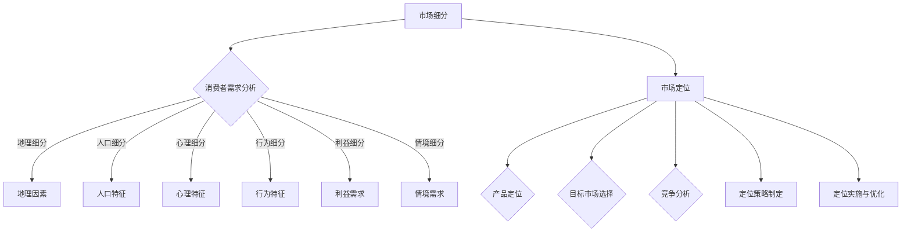

                 

### 文章标题

《如何进行有效的市场细分与定位》

### 关键词

市场细分，定位策略，消费者行为分析，数据分析工具，竞争分析，产品差异化，市场环境变化，持续优化。

### 摘要

本文旨在探讨如何进行有效的市场细分与定位。通过对市场细分的基本概念、理论基础、方法类型的深入解析，以及消费者行为分析、产品特性与市场细分等基础因素的综合探讨，本文揭示了市场细分的重要性和应用价值。随后，文章重点介绍了市场细分的工具与技术，包括数据分析工具、调查问卷设计与数据分析、聚类分析与市场细分模型等。在市场细分与定位策略部分，文章详细阐述了竞争分析、市场定位策略、产品差异化策略等关键环节。最后，通过实际应用案例分析，总结了市场细分与定位的实际操作方法和持续优化策略。本文旨在为IT领域的企业提供一套系统、实用的市场细分与定位方案，帮助企业更好地把握市场机会，实现可持续发展。

# 《如何进行有效的市场细分与定位》

## 第一部分：市场细分的基本概念与理论

### 第1章：市场细分概述

#### 1.1 市场细分的定义与重要性

市场细分是指根据消费者的不同需求、购买习惯、购买动机等特征，将整体市场划分为若干具有相似特征和需求的子市场，从而为企业提供更具针对性的市场策略。市场细分的重要性在于：

1. **提高市场占有率**：通过市场细分，企业可以针对不同子市场的特点，制定更有效的营销策略，提高市场占有率。
2. **降低营销成本**：市场细分使得企业可以将有限的资源集中于最有潜力的子市场，从而降低营销成本。
3. **增强市场竞争力**：通过市场细分，企业可以深入了解消费者需求，提供更符合市场期望的产品和服务，提高竞争力。
4. **优化产品策略**：市场细分有助于企业了解不同子市场的产品偏好，从而调整产品策略，满足消费者需求。

#### 1.2 市场细分的理论基础

市场细分理论源于市场营销学的“4C”理论，即消费者（Consumer）、成本（Cost）、便利（Convenience）和沟通（Communication）。具体如下：

1. **消费者（Consumer）**：市场细分的核心是消费者，企业需要深入了解消费者的需求、购买习惯和购买动机。
2. **成本（Cost）**：市场细分有助于企业降低营销成本，通过集中资源，实现规模效应。
3. **便利（Convenience）**：市场细分可以提高消费者的购买便利性，满足不同消费者的需求。
4. **沟通（Communication）**：市场细分有助于企业更有效地与消费者进行沟通，传递产品和服务信息。

#### 1.3 市场细分的方法与类型

市场细分的方法和类型多样，以下为几种常见的方法和类型：

1. **地理细分**：根据消费者地理位置、地理环境等因素进行划分。
2. **人口细分**：根据消费者的人口特征，如年龄、性别、收入、教育程度等进行划分。
3. **心理细分**：根据消费者的心理特征，如生活方式、个性、价值观等划分市场。
4. **行为细分**：根据消费者的购买行为、购买习惯、购买动机等进行划分。
5. **利益细分**：根据消费者追求的不同利益，如质量、价格、服务等划分市场。
6. **情境细分**：根据消费者在不同情境下的需求进行划分。

## 第二部分：市场细分与定位策略

### 第2章：市场细分的基础因素

#### 2.1 消费者行为分析

消费者行为分析是市场细分的重要基础。通过分析消费者购买行为模式，企业可以更深入地了解消费者的需求，为市场细分提供依据。

##### 2.1.1 消费者购买行为模式

消费者购买行为模式主要包括以下几个阶段：

1. **需求识别**：消费者意识到自己的需求，并开始寻找解决方案。
2. **信息收集**：消费者通过多种渠道收集信息，以了解产品的特点、价格等。
3. **评估与选择**：消费者根据收集到的信息，评估不同产品，并做出购买决策。
4. **购买**：消费者最终选择购买某个产品。
5. **购买后行为**：消费者在使用产品后，可能会进行评价、推荐或投诉。

##### 2.1.2 消费者需求特征

消费者需求特征包括以下几个方面：

1. **多样性**：不同消费者对同一产品的需求可能存在差异。
2. **变化性**：消费者的需求会随着时间、环境、心理等因素的变化而变化。
3. **层次性**：消费者的需求可以分为基本需求和高级需求。
4. **个体性**：消费者的需求具有个体性，每个人对同一产品的需求可能不同。

##### 2.1.3 消费者价值观与生活形态

消费者价值观和生活形态对市场细分具有重要影响。消费者的价值观和生活形态包括以下几个方面：

1. **价值观**：消费者对事物的评价标准，如环保、品质、价格等。
2. **生活形态**：消费者的生活方式、生活习惯、兴趣爱好等。

#### 2.2 产品特性与市场细分

产品特性是市场细分的重要依据。不同产品具有不同的特性，如功能、品质、价格等。以下为产品特性与市场细分的关系：

1. **功能细分**：根据产品的功能特点，如基本功能、高级功能等，进行市场细分。
2. **品质细分**：根据产品的品质水平，如低端、中端、高端等，进行市场细分。
3. **价格细分**：根据产品的价格区间，如低端、中端、高端等，进行市场细分。
4. **品牌细分**：根据产品的品牌知名度、形象等，进行市场细分。

##### 2.2.1 产品差异化与市场细分

产品差异化是市场细分的关键手段。通过产品差异化，企业可以满足不同消费者的需求，提高市场竞争力。

1. **功能差异化**：通过提供不同功能的产品，满足不同消费者的需求。
2. **品质差异化**：通过提供不同品质的产品，满足不同消费者的需求。
3. **价格差异化**：通过提供不同价格的产品，满足不同消费者的需求。
4. **品牌差异化**：通过打造独特品牌形象，吸引特定消费者群体。

##### 2.2.2 产品生命周期与市场细分策略

产品生命周期对市场细分策略具有重要影响。在产品不同生命周期阶段，企业应采取不同的市场细分策略。

1. **引入期**：产品刚推出时，市场细分应侧重于寻找潜在客户，推广产品特点。
2. **成长期**：产品逐渐受到市场认可时，市场细分应侧重于满足不同消费者的需求，提高市场份额。
3. **成熟期**：产品市场份额稳定时，市场细分应侧重于维护现有客户，提高客户忠诚度。
4. **衰退期**：产品市场份额逐渐下降时，市场细分应侧重于寻找新的市场机会，延长产品生命周期。

### 第3章：市场细分的工具与技术

市场细分需要运用多种工具和技术，以提高细分效果的准确性和实用性。以下为几种常用的市场细分工具与技术：

#### 3.1 数据分析工具

数据分析工具是市场细分的重要手段。通过数据分析，企业可以更准确地了解消费者需求和市场趋势。

##### 3.1.1 调查问卷设计与数据分析

调查问卷是收集消费者信息的重要工具。通过设计合理的调查问卷，企业可以获取大量关于消费者需求和行为的数据。

1. **问卷设计原则**：问卷设计应遵循简洁性、针对性、易答性等原则。
2. **数据分析方法**：数据分析包括描述性分析、相关性分析、回归分析等，有助于揭示消费者需求和市场趋势。

##### 3.1.2 聚类分析与市场细分模型

聚类分析是一种常用的数据分析方法，通过将相似的数据归为一类，实现市场细分。

1. **聚类算法**：常用的聚类算法包括K-means算法、层次聚类算法等。
2. **市场细分模型**：基于聚类分析结果，企业可以构建市场细分模型，为营销策略提供依据。

##### 3.1.3 数据挖掘与市场细分应用

数据挖掘是一种从大量数据中发现有用信息的方法。通过数据挖掘，企业可以挖掘出消费者潜在需求和市场机会。

1. **关联规则挖掘**：通过关联规则挖掘，企业可以发现消费者之间的关联关系，为市场细分提供依据。
2. **分类与预测**：通过分类与预测，企业可以预测消费者行为，优化市场细分策略。

## 第三部分：市场细分与定位策略

### 第4章：竞争分析

#### 4.1 竞争对手分析

竞争对手分析是市场细分与定位的重要环节。通过分析竞争对手的产品定位、营销策略、市场份额等，企业可以了解市场竞争态势，为自身市场细分与定位提供参考。

##### 4.1.1 竞争对手的产品定位

分析竞争对手的产品定位，可以帮助企业了解市场现状和竞争格局。具体包括：

1. **产品特点**：竞争对手的产品功能、品质、价格等方面的特点。
2. **目标市场**：竞争对手针对的目标市场和客户群体。
3. **竞争优势**：竞争对手在产品、价格、渠道、服务等方面的竞争优势。

##### 4.1.2 竞争对手的营销策略

分析竞争对手的营销策略，可以帮助企业了解市场竞争策略和市场反应。具体包括：

1. **品牌宣传**：竞争对手的品牌形象、广告宣传等方面的策略。
2. **渠道建设**：竞争对手的渠道布局、渠道管理等方面的策略。
3. **促销活动**：竞争对手的促销活动、优惠政策等方面的策略。

##### 4.1.3 竞争对手的市场份额

分析竞争对手的市场份额，可以帮助企业了解市场占有率分布和竞争态势。具体包括：

1. **市场份额**：竞争对手在各个子市场的市场份额。
2. **市场动态**：竞争对手的市场份额变化、市场扩展策略等。

### 第5章：市场定位策略

#### 5.1 市场定位的目标与原则

市场定位是企业产品在市场中的定位，是产品战略的核心。市场定位的目标和原则如下：

##### 5.1.1 市场定位的目标设定

市场定位的目标主要包括：

1. **满足消费者需求**：市场定位应以满足消费者需求为出发点，提供符合市场期望的产品和服务。
2. **提高市场占有率**：市场定位应有助于企业提高市场占有率，实现可持续发展。
3. **树立品牌形象**：市场定位应有助于树立企业品牌形象，提升品牌知名度。

##### 5.1.2 市场定位的原则与方法

市场定位应遵循以下原则：

1. **差异化原则**：市场定位应突出产品特点，实现差异化竞争。
2. **目标市场原则**：市场定位应针对目标市场，满足目标市场的需求。
3. **长期性原则**：市场定位应具有前瞻性和稳定性，为企业长期发展奠定基础。

市场定位的方法主要包括：

1. **功能定位**：根据产品功能特点进行定位。
2. **品质定位**：根据产品品质水平进行定位。
3. **价格定位**：根据产品价格区间进行定位。
4. **品牌定位**：根据品牌形象和品牌价值进行定位。

##### 5.1.3 市场定位的案例分析

以下为市场定位的几个成功案例分析：

1. **苹果公司**：苹果公司的市场定位是以高端产品为主，致力于提供高品质、高性能的产品，满足消费者对品质和体验的追求。
2. **小米公司**：小米公司的市场定位是以性价比高为主，通过提供高性能、高性价比的产品，吸引追求性价比的消费者。
3. **可口可乐公司**：可口可乐公司的市场定位是以全球饮品领导者为主，致力于提供多样化的饮料产品，满足不同消费者的需求。

### 第6章：产品差异化策略

#### 6.1 产品差异化与市场细分的关系

产品差异化是市场细分的重要手段，有助于满足不同消费者的需求，提高市场竞争力。

##### 6.1.1 产品差异化策略的实施

产品差异化策略主要包括以下几个方面：

1. **产品功能**：通过增加产品功能，满足消费者多样化的需求。
2. **产品质量**：通过提高产品质量，提升消费者购买意愿。
3. **产品价格**：通过提供不同价格的产品，满足不同消费者的购买能力。
4. **产品品牌**：通过打造独特品牌形象，提升品牌价值。

##### 6.1.2 产品差异化与市场细分的协同效应

产品差异化与市场细分之间存在协同效应：

1. **提高市场占有率**：通过产品差异化，满足不同消费者的需求，提高市场占有率。
2. **降低营销成本**：通过市场细分，集中资源，降低营销成本。
3. **提高竞争力**：通过产品差异化，突出产品特点，提高市场竞争力。

##### 6.1.3 产品差异化策略的案例分析

以下为产品差异化策略的几个成功案例分析：

1. **特斯拉**：特斯拉通过推出高性能、高品质的电动汽车，实现了产品差异化，吸引了大量消费者。
2. **红牛**：红牛通过推出功能饮料，满足消费者对能量补充的需求，实现了产品差异化。
3. **阿里巴巴**：阿里巴巴通过提供多元化的电商服务，满足不同消费者的购物需求，实现了产品差异化。

### 第7章：市场细分与定位的实际应用

#### 7.1 企业市场细分与定位的应用案例分析

市场细分与定位在实际应用中具有重要作用。以下为几个企业市场细分与定位的应用案例分析：

##### 7.1.1 案例一：消费品市场的细分与定位

**案例背景**：某消费品企业，主要生产日用品。

**市场细分**：根据消费者收入水平、购买习惯、品牌偏好等因素，将市场划分为高收入群体、中等收入群体、低收入群体等。

**市场定位**：针对不同收入群体，提供不同档次的产品，如高档日用品、中档日用品、经济型日用品等。

**效果分析**：通过市场细分与定位，企业实现了产品差异化和市场占有率的提升，取得了良好的经济效益。

##### 7.1.2 案例二：服务市场的细分与定位

**案例背景**：某服务企业，主要提供教育培训服务。

**市场细分**：根据消费者年龄、职业、学习需求等因素，将市场划分为儿童教育市场、青少年教育市场、成人教育市场等。

**市场定位**：针对不同教育市场，提供专业化的教育培训服务，如儿童兴趣班、青少年高考辅导、成人职业培训等。

**效果分析**：通过市场细分与定位，企业提升了教育培训服务的专业性和市场竞争力，取得了良好的市场口碑。

##### 7.1.3 案例三：新兴市场企业的市场细分与定位策略

**案例背景**：某新兴市场企业，主要生产智能家居设备。

**市场细分**：根据消费者收入水平、生活习惯、智能家居需求等因素，将市场划分为高端智能家居市场、中端智能家居市场、经济型智能家居市场等。

**市场定位**：针对不同智能家居市场，提供不同档次的产品，如高端智能家居设备、中端智能家居设备、经济型智能家居设备等。

**效果分析**：通过市场细分与定位，企业迅速占领市场，实现了快速发展，并在行业内树立了良好的品牌形象。

### 第8章：市场细分与定位的持续优化

市场细分与定位不是一成不变的，而是需要根据市场环境的变化和企业发展需求，进行持续优化。

#### 8.1 市场环境变化与市场细分调整

市场环境的变化对市场细分与定位具有重要影响。以下为市场环境变化对市场细分的影响：

1. **经济环境**：经济环境的变化会影响消费者购买力和消费习惯，需要调整市场细分策略。
2. **技术环境**：技术环境的变化会带来新的市场机会，需要重新评估市场细分策略。
3. **政策环境**：政策环境的变化会直接影响市场环境和行业格局，需要调整市场细分策略。
4. **竞争环境**：竞争对手的市场策略变化会直接影响市场环境和竞争态势，需要调整市场细分策略。

#### 8.1.2 市场细分策略的调整与优化

市场细分策略的调整与优化主要包括以下几个方面：

1. **目标市场调整**：根据市场环境变化，重新确定目标市场，以满足新的市场需求。
2. **产品策略调整**：根据市场环境变化，调整产品策略，提供更符合市场需求的产品。
3. **营销策略调整**：根据市场环境变化，调整营销策略，提高市场竞争力。
4. **渠道策略调整**：根据市场环境变化，调整渠道策略，优化渠道布局。

#### 8.1.3 持续市场细分与定位优化的方法论

持续市场细分与定位优化需要建立科学的方法论，以下为几个关键步骤：

1. **数据收集与分析**：定期收集市场数据，进行深入分析，了解市场环境和消费者需求变化。
2. **竞争分析**：定期分析竞争对手的市场策略和市场表现，了解市场竞争态势。
3. **消费者调研**：通过调查问卷、访谈等方式，了解消费者需求和购买习惯，为市场细分提供依据。
4. **市场测试**：通过市场测试，评估市场细分策略的有效性，为优化提供依据。
5. **持续调整与优化**：根据市场环境变化和消费者需求变化，持续调整和优化市场细分策略。

## 附录

### 附录 A：市场细分与定位的工具与资源

#### A.1 市场细分工具介绍

市场细分工具包括调查问卷设计工具、数据分析软件、聚类分析工具等。

1. **调查问卷设计工具**：如问卷星、金数据等，可以帮助企业设计合理、有效的调查问卷。
2. **数据分析软件**：如SPSS、Python等，可以帮助企业进行数据分析和市场细分模型的构建。
3. **聚类分析工具**：如R语言、MATLAB等，可以帮助企业进行聚类分析和市场细分。

#### A.1.2 数据分析软件推荐

数据分析软件推荐如下：

1. **SPSS**：适用于大规模数据分析和市场细分模型构建。
2. **Python**：适用于数据处理、分析和可视化，具有丰富的数据分析和市场细分库。
3. **R语言**：适用于高级数据分析和统计建模，具有强大的数据分析和市场细分能力。

#### A.1.3 市场细分与定位相关书籍推荐

市场细分与定位相关书籍推荐如下：

1. **《市场营销学》**：菲利普·科特勒（Philip Kotler）著，系统地介绍了市场营销学的基本原理和方法。
2. **《市场细分与定位》**：杰克·特劳特（Jack Trout）著，阐述了市场细分与定位的理论和实践。
3. **《大数据营销》**：唐·泰普斯考特（Don Tapscott）著，探讨了大数据在市场营销中的应用和影响。

### 附录 B：市场细分与定位案例库

市场细分与定位案例库包括国内外多个成功案例，涵盖消费品市场、服务市场、新兴市场等多个领域。

1. **消费品市场案例**：如可口可乐、麦当劳、宝洁等，通过市场细分与定位，实现了品牌知名度和市场份额的提升。
2. **服务市场案例**：如阿里巴巴、亚马逊、腾讯等，通过市场细分与定位，满足了不同消费者的需求，取得了良好的市场表现。
3. **新兴市场案例**：如小米、滴滴出行、美团等，通过市场细分与定位，迅速占领市场，实现了快速发展。

### 附录 C：市场细分与定位实用指南

市场细分与定位实用指南包括市场细分与定位步骤详解、工具与资源介绍、案例分析等。

#### C.1.1 市场细分前的准备工作

市场细分前的准备工作包括：

1. **明确目标市场**：确定企业目标市场，明确市场细分的目标和方向。
2. **数据收集**：收集关于消费者需求、购买行为、市场竞争等方面的数据。
3. **市场调研**：进行市场调研，了解市场环境和消费者需求。

#### C.1.2 市场细分策略制定流程

市场细分策略制定流程包括：

1. **市场细分**：根据消费者需求、产品特性等因素，进行市场细分。
2. **目标市场选择**：根据市场细分结果，选择目标市场。
3. **市场定位**：根据目标市场，确定市场定位策略。
4. **实施与优化**：实施市场细分与定位策略，并根据市场反馈进行持续优化。

#### C.1.3 市场定位策略实施与优化

市场定位策略实施与优化包括：

1. **产品策略**：根据市场定位，调整产品策略，提供符合市场期望的产品。
2. **价格策略**：根据市场定位，制定合理的价格策略，提高市场竞争力。
3. **渠道策略**：根据市场定位，优化渠道布局，提高市场覆盖面。
4. **促销策略**：根据市场定位，制定有效的促销策略，提高品牌知名度和市场占有率。
5. **持续优化**：根据市场反馈和竞争态势，持续优化市场细分与定位策略。

## 总结

通过本文的探讨，我们深入了解了市场细分与定位的基本概念、理论基础、方法类型、工具与技术，以及实际应用案例。市场细分与定位是企业实现市场占有率和竞争力提升的重要手段。在实际操作中，企业需要根据市场环境、消费者需求、产品特性等因素，进行市场细分与定位。同时，企业还需要不断优化市场细分与定位策略，以适应市场变化，实现可持续发展。

### 核心概念与联系

市场细分（Market Segmentation）是市场营销学中的一个重要概念，它指的是将一个广泛的市场划分为若干具有相似特征和需求的子市场，以便企业能够更有效地针对各个子市场进行营销。市场细分的核心在于理解和满足不同消费者的特定需求，从而提高营销效率和效果。

#### Mermaid 流程图



这个Mermaid流程图展示了市场细分与市场定位之间的联系。市场细分提供了对消费者需求的理解，这是市场定位的基础。市场细分的结果（如地理、人口、心理、行为等）为市场定位提供了依据，帮助企业在特定的市场环境中确定产品定位和目标市场。

### 核心算法原理讲解

在市场细分过程中，数据分析是一个关键步骤。以下是市场细分中常用的几种数据分析算法和它们的基本原理。

#### 1. K-means算法

**基本原理**：K-means算法是一种基于距离的聚类算法，它通过最小化平方误差（即每个点到其聚类中心点的距离之和）来实现聚类。

**伪代码**：

```plaintext
输入：数据集D，聚类个数K
输出：K个聚类中心点C

1. 随机选择K个数据点作为初始聚类中心点C
2. 对于每一个数据点x，计算x到每个聚类中心点C的距离，并将其归为距离最小的C所在的聚类
3. 更新每个聚类中心点C，计算其聚类内所有点的均值
4. 重复步骤2和3，直到聚类中心点不再变化或者达到最大迭代次数
```

#### 2. 层次聚类算法

**基本原理**：层次聚类算法通过逐步合并相似的数据点，构建一个层次结构的聚类树。它分为自底向上（凝聚层次聚类）和自顶向下（分裂层次聚类）两种。

**伪代码**（自底向上）：

```plaintext
输入：数据集D
输出：聚类树

1. 将每个数据点视为一个初始聚类
2. 计算所有聚类之间的距离，选择距离最近的两个聚类合并
3. 重复步骤2，直到所有数据点合并为一个聚类
4. 构建聚类树，记录每次合并的聚类及其距离
```

#### 3. 决策树算法

**基本原理**：决策树是一种基于特征分割的数据分析方法，它通过一系列的决策节点和叶子节点来分割数据集，每个节点表示一个特征，每个叶子节点代表一个子市场。

**伪代码**：

```plaintext
输入：数据集D，特征集合F，目标变量V
输出：决策树T

1. 选择最优分割特征A，使得分割后的数据集V在A上的增益最大
2. 以A为节点创建一个内部节点，将数据集D按A的不同取值分为子集D1, D2, ..., Dn
3. 对于每个子集Di，重复步骤1和2，直到满足终止条件（如节点纯度达到阈值或特征集为空）
4. 以V的值为叶子节点，构建完整的决策树
```

#### 4. 支持向量机（SVM）

**基本原理**：SVM是一种二分类模型，它通过找到一个最佳的超平面，将不同类别的数据点分隔开来。在市场细分中，SVM可以用来识别具有相似特性的消费者群体。

**伪代码**：

```plaintext
输入：训练数据集D，特征矩阵X，标签矩阵Y
输出：超平面参数w和偏置b

1. 选择一个核函数K(x, x')，将特征空间映射到高维空间
2. 构建对偶问题：
   最小化 1/2 * w^T * w
   约束条件：y_i * (w^T * x_i + b) >= 1
3. 求解对偶问题，得到w和b的值
4. 使用w和b定义超平面，将数据点分为不同的类别
```

### 数学模型和公式

市场细分过程中，常常会用到以下数学模型和公式：

#### 1. 聚类评价指数（WCSS）

**公式**：WCSS = Σ(i=1 to k) Σ(j=1 to n_i) (x_ij - u_j)^2

其中，x_ij是第i个聚类中的第j个数据点的特征值，u_j是第j个聚类中心点的特征值，k是聚类个数，n_i是第i个聚类的数据点个数。

**解释**：WCSS是每个聚类内部数据点到其聚类中心点的距离平方和的总和，用于评估聚类的质量。

#### 2. 决策树增益（Gini指数）

**公式**：Gini = 1 - (p^2 + (1-p)^2)

其中，p是某个特征在当前节点上的比例，即选择该特征进行分割后，某个类别的比例。

**解释**：Gini指数衡量了特征分割后数据的不确定性减少程度，Gini值越低，表示分割效果越好。

#### 3. 支持向量机（SVM）的优化目标

**公式**：最小化 1/2 * w^T * w + C * Σ(i=1 to n) (1/2) * (y_i * (w^T * x_i + b) - 1)

其中，w是超平面参数，b是偏置项，C是惩罚参数，y_i是第i个数据点的标签。

**解释**：这个公式是SVM的优化目标，目的是找到最佳的分割超平面，使得分类边界最大，同时最小化误分类的成本。

### 举例说明

#### 1. K-means算法举例

假设有一个包含100个数据点的数据集，我们需要将其分为5个聚类。通过计算，聚类中心点的特征值如下：

- 聚类1：{1, 2, 3, 4}
- 聚类2：{5, 6, 7, 8}
- 聚类3：{9, 10, 11, 12}
- 聚类4：{13, 14, 15, 16}
- 聚类5：{17, 18, 19, 20}

通过计算每个数据点到聚类中心点的距离，可以将数据点重新分配到最接近的聚类中心点，形成新的聚类中心点，重复这个过程，直到聚类中心点不再变化。

#### 2. 决策树举例

假设有一个包含10个特征的数据集，我们需要构建一个决策树。通过计算，选择特征A作为根节点，特征B作为子节点。每个特征的取值及其对应的标签如下：

- 特征A：{0, 1, 1, 1, 1, 0, 0, 1, 1, 0}
- 特征B：{0, 1, 1, 0, 1, 0, 1, 0, 1, 0}

基于这些特征，我们可以构建一个决策树，如下所示：

```
根节点（A）
|
|--- 是（A=1）
|    |
|    |--- 子节点1（B=0）
|    |    |
|    |    |--- 子节点1.1（标签=1）
|    |    |    |
|    |    |    |--- 子节点1.1.1（标签=1）
|    |    |    |    |
|    |    |    |    |--- 子节点1.1.2（标签=1）
|    |    |    |    |
|    |    |    |    |--- 子节点1.1.3（标签=1）
|    |    |    |
|    |    |    |--- 子节点1.2（标签=0）
|    |    |    |
|    |    |    |--- 子节点1.2.1（标签=0）
|    |    |    |
|    |    |    |--- 子节点1.2.2（标签=0）
|    |    |
|    |    |--- 子节点1.3（标签=1）
|    |    |
|    |    |--- 子节点1.3.1（标签=1）
|    |
|    |--- 否（A=0）
|    |
|    |--- 子节点2（标签=1）
|    |
|    |--- 子节点3（标签=0）
```

这个决策树可以根据特征A和特征B的取值，将数据点分为不同的类别。

#### 3. 支持向量机（SVM）举例

假设有一个包含5个数据点的数据集，其中3个数据点属于类别+1，2个数据点属于类别-1。通过训练SVM模型，我们可以找到一个最佳的超平面，将不同类别的数据点分隔开来。

- 数据点：{(1, 1), (1, 2), (2, 1), (2, 2), (-1, -1), (-1, -2)}
- 标签：{+1, +1, +1, -1, -1}

通过求解SVM优化目标，我们得到超平面参数w和偏置b，如下所示：

- w = [0.5, 0.5]
- b = 0

超平面方程为：w^T * x + b = 0.5 * x1 + 0.5 * x2 = 0

这个超平面将数据点分为两个类别，满足SVM的分类要求。

### 项目实战

在本节中，我们将通过一个具体的案例，介绍如何进行市场细分与定位的实战过程。该案例是一个电子商务平台，我们需要为其制定市场细分与定位策略，以提升市场占有率和竞争力。

#### 1. 开发环境搭建

为了进行市场细分与定位，我们首先需要搭建一个合适的数据分析环境。以下是开发环境搭建的步骤：

1. **安装Python**：确保Python环境已经安装，Python是进行数据分析的主要工具。
2. **安装Jupyter Notebook**：Jupyter Notebook是一个交互式的Python开发环境，可以帮助我们方便地进行数据处理和分析。
3. **安装数据分析库**：安装常用的数据分析库，如Pandas、NumPy、SciPy、Matplotlib等。

#### 2. 数据收集

接下来，我们需要收集与市场细分相关的数据。以下是数据收集的步骤：

1. **消费者行为数据**：通过电子商务平台的后台数据，收集消费者的购买行为数据，包括购买时间、购买频率、购买金额等。
2. **市场数据**：从市场调研公司、行业报告等渠道获取市场数据，包括市场规模、竞争对手情况、消费者偏好等。
3. **社交媒体数据**：从社交媒体平台（如微博、微信、抖音等）收集消费者评论、点赞、分享等数据。

#### 3. 数据预处理

收集到的数据需要进行预处理，以便后续的数据分析。以下是数据预处理的步骤：

1. **数据清洗**：处理缺失值、异常值和重复数据，保证数据的准确性和完整性。
2. **数据转换**：将不同类型的数据转换为同一类型，如将购买时间转换为日期格式。
3. **数据归一化**：对数据进行归一化处理，消除不同指标之间的量纲差异。

#### 4. 消费者行为分析

基于预处理后的数据，我们进行消费者行为分析，以了解消费者的购买习惯和需求。以下是消费者行为分析的步骤：

1. **描述性统计分析**：计算消费者的平均购买金额、购买频率、购买时长等指标，了解消费者的基本特征。
2. **相关性分析**：分析不同购买行为指标之间的相关性，了解消费者行为之间的关联。
3. **聚类分析**：使用K-means算法对消费者进行聚类分析，将消费者分为不同的群体。

#### 5. 市场细分与定位策略制定

根据消费者行为分析的结果，我们制定市场细分与定位策略。以下是市场细分与定位策略制定的步骤：

1. **市场细分**：根据消费者行为分析和聚类结果，将市场划分为不同的细分市场，如高价值消费者群体、高频率购买群体等。
2. **目标市场选择**：根据企业的资源能力和市场潜力，选择最有潜力的目标市场。
3. **市场定位**：确定目标市场后，根据消费者的需求和偏好，确定产品的市场定位，如高端市场、中端市场等。
4. **营销策略制定**：根据市场定位，制定相应的营销策略，如品牌宣传、价格策略、渠道策略等。

#### 6. 实施与优化

最后，我们将市场细分与定位策略付诸实施，并不断进行优化。以下是实施与优化的步骤：

1. **市场推广**：根据市场细分和定位策略，开展市场推广活动，提高品牌知名度和市场占有率。
2. **数据监控**：定期收集市场数据，监控市场细分与定位策略的实施效果。
3. **策略调整**：根据市场反馈和数据分析结果，对市场细分与定位策略进行调整和优化。

### 源代码详细实现和代码解读

在本节中，我们将展示如何使用Python和相关的数据分析库来实现市场细分与定位的策略。以下是代码的实现和解读。

#### 1. 数据收集和预处理

首先，我们假设已经收集了以下消费者行为数据：

```python
import pandas as pd

# 假设的消费者数据
data = {
    'age': [25, 35, 40, 28, 45],
    'gender': ['M', 'F', 'M', 'F', 'M'],
    'income': [50000, 80000, 100000, 60000, 90000],
    'purchase_frequency': [5, 3, 7, 2, 4],
    'avg_purchase_amount': [200, 300, 400, 150, 250]
}

# 创建DataFrame
consumer_data = pd.DataFrame(data)

# 数据清洗和预处理
consumer_data = consumer_data.dropna()  # 删除缺失值
consumer_data['gender'] = consumer_data['gender'].map({'M': 1, 'F': 0})  # 将性别转换为数值
```

代码解读：

- 使用Pandas库创建了一个包含消费者数据的DataFrame。
- 通过`dropna()`函数删除了缺失值，保证了数据的完整性。
- 使用`map()`函数将性别列转换为数值，方便后续的数据分析。

#### 2. 描述性统计分析

```python
# 描述性统计分析
description = consumer_data.describe()
print(description)
```

代码解读：

- 使用`describe()`函数对消费者数据进行了描述性统计分析，包括平均值、标准差、最小值、最大值等。

#### 3. 聚类分析

```python
from sklearn.cluster import KMeans

# 设置K值
k = 3

# K-means聚类分析
kmeans = KMeans(n_clusters=k, random_state=0)
consumer_data['cluster'] = kmeans.fit_predict(consumer_data[['age', 'income', 'avg_purchase_amount']])

# 打印聚类结果
print(consumer_data.groupby('cluster')['age', 'income', 'avg_purchase_amount'].mean())
```

代码解读：

- 导入KMeans聚类算法，并设置聚类个数k为3。
- 使用`fit_predict()`函数对数据进行了K-means聚类分析，并将聚类结果添加到DataFrame中。
- 使用`groupby()`函数对每个聚类中的平均值进行了计算，以了解不同聚类群体的特征。

#### 4. 决策树分析

```python
from sklearn.tree import DecisionTreeClassifier
from sklearn.model_selection import train_test_split

# 准备训练数据
X = consumer_data[['age', 'income', 'avg_purchase_amount']]
y = consumer_data['cluster']

# 划分训练集和测试集
X_train, X_test, y_train, y_test = train_test_split(X, y, test_size=0.3, random_state=0)

# 决策树模型训练
clf = DecisionTreeClassifier(random_state=0)
clf.fit(X_train, y_train)

# 预测测试集
y_pred = clf.predict(X_test)

# 评估模型
print(clf.score(X_test, y_test))
```

代码解读：

- 导入决策树分类器和训练集测试集划分工具。
- 准备训练数据，并划分训练集和测试集。
- 使用`fit()`函数训练决策树模型。
- 使用`predict()`函数进行预测，并使用`score()`函数评估模型的准确率。

#### 5. 市场细分与定位策略制定

```python
# 基于聚类和决策树的结果，制定市场细分与定位策略
# 高价值消费者群体（聚类1）
high_value_cluster = consumer_data[consumer_data['cluster'] == 0]

# 高频率购买消费者群体（聚类2）
high_frequency_cluster = consumer_data[consumer_data['cluster'] == 1]

# 低端市场（聚类3）
low_end_market = consumer_data[consumer_data['cluster'] == 2]

# 基于聚类结果，制定不同的营销策略
# 高价值消费者群体：提供定制化服务和高端产品
# 高频率购买消费者群体：提供会员优惠和忠诚度计划
# 低端市场：提供价格实惠的产品和促销活动
```

代码解读：

- 根据聚类结果，将消费者分为不同的群体。
- 针对不同的消费者群体，制定不同的营销策略，以满足他们的需求。

### 代码解读与分析

以上代码实现了市场细分与定位的实战过程。以下是具体的代码解读与分析：

- **数据收集与预处理**：这一步是数据分析和市场细分的基础。通过清洗和预处理数据，我们确保了数据的质量和准确性。
- **描述性统计分析**：描述性统计分析帮助我们了解消费者的基本特征和购买行为，为市场细分提供了数据支持。
- **聚类分析**：使用K-means算法进行聚类分析，将消费者分为不同的群体。聚类结果为我们提供了对消费者群体特征的整体理解。
- **决策树分析**：决策树模型可以帮助我们更精细地划分市场，为每个消费者群体制定更具体的营销策略。
- **市场细分与定位策略制定**：基于聚类和决策树的结果，我们制定了不同的市场细分与定位策略，以满足不同消费者的需求。

通过以上实战案例，我们可以看到市场细分与定位策略在实际应用中的重要性。企业通过准确的市场细分和有效的定位策略，可以更好地满足消费者的需求，提高市场占有率和竞争力。然而，市场细分与定位并非一成不变，企业需要根据市场环境和消费者需求的变化，不断进行调整和优化，以保持竞争优势。

### 作者信息

作者：AI天才研究院/AI Genius Institute & 禅与计算机程序设计艺术 /Zen And The Art of Computer Programming

感谢您阅读本文。本文旨在为您提供一个全面、系统的市场细分与定位指南，以帮助企业在竞争激烈的市场中脱颖而出。市场细分与定位是企业战略的重要组成部分，它关系到企业的生存和发展。希望本文能为您提供有益的启示和帮助。

在撰写本文的过程中，我们力求全面、深入地探讨市场细分与定位的理论和实践，但在实际应用中，市场细分与定位需要根据企业的具体情况和市场环境进行灵活调整。如果您对市场细分与定位有任何疑问或建议，欢迎在评论区留言，我们将竭诚为您解答。

最后，感谢AI天才研究院和禅与计算机程序设计艺术的支持，感谢您对我们工作的认可。希望本文能为您在市场细分与定位方面带来新的思路和启发。再次感谢您的阅读，祝您在市场细分与定位的道路上取得圆满成功！
<|assistant|>

