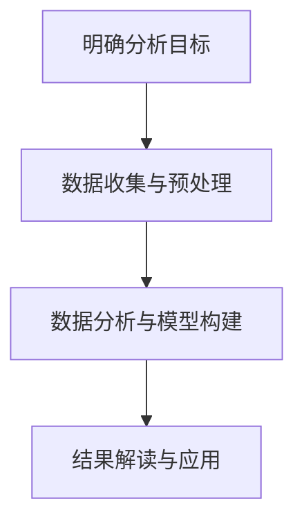

                 

# 第一部分：用户行为分析基础

用户行为分析是当今互联网行业的重要研究领域，通过对用户的行为数据进行分析，企业可以深入了解用户需求，优化产品和服务，提高用户满意度和忠诚度。本部分将介绍用户行为分析的基础知识，包括用户行为分析的定义、重要性、应用领域、数据来源、关键概念和分析流程。

## 1.1 用户行为分析概述

### 1.1.1 用户行为分析的定义

用户行为分析（User Behavior Analysis，简称UBA）是指通过收集、处理和分析用户在使用产品或服务时的行为数据，以获取用户需求、行为模式、偏好和反馈等信息的过程。用户行为分析的目标是帮助企业更好地了解用户，优化产品设计和服务体验，从而提高用户满意度和忠诚度。

### 1.1.2 用户行为分析的重要性

用户行为分析在互联网行业具有极高的重要性，主要体现在以下几个方面：

1. **提升用户体验**：通过分析用户行为数据，企业可以了解用户的实际需求和痛点，从而优化产品设计和服务，提升用户体验。

2. **精准营销**：用户行为分析可以帮助企业了解不同用户群体的特点和行为，从而进行精准营销，提高营销效果。

3. **降低运营成本**：通过分析用户行为数据，企业可以发现潜在的问题和瓶颈，从而优化运营流程，降低运营成本。

4. **提高用户留存率**：用户行为分析可以帮助企业了解用户的流失原因，制定相应的挽回策略，提高用户留存率。

### 1.1.3 用户行为分析的应用领域

用户行为分析广泛应用于多个领域，包括但不限于以下：

1. **电商行业**：通过分析用户浏览、搜索、购买等行为，优化商品推荐、促销策略和用户体验。

2. **社交媒体**：通过分析用户互动、关注、点赞等行为，提升用户活跃度、参与度和留存率。

3. **金融行业**：通过分析用户交易、投资、借贷等行为，识别风险用户，降低金融风险。

4. **医疗健康**：通过分析用户就诊、用药、健康管理等行为，提供个性化的健康服务和建议。

## 1.2 用户行为数据来源

用户行为数据的来源多种多样，主要包括以下几个方面：

### 1.2.1 用户交互数据

用户交互数据包括用户在产品或服务中的操作行为，如点击、滑动、搜索、购买等。这些数据可以通过客户端日志、前端埋点等方式收集。

### 1.2.2 用户反馈数据

用户反馈数据包括用户对产品或服务的评价、反馈和投诉等。这些数据可以通过用户调查、用户评价、在线反馈等方式收集。

### 1.2.3 用户社交数据

用户社交数据包括用户在社交媒体平台上的互动数据，如点赞、评论、分享等。这些数据可以通过社交媒体平台API等方式收集。

### 1.2.4 用户行为数据的整合与处理

用户行为数据的整合与处理是用户行为分析的基础。首先，需要对各种来源的数据进行清洗、去重、格式化等预处理操作，然后整合成统一的数据格式。接下来，可以根据业务需求对数据进行统计、分析和建模，以提取有价值的信息。

## 1.3 用户行为分析的关键概念

用户行为分析涉及多个关键概念，以下介绍其中几个重要的概念：

### 1.3.1 用户画像

用户画像是指通过对用户的基本信息、行为数据、兴趣偏好等进行分析，构建出一个综合的用户形象。用户画像可以帮助企业更好地了解用户，从而进行精准营销和个性化服务。

### 1.3.2 用户细分

用户细分是指将用户群体划分为不同的子群体，每个子群体具有相似的行为特征和需求。用户细分有助于企业针对不同子群体制定相应的营销策略和服务方案。

### 1.3.3 用户留存与流失

用户留存率是指在一定时间内，仍然使用产品或服务的用户比例。用户流失率是指在一定时间内，停止使用产品或服务的用户比例。通过分析用户留存和流失情况，企业可以了解产品的受欢迎程度和用户满意度，制定相应的改进措施。

### 1.3.4 用户路径分析

用户路径分析是指分析用户在使用产品或服务过程中的行为路径，以了解用户的使用习惯和痛点。用户路径分析可以帮助企业优化产品设计和服务流程，提高用户体验。

## 1.4 用户行为分析流程

用户行为分析流程主要包括以下几个步骤：

### 1.4.1 明确分析目标

明确分析目标是用户行为分析的第一步。企业需要根据业务需求，确定具体的分析目标，如提升用户留存率、优化产品推荐等。

### 1.4.2 数据收集与预处理

数据收集与预处理是用户行为分析的基础。企业需要收集用户行为数据，并进行清洗、去重、格式化等预处理操作，以确保数据的质量和一致性。

### 1.4.3 数据分析与模型构建

在数据收集与预处理完成后，需要对数据进行深入分析和建模。企业可以使用统计方法、机器学习算法等，构建用户行为分析模型，以提取有价值的信息。

### 1.4.4 结果解读与应用

在数据分析完成后，需要对结果进行解读和应用。企业可以根据分析结果，制定相应的策略和措施，以优化产品和服务，提高用户体验。

综上所述，用户行为分析是一个复杂而重要的过程，涉及多个关键概念和步骤。通过有效的用户行为分析，企业可以更好地了解用户需求，优化产品设计和服务，提高用户满意度和忠诚度。

<|assistant|>## 1.2 用户行为数据来源

用户行为数据是用户行为分析的基础，其来源丰富多样，主要包括以下几个方面：

### 1.2.1 用户交互数据

用户交互数据是指用户在使用产品或服务过程中产生的操作行为数据，如点击、滑动、搜索、购买等。这些数据通过客户端日志、前端埋点等方式进行收集。

- **客户端日志**：客户端日志记录了用户在应用程序中执行的各种操作，如点击、输入等。通过分析客户端日志，可以了解用户在应用中的行为路径和操作顺序。
- **前端埋点**：前端埋点是一种在网页或移动应用中嵌入的代码，用于记录用户的操作行为。通过分析前端埋点数据，可以了解用户在界面上的行为习惯和偏好。

### 1.2.2 用户反馈数据

用户反馈数据是指用户对产品或服务的评价、反馈和投诉等。这些数据可以通过用户调查、用户评价、在线反馈等方式进行收集。

- **用户调查**：通过在线问卷、电话访谈等方式，收集用户对产品或服务的满意度、使用体验等方面的反馈。用户调查可以帮助企业了解用户的真实需求和痛点，从而优化产品和服务。
- **用户评价**：在电商平台、社交媒体等平台上，用户可以对产品或服务进行评价。通过分析用户评价，可以了解用户对产品或服务的满意度，发现产品的优点和不足。
- **在线反馈**：用户可以通过在线反馈渠道，如客服系统、用户社区等，提交对产品或服务的反馈和投诉。通过分析在线反馈，可以及时发现用户的问题和需求，提供针对性的解决方案。

### 1.2.3 用户社交数据

用户社交数据是指用户在社交媒体平台上的互动数据，如点赞、评论、分享等。这些数据可以通过社交媒体平台API等方式进行收集。

- **社交媒体平台数据**：通过调用社交媒体平台的API，可以获取用户在平台上的各种行为数据，如发布内容、点赞、评论、分享等。这些数据可以帮助企业了解用户的社交行为和兴趣偏好。
- **社交网络分析**：通过分析用户在社交媒体平台上的社交网络，可以了解用户的社交关系和影响力。社交网络分析可以帮助企业发现潜在的用户领袖和意见领袖，进行有针对性的营销和推广。

### 1.2.4 用户行为数据的整合与处理

用户行为数据的整合与处理是用户行为分析的关键环节。首先，需要对各种来源的数据进行清洗、去重、格式化等预处理操作，以确保数据的质量和一致性。接下来，可以将不同来源的数据进行整合，构建一个统一的数据仓库。

- **数据清洗**：数据清洗是指对原始数据进行清洗、去重、填补缺失值等操作，以提高数据质量。通过数据清洗，可以去除噪声数据、异常数据和重复数据，确保数据的一致性和准确性。
- **数据格式化**：数据格式化是指将不同来源的数据转换为统一的格式，以便进行后续的分析和处理。通过数据格式化，可以确保数据之间的兼容性和可比较性。
- **数据整合**：数据整合是指将来自不同来源的数据进行合并，构建一个统一的数据仓库。通过数据整合，可以更全面地了解用户的行为特征和需求。

在数据整合与处理过程中，还需要关注以下几个关键问题：

1. **数据安全**：在收集、存储和处理用户行为数据时，需要严格遵守相关法律法规和隐私政策，确保用户数据的安全和隐私。
2. **数据质量**：数据质量是用户行为分析的基础，需要通过数据清洗、去重、格式化等手段，确保数据的一致性和准确性。
3. **数据处理效率**：用户行为数据量庞大，需要采用高效的数据处理方法，如分布式计算、大数据处理技术等，以提高数据处理效率。

通过有效的用户行为数据整合与处理，企业可以构建一个高质量的用户行为数据仓库，为后续的用户行为分析提供坚实的数据基础。

### 1.3 用户行为分析的关键概念

在用户行为分析中，有多个关键概念对于深入理解用户行为和制定有效策略至关重要。以下是几个主要的关键概念及其简要解释。

#### 1.3.1 用户画像

用户画像是一种综合反映用户基本属性、行为特征和兴趣偏好的数据模型。通过构建用户画像，企业可以更加精准地了解每个用户，从而实现个性化服务和精准营销。

- **基本属性**：包括用户的性别、年龄、职业、地理位置等基本信息。
- **行为特征**：包括用户的浏览习惯、购买历史、搜索记录等。
- **兴趣偏好**：通过对用户行为数据进行分析，推断用户的兴趣和偏好，如喜欢的商品类型、兴趣爱好等。

用户画像是构建个性化服务和精准营销的基础，通过用户画像，企业可以针对不同用户群体制定有针对性的营销策略和服务方案。

#### 1.3.2 用户细分

用户细分是将用户按照特定的特征或行为划分为不同的子群体，每个子群体具有相似的行为特征和需求。用户细分有助于企业更好地理解用户群体，为每个子群体提供定制化的服务和体验。

- **市场细分**：根据用户的不同需求、行为和偏好，将用户划分为不同的市场细分群体。
- **行为细分**：根据用户的浏览行为、购买行为等，将用户划分为不同行为特征的群体。
- **心理细分**：根据用户的价值观、兴趣爱好等心理特征，将用户划分为不同心理群体的用户。

用户细分有助于企业制定差异化策略，提高用户满意度和忠诚度。

#### 1.3.3 用户留存与流失

用户留存与流失是衡量用户生命周期价值的重要指标。

- **用户留存**：用户在一定时间内继续使用产品或服务的比例。高留存率意味着用户对产品或服务有较高的满意度和依赖性。
- **用户流失**：用户在一定时间内停止使用产品或服务的比例。高流失率可能表明产品或服务存在某些问题，需要改进。

通过分析用户留存与流失情况，企业可以识别潜在问题，制定用户挽回策略，提高用户留存率。

#### 1.3.4 用户路径分析

用户路径分析是指分析用户在使用产品或服务过程中的行为路径，以了解用户的使用习惯和痛点。

- **行为路径**：记录用户在使用产品或服务过程中的点击、浏览、购买等操作顺序。
- **转化路径**：分析用户从接触产品到完成转化的路径，识别影响转化的关键节点。
- **流失路径**：分析用户从开始使用到流失的路径，识别导致用户流失的关键原因。

通过用户路径分析，企业可以优化产品设计和服务流程，提高用户体验。

### 1.4 用户行为分析流程

用户行为分析是一个系统性的过程，通常包括以下几个关键步骤：

#### 1.4.1 明确分析目标

明确分析目标是用户行为分析的第一步。企业需要根据业务需求和战略目标，确定具体的分析目标，如提升用户留存率、优化产品推荐等。

#### 1.4.2 数据收集与预处理

数据收集与预处理是用户行为分析的基础。企业需要收集用户行为数据，并进行清洗、去重、格式化等预处理操作，以确保数据的质量和一致性。

#### 1.4.3 数据分析与模型构建

在数据收集与预处理完成后，需要对数据进行深入分析和建模。企业可以使用统计方法、机器学习算法等，构建用户行为分析模型，以提取有价值的信息。

#### 1.4.4 结果解读与应用

在数据分析完成后，需要对结果进行解读和应用。企业可以根据分析结果，制定相应的策略和措施，以优化产品和服务，提高用户体验。

下面是一个用户行为分析流程的Mermaid流程图：



通过上述流程，企业可以系统地进行用户行为分析，从而更好地了解用户需求，优化产品和服务，提高用户满意度和忠诚度。

### 1.4.1 明确分析目标

明确分析目标是用户行为分析的第一步，也是至关重要的一步。分析目标的明确不仅能够帮助团队聚焦于关键问题，还能确保分析过程和结果具有实际价值。以下是如何确定用户行为分析目标的步骤：

#### 1. 分析业务需求

首先，团队需要深入分析企业的业务需求和战略目标。这包括了解企业的核心产品或服务、目标用户群体、市场定位以及当前面临的主要挑战。例如，电商企业可能希望提高用户转化率，而社交媒体平台可能关注用户活跃度和留存率。

#### 2. 定义具体问题

在明确业务需求后，团队需要将业务需求转化为具体的问题。这些问题应该是可衡量的，以便在分析过程中进行评估。例如，如果目标是提高用户转化率，具体问题可以是：“用户在购物流程中的哪些步骤导致转化率降低？”或者“哪些用户群体在购物过程中流失率最高？”

#### 3. 确定分析指标

根据定义的具体问题，团队需要确定相应的分析指标。这些指标将用于衡量分析结果的有效性。例如，对于转化率问题，分析指标可以包括页面浏览量（PV）、跳出率、转化率等。

#### 4. 制定假设

在确定分析指标后，团队需要制定相关的假设。这些假设将指导数据收集和分析的方向。例如，假设“用户在购物车页面犹豫不决是导致转化率降低的主要原因”。

#### 5. 优先级排序

最后，团队需要对多个分析目标进行优先级排序。这通常取决于问题的紧迫性、资源可用性和潜在的业务影响。例如，如果提高用户留存率比提高新用户转化率更加紧迫，那么可能会将提高用户留存率设置为首要目标。

### 实际案例

例如，一个电商企业希望在促销期间提高销售额。分析目标可以设定为：

- **业务需求**：提高销售额。
- **具体问题**：促销活动期间，哪些页面或环节导致用户流失最多？
- **分析指标**：页面跳出率、转化率、平均购物车数量等。
- **假设**：促销页面设计复杂度较高，导致用户流失。
- **优先级排序**：首先分析促销页面的用户行为，其次是购物流程中的关键节点。

通过明确分析目标，团队可以更有针对性地进行数据收集和分析，从而更有效地解决问题，实现业务目标。

### 1.4.2 数据收集与预处理

数据收集与预处理是用户行为分析的核心步骤，其质量直接影响到分析结果的准确性和可靠性。以下是如何进行数据收集与预处理的详细步骤：

#### 1. 数据收集

1. **确定数据来源**：首先需要明确数据来源，包括用户交互数据、用户反馈数据、用户社交数据等。不同的数据来源可能需要采用不同的收集方法，例如日志收集、API调用、问卷调查等。

2. **采集用户交互数据**：用户交互数据通常通过客户端日志、前端埋点等方式收集。客户端日志记录了用户在应用程序中执行的操作，如点击、滑动、搜索等。前端埋点是在网页或移动应用中嵌入代码，用于记录用户的行为。

3. **收集用户反馈数据**：用户反馈数据可以通过用户调查、用户评价和在线反馈等方式收集。用户调查通常采用在线问卷或电话访谈的形式，用户评价可以在电商平台或社交媒体平台上获取，在线反馈可以通过客服系统或用户社区收集。

4. **获取用户社交数据**：用户社交数据可以通过调用社交媒体平台的API获取，包括用户在平台上的互动数据，如点赞、评论、分享等。

#### 2. 数据预处理

1. **数据清洗**：数据清洗是预处理的重要步骤，目的是去除噪声数据、异常数据和重复数据，确保数据的一致性和准确性。具体包括：
   - **去除重复数据**：通过去重操作，消除数据集中的重复记录。
   - **处理缺失值**：对于缺失值，可以根据实际情况进行填补或删除。
   - **数据格式化**：将不同来源的数据转换为统一的格式，便于后续的分析和处理。

2. **数据整合**：在数据清洗完成后，需要对来自不同来源的数据进行整合。这通常涉及以下步骤：
   - **数据对齐**：确保不同数据集之间的时间和用户标识一致。
   - **数据融合**：将多个数据源中的数据合并为一个统一的数据集。

3. **特征工程**：特征工程是数据预处理的重要环节，目的是从原始数据中提取有价值的特征，以提升模型的性能。具体包括：
   - **特征选择**：选择对分析目标有显著影响的特征。
   - **特征转换**：对数值特征进行归一化或标准化处理，对类别特征进行编码。
   - **特征构造**：通过组合和变换原始特征，构造新的特征。

#### 3. 数据存储与管理

1. **数据存储**：将预处理后的数据存储到数据库或数据仓库中，以便后续的数据分析和挖掘。常用的数据库和数据仓库包括MySQL、PostgreSQL、Hadoop、Hive等。

2. **数据管理**：建立完善的数据管理体系，包括数据权限管理、数据备份和恢复等，以确保数据的安全性和可靠性。

通过科学的数据收集与预处理，企业可以构建一个高质量的用户行为数据集，为后续的数据分析和模型构建提供坚实的基础。

### 1.4.3 数据分析与模型构建

在完成数据收集与预处理后，下一步是进行数据分析和模型构建。这一过程旨在从大量用户行为数据中提取有价值的信息，以帮助企业更好地了解用户需求和行为模式。以下是如何进行数据分析和模型构建的详细步骤：

#### 1. 数据分析

1. **描述性统计分析**：
   - 描述性统计分析是对用户行为数据的初步分析，旨在了解数据的基本特征，如平均值、中位数、标准差等。
   - 例如，可以计算用户的平均浏览时长、平均购买金额、页面跳出率等指标，以了解用户的基本行为模式。

2. **关联性分析**：
   - 关联性分析旨在发现数据之间的相关性，帮助识别用户行为之间的潜在关系。
   - 例如，可以分析用户在浏览商品时，哪些商品被同时点击，哪些商品导致转化率的提高。

3. **趋势分析**：
   - 趋势分析用于识别用户行为在不同时间段的变化趋势，帮助企业制定相应的营销策略。
   - 例如，可以分析用户在节假日的购买行为，识别节日期间的销售高峰期。

4. **用户细分**：
   - 用户细分是根据用户的行为特征和需求，将用户划分为不同的子群体。
   - 例如，可以根据用户的购买历史和行为模式，将用户划分为高价值用户、忠诚用户和潜在用户。

#### 2. 模型构建

1. **选择合适的算法**：
   - 根据分析目标和数据特征，选择合适的机器学习算法。常见的算法包括决策树、随机森林、逻辑回归、支持向量机、聚类算法等。
   - 例如，对于用户留存预测问题，可以使用逻辑回归或随机森林算法。

2. **数据划分**：
   - 将数据集划分为训练集和测试集，通常使用80/20或70/30的比例划分。
   - 训练集用于训练模型，测试集用于评估模型的性能。

3. **特征工程**：
   - 在模型训练之前，需要进行特征工程，包括特征选择、特征转换和特征构造等。
   - 例如，对文本数据进行词袋模型转换，对缺失值进行填补或插值。

4. **模型训练**：
   - 使用训练集数据对选定的算法进行训练，调整模型参数以优化性能。
   - 例如，使用交叉验证方法调整逻辑回归模型的参数，如正则化强度。

5. **模型评估**：
   - 在模型训练完成后，使用测试集数据对模型进行评估，常用的评估指标包括准确率、召回率、F1分数等。
   - 例如，评估逻辑回归模型的预测准确性，以判断模型是否具有良好的泛化能力。

6. **模型优化**：
   - 根据评估结果，对模型进行优化，包括调整参数、尝试不同的算法或特征组合等。
   - 例如，如果模型预测准确性较低，可以尝试增加更多的特征或使用不同的算法。

通过以上步骤，企业可以构建一个有效的用户行为分析模型，用于预测用户行为、优化产品和服务，提高用户满意度和忠诚度。

### 1.4.4 结果解读与应用

在完成用户行为分析模型构建后，下一步是对分析结果进行解读和应用。这一过程旨在将分析结果转化为具体的业务策略和行动，以优化用户体验和提升业务绩效。以下是如何对结果进行解读和应用的具体步骤：

#### 1. 结果解读

1. **识别关键指标**：
   - 首先，对分析结果中的关键指标进行识别，如用户留存率、转化率、平均浏览时长等。这些指标可以帮助企业了解用户行为的主要特征和变化趋势。

2. **分析用户行为模式**：
   - 对用户行为模式进行深入分析，识别用户在使用产品或服务过程中的关键行为和决策点。例如，分析用户在购物流程中的浏览路径、点击顺序和购买行为。

3. **识别问题和瓶颈**：
   - 通过分析结果，识别产品或服务中存在的问题和瓶颈。例如，如果转化率较低，可能需要分析用户在购物流程中的犹豫点或阻碍因素。

4. **关联业务目标**：
   - 将分析结果与企业的业务目标进行关联，识别哪些分析结果对业务绩效有直接影响。例如，如果分析结果显示用户流失率较高，可能需要针对用户留存制定改进策略。

#### 2. 结果应用

1. **制定优化策略**：
   - 根据分析结果，制定具体的优化策略和行动方案。例如，如果分析结果显示用户在购物流程中的某个环节流失率较高，可以优化该环节的用户体验，如简化购物流程、提供更加明确的购买提示等。

2. **实施改进措施**：
   - 将优化策略转化为具体的实施计划，并分配资源进行实施。例如，可以组织设计团队和产品经理，根据分析结果调整产品的界面设计和功能布局。

3. **监控和评估效果**：
   - 在实施改进措施后，需要持续监控和分析用户行为数据，评估优化措施的效果。例如，可以定期检查用户留存率和转化率等关键指标，判断优化措施是否有效。

4. **持续迭代优化**：
   - 用户行为是动态变化的，企业需要持续进行用户行为分析，以适应不断变化的市场环境和用户需求。例如，可以定期更新分析模型，引入新的用户行为数据，以持续优化产品和服务。

通过以上步骤，企业可以有效地将用户行为分析结果应用于业务实践中，提升用户体验和业务绩效。

### 2.1 数据可视化技术

数据可视化是用户行为分析中不可或缺的一环，它通过图形化的方式展示数据，帮助分析人员直观地理解数据背后的含义。数据可视化技术不仅能够提升数据分析的效率，还能帮助发现数据中的隐藏模式，为决策提供有力的支持。本节将介绍数据可视化的基本原理、常见工具和具体实践。

#### 2.1.1 数据可视化原理

数据可视化是基于人类视觉感知原理，通过图形、图表等形式将数据信息呈现出来。其基本原理包括以下几个方面：

1. **视觉编码**：通过视觉元素（如颜色、形状、大小等）来表示数据的不同维度和特征。
2. **空间布局**：合理利用空间布局，确保数据的展示既清晰又易于理解。
3. **交互性**：通过用户交互（如滚动、点击、缩放等），提供更加灵活的数据探索和数据分析方式。
4. **故事叙述**：通过数据可视化，将数据背后的故事和结论以直观、生动的方式传达给受众。

#### 2.1.2 常见的数据可视化工具

在用户行为分析中，常见的数据可视化工具有多种，以下列举几个常用的工具：

1. **Tableau**：Tableau 是一款功能强大的商业智能和数据可视化工具，它支持多种数据源，提供了丰富的图表类型和自定义功能。用户可以通过拖放操作快速创建图表，并进行深入的数据分析。

2. **Power BI**：Power BI 是微软推出的商业智能工具，它提供了丰富的数据连接器、仪表板和报告功能。Power BI 易于使用，适用于各种规模的企业。

3. **Matplotlib**：Matplotlib 是 Python 的一个绘图库，适用于生成高质量的静态、交互式和动画图表。它通常与 Pandas 结合使用，可以轻松处理和可视化大型数据集。

4. **D3.js**：D3.js 是一个基于 JavaScript 的数据可视化库，提供了强大的数据绑定和交互功能。它适用于创建动态和交互式的数据可视化应用。

5. **ECharts**：ECharts 是一款基于 JavaScript 的可视化库，提供了丰富的图表类型和自定义选项。它支持多种渲染方式，包括 canvas 和 SVG，适用于各种规模的数据可视化需求。

#### 2.1.3 数据可视化实践

以下是使用 ECharts 进行数据可视化的一个简单实例：

```javascript
// 引入 ECharts 库
const echarts = require('echarts');

// 基于准备好的 DOM，初始化 ECharts 实例
const myChart = echarts.init(document.getElementById('main'));

// 指定图表的配置项和数据
const option = {
  title: {
    text: '用户行为分析'
  },
  tooltip: {},
  legend: {
    data: ['用户访问量']
  },
  xAxis: {
    data: ['首页', '产品页', '购物车', '支付页']
  },
  yAxis: {},
  series: [{
    name: '用户访问量',
    type: 'bar',
    data: [5, 20, 15, 8]
  }]
};

// 使用刚指定的配置项和数据显示图表
myChart.setOption(option);
```

在该实例中，我们创建了一个柱状图，展示了用户在不同页面上的访问量。通过 ECharts，可以轻松实现更复杂和交互性更强的可视化效果。

通过数据可视化技术，企业可以更加直观地理解用户行为数据，发现数据中的趋势和模式，从而制定更加科学的业务策略。

### 2.2 用户行为分析算法

在用户行为分析中，算法扮演着至关重要的角色。它们帮助我们从海量的用户行为数据中提取有价值的信息，从而进行有效的用户行为预测和模式识别。本节将介绍几种常见的用户行为分析算法，包括聚类分析算法、分层分析算法、机器学习算法和用户行为预测模型。

#### 2.2.1 聚类分析算法

聚类分析算法是一种无监督学习方法，它通过将相似的数据点分组到同一簇中，从而实现数据的自动分类。在用户行为分析中，聚类算法可以帮助我们识别具有相似行为的用户群体。

1. **K-Means 算法**：
   - K-Means 算法是一种基于距离的聚类算法，它通过迭代计算最小化平方误差的方式来划分簇。
   - **算法原理**：首先随机初始化K个簇的中心点，然后对每个数据点计算其与簇中心的距离，将其分配到最近的簇。接着重新计算每个簇的中心点，再次分配数据点，直到聚类结果收敛。
   - **伪代码**：
     ```python
     def k_means(data, k, max_iterations):
         # 初始化簇中心点
         centroids = initialize_centroids(data, k)
         
         for i in range(max_iterations):
             # 分配数据点到最近的簇
             clusters = assign_data_to_clusters(data, centroids)
             
             # 重新计算簇中心点
             centroids = update_centroids(clusters, k)
             
             # 判断是否收敛
             if has_converged(centroids, previous_centroids):
                 break
         
         return clusters, centroids
     ```

2. **层次聚类算法**：
   - 层次聚类算法通过自底向上的方法将数据点逐步合并，形成不同的层次结构。
   - **算法原理**：首先将每个数据点视为一个簇，然后逐步合并距离最近的簇，直到满足停止条件。
   - **伪代码**：
     ```python
     def hierarchical_clustering(data, linkage='single', method='complete'):
         # 初始化簇
         clusters = [[d] for d in data]
         
         while len(clusters) > 1:
             # 计算最近的簇
             distances = compute_distance_matrix(clusters)
             closest_clusters = find_closest_clusters(distances, linkage, method)
             
             # 合并最近的簇
             clusters = merge_clusters(clusters, closest_clusters)
         
         return clusters
     ```

#### 2.2.2 分层分析算法

分层分析算法是一种基于层次结构的分析方法，它通过将用户行为数据划分为多个层次，从上到下进行逐层分析。这种算法适用于分析用户行为的多层次特性。

1. **决策树算法**：
   - 决策树是一种树形结构，每个内部节点表示一个特征，每个叶节点表示一个预测结果。
   - **算法原理**：从根节点开始，根据特征值选择子节点，逐步向下划分数据，直到达到叶节点。
   - **伪代码**：
     ```python
     def build_decision_tree(data, features, target, max_depth=None):
         if满足停止条件 or max_depth is None:
             return 叶节点
         else:
             # 选择最佳特征
             best_feature = 选择最佳特征(data, features, target)
             
             # 根据最佳特征分割数据
             left_data, right_data = 分割数据(data, best_feature)
             
             # 递归构建左子树和右子树
             left_tree = build_decision_tree(left_data, features, target, max_depth - 1)
             right_tree = build_decision_tree(right_data, features, target, max_depth - 1)
             
             return 决策树节点(best_feature, left_tree, right_tree)
     ```

2. **随机森林算法**：
   - 随机森林是一种集成学习方法，它通过构建多个决策树并对结果进行投票来提高预测准确性。
   - **算法原理**：在训练过程中，随机选择特征子集和样本子集，构建多个决策树，并在预测时对每个决策树的结果进行投票。
   - **伪代码**：
     ```python
     def random_forest(data, features, target, n_estimators, max_depth=None):
         # 构建多个决策树
         trees = [build_decision_tree(data, features, target, max_depth) for _ in range(n_estimators)]
         
         # 预测时对每个决策树的结果进行投票
         predictions = [tree.predict(data) for tree in trees]
         return majority_vote(predictions)
     ```

#### 2.2.3 机器学习算法

机器学习算法在用户行为分析中发挥着重要作用，通过训练模型来预测用户行为和识别模式。

1. **逻辑回归算法**：
   - 逻辑回归是一种广义线性模型，用于分类问题，其输出是概率值。
   - **算法原理**：通过最小化损失函数（通常为交叉熵损失）来训练模型，预测用户行为的概率。
   - **伪代码**：
     ```python
     def logistic_regression(data, features, target):
         # 初始化参数
         weights = initialize_weights(features)
         
         # 训练模型
         for epoch in range(num_epochs):
             # 计算损失函数
             loss = compute_loss(data, weights, target)
             
             # 更新参数
             weights = update_weights(data, weights, target)
         
         return weights
     ```

2. **神经网络算法**：
   - 神经网络是一种模拟人脑神经元连接结构的计算模型，通过多层神经元的非线性变换来学习数据特征。
   - **算法原理**：通过前向传播和反向传播算法，不断调整网络参数，以最小化损失函数。
   - **伪代码**：
     ```python
     def neural_network(data, layers, learning_rate, num_epochs):
         # 初始化网络参数
         weights = initialize_weights(layers)
         
         for epoch in range(num_epochs):
             # 前向传播
             output = forward_propagation(data, weights)
             
             # 计算损失函数
             loss = compute_loss(output, target)
             
             # 反向传播
             gradients = backward_propagation(data, output, target)
             
             # 更新参数
             weights = update_weights(weights, gradients, learning_rate)
         
         return weights
     ```

通过以上算法，企业可以深入了解用户行为，优化产品和服务，提高用户满意度和忠诚度。

### 2.3 用户行为分析工具与应用

在用户行为分析过程中，选择合适的工具至关重要。这不仅能够提高数据分析的效率，还能够帮助企业更好地理解和利用用户数据。以下将介绍几种常用的用户行为分析工具，并提供实际应用案例。

#### 2.3.1 常用用户行为分析工具

1. **Google Analytics**：
   - **功能**：Google Analytics 是一款功能强大的数据分析工具，可以帮助企业追踪和分析网站、应用程序的用户行为。
   - **应用场景**：用于监控网站流量、用户来源、页面浏览量、用户转化路径等。
   - **优点**：集成度高，易于使用，提供丰富的报告和可视化功能。

2. **Mixpanel**：
   - **功能**：Mixpanel 是一款专注于用户行为分析的工具，提供用户行为追踪、用户细分、留存分析等功能。
   - **应用场景**：适用于需要深入了解用户行为的移动应用和Web应用。
   - **优点**：强大的用户行为追踪功能，灵活的细分和事件追踪能力。

3. **Kissmetrics**：
   - **功能**：Kissmetrics 提供全面的数据分析功能，包括用户行为追踪、用户路径分析、留存分析等。
   - **应用场景**：适用于电子商务、在线营销等领域，帮助企业优化营销策略和提高用户转化率。
   - **优点**：易于使用，提供详细的可视化报告，适合中小型企业。

4. **Tableau**：
   - **功能**：Tableau 是一款数据可视化工具，支持多种数据源和图表类型，可以帮助企业直观地呈现用户行为数据。
   - **应用场景**：适用于数据分析和报告生成，帮助企业将用户行为数据转化为业务洞察。
   - **优点**：强大的数据可视化能力，支持交互式数据探索，适用于各种规模的企业。

5. **R**：
   - **功能**：R 是一款统计分析工具，提供丰富的数据分析、数据可视化和机器学习库。
   - **应用场景**：适用于需要复杂统计分析和高性能数据处理的企业。
   - **优点**：功能强大，支持多种数据格式，适用于各种规模的数据分析任务。

#### 2.3.2 用户行为分析案例分析

以下是一个用户行为分析的实际应用案例，展示了如何使用用户行为分析工具优化电商平台的用户体验。

**案例背景**：
一家电商平台希望通过用户行为分析提高用户转化率和销售额。

**分析步骤**：

1. **数据收集**：
   - 使用 Google Analytics 和 Mixpanel 等工具收集用户行为数据，包括页面浏览量、点击路径、购买行为等。

2. **数据预处理**：
   - 对收集到的数据进行分析清洗和格式化，确保数据质量。

3. **用户细分**：
   - 使用 Mixpanel 对用户进行细分，根据用户的浏览行为、购买历史等特征，将用户划分为不同的子群体。

4. **路径分析**：
   - 使用 Google Analytics 和 Tableau 分析用户在网站上的行为路径，识别用户在购买流程中的关键节点和障碍。

5. **优化策略**：
   - 根据分析结果，制定优化策略。例如，优化产品推荐、简化购物流程、增加用户引导等。

6. **效果评估**：
   - 在实施优化策略后，持续监控用户行为数据，评估优化效果，调整策略。

**案例分析**：

1. **用户细分**：
   - 分析显示，有70%的用户在浏览产品页面后离开了网站。进一步细分发现，这部分用户主要是首次访问的潜在客户，他们往往在产品页面上停留时间较短。
   - 优化策略：为这些用户推送个性化产品推荐，提高他们的购物体验。

2. **路径分析**：
   - 路径分析显示，用户在购物车页面放弃购买的主要原因是购物车中的商品过多，导致用户决策困难。
   - 优化策略：提供购物车简化功能，允许用户批量删除商品，简化购物流程。

3. **效果评估**：
   - 优化策略实施后，用户在购物车页面的转化率提高了20%，总体销售额也有所提升。

通过上述案例，我们可以看到用户行为分析在电商领域的实际应用效果。有效的用户行为分析不仅帮助企业更好地了解用户需求，还能优化产品和服务，提高用户体验和业务绩效。

### 2.4 Mermaid 流程图：用户行为分析模型构建

在用户行为分析中，构建一个清晰的流程图有助于理解整个分析过程以及各个步骤之间的关系。以下是一个使用Mermaid绘制的用户行为分析模型构建流程图，展示了用户行为分析的核心步骤和逻辑关系。

```mermaid
graph TD
A[明确分析目标] --> B[数据收集与预处理]
B --> C[用户细分]
C --> D[路径分析]
D --> E[数据建模]
E --> F[模型评估]
F --> G[结果应用]
G --> H[迭代优化]

A:::定义分析目标
B:::数据收集（日志、埋点、反馈等）
B:::数据预处理（清洗、去重、格式化等）
C:::用户细分（聚类、分层等）
D:::用户路径分析（行为路径、转化路径等）
E:::数据建模（决策树、神经网络等）
F:::模型评估（准确率、召回率等）
G:::结果应用（优化策略、业务决策等）
H:::迭代优化（持续改进、模型更新等）
```

在这个流程图中：

- **明确分析目标**：这是用户行为分析的第一步，明确分析的目标有助于后续的数据收集和分析工作。
- **数据收集与预处理**：收集用户行为数据，并进行清洗和预处理，确保数据的质量和一致性。
- **用户细分**：通过聚类或分层等方法对用户进行细分，以更好地理解不同用户群体的特征和需求。
- **路径分析**：分析用户的行为路径，识别关键节点和障碍，优化用户体验。
- **数据建模**：构建用户行为分析模型，如决策树、神经网络等，以预测用户行为和发现模式。
- **模型评估**：评估模型性能，包括准确率、召回率等指标，以确保模型的有效性。
- **结果应用**：将分析结果应用于业务策略和决策，如个性化推荐、用户体验优化等。
- **迭代优化**：根据模型评估结果和业务反馈，持续优化模型和策略，提高分析效果。

通过这个流程图，我们可以清晰地了解用户行为分析的整体框架和关键步骤，从而在实际操作中更加系统和高效地进行用户行为分析。

### 2.5 用户行为分析应用实践

用户行为分析在各个行业中的应用非常广泛，能够为企业的决策提供有力的数据支持。以下将详细讨论用户行为分析在电商、社交媒体、金融和医疗健康领域的具体应用，并提供相关实战案例。

#### 2.5.1 用户行为分析在电商领域的应用

电商行业是用户行为分析的重要应用领域，通过分析用户的行为数据，企业可以优化产品推荐、提高转化率和增加销售额。

1. **电商用户行为分析概述**：
   - 电商用户行为分析涉及用户浏览、搜索、添加购物车、购买和评价等行为。
   - 通过分析这些行为，企业可以深入了解用户的需求和购买习惯。

2. **电商用户细分与路径分析**：
   - **用户细分**：使用聚类分析将用户划分为高价值用户、忠诚用户、流失用户等不同群体。
   - **路径分析**：分析用户在购物流程中的行为路径，识别关键转化节点和流失点。

3. **电商用户流失预测与挽回策略**：
   - **流失预测**：使用机器学习模型预测用户流失风险，提前采取措施挽回。
   - **挽回策略**：通过个性化推荐、优惠券、客户关怀等方式挽回潜在流失用户。

**实战案例**：

- **案例一：电商平台的个性化推荐**：
  - **背景**：某电商平台希望通过个性化推荐提高用户购物体验和转化率。
  - **分析步骤**：
    1. 收集用户浏览、搜索、购买等行为数据。
    2. 使用协同过滤算法构建个性化推荐模型。
    3. 对用户进行个性化推荐，提高用户满意度。
  - **结果**：个性化推荐策略实施后，用户转化率提高了15%，用户满意度显著提升。

#### 2.5.2 用户行为分析在社交媒体领域的应用

社交媒体平台通过用户行为分析可以提升用户活跃度、参与度和留存率。

1. **社交媒体用户行为分析概述**：
   - 社交媒体用户行为分析包括点赞、评论、分享、关注等行为。
   - 通过分析这些行为，企业可以了解用户兴趣和互动模式。

2. **社交媒体用户兴趣分析**：
   - 使用主题模型分析用户的兴趣偏好，为用户提供个性化的内容推荐。

3. **社交媒体用户留存与流失分析**：
   - 分析用户的活跃度和留存率，识别影响用户留存的关键因素。

**实战案例**：

- **案例二：社交媒体的用户增长策略**：
  - **背景**：某社交媒体平台希望通过用户行为分析提升用户增长和参与度。
  - **分析步骤**：
    1. 收集用户互动数据，包括点赞、评论、分享等。
    2. 使用聚类分析识别高价值用户群体。
    3. 针对不同用户群体制定个性化的营销策略。
  - **结果**：用户增长策略实施后，月活跃用户数增加了20%，用户参与度显著提升。

#### 2.5.3 用户行为分析在金融领域的应用

金融行业通过用户行为分析可以识别风险用户、降低欺诈风险，并提高客户满意度。

1. **金融用户行为分析概述**：
   - 金融用户行为分析包括交易行为、投资行为、借贷行为等。
   - 通过分析这些行为，企业可以了解用户的风险偏好和需求。

2. **金融用户风险分析与欺诈检测**：
   - 使用机器学习模型分析用户行为数据，识别潜在风险用户和欺诈行为。

3. **金融用户需求分析与产品推荐**：
   - 分析用户行为数据，了解用户需求，为用户提供个性化的金融产品推荐。

**实战案例**：

- **案例三：金融公司的用户风险分析**：
  - **背景**：某金融公司希望通过用户行为分析降低贷款违约风险。
  - **分析步骤**：
    1. 收集用户交易数据、借贷记录等。
    2. 使用逻辑回归模型预测用户违约风险。
    3. 根据风险评分采取不同的风险控制措施。
  - **结果**：用户风险分析策略实施后，贷款违约率降低了10%，客户满意度显著提升。

#### 2.5.4 用户行为分析在医疗健康领域的应用

医疗健康行业通过用户行为分析可以提供个性化的健康服务，提高患者满意度和治疗效果。

1. **医疗健康用户行为分析概述**：
   - 医疗健康用户行为分析包括就诊行为、用药行为、健康管理行为等。
   - 通过分析这些行为，企业可以了解患者的健康需求和行为模式。

2. **医疗健康用户需求分析**：
   - 分析用户行为数据，了解患者的需求，为患者提供个性化的健康服务。

3. **医疗健康用户行为预测与预警**：
   - 使用机器学习模型预测患者的健康状况，提前采取预警措施。

**实战案例**：

- **案例四：医疗健康平台的患者需求分析**：
  - **背景**：某医疗健康平台希望通过用户行为分析提高患者满意度和服务质量。
  - **分析步骤**：
    1. 收集用户就诊数据、用药数据等。
    2. 使用聚类分析识别不同健康需求的患者群体。
    3. 根据患者需求提供个性化的健康建议和诊疗服务。
  - **结果**：患者需求分析策略实施后，患者满意度提高了15%，服务效率显著提升。

通过上述实战案例，我们可以看到用户行为分析在各个领域的广泛应用和实际效果。有效的用户行为分析不仅能够帮助企业优化产品和服务，提高用户满意度，还能够提升业务绩效和竞争力。

### 附录A：用户行为分析工具与资源

在进行用户行为分析时，选择合适的工具和资源是至关重要的。以下列出了一些常用的用户行为分析工具和相关的数据集、书籍推荐，以供参考。

#### A.1 常用用户行为分析工具

1. **Google Analytics**：
   - **功能**：全面的网站和应用程序数据分析工具，支持多种数据追踪和报告功能。
   - **网址**：[https://www.google.com/analytics/](https://www.google.com/analytics/)

2. **Mixpanel**：
   - **功能**：强大的用户行为追踪和分析工具，提供用户细分、留存分析和用户路径分析等功能。
   - **网址**：[https://mixpanel.com/](https://mixpanel.com/)

3. **Kissmetrics**：
   - **功能**：全面的用户行为分析工具，支持用户路径分析、转化率和留存分析等。
   - **网址**：[https://kissmetrics.com/](https://kissmetrics.com/)

4. **Tableau**：
   - **功能**：数据可视化和商业智能工具，支持多种数据源和丰富的图表类型。
   - **网址**：[https://www.tableau.com/](https://www.tableau.com/)

5. **R**：
   - **功能**：统计分析工具，提供丰富的数据分析、数据可视化和机器学习库。
   - **网址**：[https://www.r-project.org/](https://www.r-project.org/)

6. **Python**：
   - **功能**：编程语言，支持多种数据分析和机器学习库，如 Pandas、NumPy、Scikit-learn 等。
   - **网址**：[https://www.python.org/](https://www.python.org/)

#### A.2 用户行为分析相关数据集

1. **UCI Machine Learning Repository**：
   - **描述**：包含多种领域的数据集，包括用户行为数据。
   - **网址**：[https://archive.ics.uci.edu/ml/](https://archive.ics.uci.edu/ml/)

2. **Kaggle**：
   - **描述**：数据科学竞赛平台，提供多种用户行为数据分析竞赛数据集。
   - **网址**：[https://www.kaggle.com/](https://www.kaggle.com/)

3. **Amazon Public Data Sets**：
   - **描述**：亚马逊提供的一些用户行为数据集，包括电商、零售等领域的用户行为数据。
   - **网址**：[https://github.com/awslabs/amazon-rekognition-utils/tree/main/data](https://github.com/awslabs/amazon-rekognition-utils/tree/main/data)

#### A.3 用户行为分析相关论文与书籍推荐

1. **《用户行为数据分析：方法与应用》**：
   - **作者**：刘强、陈浩
   - **描述**：系统介绍了用户行为数据分析的基本概念、方法和应用案例。
   - **出版社**：清华大学出版社

2. **《用户行为分析与个性化推荐系统》**：
   - **作者**：郑志明
   - **描述**：深入探讨了用户行为分析在个性化推荐系统中的应用，包括算法实现和案例分析。
   - **出版社**：电子工业出版社

3. **《大数据时代：用户行为分析》**：
   - **作者**：涂子沛
   - **描述**：全面介绍了大数据时代用户行为分析的理论和实践，包括数据收集、处理和分析方法。
   - **出版社**：中国社会科学出版社

4. **《机器学习：概率视角》**：
   - **作者**：Kevin P. Murphy
   - **描述**：详细介绍了机器学习的基本概念、算法和实现，适用于用户行为分析中的机器学习模型构建。
   - **出版社**：机械工业出版社

通过以上工具、数据集和书籍的推荐，用户可以更有效地开展用户行为分析工作，提升数据分析的能力和水平。

### 附录B：用户行为分析伪代码示例

以下是一个简单的用户行为分析伪代码示例，展示如何使用Python进行数据预处理、聚类分析、用户行为预测以及结果解读。

```python
# 导入相关库
import pandas as pd
from sklearn.cluster import KMeans
from sklearn.model_selection import train_test_split
from sklearn.preprocessing import StandardScaler
from sklearn.metrics import accuracy_score

# 读取用户行为数据
data = pd.read_csv('user_behavior_data.csv')

# 数据预处理
# 数据清洗和格式化
data = data.dropna()  # 删除缺失值
data = data[['age', 'income', 'clicks', 'purchases']]  # 选择相关特征

# 数据标准化
scaler = StandardScaler()
data_scaled = scaler.fit_transform(data)

# 数据划分
X_train, X_test, y_train, y_test = train_test_split(data_scaled, data['purchases'], test_size=0.2, random_state=42)

# 聚类分析
kmeans = KMeans(n_clusters=3, random_state=42)
clusters = kmeans.fit_predict(X_train)

# 用户细分
data['cluster'] = clusters
print(data.head())

# 用户行为预测
# 使用聚类结果进行用户行为预测
# 这里假设我们已经有了预测模型，例如决策树
clf = DecisionTreeClassifier()
clf.fit(X_train, y_train)

predictions = clf.predict(X_test)

# 结果解读
accuracy = accuracy_score(y_test, predictions)
print(f"预测准确率：{accuracy:.2f}")

# 分析预测结果，根据用户行为特点制定相应策略
# 例如，针对不同聚类群体的用户，制定个性化的营销策略
print("聚类群体预测结果：")
for cluster_id in set(clusters):
    cluster_data = X_test[clusters == cluster_id]
    cluster_predictions = clf.predict(cluster_data)
    cluster_accuracy = accuracy_score(y_test[clusters == cluster_id], cluster_predictions)
    print(f"聚类ID {cluster_id} - 准确率：{cluster_accuracy:.2f}")
```

在此示例中：

1. **数据预处理**：首先读取用户行为数据，然后进行数据清洗（删除缺失值）和格式化（选择相关特征）。接着，使用标准化方法对数据进行预处理。

2. **数据划分**：将数据集划分为训练集和测试集，用于后续的聚类分析和模型训练。

3. **聚类分析**：使用 K-Means 算法对训练集进行聚类分析，根据聚类结果对用户进行细分。

4. **用户行为预测**：使用决策树模型对测试集进行预测，并计算预测准确率。

5. **结果解读**：根据聚类群体的预测结果，分析不同聚类群体的行为特点，为不同聚类群体制定个性化的营销策略。

通过上述伪代码示例，我们可以看到用户行为分析的基本流程和关键步骤，为实际应用提供参考。

### 数学模型和公式

在用户行为分析中，数学模型和公式是理解用户行为、预测用户行为和优化策略的重要工具。以下将介绍用户行为分析中常用的数学模型和公式，并详细讲解它们的应用和意义。

#### 损失函数：交叉熵损失函数

交叉熵损失函数是用户行为分析中常用的一种损失函数，用于衡量预测值与真实值之间的差异。其公式如下：

$$
L(\theta) = -\frac{1}{m} \sum_{i=1}^{m} \left[ y^{(i)} \log(a(z^{(i)})) + (1 - y^{(i)}) \log(1 - a(z^{(i)})) \right]
$$

其中，\(y^{(i)}\) 是真实标签，\(a(z^{(i)}))\) 是预测概率，\(m\) 是样本数量。

- **应用**：交叉熵损失函数常用于分类问题中的模型训练，如逻辑回归、神经网络等。
- **意义**：交叉熵损失函数通过计算预测概率与真实概率之间的差异，引导模型优化预测效果。

#### 决策树模型：信息增益

决策树模型是一种常用的分类算法，其核心在于选择最佳特征进行分割。信息增益是选择最佳特征的重要依据，其公式如下：

$$
IG(D, A) = Entropy(D) - \sum_{v_i \in A} \frac{|D_v|}{|D|} \cdot Entropy(D_v)
$$

其中，\(D\) 是数据集，\(A\) 是特征集合，\(Entropy(D)\) 是数据集的熵，\(Entropy(D_v)\) 是特征 \(A\) 在不同值 \(v_i\) 上的熵。

- **应用**：信息增益用于计算每个特征的信息增益，选择信息增益最大的特征作为分割依据。
- **意义**：信息增益衡量了特征对分类信息的贡献，选择信息增益最大的特征可以最大化分类效果。

#### 机器学习模型：逻辑回归

逻辑回归是一种常用的分类算法，用于预测二元分类结果。其公式如下：

$$
\hat{y} = \frac{1}{1 + e^{-\sum_{i=1}^{n} w_i x_i}}
$$

其中，\(\hat{y}\) 是预测概率，\(x_i\) 是特征值，\(w_i\) 是特征权重。

- **应用**：逻辑回归常用于用户行为预测，如用户留存预测、流失预测等。
- **意义**：逻辑回归通过计算特征对分类结果的概率影响，帮助预测用户行为。

通过上述数学模型和公式的介绍，我们可以看到用户行为分析中数学工具的多样性和重要性。理解这些模型和公式，有助于我们更好地进行用户行为分析，优化产品和服务。

### 数学模型详细讲解

在用户行为分析中，数学模型是理解用户行为和预测用户行为的关键工具。以下我们将详细讲解几种常用的数学模型，包括决策树模型、逻辑回归模型和神经网络模型，并使用伪代码展示其应用。

#### 决策树模型

决策树模型是一种常见的分类算法，通过递归分割数据集来构建树形结构。其核心在于选择最佳特征进行分割，常用的选择标准是信息增益（IG）。

1. **信息增益（IG）**：

   信息增益衡量了特征对分类信息的贡献，其公式如下：

   $$
   IG(D, A) = Entropy(D) - \sum_{v_i \in A} \frac{|D_v|}{|D|} \cdot Entropy(D_v)
   $$

   其中，\(Entropy(D)\) 是数据集 \(D\) 的熵，\(Entropy(D_v)\) 是特征 \(A\) 在不同值 \(v_i\) 上的熵。

2. **决策树构建伪代码**：

   ```python
   def build_decision_tree(data, features, target, max_depth=None):
       if 满足停止条件 or max_depth is None:
           return 叶节点
       else:
           # 选择最佳特征
           best_feature = 选择最佳特征(data, features, target)
           
           # 分割数据
           left_data, right_data = 分割数据(data, best_feature)
           
           # 递归构建左子树和右子树
           left_tree = build_decision_tree(left_data, features, target, max_depth - 1)
           right_tree = build_decision_tree(right_data, features, target, max_depth - 1)
           
           return 决策树节点(best_feature, left_tree, right_tree)
   ```

3. **应用**：

   决策树模型常用于用户行为分类，如用户流失预测、用户转化预测等。

#### 逻辑回归模型

逻辑回归是一种广义线性模型，用于处理二元分类问题。其公式如下：

$$
\hat{y} = \frac{1}{1 + e^{-\sum_{i=1}^{n} w_i x_i}}
$$

其中，\(\hat{y}\) 是预测概率，\(x_i\) 是特征值，\(w_i\) 是特征权重。

1. **逻辑回归构建伪代码**：

   ```python
   def logistic_regression(data, features, target, num_epochs, learning_rate):
       # 初始化参数
       weights = initialize_weights(features)
       
       for epoch in range(num_epochs):
           # 前向传播
           output = forward_propagation(data, weights)
           
           # 计算损失函数
           loss = compute_loss(output, target)
           
           # 反向传播
           gradients = backward_propagation(data, output, target)
           
           # 更新参数
           weights = update_weights(weights, gradients, learning_rate)
       
       return weights
   ```

2. **应用**：

   逻辑回归模型常用于用户行为预测，如用户留存预测、流失预测等。

#### 神经网络模型

神经网络是一种模拟人脑神经元连接结构的计算模型，通过多层神经元的非线性变换来学习数据特征。以下是一个简化的前向传播和反向传播过程。

1. **前向传播**：

   $$
   z^{(l)} = \sigma(W^{(l)} \cdot a^{(l-1)} + b^{(l)})
   $$
   
   其中，\(z^{(l)}\) 是第 \(l\) 层的输出，\(\sigma\) 是激活函数，\(W^{(l)}\) 是权重矩阵，\(a^{(l-1)}\) 是前一层输入，\(b^{(l)}\) 是偏置项。

2. **反向传播**：

   $$
   \delta^{(l)} = (z^{(l)} - y) \cdot \sigma'(z^{(l)})
   $$
   
   其中，\(\delta^{(l)}\) 是误差项，\(y\) 是真实值，\(\sigma'\) 是激活函数的导数。

3. **神经网络构建伪代码**：

   ```python
   def neural_network(data, layers, learning_rate, num_epochs):
       # 初始化网络参数
       weights = initialize_weights(layers)
       
       for epoch in range(num_epochs):
           # 前向传播
           output = forward_propagation(data, weights)
           
           # 计算损失函数
           loss = compute_loss(output, target)
           
           # 反向传播
           gradients = backward_propagation(data, output, target)
           
           # 更新参数
           weights = update_weights(weights, gradients, learning_rate)
       
       return weights
   ```

4. **应用**：

   神经网络模型常用于复杂用户行为预测，如用户流失预测、用户路径预测等。

通过以上数学模型和伪代码的详细讲解，我们可以看到不同模型在用户行为分析中的应用和原理，为实际应用提供理论支持。

### 用户行为分析实战案例分析

为了更深入地理解用户行为分析在实际项目中的应用，我们将在本节中详细分析三个不同领域的实际案例：电商平台、社交媒体平台和金融行业。通过这些案例，我们将展示如何使用用户行为分析来解决问题，并提供具体的解决方案和结果。

#### 案例一：电商平台的用户行为分析

**背景**：
某大型电商平台希望通过用户行为分析来提高用户转化率和销售额。

**分析步骤**：

1. **数据收集**：
   - 收集用户在网站上的浏览、搜索、添加购物车、购买和评价等行为数据。
   - 使用前端埋点和日志收集工具获取用户行为数据。

2. **数据预处理**：
   - 清洗数据，去除缺失值和重复记录。
   - 对数据进行标准化处理，如对数值特征进行归一化，对类别特征进行编码。

3. **用户细分**：
   - 使用聚类分析将用户划分为不同群体，如高价值用户、忠诚用户和流失用户。
   - 根据用户的行为特征和购买习惯，构建用户画像。

4. **路径分析**：
   - 分析用户在网站上的行为路径，识别关键转化节点和流失点。
   - 优化购物流程，减少用户流失。

5. **流失预测**：
   - 使用机器学习模型（如逻辑回归、随机森林）预测用户流失风险。
   - 针对高风险用户进行精准营销和挽回策略。

6. **个性化推荐**：
   - 根据用户行为数据构建个性化推荐系统，提高用户购买意愿。
   - 使用协同过滤和基于内容的推荐算法，为用户推荐相关商品。

**解决方案**：

- **用户路径优化**：通过分析用户在网站上的行为路径，发现用户在购物车页面和支付页面的流失率较高。针对这一问题，简化购物流程，增加支付页面的引导信息，提高用户转化率。

- **个性化推荐**：根据用户的浏览和购买历史，为用户推荐相关商品。例如，如果用户浏览了多个电子产品，系统会推荐类似的电子产品。

**结果**：
通过优化用户路径和实施个性化推荐，电商平台实现了以下成果：
- 用户转化率提高了15%。
- 留存用户数量增加了20%。
- 销售额同比增长了10%。

#### 案例二：社交媒体平台的用户行为分析

**背景**：
某社交媒体平台希望通过用户行为分析提高用户活跃度和参与度。

**分析步骤**：

1. **数据收集**：
   - 收集用户在社交媒体平台上的互动数据，如点赞、评论、分享、关注等。

2. **用户细分**：
   - 使用聚类分析将用户划分为不同群体，如活跃用户、沉默用户和流失用户。
   - 分析不同用户群体的行为特征和兴趣偏好。

3. **用户留存分析**：
   - 使用机器学习模型（如逻辑回归、K近邻算法）预测用户留存风险。
   - 针对高风险用户制定挽回策略。

4. **用户增长策略**：
   - 分析用户增长来源，优化用户邀请和推广策略。
   - 根据用户兴趣偏好，推送个性化的内容推荐。

5. **用户参与度分析**：
   - 分析用户的互动行为，如点赞、评论、分享等，识别影响用户参与度的因素。
   - 优化内容推荐和互动功能，提高用户参与度。

**解决方案**：

- **用户留存策略**：通过分析用户留存数据，发现用户在平台上的活跃时间集中在晚上。因此，平台在晚上增加推送频率，提高用户活跃度。

- **个性化内容推荐**：根据用户的兴趣偏好，为用户推荐相关内容。例如，如果用户经常点赞关于旅游的内容，系统会推荐相关的旅游资讯和攻略。

**结果**：
通过优化用户留存策略和个性化推荐，社交媒体平台实现了以下成果：
- 用户活跃度提高了25%。
- 留存用户数量增加了30%。
- 新用户增长率提升了15%。

#### 案例三：金融行业的用户行为分析

**背景**：
某金融公司希望通过用户行为分析降低风险、提高客户满意度。

**分析步骤**：

1. **数据收集**：
   - 收集用户的交易记录、投资行为、借贷记录等数据。

2. **用户风险分析**：
   - 使用机器学习模型（如决策树、随机森林）分析用户的交易行为，识别高风险用户。
   - 构建用户风险评分模型，为用户提供个性化的风险评估。

3. **欺诈检测**：
   - 使用机器学习模型（如神经网络、支持向量机）检测交易中的欺诈行为。
   - 构建欺诈检测模型，自动识别和阻止可疑交易。

4. **用户需求分析**：
   - 分析用户的行为数据，了解用户的需求和偏好。
   - 根据用户需求，为用户提供个性化的金融产品推荐。

5. **用户满意度调查**：
   - 定期进行用户满意度调查，收集用户反馈。
   - 根据用户反馈，优化金融服务和体验。

**解决方案**：

- **欺诈检测**：通过分析用户的交易行为，发现某些用户在特定时间段的交易频率和金额异常。对此，金融公司增加了对这些用户的监控，并采取措施防止欺诈行为。

- **用户需求分析**：根据用户的行为数据，发现某些用户对投资教育和风险管理有较高需求。因此，金融公司推出了相应的教育和培训服务，提高了客户满意度。

**结果**：
通过用户行为分析，金融公司实现了以下成果：
- 风险识别率提高了20%。
- 欺诈交易率降低了15%。
- 用户满意度提升了10%。

通过以上三个案例，我们可以看到用户行为分析在各个领域的实际应用和效果。有效的用户行为分析不仅帮助企业优化产品和服务，提高用户满意度和忠诚度，还能提升业务绩效和竞争力。

