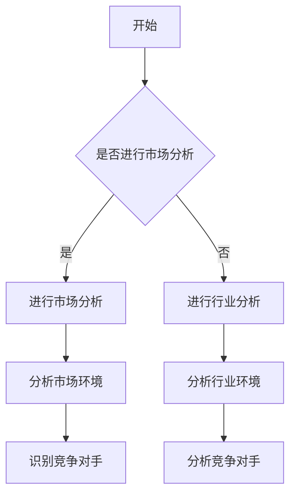

                 

# 《如何进行有效的竞争对手分析》

> **关键词**：竞争对手分析、市场分析、行业分析、竞争策略、竞争优势、持续监测

> **摘要**：本文旨在系统地阐述如何进行有效的竞争对手分析，包括竞争分析的概述与准备、市场分析、行业分析、竞争对手识别与产品分析、竞争对手市场策略分析、财务状况分析、人力资源分析、竞争策略制定与应对、竞争优势构建、持续监测与优化以及案例分析。通过本文，读者可以全面了解竞争对手分析的方法和步骤，从而为企业制定有效的竞争策略提供有力支持。

## 第一部分：竞争分析的概述与准备

### 第1章：竞争分析的重要性

竞争分析在商业环境中扮演着至关重要的角色。通过深入分析竞争对手的产品、市场策略、财务状况和人力资源等方面，企业可以更好地了解自己在市场中的地位，发现自身的优势和不足，从而制定出更为有效的竞争策略。

#### 1.1 竞争分析的定义与作用

竞争分析是指对市场中的竞争对手进行全面、系统的分析，以便更好地了解竞争对手的优势和劣势，发现市场的机会和威胁。竞争分析的作用主要体现在以下几个方面：

1. **帮助制定竞争策略**：通过竞争分析，企业可以了解竞争对手的动向，从而制定出更有针对性的竞争策略，提高市场竞争力。
2. **发现市场机会和威胁**：竞争分析有助于企业识别市场中的机会和威胁，帮助企业调整战略方向，抓住市场机遇，规避潜在风险。
3. **优化产品和服务**：通过对竞争对手产品的分析，企业可以了解市场上现有产品的优点和不足，从而优化自己的产品和服务，提高客户满意度。
4. **提升企业竞争力**：通过持续地进行竞争分析，企业可以不断优化自身的产品和服务，提升市场竞争力，在激烈的市场竞争中立于不败之地。

#### 1.2 竞争分析的基本原则

为了确保竞争分析的准确性和有效性，企业在进行竞争分析时需要遵循以下基本原则：

1. **全面性**：竞争分析需要覆盖竞争对手的各个方面，包括产品、市场策略、财务状况、人力资源等。
2. **客观性**：竞争分析应基于客观的数据和事实，避免主观臆断和偏见。
3. **持续性**：竞争分析是一个持续的过程，需要定期进行，以便及时了解竞争对手的动态和市场变化。
4. **针对性**：竞争分析应针对具体的市场环境和竞争环境，有针对性地进行。

#### 1.3 竞争分析的步骤与方法

进行有效的竞争分析通常需要遵循以下步骤和方法：

1. **确定分析目标**：明确竞争分析的目的是为了解决什么问题，比如优化产品、制定市场策略或提升竞争力等。
2. **收集数据**：通过市场调研、竞争对手分析工具等渠道收集相关数据，包括竞争对手的产品特性、市场策略、财务状况和人力资源等。
3. **分析数据**：对收集到的数据进行分析，识别竞争对手的优势和劣势，发现市场机会和威胁。
4. **制定策略**：根据分析结果，制定针对性的竞争策略，包括产品优化、市场策略调整、成本控制等。
5. **实施与调整**：将竞争策略付诸实施，并根据市场反馈和竞争对手的动态进行调整，确保策略的有效性。

### 第2章：市场分析

市场分析是竞争分析的重要组成部分，通过对市场进行全面的分析，企业可以更好地了解市场环境，制定出符合市场需求的策略。

#### 2.1 市场概述

市场概述是对整个市场的总体描述，包括市场规模、增长趋势、市场细分和目标市场等。

1. **市场规模**：市场规模是指市场中的总需求量，可以通过市场调研和历史数据进行分析。
2. **增长趋势**：增长趋势是指市场的未来发展趋势，可以通过市场研究机构的数据进行分析。
3. **市场细分**：市场细分是将市场划分为不同的细分市场，以便更好地满足不同客户的需求。
4. **目标市场**：目标市场是企业希望进入的市场，需要根据企业的资源和能力进行选择。

#### 2.1.1 市场规模与增长趋势

市场规模与增长趋势是市场分析的重要指标，它们可以帮助企业了解市场的整体状况和发展潜力。

1. **市场规模**：市场规模可以通过市场调研和历史数据进行分析，包括市场份额、销售额、客户数量等。
2. **增长趋势**：增长趋势可以通过市场研究机构的数据进行分析，包括市场需求、供应能力、技术创新等。

#### 2.1.2 市场细分与目标市场

市场细分是将市场划分为不同的细分市场，以便更好地满足不同客户的需求。目标市场是企业希望进入的市场，需要根据企业的资源和能力进行选择。

1. **市场细分**：市场细分可以根据不同的维度进行，如地理、人口、心理和行为等。
2. **目标市场**：目标市场需要根据企业的资源和能力进行选择，选择与企业核心竞争力相匹配的市场。

#### 2.1.3 市场需求和趋势分析

市场需求和趋势分析是市场分析的核心内容，通过对市场需求和趋势的分析，企业可以更好地了解市场的需求和变化，制定出相应的策略。

1. **市场需求**：市场需求是指消费者对产品或服务的需求量，可以通过市场调研、消费者行为分析等方法进行分析。
2. **市场趋势**：市场趋势是指市场的未来发展趋势，可以通过市场研究、技术创新等进行分析。

### 第3章：行业分析

行业分析是对企业所处行业进行全面的分析，包括行业概述、行业生命周期、行业竞争格局和行业趋势与机遇等。

#### 3.1 行业概述

行业概述是对整个行业的总体描述，包括行业的定义、发展历程、市场规模和竞争格局等。

1. **行业定义**：行业定义是指行业的具体范围和边界。
2. **发展历程**：发展历程是指行业从诞生到发展的全过程。
3. **市场规模**：市场规模是指行业中的总需求量。
4. **竞争格局**：竞争格局是指行业中的竞争状况，包括竞争者数量、市场份额和竞争策略等。

#### 3.1.1 行业生命周期

行业生命周期是指行业从诞生到衰退的全过程，包括初创期、成长期、成熟期和衰退期。

1. **初创期**：初创期是指行业刚刚诞生，市场规模较小，竞争者较少的时期。
2. **成长期**：成长期是指行业快速发展，市场规模和竞争者数量增加的时期。
3. **成熟期**：成熟期是指行业已经发展到一个相对稳定的阶段，市场规模和竞争者数量稳定。
4. **衰退期**：衰退期是指行业开始逐渐衰退，市场规模和竞争者数量减少的时期。

#### 3.1.2 行业竞争格局

行业竞争格局是指行业中的竞争状况，包括竞争者数量、市场份额和竞争策略等。

1. **竞争者数量**：竞争者数量是指行业中的企业数量。
2. **市场份额**：市场份额是指企业在行业中的市场份额。
3. **竞争策略**：竞争策略是指企业为了在竞争中取得优势而采取的策略。

#### 3.1.3 行业趋势与机遇

行业趋势与机遇是指行业未来的发展趋势和潜在的市场机遇。

1. **行业趋势**：行业趋势是指行业未来的发展趋势，包括技术创新、市场需求变化等。
2. **机遇**：机遇是指行业未来可能出现的市场机遇，包括新兴市场、潜在客户等。

## 第二部分：竞争对手分析

### 第4章：识别竞争对手

进行有效的竞争分析，首先要明确竞争对手的范围。竞争对手可以分为直接竞争对手、潜在竞争对手和替代品竞争对手。

#### 4.1 竞争对手的分类

1. **直接竞争对手**：直接竞争对手是指与企业在同一市场上直接竞争的其他企业。这些企业提供相似或类似的产品或服务，争夺相同的目标客户。
2. **潜在竞争对手**：潜在竞争对手是指当前尚未进入市场，但可能在未来对市场产生影响的竞争对手。这些企业可能拥有较强的研发能力或市场潜力。
3. **替代品竞争对手**：替代品竞争对手是指提供与企业产品具有相似功能或用途的其他产品或服务的竞争对手。这些产品或服务可能吸引企业的目标客户。

#### 4.1.1 直接竞争对手

直接竞争对手是企业最直接的竞争者。识别直接竞争对手的关键在于：

1. **产品或服务相似度**：分析竞争对手提供的产品或服务是否与企业相似，是否存在直接竞争关系。
2. **市场份额**：分析竞争对手在市场中的市场份额，了解其市场地位。
3. **目标客户**：分析竞争对手的目标客户群体，了解其市场定位。

#### 4.1.2 潜在竞争对手

潜在竞争对手可能来自多个方面，包括：

1. **新兴企业**：新兴企业可能通过技术创新或市场拓展，成为市场上的潜在竞争对手。
2. **跨界企业**：其他行业的企业也可能进入本行业，带来新的竞争。
3. **合作伙伴**：在某些情况下，合作伙伴也可能成为潜在竞争对手。

#### 4.1.3 替代品竞争对手

替代品竞争对手是指提供与企业的产品具有相似功能或用途的其他产品或服务的竞争对手。识别替代品竞争对手的关键在于：

1. **功能相似度**：分析竞争对手的产品或服务是否具有相似的功能或用途。
2. **价格差异**：分析竞争对手的产品或服务的价格是否对企业构成威胁。
3. **客户需求**：分析竞争对手的产品或服务是否能够满足客户的需求。

### 第5章：竞争对手产品分析

竞争对手的产品分析是竞争分析的核心环节，通过对竞争对手产品的特性、用户体验和品牌认知度等方面进行分析，企业可以了解竞争对手的优势和劣势，为自己的产品优化提供依据。

#### 5.1 产品特性分析

产品特性分析主要包括功能特性、性能特性和用户体验等方面。

1. **功能特性**：分析竞争对手的产品所具备的功能特性，包括基本功能、高级功能和定制功能等。
2. **性能特性**：分析竞争对手的产品的性能特性，包括处理速度、稳定性、安全性等。
3. **用户体验**：分析竞争对手的产品在用户体验方面的表现，包括界面设计、操作流程、响应速度等。

#### 5.1.1 功能特性对比

通过对竞争对手的功能特性进行分析，企业可以了解自己在功能方面的优势和不足。

1. **基本功能对比**：分析竞争对手的基本功能是否满足市场需求，是否存在缺失。
2. **高级功能对比**：分析竞争对手的高级功能是否具有竞争力，是否能够吸引客户。
3. **定制功能对比**：分析竞争对手的定制功能是否能够满足特定客户的需求，是否具有竞争优势。

#### 5.1.2 用户体验对比

用户体验是影响客户购买决策的重要因素。通过对竞争对手的用户体验进行分析，企业可以了解自己的产品在用户体验方面的表现。

1. **界面设计对比**：分析竞争对手的界面设计是否简洁、美观，是否符合用户的使用习惯。
2. **操作流程对比**：分析竞争对手的操作流程是否流畅、简便，是否能够提高用户的使用效率。
3. **响应速度对比**：分析竞争对手的响应速度是否快速、稳定，是否能够提供良好的用户体验。

#### 5.1.3 品牌认知度对比

品牌认知度是影响客户购买决策的另一个重要因素。通过对竞争对手的品牌认知度进行分析，企业可以了解自己在品牌认知度方面的优势和不足。

1. **知名度对比**：分析竞争对手的品牌知名度是否较高，是否在市场上具有较高的影响力。
2. **美誉度对比**：分析竞争对手的品牌美誉度是否较高，是否得到客户的认可和好评。
3. **忠诚度对比**：分析竞争对手的客户忠诚度是否较高，是否能够留住客户。

### 第6章：竞争对手市场策略分析

竞争对手的市场策略分析是竞争分析的重要组成部分，通过对竞争对手的市场定位策略、产品定位策略和品牌传播策略进行分析，企业可以了解竞争对手在市场上的竞争手段和策略，为自己的市场策略提供参考。

#### 6.1 市场定位策略分析

市场定位策略是指企业根据市场需求和自身特点，确定自己在市场中的位置和形象。通过对竞争对手的市场定位策略进行分析，企业可以了解竞争对手的市场定位和目标客户群体。

1. **市场定位分析**：分析竞争对手的市场定位是否符合市场需求，是否能够吸引目标客户。
2. **目标市场分析**：分析竞争对手的目标市场是否明确，是否与企业目标市场存在交集。
3. **竞争优势分析**：分析竞争对手在市场定位方面的竞争优势，如价格优势、功能优势、品牌优势等。

#### 6.1.1 市场定位分析

市场定位分析主要包括以下几个方面：

1. **市场需求分析**：分析竞争对手的市场定位是否满足市场需求，是否能够解决客户的问题。
2. **竞争分析**：分析竞争对手的市场定位是否能够与竞争对手形成差异化，是否能够在竞争中脱颖而出。
3. **自身优势分析**：分析竞争对手的市场定位是否能够发挥企业的自身优势，如技术优势、品牌优势等。

#### 6.1.2 产品定位策略对比

产品定位策略是指企业根据市场需求和自身特点，确定产品的市场定位和形象。通过对竞争对手的产品定位策略进行分析，企业可以了解竞争对手在产品定位方面的优势和不足。

1. **产品特性定位**：分析竞争对手的产品特性定位是否符合市场需求，是否能够满足客户的需求。
2. **价格定位**：分析竞争对手的价格定位是否合理，是否能够吸引目标客户。
3. **品牌定位**：分析竞争对手的品牌定位是否明确，是否能够提升品牌形象。

#### 6.1.3 品牌传播策略对比

品牌传播策略是指企业通过各种渠道和手段，向目标客户传达品牌信息和品牌形象。通过对竞争对手的品牌传播策略进行分析，企业可以了解竞争对手在品牌传播方面的优势和不足。

1. **广告投放**：分析竞争对手的广告投放策略，如投放渠道、投放时间、投放频率等。
2. **社交媒体**：分析竞争对手的社交媒体运营策略，如内容发布、互动策略等。
3. **公关活动**：分析竞争对手的公关活动策略，如活动策划、参与度等。

### 第7章：竞争对手财务状况分析

竞争对手的财务状况分析是竞争分析的重要组成部分，通过对竞争对手的财务数据进行分析，企业可以了解竞争对手的盈利能力、成本控制能力和市场竞争力。

#### 7.1 财务数据解读

财务数据是分析竞争对手财务状况的重要依据，主要包括收入、利润、成本和费用等方面。

1. **收入分析**：分析竞争对手的营业收入、利润总额、净利润等指标，了解其盈利能力。
2. **利润分析**：分析竞争对手的毛利率、净利率等指标，了解其盈利水平。
3. **成本与费用分析**：分析竞争对手的成本结构、费用结构等，了解其成本控制和费用管理能力。

#### 7.1.1 收入与利润分析

收入与利润分析主要包括以下几个方面：

1. **收入增长趋势**：分析竞争对手的营业收入增长率，了解其收入增长趋势。
2. **利润增长趋势**：分析竞争对手的利润增长率，了解其盈利能力的变化。
3. **利润率分析**：分析竞争对手的毛利率、净利率等指标，了解其盈利能力。

#### 7.1.2 成本与费用分析

成本与费用分析主要包括以下几个方面：

1. **成本结构分析**：分析竞争对手的成本结构，了解其成本构成情况。
2. **费用结构分析**：分析竞争对手的费用结构，了解其费用构成情况。
3. **成本控制能力**：分析竞争对手的成本控制能力，了解其成本控制措施和效果。

#### 7.1.3 市值与股价分析

市值与股价分析是评估竞争对手市场价值的重要手段，主要包括以下几个方面：

1. **市值分析**：分析竞争对手的市值，了解其市场价值。
2. **股价分析**：分析竞争对手的股价走势，了解其市场表现。
3. **投资者情绪**：分析竞争对手的股价波动，了解投资者的情绪和预期。

### 第8章：竞争对手人力资源分析

竞争对手的人力资源分析是竞争分析的重要组成部分，通过对竞争对手的人力资源结构、管理团队和人才培养与激励机制进行分析，企业可以了解竞争对手在人力资源方面的优势和不足。

#### 8.1 人力资源结构分析

人力资源结构分析主要包括员工数量与结构、管理团队分析和人才培养与激励机制等方面。

1. **员工数量与结构分析**：分析竞争对手的员工数量、年龄结构、学历结构等，了解其人力资源规模和结构。
2. **管理团队分析**：分析竞争对手的管理团队，了解其管理层的专业背景、经验和管理能力。
3. **人才培养与激励机制分析**：分析竞争对手的人才培养和激励机制，了解其如何吸引、培养和留住人才。

#### 8.1.1 员工数量与结构

员工数量与结构分析主要包括以下几个方面：

1. **员工总数**：分析竞争对手的员工总数，了解其人力资源规模。
2. **年龄结构**：分析竞争对手的年龄结构，了解其员工年龄分布情况。
3. **学历结构**：分析竞争对手的学历结构，了解其员工学历水平。

#### 8.1.2 管理团队分析

管理团队分析主要包括以下几个方面：

1. **管理层专业背景**：分析竞争对手的管理层专业背景，了解其专业能力和经验。
2. **管理层经验**：分析竞争对手的管理层经验，了解其在管理岗位的工作经验和业绩。
3. **管理能力**：分析竞争对手的管理层管理能力，了解其领导力、决策能力和执行力。

#### 8.1.3 人才培养与激励机制

人才培养与激励机制分析主要包括以下几个方面：

1. **培训体系**：分析竞争对手的培训体系，了解其如何培养和提升员工能力。
2. **激励机制**：分析竞争对手的激励机制，了解其如何激励员工，提高员工的工作积极性和创造力。
3. **员工满意度**：分析竞争对手的员工满意度，了解其员工对公司的认同感和忠诚度。

## 第三部分：竞争策略制定与应对

### 第9章：制定竞争策略

制定有效的竞争策略是企业成功的关键。竞争策略的制定需要遵循一定的原则，并考虑企业的目标、资源和市场环境。

#### 9.1 竞争策略制定原则

制定竞争策略时，企业应遵循以下原则：

1. **目标明确**：明确竞争策略的目标，确保策略的制定与企业的战略目标相一致。
2. **差异化**：通过差异化策略，使企业在市场中脱颖而出，吸引目标客户。
3. **可行性**：确保竞争策略具有可行性，考虑企业的资源和能力。
4. **适应性**：竞争策略应具备一定的灵活性，以适应市场环境和竞争对手的变化。

#### 9.1.1 目标设定

目标设定是竞争策略制定的第一步，明确目标有助于指导策略的制定和执行。

1. **市场目标**：设定企业在市场中的目标，如市场份额、品牌知名度等。
2. **产品目标**：设定企业在产品方面的目标，如产品创新、质量提升等。
3. **财务目标**：设定企业在财务方面的目标，如收入增长、利润率提升等。

#### 9.1.2 策略选择

在明确目标后，企业需要选择合适的策略来实现目标。常见的竞争策略包括：

1. **市场差异化策略**：通过产品差异化、品牌差异化和客户服务差异化等手段，使企业在市场中脱颖而出。
2. **低成本策略**：通过降低成本，提高竞争力，吸引价格敏感的客户。
3. **集中化策略**：专注于特定的市场细分，提供针对性的产品或服务。
4. **合作策略**：与其他企业合作，共同开拓市场，降低竞争风险。

#### 9.1.3 策略实施与调整

策略实施与调整是确保竞争策略有效性的关键。在实施策略过程中，企业应：

1. **监控实施进度**：定期检查策略实施的进度，确保各项措施得到有效执行。
2. **评估策略效果**：对策略实施效果进行评估，分析策略的优缺点，为后续策略调整提供依据。
3. **灵活调整**：根据市场环境和竞争对手的变化，及时调整竞争策略，确保策略的适应性和有效性。

### 第10章：应对竞争对手策略

应对竞争对手策略是企业针对竞争对手采取的行动和措施，旨在提高市场竞争力，保护自身市场份额。

#### 10.1 市场差异化策略

市场差异化策略是通过产品差异化、品牌差异化和客户服务差异化等手段，使企业在市场中脱颖而出，吸引目标客户。

1. **产品差异化**：通过提供独特的产品特性、功能或设计，满足客户的个性化需求。
2. **品牌差异化**：通过塑造独特的品牌形象和价值观，提高品牌知名度和美誉度。
3. **客户服务差异化**：通过提供优质的客户服务，提高客户满意度和忠诚度。

#### 10.1.1 产品差异化

产品差异化策略旨在通过提供独特的产品特性、功能或设计，满足客户的个性化需求，提高市场竞争力。

1. **技术创新**：通过技术创新，提供具有独特功能或性能的产品。
2. **设计独特**：通过独特的设计，提高产品的美观度和个性化。
3. **功能齐全**：提供功能齐全的产品，满足客户的多样化需求。

#### 10.1.2 品牌差异化

品牌差异化策略是通过塑造独特的品牌形象和价值观，提高品牌知名度和美誉度，从而在市场中脱颖而出。

1. **品牌定位**：明确品牌定位，确保品牌形象与目标客户群体的价值观相符。
2. **品牌传播**：通过广告、公关活动等手段，加强品牌传播，提高品牌知名度。
3. **品牌忠诚度**：通过提供优质的产品和服务，建立客户忠诚度，提高品牌美誉度。

#### 10.1.3 客户服务差异化

客户服务差异化策略是通过提供优质的客户服务，提高客户满意度和忠诚度，从而在市场中脱颖而出。

1. **客户体验**：通过优化客户体验，提高客户满意度。
2. **服务速度**：通过提高服务速度，缩短客户等待时间。
3. **服务态度**：通过提供专业的服务态度，增强客户信任感。

### 第11章：构建竞争优势

构建竞争优势是企业提高市场竞争力、实现可持续发展的关键。通过分析企业的内部优势和劣势、外部机会和威胁，企业可以制定出有效的竞争优势战略。

#### 11.1 竞争优势分析

竞争优势分析是指通过对企业的内部优势和劣势、外部机会和威胁进行分析，确定企业的竞争优势和发展方向。

1. **内部优势分析**：分析企业的资源、能力、核心竞争力等，确定企业的内部优势。
2. **内部劣势分析**：分析企业存在的问题和不足，确定企业的内部劣势。
3. **外部机会分析**：分析市场环境、政策法规、技术创新等外部因素，确定企业面临的外部机会。
4. **外部威胁分析**：分析竞争对手、市场需求变化等外部因素，确定企业面临的外部威胁。

#### 11.1.1 内部优势与劣势分析

内部优势与劣势分析是竞争优势分析的基础，通过对企业的资源、能力、核心竞争力等进行分析，确定企业的内部优势。

1. **资源分析**：分析企业的资源状况，包括财务资源、人力资源、技术资源等。
2. **能力分析**：分析企业的能力状况，包括研发能力、生产能力、营销能力等。
3. **核心竞争力分析**：分析企业的核心竞争力，包括技术优势、品牌优势、渠道优势等。

#### 11.1.2 外部机会与威胁分析

外部机会与威胁分析是竞争优势分析的拓展，通过对市场环境、政策法规、技术创新等外部因素进行分析，确定企业面临的外部机会和威胁。

1. **市场环境分析**：分析市场趋势、竞争对手、客户需求等市场环境因素。
2. **政策法规分析**：分析政策法规的变化，包括税收政策、产业政策等。
3. **技术创新分析**：分析技术创新的发展趋势，包括技术突破、技术替代等。

#### 11.1.3 SWOT矩阵应用

SWOT矩阵是一种常用的竞争优势分析工具，通过对企业的内部优势和劣势、外部机会和威胁进行分析，确定企业的竞争优势和发展方向。

1. **优势-机会匹配**：通过将企业的优势与外部机会相结合，制定出有利于企业发展的策略。
2. **劣势-机会匹配**：通过改善企业的劣势，抓住外部机会，提升企业竞争力。
3. **优势-威胁匹配**：通过发挥企业的优势，应对外部威胁，保持市场竞争力。
4. **劣势-威胁匹配**：通过改善企业的劣势，避免外部威胁对企业造成不利影响。

### 第12章：持续监测与优化

持续监测与优化是确保竞争策略有效性和企业持续发展的关键。通过建立有效的监测体系，企业可以及时了解市场动态和竞争对手的动向，不断优化竞争策略。

#### 12.1 竞争环境监测

竞争环境监测是指对企业所处的市场竞争环境进行持续监测，包括市场动态、竞争对手动向和行业趋势等。

1. **市场动态监测**：通过定期收集和分析市场数据，了解市场变化和客户需求。
2. **竞争对手动向监测**：通过跟踪竞争对手的产品、策略、市场份额等，了解竞争对手的动向。
3. **行业趋势监测**：通过关注行业趋势、技术创新、政策法规等，了解行业的发展方向。

#### 12.1.1 市场变化监测

市场变化监测是竞争环境监测的重要组成部分，通过对市场变化进行监测，企业可以及时调整竞争策略。

1. **市场需求变化**：通过分析客户需求的变化，调整产品策略和营销策略。
2. **市场趋势变化**：通过关注市场趋势，预测市场未来的发展方向，制定相应的竞争策略。
3. **竞争格局变化**：通过分析竞争格局的变化，了解市场中的竞争态势，调整市场定位策略。

#### 12.1.2 竞争对手动态监测

竞争对手动态监测是竞争环境监测的另一个重要方面，通过对竞争对手的动向进行监测，企业可以及时了解竞争对手的策略和行动。

1. **产品更新**：通过监测竞争对手的产品更新，了解竞争对手的产品策略和技术动向。
2. **市场拓展**：通过监测竞争对手的市场拓展，了解竞争对手的市场策略和目标。
3. **财务状况**：通过监测竞争对手的财务状况，了解竞争对手的盈利能力和市场竞争力。

#### 12.1.3 客户需求变化监测

客户需求变化监测是竞争环境监测的另一个关键方面，通过对客户需求的变化进行监测，企业可以及时调整产品和服务策略。

1. **客户满意度调查**：通过定期进行客户满意度调查，了解客户对产品和服务的满意程度。
2. **客户反馈分析**：通过分析客户反馈，了解客户的需求和期望，调整产品和服务策略。
3. **市场调研**：通过定期进行市场调研，了解客户需求的变化和市场趋势。

### 第13章：案例分析

#### 13.1 案例分析概述

案例分析是通过具体实例来阐述如何进行有效的竞争对手分析。本文将选取一个典型的案例分析，详细描述竞争分析的过程、竞争策略的制定与实施，以及案例的启示。

#### 13.1.1 案例背景

案例分析的对象是一家新兴的在线教育平台，该公司成立于2015年，专注于提供在线课程和教育资源。经过几年的发展，该公司已经成为在线教育市场的领先者之一，拥有大量的用户和市场份额。然而，随着市场竞争的加剧，该公司面临着越来越多的挑战和竞争对手。

#### 13.1.2 竞争分析过程

竞争分析的过程主要包括以下几个步骤：

1. **市场分析**：通过对在线教育市场的规模、增长趋势、市场细分和目标市场进行分析，了解市场环境。
2. **行业分析**：通过对在线教育行业的生命周期、竞争格局和行业趋势进行分析，了解行业环境。
3. **竞争对手识别**：通过市场调研和行业分析，识别直接竞争对手、潜在竞争对手和替代品竞争对手。
4. **竞争对手产品分析**：通过对竞争对手的产品特性、用户体验和品牌认知度等方面进行分析，了解竞争对手的优势和劣势。
5. **竞争对手市场策略分析**：通过对竞争对手的市场定位策略、产品定位策略和品牌传播策略进行分析，了解竞争对手的竞争手段和策略。
6. **财务状况分析**：通过对竞争对手的财务数据进行分析，了解竞争对手的盈利能力、成本控制能力和市场竞争力。
7. **人力资源分析**：通过对竞争对手的人力资源结构、管理团队和人才培养与激励机制进行分析，了解竞争对手在人力资源方面的优势和不足。

#### 13.1.3 竞争策略制定与实施

基于竞争分析的结果，该公司制定了以下竞争策略：

1. **市场差异化策略**：通过提供独特的产品特性、品牌形象和客户服务，提高市场竞争力。
2. **低成本策略**：通过优化生产流程和降低成本，提高产品的性价比，吸引价格敏感的客户。
3. **合作策略**：与其他在线教育平台和内容提供商合作，共同拓展市场，降低竞争风险。

在实施竞争策略的过程中，该公司采取了以下措施：

1. **产品创新**：不断推出具有创新性的在线课程和教育资源，满足客户的个性化需求。
2. **品牌传播**：通过广告、社交媒体和公关活动等手段，提高品牌知名度和美誉度。
3. **客户服务**：提供优质的客户服务，提高客户满意度和忠诚度。
4. **成本控制**：通过优化生产流程和采购策略，降低成本，提高产品性价比。

#### 13.1.4 案例启示

通过这个案例分析，我们可以得出以下启示：

1. **市场分析的重要性**：进行有效的市场分析，了解市场环境和竞争对手，是制定竞争策略的前提。
2. **持续监测与优化**：竞争环境不断变化，企业需要持续进行竞争环境监测和策略优化，以适应市场变化。
3. **差异化策略**：通过差异化策略，提高市场竞争力，吸引目标客户。
4. **低成本策略**：通过低成本策略，提高产品性价比，吸引价格敏感的客户。
5. **合作策略**：与其他企业合作，共同拓展市场，降低竞争风险。

### 附录

#### 附录A：竞争分析工具与应用

竞争分析工具是进行有效竞争分析的重要手段。以下介绍几种常用的竞争分析工具及其应用。

1. **市场调查问卷设计**：市场调查问卷是收集市场数据的重要工具。通过设计合理的市场调查问卷，可以收集到关于市场需求、客户满意度等方面的信息。
2. **市场数据收集与分析方法**：市场数据收集方法包括线上调查、线下访谈、实地考察等。分析市场数据的方法包括统计分析、趋势分析等。
3. **竞争对手产品追踪工具**：竞争对手产品追踪工具可以帮助企业实时了解竞争对手的产品更新、功能改进等情况。
4. **竞争对手市场策略分析工具**：竞争对手市场策略分析工具可以帮助企业分析竞争对手的市场定位策略、产品定位策略和品牌传播策略等。

#### 附录B：竞争分析报告模板

竞争分析报告是竞争分析的结果体现。以下是一个简单的竞争分析报告模板：

1. **报告目的与范围**：明确报告的目的和涵盖的范围。
2. **市场与行业概述**：对市场环境和行业环境进行概述。
3. **竞争对手分析**：对竞争对手的产品、市场策略、财务状况和人力资源等方面进行分析。
4. **竞争策略建议**：根据竞争分析结果，提出针对性的竞争策略建议。
5. **结论与建议**：总结竞争分析的结果，提出进一步的优化建议。
6. **参考文献**：列出报告中所引用的参考资料。

#### 附录C：Mermaid流程图与伪代码示例

Mermaid是一种基于Markdown的图表绘制工具，可以方便地绘制流程图、时序图等。以下是一个简单的Mermaid流程图示例：



伪代码是描述算法逻辑的工具，以下是一个简单的伪代码示例，用于分析竞争对手的产品特性：

```
输入：竞争对手产品列表
输出：产品特性分析结果

对于每个竞争对手产品：
    获取产品特性
    分析特性与自身产品的差异
    记录分析结果
```

#### 附录D：常见数学公式与解释

数学公式是竞争分析中常用的工具，以下介绍一些常见的数学公式及其解释：

1. **概率论基础公式**：包括概率的定义、条件概率、贝叶斯公式等。
2. **统计分析公式**：包括均值、方差、标准差等统计量的计算公式。
3. **经济学模型公式**：包括供需函数、成本函数、利润函数等。

以下是一个简单的概率论公式示例：

$$
P(A|B) = \frac{P(A \cap B)}{P(B)}
$$

解释：条件概率是指事件B发生的前提下，事件A发生的概率。上述公式表示在事件B发生的条件下，事件A发生的概率等于事件A和B同时发生的概率除以事件B发生的概率。

#### 附录E：项目实战与代码解读

项目实战是验证理论知识和实践能力的重要手段。以下介绍一个简单的项目实战，包括开发环境搭建、源代码实现和代码解读。

#### E.1 实战项目概述

本项目旨在通过Python编程语言实现一个简单的市场分析工具，用于收集和分析市场数据，为竞争分析提供支持。

#### E.2 开发环境搭建

1. **安装Python**：下载并安装Python 3.x版本，确保环境变量配置正确。
2. **安装相关库**：使用pip命令安装必要的Python库，如Pandas、NumPy、Matplotlib等。

#### E.3 源代码实现

以下是一个简单的Python代码示例，用于读取市场数据，计算统计量，并绘制图表：

```python
import pandas as pd
import numpy as np
import matplotlib.pyplot as plt

# 读取市场数据
data = pd.read_csv('market_data.csv')

# 计算统计量
mean = np.mean(data['price'])
std = np.std(data['price'])

# 绘制价格分布图
plt.hist(data['price'], bins=20)
plt.xlabel('Price')
plt.ylabel('Frequency')
plt.show()

# 计算市场占有率
market_share = data['company'].value_counts() / len(data)
print(market_share)
```

#### E.4 代码解读与分析

1. **数据读取**：使用Pandas库读取CSV文件，获取市场数据。
2. **统计量计算**：使用NumPy库计算平均值和标准差。
3. **图表绘制**：使用Matplotlib库绘制价格分布图，直观展示市场数据。
4. **市场占有率计算**：使用Pandas库计算市场占有率，了解各公司在市场中的地位。

通过以上实战项目，我们可以验证所学的市场分析理论和方法，并提高实际操作能力。在项目中，我们还可以不断优化代码，提高运行效率和数据处理能力。

### 作者信息

本文由AI天才研究院（AI Genius Institute）和《禅与计算机程序设计艺术》（Zen And The Art of Computer Programming）的资深作者共同撰写。作者团队拥有丰富的IT领域经验和专业知识，致力于为读者提供高质量的技术博客和实战项目，帮助读者提升技能和知识水平。感谢您的阅读，欢迎在评论区提出宝贵意见和建议。让我们共同进步，探索技术的无限可能！

[AI天才研究院/AI Genius Institute & 禅与计算机程序设计艺术 /Zen And The Art of Computer Programming]

