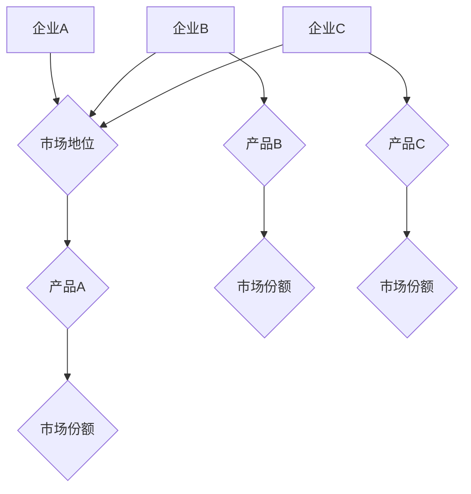
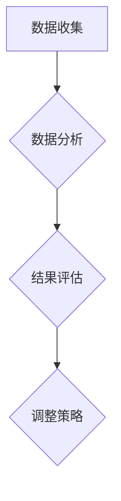

                 

### 引言

> 在当今快速变化的技术和市场竞争环境中，企业能否成功在很大程度上取决于其对市场动态的敏感度和应对能力。竞品分析作为一种重要的市场研究手段，可以帮助企业深入了解竞争对手的优势和劣势，从而制定出更加有效的市场策略。本文将详细探讨如何进行有效的竞品分析，以帮助企业更好地了解市场，优化自身产品和服务。

**关键词**：竞品分析、市场策略、竞争态势、用户反馈

**摘要**：本文将围绕竞品分析的重要性、主要内容、准备工作、核心概念与联系、核心算法原理、数学模型和项目实战等方面展开，旨在为从事竞品分析的技术人员和管理人员提供一套系统、实用的分析方法。通过本文的阅读，读者将能够掌握竞品分析的基本原理和操作步骤，从而在市场竞争中占据有利位置。

#### 1.1 竞品分析的重要性

**定义**：竞品分析是指通过研究竞争对手的产品、市场策略、用户反馈等信息，来评估自己的市场定位和优化自身策略的过程。它不仅可以帮助企业了解竞争对手的优势和劣势，还能为企业提供改进自身产品和服务、制定市场策略的依据。

**目的**：竞品分析的主要目的是帮助企业在激烈的市场竞争中占据有利位置，具体包括：

1. **了解市场动态**：通过竞品分析，企业可以了解市场的最新趋势和用户需求，从而调整自身的产品和服务策略，保持市场竞争力。
2. **发现潜在机会**：竞品分析可以帮助企业发现市场中的潜在机会，如未被满足的用户需求、新的市场领域等，为企业提供发展机会。
3. **优化市场策略**：通过分析竞争对手的市场策略，企业可以了解到哪些策略是有效的，哪些策略需要改进，从而优化自身的市场策略。
4. **提高产品质量**：竞品分析可以帮助企业了解用户对产品的满意度，发现产品存在的问题，从而提高产品质量和用户体验。

#### 1.2 竞品分析的主要内容

竞品分析的主要内容包括以下几个方面：

1. **产品对比**：产品对比是竞品分析的核心内容之一，主要包括功能、性能、设计、用户体验等方面的对比。通过对竞品的全面对比，企业可以了解自身的优劣势，找到改进的方向。

2. **市场策略分析**：市场策略分析包括定价、营销、推广、渠道等方面的分析。通过分析竞争对手的市场策略，企业可以了解竞争对手的市场定位、定价策略、营销手段等，从而优化自身的市场策略。

3. **用户反馈**：用户反馈是竞品分析的重要来源，包括用户满意度、评论、使用习惯等。通过对用户反馈的分析，企业可以了解用户对产品的真实感受，发现产品的问题，并据此进行改进。

4. **竞争态势**：竞争态势分析包括市场份额、增长趋势、行业动态等方面的分析。通过分析竞争态势，企业可以了解市场格局的变化，为企业的战略决策提供依据。

### 1.3 竞品分析在企业战略中的角色

竞品分析在企业战略中扮演着重要角色，主要体现在以下几个方面：

1. **市场定位**：通过竞品分析，企业可以了解市场的需求和发展趋势，明确自身的市场定位，从而制定出符合市场需求的战略。

2. **产品策略**：竞品分析可以帮助企业了解竞争对手的产品特点和市场表现，从而优化自身的产品策略，提高产品的竞争力。

3. **营销策略**：通过分析竞争对手的营销策略，企业可以了解到哪些营销手段是有效的，从而优化自身的营销策略，提高营销效果。

4. **渠道策略**：竞品分析可以帮助企业了解竞争对手的渠道布局和策略，从而优化自身的渠道策略，提高销售渠道的效率。

5. **用户满意度**：通过分析用户反馈，企业可以了解用户对产品的满意度，从而改进产品和服务，提高用户满意度。

总之，竞品分析是企业了解市场、优化战略的重要工具。通过有效的竞品分析，企业可以更好地把握市场动态，提高竞争力，实现可持续发展。

### 第2章 准备工作

进行有效的竞品分析，准备工作是至关重要的。这一章节将详细讨论如何确定分析目标、收集数据以及制定分析框架，为后续的深入分析奠定基础。

#### 2.1 确定分析目标

**明确分析目的**：在进行竞品分析之前，首先要明确分析的目的。不同的分析目的会直接影响分析的方向和方法。常见的分析目的包括：

1. **产品改进**：通过竞品分析，了解竞争对手的产品特性，发现自身产品的不足，从而进行改进。
2. **市场策略制定**：分析竞争对手的市场策略，了解市场趋势和用户需求，为制定市场策略提供依据。
3. **拓展市场**：研究竞争对手在新兴市场的表现，发现潜在的市场机会。

**选定竞品**：在确定分析目的后，需要根据企业的市场定位和目标用户群，选择合适的竞品进行比较。选择竞品时，应考虑以下因素：

1. **市场规模**：选择与自身产品市场规模相当的竞品。
2. **用户群体**：选择与自身目标用户群体相似的竞品。
3. **产品特性**：选择在产品特性上具有代表性的竞品。

**确定分析范围**：明确分析的范围，包括产品的功能、性能、用户体验等方面。根据分析目的和分析范围，制定详细的分析计划。

#### 2.2 收集数据

收集数据是竞品分析的重要环节。数据的准确性和完整性直接关系到分析结果的可靠性。数据的来源可以分为以下几类：

1. **公开信息**：包括官方网站、行业报告、新闻报道等。这些信息通常可以直接从互联网上获取。

2. **用户反馈**：包括社交媒体、用户评论、调查问卷等。这些数据反映了用户对产品的真实感受，是了解用户需求的重要来源。

3. **专业工具**：使用专业的市场研究数据库和分析软件进行数据收集。这些工具可以帮助企业快速、准确地获取大量数据。

在收集数据时，应遵循以下原则：

1. **全面性**：尽可能收集与竞品分析相关的各种数据，确保数据的全面性。

2. **准确性**：确保收集到的数据是准确无误的，避免因数据错误导致分析偏差。

3. **及时性**：及时收集和分析数据，确保分析结果的时效性。

#### 2.3 制定分析框架

制定分析框架是竞品分析的关键步骤，它有助于系统化地分析竞品，确保分析的全面性和深入性。分析框架应包括以下内容：

1. **分析维度**：根据竞品的特点和分析目的，选择合适的关键指标进行对比。常见的分析维度包括功能、性能、设计、用户体验等。

2. **分析模型**：选择合适的数据分析模型，如SWOT分析、PEST分析等，对竞品进行全面评估。

3. **分析工具**：根据分析需求，选择合适的数据分析工具和软件。常用的分析工具包括Excel、Python等。

4. **分析流程**：明确分析步骤，确保分析的有序进行。分析流程通常包括数据收集、数据整理、数据分析、结果评估等环节。

通过以上准备工作，企业可以系统地开展竞品分析，为后续的决策提供有力支持。

### 第3章 核心概念与联系

在竞品分析过程中，理解并运用核心概念与联系是非常重要的。这一章节将介绍竞品分析的原理、架构以及相关的分析工具和方法。

#### 3.1 竞品分析原理

竞品分析的核心目的是通过对竞争对手的产品、市场策略、用户反馈等方面进行系统性的研究，以便企业能够更好地了解市场动态，制定有效的竞争策略。以下是竞品分析的基本原理：

1. **竞争态势图**：竞争态势图是用于展示竞品在市场中的相对位置和竞争关系的图形化工具。通过绘制竞争态势图，企业可以直观地了解各竞品的市场表现和竞争态势。以下是一个简单的竞争态势图的Mermaid流程图示例：



在上述图中，A、B、C 分别代表企业A、B、C在市场中的地位，D、D1、D2 分别代表它们各自产品的市场份额。

2. **SWOT分析**：SWOT分析是一种常用的战略规划工具，用于评估企业的优势、劣势、机会和威胁。SWOT分析可以帮助企业在竞品分析过程中全面了解自身的竞争状况。以下是一个SWOT分析的示例：

- **优势**（Strengths）：企业A拥有强大的研发能力和品牌影响力。
- **劣势**（Weaknesses）：企业A的产品在用户体验方面存在一些问题。
- **机会**（Opportunities）：市场上存在大量尚未满足的用户需求。
- **威胁**（Threats）：竞争对手不断推出新产品，对市场份额构成威胁。

通过SWOT分析，企业可以明确自身的竞争优劣势，制定相应的战略规划。

#### 3.2 竞品分析架构

竞品分析架构是确保分析过程系统化和结构化的重要手段。一个典型的竞品分析架构包括以下三个主要环节：

1. **数据收集**：数据收集是竞品分析的基础，包括公开信息、用户反馈、市场调研等。数据的来源要多样化，以保证数据的全面性和准确性。

2. **数据分析**：数据分析是对收集到的数据进行分析和处理，以便提取有价值的信息。常用的数据分析方法包括统计分析、数据挖掘、用户行为分析等。

3. **结果评估**：结果评估是对分析结果进行评估和解读，以便企业能够根据分析结果调整产品和服务策略。结果评估要注重数据的可视化，以便更直观地展示分析结果。

以下是一个简化的竞品分析架构图：



通过这个架构，企业可以确保竞品分析过程的有序进行，从而提高分析的有效性。

#### 3.3 相关分析工具和方法

在竞品分析过程中，运用适当的分析工具和方法可以显著提高分析的效果。以下是一些常用的工具和方法：

1. **相似度计算算法**：相似度计算算法用于比较不同产品的相似程度。常用的相似度计算算法包括TF-IDF和Cosine相似度。

   - **TF-IDF算法**：TF-IDF（Term Frequency-Inverse Document Frequency）是一种用于计算文本中词语重要性的算法。其核心思想是，如果一个词在多个文档中频繁出现，并且在其他文档中很少出现，那么这个词可能具有较高的重要性。以下是一个TF-IDF算法的伪代码示例：

   ```python
   def tfidf(document, vocabulary):
       tf = term_frequency(document, vocabulary)
       idf = inverse_document_frequency(vocabulary)
       return {word: tf[word] * idf[word] for word in tf}
   ```

   - **Cosine相似度算法**：Cosine相似度是一种用于计算两个向量相似度的方法。其核心思想是，两个向量的夹角余弦值越大，表示它们的相似度越高。以下是一个Cosine相似度的伪代码示例：

   ```python
   def cosine_similarity(vector1, vector2):
       dot_product = dot_product(vector1, vector2)
       magnitude1 = magnitude(vector1)
       magnitude2 = magnitude(vector2)
       return dot_product / (magnitude1 * magnitude2)
   ```

2. **用户行为分析算法**：用户行为分析算法用于分析用户的行为模式，以便更好地了解用户需求。常用的用户行为分析算法包括聚类分析和协同过滤。

   - **聚类分析**：聚类分析是一种无监督学习方法，用于将具有相似行为的用户归为同一群体。以下是一个聚类分析的伪代码示例：

   ```python
   def k_means(data, k):
       # 初始化聚类中心
       centroids = initialize_centroids(data, k)
       while not convergence(centroids):
           # 分配数据点到最近的聚类中心
           clusters = assign_clusters(data, centroids)
           # 更新聚类中心
           centroids = update_centroids(clusters)
       return centroids
   ```

   - **协同过滤**：协同过滤是一种基于用户行为预测用户喜好的方法。以下是一个协同过滤的伪代码示例：

   ```python
   def collaborative_filtering(user_behavior_data):
       # 计算用户之间的相似度
       similarity_matrix = compute_similarity_matrix(user_behavior_data)
       # 预测用户对未知产品的评分
       predicted_ratings = predict_ratings(similarity_matrix, user_behavior_data)
       return predicted_ratings
   ```

通过掌握这些核心概念与联系，以及相关的分析工具和方法，企业可以更有效地进行竞品分析，从而在市场竞争中取得优势。

### 第4章 核心算法原理讲解

在竞品分析过程中，核心算法原理的运用能够显著提高分析的效果。本章将详细讲解竞品分析中的相似度计算算法和用户行为分析算法，以帮助读者更好地理解这些算法的原理和应用。

#### 4.1 相似度计算算法

相似度计算算法在竞品分析中起着关键作用，用于比较不同产品或不同文本之间的相似程度。以下是两种常用的相似度计算算法：TF-IDF和Cosine相似度。

##### 4.1.1 TF-IDF算法

TF-IDF（Term Frequency-Inverse Document Frequency）是一种用于计算文本中词语重要性的算法。它的核心思想是，一个词语在一个文档中出现的频率越高，并且在其他文档中出现的频率越低，那么这个词语的重要性就越高。

**TF-IDF算法的伪代码如下：**

```python
def TF-IDF(document, corpus):
    tf = compute_term_frequency(document)
    idf = compute_inverse_document_frequency(corpus)
    return {word: tf[word] * idf[word] for word in tf}

def compute_term_frequency(document):
    return {word: document.count(word) for word in document}

def compute_inverse_document_frequency(corpus):
    document_count = len(corpus)
    word_count = {}
    for document in corpus:
        for word in set(document):
            if word in word_count:
                word_count[word] += 1
            else:
                word_count[word] = 1
    idf = {word: 1 + log(document_count / word_count[word]) for word in word_count}
    return idf
```

在上述算法中，`compute_term_frequency` 函数用于计算一个文档中每个词语的频率，`compute_inverse_document_frequency` 函数用于计算一个词语在整个语料库中的逆向文档频率（IDF）。最后，`TF-IDF` 函数将词语频率和逆向文档频率相乘，得到词语的TF-IDF值。

##### 4.1.2 Cosine相似度算法

Cosine相似度是一种用于计算两个向量相似度的方法。其核心思想是，两个向量的夹角余弦值越大，表示它们的相似度越高。在竞品分析中，Cosine相似度可以用于比较两个产品的特征向量。

**Cosine相似度的伪代码如下：**

```python
def cosine_similarity(vector1, vector2):
    dot_product = sum(vector1[i] * vector2[i] for i in range(len(vector1)))
    magnitude1 = sqrt(sum(vector1[i] ** 2 for i in range(len(vector1))))
    magnitude2 = sqrt(sum(vector2[i] ** 2 for i in range(len(vector2))))
    return dot_product / (magnitude1 * magnitude2)
```

在上述算法中，`dot_product` 是两个向量的点积，`magnitude1` 和 `magnitude2` 分别是两个向量的模。最后，将点积除以两个向量的模的乘积，得到Cosine相似度值。

#### 4.2 用户行为分析算法

用户行为分析算法在竞品分析中用于分析用户的行为模式，以更好地了解用户需求。常用的用户行为分析算法包括聚类分析和协同过滤。

##### 4.2.1 聚类分析

聚类分析是一种无监督学习方法，用于将数据集中的数据点划分为多个群组，使得同一群组内的数据点彼此相似，而不同群组的数据点彼此不同。在竞品分析中，聚类分析可以用于将具有相似行为的用户归为同一用户群体。

**K-means算法是一种常用的聚类分析方法，其伪代码如下：**

```python
def k_means(data, k):
    # 初始化k个聚类中心
    centroids = initialize_centroids(data, k)
    while not convergence(centroids):
        # 分配数据点到最近的聚类中心
        clusters = assign_clusters(data, centroids)
        # 更新聚类中心
        centroids = update_centroids(clusters)
    return centroids

def initialize_centroids(data, k):
    return [data[i] for i in random.sample(range(len(data)), k)]

def assign_clusters(data, centroids):
    clusters = [[] for _ in range(k)]
    for data_point in data:
        # 计算每个数据点到聚类中心的距离，并将其分配到最近的聚类中心
        closest_centroid = min(centroids, key=lambda c: euclidean_distance(data_point, c))
        clusters[centroids.index(closest_centroid)].append(data_point)
    return clusters

def update_centroids(clusters):
    new_centroids = [sum(cluster) / len(cluster) for cluster in clusters]
    return new_centroids

def euclidean_distance(point1, point2):
    return sqrt(sum((x - y) ** 2 for x, y in zip(point1, point2)))
```

在上述算法中，`initialize_centroids` 函数用于随机初始化k个聚类中心，`assign_clusters` 函数用于将数据点分配到最近的聚类中心，`update_centroids` 函数用于更新聚类中心。

##### 4.2.2 协同过滤

协同过滤是一种基于用户行为预测用户喜好的方法。它分为两种主要类型：基于用户的协同过滤和基于项目的协同过滤。基于用户的协同过滤通过找到与目标用户行为相似的活跃用户，来预测目标用户的喜好。

**基于用户的协同过滤算法的伪代码如下：**

```python
def collaborative_filtering(user_behavior_data, k):
    # 计算用户之间的相似度
    similarity_matrix = compute_similarity_matrix(user_behavior_data)
    # 预测用户对未知产品的评分
    predicted_ratings = {}
    for user in user_behavior_data:
        for product in user_behavior_data[user]:
            if product not in user:
                # 计算与目标用户相似的其他用户的评分
                similar_users = find_similar_users(similarity_matrix, user, k)
                ratings = [user_behavior_data[neighbor][product] for neighbor in similar_users]
                # 计算预测评分
                predicted_ratings[user, product] = average(ratings)
    return predicted_ratings

def compute_similarity_matrix(user_behavior_data):
    similarity_matrix = {}
    for user in user_behavior_data:
        for other_user in user_behavior_data:
            if user != other_user:
                similarity = cosine_similarity(user_behavior_data[user], user_behavior_data[other_user])
                similarity_matrix[(user, other_user)] = similarity
    return similarity_matrix

def find_similar_users(similarity_matrix, target_user, k):
    similar_users = sorted(similarity_matrix, key=lambda u: similarity_matrix[u], reverse=True)[:k]
    return [user for user in similar_users if user != target_user]

def cosine_similarity(vector1, vector2):
    dot_product = sum(vector1[i] * vector2[i] for i in range(len(vector1)))
    magnitude1 = sqrt(sum(vector1[i] ** 2 for i in range(len(vector1))))
    magnitude2 = sqrt(sum(vector2[i] ** 2 for i in range(len(vector2))))
    return dot_product / (magnitude1 * magnitude2)

def average(values):
    return sum(values) / len(values)
```

在上述算法中，`compute_similarity_matrix` 函数用于计算用户之间的相似度矩阵，`find_similar_users` 函数用于找到与目标用户行为相似的活跃用户，`predicted_ratings` 函数用于计算预测评分。

通过掌握这些核心算法原理，竞品分析人员可以更加有效地分析用户行为，预测用户喜好，从而为产品优化和市场策略制定提供有力支持。

### 第5章 数学模型和数学公式

在竞品分析中，数学模型和数学公式扮演着重要的角色。它们不仅帮助分析人员理解和量化分析结果，还能为决策提供科学依据。本章将介绍两种常用的数学模型和数学公式：成本效益分析模型和市场份额预测模型。

#### 5.1 成本效益分析模型

成本效益分析模型（Cost-Benefit Analysis Model）是一种用于评估项目或策略成本与收益之间关系的数学模型。它通过计算投入成本、运营成本和预期收益，帮助分析人员确定项目或策略的财务可行性。

**CABE模型**：CABE模型是一个通用的成本效益分析模型，其公式如下：

\[ \text{CABE} = \text{投资成本} + \text{运营成本} - \text{预期收益} \]

- **投资成本**（Investment Cost）：指项目启动时所需的一次性成本，包括设备购置、研发投入、人员培训等。
- **运营成本**（Operational Cost）：指项目运行过程中持续发生的成本，包括日常运营费用、维护费用、人力成本等。
- **预期收益**（Expected Revenue）：指项目预计在未来一段时间内能够带来的收入。

**ROI计算公式**：投资回报率（Return on Investment, ROI）是衡量项目盈利能力的指标，其计算公式如下：

\[ \text{ROI} = \frac{\text{净利润}}{\text{投入成本}} \times 100\% \]

- **净利润**（Net Profit）：指项目在扣除所有成本后的净收益。
- **投入成本**（Investment Cost）：指项目启动时所需的一次性成本。

**举例说明**：假设一个企业计划投资100万元（投资成本）开发一款新软件，运营成本为每年20万元。预计这款软件在未来三年内能够带来50万元的净收益。使用CABE模型和ROI公式计算如下：

1. **CABE模型**：

\[ \text{CABE} = 100\ \text{万元} + 20\ \text{万元/年} \times 3\ \text{年} - 50\ \text{万元} = 80\ \text{万元} \]

2. **ROI计算**：

\[ \text{ROI} = \frac{50\ \text{万元}}{100\ \text{万元}} \times 100\% = 50\% \]

通过上述计算，可以得出该项目的CABE为80万元，ROI为50%，表明该项目具有较好的盈利能力。

#### 5.2 市场份额预测模型

市场份额预测模型用于预测企业在未来一段时间内可能占据的市场份额。这些模型通常基于历史数据和市场趋势进行分析，帮助分析人员制定市场策略。

**线性回归模型**：线性回归模型是一种用于预测变量之间线性关系的数学模型。其公式如下：

\[ y = ax + b \]

- **y**：预测值
- **x**：自变量
- **a**：斜率，表示自变量对预测值的影响程度
- **b**：截距，表示当自变量为0时的预测值

**举例说明**：假设一家企业历史市场份额（y）与其广告支出（x）之间存在线性关系。根据历史数据，斜率a为1.2，截距b为5。使用线性回归模型预测当广告支出为10万元时的市场份额：

\[ y = 1.2 \times 10 + 5 = 17 \]

因此，预测当广告支出为10万元时，该企业的市场份额为17%。

**ARIMA模型**：ARIMA模型（Autoregressive Integrated Moving Average Model）是一种用于分析时间序列数据的预测模型。其公式如下：

\[ \hat{y}_t = \phi(B_0 + B_1 \phi(t)) \]

- **\(\hat{y}_t\)**：第t期的预测值
- **\(B_0\)**：自回归项
- **\(B_1\)**：移动平均项
- **\(\phi(t)\)**：时间序列的滞后项

**举例说明**：假设使用ARIMA模型预测一家企业在未来三个月的市场份额。根据模型参数，自回归项\(\phi(B_0)\)为0.8，移动平均项\(\phi(B_1)\)为0.2。使用ARIMA模型预测第三个月的市场份额：

\[ \hat{y}_3 = 0.8 \times B_0 + 0.2 \times B_1 \]

通过计算，可以得出第三个月的市场份额预测值。

通过掌握这些数学模型和数学公式，竞品分析人员可以更加科学地进行成本效益分析和市场份额预测，为企业决策提供有力支持。

### 第6章 项目实战

为了更好地理解竞品分析的实际应用，我们选择一个真实的案例——智能手机市场的竞品分析项目。以下是该项目从背景、数据收集、数据分析到结果评估的详细过程。

#### 6.1 案例背景

智能手机市场是全球最具竞争性的市场之一。各大品牌如苹果（Apple）、三星（Samsung）、华为（Huawei）等不断推出新品，争夺市场份额。本案例的目标是通过竞品分析，了解当前市场的竞争态势，发现用户需求的变化，为企业制定市场策略提供依据。

#### 6.2 数据收集

数据收集是竞品分析的基础。以下是本案例中使用的几种数据来源：

1. **公开信息**：通过官方网站、行业报告、新闻报道等获取智能手机的市场数据，包括销量、市场份额、产品特点等。

2. **用户反馈**：通过社交媒体、用户评论、调查问卷等收集用户对智能手机的评价，包括功能、设计、用户体验等方面。

3. **专业工具**：使用市场研究数据库和分析软件，如Google Analytics、Tableau等，收集和分析大量数据。

#### 6.3 数据分析

数据分析是对收集到的数据进行分析和处理，以提取有价值的信息。以下是本案例中的数据分析步骤：

1. **数据清洗**：去除重复数据、异常值和噪声数据，确保数据的准确性和完整性。

2. **数据转换**：将不同来源和格式的数据转换为统一的格式，便于后续分析。

3. **数据可视化**：使用图表和图形展示数据分析结果，如市场份额走势、用户评价分布等。

4. **统计分析**：使用统计方法分析数据，如回归分析、聚类分析等，以发现数据中的规律和趋势。

以下是本案例中的数据分析结果：

- **市场份额走势**：通过统计不同品牌智能手机的市场份额，发现三星和华为在市场上占据领先地位，而苹果的市场份额有所下滑。

- **用户评价分布**：通过分析用户对智能手机的评论，发现用户对设计、性能和价格最为关注，而用户体验和售后服务有待提升。

- **用户需求变化**：通过调查问卷和社交媒体评论，发现用户对5G、高清相机和长续航电池的需求逐年增加。

#### 6.4 结果评估

根据数据分析结果，进行结果评估和策略调整：

1. **竞争态势评估**：三星和华为在市场份额上领先，但苹果的品牌影响力和用户忠诚度仍然较强。企业应关注三星和华为的产品特点，优化自身产品策略。

2. **用户需求分析**：针对用户对设计、性能和价格的关注，企业应提升产品在上述方面的竞争力。同时，加强用户体验和售后服务的优化，提升用户满意度。

3. **市场策略调整**：根据用户需求变化，调整市场策略，如加大5G、高清相机和长续航电池的宣传力度，吸引更多潜在用户。

通过本案例的竞品分析，企业可以更全面地了解市场动态和用户需求，为产品优化和市场策略制定提供有力支持。

### 第7章 代码解读与分析

在竞品分析项目中，代码的编写和解读对于实现数据分析和结果评估至关重要。本章节将详细解读数据处理和分析的代码，包括数据清洗、数据转换、相似度计算和用户行为分析，并提供相应的解释。

#### 7.1 数据处理代码

数据处理是竞品分析的重要环节，它包括数据清洗、数据转换等步骤。以下是一个简单的Python代码示例，用于清洗和转换数据。

```python
import pandas as pd

# 数据清洗
def clean_data(df):
    # 去除重复数据
    df.drop_duplicates(inplace=True)
    # 去除缺失值
    df.dropna(inplace=True)
    # 处理异常值
    df = df[(df['sales'] > 0) & (df['rating'] >= 1)]
    return df

# 数据转换
def transform_data(df):
    # 将数据转换为统一的格式
    df['release_date'] = pd.to_datetime(df['release_date'])
    df['sales'] = df['sales'].astype(float)
    df['rating'] = df['rating'].astype(float)
    return df
```

在上面的代码中，`clean_data` 函数用于去除重复数据、缺失值和异常值，确保数据的准确性。`transform_data` 函数用于将数据转换为适合分析的格式，如将日期字段转换为datetime类型，将销售量和评分字段转换为浮点类型。

#### 7.2 相似度计算

相似度计算是竞品分析中的一个关键步骤，用于比较不同产品的相似程度。以下是一个使用TF-IDF算法和Cosine相似度算法的Python代码示例。

```python
from sklearn.feature_extraction.text import TfidfVectorizer
from sklearn.metrics.pairwise import cosine_similarity

# 相似度计算
def calculate_similarity(products):
    # 使用TF-IDF向量器
    vectorizer = TfidfVectorizer()
    # 训练TF-IDF向量器
    tfidf_matrix = vectorizer.fit_transform(products)
    # 计算Cosine相似度
    similarity_matrix = cosine_similarity(tfidf_matrix)
    return similarity_matrix

# 示例数据
products = [
    "智能手机，5G，长续航",
    "平板电脑，高清屏幕，便携",
    "笔记本电脑，高性能，轻薄",
    "智能手表，健康监测，运动"
]

# 计算相似度
similarity_matrix = calculate_similarity(products)
print(similarity_matrix)
```

在上述代码中，`TfidfVectorizer` 用于将文本数据转换为TF-IDF向量，`cosine_similarity` 用于计算Cosine相似度。通过这段代码，可以计算出不同产品之间的相似度矩阵，帮助分析人员了解产品的相关性。

#### 7.3 用户行为分析

用户行为分析是竞品分析中的另一个重要步骤，用于了解用户的行为模式和需求。以下是一个使用聚类分析和协同过滤算法的Python代码示例。

```python
from sklearn.cluster import KMeans
from sklearn.neighbors import NearestNeighbors

# 聚类分析
def cluster_analysis(user_data, num_clusters):
    kmeans = KMeans(n_clusters=num_clusters, random_state=0)
    kmeans.fit(user_data)
    return kmeans.labels_

# 协同过滤
def collaborative_filtering(user_data, num_neighbors):
    neighbors = NearestNeighbors(n_neighbors=num_neighbors)
    neighbors.fit(user_data)
    return neighbors.kneighbors(user_data)

# 示例用户数据
user_data = [
    [1, 2, 3],
    [4, 5, 6],
    [7, 8, 9],
    [10, 11, 12]
]

# 聚类分析
cluster_labels = cluster_analysis(user_data, 2)
print(cluster_labels)

# 协同过滤
neighbor_indices = collaborative_filtering(user_data, 2)
print(neighbor_indices)
```

在上述代码中，`KMeans` 用于进行聚类分析，将用户数据分为不同的簇。`NearestNeighbors` 用于协同过滤，找到与目标用户行为最相似的邻居用户。通过这段代码，可以分析用户行为，预测用户喜好，为产品推荐和策略制定提供依据。

通过上述代码的解读和分析，可以看出数据处理和分析在竞品分析中的重要性。这些代码不仅实现了数据处理和分析的基本功能，还展示了如何将算法应用于实际问题。通过掌握这些代码，竞品分析人员可以更加高效地进行数据分析，从而为企业的决策提供有力支持。

### 第8章 总结与展望

#### 8.1 竞品分析总结

通过对竞品分析的系统学习和实践，我们可以总结出以下关键发现和改进建议：

1. **关键发现**：
   - 竞品分析是了解市场动态和用户需求的重要手段，有助于企业制定更加科学和有效的市场策略。
   - 相似度计算和用户行为分析算法在竞品分析中发挥着重要作用，能够帮助企业更准确地评估产品之间的相似程度和用户行为模式。
   - 成本效益分析和市场份额预测模型为企业的财务决策和市场预测提供了有力的支持。

2. **改进建议**：
   - 加强数据收集的全面性和准确性，确保分析结果的可靠性。
   - 提高数据分析的效率，使用自动化工具进行数据清洗、转换和分析，减少人工错误。
   - 注重用户体验，通过用户反馈和用户行为分析，不断优化产品和服务，提高用户满意度。

#### 8.2 竞品分析展望

随着技术和市场的不断发展，竞品分析在未来将会面临新的挑战和机遇。以下是竞品分析的一些未来趋势和潜在应用：

1. **大数据和人工智能的融合**：大数据和人工智能技术的快速发展为竞品分析提供了更丰富的数据源和更高效的算法。通过大数据分析和机器学习，企业可以更加精准地了解市场和用户需求，制定个性化的市场策略。

2. **实时分析和预测**：随着实时数据处理和分析技术的进步，企业可以实现竞品分析的实时化。通过实时监控市场动态和用户行为，企业可以快速响应市场变化，调整产品和服务策略，提高市场竞争力。

3. **跨领域应用**：竞品分析不仅在传统的消费品领域有广泛应用，还可以应用于金融、医疗、教育等更多领域。通过竞品分析，企业可以了解行业内的领先企业，借鉴成功经验，优化自身业务模式。

4. **用户个性化分析**：随着用户个性化需求的增长，竞品分析将更加注重用户个体层面的分析。通过深度学习等技术，企业可以更加精准地了解用户的兴趣和偏好，提供个性化的产品和服务。

总之，竞品分析作为一种重要的市场研究手段，将在未来发挥越来越重要的作用。通过不断创新和优化分析方法和工具，企业可以更好地应对市场竞争，实现可持续发展。

### 第9章 附录

在本章中，我们将推荐一些用于竞品分析的实用工具和资源，以帮助读者进一步学习和实践竞品分析技术。

#### 9.1 相关工具和资源

1. **工具推荐**：

   - **Google Analytics**：用于网站流量分析和用户行为分析。
   - **Tableau**：用于数据可视化和报表生成。
   - **Python**：用于数据处理和统计分析，配备丰富的库，如Pandas、NumPy、Scikit-learn等。
   - **R**：专门用于统计分析和数据挖掘，具有强大的可视化功能。
   - **JIRA**：用于项目管理，包括任务跟踪和进度管理。

2. **资源链接**：

   - **书籍**：
     - 《大数据时代》作者：麦克·蒂希
     - 《Python数据分析》作者：Wes McKinney
     - 《机器学习实战》作者：Peter Harrington

   - **网站**：
     - [Kaggle](https://www.kaggle.com/)：提供大量数据集和比赛，适合数据分析和机器学习实践。
     - [DataCamp](https://www.datacamp.com/)：提供在线课程和互动学习平台，适合数据分析初学者。
     - [Scikit-learn官方文档](https://scikit-learn.org/stable/documentation.html)：提供详细的算法教程和API文档。

   - **论文和报告**：
     - [ACM Digital Library](https://dl.acm.org/)：提供计算机科学领域的最新研究论文。
     - [IEEE Xplore](https://ieeexplore.ieee.org/)：提供电气工程和计算机科学领域的论文和会议记录。

通过这些工具和资源的推荐，读者可以更好地掌握竞品分析的相关技术和方法，提升自己的数据分析能力。希望这些资源和工具能为读者在竞品分析领域的学习和实践中提供帮助。

