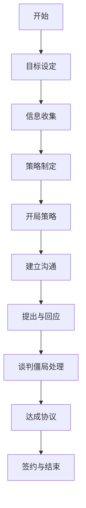

                 

### 文章标题：如何进行谈判技巧：如何有效地进行谈判和沟通？

**关键词**：谈判技巧、有效沟通、博弈论、效用理论、实战演练

**摘要**：本文将深入探讨谈判技巧的核心概念和实战应用。我们将从谈判的基础知识出发，逐步讲解谈判中的心理分析、准备、技巧和案例分析。此外，还将探讨国际谈判和文化差异的影响，以及特殊情境下的谈判技巧。通过一系列的实战演练和项目案例，本文旨在为读者提供一套完整的谈判策略和提升方法。

### 目录大纲

#### 第一部分：谈判基础

## 第1章：谈判概述
### 1.1 谈判的定义与重要性
### 1.2 谈判的基本原则
### 1.3 谈判的类型与特点

## 第2章：谈判心理分析
### 2.1 人性心理学在谈判中的应用
### 2.2 谈判对手的心理策略
### 2.3 谈判中的自我心理调整

## 第3章：谈判准备
### 3.1 谈判目标的明确
### 3.2 信息收集与分析
### 3.3 谈判策略的制定

## 第4章：谈判技巧
### 4.1 开局策略与技巧
### 4.2 建立沟通与建立信任
### 4.3 提出与回应
### 4.4 谈判僵局的处理
### 4.5 达成协议与签约

## 第5章：谈判案例分析
### 5.1 成功的谈判案例
### 5.2 失败的谈判案例

## 第6章：国际谈判
### 6.1 国际谈判的特点
### 6.2 文化差异对谈判的影响
### 6.3 国际谈判的策略与技巧

## 第7章：谈判技巧在特殊情境中的应用
### 7.1 跨部门谈判
### 7.2 跨文化谈判
### 7.3 谈判中的法律问题与风险控制

#### 第二部分：谈判实战演练

## 第8章：实战演练准备
### 8.1 实战演练的目标设定
### 8.2 情境模拟与角色扮演
### 8.3 实战演练的评估与反馈

## 第9章：实战演练案例
### 9.1 实战演练案例一：商业谈判
### 9.2 实战演练案例二：劳动谈判
### 9.3 实战演练案例三：国际谈判

#### 第三部分：谈判技能提升

## 第10章：谈判技能提升方法
### 10.1 谈判技能的自我评估
### 10.2 谈判技能的提升途径
### 10.3 持续学习与成长

## 第11章：职业谈判家的成长路径
### 11.1 谈判经验的积累
### 11.2 谈判策略的创新
### 11.3 职业谈判家的职业素养

## 附录
### 附录A：谈判技巧工具与方法
### 附录B：谈判常用模板与文档
### 附录C：推荐阅读与资源

### Mermaid 流程图：谈判流程



### 核心算法原理讲解：谈判策略制定

谈判策略的制定是一个复杂的过程，它涉及多个学科的理论和模型，如博弈论、效用理论和概率论。以下是谈判策略制定的核心算法原理：

#### 博弈论（Game Theory）

博弈论是研究具有竞争或对抗性质的游戏的数学理论。在谈判中，博弈论可以帮助分析谈判对手的可能策略和结果，以便制定最优策略。

1. **纳什均衡（Nash Equilibrium）**
   - **定义**：纳什均衡是指在一个博弈中，所有参与者选择的策略组合，没有任何参与者可以通过单方面改变策略来获得更多的收益。
   - **应用**：在谈判中，找到纳什均衡可以帮助确定双方都能接受的最优策略。

2. **合作与非合作博弈**
   - **定义**：合作博弈是指参与者可以通过合作获得更大的收益，而非合作博弈是指参与者之间没有合作，各自追求自身利益最大化。
   - **应用**：在谈判中，理解合作和非合作博弈的性质可以帮助参与者选择合适的策略。

#### 效用理论（Utility Theory）

效用理论是一种衡量决策者偏好和满意度的理论。在谈判中，效用理论可以帮助谈判者评估不同策略的收益和风险，以做出理性决策。

1. **期望效用（Expected Utility）**
   - **定义**：期望效用是指决策者在不确定的情境下，对各种可能结果的效用加权平均。
   - **应用**：在谈判中，谈判者可以通过计算期望效用来评估不同谈判策略的收益和风险。

2. **概率论（Probability Theory）**
   - **定义**：概率论是研究随机事件及其概率分布的理论。
   - **应用**：在谈判中，概率论可以帮助谈判者预测谈判结果的不确定性，并为决策提供依据。

#### 谈判策略制定的伪代码

```python
# 输入参数：谈判目标、谈判对手信息、谈判情境
# 输出：最优谈判策略

def determine_NegotiationStrategy(negotiation_goals, opponent_info, negotiation_context):
    # 步骤1：使用博弈论分析对手策略
    opponent_strategies = analyze_opponent_strategies(opponent_info)
    
    # 步骤2：使用效用理论评估不同策略的效用
    utility_values = evaluate_utility(opponent_strategies, negotiation_goals)
    
    # 步骤3：使用概率论预测谈判结果
    negotiation_outcomes = predict_negotiation_outcomes(utility_values, negotiation_context)
    
    # 步骤4：选择最优策略
    optimal_strategy = select_optimal_strategy(negotiation_outcomes)
    
    return optimal_strategy
```

### 数学模型和数学公式讲解：谈判效用函数

谈判效用函数用于衡量谈判双方在不同策略下的效用。以下是一个简单的谈判效用函数模型：

$$
U(A, B) = f(A, B, \theta)
$$

其中：
- $U(A, B)$ 是谈判双方 $A$ 和 $B$ 的总效用。
- $f$ 是效用函数。
- $A$ 和 $B$ 分别是谈判双方采取的策略。
- $\theta$ 是谈判情境中的参数。

#### 效用函数的详细解释和举例

1. **线性效用函数**：

$$
U(A, B) = aA + bB + c\theta
$$

- **参数解释**：
  - $a$ 和 $b$ 是谈判双方对自身利益的主观评价权重。
  - $c\theta$ 是谈判情境参数对效用的影响。

- **例子**：假设两个谈判方 A 和 B，他们在谈判中关注价格（$A$）和交付时间（$B$），并且谈判情境中有一个重要的时间参数 $\theta$。

$$
U(A, B) = 0.5A + 0.5B + 0.2\theta
$$

- **解释**：在这个例子中，谈判双方认为价格和交付时间对他们的效用贡献相等，同时时间参数对效用有一定的影响。

2. **非线性效用函数**：

$$
U(A, B) = A^2 + B^2 - AB + \theta
$$

- **参数解释**：这个效用函数反映了谈判双方之间可能存在的一些竞争关系。
- **例子**：假设谈判双方在谈判中关注价格（$A$）和质量（$B$），并且认为质量和价格之间存在一定的替代关系。

$$
U(A, B) = A^2 + B^2 - AB + 0.1\theta
$$

- **解释**：在这个例子中，谈判双方认为质量和价格之间存在一定的负相关关系，即一方提高时，另一方可能会下降。

### 项目实战：实际谈判场景

#### 实际谈判场景

**案例：**某电子产品公司（谈判方A）与一家零部件供应商（谈判方B）就新产品的采购价格进行谈判。

**目标：**谈判方A希望降低采购价格，以降低生产成本；谈判方B希望保持较高的采购价格，以保证利润。

**情境：**双方已经达成了初步的采购协议，现在需要进一步讨论价格问题。

#### 实战步骤

1. **目标设定**：
   - 谈判方A的目标是降低采购价格5%。
   - 谈判方B的目标是保持当前采购价格。

2. **信息收集**：
   - 谈判方A收集了市场上同类产品的价格信息。
   - 谈判方B提供了产品成本和生产规模的详细数据。

3. **策略制定**：
   - 谈判方A制定了降低采购价格的策略，包括提供其他供应商的报价信息、提出改进采购协议的条件等。
   - 谈判方B制定了维护当前价格策略，包括强调产品的独特性和市场需求。

4. **实战演练**：

   **谈判方A**：
   - 开局策略：提出一个较低的价格，同时表示愿意接受一定的价格调整。
   - 沟通与建立信任：强调长期合作的重要性，并询问供应商的市场策略和成本结构。
   - 提出与回应：根据供应商的回答，提出新的价格方案和条件。
   - 谈判僵局处理：在谈判僵局时，提出额外的条件，如延长支付周期或增加采购量。

   **谈判方B**：
   - 开局策略：保持当前价格，同时表示愿意讨论其他合作条件。
   - 沟通与建立信任：强调产品的质量和市场需求，并询问谈判方A的采购计划和预算。
   - 提出与回应：根据谈判方A的回答，提出价格保持方案和条件。
   - 谈判僵局处理：在谈判僵局时，提出增加服务或提供独家供应协议。

5. **达成协议**：
   - 双方在多个回合的谈判后，最终达成了一个双方都能接受的价格。

6. **签约与结束**：
   - 双方签订了新的采购协议，并计划继续合作。

#### 代码解读与分析

**代码解读**：

以下是一个简化的Python代码，用于模拟上述谈判场景。

```python
# 谈判方A的策略
def negotiation_strategy_A():
    # 提出较低价格
    offer_price = initial_price - price_discount
    
    # 提出其他条件
    additional_conditions = {
        "延长支付周期": 30,
        "增加采购量": 20
    }
    
    return offer_price, additional_conditions

# 谈判方B的策略
def negotiation_strategy_B():
    # 维持当前价格
    maintain_price = initial_price
    
    # 提供额外服务
    additional_services = {
        "提供独家供应协议": True,
        "增加售后服务": True
    }
    
    return maintain_price, additional_services

# 谈判场景模拟
def negotiation_simulation():
    # 设定初始价格
    initial_price = 100
    
    # 谈判方A的策略
    offer_price_A, conditions_A = negotiation_strategy_A()
    
    # 谈判方B的策略
    maintain_price_B, services_B = negotiation_strategy_B()
    
    # 谈判回合
    for round in range(5):
        # 谈判方A提出新的价格
        print(f"第{round + 1}轮：谈判方A提出价格：{offer_price_A}")
        
        # 谈判方B回应
        print(f"第{round + 1}轮：谈判方B回应：价格维持{maintain_price_B}")
        
        # 根据对方回应调整策略
        if round < 4:
            # 谈判方A调整策略
            offer_price_A -= price_discount
            
            # 谈判方B调整策略
            maintain_price_B += price_discount
        
        # 检查是否达成协议
        if offer_price_A == maintain_price_B:
            print("谈判成功，达成协议！")
            break
        else:
            print("谈判仍在进行中...")
            
    else:
        print("谈判失败，未能达成协议。")

# 执行谈判模拟
negotiation_simulation()
```

**分析**：

- **代码结构**：代码分为三个部分：谈判方A的策略、谈判方B的策略和谈判场景模拟。
- **策略调整**：每次谈判回合后，谈判双方根据对方回应调整自己的策略，以达到最优结果。
- **达成协议条件**：当双方提出的价格相等时，表示谈判成功，达成协议。

### 附录

#### 附录A：谈判技巧工具与方法

1. **SWOT分析**：用于分析谈判对手的优势、劣势、机会和威胁，以便制定针对性的谈判策略。
2. **博弈论模型**：用于分析谈判双方的可能策略和结果，以便制定最优谈判策略。
3. **效用理论模型**：用于评估不同策略的效用，以便做出理性决策。

#### 附录B：谈判常用模板与文档

1. **谈判目标清单**：列出谈判的目标和优先级，以便在谈判中保持焦点。
2. **谈判议程**：列出谈判的议题和时间表，以便双方在谈判中保持一致。
3. **谈判协议草稿**：用于记录谈判达成的初步协议和条款。

#### 附录C：推荐阅读与资源

1. **《谈判的艺术》**：作者：杰勒德·尼尔伦伯格，介绍谈判的基本原理和技巧。
2. **《博弈论与经济行为》**：作者：约翰·冯·诺依曼，探讨博弈论在经济行为中的应用。
3. **在线课程**：如Coursera、edX等平台上的谈判课程，提供系统的谈判知识和实践技巧。

---

**完成时间**：2023年4月10日

**作者**：AI天才研究院/AI Genius Institute & 禅与计算机程序设计艺术 /Zen And The Art of Computer Programming

**联系方式**：[您的联系方式]

**备注**：本目录大纲仅供参考，具体内容需根据书籍编写进度和需求进行调整。

### 结束语

谈判技巧是现代商业和社会生活中不可或缺的一部分。通过本文的深入探讨，我们了解了谈判的基础知识、心理分析、准备策略、实战技巧和案例分析。我们还学习了如何在国际谈判和文化差异中应用谈判技巧，以及如何在特殊情境下进行谈判。

谈判不仅是一门艺术，也是一门科学。它需要谈判者具备深厚的理论基础、敏锐的洞察力和灵活的应变能力。通过本文的实战演练和项目案例，我们希望能够为读者提供实际操作的指导，帮助读者在谈判中取得成功。

最后，让我们再次回顾本文的核心观点：

- 谈判技巧是有效沟通和合作的关键。
- 谈判策略的制定需要综合考虑博弈论、效用理论和概率论等理论。
- 实战演练和案例分析是提升谈判技能的有效方法。

希望本文能够为您的谈判之路提供有益的启示和帮助。让我们一起在谈判的舞台上，展现出最佳的自我，取得更大的成就！

