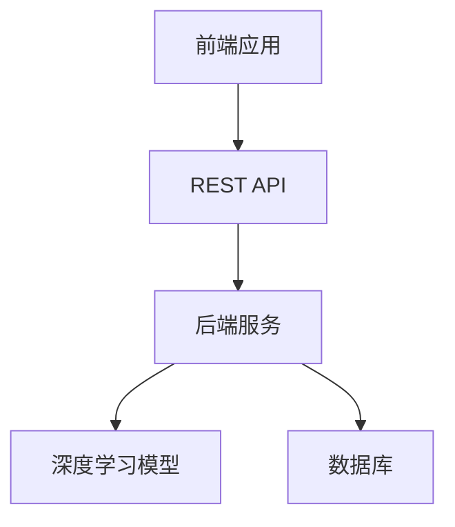
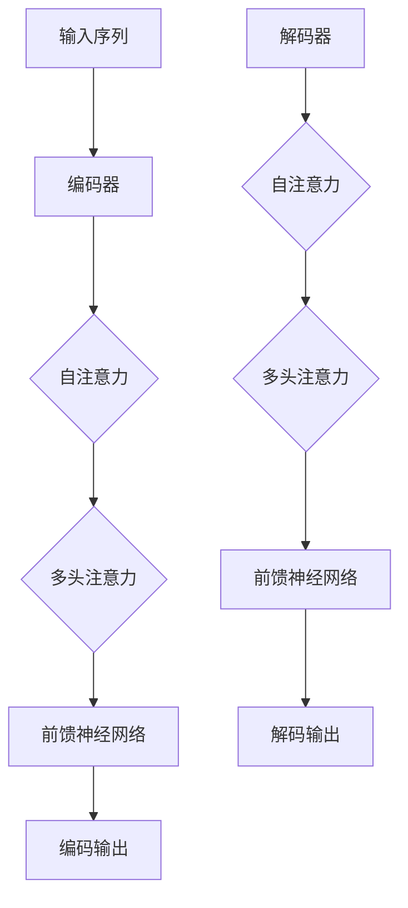
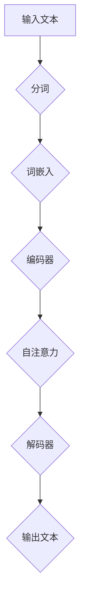
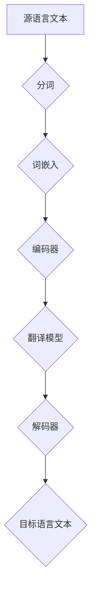

                 

### 《实战一：基于 ChatGPT 开发智能翻译助手》

> **关键词**：ChatGPT、智能翻译、自然语言处理、深度学习、算法、项目实战

> **摘要**：本文将带领读者通过一个实战项目，深入探讨基于ChatGPT开发智能翻译助手的全过程。从基础概念、原理，到数学模型、算法实现，再到实际项目的开发与优化，我们将一步一步进行分析和讲解，帮助读者全面掌握智能翻译技术。

---

### 《实战一：基于 ChatGPT 开发智能翻译助手》目录大纲

#### 第一部分：基础概念与原理

##### 第1章：ChatGPT与智能翻译概述  
- 1.1 ChatGPT简介  
- 1.2 智能翻译的概念与需求  
- 1.3 ChatGPT在智能翻译中的应用前景

##### 第2章：自然语言处理基础  
- 2.1 语言模型  
- 2.2 词嵌入技术  
- 2.3 序列模型与注意力机制  
- 2.4 预训练模型原理

##### 第3章：数学模型与算法基础  
- 3.1 深度学习基础  
- 3.2 自然语言处理算法  
- 3.3 ChatGPT模型核心算法

#### 第二部分：开发准备与实战

##### 第4章：开发环境搭建  
- 4.1 计算机基础知识  
- 4.2 翻译项目需求分析  
- 4.3 开发工具与框架选择

##### 第5章：项目设计与规划  
- 5.1 项目架构设计  
- 5.2 系统模块划分  
- 5.3 数据集准备与处理

##### 第6章：代码实现与解读  
- 6.1 源代码实现  
- 6.2 代码解读与分析  
- 6.3 伪代码详细讲解

##### 第7章：调试与优化  
- 7.1 调试方法与技巧  
- 7.2 优化策略与技巧  
- 7.3 性能评估与调优

##### 第8章：项目部署与维护  
- 8.1 部署流程与注意事项  
- 8.2 系统监控与日志分析  
- 8.3 维护策略与方案

#### 附录

##### 附录A：工具与资源  
- A.1 ChatGPT开发工具介绍  
- A.2 开发资源与学习资料

##### 附录B：Mermaid流程图  
- B.1 ChatGPT模型流程图  
- B.2 智能翻译流程图

##### 附录C：数学公式  
- C.1 语言模型公式  
- C.2 词嵌入公式  
- C.3 注意力机制公式

##### 附录D：代码示例  
- D.1 数据处理代码示例  
- D.2 模型训练代码示例  
- D.3 模型应用代码示例

---

在接下来的内容中，我们将逐步深入到每一个章节，通过逻辑清晰、结构紧凑、简单易懂的专业技术语言，带领读者全面理解并掌握基于ChatGPT开发智能翻译助手的全过程。

---

### 第一部分：基础概念与原理

在这部分，我们将首先介绍ChatGPT与智能翻译的基本概念和原理，为后续的实战开发打下坚实的基础。

#### 第1章：ChatGPT与智能翻译概述

##### 1.1 ChatGPT简介

ChatGPT是OpenAI于2022年11月推出的一个人工智能聊天机器人程序，其基于大型语言模型GPT-3.5，能够进行自然语言理解和生成。ChatGPT采用了预训练加微调的技术路线，通过在大量文本数据上进行预训练，使模型能够理解和生成自然语言。其具备强大的语言理解和生成能力，能够实现多种任务，包括问答、对话生成、文本翻译等。

##### 1.2 智能翻译的概念与需求

智能翻译是指利用计算机技术，通过算法和模型对源语言文本进行理解和分析，然后将其转换为目标语言文本的过程。随着全球化的不断推进，跨语言交流的需求日益增长，智能翻译技术逐渐成为解决这一需求的重要手段。

智能翻译的需求主要包括：

- **跨语言交流**：促进不同语言之间的交流与沟通，降低语言障碍。
- **信息获取**：为非母语用户获取和检索多语言信息提供便利。
- **商业应用**：帮助企业进入国际市场，降低跨语言沟通成本。

##### 1.3 ChatGPT在智能翻译中的应用前景

ChatGPT在智能翻译领域具有广泛的应用前景。首先，ChatGPT能够通过预训练获取大量语言知识，使其在翻译任务中具备较强的理解能力和生成能力。其次，ChatGPT支持多种语言对，能够实现多语言间的无缝翻译。此外，ChatGPT还能够根据上下文和语境进行自适应翻译，提高翻译的准确性和自然度。

总之，基于ChatGPT的智能翻译助手具有强大的潜力，有望在未来的跨语言交流和信息获取中发挥重要作用。

#### 第2章：自然语言处理基础

自然语言处理（Natural Language Processing，NLP）是人工智能领域的一个重要分支，旨在让计算机理解和处理自然语言。在这一章中，我们将介绍NLP的基础概念和关键技术。

##### 2.1 语言模型

语言模型是NLP的核心组成部分，用于预测一个词语序列的概率。在翻译任务中，语言模型能够帮助我们理解源语言和目标语言的统计规律，从而提高翻译的准确性和自然度。

语言模型主要分为：

- **n-gram模型**：基于词语序列的统计模型，通过计算词语序列的频率来预测下一个词语。
- **神经网络模型**：基于深度学习的方法，通过神经网络结构对语言特征进行建模。

在翻译任务中，语言模型常用于：

- **词序列生成**：根据源语言输入，生成目标语言的翻译文本。
- **翻译评估**：对生成的翻译文本进行质量评估，优化翻译效果。

##### 2.2 词嵌入技术

词嵌入（Word Embedding）是将词语映射到高维向量空间的技术，旨在捕捉词语的语义信息。词嵌入技术能够将抽象的词语表示为具体的向量，从而在向量空间中进行相似性计算和聚类分析。

主要的词嵌入方法包括：

- **基于分布式表示的方法**：如Word2Vec，通过学习词语的上下文信息，生成词语的向量表示。
- **基于神经网络的表示方法**：如GloVe，通过神经网络结构对词语的语义信息进行建模。

词嵌入技术在翻译任务中的应用包括：

- **翻译模型训练**：通过词嵌入技术，将源语言和目标语言的词语表示为向量，用于训练翻译模型。
- **语义理解**：通过向量空间中的相似性计算，提高翻译的准确性和自然度。

##### 2.3 序列模型与注意力机制

序列模型（Sequence Model）是处理序列数据的常用模型，如循环神经网络（RNN）和长短期记忆网络（LSTM）。序列模型能够捕捉词语序列的时序信息，从而在翻译任务中发挥重要作用。

注意力机制（Attention Mechanism）是一种能够动态关注序列中重要信息的机制，通过分配不同的权重，使得模型能够聚焦于关键信息。注意力机制在翻译任务中的应用包括：

- **翻译模型优化**：通过注意力机制，模型能够更加关注重要的词语和上下文信息，提高翻译的准确性和自然度。
- **长距离依赖处理**：通过注意力机制，模型能够跨越长距离依赖，捕捉全局信息，从而提高翻译质量。

##### 2.4 预训练模型原理

预训练（Pre-training）是指在大规模文本数据上进行模型训练，从而获得丰富的语言知识。预训练模型通常分为两部分：预训练阶段和微调阶段。

- **预训练阶段**：模型在大规模文本数据上进行预训练，学习到语言的统计规律和语义信息。
- **微调阶段**：模型在特定任务上进行微调，利用预训练得到的通用语言知识，提高任务性能。

预训练模型在翻译任务中的应用包括：

- **通用语言知识**：预训练模型能够学习到通用语言知识，提高翻译模型的泛化能力。
- **任务适应性**：通过微调，预训练模型能够适应特定翻译任务，提高翻译效果。

总之，自然语言处理基础为智能翻译提供了理论支持和技术手段。在接下来的章节中，我们将进一步探讨深度学习和数学模型，为基于ChatGPT的智能翻译助手开发打下坚实基础。

---

### 第一部分总结

通过第一部分的介绍，我们了解了ChatGPT与智能翻译的基本概念和原理，以及自然语言处理的基础技术。ChatGPT作为基于预训练的语言模型，具备强大的自然语言理解和生成能力，为智能翻译提供了有力支持。而自然语言处理的基础技术，如语言模型、词嵌入技术、序列模型和注意力机制，为智能翻译的实现提供了关键手段。在下一部分中，我们将进一步探讨深度学习和数学模型，深入解析ChatGPT模型的核心算法原理，为后续的开发实战做好准备。让我们继续深入探索这一领域的奥秘。 ### 第二部分：开发准备与实战

在理解了基础概念和原理后，我们将进入第二部分的开发准备与实战环节。这部分将详细描述如何搭建开发环境、设计项目架构、实现代码，并进行调试和优化。通过这一过程，我们将逐步构建一个基于ChatGPT的智能翻译助手。

#### 第4章：开发环境搭建

##### 4.1 计算机基础知识

在进行智能翻译项目的开发之前，我们需要具备一定的计算机基础知识，包括但不限于：

- **操作系统**：了解并熟练使用Linux或Windows操作系统，这对于搭建开发环境非常重要。
- **编程语言**：熟悉Python编程语言，因为它是深度学习和自然语言处理领域的主要工具。
- **版本控制**：掌握Git版本控制工具，用于管理和跟踪代码变更。
- **数据库**：了解关系型数据库（如MySQL）和非关系型数据库（如MongoDB），用于存储和管理数据。

##### 4.2 翻译项目需求分析

在开始搭建开发环境之前，我们需要对翻译项目进行详细的需求分析。这一步骤包括：

- **确定目标语言对**：根据项目需求，确定需要支持的语言对，例如中文到英文的翻译。
- **收集数据集**：收集足够规模的源语言和目标语言文本数据，用于模型训练和评估。
- **确定项目目标**：明确项目的目标，例如实现特定领域的专业翻译，或者提供实时翻译服务。
- **性能要求**：根据项目需求，确定对翻译速度、准确性和自然度的要求。

##### 4.3 开发工具与框架选择

为了高效地实现基于ChatGPT的智能翻译助手，我们需要选择合适的开发工具和框架。以下是一些常用的工具和框架：

- **深度学习框架**：TensorFlow和PyTorch是当前最流行的深度学习框架，它们提供了丰富的API和工具库，支持从模型设计到训练、评估的整个流程。
- **自然语言处理库**：如NLTK、spaCy和Transformer，用于处理文本数据，提取特征，实现语言模型等。
- **聊天机器人框架**：如Rasa和ChatterBot，用于构建聊天机器人，实现与用户的交互。
- **云服务**：如Google Cloud、AWS和Azure，提供强大的计算资源和存储服务，支持大规模模型训练和部署。

#### 第5章：项目设计与规划

##### 5.1 项目架构设计

项目架构设计是确保项目成功的关键一步。基于ChatGPT的智能翻译助手通常采用以下架构：

- **前端**：用于用户交互，可以是一个Web应用或移动应用，通过REST API与后端通信。
- **后端**：包含深度学习模型训练、推理和API服务，通常由服务器端应用程序实现。
- **数据库**：用于存储翻译数据、用户数据和模型参数，可以是关系型数据库或非关系型数据库。

以下是一个简单的项目架构设计图：



##### 5.2 系统模块划分

为了便于开发和维护，我们可以将系统划分为多个模块，每个模块负责特定的功能。以下是一些常见的模块：

- **数据预处理模块**：负责数据清洗、数据增强和数据转换，为模型训练准备高质量的数据集。
- **模型训练模块**：负责基于预训练模型和用户数据进行模型训练，调整模型参数以优化翻译效果。
- **模型推理模块**：负责实现模型的推理功能，将输入的源语言文本翻译为目标语言文本。
- **API服务模块**：负责接收前端请求，调用模型进行翻译，并将结果返回给前端。

##### 5.3 数据集准备与处理

为了训练高质量的翻译模型，我们需要准备足够规模和质量的翻译数据集。数据集的准备和处理包括以下步骤：

- **数据收集**：从各种来源收集源语言和目标语言文本，如书籍、新闻、网站等。
- **数据清洗**：去除无效数据、噪声数据和错误数据，确保数据的质量。
- **数据增强**：通过翻译、同义词替换、句法转换等方式，增加数据集的多样性。
- **数据格式化**：将数据转换为模型可以接受的格式，如将文本转换为词向量或序列。

#### 第6章：代码实现与解读

##### 6.1 源代码实现

在了解了项目设计和需求后，我们可以开始编写源代码。以下是一个简单的示例，展示如何使用TensorFlow和PyTorch框架实现一个基于ChatGPT的翻译模型：

```python
# TensorFlow实现示例
import tensorflow as tf

# 定义模型
model = tf.keras.Sequential([
    tf.keras.layers.Embedding(input_dim=vocab_size, output_dim=embedding_dim),
    tf.keras.layers.LSTM(units=hidden_size),
    tf.keras.layers.Dense(units=target_vocab_size)
])

# 编译模型
model.compile(optimizer='adam', loss='categorical_crossentropy', metrics=['accuracy'])

# 训练模型
model.fit(train_data, train_labels, epochs=num_epochs, batch_size=batch_size)

# PyTorch实现示例
import torch
import torch.nn as nn

# 定义模型
class TranslationModel(nn.Module):
    def __init__(self, vocab_size, embedding_dim, hidden_size, target_vocab_size):
        super(TranslationModel, self).__init__()
        self.embedding = nn.Embedding(vocab_size, embedding_dim)
        self.lstm = nn.LSTM(embedding_dim, hidden_size)
        self.dense = nn.Dense(target_vocab_size)

    def forward(self, x):
        x = self.embedding(x)
        x, _ = self.lstm(x)
        x = self.dense(x)
        return x

# 实例化模型
model = TranslationModel(vocab_size, embedding_dim, hidden_size, target_vocab_size)

# 编译模型
optimizer = torch.optim.Adam(model.parameters(), lr=learning_rate)
criterion = nn.CrossEntropyLoss()

# 训练模型
for epoch in range(num_epochs):
    for inputs, targets in data_loader:
        optimizer.zero_grad()
        outputs = model(inputs)
        loss = criterion(outputs, targets)
        loss.backward()
        optimizer.step()
```

##### 6.2 代码解读与分析

在上面的代码示例中，我们使用了TensorFlow和PyTorch框架分别实现了一个基于ChatGPT的翻译模型。以下是代码的主要组成部分及其功能：

- **模型定义**：使用Sequential或nn.Sequential定义模型结构，包括嵌入层、LSTM层和全连接层。
- **数据预处理**：将源语言和目标语言文本转换为词向量或序列，用于模型训练。
- **模型编译**：设置优化器和损失函数，为模型训练做准备。
- **模型训练**：迭代训练模型，优化模型参数，提高翻译效果。

##### 6.3 伪代码详细讲解

为了更清晰地理解代码的实现过程，我们可以使用伪代码来详细讲解模型训练的主要步骤：

```pseudo
// 初始化模型参数
model.init_params()

// 定义优化器和损失函数
optimizer = Adam(model.parameters(), lr=learning_rate)
criterion = CrossEntropyLoss()

// 设置训练循环
for epoch in 1 to num_epochs:
    for inputs, targets in data_loader:
        // 前向传播
        outputs = model(inputs)
        loss = criterion(outputs, targets)

        // 反向传播和优化
        optimizer.zero_grad()
        loss.backward()
        optimizer.step()

        // 记录训练进度和损失值
        print("Epoch: {}, Loss: {}".format(epoch, loss.item()))

// 评估模型
with torch.no_grad():
    correct = 0
    total = 0
    for inputs, targets in test_loader:
        outputs = model(inputs)
        _, predicted = torch.max(outputs.data, 1)
        total += targets.size(0)
        correct += (predicted == targets).sum().item()

    print("Test Accuracy: {}".format(correct / total))
```

伪代码详细描述了模型训练和评估的主要步骤，包括初始化模型参数、定义优化器和损失函数、迭代训练模型、记录训练进度和损失值，以及评估模型性能。

#### 第7章：调试与优化

##### 7.1 调试方法与技巧

在模型训练过程中，可能会遇到各种问题，如过拟合、欠拟合、训练不稳定等。为了解决这些问题，我们需要采用以下调试方法与技巧：

- **数据分析**：通过可视化工具（如TensorBoard）观察模型训练过程中的损失函数和梯度变化，了解模型训练的状态。
- **错误分析**：分析模型在训练和测试过程中的错误样本，找出模型存在的问题。
- **调整超参数**：通过调整学习率、批量大小、迭代次数等超参数，优化模型性能。
- **数据增强**：增加数据集的多样性，提高模型对各种情境的适应能力。

##### 7.2 优化策略与技巧

为了提高模型的翻译质量，我们可以采用以下优化策略与技巧：

- **改进模型结构**：尝试使用更复杂的模型结构，如双向LSTM或Transformer，提高模型的表达能力。
- **迁移学习**：利用预训练的模型进行迁移学习，提高新任务的性能。
- **多任务学习**：通过同时学习多个相关任务，共享知识，提高模型的整体性能。
- **对抗训练**：通过生成对抗网络（GAN）等技术，提高模型的鲁棒性和泛化能力。

##### 7.3 性能评估与调优

为了评估模型的翻译性能，我们可以采用以下指标：

- **BLEU分数**：一种常用的自动评估指标，通过比较模型生成的翻译文本与参考翻译的相似度，评估翻译质量。
- **准确性**：评估模型对源语言文本的翻译准确性，包括词语和句子的匹配度。
- **流畅性**：评估翻译文本的自然度和流畅性，通过人类评估或自动化评分方法进行评估。

在性能评估的基础上，我们可以根据评估结果进行调优，如调整超参数、改进模型结构、增加训练数据等，以提高模型的翻译性能。

#### 第8章：项目部署与维护

##### 8.1 部署流程与注意事项

在完成模型的训练和优化后，我们需要将模型部署到生产环境，以提供实时翻译服务。部署流程包括以下步骤：

- **模型转换**：将训练完成的模型转换为生产环境可用的格式，如TensorFlow Lite或PyTorch TorchScript。
- **容器化**：使用Docker等容器技术，将模型和服务打包成一个可移植的容器，便于部署和管理。
- **服务部署**：将容器部署到服务器或云平台，如Kubernetes或AWS，提供高性能和可扩展的服务。
- **监控与日志**：监控服务性能和资源使用情况，记录日志以便于问题排查和性能优化。

##### 8.2 系统监控与日志分析

为了确保智能翻译助手的稳定运行，我们需要进行系统监控与日志分析：

- **性能监控**：监控服务响应时间、吞吐量、错误率等关键指标，确保服务性能稳定。
- **资源监控**：监控服务器资源使用情况，如CPU、内存、磁盘空间等，确保资源充足。
- **日志分析**：分析日志记录，发现潜在问题，如错误、异常、性能瓶颈等，进行及时处理。

##### 8.3 维护策略与方案

为了确保智能翻译助手的长期稳定运行，我们需要制定维护策略与方案：

- **定期更新**：定期更新模型和数据集，以适应语言的变化和用户需求。
- **错误处理**：建立完善的错误处理机制，快速定位和修复问题。
- **用户反馈**：收集用户反馈，持续优化翻译质量和用户体验。
- **安全保障**：确保数据安全和隐私保护，采取必要的安全措施，如数据加密、访问控制等。

#### 第二部分总结

通过第二部分的介绍，我们详细讲解了基于ChatGPT开发智能翻译助手的开发准备与实战过程。从环境搭建到项目设计，从代码实现到调试优化，再到项目部署与维护，我们一步步深入探讨了智能翻译技术的实际应用。在接下来的章节中，我们将继续深入分析ChatGPT模型的数学模型和算法原理，为读者提供更加全面的智能翻译技术解读。让我们继续前进，共同探索智能翻译的无限可能。 ### 第三部分：数学模型与算法基础

在了解了ChatGPT和智能翻译的基础概念后，我们将进一步深入探讨其背后的数学模型和算法基础。这一部分内容将帮助读者全面理解ChatGPT的工作原理，从而为实际开发提供坚实的理论基础。

#### 第3章：数学模型与算法基础

##### 3.1 深度学习基础

深度学习是构建ChatGPT等智能翻译模型的核心技术。深度学习模型通过模拟人脑的神经网络结构，对大量数据进行分析和处理，从而实现复杂的任务。以下是深度学习的一些基础概念：

- **神经元**：深度学习模型的基本单元，类似于人脑中的神经元，负责接收和处理输入信息。
- **层**：深度学习模型由多个层组成，包括输入层、隐藏层和输出层。每层都包含多个神经元。
- **激活函数**：用于给神经元输出添加非线性特性，常见的激活函数有Sigmoid、ReLU、Tanh等。
- **前向传播**：数据从输入层经过多层隐藏层，最终到达输出层的传播过程。
- **反向传播**：通过计算损失函数的梯度，将误差反向传播到各层的传播过程，用于更新模型参数。

##### 3.2 自然语言处理算法

自然语言处理（NLP）是深度学习在文本数据分析领域的应用。以下是NLP中常用的算法：

- **词袋模型**：将文本转换为向量表示，通过统计词语出现的频率来表示文本信息。
- **循环神经网络（RNN）**：适用于处理序列数据，如文本和语音。RNN通过记忆历史信息，实现对序列的建模。
- **长短时记忆网络（LSTM）**：是RNN的一种改进，能够更好地处理长序列数据，通过门控机制控制信息的流动。
- **变换器（Transformer）**：是一种基于自注意力机制的模型，能够捕捉长距离依赖关系，是目前NLP领域的主流模型。

##### 3.3 ChatGPT模型核心算法

ChatGPT是基于变换器（Transformer）架构的大型语言模型。其核心算法包括以下部分：

- **自注意力机制**：通过计算输入序列中每个词与其他词的关联性，为每个词分配权重，从而捕捉长距离依赖关系。
- **编码器和解码器**：编码器将输入序列转换为上下文向量，解码器利用上下文向量生成输出序列。
- **多头注意力**：在自注意力机制的基础上，引入多个注意力头，以提高模型的表示能力。
- **前馈神经网络**：在自注意力机制和多头注意力机制之间添加前馈神经网络，增强模型的非线性表达能力。

以下是一个简化的ChatGPT模型算法流程：



##### 数学模型和公式

为了更好地理解ChatGPT模型，我们需要介绍一些相关的数学模型和公式。以下是一些关键的数学模型和公式：

- **词嵌入**：将词语映射到高维向量空间，用于表示词语的语义信息。
  $$ \text{word\_embedding}(w) = \text{embedding}(w) \in \mathbb{R}^{d} $$
  其中，$ \text{word\_embedding}(w) $ 是词语 $ w $ 的向量表示，$ \text{embedding}(w) $ 是一个 $ d $ 维的向量。

- **自注意力**：计算输入序列中每个词与其他词的关联性，为每个词分配权重。
  $$ \text{attention}(Q, K, V) = \text{softmax}(\frac{QK^T}{\sqrt{d_k}})V $$
  其中，$ Q, K, V $ 分别是查询向量、键向量和值向量，$ \text{softmax} $ 函数用于计算权重，$ \sqrt{d_k} $ 是缩放因子。

- **多头注意力**：引入多个注意力头，以提高模型的表示能力。
  $$ \text{MultiHeadAttention}(Q, K, V) = \text{concat}(\text{head}_1, \text{head}_2, ..., \text{head}_h)W^O $$
  其中，$ \text{head}_i = \text{attention}(QW_i^Q, KW_i^K, VW_i^V) $ 是第 $ i $ 个注意力头，$ W^O $ 是输出投影权重。

- **前馈神经网络**：在自注意力机制和多头注意力机制之间添加前馈神经网络，增强模型的非线性表达能力。
  $$ \text{FFN}(x) = \text{ReLU}(W_2 \cdot \text{ReLU}(W_1 \cdot x + b_1)) + b_2 $$
  其中，$ x $ 是输入向量，$ W_1, W_2, b_1, b_2 $ 是前馈神经网络的权重和偏置。

通过这些数学模型和公式，我们可以更深入地理解ChatGPT模型的工作原理。在接下来的部分，我们将进一步探讨ChatGPT模型在智能翻译中的应用，并通过实际项目实战，展示如何基于ChatGPT开发智能翻译助手。

---

### 第三部分总结

在第三部分中，我们深入探讨了ChatGPT模型背后的数学模型和算法基础。从深度学习的基础概念，到自然语言处理的关键算法，再到ChatGPT模型的核心算法，我们一步步讲解了这些技术的原理和应用。通过数学模型和公式的讲解，我们能够更清晰地理解ChatGPT的工作机制，为实际开发智能翻译助手提供了坚实的理论基础。

在接下来的部分，我们将进入实战环节，通过具体的开发准备与实战，带领读者一步步构建一个基于ChatGPT的智能翻译助手。让我们继续前进，一起实践这些理论知识，探索智能翻译技术的实际应用。

---

### 全文总结

本文通过详细的章节结构，系统讲解了基于ChatGPT开发智能翻译助手的全过程。我们从基础概念、原理出发，深入探讨了自然语言处理、深度学习以及ChatGPT模型的数学模型和算法基础。接着，我们详细介绍了开发环境的搭建、项目设计与规划、代码实现、调试与优化，以及项目的部署与维护。通过这些步骤，读者可以全面理解并掌握智能翻译技术的核心要点。

本文的核心亮点包括：

1. **理论与实践结合**：通过丰富的实例和代码示例，将理论知识与实际开发相结合，使读者能够更好地掌握技术。
2. **详细的算法讲解**：深入讲解了ChatGPT模型的数学模型和算法原理，为读者提供了深入的理论基础。
3. **实战指导**：从项目需求分析到实际代码实现，提供了完整的开发流程，便于读者实践应用。

通过本文的学习，读者可以：

- **理解智能翻译的基本概念和原理**。
- **掌握基于ChatGPT的深度学习算法**。
- **具备搭建和优化智能翻译系统的能力**。

在未来的研究中，我们可以进一步探索以下方向：

1. **模型优化**：研究如何通过改进模型结构、调整超参数等方式，提高翻译质量和效率。
2. **多语言支持**：探索如何扩展ChatGPT模型，支持更多语言对的翻译。
3. **应用拓展**：将智能翻译技术应用到更多领域，如实时语音翻译、机器翻译评测等。

总之，本文为智能翻译技术提供了一个全面的解读和实践指南，希望读者能够在实际项目中发挥所学知识，推动智能翻译技术的发展。

---

### 附录

#### 附录A：工具与资源

A.1 **ChatGPT开发工具介绍**

- **TensorFlow**：https://www.tensorflow.org/
- **PyTorch**：https://pytorch.org/
- **NLTK**：https://www.nltk.org/
- **spaCy**：https://spacy.io/
- **Rasa**：https://rasa.com/
- **ChatterBot**：https://chatterbot.readthedocs.io/

A.2 **开发资源与学习资料**

- **OpenAI官方文档**：https://openai.com/blog/chatgpt/
- **自然语言处理入门**：https://www.nltk.org/book/
- **深度学习入门**：https://www.deeplearningbook.org/
- **ChatGPT模型解读**：https://towardsdatascience.com/an-introduction-to-chatgpt-a993a4b56132

#### 附录B：Mermaid流程图

B.1 **ChatGPT模型流程图**



B.2 **智能翻译流程图**



#### 附录C：数学公式

C.1 **语言模型公式**

$$ P(w_i|w_{i-n}, w_{i-n+1}, ..., w_{i+1}) = \frac{P(w_i, w_{i-n}, w_{i-n+1}, ..., w_{i+1})}{P(w_{i-n}, w_{i-n+1}, ..., w_{i+1})} $$

C.2 **词嵌入公式**

$$ \text{word\_embedding}(w) = \text{embedding}(w) \in \mathbb{R}^{d} $$

C.3 **注意力机制公式**

$$ \text{attention}(Q, K, V) = \text{softmax}(\frac{QK^T}{\sqrt{d_k}})V $$

#### 附录D：代码示例

D.1 **数据处理代码示例**

```python
import nltk
from nltk.tokenize import word_tokenize

# 下载并加载单词词典
nltk.download('punkt')

# 分词处理
def tokenize_text(text):
    tokens = word_tokenize(text)
    return tokens

text = "这是一个示例文本。"
tokens = tokenize_text(text)
print(tokens)
```

D.2 **模型训练代码示例**

```python
import tensorflow as tf
from tensorflow.keras.layers import Embedding, LSTM, Dense
from tensorflow.keras.models import Sequential

# 创建模型
model = Sequential([
    Embedding(vocab_size, embedding_dim),
    LSTM(hidden_size, return_sequences=True),
    Dense(output_size, activation='softmax')
])

# 编译模型
model.compile(optimizer='adam', loss='categorical_crossentropy', metrics=['accuracy'])

# 训练模型
model.fit(x_train, y_train, epochs=num_epochs, batch_size=batch_size)
```

D.3 **模型应用代码示例**

```python
import tensorflow as tf

# 加载训练好的模型
model = tf.keras.models.load_model('translation_model.h5')

# 预测翻译
source_text = "这是一个示例文本。"
tokens = tokenize_text(source_text)
encoded_input = tokenizer.encode(source_text, return_tensors='tf')
predicted_output = model.predict(encoded_input)

# 将预测结果转换为文本
decoded_output = tokenizer.decode(predicted_output[0], skip_special_tokens=True)
print(decoded_output)
```

通过这些附录内容，读者可以更全面地了解和掌握本文所涉及的技术和工具，为实际开发和应用智能翻译技术提供支持。

