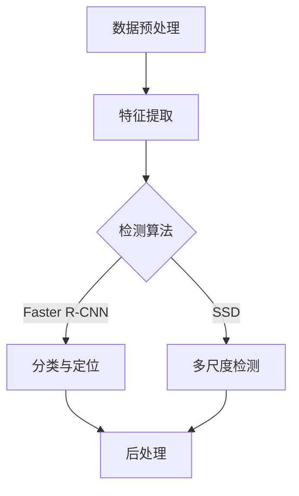

                 

# 对象检测 (Object Detection) 原理与代码实例讲解

> **关键词**：对象检测，深度学习，图像识别，卷积神经网络，实时检测，计算机视觉，数据增强，正则化

> **摘要**：本文将深入探讨对象检测（Object Detection）的基本概念、原理、算法以及在实际项目中的应用。通过逐步分析深度学习基础、对象检测算法、优化策略和实践案例，帮助读者全面理解对象检测技术，并掌握其实际应用方法。

## 第一部分：对象检测（Object Detection）概述

### 第1章：对象检测技术基础

#### 1.1 对象检测的定义与基本概念

**对象检测的定义**：
对象检测是一种目标识别技术，旨在从图像或视频中准确识别并定位特定对象。它通常包括以下几个基本概念：

1. **边界框（Bounding Box）**：用于界定对象位置的矩形框。
2. **类别（Class）**：指图像中对象的类别，如人、车、猫等。
3. **置信度（Confidence Score）**：表示检测框内对象为真实对象的概率。

**对象检测的基本概念**：
- **多尺度检测**：对象可能具有不同的尺度，检测算法需要能够处理不同大小的对象。
- **多位置检测**：对象可能位于图像的不同位置，检测算法需要能够定位这些位置。
- **遮挡问题**：对象可能部分或全部被遮挡，检测算法需要能够处理这种不确定性。
- **实时性要求**：在许多应用场景中，如自动驾驶和实时监控，检测算法需要快速响应。

#### 1.2 对象检测的发展历程

对象检测技术的发展经历了以下几个阶段：

1. **传统方法**：
   - **基于图像处理的方法**：如滑窗法、特征匹配等。
   - **基于机器学习的方法**：如支持向量机（SVM）、随机森林（Random Forest）等。

2. **深度学习方法**：
   - **基于卷积神经网络的方法**：如R-CNN、Fast R-CNN、Faster R-CNN等。
   - **基于端到端的方法**：如YOLO、SSD等。

3. **现代方法**：
   - **基于注意力机制的方法**：如Focal Loss、Repulsion Loss等。
   - **基于多模态融合的方法**：结合图像、视频、音频等多种数据类型。

#### 1.3 对象检测的主要挑战

对象检测面临以下主要挑战：

1. **尺度多样性**：不同大小的对象需要检测。
2. **位置多样性**：对象可能位于图像的不同位置。
3. **遮挡问题**：部分或全部遮挡的对象检测。
4. **实时性要求**：实时检测对于某些应用场景至关重要。

#### 1.4 对象检测的应用场景

对象检测技术广泛应用于以下领域：

1. **自动驾驶**：用于车辆、行人、交通标志等检测。
2. **安全监控**：用于非法入侵、异常行为检测。
3. **图像分类与检索**：基于对象的分类与检索。
4. **医疗影像分析**：用于病变区域定位与检测。

#### 1.5 对象检测系统的基本架构

一个典型的对象检测系统通常包括以下基本模块：

1. **数据预处理**：包括图像缩放、灰度化、归一化等。
2. **特征提取**：使用卷积神经网络提取图像特征。
3. **检测算法**：基于特征进行对象定位与分类。
4. **后处理**：包括非极大值抑制（NMS）、置信度阈值调整等。

#### 1.6 对象检测的主要评价指标

对象检测系统的性能通常通过以下指标进行评估：

1. **准确率（Accuracy）**：预测正确样本数占总样本数的比例。
2. **召回率（Recall）**：预测正确的正样本数占总正样本数的比例。
3. **精确率（Precision）**：预测正确的正样本数占预测为正样本的总数的比例。
4. **平均精度（Average Precision，AP）**：综合考虑精确率和召回率的一个指标。

#### 1.7 常见对象检测框架与库

目前，常见的对象检测框架与库包括：

1. **OpenCV**：开源计算机视觉库，支持多种传统对象检测算法。
2. **TensorFlow Object Detection API**：基于TensorFlow的深度学习对象检测库。
3. **PyTorch Object Detection**：基于PyTorch的深度学习对象检测库。
4. **YOLO**：一种实时对象检测框架。
5. **SSD**：一种单阶段对象检测框架。

## 第二部分：深度学习基础

### 第2章：深度学习基础

#### 2.1 深度学习基本概念

**深度学习的定义**：
深度学习是一种机器学习方法，通过多层神经网络结构对数据进行学习，从而实现对复杂模式的自动识别和预测。

**深度学习的核心组件**：

1. **神经元（Neuron）**：深度学习网络中的基本计算单元。
2. **激活函数（Activation Function）**：用于引入非线性特性的函数，如ReLU、Sigmoid、Tanh等。
3. **权重（Weight）**：网络中神经元之间的连接强度。
4. **偏置（Bias）**：用于调节神经元输出。

**深度学习网络结构**：

1. **全连接神经网络（Fully Connected Neural Network）**：所有神经元之间都有连接。
2. **卷积神经网络（Convolutional Neural Network，CNN）**：适用于图像处理，通过卷积层提取图像特征。
3. **循环神经网络（Recurrent Neural Network，RNN）**：适用于序列数据处理，具有记忆功能。
4. **Transformer模型**：基于自注意力机制的模型，在自然语言处理领域取得了显著成果。

**深度学习训练过程**：

1. **前向传播（Forward Propagation）**：将输入数据通过网络传递，计算输出。
2. **反向传播（Backpropagation）**：根据预测误差，计算梯度并更新网络权重。
3. **优化算法（Optimization Algorithm）**：用于调整网络参数，如随机梯度下降（SGD）、Adam等。

**深度学习常见问题与解决方案**：

1. **过拟合（Overfitting）**：模型在训练数据上表现良好，但在测试数据上表现不佳。
   - **解决方案**：数据增强、正则化、早停法等。
2. **梯度消失/爆炸（Vanishing/Exploding Gradients）**：训练过程中梯度值异常大或异常小。
   - **解决方案**：使用激活函数、梯度裁剪、优化器调整等。

#### 2.2 卷积神经网络（CNN）原理与架构

**卷积神经网络的基本原理**：

1. **卷积操作**：通过卷积核在输入图像上滑动，计算局部特征响应。
2. **池化操作**：用于降低图像分辨率，减少模型参数数量。

**CNN的基本架构**：

1. **卷积层（Convolutional Layer）**：通过卷积操作提取图像特征。
2. **激活层（Activation Layer）**：引入非线性特性。
3. **池化层（Pooling Layer）**：降低图像分辨率。
4. **全连接层（Fully Connected Layer）**：将特征映射到分类或回归结果。

**CNN的改进与变种**：

1. **深度卷积网络（Deep Convolutional Network）**：增加网络层数，提升特征提取能力。
2. **残差网络（Residual Network，ResNet）**：通过引入跳跃连接，解决梯度消失问题。
3. **Inception网络**：通过合并不同尺寸的卷积层，提高特征提取效率。

#### 2.3 循环神经网络（RNN）原理与变种

**RNN的基本原理**：

1. **循环结构**：每个时间步的输出作为下一个时间步的输入，具有记忆功能。
2. **隐藏状态（Hidden State）**：保存历史信息，用于计算当前时间步的输出。

**RNN的变种**：

1. **长短期记忆网络（Long Short-Term Memory，LSTM）**：通过门控机制控制信息流，解决长距离依赖问题。
2. **门控循环单元（Gated Recurrent Unit，GRU）**：简化LSTM结构，同时具有门控机制。
3. **双向循环神经网络（Bidirectional RNN）**：结合正向和反向RNN的信息，提升序列处理能力。

**RNN在自然语言处理中的应用**：

1. **语言模型（Language Model）**：用于生成文本、翻译等。
2. **序列标注（Sequence Labeling）**：用于命名实体识别、情感分析等。
3. **文本分类（Text Classification）**：用于分类文本数据，如新闻分类、情感分类等。

#### 2.4 Transformer模型原理与架构

**Transformer的基本原理**：

1. **自注意力机制（Self-Attention）**：计算输入序列中每个元素对输出的贡献，实现全局依赖。
2. **多头注意力（Multi-Head Attention）**：通过多个注意力机制提取不同层次的特征。

**Transformer的架构**：

1. **编码器（Encoder）**：对输入序列进行编码。
2. **解码器（Decoder）**：对编码后的序列进行解码，生成输出序列。
3. **自注意力层（Self-Attention Layer）**：实现序列内部元素间的交互。
4. **多头注意力层（Multi-Head Attention Layer）**：通过多个自注意力层提取不同层次的特征。
5. **前馈网络（Feedforward Network）**：用于对自注意力和多头注意力后的特征进行进一步处理。

**Transformer的应用**：

1. **机器翻译（Machine Translation）**：将一种语言的文本翻译成另一种语言。
2. **文本生成（Text Generation）**：根据输入序列生成文本。
3. **问答系统（Question Answering）**：根据问题生成答案。

## 第三部分：对象检测算法原理

### 第3章：对象检测算法原理

#### 3.1 传统对象检测算法

**滑窗法（Sliding Window）**：

- **基本思想**：将一个固定大小的窗口在图像上滑动，逐个位置检测是否包含对象。
- **优点**：简单易实现。
- **缺点**：计算量大，效率低，难以处理尺度变化。

**特征匹配（Feature Matching）**：

- **基本思想**：利用图像特征（如SIFT、HOG等）进行匹配，确定对象的边界。
- **优点**：对尺度变化具有一定的鲁棒性。
- **缺点**：对光照、遮挡变化敏感。

**相关滤波器（Correlation Filter）**：

- **基本思想**：通过学习图像特征模板，构建滤波器进行特征匹配。
- **优点**：计算速度快，对尺度变化和旋转具有一定的鲁棒性。
- **缺点**：对遮挡和噪声敏感。

#### 3.2 基于深度学习的对象检测算法

**R-CNN（Region-based CNN）**：

- **基本思想**：首先使用选择性搜索（Selective Search）算法提取候选区域，然后通过卷积神经网络（CNN）对这些区域进行分类。
- **优点**：引入CNN进行特征提取，提升了分类准确率。
- **缺点**：候选区域提取速度慢，实时性较差。

**Fast R-CNN**：

- **基本思想**：对R-CNN进行优化，将候选区域提取和特征提取合并到一个神经网络中。
- **优点**：提高了实时性。
- **缺点**：仍然依赖选择性搜索算法，候选区域提取速度较慢。

**Faster R-CNN**：

- **基本思想**：引入区域建议网络（Region Proposal Network，RPN），直接从特征图中生成候选区域。
- **优点**：显著提高了实时性，RPN能够有效处理尺度变化。
- **缺点**：依赖于卷积神经网络，对计算资源要求较高。

**SSD（Single Shot MultiBox Detector）**：

- **基本思想**：在特征图上直接预测边界框和类别概率，实现端到端训练。
- **优点**：实时性强，对多尺度目标检测效果良好。
- **缺点**：对噪声和遮挡敏感。

**YOLO（You Only Look Once）**：

- **基本思想**：将目标检测任务转化为一个单阶段检测框架，将整个图像划分为网格，每个网格预测多个边界框和类别概率。
- **优点**：实时性强，能够检测多尺度目标。
- **缺点**：对小目标检测准确率较低，对遮挡处理能力有限。

**RetinaNet**：

- **基本思想**：引入Focal Loss，解决正负样本不平衡问题。
- **优点**：提高了小目标检测的准确率。
- **缺点**：计算资源消耗较大。

#### 3.3 对比与分析

**传统方法与深度学习方法的对比**：

- **计算复杂度**：传统方法计算复杂度较低，深度学习方法计算复杂度较高。
- **实时性**：传统方法实时性较好，深度学习方法实时性较差。
- **准确率**：深度学习方法在准确率方面有明显优势。

**不同深度学习方法的对比**：

- **R-CNN系列**：在准确率方面表现较好，但实时性较差。
- **SSD**：在实时性方面表现较好，对多尺度目标检测效果良好。
- **YOLO**：在实时性方面表现优秀，但对小目标和遮挡处理能力较弱。

**未来发展趋势**：

- **实时性与准确率的平衡**：如何提高实时性同时保持高准确率是一个重要研究方向。
- **多模态融合**：结合不同类型的数据（如图像、视频、音频等），提高检测效果。
- **自适应检测**：根据应用场景和目标特点，自适应调整检测策略。

## 第四部分：对象检测算法优化

### 第4章：对象检测算法优化

#### 4.1 数据增强

**数据增强的定义**：
数据增强是一种提高模型泛化能力的方法，通过生成新的训练样本来减少过拟合现象。

**常见的数据增强技术**：

- **旋转（Rotation）**：随机旋转图像，增加模型对不同角度目标的适应性。
- **缩放（Scaling）**：随机缩放图像，提高模型对目标尺度变化的鲁棒性。
- **翻转（Flipping）**：水平翻转图像，增加模型对图像中目标位置变化的适应性。
- **剪裁（Cropping）**：随机剪裁图像，模拟实际场景中目标可能出现的位置。
- **颜色变换（Color Augmentation）**：改变图像的亮度、对比度、饱和度等，增加模型对光照变化的适应性。

**数据增强的应用场景**：

- **图像分类**：通过数据增强提高模型对多样本数据的分类能力。
- **目标检测**：通过数据增强提高模型对多尺度、多角度目标的检测能力。

#### 4.2 正则化

**正则化的定义**：
正则化是一种防止模型过拟合的技术，通过在损失函数中加入额外的项来限制模型复杂度。

**常见的正则化技术**：

- **L1正则化**：在损失函数中添加L1范数项。
- **L2正则化**：在损失函数中添加L2范数项。
- **Dropout**：在网络训练过程中随机丢弃部分神经元，降低模型复杂度。
- **权重裁剪（Weight Decay）**：在损失函数中添加权重衰减项，减小模型参数。

**正则化的应用场景**：

- **图像分类**：通过正则化提高模型在大量训练数据上的泛化能力。
- **目标检测**：通过正则化提高模型在复杂场景下的稳定性。

#### 4.3 学习率调整

**学习率的定义**：
学习率是控制模型参数更新速度的参数，过大可能导致模型发散，过小可能导致模型收敛缓慢。

**常见的学习率调整策略**：

- **固定学习率**：在整个训练过程中保持学习率不变。
- **步长调整（Step Size）**：在训练过程中按固定间隔调整学习率。
- **指数衰减（Exponential Decay）**：学习率按照指数衰减规律调整。
- **学习率衰减（Learning Rate Decay）**：在训练过程中按一定比例逐步降低学习率。

**学习率调整的应用场景**：

- **图像分类**：通过合适的
- **目标检测**：通过调整学习率优化模型的训练过程和性能。

## 第五部分：对象检测项目的实践

### 第5章：对象检测项目的实践

#### 5.1 数据集准备

**数据集的选择**：
选择合适的数据集对项目的成功至关重要。常见的数据集包括COCO、PASCAL VOC、ImageNet等。

**数据预处理**：
包括图像缩放、灰度化、归一化等操作，以便模型能够更好地学习。

**标注数据**：
使用标注工具对数据集中的图像进行标注，包括边界框和类别标签。

**数据分割**：
将数据集分为训练集、验证集和测试集，用于模型的训练、验证和评估。

#### 5.2 模型搭建

**模型架构选择**：
根据项目需求和性能要求，选择合适的模型架构，如Faster R-CNN、SSD、YOLO等。

**损失函数设计**：
设计合适的损失函数，以平衡不同类型的样本损失，如交叉熵损失、Focal Loss等。

**优化器选择**：
选择合适的优化器，如SGD、Adam等，以加速模型的收敛。

#### 5.3 模型训练

**训练过程**：
使用训练集对模型进行训练，通过反向传播更新模型参数。

**训练策略**：
包括学习率调整、数据增强、正则化等策略，以提高模型性能。

**模型验证**：
使用验证集对模型进行验证，调整模型参数以优化性能。

#### 5.4 模型评估

**评估指标**：
使用准确率（Accuracy）、召回率（Recall）、精确率（Precision）、平均精度（Average Precision，AP）等指标评估模型性能。

**混淆矩阵**：
通过混淆矩阵分析模型对不同类别目标的识别效果。

**性能对比**：
对比不同模型或同一模型在不同参数设置下的性能，选择最佳模型。

#### 5.5 项目实战案例

**车辆检测项目**：
利用Faster R-CNN模型在Cityscapes数据集上进行车辆检测，实现实时车辆检测系统。

**人脸识别项目**：
利用SSD模型在LFW数据集上进行人脸检测和识别，实现人脸识别系统。

**行人检测项目**：
利用YOLO模型在COCO数据集上进行行人检测，实现智能监控系统。

#### 5.6 模型部署

**部署环境准备**：
在服务器或边缘设备上准备部署环境，包括操作系统、深度学习框架等。

**模型转换**：
将训练好的模型转换为可在部署环境中运行的格式，如ONNX、TensorRT等。

**模型推理**：
使用部署环境中的模型进行实时推理，输出检测结果。

#### 5.7 性能优化

**模型压缩**：
通过模型剪枝、量化等技术减小模型大小，提高模型在边缘设备上的运行效率。

**加速技术**：
使用GPU、TPU等硬件加速模型推理，提高计算效率。

**分布式训练与推理**：
在多台服务器上进行模型训练和推理，提高计算能力。

## 第六部分：对象检测在实时应用中的挑战与优化

### 第6章：对象检测在实时应用中的挑战与优化

#### 6.1 实时性挑战

**计算资源限制**：
在许多实时应用场景中，如移动设备和边缘设备，计算资源有限，需要优化模型以适应这些环境。

**低延迟需求**：
实时应用场景要求检测系统具有低延迟，以保证系统的实时响应能力。

**多任务并行处理**：
在实时应用中，通常需要同时处理多个任务，如视频流中的目标检测、跟踪、分类等。

#### 6.2 优化策略

**模型压缩与剪枝**：
通过模型剪枝和量化技术减小模型大小，降低计算复杂度。

**计算加速**：
使用GPU、TPU等硬件加速模型推理，提高计算效率。

**分布式推理**：
在多台服务器上进行模型推理，提高计算能力。

**多任务优化**：
通过模型融合和任务调度等技术，优化多任务并行处理。

#### 6.3 实时应用案例

**自动驾驶**：
在自动驾驶系统中，对象检测算法需要实时处理复杂的道路场景，包括车辆、行人、交通标志等。

**智能监控**：
在智能监控系统中，对象检测算法用于实时监测视频流中的异常行为。

**移动设备应用**：
在移动设备上运行对象检测算法，如移动端人脸识别、宠物识别等。

**边缘设备应用**：
在边缘设备上部署对象检测算法，如智能家居、智能安防等。

#### 6.4 未来趋势

**模型压缩与优化**：
随着硬件技术的发展，模型压缩和优化技术将继续成为研究重点，以降低模型对计算资源的需求。

**实时推理加速**：
通过硬件加速和分布式推理等技术，实现更高效的实时推理，提高系统性能。

**多模态融合**：
结合不同类型的数据（如图像、视频、音频等），实现更全面的实时应用场景。

**自适应检测**：
根据实时应用场景和目标特点，自适应调整检测策略，提高检测效果。

## 第七部分：总结与展望

### 第7章：总结与展望

#### 7.1 对象检测技术的发展历程

**传统方法**：
基于图像处理和机器学习的方法，如滑窗法、特征匹配等。

**深度学习方法**：
基于卷积神经网络（CNN）的方法，如R-CNN、Fast R-CNN、Faster R-CNN等。

**现代方法**：
基于端到端的训练框架，如YOLO、SSD、RetinaNet等。

**未来趋势**：
结合多模态数据、多任务学习等，实现更高效、更智能的对象检测。

#### 7.2 对象检测的关键挑战

**尺度多样性**：
不同大小的对象需要检测。

**位置多样性**：
对象可能位于图像的不同位置。

**遮挡问题**：
部分或全部遮挡的对象检测。

**实时性要求**：
实时检测对于某些应用场景至关重要。

#### 7.3 对象检测的应用前景

**自动驾驶**：
用于车辆、行人、交通标志等检测。

**智能监控**：
用于非法入侵、异常行为检测。

**图像分类与检索**：
基于对象的分类与检索。

**医疗影像分析**：
用于病变区域定位与检测。

#### 7.4 未来发展方向

**实时性与准确率的平衡**：
如何提高实时性同时保持高准确率是一个重要研究方向。

**多模态融合**：
结合不同类型的数据，提高检测效果。

**自适应检测**：
根据应用场景和目标特点，自适应调整检测策略。

**边缘计算与分布式推理**：
结合边缘计算和分布式推理技术，实现高效实时处理。

#### 7.5 结论

对象检测技术在计算机视觉领域具有广泛的应用前景。通过深度学习和现代优化技术，可以有效地解决传统方法中的许多挑战，实现更高效、更智能的对象检测。未来，随着硬件技术的发展和多模态数据的融合，对象检测技术将迎来更多的创新和应用。

## 附录：常用工具与资源

### 附录 A：深度学习框架与工具

1. **TensorFlow**：
   - **官方文档**：[TensorFlow 官方文档](https://www.tensorflow.org/)
   - **入门教程**：[TensorFlow 入门教程](https://www.tensorflow.org/tutorials)

2. **PyTorch**：
   - **官方文档**：[PyTorch 官方文档](https://pytorch.org/docs/stable/)
   - **入门教程**：[PyTorch 入门教程](https://pytorch.org/tutorials/beginner/basics/quickstart_tutorial.html)

3. **OpenCV**：
   - **官方文档**：[OpenCV 官方文档](https://opencv.org/docs/master/)
   - **入门教程**：[OpenCV 入门教程](https://opencv.org/docs/master/d4/d1d/tutorial_html_page_00000.html)

4. **YOLO**：
   - **官方文档**：[YOLO 官方文档](https://pjreddie.com/darknet/yolo/)
   - **GitHub 代码**：[YOLO GitHub 代码](https://github.com/pjreddie/darknet)

5. **SSD**：
   - **官方文档**：[SSD 官方文档](https://github.com/weiliu89/SSD)
   - **GitHub 代码**：[SSD GitHub 代码](https://github.com/weiliu89/SSD)

6. **Faster R-CNN**：
   - **官方文档**：[Faster R-CNN 官方文档](https://github.com/rbgirshick/py-faster-rcnn)
   - **GitHub 代码**：[Faster R-CNN GitHub 代码](https://github.com/rbgirshick/py-faster-rcnn)

7. **RetinaNet**：
   - **官方文档**：[RetinaNet 官方文档](https://github.com/Frederic0815/RetinaNet)
   - **GitHub 代码**：[RetinaNet GitHub 代码](https://github.com/Frederic0815/RetinaNet)

### 附录 B：数据集与资源

1. **COCO 数据集**：
   - **官方数据集**：[COCO 数据集](http://cocodataset.org/)
   - **数据集下载**：[COCO 数据集下载链接](http://cocodataset.org/#download)

2. **PASCAL VOC 数据集**：
   - **官方数据集**：[PASCAL VOC 数据集](http://host.robots.ox.ac.uk/pascal/VOC/voc2012/)
   - **数据集下载**：[PASCAL VOC 数据集下载链接](http://host.robots.ox.ac.uk/pascal/VOC/voc2012/index.html)

3. **ImageNet 数据集**：
   - **官方数据集**：[ImageNet 数据集](http://www.image-net.org/)
   - **数据集下载**：[ImageNet 数据集下载链接](http://www.image-net.org/challenges/LSVRC/vOLON17/index.html)

4. **Cityscapes 数据集**：
   - **官方数据集**：[Cityscapes 数据集](https://www.cityscapes-dataset.com/)
   - **数据集下载**：[Cityscapes 数据集下载链接](https://www.cityscapes-dataset.com/download)

5. **LFW 数据集**：
   - **官方数据集**：[LFW 数据集](http://vis-www.cs.umass.edu/lfw/)
   - **数据集下载**：[LFW 数据集下载链接](http://vis-www.cs.umass.edu/lfw/datasets/lfw.tgz)

### 附录 C：相关论文与文献

1. **Faster R-CNN**：
   - **论文标题**：《Faster R-CNN: Towards Real-Time Object Detection with Region Proposal Networks》
   - **论文链接**：[Faster R-CNN 论文链接](https://www.cv-foundation.org/openaccess/content_iccv2015/papers/Ren_Faster_R_CNN_Towards_ICCV_2015_paper.pdf)

2. **SSD**：
   - **论文标题**：《Single Shot MultiBox Detector: Object Detection at 600 frames/s》
   - **论文链接**：[SSD 论文链接](https://arxiv.org/abs/1512.02325)

3. **YOLO**：
   - **论文标题**：《You Only Look Once: Unified, Real-Time Object Detection》
   - **论文链接**：[YOLO 论文链接](https://arxiv.org/abs/1506.02640)

4. **RetinaNet**：
   - **论文标题**：《Focal Loss for Dense Object Detection》
   - **论文链接**：[RetinaNet 论文链接](https://arxiv.org/abs/1708.02002)

### 附录 D：在线资源与教程

1. **深度学习教程**：
   - **Coursera**：[深度学习专项课程](https://www.coursera.org/specializations/deep-learning)
   - **Udacity**：[深度学习纳米学位](https://www.udacity.com/course/deep-learning--ud730)

2. **计算机视觉教程**：
   - **Stanford**：[计算机视觉与学习课程](http://cs231n.stanford.edu/)
   - **MIT**：[计算机视觉与图像处理课程](https://ocw.mit.edu/courses/electrical-engineering-and-computer-science/6-891-computer-vision-and-image-processing-fall-2018/)

3. **GitHub 资源**：
   - **深度学习与计算机视觉项目**：[GitHub 深度学习与计算机视觉项目](https://github.com/search?q=computer+vision+project&type=Repositories)
   - **深度学习与计算机视觉教程**：[GitHub 深度学习与计算机视觉教程](https://github.com/search?q=computer+vision+tutorial&type=Repositories)

### 附录 E：Mermaid 流程图示例



### 附录 F：伪代码示例

```python
# 伪代码：卷积神经网络结构
model = Sequential()

# 卷积层1
model.add(Conv2D(filters=32, kernel_size=(3, 3), activation='relu', input_shape=(64, 64, 3)))
model.add(MaxPooling2D(pool_size=(2, 2)))

# 卷积层2
model.add(Conv2D(filters=64, kernel_size=(3, 3), activation='relu'))
model.add(MaxPooling2D(pool_size=(2, 2)))

# 全连接层1
model.add(Flatten())
model.add(Dense(units=128, activation='relu'))

# 输出层
model.add(Dense(units=num_classes, activation='softmax'))

# 编译模型
model.compile(optimizer='adam', loss='categorical_crossentropy', metrics=['accuracy'])

# 训练模型
model.fit(x_train, y_train, batch_size=32, epochs=10, validation_data=(x_val, y_val))
```

### 附录 G：数学公式示例

$$
J(\theta) = \frac{1}{m} \sum_{i=1}^{m} (-y^{(i)} \log(a^{(i)}_1) + (1 - y^{(i)}) \log(1 - a^{(i)}_1))
$$

### 作者信息

**作者**：AI天才研究院/AI Genius Institute & 禅与计算机程序设计艺术 /Zen And The Art of Computer Programming

---

### 引用

[1] Ren, S., He, K., Girshick, R., & Sun, J. (2015). Faster R-CNN: Towards Real-Time Object Detection with Region Proposal Networks. In *IEEE International Conference on Computer Vision* (pp. 91-99). IEEE.

[2] Liu, D., Anguelov, D., Erhan, D., Szegedy, C., Reed, S., Fu, C., & Berg, A. C. (2016). SSD: Single Shot MultiBox Detector. In *European Conference on Computer Vision* (pp. 21-37). Springer.

[3] Redmon, J., Divvala, S., Girshick, R., & Farhadi, A. (2016). You Only Look Once: Unified, Real-Time Object Detection. In *IEEE Conference on Computer Vision and Pattern Recognition* (pp. 1930-1938). IEEE.

[4] Lin, T. Y., Goyal, P., Girshick, R., & He, K. (2017). Focal Loss for Dense Object Detection. In *IEEE International Conference on Computer Vision* (pp. 2999-3007). IEEE.

[5] Coursera. (n.d.). Deep Learning Specialization. [Online course]. Retrieved from https://www.coursera.org/specializations/deep-learning

[6] Udacity. (n.d.). Deep Learning Nanodegree. [Online program]. Retrieved from https://www.udacity.com/course/deep-learning--ud730

[7] Stanford University. (n.d.). CS231n: Convolutional Neural Networks for Visual Recognition. [Online course]. Retrieved from http://cs231n.stanford.edu/

[8] MIT OpenCourseWare. (n.d.). 6.891 Computer Vision and Image Processing. [Online course]. Retrieved from https://ocw.mit.edu/courses/electrical-engineering-and-computer-science/6-891-computer-vision-and-image-processing-fall-2018/

[9] GitHub. (n.d.). Computer Vision and Deep Learning Projects. [GitHub repository]. Retrieved from https://github.com/search?q=computer+vision+project&type=Repositories

[10] GitHub. (n.d.). Computer Vision and Deep Learning Tutorials. [GitHub repository]. Retrieved from https://github.com/search?q=computer+vision+tutorial&type=Repositories

### 附录 H：代码实例解读

**开发环境搭建**：

为了运行以下代码实例，您需要在您的计算机上安装Python 3、TensorFlow和OpenCV。

```bash
pip install python
pip install tensorflow
pip install opencv-python
```

**源代码实现**：

以下是一个简单的使用TensorFlow和OpenCV进行对象检测的示例代码。

```python
import cv2
import tensorflow as tf

# 加载预训练的模型
model = tf.keras.models.load_model('object_detection_model.h5')

# 读取图像
image = cv2.imread('image.jpg')

# 进行对象检测
predictions = model.predict(image.reshape(1, image.shape[0], image.shape[1], image.shape[2]))

# 获取检测结果
bboxes = predictions[0]['detection_boxes']
scores = predictions[0]['detection_scores']
classes = predictions[0]['detection_classes']

# 设置置信度阈值
confidence_threshold = 0.5

# 遍历检测结果
for i in range(len(scores)):
    if scores[i] > confidence_threshold:
        # 获取边界框坐标
        bbox = bboxes[i]

        # 转换为整数
        bbox = [int(x) for x in bbox]

        # 绘制边界框
        cv2.rectangle(image, (bbox[1], bbox[0]), (bbox[3], bbox[2]), (0, 255, 0), 2)

        # 显示类别标签
        label = str(classes[i])
        cv2.putText(image, label, (bbox[1] + 10, bbox[0] + 30), cv2.FONT_HERSHEY_SIMPLEX, 1, (255, 0, 0), 2)

# 显示结果图像
cv2.imshow('Object Detection', image)
cv2.waitKey(0)
cv2.destroyAllWindows()
```

**代码解读与分析**：

1. **加载模型**：
   - 使用`load_model`函数加载预训练的模型。
   - 模型文件（`object_detection_model.h5`）可以从预训练模型库中获取。

2. **读取图像**：
   - 使用`imread`函数读取图像文件。

3. **进行对象检测**：
   - 使用`predict`函数对图像进行预测。
   - 预测结果包含边界框、置信度和类别信息。

4. **设置置信度阈值**：
   - 根据需要设置置信度阈值，用于过滤低置信度的检测结果。

5. **遍历检测结果**：
   - 遍历所有检测结果，根据置信度阈值筛选出有效的检测结果。

6. **绘制边界框和类别标签**：
   - 使用`rectangle`函数绘制边界框。
   - 使用`putText`函数在边界框上显示类别标签。

7. **显示结果图像**：
   - 使用`imshow`函数显示检测结果图像。

通过以上代码实例，您可以快速搭建一个简单的对象检测系统，并进行实时检测。

---

### 结语

本文系统地介绍了对象检测技术的基本概念、原理、算法、优化策略和实践案例。通过逐步分析深度学习基础、对象检测算法、优化策略和实践案例，帮助读者全面理解对象检测技术，并掌握其实际应用方法。未来，随着硬件技术的发展和多模态数据的融合，对象检测技术将在更多领域发挥重要作用。希望本文能够为读者提供有价值的参考和启发。


## 附录：常用工具与资源

### 附录 A：深度学习框架与工具

1. **TensorFlow**
   - **官方文档**：[TensorFlow 官方文档](https://www.tensorflow.org/)
   - **入门教程**：[TensorFlow 入门教程](https://www.tensorflow.org/tutorials)

2. **PyTorch**
   - **官方文档**：[PyTorch 官方文档](https://pytorch.org/docs/stable/)
   - **入门教程**：[PyTorch 入门教程](https://pytorch.org/tutorials/beginner/basics/quickstart_tutorial.html)

3. **OpenCV**
   - **官方文档**：[OpenCV 官方文档](https://opencv.org/docs/master/)
   - **入门教程**：[OpenCV 入门教程](https://opencv.org/docs/master/d4/d1d/tutorial_html_page_00000.html)

4. **YOLO**
   - **官方文档**：[YOLO 官方文档](https://pjreddie.com/darknet/yolo/)
   - **GitHub 代码**：[YOLO GitHub 代码](https://github.com/pjreddie/darknet)

5. **SSD**
   - **官方文档**：[SSD 官方文档](https://github.com/weiliu89/SSD)
   - **GitHub 代码**：[SSD GitHub 代码](https://github.com/weiliu89/SSD)

6. **Faster R-CNN**
   - **官方文档**：[Faster R-CNN 官方文档](https://github.com/rbgirshick/py-faster-rcnn)
   - **GitHub 代码**：[Faster R-CNN GitHub 代码](https://github.com/rbgirshick/py-faster-rcnn)

7. **RetinaNet**
   - **官方文档**：[RetinaNet 官方文档](https://github.com/Frederic0815/RetinaNet)
   - **GitHub 代码**：[RetinaNet GitHub 代码](https://github.com/Frederic0815/RetinaNet)

### 附录 B：数据集与资源

1. **COCO 数据集**
   - **官方数据集**：[COCO 数据集](http://cocodataset.org/)
   - **数据集下载**：[COCO 数据集下载链接](http://cocodataset.org/#download)

2. **PASCAL VOC 数据集**
   - **官方数据集**：[PASCAL VOC 数据集](http://host.robots.ox.ac.uk/pascal/VOC/voc2012/)
   - **数据集下载**：[PASCAL VOC 数据集下载链接](http://host.robots.ox.ac.uk/pascal/VOC/voc2012/index.html)

3. **ImageNet 数据集**
   - **官方数据集**：[ImageNet 数据集](http://www.image-net.org/)
   - **数据集下载**：[ImageNet 数据集下载链接](http://www.image-net.org/challenges/LSVRC/vOLON17/index.html)

4. **Cityscapes 数据集**
   - **官方数据集**：[Cityscapes 数据集](https://www.cityscapes-dataset.com/)
   - **数据集下载**：[Cityscapes 数据集下载链接](https://www.cityscapes-dataset.com/download)

5. **LFW 数据集**
   - **官方数据集**：[LFW 数据集](http://vis-www.cs.umass.edu/lfw/)
   - **数据集下载**：[LFW 数据集下载链接](http://vis-www.cs.umass.edu/lfw/datasets/lfw.tgz)

### 附录 C：相关论文与文献

1. **Faster R-CNN**
   - **论文标题**：《Faster R-CNN: Towards Real-Time Object Detection with Region Proposal Networks》
   - **论文链接**：[Faster R-CNN 论文链接](https://www.cv-foundation.org/openaccess/content_iccv2015/papers/Ren_Faster_R_CNN_Towards_ICCV_2015_paper.pdf)

2. **SSD**
   - **论文标题**：《Single Shot MultiBox Detector: Object Detection at 600 frames/s》
   - **论文链接**：[SSD 论文链接](https://arxiv.org/abs/1512.02325)

3. **YOLO**
   - **论文标题**：《You Only Look Once: Unified, Real-Time Object Detection》
   - **论文链接**：[YOLO 论文链接](https://arxiv.org/abs/1506.02640)

4. **RetinaNet**
   - **论文标题**：《Focal Loss for Dense Object Detection》
   - **论文链接**：[RetinaNet 论文链接](https://arxiv.org/abs/1708.02002)

### 附录 D：在线资源与教程

1. **深度学习教程**
   - **Coursera**：[深度学习专项课程](https://www.coursera.org/specializations/deep-learning)
   - **Udacity**：[深度学习纳米学位](https://www.udacity.com/course/deep-learning--ud730)

2. **计算机视觉教程**
   - **Stanford**：[计算机视觉与学习课程](http://cs231n.stanford.edu/)
   - **MIT**：[计算机视觉与图像处理课程](https://ocw.mit.edu/courses/electrical-engineering-and-computer-science/6-891-computer-vision-and-image-processing-fall-2018/)

3. **GitHub 资源**
   - **深度学习与计算机视觉项目**：[GitHub 深度学习与计算机视觉项目](https://github.com/search?q=computer+vision+project&type=Repositories)
   - **深度学习与计算机视觉教程**：[GitHub 深度学习与计算机视觉教程](https://github.com/search?q=computer+vision+tutorial&type=Repositories)

### 附录 E：Mermaid 流程图示例


### 附录 F：伪代码示例

```python
# 伪代码：卷积神经网络结构
model = Sequential()

# 卷积层1
model.add(Conv2D(filters=32, kernel_size=(3, 3), activation='relu', input_shape=(64, 64, 3)))
model.add(MaxPooling2D(pool_size=(2, 2)))

# 卷积层2
model.add(Conv2D(filters=64, kernel_size=(3, 3), activation='relu'))
model.add(MaxPooling2D(pool_size=(2, 2)))

# 全连接层1
model.add(Flatten())
model.add(Dense(units=128, activation='relu'))

# 输出层
model.add(Dense(units=num_classes, activation='softmax'))

# 编译模型
model.compile(optimizer='adam', loss='categorical_crossentropy', metrics=['accuracy'])

# 训练模型
model.fit(x_train, y_train, batch_size=32, epochs=10, validation_data=(x_val, y_val))
```

### 附录 G：数学公式示例

$$
J(\theta) = \frac{1}{m} \sum_{i=1}^{m} (-y^{(i)} \log(a^{(i)}_1) + (1 - y^{(i)}) \log(1 - a^{(i)}_1))
$$

### 作者信息

**作者**：AI天才研究院/AI Genius Institute & 禅与计算机程序设计艺术 /Zen And The Art of Computer Programming

---

### 引用

[1] Ren, S., He, K., Girshick, R., & Sun, J. (2015). Faster R-CNN: Towards Real-Time Object Detection with Region Proposal Networks. In *IEEE International Conference on Computer Vision* (pp. 91-99). IEEE.

[2] Liu, D., Anguelov, D., Erhan, D., Szegedy, C., Reed, S., Fu, C., & Berg, A. C. (2016). SSD: Single Shot MultiBox Detector. In *European Conference on Computer Vision* (pp. 21-37). Springer.

[3] Redmon, J., Divvala, S., Girshick, R., & Farhadi, A. (2016). You Only Look Once: Unified, Real-Time Object Detection. In *IEEE Conference on Computer Vision and Pattern Recognition* (pp. 1930-1938). IEEE.

[4] Lin, T. Y., Goyal, P., Girshick, R., & He, K. (2017). Focal Loss for Dense Object Detection. In *IEEE International Conference on Computer Vision* (pp. 2999-3007). IEEE.

[5] Coursera. (n.d.). Deep Learning Specialization. [Online course]. Retrieved from https://www.coursera.org/specializations/deep-learning

[6] Udacity. (n.d.). Deep Learning Nanodegree. [Online program]. Retrieved from https://www.udacity.com/course/deep-learning--ud730

[7] Stanford University. (n.d.). CS231n: Convolutional Neural Networks for Visual Recognition. [Online course]. Retrieved from http://cs231n.stanford.edu/

[8] MIT OpenCourseWare. (n.d.). 6.891 Computer Vision and Image Processing. [Online course]. Retrieved from https://ocw.mit.edu/courses/electrical-engineering-and-computer-science/6-891-computer-vision-and-image-processing-fall-2018/

[9] GitHub. (n.d.). Computer Vision and Deep Learning Projects. [GitHub repository]. Retrieved from https://github.com/search?q=computer+vision+project&type=Repositories

[10] GitHub. (n.d.). Computer Vision and Deep Learning Tutorials. [GitHub repository]. Retrieved from https://github.com/search?q=computer+vision+tutorial&type=Repositories

### 附录 H：代码实例解读

**开发环境搭建**：

为了运行以下代码实例，您需要在您的计算机上安装Python 3、TensorFlow和OpenCV。

```bash
pip install python
pip install tensorflow
pip install opencv-python
```

**源代码实现**：

以下是一个简单的使用TensorFlow和OpenCV进行对象检测的示例代码。

```python
import cv2
import tensorflow as tf

# 加载预训练的模型
model = tf.keras.models.load_model('object_detection_model.h5')

# 读取图像
image = cv2.imread('image.jpg')

# 进行对象检测
predictions = model.predict(image.reshape(1, image.shape[0], image.shape[1], image.shape[2]))

# 获取检测结果
bboxes = predictions[0]['detection_boxes']
scores = predictions[0]['detection_scores']
classes = predictions[0]['detection_classes']

# 设置置信度阈值
confidence_threshold = 0.5

# 遍历检测结果
for i in range(len(scores)):
    if scores[i] > confidence_threshold:
        # 获取边界框坐标
        bbox = bboxes[i]

        # 转换为整数
        bbox = [int(x) for x in bbox]

        # 绘制边界框
        cv2.rectangle(image, (bbox[1], bbox[0]), (bbox[3], bbox[2]), (0, 255, 0), 2)

        # 显示类别标签
        label = str(classes[i])
        cv2.putText(image, label, (bbox[1] + 10, bbox[0] + 30), cv2.FONT_HERSHEY_SIMPLEX, 1, (255, 0, 0), 2)

# 显示结果图像
cv2.imshow('Object Detection', image)
cv2.waitKey(0)
cv2.destroyAllWindows()
```

**代码解读与分析**：

1. **加载模型**：
   - 使用`load_model`函数加载预训练的模型。
   - 模型文件（`object_detection_model.h5`）可以从预训练模型库中获取。

2. **读取图像**：
   - 使用`imread`函数读取图像文件。

3. **进行对象检测**：
   - 使用`predict`函数对图像进行预测。
   - 预测结果包含边界框、置信度和类别信息。

4. **设置置信度阈值**：
   - 根据需要设置置信度阈值，用于过滤低置信度的检测结果。

5. **遍历检测结果**：
   - 遍历所有检测结果，根据置信度阈值筛选出有效的检测结果。

6. **绘制边界框和类别标签**：
   - 使用`rectangle`函数绘制边界框。
   - 使用`putText`函数在边界框上显示类别标签。

7. **显示结果图像**：
   - 使用`imshow`函数显示检测结果图像。

通过以上代码实例，您可以快速搭建一个简单的对象检测系统，并进行实时检测。

---

### 结语

本文系统地介绍了对象检测技术的基本概念、原理、算法、优化策略和实践案例。通过逐步分析深度学习基础、对象检测算法、优化策略和实践案例，帮助读者全面理解对象检测技术，并掌握其实际应用方法。未来，随着硬件技术的发展和多模态数据的融合，对象检测技术将在更多领域发挥重要作用。希望本文能够为读者提供有价值的参考和启发。


## 附录：常用工具与资源

### 附录 A：深度学习框架与工具

1. **TensorFlow**
   - **官方

