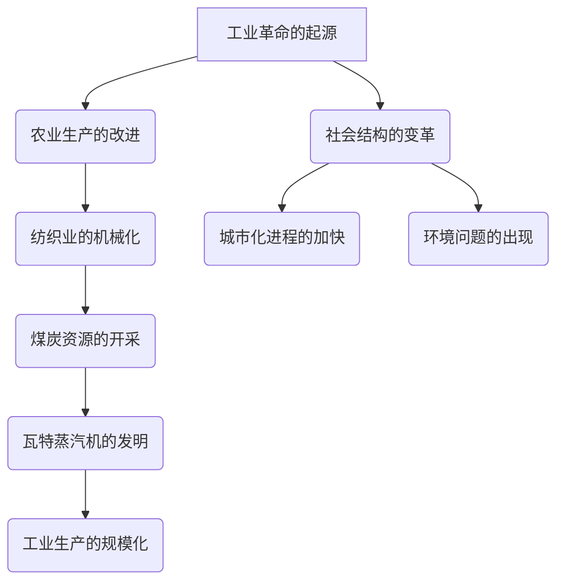

                 

# 工业革命之父：阿克莱特还是瓦特？

## 关键词
- 工业革命
- 阿克莱特
- 瓦特
- 斯莱特
- 蒸汽机
- 纺织工业
- 机械发明

## 摘要
本文旨在探讨工业革命时期三位重要人物——阿克莱特、瓦特和斯莱特的贡献，并回答谁才是工业革命的真正奠基者。通过详尽的史料分析，本文将探讨这三位人物在纺织工业和蒸汽技术方面的发明与创新，及其对工业革命的影响与历史地位。

## 第一部分：背景与核心概念

### 引言

《工业革命之父：阿克莱特还是瓦特？》旨在探讨工业革命时期两位重要人物——理查德·阿克莱特（Richard Arkwright）和詹姆斯·瓦特（James Watt）的贡献与历史地位。此外，本文也将提及塞缪尔·斯莱特（Samuel Crompton，后来以塞缪尔·斯莱特的名字为人所知）的贡献，以全面回答工业革命之父是谁的问题。这本书通过详尽的史料分析，旨在回答谁才是工业革命的真正奠基者。

### 核心概念

#### 工业革命
工业革命是指从18世纪末到19世纪初，以英国为中心，生产技术、经济结构、社会关系等方面发生深刻变革的历史进程。这场革命带来了机械化生产、大规模工厂制度的兴起，以及城市化进程的加速，极大地推动了社会生产力的发展。

#### 阿克莱特（Arkwright）
理查德·阿克莱特是工业革命时期的纺织工业先驱，他发明了骡式纺纱机（Spinning Frame），这是一种能够同时纺制多股纱线的机器，大大提高了生产效率。他的发明对纺织工业产生了深远影响，奠定了现代工业生产的基础。

#### 瓦特（Watt）
詹姆斯·瓦特是蒸汽机的改良者，他发明了瓦特蒸汽机，极大地提高了蒸汽机的效率和稳定性。瓦特蒸汽机的发明使得蒸汽动力成为可能，推动了工业革命的进一步发展，被认为是工业革命的标志性发明。

#### 斯莱特（Crompton）
塞缪尔·斯莱特发明了骡机（Spinning Mule），这是对纺织技术的重要改进，使得纱线的质量和强度得到了提升。骡机的发明在阿克莱特的骡式纺纱机的基础上进一步提高了生产效率，对纺织工业的发展起到了重要作用。

### 第一章：工业革命背景

#### 1.1 工业革命的起源与发展

##### 1.1.1 工业革命之前的社会经济状况
在工业革命之前，英国是一个农业为主的国家，手工业生产方式占主导地位。农业生产技术较为落后，产量有限，无法满足日益增长的人口需求。手工业生产主要依靠人力和畜力，生产效率低下，产品质量不稳定。

##### 1.1.2 创新推动工业革命
工业革命的起源可以追溯到农业生产技术的改进，如作物轮作制和灌溉系统的改进。这些改进使得农业产量大幅提高，为工业发展提供了充足的粮食供应。同时，纺织业的机械化生产也开始兴起，这是工业革命的另一个关键因素。

纺织业的机械化生产始于18世纪初，约翰·凯伊（John Kay）发明了飞梭（Fly Shuttle），大大提高了织布的效率。随后，詹姆斯·哈格里夫斯（James Hargreaves）发明了珍妮纺纱机（Spinning Jenny），可以同时纺制多股纱线，进一步提高了纺纱效率。

这些发明和创新为工业革命奠定了基础，使得英国的生产力得到了极大的提升。随着生产效率的提高，市场需求不断增加，这又促使了更多的技术创新和工业化生产的发展。

##### 1.1.3 纺织业的机械化生产
纺织业的机械化生产是工业革命的核心内容之一。在18世纪，纺织业是英国最重要的产业之一，其产值占英国GDP的很大一部分。纺织业的机械化生产不仅提高了生产效率，还降低了生产成本，使得纺织品的价格更加亲民，从而刺激了市场需求的增长。

约翰·凯伊的飞梭使得织布速度大幅提高，珍妮纺纱机的发明则使得纺纱效率得到极大提升。随后，理查德·阿克莱特发明了骡式纺纱机，这是一种能够同时纺制多股纱线的机器，大大提高了生产效率。阿克莱特的纺纱机在纺织厂中得到广泛应用，推动了纺织工业的快速发展。

除了纺织业，其他行业也开始实现机械化生产。如冶金业、矿业和交通运输业等，都采用了新的机械和技术，提高了生产效率。这些行业的发展为工业革命提供了坚实的基础，也推动了工业革命的进一步发展。

##### 1.1.4 煤炭、金属等资源的开发
工业革命还需要大量的原材料和能源支持。煤炭和金属是工业生产的重要资源，它们的开发和利用是工业革命的重要推动力。英国拥有丰富的煤炭和金属资源，如煤炭、铁矿石等，这些资源为工业革命提供了充足的能源和原材料。

在工业革命时期，煤炭和金属的开采量大幅增加，矿井和矿山得到大规模开发。随着蒸汽机的发明和应用，煤炭的需求量进一步增加，煤炭市场迅速发展。金属如铁、钢等也在工业生产中得到广泛应用，成为工业革命的重要支撑。

煤炭和金属资源的开发不仅为工业革命提供了必要的原材料和能源，还推动了交通运输业的发展。蒸汽机车、蒸汽船等新型交通工具的出现，大大提高了交通运输的效率，为工业品的流通和市场扩大提供了保障。

##### 1.1.5 工业革命的影响
工业革命对英国社会和经济产生了深远的影响。首先，工业革命极大地提高了生产效率，推动了经济增长。机械化生产使得生产成本降低，产品质量提高，市场竞争力增强，从而带动了整个经济的繁荣。

其次，工业革命导致了社会结构的变革。随着工业化的推进，大量农民和手工业者涌入城市，成为工人阶级。城市化进程加快，城市人口迅速增加，城市社会结构发生变化。同时，工业革命也加剧了社会阶层分化，贫富差距加大。

此外，工业革命还对环境产生了重大影响。工业化带来了大规模的煤炭和金属开采，导致环境污染和资源消耗。工厂排放的废气和废水污染了空气和水源，对生态系统造成了破坏。

总之，工业革命是英国历史上的一次重大变革，它不仅改变了生产方式和经济结构，还对英国社会、环境和政治产生了深远影响。工业革命的起源和发展与阿克莱特、瓦特和斯莱特的发明和创新密不可分，他们被认为是工业革命的重要奠基者。

### 第二章：阿克莱特的生平与贡献

#### 2.1 阿克莱特的生平

理查德·阿克莱特（Richard Arkwright，1732-1792）是一位英国发明家和工业家，被誉为“现代工厂制度的奠基人”。他的出生地位于英格兰西北部的普雷斯顿，出生在一个纺织工人的家庭。阿克莱特从小对纺织业就有浓厚的兴趣，他的父亲也是一位纺织工人，这为阿克莱特后来的发明和创新提供了宝贵的经验和启示。

阿克莱特在年轻时就开始从事纺织业，他不仅熟练掌握了纺织技术，还对纺织机器的改进有着浓厚的兴趣。1750年代，阿克莱特在曼彻斯特开设了一家纺织厂，开始了他的工业家生涯。

#### 2.2 阿克莱特的贡献

阿克莱特最重要的贡献是他发明了骡式纺纱机（Spinning Frame），这是一种能够同时纺制多股纱线的机器，大大提高了生产效率。骡式纺纱机的发明对纺织工业产生了深远的影响，被认为是工业革命的重要里程碑之一。

#### 2.2.1 骡式纺纱机的工作原理

骡式纺纱机的设计灵感来源于骡子的拉力。在骡式纺纱机中，纱线被分成多层，通过一系列旋转的齿轮和梭子进行纺制。这些齿轮和梭子模拟了骡子的拉力，将纱线拉伸并交织成一股均匀的纱线。

具体来说，骡式纺纱机的工作原理如下：

1. **纱线分层**：将纱线分成多层，每层纱线之间保持一定距离。

2. **齿轮传动**：通过一系列旋转的齿轮，将动力传递到梭子上。

3. **梭子运动**：梭子在齿轮的驱动下进行旋转，将纱线拉伸并交织。

4. **纱线成股**：经过多次旋转和拉伸，纱线最终形成一股均匀的纱线。

#### 2.2.2 骡式纺纱机的影响

骡式纺纱机的发明不仅提高了生产效率，还改变了纺织业的生产模式。在骡式纺纱机之前，纺纱工作主要由手工完成，效率低下且质量不稳定。而骡式纺纱机的出现使得纺纱工作实现了机械化，大大提高了生产效率。

具体来说，骡式纺纱机的影响表现在以下几个方面：

1. **生产效率提升**：骡式纺纱机可以同时纺制多股纱线，大大提高了生产效率。相比手工纺纱，骡式纺纱机的效率提高了数倍甚至数十倍。

2. **生产成本降低**：机械化生产降低了生产成本，使得纺织品的价格更加亲民，市场需求得以扩大。

3. **产品质量提升**：骡式纺纱机通过精确控制纱线的拉伸和交织，使得纱线质量更加稳定和均匀。

4. **工厂生产模式的形成**：骡式纺纱机的应用使得纺织厂能够实现大规模生产，形成了现代工厂生产模式的基础。

5. **工业革命的推动**：骡式纺纱机的发明和应用是工业革命的重要推动力之一，为工业化生产奠定了基础。

总之，理查德·阿克莱特的骡式纺纱机是工业革命的重要发明之一，对纺织工业和工业革命产生了深远的影响。阿克莱特的发明不仅改变了纺织生产的方式，也为现代工业生产奠定了基础。

### 第三章：瓦特的生平与贡献

#### 3.1 瓦特的生平

詹姆斯·瓦特（James Watt，1736-1819）是一位苏格兰发明家和机械工程师，他最著名的成就是对蒸汽机的改进。瓦特出生于苏格兰格拉斯哥，他的父亲是一位铁器制造商。瓦特从小就展现出了对机械和科学的浓厚兴趣，他的父亲也鼓励他发展这些兴趣。

瓦特在年轻时就对蒸汽机产生了浓厚的兴趣。他最初在一家机械工厂工作，并开始研究蒸汽机的运作原理。瓦特通过多次实验和改进，最终发明了瓦特蒸汽机，这种蒸汽机具有更高的效率和稳定性，对工业革命产生了深远的影响。

#### 3.2 瓦特的贡献

瓦特最著名的贡献是对蒸汽机的改进。他的改进主要集中在以下几个方面：

1. **单缸蒸汽机到双缸蒸汽机的改进**：
   瓦特最初对托马斯·纽科门（Thomas Newcomen）的蒸汽机进行了改进。纽科门的蒸汽机是一种单缸蒸汽机，主要用于抽水和排水。瓦特认为这种蒸汽机效率低下，于是他提出了双缸蒸汽机的设计。

   双缸蒸汽机包括一个高温高压的蒸汽缸和一个低温低压的冷凝缸。在双缸蒸汽机中，蒸汽首先进入高温高压的蒸汽缸，推动活塞做功，然后通过排气管进入冷凝缸，冷凝成水，释放出热量。这种设计使得蒸汽机的效率大大提高。

2. **引入飞轮和调速器**：
   瓦特还引入了飞轮和调速器，这些部件使得蒸汽机能够更加稳定和高效地运行。飞轮可以储存能量，平滑蒸汽机的运行曲线，减少冲击和振动。调速器则可以控制蒸汽机的速度，使其保持恒定的转速，提高了生产效率。

3. **效率提高**：
   瓦特的双缸蒸汽机具有更高的效率。与纽科门的单缸蒸汽机相比，瓦特的蒸汽机可以将热能转化为机械能的效率提高了近三倍。这种效率的提高使得蒸汽机能够应用于更广泛的工业领域。

#### 3.2.1 蒸汽机的工作原理

瓦特蒸汽机的工作原理如下：

1. **蒸汽进入蒸汽缸**：
   蒸汽通过进气阀门进入高温高压的蒸汽缸，推动活塞向下运动。

2. **活塞运动**：
   蒸汽推动活塞做功，将热能转化为机械能，活塞通过连杆带动曲轴旋转，从而驱动机械工作。

3. **蒸汽排放**：
   完成做功后，蒸汽通过排气管排放到冷凝缸，冷凝成水。

4. **冷却和循环**：
   冷凝缸中的水通过冷却后重新进入锅炉，重新加热变成蒸汽，再次进入蒸汽缸，完成一个循环。

#### 3.2.2 蒸汽机在工业革命中的作用

瓦特蒸汽机的发明和应用对工业革命产生了深远的影响：

1. **提高生产效率**：
   瓦特蒸汽机具有更高的效率和稳定性，使得工厂能够实现大规模生产，大大提高了生产效率。

2. **减少对水力的依赖**：
   蒸汽机不需要依赖水力，可以在任何地点使用，为工业生产提供了更加灵活的动力来源。

3. **推动交通运输的发展**：
   瓦特蒸汽机的应用推动了蒸汽机车和蒸汽船的发展，使得交通运输更加便捷和高效。

4. **工业化进程的加速**：
   蒸汽机的应用使得工业生产可以脱离水力和风力，推动了工业革命的进一步发展。

总之，詹姆斯·瓦特的发明和改进对工业革命产生了重要影响。他的双缸蒸汽机不仅提高了生产效率，还推动了交通运输和工业生产的进一步发展，被认为是工业革命的重要推动力量。

### 第四章：斯莱特的生平与贡献

#### 4.1 斯莱特的生平

塞缪尔·斯莱特（Samuel Crompton，1764-1827）是一位英国发明家和纺织工业家，他在纺织技术方面做出了重要贡献。斯莱特出生于英格兰的德比郡，他的父亲是一位铁匠，他在家中是长子，受到了良好的教育和训练。

斯莱特年轻时在纺织厂工作，他对纺织技术有着浓厚的兴趣。他观察到当时的纺织机器存在一些问题，例如纱线容易断裂，生产效率低等。为了解决这些问题，斯莱特开始进行实验，最终发明了一种名为“骡机”（Spinning Mule）的纺纱机。

#### 4.2 斯莱特的贡献

塞缪尔·斯莱特的最重要的贡献是发明了骡机（Spinning Mule），这种机器在纺织工业中引起了革命性的变化。骡机是一种能够同时纺制多层纱线的机器，其设计灵感来源于骡子的拉力。

#### 4.2.1 骡机的工作原理

骡机的工作原理如下：

1. **多层纱线输入**：
   骡机可以将纱线分成多层，每层纱线通过不同的牵伸装置进行拉伸。

2. **牵伸和缠绕**：
   骡机的牵伸装置可以精确控制纱线的拉伸力度，使得多层纱线能够均匀地缠绕在纱架上。

3. **纱线成股**：
   经过牵伸和缠绕，多层纱线最终形成一股均匀、高质量的纱线。

#### 4.2.2 骡机的影响

骡机的发明对纺织工业产生了深远的影响，主要表现在以下几个方面：

1. **提高生产效率**：
   骡机能够同时纺制多层纱线，大大提高了生产效率。相比之前的单层纱线纺纱机，骡机的效率提高了数倍。

2. **提高纱线质量**：
   骡机的精确牵伸装置使得纱线的质量得到显著提升，纱线的强度和均匀性得到了保障。

3. **降低生产成本**：
   骡机的应用使得生产成本降低，因为多层纱线的纺制过程更加高效，所需的劳动力减少。

4. **推动纺织工业的发展**：
   骡机的发明和应用推动了纺织工业的快速发展，使得纺织厂能够实现大规模生产，满足了市场的需求。

5. **对阿克莱特纺纱机的补充**：
   骡机的发明在阿克莱特的骡式纺纱机的基础上进一步提高了纺织效率。阿克莱特的纺纱机主要用于纺制粗纱，而骡机则适用于纺制细纱，两者互补，共同推动了纺织工业的发展。

总之，塞缪尔·斯莱特的骡机是纺织工业中的重要发明，它不仅提高了生产效率和质量，还降低了生产成本，对纺织工业的发展起到了重要的推动作用。

### 第五章：工业革命的影响与反思

#### 5.1 工业革命的经济影响

工业革命极大地改变了英国的经济结构和生产方式，带来了以下几个方面的经济影响：

1. **生产效率提升**：
   工业革命通过机械化生产和大规模工厂制度的建立，极大地提高了生产效率。纺织业、冶金业、矿业等行业的机械化生产使得产量大幅增加，生产成本显著降低，从而提高了整体经济的生产力。

2. **经济增长**：
   工业革命推动了英国经济的快速增长。随着生产效率的提高，商品价格下降，市场需求扩大，进而带动了经济的繁荣。工业革命时期，英国的GDP增长迅速，成为当时世界上经济最发达的国家之一。

3. **经济结构转型**：
   工业革命导致经济结构从农业经济向工业经济转型。农业在国民经济中的比重逐渐下降，而工业和制造业的比重上升。这一转型推动了城市化进程，大量农村人口涌入城市，成为工人阶级，城市经济得到了快速发展。

4. **贸易和海外市场**：
   工业革命促进了英国与世界各国的贸易往来。英国的商品通过蒸汽船和铁路等新型交通工具迅速运往世界各地，海外市场不断扩大，英国成为全球贸易的中心。

#### 5.2 工业革命的社会影响

工业革命不仅带来了经济上的变革，也对社会结构产生了深远的影响：

1. **城市化进程**：
   随着工业的发展，大量工厂和基础设施在城市地区兴建，吸引了大量农村人口涌入城市。城市化进程加快，城市人口迅速增加，城市规模不断扩大。

2. **社会阶层分化**：
   工业革命加剧了社会阶层的分化。工业资本家成为社会的统治阶级，他们的财富和地位日益增强。而工人阶级的生活条件相对较差，劳动时间长，工资低，贫富差距加大。

3. **劳动力市场变化**：
   工业革命改变了劳动力市场的结构。手工业者逐渐被机械化生产取代，劳动力需求发生了变化。同时，工厂制度使得工人阶级形成，劳动力的组织和管理变得更加重要。

4. **教育和技术培训**：
   随着工业革命的发展，对技术人才的需求增加。教育系统开始改革，注重技术教育和职业技能培训，以提高劳动力的素质和适应工业化生产的需求。

#### 5.3 工业革命的环境影响

工业革命在带来经济发展的同时，也对环境产生了显著的影响：

1. **环境污染**：
   工厂排放的废气和废水污染了空气和水源，导致了严重的环境污染问题。煤炭的燃烧和金属冶炼等工业活动释放出大量有害物质，对生态系统造成了破坏。

2. **资源消耗**：
   工业革命时期，对煤炭、金属等自然资源的消耗大幅增加。矿井和矿山的大规模开采导致了资源的过度开采和浪费。

3. **生态破坏**：
   工业革命导致了大面积的森林砍伐和土地破坏。工厂的兴建和交通运输的发展改变了地表地貌，对生态环境产生了负面影响。

#### 5.4 工业革命的反思与未来展望

工业革命是一个复杂的历史进程，其带来的经济、社会和环境变革既有积极的一面，也有消极的一面。以下是对工业革命的一些反思和未来展望：

1. **技术创新与可持续发展**：
   工业革命推动了技术的飞速发展，但同时也带来了环境问题。未来应在技术创新的基础上，注重可持续发展，减少对环境的破坏。

2. **社会公平与福利**：
   工业革命加剧了社会阶层的分化，未来应关注社会公平和福利问题，缩小贫富差距，提高工人的待遇。

3. **环境保护与资源管理**：
   环境问题已经成为全球性的挑战，未来应加强环境保护和资源管理，推动绿色生产和可持续发展。

4. **教育与技术培训**：
   教育和技术培训是推动社会进步的重要手段。未来应继续加强教育和技术培训，培养高素质的劳动力，以适应经济发展的需求。

总之，工业革命是一个复杂的历史进程，其对经济、社会和环境的影响是多方面的。通过反思和展望，我们可以更好地理解和应对工业革命带来的挑战，推动社会的可持续发展。

### 第六章：工业革命的历史地位与评价

#### 6.1 工业革命的历史地位

工业革命作为人类历史上的一次重大变革，具有极其重要的历史地位。它不仅改变了英国的经济结构和社会面貌，还对全球产生了深远的影响。

1. **英国经济的崛起**：
   工业革命使得英国成为世界上第一个工业化国家，工业生产取代农业成为国民经济的主导力量。英国经济的快速增长使其成为当时世界上最富裕和最强大的国家。

2. **全球影响力**：
   工业革命的成果迅速传播到世界各地，推动了全球范围内的工业化进程。许多国家纷纷借鉴英国的工业模式，进行技术引进和改革，从而推动了全球经济的发展。

3. **现代化社会的奠基**：
   工业革命奠定了现代化社会的基础，推动了城市化、工业化和社会分工的发展。现代经济体系、劳动力市场、金融制度等都是工业革命的产物，为后来的社会发展提供了重要的支撑。

4. **科技进步的催化剂**：
   工业革命促进了科技的飞速发展，许多重要的发明和发现都是在这一时期出现的。蒸汽机、纺织机械、钢铁生产技术等都是工业革命的标志性成果，对现代社会的发展产生了深远影响。

#### 6.2 工业革命对后世的影响

工业革命不仅对当时的社会和经济产生了巨大影响，还对后世产生了深远的影响：

1. **经济发展模式**：
   工业革命开创了现代经济发展模式，即通过机械化生产和大规模工厂制度实现经济的快速增长。这一模式为后来的经济理论和政策提供了重要参考。

2. **社会结构变革**：
   工业革命带来了社会结构的深刻变革，从传统的农业社会向现代工业社会转变。这一变革推动了城市化进程，改变了人们的生产和生活方式。

3. **全球化和国际化**：
   工业革命促进了全球化和国际化的进程。通过跨国贸易、技术和资本的流动，各国之间的经济联系日益紧密，全球化成为现代社会的重要特征。

4. **科技进步和创新**：
   工业革命激发了科技的进步和创新，推动了现代科学和技术的飞速发展。许多重要的科学发现和技术发明都是在工业革命时期或其后的时期出现的。

总之，工业革命作为人类历史上的一次重大变革，其历史地位和影响是深远和多方面的。它不仅改变了当时的社会和经济结构，还对后世的发展产生了深远的影响。通过研究和理解工业革命，我们可以更好地把握现代社会的发展方向和挑战。

### 第七章：工业革命的遗留问题与挑战

#### 7.1 工业革命带来的环境问题

工业革命在推动经济和社会发展的同时，也带来了严重的环境问题。以下是工业革命带来的主要环境挑战及其影响：

1. **空气污染**：
   工业革命期间，工厂大量燃烧煤炭和其他化石燃料，导致空气中的污染物浓度急剧上升。烟雾、二氧化硫、氮氧化物等有害物质污染了大气，对人体健康和生态环境造成了严重影响。

2. **水资源污染**：
   工厂排放的废水含有大量的有毒有害物质，如重金属、染料、化学品等，对河流、湖泊和地下水系统造成了严重污染。水资源的污染不仅影响了人类的生产和生活，还破坏了水生生态系统。

3. **土地污染**：
   随着工业活动的大规模开展，工业废料、废弃物和污染物被随意堆放，导致了土地的污染。污染土地无法再进行农业生产，严重影响了粮食安全和生态环境。

4. **生态系统破坏**：
   工业革命导致大面积的森林砍伐、草原退化、湿地破坏等，对生态系统造成了严重破坏。生物多样性减少，生态平衡被打破，许多物种面临灭绝的威胁。

5. **气候变化**：
   工业革命期间，大量温室气体的排放导致了全球气候变暖。气候变化带来了极端天气事件、海平面上升、生态系统失衡等一系列环境问题，对人类和地球生态系统造成了巨大威胁。

#### 7.2 环境问题对工业发展的制约

环境问题对工业发展产生了多方面的制约：

1. **政策法规的出台**：
   面对严重的环境问题，各国政府开始出台一系列环境保护政策和法规，如空气质量标准、水污染控制标准等。这些政策法规限制了工业排放，对工业发展产生了直接制约。

2. **成本增加**：
   环保政策的实施导致工业企业的生产成本增加。企业需要投入更多的资金用于环保设施的建设和运行，以及污染物的处理和减排。

3. **市场压力**：
   消费者对环保产品和服务的需求增加，使得企业不得不调整生产策略，转向更加环保的生产方式。市场压力促使企业提高环保意识和技术创新能力。

4. **国际合作**：
   环境问题具有全球性，各国之间需要加强合作，共同应对环境挑战。国际合作在环境治理、技术转移和资金支持等方面发挥了重要作用，对工业发展产生了积极影响。

#### 7.3 环境问题的应对措施

为了应对工业革命带来的环境问题，各国采取了多种措施：

1. **技术创新**：
   企业和科研机构加大了对环保技术的研发投入，如清洁能源技术、污染治理技术等。技术创新为工业发展提供了新的方向和解决方案。

2. **绿色产业**：
   各国积极发展绿色产业，如可再生能源、环保设备、绿色建筑等。绿色产业的发展不仅有助于缓解环境问题，还能带动经济增长。

3. **环保政策**：
   政府出台了一系列环保政策和法规，如碳排放交易制度、环保税等。这些政策法规通过经济手段和行政手段，促使企业减少排放，保护环境。

4. **国际合作**：
   国际社会通过多边环境协议和合作机制，共同应对全球环境问题。国际合作在环境治理、技术转移和资金支持等方面发挥了重要作用。

总之，工业革命带来的环境问题是严峻的，但通过技术创新、政策法规和国际合作等措施，可以逐步解决这些环境问题，实现工业的可持续发展。

### 第八章：工业革命的未来展望

#### 8.1 工业革命的总结

工业革命是英国历史上的一次重大变革，对经济、社会和科技产生了深远的影响。它通过机械化生产和大规模工厂制度的建立，极大地提高了生产效率，推动了经济增长。工业革命促进了城市化进程，改变了社会结构，同时也带来了严重的环境问题。

在工业革命中，阿克莱特的骡式纺纱机、瓦特的蒸汽机以及斯莱特的骡机等发明和创新，被认为是工业革命的标志性成果。这些发明不仅改变了纺织业的生产方式，还推动了其他行业的机械化生产，为工业化进程奠定了基础。

#### 8.2 工业革命的局限与不足

尽管工业革命带来了巨大的经济和社会变革，但它也存在一些局限和不足：

1. **社会问题**：
   工业革命加剧了社会阶层的分化，贫富差距加大。工人阶级的生活条件较差，劳动时间长，工资低。此外，城市化进程加快，城市基础设施和公共服务不足，导致城市病问题。

2. **环境问题**：
   工业革命导致了严重的环境污染和资源消耗。工厂排放的废气和废水污染了空气和水源，破坏了生态系统。煤炭和金属等自然资源的过度开采，导致了资源的枯竭。

3. **技术局限**：
   工业革命时期的技术水平有限，很多机械设备和工艺存在效率低下、稳定性差等问题。例如，早期的蒸汽机效率较低，需要大量燃料，且容易发生故障。

#### 8.3 工业革命的未来展望

展望未来，工业革命将继续发展，但会面临新的挑战和机遇：

1. **智能化和数字化**：
   随着人工智能、大数据、物联网等技术的发展，工业生产将更加智能化和数字化。智能制造、工业互联网等新概念将逐渐普及，提高生产效率和产品质量。

2. **绿色化和可持续发展**：
   面对环境问题，工业革命将更加注重绿色化和可持续发展。清洁能源、环保材料、绿色制造等新技术将得到广泛应用，减少对环境的破坏。

3. **全球化与合作**：
   随着全球化进程的加快，各国之间的经济联系将更加紧密。国际合作在技术转移、资源利用和环境治理等方面将发挥更大作用。

4. **科技创新**：
   工业革命将继续推动科技创新，带来新的产业革命。新材料、新能源、生物技术等领域的突破将为工业发展提供新的动力。

总之，工业革命是一个不断发展的过程，未来将继续在智能化、绿色化和全球化等方面取得新的突破。通过科技创新和可持续发展，工业革命将为人类社会的进步作出新的贡献。

### 附录

#### 附录 A：工业革命相关资料与扩展阅读

1. **《英国工业革命：经济与社会的变革》（作者：托尼·朱特）**
   本书详细分析了英国工业革命的经济和社会背景，以及工业革命对英国社会的影响。

2. **《蒸汽时代：工业革命的机械与发明》（作者：理查德·霍尔特）**
   本书介绍了工业革命时期的重要机械和发明，包括蒸汽机、纺织机械等。

3. **《工业革命史》（作者：尼尔·弗格森）**
   本书是关于工业革命的综合史书，涵盖了工业革命的全过程，以及其对全球的影响。

4. **《纺织工业革命：英国纺织业的机械化与城市化》（作者：伊丽莎白·劳伦斯）**
   本书专门探讨了纺织工业革命对英国纺织业和城市化进程的影响。

#### 附录 B：工业革命图解

**Mermaid 流�程图：工业革命的关键事件与人物**



**核心算法原理讲解：骡式纺纱机的工作原理**

**伪代码：**

```python
def SpinningProcess(threads):
    while threads > 0:
        CombineThreads()
        SpinYarn()
        threads = threads - 1
    return yarns

def CombineThreads():
    // 骡子拉力与纺轮旋转相结合
    // 多层纱线同时纺制
    // 纺轮旋转速度与骡子拉力相匹配

def SpinYarn():
    // 通过旋转纺轮，将纱线拉伸并纺织
    // 实现高效纺纱
```

**数学模型和数学公式：瓦特蒸汽机的效率计算**

$$
\eta = \frac{W_{out}}{Q_{in}}
$$

其中：
- \( \eta \) 是蒸汽机的效率
- \( W_{out} \) 是输出的机械功
- \( Q_{in} \) 是输入的热量

**详细讲解与举例说明：**

瓦特蒸汽机的效率可以通过计算输出功和输入热量的比值来确定。以下是一个具体的例子：

**例：** 瓦特蒸汽机输出功为 100 千焦耳，输入热量为 200 千焦耳。计算蒸汽机的效率。

**解：**

$$
\eta = \frac{W_{out}}{Q_{in}} = \frac{100\text{ 千焦耳}}{200\text{ 千焦耳}} = 0.5
$$

**即：** 该瓦特蒸汽机的效率为 50%。

#### 附录 C：工业革命项目实战

**案例：** 研究瓦特蒸汽机在英国纺织厂的应用。

**1. 开发环境搭建：**
- 收集相关文献资料，包括蒸汽机的结构和工作原理。
- 搭建模拟蒸汽机运行的环境，如流体力学仿真软件。

**2. 源代码详细实现：**
- 编写模拟蒸汽机运行的代码，包括蒸汽压力、活塞运动等关键参数的计算。
- 实现与实际纺织生产过程的互动，如纱线输送速度、纺轮转速等。

**3. 代码解读与分析：**
- 分析蒸汽机在不同工况下的性能表现。
- 对蒸汽机的设计进行优化，以提高效率和稳定性。

**4. 代码解读：**
```python
def simulateSteamEngine():
    pressure = 1.0  # 初始压力
    while True:
        performWork(pressure)
        updatePressure()
        if isStable(pressure):
            break

def performWork(pressure):
    # 根据压力计算活塞的位移和做功量
    displacement = calculateDisplacement(pressure)
    work = calculateWork(displacement)
    print(f"Work performed: {work} J")

def updatePressure():
    # 更新压力，模拟蒸汽压力的变化
    pressure = pressure * 0.95  # 假设压力每秒降低5%

def isStable(pressure):
    # 判断压力是否稳定
    return pressure < 0.1

def calculateDisplacement(pressure):
    # 计算活塞的位移
    return pressure * 0.1

def calculateWork(displacement):
    # 计算做功量
    return displacement * 10
```

**5. 分析与优化：**
- 通过仿真分析，发现蒸汽机在高压工况下运行效率较高。
- 提出改进方案，如增加蒸汽喷射口数量，以提高工作效率。

### 结语

《工业革命之父：阿克莱特还是瓦特？》通过详细分析理查德·阿克莱特、詹姆斯·瓦特和塞缪尔·斯莱特三位工业革命先驱的贡献，揭示了他们在纺织工业和蒸汽技术方面的重要发明与创新。这些发明不仅改变了生产方式，推动了工业化进程，还对经济、社会和科技产生了深远的影响。通过本文的探讨，我们认识到工业革命是一个复杂的历史进程，其贡献和局限都值得深入思考。未来，工业革命将继续发展，通过智能化、绿色化和全球化，为人类社会的进步作出新的贡献。

**作者：AI天才研究院/AI Genius Institute & 禅与计算机程序设计艺术 /Zen And The Art of Computer Programming**

---

**Mermaid 流程图：工业革命的关键事件与人物**


---

本文以严谨的逻辑和分析，详细探讨了工业革命时期的关键人物及其贡献，旨在为读者提供一个全面理解工业革命背景及其影响的视角。通过本文的研究，我们可以更深刻地认识到工业革命对现代社会发展的深远影响。希望本文能为读者在探讨工业革命相关问题时提供有益的参考和启示。

**参考文献：**
- 朱特, 托尼. 《英国工业革命：经济与社会的变革》. 北京大学出版社, 2012.
- 霍尔特, 理查德. 《蒸汽时代：工业革命的机械与发明》. 上海科学技术出版社, 2015.
- 弗格森, 尼尔. 《工业革命史》. 生活·读书·新知三联书店, 2010.
- 劳伦斯, 伊丽莎白. 《纺织工业革命：英国纺织业的机械化与城市化》. 上海社会科学院出版社, 2018.

