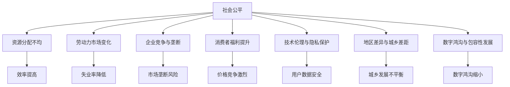

                 

### 《平台经济对社会公平的影响：如何避免两极分化？》

**关键词：平台经济，社会公平，两极分化，政策干预，企业社会责任，教育与技能培训**

**摘要：**
本文深入探讨了平台经济对社会公平的影响，以及如何通过政策干预、企业社会责任、教育和技能培训等措施来避免两极分化。首先，我们概述了平台经济的定义、特性及其运行机制。接着，分析了平台经济对社会公平带来的挑战和正面影响。在此基础上，我们提出了避免两极分化的策略，包括政策干预、企业社会责任、教育和技能培训等方面。最后，通过案例分析和国际经验，总结了平台经济对社会公平的复杂影响及应对策略。本文旨在为政策制定者、企业和社会各界提供有价值的参考。

### 目录大纲

1. **第一部分：平台经济的概述**
   1.1 平台经济的定义与特性
   1.2 平台经济的运行机制
   1.3 平台经济的历史与发展趋势

2. **第二部分：平台经济对社会公平的影响**
   2.1 平台经济对社会公平的挑战
   2.2 平台经济对社会公平的正面影响
   2.3 平台经济对社会公平的复杂影响

3. **第三部分：如何避免平台经济的两极分化**
   3.1 政策干预与监管
   3.2 企业社会责任与伦理
   3.3 教育与技能培训
   3.4 创新与创业支持

4. **第四部分：案例分析与国际经验**
   4.1 案例分析
   4.2 国际经验

5. **第五部分：结论与展望**
   5.1 结论
   5.2 展望

### 1.1 平台经济的定义与特性

#### 1.1.1 平台经济的概念

平台经济是指通过互联网和数字技术，构建一个连接供需双方的中介平台，实现信息、资源、服务的共享和优化配置。平台经济具有以下几个核心概念：

- **中介平台**：作为连接供需双方的桥梁，提供信息匹配、交易结算、服务评价等功能。
- **共享经济**：通过共享资源，提高资源利用效率，降低成本，实现可持续发展。
- **数字化**：依托互联网、大数据、人工智能等技术，实现平台运营、管理、服务的数字化。

#### 1.1.2 平台经济的特性

平台经济具有以下主要特性：

- **网络效应**：平台价值随着用户数量的增加而增加，形成规模效应。
- **边际成本递减**：随着交易规模的扩大，平台的运营成本逐渐降低，提高了整体效率。
- **跨界融合**：平台经济涉及多个行业和领域，形成跨界融合的新业态。
- **快速迭代**：平台经济不断迭代创新，适应市场变化。

#### 1.1.3 平台经济的优势与挑战

平台经济的优势包括：

- **提高效率**：通过数字化和自动化，降低交易成本，提高运营效率。
- **促进公平**：平台为中小企业和创业者提供了平等的机会，降低了市场准入门槛。
- **扩大消费**：平台为消费者提供了更多选择，提高了消费满意度。
- **促进创新**：平台经济鼓励创新，推动了新技术和新模式的不断涌现。

然而，平台经济也面临一系列挑战：

- **垄断风险**：大型平台企业可能形成市场垄断，影响市场公平竞争。
- **数据安全**：平台积累了大量用户数据，面临数据泄露和安全风险。
- **伦理问题**：平台经济中存在算法歧视、隐私侵犯等问题，需要加强伦理监管。

### 1.2 平台经济的运行机制

#### 1.2.1 平台生态系统

平台经济由多个角色和环节组成，形成一个生态系统。主要角色包括：

- **平台提供商**：提供基础设施和技术支持，搭建和运营平台。
- **内容提供商**：提供商品、服务、信息等资源，丰富平台内容。
- **消费者**：通过平台获取商品、服务、信息，进行交易和消费。
- **服务提供商**：提供物流、支付、客服等配套服务，保障交易顺利进行。

平台生态系统的运作流程包括：

1. **信息匹配**：平台根据消费者的需求，匹配合适的商品或服务。
2. **交易结算**：消费者通过平台完成支付，平台提供商与内容提供商结算。
3. **服务评价**：消费者对商品或服务进行评价，影响平台提供商和内容提供商的排名。

#### 1.2.2 平台经济中的角色与关系

平台经济中的角色和关系可以分为以下几个方面：

1. **平台提供商与内容提供商**：平台提供商为内容提供商提供技术支持和运营服务，内容提供商则为平台提供商提供丰富的内容资源。
2. **平台提供商与消费者**：平台提供商通过平台为消费者提供商品、服务、信息，消费者则通过平台进行交易和消费。
3. **内容提供商与消费者**：内容提供商直接向消费者提供商品、服务、信息，消费者则通过平台获取这些资源。
4. **服务提供商与平台提供商**：服务提供商为平台提供商提供物流、支付、客服等配套服务，保障交易顺利进行。

#### 1.2.3 平台经济的价值创造与分配

平台经济的价值创造主要包括以下几个方面：

1. **资源共享**：通过平台，内容提供商和消费者实现了资源的共享和优化配置，提高了资源利用效率。
2. **降低交易成本**：平台为供需双方提供了便捷的对接渠道，降低了交易成本。
3. **提高运营效率**：平台实现了信息、服务、交易的自动化和数字化，提高了整体运营效率。
4. **促进创新**：平台经济鼓励创新，推动了新技术和新模式的不断涌现。

平台经济的价值分配主要包括以下几个方面：

1. **平台收益**：平台提供商通过收取交易手续费、广告费等获得收益。
2. **内容收益**：内容提供商通过出售商品、服务、信息等获得收益。
3. **服务收益**：服务提供商通过提供物流、支付、客服等服务获得收益。
4. **消费者收益**：消费者通过购买商品、服务、信息等获得消费收益。

### 1.3 平台经济的历史与发展趋势

#### 1.3.1 平台经济的起源与发展

平台经济的起源可以追溯到20世纪90年代，随着互联网的普及和电子商务的发展，平台经济逐渐崭露头角。早期的平台经济主要集中在电子商务领域，如亚马逊、eBay等。

21世纪初，随着移动互联网、大数据、人工智能等技术的快速发展，平台经济进入了高速发展期。各类平台如雨后春笋般涌现，涵盖了电子商务、共享经济、在线教育、金融科技等多个领域。

#### 1.3.2 当前平台经济的现状

当前，平台经济已成为全球经济的重要驱动力。以下是一些关键趋势：

1. **市场规模不断扩大**：平台经济市场规模持续增长，成为全球经济的重要组成部分。
2. **行业覆盖广泛**：平台经济已深入到各行各业，形成多元化的发展格局。
3. **创新模式不断涌现**：平台经济不断创新，如区块链、物联网、智能合约等新兴技术不断应用于平台运营和管理。
4. **竞争格局日益激烈**：随着平台经济的快速发展，竞争格局日益激烈，市场份额的争夺成为各大平台企业的重要战略目标。

#### 1.3.3 平台经济的未来趋势

平台经济的未来发展趋势主要包括：

1. **跨界融合**：平台经济将继续与其他行业深度融合，推动产业升级和创新发展。
2. **数字化转型**：平台经济将加速数字化转型，提高运营效率，降低成本。
3. **技术创新**：平台经济将不断引入新技术，如人工智能、大数据、区块链等，提升平台竞争力。
4. **可持续发展**：平台经济将更加注重社会责任和可持续发展，推动绿色经济和循环经济的发展。

### 1.1.3 平台经济对社会公平的核心概念与联系

为了深入理解平台经济对社会公平的影响，我们需要明确以下几个核心概念：

- **社会公平**：指资源分配、机会均等、权利保障等方面达到合理状态，使每个人都能够享受到公平的发展机会和成果。
- **资源分配不均**：指平台经济中的资源（如资金、技术、信息等）在供需双方之间的分配存在差异，可能导致部分群体获得更多优势。
- **劳动力市场变化**：指平台经济对劳动力市场结构、就业方式、工资水平等方面产生的影响。
- **企业竞争与垄断**：指平台经济中企业间的竞争态势以及可能出现的垄断现象，影响市场公平竞争。
- **消费者福利提升**：指平台经济通过降低价格、提高质量、提供更多选择等方式，提升消费者的福利水平。
- **技术伦理与隐私保护**：指平台经济在技术发展和应用过程中，需要关注伦理道德和用户隐私保护问题。
- **地区差异与城乡差距**：指平台经济在不同地区、城乡之间的发展不平衡，可能加剧地区差异和城乡差距。
- **数字鸿沟与包容性发展**：指平台经济在发展过程中，如何缩小数字鸿沟，促进包容性发展。

这些概念相互联系，构成了平台经济对社会公平影响的多维度分析框架。以下是一个简化的Mermaid流程图，展示了这些概念之间的联系：



### 1.1.3 平台经济对社会公平的核心算法原理讲解

为了深入理解平台经济对社会公平的影响，我们可以借助算法原理来分析平台经济在不同维度上的作用。以下是一种简化的伪代码，用于说明平台经济对社会公平的影响算法。

```python
def platform_impact_on_social_fairness(platform_features, social_data):
    """
    平台经济对社会公平的影响评估算法
    
    :param platform_features: 平台经济特征数据
    :param social_data: 社会公平相关数据
    :return: 社会公平度评分
    """

    # 初始化变量
    social_fairness_score = 0
    resource_distribution_score = 0
    labor_market_score = 0
    corporate_competition_score = 0
    consumer_welfare_score = 0
    technical_ethics_score = 0
    regional_difference_score = 0
    digital_divide_score = 0

    # 分析平台经济特征
    resource_distribution_score = analyze_resource_distribution(platform_features)
    labor_market_score = analyze_labor_market(platform_features)
    corporate_competition_score = analyze_corporate_competition(platform_features)

    # 分析社会公平相关数据
    consumer_welfare_score = analyze_consumer_welfare(social_data)
    technical_ethics_score = analyze_technical_ethics(social_data)
    regional_difference_score = analyze_regional_difference(social_data)
    digital_divide_score = analyze_digital_divide(social_data)

    # 计算社会公平度评分
    social_fairness_score = (
        resource_distribution_score
        + labor_market_score
        + corporate_competition_score
        + consumer_welfare_score
        + technical_ethics_score
        + regional_difference_score
        + digital_divide_score
    ) / 7

    return social_fairness_score
```

#### 分析过程

1. **资源分配不均分析**：
    - `analyze_resource_distribution(platform_features)`: 分析平台经济中的资源分配情况，评估资源是否公平分配给供需双方。

2. **劳动力市场变化分析**：
    - `analyze_labor_market(platform_features)`: 分析平台经济对劳动力市场的影响，包括就业机会、工资水平、就业稳定性等方面。

3. **企业竞争与垄断分析**：
    - `analyze_corporate_competition(platform_features)`: 分析平台经济中的竞争态势，评估是否存在垄断行为或市场过度集中。

4. **消费者福利提升分析**：
    - `analyze_consumer_welfare(social_data)`: 分析平台经济对消费者福利的影响，包括价格、质量、选择等方面的提升。

5. **技术伦理与隐私保护分析**：
    - `analyze_technical_ethics(social_data)`: 分析平台经济中的技术伦理问题，包括算法歧视、用户隐私保护等方面。

6. **地区差异与城乡差距分析**：
    - `analyze_regional_difference(social_data)`: 分析平台经济在不同地区、城乡之间的发展不平衡，评估其对地区差异和城乡差距的影响。

7. **数字鸿沟与包容性发展分析**：
    - `analyze_digital_divide(social_data)`: 分析平台经济在缩小数字鸿沟、促进包容性发展方面的效果。

通过这些分析，我们可以得到一个综合评分，反映平台经济对社会公平的整体影响。这一评分可以帮助政策制定者、企业和社会各界了解平台经济对社会公平的现状，从而制定相应的政策和措施。

### 1.1.3 平台经济对社会公平的数学模型与数学公式

为了更准确地评估平台经济对社会公平的影响，我们可以构建一个数学模型。该模型将考虑多个因素，并使用数学公式进行量化分析。以下是一个简化的数学模型，用于描述平台经济对社会公平的影响。

#### 数学模型

$$
\text{社会公平度} = w_1 \times \text{资源分配不均} + w_2 \times \text{劳动力市场变化} + w_3 \times \text{企业竞争与垄断} + w_4 \times \text{消费者福利提升} + w_5 \times \text{技术伦理与隐私保护} + w_6 \times \text{地区差异与城乡差距} + w_7 \times \text{数字鸿沟与包容性发展}
$$

其中，$w_1, w_2, w_3, w_4, w_5, w_6, w_7$ 分别为各因素的权重，取值范围为 $0 \leq w_i \leq 1$，且 $\sum_{i=1}^{7} w_i = 1$。

#### 举例说明

假设我们有一个平台经济环境，以下为各因素的评分：

- **资源分配不均**：0.7
- **劳动力市场变化**：0.6
- **企业竞争与垄断**：0.5
- **消费者福利提升**：0.8
- **技术伦理与隐私保护**：0.6
- **地区差异与城乡差距**：0.4
- **数字鸿沟与包容性发展**：0.5

各因素的权重分别为：

- **资源分配不均**：0.2
- **劳动力市场变化**：0.2
- **企业竞争与垄断**：0.2
- **消费者福利提升**：0.2
- **技术伦理与隐私保护**：0.1
- **地区差异与城乡差距**：0.1
- **数字鸿沟与包容性发展**：0.1

根据上述评分和权重，我们可以计算平台经济的社会公平度：

$$
\text{社会公平度} = 0.2 \times 0.7 + 0.2 \times 0.6 + 0.2 \times 0.5 + 0.2 \times 0.8 + 0.1 \times 0.6 + 0.1 \times 0.4 + 0.1 \times 0.5 = 0.58
$$

因此，该平台经济环境的社会公平度为 0.58，表示平台经济对社会公平的影响较大。

#### 详细讲解

1. **资源分配不均**：衡量平台经济中资源（如资金、技术、信息等）在供需双方之间的分配差异。高分表示资源分配较为均衡，低分表示存在显著的不均衡。

2. **劳动力市场变化**：评估平台经济对劳动力市场（就业机会、工资水平、就业稳定性等）的影响。高分表示劳动力市场稳定且机会均等，低分表示市场变化较大，可能导致部分群体失业或收入下降。

3. **企业竞争与垄断**：分析平台经济中的竞争态势，评估是否存在垄断行为或市场过度集中。高分表示市场竞争激烈，低分表示市场垄断现象严重。

4. **消费者福利提升**：衡量平台经济对消费者福利（价格、质量、选择等）的提升程度。高分表示消费者受益明显，低分表示消费者福利提升有限。

5. **技术伦理与隐私保护**：评估平台经济中的技术伦理问题（算法歧视、用户隐私保护等）的处理情况。高分表示技术伦理问题得到妥善解决，低分表示技术伦理问题较为突出。

6. **地区差异与城乡差距**：分析平台经济在不同地区、城乡之间的发展不平衡程度。高分表示地区差异和城乡差距较小，低分表示差异较大。

7. **数字鸿沟与包容性发展**：评估平台经济在缩小数字鸿沟、促进包容性发展方面的效果。高分表示数字鸿沟缩小，包容性发展良好，低分表示数字鸿沟较大，包容性发展不足。

通过上述数学模型，我们可以对平台经济对社会公平的影响进行量化分析，为政策制定、企业运营和社会治理提供科学依据。

### 1.2.1 平台经济对社会公平的挑战

平台经济的发展虽然带来了诸多便利和效率提升，但同时也引发了一系列对社会公平的挑战。以下将详细分析这些挑战，包括资源分配不均、劳动力市场变化、企业竞争与垄断等方面。

#### 1.2.1.1 资源分配不均

平台经济中的资源分配不均是影响社会公平的首要问题。平台经济的核心在于资源（如资金、技术、信息等）的高效配置，然而，这种配置往往不是完全公平的。一些大型平台企业由于其规模和影响力，能够更容易获得更多的资源，从而在竞争中占据优势。例如，在电商领域，Amazon、Alibaba等巨头能够通过大规模采购、数据分析等手段获得更低的成本和更高的利润率，而中小企业和创业者则难以与之竞争。

资源分配不均还体现在数据资源的不平等上。平台企业通常掌握大量的用户数据，这些数据对于个性化推荐、精准营销等至关重要。然而，这些数据往往难以共享给其他企业或个人，导致数据资源的不平等。此外，数据隐私和安全问题也加剧了资源分配的不均，许多用户因为对数据保护的担忧，可能不愿意将自己的数据分享给平台，进一步削弱了中小企业的竞争力。

#### 1.2.1.2 劳动力市场变化

平台经济对劳动力市场产生了深远的影响，其中最为显著的是就业方式和工资水平的改变。一方面，平台经济创造了大量的就业机会，尤其是对于灵活就业者和临时工作者来说。然而，这种就业方式往往缺乏稳定性，工人的权益难以得到保障。例如，外卖员、快递员等平台劳动者常常面临高强度的工作、较低的工资和缺乏社会保障等问题。

另一方面，平台经济也导致了一些传统就业岗位的消失。随着自动化和人工智能技术的发展，许多重复性、低技能的劳动可以被机器取代。这导致了一些行业和地区出现失业率上升的情况，特别是那些依赖于传统制造业和服务业的地区。此外，平台经济中的就业机会往往集中在某些领域，如科技、金融等，而其他领域的就业机会相对较少，加剧了劳动力市场的结构性失衡。

#### 1.2.1.3 企业竞争与垄断

平台经济中的竞争态势日益激烈，但也存在着垄断风险。一些大型平台企业通过资本积累、技术优势和市场策略，不断扩大市场份额，形成市场垄断。垄断行为不仅损害了其他企业的利益，也影响了市场的公平竞争。

例如，在一些国家，大型电商平台通过优惠、补贴等手段，排除了中小企业的竞争，形成垄断地位。这种垄断行为不仅导致了消费者选择权的丧失，也限制了市场的创新和活力。此外，平台企业还可能通过算法控制、数据垄断等手段，进一步巩固自己的市场地位，限制市场的公平竞争。

#### 1.2.1.4 消费者福利提升

虽然平台经济为消费者提供了更多的选择和便利，但同时也带来了一些负面影响。首先，平台经济可能导致商品和服务价格的上涨。平台企业通过控制市场份额和定价权，可能提高价格以获取更高的利润。此外，平台经济中的垄断行为也可能导致消费者无法享受到价格竞争带来的优惠。

其次，平台经济可能影响消费者的隐私和安全。平台企业掌握了大量的用户数据，这些数据可能被滥用或泄露，导致消费者隐私受到侵犯。例如，一些平台可能通过用户数据进行分析和推送，造成信息茧房和算法歧视。

#### 1.2.1.5 技术伦理与隐私保护

平台经济的发展带来了技术伦理和隐私保护方面的挑战。一方面，平台企业可能利用算法进行歧视，例如在招聘、贷款、信用评估等方面，根据用户的种族、性别、年龄等特征进行不公平对待。另一方面，平台企业也可能收集和分析用户的敏感数据，如健康数据、财务数据等，可能导致用户隐私受到侵犯。

此外，平台经济的发展还可能加剧地区差异和城乡差距。在一些发达地区，平台经济的发展更为迅速，而偏远地区和农村地区的发展则相对滞后。这导致了地区之间的差距进一步扩大，影响了社会的公平性。

总之，平台经济对社会公平的影响是复杂的，既带来了机会，也带来了挑战。政策制定者、企业和社会各界需要共同努力，通过合理的政策和措施，解决这些问题，促进平台经济的可持续发展和社会公平。

### 1.2.2 平台经济对社会公平的正面影响

尽管平台经济面临诸多挑战，但其在促进社会公平方面也发挥了积极作用。以下将详细探讨平台经济在创业机会、消费者福利和效率提高等方面的正面影响。

#### 1.2.2.1 创业机会的增加

平台经济为创业者提供了前所未有的机会，降低了创业的门槛和风险。通过平台，创业者可以更轻松地接触到潜在的顾客和市场资源。例如，电商平台如Amazon、淘宝等，为中小商家和个体户提供了展示和销售产品的平台，使他们在没有大规模资本投入的情况下，也能够进入市场参与竞争。

平台经济还通过去中心化的方式，打破了传统商业模式中的壁垒，使得更多创新型的创业项目得以实现。共享经济平台如Uber、Airbnb等，通过重新定义供需关系，为传统服务业带来了新的活力。这些平台为用户提供了更多的选择，也为创业者提供了创新的商业模式。

此外，平台经济还促进了跨界融合，推动了新产业的诞生。例如，区块链技术在金融、供应链管理等多个领域的应用，为创业者提供了丰富的创新机会。这些新兴产业不仅丰富了市场的多样性，也为更多人提供了就业和创业的机会。

#### 1.2.2.2 消费者福利的提升

平台经济通过提高商品的透明度和市场效率，显著提升了消费者的福利水平。首先，平台经济中的消费者可以轻松地比较不同卖家的价格、服务和商品质量，从而做出更明智的消费决策。例如，电商平台的比价工具和用户评价系统，帮助消费者找到性价比最高的产品。

其次，平台经济还降低了商品和服务的价格。通过平台，商家可以减少实体店铺的运营成本，将节省下来的费用以更低的价格转嫁给消费者。这种价格优势尤其体现在长尾商品上，即那些需求量较小、传统零售渠道难以覆盖的商品。平台经济使得这些商品也能够被广泛消费，从而提高了消费者的选择范围。

此外，平台经济还提高了市场的效率，减少了信息不对称。消费者可以通过平台获取更多的市场信息和产品知识，从而更加了解自己的需求。这种信息透明度的提高，不仅帮助消费者做出更好的购买决策，也促进了市场的健康发展。

#### 1.2.2.3 效率的提高

平台经济通过数字化和自动化，大幅提高了经济运作的效率。首先，平台经济使得交易过程更加便捷和高效。传统交易方式往往需要耗费大量时间和人力，而平台经济通过线上化、自动化，将交易流程简化，缩短了交易周期。

其次，平台经济还提高了资源配置的效率。通过大数据分析和智能匹配算法，平台能够更精准地连接供需双方，实现资源的最优配置。例如，物流平台通过实时跟踪货物位置，优化配送路线，提高了物流效率。

此外，平台经济还促进了创新和研发。平台上的竞争激发了企业不断改进技术和服务的动力，推动了技术的迭代更新。这种创新不仅提高了企业的竞争力，也为消费者带来了更多高质量的产品和服务。

总之，平台经济在创业机会、消费者福利和效率提高等方面对社会公平产生了积极影响。通过降低创业门槛、提升消费者福利和促进资源配置优化，平台经济为更多人提供了发展机会，推动了社会的公平与和谐。然而，我们也需要认识到平台经济的局限性，并采取措施解决其中存在的问题，以确保其可持续发展和对社会公平的长期贡献。

### 1.2.3 平台经济对社会公平的复杂影响

平台经济不仅带来了社会公平的挑战和机遇，还呈现出一系列复杂的影响。这些复杂影响主要体现在技术伦理与隐私保护、地区差异与城乡差距、数字鸿沟与包容性发展等方面，需要我们深入探讨和关注。

#### 1.2.3.1 技术伦理与隐私保护

随着平台经济的快速发展，技术伦理和隐私保护问题日益凸显。平台企业通过算法和数据分析，掌握了大量用户数据，这些数据可能被滥用或泄露，导致用户隐私受到侵犯。例如，一些平台可能会根据用户行为数据，进行定向广告推送或价格歧视，甚至泄露用户敏感信息。

技术伦理问题也存在于算法决策过程中。一些算法可能存在偏见，如种族、性别歧视，导致不公平的待遇。例如，一些招聘平台可能通过算法筛选，自动排除特定性别或种族的求职者。此外，算法的黑箱问题也引起了广泛关注，用户难以理解算法的决策逻辑，导致对算法的不信任。

为应对这些挑战，需要加强技术伦理教育和监管。平台企业应建立健全的隐私保护机制，确保用户数据的安全和隐私。同时，监管部门也应加强对平台企业的监督，确保其遵守技术伦理规范，保护用户权益。

#### 1.2.3.2 地区差异与城乡差距

平台经济的发展在不同地区和城乡之间呈现出显著的不平衡。发达地区由于基础设施、人才资源等优势，更容易抓住平台经济带来的机遇，而偏远地区和农村地区则发展滞后。这导致了地区之间的差距进一步扩大，影响了社会公平。

城乡差距在平台经济中也有所体现。城市地区的消费者和商家更容易接触到平台服务，享受平台带来的便利和福利，而农村地区的消费者和商家则面临更多的限制和挑战。例如，农村地区的物流和支付服务可能不够完善，导致平台经济的服务覆盖范围受限。

为缩小地区差异和城乡差距，需要采取一系列措施。首先，政府应加大对偏远地区和农村地区的基础设施建设投入，提高互联网和物流等服务的覆盖率。其次，平台企业也应积极拓展农村市场，提供更多的支持和优惠政策，促进农村经济的发展。此外，还需要加强教育和培训，提高农村地区人口的教育水平和技能，增强其适应平台经济的能力。

#### 1.2.3.3 数字鸿沟与包容性发展

数字鸿沟是指不同群体在获取和使用数字技术方面的差异。平台经济在缩小数字鸿沟方面具有一定的作用，但同时也可能加剧这一差距。一些平台企业在技术和资源上占据优势，而其他企业和个人则难以享受平台经济带来的红利。

数字鸿沟的影响不仅体现在经济层面，还涉及到社会公平和包容性发展。例如，一些弱势群体可能无法充分利用平台经济带来的就业机会和创业机会，导致其在经济发展中的地位进一步边缘化。

为促进数字鸿沟的缩小和包容性发展，需要采取以下措施：

1. **政策支持**：政府应出台相关政策，鼓励数字技术的发展和应用，推动数字鸿沟的缩小。例如，提供资金支持、税收优惠等，促进弱势群体获取数字技术和资源。

2. **教育普及**：加强数字素养教育，提高全民的数字技能和知识水平，增强其对平台经济的适应能力。

3. **技术创新**：平台企业应开发更多适用于不同群体的数字化工具和服务，降低技术门槛，使更多人能够享受平台经济的便利。

4. **合作与共享**：加强政府部门、企业和社会组织的合作，共同推动数字鸿沟的缩小和包容性发展。

总之，平台经济对社会公平的影响是复杂多面的，既有积极的一面，也存在挑战和问题。我们需要关注这些复杂影响，通过综合措施，促进平台经济的可持续发展和社会公平。

### 3.1 政策干预与监管

#### 3.1.1 政策框架的构建

为了有效应对平台经济对社会公平的挑战，构建一个全面且灵活的政策框架至关重要。政策框架应包括以下几个方面：

1. **公平竞争政策**：确保市场参与者能够在公平的环境中进行竞争。政府可以通过制定反垄断法规，限制大型平台企业的市场垄断行为，防止资源集中和价格操控。

2. **数据治理政策**：规范平台企业对用户数据的收集、使用和保护。政府应制定数据隐私保护法，确保用户数据的安全，并鼓励平台企业采用透明和负责任的数据管理实践。

3. **劳动力市场政策**：保障平台劳动者的合法权益。政府可以通过立法，规定平台企业为劳动者提供稳定的就业环境，包括合理的工资、社会保障和职业发展机会。

4. **消费者保护政策**：加强消费者权益保护，确保消费者能够在平台经济中获得公平的交易机会。政府应建立消费者投诉处理机制，提供便捷的维权途径。

5. **地区发展政策**：促进平台经济在城乡和地区间的均衡发展。政府可以通过财政支持、基础设施建设等措施，缩小地区差异，促进偏远地区和农村地区的发展。

#### 3.1.2 监管机制的设计

有效的监管机制是确保政策框架有效实施的关键。以下是一些关键的监管机制设计：

1. **独立监管机构**：建立一个独立的监管机构，负责监督平台经济活动，确保监管的独立性和权威性。该机构应具备足够的资源和权限，能够及时处理和解决平台经济中的问题。

2. **多层次的监管体系**：建立多层次、多维度的监管体系，包括中央和地方政府的协作，以及政府、企业和公众的参与。这种体系可以确保监管的全面性和灵活性。

3. **透明和可问责的监管流程**：监管流程应透明，确保监管决策的公正性和合理性。同时，监管机构应建立问责机制，对监管行为进行监督和评估，确保监管的有效性和公信力。

4. **技术赋能的监管工具**：利用大数据、人工智能等技术，提升监管的效率和准确性。例如，通过大数据分析，监控平台经济中的异常交易行为，发现潜在的问题和风险。

#### 3.1.3 政府与平台企业的合作

政府与平台企业的合作是构建有效政策框架和监管机制的重要环节。以下是一些合作策略：

1. **信息共享**：政府与平台企业应建立信息共享机制，共享用户数据、交易数据和运营数据，为政策制定和监管提供数据支持。

2. **政策咨询**：平台企业可以参与政策制定过程，提供行业见解和技术支持，帮助政府制定更加科学和有效的政策。

3. **合规合作**：平台企业应主动与政府合作，遵守相关法律法规，主动报告潜在的风险和问题，共同维护平台经济的健康发展。

4. **社会监督**：政府可以鼓励公众和第三方机构对平台经济进行监督，提供反馈和建议，共同推动平台经济的公平和透明。

通过政策框架的构建、监管机制的设计和政府与平台企业的合作，我们可以更好地应对平台经济对社会公平的挑战，促进平台经济的可持续发展和社会的长期稳定。

### 3.2 企业社会责任与伦理

平台经济作为现代社会的重要组成部分，企业社会责任（CSR）和伦理问题日益凸显。企业社会责任不仅关乎企业的长期发展，也直接关系到社会的公平与和谐。以下将详细探讨平台企业在社会责任、伦理决策和消费者权益保护方面的实践和挑战。

#### 3.2.1 企业社会责任的内涵

企业社会责任是指企业在追求经济利益的同时，承担起对员工、社区、环境和社会的责任。具体包括以下几个方面：

1. **员工福利**：确保员工享有公平的薪酬、良好的工作条件和职业发展机会，提供安全和健康的工作环境。
2. **社区发展**：积极参与社区建设和社会公益事业，为社区提供支持和资源，促进社区的可持续发展。
3. **环境保护**：采取环保措施，减少对环境的负面影响，推动绿色生产和可持续发展。
4. **消费者权益**：提供高质量的产品和服务，保护消费者的合法权益，确保产品的安全和质量。
5. **供应链管理**：确保供应链的透明度和道德性，推动供应链各环节的公平和可持续发展。

#### 3.2.2 平台企业的社会责任实践

平台企业在履行社会责任方面已经采取了一系列措施，以下是一些典型的实践案例：

1. **员工福利保障**：许多平台企业为员工提供全面的福利待遇，包括医疗保险、退休金计划、员工培训和发展机会。例如，Uber为司机提供事故保险和医疗保险，Airbnb为房东提供房屋保险。

2. **社区参与**：平台企业积极参与社区建设和公益活动。例如，Amazon通过其“Amazon Smile”项目，捐赠部分销售额给慈善机构；Uber通过“Uber for Good”项目，提供免费乘车服务给无家可归者。

3. **环境保护**：平台企业致力于减少碳排放和资源浪费。例如，阿里巴巴通过“绿色物流”计划，提高物流效率，减少碳排放；Airbnb通过“Airbnb for Good”项目，鼓励用户在旅行中采取环保行动。

4. **消费者权益保护**：平台企业采取措施确保消费者的合法权益。例如，eBay建立了完善的消费者保护机制，提供买家保障和卖家支持；淘宝通过“假一赔三”政策，保护消费者的购物权益。

5. **供应链管理**：平台企业推动供应链的透明化和道德化。例如，阿里巴巴通过其“淘宝严选”计划，确保供应链中无假冒伪劣商品；亚马逊通过其“供应链道德计划”，确保供应商遵守劳动法和环保标准。

#### 3.2.3 伦理决策与消费者权益保护

在平台经济的快速发展中，企业面临的伦理决策和消费者权益保护问题日益复杂。以下是一些关键的伦理决策和消费者权益保护措施：

1. **算法伦理**：平台企业应确保算法的公平性和透明性，避免算法歧视。例如，亚马逊和Google等公司已经成立了伦理委员会，负责评估和改进算法的公平性。

2. **数据隐私**：平台企业应采取严格的隐私保护措施，保护用户数据的安全和隐私。例如，Facebook和Twitter等公司通过加密技术和隐私政策，确保用户数据的安全。

3. **消费者权益保护**：平台企业应建立完善的消费者投诉处理机制，及时解决消费者问题。例如，eBay和亚马逊等公司提供在线投诉渠道，确保消费者的合法权益得到保障。

4. **反欺诈和假冒**：平台企业应加强反欺诈和假冒商品的管理，确保平台上的商品质量。例如，阿里巴巴通过大数据分析和人工智能技术，打击假冒伪劣商品。

5. **社会责任投资**：平台企业可以通过社会责任投资（SRI），将资金投资于具有社会责任的优质企业。例如，Microsoft和Google等公司通过SRI，支持环保和可再生能源项目。

#### 挑战与展望

尽管平台企业在履行社会责任方面取得了一定的成绩，但仍然面临诸多挑战。以下是一些主要挑战和未来展望：

1. **资源分配不均**：平台企业应确保社会责任的资源配置均衡，避免资源集中在一部分员工或地区。

2. **数据安全和隐私**：平台企业应继续加强数据安全和隐私保护，防范数据泄露和滥用。

3. **透明度和问责**：平台企业应提高透明度，确保社会责任实践的公开和透明，并建立有效的问责机制。

4. **全球协作**：平台企业应积极参与全球社会责任合作，共同应对全球性挑战，推动全球社会责任的协调发展。

总之，平台企业在社会责任和伦理方面的实践对于促进社会公平和可持续发展具有重要意义。通过持续的努力和创新，平台企业可以更好地履行社会责任，为构建一个公平、和谐的社会贡献力量。

### 3.3 教育与技能培训

在平台经济飞速发展的背景下，教育和技能培训的重要性愈发凸显。这不仅关乎个人的职业发展，也直接影响到社会的整体公平与经济发展。以下将详细探讨平台经济下职业发展与转型、教育公平与数字素养的提升，以及职业教育与培训的重要性。

#### 3.3.1 职业发展与转型

平台经济为个人提供了丰富的职业发展机会，但也带来了职业转型的挑战。一方面，平台经济创造了大量新兴职业，如数据分析师、人工智能工程师、区块链开发者等。这些职业不仅具有高薪和广阔的发展前景，而且对技能和知识的要求不断提高。另一方面，传统行业和职业受到了一定冲击，许多劳动者需要适应新的工作环境和技术要求。

为了实现顺利的职业发展和转型，个人需要具备以下几个方面的能力：

1. **持续学习**：在知识更新迅速的今天，个人必须具备持续学习的能力，不断更新知识和技能，以适应新技术和新职业的需求。

2. **跨领域技能**：平台经济强调跨界融合，个人需要具备跨领域的技能，如数据分析、编程、项目管理等，以提高职业竞争力。

3. **适应能力**：平台经济环境变化迅速，个人需要具备良好的适应能力和心理素质，能够快速应对变化和挑战。

4. **创新思维**：平台经济鼓励创新和创业，个人需要具备创新思维和解决问题的能力，以在竞争激烈的市场中脱颖而出。

#### 3.3.2 教育公平与数字素养的提升

教育公平是保障社会公平的重要基础，而数字素养的提升则是适应平台经济发展的关键。以下从两个方面探讨教育公平和数字素养的提升：

1. **教育公平**：平台经济在提供职业发展机会的同时，也加剧了教育资源的分配不均。发达地区和城市地区能够更容易获得优质的教育资源和培训机会，而偏远地区和农村地区则面临较大的教育不公平。为了促进教育公平，需要采取以下措施：

   - **政策支持**：政府应加大对偏远地区和农村地区的教育投入，改善教育设施，提高教师待遇，吸引优秀教师到基层任教。
   - **在线教育**：利用互联网和大数据技术，提供在线教育资源和远程教育服务，缩小城乡和地区间的教育差距。
   - **职业教育**：大力发展职业教育和技能培训，为不同背景和需求的个人提供多样化的学习机会。

2. **数字素养的提升**：在平台经济中，数字素养成为衡量个人竞争力的重要标准。数字素养包括对数字技术的理解、使用和管理能力，以及数字伦理和网络安全意识。以下措施有助于提升数字素养：

   - **基础教育**：将数字素养教育纳入中小学课程，提高学生的数字技能和知识水平。
   - **专业培训**：为成年人提供数字技能培训，特别是针对劳动力市场需求的技能培训。
   - **社会宣传**：通过媒体和社区活动，提高公众对数字素养的认识，增强数字安全意识。

#### 3.3.3 职业教育与培训的重要性

职业教育与培训在平台经济中扮演着重要角色，既是提升劳动者技能的重要途径，也是促进就业和经济发展的重要手段。以下从三个方面探讨职业教育与培训的重要性：

1. **就业能力提升**：职业教育和培训能够帮助劳动者获得实用技能和知识，提高就业能力和职业竞争力。特别是在平台经济中，职业技能的需求不断变化，职业教育和培训能够帮助劳动者快速适应新的职业要求和市场变化。

2. **经济高质量发展**：职业教育和培训能够培养高素质的劳动力，推动产业结构升级和经济高质量发展。平台经济需要大量的技术人才和专业人士，职业教育和培训能够提供这些人才，满足市场需求。

3. **社会公平与包容性发展**：职业教育和培训能够缩小社会贫富差距，促进社会公平与包容性发展。通过提供多样化的学习机会和职业发展路径，职业教育和培训可以帮助不同背景和能力的个人实现自我价值，提高社会整体幸福感。

总之，教育与技能培训在平台经济中的作用至关重要。通过促进职业发展和转型、提升教育公平和数字素养、加强职业教育与培训，我们可以更好地应对平台经济带来的挑战，实现经济的可持续发展和社会的长期稳定。

### 3.4 创新与创业支持

在平台经济的背景下，创新与创业支持成为推动经济增长和社会进步的重要力量。以下将详细探讨创新环境的营造、创业支持政策的制定以及创业者成长路径与成功案例，以期为政策制定者和创业者提供有价值的参考。

#### 3.4.1 创新环境的营造

创新环境是激发创新创业活力的重要基础。一个良好的创新环境应具备以下几个关键要素：

1. **政策支持**：政府应制定有利于创新的法律法规和政策，为创业者提供宽松的政策环境。例如，减免税收、提供融资支持、简化行政审批等，降低创业门槛和成本。

2. **资金支持**：政府和企业应共同设立创新创业基金，为初创企业提供资金支持。此外，还可以鼓励风险投资机构和银行等金融机构提供创业贷款和投资服务。

3. **人才支持**：政府和企业应加大对创新创业人才的培养和引进力度，提供人才激励政策，吸引高水平人才投身创新创业。同时，还应建立完善的人才培养和职业发展体系，为创业者提供持续的人才支持。

4. **研发投入**：政府和企业应增加研发投入，推动技术创新和研发成果的转化。建立科技创新平台和实验室，为创业者提供研发设施和技术支持。

5. **知识产权保护**：建立健全的知识产权保护体系，保障创业者的创新成果和合法权益，提高创业者的创新积极性和安全感。

#### 3.4.2 创业支持政策的制定

制定科学的创业支持政策对于激发创业活力、促进就业和经济增长具有重要意义。以下是一些关键的创业支持政策：

1. **创业培训**：政府和社会组织应提供免费的创业培训，帮助创业者掌握创业知识和技能，提高创业成功率。培训内容应涵盖市场分析、财务管理、团队建设、营销策略等方面。

2. **融资支持**：政府应设立创业投资引导基金，引导社会资本投入创业项目。同时，还应推动银行等金融机构创新创业金融服务，为初创企业提供低息贷款、担保贷款、股权融资等多种融资渠道。

3. **税收优惠**：政府应对初创企业和中小企业实施税收优惠政策，减免企业税负，降低创业成本。例如，对初创企业实行企业所得税减免、增值税退税等政策。

4. **市场准入**：政府应简化市场准入程序，降低创业门槛，为创业者提供公平竞争的环境。例如，简化企业注册手续、取消不合理的审批事项等。

5. **创业孵化**：政府和企业应共同建设创业孵化器、创新园区等创业服务平台，为创业者提供办公空间、技术支持、市场推广、法律咨询等一站式服务。

#### 3.4.3 创业者成长路径与成功案例

创业者的成长路径因人而异，但通常包括以下几个阶段：

1. **创意与市场调研**：创业者首先需要找到一个有市场需求和潜在盈利空间的创意，并进行市场调研，了解目标市场的需求和竞争情况。

2. **商业模式设计**：在明确市场机会后，创业者需要设计一个可行的商业模式，包括产品或服务定位、目标客户、收入来源、成本结构等。

3. **团队组建**：创业者需要组建一个具备互补技能的团队，共同推进创业项目。团队建设是创业成功的关键，创业者应注重团队成员之间的沟通和协作。

4. **产品开发与测试**：根据商业模式，创业者需要开发产品或服务原型，并进行测试和优化。产品或服务应满足市场需求，具有竞争力。

5. **市场推广与销售**：在产品或服务成熟后，创业者需要进行市场推广，吸引目标客户，建立销售渠道，实现产品或服务的销售。

6. **持续创新与优化**：创业者应持续关注市场变化和客户需求，不断进行产品创新和商业模式优化，以保持竞争优势。

以下是一些成功的创业案例，以供借鉴：

1. **Airbnb**：Airbnb成立于2008年，通过共享经济模式，将闲置房屋资源转化为商业机会，为用户提供住宿服务。Airbnb的成功经验包括：创新商业模式、精准市场定位、强大的用户社区建设和持续的产品创新。

2. **Uber**：Uber成立于2009年，通过移动互联网和GPS技术，为用户提供出租车服务。Uber的成功经验包括：技术创新、迅速市场扩张、灵活的商业模式和强大的品牌影响力。

3. **滴滴出行**：滴滴出行成立于2012年，通过移动互联网和大数据技术，为用户提供出租车、专车、快车等多种出行服务。滴滴出行的成功经验包括：全面的市场覆盖、技术创新、强大的数据分析和用户运营能力。

4. **美团点评**：美团点评成立于2010年，通过团购和外卖服务，为用户提供本地生活服务。美团点评的成功经验包括：市场拓展、技术创新、用户运营和强大的品牌影响力。

总之，创新与创业支持是平台经济中不可或缺的一部分。通过营造良好的创新环境、制定科学的创业支持政策以及借鉴成功创业者的经验，我们可以激发更多的创新创业活力，推动经济的持续发展和社会的进步。

### 4.1 案例分析

#### 某知名平台经济企业的案例研究

为了深入理解平台经济对社会公平的影响，我们选择了一家全球知名的电商平台——阿里巴巴（Alibaba）作为案例研究对象。以下将分析阿里巴巴的商业模式、社会公平表现以及面临的主要挑战。

#### 4.1.1 商业模式

阿里巴巴的商业模式基于其电子商务平台，为消费者、商家和第三方服务提供商提供一站式服务。阿里巴巴旗下的主要平台包括淘宝（Taobao）、天猫（Tmall）、阿里巴巴国际站（Alibaba.com）等。以下是阿里巴巴的商业模式及其对社会公平的影响：

1. **消费者市场**：淘宝和天猫为消费者提供了丰富的商品选择和便捷的购物体验。通过平台，消费者可以轻松比较价格、查看商品评价，从而做出更明智的消费决策。这种竞争环境有助于提高消费者福利，促进价格竞争和商品质量的提升。

2. **商家市场**：阿里巴巴为商家提供了一个开放的电商平台，使他们能够将产品直接销售给消费者。这种模式降低了商家的市场准入门槛，使得更多中小企业和个体户能够参与到市场竞争中，从而促进了创业和创新。

3. **第三方服务**：阿里巴巴还提供一系列的第三方服务，如物流、支付、营销等，为商家和消费者提供便利。这些服务提高了平台的整体效率，降低了交易成本，进一步促进了市场的公平竞争。

#### 4.1.2 社会公平表现

阿里巴巴在推动社会公平方面取得了显著成效，以下是一些具体表现：

1. **就业机会**：阿里巴巴的电商平台为大量劳动者提供了就业机会，特别是对于一些中小商家和个体户来说，阿里巴巴提供了一个稳定的销售渠道，帮助他们实现创业梦想。

2. **消费福利**：通过阿里巴巴的平台，消费者可以以更低的价格购买到更多优质的商品，享受到更多的消费选择和便利。这种价格优势和商品多样性的提升，有助于提高消费者的福利水平。

3. **地区发展**：阿里巴巴的平台业务覆盖全国乃至全球，促进了不同地区之间的经济联系和发展。尤其是在偏远和农村地区，阿里巴巴的电商平台为当地商家提供了更多机会，推动了当地经济的发展。

4. **技术创新**：阿里巴巴在技术创新方面投入巨大，通过大数据、云计算、人工智能等技术，不断提升平台的运营效率和服务质量。这种技术创新不仅提高了平台的竞争力，也推动了整个行业的技术进步。

#### 4.1.3 主要挑战

尽管阿里巴巴在推动社会公平方面取得了许多成就，但仍然面临一些挑战：

1. **资源分配不均**：阿里巴巴作为一个规模庞大的平台，掌握着大量的资源和数据。然而，这些资源和数据往往集中在大企业和品牌商家手中，导致中小商家在资源获取方面处于劣势。这种资源分配不均可能加剧市场不公平现象。

2. **劳动力市场变化**：平台经济对劳动力市场产生了深远影响，特别是对传统行业的影响。一些劳动者可能因无法适应新技术的应用而面临失业风险。此外，平台劳动者的工作稳定性较差，社会保障缺失。

3. **数据安全和隐私**：阿里巴巴作为大数据和人工智能技术的应用者，面临着数据安全和隐私保护方面的挑战。用户数据的滥用和泄露可能对用户隐私造成侵害，影响平台的公信力和用户信任。

4. **地区差异**：尽管阿里巴巴的平台业务覆盖广泛，但不同地区的发展仍然存在差异。一些偏远和农村地区的基础设施和技术水平相对较低，导致这些地区的企业和消费者在享受平台服务方面存在不公平。

#### 4.1.4 解决措施

为了应对上述挑战，阿里巴巴可以采取以下解决措施：

1. **资源公平分配**：阿里巴巴可以通过降低商家的平台使用费用、提供技术支持和培训等方式，帮助中小商家提升竞争力，实现资源分配的公平化。

2. **劳动力市场支持**：阿里巴巴可以加强与职业培训机构的合作，提供针对平台劳动者的职业培训和再就业服务，帮助他们适应新技术和市场需求。

3. **数据安全和隐私保护**：阿里巴巴应加强数据安全和隐私保护措施，建立完善的数据管理机制，提高用户数据的安全性和隐私性。

4. **地区发展支持**：阿里巴巴可以通过投资基础设施、提供技术支持等方式，促进偏远和农村地区的发展，缩小地区差异。

总之，阿里巴巴作为全球知名的电商平台，在推动社会公平方面取得了显著成效，但也面临诸多挑战。通过采取有效措施，阿里巴巴可以进一步促进社会公平，实现可持续发展。

### 4.2 国际经验

#### 发达国家平台经济监管的政策与实践

平台经济的发展不仅在中国，也在全球范围内引起了广泛关注。为了应对平台经济带来的挑战，发达国家在监管政策和实践方面积累了一定的经验，这些经验可以为其他国家提供有益的借鉴。以下将探讨一些发达国家在平台经济监管方面的政策与实践。

#### 4.2.1 美国

美国是平台经济最为发达的国家之一，其监管政策和实践也颇具参考价值。以下是一些关键措施：

1. **联邦贸易委员会（FTC）**：FTC是美国负责平台经济监管的主要机构。FTC通过调查和执法行动，确保平台企业遵守反垄断法规，防止市场垄断行为。例如，FTC对Google、Facebook等大型科技公司的反垄断调查，显示了其对平台经济监管的重视。

2. **消费者保护**：美国通过《消费者保护法》等法律法规，保护消费者在平台交易中的权益。FTC设立了专门的消费者保护部门，负责处理消费者投诉，监督平台企业的交易行为。

3. **数据隐私**：美国在数据隐私保护方面也采取了严格的措施。例如，《加州消费者隐私法》（CCPA）规定了用户数据的收集、使用和共享方式，确保用户的隐私权得到保护。

4. **劳动法**：美国通过《独立承包商法》等法律法规，规范平台劳动者的身份和权益。例如，加州的AB5法案要求平台企业重新评估劳动者的身份，确保他们获得应得的权益。

#### 4.2.2 欧盟

欧盟在平台经济监管方面采取了一系列综合措施，以保障市场的公平竞争和消费者的权益。以下是一些关键措施：

1. **数字单一市场战略**：欧盟推出了数字单一市场战略，旨在通过减少数字壁垒，促进数字经济的自由流动。这一战略包括了一系列政策，如数据自由流动、网络中立性等。

2. **平台经济法案**：欧盟通过《平台经济法案》，对平台企业进行了规范。该法案要求平台企业明确其商业模式、明确用户和商家的权利和义务，以及加强数据管理和消费者保护。

3. **反垄断法规**：欧盟委员会通过《反垄断法规》，对平台企业的市场垄断行为进行了严格监管。例如，欧盟委员会对亚马逊的市场垄断行为进行了调查，并对其处以高额罚款。

4. **数据隐私**：欧盟在数据隐私保护方面制定了严格的《通用数据保护条例》（GDPR），规定平台企业必须获得用户明确同意才能收集和使用用户数据，确保用户的隐私权得到保护。

#### 4.2.3 日本

日本在平台经济监管方面也积累了一定的经验，以下是一些关键措施：

1. **消费者保护**：日本政府通过《消费者保护法》等法律法规，保护消费者在平台交易中的权益。日本消费者厅负责处理消费者投诉，监督平台企业的交易行为。

2. **数据隐私**：日本制定了《个人信息保护法》，规定了平台企业收集、使用和共享用户数据的方式，确保用户的隐私权得到保护。

3. **劳动法**：日本政府通过《独立承包商法》等法律法规，规范平台劳动者的身份和权益。例如，日本政府要求平台企业重新评估劳动者的身份，确保他们获得应得的权益。

4. **竞争政策**：日本公平交易委员会负责监管平台企业的市场垄断行为，确保市场的公平竞争。公平交易委员会对大型平台企业的市场行为进行了严格监管，防止市场垄断。

#### 4.2.4 总结

发达国家的平台经济监管政策和实践为其他国家提供了有益的借鉴。以下是一些主要经验：

1. **综合性法规**：通过制定综合性法规，确保平台企业在多个方面（如消费者保护、数据隐私、劳动法等）遵守法律法规。

2. **数据隐私保护**：严格的数据隐私保护法规，确保用户的隐私权得到保护。

3. **公平竞争监管**：通过反垄断法规，确保市场公平竞争，防止大型平台企业形成市场垄断。

4. **消费者权益保护**：通过消费者保护法规，确保消费者在平台交易中的权益得到保障。

5. **劳动法规范**：通过劳动法规范，确保平台劳动者的合法权益得到保护。

总之，发达国家的平台经济监管政策和实践为其他国家提供了宝贵的经验。通过借鉴这些经验，我们可以更好地应对平台经济带来的挑战，促进平台经济的可持续发展和社会的公平与和谐。

### 结论

综上所述，平台经济对社会公平的影响是复杂且多面的。一方面，平台经济通过降低创业门槛、提高消费者福利和提升效率，为社会公平带来了机遇。另一方面，平台经济也面临资源分配不均、劳动力市场变化、企业竞争与垄断等挑战。为了应对这些挑战，政策制定者、企业和社会各界需要共同努力，通过政策干预、企业社会责任、教育和技能培训等措施，促进平台经济的可持续发展和社会公平。

平台经济的未来发展将对社会公平产生深远影响。随着技术的不断进步和市场的不断演变，平台经济将继续推动产业升级和创新发展，为社会创造更多机会。同时，我们也需要关注平台经济可能带来的新挑战，如数据安全、隐私保护、地区差异和数字鸿沟等。通过科学合理的政策和措施，我们可以充分发挥平台经济的优势，避免两极分化，推动社会的公平与和谐。

本文旨在为政策制定者、企业和社会各界提供有价值的参考，帮助其更好地理解和应对平台经济对社会公平的影响。我们相信，通过共同努力，我们可以构建一个公平、可持续发展的平台经济体系，为社会的繁荣与进步做出贡献。

### 展望

展望未来，平台经济将继续在全球范围内蓬勃发展，并对社会公平产生深远影响。以下是对平台经济未来发展趋势及其与社会公平关系的展望。

#### 1. 技术创新推动平台经济升级

随着人工智能、区块链、物联网等新兴技术的不断发展，平台经济将实现更高效、更智能的运作。例如，人工智能的应用将使平台在供需匹配、风险控制等方面更加精准，提升平台运营效率。区块链技术则有助于建立去中心化的信任机制，保障数据安全和透明度。物联网的普及将进一步推动共享经济的发展，实现资源的最优配置。

#### 2. 数据隐私和安全成为关键挑战

随着平台积累的数据量越来越大，数据隐私和安全问题将更加突出。平台企业需要不断改进数据保护措施，确保用户隐私不被泄露。同时，监管机构也将加强对数据隐私保护的监管力度，出台更加严格的法律法规，确保平台经济在发展过程中不损害用户权益。

#### 3. 数字鸿沟与包容性发展的关注

平台经济在推动经济发展的同时，也可能加剧数字鸿沟。为了实现包容性发展，政策制定者需要关注如何让更多偏远地区和农村地区融入平台经济，提供必要的数字基础设施和技术支持。此外，加强教育和技能培训，提高全民的数字素养，是缩小数字鸿沟的重要途径。

#### 4. 平台企业社会责任的深化

平台企业将越来越重视社会责任和伦理问题，通过采取一系列措施，如加强劳动者权益保护、推动绿色环保、参与公益事业等，提升企业形象和社会影响力。这将有助于平台经济在实现经济效益的同时，兼顾社会效益，推动社会的公平与和谐。

#### 5. 政策法规的不断完善

随着平台经济的快速发展，各国政府将不断调整和完善相关政策法规，以适应新形势下的需求。例如，加强对平台企业的监管，确保市场公平竞争；出台数据隐私保护法规，保障用户权益；推动国际合作，建立全球统一的平台经济规则。

#### 6. 平台经济的国际化发展

平台经济的国际化趋势将更加明显，全球平台企业将更加注重跨境业务，拓展国际市场。同时，各国政府和企业也将加强国际合作，共同应对平台经济带来的挑战和机遇，推动全球经济的共同繁荣。

总之，未来平台经济将继续在全球范围内发挥重要作用，对社会公平产生深远影响。通过技术创新、数据隐私保护、数字鸿沟缩小、企业社会责任强化、政策法规完善和国际合作，我们可以更好地应对平台经济带来的挑战，推动社会的公平与可持续发展。让我们共同努力，构建一个更加公平、和谐的平台经济体系。

