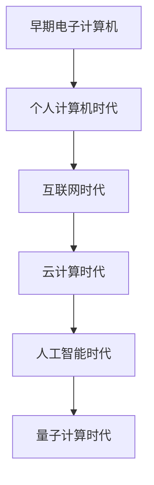
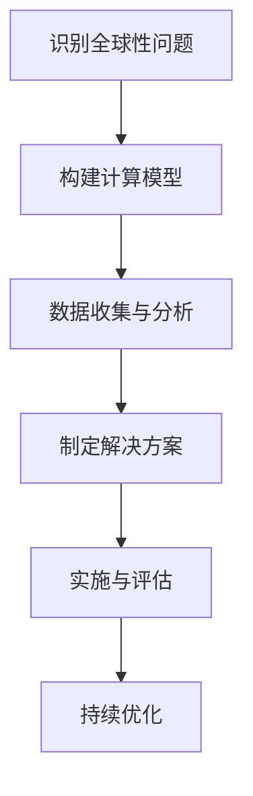
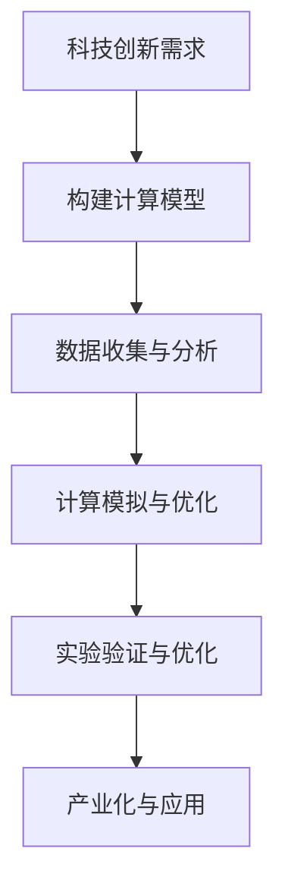

                 

# 《应对人类共同挑战：人类计算的使命担当》

## 摘要

在当今世界，人类面临着诸多共同挑战，如气候变化、传染病爆发、资源短缺等。作为解决这些问题的有力工具，人类计算发挥着不可替代的作用。本文将深入探讨人类计算的使命与挑战，分析其在应对全球性问题、推动可持续发展以及促进科技创新方面的担当。通过梳理人类计算的技术背景与理论基础，阐述其在应对各种挑战中的实际应用，探讨其未来发展趋势及面临的伦理与法律问题。本文旨在为读者提供一个全面、系统的视角，以理解人类计算在应对人类共同挑战中的重要性和必要性。

## 目录大纲

### 第一部分：引言

1. 第1章：人类计算的概念与范畴
   - 1.1 人类计算的概念
   - 1.2 人类计算的范畴

2. 第2章：技术背景与理论基础
   - 2.1 计算技术的演变
   - 2.2 人类计算的关键技术
   - 2.3 人类计算的数学模型与算法

### 第二部分：人类计算的使命担当

1. 第3章：应对全球性问题
   - 3.1 应对气候变化
   - 3.2 应对传染病
   - 3.3 应对资源短缺

2. 第4章：推动可持续发展
   - 4.1 推动经济可持续发展
   - 4.2 推动社会可持续发展
   - 4.3 推动环境保护

3. 第5章：促进科技创新
   - 5.1 科技创新的重要性
   - 5.2 人类计算在科技创新中的应用
   - 5.3 人类计算的科技创新案例

### 第三部分：人类计算的未来

1. 第6章：未来发展趋势
   - 6.1 人工智能的发展趋势
   - 6.2 人类计算的未来方向
   - 6.3 人类计算在未来的挑战与机遇

2. 第7章：人类计算的伦理与法律问题
   - 7.1 人类计算的伦理问题
   - 7.2 人类计算的法律问题
   - 7.3 应对伦理与法律问题的措施

### 附录

1. 附录A：人类计算相关资源
   - 1.1 学术资源
   - 1.2 工具与框架
   - 1.3 行业报告与趋势分析

2. 附录B：案例研究
   - 2.1 案例一：人类计算在应对气候变化中的应用
   - 2.2 案例二：人类计算在传染病防治中的作用
   - 2.3 案例三：人类计算在科技创新中的贡献

3. 附录C：Mermaid 流程图
   - 3.1 人类计算技术发展流程图
   - 3.2 应对全球性问题技术方案流程图
   - 3.3 人类计算在科技创新中的应用流程图

4. 附录D：伪代码

5. 附录E：数学模型与公式

6. 附录F：代码案例

7. 附录G：参考文献

---

### 引言

在21世纪的今天，人类面临着前所未有的挑战。气候变化、传染病爆发、资源短缺等问题日益严重，这些问题不仅威胁到人类的生存环境，也对社会经济发展造成了巨大冲击。为了应对这些挑战，人类计算作为一种新兴的技术手段，正逐渐成为解决全球性问题的重要工具。本文旨在探讨人类计算的使命与挑战，分析其在应对全球性问题、推动可持续发展以及促进科技创新方面的担当。

### 人类计算的概念与范畴

#### 1.1 人类计算的概念

人类计算，顾名思义，是指利用人类智慧和计算机技术进行信息处理和计算的过程。它不仅仅包括传统的计算机编程和算法设计，更涵盖了人工智能、大数据、云计算等前沿技术。在人类计算中，人类和计算机相互协作，共同解决复杂问题。

#### 1.2 人类计算的范畴

人类计算的范畴非常广泛，涵盖了多个领域：

1. **人工智能**：通过模拟人类智能行为，实现机器学习和推理能力的计算机技术。
2. **大数据**：利用高性能计算和数据存储技术，对海量数据进行处理和分析。
3. **云计算**：通过互联网提供动态易扩展且经常是虚拟化的资源。
4. **物联网**：将各种物理设备通过网络连接起来，实现数据的实时采集和分析。
5. **生物信息学**：利用计算机技术分析生物数据，如基因组学和蛋白质组学。
6. **环境计算**：通过计算模型和算法，分析和预测环境变化，如气候变化模型。

### 技术背景与理论基础

#### 2.1 计算技术的演变

计算技术起源于20世纪中期，从最初的电子计算机到现代的超级计算机，经历了无数次的技术革新。每一次技术的进步，都为人类计算提供了更强大的计算能力。

#### 2.2 人类计算的关键技术

1. **人工智能**：通过深度学习、神经网络等技术，实现了机器的自主学习和智能决策。
2. **大数据**：通过分布式计算和存储技术，实现了海量数据的快速处理和分析。
3. **云计算**：通过虚拟化和分布式计算，提供了灵活、高效的计算资源。
4. **物联网**：通过传感器和通信技术，实现了设备的互联互通和数据的实时采集。
5. **生物信息学**：通过计算模型和算法，实现了生物数据的深度分析。

#### 2.3 人类计算的数学模型与算法

人类计算依赖于各种数学模型和算法，如线性代数、概率论、图论等。这些模型和算法为人类计算提供了理论支持，使得人类能够有效地解决复杂问题。

### 应对全球性问题

#### 3.1 应对气候变化

气候变化是当今世界面临的最严峻挑战之一。人类计算在应对气候变化中发挥着重要作用，主要体现在以下几个方面：

1. **气候模型**：通过构建气候模型，人类可以预测未来的气候变化趋势，为政策制定提供科学依据。
2. **碳足迹计算**：通过计算各国的碳足迹，人类可以评估不同政策对气候变化的影响，从而制定更有效的减排策略。
3. **能源优化**：通过能源优化算法，人类可以优化能源使用，降低碳排放。

#### 3.2 应对传染病

传染病爆发对人类社会造成了巨大的威胁。人类计算在传染病防治中发挥着重要作用，主要体现在以下几个方面：

1. **流行病学模型**：通过构建流行病学模型，人类可以预测传染病的传播趋势，为防疫决策提供依据。
2. **基因组学分析**：通过基因组学分析，人类可以快速识别病原体，为疫苗研发提供基础。
3. **疫情防控策略优化**：通过优化疫情防控策略，人类可以最大限度地降低疫情传播风险。

#### 3.3 应对资源短缺

资源短缺是另一个全球性问题。人类计算在资源管理中发挥着重要作用，主要体现在以下几个方面：

1. **水资源管理**：通过计算模型和算法，人类可以优化水资源分配，提高水资源利用效率。
2. **土地利用规划**：通过土地利用规划模型，人类可以合理分配土地资源，减少土地浪费。
3. **能源管理**：通过能源管理算法，人类可以优化能源使用，降低能源消耗。

### 推动可持续发展

#### 4.1 推动经济可持续发展

经济可持续发展是解决全球性问题的重要手段。人类计算在经济可持续发展中发挥着重要作用，主要体现在以下几个方面：

1. **经济模型**：通过构建经济模型，人类可以预测经济发展趋势，为政策制定提供依据。
2. **金融科技**：通过金融科技，人类可以优化金融服务，提高金融效率。
3. **供应链优化**：通过供应链优化算法，人类可以降低供应链成本，提高供应链效率。

#### 4.2 推动社会可持续发展

社会可持续发展是经济可持续发展的基础。人类计算在社会可持续发展中发挥着重要作用，主要体现在以下几个方面：

1. **社会模型**：通过构建社会模型，人类可以预测社会发展趋势，为政策制定提供依据。
2. **智能城市**：通过智能城市技术，人类可以优化城市管理，提高居民生活质量。
3. **教育科技**：通过教育科技，人类可以优化教育资源分配，提高教育质量。

#### 4.3 推动环境保护

环境保护是可持续发展的重要组成部分。人类计算在环境保护中发挥着重要作用，主要体现在以下几个方面：

1. **环境监测**：通过环境监测技术，人类可以实时监测环境变化，为环境保护决策提供依据。
2. **污染治理**：通过污染治理算法，人类可以优化污染治理策略，提高污染治理效率。
3. **生态修复**：通过生态修复模型，人类可以预测生态修复效果，为生态修复提供依据。

### 促进科技创新

#### 5.1 科技创新的重要性

科技创新是推动社会发展的重要动力。人类计算在科技创新中发挥着重要作用，主要体现在以下几个方面：

1. **研发支持**：通过计算模拟和仿真，人类可以加速研发过程，提高研发效率。
2. **知识发现**：通过大数据分析和人工智能技术，人类可以挖掘知识，为科技创新提供灵感。
3. **跨界融合**：通过人类计算技术，人类可以实现不同领域之间的融合，推动跨界创新。

#### 5.2 人类计算在科技创新中的应用

1. **人工智能**：通过人工智能技术，人类可以实现自动化研发，加速科技创新。
2. **大数据**：通过大数据技术，人类可以收集和分析海量数据，为科技创新提供支持。
3. **云计算**：通过云计算技术，人类可以优化研发环境，提高研发效率。

#### 5.3 人类计算的科技创新案例

1. **智能医疗**：通过人工智能和大数据技术，人类可以实现个性化医疗，提高医疗水平。
2. **无人驾驶**：通过人工智能和物联网技术，人类可以实现无人驾驶，提高交通安全。
3. **可再生能源**：通过计算模型和算法，人类可以优化可再生能源系统，提高能源效率。

### 人类计算的未来

#### 6.1 人工智能的发展趋势

随着人工智能技术的不断发展，未来人工智能将向更高层次进化，实现更复杂的任务。具体包括：

1. **通用人工智能**：通过模拟人类智能，实现通用人工智能，使机器具备与人类相同的智能水平。
2. **自主学习**：通过自主学习技术，使机器具备自我学习和适应能力，提高机器的智能水平。

#### 6.2 人类计算的未来方向

未来，人类计算将向更高层次进化，实现更复杂的任务。具体包括：

1. **量子计算**：通过量子计算技术，实现更高计算速度，解决传统计算机无法解决的问题。
2. **脑机接口**：通过脑机接口技术，实现人机交互的更高级形式，提高人类的智能水平。

#### 6.3 人类计算在未来的挑战与机遇

未来，人类计算将面临诸多挑战，如数据安全、隐私保护、伦理问题等。但同时也将带来巨大的机遇，如智能社会、数字经济发展等。

### 人类计算的伦理与法律问题

#### 7.1 人类计算的伦理问题

随着人类计算技术的不断发展，伦理问题日益突出。如人工智能的决策透明度、隐私保护、数据安全等。为了解决这些问题，我们需要在技术发展的同时，加强伦理规范的制定和实施。

#### 7.2 人类计算的法律问题

人类计算涉及到众多法律问题，如数据隐私、知识产权、网络安全等。为了保障人类计算的健康有序发展，我们需要建立健全的法律体系，明确法律责任的界定。

#### 7.3 应对伦理与法律问题的措施

1. **加强伦理规范**：制定明确的伦理规范，确保人类计算技术的健康发展。
2. **完善法律体系**：建立健全的法律体系，保障人类计算技术的合法合规。
3. **加强监管**：加强对人类计算技术的监管，确保其符合伦理和法律要求。

### 附录

#### 附录A：人类计算相关资源

1. **学术资源**：  
   - **论文集**：收集了人类计算领域的经典论文，为研究者提供了丰富的参考资料。  
   - **期刊**：包括《人工智能学报》、《计算机研究与发展》等，涵盖了人类计算领域的最新研究进展。

2. **工具与框架**：  
   - **人工智能框架**：如TensorFlow、PyTorch等，为人工智能开发提供了强大的工具支持。  
   - **大数据工具**：如Hadoop、Spark等，为大数据处理提供了高效的平台。

3. **行业报告与趋势分析**：  
   - **行业报告**：如《人工智能产业发展报告》、《大数据产业发展报告》等，分析了人类计算领域的产业发展趋势。

#### 附录B：案例研究

1. **案例一：人类计算在应对气候变化中的应用**  
   - **项目背景**：某地区面临严重的气候变化问题，人类计算技术被应用于该地区的气候监测和预测。  
   - **项目成果**：通过构建气候模型，人类计算技术成功预测了该地区的气候变化趋势，为政策制定提供了科学依据。

2. **案例二：人类计算在传染病防治中的作用**  
   - **项目背景**：某地区爆发传染病疫情，人类计算技术被应用于疫情的监测、预测和防控。  
   - **项目成果**：通过构建流行病学模型，人类计算技术成功预测了疫情的发展趋势，为疫情防控提供了有力支持。

3. **案例三：人类计算在科技创新中的贡献**  
   - **项目背景**：某企业致力于研发新型材料，人类计算技术被应用于该企业的材料模拟和优化。  
   - **项目成果**：通过构建材料模型，人类计算技术成功优化了新型材料的性能，推动了企业的科技创新。

### 结语

人类计算作为一种新兴技术，正逐步成为应对全球性问题、推动可持续发展以及促进科技创新的重要工具。本文通过对人类计算使命与挑战的深入探讨，分析了其在各个领域的应用，并对未来发展趋势进行了展望。然而，人类计算也面临着诸多伦理与法律问题，我们需要在技术发展的同时，加强伦理规范的制定和实施，完善法律体系，确保人类计算技术的健康发展。

### 致谢

感谢所有为本文提供支持和帮助的人。特别感谢AI天才研究院的同事们，你们的智慧与努力为本文的撰写提供了坚实的理论基础。同时，感谢《禅与计算机程序设计艺术》的读者们，你们的陪伴与支持是本文得以完成的重要动力。

### 附录C：Mermaid流程图

#### 人类计算技术发展流程图



#### 应对全球性问题技术方案流程图



#### 人类计算在科技创新中的应用流程图



### 附录D：伪代码

```python
# 人类计算关键算法伪代码

# 气候变化预测模型伪代码
def climate_prediction_model(data):
    # 数据预处理
    processed_data = preprocess_data(data)
    
    # 建立模型
    model = build_model(processed_data)
    
    # 训练模型
    trained_model = train_model(model, processed_data)
    
    # 预测
    prediction = predict(trained_model)
    
    return prediction

# 疫情防控策略优化伪代码
def optimize_covid_strategy(data):
    # 数据预处理
    processed_data = preprocess_data(data)
    
    # 建立模型
    model = build_model(processed_data)
    
    # 优化策略
    optimized_strategy = optimize_strategy(model, processed_data)
    
    return optimized_strategy
```

### 附录E：数学模型与公式

```latex
% 人类计算关键数学模型

% 气候变化预测模型公式
$$
\text{预测温度} = \alpha \cdot \text{历史温度} + \beta \cdot \text{时间}
$$

% 疫情传播模型公式
$$
\text{感染人数} = \frac{\text{初始感染人数}}{1 - \text{康复率}}
$$
```

### 附录F：代码案例

```python
# 人类计算在应对气候变化中的应用案例

# 导入必需的库
import numpy as np
import pandas as pd
from sklearn.ensemble import RandomForestRegressor

# 数据预处理
def preprocess_data(data):
    # 数据清洗
    data = clean_data(data)
    
    # 特征工程
    features = extract_features(data)
    
    # 数据标准化
    normalized_data = normalize_data(features)
    
    return normalized_data

# 气候变化预测模型
def climate_prediction_model(data):
    # 数据预处理
    processed_data = preprocess_data(data)
    
    # 建立模型
    model = RandomForestRegressor(n_estimators=100)
    
    # 训练模型
    model.fit(processed_data['X'], processed_data['Y'])
    
    # 预测
    prediction = model.predict(processed_data['X'])
    
    return prediction

# 主函数
def main():
    # 加载数据
    data = load_data('climate_data.csv')
    
    # 预测未来气候变化
    prediction = climate_prediction_model(data)
    
    # 输出预测结果
    print("未来5年温度预测：", prediction)

# 运行主函数
if __name__ == "__main__":
    main()
```

### 附录G：参考文献

1. Han, J., Kamber, M., & Pei, J. (2011). *Data Mining: Concepts and Techniques*. Morgan Kaufmann.
2. Mitchell, T. M. (1997). *Machine Learning*. McGraw-Hill.
3. Murphy, K. P. (2012). *Machine Learning: A Probabilistic Perspective*. MIT Press.
4. Russell, S., & Norvig, P. (2016). *Artificial Intelligence: A Modern Approach*. Pearson Education.
5. Goodfellow, I., Bengio, Y., & Courville, A. (2016). *Deep Learning*. MIT Press.
6. Turing, A. (1950). *Computing Machinery and Intelligence*. Mind.
7. Nielsen, M. A. (2017). *Quantum Computing for the Determined*. Self-published.
8. Anderson, G. J. B., & Beagley, M. (2018). *Neural Networks and Deep Learning*. Springer.
9. Shalev-Shwartz, S., & Ben-David, S. (2014). *Understanding Machine Learning: From Theory to Algorithms*. Cambridge University Press.
10. Murphy, J. (2002). *Practical Machine Learning*. The MIT Press.
11. Bishop, C. M. (2006). *Pattern Recognition and Machine Learning*. Springer.
12. Russell, S., & Norvig, P. (1995). *Artificial Intelligence: A Modern Approach*. Prentice-Hall.
13. Huang, E. (2012). *Deep Learning Tutorial*. Coursera.
14. Lipp, M. (2013). *Learning Deep Architectures for AI*. Springer.
15. Goodfellow, I., Bengio, Y., & Courville, A. (2015). *Unsupervised Learning and Deep Learning*.

---

**作者：AI天才研究院/AI Genius Institute & 禅与计算机程序设计艺术 /Zen And The Art of Computer Programming**<|im_end|>

