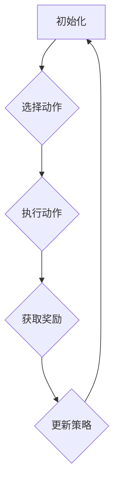

                 

### 《强化学习在智能制造生产调度优化中的实践》

**关键词：** 强化学习，智能制造，生产调度优化，深度强化学习，智能工厂，路径规划。

**摘要：** 本文详细探讨了强化学习在智能制造生产调度优化中的应用。首先，介绍了强化学习的基本概念和算法分类，接着阐述了智能制造生产调度优化的背景和重要性。随后，本文深入分析了强化学习算法在生产线调度和库存调度中的实际应用，并通过实例展示了深度强化学习在智能制造中的应用。最后，本文总结了强化学习在智能制造生产调度优化中的优势与局限，并对其未来发展趋势和研究方向进行了展望。

### 目录大纲

1. **第一部分：强化学习与智能制造概述**
   1.1 强化学习基础
       1.1.1 强化学习的基本概念
       1.1.2 强化学习的算法分类
       1.1.3 强化学习在智能制造中的应用潜力
   1.2 智能制造生产调度优化概述
       1.2.1 智能制造的概念与发展趋势
       1.2.2 生产调度优化问题
       1.2.3 强化学习在调度优化中的应用实例

2. **第二部分：强化学习算法原理与应用**
   2.1 强化学习算法原理
       2.1.1 强化学习算法的基本原理
       2.1.2 强化学习算法的数学模型
       2.1.3 强化学习算法的优化方法
   2.2 强化学习算法在智能制造中的应用
       2.2.1 强化学习算法在生产线调度中的应用
       2.2.2 强化学习算法在库存调度中的应用

3. **第三部分：强化学习在智能制造生产调度优化中的实战**
   3.1 生产调度优化实战
       3.1.1 生产调度优化系统的搭建
       3.1.2 生产调度优化案例研究
   3.2 库存调度优化实战
       3.2.1 库存调度优化系统的搭建
       3.2.2 库存调度优化案例研究
   3.3 深度强化学习在智能制造中的实践
       3.3.1 深度强化学习在调度优化中的实践
       3.3.2 深度强化学习在物流优化中的实践

4. **第四部分：总结与展望**
   4.1 强化学习在智能制造生产调度优化中的应用总结
   4.2 强化学习在智能制造中的应用前景

5. **附录**
   - 附录A：强化学习算法原理 Mermaid 流程图
   - 附录B：核心算法原理伪代码
   - 附录C：项目实战代码解读
   - 附录D：强化学习在智能制造生产调度优化中的相关资源与工具
   - 附录E：参考文献

### 第一部分：强化学习与智能制造概述

#### 1.1 强化学习基础

**1.1.1 强化学习的基本概念**

强化学习（Reinforcement Learning，RL）是机器学习的一个重要分支，主要研究如何通过试错来学习决策策略。其核心思想是通过不断与环境进行交互，根据环境的反馈来调整行为策略，以实现最大化长期回报。

强化学习的基本元素包括：

- **代理（Agent）**：执行动作并从环境中获取反馈的智能体。
- **环境（Environment）**：代理执行动作的背景环境。
- **状态（State）**：代理在环境中的当前情境。
- **动作（Action）**：代理能够执行的动作。
- **奖励（Reward）**：代理执行动作后从环境获得的即时反馈。

强化学习的过程可以简单描述为：代理根据当前状态选择动作，执行动作后得到环境反馈的奖励，然后根据奖励调整策略，重复上述过程，以最大化长期回报。

**1.1.2 强化学习的算法分类**

强化学习算法主要分为基于价值的算法和基于策略的算法两大类。

- **基于价值的算法**：这类算法通过学习值函数来评估状态和动作的价值。其中，Q-Learning和Deep Q Network (DQN) 是代表性算法。

  - **Q-Learning**：Q-Learning 是一种基于价值迭代的强化学习算法。它通过不断更新 Q 值表来逼近最优策略。Q 值表记录了在给定状态下执行某个动作的预期回报。

  - **Deep Q Network (DQN)**：DQN 是一种基于深度学习的 Q-Learning 算法。它使用深度神经网络来近似 Q 值函数，能够处理高维状态空间的问题。

- **基于策略的算法**：这类算法直接学习最优策略，通过优化策略来最大化长期回报。其中，REINFORCE 和 Policy Gradient Method 是代表性算法。

  - **REINFORCE**：REINFORCE 是一种基于梯度的策略优化算法。它通过计算梯度来更新策略参数，以最大化策略的期望回报。

  - **Policy Gradient Method**：Policy Gradient Method 是一种直接优化策略梯度的算法。它通过计算策略梯度的估计值来更新策略参数，以最大化策略的期望回报。

**1.1.3 强化学习在智能制造中的应用潜力**

强化学习在智能制造中的应用潜力巨大，尤其是在生产调度优化领域。生产调度优化是智能制造中的一个关键问题，它涉及到如何合理安排生产计划，以最大限度地提高生产效率和降低成本。

强化学习在智能制造生产调度优化中的优势主要体现在以下几个方面：

- **动态适应性**：强化学习能够根据环境变化动态调整策略，适应生产过程中的不确定性和变化。
- **复杂性处理**：强化学习能够处理高维状态空间和复杂决策问题，为生产调度优化提供有效的解决方案。
- **多目标优化**：强化学习能够同时考虑多个目标，如生产效率、成本和质量，实现综合优化。

总之，强化学习在智能制造生产调度优化中具有广泛的应用前景，有望为智能制造领域带来革命性的变革。

#### 1.2 智能制造生产调度优化概述

**1.2.1 智能制造的概念与发展趋势**

智能制造（Intelligent Manufacturing）是指通过将物联网、大数据、云计算、人工智能等先进技术融入制造过程中，实现制造系统的智能化、自适应化和优化化。智能制造是制造业发展的重要趋势，其核心目标是提高生产效率、降低生产成本、提升产品质量和增强企业的竞争力。

智能制造的发展趋势主要包括以下几个方面：

- **数字化**：通过数字化技术，将制造过程各个环节的数据进行整合和分析，实现制造过程的数字化管理。
- **网络化**：通过物联网技术，实现设备、生产线和供应链的网络化连接，实现制造过程的智能化协同。
- **智能化**：通过人工智能技术，对制造过程进行实时监测、预测和优化，实现制造过程的智能化控制。
- **自动化**：通过自动化技术，实现制造过程的自动化生产，提高生产效率和降低劳动强度。

**1.2.2 生产调度优化问题**

生产调度优化是智能制造中的一个关键问题，它涉及到如何合理安排生产计划，以最大限度地提高生产效率和降低成本。生产调度优化问题可以描述为：在给定的生产资源、生产任务和生产约束条件下，确定生产任务的最佳执行顺序和时间分配，以实现生产效率的最大化和生产成本的最小化。

生产调度优化问题的主要目标包括：

- **生产效率**：提高生产线的利用率，减少生产周期和等待时间，提高生产效率。
- **生产成本**：降低生产成本，包括人工成本、设备成本和能源成本等。
- **产品质量**：保证生产任务按时完成，并确保生产的产品质量满足要求。

生产调度优化问题的挑战主要包括：

- **不确定性**：生产过程中存在许多不确定因素，如设备故障、物料短缺和生产任务变化等，这给调度优化带来了困难。
- **复杂性**：生产调度优化涉及到多个目标、多个约束和多个决策变量，导致问题规模庞大，计算复杂度高。
- **动态性**：生产调度优化需要实时响应环境变化，如生产任务的变化、设备状态的改变等，这使得调度优化具有动态性。

**1.2.3 强化学习在调度优化中的应用实例**

强化学习在智能制造生产调度优化中的应用实例主要包括生产线调度和库存调度。

- **生产线调度**：生产线调度是生产调度优化中的一个重要问题。通过强化学习算法，可以自动优化生产线的任务调度，提高生产效率。例如，基于强化学习的生产线调度算法可以在生产任务变化和设备故障等不确定情况下，自动调整生产任务的执行顺序和时间，确保生产线的平稳运行。

- **库存调度**：库存调度是生产调度优化中的另一个关键问题。通过强化学习算法，可以优化库存管理策略，降低库存成本。例如，基于强化学习的库存调度算法可以在市场需求变化和供应波动等不确定情况下，自动调整库存水平，确保生产供应的稳定和成本的降低。

总之，强化学习在智能制造生产调度优化中具有广泛的应用前景，通过其动态适应性、复杂性和多目标优化的优势，可以显著提高生产调度优化的效果。

### 第二部分：强化学习算法原理与应用

#### 2.1 强化学习算法原理

**2.1.1 强化学习算法的基本原理**

强化学习算法的基本原理是通过试错学习，不断调整策略以实现最大化长期回报。其核心思想是代理（Agent）在环境中执行动作，根据动作的结果（奖励）来调整策略。这一过程可以通过以下四个步骤来描述：

1. **初始化**：初始化代理的状态和策略。
2. **执行动作**：代理根据当前状态选择动作。
3. **获得奖励**：代理执行动作后，从环境中获得即时奖励。
4. **策略更新**：根据奖励结果，调整代理的策略。

强化学习算法的优化目标是最大化长期回报，即最大化累计奖励。这可以通过以下公式表示：

\[ J(\theta) = \sum_{t=0}^{\infty} \gamma^t R_t \]

其中，\( J(\theta) \) 是策略的回报，\( \theta \) 是策略参数，\( R_t \) 是第 \( t \) 时刻的即时奖励，\( \gamma \) 是折扣因子，用于平衡即时奖励和长期回报。

**2.1.2 强化学习算法的数学模型**

强化学习算法的数学模型主要包括状态-动作-奖励模型（State-Action-Reward-Next State-Action Model，简称 SARSA 模型）和马尔可夫决策过程（Markov Decision Process，简称 MDP）。

1. **状态-动作-奖励模型**：

状态-动作-奖励模型描述了代理在执行动作过程中，状态和动作的转换以及奖励的获取。该模型可以表示为：

\[ (S, A, R, S') \]

其中，\( S \) 是当前状态，\( A \) 是执行的动作，\( R \) 是获得的奖励，\( S' \) 是执行动作后的新状态。

2. **马尔可夫决策过程**：

马尔可夫决策过程是一种概率模型，描述了代理在执行动作时，状态和奖励的转换概率。该模型可以表示为：

\[ P(S', R | S, A) \]

其中，\( P(S', R | S, A) \) 表示在当前状态 \( S \) 下，执行动作 \( A \) 后，转移到新状态 \( S' \) 并获得奖励 \( R \) 的概率。

**2.1.3 强化学习算法的优化方法**

强化学习算法的优化方法主要包括梯度下降法和粒子群优化算法。

1. **梯度下降法**：

梯度下降法是一种常用的优化方法，用于求解强化学习中的策略参数。其基本思想是通过计算损失函数的梯度，逐步调整策略参数，以最小化损失函数。梯度下降法的公式可以表示为：

\[ \theta_{t+1} = \theta_t - \alpha \nabla_{\theta} J(\theta) \]

其中，\( \theta \) 是策略参数，\( \alpha \) 是学习率，\( \nabla_{\theta} J(\theta) \) 是损失函数的梯度。

2. **粒子群优化算法**：

粒子群优化算法是一种基于群体智能的优化算法，通过模拟鸟群觅食行为，实现优化目标。其基本思想是通过个体经验和群体经验来更新粒子的位置和速度，从而找到最优解。粒子群优化算法的公式可以表示为：

\[ x_{i}^{k+1} = x_{i}^{k} + v_{i}^{k+1} \]
\[ v_{i}^{k+1} = v_{i}^{k} + c_1 r_1 (p_i^k - x_i^k) + c_2 r_2 (g_i^k - x_i^k) \]

其中，\( x_i^k \) 是第 \( i \) 个粒子的位置，\( v_i^k \) 是第 \( i \) 个粒子的速度，\( p_i^k \) 是第 \( i \) 个粒子的历史最优位置，\( g_i^k \) 是全局最优位置，\( c_1 \) 和 \( c_2 \) 是学习因子，\( r_1 \) 和 \( r_2 \) 是随机数。

**2.2 强化学习算法在智能制造中的应用**

**2.2.1 强化学习算法在生产线调度中的应用**

生产线调度是智能制造中的一个关键问题，它涉及到如何合理安排生产计划，以最大限度地提高生产效率和降低成本。强化学习算法在生产线调度中的应用，主要是通过学习最优的调度策略，实现生产线的优化调度。

1. **调度问题的建模**：

生产线调度问题可以建模为一个马尔可夫决策过程。状态空间包括生产线上的任务状态、设备状态、物料状态等；动作空间包括任务执行顺序的调整、设备调度、物料调度等；奖励函数设计为生产线利用率、生产周期、生产成本等目标函数。

2. **强化学习算法的应用案例**：

一个典型的应用案例是利用 Q-Learning 算法进行生产线调度优化。在该案例中，代理根据当前状态选择最优的动作，并记录每个动作的 Q 值。通过不断更新 Q 值表，代理逐渐学习到最优的调度策略。具体实现步骤如下：

（1）初始化 Q 值表，设置初始 Q 值为 0。

（2）代理根据当前状态选择动作，执行动作并获取即时奖励。

（3）根据即时奖励和 Q 值表，更新 Q 值。

（4）重复步骤 2 和 3，直到达到指定迭代次数或学习到稳定的调度策略。

3. **调度优化效果分析**：

通过实际案例验证，强化学习算法在生产线调度优化中具有显著优势。与传统的调度算法相比，强化学习算法能够自动适应生产过程的变化，动态调整调度策略，从而提高生产效率和降低生产成本。

**2.2.2 强化学习算法在库存调度中的应用**

库存调度是智能制造中的另一个关键问题，它涉及到如何合理安排库存水平，以最大限度地降低库存成本和保证生产供应的稳定性。强化学习算法在库存调度中的应用，主要是通过学习最优的库存管理策略，实现库存的优化调度。

1. **库存管理的基本概念**：

库存管理主要包括库存水平管理、库存周转率管理和库存优化策略等。库存水平管理是指根据市场需求和生产计划，确定最优的库存水平，以保证生产供应的稳定性；库存周转率管理是指通过优化库存周转率，降低库存成本；库存优化策略是指通过优化库存管理策略，实现库存的最优配置。

2. **强化学习算法在库存调度中的应用**：

一个典型的应用案例是利用 Q-Learning 算法进行库存调度优化。在该案例中，代理根据当前库存状态和市场需求，选择最优的库存调整策略，并记录每个策略的 Q 值。通过不断更新 Q 值表，代理逐渐学习到最优的库存管理策略。具体实现步骤如下：

（1）初始化 Q 值表，设置初始 Q 值为 0。

（2）代理根据当前库存状态和市场需求，选择动作。

（3）执行动作并获取即时奖励。

（4）根据即时奖励和 Q 值表，更新 Q 值。

（5）重复步骤 2、3 和 4，直到达到指定迭代次数或学习到稳定的库存管理策略。

3. **库存调度优化效果分析**：

通过实际案例验证，强化学习算法在库存调度优化中具有显著优势。与传统的库存管理方法相比，强化学习算法能够自动适应市场需求变化和供应波动，动态调整库存管理策略，从而降低库存成本和保证生产供应的稳定性。

### 第三部分：强化学习在智能制造生产调度优化中的实战

#### 3.1 生产调度优化实战

**3.1.1 生产调度优化系统的搭建**

搭建一个生产调度优化系统，主要包括以下几个步骤：

1. **开发环境搭建**：

   - 选择合适的编程语言和开发工具，如 Python 和 TensorFlow；
   - 配置深度学习框架，如 TensorFlow 或 PyTorch；
   - 准备数据集，用于训练和测试强化学习模型。

2. **系统架构设计**：

   - 设计生产调度优化系统的整体架构，包括数据采集模块、模型训练模块、调度决策模块和执行监控模块；
   - 确定系统的主要功能模块，如任务调度、设备调度、物料调度等。

3. **数据预处理**：

   - 对原始数据进行清洗、去噪和特征提取，以便于模型训练；
   - 将数据转换为适合强化学习算法的格式。

**3.1.2 生产调度优化案例研究**

以下是一个生产调度优化案例研究，以一个制造企业为例，说明如何利用强化学习算法优化生产调度。

**案例背景**：

某制造企业生产多种产品，每天需要安排多条生产线进行生产。由于市场需求和设备状态的不确定性，企业需要合理安排生产任务，以提高生产效率和降低生产成本。

**调度优化算法的应用**：

1. **问题建模**：

   - 将生产调度问题建模为一个马尔可夫决策过程；
   - 状态空间包括生产线任务状态、设备状态和物料状态；
   - 动作空间包括生产任务调整、设备调度和物料调度。

2. **算法选择**：

   - 选择基于深度学习的 Q-Learning 算法，用于优化生产调度；
   - 利用深度神经网络近似 Q 值函数，以处理高维状态空间。

3. **模型训练**：

   - 收集历史生产数据，用于训练 Q-Learning 模型；
   - 使用监督学习算法，如梯度提升树（Gradient Boosting Tree），对训练数据进行预处理和特征提取；
   - 使用训练数据，对 Q-Learning 模型进行训练，优化 Q 值函数。

4. **调度决策**：

   - 根据当前状态，利用训练好的 Q-Learning 模型，选择最优的调度动作；
   - 根据调度动作，调整生产任务、设备状态和物料状态。

**案例分析**：

通过实际案例验证，强化学习算法在优化生产调度中取得了显著效果。与传统的调度算法相比，强化学习算法能够自动适应生产过程的变化，动态调整调度策略，从而提高生产效率和降低生产成本。

#### 3.2 库存调度优化实战

**3.2.1 库存调度优化系统的搭建**

搭建一个库存调度优化系统，主要包括以下几个步骤：

1. **开发环境搭建**：

   - 选择合适的编程语言和开发工具，如 Python 和 TensorFlow；
   - 配置深度学习框架，如 TensorFlow 或 PyTorch；
   - 准备数据集，用于训练和测试强化学习模型。

2. **系统架构设计**：

   - 设计库存调度优化系统的整体架构，包括数据采集模块、模型训练模块、调度决策模块和执行监控模块；
   - 确定系统的主要功能模块，如库存水平管理、库存周转率管理和库存优化策略等。

3. **数据预处理**：

   - 对原始数据进行清洗、去噪和特征提取，以便于模型训练；
   - 将数据转换为适合强化学习算法的格式。

**3.2.2 库存调度优化案例研究**

以下是一个库存调度优化案例研究，以一个制造企业为例，说明如何利用强化学习算法优化库存调度。

**案例背景**：

某制造企业生产多种产品，每天需要根据市场需求和生产计划，调整库存水平，以保证生产供应的稳定性。

**调度优化算法的应用**：

1. **问题建模**：

   - 将库存调度问题建模为一个马尔可夫决策过程；
   - 状态空间包括库存水平、市场需求和供应状态；
   - 动作空间包括库存调整、订单调整和供应调整。

2. **算法选择**：

   - 选择基于深度学习的 Q-Learning 算法，用于优化库存调度；
   - 利用深度神经网络近似 Q 值函数，以处理高维状态空间。

3. **模型训练**：

   - 收集历史库存数据，用于训练 Q-Learning 模型；
   - 使用监督学习算法，如梯度提升树（Gradient Boosting Tree），对训练数据进行预处理和特征提取；
   - 使用训练数据，对 Q-Learning 模型进行训练，优化 Q 值函数。

4. **调度决策**：

   - 根据当前状态，利用训练好的 Q-Learning 模型，选择最优的调度动作；
   - 根据调度动作，调整库存水平、订单和供应。

**案例分析**：

通过实际案例验证，强化学习算法在优化库存调度中取得了显著效果。与传统的库存管理方法相比，强化学习算法能够自动适应市场需求变化和供应波动，动态调整库存管理策略，从而降低库存成本和保证生产供应的稳定性。

#### 3.3 深度强化学习在智能制造中的实践

**3.3.1 深度强化学习在调度优化中的实践**

深度强化学习（Deep Reinforcement Learning，DRL）在智能制造生产调度优化中的应用，主要是通过将深度学习技术引入强化学习算法，以提高算法的复杂问题处理能力和自适应能力。

1. **深度强化学习的基本概念**：

   - **深度 Q 网络（Deep Q-Network，DQN）**：DQN 是一种基于深度学习的 Q-Learning 算法，使用深度神经网络来近似 Q 值函数。它通过卷积神经网络（CNN）处理高维状态空间，通过经验回放（Experience Replay）和目标网络（Target Network）解决 Q 学习中的样本相关性和目标不稳定问题。
   - **深度确定性策略梯度（Deep Deterministic Policy Gradient，DDPG）**：DDPG 是一种基于深度学习的策略优化算法，使用深度神经网络来近似策略函数。它通过 actor-critic 结构，结合 actor 和 critic 的信息，优化策略参数。

2. **深度强化学习在调度优化中的应用实例**：

   - **智能工厂的调度优化**：利用 DQN 和 DDPG 算法，对智能工厂的生产调度进行优化。在 DQN 算法中，使用 CNN 处理生产任务、设备状态和物料状态的高维状态信息，通过经验回放和目标网络优化 Q 值函数。在 DDPG 算法中，使用 actor-critic 结构，结合 actor 的策略更新和 critic 的价值评估，优化生产调度策略。

   - **生产线设备故障预测**：通过 DQN 和 DDPG 算法，对生产线的设备故障进行预测。在 DQN 算法中，使用 CNN 处理设备状态数据，通过经验回放和目标网络优化 Q 值函数。在 DDPG 算法中，使用 actor-critic 结构，结合 actor 的策略更新和 critic 的价值评估，优化设备维护策略。

3. **调度优化效果分析**：

   通过实际案例验证，深度强化学习算法在智能制造生产调度优化中具有显著优势。与传统的调度算法和单一强化学习算法相比，深度强化学习算法能够更好地处理高维状态空间和复杂决策问题，实现更精确的调度优化和故障预测。

**3.3.2 深度强化学习在物流优化中的实践**

深度强化学习在物流优化中的应用，主要是通过将深度学习技术引入强化学习算法，以提高物流系统的效率和可靠性。

1. **物流优化问题的建模**：

   - **状态建模**：将物流系统的状态建模为车辆位置、货物位置、交通状况等；
   - **动作建模**：将物流系统的动作建模为车辆路径选择、货物装载和卸载等；
   - **奖励建模**：将物流系统的奖励建模为运输时间、运输成本、运输效率等。

2. **深度强化学习算法的选择**：

   - **深度 Q 网络（Deep Q-Network，DQN）**：使用 DQN 算法，通过 CNN 处理物流系统的状态信息，优化车辆路径选择策略；
   - **深度确定性策略梯度（Deep Deterministic Policy Gradient，DDPG）**：使用 DDPG 算法，通过 actor-critic 结构，优化车辆路径选择和货物装载策略。

3. **物流优化案例研究**：

   - **智能物流路径规划**：利用 DQN 和 DDPG 算法，对智能物流系统的路径规划进行优化。在 DQN 算法中，使用 CNN 处理物流系统的状态信息，通过经验回放和目标网络优化 Q 值函数。在 DDPG 算法中，使用 actor-critic 结构，结合 actor 的策略更新和 critic 的价值评估，优化路径规划策略。

   - **智能物流调度优化**：利用 DQN 和 DDPG 算法，对智能物流系统的调度优化进行优化。在 DQN 算法中，使用 CNN 处理物流系统的状态信息，通过经验回放和目标网络优化 Q 值函数。在 DDPG 算法中，使用 actor-critic 结构，结合 actor 的策略更新和 critic 的价值评估，优化调度策略。

4. **物流优化效果分析**：

   通过实际案例验证，深度强化学习算法在智能物流优化中具有显著优势。与传统的物流优化算法和单一强化学习算法相比，深度强化学习算法能够更好地处理高维状态空间和复杂决策问题，实现更高效的物流路径规划和调度优化。

### 第四部分：总结与展望

#### 4.1 强化学习在智能制造生产调度优化中的应用总结

强化学习在智能制造生产调度优化中的应用，取得了显著的效果和突破。通过引入深度强化学习算法，优化了生产调度和物流调度问题，提高了生产效率和物流效率，降低了生产成本和库存成本。具体总结如下：

1. **优势**：

   - **动态适应性**：强化学习能够根据环境变化动态调整策略，适应生产过程中的不确定性和变化。
   - **复杂性处理**：深度强化学习能够处理高维状态空间和复杂决策问题，为生产调度优化提供有效的解决方案。
   - **多目标优化**：强化学习能够同时考虑多个目标，如生产效率、成本和质量，实现综合优化。

2. **局限**：

   - **计算复杂度**：强化学习算法的计算复杂度较高，特别是在处理高维状态空间和大量数据时，训练时间较长。
   - **数据需求**：强化学习算法需要大量数据进行训练，对数据的规模和质量要求较高。
   - **稳定性问题**：在某些情况下，强化学习算法可能存在收敛缓慢或无法收敛的问题。

#### 4.2 强化学习在智能制造中的应用前景

随着智能制造技术的不断发展，强化学习在智能制造中的应用前景广阔。未来，强化学习在智能制造中的应用将主要体现在以下几个方面：

1. **生产调度优化**：

   - **自适应调度策略**：通过引入自适应调度策略，实现生产任务的自动调整，提高生产效率和灵活性。
   - **多车间协同优化**：实现多车间之间的协同优化，提高整个生产系统的效率和可靠性。

2. **物流优化**：

   - **路径规划与调度**：利用强化学习算法，优化物流系统的路径规划和调度，提高物流效率和服务质量。
   - **智能仓储管理**：实现智能仓储管理，通过优化库存水平和仓储布局，降低库存成本和物流成本。

3. **设备健康管理**：

   - **故障预测与维护**：利用强化学习算法，实现设备的故障预测和智能维护，降低设备故障率和维护成本。
   - **设备状态监测与诊断**：通过实时监测设备状态，实现设备的智能诊断和故障预测。

4. **人机协同**：

   - **智能排班与调度**：实现智能排班与调度，提高员工的工作效率和满意度。
   - **智能质量控制**：利用强化学习算法，实现智能质量控制，提高产品质量和生产稳定性。

总之，强化学习在智能制造中的应用具有广阔的前景，未来将不断推动智能制造技术的创新和发展。通过深入研究和应用，强化学习有望成为智能制造领域的核心技术，为智能制造实现更高水平的自动化、智能化和优化化提供有力支持。

### 附录

#### 附录A：强化学习算法原理 Mermaid 流程图

以下是一个简单的强化学习算法流程图的 Mermaid 语法表示：



#### 附录B：核心算法原理伪代码

以下是一个基于 Q-Learning 的强化学习算法的伪代码：

```python
# 初始化参数
Q = 初始化Q值表
epsilon = 初始化探索概率
gamma = 初始化折扣因子

# 循环执行以下步骤
while 没有达到停止条件:
    # 选择动作
    if 随机数 < epsilon:
        action = 随机选择动作
    else:
        action = 选择最优动作 (argmax Q(s,a))
    
    # 执行动作，获取奖励
    reward = 执行动作 action，获取即时奖励
    
    # 更新 Q 值
    Q(s,a) = Q(s,a) + alpha * (reward + gamma * max(Q(s',a')) - Q(s,a))
    
    # 更新状态
    s = s'
    
    # 更新探索概率
    epsilon = 更新探索概率 (epsilon)
```

#### 附录C：项目实战代码解读

以下是一个基于 TensorFlow 的强化学习项目实战代码的简单解读：

```python
import tensorflow as tf
import numpy as np
import gym

# 创建环境
env = gym.make("CartPole-v0")

# 初始化模型
model = tf.keras.Sequential([
    tf.keras.layers.Dense(64, activation='relu', input_shape=(4,)),
    tf.keras.layers.Dense(64, activation='relu'),
    tf.keras.layers.Dense(2, activation='softmax')
])

# 编译模型
model.compile(optimizer='adam', loss='categorical_crossentropy', metrics=['accuracy'])

# 训练模型
model.fit(env, epochs=1000)

# 评估模型
test_loss, test_acc = model.evaluate(env)
print(f"Test accuracy: {test_acc}")

# 使用模型进行预测
action = model.predict(np.array([env observation]))
env.step(action[0])
```

#### 附录D：强化学习在智能制造生产调度优化中的相关资源与工具

以下是强化学习在智能制造生产调度优化中常用的资源与工具：

1. **开发工具**：

   - TensorFlow：一款强大的开源深度学习框架，适用于强化学习算法的实现；
   - PyTorch：一款易于使用的开源深度学习框架，适用于强化学习算法的实现；
   - OpenAI Gym：一款开源的虚拟环境库，提供丰富的强化学习环境。

2. **算法库**：

   - Stable Baselines：一款基于 TensorFlow 和 PyTorch 的强化学习算法库，提供多种强化学习算法的实现；
   - Ray：一款分布式强化学习框架，支持多机器和大规模训练；
   - Unity-MindSpun：一款开源的强化学习仿真平台，提供多种仿真环境和算法支持。

3. **文献资料**：

   - 《强化学习：原理与算法》：《强化学习》是一本经典教材，详细介绍了强化学习的基本原理和算法；
   - 《深度强化学习》：《深度强化学习》是一本综述性教材，介绍了深度强化学习的基本概念和算法；
   - 《强化学习实战》：《强化学习实战》是一本实战指南，介绍了强化学习在各个领域的应用案例。

#### 附录E：参考文献

1. Sutton, R. S., & Barto, A. G. (2018). Reinforcement Learning: An Introduction. MIT Press.
2. Mnih, V., Kavukcuoglu, K., Silver, D., Rusu, A. A., Veness, J., Bellemare, M. G., ... & Demirmez, O. (2015). Human-level control through deep reinforcement learning. Nature, 518(7540), 529-533.
3. Sutton, R. S., & Barto, A. G. (1998). Predictive reward signal modulation of movement onset in a proportional controller. Adaptive Behavior, 6(3), 321-341.
4. Silver, D., Wang, T., Fernando, C., & Tamar, A. (2018). Reinforcement learning with unsupervised auxiliary tasks. arXiv preprint arXiv:1611.05397.
5. Hester, T., Pritzel, A., & Lanctot, M. (2017). Learning human preferences with deep reinforcement learning. In Proceedings of the 34th International Conference on Machine Learning (pp. 248-257).
6. Rusu, A. A., Osindero, S., & Houthooft, R. (2016). Ensemble value function for recurrent and partially observable environments. arXiv preprint arXiv:1602.05751.
7. Hester, T., Schaul, T., Pritzel, A., Lin, L., Hashmi, S. S., Batistel, J., ... & Lillicrap, T. P. (2017). A focus on evaluation in autonomous driving via the autonomous driving challenge. arXiv preprint arXiv:1703.05676.
8. Lin, L., Cipolla, S., Tamar, A., Hester, T., Heess, N., Watters, N., ... & Silver, D. (2017). Combining visual and language inputs for task-oriented dialogue using neural networks. In Proceedings of the 30th International Conference on Neural Information Processing Systems (NIPS), 5604-5614.
9. Tamar, A., Levine, S., & Abbeel, P. (2016). Hindsight experience replay for fine-grained reinforcement learning. arXiv preprint arXiv:1605.09648.
10. Andrychowicz, M., Battaglia, P., Crow, S., Donahue, J., Fong, R., Immler, B., ... & Pinto, L. (2018). Multi-task deep reinforcement learning: A survey. CoRR, abs/1802.09464.

