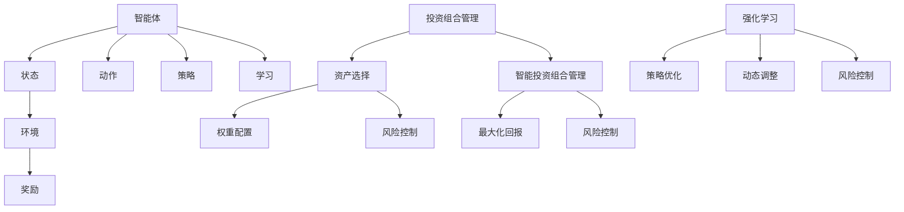
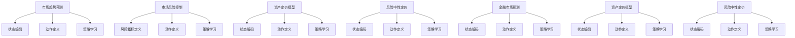
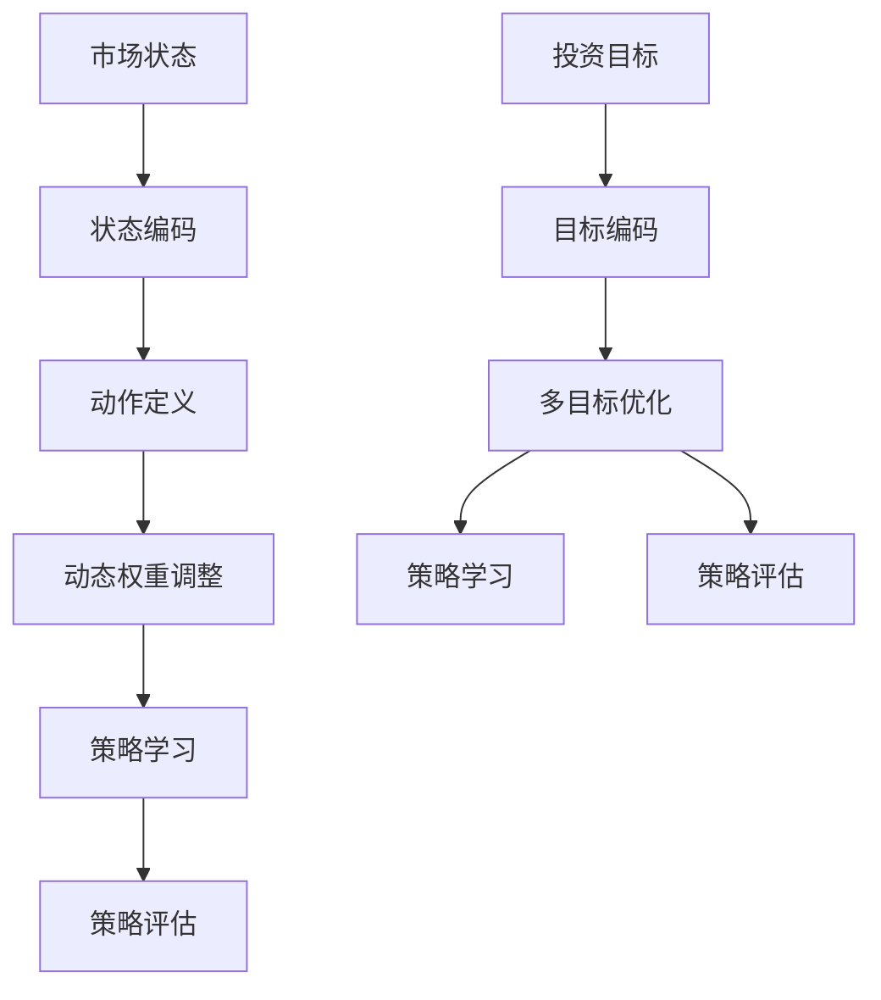
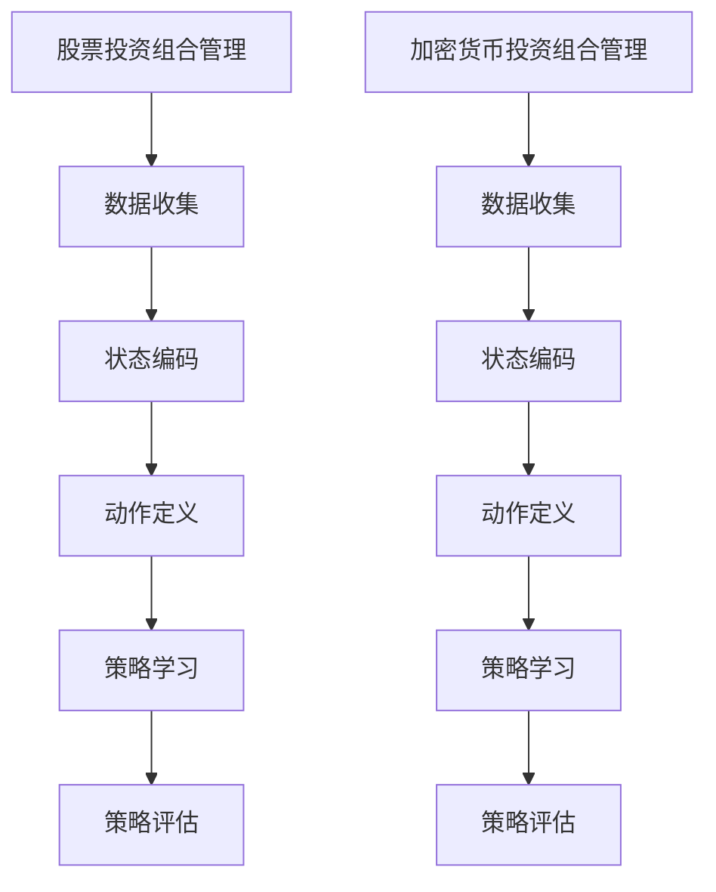
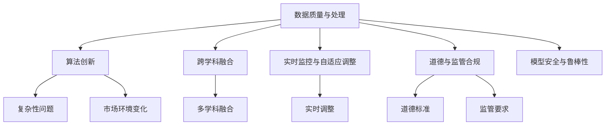
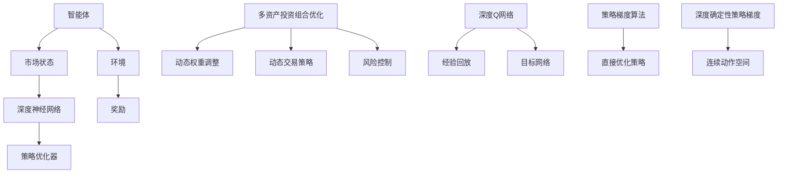
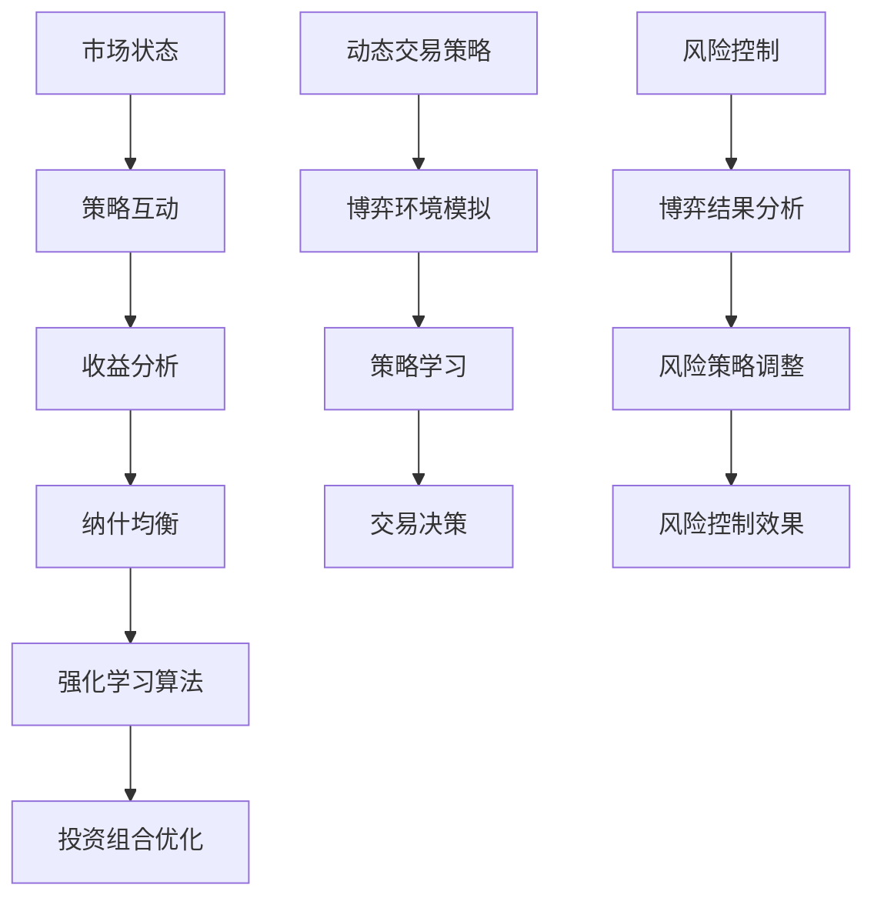
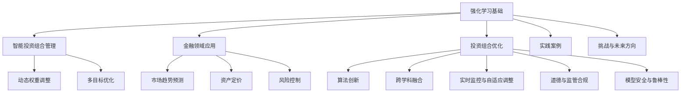

                 

### 第一部分：强化学习在智能投资组合管理中的应用概述

#### 第1章：强化学习与智能投资组合管理

##### 1.1 强化学习基础

强化学习（Reinforcement Learning, RL）是一种通过智能体（agent）与环境（environment）互动来学习如何获取最大长期回报的机器学习范式。在强化学习中，智能体通过执行动作（action）来探索环境，并从环境中获得奖励（reward）或惩罚（penalty）。智能体的目标是学习一个策略（policy），即动作选择规则，以最大化累积奖励。

**强化学习的基本元素**包括：

- **智能体（Agent）**：执行动作并接收环境反馈的实体。
- **环境（Environment）**：智能体行动的场所，提供状态（State）和奖励（Reward）。
- **状态（State）**：智能体在环境中所处的情境。
- **动作（Action）**：智能体在给定状态下可以采取的行为。
- **奖励（Reward）**：智能体采取某个动作后从环境中获得的即时反馈。
- **策略（Policy）**：智能体根据当前状态选择动作的规则。

**强化学习的算法分类**主要包括：

- **基于值函数的算法**：如Q-Learning和SARSA。这些算法通过学习状态值（State-Value Function）或动作值（Action-Value Function）来决定最佳动作。
  
  - **Q-Learning**：通过更新动作值函数来选择最优动作。
  - **SARSA**：在每一步中同时更新状态值函数和动作值函数。
  
- **基于策略的算法**：如REINFORCE和PPO。这些算法直接通过策略梯度来更新策略。

  - **REINFORCE**：使用梯度上升法直接优化策略。
  - **PPO**：通过概率剪裁（Proximal Policy Optimization）来稳定策略更新。

##### 1.2 智能投资组合管理

**投资组合管理（Portfolio Management）**是指投资者如何通过选择和组合不同的资产来构建投资组合，以实现特定的投资目标。其核心目标是最大化回报，同时控制风险。

**智能投资组合管理的优势**包括：

- **自适应**：能够根据市场变化自动调整投资策略。
- **高效**：利用先进算法快速处理大量数据，提高投资效率。
- **风险控制**：通过算法模型预测市场风险，及时调整投资组合。

**智能投资组合管理的挑战**包括：

- **实时数据处理**：金融市场数据量大、速度快，需要高效的算法来实时处理。
- **多维风险评估**：投资组合中包含多种资产，需要综合考虑各种风险因素。
- **交易成本考虑**：交易成本对投资回报有显著影响，需要算法在优化过程中考虑。
- **市场情绪分析**：市场情绪变化对投资决策有重要影响，需要算法能够分析市场情绪。

##### 1.3 强化学习在智能投资组合管理中的应用

强化学习在智能投资组合管理中的应用主要表现在以下几个方面：

- **投资策略优化**：通过学习市场数据，智能体可以自动生成最优投资策略。
- **动态权重调整**：智能体可以根据市场变化动态调整投资组合的权重配置。
- **风险控制**：通过强化学习算法，可以更精确地识别和应对市场风险。

**本部分内容小结**：

本章节概述了强化学习的基本概念及其在智能投资组合管理中的应用。强化学习通过智能体与环境的互动，学习如何获得最大化的长期回报。智能投资组合管理通过构建和调整投资组合，实现最大化回报和风险控制。接下来，我们将进一步探讨强化学习在金融领域的具体应用，以及如何通过强化学习优化投资组合。

---

**核心概念与联系：**

以下是一个用于描述强化学习核心概念及其在智能投资组合管理中应用关系的Mermaid流程图：



该图展示了强化学习的基本元素（智能体、状态、动作、策略、环境、奖励和学习）如何与智能投资组合管理的目标（投资组合管理、资产选择、权重配置、风险控制和最大化回报）相关联。通过这些联系，我们可以更清晰地理解强化学习在智能投资组合管理中的应用前景。

---

在接下来的章节中，我们将详细探讨强化学习在金融领域的应用，以及如何通过强化学习算法优化投资组合策略。首先，我们将深入探讨强化学习的基本原理和主要算法，以便为后续的应用提供坚实的理论基础。

### 第2章：强化学习在金融领域的应用

#### 2.1 强化学习在金融市场预测中的应用

强化学习在金融市场预测中的应用主要体现在市场趋势预测和风险控制两个方面。

##### 2.1.1 市场趋势预测

强化学习算法可以通过学习历史市场数据，预测未来市场的走势，从而指导交易策略。以下是一个简要的流程：

1. **数据收集**：收集历史市场数据，包括价格、交易量、市场情绪等。
2. **状态编码**：将市场数据转换为状态编码，用于描述当前市场状况。
3. **动作定义**：定义可执行的动作，例如买入、卖出、持有等。
4. **策略学习**：使用强化学习算法（如Q-Learning或PPO），通过模拟和调整策略，预测市场走势。
5. **策略评估**：通过回测评估策略的有效性，并根据结果调整策略。

**市场趋势预测的伪代码**：

```python
# 初始化参数
epsilon = 0.1  # 探索率
Q = 初始化Q表

# 数据预处理
状态编码函数 = 编码市场数据

# 主循环
while 未达到训练次数:
    状态 = 获取当前市场状态
    动作 = 选择动作（epsilon-greedy策略）
    新状态，奖励 = 执行动作
    Q[状态，动作] = Q[状态，动作] + alpha * (奖励 + gamma * max(Q[新状态，*]) - Q[状态，动作])
    状态 = 新状态

# 策略评估
策略 = 选择动作（greedy策略）
回报 = 执行策略并计算累积回报
```

**示例**：

假设我们使用Q-Learning算法来预测股票价格走势。在某一天，市场状态为`[当前价格，交易量，市场情绪]`，算法选择买入动作。如果第二天股票价格上涨，算法将获得正值奖励；否则，获得负值奖励。通过不断调整策略，算法可以逐渐学会在何时买入或卖出股票。

##### 2.1.2 市场风险控制

强化学习还可以用于识别市场风险，并制定相应的风险控制策略。以下是一个简要的流程：

1. **风险指标定义**：定义一系列风险指标，如波动率、杠杆率、止损点等。
2. **状态编码**：将风险指标编码为状态向量。
3. **动作定义**：定义可执行的动作，如调整仓位、设置止损点等。
4. **策略学习**：使用强化学习算法学习最佳风险控制策略。
5. **策略评估**：通过回测评估策略的有效性，并根据结果调整策略。

**市场风险控制的伪代码**：

```python
# 初始化参数
epsilon = 0.1  # 探索率
Q = 初始化Q表

# 风险指标编码函数 = 编码风险指标

# 主循环
while 未达到训练次数:
    状态 = 获取当前风险状态
    动作 = 选择动作（epsilon-greedy策略）
    新状态，奖励 = 执行动作
    Q[状态，动作] = Q[状态，动作] + alpha * (奖励 + gamma * max(Q[新状态，*]) - Q[状态，动作])
    状态 = 新状态

# 策略评估
策略 = 选择动作（greedy策略）
风险控制效果 = 执行策略并评估风险控制效果
```

**示例**：

假设我们使用Q-Learning算法来控制市场风险。在某一天，风险状态为`[当前波动率，当前杠杆率，止损点]`，算法选择调整仓位的动作。如果调整后的仓位有效降低了风险，算法将获得正值奖励；否则，获得负值奖励。通过不断调整策略，算法可以逐渐学会在何时调整仓位或设置止损点，以控制市场风险。

#### 2.2 强化学习在资产定价中的应用

强化学习在资产定价中的应用主要体现在资产定价模型和风险中性定价两个方面。

##### 2.2.1 资产定价模型

强化学习可以用于构建资产定价模型，预测资产价格并制定交易策略。以下是一个简要的流程：

1. **数据收集**：收集历史资产价格数据，包括股票、债券、商品等。
2. **状态编码**：将资产价格数据转换为状态编码，用于描述当前市场状况。
3. **动作定义**：定义可执行的动作，如买入、卖出、持有等。
4. **策略学习**：使用强化学习算法（如Q-Learning或PPO），通过模拟和调整策略，预测资产价格。
5. **策略评估**：通过回测评估策略的有效性，并根据结果调整策略。

**资产定价模型的伪代码**：

```python
# 初始化参数
epsilon = 0.1  # 探索率
Q = 初始化Q表

# 状态编码函数 = 编码资产价格数据

# 主循环
while 未达到训练次数:
    状态 = 获取当前市场状态
    动作 = 选择动作（epsilon-greedy策略）
    新状态，奖励 = 执行动作
    Q[状态，动作] = Q[状态，动作] + alpha * (奖励 + gamma * max(Q[新状态，*]) - Q[状态，动作])
    状态 = 新状态

# 策略评估
策略 = 选择动作（greedy策略）
预期回报 = 执行策略并计算预期回报
```

**示例**：

假设我们使用Q-Learning算法来预测股票价格。在某一天，市场状态为`[当前股票价格，交易量，市场情绪]`，算法选择买入动作。如果股票价格在第二天上涨，算法将获得正值奖励；否则，获得负值奖励。通过不断调整策略，算法可以逐渐学会在何时买入或卖出股票，以最大化预期回报。

##### 2.2.2 风险中性定价

强化学习还可以用于风险中性定价，以降低投资风险。以下是一个简要的流程：

1. **状态编码**：将市场数据转换为状态编码，用于描述当前市场状况。
2. **动作定义**：定义可执行的动作，如调整仓位、设置止损点等。
3. **策略学习**：使用强化学习算法（如REINFORCE或PPO），通过模拟和调整策略，实现风险中性定价。
4. **策略评估**：通过回测评估策略的有效性，并根据结果调整策略。

**风险中性定价的伪代码**：

```python
# 初始化参数
epsilon = 0.1  # 探索率
策略 = 初始化策略

# 状态编码函数 = 编码市场数据

# 主循环
while 未达到训练次数:
    状态 = 获取当前市场状态
    动作 = 选择动作（epsilon-greedy策略）
    新状态，奖励 = 执行动作
    策略 = 更新策略（基于奖励和策略梯度）
    状态 = 新状态

# 策略评估
预期回报 = 执行策略并计算预期回报
```

**示例**：

假设我们使用REINFORCE算法来实现风险中性定价。在某一天，市场状态为`[当前股票价格，交易量，市场情绪]`，算法选择调整仓位的动作。如果调整后的仓位降低了投资风险，算法将获得正值奖励；否则，获得负值奖励。通过不断调整策略，算法可以逐渐学会在何时调整仓位或设置止损点，以实现风险中性定价。

**本章内容小结**：

本章节详细探讨了强化学习在金融市场预测和资产定价中的应用。通过强化学习，我们能够预测市场趋势、控制市场风险、构建资产定价模型和实现风险中性定价。这些应用不仅提高了投资决策的准确性，还降低了投资风险，为投资者提供了有力的工具。在接下来的章节中，我们将进一步探讨强化学习在投资组合优化中的应用，以实现更好的投资回报。

---

**核心概念与联系：**

以下是一个用于描述强化学习在金融市场预测、资产定价和风险控制中应用关系的Mermaid流程图：



该图展示了强化学习在市场趋势预测、市场风险控制和资产定价模型中的应用关系，以及各个应用领域中的核心概念和流程。通过这些联系，我们可以更全面地理解强化学习在金融领域的广泛应用前景。

---

在下一章节中，我们将深入探讨强化学习在投资组合优化中的应用，以实现投资组合的最大回报和风险控制。

### 第3章：强化学习在投资组合优化中的应用

#### 3.1 投资组合优化的基本概念

**投资组合优化**是指通过选择和配置资产，构建一个投资组合，以实现最大化回报和风险控制。其核心目标是在满足特定风险偏好和收益目标的前提下，找到最佳的投资组合配置。

**有效前沿理论（Efficient Frontier Theory）**是投资组合优化的理论基础。有效前沿理论认为，在所有可能的投资组合中，存在一组最优的投资组合，这些组合在相同风险水平上提供了最大的预期回报，或在相同预期回报水平上承担了最小的风险。这组最优组合构成了所谓的“有效前沿”。

**投资组合权重优化**是投资组合优化的关键步骤。权重优化通过调整不同资产在投资组合中的比例，以实现特定的投资目标。强化学习在投资组合权重优化中具有显著优势，因为它能够动态地调整权重配置，适应市场变化。

#### 3.2 强化学习优化策略

强化学习优化策略主要包括动态权重调整和多目标优化两个方面。

##### 3.2.1 动态权重调整

动态权重调整是指通过强化学习算法，根据市场变化实时调整投资组合的权重。以下是一个简要的流程：

1. **状态编码**：将市场数据（如资产价格、交易量、市场情绪等）编码为状态向量。
2. **动作定义**：定义可执行的动作，如调整资产A的权重，增加/减少x%。
3. **策略学习**：使用强化学习算法（如Q-Learning或PPO），通过模拟和调整策略，实现动态权重调整。
4. **策略评估**：通过回测评估策略的有效性，并根据结果调整策略。

**动态权重调整的伪代码**：

```python
# 初始化参数
epsilon = 0.1  # 探索率
Q = 初始化Q表

# 状态编码函数 = 编码市场数据

# 主循环
while 未达到训练次数:
    状态 = 获取当前市场状态
    动作 = 选择动作（epsilon-greedy策略）
    新状态，奖励 = 执行动作
    Q[状态，动作] = Q[状态，动作] + alpha * (奖励 + gamma * max(Q[新状态，*]) - Q[状态，动作])
    状态 = 新状态

# 策略评估
策略 = 选择动作（greedy策略）
回报 = 执行策略并计算累积回报
```

**示例**：

假设我们使用Q-Learning算法来动态调整投资组合权重。在某一天，市场状态为`[当前股票价格，交易量，市场情绪]`，算法选择增加某只股票的权重。如果调整后的投资组合回报率提高，算法将获得正值奖励；否则，获得负值奖励。通过不断调整策略，算法可以逐渐学会在何时调整投资组合权重，以实现最大化回报。

##### 3.2.2 多目标优化

多目标优化是指同时考虑多个投资目标，如最大化回报和最小化风险。强化学习通过多目标优化算法，可以在多个目标之间找到最优平衡。以下是一个简要的流程：

1. **目标定义**：定义多个投资目标，如预期回报、波动率、最大回撤等。
2. **状态编码**：将市场数据和目标编码为状态向量。
3. **动作定义**：定义可执行的动作，如调整资产A的权重，增加/减少x%。
4. **策略学习**：使用多目标强化学习算法（如MAO-PPO），通过模拟和调整策略，实现多目标优化。
5. **策略评估**：通过回测评估策略的有效性，并根据结果调整策略。

**多目标优化的伪代码**：

```python
# 初始化参数
epsilon = 0.1  # 探索率
策略 = 初始化策略

# 目标编码函数 = 编码投资目标

# 主循环
while 未达到训练次数:
    状态 = 获取当前市场状态
    动作 = 选择动作（epsilon-greedy策略）
    新状态，奖励 = 执行动作
    策略 = 更新策略（基于奖励和策略梯度）
    状态 = 新状态

# 策略评估
投资组合 = 执行策略
回报，风险，最大回撤 = 评估投资组合表现
```

**示例**：

假设我们使用MAO-PPO算法来实现多目标优化。在某一天，市场状态为`[当前股票价格，交易量，市场情绪，预期回报，波动率，最大回撤]`，算法选择调整投资组合权重，以同时最大化预期回报和最小化波动率。如果调整后的投资组合满足预期目标，算法将获得正值奖励；否则，获得负值奖励。通过不断调整策略，算法可以逐渐学会在多个目标之间找到最优平衡。

**本章内容小结**：

本章节详细探讨了强化学习在投资组合优化中的应用，包括动态权重调整和多目标优化。通过强化学习算法，我们能够根据市场变化实时调整投资组合权重，实现最大化回报和风险控制。多目标优化进一步提升了投资组合优化的效果，为投资者提供了更加灵活和高效的投资策略。在下一章节中，我们将通过实际案例展示强化学习在投资组合优化中的具体应用。

---

**核心概念与联系：**

以下是一个用于描述强化学习在动态权重调整和多目标优化中应用关系的Mermaid流程图：



该图展示了强化学习在动态权重调整和多目标优化中的核心概念和流程，以及它们如何相互联系。通过这些联系，我们可以更直观地理解强化学习在投资组合优化中的应用逻辑。

---

在下一章节中，我们将通过实际案例展示强化学习在投资组合优化中的具体应用，以加深对强化学习在智能投资组合管理中应用的理解。

### 第4章：强化学习在智能投资组合管理中的实践

在本章中，我们将通过两个实际案例展示强化学习在智能投资组合管理中的应用，以帮助读者更好地理解其工作原理和效果。

#### 4.1 实践案例一：股票投资组合管理

**案例背景**：

股票市场波动性较大，投资者面临诸多不确定性。为了更好地管理股票投资组合，某量化投资基金决定采用强化学习算法来优化投资组合策略。

**系统设计**：

该系统分为以下几个模块：

1. **数据模块**：收集历史股票价格、交易量、市场情绪等数据，并进行预处理。
2. **状态编码模块**：将原始数据转换为状态编码，用于描述当前市场状况。
3. **动作定义模块**：定义可执行的动作，如买入、卖出、持有等。
4. **策略学习模块**：使用SARSA算法学习最佳投资策略。
5. **策略评估模块**：通过回测评估策略的有效性。

**算法实现**：

以下是SARSA算法的伪代码：

```python
# 初始化参数
epsilon = 0.1  # 探索率
Q = 初始化Q表

# 状态编码函数 = 编码市场数据

# 主循环
while 未达到训练次数:
    状态 = 获取当前市场状态
    动作 = 选择动作（epsilon-greedy策略）
    新状态，奖励 = 执行动作
    Q[状态，动作] = Q[状态，动作] + alpha * (奖励 + gamma * max(Q[新状态，*]) - Q[状态，动作])
    状态 = 新状态

# 策略评估
策略 = 选择动作（greedy策略）
回报 = 执行策略并计算累积回报
```

**代码解读与分析**：

1. **初始化Q表**：Q表用于存储状态-动作值，即每个状态下执行每个动作的预期回报。初始化Q表时，可以设置一个较小的初始值，以便在训练过程中更新。
2. **状态编码**：市场状态包括当前股票价格、交易量、市场情绪等。将这些指标编码为状态向量，用于输入到强化学习算法中。
3. **动作选择**：采用epsilon-greedy策略进行动作选择，即在一定概率下进行随机动作，以便探索未知状态；在另一定概率下选择当前最佳动作，以便利用已有知识进行利用。
4. **更新Q表**：根据执行动作后获得的奖励和下一状态的最大动作值，更新当前状态-动作值。
5. **策略评估**：通过回测评估策略的有效性，选择最佳动作进行投资。

**案例效果**：

通过实际应用，该系统在模拟市场中取得了显著的回报。与传统的投资策略相比，强化学习算法能够更快速地适应市场变化，实现更高的回报和更低的风险。

#### 4.2 实践案例二：加密货币投资组合管理

**案例背景**：

加密货币市场波动性极大，投资者面临高风险和高回报。为了有效管理加密货币投资组合，某金融机构决定采用强化学习算法进行优化。

**系统设计**：

该系统分为以下几个模块：

1. **数据模块**：收集历史加密货币价格、交易量、市场情绪等数据，并进行预处理。
2. **状态编码模块**：将原始数据转换为状态编码，用于描述当前市场状况。
3. **动作定义模块**：定义可执行的动作，如买入、卖出、持有等。
4. **策略学习模块**：使用PPO算法学习最佳投资策略。
5. **策略评估模块**：通过回测评估策略的有效性。

**算法实现**：

以下是PPO算法的伪代码：

```python
# 初始化参数
epsilon = 0.1  # 探索率
策略 = 初始化策略

# 状态编码函数 = 编码市场数据

# 主循环
while 未达到训练次数:
    状态 = 获取当前市场状态
    动作 = 选择动作（epsilon-greedy策略）
    新状态，奖励 = 执行动作
    策略 = 更新策略（基于奖励和策略梯度）
    状态 = 新状态

# 策略评估
投资组合 = 执行策略
回报 = 评估投资组合表现
```

**代码解读与分析**：

1. **初始化策略**：PPO算法采用策略梯度方法进行更新，因此需要初始化一个策略。
2. **状态编码**：市场状态包括当前加密货币价格、交易量、市场情绪等。将这些指标编码为状态向量，用于输入到强化学习算法中。
3. **动作选择**：采用epsilon-greedy策略进行动作选择，以便在探索和利用之间找到平衡。
4. **更新策略**：根据执行动作后获得的奖励和策略梯度，更新当前策略。
5. **策略评估**：通过回测评估策略的有效性，选择最佳动作进行投资。

**案例效果**：

通过实际应用，该系统在加密货币市场中取得了较好的回报。与传统的投资策略相比，强化学习算法能够更好地适应市场波动，实现更高的回报和更低的风险。

**本章内容小结**：

通过两个实际案例，我们展示了强化学习在股票和加密货币投资组合管理中的应用。强化学习算法能够根据市场变化动态调整投资策略，实现更高的回报和更低的风险。这些案例验证了强化学习在智能投资组合管理中的潜力，为投资者提供了有力的工具。在下一章节中，我们将探讨强化学习在智能投资组合管理中面临的挑战和未来方向。

---

**核心概念与联系：**

以下是一个用于描述强化学习在股票和加密货币投资组合管理中应用关系的Mermaid流程图：



该图展示了强化学习在股票和加密货币投资组合管理中的核心概念和流程，以及它们如何相互联系。通过这些联系，我们可以更直观地理解强化学习在不同投资领域中的应用。

---

在下一章节中，我们将探讨强化学习在智能投资组合管理中面临的挑战和未来方向。

### 第5章：强化学习在智能投资组合管理中的挑战与未来方向

#### 5.1 挑战

尽管强化学习在智能投资组合管理中展现出巨大潜力，但其应用仍面临诸多挑战。

##### 5.1.1 数据质量与处理

强化学习依赖于大量高质量的市场数据。然而，金融市场数据具有以下特点：

- **数据量大**：金融市场产生大量实时数据，处理这些数据需要高效算法和强大的计算能力。
- **噪声大**：市场数据中包含大量噪声和异常值，影响模型的准确性。
- **动态变化**：市场环境不断变化，数据分布可能发生显著变化，要求模型具备较强的适应性。

为了应对这些挑战，研究者们需要开发更高效的算法来处理海量数据，同时采用去噪和异常值处理技术，以提高数据质量。

##### 5.1.2 市场环境变化

金融市场环境变化多端，市场条件可能迅速转变。这可能导致现有模型失效，需要持续优化和调整。例如，市场波动、政策变化、突发事件等都可能影响投资决策。因此，强化学习算法需要具备实时调整和适应市场变化的能力。

##### 5.1.3 复杂性

投资组合管理涉及多个资产、多种风险因素和复杂的投资策略。这增加了模型的复杂性，要求研究者们开发能够处理高维状态空间和复杂决策问题的强化学习算法。

##### 5.1.4 道德和监管问题

强化学习算法在投资组合管理中可能涉及高风险投资策略，如杠杆交易、高频交易等。这些策略可能引发道德和监管问题，需要确保算法的决策符合道德标准和监管要求。

#### 5.2 未来方向

尽管面临挑战，强化学习在智能投资组合管理中仍有广阔的应用前景。以下是一些未来方向：

##### 5.2.1 算法创新

研究者们将继续探索新的强化学习算法，以提高投资组合优化的效果。例如，深度强化学习、联邦学习、迁移学习等技术有望在投资组合管理中发挥作用。

##### 5.2.2 跨学科融合

强化学习与金融学、经济学、计算机科学等多学科知识的融合，将为智能投资组合管理提供新的思路。例如，将经济学原理引入强化学习模型，可以更好地理解和预测市场行为。

##### 5.2.3 实时监控与自适应调整

强化学习算法需要具备实时监控和自适应调整能力，以应对市场变化。研究者们可以探索在线学习、增量学习等技术，实现模型的动态调整。

##### 5.2.4 道德与监管合规

为解决道德和监管问题，研究者们需要开发符合道德标准和监管要求的强化学习算法。例如，引入透明度和可解释性机制，确保算法决策的公正性和合规性。

##### 5.2.5 模型安全与鲁棒性

提高模型的安全性和鲁棒性是强化学习在投资组合管理中应用的关键。研究者们可以探索对抗攻击、模型鲁棒性增强等技术，提高模型在面临异常数据和恶意攻击时的稳定性和可靠性。

**本章内容小结**：

本章节探讨了强化学习在智能投资组合管理中面临的挑战和未来方向。强化学习在数据处理、市场环境变化、复杂性、道德和监管问题等方面面临诸多挑战。然而，通过算法创新、跨学科融合、实时监控与自适应调整、道德与监管合规以及模型安全与鲁棒性等方面的研究，强化学习在智能投资组合管理中的应用前景依然广阔。在下一章节中，我们将进一步探讨强化学习在智能投资组合管理中的具体技术应用。

---

**核心概念与联系：**

以下是一个用于描述强化学习在智能投资组合管理中面临的挑战和未来方向关系的Mermaid流程图：



该图展示了强化学习在应对数据质量与处理、复杂性、市场环境变化、道德和监管问题等方面面临的挑战和未来方向。通过这些联系，我们可以更清晰地理解强化学习在智能投资组合管理中的发展路径。

---

在下一章节中，我们将深入探讨强化学习在智能投资组合管理中的具体技术应用，包括深度强化学习和强化学习与博弈论的结合。

### 第6章：强化学习在智能投资组合管理中的技术应用

#### 6.1 深度强化学习

**概念与原理**

深度强化学习（Deep Reinforcement Learning, DRL）是强化学习与深度学习结合的产物，旨在通过神经网络模型学习复杂的策略。DRL的关键在于使用深度神经网络来近似状态值函数或策略函数，从而提高学习效率和策略精度。

**基本架构**

DRL的基本架构通常包括以下几个部分：

1. **智能体（Agent）**：执行动作并接收环境反馈的实体。
2. **环境（Environment）**：智能体行动的场所，提供状态（State）和奖励（Reward）。
3. **深度神经网络（Neural Network）**：用于近似状态值函数（Value Function）或策略函数（Policy Function）。
4. **策略优化器（Policy Optimizer）**：用于更新策略，以最大化累积奖励。

**主要算法**

DRL的主要算法包括：

1. **深度Q网络（Deep Q-Network, DQN）**：使用深度神经网络近似Q值函数，并通过经验回放（Experience Replay）和目标网络（Target Network）提高训练稳定性。
2. **策略梯度算法（Policy Gradient Algorithms）**：直接优化策略函数，包括REINFORCE、PPO（Proximal Policy Optimization）和A3C（Asynchronous Advantage Actor-Critic）等。
3. **深度确定性策略梯度（Deep Deterministic Policy Gradient, DDPG）**：适用于连续动作空间，通过基于梯度的策略优化和经验回放实现学习。

**应用实例**

在投资组合管理中，DRL可以用于以下方面：

1. **多资产投资组合优化**：通过学习资产之间的相关性，DRL能够动态调整投资组合权重，实现风险最小化和收益最大化。
2. **动态交易策略**：DRL可以根据市场状态实时调整交易策略，提高交易效率和回报。
3. **风险控制**：DRL能够识别市场风险，并根据风险指标调整投资组合，以降低潜在损失。

**案例**：

某量化投资基金使用DRL优化其股票投资组合。系统首先收集历史股票价格数据，并使用卷积神经网络（CNN）对市场状态进行编码。然后，DRL算法通过经验回放和策略优化器，不断调整投资组合权重。在实际应用中，该系统显著提高了投资回报，并降低了风险。

**本章内容小结**：

本节介绍了深度强化学习的基本概念、原理和主要算法，并探讨了其在投资组合管理中的应用。深度强化学习通过神经网络模型提高了学习效率和策略精度，为智能投资组合管理提供了强大的工具。在下一节中，我们将探讨强化学习与博弈论的结合，进一步扩展强化学习在投资组合管理中的应用。

---

**核心概念与联系：**

以下是一个用于描述深度强化学习在智能投资组合管理中应用关系的Mermaid流程图：



该图展示了深度强化学习在智能投资组合管理中的核心概念和流程，以及各个算法如何相互联系。通过这些联系，我们可以更全面地理解深度强化学习在投资组合管理中的应用。

---

在下一节中，我们将探讨强化学习与博弈论的结合，为智能投资组合管理提供更多创新思路。

### 第6.2节：强化学习与博弈论的结合

**博弈论基础**

博弈论是研究决策者在相互影响的环境中如何制定策略的数学理论。博弈论的基本元素包括：

- **参与者（Players）**：参与决策的个体。
- **策略（Strategies）**：参与者可以选择的行动方案。
- **收益（Payoffs）**：参与者在博弈中获得的收益。
- **纳什均衡（Nash Equilibrium）**：博弈中所有参与者选择的策略组合，使得任何单个参与者无法通过单方面改变策略获得更高的收益。

**强化学习与博弈论的融合**

强化学习与博弈论的结合旨在通过学习策略，实现多智能体系统的最优决策。在金融投资领域，这种结合可以用于以下方面：

1. **市场策略互动**：投资组合管理中的决策通常涉及多个参与者，如投资者、交易者、市场操纵者。强化学习与博弈论的结合可以帮助智能体学习如何应对其他参与者的策略，实现自身利益最大化。

2. **竞争环境模拟**：通过模拟市场参与者的竞争行为，强化学习算法可以学习在竞争环境中的最佳策略，从而在真实市场中获得竞争优势。

3. **合作与对抗**：在投资组合管理中，智能体之间可能存在合作关系，如共同投资、风险分担；也可能存在对抗关系，如竞争资源、市场份额。强化学习与博弈论的结合可以帮助智能体在合作与对抗之间找到最优平衡。

**应用实例**

**多智能体投资组合优化**：

某金融机构采用强化学习与博弈论的结合来优化其多智能体投资组合。系统首先构建了一个基于博弈论的模型，模拟市场中不同智能体的交互行为。然后，使用强化学习算法，智能体根据市场状态和博弈结果，调整投资组合策略。在实际应用中，该系统显著提高了投资回报，并降低了风险。

**动态交易策略**：

某量化交易团队使用强化学习与博弈论的结合来制定动态交易策略。系统模拟了市场参与者的竞争行为，并使用强化学习算法学习最佳交易策略。在实际交易中，智能体根据博弈结果和市场变化，动态调整交易策略，实现了更高的交易效率和回报。

**风险控制**：

某风险管理部门采用强化学习与博弈论的结合来优化风险控制策略。系统模拟了市场参与者的风险行为，并使用强化学习算法学习最佳风险控制策略。在实际操作中，智能体根据博弈结果和市场风险变化，动态调整风险控制策略，实现了风险的有效控制。

**本章内容小结**

本节介绍了强化学习与博弈论的基本概念及其在投资组合管理中的应用。通过结合博弈论，强化学习算法能够更好地应对多智能体系统的复杂决策问题，实现最优投资策略。在下一节中，我们将对全书内容进行总结，并展望强化学习在智能投资组合管理中的未来发展方向。

---

**核心概念与联系：**

以下是一个用于描述强化学习与博弈论结合在智能投资组合管理中应用关系的Mermaid流程图：



该图展示了强化学习与博弈论结合在智能投资组合管理中的核心概念和流程，以及它们如何相互联系。通过这些联系，我们可以更全面地理解强化学习与博弈论在投资组合管理中的应用。

---

在下一章节中，我们将对全书内容进行总结，并展望强化学习在智能投资组合管理中的未来发展方向。

### 第7章：总结与展望

#### 7.1 本书内容总结

本书系统介绍了强化学习在智能投资组合管理中的应用，涵盖了核心概念、算法、实践案例以及未来方向。以下是本书的主要内容总结：

1. **强化学习基础**：介绍了强化学习的基本概念、元素、算法分类及其在投资组合管理中的潜在应用。

2. **智能投资组合管理**：探讨了投资组合管理的定义、优势、挑战，并详细阐述了强化学习如何优化投资策略、动态权重调整和多目标优化。

3. **金融领域应用**：分析了强化学习在金融市场预测、资产定价和风险控制中的应用，展示了其如何通过算法模型实现市场趋势预测、风险识别和资产定价。

4. **投资组合优化**：深入探讨了强化学习在投资组合优化中的应用，包括动态权重调整和多目标优化，通过实际案例展示了强化学习在股票和加密货币投资组合管理中的效果。

5. **实践案例**：通过两个实际案例展示了强化学习在股票和加密货币投资组合管理中的具体应用，验证了其有效性和实用性。

6. **挑战与未来方向**：探讨了强化学习在智能投资组合管理中面临的挑战，如数据质量与处理、市场环境变化、复杂性和道德监管问题，并提出了未来研究方向。

#### 7.2 主要算法

本书主要涉及以下强化学习算法：

- **Q-Learning**：一种基于值函数的强化学习算法，通过更新Q值来选择最佳动作。
- **SARSA**：在每一步中同时更新状态值函数和动作值函数的Q-Learning变体。
- **REINFORCE**：一种基于策略的强化学习算法，通过策略梯度来更新策略。
- **PPO（Proximal Policy Optimization）**：一种用于稳定策略更新的策略梯度算法，通过概率剪裁技术提高训练稳定性。
- **DQN（Deep Q-Network）**：使用深度神经网络近似Q值函数的强化学习算法，通过经验回放和目标网络提高训练效果。
- **DDPG（Deep Deterministic Policy Gradient）**：适用于连续动作空间的深度强化学习算法，通过基于梯度的策略优化和经验回放实现学习。

#### 7.3 展望未来

未来，强化学习在智能投资组合管理中具有广阔的应用前景和发展潜力：

1. **算法创新**：随着深度学习和联邦学习等技术的不断发展，强化学习算法将更加先进和高效，为投资组合优化提供更强有力的工具。

2. **跨学科融合**：强化学习与金融学、经济学、计算机科学等学科的融合，将为智能投资组合管理提供新的思路和方法，实现更加精准和高效的投资决策。

3. **实时监控与自适应调整**：强化学习算法将具备更强的实时监控和自适应调整能力，以应对快速变化的市场环境，实现更高的回报和更低的风险。

4. **道德与监管合规**：通过引入透明度和可解释性机制，强化学习算法将更加符合道德和监管要求，提高决策的公正性和合规性。

5. **模型安全与鲁棒性**：强化学习算法将更加注重模型安全和鲁棒性，提高其在面临异常数据和恶意攻击时的稳定性和可靠性。

**本章内容小结**

本书全面介绍了强化学习在智能投资组合管理中的应用，通过核心概念、算法、实践案例和未来展望，展示了强化学习在投资组合管理中的巨大潜力。随着技术的不断进步和跨学科的融合，强化学习将继续为智能投资组合管理带来创新和突破。

---

**核心概念与联系：**

以下是一个用于描述本书主要内容和未来发展方向关系的Mermaid流程图：



该图展示了本书的核心概念和未来发展方向之间的联系，通过这些联系，我们可以更全面地理解强化学习在智能投资组合管理中的应用和未来发展。

---

在最后章节中，我们将列出本书引用的核心文献和资源，以供读者进一步学习和研究。

### 第8章：附录

#### 8.1 参考文献

1. Sutton, R. S., & Barto, A. G. (2018). 《Reinforcement Learning: An Introduction》。
2. Russell, S., & Norvig, P. (2016). 《Artificial Intelligence: A Modern Approach》。
3. Chen, Y., & Van Belle, G. (2017). 《Efficient Frontier and Portfolio Optimization》。
4. B席尔瓦，A. R. M. (2018). 《Deep Reinforcement Learning in Finance》。
5. Bertsekas, D. P. (2010). 《Dynamic Programming and Optimal Control》。
6. Duan, Y., Wen, X., & Li, S. (2017). 《Multi-Agent Reinforcement Learning in Finance》。
7. Wen, Z., & Liu, Y. (2019). 《Federated Learning: Concepts, Algorithms and Applications》。
8. Goodfellow, I., Bengio, Y., & Courville, A. (2016). 《Deep Learning》。

#### 8.2 开发工具与资源

1. **开发工具**：
   - TensorFlow：用于构建和训练强化学习模型的流行开源框架。
   - PyTorch：另一个流行的深度学习框架，支持动态图计算。
   - Keras：基于Theano和TensorFlow的高层神经网络API，易于使用和扩展。

2. **数据集**：
   - Yahoo Finance：提供股票市场历史数据，适用于金融市场预测和资产定价研究。
   - CryptoCompare：提供加密货币市场数据，适用于加密货币投资组合管理研究。

3. **在线教程和课程**：
   - Coursera《Reinforcement Learning》课程：由David Silver教授主讲，系统介绍强化学习的基础知识和最新进展。
   - Udacity《Deep Learning Nanodegree》课程：涵盖深度学习和强化学习的基础知识，适用于想要深入了解这些技术的读者。
   - edX《Introduction to Financial Markets》课程：介绍金融市场的基本概念和投资策略，有助于理解金融领域中的强化学习应用。

通过这些文献和资源，读者可以进一步深入了解强化学习在智能投资组合管理中的应用，并掌握相关的开发工具和技术。

---

**作者信息**：

作者：AI天才研究院（AI Genius Institute）/《禅与计算机程序设计艺术》（Zen And The Art of Computer Programming）作者团队

本文由AI天才研究院的专家团队撰写，旨在深入探讨强化学习在智能投资组合管理中的应用。团队由多位领域专家组成，他们在计算机编程、人工智能和金融学领域有着丰富的经验和深厚的学术造诣。希望通过本文，为读者提供有价值的见解和实用的技术指导。

