                 

# 强化学习在智能电网需求响应中的优化

> **关键词**: 强化学习、智能电网、需求响应、优化策略、数学模型

> **摘要**: 本文深入探讨了强化学习在智能电网需求响应中的应用与优化策略。通过对强化学习基础概念和智能电网需求响应背景的介绍，详细分析了强化学习在智能电网需求响应中的核心概念与应用场景，并借助Mermaid流程图展现了其整体架构。接着，本文详细解释了强化学习在智能电网需求响应中的三种主要算法——Q学习算法、策略梯度方法，以及数学模型和公式的应用。最后，通过一个实际项目实战，展示了强化学习在智能电网需求响应中的实现与应用，并对优化策略与挑战进行了深入讨论。

### 强化学习基础与智能电网需求响应背景

#### 第1章 强化学习概述

##### 1.1 强化学习的定义与核心概念

强化学习是一种通过与环境互动来学习最优行为策略的机器学习方法。它的核心概念包括状态（State）、动作（Action）、奖励（Reward）和价值函数（Value Function）。

- **状态**：指环境当前所处的状态，可以用一个状态向量表示。
- **动作**：指智能体可以采取的动作，同样可以用一个动作向量表示。
- **奖励**：指智能体在每个状态执行每个动作后获得的即时奖励，可以是正的、负的或者零。
- **策略**：指智能体在给定状态下采取某个动作的概率分布。
- **价值函数**：指智能体在某个状态执行某个动作后长期获得的期望奖励。

##### 1.2 强化学习的主要算法

强化学习的主要算法包括Q学习算法、策略梯度方法等。

- **Q学习算法**：基于价值函数的强化学习算法，通过迭代更新Q值来学习最优策略。
  - **伪代码**：
    ```plaintext
    Q(s,a) = (1 - α)Q(s,a) + α[r(s,a) + γmax_{a'} Q(s',a')]
    ```
  - **算法描述**：每次智能体在状态s执行动作a，根据获得的即时奖励r(s,a)和未来的最大期望奖励γmax_{a'} Q(s',a')来更新Q值。

- **策略梯度方法**：直接基于策略的强化学习算法，通过优化策略来最大化累积奖励。
  - **伪代码**：
    ```plaintext
    θ = θ - α∇θJ(θ)
    ```
  - **算法描述**：每次智能体在状态s执行动作a，根据策略π(a|s)和累积奖励J(θ)来更新策略参数θ。

##### 1.3 强化学习与其他机器学习方法的比较

强化学习与其他机器学习方法（如监督学习和无监督学习）有显著的不同：

- **监督学习**：有标签的数据集用于训练，目标是学习输入和输出之间的关系。
- **无监督学习**：没有标签的数据集用于训练，目标是发现数据中的内在结构和模式。
- **强化学习**：通过与环境的交互来学习，目标是最优策略或值函数，需要考虑即时奖励和长期奖励。

### 第2章 智能电网与需求响应概述

##### 2.1 智能电网的概念与组成部分

**智能电网**（Smart Grid）是指通过现代通信技术、信息技术、控制技术和能源管理技术等，将电力系统的各个环节（发电、输电、配电、用电）进行智能化升级和整合的电力系统。

- **发电**：包括各种发电方式，如化石燃料、可再生能源等。
- **输电**：将电力从发电站输送到负荷中心。
- **配电**：将电力分配到各个用电点。
- **用电**：各种电力负荷，如工业、商业、居民等。

##### 2.2 需求响应的定义与分类

**需求响应**（Demand Response）是指电力用户根据市场价格信号或其他激励措施，调整其用电行为，以实现电网运行优化和节能减排的目的。

- **基于价格的需求响应**：通过市场价格信号激励用户调整用电行为。
- **基于信号的需求响应**：通过电网调度信号激励用户调整用电行为。

##### 2.3 智能电网需求响应的意义与挑战

**意义**：

- 提高电网运行效率和稳定性。
- 降低电力系统运行成本。
- 促进可再生能源的消纳。

**挑战**：

- **数据质量**：实时数据质量直接影响需求响应的效果。
- **延迟**：实时性要求高，延迟可能导致需求响应不及时。
- **实时性**：需要快速响应市场信号和电网调度信号。

## 第二部分: 强化学习在智能电网需求响应中的应用

### 第3章 强化学习在智能电网需求响应中的核心概念与联系

##### 3.1 强化学习在智能电网需求响应中的应用场景

强化学习在智能电网需求响应中有多种应用场景，主要包括以下几个方面：

- **能量管理**：通过优化电网中的能量分配，提高电网的运行效率和稳定性。
- **电力负荷预测**：预测未来电力负荷，以便进行有效的需求响应和电力调度。
- **调频服务**：提供频率调节服务，帮助电网保持稳定运行。

##### 3.2 强化学习的Mermaid流程图

为了更好地理解强化学习在智能电网需求响应中的应用，我们可以使用Mermaid流程图来展示其整体架构。

```mermaid
graph TD
    A[能量管理] --> B[电力负荷预测]
    A --> C[调频服务]
    B --> D[电网稳定性分析]
    C --> E[电力调度优化]
    B --> F[实时数据预测]
    C --> G[频率调节优化]
    D --> H[电网稳定性保障]
    E --> I[调度计划优化]
    F --> J[实时预测误差校正]
    G --> K[频率调节效率提升]
    H --> L[电网运行风险控制]
    I --> M[调度计划灵活性]
    J --> N[预测准确性提升]
    K --> O[频率调节响应速度]
    L --> P[电网安全稳定运行]
    M --> Q[调度计划合理性]
    N --> R[预测稳定性提高]
    O --> S[频率调节稳定性]
```



### 第4章 强化学习算法在智能电网需求响应中的应用

##### 4.1 Q学习算法在智能电网需求响应中的应用

Q学习算法是一种基于价值函数的强化学习算法，可以应用于智能电网需求响应中的多个场景。

**应用场景**：

- 能量管理：通过优化电网中的能量分配，提高电网的运行效率和稳定性。
- 调频服务：提供频率调节服务，帮助电网保持稳定运行。

**伪代码**：


**算法描述**：

1. 初始化Q值。
2. 进入循环，每次循环执行以下步骤：
   - 选择动作。
   - 执行动作，获得奖励。
   - 根据奖励更新Q值。
3. 当达到指定条件时，结束循环。

##### 4.2 策略梯度方法在智能电网需求响应中的应用

策略梯度方法是一种直接优化策略的强化学习算法，可以应用于智能电网需求响应中的多个场景。

**应用场景**：

- 电力负荷预测：预测未来电力负荷，以便进行有效的需求响应和电力调度。
- 调度优化：优化电网调度计划，提高电网的运行效率和稳定性。

**伪代码**：


**算法描述**：

1. 初始化策略参数。
2. 进入循环，每次循环执行以下步骤：
   - 根据策略执行动作。
   - 获得奖励。
   - 根据奖励计算策略梯度。
   - 根据策略梯度更新策略参数。
3. 当达到指定条件时，结束循环。

##### 4.3 强化学习算法的比较与选择

在智能电网需求响应中，选择合适的强化学习算法非常重要。以下是Q学习算法和策略梯度方法的比较与选择依据：

- **Q学习算法**：
  - 优点：简单易懂，易于实现；可以处理连续动作空间。
  - 缺点：可能陷入局部最优；需要大量数据支持。
  - 适用场景：能量管理、调频服务。

- **策略梯度方法**：
  - 优点：直接优化策略，收敛速度较快；可以处理高维动作空间。
  - 缺点：对奖励函数的设计要求较高；可能产生过拟合。
  - 适用场景：电力负荷预测、调度优化。

### 第5章 强化学习在智能电网需求响应中的数学模型和数学公式

##### 5.1 强化学习的基本数学模型

强化学习的基本数学模型包括状态转移概率、奖励函数和价值函数。

- **状态转移概率**：描述智能体在给定状态下采取某个动作后，环境转移到下一个状态的概率。
  - 公式：
    $$P(s'|s,a) = \begin{cases} 
    1 & \text{if } s' = s + a \\
    0 & \text{otherwise}
    \end{cases}$$

- **奖励函数**：描述智能体在给定状态下采取某个动作后，获得的即时奖励。
  - 公式：
    $$r(s,a) = \begin{cases} 
    r_{\text{max}} & \text{if } s \text{ is a terminal state} \\
    0 & \text{otherwise}
    \end{cases}$$

- **价值函数**：描述智能体在给定状态下采取某个动作后，长期获得的期望奖励。
  - 公式：
    $$V^*(s) = \sum_{a} \pi(a|s)Q^*(s,a)$$

##### 5.2 强化学习的数学公式

强化学习的数学公式主要包括Q学习和策略梯度方法的更新公式。

- **Q学习算法更新公式**：
  $$Q(s,a) = (1 - α)Q(s,a) + α[r(s,a) + γ\max_{a'} Q(s',a')]$$

- **策略梯度方法更新公式**：
  $$θ = θ - α\frac{∇θJ(θ)}{∇θJ(θ)^T∇θJ(θ)}$$

##### 5.3 数学公式详细讲解与举例说明

**状态转移概率的推导与举例**：

- **推导**：

  假设智能体在状态s采取动作a，环境转移到状态s'的概率为P(s'|s,a)，则：

  $$P(s'|s,a) = \begin{cases} 
  1 & \text{if } s' = s + a \\
  0 & \text{otherwise}
  \end{cases}$$

  其中，s + a表示智能体在状态s采取动作a后，环境转移到的新状态。

- **举例**：

  假设智能体在状态s = [1, 2, 3]采取动作a = [4, 5]，则环境转移到状态s' = [5, 6, 7]的概率为1，其他状态的概率为0。

**奖励函数的设计与举例**：

- **设计**：

  奖励函数的设计取决于应用场景。以下是一个简单的奖励函数设计：

  $$r(s,a) = \begin{cases} 
  r_{\text{max}} & \text{if } s \text{ is a terminal state} \\
  0 & \text{otherwise}
  \end{cases}$$

  其中，r_{\text{max}}为最大奖励值，表示智能体在终端状态获得的即时奖励。

- **举例**：

  假设智能体在状态s = [1, 2, 3]采取动作a = [4, 5]，则奖励函数r(s,a)的值为0，因为s不是终端状态。

## 第6章 强化学习在智能电网需求响应中的项目实战

### 6.1 项目背景与目标

**项目背景**：

随着全球能源需求的不断增长和可再生能源的广泛应用，智能电网的需求响应成为电网运行和管理的重要手段。本项目旨在通过强化学习技术，实现智能电网需求响应的优化，提高电网的运行效率和稳定性。

**项目目标**：

- 实现智能电网需求响应的实时预测和调控。
- 提高电力负荷预测的准确性，降低预测误差。
- 优化电网调度计划，提高电网运行效率。

### 6.2 开发环境搭建

为了实现本项目，我们需要搭建一个合适的开发环境。以下是具体的配置步骤：

1. 安装Python环境（版本3.8及以上）。
2. 安装强化学习相关库（如TensorFlow、PyTorch等）。
3. 安装数据预处理和可视化工具（如NumPy、Matplotlib等）。
4. 安装智能电网模拟器（如Grid2Op、PyGrid等）。

### 6.3 源代码详细实现

本项目的源代码分为以下几个模块：

1. 数据预处理模块：负责读取和处理原始数据，包括电力负荷数据、电网拓扑数据等。
2. 强化学习算法模块：实现Q学习算法和策略梯度方法，用于训练和预测。
3. 电网模拟器模块：负责模拟电网运行过程，包括电力负荷预测、电网调度等。
4. 结果分析模块：对预测结果进行分析和可视化，评估模型性能。

以下是具体的源代码实现：

```python
# 数据预处理模块
import numpy as np
import pandas as pd

def preprocess_data(data):
    # 读取原始数据
    data = pd.read_csv(data)
    
    # 数据清洗和预处理
    data = data.dropna()
    data = data.reset_index(drop=True)
    
    # 归一化处理
    data = (data - data.mean()) / data.std()
    
    return data

# 强化学习算法模块
import tensorflow as tf

def q_learning算法描述：
    # 初始化Q值
    Q = np.zeros([s, a])
    
    # 设定学习率α、折扣因子γ和迭代次数n
    α = 0.1
    γ = 0.9
    n = 1000
    
    # 进入循环
    for i in range(n):
        # 选择动作
        a = np.argmax(Q[s, :])
        
        # 执行动作
        s', r = environment.step(s, a)
        
        # 更新Q值
        Q[s, a] = (1 - α)Q[s, a] + α[r + γ\*np.max(Q[s', :])]
        
        # 更新状态
        s = s'
    
    return Q

# 电网模拟器模块
import grid2op

def simulate电网运行过程(data):
    # 创建环境
    env = grid2op.make()

    # 初始化状态
    s = env.reset()

    # 进入循环
    for i in range(n):
        # 选择动作
        a = q_learning算法选择动作(s, Q)

        # 执行动作
        s, r, done, info = env.step(a)
        
        # 更新状态
        if done:
            break
    
    # 关闭环境
    env.close()
    
    return s, r, done, info

# 结果分析模块
import matplotlib.pyplot as plt

def analyze结果(data):
    # 可视化预测结果
    plt.plot(data['predicted_load'], label='predicted_load')
    plt.plot(data['real_load'], label='real_load')
    plt.legend()
    plt.show()

# 主程序
if __name__ == '__main__':
    # 读取数据
    data = preprocess_data('data.csv')

    # 训练模型
    Q = q_learning算法训练模型(data)

    # 模拟电网运行过程
    s, r, done, info = simulate电网运行过程(data, Q)

    # 分析结果
    analyze结果(data)
```

### 6.4 代码解读与分析

#### 数据预处理模块

数据预处理模块负责读取和处理原始数据，包括电力负荷数据、电网拓扑数据等。具体实现如下：

```python
def preprocess_data(data):
    # 读取原始数据
    data = pd.read_csv(data)
    
    # 数据清洗和预处理
    data = data.dropna()
    data = data.reset_index(drop=True)
    
    # 归一化处理
    data = (data - data.mean()) / data.std()
    
    return data
```

- 读取原始数据，使用pandas库的read_csv方法。
- 数据清洗和预处理，使用dropna方法去除缺失值，使用reset_index方法重置索引。
- 归一化处理，使用mean和std方法计算均值和标准差，然后进行归一化。

#### 强化学习算法模块

强化学习算法模块实现Q学习算法，用于训练和预测。具体实现如下：

```python
def q_learning算法描述：
    # 初始化Q值
    Q = np.zeros([s, a])
    
    # 设定学习率α、折扣因子γ和迭代次数n
    α = 0.1
    γ = 0.9
    n = 1000
    
    # 进入循环
    for i in range(n):
        # 选择动作
        a = np.argmax(Q[s, :])
        
        # 执行动作
        s', r = environment.step(s, a)
        
        # 更新Q值
        Q[s, a] = (1 - α)Q[s, a] + α[r + γ\*np.max(Q[s', :])]
        
        # 更新状态
        s = s'
    
    return Q
```

- 初始化Q值，使用numpy库的zeros方法创建一个大小为[s, a]的零矩阵。
- 设定学习率α、折扣因子γ和迭代次数n。
- 进入循环，每次循环执行以下步骤：
  - 选择动作，使用np.argmax方法选择Q值最大的动作。
  - 执行动作，使用environment.step方法执行动作，获得新的状态和奖励。
  - 更新Q值，使用更新公式计算新的Q值。
  - 更新状态，将当前状态更新为新的状态。

#### 电网模拟器模块

电网模拟器模块负责模拟电网运行过程，包括电力负荷预测、电网调度等。具体实现如下：

```python
def simulate电网运行过程(data, Q):
    # 创建环境
    env = grid2op.make()

    # 初始化状态
    s = env.reset()

    # 进入循环
    for i in range(n):
        # 选择动作
        a = q_learning算法选择动作(s, Q)

        # 执行动作
        s, r, done, info = env.step(a)
        
        # 更新状态
        if done:
            break
    
    # 关闭环境
    env.close()
    
    return s, r, done, info
```

- 创建环境，使用grid2op库的make方法创建一个模拟环境。
- 初始化状态，使用env.reset方法重置环境并获取初始状态。
- 进入循环，每次循环执行以下步骤：
  - 选择动作，使用q_learning算法选择动作。
  - 执行动作，使用env.step方法执行动作，获得新的状态和奖励。
  - 更新状态，如果done为True，则跳出循环。
- 关闭环境，使用env.close方法关闭环境。

#### 结果分析模块

结果分析模块负责对预测结果进行分析和可视化，评估模型性能。具体实现如下：

```python
def analyze结果(data):
    # 可视化预测结果
    plt.plot(data['predicted_load'], label='predicted_load')
    plt.plot(data['real_load'], label='real_load')
    plt.legend()
    plt.show()
```

- 可视化预测结果，使用matplotlib库的plot方法绘制预测结果和实际结果的对比图。
- 显示结果，使用show方法显示图表。

### 第7章 强化学习在智能电网需求响应中的优化策略与挑战

#### 7.1 强化学习优化策略

在强化学习应用于智能电网需求响应时，可以采用以下优化策略来提高模型性能：

1. **数据增强**：通过增加样本数量和多样性来提高模型的泛化能力。
2. **经验回放**：将过去的经验存储在经验回放池中，随机抽样用于训练，以减少样本偏差。
3. **优先经验回放**：根据样本的回报大小来调整训练样本的采样概率，优先训练高回报的样本。
4. **多任务学习**：同时训练多个相关任务，以提高模型的泛化能力和鲁棒性。

#### 7.2 强化学习在智能电网需求响应中的挑战

尽管强化学习在智能电网需求响应中具有巨大的潜力，但仍然面临以下挑战：

1. **数据质量问题**：实时数据质量直接影响模型的预测性能。数据缺失、噪声和异常值等都会对模型产生负面影响。
2. **延迟问题**：强化学习算法需要实时响应电网需求。然而，数据传输和处理存在延迟，可能导致模型响应不及时。
3. **实时性问题**：强化学习算法需要实时更新模型参数，以适应不断变化的环境。然而，实时性要求高，可能导致算法的计算负担过大。
4. **安全性和隐私保护**：智能电网需求响应涉及到大量的敏感数据，如电力负荷数据、电网拓扑数据等。如何保证数据的安全性和隐私保护是一个重要挑战。

#### 7.3 未来发展趋势与展望

随着技术的不断进步，强化学习在智能电网需求响应中的应用前景十分广阔：

1. **自适应需求响应**：通过强化学习算法，实现自适应的需求响应策略，以提高电网的运行效率和稳定性。
2. **分布式学习**：利用分布式计算和通信技术，实现分布式强化学习，提高模型训练速度和实时性。
3. **多智能体强化学习**：在多智能体系统中，多个智能体通过强化学习算法相互协作，实现更加智能的需求响应。
4. **与其他技术的融合**：将强化学习与其他先进技术（如深度学习、区块链等）相结合，实现更加智能、高效和安全的智能电网需求响应。

## 附录

### 8.1 强化学习在智能电网需求响应中的常用工具与资源

以下是一些常用的工具和资源，有助于深入学习和应用强化学习在智能电网需求响应中的优化：

- **工具**：
  - TensorFlow：开源机器学习框架，适用于强化学习算法的实现。
  - PyTorch：开源机器学习框架，适用于强化学习算法的实现。
  - Grid2Op：Python库，用于智能电网的模拟和评估。
  - PyGrid：Python库，用于智能电网的建模和仿真。

- **资源**：
  - 《强化学习基础》（A Brief Introduction to Reinforcement Learning）：介绍强化学习基础知识和算法的书籍。
  - 《智能电网需求响应技术与应用》（Demand Response in Smart Grids: Technology and Applications）：介绍智能电网需求响应技术及其应用的书籍。
  - [TensorFlow官方文档](https://www.tensorflow.org/)：TensorFlow的官方文档，提供详细的教程和API参考。
  - [PyTorch官方文档](https://pytorch.org/)：PyTorch的官方文档，提供详细的教程和API参考。

### 8.2 强化学习算法实现示例代码

以下是一个基于TensorFlow实现的Q学习算法的示例代码：

```python
import numpy as np
import tensorflow as tf

# 创建会话
session = tf.Session()

# 初始化Q值
Q = tf.Variable(np.zeros([s, a]), dtype=tf.float32)

# 定义目标Q值
target_Q = tf.placeholder(tf.float32, [s, a])

# 定义损失函数
loss = tf.reduce_mean(tf.square(target_Q - Q))

# 定义优化器
optimizer = tf.train.AdamOptimizer().minimize(loss)

# 初始化变量
session.run(tf.global_variables_initializer())

# 设置学习率、折扣因子和迭代次数
α = 0.1
γ = 0.9
n = 1000

# 进入训练循环
for i in range(n):
    # 获取样本
    s, a, r, s' = sample()

    # 计算目标Q值
    target_Q_value = r + γ * np.max(target_Q.eval(session=session)[s'])

    # 更新Q值
    session.run(optimizer, feed_dict={Q: Q_value, target_Q: target_Q_value})

# 关闭会话
session.close()
```

- 初始化Q值，使用tf.Variable创建一个形状为[s, a]的变量，并初始化为全零。
- 定义目标Q值，使用tf.placeholder创建一个占位符，用于存储目标Q值。
- 定义损失函数，使用tf.reduce_mean计算Q值与目标Q值之间的平方误差。
- 定义优化器，使用tf.train.AdamOptimizer创建一个Adam优化器。
- 初始化变量，使用session.run执行tf.global_variables_initializer()初始化全局变量。
- 设置学习率、折扣因子和迭代次数。
- 进入训练循环，每次循环执行以下步骤：
  - 获取样本，包括状态s、动作a、奖励r和下一个状态s'。
  - 计算目标Q值，使用γ乘以下一个状态的最大Q值。
  - 更新Q值，使用session.run执行优化器，并传入Q值和目标Q值的feed_dict。
- 关闭会话，使用session.close()关闭TensorFlow会话。

