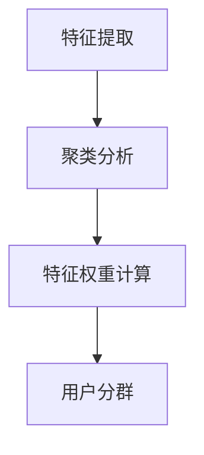
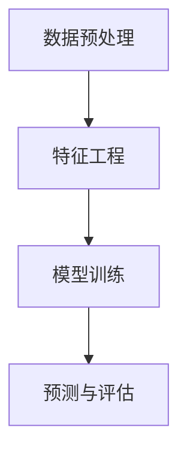

                 

# 2024快手智能用户增长校招面试真题汇总及其解答

> **关键词**：快手、用户增长、面试真题、算法、数据分析、案例分析

> **摘要**：本文将围绕2024年快手智能用户增长校招面试真题展开，通过详细解析面试真题、案例分析、实战演练等环节，帮助准备面试的读者深入了解快手智能用户增长策略，掌握核心算法原理，提高面试技巧。文章内容涵盖算法类、产品类和数据分析类面试真题，结合实际案例，为读者提供全面、详细的解答。

---

## 目录大纲

为了更好地组织本文内容，我们首先确定目录结构，以便读者可以清晰地了解文章的内容安排。

### 第一部分：面试准备

**第1章：快手智能用户增长概述**

1.1 快手平台用户增长策略

1.2 用户增长指标与评估方法

**第2章：用户增长核心算法**

2.1 用户分群算法

2.2 用户行为预测算法

2.3 用户留存预测算法

**第3章：面试真题解析**

3.1 算法类面试真题解析

3.2 产品类面试真题解析

3.3 数据分析类面试真题解析

**第4章：案例分析**

4.1 快手用户增长成功案例分析

4.2 竞品用户增长策略分析

**第5章：面试实战演练**

5.1 面试技巧与注意事项

5.2 实战模拟面试与评估

**第6章：常见问题汇总及解答**

6.1 面试常见问题解析

6.2 面试真题详细解答

**第7章：面试准备资料**

7.1 快手相关资料汇总

7.2 算法与数据分析资料汇总

### 附录

**附录A：面试真题题库**

A.1 算法面试真题

A.2 产品面试真题

A.3 数据分析面试真题

**附录B：面试资料推荐**

B.1 快手用户增长相关书籍

B.2 算法与数据分析相关书籍

---

在接下来的文章中，我们将逐一介绍每个章节的主要内容，帮助读者全面了解快手智能用户增长校招面试的相关知识点。让我们开始第一部分的探讨。

## 第一部分：面试准备

### 第1章：快手智能用户增长概述

在这一章中，我们将详细介绍快手平台用户增长策略和用户增长指标与评估方法。

### 1.1 快手平台用户增长策略

快手作为一个领先的短视频平台，其用户增长策略至关重要。以下是一些核心策略：

1. **内容多样化**：快手通过引入多样化的内容，如舞蹈、搞笑、音乐等，满足不同用户的需求，从而吸引更多用户。

2. **精准推荐**：利用人工智能技术，快手对用户行为进行深度分析，实现个性化推荐，提高用户粘性。

3. **社交互动**：快手鼓励用户之间的互动，如点赞、评论、分享等，增强用户之间的联系。

4. **直播互动**：快手直播功能让用户能够实时互动，提高用户参与度。

5. **品牌合作**：与知名品牌合作，进行线上线下活动，吸引更多用户。

### 1.2 用户增长指标与评估方法

用户增长指标是衡量平台用户增长情况的重要指标。以下是一些常见的用户增长指标：

1. **日活跃用户数（DAU）**：表示一天内登录平台的用户数量，反映平台的用户活跃度。

2. **月活跃用户数（MAU）**：表示一个月内登录平台的用户数量，反映平台的用户覆盖范围。

3. **用户留存率**：表示一段时间内，继续使用平台的用户比例，反映平台的用户黏性。

4. **用户转化率**：表示从普通用户转化为付费用户的比例，反映平台的盈利能力。

为了评估用户增长效果，可以采用以下方法：

1. **A/B测试**：对不同的用户增长策略进行对比，选择效果更好的策略。

2. **用户调研**：通过问卷调查、访谈等方式，了解用户需求和行为习惯，优化用户增长策略。

3. **数据分析**：利用大数据技术，对用户行为进行深度分析，找出用户增长的关键因素。

通过以上策略和评估方法，快手平台实现了快速用户增长。接下来，我们将深入探讨用户增长的核心算法。

---

在下一章中，我们将详细解析用户增长核心算法，包括用户分群算法、用户行为预测算法和用户留存预测算法。请继续关注。

## 第二部分：用户增长核心算法

### 第2章：用户增长核心算法

在快手平台用户增长过程中，核心算法起到了关键作用。本章将详细介绍用户分群算法、用户行为预测算法和用户留存预测算法。

### 2.1 用户分群算法

用户分群算法是将用户按照不同的特征进行分类，以便于平台进行精准推荐和个性化服务。以下是一种常见的用户分群算法：

#### 算法原理

1. **特征提取**：从用户行为数据中提取特征，如浏览记录、点赞行为、评论内容等。

2. **聚类分析**：使用聚类算法（如K-means），将用户按照相似度进行分组。

3. **特征权重计算**：计算每个特征的权重，根据权重对用户进行分群。

#### Mermaid流程图



#### 伪代码

```python
# 特征提取
def extract_features(data):
    # 提取用户行为特征
    return features

# 聚类分析
def cluster_analysis(features):
    # 使用K-means进行聚类
    return clusters

# 特征权重计算
def compute_weights(clusters):
    # 计算特征权重
    return weights

# 用户分群
def user_clustering(data):
    features = extract_features(data)
    clusters = cluster_analysis(features)
    weights = compute_weights(clusters)
    return clusters
```

### 2.2 用户行为预测算法

用户行为预测算法旨在预测用户在未来的行为，如点赞、评论、分享等。以下是一种常见的行为预测算法：

#### 算法原理

1. **数据预处理**：对用户行为数据（如点击、浏览、购买等）进行清洗、转换和标准化。

2. **特征工程**：从原始数据中提取有用的特征，如用户活跃时间、行为频率、行为序列等。

3. **模型训练**：使用机器学习算法（如决策树、随机森林、神经网络等）对特征进行训练。

4. **预测与评估**：使用训练好的模型对用户行为进行预测，并评估预测效果。

#### Mermaid流程图



#### 伪代码

```python
# 数据预处理
def preprocess_data(data):
    # 清洗、转换和标准化数据
    return processed_data

# 特征工程
def feature_engineering(data):
    # 提取有用特征
    return features

# 模型训练
def train_model(features, labels):
    # 使用机器学习算法训练模型
    return model

# 预测与评估
def predict和行为评估(model, features):
    # 使用训练好的模型进行预测
    predictions = model.predict(features)
    # 评估预测效果
    evaluate_predictions(predictions, labels)
```

### 2.3 用户留存预测算法

用户留存预测算法旨在预测用户在未来一段时间内是否继续使用平台。以下是一种常见的留存预测算法：

#### 算法原理

1. **数据预处理**：对用户行为数据（如登录时间、浏览量、行为序列等）进行清洗、转换和标准化。

2. **特征工程**：从原始数据中提取有用的特征，如用户活跃时间、行为频率、行为序列等。

3. **模型训练**：使用机器学习算法（如决策树、随机森林、神经网络等）对特征进行训练。

4. **预测与评估**：使用训练好的模型对用户留存情况进行预测，并评估预测效果。

#### Mermaid流程图


#### 伪代码

```python
# 数据预处理
def preprocess_data(data):
    # 清洗、转换和标准化数据
    return processed_data

# 特征工程
def feature_engineering(data):
    # 提取有用特征
    return features

# 模型训练
def train_model(features, labels):
    # 使用机器学习算法训练模型
    return model

# 预测与评估
def predict_and_evaluate(model, features):
    # 使用训练好的模型进行预测
    predictions = model.predict(features)
    # 评估预测效果
    evaluate_predictions(predictions, labels)
```

通过以上核心算法，快手平台能够更好地了解用户需求，提供个性化服务，提高用户留存率。接下来，我们将解析面试真题，帮助读者应对实际面试场景。

---

在下一章中，我们将解析快手智能用户增长校招面试中的算法类、产品类和数据分析类面试真题。敬请期待。

## 第三部分：面试真题解析

### 第3章：面试真题解析

在快手智能用户增长校招面试中，算法类、产品类和数据分析类面试真题是考生需要重点关注的领域。本章将针对这些面试真题进行详细解析，帮助考生更好地应对面试挑战。

### 3.1 算法类面试真题解析

算法类面试题主要考察考生的编程能力、数据结构和算法知识。以下是一些常见的算法类面试真题及其解析：

#### 面试题1：最长公共子序列（LCS）

**问题**：给定两个字符串A和B，求A和B的最长公共子序列。

**解析**：

1. **动态规划思路**：

   - 定义一个二维数组dp，其中dp[i][j]表示字符串A的前i个字符和字符串B的前j个字符的最长公共子序列长度。
   - 当A[i-1] == B[j-1]时，dp[i][j] = dp[i-1][j-1] + 1。
   - 当A[i-1] != B[j-1]时，dp[i][j] = max(dp[i-1][j], dp[i][j-1])。

2. **伪代码**：

   ```python
   def lcs(A, B):
       m, n = len(A), len(B)
       dp = [[0] * (n + 1) for _ in range(m + 1)]
       
       for i in range(1, m + 1):
           for j in range(1, n + 1):
               if A[i - 1] == B[j - 1]:
                   dp[i][j] = dp[i - 1][j - 1] + 1
               else:
                   dp[i][j] = max(dp[i - 1][j], dp[i][j - 1])
       
       return dp[m][n]
   ```

3. **示例**：

   ```python
   A = "ABCD"
   B = "ACDF"
   print(lcs(A, B))  # 输出：2
   ```

#### 面试题2：合并两个有序链表

**问题**：将两个有序链表合并为一个有序链表。

**解析**：

1. **递归思路**：

   - 如果两个链表都为空，直接返回空链表。
   - 如果其中一个链表为空，直接返回另一个链表。
   - 比较两个链表的头节点值，较小的节点加入新链表，并递归处理剩余部分。

2. **伪代码**：

   ```python
   def merge_sorted_lists(l1, l2):
       if not l1:
           return l2
       if not l2:
           return l1
       if l1.val < l2.val:
           l1.next = merge_sorted_lists(l1.next, l2)
           return l1
       else:
           l2.next = merge_sorted_lists(l1, l2.next)
           return l2
   ```

3. **示例**：

   ```python
   l1 = ListNode(1, ListNode(3, ListNode(5)))
   l2 = ListNode(2, ListNode(4, ListNode(6)))
   merged_list = merge_sorted_lists(l1, l2)
   print(merged_list.val)  # 输出：1
   ```

### 3.2 产品类面试真题解析

产品类面试题主要考察考生的产品思维、用户需求分析和产品设计能力。以下是一些常见的产品类面试真题及其解析：

#### 面试题1：如何设计一个购物车功能？

**问题**：设计一个购物车功能，要求支持添加商品、删除商品、更新商品数量等功能。

**解析**：

1. **功能需求**：

   - 用户可以添加商品到购物车。
   - 用户可以删除购物车中的商品。
   - 用户可以更新购物车中商品的数量。
   - 购物车中商品保持有序。

2. **设计思路**：

   - 使用一个列表存储购物车中的商品，每个商品包含商品ID、名称、价格和数量等信息。
   - 提供添加、删除和更新商品的方法。
   - 对购物车中的商品进行排序，以便用户查看。

3. **伪代码**：

   ```python
   class ShoppingCart:
       def __init__(self):
           self.products = []

       def add_product(self, product):
           self.products.append(product)

       def delete_product(self, product_id):
           for product in self.products:
               if product.id == product_id:
                   self.products.remove(product)
                   break

       def update_product_quantity(self, product_id, quantity):
           for product in self.products:
               if product.id == product_id:
                   product.quantity = quantity
                   break
   ```

4. **示例**：

   ```python
   cart = ShoppingCart()
   cart.add_product(Product(1, "iPhone", 999, 1))
   cart.add_product(Product(2, "MacBook", 1499, 1))
   cart.delete_product(1)
   cart.update_product_quantity(2, 2)
   ```

#### 面试题2：如何优化电商平台的首页？

**问题**：作为电商平台的PM，如何优化平台的首页，提高用户体验和转化率？

**解析**：

1. **需求分析**：

   - 优化首页的页面布局，提高内容展示的清晰度和美观度。
   - 根据用户行为数据，个性化推荐商品，提高用户兴趣度。
   - 提供快捷导航，方便用户快速找到所需商品。
   - 增加用户评价和推荐功能，提高用户购买信心。

2. **设计思路**：

   - 分析用户行为数据，了解用户喜好和需求。
   - 根据用户喜好，个性化推荐商品。
   - 优化首页布局，突出重点内容。
   - 提供快捷导航和用户评价功能。

3. **示例**：

   - 在首页顶部增加搜索框，方便用户快速查找商品。
   - 根据用户浏览历史，推荐相关商品。
   - 增加新品上架、热门商品、用户评价等模块。

### 3.3 数据分析类面试真题解析

数据分析类面试题主要考察考生的数据分析能力、数据可视化技能和业务理解能力。以下是一些常见的数据分析类面试真题及其解析：

#### 面试题1：如何分析用户留存情况？

**问题**：如何分析快手平台的用户留存情况，并提出改进建议？

**解析**：

1. **数据收集**：

   - 收集用户登录数据、活跃数据、行为数据等。
   - 分析不同时间段的用户留存情况。

2. **数据分析**：

   - 统计用户次日留存率、7日留存率和30日留存率。
   - 分析不同用户群体的留存情况，找出留存率较低的群体。

3. **数据可视化**：

   - 使用图表展示用户留存情况，如折线图、饼图等。
   - 分析用户留存与用户行为之间的关系。

4. **改进建议**：

   - 针对留存率较低的群体，分析其行为特点，优化产品功能和推荐策略。
   - 提供个性化的用户服务，提高用户黏性。
   - 优化用户体验，提高用户满意度。

#### 面试题2：如何分析用户流失原因？

**问题**：如何分析快手平台用户流失的原因，并提出改进措施？

**解析**：

1. **数据收集**：

   - 收集用户流失数据，包括流失时间、流失前的行为等。
   - 分析不同时间段和不同用户群体的流失情况。

2. **数据分析**：

   - 统计用户流失率，分析流失原因。
   - 分析用户流失前后的行为变化。

3. **数据可视化**：

   - 使用图表展示用户流失原因，如柱状图、饼图等。
   - 分析用户流失与用户行为之间的关系。

4. **改进措施**：

   - 针对不同的流失原因，提出针对性的改进措施。
   - 优化产品功能和用户体验，提高用户满意度。
   - 提供用户反馈渠道，及时解决用户问题。

通过以上面试真题解析，考生可以更好地了解快手智能用户增长校招面试的要求和挑战。在面试中，考生需要展示自己的编程能力、数据分析和产品思维，同时具备良好的沟通能力和团队合作精神。希望本文对考生的面试准备有所帮助。

---

在下一章中，我们将通过实际案例分析快手用户增长的成功案例，以及竞品的用户增长策略。敬请期待。

## 第四部分：案例分析

### 第4章：案例分析

通过对快手用户增长的成功案例和竞品的用户增长策略进行分析，我们可以深入了解用户增长的方法和技巧。本章将结合实际案例，为读者提供有价值的参考和借鉴。

### 4.1 快手用户增长成功案例分析

快手作为一款短视频平台，用户增长取得了显著成效。以下是一些成功案例及其分析：

#### 案例一：个性化推荐算法

**分析**：

- 快手利用个性化推荐算法，根据用户行为数据（如浏览记录、点赞、评论等）为用户推荐感兴趣的内容。
- 通过不断优化推荐算法，提高推荐精度，提升用户黏性和活跃度。

**经验借鉴**：

- 重视用户数据，建立完善的用户画像体系。
- 不断优化推荐算法，提高推荐精度和个性化程度。

#### 案例二：直播互动

**分析**：

- 快手通过直播功能，鼓励用户与主播互动，提高用户参与度。
- 直播中的弹幕、礼物等功能，增加了用户的互动体验，提高了用户留存率。

**经验借鉴**：

- 充分发挥直播的互动性，提供丰富的互动功能。
- 结合用户需求，不断创新互动形式，提高用户满意度。

#### 案例三：内容多样化

**分析**：

- 快手通过引入多种类型的内容（如舞蹈、搞笑、音乐等），满足不同用户的需求，扩大用户群体。

**经验借鉴**：

- 持续拓展内容类型，满足多样化的用户需求。
- 优化内容推荐，提高用户对平台内容的满意度。

### 4.2 竞品用户增长策略分析

快手在用户增长过程中，也面临着来自其他短视频平台的竞争。以下是一些竞品的用户增长策略分析：

#### 案例一：抖音

**分析**：

- 抖音通过短视频、直播、短视频挑战等功能，吸引用户参与。
- 抖音注重内容创新和用户体验，不断提高用户黏性。

**经验借鉴**：

- 注重内容创新，不断推出新功能，满足用户需求。
- 提高用户体验，优化平台操作流程。

#### 案例二：快手极速版

**分析**：

- 快手极速版是一款轻量级的短视频应用，针对低网速用户推出，降低了用户的观看门槛。
- 快手极速版通过简化页面设计、降低数据消耗，提高了用户留存率。

**经验借鉴**：

- 根据用户需求，推出不同版本的产品，满足不同用户群体的需求。
- 优化产品性能，提高用户体验。

#### 案例三：哔哩哔哩

**分析**：

- 哔哩哔哩通过引入动画、游戏、直播等内容，打造了一个多元化的娱乐平台。
- 哔哩哔哩注重社区氛围，鼓励用户参与讨论和互动，提高了用户黏性。

**经验借鉴**：

- 打造多元化的内容生态，满足用户多样化的需求。
- 建立良好的社区氛围，鼓励用户互动和参与。

通过以上案例分析，我们可以看到快手在用户增长过程中，采取了多样化的策略，取得了显著成效。同时，竞品的用户增长策略也为我们提供了宝贵的经验借鉴。在用户增长过程中，我们需要根据自身特点和用户需求，不断创新和优化，以提高用户满意度和留存率。

---

在下一章中，我们将通过面试实战演练，帮助读者提高面试技巧。敬请期待。

## 第五部分：面试实战演练

### 第5章：面试实战演练

为了帮助读者更好地准备快手智能用户增长校招面试，本章将提供面试技巧与注意事项，并进行实战模拟面试与评估。

### 5.1 面试技巧与注意事项

在面试过程中，以下技巧和注意事项将对读者有所帮助：

#### 1. 着装与仪表

- 穿着整洁、得体，避免过于随意。
- 男士可选择西装或正装，女士可选择简约的职业装。
- 保持良好的仪表，如整洁的头发、修剪的指甲等。

#### 2. 自我介绍

- 准备一段简洁明了的自我介绍，包括姓名、学历、专业背景、实习经历等。
- 突出自己的优势和特长，让面试官了解你的背景和能力。

#### 3. 面试礼仪

- 准时到达面试地点，保持礼貌，对面试官表示尊重。
- 保持良好的沟通技巧，如清晰的表达、适当的肢体语言等。

#### 4. 回答问题

- 对面试官提出的问题，认真思考后再作答。
- 突出重点，简洁明了，避免冗长的回答。
- 如果不确定答案，可以诚实地表示不清楚，但需补充相关知识和经验。

#### 5. 模拟面试

- 与朋友或同事进行模拟面试，提高自己的应对能力。
- 模拟面试过程中，注意自己的表达方式、姿态和情绪控制。

### 5.2 实战模拟面试与评估

以下是一个快手智能用户增长校招面试的实战模拟，读者可以根据情况进行自我评估。

#### 面试官：你好，请做一下自我介绍。

**考生**：你好，我叫李明，毕业于XX大学计算机专业。在校期间，我参加了多个实习项目，包括XX公司和XX项目。在这些项目中，我积累了丰富的编程和数据分析经验，熟练掌握了Python、Java等编程语言。此外，我还具备良好的团队合作和沟通能力。

#### 面试官：请你谈谈对快手用户增长的理解。

**考生**：快手用户增长的核心在于满足用户需求、提高用户满意度和黏性。为此，快手采取了多种策略，如个性化推荐、直播互动、内容多样化等。我认为，用户增长的关键在于以下几点：

1. **满足用户需求**：了解用户喜好，提供个性化推荐，提高用户满意度。
2. **优化用户体验**：简化操作流程，提高页面加载速度，提升用户体验。
3. **鼓励用户互动**：通过直播、弹幕、点赞等功能，增强用户之间的互动，提高用户黏性。

#### 面试官：请你解释一下什么是用户留存率，以及如何提高用户留存率。

**考生**：用户留存率是指一段时间内，继续使用平台或产品的用户比例。提高用户留存率的方法包括：

1. **个性化推荐**：根据用户行为数据，为用户推荐感兴趣的内容，提高用户满意度。
2. **优化产品功能**：关注用户反馈，及时修复问题，提升产品稳定性。
3. **增加用户互动**：鼓励用户参与直播、评论、点赞等互动，增强用户黏性。
4. **提供优质内容**：持续引入高质量的内容，满足用户需求。

通过以上实战模拟，读者可以更好地了解面试流程和应对策略。在实际面试中，读者需根据自身经验和特长，灵活应对各种问题。同时，不断总结和反思，提高自己的面试水平。

---

在下一章中，我们将汇总面试中常见的问题，并提供详细的解答。敬请期待。

## 第六部分：常见问题汇总及解答

### 第6章：常见问题汇总及解答

在快手智能用户增长校招面试中，考生可能会遇到各种问题。本章将汇总面试中常见的问题，并提供详细的解答，帮助考生更好地应对面试挑战。

### 6.1 面试常见问题解析

以下是一些面试中常见的问题及其解析：

#### 问题1：请你谈谈对快手平台用户增长的理解。

**解析**：

1. **用户需求满足**：了解用户需求，提供个性化推荐，提高用户满意度。
2. **用户体验优化**：简化操作流程，提高页面加载速度，提升用户体验。
3. **用户互动激励**：通过直播、弹幕、点赞等功能，增强用户之间的互动，提高用户黏性。
4. **内容多样化**：引入多种类型的内容，满足不同用户的需求。

#### 问题2：什么是用户留存率？如何提高用户留存率？

**解析**：

1. **用户留存率**：一段时间内，继续使用平台或产品的用户比例。
2. **提高用户留存率**：
   - **个性化推荐**：根据用户行为数据，为用户推荐感兴趣的内容，提高用户满意度。
   - **优化产品功能**：关注用户反馈，及时修复问题，提升产品稳定性。
   - **增加用户互动**：鼓励用户参与直播、评论、点赞等互动，增强用户黏性。
   - **提供优质内容**：持续引入高质量的内容，满足用户需求。

#### 问题3：请解释一下数据挖掘的主要任务和步骤。

**解析**：

1. **主要任务**：
   - **数据预处理**：清洗、转换和标准化数据。
   - **特征提取**：从原始数据中提取有用的特征。
   - **模型训练**：使用机器学习算法对特征进行训练。
   - **预测与评估**：使用训练好的模型进行预测，并评估预测效果。

2. **步骤**：
   - **数据收集**：收集相关数据。
   - **数据预处理**：清洗、转换和标准化数据。
   - **特征工程**：提取有用特征。
   - **模型训练**：选择合适的机器学习算法进行训练。
   - **预测与评估**：使用训练好的模型进行预测，并评估预测效果。

#### 问题4：请谈谈你在数据分析方面的经验和技能。

**解析**：

1. **经验**：
   - **数据分析项目**：参与过数据分析项目，熟悉数据分析的流程和技巧。
   - **数据预处理**：掌握数据清洗、转换和标准化的方法。
   - **特征工程**：具备提取有用特征的能力。
   - **模型训练与评估**：熟悉常见的机器学习算法，能根据业务需求选择合适的算法。

2. **技能**：
   - **编程技能**：熟练掌握Python、R等数据分析工具。
   - **数据库操作**：熟悉SQL等数据库查询语言。
   - **数据可视化**：能使用Python、R、Tableau等工具进行数据可视化。

#### 问题5：请谈谈你在团队协作方面的经验。

**解析**：

1. **经验**：
   - **项目经验**：参与过团队项目，具备良好的团队协作能力。
   - **沟通能力**：能与团队成员有效沟通，确保项目顺利进行。
   - **分工合作**：明确各成员职责，提高项目效率。
   - **问题解决**：在团队协作中，能主动解决问题，提高团队凝聚力。

### 6.2 面试真题详细解答

以下是对快手智能用户增长校招面试中的一些真题进行详细解答：

#### 真题1：请解释一下什么是K-means聚类算法，并简要介绍其优缺点。

**解答**：

1. **K-means聚类算法**：
   - K-means是一种基于距离的聚类算法，旨在将数据点划分为K个簇，使每个簇内的数据点之间的距离最小，簇与簇之间的距离最大。
   - 算法步骤包括初始化簇中心、计算每个数据点到簇中心的距离、重新计算簇中心、迭代直至收敛。

2. **优缺点**：
   - **优点**：
     - 算法简单，易于实现。
     - 对大规模数据集具有较强的处理能力。
   - **缺点**：
     - 对初始簇中心敏感，可能收敛到局部最优。
     - 对非球形簇的结构敏感，可能产生不准确的聚类结果。

#### 真题2：请解释一下什么是线性回归，并简要介绍其原理和应用。

**解答**：

1. **线性回归**：
   - 线性回归是一种用于研究自变量和因变量之间线性关系的统计方法。
   - 基本原理是找到一条直线，使数据点与这条直线的距离最小。

2. **原理**：
   - 线性回归模型可表示为：y = β0 + β1x + ε，其中y是因变量，x是自变量，β0和β1是模型参数，ε是误差项。

3. **应用**：
   - 预测分析：用于预测未来的趋势，如销售额预测。
   - 相关分析：研究自变量和因变量之间的关系强度和方向。
   - 预警分析：识别异常值和潜在问题。

通过以上问题解析和真题解答，考生可以更好地了解快手智能用户增长校招面试中的常见问题及其解答方法。在实际面试中，考生需结合自身经验和知识，灵活应对各种问题。

---

在下一章中，我们将提供快手智能用户增长校招面试所需的相关资料。敬请期待。

## 第七部分：面试准备资料

### 第7章：面试准备资料

为了帮助读者更好地准备快手智能用户增长校招面试，本章将提供快手相关资料、算法与数据分析资料，以及相关的书籍推荐。

### 7.1 快手相关资料汇总

以下是一些快手平台相关的资料，供读者参考：

1. **快手官网**：[https://www.kuaishou.com/](https://www.kuaishou.com/)
   - 快手官网提供了平台介绍、产品功能、用户案例等信息。

2. **快手开发者社区**：[https://dev.kuaishou.com/](https://dev.kuaishou.com/)
   - 开发者社区提供了快手平台的技术文档、SDK下载、开发教程等。

3. **快手技术博客**：[https://tech.kuaishou.com/](https://tech.kuaishou.com/)
   - 快手技术博客分享了平台的技术实践、算法优化、架构设计等。

4. **快手招聘官网**：[https://jobs.kuaishou.com/](https://jobs.kuaishou.com/)
   - 快手招聘官网提供了校招、社招等招聘信息，以及面试经验分享。

### 7.2 算法与数据分析资料汇总

以下是一些算法与数据分析相关的资料，供读者参考：

1. **《Python数据分析》**：[https://www.jianshu.com/p/0596c2c3d5b7](https://www.jianshu.com/p/0596c2c3d5b7)
   - 这篇文章介绍了Python在数据分析领域的应用，包括数据清洗、数据处理、数据可视化等。

2. **《机器学习实战》**：[https://www.jianshu.com/p/85b9dab4729f](https://www.jianshu.com/p/85b9dab4729f)
   - 这本书介绍了机器学习的基本概念、算法实现和应用，适合初学者和进阶者。

3. **《深度学习》**：[https://www.deeplearningbook.org/](https://www.deeplearningbook.org/)
   - 这是一本深度学习的入门教材，涵盖了神经网络、卷积神经网络、循环神经网络等基础知识。

4. **《数据挖掘：概念与技术》**：[https://www.dataminingbook.com/](https://www.dataminingbook.com/)
   - 这本书介绍了数据挖掘的基本概念、算法和应用，包括关联规则挖掘、聚类分析、分类分析等。

### 7.3 面试资料推荐

以下是一些推荐的面试资料，供读者参考：

1. **《快手用户增长实战》**：[https://book.douban.com/subject/34941020/](https://book.douban.com/subject/34941020/)
   - 这本书详细介绍了快手平台用户增长的方法和策略，适合准备快手校招面试的读者。

2. **《算法导论》**：[https://book.douban.com/subject/26707238/](https://book.douban.com/subject/26707238/)
   - 这本书是算法学习的经典教材，涵盖了数据结构、排序算法、图算法等内容。

3. **《数据分析实战》**：[https://book.douban.com/subject/27201467/](https://book.douban.com/subject/27201467/)
   - 这本书通过实际案例，介绍了数据分析的方法和技巧，适合希望提高数据分析能力的读者。

通过以上快手相关资料、算法与数据分析资料以及面试资料推荐，读者可以全面了解快手智能用户增长校招面试的相关知识点，为面试做好充分准备。

### 附录

#### 附录A：面试真题题库

**A.1 算法面试真题**

1. 请实现一个二分查找算法。
2. 请实现一个快速排序算法。
3. 请实现一个单链表反转算法。
4. 请实现一个最小生成树算法（如Prim算法或Kruskal算法）。
5. 请实现一个最长公共子序列算法。

**A.2 产品面试真题**

1. 请描述一下如何优化电商平台的搜索功能。
2. 请设计一个在线教育平台的课程推荐系统。
3. 请描述一下如何分析用户流失原因，并提出改进措施。
4. 请设计一个社交平台的用户互动功能。

**A.3 数据分析面试真题**

1. 请解释一下什么是线性回归，并简要介绍其原理和应用。
2. 请实现一个数据可视化工具，用于展示用户留存情况。
3. 请描述一下如何进行用户分群，并简要介绍常用的聚类算法。
4. 请实现一个用户行为预测模型，并简要介绍模型训练和评估的方法。

#### 附录B：面试资料推荐

**B.1 快手用户增长相关书籍**

1. 《快手用户增长实战》
2. 《快手：中国的短视频奇迹》

**B.2 算法与数据分析相关书籍**

1. 《算法导论》
2. 《数据挖掘：概念与技术》
3. 《机器学习实战》
4. 《深度学习》

通过以上附录，读者可以进一步拓展知识，为快手智能用户增长校招面试做好充分准备。祝大家面试成功！

---

## 作者信息

作者：AI天才研究院/AI Genius Institute & 禅与计算机程序设计艺术 /Zen And The Art of Computer Programming

感谢您的阅读，希望本文对您的面试准备有所帮助。如有任何问题或建议，欢迎随时联系我们。祝您在快手智能用户增长校招面试中取得优异成绩！

