                 

### 第一部分：引言与概述

> **关键词**：思维工具、问题解决能力、系统性思维、创新思维、实战应用

> **摘要**：
本文旨在深入探讨思维工具在提升问题解决能力方面的作用。我们将首先介绍思维工具的概念及其在日常生活和工作中的重要性，然后探讨提升问题解决能力的必要性。本文的核心在于阐述思维工具的理论基础，包括思维模型与认知理论、系统性思维、创新思维等。同时，我们将通过实际案例展示思维工具在不同领域中的应用，并提供实战应用和深化拓展的方法，以帮助读者全面提升问题解决能力。

#### 1. 引言

##### 1.1 书籍背景与目标

在当今快速变化的社会中，问题解决能力已经成为个人和组织的核心竞争力。然而，面对日益复杂的挑战，传统的解决问题方法往往显得力不从心。为了更好地应对这些问题，我们需要更加高效和全面的思维工具。本文旨在为读者提供一套系统的思维工具，帮助他们在日常生活和工作中更好地应对各种问题。

##### 1.2 阅读对象与预期收获

本文面向所有对提升问题解决能力感兴趣的读者，无论您是学生、职场人士还是创业者，都将从本文中获益。通过本文的学习，您将：

- 理解思维工具的基本概念和重要性。
- 掌握系统性思维和创新思维的核心理论。
- 学习如何在实际问题中应用思维工具。
- 提升自己的问题解决能力和决策水平。

#### 2. 思维工具的概念与重要性

##### 2.1 思维工具的定义

思维工具是一种帮助我们思考、分析和解决问题的方法或技术。它们可以是各种模型、框架、流程图或方法论，旨在提供一种结构化的思维方式，帮助我们更系统地看待问题，更高效地解决问题。

##### 2.2 思维工具在日常生活和工作中的应用

思维工具在日常生活中的应用非常广泛。例如，在家庭管理中，我们可以使用决策树来优化家庭预算；在职场中，我们可以使用SWOT分析来评估项目风险；在个人发展上，我们可以使用SMART目标来规划职业路径。

##### 2.3 思维工具与问题解决能力的关系

思维工具是提升问题解决能力的关键。通过使用思维工具，我们可以：

- 提高问题识别和分析的准确性。
- 加速问题解决的效率。
- 提升决策质量，减少错误决策的可能性。
- 增强团队协作，提高整体解决问题能力。

#### 3. 提升问题解决能力的必要性

##### 3.1 现代社会面临的挑战

现代社会充满了复杂性和不确定性，这使得问题解决能力变得尤为重要。随着技术的迅猛发展和全球化进程的加速，我们面临的问题日益复杂，需要更高的思维能力和更全面的解决方案。

##### 3.2 问题解决能力的重要性

问题解决能力不仅影响着个人的职业发展，也关系到组织的生存和发展。一个优秀的问题解决者能够：

- 快速识别问题的本质。
- 提出创新的解决方案。
- 有效协调资源，实现目标。
- 预测问题可能的发展趋势。

##### 3.3 思维工具对提升问题解决能力的帮助

思维工具提供了系统化和结构化的思考方法，可以帮助我们：

- 提高问题分析的深度和广度。
- 加速问题解决的速度。
- 提升决策的准确性和有效性。
- 培养创新的思维方式。

通过本文的学习，我们将掌握多种思维工具，提升自己的问题解决能力，更好地应对复杂多变的社会环境。

---

本文第一部分主要介绍了思维工具的基本概念和重要性，明确了提升问题解决能力的必要性。在接下来的部分，我们将深入探讨思维工具的理论基础，包括思维模型与认知理论、系统性思维、创新思维等。这些理论将为读者提供更深入的思考方法和工具，以应对各种复杂问题。

#### 4. 思维模型与认知理论

##### 4.1 主要思维模型介绍

思维模型是思维工具的核心组成部分，它们提供了一种系统化的思考方式，帮助我们更好地理解问题、分析问题和解决问题。以下是几种常见的思维模型：

###### 4.1.1 决策树模型

决策树是一种常用的思维模型，它通过一系列节点和分支来表示问题的不同决策路径和结果。决策树模型可以帮助我们分析和优化复杂决策。

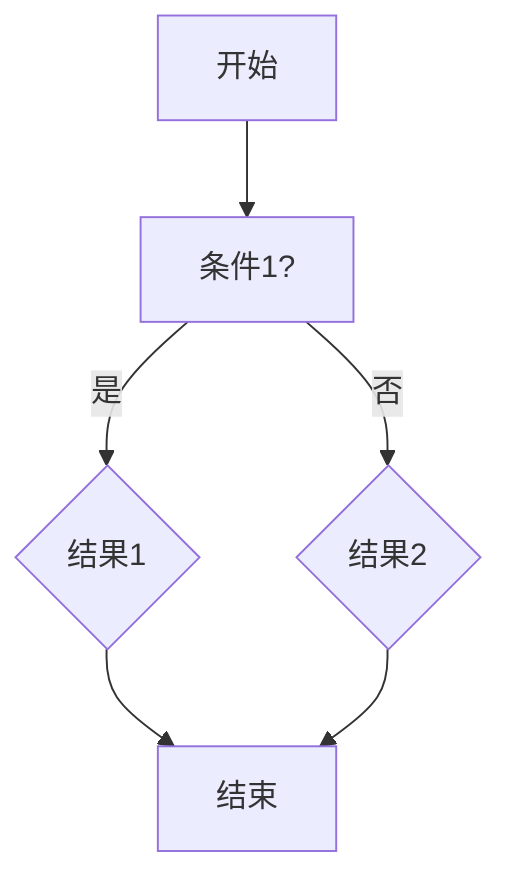

###### 4.1.2 SWOT分析模型

SWOT分析是一种用于评估企业或项目的优势、劣势、机会和威胁的工具。它可以帮助我们全面了解问题，制定更有效的策略。

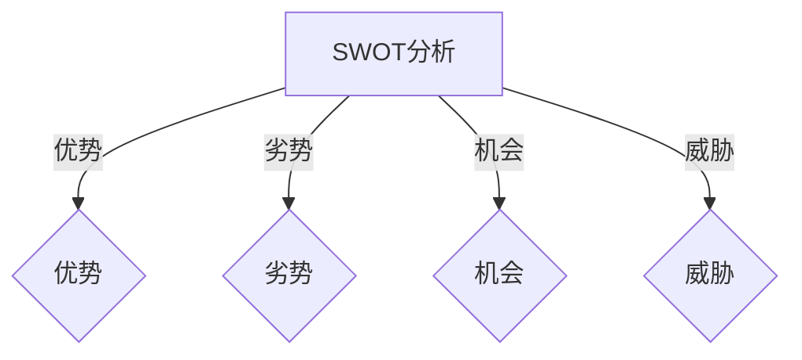

###### 4.1.3 5W1H模型

5W1H模型是一种简单的提问技巧，用于深入分析问题。它包括五个“W”（What，Why，Who，When，Where）和一个“H”（How）。

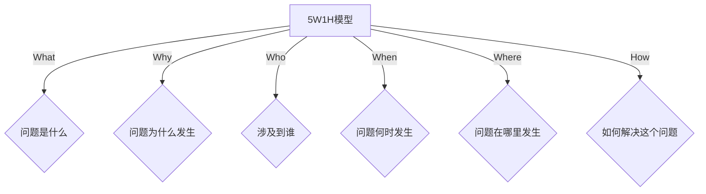

##### 4.2 认知理论在思维工具中的应用

认知理论是研究人类思维过程和认知能力的学科。它在思维工具中的应用主要体现在以下几个方面：

###### 4.2.1 认知负荷理论

认知负荷理论认为，人类大脑的处理能力是有限的，过载的负荷会导致思维效率下降。因此，在设计思维工具时，需要考虑如何减少认知负荷，提高思维效率。

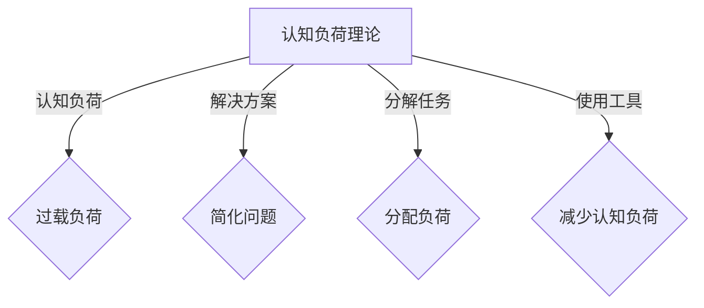

###### 4.2.2 记忆模型

记忆模型研究人类记忆的过程和机制。在思维工具设计中，了解记忆模型可以帮助我们设计出更易于记忆的工具和方法。

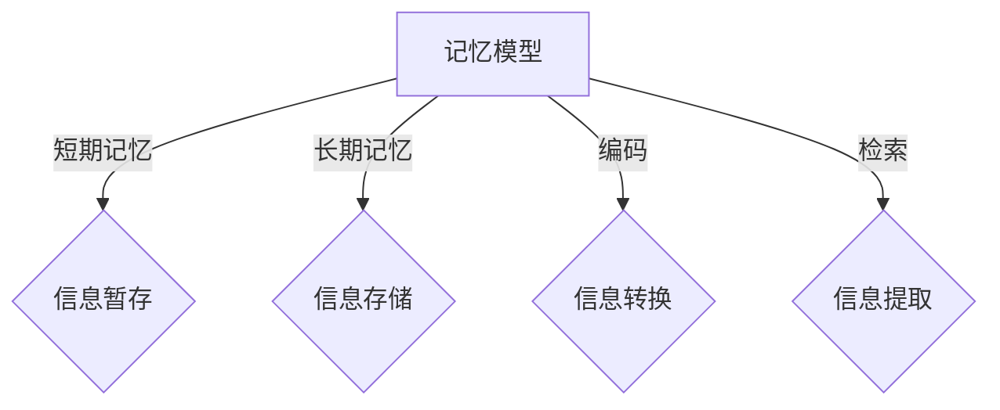

##### 4.3 思维模型的Mermaid流程图

为了更直观地理解思维模型，我们可以使用Mermaid流程图来表示。以下是几个思维模型的示例：

###### 4.3.1 决策树模型


###### 4.3.2 SWOT分析模型


###### 4.3.3 5W1H模型


通过以上内容，我们可以看到思维模型和认知理论在思维工具设计中的应用。在接下来的部分，我们将探讨系统性思维和创新思维，这些是提升问题解决能力的两个关键方面。

#### 5. 系统性思维

##### 5.1 系统性思维的概念与原则

系统性思维是一种综合性的思考方式，它强调从整体的角度来理解和解决问题。系统性思维的核心在于：

- **整体性**：将问题视为一个整体，理解其各个部分之间的相互关系。
- **动态性**：认识到问题是一个不断变化的过程，需要持续地调整和优化。
- **适应性**：在面对不确定性时，能够灵活地调整思维方式和解决方案。

系统性思维的原则包括：

- **系统分解**：将复杂问题分解为更小、更易于管理的部分。
- **关系分析**：分析各个部分之间的相互作用和影响。
- **模型构建**：使用模型来模拟和预测系统的行为。
- **迭代改进**：持续地评估和优化系统。

##### 5.2 系统性思维的实践方法

在实践中，系统性思维可以通过以下步骤来应用：

1. **定义问题**：明确需要解决的问题和目标。
2. **分解问题**：将问题分解为子问题或组成部分。
3. **绘制系统图**：使用图形化工具（如Mermaid流程图）来表示各个部分及其关系。
4. **分析关系**：分析各个部分之间的相互作用和影响。
5. **构建模型**：使用数学模型或计算机模拟来预测系统的行为。
6. **测试与验证**：通过实验或模拟来验证模型的准确性。
7. **迭代改进**：根据测试结果不断调整和优化系统。

##### 5.3 系统性思维案例分析

以下是一个系统性思维在项目管理的实际应用案例：

**项目背景**：某公司计划开发一款新型电子产品，该项目涉及多个部门，包括研发、生产、市场和销售。

**系统性思维应用**：

1. **定义问题**：确保项目按时完成，产品质量符合预期。
2. **分解问题**：将项目分解为以下子问题：
   - 研发：产品设计和原型开发
   - 生产：原材料采购、生产流程设计
   - 市场：市场调研和产品定位
   - 销售：销售策略和渠道建设

3. **绘制系统图**：
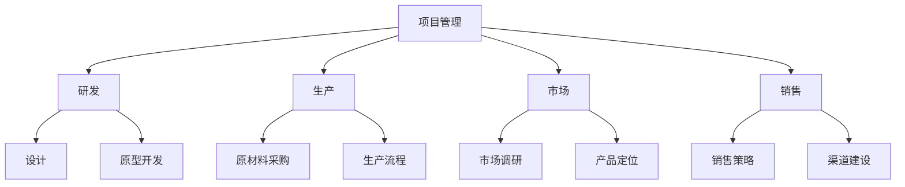

4. **分析关系**：分析各个部门之间的依赖关系和交互影响。

5. **构建模型**：使用Gantt图或PERT图来模拟项目的进度和关键路径。

6. **测试与验证**：通过定期会议和进度报告来监控项目的进展，并根据实际情况调整计划。

7. **迭代改进**：根据测试和验证的结果，对项目计划进行优化和调整。

通过系统性思维的应用，该项目成功地按计划完成，产品得到了市场的认可，为公司的未来发展奠定了基础。

系统性思维是一种强大的问题解决工具，它能够帮助我们更好地理解复杂问题，制定有效的解决方案。在接下来的部分，我们将探讨创新思维，这是提升问题解决能力的另一个关键方面。

#### 6. 创新思维

##### 6.1 创新思维的定义与类型

创新思维是一种能够产生新颖和有价值想法的思维方式。它不同于传统的线性思维，强调的是多样性和创造性。创新思维可以划分为以下几种类型：

###### 6.1.1 逻辑创新思维

逻辑创新思维通过逻辑推理和创造性思维的结合，产生新的逻辑结构和解决方案。这种思维类型常见于数学、逻辑学和计算机科学等领域。

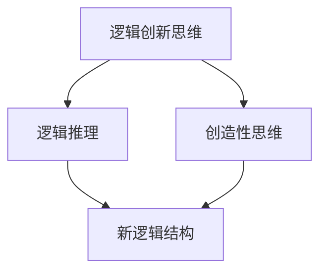

###### 6.1.2 独立创新思维

独立创新思维强调个人的独立思考和独特视角，通过跳出传统框架和常规思维模式，产生新颖的想法。这种思维类型常见于艺术、设计和创意产业。

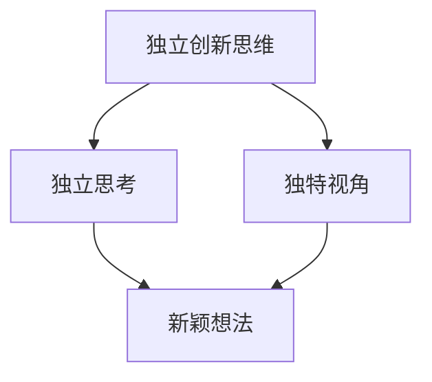

###### 6.1.3 融合创新思维

融合创新思维通过将不同领域的知识和方法融合在一起，产生新的解决方案。这种思维类型常见于跨学科研究和创新企业。

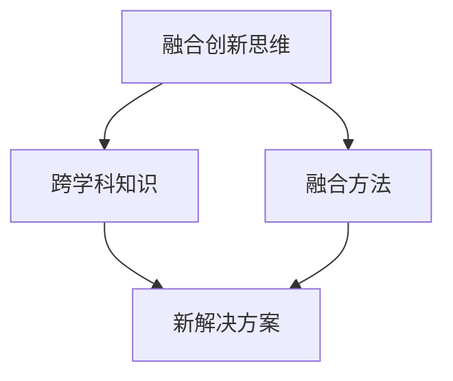

##### 6.2 创新思维的激发与培养

激发和培养创新思维需要从以下几个方面着手：

###### 6.2.1 培养好奇心和求知欲

好奇心是激发创新思维的基础。通过不断地提问和探索，我们可以发现新的问题和解决方案。

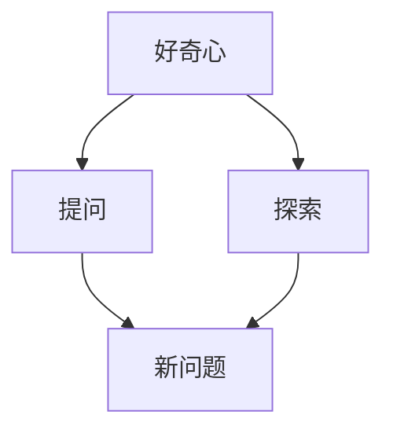

###### 6.2.2 学习新知识和技术

不断学习新知识和技术可以帮助我们拓宽视野，激发创新思维。通过了解不同领域的最新发展，我们可以产生新的想法和灵感。

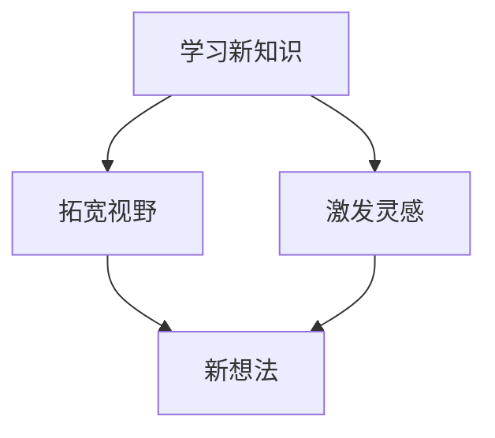

###### 6.2.3 反思和自我挑战

反思和自我挑战可以帮助我们打破思维定势，产生创新的解决方案。通过不断地质疑和改进，我们可以发现新的问题和机会。

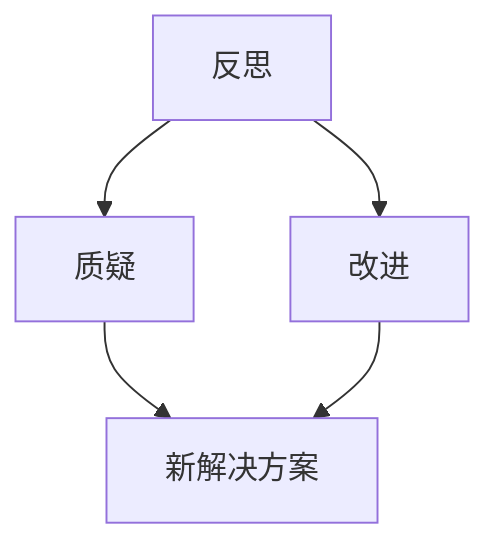

###### 6.2.4 培养团队合作精神

团队合作可以激发不同的思维方式和创造力，产生更多的创新想法。通过与他人交流和合作，我们可以共同探索新的解决方案。

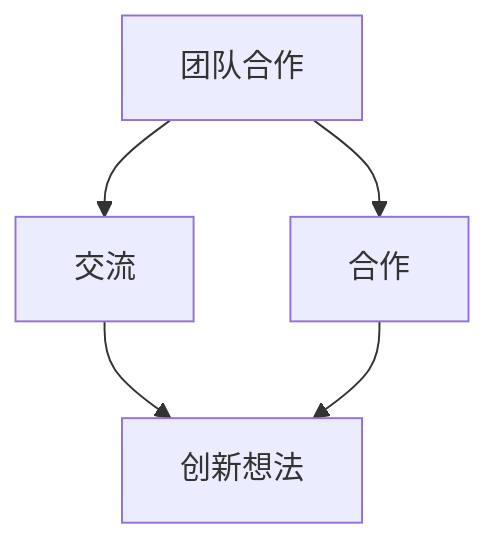

##### 6.3 创新思维的实际应用

创新思维在各个领域都有着广泛的应用，以下是一些实际应用案例：

###### 6.3.1 科技创新

科技创新是创新思维最典型的应用领域之一。通过创新思维，科学家和工程师可以发明新的技术和产品，推动科技进步。

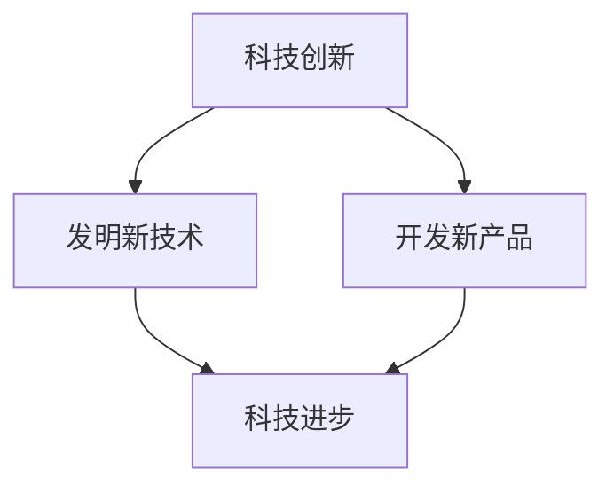

###### 6.3.2 企业管理

在企业管理中，创新思维可以帮助企业寻找新的商业模式和市场机会，提高竞争力。

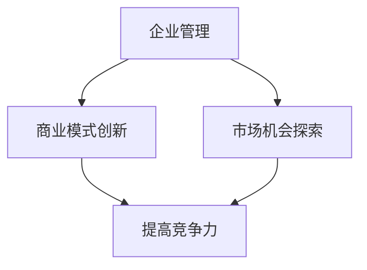

###### 6.3.3 社会创新

社会创新通过创新思维解决社会问题，改善人们的生活。例如，创新的教育模式和公益项目。

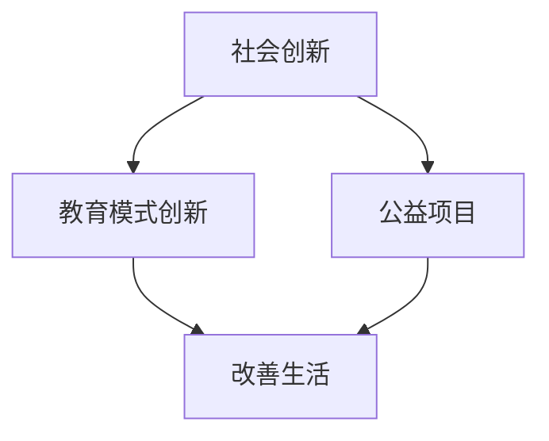

创新思维是一种强大的问题解决工具，它能够帮助我们打破常规，产生新颖和有价值的解决方案。在接下来的部分，我们将继续探讨思维工具的其他方面，包括实战应用和深化拓展的方法。

---

本文第二部分深入探讨了思维模型与认知理论、系统性思维和创新思维。思维模型和认知理论提供了系统化的思考方法，帮助我们在问题分析和解决过程中提高效率和准确性。系统性思维强调了从整体角度理解和解决问题，而创新思维则通过新颖和有价值的想法推动问题的解决。这些思维工具不仅理论性强，而且在实际应用中发挥着重要作用。在接下来的部分，我们将进一步探讨思维工具在实战中的应用，帮助读者更好地理解和应用这些工具。

### 第三部分：思维工具的实战应用

#### 7. 日常生活中的问题解决

##### 7.1 家庭管理与决策

家庭管理涉及到各种决策，如预算规划、家务分配和子女教育等。通过思维工具，我们可以更有效地进行家庭管理：

###### 7.1.1 预算规划

使用决策树模型来制定家庭预算，可以帮助我们更好地分配资源。

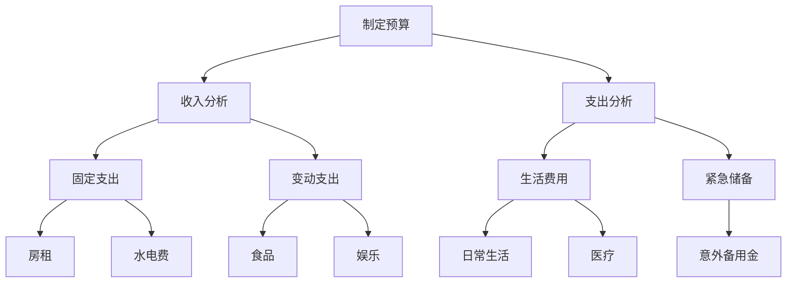

通过决策树，我们可以清晰地看到家庭收入和支出的各项细节，从而制定出合理的预算计划。

###### 7.1.2 家务分配

使用SWOT分析模型来评估家庭成员在家务分配中的优势和劣势，有助于提高家务管理的效率。

```mermaid
graph TD
A[家务分配]
A --> B[评估家庭成员]
B -->|优势| C{擅长任务}
B -->|劣势| D{不擅长任务}
C --> E[分配任务]
D --> F[培训与指导]
```

通过SWOT分析，我们可以识别出每位家庭成员在家务中的优势和劣势，合理分配任务，并针对不足进行培训。

###### 7.1.3 子女教育

使用5W1H模型来规划子女的教育路径，可以确保我们考虑了所有的关键因素。

```mermaid
graph TD
A[子女教育]
A -->|What| B{教育目标}
A -->|Why| C{教育原因}
A -->|Who| D{教育主体}
A -->|When| E{教育时间}
A -->|Where| F{教育地点}
A -->|How| G{教育方法}
```

通过5W1H模型，我们可以全面规划子女的教育，确保教育目标的实现。

##### 7.2 职场沟通与协作

在职场中，沟通与协作是高效工作的关键。思维工具可以帮助我们改善沟通和协作效果：

###### 7.2.1 沟通技巧

使用系统性思维来分析沟通问题，可以帮助我们找到有效的沟通策略。

```mermaid
graph TD
A[沟通分析]
A --> B[沟通环境]
A --> C[沟通对象]
B --> D[信息传递]
B --> E[反馈机制]
C --> F[理解程度]
```

通过系统性分析，我们可以识别出沟通中的障碍和问题，制定出更有效的沟通策略。

###### 7.2.2 团队协作

使用创新思维来激发团队协作的新方法，可以提升团队的整体效率。

```mermaid
graph TD
A[团队协作]
A --> B[创新方法]
A --> C[跨部门合作]
B --> D[头脑风暴]
B --> E[角色分配]
C --> F[资源共享]
C --> G[目标一致]
```

通过创新思维，我们可以打破传统协作模式，找到更高效的团队协作方法。

##### 7.3 教育与子女培养

思维工具在教育中也有着广泛的应用，特别是在子女培养方面：

###### 7.3.1 教育规划

使用系统性思维来制定子女的教育规划，可以确保教育的全面性和连续性。

```mermaid
graph TD
A[教育规划]
A --> B[基础阶段]
A --> C[发展阶段]
A --> D[专业阶段]
B --> E[启蒙教育]
B --> F[学科学习]
C --> G[综合素质]
C --> H[兴趣培养]
D --> I[职业规划]
```

通过系统性教育规划，我们可以确保子女在不同阶段的教育需求得到满足。

###### 7.3.2 子女培养

使用创新思维来培养子女的创造性思维和问题解决能力，可以提升他们的综合素质。

```mermaid
graph TD
A[子女培养]
A --> B[创造性思维]
A --> C[问题解决能力]
B --> D[鼓励尝试]
B --> E[思维训练]
C --> F[实际应用]
C --> G[实践机会]
```

通过创新思维培养，我们可以帮助子女成长为具有创新精神和解决问题能力的人才。

在日常生活中的应用中，思维工具可以帮助我们更有效地管理家庭、提高职场沟通与协作效率，以及培养子女的综合素质。这些工具不仅理论性强，而且具有很高的实用性。在接下来的部分，我们将进一步探讨思维工具在商业决策与策略规划、创业与项目管理以及社会问题解决与公共决策中的应用。

#### 8. 商业决策与策略规划

##### 8.1 商业模式分析

在商业决策和策略规划中，商业模式分析是一个关键步骤。通过使用思维工具，我们可以深入分析企业的商业模式，并找到优化机会。

###### 8.1.1 商业模式画布（Business Model Canvas）

商业模式画布是一个直观的工具，用于描述企业的关键业务元素和关系。它由9个主要部分组成：客户段、价值主张、渠道、客户关系、收入来源、关键资源、关键活动、关键合作伙伴和成本结构。

```mermaid
graph TD
A[商业模式画布]
A --> B[客户段]
A --> C[价值主张]
A --> D[渠道]
A --> E[客户关系]
A --> F[收入来源]
A --> G[关键资源]
A --> H[关键活动]
A --> I[关键合作伙伴]
A --> J[成本结构]
B -->|客户| K{目标客户}
B -->|渠道| L{渠道策略}
C -->|价值| M{价值提供}
C -->|主张| N{主张定位}
D -->|渠道| O{渠道管理}
E -->|关系| P{客户关系管理}
F -->|收入| Q{收入模式}
G -->|资源| R{资源管理}
H -->|活动| S{活动执行}
I -->|合作| T{合作伙伴}
J -->|成本| U{成本控制}
```

通过商业模式画布，企业可以系统地分析每个业务元素，识别潜在问题并找到改进的机会。

###### 8.1.2 SWOT分析

SWOT分析可以帮助企业评估其内部优势、劣势和外部机会、威胁。这是一个常用的战略规划工具，能够帮助企业制定更合理的商业策略。

```mermaid
graph TD
A[SWOT分析]
A -->|优势| B{内部优势}
A -->|劣势| C{内部劣势}
A -->|机会| D{外部机会}
A -->|威胁| E{外部威胁}
B --> F[利用优势]
B --> G[改进劣势]
C --> H[规避劣势]
C --> I[减轻威胁]
D --> J[抓住机会]
D --> K[规避威胁]
```

通过SWOT分析，企业可以明确自身的竞争地位和未来发展方向。

##### 8.2 竞争策略制定

在竞争激烈的市场中，有效的竞争策略是企业成功的关键。思维工具可以帮助企业在制定竞争策略时进行更深入的思考和分析。

###### 8.2.1 波特五力模型

波特五力模型是分析市场竞争环境的一个重要工具。它包括供应商的议价能力、买家的议价能力、潜在进入者的威胁、替代品的威胁和行业内现有竞争者的竞争强度。

```mermaid
graph TD
A[波特五力模型]
A -->|供应商| B{议价能力}
A -->|买家| C{议价能力}
A -->|潜在进入者| D{威胁}
A -->|替代品| E{威胁}
A -->|竞争者| F{竞争强度}
B --> G[供应链管理]
C --> H[客户关系管理]
D --> I[市场壁垒]
D --> J[进入障碍]
E --> K[替代品策略]
F --> L[竞争策略]
```

通过波特五力模型，企业可以全面了解市场环境，制定出相应的竞争策略。

###### 8.2.2 麦肯锡7S模型

麦肯锡7S模型包括结构（Structure）、系统（Systems）、共享价值观（Shared Values）、人员（Staff）、技能（Skills）、战略（Strategy）和风格（Style）。这个模型强调企业的整体协调和一致性，是制定战略规划的重要工具。

```mermaid
graph TD
A[麦肯锡7S模型]
A -->|结构| B{组织结构}
A -->|系统| C{管理体系}
A -->|共享价值观| D{企业文化}
A -->|人员| E{人才管理}
A -->|技能| F{能力提升}
A -->|战略| G{战略规划}
A -->|风格| H{领导风格}
B --> I[组织协调]
B --> J[管理效率]
C --> K[运营效率]
C --> L[流程优化]
D --> M[企业文化]
D --> N[员工认同]
E --> O[员工培训]
E --> P[员工激励]
F --> Q[技能培养]
F --> R[创新能力]
G --> S[市场定位]
G --> T[目标实现]
H --> U[领导力]
H --> V[团队协作]
```

通过麦肯锡7S模型，企业可以确保各个方面的协调一致，实现战略目标。

##### 8.3 企业战略规划

企业战略规划是确保企业长期成功的关键。思维工具可以帮助企业在制定战略规划时进行系统化的分析和规划。

###### 8.3.1 PEST分析

PEST分析是一种用于分析企业外部环境的工具，包括政治（Political）、经济（Economic）、社会（Social）和技术（Technological）因素。

```mermaid
graph TD
A[PEST分析]
A -->|政治| B{政策法规}
A -->|经济| C{经济状况}
A -->|社会| D{社会趋势}
A -->|技术| E{技术进步}
B --> F[政策影响]
B --> G[市场机遇]
C --> H[经济环境]
C --> I[市场竞争]
D --> J[社会需求]
D --> K[消费趋势]
E --> L[技术变革]
E --> M[技术影响]
```

通过PEST分析，企业可以更好地了解外部环境的变化，制定相应的战略规划。

###### 8.3.2 BCG矩阵

BCG矩阵是一种用于分析企业业务组合的工具，包括明星业务、问题业务、现金牛业务和瘦狗业务。

```mermaid
graph TD
A[BCG矩阵]
A -->|明星| B{高增长、高市场份额}
A -->|问题| C{高增长、低市场份额}
A -->|现金牛| D{低增长、高市场份额}
A -->|瘦狗| E{低增长、低市场份额}
B --> F[投资重点]
B --> G[战略调整]
C --> H[资源投入]
C --> I[转型策略]
D --> J[盈利重点]
D --> K[维护现状]
E --> L[退出策略]
E --> M[整合资源]
```

通过BCG矩阵，企业可以优化业务组合，确保资源的最优配置。

商业决策与策略规划是企业运营的核心环节。通过使用思维工具，企业可以更全面、深入地分析市场环境，制定出科学、合理的战略规划。在接下来的部分，我们将继续探讨思维工具在创业与项目管理中的应用，帮助读者更好地应对创业过程中的挑战。

#### 9. 创业与项目管理

##### 9.1 创业思维与创业策略

创业是一项极具挑战性的活动，需要创业者具备敏锐的洞察力、创新的思维和坚韧的意志。思维工具在创业过程中发挥着至关重要的作用，以下是一些关键的思维工具和策略：

###### 9.1.1 创业思维模型

创业思维模型可以帮助创业者系统地分析商业机会，制定创业策略。以下是一个简单的创业思维模型：

```mermaid
graph TD
A[创业思维模型]
A -->|市场需求| B{市场需求分析}
A -->|竞争优势| C{竞争优势分析}
A -->|商业模式| D{商业模式设计}
A -->|执行计划| E{执行计划制定}
B --> F[市场调研]
B --> G[客户分析]
C --> H[资源整合]
C --> I[创新优势]
D --> J[产品定位]
D --> K[盈利模式]
E --> L[风险控制]
```

通过这个模型，创业者可以系统地分析市场需求、竞争优势和商业模式，制定出切实可行的创业策略。

###### 9.1.2 创业策略

在制定创业策略时，创业者需要考虑以下关键因素：

- **市场需求**：深入了解目标市场，分析消费者的需求和行为模式。
- **竞争优势**：识别自身的独特优势，如技术、团队、资源等。
- **商业模式**：设计适合的商业模式，确保企业的可持续性和盈利性。
- **执行计划**：制定详细的执行计划，确保创业策略的有效实施。

##### 9.2 项目管理中的思维工具应用

项目管理是创业过程中不可或缺的一部分，通过有效的项目管理，创业者可以确保项目按时、按质完成。以下是一些在项目管理中常用的思维工具：

###### 9.2.1 系统性思维

系统性思维在项目管理中的应用主要体现在对项目的整体理解和全局把握。以下是一个项目管理的系统性思维框架：

```mermaid
graph TD
A[项目管理]
A -->|项目目标| B{目标设定}
A -->|项目范围| C{范围定义}
A -->|项目资源| D{资源分配}
A -->|项目进度| E{进度管理}
A -->|项目风险| F{风险管理}
A -->|项目质量| G{质量控制}
A -->|项目团队| H{团队管理}
B --> I[明确目标]
B --> J[分解任务]
C --> K[资源评估]
C --> L[资源调度]
D --> M[进度计划]
D --> N[进度监控]
E --> O[风险评估]
E --> P[风险应对]
F --> Q[质量控制计划]
F --> R[质量控制检查]
G --> S[团队沟通]
G --> T[团队协作]
```

通过系统性思维，项目管理可以更全面、更深入地分析项目的各个方面，确保项目的顺利推进。

###### 9.2.2 创新思维

创新思维在项目管理中的应用主要体现在寻找创新的解决方案和方法。以下是一个创新思维的应用场景：

```mermaid
graph TD
A[创新思维]
A -->|问题识别| B{问题分析}
A -->|解决方案| C{方案评估}
A -->|方案选择| D{方案实施}
B --> E[问题定位]
B --> F[原因分析]
C --> G[方案A]
C --> H[方案B]
C --> I[方案C]
D --> J[方案A]
D --> K[方案B]
D --> L[方案C]
```

通过创新思维，项目管理可以找到更高效、更创新的解决方案，提高项目的成功概率。

##### 9.3 项目风险管理

项目风险管理是项目管理中的一个重要环节，通过有效的风险管理，可以降低项目失败的风险。以下是一些项目风险管理的思维工具：

###### 9.3.1 风险识别

风险识别是风险管理的第一步，以下是一个风险识别的工具：

```mermaid
graph TD
A[风险识别]
A -->|风险因素| B{风险因素分析}
A -->|潜在风险| C{潜在风险识别}
B --> D[项目范围]
B --> E[项目资源]
B --> F[项目进度]
B --> G[项目质量]
C --> H[风险因素1]
C --> I[风险因素2]
C --> J[风险因素3]
```

通过风险识别，项目团队可以全面了解项目的潜在风险。

###### 9.3.2 风险评估

风险评估是对风险的可能性和影响进行评估的过程，以下是一个风险评估的工具：

```mermaid
graph TD
A[风险评估]
A -->|可能性评估| B{可能性分析}
A -->|影响评估| C{影响分析}
A -->|优先级评估| D{优先级排序}
B --> E[低可能性]
B --> F[中可能性]
B --> G[高可能性]
C --> H[低影响]
C --> I[中影响]
C --> J[高影响]
D --> K[低优先级]
D --> L[中优先级]
D --> M[高优先级]
```

通过风险评估，项目团队可以确定哪些风险需要优先处理。

###### 9.3.3 风险应对

风险应对是制定应对风险的策略和措施，以下是一个风险应对的工具：

```mermaid
graph TD
A[风险应对]
A -->|风险策略| B{风险策略制定}
A -->|风险措施| C{风险措施实施}
A -->|风险监控| D{风险监控与调整}
B --> E[风险回避]
B --> F[风险减轻]
B --> G[风险接受]
C --> H[预防措施]
C --> I[缓解措施]
C --> J[应急措施]
D --> K[风险报告]
D --> L[风险更新]
```

通过风险应对，项目团队可以有效地降低项目风险，确保项目的顺利进行。

在创业与项目管理中，思维工具的应用可以帮助创业者更好地应对挑战，提高项目的成功率。在接下来的部分，我们将探讨思维工具在社会问题解决与公共决策中的应用，帮助读者更全面地理解和应用思维工具。

#### 10. 社会问题解决与公共决策

##### 10.1 社会问题识别与分析

在社会问题解决和公共决策中，识别和分析问题是关键的第一步。通过使用思维工具，我们可以更有效地识别和分析社会问题。

###### 10.1.1 社会问题识别

社会问题识别是一个复杂的过程，需要全面了解问题的背景、原因和影响。以下是一个社会问题识别的框架：

```mermaid
graph TD
A[社会问题识别]
A -->|问题背景| B{背景分析}
A -->|问题原因| C{原因分析}
A -->|问题影响| D{影响分析}
B --> E[历史背景]
B --> F[社会因素]
B --> G[经济因素]
C --> H[政策因素]
C --> I[技术因素]
C --> J[文化因素]
D --> K[直接影响]
D --> L[间接影响]
D --> M[长期影响]
```

通过这个框架，我们可以系统地分析社会问题的各个方面，从而更准确地识别问题。

###### 10.1.2 社会问题分析

一旦社会问题被识别，我们需要进一步分析问题的本质和核心。以下是一个社会问题分析的工具：

```mermaid
graph TD
A[社会问题分析]
A -->|问题本质| B{本质分析}
A -->|问题根源| C{根源分析}
A -->|问题表象| D{表象分析}
B --> E[问题实质]
B --> F[问题根源]
B --> G[问题表象]
C --> H[结构性问题]
C --> I[系统性问题]
C --> J[表层问题]
```

通过这个工具，我们可以深入理解社会问题的本质和根源，为制定解决方案提供依据。

##### 10.2 公共决策与政策制定

公共决策和政策制定是社会问题解决的重要组成部分。通过使用思维工具，我们可以更科学、更有效地进行公共决策和政策制定。

###### 10.2.1 公共决策流程

公共决策通常包括以下几个步骤：

1. **问题识别**：识别需要解决的问题。
2. **方案评估**：评估各种可能的解决方案。
3. **决策制定**：根据评估结果选择最佳方案。
4. **决策实施**：实施决策方案。
5. **效果评估**：评估决策效果，进行反馈和调整。

以下是一个公共决策流程的框架：

```mermaid
graph TD
A[公共决策流程]
A -->|问题识别| B{问题识别}
A -->|方案评估| C{方案评估}
A -->|决策制定| D{决策制定}
A -->|决策实施| E{决策实施}
A -->|效果评估| F{效果评估}
B --> G[问题分析]
B --> H[方案制定]
C --> I[方案评估]
C --> J[决策选择]
D --> K[决策实施]
D --> L[决策执行]
F --> M[效果评估]
F --> N[反馈调整]
```

通过这个框架，决策者可以系统地制定和实施公共决策。

###### 10.2.2 政策制定

政策制定是公共决策的一部分，它需要综合考虑各种因素，包括社会需求、经济影响、技术可行性和法律约束等。以下是一个政策制定的框架：

```mermaid
graph TD
A[政策制定]
A -->|政策目标| B{目标设定}
A -->|政策需求| C{需求分析}
A -->|政策方案| D{方案设计}
A -->|政策评估| E{评估论证}
A -->|政策发布| F{政策发布}
A -->|政策实施| G{政策实施}
B --> H[目标明确]
B --> I[需求调研]
C --> J[方案优化]
C --> K[方案选择]
D --> L[评估指标]
D --> M[论证过程]
F --> N[政策宣传]
F --> O[政策解读]
G --> P[政策执行]
G --> Q[政策监督]
```

通过这个框架，决策者可以确保政策制定的科学性和有效性。

##### 10.3 社会创新与可持续发展

社会创新和可持续发展是社会问题解决和公共决策的重要内容。通过使用思维工具，我们可以推动社会创新和实现可持续发展。

###### 10.3.1 社会创新

社会创新是通过创新的思维和方法来解决社会问题的一种方式。以下是一个社会创新的框架：

```mermaid
graph TD
A[社会创新]
A -->|问题识别| B{问题识别}
A -->|创新方案| C{方案设计}
A -->|方案实施| D{方案实施}
A -->|效果评估| E{效果评估}
B --> F[问题分析]
B --> G[创新思路]
C --> H[方案评估]
C --> I[方案优化]
D --> J[实施监控]
D --> K[效果反馈]
```

通过这个框架，我们可以系统地设计、实施和评估社会创新方案。

###### 10.3.2 可持续发展

可持续发展是指在满足当前需求的同时，不损害后代满足其需求的能力。以下是一个可持续发展的框架：

```mermaid
graph TD
A[可持续发展]
A -->|环境可持续性| B{环境分析}
A -->|经济可持续性| C{经济分析}
A -->|社会可持续性| D{社会分析}
A -->|政策可持续性| E{政策分析}
B --> F[环境指标]
B --> G[环境影响]
B --> H[环境保护]
C --> I[经济效益]
C --> J[经济活力]
C --> K[经济平衡]
D --> L[社会福祉]
D --> M[社会公平]
D --> N[社会参与]
E --> O[政策目标]
E --> P[政策实施]
E --> Q[政策评估]
```

通过这个框架，我们可以全面分析可持续发展的各个方面，确保可持续发展目标的实现。

在社会问题解决和公共决策中，思维工具的应用可以帮助我们更科学、更有效地识别和分析问题，制定和实施解决方案。通过社会创新和可持续发展，我们可以推动社会的进步和繁荣。在接下来的部分，我们将探讨思维工具的深化与拓展，以帮助读者进一步提升思维能力和解决问题的能力。

#### 11. 高级思维工具与技巧

在解决问题和决策过程中，高级思维工具和技巧能够帮助我们应对复杂问题，提高思维效率和质量。以下是一些高级思维工具和技巧：

##### 11.1 复杂问题处理

复杂问题通常涉及多个变量和不确定性，需要更高层次的思维方式来处理。以下是一个处理复杂问题的框架：

```mermaid
graph TD
A[复杂问题处理]
A -->|问题定义| B{明确问题}
A -->|问题分解| C{分解问题}
A -->|模型构建| D{建立模型}
A -->|数据收集| E{数据收集}
A -->|分析评估| F{分析评估}
A -->|决策制定| G{制定决策}
B --> H[问题分析]
B --> I[关键因素]
C --> J[子问题]
C --> K[关系分析]
D --> L[数学模型]
D --> M[模拟分析]
E --> N[数据来源]
E --> O[数据分析]
F --> P[结果验证]
F --> Q[调整模型]
G --> R[决策执行]
G --> S[反馈调整]
```

通过这个框架，我们可以系统性地处理复杂问题，确保决策的准确性和有效性。

##### 11.2 多元思维模型应用

多元思维模型是指在不同领域和情境下使用不同的思维模型。以下是一个多元思维模型的应用示例：

```mermaid
graph TD
A[多元思维模型应用]
A -->|逻辑思维| B{逻辑分析}
A -->|系统性思维| C{系统分析}
A -->|创新思维| D{创新解决方案}
A -->|批判性思维| E{评估论证}
A -->|可视化思维| F{图形化表示}
B --> G[逻辑推理]
B --> H[逻辑结构]
C --> I[整体视角]
C --> J[关系网络]
D --> K[创造性思维]
D --> L[创新方法]
E --> M[批判性分析]
E --> N[评估标准]
F --> O[思维导图]
F --> P[流程图]
```

通过多元思维模型的应用，我们可以更全面、更深入地分析问题，提高决策的创造性。

##### 11.3 高级思维技巧的培养

高级思维技巧的培养需要长期的实践和训练。以下是一些培养高级思维技巧的方法：

###### 11.3.1 提高阅读和理解能力

阅读是培养高级思维技巧的重要途径。以下是一些提高阅读和理解能力的方法：

- **快速阅读**：通过练习提高阅读速度和理解能力。
- **深度阅读**：深入理解文本，挖掘背后的逻辑和思想。
- **批判性阅读**：对文本内容进行批判性思考，分析其优点和不足。

###### 11.3.2 增强逻辑思维能力

逻辑思维能力是高级思维技巧的核心。以下是一些增强逻辑思维能力的方法：

- **练习逻辑推理**：通过解决逻辑谜题和逻辑问题来锻炼逻辑思维。
- **学习逻辑学知识**：了解基本的逻辑学原理和概念。
- **批判性思考**：对信息进行批判性分析，识别其中的逻辑错误。

###### 11.3.3 培养创新思维

创新思维是解决复杂问题的关键。以下是一些培养创新思维的方法：

- **头脑风暴**：通过集体讨论激发创新思维。
- **跨学科学习**：了解不同领域的知识，促进创新思维。
- **实践应用**：通过实际项目或实践活动来培养创新思维。

高级思维工具和技巧的应用能够帮助我们更高效地解决问题和做出决策。在接下来的部分，我们将探讨跨学科思维与融合，帮助读者进一步拓宽思维视野。

#### 12. 跨学科思维与融合

跨学科思维是一种重要的思维方式，它强调将不同领域的知识、方法和工具进行整合，以解决复杂问题。在当今社会，跨学科思维已经成为创新和发展的关键。以下将详细探讨跨学科思维的重要性、方法与工具以及实际案例。

##### 12.1 跨学科思维的重要性

跨学科思维的重要性体现在以下几个方面：

###### 12.1.1 解决复杂问题

复杂问题往往涉及多个领域，单一学科的知识和方法难以解决。跨学科思维能够整合不同领域的知识，提供多元化的解决方案。

```mermaid
graph TD
A[跨学科思维]
A -->|问题复杂| B{跨学科整合}
A -->|知识融合| C{多元化方案}
B --> D[单一学科局限]
B --> E[多学科协作]
C --> F[创新解决方案]
```

通过跨学科思维，我们可以突破单一学科的局限，找到更有效的解决方案。

###### 12.1.2 促进创新

跨学科思维能够激发创新，将不同领域的知识进行创造性融合，产生新的想法和产品。

```mermaid
graph TD
A[跨学科思维]
A -->|知识融合| B{创新激发}
A -->|领域交叉| C{创新思路}
B --> D[知识创新]
B --> E[方法创新]
C --> F[产品创新]
```

跨学科思维有助于推动科技进步和社会发展。

###### 12.1.3 提高综合素质

跨学科思维能够提高个人的综合素质，增强解决复杂问题的能力。

```mermaid
graph TD
A[跨学科思维]
A -->|知识广度| B{综合素质}
A -->|方法多样性| C{解决问题能力}
B --> D[知识整合]
B --> E[思维拓展]
```

通过跨学科学习，我们可以拓宽知识面，提高思维灵活性和创造力。

##### 12.2 跨学科思维的方法与工具

跨学科思维需要特定的方法和工具，以下是一些常用的方法和工具：

###### 12.2.1 基于问题导向的跨学科思维

问题导向的跨学科思维是一种以问题为中心的思维方式，它强调从问题出发，寻找跨学科解决方案。

```mermaid
graph TD
A[问题导向]
A -->|确定问题| B{明确问题}
A -->|多学科分析| C{分析问题}
A -->|整合方案| D{制定方案}
B --> E[收集数据]
B --> F[专家咨询]
C --> G[知识融合]
C --> H[方法整合]
D --> I[方案评估]
D --> J[方案优化]
```

通过问题导向的跨学科思维，我们可以系统地分析问题，制定有效的解决方案。

###### 12.2.2 基于项目导向的跨学科思维

项目导向的跨学科思维是一种以项目为中心的思维方式，它强调在项目过程中，跨学科合作和知识整合。

```mermaid
graph TD
A[项目导向]
A -->|项目定义| B{定义项目}
A -->|跨学科团队| C{组建团队}
A -->|知识共享| D{知识整合}
A -->|协同创新| E{创新思路}
B --> F[项目目标]
B --> G[项目资源]
C --> H[团队协作]
C --> I[知识交流]
D --> J[项目评估]
D --> K[项目优化]
```

通过项目导向的跨学科思维，我们可以高效地完成项目，实现知识整合和创新。

##### 12.3 跨学科思维的实际案例

以下是一个跨学科思维的实际案例：

###### 12.3.1 智能交通系统

智能交通系统是一个跨学科项目，它结合了交通工程、信息技术、自动化控制和数据分析等领域的知识。

```mermaid
graph TD
A[智能交通系统]
A -->|交通工程| B{交通管理}
A -->|信息技术| C{数据收集}
A -->|自动化控制| D{控制算法}
A -->|数据分析| E{数据分析}
B --> F[交通流量分析]
B --> G[信号控制]
C --> H[传感器技术]
C --> I[通信技术]
D --> J[自动导航]
D --> K[车辆控制]
E --> L[数据分析模型]
E --> M[预测分析]
```

通过跨学科合作，智能交通系统实现了高效的交通管理和优化，提高了交通安全性。

通过以上内容，我们可以看到跨学科思维在解决复杂问题和促进创新方面的重要作用。在接下来的部分，我们将探讨思维工具的自我评估与提升，帮助读者评估和提升自己的思维能力。

#### 13. 思维工具的自我评估与提升

##### 13.1 思维工具的自我评估方法

自我评估是提升思维能力的第一步，通过自我评估，我们可以了解自己的思维优势与不足，从而有针对性地进行提升。以下是一些自我评估的方法：

###### 13.1.1 自我反思日记

通过写自我反思日记，记录自己在日常生活中的思考过程、问题解决方法和决策过程，可以帮助我们识别自己的思维模式。

```mermaid
graph TD
A[自我反思日记]
A -->|思考过程| B{记录思考}
A -->|问题解决| C{记录方法}
A -->|决策过程| D{记录决策}
B --> E[思维模式]
B --> F[反思总结]
C --> G[方法优化]
C --> H[经验积累]
D --> I[决策评估]
D --> J[改进策略]
```

通过反思日记，我们可以不断地总结和改进自己的思维方法。

###### 13.1.2 思维工具测试

通过参与思维工具测试，如逻辑推理题、系统性思维测试和创新思维测试，我们可以评估自己的思维能力。

```mermaid
graph TD
A[思维工具测试]
A -->|逻辑推理| B{测试题目}
A -->|系统性思维| C{测试题目}
A -->|创新思维| D{测试题目}
B --> E[测试结果]
B --> F[能力评估]
C --> G[测试结果]
C --> H[能力评估]
D --> I[测试结果]
D --> J[能力评估]
```

通过测试，我们可以识别自己的思维盲点和需要提升的领域。

###### 13.1.3 他评与反馈

通过与同事、朋友或导师的交流，获取他人的评价和反馈，可以帮助我们更客观地了解自己的思维能力和改进方向。

```mermaid
graph TD
A[他评与反馈]
A -->|同事评价| B{收集反馈}
A -->|朋友建议| C{收集反馈}
A -->|导师指导| D{收集反馈}
B --> E[能力识别]
B --> F[改进方向]
C --> G[能力识别]
C --> H[改进方向]
D --> I[能力识别]
D --> J[改进方向]
```

通过他评与反馈，我们可以获得不同的视角，从而更全面地提升自己的思维能力。

##### 13.2 提升思维能力的策略与技巧

提升思维能力需要长期的努力和实践，以下是一些有效的策略与技巧：

###### 13.2.1 持续学习

学习是提升思维能力的基础，通过阅读书籍、参加课程和研讨会，我们可以不断更新知识体系，拓宽思维视野。

```mermaid
graph TD
A[持续学习]
A -->|阅读书籍| B{知识更新}
A -->|参加课程| C{知识拓展}
A -->|研讨会| D{交流学习}
B --> E[知识体系]
B --> F[思维深度]
C --> G[知识体系]
C --> H[思维宽度]
D --> I[知识交流]
D --> J[思维启发]
```

通过持续学习，我们可以不断提升自己的思维能力和知识水平。

###### 13.2.2 练习思维工具

掌握思维工具需要反复练习，通过实际问题和项目的应用，我们可以加深对思维工具的理解和掌握。

```mermaid
graph TD
A[练习思维工具]
A -->|案例分析| B{案例分析}
A -->|项目实践| C{项目实践}
A -->|问题解决| D{问题解决}
B --> E[工具应用]
B --> F[经验积累]
C --> G[工具应用]
C --> H[经验积累]
D --> I[问题解决]
D --> J[策略优化]
```

通过练习思维工具，我们可以提高解决问题的效率和创新能力。

###### 13.2.3 反思与总结

反思与总结是提升思维能力的重要环节，通过定期反思和总结，我们可以识别自己的思维模式，找出改进的方向。

```mermaid
graph TD
A[反思与总结]
A -->|日常反思| B{反思总结}
A -->|项目总结| C{总结反思}
A -->|学习总结| D{总结学习}
B --> E[思维模式]
B --> F[改进方向]
C --> G[项目效果]
C --> H[改进策略]
D --> I[知识掌握]
D --> J[学习反思]
```

通过反思与总结，我们可以不断完善自己的思维方法和策略。

##### 13.3 持续学习的思维工具资源推荐

为了帮助读者持续学习和提升思维能力，以下是一些推荐的思维工具资源：

###### 13.3.1 书籍

- 《思考，快与慢》 - 丹尼尔·卡尼曼
- 《第五项修炼》 - 彼得·圣吉
- 《如何赢得朋友与影响他人》 - 戴尔·卡耐基
- 《创新者的窘境》 - 克莱顿·克里斯坦森

###### 13.3.2 在线课程

- Coursera上的《设计思维与创新》
- Udemy上的《系统性思考：理解复杂问题》
- edX上的《批判性思维与决策》

###### 13.3.3 实践平台

- MindMup：在线思维导图工具
- Lucidchart：在线流程图和框图工具
- Miro：在线协作白板工具

通过以上资源，读者可以进一步学习和实践思维工具，提升自己的思维能力。

通过自我评估和持续学习，我们可以不断提升自己的思维能力，更好地应对复杂问题。在接下来的部分，我们将总结文章，并对未来思维工具的发展进行展望。

---

### 第五部分：总结与展望

#### 14. 思维工具的重要性与未来趋势

在本文中，我们深入探讨了思维工具在提升问题解决能力方面的作用。通过介绍思维工具的概念、理论基础、实战应用以及深化与拓展，我们认识到思维工具不仅是解决问题的有效工具，也是推动创新和社会发展的关键。以下是思维工具的重要性与未来趋势的总结：

##### 14.1 思维工具的重要性

- **提高问题解决效率**：思维工具提供了系统化和结构化的思考方法，帮助我们更高效地分析问题和制定解决方案。
- **增强决策质量**：通过思维工具，我们可以更全面地评估各种决策选项，减少错误决策的可能性。
- **促进创新**：思维工具激发了创造性思维，帮助我们在不同领域中找到创新的解决方案。
- **提升团队合作**：思维工具改善了沟通和协作效果，促进了团队的整体效率和创新能力。

##### 14.2 未来思维工具的发展方向

- **智能化**：随着人工智能技术的发展，未来的思维工具可能会更加智能化，能够自动分析数据、提供决策建议。
- **个性化**：思维工具将根据用户的特点和需求进行个性化定制，提供更符合个体思维方式的工具。
- **集成化**：不同领域的思维工具将逐渐集成，形成一体化的思维平台，提高思维工具的综合应用效果。
- **互动化**：思维工具将更加互动，用户可以通过多种方式与工具进行交互，提高思维过程的参与度和体验感。

##### 14.3 思维工具对个人与社会的影响

- **个人成长**：思维工具能够帮助个人不断提升思维能力，提高职业竞争力和生活质量。
- **组织发展**：思维工具在企业管理、项目管理和战略规划中的应用，有助于提高组织的效率和创新能力。
- **社会进步**：思维工具在公共决策和社会创新中的应用，有助于解决社会问题，推动社会可持续发展。

#### 15. 读者实践与反馈

为了更好地应用和提升思维工具，我们鼓励读者进行以下实践：

- **阅读与实践**：结合本文内容，选择一个实际问题，使用所学的思维工具进行分析和解决。
- **反思与总结**：在实践过程中，记录自己的思考过程和解决方案，进行反思和总结，找出改进的方向。
- **交流与分享**：与同事、朋友或导师分享自己的实践经验和学习心得，获取反馈和建议。

我们欢迎读者在阅读本文后，提供宝贵的反馈和建议，以便我们不断改进和完善思维工具的应用方法和内容。您的反馈将帮助我们更好地服务读者，推动思维工具的发展。

---

本文通过深入探讨思维工具的理论基础、实战应用以及深化与拓展，帮助读者全面了解和掌握思维工具，提升问题解决能力。在未来的发展中，思维工具将继续发挥重要作用，助力个人和组织在复杂多变的社会环境中取得成功。

---

#### 附录

##### 附录 A：思维工具相关资源推荐

为了帮助读者更好地学习和应用思维工具，我们推荐以下资源：

- **书籍**：
  - 《思考，快与慢》 - 丹尼尔·卡尼曼
  - 《第五项修炼》 - 彼得·圣吉
  - 《如何赢得朋友与影响他人》 - 戴尔·卡耐基
  - 《创新者的窘境》 - 克莱顿·克里斯坦森

- **在线课程**：
  - Coursera上的《设计思维与创新》
  - Udemy上的《系统性思考：理解复杂问题》
  - edX上的《批判性思维与决策》

- **实践平台**：
  - MindMup：在线思维导图工具
  - Lucidchart：在线流程图和框图工具
  - Miro：在线协作白板工具

##### 附录 B：思维工具应用案例集锦

为了帮助读者更好地理解思维工具的应用，我们提供以下案例集锦：

- **案例 1：家庭预算规划**
  - 使用决策树模型来制定家庭预算，优化支出分配。

- **案例 2：项目风险管理**
  - 使用风险评估工具来识别和评估项目风险，制定相应的应对策略。

- **案例 3：创业策略规划**
  - 使用商业模式画布和PEST分析模型来分析市场环境和制定创业策略。

- **案例 4：社会创新项目**
  - 使用社会创新框架来设计和实施一个社会创新项目，解决特定社会问题。

通过这些案例，读者可以更直观地了解思维工具的应用方法和效果。我们鼓励读者结合自己的实际情况，尝试应用这些思维工具，提升问题解决能力。

