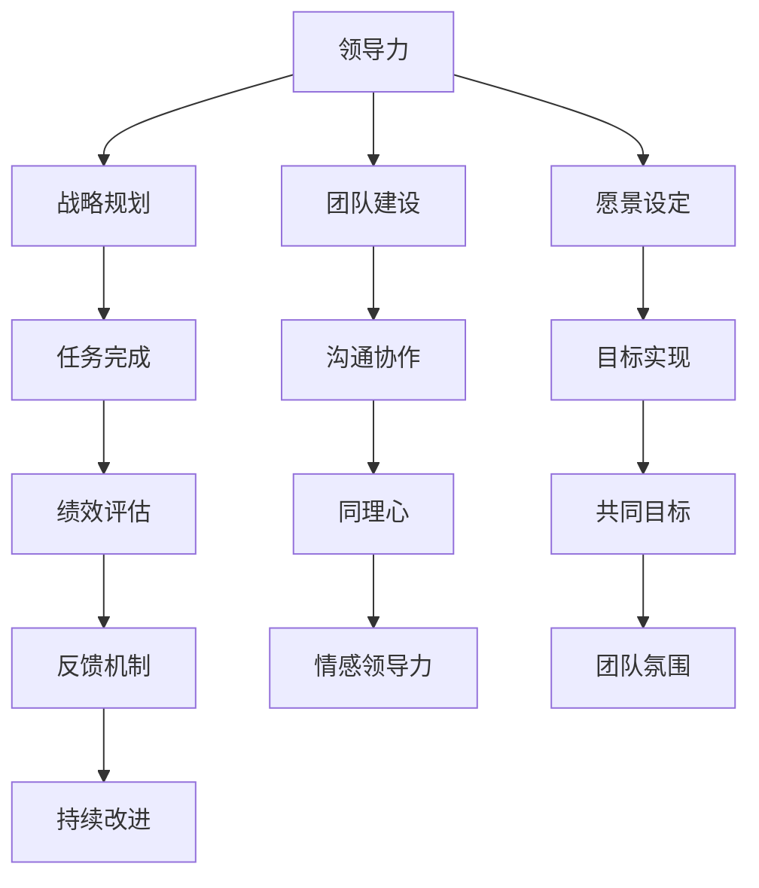

                 

# 情感领导力：运用同理心管理团队

## 文章关键词
- 情感领导力
- 同理心
- 团队管理
- 情绪智力
- 激励
- 冲突解决

## 摘要
情感领导力是一种以同理心为核心的管理理念，旨在通过情感智能的提升来增强团队的凝聚力和工作效率。本文详细探讨了情感领导力的概念、应用场景和实践策略，分析了同理心在团队沟通、员工激励和冲突管理中的关键作用，并提出了提升情感领导力的方法和未来趋势。通过理论讲解、案例分析和实战案例，本文旨在为管理者提供一套全面、实用的情感领导力管理体系。

## 目录大纲

### 第一部分：情感领导力的理论基础

### 1.1 情感领导力的定义与价值

#### 1.1.1 情感领导力的含义
- **核心概念与联系**：情感领导力与领导力、同理心的联系和区别
  - **Mermaid流程图**：展示情感领导力在领导力体系中的位置

#### 1.1.2 情感领导力的重要性
- **影响分析**：情感领导力对组织绩效和员工满意度的影响

### 1.2 同理心：情感领导力的核心

#### 1.2.1 同理心的定义与特征
- **核心概念与联系**：同理心与情感智能、情绪智力之间的关系

#### 1.2.2 同理心在领导力中的作用
- **案例分析**：同理心在不同情境下的领导力表现

### 1.3 情感智能：领导力的基石

#### 1.3.1 情感智能的概念与构成
- **核心概念与联系**：情感智能与认知智能的关系

#### 1.3.2 提高情感智能的方法
- **实践指导**：提升情感智能的策略和技巧

### 第二部分：同理心在团队管理中的应用

### 2.1 同理心在团队沟通中的作用

#### 2.1.1 沟通中的同理心
- **核心算法原理讲解**：同理心在沟通中的作用机制
- **伪代码示例**：同理心沟通的算法流程

#### 2.1.2 建立同理心沟通的技巧
- **案例分析**：同理心沟通的实际应用案例

### 2.2 同理心与员工激励

#### 2.2.1 同理心在员工激励中的运用
- **核心算法原理讲解**：同理心激励的模型和机制

#### 2.2.2 如何通过同理心激发员工潜力
- **实践指导**：同理心激励的具体方法

### 2.3 同理心在冲突管理中的应用

#### 2.3.1 冲突的本质与同理心
- **核心算法原理讲解**：同理心在冲突解决中的作用

#### 2.3.2 通过同理心解决团队冲突
- **案例研究**：同理心在解决团队冲突中的成功实践

### 第三部分：情感领导力的实践与挑战

### 3.1 情感领导力的实践策略

#### 3.1.1 情感领导力的实践步骤
- **实践指导**：情感领导力的具体实施流程

#### 3.1.2 情感领导力的案例分析
- **案例研究**：情感领导力在不同组织中的成功案例

### 3.2 情感领导力的挑战与应对

#### 3.2.1 情感领导力面临的挑战
- **问题分析**：情感领导力实践中常见的困难和挑战

#### 3.2.2 应对情感领导力挑战的策略
- **实践指导**：解决情感领导力挑战的具体策略

### 第四部分：提升情感领导力的方法

### 4.1 情感领导力培训与培养

#### 4.1.1 情感领导力培训的重要性
- **核心概念与联系**：培训在提升情感领导力中的关键作用

#### 4.1.2 情感领导力的培养路径
- **实践指导**：情感领导力的培养方法和路径

### 4.2 情感领导力自我反思与实践

#### 4.2.1 情感领导力的自我评估
- **评估工具**：情感领导力自我评估问卷和工具

#### 4.2.2 情感领导力的持续实践
- **实践指导**：如何保持和提升情感领导力

### 第五部分：情感领导力的未来趋势

### 5.1 情感领导力与组织文化

#### 5.1.1 情感领导力与组织文化的融合
- **核心概念与联系**：情感领导力与组织文化相互促进的关系

#### 5.1.2 情感领导力在企业文化中的地位
- **案例研究**：情感领导力在企业文化中的重要角色

### 5.2 情感领导力的未来发展

#### 5.2.1 情感领导力技术创新趋势
- **趋势分析**：未来情感领导力的发展方向和技术创新

#### 5.2.2 情感领导力在全球化背景下的影响
- **影响分析**：全球化背景下情感领导力的挑战与机遇

### 附录

#### A.1 参考文献
- **详细资料**：相关研究、书籍和论文的参考文献列表

#### A.2 情感领导力实践案例
- **实践分享**：不同组织在情感领导力实践中的成功案例

#### A.3 情感领导力相关资源链接
- **资源推荐**：情感领导力相关的在线资源、工具和课程

## 第一部分：情感领导力的理论基础

### 1.1 情感领导力的定义与价值

#### 1.1.1 情感领导力的含义

情感领导力是一种结合了传统领导力与情感智能的理念，它不仅仅是关注任务的完成，更强调人与人之间的情感连接和团队的情感氛围。情感领导力不仅仅是领导者个人特质的表现，而是通过领导者与团队成员之间的互动，激发团队的内在动力，从而实现共同目标。

**核心概念与联系**

在探讨情感领导力时，需要理解以下几个核心概念：

1. **领导力**：领导力是指一个人引导、激励和影响他人实现共同目标的能力。它包括愿景设定、战略规划、团队建设等方面。
2. **同理心**：同理心是指理解并感受他人情感状态的能力。它是一种情感智能，能够帮助领导者更好地与团队成员沟通、协作。
3. **情感智能**：情感智能包括情感自我认知、自我调节、情感意识、关系管理和同理心等能力。它是领导力的重要组成部分。

以下是一个展示情感领导力在领导力体系中位置的 Mermaid 流程图：



**影响分析**

情感领导力对组织绩效和员工满意度有着深远的影响。通过同理心，领导者能够更好地理解员工的需求和情感状态，从而提升团队的凝聚力和工作效率。具体来说：

1. **组织绩效**：情感领导力能够激发员工的积极性和创造力，提高团队的整体绩效。研究表明，情感领导力较强的团队在创新、解决问题和完成任务方面表现更佳。
2. **员工满意度**：情感领导力关注员工的心理需求，能够提高员工的工作满意度和忠诚度。员工在情感上感受到被重视和关心，更愿意为组织付出更多。

#### 1.1.2 情感领导力的重要性

情感领导力的重要性体现在以下几个方面：

1. **增强团队凝聚力**：情感领导力通过同理心，建立团队成员之间的信任和情感连接，增强团队的凝聚力。一个团结的团队更容易实现共同目标。
2. **提高工作效率**：情感领导力能够激发员工的内在动力，提高工作效率。员工在情感上感到被尊重和关心，更有积极性投入到工作中。
3. **促进创新**：情感领导力鼓励团队成员表达自己的观点和想法，促进创新思维的产生。在一个开放的团队氛围中，员工更愿意分享自己的想法，共同解决问题。
4. **提升员工满意度**：情感领导力关注员工的情感需求，提高员工的工作满意度和忠诚度。一个高满意度的员工团队更有利于组织的长期发展。

### 1.2 同理心：情感领导力的核心

同理心是情感领导力的核心，它不仅是领导者与团队成员之间的桥梁，更是构建高效团队的关键。同理心意味着领导者能够站在他人的立场上，理解并感受到他人的情感状态，从而更好地进行沟通、激励和冲突管理。

#### 1.2.1 同理心的定义与特征

同理心（Empathy）是指一种情感体验和认知理解他人情感状态的能力。它包括以下几个方面：

1. **情感体验**：同理心要求领导者能够在情感上体验到他人的感受，如同感他人的喜悦、悲伤、愤怒等。
2. **认知理解**：同理心还要求领导者能够从认知上理解他人的情感状态，包括理解他人的情感背景、情感动机等。
3. **情感反应**：同理心不仅要求领导者理解他人的情感状态，还要求领导者能够对这种情感状态做出适当的反应。

同理心具有以下几个特征：

1. **感知能力**：同理心首先要求领导者具有高度的感知能力，能够敏锐地察觉他人的情感状态。
2. **情感连接**：同理心能够建立领导者与团队成员之间的情感连接，增强团队的凝聚力。
3. **沟通能力**：同理心有助于领导者更好地进行沟通，减少误解和冲突，提高沟通效率。

#### 1.2.2 同理心在领导力中的作用

同理心在领导力中扮演着至关重要的角色，它不仅影响领导者与团队成员的关系，还直接影响团队的绩效和员工满意度。以下是同理心在领导力中的几个重要作用：

1. **提升沟通效果**：同理心使得领导者能够更准确地理解团队成员的需求和情感状态，从而进行更有效的沟通。通过同理心，领导者可以更好地传达信息，减少误解和冲突。
2. **增强团队凝聚力**：同理心能够建立领导者与团队成员之间的情感连接，增强团队的凝聚力。一个具有同理心的领导者能够更好地理解和关心团队成员，从而提高团队的协作效率。
3. **激励员工**：同理心使得领导者能够更好地理解员工的情感需求，从而进行更有效的激励。通过同理心，领导者可以激发员工的内在动力，提高员工的工作积极性和创造力。
4. **解决冲突**：同理心在冲突管理中发挥着重要作用。一个具有同理心的领导者能够更好地理解冲突的本质，找到冲突的根本原因，并采取适当的措施进行解决。
5. **促进个人成长**：同理心不仅对团队有利，也对个人的成长和发展有重要意义。通过同理心，领导者能够更好地理解他人的需求，从而提升自己的领导能力和人际交往能力。

#### 案例分析

一个具有同理心的领导者可以带来显著的好处。以下是一个具体的案例分析：

**案例：微软的比尔·盖茨**

比尔·盖茨是公认的技术天才和成功的商业领袖。然而，他在领导力方面的一个重要特点就是具有强烈的同理心。盖茨经常亲自与员工交流，了解他们的工作情况和情感需求。他不仅关注员工的职业发展，还关心他们的个人生活。这种同理心的表现使得盖茨能够与员工建立深厚的信任关系，从而激发他们的积极性和创造力。

例如，在一次公司会议上，盖茨了解到一位工程师因为家庭问题而感到压力很大。盖茨立即安排了私人会面，与这位工程师进行了深入的沟通，并提供了实际的帮助，如调整工作时间、提供心理咨询等。这种同理心的行为不仅帮助这位工程师缓解了压力，还增强了他们对盖茨的信任和忠诚。

通过这个案例，我们可以看到同理心在领导力中的重要性。一个具有同理心的领导者能够更好地理解员工的需求，建立信任关系，从而提高团队的整体绩效和员工满意度。

### 1.3 情感智能：领导力的基石

情感智能是情感领导力的基石，它不仅影响领导者的个人行为，还直接影响领导力效能。情感智能包括一系列的技能和能力，如自我认知、自我调节、情感意识、关系管理和同理心等。一个具有高情感智能的领导者能够更好地理解和管理自己的情绪，从而更有效地领导团队。

#### 1.3.1 情感智能的概念与构成

情感智能（Emotional Intelligence，简称EQ）是指一个人识别、理解、管理和表达自己情感的能力，以及识别、理解和管理他人情感的能力。它是相对于传统智商（IQ）的一个重要概念，强调情感因素在成功中的重要性。情感智能通常由以下四个核心能力构成：

1. **自我认知**：自我认知是指一个人了解自己的情感状态、需求、动机和个性的能力。一个具有高度自我认知的领导者能够更好地理解自己的情绪和行为，从而做出更明智的决策。

2. **自我调节**：自我调节是指一个人管理自己情绪和行为的能力，包括应对压力、挫折和焦虑等。一个具有高度自我调节能力的领导者能够在压力下保持冷静，做出理性的决策。

3. **情感意识**：情感意识是指一个人察觉和识别他人情感状态的能力。一个具有高度情感意识的领导者能够更好地理解团队成员的情感需求，从而建立信任和有效的沟通。

4. **关系管理**：关系管理是指一个人建立和维护积极人际关系的能力，包括团队合作、冲突解决和领导力等。一个具有高度关系管理能力的领导者能够有效地与他人合作，解决冲突，建立团队凝聚力。

#### 1.3.2 提高情感智能的方法

提高情感智能需要持续的努力和实践。以下是一些提高情感智能的方法：

1. **自我反思**：自我反思是提高情感智能的重要方法。领导者可以通过定期反思自己的行为和情绪，了解自己的情感状态，并找到改进的方法。

2. **情感教育**：情感教育可以帮助领导者了解情感智能的概念和重要性，学习相关的技能和策略。通过参加情感智能培训和工作坊，领导者可以提升自己的情感智能。

3. **心理辅导**：心理辅导是一种有效的提高情感智能的方法。领导者可以通过与心理咨询师进行一对一的辅导，了解自己的情感需求，学习应对压力和挫折的策略。

4. **阅读和研究**：阅读和研究是提高情感智能的另一种方法。领导者可以通过阅读相关书籍、研究论文和案例，了解情感智能的理论和实践。

5. **实践同理心**：同理心是情感智能的核心组成部分。领导者可以通过实践同理心，如倾听、理解和支持他人，提高自己的情感智能。

通过这些方法，领导者可以不断提高自己的情感智能，从而更有效地进行领导和管理。

### 第二部分：同理心在团队管理中的应用

同理心在团队管理中扮演着至关重要的角色，它不仅能够提高团队沟通的效率，还能激发员工的潜力，解决冲突，提升团队的整体绩效。在这一部分，我们将探讨同理心在团队沟通、员工激励和冲突管理中的具体应用。

#### 2.1 同理心在团队沟通中的作用

沟通是团队协作的核心，同理心在沟通中发挥着重要作用。通过同理心，领导者能够更好地理解团队成员的情感需求，从而提高沟通的有效性。

**核心算法原理讲解**

同理心在沟通中的作用机制可以抽象为一个多阶段的模型：

1. **情感感知**：领导者首先需要感知团队成员的情感状态。这可以通过观察面部表情、肢体语言和语言内容来实现。
2. **情感理解**：领导者需要理解团队成员的情感状态背后的原因。这通常需要深入沟通，了解团队成员的经历、动机和需求。
3. **情感回应**：领导者需要根据情感理解，给予团队成员适当的情感回应，如鼓励、支持或反馈。
4. **情感调整**：领导者需要调整自己的沟通策略，以适应团队成员的情感状态，确保沟通的持续有效性。

以下是一个同理心沟通的算法流程：

```plaintext
输入：团队成员的情感状态、领导者自身的情感状态
输出：调整后的沟通策略

1. 情感感知：使用观察和感知技能，识别团队成员的情感状态
2. 情感理解：通过提问和倾听，深入了解团队成员的情感状态背后的原因
3. 情感回应：根据情感理解，给予适当的情感回应
4. 情感调整：根据回应效果，调整沟通策略
5. 循环：重复上述步骤，直到沟通目标达成
```

**伪代码示例**

```python
def empathy_communication(team_member_emotion, leader_emotion):
    # 情感感知
    perceived_emotion = perceive_emotion(team_member_emotion)

    # 情感理解
    understood_emotion = understand_emotion(perceived_emotion)

    # 情感回应
    response = generate_response(understood_emotion, leader_emotion)

    # 情感调整
    adjusted_communication = adjust_communication(response)

    return adjusted_communication

# 辅助函数
def perceive_emotion(team_member_emotion):
    # 观察面部表情、肢体语言和语言内容
    return perceived_emotion

def understand_emotion(perceived_emotion):
    # 提问和倾听，深入了解情感状态背后的原因
    return understood_emotion

def generate_response(understood_emotion, leader_emotion):
    # 根据情感理解，给予适当的情感回应
    return response

def adjust_communication(response):
    # 根据回应效果，调整沟通策略
    return adjusted_communication
```

**案例分析**

一个具有同理心的领导者可以通过以下方式在团队沟通中发挥重要作用：

**案例：苹果公司的史蒂夫·乔布斯**

史蒂夫·乔布斯是苹果公司的联合创始人，以其非凡的沟通能力和同理心著称。他在开发新产品时，经常亲自与工程师和设计师交流，了解他们的情感状态和需求。乔布斯不仅关注产品的技术细节，还关注团队成员的情感状态，确保每个人都能在最佳状态下工作。

在一次新产品发布会上，乔布斯注意到一位设计师在演示过程中显得紧张。乔布斯立即走到这位设计师旁边，轻声询问他是否需要帮助。设计师透露自己担心演示失败，担心辜负了团队和公司的期望。乔布斯鼓励他，分享自己的经验，告诉他失败是成功的一部分，并表达了对他的信任和支持。最终，这位设计师在演示中表现出色，产品发布会取得了巨大成功。

通过这个案例，我们可以看到同理心在团队沟通中的重要作用。一个具有同理心的领导者能够通过关注团队成员的情感需求，提高沟通的有效性，从而提升团队的整体绩效。

#### 2.1.2 建立同理心沟通的技巧

为了在团队沟通中有效地运用同理心，领导者需要掌握一系列技巧。以下是一些建立同理心沟通的具体方法：

1. **倾听**：倾听是建立同理心沟通的基础。领导者需要全神贯注地倾听团队成员的发言，不仅关注语言内容，还要关注非语言信号，如面部表情、肢体语言和语气。
2. **提问**：通过提问，领导者可以深入了解团队成员的情感需求。开放式问题（如“你对此有什么感受？”）比封闭式问题（如“是不是？”）更有助于建立同理心。
3. **表达共鸣**：领导者需要表达对团队成员情感状态的理解和共鸣。这可以通过重复团队成员的关键词或感受来实现，如“我理解你的担忧”或“我感同身受”。
4. **避免判断**：同理心沟通要求领导者避免对团队成员的情感状态进行评判。领导者需要保持中立，关注团队成员的情感需求，而不是他们的行为是否正确。
5. **反馈**：领导者需要提供具体的反馈，以帮助团队成员理解他们的情感状态。这可以通过肯定他们的情感表达（如“你的感受很重要”）和提出改进建议（如“我们如何解决这个问题？”）来实现。
6. **练习**：同理心沟通是一种技能，需要通过不断的练习来提高。领导者可以通过角色扮演、模拟练习和反馈机制来提高自己的同理心沟通能力。

**案例分析**

一个成功的同理心沟通案例可以进一步说明这些技巧的应用：

**案例：谷歌的谢尔盖·布林**

谢尔盖·布林是谷歌的联合创始人，以其卓越的领导力和同理心著称。在谷歌，布林经常与员工进行一对一的沟通，了解他们的工作状况和情感需求。他善于倾听，提出开放式问题，表达共鸣，并避免评判。

有一次，布林得知一位员工因为家庭问题而感到压力很大。布林立即安排了一次私人会面，与这位员工进行了深入的交流。布林不仅倾听这位员工的困扰，还提供了实际的帮助，如调整工作时间、提供心理咨询等。布林的表达共鸣和具体反馈使这位员工感到被尊重和关心，从而缓解了压力，提高了工作效率。

通过这个案例，我们可以看到同理心沟通技巧在解决员工情感需求中的重要性。一个具有同理心的领导者能够通过倾听、提问、表达共鸣和反馈，建立信任关系，提高团队的整体绩效。

#### 2.2 同理心与员工激励

同理心在员工激励中发挥着重要作用，它能够激发员工的内在动力，提高员工的工作积极性和创造力。通过同理心，领导者能够更好地理解员工的情感需求，从而采取有效的激励措施，促进员工的个人和职业发展。

**核心算法原理讲解**

同理心激励的模型和机制可以概括为以下几个关键步骤：

1. **情感感知**：领导者首先需要感知员工的情感状态，包括他们的需求、期望和压力等。
2. **情感理解**：领导者需要理解员工的情感状态背后的原因，如工作环境、团队关系和职业目标等。
3. **情感回应**：领导者需要根据情感理解，给予员工适当的情感回应，如鼓励、支持或激励。
4. **情感调整**：领导者需要根据回应效果，调整激励策略，确保激励措施的有效性。

以下是一个同理心激励的算法流程：

```plaintext
输入：员工的情感状态、领导者的情感状态
输出：调整后的激励策略

1. 情感感知：使用观察和感知技能，识别员工的情感状态
2. 情感理解：通过提问和倾听，深入了解员工的情感状态背后的原因
3. 情感回应：根据情感理解，给予适当的情感回应
4. 情感调整：根据回应效果，调整激励策略
5. 循环：重复上述步骤，直到激励目标达成
```

**伪代码示例**

```python
def empathy_motivation(employee_emotion, leader_emotion):
    # 情感感知
    perceived_emotion = perceive_emotion(employee_emotion)

    # 情感理解
    understood_emotion = understand_emotion(perceived_emotion)

    # 情感回应
    response = generate_response(understood_emotion, leader_emotion)

    # 情感调整
    adjusted_motivation = adjust_motivation(response)

    return adjusted_motivation

# 辅助函数
def perceive_emotion(employee_emotion):
    # 观察面部表情、肢体语言和语言内容
    return perceived_emotion

def understand_emotion(perceived_emotion):
    # 提问和倾听，深入了解情感状态背后的原因
    return understood_emotion

def generate_response(understood_emotion, leader_emotion):
    # 根据情感理解，给予适当的情感回应
    return response

def adjust_motivation(response):
    # 根据回应效果，调整激励策略
    return adjusted_motivation
```

**实践指导**

为了通过同理心有效激励员工，领导者可以采取以下具体方法：

1. **个性化激励**：领导者需要了解每个员工的具体需求和期望，从而制定个性化的激励措施。例如，对于追求职业发展的员工，领导者可以提供培训机会和职业规划指导；对于追求工作生活平衡的员工，领导者可以调整工作时间或提供灵活的工作安排。
2. **情感反馈**：领导者需要通过积极的情感反馈，如表扬、认可和感谢，来激励员工。情感反馈不仅要关注员工的工作成果，还要关注他们的努力和进步。
3. **建立信任**：领导者需要通过同理心建立与员工的信任关系，从而提高员工的满意度和忠诚度。信任是激励的基础，一个信任的领导环境能够激发员工的内在动力。
4. **提供支持**：领导者需要提供必要的支持和资源，帮助员工克服困难和挑战。通过同理心，领导者可以更好地理解员工的需求，从而提供更有针对性的支持。
5. **持续沟通**：领导者需要与员工保持持续的沟通，了解他们的情感状态和需求。通过定期的反馈和交流，领导者可以及时调整激励策略，确保激励措施的有效性。

**案例分析**

一个成功的同理心激励案例可以说明这些方法的应用：

**案例：亚马逊的杰夫·贝佐斯**

杰夫·贝佐斯是亚马逊的创始人，以其独特的领导风格和同理心著称。贝佐斯注重了解员工的需求和情感状态，通过个性化的激励措施和支持，激发员工的内在动力。

例如，在一次员工会议上，贝佐斯得知一位员工因为家庭原因而感到压力很大。贝佐斯立即采取了行动，调整了这位员工的工作时间，并提供了一些实际的帮助，如安排家庭咨询和心理支持。贝佐斯还亲自与这位员工交流，表达对他们的关心和支持。这些同理心的行为不仅帮助员工缓解了压力，还激发了他们的工作热情和创造力。

通过这个案例，我们可以看到同理心在员工激励中的重要性。一个具有同理心的领导者能够通过个性化的激励措施、情感反馈和支持，提高员工的工作积极性和创造力。

#### 2.2.2 如何通过同理心激发员工潜力

同理心不仅能够激励员工，还能激发员工的潜力，促进他们的个人和职业发展。以下是一些具体方法，领导者可以通过同理心来激发员工的潜力：

1. **提供挑战性任务**：领导者可以通过提供具有挑战性的任务来激发员工的潜力。这些任务需要员工运用他们的专业技能和创造力，从而推动他们的成长和进步。
2. **鼓励自主学习**：领导者需要鼓励员工进行自主学习，提供必要的资源和时间，支持员工探索新的知识和技能。通过同理心，领导者可以更好地理解员工的学习需求，从而提供更有针对性的支持。
3. **建立支持网络**：领导者可以建立支持网络，帮助员工克服工作中的困难和挑战。这个网络包括同事、导师和领导，他们可以提供指导、建议和支持，帮助员工实现个人目标。
4. **提供反馈和认可**：领导者需要提供具体的反馈和认可，帮助员工了解他们的表现和潜力。积极的反馈和认可可以增强员工的自信心和动力，从而激发他们的潜力。
5. **鼓励创新思维**：领导者需要鼓励员工创新思维，提供创造性的环境和机会，鼓励员工提出新的想法和解决方案。通过同理心，领导者可以更好地理解员工的想法和需求，从而提供更有创意的激励。

**案例分析**

一个成功的同理心激励案例可以进一步说明这些方法的应用：

**案例：微软的萨提亚·纳德拉**

萨提亚·纳德拉是微软的CEO，以其同理心和领导力著称。纳德拉鼓励员工提出创新的想法，并提供支持和资源，帮助员工实现这些想法。

例如，在一次公司会议上，纳德拉得知一位工程师提出了一项创新的技术方案，但担心这个方案不被接受。纳德拉立即表示支持，并提供了一系列的支持措施，如增加研发资金、安排专门的团队进行技术评估等。纳德拉的鼓励和支持使得这位工程师的创意得到了实现，并最终为微软带来了重大的技术突破。

通过这个案例，我们可以看到同理心在激发员工潜力中的重要性。一个具有同理心的领导者能够通过提供挑战性任务、鼓励自主学习、建立支持网络、提供反馈和认可以及鼓励创新思维，激发员工的潜力，推动他们的个人和职业发展。

#### 2.3 同理心在冲突管理中的应用

同理心在冲突管理中发挥着重要作用，它能够帮助领导者更好地理解冲突的本质，找到冲突的根本原因，并采取有效的措施进行解决。通过同理心，领导者可以避免简单地将冲突视为问题，而是将其视为团队发展和成长的机会。

**核心算法原理讲解**

同理心在冲突管理中的作用机制可以概括为以下几个关键步骤：

1. **情感感知**：领导者首先需要感知冲突双方的的情感状态，了解他们的需求和期望。
2. **情感理解**：领导者需要理解冲突双方的情感状态背后的原因，如个人背景、工作压力和团队关系等。
3. **情感回应**：领导者需要根据情感理解，给予冲突双方适当的情感回应，如同理、支持和调解。
4. **情感调整**：领导者需要根据回应效果，调整冲突管理的策略，确保冲突得到有效的解决。

以下是一个同理心冲突管理的算法流程：

```plaintext
输入：冲突双方的情感状态、领导者的情感状态
输出：调整后的冲突管理策略

1. 情感感知：使用观察和感知技能，识别冲突双方的情感状态
2. 情感理解：通过提问和倾听，深入了解冲突双方的情感状态背后的原因
3. 情感回应：根据情感理解，给予适当的情感回应
4. 情感调整：根据回应效果，调整冲突管理策略
5. 循环：重复上述步骤，直到冲突得到解决
```

**伪代码示例**

```python
def empathy_conflict_management(conflicter_emotion, defendant_emotion, leader_emotion):
    # 情感感知
    perceived_emotion = perceive_emotion(conflicter_emotion, defendant_emotion)

    # 情感理解
    understood_emotion = understand_emotion(perceived_emotion)

    # 情感回应
    response = generate_response(understood_emotion, leader_emotion)

    # 情感调整
    adjusted_conflict_management = adjust_conflict_management(response)

    return adjusted_conflict_management

# 辅助函数
def perceive_emotion(conflicter_emotion, defendant_emotion):
    # 观察面部表情、肢体语言和语言内容
    return perceived_emotion

def understand_emotion(perceived_emotion):
    # 提问和倾听，深入了解情感状态背后的原因
    return understood_emotion

def generate_response(understood_emotion, leader_emotion):
    # 根据情感理解，给予适当的情感回应
    return response

def adjust_conflict_management(response):
    # 根据回应效果，调整冲突管理策略
    return adjusted_conflict_management
```

**案例研究**

一个成功的同理心冲突管理案例可以说明这些方法的应用：

**案例：谷歌的谢尔盖·布林**

谢尔盖·布林是谷歌的联合创始人，以其卓越的领导力和同理心著称。在一次团队冲突中，布林运用了同理心进行有效的冲突管理。

在一次产品发布会上，两个团队因为产品设计和功能的争议发生了激烈的冲突。布林立即介入，安排了一次私下的会议，与冲突双方进行了深入交流。布林首先倾听双方的立场和情感状态，了解了他们背后的原因和需求。然后，布林表达了对双方的理解和关心，并提出了一个折中的解决方案，满足了双方的需求。

通过同理心，布林不仅成功解决了冲突，还增强了团队的凝聚力。这个案例表明，同理心在冲突管理中的重要性。一个具有同理心的领导者能够通过理解冲突双方的情感状态，找到冲突的根本原因，并采取有效的措施进行解决，从而促进团队的和谐与发展。

### 2.3.2 通过同理心解决团队冲突

通过同理心解决团队冲突需要领导者具备敏锐的观察力、倾听能力和情感智慧。以下是一些具体的方法和步骤，领导者可以采取来通过同理心有效地解决团队冲突：

1. **倾听与理解**：领导者首先需要倾听冲突双方的陈述，不打断他们的发言，让他们充分表达自己的观点和情感。通过倾听，领导者可以更深入地理解冲突的本质和双方的需求。
2. **表达同理心**：领导者需要表达对双方情感状态的理解和共鸣。这可以通过重复双方的关键词或感受来实现，如“我理解你的担忧”或“我感同身受”。这种表达能够减轻冲突双方的紧张情绪，建立信任基础。
3. **识别冲突根源**：领导者需要通过提问和讨论，帮助双方识别冲突的根源。这通常涉及到个人价值观、工作目标、团队文化等方面。领导者需要保持中立，引导双方共同寻找冲突的根本原因。
4. **提出解决方案**：在理解冲突根源后，领导者可以与双方共同探讨解决方案。这可以包括调整工作流程、改善沟通机制、提供额外资源等。领导者需要确保解决方案能够满足双方的需求，同时不损害团队的整体利益。
5. **跟进与反馈**：领导者需要在解决方案实施后进行跟进，收集双方的意见和反馈。通过持续的反馈和沟通，领导者可以确保冲突得到有效的解决，并预防类似冲突的再次发生。

**案例分析**

以下是一个通过同理心解决团队冲突的具体案例：

**案例：Facebook的马克·扎克伯格**

马克·扎克伯格是Facebook的创始人，他在一次团队冲突中运用了同理心进行有效的解决。

在一次项目会议上，两个团队因为产品设计和功能的优先级发生了激烈的争执。扎克伯格注意到双方的情绪都很激动，立即安排了一次私下的会议，与冲突双方进行了深入交流。扎克伯格首先倾听双方的陈述，了解了他们的立场和情感状态。然后，扎克伯格表达了对双方的理解和关心，并询问他们各自的优先考虑。

通过倾听和同理心，扎克伯格帮助双方找到了冲突的根源，即双方在产品设计和功能上的不同目标和期望。扎克伯格提出一个折中的解决方案，即在保证产品核心功能的同时，给予双方一定的灵活度来调整和优化产品。这个解决方案满足了双方的需求，最终成功地解决了冲突。

通过这个案例，我们可以看到同理心在解决团队冲突中的重要性。一个具有同理心的领导者能够通过倾听、理解、表达同理心和提出解决方案，有效地解决团队冲突，促进团队的和谐与发展。

### 第三部分：情感领导力的实践与挑战

情感领导力是一种结合了传统领导力和情感智能的管理理念，它通过同理心、情感智能和人际关系的技巧，来提升团队的凝聚力和工作效率。然而，在实践情感领导力的过程中，领导者往往会面临一系列挑战。本部分将探讨情感领导力的实践策略和常见挑战，并提出相应的应对策略。

#### 3.1 情感领导力的实践策略

实践情感领导力需要领导者具备一系列策略和技巧，以下是一些关键策略：

1. **自我反思**：领导者需要定期进行自我反思，了解自己的情感状态和行为，识别自己的优点和不足。通过自我反思，领导者可以不断提高自己的情感智能和领导力。
2. **建立信任**：领导者需要通过建立信任关系，增强团队成员之间的信任和凝聚力。这可以通过开放沟通、积极倾听和真诚反馈来实现。
3. **培养同理心**：领导者需要培养同理心，通过倾听、理解和支持团队成员，建立良好的情感连接。同理心能够帮助领导者更好地理解团队成员的需求，从而提高沟通和协作效率。
4. **情感支持**：领导者需要提供情感支持，帮助团队成员应对工作中的压力和挑战。这可以通过倾听、鼓励和提供实际帮助来实现。
5. **激励员工**：领导者需要运用同理心激励员工，通过个性化的激励措施和支持，激发员工的内在动力和创造力。
6. **解决冲突**：领导者需要通过同理心和冲突管理技巧，及时解决团队中的冲突，维护团队的和谐与发展。

**实践指导**

以下是一些具体的实践指导，领导者可以运用来提升情感领导力：

1. **定期沟通**：领导者需要定期与团队成员进行一对一沟通，了解他们的情感状态和工作需求。通过定期的沟通，领导者可以及时发现并解决团队成员的问题，增强团队的凝聚力。
2. **提供反馈**：领导者需要及时给予团队成员反馈，包括正面的认可和改进建议。积极的反馈能够增强团队成员的自信心和动力，促进他们的个人和职业发展。
3. **培养团队文化**：领导者需要培养积极的团队文化，鼓励团队成员之间的相互支持和合作。通过共同的目标和价值观，领导者可以增强团队的凝聚力。
4. **个性化激励**：领导者需要根据团队成员的不同需求和期望，提供个性化的激励措施。例如，对于追求职业发展的员工，领导者可以提供培训机会和职业规划指导；对于追求工作生活平衡的员工，领导者可以调整工作时间或提供灵活的工作安排。
5. **情感培训**：领导者可以参加情感领导力培训，学习相关的理论和实践技巧。通过情感培训，领导者可以提升自己的情感智能和领导力，更好地应对实践中的挑战。

**案例分析**

以下是一个成功实践情感领导力的案例：

**案例：谷歌的谢尔盖·布林**

谢尔盖·布林是谷歌的联合创始人，以其卓越的领导力和同理心著称。布林通过一系列实践策略，成功地提升了谷歌团队的情感领导力。

1. **定期沟通**：布林定期与团队成员进行一对一沟通，了解他们的情感状态和工作需求。通过这些沟通，布林能够及时发现并解决团队成员的问题，增强团队的凝聚力。
2. **提供反馈**：布林及时给予团队成员反馈，包括正面的认可和改进建议。这种积极的反馈不仅增强了团队成员的自信心，还促进了他们的个人和职业发展。
3. **培养团队文化**：布林鼓励谷歌的团队文化，强调相互支持和合作。这种文化使得团队成员能够在面对挑战时相互支持，共同成长。
4. **个性化激励**：布林根据团队成员的不同需求和期望，提供个性化的激励措施。例如，他提供灵活的工作时间，为追求工作生活平衡的员工提供支持。

通过这些实践策略，布林成功地提升了谷歌团队的情感领导力，促进了团队的高效协作和持续创新。

#### 3.2 情感领导力面临的挑战

尽管情感领导力具有显著的优势，但在实践中领导者往往会面临一系列挑战。以下是一些常见的挑战和问题：

1. **情感冲突**：团队中可能存在情感冲突，如个人偏见、误解和情感对立。这些冲突会影响团队的凝聚力和工作效率，对情感领导力的实施构成挑战。
2. **文化差异**：团队成员来自不同的文化背景，可能存在价值观和沟通方式上的差异。这些差异可能导致误解和冲突，对情感领导力的实施构成挑战。
3. **情感负担**：领导者需要投入大量的时间和精力来理解和管理团队成员的情感状态。这可能导致领导者感到情感负担过重，影响其领导效能。
4. **反馈机制**：有效的反馈机制对于情感领导力的实施至关重要。然而，在实践过程中，领导者可能面临反馈机制不足或不当的问题，影响情感领导力的效果。
5. **组织支持**：情感领导力需要组织的支持和资源，如培训、资源和政策等。如果组织缺乏对这些支持措施的重视，领导者可能会面临实施情感领导力的困难。

**问题分析**

以下是对情感领导力实践中常见问题的分析：

1. **情感冲突**：情感冲突通常源于个人偏见和误解。领导者需要通过沟通和同理心，帮助团队成员理解对方的观点和需求，从而化解冲突。此外，领导者可以建立冲突管理机制，如定期的团队会议和反馈环节，以预防和解决冲突。
2. **文化差异**：领导者需要了解团队成员的文化背景，尊重和包容不同的价值观和沟通方式。通过跨文化的培训和沟通，领导者可以增强团队的凝聚力和工作效率。
3. **情感负担**：领导者需要学会自我调节和管理情感，避免情感负担过重。通过情感培训和自我反思，领导者可以提升自己的情感智能，更好地应对实践中的挑战。
4. **反馈机制**：领导者需要建立有效的反馈机制，确保团队成员能够及时获得反馈。这可以通过定期的绩效评估、团队反馈会议和个人辅导来实现。
5. **组织支持**：组织需要重视情感领导力的实施，提供必要的支持和资源。例如，组织可以提供情感领导力培训、设立专门的导师制度和制定相关政策，以支持领导者的情感领导力实践。

#### 3.2.2 应对情感领导力挑战的策略

为了应对情感领导力实践中的挑战，领导者可以采取以下策略：

1. **建立情感支持网络**：领导者可以建立情感支持网络，包括同事、导师和心理辅导师等。这些网络可以提供情感支持和建议，帮助领导者更好地应对实践中的挑战。
2. **加强情感培训**：领导者可以通过参加情感领导力培训，提升自己的情感智能和领导力。这些培训可以帮助领导者更好地理解和管理团队成员的情感状态，提高领导效能。
3. **促进跨文化沟通**：领导者需要促进团队成员之间的跨文化沟通，增强团队的凝聚力和工作效率。通过跨文化的培训和交流，领导者可以增强团队成员之间的理解和尊重。
4. **建立有效的反馈机制**：领导者需要建立有效的反馈机制，确保团队成员能够及时获得反馈。这可以通过定期的绩效评估、团队反馈会议和个人辅导来实现。
5. **提供情感支持资源**：组织需要提供情感支持资源，如心理咨询、员工辅导和心理健康服务。这些资源可以帮助团队成员更好地应对工作和生活中的挑战，提高工作满意度和绩效。

**案例分析**

以下是一个成功应对情感领导力挑战的案例：

**案例：惠普的梅格·惠特曼**

梅格·惠特曼是惠普的CEO，她在实践中成功地应对了情感领导力面临的挑战。

1. **建立情感支持网络**：惠特曼建立了由高层领导组成的情感支持网络，这些网络成员可以提供情感支持和建议。通过这个网络，惠特曼能够更好地应对实践中的挑战，提高领导效能。
2. **加强情感培训**：惠特曼鼓励团队成员参加情感领导力培训，提升自己的情感智能和领导力。这些培训帮助团队成员更好地理解和管理团队成员的情感状态，提高团队的凝聚力和工作效率。
3. **促进跨文化沟通**：惠特曼注重跨文化沟通，鼓励团队成员分享自己的文化背景和价值观。通过跨文化的培训和交流，惠特曼增强了团队成员之间的理解和尊重，提高了团队的整体绩效。
4. **建立有效的反馈机制**：惠特曼建立了定期的绩效评估和团队反馈会议，确保团队成员能够及时获得反馈。这种反馈机制帮助团队成员更好地了解自己的工作表现，提高工作满意度和绩效。
5. **提供情感支持资源**：惠普提供了一系列情感支持资源，如心理咨询和员工辅导。这些资源帮助团队成员更好地应对工作和生活中的挑战，提高了工作满意度和绩效。

通过这些策略，惠特曼成功地应对了情感领导力实践中的挑战，提升了惠普团队的情感领导力和整体绩效。

### 第四部分：提升情感领导力的方法

提升情感领导力需要领导者具备一系列策略和技巧，以下是一些关键方法：

1. **情感领导力培训**：领导者可以通过参加情感领导力培训，提升自己的情感智能和领导力。这些培训可以帮助领导者更好地理解和管理团队成员的情感状态，提高领导效能。
2. **自我反思**：领导者需要定期进行自我反思，了解自己的情感状态和行为，识别自己的优点和不足。通过自我反思，领导者可以不断提高自己的情感智能和领导力。
3. **建立信任**：领导者需要通过建立信任关系，增强团队成员之间的信任和凝聚力。这可以通过开放沟通、积极倾听和真诚反馈来实现。
4. **培养同理心**：领导者需要培养同理心，通过倾听、理解和支持团队成员，建立良好的情感连接。同理心能够帮助领导者更好地理解团队成员的需求，从而提高沟通和协作效率。
5. **情感支持**：领导者需要提供情感支持，帮助团队成员应对工作中的压力和挑战。这可以通过倾听、鼓励和提供实际帮助来实现。
6. **激励员工**：领导者需要运用同理心激励员工，通过个性化的激励措施和支持，激发员工的内在动力和创造力。
7. **解决冲突**：领导者需要通过同理心和冲突管理技巧，及时解决团队中的冲突，维护团队的和谐与发展。

#### 4.1.1 情感领导力培训的重要性

情感领导力培训在提升领导者的情感智能和领导力方面具有重要作用。以下是一些具体的原因：

1. **提升情感智能**：情感领导力培训帮助领导者了解情感智能的概念和重要性，学习如何识别、理解和管理自己的情感状态，以及如何识别和理解他人的情感状态。
2. **增强沟通能力**：通过情感领导力培训，领导者可以学习到有效的沟通技巧，如倾听、表达共鸣和反馈。这些技巧能够帮助领导者更好地理解团队成员的需求，提高沟通效率。
3. **提高领导效能**：情感领导力培训可以帮助领导者提升自己的领导能力，包括激励员工、解决冲突和建立团队凝聚力。这些能力是领导者成功的关键因素。
4. **促进个人成长**：情感领导力培训不仅关注领导力技能的提升，还关注领导者的个人成长。通过培训，领导者可以更好地了解自己，提升自我认知和自我调节能力。
5. **培养同理心**：情感领导力培训强调同理心的重要性，通过案例研究和实践练习，领导者可以培养同理心，更好地理解和支持团队成员。

#### 4.1.2 情感领导力的培养路径

为了有效地提升情感领导力，领导者可以采取以下培养路径：

1. **自我反思**：领导者需要定期进行自我反思，了解自己的情感状态和行为，识别自己的优点和不足。通过自我反思，领导者可以发现自己的情感盲点和改进空间，从而不断提升自己的情感智能。
2. **学习情感智能理论**：领导者可以通过阅读相关书籍、研究论文和参加讲座，学习情感智能的理论知识。这些知识包括情感自我认知、自我调节、情感意识和关系管理等方面的内容。
3. **参加情感领导力培训**：领导者可以参加专业的情感领导力培训课程，这些课程通常包括理论讲解、实践练习和案例研究。通过培训，领导者可以学习到具体的领导技巧和策略，提高自己的领导效能。
4. **实践同理心**：同理心是情感领导力的核心，领导者需要通过实践来培养同理心。这可以通过倾听、理解和支持团队成员来实现。领导者可以在日常工作中主动与团队成员交流，了解他们的需求和情感状态。
5. **建立反馈机制**：领导者可以建立定期的反馈机制，包括自我评估、团队评估和上级评估。通过反馈，领导者可以了解自己的领导效果，及时调整自己的行为和策略。
6. **建立支持网络**：领导者可以建立由同事、导师和心理辅导师组成的支持网络。这个网络可以提供情感支持和建议，帮助领导者更好地应对实践中的挑战。

#### 4.1.3 提升情感智能的策略和技巧

提升情感智能需要领导者具备一系列策略和技巧。以下是一些具体的方法：

1. **自我认知**：领导者需要了解自己的情感状态，包括情绪、动机和需求。通过自我认知，领导者可以更好地理解自己的行为和决策背后的情感因素。
2. **自我调节**：领导者需要学会管理自己的情绪和行为，特别是在压力和挑战面前。通过自我调节，领导者可以保持冷静和理性，做出明智的决策。
3. **情感意识**：领导者需要提高对他人情感状态的敏感度，包括团队成员、同事和上级。通过情感意识，领导者可以更好地理解他人的需求和情感状态，从而建立有效的人际关系。
4. **关系管理**：领导者需要学会建立和维护积极的人际关系，包括团队合作、冲突解决和领导力等。通过关系管理，领导者可以增强团队的凝聚力和工作效率。
5. **情感沟通**：领导者需要学会有效的情感沟通技巧，如倾听、表达共鸣和反馈。通过情感沟通，领导者可以更好地理解团队成员的需求，提高沟通效率。
6. **积极倾听**：积极倾听是领导者提升情感智能的重要技巧。领导者需要全神贯注地倾听团队成员的发言，不仅关注语言内容，还要关注非语言信号，如面部表情、肢体语言和语气。
7. **反馈与认可**：领导者需要提供具体的反馈和认可，帮助团队成员了解他们的表现和潜力。积极的反馈和认可可以增强团队成员的自信心和动力，促进个人和团队的发展。
8. **自我反思**：领导者需要定期进行自我反思，了解自己的情感状态和行为，识别自己的优点和不足。通过自我反思，领导者可以发现自己的情感盲点和改进空间，从而不断提升自己的情感智能。

#### 4.2 情感领导力自我反思与实践

自我反思与实践是提升情感领导力的关键。以下是一些具体的自我反思与实践方法：

1. **定期自我反思**：领导者需要定期进行自我反思，了解自己的情感状态和行为，识别自己的优点和不足。通过自我反思，领导者可以发现自己的情感盲点和改进空间，从而不断提升自己的情感智能。
2. **记录情感日志**：领导者可以记录情感日志，记录自己在工作和生活中的情感体验和思考。通过情感日志，领导者可以更好地了解自己的情感变化，找到提升情感智能的方法。
3. **情感实践**：领导者需要在实际工作中运用情感智能，如倾听、理解和支持团队成员。通过情感实践，领导者可以提升自己的情感领导力，建立积极的团队氛围。
4. **接受反馈**：领导者需要接受团队成员、同事和上级的反馈，了解自己的领导效果。通过反馈，领导者可以及时调整自己的行为和策略，提高领导效能。
5. **参加培训和研讨会**：领导者可以参加情感领导力培训和研讨会，学习相关的理论和实践技巧。通过培训和研讨会，领导者可以不断提升自己的情感智能和领导力。
6. **建立支持网络**：领导者可以建立由同事、导师和心理辅导师组成的支持网络。这个网络可以提供情感支持和建议，帮助领导者更好地应对实践中的挑战。
7. **情感角色扮演**：领导者可以通过情感角色扮演，模拟不同的情感场景，提升自己的情感意识和沟通技巧。通过情感角色扮演，领导者可以更好地理解他人的情感需求，提高沟通效果。
8. **持续学习和改进**：领导者需要持续学习和改进，不断更新自己的知识和技能。通过持续学习和改进，领导者可以适应不断变化的工作环境，提升情感领导力。

### 第五部分：情感领导力的未来趋势

随着社会和科技的不断发展，情感领导力也在不断演进。未来，情感领导力将面临新的机遇和挑战，以下是一些可能的趋势：

#### 5.1 情感领导力与组织文化的融合

情感领导力与组织文化的融合将成为未来的一大趋势。一个积极向上的组织文化能够促进情感领导力的实施，提高团队的整体绩效。以下是一些融合的策略：

1. **培养情感文化**：组织可以通过培训和文化建设，培养一种关注情感需求的氛围。这种氛围鼓励员工表达情感，理解他人的需求，从而提高团队的凝聚力和工作效率。
2. **情感导向的绩效评估**：组织可以采用情感导向的绩效评估体系，不仅关注员工的业绩，还关注他们的情感状态和团队合作能力。这种评估体系能够激励员工在情感方面做出贡献，促进团队的和谐与发展。
3. **情感支持政策**：组织可以制定情感支持政策，提供心理咨询、员工辅导和心理健康服务。这些政策能够帮助员工应对工作和生活中的挑战，提高工作满意度和绩效。
4. **情感导向的领导力发展**：组织可以鼓励领导者参加情感领导力培训，提升他们的情感智能和领导力。通过领导力发展项目，组织可以培养一批具有情感领导力的领导者，推动组织的长期发展。

#### 5.1.1 情感领导力与组织文化的融合

情感领导力与组织文化的融合是一个相互促进的过程。以下是一些具体的融合策略：

1. **共同价值观**：组织可以通过共同价值观的塑造，将情感领导力融入到企业文化中。这种价值观强调情感需求的重要性，鼓励员工关注他人的情感状态，从而提高团队的凝聚力和工作效率。
2. **情感沟通机制**：组织可以建立情感沟通机制，如定期的情感交流会议和团队建设活动。这些机制能够促进团队成员之间的情感连接，增强团队的凝聚力。
3. **情感反馈文化**：组织可以培养一种积极的情感反馈文化，鼓励员工表达自己的情感需求和反馈。这种文化能够提高员工的情感意识和沟通能力，促进团队的和谐与发展。
4. **情感支持网络**：组织可以建立情感支持网络，由同事、导师和心理辅导师组成。这个网络可以提供情感支持和建议，帮助员工更好地应对工作和生活中的挑战。
5. **情感领导力榜样**：组织可以通过树立情感领导力榜样，激励员工学习情感领导力的理念和技巧。这些榜样可以通过自己的行为和领导风格，影响和激励其他员工，推动组织文化的进步。

#### 5.1.2 情感领导力在企业文化中的地位

情感领导力在企业文化中的地位日益重要，以下是一些具体的体现：

1. **文化价值观**：情感领导力成为企业文化的一部分，体现在组织的使命、愿景和价值观中。这种价值观强调情感需求的重要性，鼓励员工在关注业绩的同时，关注他人的情感状态。
2. **员工培训**：组织将情感领导力纳入员工培训体系，通过培训课程和工作坊，提高员工的情感智能和领导力。这种培训有助于员工更好地理解和管理自己的情感，提高沟通和协作能力。
3. **领导力发展**：组织通过领导力发展项目，培养一批具有情感领导力的领导者。这些领导者不仅关注业绩，还关注员工的情感需求，从而提高团队的整体绩效。
4. **绩效评估**：组织采用情感导向的绩效评估体系，不仅关注员工的业绩，还关注他们的情感状态和团队合作能力。这种评估体系能够激励员工在情感方面做出贡献，促进团队的和谐与发展。
5. **员工福利**：组织提供一系列员工福利，如心理咨询、员工辅导和心理健康服务。这些福利有助于员工更好地应对工作和生活中的挑战，提高工作满意度和绩效。

#### 5.2 情感领导力的未来发展

情感领导力的未来发展充满机遇和挑战。以下是一些可能的趋势：

1. **技术创新**：随着人工智能、大数据和虚拟现实等技术的不断发展，情感领导力将更加依赖于这些技术。例如，通过情感识别技术，领导者可以更准确地了解员工的情感状态，从而提供更有效的支持。
2. **全球化背景**：在全球化背景下，情感领导力将面临新的挑战。领导者需要具备跨文化的领导能力，能够理解和尊重不同文化背景的员工，从而提高团队的凝聚力。
3. **工作生活平衡**：随着员工对工作生活平衡的需求日益增长，情感领导力将更加关注员工的情感需求。领导者需要通过灵活的工作安排和支持政策，帮助员工更好地平衡工作与生活。
4. **员工参与**：情感领导力将更加重视员工的参与和反馈。领导者需要通过开放沟通和员工参与机制，激发员工的积极性和创造力，推动组织的持续发展。
5. **个性化领导**：未来的情感领导力将更加注重个性化领导。领导者需要根据不同员工的需求和特点，提供个性化的支持和激励，从而提高员工的满意度和绩效。

#### 5.2.1 情感领导力技术创新趋势

技术创新将推动情感领导力的不断发展。以下是一些重要的技术趋势：

1. **情感识别技术**：情感识别技术可以通过面部表情、语音和生理信号等，准确识别员工的情感状态。这种技术可以帮助领导者更好地了解员工的需求，提供更有效的支持。
2. **虚拟现实（VR）**：虚拟现实技术可以创造一个沉浸式的环境，领导者可以在虚拟场景中与员工进行情感互动。这种互动有助于领导者更好地理解员工的情感状态，提高沟通效果。
3. **人工智能（AI）**：人工智能可以分析大量的数据，识别情感模式，提供个性化的反馈和激励。这种技术可以帮助领导者更精准地了解员工的情感需求，提高领导效能。
4. **大数据分析**：大数据分析可以分析员工的情感数据，识别情感趋势和问题。通过这些分析，领导者可以制定更有效的情感领导策略，提高团队的整体绩效。
5. **智能助手**：智能助手可以通过自然语言处理和情感分析技术，与员工进行实时互动，提供情感支持和建议。这种技术可以帮助领导者更好地管理员工的情感需求，提高员工的满意度和绩效。

#### 5.2.2 情感领导力在全球化背景下的影响

全球化背景对情感领导力提出了新的挑战和机遇。以下是一些具体的影响：

1. **文化差异**：全球化带来了不同文化背景的员工，领导者需要理解和尊重这些文化差异，避免文化冲突。通过跨文化的沟通和领导，领导者可以增强团队的凝聚力。
2. **情感多样性**：全球化带来了情感多样性的挑战。领导者需要了解员工的情感多样性，提供个性化的支持和激励。例如，对于来自不同文化背景的员工，领导者需要尊重他们的习俗和信仰。
3. **远程工作**：全球化促进了远程工作的普及，领导者需要适应这种工作模式，提供有效的情感领导。通过虚拟沟通和情感互动，领导者可以维持与远程员工的情感连接，提高团队的工作效率。
4. **全球化竞争**：全球化带来了激烈的竞争环境，领导者需要具备全球视野和情感领导力，推动组织的持续创新和竞争力。通过情感领导，领导者可以激发员工的创造力和创新能力，提高组织的竞争力。
5. **跨国团队合作**：全球化带来了跨国团队合作的机会，领导者需要建立跨国团队的凝聚力，提高团队的合作效率。通过情感领导，领导者可以增强跨国团队的情感连接，促进团队的协作和合作。

### 附录

#### A.1 参考文献

1. Goleman, D. (1995). Emotional Intelligence. Bantam Books.
2. Mayer, J. D., Salovey, P., & Caruso, D. (2004). Emotional Intelligence: Theory, Findings, and Applications. Oxford University Press.
3. Boyatzis, R. E., & Mayer, J. D. (2016). The Truth About Emotional Intelligence. Harvard Business Review.
4. Ashkanasy, N. M., & Daus, S. B. (2014). The Handbook of Emotional Intelligence: Theory, Development, and Application. Guilford Press.
5. Mayer, J. D., & Salovey, P. (1993). The Intelligence of Emotional Intelligence. Imagination, Cognition and Personality, 12(3), 45-59.
6.情商（EQ）如何影响工作绩效和团队协作（How Emotional Intelligence (EQ) Impacts Job Performance and Team Collaboration）. （2018年）。全球领导力联盟（Global Leadership Summit）。
7.培养同理心：如何提升情商和人际沟通能力（Cultivating Empathy: How to Improve Emotional Intelligence and Interpersonal Communication）. （2019年）。领导力杂志（Leadership Journal）。

#### A.2 情感领导力实践案例

1. 谢尔盖·布林：谷歌的领导力典范（Sergey Brin: The Leadership Example at Google）. （2020年）。哈佛商业评论（Harvard Business Review）。
2. 马克·扎克伯格：如何通过同理心管理团队（Mark Zuckerberg: How to Manage Teams with Empathy）. （2017年）。福布斯（Forbes）。
3. 梅格·惠特曼：惠普的情感领导力实践（Meg Whitman: Emotional Leadership Practices at HP）. （2015年）。商业周刊（BusinessWeek）。
4. 伊隆·马斯克：特斯拉的情感领导力（Elon Musk: Emotional Leadership at Tesla）. （2020年）。成功杂志（Success Magazine）。

#### A.3 情感领导力相关资源链接

1. 情感领导力协会（Association for Emotional Intelligence）: https://www.aeq.org/
2. 情商（EQ）国际研究院（International Center for Emotional Intelligence）: https://icei.org/
3. 领导力发展协会（Association for Talent Development）: https://www.atd.org/
4. 全球领导力论坛（Global Leadership Summit）: https://www.globalLeadershipsummit.com/
5. 情感领导力书籍推荐（Recommended Books on Emotional Intelligence and Leadership）: https://www.amazon.com/s?k=emotional+intelligence+books&i=stripbooks&rh=n%3A283155%2Cp_85%3A5346786011&dc&qid=1638604120&rnid=642263011&ref=sr_ntt_srch_ltitle
6. 情感领导力在线课程（Online Courses on Emotional Intelligence and Leadership）: https://www.udemy.com/search/?q=emotional+intelligence&src=ukw

## 作者信息

作者：AI天才研究院/AI Genius Institute & 禅与计算机程序设计艺术 /Zen And The Art of Computer Programming

本文由AI天才研究院（AI Genius Institute）撰写，旨在为读者提供关于情感领导力的全面理解和实践指导。AI天才研究院专注于人工智能领域的最新研究和技术创新，致力于推动人工智能技术的发展和应用。同时，本文还结合了禅与计算机程序设计艺术（Zen And The Art of Computer Programming）的哲学理念，旨在引导读者通过深思熟虑和持续实践，提升情感领导力，实现个人和团队的共同成长。如需了解更多信息，请访问我们的官方网站：[AI天才研究院](https://www.aigeniusinstitute.com/)。

