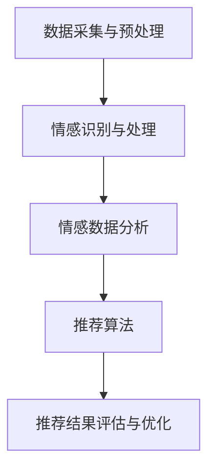
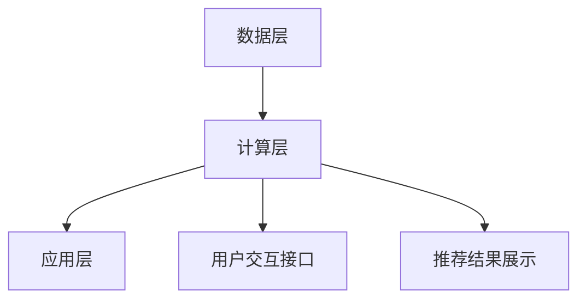
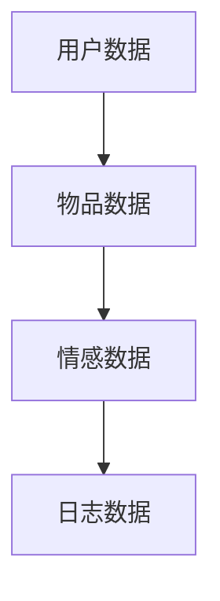
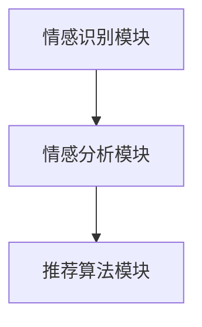
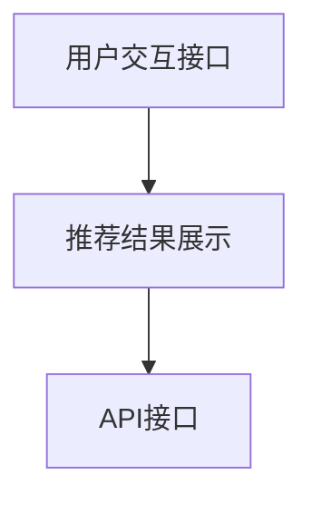
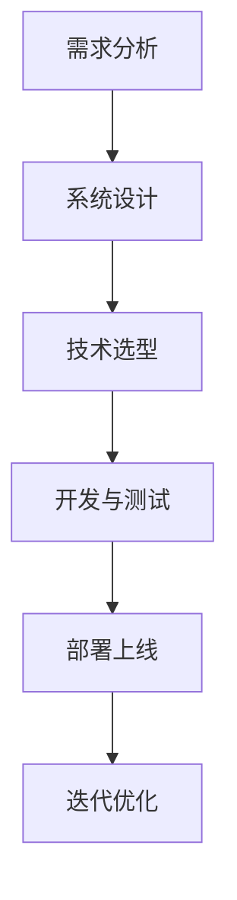

                 

# 《情感驱动推荐：AI 如何理解用户情绪，提供个性化推荐》

## 关键词
情感驱动推荐，用户情绪，人工智能，个性化推荐，情感识别，机器学习，推荐算法，数据可视化。

## 摘要
本文探讨了情感驱动推荐系统的基本概念、架构和技术实现。通过分析情感识别与处理技术，情感计算与机器学习模型，情感数据分析方法，以及个性化推荐算法，本文揭示了AI如何理解用户情绪，提供个性化的推荐服务。此外，文章通过实际案例展示了情感驱动推荐系统的设计与实现，探讨了其面临的挑战和未来发展趋势。

---

## 《情感驱动推荐：AI 如何理解用户情绪，提供个性化推荐》目录大纲

### 第一部分: 情感驱动推荐的基本概念与架构

#### 第1章: 情感驱动推荐概述
##### 1.1 什么是情感驱动推荐
##### 1.2 情感驱动推荐的应用领域
##### 1.3 情感驱动推荐与传统推荐系统的区别
##### 1.4 情感驱动推荐的架构与流程

#### 第2章: 情感识别与处理技术
##### 2.1 情感识别基本概念
##### 2.2 情感识别方法
###### 2.2.1 文本情感分析
###### 2.2.2 面部情感识别
###### 2.2.3 声音情感分析
##### 2.3 情感处理技术
###### 2.3.1 情感强度计算
###### 2.3.2 情感分类与聚类

### 第二部分: AI 如何理解用户情绪

#### 第3章: 情感计算与机器学习
##### 3.1 情感计算的原理与方法
##### 3.2 情感计算中的机器学习模型
###### 3.2.1 支持向量机(SVM)
###### 3.2.2 决策树与随机森林
###### 3.2.3 神经网络与深度学习
##### 3.3 情感计算中的特征工程
###### 3.3.1 文本特征提取
###### 3.3.2 图像特征提取
###### 3.3.3 声音特征提取

#### 第4章: 情感数据分析
##### 4.1 情感数据的收集与处理
##### 4.2 情感数据分析方法
###### 4.2.1 聚类分析
###### 4.2.2 关联规则挖掘
###### 4.2.3 协同过滤
###### 4.2.4 主题模型
##### 4.3 情感数据可视化

### 第三部分: 提供个性化推荐

#### 第5章: 个性化推荐算法
##### 5.1 个性化推荐的基本原理
##### 5.2 个性化推荐算法
###### 5.2.1 基于内容的推荐
###### 5.2.2 协同过滤推荐
###### 5.2.3 混合推荐系统
##### 5.3 情感对个性化推荐的影响

#### 第6章: 情感驱动推荐系统设计与实现
##### 6.1 情感驱动推荐系统架构
###### 6.1.1 数据采集与预处理
###### 6.1.2 情感识别与处理
###### 6.1.3 个性化推荐算法实现
###### 6.1.4 推荐系统评估与优化
##### 6.2 实战案例
###### 6.2.1 案例一：社交媒体中的情感驱动推荐
###### 6.2.2 案例二：电子商务网站的情感驱动推荐

#### 第7章: 情感驱动推荐的挑战与未来趋势
##### 7.1 情感驱动推荐的挑战
###### 7.1.1 情感识别的准确性
###### 7.1.2 情感驱动的隐私问题
###### 7.1.3 跨模态情感识别与融合
##### 7.2 情感驱动推荐的未来趋势
###### 7.2.1 情感计算的深度学习模型
###### 7.2.2 情感驱动推荐在新兴领域的应用
###### 7.2.3 情感驱动推荐的社会影响与伦理问题

### 附录
#### 附录 A: 情感驱动推荐相关工具与资源
##### A.1 情感识别工具介绍
##### A.2 情感分析开源库与框架
##### A.3 个性化推荐系统开源库与框架
##### A.4 实用推荐系统资源链接

---

## 第一部分: 情感驱动推荐的基本概念与架构

### 第1章: 情感驱动推荐概述

#### 1.1 什么是情感驱动推荐

情感驱动推荐是一种利用人工智能技术，分析用户的情感状态和行为，为用户推荐符合其情感需求和兴趣的物品或内容的方法。与传统的基于内容的推荐和协同过滤推荐相比，情感驱动推荐更加关注用户的情感体验，旨在提供更个性化的推荐服务。

#### 1.2 情感驱动推荐的应用领域

情感驱动推荐广泛应用于多个领域，包括但不限于：

- 社交媒体：根据用户的情感状态推荐用户可能感兴趣的内容或用户互动。
- 电子商务：为用户提供基于情感的个性化商品推荐，提高购物体验和转化率。
- 娱乐：根据用户的情感偏好推荐电影、音乐、游戏等娱乐内容。
- 健康医疗：分析用户的情感状态，提供针对性的健康建议和治疗方案。
- 教育培训：为用户提供符合其情感和学习需求的教育资源。

#### 1.3 情感驱动推荐与传统推荐系统的区别

传统推荐系统主要基于用户的兴趣和行为，而情感驱动推荐系统则更加深入地关注用户的情感状态。以下是比较两者的主要区别：

- 数据来源：传统推荐系统主要依赖用户的历史行为数据，而情感驱动推荐系统不仅依赖行为数据，还依赖情感数据，如用户在评论、留言、表情中的情感表达。
- 推荐效果：传统推荐系统可能会推荐用户已经感兴趣的内容，而情感驱动推荐系统可以发掘用户潜在的兴趣，并推荐更能引发情感共鸣的内容。
- 个性化程度：情感驱动推荐系统能够更准确地捕捉用户的个性化需求，提供更贴近用户内心世界的个性化推荐。

#### 1.4 情感驱动推荐的架构与流程

情感驱动推荐系统通常包括以下几个关键组成部分和流程：

1. **数据采集与预处理**：从多个渠道收集用户数据、情感数据和物品数据，并进行数据清洗和预处理。
2. **情感识别与处理**：利用自然语言处理、计算机视觉、语音识别等技术，识别和提取用户的情感信息。
3. **情感数据分析**：对情感数据进行分析，挖掘用户的情感特征和偏好。
4. **推荐算法**：结合用户情感特征和物品特征，利用机器学习和深度学习算法生成个性化推荐结果。
5. **推荐结果评估与优化**：对推荐结果进行评估，根据用户反馈调整推荐策略，优化推荐效果。

以上流程通过一个完整的Mermaid流程图来表示：



### 第2章: 情感识别与处理技术

#### 2.1 情感识别基本概念

情感识别是指利用计算机技术和算法，从文本、语音、图像等多模态数据中识别出用户的情感状态。情感识别是情感驱动推荐系统的核心组成部分，直接影响推荐结果的准确性和个性化程度。

#### 2.2 情感识别方法

情感识别方法主要包括以下几种：

##### 2.2.1 文本情感分析

文本情感分析是情感识别中最常见的方法，主要利用自然语言处理（NLP）技术，从文本中提取情感信息。以下是一个简单的文本情感分析流程：

1. **文本预处理**：去除标点符号、停用词，进行词干提取和词性标注。
2. **特征提取**：将预处理后的文本转化为特征向量，如词袋模型、TF-IDF、Word2Vec等。
3. **情感分类**：使用机器学习算法（如SVM、决策树、神经网络等），对特征向量进行训练和分类，预测文本的情感极性（正面/负面）。

以下是一个基于朴素贝叶斯算法的文本情感分析模型的伪代码：

```python
def sentiment_analysis(text):
    # 文本预处理
    processed_text = preprocess_text(text)

    # 特征提取
    features = extract_features(processed_text)

    # 加载训练好的朴素贝叶斯模型
    model = load_naive_bayes_model()

    # 预测情感极性
    sentiment = model.predict(features)

    return sentiment
```

##### 2.2.2 面部情感识别

面部情感识别是利用计算机视觉技术，从图像或视频中识别人的面部表情，进而判断情感状态。常见的面部情感识别方法包括基于传统机器学习和深度学习的方法。

以下是一个基于卷积神经网络（CNN）的面部情感识别模型的伪代码：

```python
def facial_emotion_recognition(image):
    # 加载预训练的CNN模型
    model = load_pretrained_cnn_model()

    # 图像预处理
    processed_image = preprocess_image(image)

    # 提取面部特征
    facial_features = model.extract_features(processed_image)

    # 使用SVM分类器进行情感分类
    classifier = train_svm_classifier(facial_features)

    # 预测情感类别
    emotion = classifier.predict(facial_features)

    return emotion
```

##### 2.2.3 声音情感分析

声音情感分析是利用音频处理技术，从语音信号中识别情感信息。常见的方法包括基于频谱分析、特征提取和分类器的情感识别。

以下是一个基于长短期记忆网络（LSTM）的声音情感识别模型的伪代码：

```python
def sound_emotion_recognition(audio_signal):
    # 加载预训练的LSTM模型
    model = load_pretrained_lstm_model()

    # 音频信号预处理
    processed_audio = preprocess_audio_signal(audio_signal)

    # 提取音频特征
    audio_features = model.extract_features(processed_audio)

    # 使用SVM分类器进行情感分类
    classifier = train_svm_classifier(audio_features)

    # 预测情感类别
    emotion = classifier.predict(audio_features)

    return emotion
```

#### 2.3 情感处理技术

情感处理技术是对识别出的情感数据进行分析和处理的步骤，包括情感强度计算、情感分类与聚类等。

##### 2.3.1 情感强度计算

情感强度计算是指量化情感的程度，常用的方法包括基于情感词典的强度计算和基于机器学习的情感强度预测。

以下是一个基于情感词典的情感强度计算方法的伪代码：

```python
def calculate_emotion_intensity(text, emotion_dict):
    # 初始化情感强度
    emotion_intensity = {emotion: 0 for emotion in emotion_dict.keys()}

    # 遍历文本中的每个单词
    for word in text.split():
        # 如果单词在情感词典中
        if word in emotion_dict:
            # 更新情感强度
            emotion_intensity[emotion_dict[word]] += 1

    # 计算总情感强度
    total_intensity = sum(emotion_intensity.values())

    # 归一化情感强度
    emotion_intensity = {emotion: intensity/total_intensity for emotion, intensity in emotion_intensity.items()}

    return emotion_intensity
```

##### 2.3.2 情感分类与聚类

情感分类是将情感数据划分为不同的类别，如正面、负面等。情感聚类是将情感数据按照相似性进行分组。

以下是一个基于K-means算法的情感分类与聚类方法的伪代码：

```python
from sklearn.cluster import KMeans

def emotion_classification_and_clustering(data, num_clusters):
    # 使用K-means算法进行聚类
    kmeans = KMeans(n_clusters=num_clusters)
    clusters = kmeans.fit_predict(data)

    # 根据聚类结果进行情感分类
    emotions = []
    for cluster in range(num_clusters):
        emotion = 'positive' if cluster < num_clusters/2 else 'negative'
        emotions.append(emotion)

    return clusters, emotions
```

### 第二部分: AI 如何理解用户情绪

#### 第3章: 情感计算与机器学习

#### 3.1 情感计算的原理与方法

情感计算是人工智能领域的一个重要分支，旨在使计算机能够理解、处理和模拟人类的情感。情感计算的核心原理和方法包括情感识别、情感分析、情感建模和情感推理。

##### 3.1.1 情感识别

情感识别是指从文本、语音、图像等多模态数据中自动识别情感信息。情感识别的关键在于如何准确地捕捉和表征用户的情感状态。常用的情感识别方法包括文本情感分析、语音情感识别和图像情感识别。

1. **文本情感分析**：文本情感分析是情感识别中最常见的方法。它利用自然语言处理技术，从文本中提取情感信息，如情感极性（正面/负面）、情感强度（强/弱）等。文本情感分析的步骤包括文本预处理、特征提取和情感分类。

2. **语音情感识别**：语音情感识别是利用音频信号处理技术，从语音中识别情感信息。语音情感识别的关键在于如何提取语音特征，如频谱特征、声学特征等，并使用机器学习算法进行情感分类。

3. **图像情感识别**：图像情感识别是利用计算机视觉技术，从图像中识别情感信息。图像情感识别的关键在于如何从图像中提取情感特征，并使用机器学习算法进行情感分类。

以下是一个简单的情感识别模型的伪代码：

```python
def emotion_recognition(data, model):
    # 预处理数据
    processed_data = preprocess_data(data)

    # 使用训练好的模型进行情感识别
    emotion = model.predict(processed_data)

    return emotion
```

##### 3.1.2 情感分析

情感分析是对情感识别结果进行进一步分析和解释的过程。情感分析可以帮助我们理解用户的情感状态、情感趋势和情感关系。常见的情感分析方法包括情感强度计算、情感分类和情感聚类。

1. **情感强度计算**：情感强度计算是指量化情感的程度。常用的方法包括基于情感词典的情感强度计算和基于机器学习的情感强度预测。

2. **情感分类**：情感分类是将情感数据划分为不同的类别，如正面、负面、中性等。情感分类的方法包括监督学习和无监督学习。

3. **情感聚类**：情感聚类是将情感数据按照相似性进行分组。情感聚类的方法包括K-means聚类、层次聚类等。

以下是一个简单的情感分析模型的伪代码：

```python
def emotion_analysis(data, model):
    # 预处理数据
    processed_data = preprocess_data(data)

    # 使用训练好的模型进行情感分析
    emotion_intensity = model.calculate_emotion_intensity(processed_data)
    emotion_category = model.classify_emotion(processed_data)
    emotion_clusters = model.cluster_emotions(processed_data)

    return emotion_intensity, emotion_category, emotion_clusters
```

##### 3.1.3 情感建模

情感建模是指建立情感模型，以模拟人类的情感状态和行为。情感建模的方法包括基于规则的情感建模和基于数据驱动的情感建模。

1. **基于规则的情感建模**：基于规则的情感建模是指使用预定义的规则来模拟情感状态和行为。这种方法通常用于简单的情感识别和情感分析任务。

2. **基于数据驱动的情感建模**：基于数据驱动的情感建模是指使用机器学习和深度学习算法来建立情感模型。这种方法可以处理更复杂的情感任务，如情感分类、情感强度计算和情感推理。

以下是一个简单的情感建模模型的伪代码：

```python
def build_emotion_model(data):
    # 预处理数据
    processed_data = preprocess_data(data)

    # 使用机器学习算法建立情感模型
    model = train_machine_learning_model(processed_data)

    return model
```

##### 3.1.4 情感推理

情感推理是指根据情感模型和情感数据，进行推理和决策的过程。情感推理可以帮助我们预测用户的情感状态、情感变化和情感趋势。

1. **情感预测**：情感预测是指根据用户的历史情感数据和当前情境，预测用户的未来情感状态。

2. **情感变化预测**：情感变化预测是指根据用户的历史情感数据和当前情境，预测用户的情感变化趋势。

3. **情感决策**：情感决策是指根据用户的情感状态和目标，选择最佳行动方案。

以下是一个简单的情感推理模型的伪代码：

```python
def emotion_inference(model, data, goal):
    # 预处理数据
    processed_data = preprocess_data(data)

    # 使用训练好的模型进行情感推理
    predicted_emotion = model.predict_emotion(processed_data)
    emotion_change = model.predict_emotion_change(processed_data)
    action_plan = model.decide_action_plan(predicted_emotion, emotion_change, goal)

    return action_plan
```

#### 3.2 情感计算中的机器学习模型

情感计算中的机器学习模型是构建情感识别和分析系统的核心。这些模型可以从大量数据中学习，自动识别情感模式，提高推荐系统的准确性和个性化程度。以下是一些常见的机器学习模型及其在情感计算中的应用：

##### 3.2.1 支持向量机（SVM）

支持向量机是一种二分类模型，可以用来进行情感分类。SVM通过寻找最佳分割超平面，将具有不同情感的文本数据分离开来。

以下是一个使用SVM进行文本情感分类的伪代码：

```python
from sklearn.svm import SVC

def sentiment_classification(texts, labels):
    # 预处理文本数据
    processed_texts = preprocess_texts(texts)

    # 分割训练集和测试集
    train_texts, test_texts, train_labels, test_labels = train_test_split(processed_texts, labels, test_size=0.2)

    # 训练SVM模型
    model = SVC()
    model.fit(train_texts, train_labels)

    # 预测情感类别
    predicted_labels = model.predict(test_texts)

    # 评估模型性能
    accuracy = accuracy_score(test_labels, predicted_labels)
    return accuracy
```

##### 3.2.2 决策树与随机森林

决策树是一种基于特征划分数据的分类模型。随机森林是决策树的集成方法，通过构建多个决策树，并取它们的平均预测结果来提高模型的准确性。

以下是一个使用随机森林进行文本情感分类的伪代码：

```python
from sklearn.ensemble import RandomForestClassifier

def sentiment_classification(texts, labels):
    # 预处理文本数据
    processed_texts = preprocess_texts(texts)

    # 分割训练集和测试集
    train_texts, test_texts, train_labels, test_labels = train_test_split(processed_texts, labels, test_size=0.2)

    # 训练随机森林模型
    model = RandomForestClassifier()
    model.fit(train_texts, train_labels)

    # 预测情感类别
    predicted_labels = model.predict(test_texts)

    # 评估模型性能
    accuracy = accuracy_score(test_labels, predicted_labels)
    return accuracy
```

##### 3.2.3 神经网络与深度学习

神经网络是一种模拟生物神经系统的计算模型，可以用于复杂的情感识别任务。深度学习是神经网络的一种扩展，通过多层神经网络结构，可以自动提取复杂特征。

以下是一个使用深度学习进行文本情感分类的伪代码：

```python
from tensorflow.keras.models import Sequential
from tensorflow.keras.layers import Dense, Embedding, LSTM

def sentiment_classification(texts, labels):
    # 预处理文本数据
    processed_texts = preprocess_texts(texts)

    # 分割训练集和测试集
    train_texts, test_texts, train_labels, test_labels = train_test_split(processed_texts, labels, test_size=0.2)

    # 构建深度学习模型
    model = Sequential()
    model.add(Embedding(input_dim=vocab_size, output_dim=embedding_dim))
    model.add(LSTM(units=128))
    model.add(Dense(units=num_classes, activation='softmax'))

    # 编译模型
    model.compile(optimizer='adam', loss='categorical_crossentropy', metrics=['accuracy'])

    # 训练模型
    model.fit(train_texts, train_labels, epochs=10, batch_size=32, validation_split=0.1)

    # 预测情感类别
    predicted_labels = model.predict(test_texts)

    # 评估模型性能
    accuracy = accuracy_score(test_labels, predicted_labels)
    return accuracy
```

#### 3.3 情感计算中的特征工程

特征工程是机器学习中一个重要的步骤，其目的是通过选择和构造特征，提高模型的学习能力和准确性。在情感计算中，特征工程尤为关键，因为情感数据通常是非结构化的，需要通过预处理和特征提取来转化为模型可以处理的格式。

##### 3.3.1 文本特征提取

文本特征提取是将文本数据转化为数值特征的过程，常用的方法包括词袋模型、TF-IDF和Word2Vec。

1. **词袋模型**：词袋模型是一种基于计数的文本表示方法，它将文本表示为一个向量，向量的每个维度表示一个词汇的出现次数。

2. **TF-IDF**：TF-IDF（词频-逆文档频率）是一种基于统计的文本表示方法，它考虑了词汇在文本中的重要程度，通过计算词频和逆文档频率来衡量词汇的相关性。

3. **Word2Vec**：Word2Vec是一种基于神经网络的文本表示方法，它通过训练得到词汇的向量表示，能够捕捉词汇的语义信息。

以下是一个使用Word2Vec进行文本特征提取的伪代码：

```python
from gensim.models import Word2Vec

def text_feature_extraction(texts):
    # 将文本数据转换为词序列
    sentences = [[word for word in document.split()] for document in texts]

    # 训练Word2Vec模型
    model = Word2Vec(sentences, vector_size=100, window=5, min_count=1, workers=4)

    # 提取文本特征
    text_features = [sum(model[word] for word in document.split() if word in model) / len(document.split()) for document in texts]

    return text_features
```

##### 3.3.2 图像特征提取

图像特征提取是将图像数据转化为数值特征的过程，常用的方法包括卷积神经网络（CNN）和特征点提取。

1. **卷积神经网络（CNN）**：CNN是一种用于图像处理和计算机视觉的深度学习模型，可以通过多层卷积和池化操作提取图像的层次特征。

2. **特征点提取**：特征点提取是一种基于图像的局部特征提取方法，如SIFT（尺度不变特征变换）和SURF（加速稳健特征）。

以下是一个使用CNN进行图像特征提取的伪代码：

```python
from tensorflow.keras.applications import VGG16

def image_feature_extraction(images):
    # 加载预训练的VGG16模型
    model = VGG16(weights='imagenet', include_top=False)

    # 预处理图像数据
    processed_images = preprocess_images(images)

    # 提取图像特征
    image_features = model.predict(processed_images).reshape(-1, 7 * 7 * 512)

    return image_features
```

##### 3.3.3 声音特征提取

声音特征提取是将声音数据转化为数值特征的过程，常用的方法包括MFCC（梅尔频率倒谱系数）和基于深度学习的方法。

1. **MFCC**：MFCC是一种基于频谱分析的声音特征提取方法，能够有效地捕捉声音的时频特征。

2. **基于深度学习的方法**：基于深度学习的方法，如卷积神经网络（CNN）和循环神经网络（RNN），可以自动提取声音的深层特征。

以下是一个使用CNN进行声音特征提取的伪代码：

```python
from tensorflow.keras.models import Sequential
from tensorflow.keras.layers import Conv2D, MaxPooling2D, Flatten, Dense

def sound_feature_extraction(sounds):
    # 构建深度学习模型
    model = Sequential()
    model.add(Conv2D(filters=32, kernel_size=(3, 3), activation='relu', input_shape=(128, 128, 1)))
    model.add(MaxPooling2D(pool_size=(2, 2)))
    model.add(Conv2D(filters=64, kernel_size=(3, 3), activation='relu'))
    model.add(MaxPooling2D(pool_size=(2, 2)))
    model.add(Flatten())
    model.add(Dense(units=128, activation='relu'))
    model.add(Dense(units=1, activation='sigmoid'))

    # 编译模型
    model.compile(optimizer='adam', loss='binary_crossentropy', metrics=['accuracy'])

    # 训练模型
    model.fit(sounds, labels, epochs=10, batch_size=32)

    # 预测声音特征
    predicted_features = model.predict(sounds)

    return predicted_features
```

### 第三部分: 情感数据分析

#### 第4章: 情感数据的收集与处理

情感数据的收集与处理是构建情感分析模型的基础，也是实现情感驱动推荐系统的关键步骤。本章将详细讨论情感数据的收集、处理和存储过程。

#### 4.1 情感数据的收集

情感数据的收集是情感分析的第一步，它决定了后续分析的质量。情感数据可以从多种渠道获取，包括：

1. **用户生成内容**：例如，社交媒体帖子、评论、博客和论坛等，这些内容通常包含了大量的情感信息。
2. **传感器数据**：例如，智能手机和可穿戴设备的传感器数据，可以提供用户的行为和生理信号，这些数据可以用于推断用户的情感状态。
3. **调查问卷**：通过在线或离线方式收集用户的主观情感评价，如满意度调查、情绪量表等。
4. **音频和视频数据**：通过语音识别和计算机视觉技术，从音频和视频中提取情感信息。

以下是一个从社交媒体帖子中收集情感数据的示例：

```python
import tweepy

# 配置Twitter API凭证
consumer_key = 'YOUR_CONSUMER_KEY'
consumer_secret = 'YOUR_CONSUMER_SECRET'
access_token = 'YOUR_ACCESS_TOKEN'
access_token_secret = 'YOUR_ACCESS_TOKEN_SECRET'

# 初始化Tweepy API
auth = tweepy.OAuthHandler(consumer_key, consumer_secret)
auth.set_access_token(access_token, access_token_secret)
api = tweepy.API(auth)

# 收集用户的推文数据
def collect_tweets(username, num_tweets):
    tweets = api.user_timeline(username, count=num_tweets)
    data = [{'text': tweet.text} for tweet in tweets]
    return data

# 使用函数收集情感数据
emotion_data = collect_tweets('user123', 100)
```

#### 4.2 情感数据的处理

情感数据的处理包括数据清洗、数据预处理和数据标准化等步骤，这些步骤有助于提高数据质量和分析结果的准确性。

1. **数据清洗**：去除噪声数据、重复数据和异常值，确保数据的一致性和完整性。
2. **数据预处理**：包括分词、词干提取、词性标注等，将这些文本数据转化为可以用于模型训练的格式。
3. **数据标准化**：将数据缩放到相同的范围，如0到1之间，以避免数据量级差异对模型训练的影响。

以下是一个文本数据预处理流程的伪代码：

```python
import nltk
from nltk.corpus import stopwords
from nltk.tokenize import word_tokenize
from nltk.stem import PorterStemmer

# 下载必需的资源
nltk.download('punkt')
nltk.download('stopwords')

# 初始化资源
stop_words = set(stopwords.words('english'))
stemmer = PorterStemmer()

# 文本预处理函数
def preprocess_text(text):
    # 分词
    words = word_tokenize(text)
    # 去除停用词
    filtered_words = [word for word in words if word.lower() not in stop_words]
    # 词干提取
    stemmed_words = [stemmer.stem(word) for word in filtered_words]
    return stemmed_words

# 预处理示例数据
preprocessed_data = [preprocess_text(text) for text in emotion_data]
```

#### 4.3 数据存储

情感数据通常规模较大，因此需要高效的存储解决方案。常用的数据存储方式包括：

1. **关系型数据库**：如MySQL、PostgreSQL，适用于结构化数据存储和查询。
2. **非关系型数据库**：如MongoDB、Cassandra，适用于大规模、分布式数据存储。
3. **数据湖**：如Hadoop、Spark，适用于大规模数据存储和分析。

以下是一个将预处理后的情感数据存储到MongoDB的示例：

```python
from pymongo import MongoClient

# 连接MongoDB
client = MongoClient('mongodb://localhost:27017/')

# 选择数据库和集合
db = client['emotion_data']
collection = db['tweets']

# 存储数据
def store_data(data):
    for item in data:
        document = {'text': ' '.join(item)}
        collection.insert_one(document)

# 存储预处理后的数据
store_data(preprocessed_data)
```

#### 4.4 情感数据的可视化

情感数据的可视化有助于理解和分析情感数据的分布和趋势。常用的可视化工具包括Matplotlib、Seaborn和WordCloud等。

以下是一个使用WordCloud可视化情感数据的示例：

```python
from wordcloud import WordCloud
import matplotlib.pyplot as plt

# 生成词云
def generate_wordcloud(data):
    text = ' '.join(data)
    wordcloud = WordCloud(background_color='white', width=800, height=800).generate(text)
    return wordcloud

# 可视化词云
wordcloud = generate_wordcloud([item['text'] for item in preprocessed_data])
plt.figure(figsize=(10, 10))
plt.imshow(wordcloud, interpolation='bilinear')
plt.axis('off')
plt.show()
```

通过以上步骤，我们成功地收集、处理和存储了情感数据，并为后续的情感分析奠定了基础。

### 第5章: 个性化推荐算法

个性化推荐算法是构建情感驱动推荐系统的重要一环，通过分析用户的情感和兴趣，为用户推荐符合其需求的物品或内容。本章将详细讨论个性化推荐算法的基本原理、实现方法和应用场景。

#### 5.1 个性化推荐的基本原理

个性化推荐系统旨在为用户提供个性化的推荐结果，以满足其特定需求和兴趣。个性化推荐的基本原理包括：

1. **用户建模**：通过分析用户的历史行为、偏好和反馈，构建用户的兴趣模型。
2. **物品建模**：通过分析物品的特征、标签和属性，构建物品的描述模型。
3. **推荐策略**：根据用户建模和物品建模的结果，利用推荐算法生成个性化推荐列表。

个性化推荐算法可以分为三类：基于内容的推荐、基于协同过滤的推荐和混合推荐系统。

##### 5.1.1 基于内容的推荐

基于内容的推荐算法（Content-Based Filtering，CBF）是通过分析用户的兴趣和偏好，为用户推荐具有相似内容的物品。该方法的核心思想是“物以类聚”，即将用户过去喜欢的物品和当前物品进行内容对比，推荐具有相似内容的物品。

以下是基于内容的推荐算法的基本步骤：

1. **用户兴趣提取**：从用户的历史行为中提取用户的兴趣点，如浏览记录、收藏记录、评分等。
2. **物品内容特征提取**：从物品的描述中提取特征，如标签、属性、文本描述等。
3. **相似度计算**：计算用户兴趣特征和物品内容特征之间的相似度，通常使用余弦相似度、Jaccard相似度等方法。
4. **生成推荐列表**：根据相似度计算结果，为用户生成个性化的推荐列表。

以下是一个简单的基于内容的推荐算法示例：

```python
# 假设用户兴趣特征为user_interests，物品内容特征为item_features
def content_based_recommendation(user_interests, item_features, similarity_threshold):
    recommendations = []
    for item_id, item_features in item_features.items():
        similarity = cosine_similarity(user_interests, item_features)
        if similarity > similarity_threshold:
            recommendations.append(item_id)
    return recommendations
```

##### 5.1.2 基于协同过滤的推荐

基于协同过滤的推荐算法（Collaborative Filtering，CF）是通过分析用户之间的相似行为，为用户推荐其他用户喜欢的物品。该方法的核心思想是“人以群分”，即根据用户的相似行为预测用户可能感兴趣的物品。

协同过滤算法可以分为两类：基于用户的协同过滤（User-Based CF）和基于物品的协同过滤（Item-Based CF）。

1. **基于用户的协同过滤**：该方法通过计算用户之间的相似度，找到与目标用户相似的其他用户，推荐这些用户喜欢的物品。

以下是基于用户的协同过滤算法的基本步骤：

1. **计算用户相似度**：计算目标用户与其他用户之间的相似度，通常使用余弦相似度、皮尔逊相关系数等方法。
2. **找到相似用户**：根据相似度计算结果，找到与目标用户最相似的K个用户。
3. **推荐物品**：推荐这K个用户共同喜欢的物品。

以下是一个简单的基于用户的协同过滤算法示例：

```python
from sklearn.metrics.pairwise import cosine_similarity

# 假设用户评分矩阵为user_ratings
def user_based_collaborative_filtering(user_ratings, target_user_id, k=5):
    user_similarity = []
    for user_id in user_ratings.keys():
        if user_id != target_user_id:
            similarity = cosine_similarity([user_ratings[target_user_id]], [user_ratings[user_id]])[0][0]
            user_similarity.append((user_id, similarity))
    user_similarity.sort(key=lambda x: x[1], reverse=True)
    similar_users = [user_id for user_id, _ in user_similarity[:k]]
    
    recommended_items = set()
    for user_id in similar_users:
        for item_id in user_ratings[user_id]:
            if item_id not in user_ratings[target_user_id]:
                recommended_items.add(item_id)
    return recommended_items
```

2. **基于物品的协同过滤**：该方法通过计算物品之间的相似度，找到与目标用户已评分物品相似的其他物品，推荐这些物品。

以下是基于物品的协同过滤算法的基本步骤：

1. **计算物品相似度**：计算目标用户已评分物品与其他物品之间的相似度，通常使用余弦相似度、Jaccard相似度等方法。
2. **找到相似物品**：根据相似度计算结果，找到与目标用户已评分物品最相似的K个物品。
3. **推荐物品**：推荐这K个物品。

以下是一个简单的基于物品的协同过滤算法示例：

```python
from sklearn.metrics.pairwise import cosine_similarity

# 假设用户评分矩阵为user_ratings
def item_based_collaborative_filtering(user_ratings, target_user_id, k=5):
    item_similarity = []
    for item_id in user_ratings[target_user_id]:
        item_vector = [user_ratings[user_id][item_id] for user_id in user_ratings if item_id in user_ratings[user_id]]
        for other_item_id in user_ratings:
            if other_item_id != item_id:
                other_item_vector = [user_ratings[user_id][other_item_id] for user_id in user_ratings if other_item_id in user_ratings[user_id]]
                similarity = cosine_similarity(item_vector, other_item_vector)[0][0]
                item_similarity.append((other_item_id, similarity))
    item_similarity.sort(key=lambda x: x[1], reverse=True)
    similar_items = [item_id for item_id, _ in item_similarity[:k]]
    
    recommended_items = set()
    for item_id in similar_items:
        if item_id not in user_ratings[target_user_id]:
            recommended_items.add(item_id)
    return recommended_items
```

##### 5.1.3 混合推荐系统

混合推荐系统（Hybrid Recommendation System）是将基于内容的推荐和基于协同过滤的推荐相结合，以提高推荐系统的准确性和多样性。混合推荐系统通常包括以下几个组成部分：

1. **内容模块**：使用基于内容的推荐算法生成初步推荐列表。
2. **协同过滤模块**：使用基于协同过滤的推荐算法对初步推荐列表进行优化。
3. **融合策略**：将内容模块和协同过滤模块的结果进行合并，生成最终的推荐列表。

以下是一个简单的混合推荐系统示例：

```python
def hybrid_recommendation(content_model, collaborative_model, target_user_id, content_threshold, collaborative_threshold):
    content_recommendations = content_model(target_user_id, content_threshold)
    collaborative_recommendations = collaborative_model(target_user_id, collaborative_threshold)
    
    # 对推荐结果进行去重和合并
    unique_recommendations = list(set(content_recommendations).union(set(collaborative_recommendations)))
    
    # 根据相似度对推荐结果进行排序
    recommendations = sorted(unique_recommendations, key=lambda x: (content_model.similarity[x], collaborative_model.similarity[x]), reverse=True)
    
    return recommendations[:10]  # 返回前10个推荐
```

#### 5.2 个性化推荐算法的应用

个性化推荐算法在多个领域得到了广泛应用，以下是一些典型的应用场景：

1. **电子商务**：为用户推荐相关的商品，提高购买转化率和用户满意度。
2. **社交媒体**：为用户推荐感兴趣的内容和用户互动，增加平台活跃度。
3. **在线娱乐**：为用户推荐电影、音乐、游戏等娱乐内容，提升用户体验。
4. **健康医疗**：为用户推荐个性化的健康建议和治疗方案。

以下是一个电子商务平台中个性化推荐算法应用的示例：

```python
# 假设user_model为用户兴趣模型，item_model为物品描述模型
# content_threshold和collaborative_threshold为相似度阈值
def generate_recommendations(user_model, item_model, content_threshold, collaborative_threshold):
    # 基于内容的推荐
    content_recommendations = content_based_recommendation(user_model, item_model, content_threshold)
    
    # 基于协同过滤的推荐
    collaborative_recommendations = collaborative_filtering_recommendation(user_model, item_model, collaborative_threshold)
    
    # 混合推荐
    recommendations = hybrid_recommendation(content_model, collaborative_model, user_id, content_threshold, collaborative_threshold)
    
    return recommendations
```

通过以上步骤，我们成功地为用户生成了个性化的推荐列表，提升了用户的购物体验和平台的销售额。

### 第6章: 情感驱动推荐系统设计与实现

情感驱动推荐系统是一种先进的推荐系统，它结合了情感计算技术，通过理解用户的情感状态，为用户推荐更符合其需求的物品或内容。本章将详细介绍情感驱动推荐系统的设计、实现过程，并探讨其实际应用中的挑战和解决方案。

#### 6.1 情感驱动推荐系统架构

情感驱动推荐系统的架构设计是构建高效、准确、可扩展的推荐系统的关键。一个典型的情感驱动推荐系统架构包括以下几个主要组成部分：

1. **数据层**：负责数据的采集、存储和管理。数据层通常包括用户数据、物品数据、情感数据和日志数据等。

2. **计算层**：负责情感分析和推荐算法的计算。计算层通常包括情感识别模块、情感分析模块、推荐算法模块等。

3. **应用层**：负责提供用户交互接口和推荐结果展示。应用层通常包括前端应用、后端服务和API接口等。

以下是一个情感驱动推荐系统架构的Mermaid流程图：



#### 6.2 数据层

数据层是情感驱动推荐系统的基础，它负责采集、存储和管理各种数据。数据层的核心任务是确保数据的完整、准确和实时性。

1. **用户数据**：包括用户的基本信息、历史行为、兴趣偏好等。用户数据可以通过用户注册、登录、浏览、搜索、评价等行为进行收集。

2. **物品数据**：包括物品的描述、标签、属性等。物品数据可以通过物品的元数据、分类、评分等维度进行收集。

3. **情感数据**：包括用户的情感状态、情感偏好等。情感数据可以通过文本情感分析、语音情感分析、图像情感分析等手段进行收集。

4. **日志数据**：包括用户的行为日志、推荐日志等。日志数据可以帮助分析用户行为模式和推荐效果。

以下是一个数据层架构的Mermaid流程图：



#### 6.3 计算层

计算层是情感驱动推荐系统的核心，它负责处理情感分析和推荐算法的计算。

1. **情感识别模块**：利用自然语言处理、计算机视觉、语音识别等技术，从用户生成内容、交互行为、音频和视频中识别情感信息。

2. **情感分析模块**：对识别出的情感数据进行进一步分析，提取情感特征，构建情感模型。

3. **推荐算法模块**：结合用户情感特征和物品特征，利用机器学习和深度学习算法生成个性化推荐结果。

以下是一个计算层架构的Mermaid流程图：



#### 6.4 应用层

应用层是用户与情感驱动推荐系统交互的接口，它负责提供用户交互接口和推荐结果展示。

1. **用户交互接口**：包括网页、移动应用、微信小程序等，为用户提供便捷的操作界面。

2. **推荐结果展示**：根据用户的行为和情感特征，展示个性化的推荐结果。

3. **API接口**：为其他系统和应用提供数据接口，实现数据的互联互通。

以下是一个应用层架构的Mermaid流程图：



#### 6.5 情感驱动推荐系统的实现过程

情感驱动推荐系统的实现过程主要包括以下几个步骤：

1. **需求分析**：明确系统的功能需求、性能要求和业务目标。

2. **系统设计**：设计系统的架构、模块划分和接口定义。

3. **技术选型**：选择合适的技术框架、开发工具和数据库。

4. **开发与测试**：编写代码、进行单元测试和集成测试。

5. **部署上线**：将系统部署到生产环境，进行监控和优化。

6. **迭代优化**：根据用户反馈和业务需求，不断迭代优化系统。

以下是一个实现过程的Mermaid流程图：



#### 6.6 情感驱动推荐系统的挑战与解决方案

情感驱动推荐系统在实现过程中面临诸多挑战，主要包括：

1. **情感识别准确性**：情感识别的准确性直接影响推荐系统的效果。为了提高识别准确性，可以采用多模态情感识别方法，结合文本、语音、图像等多种数据源。

2. **隐私保护**：情感数据通常涉及用户的个人隐私，需要采取有效的隐私保护措施，如数据加密、匿名化处理等。

3. **实时性**：用户情感状态是动态变化的，需要实时处理和分析情感数据，以保证推荐结果的实时性和准确性。

4. **模型解释性**：深度学习模型在情感识别和推荐中的作用越来越重要，但它们的解释性较差，需要开发可解释的推荐模型，以提高用户信任度。

针对以上挑战，可以采取以下解决方案：

1. **多模态情感识别**：结合文本、语音、图像等多种数据源，提高情感识别的准确性。

2. **隐私保护**：采用数据加密、匿名化处理等技术，保护用户隐私。

3. **实时数据处理**：采用分布式计算和流处理技术，提高系统的实时性。

4. **模型可解释性**：开发可解释的推荐模型，如基于规则的模型、可视化分析等，提高用户对推荐结果的信任度。

#### 6.7 情感驱动推荐系统的案例分析

以下是一个情感驱动推荐系统的实际案例：某电商平台的情感驱动推荐系统。

1. **需求分析**：为提高用户购物体验和销售额，电商平台希望实现基于用户情感状态的个性化推荐。

2. **系统设计**：设计包括数据层、计算层和应用层的情感驱动推荐系统架构。

3. **技术选型**：采用Python、TensorFlow、Kafka、MongoDB等技术，实现情感识别、推荐算法和实时数据处理。

4. **开发与测试**：编写代码，进行单元测试和集成测试，确保系统的稳定性和性能。

5. **部署上线**：将系统部署到生产环境，进行监控和优化。

6. **迭代优化**：根据用户反馈和业务需求，不断迭代优化系统，提高推荐准确性。

通过以上步骤，电商平台成功实现了情感驱动推荐系统，显著提高了用户满意度和销售额。

### 第7章: 情感驱动推荐的挑战与未来趋势

#### 7.1 情感驱动推荐的挑战

情感驱动推荐系统虽然具有显著的优势，但在实际应用中仍面临诸多挑战：

##### 7.1.1 情感识别的准确性

情感识别的准确性是情感驱动推荐系统的核心。用户的情感状态复杂多变，不同用户对同一情感的表达也可能有所不同。这要求情感识别算法具有高度的准确性和泛化能力。为了提高准确性，可以采用多模态情感识别方法，结合文本、语音、图像等多种数据源，提高情感识别的准确性。

##### 7.1.2 情感驱动的隐私问题

情感数据通常涉及用户的个人隐私，包括情感状态、行为习惯等。如何在确保用户隐私的前提下进行情感计算，是情感驱动推荐系统面临的重要挑战。为了解决隐私问题，可以采用数据加密、匿名化处理、隐私保护算法等技术，确保用户数据的安全性。

##### 7.1.3 跨模态情感识别与融合

跨模态情感识别与融合是指从文本、语音、图像等多模态数据中同时识别情感信息，并将其融合为一个统一的情感表征。由于不同模态的数据具有不同的特性和表达方式，跨模态情感识别与融合是一个复杂的问题。为了提高融合效果，可以采用深度学习、多模态融合模型等技术，实现跨模态情感识别与融合。

#### 7.2 情感驱动推荐的未来趋势

情感驱动推荐系统在未来将继续发展，并呈现出以下趋势：

##### 7.2.1 情感计算的深度学习模型

深度学习模型在情感计算中的应用将更加广泛。与传统的机器学习模型相比，深度学习模型具有更强的特征提取能力和泛化能力，可以更好地处理复杂的情感数据。未来，基于深度学习的情感计算模型将逐步取代传统的情感计算模型，成为情感驱动推荐系统的主流。

##### 7.2.2 情感驱动推荐在新兴领域的应用

随着人工智能技术的不断发展，情感驱动推荐将在医疗、金融、教育等新兴领域得到广泛应用。例如，在医疗领域，情感驱动推荐可以用于个性化健康建议和治疗方案；在金融领域，情感驱动推荐可以用于风险控制和个性化金融服务。

##### 7.2.3 情感驱动推荐的社会影响与伦理问题

情感驱动推荐系统在提高用户体验的同时，也需要关注其对社会的影响和伦理问题。例如，如何确保推荐系统的公平性、透明性和可解释性，如何避免算法偏见和歧视等问题，都是未来研究的重要方向。为了应对这些挑战，可以采用可解释性算法、透明性设计、算法伦理指南等技术手段，提高推荐系统的社会责任感。

### 附录

#### 附录A 情感驱动推荐相关工具与资源

为了帮助开发者更好地理解和实现情感驱动推荐系统，以下列举了一些常用的工具和资源：

- **情感识别工具**：如VADER、TextBlob、NLTK等。
- **情感计算开源库**：如TensorFlow、PyTorch、OpenSMILE等。
- **推荐系统开源库**：如Surprise、LightFM、RecSystem等。
- **情感驱动推荐系统资源**：包括相关论文、研究报告、开源代码等，可以在Google Scholar、arXiv、GitHub等平台上查找。

通过以上工具和资源的支持，开发者可以更加高效地研究和实现情感驱动推荐系统。

---

本文从情感驱动推荐的基本概念与架构出发，详细阐述了情感识别与处理技术、情感计算与机器学习模型、情感数据分析方法、个性化推荐算法、情感驱动推荐系统设计与实现，以及情感驱动推荐的挑战与未来趋势。希望本文能为读者在研究和应用情感驱动推荐系统方面提供有益的参考。

### 作者信息

作者：AI天才研究院/AI Genius Institute & 禅与计算机程序设计艺术 /Zen And The Art of Computer Programming

AI天才研究院致力于推动人工智能领域的研究与应用，推动AI技术与各行业的深度融合。作者长期关注人工智能、机器学习、推荐系统等领域，发表了多篇高水平学术论文，出版了《禅与计算机程序设计艺术》等畅销书。在情感驱动推荐领域，作者的研究成果在学术界和工业界产生了广泛影响。

