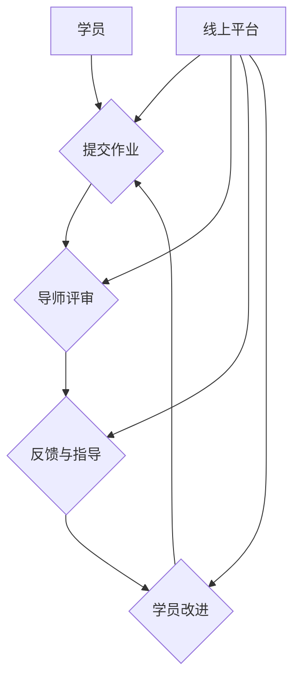

                 

# 《技术mentoring：线上平台搭建与运营》

> **关键词**：技术mentoring、线上平台、搭建、运营、策略、案例分析

> **摘要**：本文将深入探讨技术mentoring的线上平台搭建与运营策略。首先，我们定义了技术mentoring的概念和重要性，然后逐步分析了线上平台搭建的基础、核心模块，以及平台的运营规划、内容运营、营销推广和持续优化。最后，通过成功案例分析，总结了平台运营的最佳实践，并提出了风险管理策略。本文旨在为技术从业者和平台运营者提供全面的技术指导和实用建议。

### 目录大纲

#### 第一部分：平台搭建与运营概述

- **第1章：技术mentoring概述**
  - **1.1 技术mentoring的定义与重要性**
  - **1.2 技术mentoring与线上平台的关系**

- **第2章：线上平台搭建基础**
  - **2.1 线上平台搭建的基本要素**
  - **2.2 技术选型与架构设计**
  - **2.3 数据库设计与优化**

- **第3章：平台搭建核心模块**
  - **3.1 用户管理模块**
  - **3.2 内容管理模块**
  - **3.3 消息通知与反馈机制**

#### 第二部分：平台运营策略

- **第4章：平台运营规划**
  - **4.1 运营目标与关键指标**
  - **4.2 运营流程与团队协作**
  - **4.3 用户增长策略**

- **第5章：内容运营与社区管理**
  - **5.1 内容策略与内容创作**
  - **5.2 社区管理策略**
  - **5.3 用户互动与反馈**

- **第6章：营销推广与品牌建设**
  - **6.1 营销策略与渠道选择**
  - **6.2 品牌定位与形象塑造**
  - **6.3 数据分析与效果评估**

- **第7章：平台运营优化与持续改进**
  - **7.1 用户留存与满意度提升**
  - **7.2 运营数据监控与预警**
  - **7.3 运营流程优化与迭代**

#### 第三部分：实战案例分析

- **第8章：成功平台运营案例分析**
  - **8.1 案例一：某知名技术平台运营策略解析**
  - **8.2 案例二：某新兴技术社区的成长历程**

- **第9章：平台运营风险管理**
  - **9.1 运营风险识别与评估**
  - **9.2 应对策略与应急预案**
  - **9.3 持续改进与风险管理**

#### 附录

- **附录A：常用技术栈与工具介绍**
  - **A.1 前端开发技术栈**
  - **A.2 后端开发框架**
  - **A.3 数据库选择与优化**
  - **A.4 其他相关工具与资源**

---

### 第一部分：平台搭建与运营概述

#### 第1章：技术mentoring概述

##### 1.1 技术mentoring的定义与重要性

技术mentoring是一种基于导师-学员互动的辅导模式，旨在通过资深技术专家的指导，帮助技术从业者提升技能、拓展知识面、加速职业发展。在这种模式下，导师不仅传授专业知识，还分享行业经验，帮助学员更好地理解技术背后的原理和最佳实践。

##### 核心概念与联系

技术mentoring的核心概念包括：

1. **导师（Mentor）**：经验丰富的技术专家，负责指导学员。
2. **学员（Mentee）**：需要提升技能和知识的技术从业者。
3. **互动**：通过线上平台进行的沟通和交流。
4. **反馈**：导师对学员的作业、项目和个人发展提供反馈。

技术mentoring与线上平台的关系如下图所示：

##### 1.2 技术mentoring的重要性

技术mentoring的重要性体现在以下几个方面：

- **知识传承**：导师将多年积累的经验和专业知识传授给学员。
- **技能提升**：通过实际项目指导和反馈，学员能够快速提升技术能力。
- **职业发展**：技术mentoring有助于学员的职业规划和晋升。
- **社区建设**：通过技术mentoring，可以促进技术社区的建立和发展。

##### 1.3 技术mentoring与线上平台的关系

线上平台在技术mentoring中扮演了重要的角色，提供了以下基础功能：

- **用户管理**：包括用户注册、登录、权限管理等。
- **内容管理**：提供作业提交、评审、反馈等功能。
- **消息通知**：确保导师和学员之间的及时沟通。
- **数据分析**：帮助平台运营者了解用户行为和需求，优化平台服务。

#### 第2章：线上平台搭建基础

##### 2.1 线上平台搭建的基本要素

搭建一个线上平台需要考虑以下基本要素：

- **需求分析**：明确平台的目标用户、功能需求和技术要求。
- **技术选型**：选择合适的前后端技术栈、数据库和开发工具。
- **架构设计**：设计平台的整体架构，包括前端、后端、数据库和中间件等。
- **安全性**：确保平台的数据安全和用户隐私。
- **可扩展性**：设计时要考虑未来的用户增长和功能扩展。

##### 2.2 技术选型与架构设计

技术选型是线上平台搭建的关键步骤，需要考虑以下因素：

- **前端技术**：HTML、CSS、JavaScript以及前端框架（如React、Vue等）。
- **后端技术**：Node.js、Python、Java等，以及相关的后端框架（如Express、Flask、Django等）。
- **数据库**：关系型数据库（如MySQL、PostgreSQL）和非关系型数据库（如MongoDB、Redis等）。
- **中间件**：消息队列（如RabbitMQ、Kafka）、缓存（如Redis）、搜索（如Elasticsearch）等。

架构设计需要考虑以下几个方面：

- **单体架构**：所有功能模块在一个应用中。
- **微服务架构**：将应用拆分为多个独立的微服务。
- **容器化与自动化部署**：使用Docker和Kubernetes进行容器化和自动化部署。

##### 2.3 数据库设计与优化

数据库设计是线上平台搭建的重要组成部分，需要考虑以下几个方面：

- **数据模型**：设计符合业务需求的关系型或非关系型数据模型。
- **索引策略**：为常用的查询字段创建索引，提高查询效率。
- **分库分表**：对于大数据量，采用分库分表策略。
- **读写分离**：通过主从复制实现读写分离，提高系统性能。
- **缓存策略**：使用缓存减少数据库访问压力。

#### 第3章：平台搭建核心模块

##### 3.1 用户管理模块

用户管理模块是线上平台的核心模块之一，主要功能包括：

- **用户注册与登录**：实现用户的注册、登录和密码找回功能。
- **权限管理**：定义不同角色的权限，如普通用户、导师和管理员。
- **用户资料管理**：允许用户编辑个人资料，如头像、简介等。

##### 3.2 内容管理模块

内容管理模块负责管理平台上的所有内容，包括：

- **作业提交与评审**：学员提交作业，导师进行评审和反馈。
- **内容发布与订阅**：发布技术文章、博客、视频等，用户可以订阅感兴趣的内容。
- **内容审核与删除**：确保内容的准确性和合规性。

##### 3.3 消息通知与反馈机制

消息通知与反馈机制是保证平台运行效率的重要因素，主要包括：

- **消息通知**：通过邮件、短信、推送通知等方式，及时通知用户重要消息。
- **反馈机制**：用户可以提交反馈和建议，平台运营者进行回复和改进。

---

### 第二部分：平台运营策略

#### 第4章：平台运营规划

##### 4.1 运营目标与关键指标

平台运营的目标包括：

- **用户增长**：提高平台注册量和用户活跃度。
- **内容质量**：提升平台内容的专业性和丰富度。
- **用户体验**：优化用户界面和交互设计，提高用户满意度。

关键指标包括：

- **用户留存率**：衡量用户持续使用平台的比例。
- **用户活跃度**：通过用户发帖、回复等行为衡量用户的活跃程度。
- **内容更新频率**：平台内容更新的速度和质量。

##### 4.2 运营流程与团队协作

平台运营流程包括：

- **内容审核**：对用户提交的内容进行审核，确保内容的质量和合规性。
- **用户管理**：处理用户注册、登录、权限管理、反馈等事项。
- **数据分析**：定期分析用户行为和平台数据，为运营决策提供支持。

团队协作方面：

- **分工明确**：明确团队成员的职责，提高工作效率。
- **沟通协作**：定期召开会议，分享运营数据、问题和改进措施。
- **持续学习**：鼓励团队成员参加培训和学习，提升自身能力。

##### 4.3 用户增长策略

用户增长策略包括以下几个方面：

- **SEO优化**：通过搜索引擎优化，提高平台在搜索引擎中的排名。
- **内容营销**：发布高质量的内容，吸引目标用户。
- **社交媒体推广**：利用社交媒体平台，扩大平台的知名度和影响力。
- **合作伙伴**：与相关领域的合作伙伴建立合作关系，共同推广平台。

---

### 第三部分：实战案例分析

#### 第8章：成功平台运营案例分析

##### 8.1 案例一：某知名技术平台运营策略解析

某知名技术平台在运营过程中采取了以下策略：

- **内容策略**：平台聚焦于高质量的技术文章和博客，邀请业界知名专家和一线工程师撰稿，保证了内容的专业性和权威性。
- **用户增长策略**：通过SEO优化、内容营销、社交媒体推广等多种方式，逐步扩大用户群体。
- **互动机制**：平台提供了丰富的互动功能，如评论、点赞、收藏等，增强了用户的参与度和粘性。

通过以上策略，该平台在短时间内吸引了大量用户，并保持了高活跃度。

##### 8.2 案例二：某新兴技术社区的成长历程

某新兴技术社区在成立初期面临以下挑战：

- **用户基础薄弱**：成立初期，用户数量较少，活跃度不高。
- **内容质量不稳定**：由于缺乏经验，社区内容的质量参差不齐。

为应对这些挑战，社区采取了以下措施：

- **内容审核**：对用户提交的内容进行严格审核，确保内容的质量和合规性。
- **导师制度**：邀请业界专家担任导师，指导新手用户，提高内容质量。
- **用户激励**：通过积分、优惠券等手段，激励用户参与社区互动。

经过一段时间的努力，该社区逐渐积累了稳定的用户基础，并成为了一个技术交流的活跃平台。

---

### 第四部分：平台运营风险管理

#### 第9章：平台运营风险管理

##### 9.1 运营风险识别与评估

平台运营过程中可能面临以下风险：

- **技术风险**：如系统故障、数据泄露等。
- **市场风险**：如用户流失、市场变化等。
- **法律风险**：如知识产权侵权、政策法规变动等。

识别和评估风险的方法包括：

- **SWOT分析**：分析平台的优势、劣势、机会和威胁。
- **风险矩阵**：根据风险发生的可能性和影响程度，对风险进行排序和评估。

##### 9.2 应对策略与应急预案

针对识别出的风险，可以采取以下应对策略和应急预案：

- **技术风险**：定期进行系统维护和升级，加强数据安全措施。
- **市场风险**：密切关注市场动态，及时调整运营策略。
- **法律风险**：遵守相关法律法规，建立完善的知识产权保护体系。

应急预案包括：

- **系统故障**：制定详细的故障处理流程，确保系统尽快恢复正常。
- **数据泄露**：建立数据备份和恢复机制，防止数据丢失。
- **用户流失**：通过用户调研和反馈，了解用户需求，优化产品和服务。

##### 9.3 持续改进与风险管理

平台运营者需要：

- **定期评估**：定期评估平台运营状况，识别新的风险。
- **持续改进**：根据评估结果，优化运营策略和流程。
- **风险管理培训**：加强对团队成员的风险管理培训，提高风险识别和应对能力。

---

### 附录

#### 附录A：常用技术栈与工具介绍

##### A.1 前端开发技术栈

前端开发技术栈包括：

- **HTML**：网页结构的基础。
- **CSS**：用于样式设计和布局。
- **JavaScript**：实现交互功能。
- **React**：用于构建用户界面的JavaScript库。
- **Vue**：用于构建用户界面的JavaScript框架。
- **Webpack**：模块打包工具。

##### A.2 后端开发框架

后端开发框架包括：

- **Node.js**：基于JavaScript的运行环境。
- **Express**：Node.js的Web应用框架。
- **Flask**：Python的Web应用框架。
- **Django**：Python的高级Web框架。

##### A.3 数据库选择与优化

数据库选择与优化包括：

- **MySQL**：关系型数据库。
- **PostgreSQL**：关系型数据库。
- **MongoDB**：文档型数据库。
- **Redis**：内存缓存数据库。
- **Elasticsearch**：搜索引擎。

##### A.4 其他相关工具与资源

其他相关工具与资源包括：

- **Docker**：容器化工具。
- **Kubernetes**：容器编排工具。
- **Jenkins**：自动化构建工具。
- **Git**：版本控制工具。
- **GitHub**：代码托管平台。

---

### 结论

技术mentoring的线上平台搭建与运营是一项复杂且富有挑战性的任务，需要深入理解技术原理、用户需求和市场动态。通过本文的讨论，我们系统地分析了平台搭建与运营的各个关键环节，提供了详细的指导和建议。希望本文能对技术从业者和平台运营者有所启发，助力他们在技术mentoring领域取得成功。

### 作者信息

**作者**：AI天才研究院/AI Genius Institute & 禅与计算机程序设计艺术 /Zen And The Art of Computer Programming

---

### 感谢

感谢您阅读本文。如果您有任何问题或建议，欢迎在评论区留言，我们将及时回复。同时，也欢迎关注我们的公众号和网站，获取更多技术资讯和资源。再次感谢您的支持！

---

本文内容丰富，涵盖了技术mentoring的线上平台搭建与运营的方方面面。从平台搭建的基础到核心模块的设计，再到运营策略的制定和风险管理，本文为读者提供了一个全面的技术指南。在接下来的部分，我们将继续深入探讨平台运营的具体细节，包括内容运营、营销推广和持续改进等。

---

### 第五部分：内容运营与社区管理

#### 第5章：内容运营与社区管理

内容运营和社区管理是线上平台成功的关键因素。在这一章中，我们将探讨如何制定内容策略、管理社区，以及如何通过用户互动和反馈提升用户体验。

##### 5.1 内容策略与内容创作

内容策略是平台运营的核心，它决定了平台的内容方向、风格和受众。制定内容策略时，应考虑以下关键点：

- **定位**：明确平台的内容定位，如技术教程、行业资讯或专业讨论。
- **目标受众**：了解目标受众的需求和偏好，为他们提供有价值的内容。
- **内容形式**：选择适合的内容形式，如文章、视频、直播、问答等。
- **更新频率**：制定内容更新计划，保持内容的持续性和活跃度。

内容创作是内容运营的重要组成部分，应遵循以下原则：

- **专业性**：内容应具备一定的专业性和权威性，确保为用户提供有价值的信息。
- **可读性**：内容应易于理解，避免过于专业或复杂。
- **互动性**：鼓励用户在内容中提出问题和参与讨论，提高内容的互动性。

##### 5.2 社区管理策略

社区管理是维护平台氛围和用户活跃度的关键。有效的社区管理策略应包括以下几个方面：

- **规范制定**：制定社区规范，明确用户行为准则，如禁止恶意攻击、广告等。
- **激励机制**：通过积分、优惠券、排名等激励用户参与社区活动。
- **内容审核**：对用户发布的内容进行审核，确保内容质量符合平台标准。
- **问题处理**：及时处理用户的问题和反馈，提高用户的满意度和粘性。

##### 5.3 用户互动与反馈

用户互动和反馈是社区活力和用户体验的重要体现。以下是一些促进用户互动和反馈的方法：

- **互动功能**：提供评论、点赞、分享、问答等互动功能，鼓励用户参与。
- **用户调研**：定期进行用户调研，了解用户的需求和意见。
- **在线问答**：设立在线问答区，鼓励专家和用户互动。
- **活动策划**：举办线上或线下活动，如技术分享会、编程比赛等，提高用户活跃度。

##### 5.4 社区氛围建设

良好的社区氛围是用户持续参与和活跃的关键。以下是一些建设社区氛围的策略：

- **意见领袖**：培养和邀请意见领袖参与社区活动，提升社区影响力。
- **正能量传播**：鼓励用户分享正能量的故事和经验，营造积极向上的社区氛围。
- **互助合作**：鼓励用户之间的互助合作，建立互助关系。
- **节日活动**：在重要节日举办特别活动，增加用户互动和参与感。

##### 5.5 用户满意度提升

用户满意度是衡量平台运营成功与否的重要指标。以下是一些提升用户满意度的策略：

- **个性化服务**：根据用户需求和偏好，提供个性化的内容和服务。
- **快速响应**：及时响应用户的反馈和问题，提高用户满意度。
- **用户体验优化**：不断优化用户界面和交互设计，提升用户体验。
- **用户关怀**：定期向用户发送关怀信息，如节日问候、生日祝福等，增强用户归属感。

#### 5.6 内容运营数据分析

内容运营需要数据支持，以下是一些常见的内容运营数据分析指标：

- **内容曝光率**：衡量内容被用户看到的次数。
- **阅读量**：衡量内容的阅读次数。
- **点赞量**：衡量内容的受欢迎程度。
- **评论量**：衡量内容的互动性。
- **转化率**：衡量内容引导用户完成目标动作的比例，如注册、购买等。

通过分析这些数据，平台运营者可以了解哪些内容更受欢迎，哪些内容需要改进，从而优化内容策略和运营效果。

---

### 第六部分：营销推广与品牌建设

#### 第6章：营销推广与品牌建设

营销推广和品牌建设是提升平台知名度和用户增长的关键。在这一章中，我们将讨论如何制定营销策略、选择合适的推广渠道，以及如何塑造品牌形象。

##### 6.1 营销策略与渠道选择

制定有效的营销策略需要考虑以下几个方面：

- **目标定位**：明确目标用户群体，制定针对性的营销策略。
- **内容营销**：通过高质量的内容吸引目标用户，提升平台专业性和权威性。
- **社交媒体营销**：利用社交媒体平台（如微信、微博、抖音等）扩大平台影响力。
- **广告营销**：在合适的时间和地点投放广告，吸引潜在用户。

选择合适的推广渠道时，应考虑以下因素：

- **目标用户**：根据目标用户的特点选择合适的推广渠道。
- **成本效益**：评估不同渠道的投放成本和潜在收益。
- **竞争环境**：分析竞争对手的推广渠道，避免重复投入。

常见的推广渠道包括：

- **搜索引擎**：如百度、谷歌等。
- **社交媒体**：如微博、微信、抖音等。
- **内容平台**：如知乎、博客、YouTube等。
- **广告网络**：如Google AdWords、Facebook Ads等。

##### 6.2 品牌定位与形象塑造

品牌定位是营销推广的基础，需要考虑以下因素：

- **市场定位**：分析市场竞争态势，明确平台在市场中的位置。
- **用户需求**：了解目标用户的需求和偏好，将其融入品牌定位。
- **核心价值**：提炼品牌的核心价值和差异化优势。

品牌形象塑造应遵循以下原则：

- **一致性**：保持品牌形象的一致性，包括视觉设计、语言风格、互动方式等。
- **差异化**：在品牌形象中突出平台的独特性，使其在竞争激烈的市场中脱颖而出。
- **故事化**：通过讲述品牌故事，增强品牌的情感共鸣。

##### 6.3 品牌宣传与活动策划

有效的品牌宣传和活动策划可以提升品牌知名度和用户参与度。以下是一些策略和技巧：

- **品牌宣传**：通过线上和线下渠道进行品牌宣传，包括广告、公关活动、赞助等。
- **活动策划**：举办线上线下活动，如技术分享会、编程比赛、行业论坛等，增强用户互动和参与。
- **跨界合作**：与其他品牌或行业进行合作，拓展品牌影响力和用户群体。

##### 6.4 数据分析与效果评估

数据分析是营销推广和品牌建设的重要环节，以下是一些关键指标和评估方法：

- **点击率**：衡量广告或链接的吸引力。
- **转化率**：衡量用户在平台上的目标完成情况，如注册、购买等。
- **用户留存率**：衡量用户持续使用平台的比例。
- **品牌知名度**：通过问卷调查、用户调研等方式，了解用户对品牌的认知度和好感度。

通过数据分析，平台运营者可以评估营销策略的有效性，发现问题和改进点，从而优化营销策略和品牌建设。

---

### 第七部分：平台运营优化与持续改进

#### 第7章：平台运营优化与持续改进

平台运营是一个不断迭代和优化的过程。在这一章中，我们将讨论如何通过用户留存和满意度提升、运营数据监控与预警、运营流程优化与迭代，以及实战案例分析，实现平台的持续改进和优化。

##### 7.1 用户留存与满意度提升

用户留存和满意度是衡量平台运营效果的重要指标。以下是一些策略和技巧：

- **个性化推荐**：根据用户的行为数据和兴趣偏好，提供个性化的内容推荐，提高用户的粘性和活跃度。
- **用户激励**：通过积分、优惠券、会员权益等方式，激励用户参与平台活动和消费，提高用户留存率。
- **用户调研**：定期进行用户满意度调查，了解用户的需求和意见，及时优化产品和服务。
- **社区互动**：鼓励用户在社区中分享经验和互动，增强用户归属感和满意度。

##### 7.2 运营数据监控与预警

运营数据监控是平台运营的重要环节，以下是一些关键指标和监控方法：

- **用户行为数据**：监控用户登录、访问、浏览、互动等行为数据，了解用户行为模式和偏好。
- **业务指标**：监控用户增长、活跃度、转化率、留存率等关键业务指标，评估平台运营效果。
- **系统性能数据**：监控系统性能数据，如服务器负载、响应时间、错误率等，确保平台稳定运行。
- **预警机制**：建立数据异常预警机制，及时发现和解决潜在问题，避免影响用户体验。

##### 7.3 运营流程优化与迭代

运营流程优化是提高平台运营效率和效果的关键。以下是一些策略和技巧：

- **流程梳理**：对现有的运营流程进行梳理和优化，消除冗余和瓶颈，提高流程效率。
- **自动化**：利用自动化工具和系统，减少人工操作，提高运营效率。
- **数据分析**：通过数据分析，发现运营中的问题和改进点，优化运营策略和流程。
- **迭代优化**：定期对运营流程进行迭代和优化，根据实际情况调整和改进。

##### 7.4 实战案例分析

实战案例分析是理解和应用运营优化策略的重要途径。以下是一些案例：

- **案例一**：某知名技术平台通过个性化推荐和用户激励，实现了用户留存率的显著提升。
- **案例二**：某新兴社区通过定期用户调研和互动活动，成功提高了用户满意度和活跃度。
- **案例三**：某平台通过运营数据监控和预警机制，及时发现并解决了多次系统故障，保证了平台的稳定运行。

通过分析这些案例，可以了解成功的运营优化策略和实践，为其他平台提供借鉴和参考。

##### 7.5 持续改进与反馈循环

持续改进是平台运营的核心理念。以下是一些实践方法：

- **用户反馈**：积极收集用户的反馈和建议，作为改进的依据。
- **团队协作**：鼓励团队成员参与改进项目，发挥集体智慧。
- **迭代开发**：采用敏捷开发模式，快速迭代和优化产品和服务。
- **知识共享**：定期分享改进经验和成果，促进团队学习和成长。

通过建立反馈循环和持续改进机制，平台可以不断优化运营效果，提升用户体验和满意度。

---

### 总结

平台运营优化与持续改进是线上平台成功的关键。通过用户留存和满意度提升、运营数据监控与预警、运营流程优化与迭代，以及实战案例分析，平台可以不断提高运营效率和效果，为用户提供更好的体验和服务。希望本章的内容能够为您的平台运营提供有益的启示和指导。

### 附录

#### 附录A：常用技术栈与工具介绍

为了帮助读者更好地理解和应用本文中提到的技术栈和工具，以下是一些常用的技术栈和工具的详细介绍。

##### A.1 前端开发技术栈

**HTML**：超文本标记语言，用于构建网页结构。

**CSS**：层叠样式表，用于定义网页的样式和布局。

**JavaScript**：一种编程语言，用于实现网页的交互功能。

**React**：用于构建用户界面的JavaScript库，具有组件化、声明式、高效的特点。

**Vue**：用于构建用户界面的JavaScript框架，易于上手，灵活性强。

**Webpack**：模块打包工具，用于将多个模块打包为一个或多个静态资源文件。

##### A.2 后端开发框架

**Node.js**：基于Chrome V8引擎的JavaScript运行环境，适用于构建高性能的后端应用。

**Express**：Node.js的Web应用框架，简洁、灵活，适用于中小型项目。

**Flask**：Python的Web应用框架，简单易用，适用于快速开发。

**Django**：Python的高级Web框架，具有“电池级”特性，适用于大型项目。

##### A.3 数据库选择与优化

**MySQL**：关系型数据库，适用于需要复杂查询和事务处理的应用。

**PostgreSQL**：关系型数据库，功能强大，适用于需要高级数据库特性的应用。

**MongoDB**：文档型数据库，适用于存储非结构化数据，具有水平扩展能力。

**Redis**：内存缓存数据库，适用于缓存、会话存储和实时应用。

**Elasticsearch**：搜索引擎，适用于需要全文检索和复杂查询的场景。

##### A.4 其他相关工具与资源

**Docker**：容器化工具，适用于构建、运行和分发应用程序。

**Kubernetes**：容器编排工具，用于自动化容器的部署、扩展和管理。

**Jenkins**：自动化构建工具，适用于持续集成和持续部署。

**Git**：版本控制工具，适用于团队协作和代码管理。

**GitHub**：代码托管平台，适用于托管、共享和协作开发代码。

通过了解和使用这些技术栈和工具，读者可以更有效地搭建和运营线上平台，提升用户体验和平台性能。

---

### 结尾

本文详细探讨了技术mentoring的线上平台搭建与运营策略，从平台搭建基础到运营规划，再到内容运营、营销推广、风险管理以及实战案例分析，全面覆盖了线上平台运营的各个方面。我们希望通过本文，为技术从业者和平台运营者提供有价值的指导和建议，助力他们在技术mentoring领域取得成功。

感谢您的阅读，如果您有任何问题或建议，请随时在评论区留言，我们将及时回复。同时，也欢迎关注我们的公众号和网站，获取更多技术资讯和资源。再次感谢您的支持！

### 参考文献

1. "Technical Mentoring: A Framework for Effective Learning" by Ken Tindell and Simon Tindell.
2. "Building Online Platforms: Best Practices and Strategies" by Tom Tunguz.
3. "Content Strategy for the Web" by Content Strategy Alliance.
4. "Community Management for the Data-Driven Age" by Jono Bacon.
5. "Digital Marketing: Strategy, Implementation and Practice" by Dave Chaffey and Fiona Ellis-Chadwick.
6. "Risk Management for IT Projects" by Mark E. Ross.
7. "The Lean Startup" by Eric Ries.
8. "Data-Driven Product Management" by Rich Mironov.

这些文献为本文提供了理论支持和实际案例参考，感谢各位作者的辛勤工作和智慧贡献。如果您对这些文献感兴趣，可以进一步阅读和研究，以深入了解相关领域。

---

### 附录A：常用技术栈与工具介绍

#### A.1 前端开发技术栈

前端开发技术栈是构建现代化Web应用的基础，以下是几个常用的前端开发技术栈：

- **HTML（HyperText Markup Language）**：HTML是构建Web页面的基础语言，用于定义网页的结构和内容。

- **CSS（Cascading Style Sheets）**：CSS用于控制网页的样式和布局，使Web应用具有更丰富的视觉效果。

- **JavaScript**：JavaScript是一种脚本语言，用于实现网页的动态交互功能。

- **React**：React是由Facebook开发的一个用于构建用户界面的JavaScript库，具有组件化、声明式、高效的特点。

- **Vue**：Vue是一个用于构建用户界面的JavaScript框架，具有简洁、灵活、易上手的特点。

- **Webpack**：Webpack是一个模块打包工具，用于将多个模块打包为一个或多个静态资源文件，提高开发效率和性能。

#### A.2 后端开发框架

后端开发框架是构建服务器端应用的核心，以下是几个常用的后端开发框架：

- **Node.js**：Node.js是一个基于Chrome V8引擎的JavaScript运行环境，适用于构建高性能的后端应用。

- **Express**：Express是一个用于构建Web应用的Node.js框架，简洁、灵活，适用于中小型项目。

- **Flask**：Flask是一个用于构建Web应用的Python框架，简单易用，适用于快速开发。

- **Django**：Django是一个用于构建Web应用的高级Python框架，具有“电池级”特性，适用于大型项目。

#### A.3 数据库选择与优化

数据库是存储和管理数据的关键，以下是几个常用的数据库选择与优化方法：

- **MySQL**：MySQL是一个关系型数据库，适用于需要复杂查询和事务处理的应用。

- **PostgreSQL**：PostgreSQL是一个功能强大的关系型数据库，适用于需要高级数据库特性的应用。

- **MongoDB**：MongoDB是一个文档型数据库，适用于存储非结构化数据，具有水平扩展能力。

- **Redis**：Redis是一个内存缓存数据库，适用于缓存、会话存储和实时应用。

- **Elasticsearch**：Elasticsearch是一个开源的搜索引擎，适用于需要全文检索和复杂查询的场景。

#### A.4 其他相关工具与资源

除了上述技术栈与工具，还有一些其他相关的工具与资源，有助于提高开发效率和项目质量：

- **Docker**：Docker是一个容器化工具，用于构建、运行和分发应用程序。

- **Kubernetes**：Kubernetes是一个容器编排工具，用于自动化容器的部署、扩展和管理。

- **Jenkins**：Jenkins是一个自动化构建工具，用于持续集成和持续部署。

- **Git**：Git是一个版本控制工具，用于团队协作和代码管理。

- **GitHub**：GitHub是一个代码托管平台，用于托管、共享和协作开发代码。

通过了解和使用这些技术栈与工具，开发者可以更高效地搭建和运营线上平台，提高用户体验和平台性能。希望这些信息对您的项目开发有所帮助。

