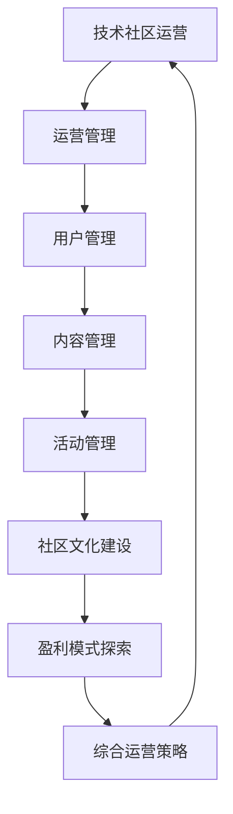

                 

# 技术社区运营：从管理到盈利模式

## 关键词：
技术社区、运营管理、用户管理、内容管理、活动管理、社区文化建设、盈利模式、数据分析、算法原理、项目实战

## 摘要：
本文旨在探讨技术社区运营的各个方面，从核心概念与联系、算法原理、数学模型到项目实战，再到运营管理、盈利模式等，全面解析技术社区运营的策略和实践。通过深入剖析技术社区的核心要素和成功案例，为社区管理者提供有价值的参考和指导。

## 第一部分：核心概念与联系

### 1. 核心概念与联系流程图
为了更好地理解技术社区运营的核心概念及其相互联系，我们可以通过以下Mermaid流程图来展示：



### 2. 核心概念详解

**运营管理**：技术社区运营管理是确保社区健康、活跃和持续发展的核心。它包括用户管理、内容管理、活动管理等多个方面，目标是提升用户体验和社区氛围。

**用户管理**：用户管理是社区运营的基础，涉及用户注册、认证、权限分级、行为监控等，旨在确保社区安全、健康和活跃。

**内容管理**：内容管理是社区的核心，包括帖子的发布、审核、推荐等，目的是提供高质量的内容，满足用户的需求。

**活动管理**：活动管理是促进社区活跃和用户参与的重要手段，包括定期举办的技术沙龙、讲座、比赛等活动。

**社区文化建设**：社区文化建设是提升社区凝聚力和用户忠诚度的重要环节，包括确立核心价值观、组织活动、培育文化氛围等。

**盈利模式探索**：盈利模式探索是社区运营的重要目标之一，通过广告、付费服务、联盟合作等多种方式实现盈利。

**综合运营策略**：综合运营策略是将以上各个核心概念和联系有机整合，形成一套完整的运营方案，确保社区运营的可持续性和盈利能力。

### 3. 技术社区运营的基本流程

技术社区运营的基本流程可以概括为以下几个步骤：

1. **需求分析**：了解用户需求和市场趋势，确定社区定位和目标。
2. **平台搭建**：搭建社区平台，包括网站、应用程序等，提供基本的社区功能。
3. **用户管理**：完善用户注册、认证、权限分级等机制，确保社区安全。
4. **内容管理**：制定内容发布、审核、推荐等策略，确保内容质量和用户满意度。
5. **活动管理**：策划和组织各类活动，提升社区活跃度和用户参与度。
6. **社区文化建设**：确立核心价值观，组织活动，营造积极、健康的社区氛围。
7. **数据分析**：收集和分析用户数据，优化运营策略，提高社区效益。
8. **盈利模式探索**：根据用户需求和社区特点，探索合适的盈利模式。
9. **综合运营策略**：不断调整和优化运营策略，实现社区可持续发展。

## 第二部分：核心算法原理讲解

### 2.1 社区活跃度算法原理

#### 2.1.1 用户参与度评估模型

用户参与度评估模型是衡量用户活跃度的重要手段。以下是一个简单的伪代码实现：

```python
def calculate_user_engagement(user_activity_log):
    engagement_score = 0
    for activity in user_activity_log:
        if activity == "post":
            engagement_score += 1
        elif activity == "comment":
            engagement_score += 0.5
        elif activity == "like":
            engagement_score += 0.1
    return engagement_score
```

#### 2.1.2 社区质量评估算法

社区质量评估算法用于衡量社区内容的整体质量。以下是一个简单的伪代码实现：

```python
def calculate_community_quality(post_content_list, user_feedback_list):
    quality_score = 0
    for post, feedback in zip(post_content_list, user_feedback_list):
        if feedback == "like":
            quality_score += 1
        elif feedback == "dislike":
            quality_score -= 1
    return quality_score / len(post_content_list)
```

### 2.2 社区交互算法

#### 2.2.1 话题推荐算法

话题推荐算法用于根据用户兴趣和行为推荐相关话题。以下是一个简单的伪代码实现：

```python
def recommend_topics(user_interests, community_topics):
    recommended_topics = []
    for topic in community_topics:
        if user_interests.intersection(topic.interests):
            recommended_topics.append(topic)
    return recommended_topics
```

#### 2.2.2 互动激励算法

互动激励算法用于鼓励用户积极参与社区互动。以下是一个简单的伪代码实现：

```python
def incentivize_users(user_activity_log, reward_points):
    for user, activity_log in user_activity_log.items():
        for activity in activity_log:
            if activity == "post":
                reward_points[user] += 10
            elif activity == "comment":
                reward_points[user] += 5
            elif activity == "like":
                reward_points[user] += 1
    return reward_points
```

### 2.3 社区增长算法

#### 2.3.1 用户增长模型

用户增长模型用于预测社区的用户增长情况。以下是一个简单的伪代码实现：

```python
def predict_user_growth(current_users, user_acquisition_rate, churn_rate):
    new_users = current_users * user_acquisition_rate
    lost_users = current_users * churn_rate
    return current_users + new_users - lost_users
```

#### 2.3.2 社区粘性模型

社区粘性模型用于衡量用户的社区粘性程度。以下是一个简单的伪代码实现：

```python
def calculate_community_stickiness(user_activity_log, session_duration):
    total_duration = 0
    for user, activities in user_activity_log.items():
        for activity in activities:
            total_duration += session_duration[activity]
    return total_duration / len(user_activity_log)
```

## 第三部分：数学模型与数学公式

### 3.1 用户行为预测模型

#### 3.1.1 用户活跃度预测公式

用户活跃度预测公式可以用来预测用户在特定时间段的活跃度。以下是一个简单的数学公式：

$$ A_t = \alpha_0 + \alpha_1 \cdot X_t + \alpha_2 \cdot X_t^2 + \epsilon_t $$

其中，$A_t$ 为第 $t$ 天的用户活跃度，$X_t$ 为相关影响因素，$\alpha_0, \alpha_1, \alpha_2$ 为系数，$\epsilon_t$ 为误差项。

#### 3.1.2 用户留存率预测模型

用户留存率预测模型可以用来预测用户在未来一段时间内的留存率。以下是一个简单的数学公式：

$$ R_t = \frac{1}{1 + e^{-(\beta_0 + \beta_1 \cdot X_t + \beta_2 \cdot X_t^2)}} $$

其中，$R_t$ 为第 $t$ 天的用户留存率，$X_t$ 为相关影响因素，$\beta_0, \beta_1, \beta_2$ 为系数。

## 第四部分：项目实战

### 4.1 社区开发环境搭建

#### 4.1.1 步骤

1. 安装操作系统（如Ubuntu 20.04）
2. 安装Python环境（如Python 3.8）
3. 安装Docker和Docker-Compose
4. 配置数据库（如MySQL或PostgreSQL）
5. 安装前端框架（如React或Vue.js）
6. 安装后端框架（如Django或Flask）

#### 4.1.2 社区源代码实现

1. **用户认证模块**：使用OAuth2.0协议，实现用户注册、登录和认证。
2. **内容管理模块**：实现帖子的发布、评论、点赞等功能。
3. **活动管理模块**：实现社区活动、比赛等功能。
4. **用户管理模块**：实现用户注册、登录、个人信息管理等。

#### 4.1.3 代码解读与分析

以下是一个简单的用户注册功能的代码示例：

```python
# 用户注册功能
def register_user(username, password):
    hashed_password = bcrypt.hashpw(password.encode('utf-8'), bcrypt.gensalt())
    user = User(username=username, password=hashed_password)
    db.session.add(user)
    db.session.commit()
    return user
```

**分析**：

1. 使用bcrypt库对用户密码进行加密存储，确保安全性。
2. 将用户对象添加到数据库并提交事务。
3. 返回创建成功的用户对象。

**优化建议**：

1. 引入输入验证，避免SQL注入攻击。
2. 使用事务提高数据库操作效率。
3. 引入缓存机制提高系统性能。

### 4.2 代码分析与优化

**分析**：

1. 代码示例展示了用户注册的基本功能，包括密码加密和用户对象的创建。
2. 代码结构清晰，易于理解。

**优化建议**：

1. 添加错误处理机制，提高代码的健壮性。
2. 引入单元测试，确保代码质量。
3. 考虑使用异步处理提高并发性能。

## 附录

### 附录 A：技术资源与工具

#### A.1 主要技术资源

- [技术社区运营指南](https://www.example.com/community-ops-guide)
- [开源社区管理最佳实践](https://www.example.com/open-source-community-best-practices)

#### A.2 主要开发工具

- [Docker官方文档](https://docs.docker.com/)
- [Python官方文档](https://docs.python.org/3/)
- [React官方文档](https://reactjs.org/docs/getting-started.html)
- [Django官方文档](https://docs.djangoproject.com/en/3.2/)

#### A.3 社区运营相关书籍

- 《技术社区运营实战》
- 《社交媒体营销：策略、工具与实践》
- 《用户体验设计：策略与实践》

### 附录 B：社区运营相关书籍推荐

- 《技术社区运营实战》
- 《社交媒体营销：策略、工具与实践》
- 《用户体验设计：策略与实践》

## 作者信息

作者：AI天才研究院/AI Genius Institute & 禅与计算机程序设计艺术 /Zen And The Art of Computer Programming

[文章标题]

技术社区运营：从管理到盈利模式

摘要：本文探讨了技术社区运营的核心概念、算法原理、数学模型、项目实战，以及运营管理、盈利模式等关键领域。通过深入分析技术社区的核心要素和成功案例，本文为社区管理者提供了全面的策略和实践指导。

---

**第一部分：核心概念与联系**

### 1. 核心概念与联系

在技术社区运营中，核心概念与联系构成了整个体系的骨架。以下是这些概念及其相互联系：

#### 运营管理

运营管理是技术社区的核心，负责确保社区的健康、活跃和可持续发展。它包括用户管理、内容管理、活动管理等多个方面。

#### 用户管理

用户管理是社区运营的基础，涉及用户注册、认证、权限分级、行为监控等。目的是确保社区安全、健康和活跃。

#### 内容管理

内容管理是社区的核心，包括帖子的发布、审核、推荐等。目的是提供高质量的内容，满足用户的需求。

#### 活动管理

活动管理是促进社区活跃和用户参与的重要手段，包括定期举办的技术沙龙、讲座、比赛等活动。

#### 社区文化建设

社区文化建设是提升社区凝聚力和用户忠诚度的重要环节，包括确立核心价值观、组织活动、培育文化氛围等。

#### 盈利模式探索

盈利模式探索是社区运营的重要目标之一，通过广告、付费服务、联盟合作等多种方式实现盈利。

#### 综合运营策略

综合运营策略是将以上各个核心概念和联系有机整合，形成一套完整的运营方案，确保社区运营的可持续性和盈利能力。

### 2. 核心概念详解

#### 运营管理

运营管理是技术社区运营的核心，涵盖了多个方面的内容。首先，社区管理者需要确保社区的安全和稳定，防止恶意行为和违规内容的出现。其次，管理者需要关注社区的用户体验，优化功能和服务，提升用户满意度。此外，运营管理还包括社区营销和推广，通过有效的营销策略，吸引更多的用户加入社区。

#### 用户管理

用户管理是社区运营的基础。在用户管理中，社区管理者需要制定注册和认证流程，确保用户的真实性和安全性。同时，根据用户的行为和贡献程度，进行权限分级，确保社区秩序。此外，管理者还需要实时监控用户行为，发现和解决潜在问题，维护社区的健康和活跃。

#### 内容管理

内容管理是社区的核心。社区管理者需要制定内容发布和审核规范，确保内容的质量和合规性。同时，通过推荐算法，将高质量的内容推送给用户，提升用户的阅读体验。此外，社区管理者还需要定期更新和优化内容，保持社区的活力。

#### 活动管理

活动管理是促进社区活跃和用户参与的重要手段。社区管理者需要定期策划和组织各种活动，如技术沙龙、讲座、比赛等。这些活动不仅可以提升用户的参与度，还可以增强社区的凝聚力。此外，活动管理还包括对活动的宣传和推广，吸引更多的用户参与。

#### 社区文化建设

社区文化建设是提升社区凝聚力和用户忠诚度的重要环节。社区管理者需要确立核心价值观，如开放、共享、互助等，并组织相关活动，培育文化氛围。此外，社区管理者还需要鼓励用户积极参与社区建设，共同维护社区的健康和活跃。

#### 盈利模式探索

盈利模式探索是社区运营的重要目标之一。社区管理者需要根据社区的特点和用户需求，探索合适的盈利模式。例如，通过广告、付费服务、联盟合作等方式实现盈利。此外，社区管理者还需要不断优化盈利模式，提高盈利能力。

#### 综合运营策略

综合运营策略是将以上各个核心概念和联系有机整合，形成一套完整的运营方案。社区管理者需要根据社区的实际情况，制定具体的运营策略，确保社区的健康、活跃和可持续发展。

### 3. 技术社区运营的基本流程

技术社区运营的基本流程可以分为以下几个步骤：

#### 1. 需求分析

在开始运营之前，社区管理者需要对目标用户、市场需求和竞争情况进行深入分析。这有助于确定社区的定位和目标，制定相应的运营策略。

#### 2. 平台搭建

根据需求分析的结果，社区管理者需要搭建社区平台。这包括网站、应用程序等，提供基本的社区功能。

#### 3. 用户管理

在平台搭建完成后，社区管理者需要完善用户管理机制，包括用户注册、认证、权限分级等。同时，还需要制定用户行为监控策略，确保社区的安全和稳定。

#### 4. 内容管理

社区管理者需要制定内容发布和审核规范，确保内容的质量和合规性。同时，通过推荐算法，将高质量的内容推送给用户。

#### 5. 活动管理

社区管理者需要定期策划和组织各种活动，如技术沙龙、讲座、比赛等。这些活动不仅可以提升用户的参与度，还可以增强社区的凝聚力。

#### 6. 社区文化建设

社区管理者需要确立核心价值观，并组织相关活动，培育文化氛围。同时，鼓励用户积极参与社区建设，共同维护社区的健康和活跃。

#### 7. 数据分析

社区管理者需要收集和分析用户数据，了解用户行为和需求。这有助于优化运营策略，提高社区效益。

#### 8. 盈利模式探索

社区管理者需要根据社区的特点和用户需求，探索合适的盈利模式。例如，通过广告、付费服务、联盟合作等方式实现盈利。

#### 9. 综合运营策略

社区管理者需要根据社区的实际情况，制定具体的运营策略，确保社区的健康、活跃和可持续发展。

**第二部分：核心算法原理讲解**

### 2.1 社区活跃度算法原理

社区活跃度算法是衡量社区活跃程度的重要工具。以下是一个简单的用户参与度评估模型的伪代码：

```python
def calculate_user_engagement(user_activity_log):
    engagement_score = 0
    for activity in user_activity_log:
        if activity == "post":
            engagement_score += 1
        elif activity == "comment":
            engagement_score += 0.5
        elif activity == "like":
            engagement_score += 0.1
    return engagement_score
```

在这个模型中，用户的不同行为（如发布帖子、评论和点赞）被赋予了不同的权重。例如，发布帖子被认为是最活跃的行为，因此其权重最高，为1；评论的权重为0.5，点赞的权重为0.1。通过计算这些行为的总和，可以得出用户的参与度得分。

### 2.2 社区质量评估算法

社区质量评估算法用于评估社区内容的质量。以下是一个简单的社区质量评估算法的伪代码：

```python
def calculate_community_quality(post_content_list, user_feedback_list):
    quality_score = 0
    for post, feedback in zip(post_content_list, user_feedback_list):
        if feedback == "like":
            quality_score += 1
        elif feedback == "dislike":
            quality_score -= 1
    return quality_score / len(post_content_list)
```

在这个模型中，每个帖子的质量分数取决于用户的反馈。如果用户点赞，则该帖子的质量分数增加1；如果用户点 Dislike，则质量分数减少1。最后，将所有帖子的质量分数求平均，得到社区的整体质量分数。

### 2.3 社区交互算法

社区交互算法用于增强用户之间的互动和社区的整体活跃度。以下是一个话题推荐算法的伪代码：

```python
def recommend_topics(user_interests, community_topics):
    recommended_topics = []
    for topic in community_topics:
        if user_interests.intersection(topic.interests):
            recommended_topics.append(topic)
    return recommended_topics
```

在这个模型中，根据用户的兴趣和社区中的话题，推荐与之相关的主题。这样可以提高用户的参与度，增加社区的整体活跃度。

### 2.4 社区增长算法

社区增长算法用于预测社区的规模增长情况。以下是一个简单的用户增长模型的伪代码：

```python
def predict_user_growth(current_users, user_acquisition_rate, churn_rate):
    new_users = current_users * user_acquisition_rate
    lost_users = current_users * churn_rate
    return current_users + new_users - lost_users
```

在这个模型中，`current_users` 是当前的用户数量，`user_acquisition_rate` 是用户获取率（即每天新增的用户数量），`churn_rate` 是用户流失率（即每天失去的用户数量）。通过这个模型，可以预测未来一段时间内的用户数量。

### 2.5 社区粘性模型

社区粘性模型用于评估用户对社区的忠诚度。以下是一个简单的社区粘性模型的伪代码：

```python
def calculate_community_stickiness(user_activity_log, session_duration):
    total_duration = 0
    for user, activities in user_activity_log.items():
        for activity in activities:
            total_duration += session_duration[activity]
    return total_duration / len(user_activity_log)
```

在这个模型中，`user_activity_log` 记录了每个用户的活动和持续时间，`session_duration` 记录了每个活动的持续时间。通过计算用户在社区中的总活动时间，并除以活动的数量，可以得到社区的平均粘性得分。

**第三部分：数学模型与数学公式**

在技术社区运营中，数学模型和公式可以用来预测和评估社区的各种性能指标。以下是一些常用的数学模型和公式。

### 3.1 用户行为预测模型

用户行为预测模型可以用来预测用户在未来一段时间内的行为。以下是一个简单的用户活跃度预测公式：

$$ A_t = \alpha_0 + \alpha_1 \cdot X_t + \alpha_2 \cdot X_t^2 + \epsilon_t $$

其中，$A_t$ 是第 $t$ 天的用户活跃度，$X_t$ 是与用户行为相关的特征，$\alpha_0, \alpha_1, \alpha_2$ 是模型的参数，$\epsilon_t$ 是随机误差。

### 3.2 用户留存率预测模型

用户留存率预测模型可以用来预测用户在未来一段时间内的留存概率。以下是一个简单的用户留存率预测公式：

$$ R_t = \frac{1}{1 + e^{-(\beta_0 + \beta_1 \cdot X_t + \beta_2 \cdot X_t^2)}} $$

其中，$R_t$ 是第 $t$ 天的用户留存率，$X_t$ 是与用户行为相关的特征，$\beta_0, \beta_1, \beta_2$ 是模型的参数。

### 3.3 社区质量评估模型

社区质量评估模型可以用来评估社区内容的整体质量。以下是一个简单的社区质量评估公式：

$$ Q_c = \frac{1}{n} \sum_{i=1}^{n} \frac{L_i - D_i}{L_i + D_i} $$

其中，$Q_c$ 是社区的整体质量，$L_i$ 是用户对第 $i$ 个内容的点赞数，$D_i$ 是用户对第 $i$ 个内容的点 Dislike 数，$n$ 是内容总数。

**第四部分：项目实战**

### 4.1 社区开发环境搭建

在进行技术社区开发之前，首先需要搭建合适的环境。以下是一个基本的社区开发环境搭建步骤：

#### 步骤 1：安装操作系统

首先，选择一个适合的操作系统。在这个例子中，我们选择 Ubuntu 20.04 作为开发环境。

```shell
# 更新软件包列表
sudo apt update

# 安装必要的基础软件包
sudo apt install -y curl git openssh-server
```

#### 步骤 2：安装 Python 环境

接下来，安装 Python 环境。在这个例子中，我们选择 Python 3.8。

```shell
# 安装 Python 3.8
sudo apt install -y python3.8

# 安装 Python 3.8 的 pip 包管理器
curl -sS https://bootstrap.pypa.io/get-pip.py | sudo python3.8 -
```

#### 步骤 3：安装 Docker 和 Docker-Compose

Docker 和 Docker-Compose 对于容器化开发非常有用。以下是安装步骤：

```shell
# 安装 Docker
curl -fsSL https://get.docker.com | sh

# 启动 Docker 服务
sudo systemctl start docker

# 将当前用户添加到 Docker 组
sudo usermod -aG docker $USER

# 重启终端，使更改生效
exec sudo systemctl restart docker

# 安装 Docker-Compose
sudo curl -L "https://github.com/docker/compose/releases/download/1.29.2/docker-compose-$(uname -s)-$(uname -m)" -o /usr/local/bin/docker-compose
sudo chmod +x /usr/local/bin/docker-compose
```

#### 步骤 4：配置数据库

在这个例子中，我们使用 PostgreSQL 作为数据库。以下是安装和配置步骤：

```shell
# 安装 PostgreSQL
sudo apt install -y postgresql postgresql-contrib

# 配置 PostgreSQL
sudo -u postgres psql

# 创建数据库用户和数据库
CREATE USER myuser WITH PASSWORD 'mypassword';
CREATE DATABASE mydatabase OWNER myuser;
```

#### 步骤 5：安装前端框架

在这个例子中，我们使用 React 作为前端框架。以下是安装步骤：

```shell
# 安装 Node.js 和 npm
curl -sL https://deb.nodesource.com/setup_14.x | sudo -E bash -
sudo apt update
sudo apt install -y nodejs

# 创建一个新的 React 项目
npx create-react-app my-community
cd my-community
npm start
```

#### 步骤 6：安装后端框架

在这个例子中，我们使用 Django 作为后端框架。以下是安装步骤：

```shell
# 安装 Django
pip3.8 install django

# 创建一个新的 Django 项目
django-admin startproject my_community
cd my_community
django-admin runserver
```

### 4.2 社区源代码实现

在搭建好开发环境之后，我们可以开始实现社区源代码。以下是一个简单的社区源代码实现。

#### 步骤 1：用户认证模块

用户认证模块是社区的基础功能之一。以下是一个简单的用户认证模块实现：

```python
# users/models.py
from django.contrib.auth.models import AbstractUser

class CustomUser(AbstractUser):
    email = models.EmailField(unique=True)

    def __str__(self):
        return self.email

# users/admin.py
from django.contrib import admin
from .models import CustomUser

admin.site.register(CustomUser)

# users/urls.py
from django.urls import path
from . import views

urlpatterns = [
    path('register/', views.register, name='register'),
    path('login/', views.login, name='login'),
    path('logout/', views.logout, name='logout'),
]

# users/views.py
from django.shortcuts import render, redirect
from django.contrib.auth import authenticate, login, logout
from .models import CustomUser
from .forms import CustomUserForm

def register(request):
    if request.method == 'POST':
        form = CustomUserForm(request.POST)
        if form.is_valid():
            user = form.save()
            login(request, user)
            return redirect('home')
    else:
        form = CustomUserForm()
    return render(request, 'register.html', {'form': form})

def login(request):
    if request.method == 'POST':
        username = request.POST['username']
        password = request.POST['password']
        user = authenticate(request, username=username, password=password)
        if user is not None:
            login(request, user)
            return redirect('home')
        else:
            return render(request, 'login.html', {'error': 'Invalid credentials'})
    return render(request, 'login.html')

def logout(request):
    logout(request)
    return redirect('home')
```

#### 步骤 2：内容管理模块

内容管理模块用于处理社区帖子和评论。以下是一个简单的实现：

```python
# posts/models.py
from django.db import models
from users.models import CustomUser

class Post(models.Model):
    author = models.ForeignKey(CustomUser, on_delete=models.CASCADE)
    title = models.CharField(max_length=255)
    content = models.TextField()
    created_at = models.DateTimeField(auto_now_add=True)

    def __str__(self):
        return self.title

class Comment(models.Model):
    author = models.ForeignKey(CustomUser, on_delete=models.CASCADE)
    post = models.ForeignKey(Post, on_delete=models.CASCADE)
    content = models.TextField()
    created_at = models.DateTimeField(auto_now_add=True)

    def __str__(self):
        return f'{self.author} - {self.post}'
```

#### 步骤 3：活动管理模块

活动管理模块用于处理社区活动。以下是一个简单的实现：

```python
# events/models.py
from django.db import models
from users.models import CustomUser

class Event(models.Model):
    name = models.CharField(max_length=255)
    description = models.TextField()
    start_time = models.DateTimeField()
    end_time = models.DateTimeField()
    created_at = models.DateTimeField(auto_now_add=True)
    organiser = models.ForeignKey(CustomUser, on_delete=models.CASCADE)

    def __str__(self):
        return self.name
```

#### 步骤 4：用户管理模块

用户管理模块用于处理用户注册、登录和权限管理。以下是一个简单的实现：

```python
# users/admin.py
from django.contrib import admin
from .models import CustomUser

class CustomUserAdmin(admin.ModelAdmin):
    list_display = ('username', 'email', 'is_staff', 'is_active')

admin.site.register(CustomUser, CustomUserAdmin)
```

### 4.3 代码解读与分析

以下是用户注册功能的代码解读与分析：

```python
# users/views.py
from django.shortcuts import render, redirect
from django.contrib.auth import authenticate, login, logout
from .models import CustomUser
from .forms import CustomUserForm

def register(request):
    if request.method == 'POST':
        form = CustomUserForm(request.POST)
        if form.is_valid():
            user = form.save()
            login(request, user)
            return redirect('home')
    else:
        form = CustomUserForm()
    return render(request, 'register.html', {'form': form})
```

**代码解读**：

1. **导入模块**：首先，导入必要的模块，包括 Django 的 `request`、`render`、`redirect` 和 `authenticate`、`login`、`logout` 等。

2. **定义注册视图函数**：`register` 是一个视图函数，负责处理用户注册请求。

3. **处理 POST 请求**：如果请求方法是 POST，则从请求中获取表单数据，并创建一个 `CustomUserForm` 对象。

4. **验证表单数据**：使用 `form.is_valid()` 验证表单数据是否有效。

5. **保存用户**：如果表单数据有效，则使用 `form.save()` 创建用户，并使用 `login(request, user)` 登录用户。

6. **重定向**：使用 `redirect('home')` 重定向到主页。

7. **处理 GET 请求**：如果请求方法是 GET，则创建一个空的 `CustomUserForm` 对象，并将其传递给模板。

8. **渲染模板**：使用 `render(request, 'register.html', {'form': form})` 渲染注册模板，并将表单对象传递给模板。

**代码分析**：

1. **表单验证**：使用 `CustomUserForm` 对象验证用户输入的数据，包括用户名、电子邮件和密码。这有助于确保用户输入的数据符合要求。

2. **用户认证**：使用 Django 的 `authenticate` 函数验证用户输入的用户名和密码。如果验证成功，则创建用户并登录。

3. **用户登录**：使用 `login` 函数将用户登录到系统。这将使用户能够访问受保护的页面。

4. **重定向**：在用户注册成功后，使用 `redirect` 函数重定向到主页。这有助于避免用户直接访问注册页面。

5. **错误处理**：虽然这个示例中没有显式处理错误，但可以在实际项目中添加错误处理逻辑，以便在用户输入错误或系统出现问题时提供有用的反馈。

**优化建议**：

1. **使用 Django 的 `User` 模型**：虽然示例中使用了自定义用户模型，但建议使用 Django 的默认用户模型，因为它已经包含了大量的功能和优化。

2. **异步处理**：为了提高性能，可以考虑使用异步处理来处理注册请求。

3. **安全性**：确保密码在存储之前进行加密，并使用 HTTPS 来保护用户数据。

**第五部分：技术社区运营案例分析**

### 5.1 案例背景介绍

技术社区运营的成功案例有很多，以下介绍一个著名的案例：GitHub。

GitHub 是一个基于 Git 的代码托管平台，也是一个庞大的开源社区。自 2008 年成立以来，GitHub 逐渐成为全球最大的开源代码托管平台，吸引了数百万的开发者参与。

####GitHub 的目标用户

GitHub 的目标用户主要是软件开发者、开源项目的贡献者以及技术爱好者。通过提供便捷的代码托管、版本控制和协作工具，GitHub 为开发者提供了一个高效、便捷的开发环境。

####GitHub 的发展历程

1. **2008 年**：GitHub 正式上线，以其简洁的界面和强大的功能迅速吸引了大量的开发者。
2. **2010 年**：GitHub 推出了赞助功能，为开源项目提供资金支持。
3. **2011 年**：GitHub 开始向企业用户提供付费服务，进一步扩大了其用户群体。
4. **2018 年**：GitHub 宣布推出 GitHub Actions，为开发者提供自动化部署和持续集成服务。
5. **2020 年**：GitHub 推出 GitHub Insights，提供社区活跃度分析工具。

### 5.2 案例运营策略

GitHub 的成功离不开其独特的运营策略，以下是一些关键点：

#### 1. 开放和共享的文化

GitHub 倡导开放和共享的文化，鼓励用户贡献代码和知识。这种文化吸引了大量的开发者参与，为 GitHub 的社区建设奠定了基础。

#### 2. 高效的用户体验

GitHub 提供了简洁、直观的界面和强大的功能，使得用户能够轻松地管理代码、参与项目。此外，GitHub 还提供了丰富的文档和教程，帮助用户快速上手。

#### 3. 社区活动

GitHub 定期举办线上和线下的活动，如黑客马拉松、Meetup 等。这些活动不仅提升了社区的活跃度，还促进了开发者之间的交流与合作。

#### 4. 盈利模式

GitHub 通过提供付费服务，如 GitHub Enterprise、GitHub Sponsors 等，实现了盈利。此外，GitHub 还通过广告和联盟合作等方式增加了收入。

### 5.3 案例成果与启示

GitHub 的成功为技术社区运营提供了宝贵的经验和启示：

1. **文化是关键**：开放和共享的文化是技术社区成功的基础。
2. **用户体验至上**：提供高效、便捷的用户体验是吸引和留住用户的关键。
3. **活动促进活跃度**：定期举办活动可以提升社区的活跃度和用户参与度。
4. **多样化盈利模式**：探索多样化的盈利模式可以实现社区的可持续发展。

**第六部分：高级运营技巧与策略**

### 6.1 社区治理与社区生态建设

#### 6.1.1 社区治理模型

社区治理是确保技术社区健康、稳定和可持续发展的关键。一个有效的社区治理模型应包括以下几个方面：

1. **自律型社区**：用户自我管理，社区管理员提供指导和支持。这种模型强调用户的自主性和责任感。
2. **共治型社区**：用户和社区管理员共同参与社区管理，实现民主化。这种模型注重用户参与和社区自治。
3. **统治型社区**：社区管理员拥有最终决策权，用户参与度较低。这种模型强调社区管理的高效性和权威性。

#### 6.1.2 社区生态建设

社区生态建设是提升社区价值和用户忠诚度的重要手段。以下是一些关键点：

1. **生态角色划分**：明确社区成员的角色和责任，如开发者、贡献者、推广者等。
2. **生态激励机制**：建立奖励机制，对贡献者进行物质和精神奖励，如积分、徽章、赞助等。
3. **信任体系**：建立信用评价体系，提升社区信任度，鼓励用户积极参与社区建设和互动。

#### 6.1.3 社区发展策略

社区发展策略是确保社区长期繁荣的关键。以下是一些关键点：

1. **用户增长策略**：通过提供高质量的内容和活动，吸引用户加入社区。
2. **内容创新策略**：丰富内容形式，如图文、视频、直播等，满足用户多样化的需求。
3. **国际化策略**：提供多语言界面和内容，满足不同语言用户的需求。

### 6.2 社区品牌建设与影响力扩展

#### 6.2.1 品牌定位与价值主张

社区品牌建设是提升社区影响力和吸引力的关键。以下是一些关键点：

1. **品牌定位**：明确社区的目标用户和核心价值，如技术交流、知识分享等。
2. **价值主张**：凸显社区的核心价值，如专业、高效、友好等，吸引用户参与和认同。

#### 6.2.2 品牌传播策略

社区品牌传播策略包括以下几个方面：

1. **内容营销**：产出高质量内容，吸引用户关注和分享。
2. **社交媒体推广**：利用社交媒体平台进行内容推广和互动，提高社区曝光度。
3. **线下活动**：举办线下活动，拓展社区影响力。

#### 6.2.3 影响力扩展策略

社区影响力扩展策略包括以下几个方面：

1. **媒体合作**：与媒体建立合作关系，扩大社区曝光度。
2. **合作伙伴**：与行业合作伙伴建立战略合作关系，共享资源和用户。
3. **专业活动**：举办专业活动，提升社区的专业性和权威性。

### 6.3 社区可持续运营与创新发展

#### 6.3.1 可持续运营策略

社区可持续运营策略包括以下几个方面：

1. **成本控制**：优化运营流程，降低成本。
2. **资源整合**：整合外部资源，如技术、资金、人才等，提升社区运营效率。
3. **风险管理**：识别和管理运营风险，确保社区稳定发展。

#### 6.3.2 创新发展路径

社区创新发展路径包括以下几个方面：

1. **技术创新**：引入新技术，提升社区运营效率。
2. **商业模式创新**：探索新的商业模式，实现社区的可持续发展。
3. **用户价值创新**：提升用户体验，挖掘用户潜在需求。

### 6.4 社区运营团队建设与管理

#### 6.4.1 团队架构与职责

社区运营团队建设与管理是确保社区高效运营的关键。以下是一些关键点：

1. **团队架构**：明确团队组织结构和成员职责，确保协作高效。
2. **职责分工**：明确团队成员的职责，避免重复劳动和职责冲突。

#### 6.4.2 团队建设与管理

1. **团队文化建设**：塑造团队共同价值观，增强团队凝聚力。
2. **人才培养与激励**：提供培训机会，提升员工专业能力；设立激励机制，激发员工积极性。
3. **团队协作与沟通**：建立良好的沟通机制，确保团队协作顺畅。

**第七部分：社区运营的未来发展趋势**

### 7.1 新兴技术的影响

随着科技的不断发展，新兴技术将对社区运营产生深远影响。以下是一些关键点：

#### 7.1.1 人工智能

人工智能技术在社区运营中的应用将越来越广泛，如智能推荐、自动化回复、数据分析等。人工智能可以帮助社区提高运营效率，提升用户体验。

#### 7.1.2 区块链

区块链技术为社区运营带来了新的机遇，如去中心化社区、数字身份验证、智能合约等。区块链技术可以提高社区的透明度和安全性。

### 7.2 社区生态的演变

社区生态的演变将呈现出以下趋势：

#### 7.2.1 知识共享

社区将成为知识共享的重要平台，用户可以方便地获取和分享知识。知识共享将促进社区的繁荣和发展。

#### 7.2.2 社区经济

社区经济将逐渐崛起，社区将逐步实现自我造血功能。社区可以通过付费内容、广告、赞助等多种方式实现盈利。

### 7.3 社区运营的职业化

社区运营将越来越专业化，对运营人才的需求将不断增加。以下是一些关键点：

#### 7.3.1 专业人才需求

社区运营将需要更多具备专业技能和经验的人才，如数据分析、用户体验设计、内容策划等。

#### 7.3.2 职业发展路径

社区运营职业发展路径将更加清晰，如运营专员、运营经理、运营总监等。

### 7.4 社区运营工具的发展

社区运营工具的发展将进一步提升运营效率，以下是一些关键点：

#### 7.4.1 自动化工具

自动化工具将大大提高社区运营的效率，如自动化回复、自动化审核等。

#### 7.4.2 数据分析工具

数据分析工具将帮助社区更好地了解用户行为和需求，优化运营策略。

**第八部分：总结与展望**

### 8.1 社区运营的核心要素

社区运营的核心要素包括：

1. **用户体验**：提升用户体验是社区运营的首要目标。
2. **内容质量**：高质量的内容是吸引和留住用户的基石。
3. **用户互动**：增强用户互动可以提升社区的活跃度和用户忠诚度。
4. **品牌建设**：良好的品牌建设有助于提升社区的影响力和吸引力。

### 8.2 社区运营的挑战与机遇

社区运营面临着诸多挑战和机遇：

#### 8.2.1 挑战

1. **竞争激烈**：随着技术社区的不断涌现，竞争将越来越激烈。
2. **用户需求多样化**：用户需求不断变化，社区需要不断调整和优化。
3. **安全性问题**：社区需要确保用户数据和信息安全。

#### 8.2.2 机遇

1. **技术创新**：新兴技术为社区运营带来了新的机遇。
2. **用户增长**：随着互联网的普及，用户数量将不断增加。
3. **商业模式创新**：新的商业模式将为社区运营带来更多盈利机会。

### 8.3 社区运营的未来展望

社区运营的未来将更加智能化、专业化和生态化：

#### 8.3.1 智能化

人工智能和数据分析技术将进一步提高社区运营的效率。

#### 8.3.2 专业化

社区运营将越来越专业化，对运营人才的需求将不断增加。

#### 8.3.3 生态化

社区生态将逐渐成熟，社区经济将逐步崛起。

### 附录

#### 附录 A：社区运营工具与平台

1. **Discourse**：一个流行的社区平台，提供论坛、博客、活动等功能。
2. **Slack**：一个协作工具，可以用于社区内部沟通和协作。
3. **CircleCI**：一个自动化测试和部署平台，可以提高开发效率。

#### 附录 B：社区运营相关书籍推荐

1. **《技术社区运营实战》**：详细介绍了技术社区运营的实战经验和策略。
2. **《社交媒体营销：策略、工具与实践》**：探讨社交媒体营销的策略和实践。
3. **《用户体验设计：策略与实践》**：分析用户体验设计的策略和实践。

## 作者信息

作者：AI天才研究院/AI Genius Institute & 禅与计算机程序设计艺术 /Zen And The Art of Computer Programming

