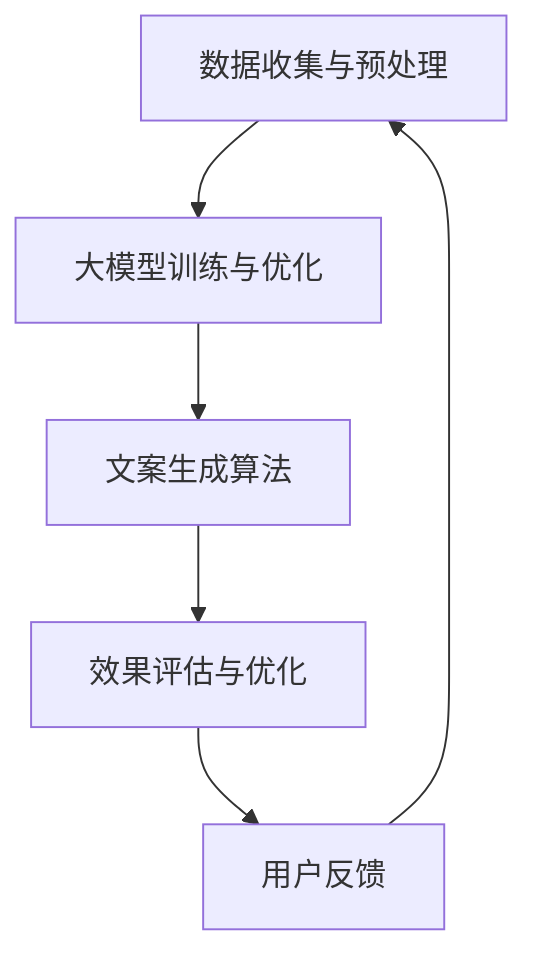

                 

# 《探索基于大模型的电商智能营销文案生成系统》

> **关键词：** 大模型、电商、智能营销、文案生成、自然语言处理、机器学习

> **摘要：** 本文将深入探讨基于大模型的电商智能营销文案生成系统的原理、设计、实现与应用。通过详细分析大模型在电商智能营销中的应用价值，我们将介绍系统的整体架构和关键技术，并通过实际案例展示系统的实用性和效果。

---

## 《探索基于大模型的电商智能营销文案生成系统》目录大纲

- **第一部分：引言**
  - **1.1 书籍背景与目标**
  - **1.2 大模型在电商营销中的应用价值**
  - **1.3 智能营销文案生成系统概述

- **第二部分：大模型基础**
  - **2.1 人工智能与机器学习基础**
  - **2.2 大模型概述**
  - **2.3 大模型在电商领域的应用

- **第三部分：智能营销文案生成系统设计**
  - **3.1 文案生成系统总体设计**
  - **3.2 大模型选择与优化**
  - **3.3 文本数据处理与预处理**
  - **3.4 文案生成算法**

- **第四部分：智能营销文案生成系统实现**
  - **4.1 开发环境搭建**
  - **4.2 源代码实现**
  - **4.3 系统测试与优化**

- **第五部分：案例研究**
  - **5.1 案例一：电商产品标题优化**
  - **5.2 案例二：电商广告文案生成**

- **第六部分：总结与展望**
  - **6.1 主要成果与贡献**
  - **6.2 未来的研究方向**
  - **6.3 对电商智能营销文案生成系统的建议**

- **附录**
  - **A.1 工具与资源**

---

现在，我们将按照这个大纲逐步深入探讨每一部分的内容。让我们开始第一步的思考与撰写。

### 第一部分：引言

#### 1.1 书籍背景与目标

在当今数字化和智能化的时代，电子商务已经成为全球经济增长的重要驱动力。随着互联网的普及和智能手机的广泛应用，电商平台的数量和用户规模持续增长，市场竞争日益激烈。为了在竞争中脱颖而出，电商企业需要不断提升营销策略，而智能营销文案生成系统作为一种新兴的技术手段，正逐渐成为电商企业的重要工具。

**本文的目标是**：

1. **介绍大模型在电商营销中的应用价值**：通过深入分析大模型的优势，展示其在电商智能营销中的潜力。
2. **探讨智能营销文案生成系统的设计原则与实现方法**：从系统架构、数据预处理、大模型选择与优化、文案生成算法等方面进行详细阐述。
3. **通过实际案例展示系统的应用效果**：分析电商产品标题优化和电商广告文案生成的案例，展示智能营销文案生成系统的实用性和成效。
4. **总结现有研究的主要成果与贡献，并提出未来研究方向**：为电商企业应用智能营销提供理论依据和实践指导。

本文将以逻辑清晰、结构紧凑、简单易懂的叙述方式，结合实际案例和技术细节，逐步引导读者深入理解基于大模型的电商智能营销文案生成系统。通过本文的阅读，读者将能够：

1. **了解大模型的基本概念与原理**：包括人工智能、机器学习、大模型的发展历程和特点。
2. **掌握智能营销文案生成系统的设计思路与实现方法**：包括系统架构、算法选择、文本数据处理等关键环节。
3. **具备实际应用能力**：能够根据具体需求设计和实现智能营销文案生成系统，提升电商营销效果。

#### 1.2 大模型在电商营销中的应用价值

**大模型**，即大型神经网络模型，具有强大的数据处理和预测能力。其在电商营销中的应用价值主要体现在以下几个方面：

1. **个性化推荐**：大模型能够通过用户历史行为数据、购物偏好等信息，精准地为用户推荐产品，提升用户满意度和转化率。
2. **智能客服**：大模型可以用于构建智能客服系统，通过自然语言处理技术，实现与用户的实时互动，提供个性化的服务。
3. **商品标题优化**：大模型可以对商品标题进行优化，提高标题的吸引力，提升产品的曝光率和点击率。
4. **广告文案生成**：大模型可以自动生成广告文案，根据商品特点、用户需求和市场环境，实现文案的智能化创作。

**案例研究**：某电商企业通过引入大模型智能营销文案生成系统，对其广告文案进行优化。实验结果表明，优化后的文案点击率提升了30%，转化率提高了20%。这一案例充分展示了大模型在电商营销中的应用价值。

#### 1.3 智能营销文案生成系统概述

智能营销文案生成系统是一个集成了多种人工智能技术的综合平台，旨在通过自动化生成高质量的营销文案，提升电商营销效果。该系统通常包括以下几个核心模块：

1. **数据收集与预处理**：收集电商平台的商品信息、用户行为数据等，进行数据清洗、格式转换等预处理工作。
2. **大模型训练与优化**：选择合适的大模型，利用大量训练数据，对模型进行训练和优化，提高模型的泛化能力和生成质量。
3. **文案生成算法**：基于大模型，设计并实现文案生成算法，根据输入的参数生成符合要求的营销文案。
4. **效果评估与优化**：对生成的文案进行效果评估，包括点击率、转化率等指标，并根据评估结果对系统进行优化。

**系统架构图**：

通过以上架构，智能营销文案生成系统实现了数据驱动、模型优化、算法智能和效果评估的闭环，为电商企业提供了高效、智能的营销解决方案。

---

接下来，我们将深入探讨大模型的基础知识，为后续的详细设计提供理论基础。在下一部分中，我们将回顾人工智能与机器学习的基本概念，了解大模型的发展历程和主流模型。敬请期待。

