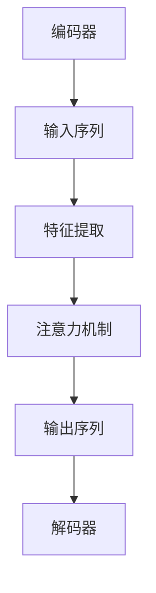
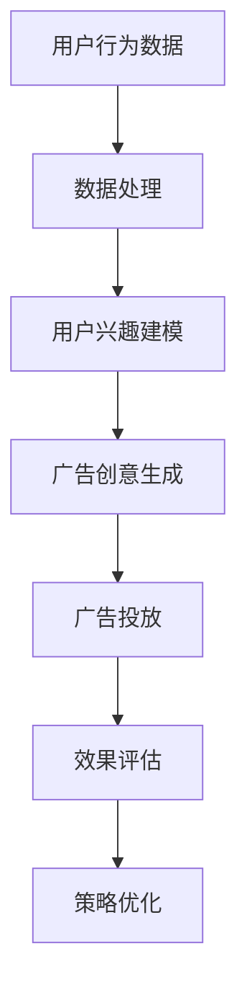

                 

# 《探讨大模型在电商平台个性化广告创意中的作用》

> **关键词：** 大模型、个性化广告、电商、广告创意、算法、用户体验

> **摘要：** 本文旨在探讨大模型在电商平台个性化广告创意中的作用。我们将深入分析大模型的发展历程、基本概念和原理，以及其在个性化广告中的应用架构。通过核心算法原理的详细讲解和案例分析，本文揭示了如何利用大模型提升电商平台广告的个性化创意效果，从而提高广告点击率和转化率。

---

## 第一部分：引言与背景

### 1.1 大模型与个性化广告概述

**大模型**，即大型神经网络模型，如Transformer、BERT等，具有强大的表示和生成能力。随着人工智能技术的飞速发展，大模型在自然语言处理、计算机视觉等领域取得了显著的成果。而个性化广告作为电商平台的重要盈利模式，其核心在于根据用户行为和兴趣精准推送广告，提升用户体验和广告效果。

个性化广告的需求源于电商市场的激烈竞争。为了在众多商品中脱颖而出，电商平台需要通过精确的广告投放，吸引潜在消费者。然而，传统的广告策略往往依赖于简单的用户行为分析，难以实现高度个性化。这就为大模型的应用提供了契机。

### 1.1.1 大模型的发展历程

大模型的发展可以追溯到深度学习的兴起。随着计算能力的提升和数据量的积累，深度学习模型从简单的多层感知机逐渐演变为复杂的大规模神经网络。2017年，谷歌发布了Transformer模型，其在机器翻译任务上取得了革命性的突破，标志着大模型时代的到来。

### 1.1.2 电商平台个性化广告的需求与挑战

电商平台个性化广告的需求在于：

1. **提升用户体验**：通过个性化广告，用户能够看到更符合其兴趣和需求的商品，提高购物满意度。
2. **提高广告效果**：精准的广告投放能够提高广告点击率和转化率，从而提升平台的盈利能力。

然而，个性化广告也面临以下挑战：

1. **数据隐私**：用户行为数据的收集和使用需遵守隐私法规，确保用户数据的安全和隐私。
2. **算法透明性**：广告推荐算法的透明性和公正性受到用户和社会的质疑。
3. **计算资源消耗**：大模型的训练和推理过程需要大量计算资源，对平台的技术能力提出了高要求。

### 1.1.3 大模型在电商广告中的应用前景

随着大模型技术的不断进步，其在电商广告中的应用前景广阔。通过大模型，电商平台可以实现：

1. **更精细的用户行为分析**：大模型能够更深入地理解用户行为，从而进行更精准的个性化推荐。
2. **更丰富的广告创意生成**：大模型可以生成多样化和创意性的广告内容，提升广告的吸引力和转化率。
3. **更智能的广告投放策略**：大模型可以帮助电商平台实时调整广告投放策略，提高广告效果。

总之，大模型在电商平台个性化广告中的应用，有望实现用户体验和商业价值的双赢。

## 第二部分：核心概念与架构

### 2.1 大模型基本概念与原理

#### 2.1.1 大模型的定义

大模型，通常指参数规模达到数十亿甚至千亿级别的神经网络模型。这些模型具有强大的表示和生成能力，能够在各种复杂任务上取得优异的性能。

#### 2.1.2 大模型的结构特征

大模型的结构通常包括以下几个部分：

1. **编码器（Encoder）**：用于处理输入序列，提取特征表示。
2. **解码器（Decoder）**：用于生成输出序列，实现文本生成、翻译等任务。
3. **注意力机制（Attention Mechanism）**：用于模型内部不同部分之间的交互，提高模型对输入序列的捕捉能力。

#### 2.1.3 大模型的训练与优化方法

大模型的训练过程通常包括以下几个步骤：

1. **数据预处理**：对输入数据进行清洗、编码等预处理操作。
2. **模型初始化**：使用预训练模型或随机初始化。
3. **损失函数设计**：根据任务类型设计适当的损失函数。
4. **优化算法**：使用梯度下降等优化算法更新模型参数。
5. **训练与验证**：通过迭代训练和验证，优化模型性能。

### 2.2 大模型的应用架构

#### 2.2.1 大模型在广告系统中的角色

大模型在广告系统中的角色主要包括：

1. **用户行为分析**：通过对用户行为数据进行深度分析，提取用户兴趣和需求。
2. **广告创意生成**：根据用户兴趣和商品特征，生成个性化广告创意。
3. **广告投放策略优化**：根据广告投放效果，实时调整广告投放策略。

#### 2.2.2 大模型在个性化广告中的应用流程

大模型在个性化广告中的应用流程通常包括以下几个步骤：

1. **数据收集**：收集用户行为数据和商品特征数据。
2. **数据处理**：对数据进行清洗、编码等处理。
3. **用户兴趣建模**：使用大模型对用户兴趣进行建模。
4. **广告创意生成**：根据用户兴趣和商品特征，生成个性化广告创意。
5. **广告投放**：将个性化广告推送给用户。
6. **效果评估**：评估广告效果，包括点击率、转化率等指标。

#### 2.2.3 大模型与其他广告技术的整合

大模型可以与其他广告技术进行整合，如：

1. **内容推荐**：将大模型与内容推荐系统结合，实现基于用户兴趣的内容推荐。
2. **广告优化**：将大模型与广告优化算法结合，实现实时广告投放策略优化。
3. **广告创意测试**：使用大模型生成不同广告创意，进行A/B测试，提高广告创意效果。

### 2.2.4 大模型在电商平台个性化广告中的作用

大模型在电商平台个性化广告中的作用主要体现在：

1. **提升广告点击率**：通过精确的用户兴趣建模，生成更具吸引力的广告创意，提高用户点击率。
2. **提高广告转化率**：根据用户兴趣和购买行为，精准推送相关商品广告，提高用户购买意愿和转化率。
3. **优化广告投放成本**：通过实时优化广告投放策略，降低广告投放成本，提高广告投资回报率。

总之，大模型在电商平台个性化广告中具有重要作用，是提升广告效果和用户体验的关键技术。

---

**本文后续章节将深入探讨大模型在个性化广告中的核心算法原理、实际应用案例，以及未来发展趋势。敬请期待！**

---

**附录A：大模型基本概念与架构的 Mermaid 流程图**

---

**附录B：大模型在个性化广告中的应用架构 Mermaid 流程图**

---

接下来，我们将进一步深入探讨大模型在个性化广告中的核心算法原理和实现。

---

**本文后续章节将详细讲解大模型在个性化广告中的核心算法原理，包括用户行为建模、广告创意生成与优化，以及广告投放策略。敬请期待！**<|im_end|>

