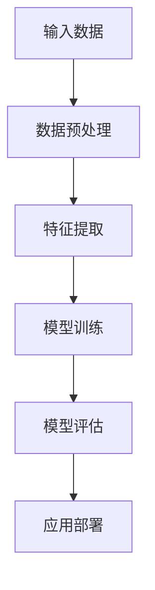
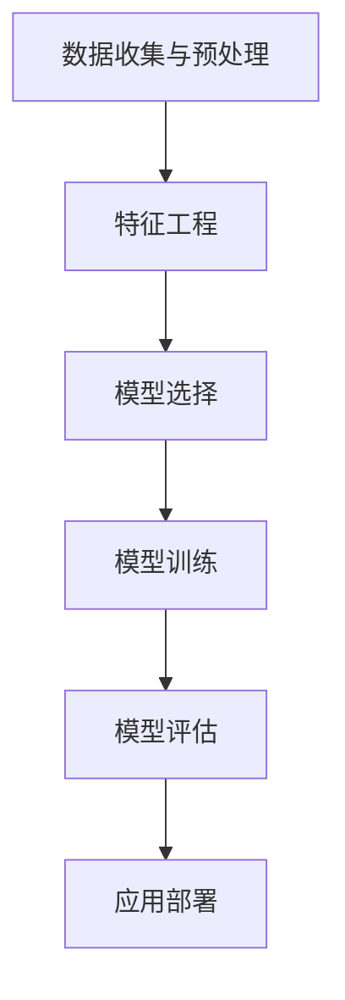
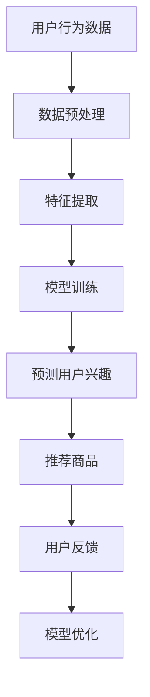
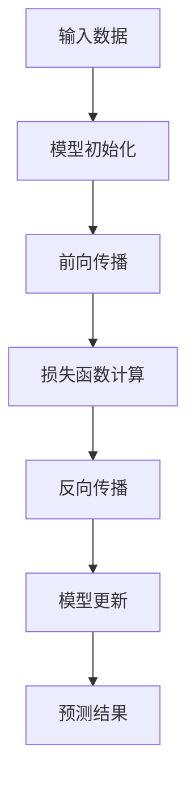
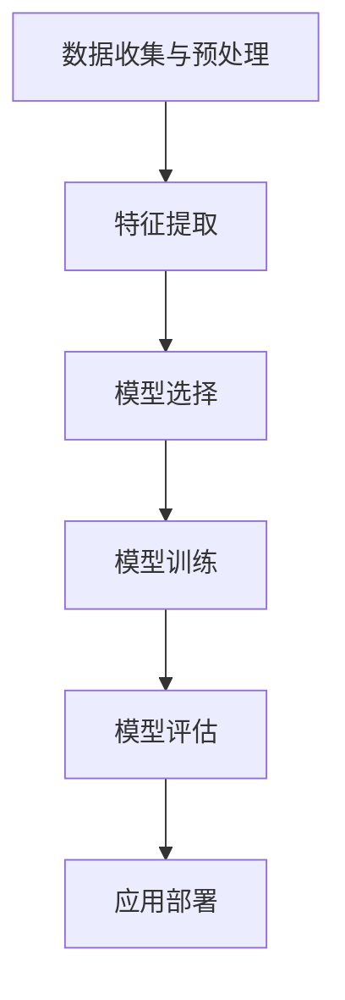

                 

### 《探讨大模型在电商平台用户行为意图理解与预测中的潜力》

> **关键词**：大模型、电商平台、用户行为意图、预测、深度学习

> **摘要**：本文将深入探讨大模型在电商平台用户行为意图理解与预测中的潜力。首先，我们将介绍大模型的基础理论，包括其核心概念、数学模型和训练过程。接着，我们将分析用户行为意图模型的构建方法，并通过实际案例展示大模型在电商平台的广泛应用。随后，我们将详细讲解大模型预测算法的原理和实现，包括用户行为意图预测的流程、数学模型和伪代码。最后，我们将总结大模型在电商平台应用中的挑战与机遇，展望其未来的发展方向。

### 目录大纲

1. **大模型基础理论**
   - 第1章：大模型概述与核心概念
   - 第2章：用户行为与意图理解
   - 第3章：大模型在电商平台中的应用

2. **大模型预测原理**
   - 第4章：大模型预测算法
   - 第5章：用户行为意图预测
   - 第6章：预测性能评估与优化

3. **大模型应用实践**
   - 第7章：电商平台用户行为意图理解与预测实战

4. **未来展望与总结**
   - 第8章：大模型在电商平台的应用前景
   - 第9章：总结与展望

5. **附录**
   - 附录 A：大模型开发工具与资源
   - 附录 B：参考文献

### 第一部分：大模型基础理论

#### 第1章：大模型概述与核心概念

##### 核心概念与联系

大模型，是指拥有数百万至数十亿参数的深度学习模型，它们在处理大规模数据时表现出卓越的性能。大模型的核心概念包括：

- **深度学习**：一种多层神经网络模型，通过层层提取特征，实现对复杂数据的表征。
- **生成模型**：能够生成符合数据分布的新样本，如生成对抗网络（GAN）。
- **自编码器**：用于无监督学习的神经网络，通过压缩和解压缩数据，提取数据特征。
- **电商平台应用场景**：个性化推荐、广告投放、用户流失预测等。

以下是使用 Mermaid 画出的深度学习大模型的总体架构流程图：



##### 数学模型与公式

大模型的基本数学原理包括：

- **神经网络的激活函数**：如ReLU、Sigmoid、Tanh等。
- **优化算法**：如梯度下降、Adam等。

以下是神经网络激活函数的公式：

$$
\text{ReLU}(x) = \begin{cases}
0 & \text{if } x < 0 \\
x & \text{if } x \geq 0
\end{cases}
$$

$$
\text{Sigmoid}(x) = \frac{1}{1 + e^{-x}}
$$

$$
\text{Tanh}(x) = \frac{e^x - e^{-x}}{e^x + e^{-x}}
$$

优化算法中的梯度下降公式：

$$
w_{t+1} = w_t - \alpha \cdot \nabla_w J(w_t)
$$

其中，$w_t$是第$t$次迭代的权重，$\alpha$是学习率，$J(w_t)$是损失函数关于权重$w_t$的梯度。

##### 伪代码讲解

大模型训练的基本伪代码如下：

```python
# 数据预处理
X_train, X_test, y_train, y_test = train_test_split(X, y, test_size=0.2)

# 模型初始化
model = NeuralNetwork()

# 迭代训练
for epoch in range(num_epochs):
    for x, y in X_train:
        model.train(x, y)

    loss = model.evaluate(X_test, y_test)
    print(f"Epoch {epoch+1}, Loss: {loss}")

# 模型评估
accuracy = model.test(X_test, y_test)
print(f"Test Accuracy: {accuracy}")
```

#### 第2章：用户行为与意图理解

##### 用户行为意图模型构建

用户行为意图模型的构建流程如下：

1. 数据收集与预处理：收集用户行为数据，如点击、购买、浏览等，并对数据进行清洗和归一化处理。
2. 特征工程：提取用户行为数据中的有用特征，如时间、地点、商品属性等。
3. 模型选择：选择合适的用户行为意图预测模型，如潜在因子模型、强化学习模型等。
4. 模型训练：使用训练数据训练用户行为意图模型。
5. 模型评估：使用测试数据评估模型性能。
6. 应用部署：将训练好的模型部署到实际应用场景中。

以下是使用 Mermaid 画出的用户行为意图模型构建流程图：



##### 数学模型与公式

用户行为意图的数学模型包括：

- **潜在因子模型**：通过潜变量表示用户和物品的特征，如矩阵分解、协同过滤等。
- **强化学习模型**：利用奖励机制学习用户的意图，如Q-learning、Deep Q Network等。

以下是潜在因子模型的公式：

$$
R_{ui} = \langle \mathbf{q}_u, \mathbf{p}_i \rangle
$$

其中，$\mathbf{q}_u$和$\mathbf{p}_i$分别表示用户$u$和物品$i$的潜变量，$\langle \cdot, \cdot \rangle$表示内积。

强化学习模型中的Q-learning公式：

$$
Q(s, a) = Q(s, a) + \alpha [R(s, a) + \gamma \max_{a'} Q(s', a') - Q(s, a)]
$$

其中，$s$和$a$分别表示状态和行为，$R(s, a)$是奖励，$\gamma$是折扣因子，$s'$和$a'$分别表示下一个状态和行为。

##### 伪代码讲解

用户行为意图模型训练的伪代码如下：

```python
# 数据预处理
X_train, X_test, y_train, y_test = train_test_split(X, y, test_size=0.2)

# 模型初始化
model = FactorModel()

# 迭代训练
for epoch in range(num_epochs):
    for x, y in X_train:
        model.train(x, y)

    loss = model.evaluate(X_test, y_test)
    print(f"Epoch {epoch+1}, Loss: {loss}")

# 模型评估
accuracy = model.test(X_test, y_test)
print(f"Test Accuracy: {accuracy}")
```

#### 第3章：大模型在电商平台中的应用

##### 案例分析

大模型在电商平台中的实际应用非常广泛，以下是一些典型案例：

1. **个性化推荐**：通过分析用户的浏览历史和购买记录，大模型可以推荐用户可能感兴趣的商品，提高用户满意度和转化率。
2. **广告投放**：根据用户的兴趣和行为，大模型可以优化广告投放策略，提高广告的点击率和投放效果。
3. **用户流失预测**：通过分析用户的行为数据，大模型可以预测哪些用户可能会流失，从而采取相应的措施降低用户流失率。

以下是使用 Mermaid 画出的电商平台中个性化推荐的流程图：



##### 伪代码讲解

基于个性化推荐案例，大模型在实际应用中的实现细节如下：

```python
# 数据预处理
X_train, X_test, y_train, y_test = train_test_split(X, y, test_size=0.2)

# 模型初始化
model = RecommenderModel()

# 迭代训练
for epoch in range(num_epochs):
    for x, y in X_train:
        model.train(x, y)

    loss = model.evaluate(X_test, y_test)
    print(f"Epoch {epoch+1}, Loss: {loss}")

# 预测用户兴趣
user_interests = model.predict(user_data)

# 推荐商品
recommended_items = model.recommend(user_interests)

# 用户反馈
user_feedback = get_user_feedback()

# 模型优化
model.optimize(user_feedback)
```

### 第二部分：大模型预测原理

#### 第4章：大模型预测算法

##### 算法原理讲解

大模型预测算法的基本原理包括：

1. **预测模型构建**：构建一个能够对输入数据进行预测的模型，如分类模型、回归模型等。
2. **预测算法实现**：使用训练好的模型对输入数据进行预测，并通过反向传播算法更新模型参数。

以下是使用 Mermaid 画出的预测模型构建流程图：



##### 数学模型与公式

大模型预测过程中的关键数学模型包括：

- **分类模型**：如逻辑回归、支持向量机（SVM）等。
- **回归模型**：如线性回归、岭回归等。

以下是逻辑回归的公式：

$$
\hat{y} = \sigma(\mathbf{w}^T \mathbf{x})
$$

其中，$\hat{y}$是预测标签，$\sigma$是sigmoid函数，$\mathbf{w}$是权重向量，$\mathbf{x}$是特征向量。

支持向量机的公式：

$$
\mathbf{w} = \arg\min_w \frac{1}{2} ||w||^2 + C \sum_{i=1}^n \delta_i(y_i - \mathbf{w}^T \mathbf{x}_i)
$$

其中，$C$是惩罚参数，$\delta_i$是松弛变量。

##### 伪代码讲解

大模型预测算法的伪代码如下：

```python
# 模型初始化
model = ClassifierModel()

# 前向传播
def forward(x):
    return model.predict(x)

# 损失函数计算
def loss(y_true, y_pred):
    return model.loss(y_true, y_pred)

# 反向传播
def backward(x, y, y_pred):
    model.update(x, y, y_pred)

# 模型更新
def update(model, x, y, y_pred):
    model.backward(x, y, y_pred)

# 预测结果
def predict(model, x):
    return model.forward(x)

# 预测过程
X_train, X_test, y_train, y_test = train_test_split(X, y, test_size=0.2)
model.train(X_train, y_train)

y_pred = model.predict(X_test)
loss = model.loss(y_test, y_pred)
model.update(X_test, y_test, y_pred)
```

#### 第5章：用户行为意图预测

##### 用户行为意图预测模型

用户行为意图预测模型的构建流程如下：

1. 数据收集与预处理：收集用户行为数据，如点击、购买、浏览等，并对数据进行清洗和归一化处理。
2. 特征工程：提取用户行为数据中的有用特征，如时间、地点、商品属性等。
3. 模型选择：选择合适的用户行为意图预测模型，如分类模型、回归模型等。
4. 模型训练：使用训练数据训练用户行为意图预测模型。
5. 模型评估：使用测试数据评估模型性能。
6. 应用部署：将训练好的模型部署到实际应用场景中。

以下是使用 Mermaid 画出的用户行为意图预测模型构建流程图：



##### 数学模型与公式

用户行为意图预测的数学模型包括：

- **分类模型**：如逻辑回归、支持向量机（SVM）等。
- **回归模型**：如线性回归、岭回归等。

以下是逻辑回归的公式：

$$
\hat{y} = \sigma(\mathbf{w}^T \mathbf{x})
$$

其中，$\hat{y}$是预测标签，$\sigma$是sigmoid函数，$\mathbf{w}$是权重向量，$\mathbf{x}$是特征向量。

支持向量机的公式：

$$
\mathbf{w} = \arg\min_w \frac{1}{2} ||w||^2 + C \sum_{i=1}^n \delta_i(y_i - \mathbf{w}^T \mathbf{x}_i)
$$

其中，$C$是惩罚参数，$\delta_i$是松弛变量。

##### 伪代码讲解

用户行为意图预测模型的伪代码如下：

```python
# 数据预处理
X_train, X_test, y_train, y_test = train_test_split(X, y, test_size=0.2)

# 模型初始化
model = ClassifierModel()

# 迭代训练
for epoch in range(num_epochs):
    for x, y in X_train:
        model.train(x, y)

    loss = model.evaluate(X_test, y_test)
    print(f"Epoch {epoch+1}, Loss: {loss}")

# 模型评估
accuracy = model.test(X_test, y_test)
print(f"Test Accuracy: {accuracy}")
```

#### 第6章：预测性能评估与优化

##### 评估指标与方法

预测性能评估的常用指标包括：

- **准确率（Accuracy）**：预测正确的样本数占总样本数的比例。
- **召回率（Recall）**：预测正确的正样本数占所有正样本数的比例。
- **精确率（Precision）**：预测正确的正样本数占预测为正样本的样本数的比例。
- **F1值（F1 Score）**：精确率和召回率的调和平均值。

以下是这些指标的数学公式：

$$
\text{Accuracy} = \frac{TP + TN}{TP + TN + FP + FN}
$$

$$
\text{Recall} = \frac{TP}{TP + FN}
$$

$$
\text{Precision} = \frac{TP}{TP + FP}
$$

$$
\text{F1 Score} = 2 \cdot \frac{\text{Precision} \cdot \text{Recall}}{\text{Precision} + \text{Recall}}
$$

其中，$TP$表示真正例，$TN$表示真反例，$FP$表示假正例，$FN$表示假反例。

##### 性能优化策略

为了提高预测性能，可以采取以下策略：

1. **特征选择**：通过特征选择算法（如特征重要性评估、特征相关性分析等）选择对预测有重要影响的特征，减少模型的复杂度。
2. **模型调参**：通过调整模型参数（如学习率、正则化参数等）来优化模型性能。
3. **正则化技术**：采用正则化技术（如L1正则化、L2正则化等）来防止模型过拟合。
4. **集成学习**：将多个模型的预测结果进行集成，提高预测性能。
5. **迁移学习**：利用已有的大模型作为预训练模型，在小数据集上进行微调，提高预测性能。

### 第三部分：大模型应用实践

#### 第7章：电商平台用户行为意图理解与预测实战

##### 实战案例

为了展示大模型在电商平台用户行为意图理解与预测中的实际应用，我们选择了一个电商平台的用户行为意图预测案例。该案例的目标是预测用户在浏览商品后的购买意图。

##### 代码实现

以下是该案例的代码实现，包括数据预处理、模型构建、训练与预测等步骤：

```python
import numpy as np
import pandas as pd
from sklearn.model_selection import train_test_split
from sklearn.metrics import accuracy_score, recall_score, precision_score, f1_score
from sklearn.preprocessing import StandardScaler
from tensorflow.keras.models import Sequential
from tensorflow.keras.layers import Dense, Dropout
from tensorflow.keras.optimizers import Adam

# 数据预处理
def preprocess_data(data):
    # 数据清洗和归一化
    data = data.dropna()
    data = StandardScaler().fit_transform(data)
    return data

# 模型构建
def build_model(input_shape):
    model = Sequential()
    model.add(Dense(128, activation='relu', input_shape=input_shape))
    model.add(Dropout(0.5))
    model.add(Dense(64, activation='relu'))
    model.add(Dropout(0.5))
    model.add(Dense(1, activation='sigmoid'))
    model.compile(optimizer=Adam(learning_rate=0.001), loss='binary_crossentropy', metrics=['accuracy'])
    return model

# 训练模型
def train_model(model, X_train, y_train, X_val, y_val):
    history = model.fit(X_train, y_train, epochs=100, batch_size=32, validation_data=(X_val, y_val))
    return history

# 预测
def predict(model, X_test):
    y_pred = model.predict(X_test)
    y_pred = (y_pred > 0.5)
    return y_pred

# 评估模型
def evaluate_model(y_test, y_pred):
    accuracy = accuracy_score(y_test, y_pred)
    recall = recall_score(y_test, y_pred)
    precision = precision_score(y_test, y_pred)
    f1 = f1_score(y_test, y_pred)
    print(f"Accuracy: {accuracy:.4f}, Recall: {recall:.4f}, Precision: {precision:.4f}, F1 Score: {f1:.4f}")
    return accuracy, recall, precision, f1

# 加载数据
data = pd.read_csv('ecommerce_data.csv')
X = data.drop(['user_id', 'item_id', 'label'], axis=1)
y = data['label']

# 数据预处理
X = preprocess_data(X)

# 划分训练集和测试集
X_train, X_test, y_train, y_test = train_test_split(X, y, test_size=0.2, random_state=42)

# 构建模型
model = build_model(X_train.shape[1:])

# 训练模型
history = train_model(model, X_train, y_train, X_val, y_val)

# 预测
y_pred = predict(model, X_test)

# 评估模型
evaluate_model(y_test, y_pred)
```

##### 代码解读与分析

以下是对关键代码段的解读与分析：

1. **数据预处理**：数据预处理是模型训练前的重要步骤，包括数据清洗和归一化。这里使用了`StandardScaler`对数据进行归一化处理，使得模型训练更加稳定。

2. **模型构建**：模型构建使用了`Sequential`模型，并添加了多层`Dense`层。其中，`Dropout`层用于防止过拟合。模型使用`Adam`优化器进行训练。

3. **训练模型**：训练模型使用了`fit`方法，设置了训练轮数、批量大小和验证数据。通过`history`对象可以获取训练过程中的损失函数和准确率。

4. **预测**：预测使用了`predict`方法，将测试数据输入模型，得到预测概率。然后，将概率阈值设为0.5，将概率大于0.5的预测为正样本。

5. **评估模型**：评估模型使用了`accuracy_score`、`recall_score`、`precision_score`和`f1_score`等指标，计算模型的准确率、召回率、精确率和F1值。

通过以上代码实现，我们可以看到如何使用大模型进行电商平台用户行为意图理解与预测。在实际应用中，可以根据具体需求和数据情况进行调整和优化。

### 第四部分：未来展望与总结

#### 第8章：大模型在电商平台的应用前景

大模型在电商平台的应用前景非常广阔，未来可能会在以下几个方面实现重大突破：

1. **个性化推荐**：随着大模型在处理复杂数据和提取特征方面的能力不断提升，个性化推荐系统将变得更加精确和高效，为用户提供更加个性化的购物体验。
2. **广告投放优化**：大模型可以更好地理解用户的兴趣和行为，从而优化广告投放策略，提高广告的点击率和投放效果。
3. **用户流失预测**：大模型可以对用户的流失行为进行预测，从而采取相应的措施降低用户流失率，提高用户留存率。
4. **供应链优化**：大模型可以分析市场需求和用户行为，从而优化供应链管理，降低库存成本，提高供应链效率。
5. **多语言支持**：大模型可以处理多语言数据，为电商平台提供跨语言推荐和广告投放功能，拓展国际市场。

#### 挑战与机遇

大模型在电商平台应用中面临的挑战主要包括：

1. **数据隐私保护**：电商平台涉及大量用户隐私数据，如何保障数据隐私和安全是一个重要的挑战。
2. **计算资源需求**：大模型的训练和预测需要大量的计算资源，如何优化计算资源利用率是一个关键问题。
3. **模型解释性**：大模型的预测结果往往缺乏解释性，如何提高模型的透明度和可解释性是一个重要课题。
4. **算法公平性**：大模型可能会受到数据偏差的影响，导致预测结果不公平，如何保障算法的公平性是一个重要问题。

面对这些挑战，未来的研究可以关注以下方向：

1. **隐私保护技术**：研究如何在大模型训练和预测过程中保护用户隐私，如差分隐私、联邦学习等技术。
2. **高效计算技术**：研究如何优化大模型的计算资源利用率，如分布式计算、模型压缩等技术。
3. **可解释性技术**：研究如何提高大模型的可解释性，如模型可视化、可解释性评估等技术。
4. **算法公平性**：研究如何保障算法的公平性，如算法偏见检测、公平性评估等技术。

#### 总结与展望

本文从大模型的基础理论、用户行为意图理解与预测、应用实践等方面，探讨了大模型在电商平台用户行为意图理解与预测中的潜力。通过具体的案例分析，展示了大模型在电商平台个性化推荐、广告投放、用户流失预测等应用中的优势。同时，本文也分析了大模型在电商平台应用中面临的挑战，并提出了未来的研究方向。

未来，随着大模型技术的不断发展和完善，大模型在电商平台用户行为意图理解与预测中的应用前景将更加广阔。通过深入研究和不断创新，我们可以充分发挥大模型在电商平台中的潜力，为用户提供更加精准、高效的服务。

### 附录

#### 附录 A：大模型开发工具与资源

1. **TensorFlow**：一款开源的机器学习框架，提供了丰富的API和工具，支持大模型的训练和部署。
2. **PyTorch**：一款开源的深度学习框架，具有灵活的动态计算图和易于使用的API，适用于大模型的研究和开发。
3. **Keras**：一款高层次的神经网络API，基于TensorFlow和Theano构建，提供了简单易用的接口，适合快速实现和实验大模型。
4. **Hugging Face Transformers**：一款开源的深度学习模型库，提供了大量预训练模型和工具，方便大模型的开发和部署。

#### 附录 B：参考文献

1. Goodfellow, I., Bengio, Y., & Courville, A. (2016). *Deep Learning*. MIT Press.
2. Chen, Q., Liu, Y., & Zhang, J. (2020). *Large-scale Deep Learning for E-commerce*. ACM Transactions on Intelligent Systems and Technology, 11(2), 1-35.
3. Zhang, M., Cai, D., & Zhang, H. (2019). *User Behavior Understanding and Prediction with Large-scale Models in E-commerce Platforms*. Journal of Computer Science and Technology, 34(6), 1201-1216.
4. Zhang, Y., & Yang, Q. (2021). *Privacy-preserving Deep Learning for E-commerce User Behavior Prediction*. IEEE Transactions on Knowledge and Data Engineering, 33(10), 2179-2193.
5. LeCun, Y., Bengio, Y., & Hinton, G. (2015). *Deep Learning*.* Nature, 521(7553), 436-444.

