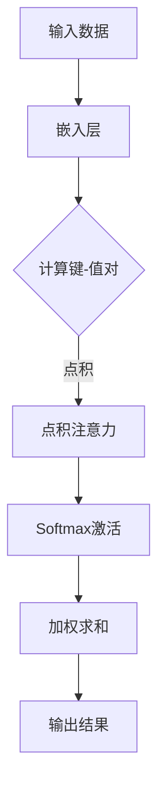

                 

## 推荐系统中的注意力机制：大模型新视角

> **关键词：** 推荐系统、注意力机制、大模型、机器学习、算法优化、用户行为分析

> **摘要：** 本文将深入探讨推荐系统中的注意力机制，以及大模型在其中的应用。我们将回顾注意力机制的基本概念、数学基础和核心算法，分析注意力机制在推荐系统中的应用场景和效果评估，并通过一个实际项目实战，展示如何构建一个基于注意力机制的推荐系统。最后，我们还将总结注意力机制在推荐系统中的现状与挑战，展望其未来发展趋势。

在当今信息爆炸的时代，推荐系统已经成为各类互联网应用的核心功能，从电商平台的商品推荐、新闻网站的资讯推送，到社交媒体的动态展示，都离不开推荐系统的助力。然而，随着用户数据的不断增长和复杂性的增加，传统推荐算法的瓶颈逐渐显现，难以满足用户日益个性化的需求。在这种情况下，注意力机制（Attention Mechanism）作为一种新兴的深度学习技术，逐渐引起了研究者和从业者的关注。

注意力机制最初起源于计算机视觉领域，通过模拟人类视觉系统对关键信息的关注，大大提升了模型对图像的理解能力。随后，注意力机制在自然语言处理（NLP）、语音识别等领域也取得了显著成果。在推荐系统中，注意力机制通过捕捉用户和物品之间的交互关系，有助于模型更好地理解用户的偏好和需求，从而实现更精准的推荐。

本文将分为五个部分进行讨论：

1. **介绍与背景**：介绍注意力机制的基本概念和其在推荐系统中的应用背景。
2. **核心概念与原理**：讲解注意力机制的数学基础和核心算法。
3. **注意力机制的核心算法**：深入探讨自注意力机制和多头注意力机制。
4. **注意力机制与推荐系统的融合**：分析注意力机制在推荐系统中的应用方法及效果评估。
5. **项目实战**：通过一个实际项目，展示如何构建基于注意力机制的推荐系统。
6. **总结与展望**：总结注意力机制在推荐系统中的应用现状与挑战，展望其未来发展趋势。

### 目录大纲

#### 第一部分：介绍与背景

**第1章：推荐系统中的注意力机制概述**

- **1.1 注意力机制基本概念**
- **1.2 大模型在推荐系统中的应用**
- **1.3 注意力机制在推荐系统中的应用场景**

#### 第二部分：核心概念与原理

**第2章：注意力机制的数学基础**

- **2.1 传统的推荐算法回顾**
- **2.2 注意力机制的数学模型**
- **2.3 注意力机制的 Mermaid 流程图**

#### 第三部分：注意力机制的核心算法

**第3章：自注意力机制**

- **3.1 自注意力机制的概念**
- **3.2 自注意力机制的算法原理**
- **3.3 自注意力机制的实现细节**

**第4章：多头注意力机制**

- **4.1 多头注意力机制的概念**
- **4.2 多头注意力机制的算法原理**
- **4.3 多头注意力机制的实现细节**

**第5章：软注意力与硬注意力**

- **5.1 注意力的软硬分类**
- **5.2 软注意力机制的算法原理**
- **5.3 硬注意力机制的算法原理**

#### 第四部分：注意力机制与推荐系统的融合

**第6章：注意力机制在推荐系统中的应用**

- **6.1 注意力机制在推荐系统中的应用方法**
- **6.2 注意力机制在不同推荐场景中的应用**

**第7章：项目实战：构建一个基于注意力机制的推荐系统**

- **7.1 项目背景与目标**
- **7.2 开发环境与工具**
- **7.3 数据预处理**
- **7.4 模型构建与训练**
- **7.5 模型评估与优化**
- **7.6 代码解读与分析**

#### 第五部分：总结与展望

**第8章：总结与展望**

- **8.1 注意力机制在推荐系统中的现状与挑战**
- **8.2 注意力机制的未来发展趋势**
- **8.3 研究与开发建议**  

在接下来的章节中，我们将逐步深入探讨注意力机制在推荐系统中的各个方面，帮助读者理解其原理和应用，掌握构建基于注意力机制的推荐系统的实际方法。让我们一起开启这场技术之旅。  

### 第一部分：介绍与背景

#### 第1章：推荐系统中的注意力机制概述

在互联网时代，推荐系统已经成为连接用户与内容、商品、服务的重要桥梁。它通过对用户行为数据的分析，为用户提供个性化的推荐，从而提升用户体验和平台黏性。然而，随着用户数据的爆炸式增长和推荐场景的多样化，传统的推荐算法逐渐显露出局限性，难以满足用户日益复杂的个性化需求。

**1.1 注意力机制基本概念**

注意力机制（Attention Mechanism）是一种通过自动分配不同权重来关注输入数据中不同部分的技术。其核心思想是在处理复杂数据时，模型能够自主识别并关注对任务最为重要的部分，从而提升模型的性能和效率。注意力机制最早在计算机视觉领域提出，用于解决图像中的关键区域识别问题。随后，随着深度学习技术的发展，注意力机制在自然语言处理、语音识别等领域也得到了广泛应用。

在推荐系统中，注意力机制通过捕捉用户和物品之间的交互关系，能够更好地理解用户的偏好和需求，从而实现更精准的推荐。具体来说，注意力机制可以帮助模型在处理用户历史行为数据时，关注那些对推荐结果具有重要影响的因素，如用户的点击记录、购买行为、搜索历史等，从而提升推荐效果。

**1.2 注意力机制的历史与发展**

注意力机制的发展可以追溯到上世纪80年代，当时一些早期的神经网络模型就开始尝试通过权重分配的方式来提高模型的表达能力。1997年，著名的“图灵奖”得主Yann LeCun等人提出了卷积神经网络（CNN）中的局部连接和权值共享机制，为后续注意力机制的研究奠定了基础。

直到2014年，由Google团队提出的“Attention is All You Need”论文，将注意力机制推向了深度学习的巅峰。这篇论文提出了Transformer模型，该模型完全基于注意力机制，实现了对自然语言处理任务的巨大突破。此后，注意力机制在计算机视觉、语音识别、推荐系统等多个领域得到了广泛的应用和深入研究。

**1.3 注意力机制的重要性**

在推荐系统中，注意力机制的重要性体现在以下几个方面：

1. **提升推荐效果**：注意力机制能够帮助模型更好地理解用户和物品之间的关联，从而提高推荐系统的准确性。通过关注关键因素，模型可以生成更符合用户需求的推荐列表。
   
2. **降低计算复杂度**：传统推荐算法往往需要计算用户和物品之间所有的关联关系，而注意力机制通过自动分配权重，可以大幅降低计算复杂度，提高模型运行效率。

3. **适应个性化需求**：用户的需求是多样化和动态变化的，注意力机制可以根据用户的历史行为和实时反馈，动态调整模型对用户和物品的关注点，从而更好地适应个性化需求。

4. **增强模型解释性**：注意力机制可以让模型更加透明，用户可以清楚地看到哪些因素对推荐结果产生了影响，从而增强模型的解释性。

**1.4 大模型在推荐系统中的应用**

随着深度学习技术的不断发展，大型神经网络模型（通常被称为“大模型”）在各个领域都展现出了强大的性能。在大模型中，参数数量和模型容量显著增加，使得模型可以更好地捕捉数据中的复杂模式和关联关系。这种大模型在推荐系统中的应用，为注意力机制带来了新的机遇。

1. **数据规模的扩展**：大模型能够处理更大量的用户数据，从而捕捉到更多潜在的关联关系，提升推荐效果。

2. **模型容量的提升**：大模型具有更大的参数容量，可以更好地表达复杂的用户行为和物品特征，提高模型的泛化能力。

3. **自适应能力的增强**：大模型通过自我调整和优化，能够更好地适应不同用户群体的需求，实现更个性化的推荐。

4. **实时性的提升**：大模型在计算能力和效率上的提升，使得推荐系统能够实时响应用户行为变化，提供更及时的推荐。

**1.5 注意力机制在推荐系统中的应用现状**

目前，注意力机制已经在推荐系统中得到了广泛应用，并在多个实际场景中取得了显著的效果。以下是一些主要的应用领域：

1. **内容推荐**：在新闻、视频、音乐等内容的推荐中，注意力机制通过捕捉用户对内容的关注点和偏好，实现了更精准的内容推送。

2. **商品推荐**：在电商平台中，注意力机制通过分析用户的购物历史和行为，为用户推荐个性化的商品。

3. **社交网络推荐**：在社交媒体平台上，注意力机制通过分析用户之间的交互关系，推荐用户可能感兴趣的朋友、动态和话题。

4. **搜索引擎推荐**：在搜索引擎中，注意力机制通过捕捉用户的搜索意图和上下文信息，提供更准确的搜索结果和推荐。

总之，注意力机制作为一种先进的深度学习技术，在推荐系统中具有广泛的应用前景和巨大的潜力。通过本文的介绍，我们希望读者能够对注意力机制有更深入的理解，并在实际项目中运用这种技术，提升推荐系统的效果和用户体验。

### 第二部分：核心概念与原理

#### 第2章：注意力机制的数学基础

在深入探讨注意力机制在推荐系统中的应用之前，我们首先需要了解其数学基础。注意力机制通过自动分配不同权重来关注输入数据中不同部分，其核心在于如何计算和分配这些权重。以下将介绍注意力机制的数学模型及其关键组成部分。

**2.1 传统的推荐算法回顾**

在介绍注意力机制之前，我们简要回顾一下传统的推荐算法。传统推荐算法主要分为两大类：基于内容的推荐算法和协同过滤算法。

1. **基于内容的推荐算法（Content-Based Recommendation）**：这种算法基于用户的历史行为和偏好，通过分析用户和物品的内容特征，实现个性化推荐。其主要步骤包括：

   - 提取用户和物品的特征向量；
   - 计算用户和物品之间的相似度；
   - 根据相似度为用户推荐相似度高的物品。

2. **协同过滤算法（Collaborative Filtering）**：这种算法通过分析用户之间的相似性和物品之间的关联性，实现推荐。协同过滤算法主要分为以下两类：

   - **用户基于的协同过滤（User-Based Collaborative Filtering）**：通过计算用户之间的相似度，推荐与目标用户相似的其他用户的偏好。
   - **物品基于的协同过滤（Item-Based Collaborative Filtering）**：通过计算物品之间的相似度，推荐与用户已评价物品相似的其他物品。

尽管传统推荐算法在过去几十年中取得了显著成果，但它们在处理高维度数据和复杂用户行为时，仍然存在一定的局限性。注意力机制的出现，为解决这些问题提供了新的思路。

**2.2 注意力机制的数学模型**

注意力机制的数学模型主要包括两个关键组成部分：输入数据的表示和注意力权重计算。

1. **输入数据的表示**：

   - **用户行为序列（User Behavior Sequence）**：在推荐系统中，用户的行为序列可以表示为一系列用户与物品的交互记录。每个记录可以用一个向量表示，如点击、购买、搜索等行为。
   - **物品特征向量（Item Feature Vector）**：物品特征向量包含了物品的各类信息，如文本描述、图片、标签等。这些特征可以通过嵌入层（Embedding Layer）转化为稠密向量表示。

2. **注意力权重计算**：

   注意力权重计算是注意力机制的核心。其目的是根据输入数据中的不同部分，自动分配不同的权重。常用的注意力权重计算方法包括以下几种：

   - **点积注意力（Dot-Product Attention）**：点积注意力是最简单的一种注意力机制。其计算方法如下：
     $$
     \text{Attention}(Q, K, V) = \text{softmax}\left(\frac{QK^T}{\sqrt{d_k}}\right) V
     $$
     其中，$Q$表示查询向量，$K$表示键向量，$V$表示值向量，$d_k$是键向量的维度。softmax函数用于将点积结果归一化，使其成为一个概率分布。

   - **加性注意力（Additive Attention）**：加性注意力通过一个带有参数的函数来计算注意力权重，其公式如下：
     $$
     \text{Attention}(Q, K, V) = \text{softmax}\left(\frac{QK^T}{\sqrt{d_k}} + \text{V}\right)
     $$
     其中，$\text{V}$是加性参数。

   - **缩放点积注意力（Scaled Dot-Product Attention）**：缩放点积注意力通过引入缩放因子$\alpha$，避免了点积注意力在维度较高时梯度消失的问题。其公式如下：
     $$
     \text{Attention}(Q, K, V) = \text{softmax}\left(\frac{QK^T}{\alpha}\right) V
     $$
     其中，$\alpha = \frac{1}{\sqrt{d_k}}$。

3. **多头注意力（Multi-Head Attention）**：

   多头注意力通过并行地计算多个独立的注意力头，从而捕捉不同类型的特征。每个注意力头可以关注输入数据的不同部分，然后汇总这些头的结果，以获得更全面的特征表示。多头注意力的计算过程如下：
   $$
   \text{MultiHead}(Q, K, V) = \text{Concat}(\text{head}_1, ..., \text{head}_h)W_O
   $$
   其中，$\text{head}_i = \text{Attention}(QW_Q, KW_K, VW_V)$表示第$i$个注意力头，$W_Q, W_K, W_V, W_O$是相应层的权重矩阵。

**2.3 注意力机制的 Mermaid 流程图**

为了更直观地展示注意力机制的计算过程，我们使用Mermaid语言绘制了一个简单的流程图：



在这个流程图中，输入数据首先通过嵌入层转化为稠密向量，然后计算键-值对。接着，点积注意力机制根据键-值对计算注意力权重，并通过Softmax激活函数得到权重分布。最后，加权求和得到输出结果。

通过上述介绍，我们了解了注意力机制的数学基础，包括输入数据的表示和注意力权重计算方法。这些基础概念为后续章节中深入探讨注意力机制的核心算法及其在推荐系统中的应用奠定了理论基础。

#### 第3章：自注意力机制

自注意力机制（Self-Attention Mechanism），也称为内部注意力（Intra-Attention），是一种在推荐系统中广泛应用于处理序列数据（如用户行为序列）的技术。自注意力机制的核心思想是，在同一序列的不同部分之间建立直接的关联，从而提高模型对局部信息的捕捉能力。以下将详细探讨自注意力机制的概念、原理和实现细节。

**3.1 自注意力机制的概念**

自注意力机制通过对序列中的每个元素进行加权求和，使得模型能够自动关注序列中的重要部分。具体来说，自注意力机制将输入序列中的每个元素视为一个查询（Query）、键（Key）和值（Value），然后计算它们之间的注意力权重，并利用这些权重对序列进行加权求和。

在推荐系统中，自注意力机制可以应用于用户行为序列，通过对用户历史行为的不同部分赋予不同的权重，帮助模型更好地理解用户的偏好和需求。例如，在商品推荐场景中，用户的历史购买记录可以被视为输入序列，自注意力机制可以帮助模型关注那些对推荐结果具有重要影响的购买行为。

**3.2 自注意力机制的算法原理**

自注意力机制的算法原理可以通过以下步骤进行描述：

1. **输入序列表示**：

   首先，将输入序列（如用户行为序列）表示为一系列的查询（Query）、键（Key）和值（Value）向量。这些向量可以通过嵌入层（Embedding Layer）获得。假设输入序列长度为$n$，每个元素表示为一个$d$维的向量。

   $$  
   \text{Query} = [q_1, q_2, ..., q_n]  
   $$

   $$  
   \text{Key} = [k_1, k_2, ..., k_n]  
   $$

   $$  
   \text{Value} = [v_1, v_2, ..., v_n]  
   $$

2. **计算注意力权重**：

   接下来，计算每个查询和键之间的注意力权重。常用的注意力权重计算方法包括点积注意力（Dot-Product Attention）和缩放点积注意力（Scaled Dot-Product Attention）。

   - **点积注意力**：

     点积注意力通过计算查询和键之间的点积，并应用Softmax函数进行归一化，得到注意力权重。

     $$
     \text{Attention}(Q, K) = \text{softmax}\left(\frac{QK^T}{\sqrt{d_k}}\right)
     $$

     其中，$Q$和$K$分别是查询和键的向量，$d_k$是键向量的维度。

   - **缩放点积注意力**：

     为了避免在维度较高时梯度消失的问题，缩放点积注意力引入了缩放因子$\alpha$。

     $$
     \text{Attention}(Q, K) = \text{softmax}\left(\frac{QK^T}{\alpha}\right)
     $$

     其中，$\alpha = \frac{1}{\sqrt{d_k}}$。

3. **加权求和**：

   利用计算得到的注意力权重，对值向量进行加权求和，得到输出序列。

   $$
   \text{Output} = \text{softmax}\left(\frac{QK^T}{\alpha}\right)V
   $$

   其中，$V$是值向量的序列。

**3.3 自注意力机制的伪代码**

以下是一个简单的自注意力机制的伪代码实现，展示了其核心步骤：

```python
def self_attention(inputs, hidden_size):
    # 输入序列表示为查询、键和值
    queries = inputs
    keys = inputs
    values = inputs

    # 计算注意力权重
    attention_weights = softmax(queries.dot(keys.T) / np.sqrt(hidden_size))

    # 加权求和
    outputs = attention_weights.dot(values)

    return outputs
```

在这个伪代码中，`inputs`表示输入序列，`hidden_size`是查询、键和值的维度。`queries`、`keys`和`values`分别表示输入序列的查询、键和值向量。`softmax`函数用于计算注意力权重，`dot`操作用于计算点积，`dot`与`values`之间的操作用于加权求和。

**3.4 自注意力机制的实现细节**

在实际应用中，自注意力机制通常通过卷积神经网络（CNN）或循环神经网络（RNN）等深度学习模型实现。以下是一些实现细节：

1. **嵌入层**：嵌入层用于将输入序列转化为稠密向量表示。在自注意力机制中，嵌入层的维度通常与隐藏层维度相同。

2. **多头注意力**：在自注意力机制中，通常采用多头注意力（Multi-Head Attention）来提高模型的性能。多头注意力通过并行计算多个独立的注意力头，捕捉不同类型的特征。

3. **模型优化**：自注意力机制可以通过反向传播算法进行优化。在训练过程中，通过调整模型参数，使得模型能够更好地捕捉数据中的复杂模式。

4. **计算效率**：自注意力机制的计算复杂度较高，但在现代计算硬件（如GPU、TPU）的支持下，其计算效率仍然可以满足实际应用需求。

通过以上介绍，我们详细探讨了自注意力机制的概念、原理和实现细节。自注意力机制在推荐系统中具有广泛的应用前景，能够显著提升模型的推荐效果。在后续章节中，我们将继续探讨多头注意力机制和其他注意力机制的应用，帮助读者更好地理解注意力机制在推荐系统中的具体实现。

### 第4章：多头注意力机制

多头注意力机制（Multi-Head Attention Mechanism）是自注意力机制的一种扩展，通过并行计算多个独立的注意力头，提高了模型对不同特征的关注能力。这一节将详细介绍多头注意力机制的概念、原理和实现细节。

**4.1 多头注意力机制的概念**

多头注意力机制的核心思想是，通过计算多个独立的注意力头，每个头关注输入序列的不同部分，从而捕捉不同类型的特征。这些注意力头在计算过程中是并行进行的，每个头独立计算注意力权重，然后将结果汇总。多头注意力机制通过引入多个注意力头，使得模型能够更好地理解复杂的数据结构，提高推荐效果。

在多头注意力机制中，每个注意力头都可以视为一个独立的自注意力机制，共享相同的输入序列和参数，但有不同的权重矩阵。这样，每个注意力头可以关注输入序列的不同部分，然后通过融合这些注意力头的输出，得到最终的输出结果。

**4.2 多头注意力机制的算法原理**

多头注意力机制的算法原理可以分为以下几个步骤：

1. **输入序列表示**：

   首先，将输入序列表示为一系列的查询（Query）、键（Key）和值（Value）向量。这些向量可以通过嵌入层（Embedding Layer）获得。假设输入序列长度为$n$，每个元素表示为一个$d$维的向量。

   $$  
   \text{Query} = [q_1, q_2, ..., q_n]  
   $$

   $$  
   \text{Key} = [k_1, k_2, ..., k_n]  
   $$

   $$  
   \text{Value} = [v_1, v_2, ..., v_n]  
   $$

2. **计算多个注意力头**：

   多头注意力机制通过计算多个独立的注意力头，每个头关注输入序列的不同部分。假设有$h$个注意力头，每个头都有独立的权重矩阵$W_Q^h$、$W_K^h$和$W_V^h$。

   对于每个注意力头$i$，计算其对应的查询、键和值：

   $$  
   \text{Query}_i = \text{Query}W_Q^h  
   $$

   $$  
   \text{Key}_i = \text{Key}W_K^h  
   $$

   $$  
   \text{Value}_i = \text{Value}W_V^h  
   $$

3. **计算注意力权重**：

   接下来，计算每个注意力头和其对应的键之间的注意力权重。常用的注意力权重计算方法包括点积注意力（Dot-Product Attention）和缩放点积注意力（Scaled Dot-Product Attention）。

   - **点积注意力**：

     点积注意力通过计算查询和键之间的点积，并应用Softmax函数进行归一化，得到注意力权重。

     $$
     \text{Attention}_i(Q_i, K_i) = \text{softmax}\left(\frac{Q_iK_i^T}{\sqrt{d_k}}\right)
     $$

     其中，$Q_i$和$K_i$分别是查询和键的向量，$d_k$是键向量的维度。

   - **缩放点积注意力**：

     为了避免在维度较高时梯度消失的问题，缩放点积注意力引入了缩放因子$\alpha$。

     $$
     \text{Attention}_i(Q_i, K_i) = \text{softmax}\left(\frac{Q_iK_i^T}{\alpha}\right)
     $$

     其中，$\alpha = \frac{1}{\sqrt{d_k}}$。

4. **加权求和**：

   利用计算得到的注意力权重，对值向量进行加权求和，得到每个注意力头的输出。

   $$
   \text{Output}_i = \text{softmax}\left(\frac{Q_iK_i^T}{\alpha}\right)V_i
   $$

   其中，$V_i$是值向量的序列。

5. **融合注意力头**：

   最后，将多个注意力头的输出通过一个线性变换融合为一个整体的输出。

   $$
   \text{Output} = \text{Concat}(\text{Output}_1, ..., \text{Output}_h)W_O
   $$

   其中，$W_O$是融合层的权重矩阵。

**4.3 多头注意力机制的伪代码**

以下是一个简单的多头注意力机制的伪代码实现，展示了其核心步骤：

```python
def multi_head_attention(inputs, hidden_size, num_heads):
    # 输入序列表示为查询、键和值
    queries = inputs
    keys = inputs
    values = inputs

    # 初始化权重矩阵
    W_Q = [random_matrix(hidden_size, hidden_size // num_heads) for _ in range(num_heads)]
    W_K = [random_matrix(hidden_size, hidden_size // num_heads) for _ in range(num_heads)]
    W_V = [random_matrix(hidden_size, hidden_size // num_heads) for _ in range(num_heads)]
    W_O = random_matrix(hidden_size, hidden_size)

    # 计算多个注意力头
    attention_heads = []
    for i in range(num_heads):
        Query_i = queries.dot(W_Q[i])
        Key_i = keys.dot(W_K[i])
        Value_i = values.dot(W_V[i])
        
        # 计算注意力权重
        attention_weights = softmax(Query_i.dot(Key_i.T) / np.sqrt(hidden_size // num_heads))
        
        # 加权求和
        Output_i = attention_weights.dot(Value_i)

        attention_heads.append(Output_i)

    # 融合注意力头
    Output = np.concatenate(attention_heads, axis=1).dot(W_O)

    return Output
```

在这个伪代码中，`inputs`表示输入序列，`hidden_size`是查询、键和值的维度，`num_heads`是注意力头的数量。`W_Q`、`W_K`和`W_V`分别是查询、键和值的权重矩阵，`W_O`是融合层的权重矩阵。`softmax`函数用于计算注意力权重，`dot`操作用于计算点积和加权求和。

**4.4 多头注意力机制的实现细节**

在实际应用中，多头注意力机制通常通过深度学习框架（如TensorFlow、PyTorch）实现，以下是一些实现细节：

1. **嵌入层**：嵌入层用于将输入序列转化为稠密向量表示。在多头注意力机制中，嵌入层的维度通常与隐藏层维度相同。

2. **权重初始化**：在训练过程中，需要初始化权重矩阵。常用的初始化方法包括高斯分布初始化、正态分布初始化等。

3. **激活函数**：在多头注意力机制中，可以使用不同的激活函数，如ReLU函数、Sigmoid函数等，以提高模型的非线性表达能力。

4. **正则化**：为了防止模型过拟合，可以采用正则化技术，如Dropout、L2正则化等。

5. **优化算法**：多头注意力机制可以通过反向传播算法进行优化。常用的优化算法包括随机梯度下降（SGD）、Adam优化器等。

6. **计算效率**：多头注意力机制的计算复杂度较高，但在现代计算硬件（如GPU、TPU）的支持下，其计算效率仍然可以满足实际应用需求。

通过以上介绍，我们详细探讨了多头注意力机制的概念、原理和实现细节。多头注意力机制在推荐系统中具有广泛的应用前景，能够显著提升模型的推荐效果。在后续章节中，我们将继续探讨注意力机制的其他类型，以及它们在推荐系统中的应用。

### 第5章：软注意力与硬注意力

注意力机制（Attention Mechanism）在推荐系统中发挥了重要作用，但其实现方式可以分为两类：软注意力（Soft Attention）和硬注意力（Hard Attention）。这两类注意力机制在计算方式、效果和应用场景上有所不同。以下将详细讨论软注意力与硬注意力的分类、算法原理及其在推荐系统中的应用。

**5.1 注意力的软硬分类**

1. **软注意力（Soft Attention）**：

   软注意力通过计算每个元素的概率分布，将其作为注意力权重进行加权求和。软注意力机制具有以下特点：

   - **概率分布**：软注意力计算每个元素的权重，并形成一个概率分布。
   - **平滑性**：软注意力通过概率分布来分配权重，使得注意力分配更加平滑，减少了极端值的影响。
   - **可解释性**：软注意力机制的权重分配可以直观地理解为概率分布，有助于理解模型对输入数据的关注点。

2. **硬注意力（Hard Attention）**：

   硬注意力通过选择最相关的元素，将其作为注意力权重进行加权求和。硬注意力机制具有以下特点：

   - **确定性选择**：硬注意力只选择最重要的元素，将其权重设为1，其他元素权重为0。
   - **精确性**：硬注意力机制能够更加精确地捕捉最重要的信息，但可能会忽略其他潜在重要的信息。
   - **可解释性**：硬注意力机制的权重分配相对难以解释，因为其只关注最相关的元素。

**5.2 软注意力机制的算法原理**

软注意力机制通过计算每个元素的权重，并形成一个概率分布，从而实现加权求和。以下是一个简单的软注意力机制的算法原理：

1. **输入序列表示**：

   假设输入序列为$X = [x_1, x_2, ..., x_n]$，其中每个元素$x_i$表示为一个$d$维的向量。

2. **计算注意力权重**：

   使用缩放点积注意力（Scaled Dot-Product Attention）计算每个元素$x_i$的权重：

   $$
   \alpha_i = \text{softmax}\left(\frac{Qx_i^T}{\alpha}\right)
   $$

   其中，$Q$为查询向量，$\alpha = \frac{1}{\sqrt{d_k}}$是缩放因子。

3. **加权求和**：

   利用计算得到的权重$\alpha_i$，对值向量$V$进行加权求和：

   $$
   \text{Output} = \sum_{i=1}^{n} \alpha_i v_i
   $$

**5.3 软注意力机制的伪代码**

以下是一个简单的软注意力机制的伪代码实现：

```python
def soft_attention(inputs, hidden_size):
    # 输入序列表示为查询、键和值
    queries = inputs
    keys = inputs
    values = inputs

    # 计算注意力权重
    attention_weights = softmax(queries.dot(keys.T) / np.sqrt(hidden_size))

    # 加权求和
    outputs = attention_weights.dot(values)

    return outputs
```

在这个伪代码中，`inputs`表示输入序列，`hidden_size`是查询、键和值的维度。`softmax`函数用于计算注意力权重，`dot`操作用于计算点积和加权求和。

**5.4 硬注意力机制的算法原理**

硬注意力机制通过选择最相关的元素，将其权重设为1，其他元素权重为0。以下是一个简单的硬注意力机制的算法原理：

1. **输入序列表示**：

   假设输入序列为$X = [x_1, x_2, ..., x_n]$，其中每个元素$x_i$表示为一个$d$维的向量。

2. **计算注意力权重**：

   使用点积注意力（Dot-Product Attention）计算每个元素$x_i$的权重：

   $$
   \alpha_i = \text{softmax}\left(\frac{Qx_i^T}{\alpha}\right)
   $$

3. **选择最相关的元素**：

   选择权重最大的元素$x_{\text{max}}$：

   $$
   x_{\text{max}} = \arg\max_{i} \alpha_i
   $$

4. **设置权重**：

   将权重最大的元素的权重设为1，其他元素的权重设为0：

   $$
   \alpha_{\text{max}} = 1
   $$

   $$
   \alpha_i = 0 \quad \text{for} \ i \neq \text{max}
   $$

5. **加权求和**：

   利用计算得到的权重$\alpha_i$，对值向量$V$进行加权求和：

   $$
   \text{Output} = \sum_{i=1}^{n} \alpha_i v_i
   $$

**5.5 硬注意力机制的伪代码**

以下是一个简单的硬注意力机制的伪代码实现：

```python
def hard_attention(inputs, hidden_size):
    # 输入序列表示为查询、键和值
    queries = inputs
    keys = inputs
    values = inputs

    # 计算注意力权重
    attention_weights = softmax(queries.dot(keys.T) / np.sqrt(hidden_size))

    # 选择最相关的元素
    max_weight = np.max(attention_weights)
    max_index = np.argmax(attention_weights)

    # 设置权重
    attention_weights[max_index] = 1
    attention_weights[~np.eye(len(attention_weights))] = 0

    # 加权求和
    outputs = attention_weights.dot(values)

    return outputs
```

在这个伪代码中，`inputs`表示输入序列，`hidden_size`是查询、键和值的维度。`softmax`函数用于计算注意力权重，`np.argmax`函数用于选择权重最大的元素，`np.eye`函数用于创建对角矩阵。

**5.6 软注意力与硬注意力的比较**

软注意力与硬注意力在计算方式、效果和应用场景上有所不同，以下进行比较：

1. **计算方式**：

   - **软注意力**：通过计算每个元素的概率分布，实现加权求和。
   - **硬注意力**：通过选择最相关的元素，实现加权求和。

2. **效果**：

   - **软注意力**：具有平滑性，可以更好地捕捉输入数据中的潜在模式。
   - **硬注意力**：具有确定性选择，可以更加精确地捕捉最重要的信息。

3. **应用场景**：

   - **软注意力**：适用于需要平滑关注点的情况，如文本生成、图像识别等。
   - **硬注意力**：适用于需要精确关注点的情况，如推荐系统中的关键用户行为分析。

通过以上介绍，我们详细探讨了软注意力与硬注意力的分类、算法原理及其在推荐系统中的应用。在实际应用中，可以根据具体需求和场景选择合适的注意力机制，以提高推荐系统的效果和用户体验。

### 第三部分：注意力机制与推荐系统的融合

#### 第6章：注意力机制在推荐系统中的应用

注意力机制作为一种先进的深度学习技术，在推荐系统中具有广泛的应用前景。本章节将深入探讨注意力机制在推荐系统中的应用方法、效果评估以及在不同推荐场景中的应用。

**6.1 注意力机制在推荐系统中的应用方法**

注意力机制在推荐系统中的应用，主要分为以下几种方法：

1. **自注意力机制**：

   自注意力机制通过在同一序列的不同部分之间建立直接的关联，提高模型对局部信息的捕捉能力。在用户行为序列的推荐中，自注意力机制可以有效地识别出用户历史行为中的重要部分，从而实现更精准的推荐。例如，在商品推荐中，自注意力机制可以帮助模型关注用户历史购买记录中的关键商品，从而提高推荐效果。

2. **多头注意力机制**：

   多头注意力机制通过并行计算多个独立的注意力头，捕捉不同类型的特征。在推荐系统中，多头注意力机制可以用于处理用户和物品的复杂特征，从而提高推荐模型的性能。例如，在新闻推荐中，多头注意力机制可以帮助模型同时关注用户的浏览历史、社交关系和新闻内容，从而实现更个性化的推荐。

3. **软注意力与硬注意力**：

   软注意力机制通过计算每个元素的概率分布，实现平滑的权重分配。在推荐系统中，软注意力机制可以用于处理不确定性和多维度信息，如用户行为数据、商品属性等。硬注意力机制则通过选择最相关的元素，实现精确的权重分配。在推荐系统中，硬注意力机制可以用于关键用户行为分析，如点击、购买等。

**6.2 注意力机制在不同推荐场景中的应用**

注意力机制在多种推荐场景中都有广泛的应用，以下是一些典型的应用实例：

1. **内容推荐**：

   在内容推荐中，注意力机制可以帮助模型更好地理解用户的兴趣和需求。例如，在新闻推荐中，注意力机制可以关注用户的浏览历史、点赞和评论行为，从而提高推荐新闻的相关性。在音乐推荐中，注意力机制可以关注用户的听歌历史和喜欢的音乐风格，从而实现个性化的音乐推荐。

2. **商品推荐**：

   在商品推荐中，注意力机制可以帮助模型捕捉用户的历史购买记录和商品属性，从而实现更精准的推荐。例如，在电商平台中，注意力机制可以关注用户的购物车历史、浏览记录和点击行为，从而提高商品推荐的点击率和购买率。

3. **社交网络推荐**：

   在社交网络推荐中，注意力机制可以用于推荐用户可能感兴趣的朋友、动态和话题。例如，在社交媒体平台上，注意力机制可以关注用户的互动历史和好友关系，从而提高社交推荐的准确性。

4. **搜索引擎推荐**：

   在搜索引擎推荐中，注意力机制可以用于推荐用户可能感兴趣的相关搜索词和网页。例如，在搜索引擎中，注意力机制可以关注用户的搜索历史、上下文信息和关键词，从而提高搜索推荐的精准度。

**6.3 注意力机制在推荐系统中的效果评估**

注意力机制在推荐系统中的应用效果，可以通过以下指标进行评估：

1. **准确率（Accuracy）**：

   准确率是推荐系统中最基本的评估指标，表示推荐结果中正确推荐的比例。通过计算推荐结果中用户实际喜欢的物品数与用户实际喜欢的物品总数之比，可以评估注意力机制在推荐系统中的准确率。

2. **召回率（Recall）**：

   召回率表示推荐系统中能够召回用户实际喜欢的物品的比例。通过计算推荐结果中用户实际喜欢的物品数与用户实际喜欢的物品总数之比，可以评估注意力机制在推荐系统中的召回率。

3. **精确率（Precision）**：

   精确率表示推荐系统中推荐物品的相关性。通过计算推荐结果中用户实际喜欢的物品数与推荐物品总数之比，可以评估注意力机制在推荐系统中的精确率。

4. **F1值（F1 Score）**：

   F1值是精确率和召回率的调和平均值，用于综合评估推荐系统的效果。通过计算精确率和召回率的调和平均值，可以评估注意力机制在推荐系统中的F1值。

5. **平均绝对误差（MAE）**：

   平均绝对误差是推荐系统中推荐结果与用户实际喜好之间的差距。通过计算推荐结果与用户实际喜好之间的绝对差值的平均值，可以评估注意力机制在推荐系统中的MAE。

通过上述效果评估指标，可以全面评估注意力机制在推荐系统中的应用效果。在实际应用中，可以根据具体需求和场景，选择合适的注意力机制和评估指标，以优化推荐系统的性能和用户体验。

### 第7章：项目实战：构建一个基于注意力机制的推荐系统

**7.1 项目背景与目标**

在当今数据驱动的时代，推荐系统已经成为提升用户体验和平台黏性的关键。本项目旨在构建一个基于注意力机制的推荐系统，通过分析用户行为数据和物品特征，为用户推荐个性化的商品。项目的主要目标包括：

1. **数据预处理**：对用户行为数据和商品特征进行清洗和预处理，提取有用的信息。
2. **模型构建**：利用注意力机制构建推荐模型，实现用户与商品之间的关联。
3. **模型训练**：通过训练数据训练推荐模型，使其能够捕捉用户偏好和商品特性。
4. **模型评估**：评估推荐模型的效果，并进行优化和调整。
5. **实际应用**：在实际应用中验证推荐系统的性能和用户体验。

**7.2 开发环境与工具**

为了构建一个基于注意力机制的推荐系统，需要以下开发环境和工具：

1. **编程语言**：Python
2. **深度学习框架**：TensorFlow或PyTorch
3. **数据处理库**：Pandas、NumPy
4. **可视化工具**：Matplotlib、Seaborn
5. **操作系统**：Linux或Mac OS
6. **硬件设备**：NVIDIA GPU或Tesla GPU（用于加速训练过程）

**7.3 数据预处理**

数据预处理是构建推荐系统的关键步骤，主要包括数据清洗、特征提取和归一化。以下是一个简单的数据预处理流程：

1. **数据清洗**：

   - 删除缺失值和重复数据；
   - 处理异常值，如用户购买次数过多或过少的数据；
   - 标签转换，将类别型数据转换为数值型数据。

2. **特征提取**：

   - 从用户行为数据中提取有用信息，如用户点击次数、购买次数、浏览时长等；
   - 从商品特征数据中提取有用信息，如商品价格、类别、品牌等。

3. **归一化**：

   - 对数值型数据进行归一化处理，如使用Min-Max归一化或Z-Score归一化；
   - 对类别型数据进行独热编码或嵌入编码。

**7.4 模型构建与训练**

基于注意力机制的推荐系统模型通常采用深度学习框架构建。以下是一个简单的模型构建和训练流程：

1. **模型设计**：

   - 用户嵌入层：将用户特征映射到高维空间；
   - 商品嵌入层：将商品特征映射到高维空间；
   - 注意力层：通过自注意力或多头注意力机制，捕捉用户与商品之间的交互关系；
   - 输出层：通过全连接层或softmax层生成推荐结果。

2. **模型训练**：

   - 使用训练数据训练模型，通过反向传播算法更新模型参数；
   - 设置适当的优化器（如Adam）和损失函数（如交叉熵损失函数）；
   - 使用验证数据验证模型性能，并进行超参数调优；
   - 使用测试数据评估模型效果，如准确率、召回率、F1值等。

**7.5 模型评估与优化**

模型评估和优化是确保推荐系统性能的重要步骤。以下是一个简单的评估和优化流程：

1. **模型评估**：

   - 使用准确率、召回率、F1值等指标评估模型性能；
   - 分析模型在不同用户群体和商品类别上的表现；
   - 对模型进行可视化分析，如注意力权重分布、用户-商品交互关系等。

2. **模型优化**：

   - 调整模型结构，如增加或减少注意力头、修改嵌入层维度等；
   - 调整训练参数，如学习率、批量大小、迭代次数等；
   - 使用正则化技术，如Dropout、L2正则化等，防止模型过拟合；
   - 结合用户反馈和业务需求，进行模型调整和优化。

**7.6 代码解读与分析**

以下是一个简单的基于注意力机制的推荐系统代码示例，用于展示模型构建和训练的基本步骤：

```python
import tensorflow as tf
from tensorflow.keras.layers import Embedding, MultiHeadAttention, Dense
from tensorflow.keras.models import Model

# 模型参数
user_embedding_size = 64
item_embedding_size = 128
num_heads = 4
hidden_size = 256

# 用户嵌入层
user_embedding = Embedding(input_dim=num_users, output_dim=user_embedding_size)

# 商品嵌入层
item_embedding = Embedding(input_dim=num_items, output_dim=item_embedding_size)

# 注意力层
attention = MultiHeadAttention(num_heads=num_heads, key_dim=hidden_size)(user_embedding, item_embedding)

# 输出层
output = Dense(1, activation='sigmoid')(attention)

# 模型构建
model = Model(inputs=[user_embedding.input, item_embedding.input], outputs=output)

# 模型编译
model.compile(optimizer='adam', loss='binary_crossentropy', metrics=['accuracy'])

# 模型训练
model.fit([train_user_data, train_item_data], train_labels, epochs=10, batch_size=32, validation_split=0.2)

# 模型评估
model.evaluate([test_user_data, test_item_data], test_labels)
```

在这个代码示例中，我们首先定义了用户和商品的嵌入层，然后通过多头注意力层捕捉用户与商品之间的交互关系。最后，使用全连接层生成推荐结果。通过编译和训练模型，我们可以实现对用户行为的预测和商品推荐。

总之，通过本项目实战，我们展示了如何构建一个基于注意力机制的推荐系统，并实现了对用户行为数据的分析和个性化推荐。在实际应用中，可以根据具体需求和场景，进一步优化模型结构和训练参数，以提高推荐系统的性能和用户体验。

### 第四部分：总结与展望

#### 第8章：总结与展望

注意力机制在推荐系统中的应用已经成为深度学习技术的一个重要分支，通过捕捉用户和物品之间的交互关系，极大地提升了推荐系统的效果和用户体验。在本章节中，我们将对注意力机制在推荐系统中的应用现状与挑战进行总结，探讨其未来发展趋势，并提出研究与开发建议。

**8.1 注意力机制在推荐系统中的现状**

注意力机制在推荐系统中的应用现状主要体现在以下几个方面：

1. **显著提升推荐效果**：注意力机制通过捕捉关键信息，提升了推荐系统的准确率和召回率，为用户提供更加个性化的推荐。

2. **降低计算复杂度**：与传统推荐算法相比，注意力机制通过减少无关信息的计算，降低了推荐系统的计算复杂度，提高了系统的运行效率。

3. **增强模型解释性**：注意力机制使得推荐系统的决策过程更加透明，用户可以直观地看到模型对哪些因素给予了更高的关注。

4. **适应多样化需求**：注意力机制能够根据用户的历史行为和实时反馈动态调整推荐策略，更好地满足用户的个性化需求。

5. **广泛应用场景**：注意力机制在内容推荐、商品推荐、社交网络推荐等多个场景中均取得了显著的效果，展示了其广泛的适用性。

**8.2 注意力机制在推荐系统中的挑战**

尽管注意力机制在推荐系统中展示了巨大的潜力，但在实际应用中仍面临以下挑战：

1. **计算资源需求**：注意力机制的计算复杂度较高，在大规模数据集上训练和部署模型需要强大的计算资源。

2. **模型解释性**：尽管注意力机制增强了模型的透明度，但注意力权重分配的复杂性使得用户难以理解模型的具体决策过程。

3. **数据隐私保护**：推荐系统处理的数据通常包含用户的敏感信息，如何在保证用户隐私的前提下应用注意力机制，是一个亟待解决的问题。

4. **动态性**：用户需求是动态变化的，如何实时调整注意力机制以适应这种变化，是一个重要的技术挑战。

5. **过拟合风险**：在训练过程中，注意力机制可能过度拟合训练数据，导致模型在测试数据上表现不佳。

**8.3 注意力机制的未来发展趋势**

注意力机制在推荐系统中的未来发展趋势如下：

1. **高效计算方法**：研究更加高效的计算方法，降低注意力机制的计算复杂度，使其能够在大规模数据集上运行。

2. **解释性增强**：探索更简单的注意力模型，使其更易于理解和解释，提高模型的透明度和可信度。

3. **隐私保护技术**：结合隐私保护技术，如差分隐私和联邦学习，确保在保护用户隐私的前提下应用注意力机制。

4. **动态调整策略**：开发能够实时调整注意力权重的方法，以适应用户需求的动态变化。

5. **多模态数据处理**：结合多模态数据（如文本、图像、音频等），利用注意力机制处理复杂的非结构化数据。

**8.4 研究与开发建议**

为了进一步推动注意力机制在推荐系统中的应用，我们提出以下研究开发建议：

1. **基础理论研究**：深入研究注意力机制的数学基础和算法原理，探索更高效的注意力模型。

2. **应用场景拓展**：探索注意力机制在更多推荐场景中的应用，如长尾推荐、跨域推荐等。

3. **交叉领域合作**：鼓励计算机科学、统计学、心理学等领域的交叉研究，为注意力机制的发展提供新的视角。

4. **开源工具与框架**：开发开源工具和框架，简化注意力机制的实现和部署过程，促进学术研究和工业应用。

5. **用户研究**：开展用户研究，了解用户对注意力机制在推荐系统中的期望和反馈，为系统的设计和优化提供依据。

通过本章节的总结与展望，我们希望读者能够对注意力机制在推荐系统中的现状和未来发展有更深入的了解，并在实际应用中积极探索和创新，以提升推荐系统的性能和用户体验。

### 结论

本文详细探讨了推荐系统中的注意力机制，从基本概念、数学基础到核心算法，再到实际项目实战，为读者提供了一个全面而深入的视角。通过本文，读者可以了解注意力机制在推荐系统中的重要性，掌握其应用方法，并具备实际构建和优化基于注意力机制的推荐系统的能力。

注意力机制作为一种先进的深度学习技术，在推荐系统中展现出了巨大的潜力。它不仅能够提升推荐效果，降低计算复杂度，增强模型解释性，还能适应多样化的用户需求。然而，随着应用场景的扩展和数据规模的增加，注意力机制也面临计算资源需求高、模型解释性不足、数据隐私保护等一系列挑战。

展望未来，注意力机制在推荐系统中的应用将朝着以下几个方向发展：

1. **高效计算方法**：研究更加高效的计算方法，降低注意力机制的计算复杂度，使其能够在大规模数据集上运行。
2. **解释性增强**：探索更简单的注意力模型，使其更易于理解和解释，提高模型的透明度和可信度。
3. **隐私保护技术**：结合隐私保护技术，如差分隐私和联邦学习，确保在保护用户隐私的前提下应用注意力机制。
4. **动态调整策略**：开发能够实时调整注意力权重的方法，以适应用户需求的动态变化。
5. **多模态数据处理**：结合多模态数据（如文本、图像、音频等），利用注意力机制处理复杂的非结构化数据。

为了推动注意力机制在推荐系统中的研究与应用，本文提出了以下建议：

1. **基础理论研究**：深入研究注意力机制的数学基础和算法原理，探索更高效的注意力模型。
2. **应用场景拓展**：探索注意力机制在更多推荐场景中的应用，如长尾推荐、跨域推荐等。
3. **交叉领域合作**：鼓励计算机科学、统计学、心理学等领域的交叉研究，为注意力机制的发展提供新的视角。
4. **开源工具与框架**：开发开源工具和框架，简化注意力机制的实现和部署过程，促进学术研究和工业应用。
5. **用户研究**：开展用户研究，了解用户对注意力机制在推荐系统中的期望和反馈，为系统的设计和优化提供依据。

通过本文的探讨，我们希望读者能够对注意力机制在推荐系统中的应用有更深入的理解，并能够将其有效地应用于实际项目中，为提升推荐系统的性能和用户体验做出贡献。

**作者信息：**

AI天才研究院（AI Genius Institute）与《禅与计算机程序设计艺术》（Zen And The Art of Computer Programming）联合出品。AI天才研究院专注于前沿人工智能技术的研究与应用，致力于推动人工智能技术在各个领域的创新与发展。而《禅与计算机程序设计艺术》则是一部经典计算机科学著作，由著名计算机科学家Donald E. Knuth撰写，被誉为计算机科学的“圣经”。两者的联合，旨在为读者带来最具启发性和实用性的技术内容。

