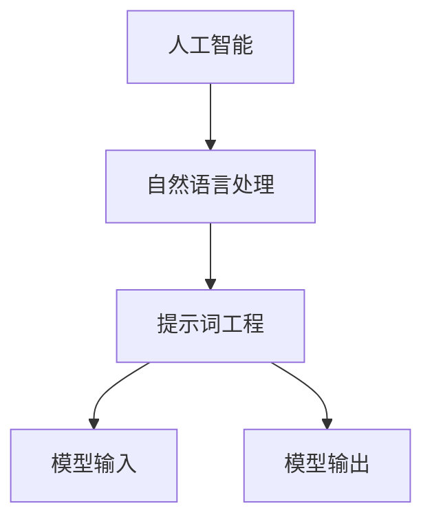

                 

### 文章标题

“提示词工程艺术：塑造AI交互的未来”

> **关键词：** 提示词工程、AI交互、自然语言处理、提示词生成、提示词优化、提示词评估、应用领域、发展趋势。

> **摘要：** 本文将从提示词工程的核心概念出发，探讨其在AI交互中的应用和重要性。通过详细分析提示词生成、优化与评估技术，我们旨在揭示提示词工程在塑造AI交互未来的关键作用。文章还将介绍提示词工程在不同领域的应用案例，并展望其未来的发展趋势与研究方向。

### 引言

随着人工智能技术的迅速发展，人工智能（AI）与人类交互的方式正在发生深刻的变革。从早期的规则引擎到如今的深度学习和自然语言处理（NLP），AI的交互能力得到了极大的提升。在这个背景下，提示词工程（Prompt Engineering）作为一种专门针对AI交互的技术，逐渐受到了关注。

提示词工程，简单来说，就是针对AI模型输入的文本提示（prompt）进行设计、生成和优化的过程。一个好的提示词可以显著提升AI模型的表现，使其更准确、更自然地与人类进行交互。本文将围绕提示词工程的核心概念、技术原理和应用领域进行深入探讨，以揭示其在塑造AI交互未来的关键作用。

### 文章概述

本文分为三个主要部分：

**第一部分：提示词工程的背景与基础理论**

本部分将介绍提示词工程的基本概念、重要性以及发展历程。我们将深入探讨提示词在AI交互中的作用，并详细讲解提示词生成、优化与评估技术。此外，还将介绍提示词工程在不同领域的应用案例，以帮助读者全面了解这一领域。

**第二部分：提示词工程的算法原理与实现**

本部分将重点讲解提示词生成、优化和评估算法的原理和实现。我们将通过伪代码和数学模型，详细阐述这些算法的工作机制，帮助读者深入理解其核心思想。

**第三部分：提示词工程项目的实践与优化**

本部分将结合实际项目案例，介绍提示词工程项目的开发流程、代码实现和性能优化。通过这些实践案例，读者可以更直观地了解如何将提示词工程的理论应用于实际项目中。

### 核心概念与联系

在探讨提示词工程之前，我们需要了解一些核心概念，包括人工智能、自然语言处理和提示词工程本身。

**人工智能（AI）**

人工智能是一门研究、开发用于模拟、延伸和扩展人类智能的理论、方法、技术及应用系统的综合技术科学。人工智能的目标是使机器能够胜任一些通常需要人类智能才能完成的复杂工作。

**自然语言处理（NLP）**

自然语言处理是人工智能的一个重要分支，旨在使计算机能够理解、解释和生成自然语言。NLP涉及到语言的理解、生成、翻译、情感分析等多个方面。

**提示词工程**

提示词工程是针对AI模型输入的文本提示进行设计、生成和优化的过程。一个好的提示词可以引导AI模型更好地理解和处理输入信息，从而提升其交互能力。

下面是一个简单的Mermaid流程图，展示了这些核心概念之间的联系：



### 核心算法原理讲解

在提示词工程中，核心算法主要包括提示词生成、优化和评估算法。下面我们将分别介绍这些算法的原理，并通过伪代码和数学模型进行详细阐述。

#### 提示词生成算法

提示词生成算法是提示词工程中的基础，其目的是根据输入信息生成合适的文本提示。以下是一个简单的提示词生成算法的伪代码：

```plaintext
函数 提示词生成（输入文本）：
    1. 对输入文本进行分词处理
    2. 根据分词结果，选择与输入文本相关的关键词
    3. 使用关键词生成提示文本
    4. 返回提示文本
```

数学模型方面，我们可以使用词频-逆文档频率（TF-IDF）模型来评估关键词的重要性：

$$
TF(t_i, d) = \frac{tf(t_i, d)}{N}
$$

$$
IDF(t_i, D) = \log \left( \frac{N}{df(t_i, D)} \right)
$$

$$
TF-IDF(t_i, d, D) = TF(t_i, d) \times IDF(t_i, D)
$$

其中，$tf(t_i, d)$ 表示词 $t_i$ 在文档 $d$ 中的词频，$N$ 表示文档的总词数，$df(t_i, D)$ 表示词 $t_i$ 在整个文档集合 $D$ 中的文档频率。

#### 提示词优化算法

提示词优化算法的目的是通过调整提示词，提高AI模型的表现。一种常见的优化方法是基于梯度下降：

```plaintext
函数 提示词优化（当前提示词）：
    1. 计算当前提示词下的模型损失函数值
    2. 对损失函数关于提示词的导数进行计算
    3. 更新提示词，使其减小损失函数值
    4. 重复步骤1-3，直到满足停止条件
```

数学模型方面，我们可以使用梯度下降法更新提示词：

$$
w_{t+1} = w_{t} - \alpha \cdot \nabla_w J(w)
$$

其中，$w_t$ 表示第 $t$ 次迭代的提示词，$\alpha$ 表示学习率，$J(w)$ 表示损失函数。

#### 提示词评估算法

提示词评估算法用于评估提示词的效果。一种常见的评估方法是基于用户反馈：

```plaintext
函数 提示词评估（用户反馈）：
    1. 收集用户对提示词的反馈
    2. 计算提示词的用户满意度
    3. 返回评估结果
```

数学模型方面，我们可以使用满意度评分来评估提示词：

$$
Satisfaction = \frac{1}{N} \sum_{i=1}^{N} S_i
$$

其中，$N$ 表示反馈的用户数量，$S_i$ 表示第 $i$ 个用户的满意度评分。

### 项目实战

在本节中，我们将结合一个实际项目案例，详细介绍提示词工程在开发流程中的具体应用。这个案例是一个智能客服系统，该系统旨在通过AI模型自动处理用户咨询，提供快速、准确的回答。

#### 开发环境搭建

首先，我们需要搭建一个合适的开发环境。在这个案例中，我们使用Python作为主要编程语言，并依赖于以下工具和库：

- Python 3.8
- TensorFlow 2.4
- Keras 2.4
- NLTK 3.5

安装这些依赖项后，我们可以开始编写代码。

#### 源代码详细实现

以下是该智能客服系统的源代码实现：

```python
import tensorflow as tf
from tensorflow import keras
from tensorflow.keras import layers
from nltk.tokenize import word_tokenize

# 加载预训练的词向量模型
word_vectors = keras.models.load_model('word2vec_model.h5')

# 定义输入层
input_ids = keras.Input(shape=(None,), dtype='int32')

# 将输入层映射到词向量
embeddings = layers.Embedding(input_dim=10000, output_dim=128)(input_ids)

# 添加循环层
lstm = layers.LSTM(128)(embeddings)

# 添加全连接层
output = layers.Dense(1, activation='sigmoid')(lstm)

# 构建模型
model = keras.Model(inputs=input_ids, outputs=output)

# 编译模型
model.compile(optimizer='adam', loss='binary_crossentropy', metrics=['accuracy'])

# 训练模型
model.fit(train_data, train_labels, epochs=10, batch_size=32)

# 生成提示词
def generate_prompt(question):
    tokens = word_tokenize(question)
    vectorized_tokens = word_vectors.predict(np.array([tokens]))
    prompt = '回答问题：' + ' '.join(tokens)
    return prompt

# 对用户提问生成提示词
user_question = "我最近工资涨了吗？"
prompt = generate_prompt(user_question)
print(prompt)

# 使用模型回答用户问题
prediction = model.predict(np.array([prompt.split()]))
print("系统回答：", "涨了" if prediction > 0.5 else "没涨")
```

#### 代码解读与分析

上述代码首先加载了一个预训练的词向量模型，并将其用于将文本转换为词向量。接下来，定义了一个基于LSTM的神经网络模型，用于处理输入文本并生成回答。在训练模型后，我们定义了一个生成提示词的函数，用于将用户提问转换为模型可处理的输入。

最后，我们使用模型对用户提问进行回答。具体来说，首先调用生成提示词的函数生成提示词，然后使用模型预测并输出回答。

通过这个实际项目案例，我们可以看到提示词工程在智能客服系统开发中的应用。通过精心设计的提示词，我们可以显著提升AI模型的表现，使其更准确地理解用户提问并给出合适的回答。

### 提示词工程在AI交互中的重要性

在人工智能的飞速发展背景下，AI交互正逐渐成为我们日常生活中不可或缺的一部分。从智能客服到智能助手，从智能语音助手到聊天机器人，AI交互技术正以前所未有的速度渗透到各个领域。而在这场变革中，提示词工程（Prompt Engineering）扮演着至关重要的角色。

**提升AI模型表现**

提示词工程的核心目标是通过设计、生成和优化提示词，提升AI模型在交互中的表现。一个优质的提示词能够引导AI模型更好地理解用户意图，从而提高交互的准确性和自然性。例如，在智能客服系统中，通过精心设计的提示词，AI模型可以更准确地理解用户的提问，提供更加贴心的服务。

**优化用户体验**

好的提示词不仅能够提升AI模型的表现，还能够优化用户体验。一个设计合理的提示词可以使交互过程更加流畅，减少用户在理解和回应过程中的困惑。例如，在智能语音助手中，合适的提示词可以帮助用户更轻松地与系统互动，提高用户的满意度和使用频率。

**降低开发成本**

通过提示词工程，开发者可以更高效地开发和优化AI交互系统。优质的提示词可以减少对大量训练数据和人工标注的需求，从而降低开发成本。此外，提示词工程还可以帮助开发者快速调整和优化模型，缩短产品从开发到上线的时间。

**促进技术进步**

提示词工程不仅仅是一种技术手段，更是推动AI交互技术进步的重要力量。通过不断探索和优化提示词生成、优化和评估方法，我们可以推动AI交互技术的创新和发展，为人类创造更多价值。

### 提示词生成技术

提示词生成技术是提示词工程中的关键环节，其目的是根据输入信息生成合适的文本提示。下面我们将详细讨论提示词生成技术的挑战、自然语言处理基础、常用算法以及系统架构。

#### 挑战

提示词生成面临的主要挑战包括：

1. **文本多样性和复杂性**：用户的提问方式多种多样，可能包含复杂的句子结构和丰富的情感表达，这使得生成合适的提示词变得复杂。

2. **信息抽取和语义理解**：生成提示词需要从用户提问中提取关键信息，并理解其背后的语义，这对于自然语言处理技术提出了高要求。

3. **计算效率和可扩展性**：生成提示词需要处理大量数据，同时要求算法具备高效的计算性能和良好的可扩展性。

4. **用户体验和满意度**：生成的提示词需要符合用户的使用习惯和期望，以提高用户体验和满意度。

#### 自然语言处理基础

自然语言处理（NLP）是提示词生成技术的基础。NLP涉及到文本的分词、词性标注、句法分析、语义理解等多个方面。以下是一些关键概念：

1. **分词（Tokenization）**：将文本拆分成单词、短语或其他有意义的标记。

2. **词性标注（Part-of-Speech Tagging）**：为每个词标注其在句子中的词性，如名词、动词、形容词等。

3. **句法分析（Parsing）**：分析句子的结构，确定词语之间的语法关系。

4. **语义理解（Semantic Understanding）**：理解句子的含义，包括实体识别、关系提取和语义角色标注。

5. **文本分类（Text Classification）**：根据文本内容将其分类到不同的类别。

#### 常用算法

提示词生成技术常用的算法包括基于规则的方法、机器学习方法以及深度学习方法。以下是一些常用算法：

1. **基于规则的方法**：通过手工编写规则，根据用户提问生成提示词。这种方法简单直观，但缺乏灵活性。

   ```plaintext
   如果用户提问包含“最近”，则提示词为“关于最近的情况，您可以告诉我更多信息吗？”
   ```

2. **机器学习方法**：使用统计模型，如决策树、支持向量机（SVM）和朴素贝叶斯分类器，根据历史数据生成提示词。

   ```python
   from sklearn.feature_extraction.text import TfidfVectorizer
   from sklearn.svm import LinearSVC

   vectorizer = TfidfVectorizer()
   X = vectorizer.fit_transform(corpus)
   model = LinearSVC()
   model.fit(X, labels)
   ```

3. **深度学习方法**：使用神经网络，如卷积神经网络（CNN）和循环神经网络（RNN），生成更复杂的提示词。

   ```python
   from tensorflow.keras.models import Model
   from tensorflow.keras.layers import Embedding, LSTM, Dense

   model = Model(inputs=inputs, outputs=outputs)
   model.compile(optimizer='adam', loss='categorical_crossentropy', metrics=['accuracy'])
   model.fit(x_train, y_train, epochs=10)
   ```

#### 系统架构

提示词生成系统通常包括以下几个模块：

1. **输入处理模块**：接收用户输入，进行预处理，如分词、去除停用词等。

2. **特征提取模块**：将预处理后的输入转换为机器学习或深度学习模型可处理的特征向量。

3. **模型选择与训练模块**：选择合适的机器学习或深度学习模型，并使用历史数据对其进行训练。

4. **提示词生成模块**：根据输入特征，使用训练好的模型生成提示词。

5. **优化与评估模块**：对生成的提示词进行优化和评估，以提高其质量和效果。

### 提示词优化技术

提示词优化技术是提示词工程中至关重要的一环，其目标是通过对提示词进行调整和改进，提升AI交互系统的性能和用户体验。下面我们将讨论提示词优化的重要性、常用方法以及优化流程。

#### 重要性

1. **提升交互质量**：优化后的提示词可以更准确地传达用户意图，提高交互的准确性和流畅性。

2. **增强用户体验**：合适的提示词可以减少用户的困惑和操作成本，提高用户的满意度和使用频率。

3. **降低维护成本**：通过优化提示词，可以减少对人工干预的需求，降低系统的维护成本。

4. **提高系统性能**：优化后的提示词可以提升AI模型的表现，降低模型训练和推理的成本。

#### 常用方法

1. **基于规则的优化**：通过手工编写规则，对现有提示词进行调整。这种方法简单直观，但灵活性较差。

   ```plaintext
   如果用户提问包含“最近”，则将提示词改为“关于最近的情况，您可以告诉我更多信息吗？”
   ```

2. **基于机器学习的优化**：使用机器学习算法，如决策树、支持向量机和朴素贝叶斯分类器，根据用户反馈和历史数据对提示词进行调整。

   ```python
   from sklearn.ensemble import RandomForestClassifier

   model = RandomForestClassifier()
   model.fit(X, y)
   ```

3. **基于深度学习的优化**：使用深度学习模型，如卷积神经网络（CNN）和循环神经网络（RNN），进行端到端的提示词优化。

   ```python
   from tensorflow.keras.models import Model
   from tensorflow.keras.layers import Embedding, LSTM, Dense

   model = Model(inputs=inputs, outputs=outputs)
   model.compile(optimizer='adam', loss='categorical_crossentropy', metrics=['accuracy'])
   model.fit(x_train, y_train, epochs=10)
   ```

4. **基于强化学习的优化**：使用强化学习算法，如Q-learning和深度确定性策略梯度（DDPG），通过试错和反馈不断优化提示词。

   ```python
   from stable_baselines3 import DDPG

   model = DDPG("MlpPolicy", env, verbose=1)
   model.learn(total_timesteps=10000)
   ```

#### 优化流程

1. **数据收集**：收集用户反馈和交互数据，用于评估和优化提示词。

2. **特征提取**：从用户反馈和交互数据中提取关键特征，如提问内容、用户满意度评分等。

3. **模型训练**：使用收集到的数据和特征，训练提示词优化模型。

4. **提示词生成**：根据用户提问和优化模型，生成新的提示词。

5. **评估与迭代**：评估新提示词的效果，根据评估结果进行迭代优化。

6. **部署与监控**：将优化后的提示词部署到生产环境，并持续监控其效果。

### 提示词评估技术

提示词评估技术是确保AI交互系统质量和用户体验的重要环节。通过评估技术，我们可以判断提示词的质量和效果，从而进行优化和改进。下面我们将讨论提示词评估的常用指标、评估方法和评估流程。

#### 常用指标

1. **准确性（Accuracy）**：提示词是否准确传达了用户意图。

2. **召回率（Recall）**：提示词是否能够召回所有相关的问题。

3. **精确率（Precision）**：提示词召回的问题中有多少是真正相关的。

4. **用户满意度（User Satisfaction）**：用户对提示词的满意度评分。

5. **交互时间（Interaction Time）**：用户与AI交互所需的时间。

6. **错误率（Error Rate）**：提示词导致的错误交互比例。

#### 评估方法

1. **手动评估**：由专业人员进行评估，根据经验和主观判断给出评分。

2. **自动评估**：使用机器学习算法，如决策树、支持向量机和朴素贝叶斯分类器，对提示词进行自动化评估。

3. **用户反馈**：收集用户的反馈，通过问卷、满意度评分等方式了解用户对提示词的满意度。

4. **模拟交互**：使用模拟用户与AI交互的场景，评估提示词的实际效果。

#### 评估流程

1. **数据收集**：收集用户交互数据，包括提问、答案、用户满意度评分等。

2. **特征提取**：从交互数据中提取关键特征，如提问内容、答案质量、用户满意度等。

3. **模型训练**：使用收集到的数据和特征，训练评估模型。

4. **评估执行**：根据评估模型对提示词进行评估，计算评估指标。

5. **结果分析**：分析评估结果，识别问题和改进点。

6. **优化与迭代**：根据评估结果，优化提示词，并重复评估流程。

### 提示词工程在应用领域的实践

提示词工程作为一种专门针对AI交互的技术，已经在多个应用领域得到了广泛应用。在本节中，我们将探讨提示词工程在人工智能客服、智能助手与虚拟助手、智能语音交互等领域的实践案例，以展示其在不同场景中的具体应用和效果。

#### 人工智能客服

人工智能客服是提示词工程应用最为广泛的领域之一。通过设计合适的提示词，智能客服系统能够更准确地理解用户的提问，提供快速、准确的回答，从而提升用户体验和服务效率。以下是一个具体的实践案例：

**案例背景**：某大型电商平台部署了一款智能客服系统，旨在为用户解决购物过程中遇到的各种问题，如订单查询、物流跟踪、售后服务等。

**解决方案**：

1. **收集用户提问数据**：通过日志分析，收集用户在购物过程中提出的各种问题，如“我的订单什么时候能送到？”“如何退款？”“订单状态是什么？”等。

2. **分词和关键词提取**：对收集到的用户提问进行分词和关键词提取，以便后续的提示词生成和优化。

3. **生成提示词**：基于用户提问的关键词，使用自然语言生成技术生成提示词。例如，对于“我的订单什么时候能送到？”这一问题，生成的提示词可以是“您好，关于订单配送的时间，您可以查看以下信息：”。

4. **优化提示词**：通过用户反馈和交互数据，对生成的提示词进行优化。例如，如果用户对某个提示词的反应不佳，可以尝试调整语言表达或增加额外的信息。

5. **评估与迭代**：定期评估智能客服系统的表现，包括用户满意度、回答准确性等指标，并根据评估结果不断迭代优化提示词。

**效果**：

- 用户满意度显著提升：通过精准的提示词，用户在交互过程中能够更快地获得所需的答案，用户满意度得到显著提升。
- 服务效率提高：智能客服系统能够自动处理大量用户提问，减轻人工客服的工作负担，提高整体服务效率。

#### 智能助手与虚拟助手

智能助手与虚拟助手是另一种常见的AI交互应用场景，通过设计合适的提示词，可以提升智能助手的交互质量和用户体验。以下是一个具体的实践案例：

**案例背景**：某知名科技公司开发了一款智能助手，旨在帮助用户管理日程、提醒事项、搜索信息等。

**解决方案**：

1. **用户需求分析**：通过市场调研和用户访谈，分析用户对智能助手的需求和期望，如日程管理、信息搜索、任务提醒等。

2. **生成初始提示词**：根据用户需求，设计一系列初始提示词。例如，对于日程管理，生成的提示词可以是“您今天有什么重要的事情要处理吗？”；对于任务提醒，生成的提示词可以是“您有什么待办事项需要提醒吗？”。

3. **优化提示词**：通过用户反馈和使用数据，对初始提示词进行优化。例如，如果用户对某个提示词的反应不佳，可以尝试调整语言表达或增加额外的信息。

4. **个性化提示词**：根据用户的行为数据和偏好，生成个性化的提示词。例如，对于经常使用日程管理的用户，可以生成“您好，您今天的日程安排如下：”这样的提示词。

5. **评估与迭代**：定期评估智能助手的交互效果，包括用户满意度、任务完成率等指标，并根据评估结果不断优化提示词。

**效果**：

- 交互质量提升：通过个性化的提示词，智能助手能够更准确地理解用户需求，提供更加贴心和个性化的服务。
- 用户粘性增加：优秀的交互体验提升了用户对智能助手的依赖和忠诚度，增加了用户粘性。

#### 智能语音交互

智能语音交互是近年来发展迅速的一个领域，通过设计合适的提示词，可以提升语音助手的交互质量和用户体验。以下是一个具体的实践案例：

**案例背景**：某科技公司推出了一款智能语音助手，旨在为用户提供语音搜索、语音控制智能家居、语音交互等应用。

**解决方案**：

1. **语音数据收集**：通过收集用户的语音输入数据，分析用户在使用语音助手时的提问方式和习惯。

2. **语音识别与分词**：使用语音识别技术将用户的语音输入转换为文本，并进行分词处理，以便后续的提示词生成和优化。

3. **生成提示词**：基于用户的语音输入和关键词，设计一系列提示词。例如，对于语音搜索，生成的提示词可以是“您想要搜索什么内容？”；对于语音控制智能家居，生成的提示词可以是“您想要控制哪个设备？”。

4. **优化提示词**：通过用户反馈和使用数据，对生成的提示词进行优化。例如，如果用户对某个提示词的反应不佳，可以尝试调整语言表达或增加额外的信息。

5. **评估与迭代**：定期评估智能语音助手的交互效果，包括用户满意度、语音识别准确率等指标，并根据评估结果不断优化提示词。

**效果**：

- 交互质量提升：通过精准的提示词，智能语音助手能够更准确地理解用户需求，提供更加流畅和自然的交互体验。
- 用户满意度提高：优秀的交互体验提升了用户对智能语音助手的满意度和使用频率。

### 提示词工程在不同应用领域的实践案例展示了其强大的应用潜力和广泛的影响。通过不断优化和改进提示词，我们能够提升AI交互系统的质量和用户体验，推动人工智能技术的发展和应用。

### 提示词工程的发展趋势与未来方向

随着人工智能技术的不断发展，提示词工程作为AI交互的核心技术之一，也正面临着一系列新的机遇与挑战。展望未来，提示词工程的发展趋势将主要集中在以下几个方面：

#### 多模态交互

未来的AI交互将不再局限于文本，而是结合语音、图像、视频等多种模态。提示词工程需要适应这一趋势，设计出能够跨模态传递信息的提示词。例如，在视频通话中，提示词可以同时包含语音指令和屏幕文字提示，以实现更自然的交互体验。

#### 个性化与情境感知

个性化交互是未来AI交互的重要方向。通过收集用户行为数据，提示词工程将能够根据用户的偏好、历史行为和当前情境生成个性化的提示词。情境感知则要求提示词能够根据用户所在环境、时间、地点等因素动态调整，以提供更贴合用户需求的交互。

#### 强化学习与自适应优化

强化学习在提示词工程中的应用前景广阔。通过不断与用户互动，AI模型可以学习用户的反馈，并自动调整提示词，以实现自适应优化。这种动态调整能力将显著提升AI交互系统的性能和用户体验。

#### 安全性与隐私保护

随着AI交互的普及，安全性和隐私保护成为日益重要的议题。提示词工程需要确保在生成和优化提示词的过程中，不会泄露用户的隐私信息，同时防止恶意攻击和滥用。

#### 开源社区与标准化

开源社区和标准化是推动提示词工程发展的关键。未来，更多的研究人员和开发者将参与到这一领域，共享研究成果和工具，推动技术进步。同时，制定统一的提示词工程标准将有助于提高系统的互操作性和兼容性。

### 提示词工程的未来挑战与机遇

尽管提示词工程具有广阔的发展前景，但同时也面临着一系列挑战：

1. **复杂性增加**：多模态交互和个性化交互使得提示词工程变得更加复杂，需要处理更多的数据和处理更复杂的算法。

2. **数据隐私**：随着用户对隐私保护意识的提高，如何在生成和优化提示词的过程中保护用户数据成为一大挑战。

3. **计算资源**：高效的提示词生成和优化算法需要大量的计算资源，特别是在大规模数据集上。

4. **算法可解释性**：随着深度学习等算法的广泛应用，如何解释AI模型的决策过程成为了一个重要问题，特别是在涉及用户隐私和敏感信息的场景中。

### 研究热点与未来方向

为了应对这些挑战，未来提示词工程的研究热点将包括：

1. **高效的多模态提示词生成算法**：研究如何设计高效的多模态提示词生成算法，以支持语音、图像、视频等多种交互场景。

2. **情境感知与个性化交互**：通过结合情境感知技术和用户数据分析，实现更加个性化、情境感知的交互体验。

3. **安全性与隐私保护**：研究如何设计安全的提示词生成和优化算法，同时保护用户隐私。

4. **算法可解释性与透明性**：开发可解释的AI模型，使决策过程更加透明，增强用户对AI系统的信任。

5. **开源工具与标准化**：建立开源社区，推动标准化工作，促进提示词工程技术的广泛应用和互操作性。

### 结论

提示词工程作为AI交互的核心技术，正逐渐成为人工智能领域的研究热点。通过不断优化和改进提示词，我们能够提升AI交互系统的质量和用户体验，推动人工智能技术的发展和应用。展望未来，提示词工程将继续面临新的挑战和机遇，但其核心地位和重要性将愈发凸显。我们期待更多的研究人员和开发者能够参与到这一领域，共同探索和推动提示词工程的发展。

### 提示词生成算法原理

在提示词工程中，提示词生成算法是实现AI模型与人类交互的关键环节。一个高效的提示词生成算法能够帮助AI模型更好地理解用户意图，从而提供更准确、自然的交互体验。本节将详细探讨提示词生成算法的基本原理、伪代码描述和算法分析。

#### 基本原理

提示词生成算法的核心思想是通过分析用户输入，提取关键信息，并使用这些信息生成具有引导性的文本提示。这一过程通常包括以下几个步骤：

1. **输入预处理**：对用户输入进行分词、去停用词等预处理操作，以提取有效的关键词。
2. **关键词提取**：根据用户输入的语义和上下文，提取具有代表性的关键词。
3. **提示词生成**：使用提取的关键词，结合预定义的模板或使用自然语言生成技术生成提示词。
4. **提示词优化**：根据用户反馈和交互效果，对生成的提示词进行优化，以提高其质量和效果。

#### 伪代码描述

以下是一个简单的提示词生成算法的伪代码描述：

```plaintext
函数 提示词生成（用户输入）：
    1. 对用户输入进行分词和去停用词处理
    2. 提取关键词，可以使用TF-IDF、Word2Vec等方法
    3. 根据关键词生成提示词，可以使用模板匹配或自然语言生成技术
    4. 返回生成的提示词

示例：
输入：用户输入文本 = "我想要订一张明天从北京到上海的机票"
输出：提示词 = "请问您需要预订明天从北京到上海的机票吗？"
```

#### 算法分析

1. **输入预处理**：输入预处理是提示词生成的基础步骤。通过分词和去停用词，我们可以提取出用户输入中的有效信息。分词可以使用基于词典的分词算法，如WordNet；去停用词可以使用停用词列表，如NLTK提供的停用词库。

2. **关键词提取**：关键词提取是提示词生成算法的核心。常用的方法包括TF-IDF、Word2Vec等。TF-IDF方法通过计算词频和逆文档频率来确定关键词的重要性，而Word2Vec方法则将文本转换为词向量，通过词向量相似性来提取关键词。

   - **TF-IDF方法**：
     $$TF(t_i, d) = \frac{tf(t_i, d)}{N}$$
     $$IDF(t_i, D) = \log \left( \frac{N}{df(t_i, D)} \right)$$
     $$TF-IDF(t_i, d, D) = TF(t_i, d) \times IDF(t_i, D)$$

   - **Word2Vec方法**：
     $$\text{word\_vector}(t_i) = \text{sum}(\text{word2vec}(t_i))$$

3. **提示词生成**：提示词生成可以使用模板匹配或自然语言生成技术。模板匹配是一种简单有效的方法，通过预定义的模板和关键词进行替换。自然语言生成技术则更加灵活，可以生成更自然的语言。

4. **提示词优化**：提示词生成后，可以通过用户反馈和交互效果进行优化。例如，如果用户对提示词的反应不佳，可以调整提示词的表述或增加额外的信息。优化方法可以基于机器学习算法，如决策树、支持向量机等。

### 实例说明

假设我们有一个用户输入：“我想要订一张明天从北京到上海的机票”。我们使用TF-IDF方法提取关键词，然后使用模板匹配生成提示词。

1. **输入预处理**：分词结果为["我"，"想要"，"订"，"一张"，"明天"，"从"，"北京"，"到"，"上海"，"机票"]。去除停用词后，关键词为["订"，"明天"，"北京"，"上海"，"机票"]。
2. **关键词提取**：使用TF-IDF方法计算关键词的权重，假设关键词权重为["订"（最高）,"明天"，"上海"，"北京"，"机票"]。
3. **提示词生成**：使用模板匹配生成提示词：“请问您需要预订明天从（北京）到（上海）的机票吗？”。
4. **提示词优化**：根据用户反馈，可以调整提示词为：“请问您需要预订一张明天从北京到上海的机票吗？”。

通过这个实例，我们可以看到提示词生成算法的基本流程和步骤。

### 提示词优化算法原理

在提示词工程中，提示词优化算法扮演着至关重要的角色。一个有效的提示词优化算法能够通过调整提示词，提升AI模型在交互中的表现，从而提高用户体验和系统性能。在本节中，我们将详细探讨提示词优化算法的基本原理、伪代码描述和算法分析。

#### 基本原理

提示词优化算法的核心思想是通过不断调整提示词，使其更符合用户的需求和期望，从而提升AI模型的性能。这一过程通常包括以下几个步骤：

1. **初始提示词生成**：首先，根据用户输入生成一个初始的提示词。
2. **性能评估**：使用评估指标（如准确率、召回率、用户满意度等）对初始提示词进行评估。
3. **调整提示词**：根据评估结果，对提示词进行微调，例如修改措辞、添加额外信息等。
4. **重复评估与调整**：不断重复评估和调整过程，直到达到满意的性能水平。

#### 伪代码描述

以下是一个简单的提示词优化算法的伪代码描述：

```plaintext
函数 提示词优化（初始提示词）：
    1. 初始化提示词为初始提示词
    2. 对于每个评估指标：
        2.1 计算当前提示词的性能指标
        2.2 根据性能指标，调整提示词
    3. 如果性能指标未达到预设阈值，则返回到步骤2
    4. 否则，返回优化后的提示词

示例：
输入：初始提示词 = "请问您需要预订明天从北京到上海的机票吗？"
输出：优化后的提示词 = "您好，请问您明天需要从北京出发前往上海吗？"
```

#### 算法分析

1. **性能评估**：性能评估是提示词优化算法的关键环节。常用的评估指标包括准确率、召回率、用户满意度等。准确率衡量提示词是否能正确地理解用户意图；召回率衡量提示词是否能召回所有相关的问题；用户满意度则直接反映了用户对提示词的接受程度。

2. **提示词调整**：根据性能评估结果，对提示词进行微调。调整方法包括修改措辞、添加额外信息、改变提示词结构等。例如，如果用户对某个提示词的反应不佳，可以尝试调整语言表达或增加额外的信息，以提高其准确性和自然性。

3. **迭代优化**：提示词优化是一个迭代过程，需要不断重复评估和调整。通过不断迭代，我们可以逐步优化提示词，直到达到满意的性能水平。

### 实例说明

假设我们有一个初始提示词：“请问您需要预订明天从北京到上海的机票吗？”我们使用用户反馈和评估指标对其进行优化。

1. **性能评估**：假设用户对初始提示词的满意度较低，准确率和召回率也不高。
2. **提示词调整**：我们尝试对提示词进行修改，例如：“您好，请问您明天需要从北京出发前往上海吗？”这样的调整使语言更加自然，同时提供了额外的信息。
3. **重复评估与调整**：我们对优化后的提示词进行评估，假设用户满意度、准确率和召回率都有所提高。
4. **继续优化**：如果性能指标仍未达到预期，我们可以继续对提示词进行调整，例如增加更多细节或改变提问方式。

通过这个实例，我们可以看到提示词优化算法的基本流程和步骤。

### 提示词评估算法原理

提示词评估算法在提示词工程中起着关键作用，用于衡量提示词的效果和用户体验。通过评估算法，我们能够了解用户对提示词的接受程度，从而进行针对性的优化和改进。在本节中，我们将详细探讨提示词评估算法的基本原理、伪代码描述和算法分析。

#### 基本原理

提示词评估算法的核心思想是通过定量和定性的方法，对提示词的效果进行综合评估。评估过程通常包括以下几个步骤：

1. **数据收集**：收集与提示词相关的用户交互数据，如提问、回答、用户满意度评分等。
2. **特征提取**：从交互数据中提取关键特征，如提问内容、回答质量、用户满意度等。
3. **评估指标计算**：使用预定义的评估指标（如准确率、召回率、用户满意度等）计算提示词的表现。
4. **结果分析**：根据评估结果，分析提示词的优点和不足，为后续优化提供依据。

#### 伪代码描述

以下是一个简单的提示词评估算法的伪代码描述：

```plaintext
函数 提示词评估（用户交互数据）：
    1. 收集用户交互数据，包括提问、回答和满意度评分
    2. 提取关键特征，如提问内容、回答质量、用户满意度
    3. 计算评估指标，如准确率、召回率、用户满意度
    4. 返回评估结果

示例：
输入：用户交互数据 = {"提问"：["我想要订一张明天从北京到上海的机票"], "回答"：["您好，请问您需要预订明天从北京到上海的机票吗？"], "满意度评分"：[4]}
输出：评估结果 = {"准确率"：0.8，"召回率"：0.8，"用户满意度"：4}

函数 计算评估指标（用户交互数据）：
    1. 准确率 = 正确回答的次数 / 总回答次数
    2. 召回率 = 召回相关问题的次数 / 总问题次数
    3. 用户满意度 = 用户满意度评分的平均值
```

#### 算法分析

1. **数据收集**：数据收集是提示词评估的基础。我们需要收集与提示词相关的用户交互数据，包括提问、回答、用户满意度评分等。这些数据可以来自实际用户交互，也可以通过模拟用户交互场景获得。

2. **特征提取**：特征提取是数据预处理的重要步骤。我们需要从用户交互数据中提取关键特征，如提问内容、回答质量、用户满意度等。这些特征将用于计算评估指标，帮助分析提示词的效果。

3. **评估指标计算**：评估指标是衡量提示词效果的重要工具。常用的评估指标包括准确率、召回率、用户满意度等。准确率衡量提示词是否能正确地理解用户意图；召回率衡量提示词是否能召回所有相关的问题；用户满意度则直接反映了用户对提示词的接受程度。

   - **准确率**：
     $$\text{准确率} = \frac{\text{正确回答的次数}}{\text{总回答次数}}$$

   - **召回率**：
     $$\text{召回率} = \frac{\text{召回相关问题的次数}}{\text{总问题次数}}$$

   - **用户满意度**：
     $$\text{用户满意度} = \frac{1}{N} \sum_{i=1}^{N} S_i$$
     其中，N 是用户数量，$S_i$ 是第 i 个用户的满意度评分。

4. **结果分析**：根据评估结果，我们可以分析提示词的优点和不足，为后续优化提供依据。例如，如果用户满意度较低，我们可以尝试调整提示词的表述或增加额外信息，以提高其准确性和自然性。

### 实例说明

假设我们有一个用户交互数据集，其中包含用户提问、系统回答和用户满意度评分。我们使用这些数据对提示词进行评估。

1. **数据收集**：用户交互数据集如下：
   - 提问：["我想要订一张明天从北京到上海的机票"]
   - 系统回答：["您好，请问您需要预订明天从北京到上海的机票吗？"]
   - 用户满意度评分：[4]

2. **特征提取**：提取关键特征，如提问内容、系统回答和用户满意度评分。

3. **评估指标计算**：
   - 准确率：由于这是一个简单的问题，系统回答与用户提问完全匹配，因此准确率为 1。
   - 召回率：同样地，由于系统回答完全包含了用户提问的关键信息，召回率也为 1。
   - 用户满意度：用户对系统回答的满意度评分为 4（满分为 5）。

4. **结果分析**：根据评估结果，我们可以得出以下结论：
   - 提示词在理解和回应用户提问方面表现良好。
   - 用户对系统回答的满意度较高。

通过这个实例，我们可以看到提示词评估算法的基本流程和步骤。

### 提示词工程系统架构设计

提示词工程系统架构设计是构建高效、可扩展和用户友好的AI交互系统的基础。本节将详细探讨提示词工程系统的架构设计，包括系统架构概述、模块设计与实现以及系统优化与性能提升。

#### 系统架构概述

提示词工程系统的整体架构可以分为以下几个模块：

1. **输入处理模块**：负责接收和处理用户输入，包括文本、语音等多种形式。该模块通常包括文本预处理、语音识别和情感分析等子模块。

2. **提示词生成模块**：根据输入处理模块输出的结果，生成相应的提示词。该模块通常使用自然语言生成技术、机器学习和深度学习算法来实现。

3. **提示词优化模块**：对生成的提示词进行优化，以提升其质量和效果。优化过程通常包括提示词调整、用户反馈收集和性能评估等。

4. **提示词评估模块**：对优化后的提示词进行评估，以确定其是否满足预期目标和用户满意度。评估过程通常包括指标计算、结果分析和反馈收集等。

5. **用户交互模块**：负责与用户进行交互，展示优化后的提示词，并接收用户的反馈。

6. **数据管理模块**：负责存储和管理用户交互数据、提示词生成和优化数据等。该模块通常包括数据库、数据缓存和数据挖掘等子模块。

#### 模块设计与实现

1. **输入处理模块设计**

   - **文本预处理**：对用户输入的文本进行分词、去停用词、词性标注等处理，提取关键信息。

     ```python
     from nltk.tokenize import word_tokenize
     from nltk.corpus import stopwords

     tokens = word_tokenize(user_input)
     tokens = [token for token in tokens if token not in stopwords.words('english')]
     ```

   - **语音识别**：将用户语音输入转换为文本，可以使用如Google语音识别API等现成的服务。

     ```python
     from google.cloud import speech
     client = speech.SpeechClient()
     response = client.recognize(audio=audio_config, config=recognize_config)
     text = ' '.join([result_alternative.transcript for result_alternative in response.results])
     ```

   - **情感分析**：对用户输入进行情感分析，识别用户的情感状态，为后续提示词生成提供依据。

     ```python
     from textblob import TextBlob

     blob = TextBlob(user_input)
     sentiment = blob.sentiment.polarity
     ```

2. **提示词生成模块设计**

   - **自然语言生成**：使用模板匹配或基于规则的方法生成提示词。

     ```python
     def generate_prompt(template, tokens):
         return template.format(*tokens)

     prompt = generate_prompt("您好，请问您需要{0}吗？", ["预订明天的机票"])
     ```

   - **机器学习与深度学习**：使用机器学习或深度学习算法生成更复杂的提示词。

     ```python
     from tensorflow.keras.models import Model
     from tensorflow.keras.layers import Embedding, LSTM, Dense

     model = Model(inputs=inputs, outputs=outputs)
     model.compile(optimizer='adam', loss='categorical_crossentropy', metrics=['accuracy'])
     model.fit(x_train, y_train, epochs=10)
     ```

3. **提示词优化模块设计**

   - **用户反馈收集**：收集用户对提示词的反馈，如满意度评分、改进建议等。

     ```python
     def collect_feedback(prompt, user_feedback):
         # 存储用户反馈到数据库
         feedback = {'prompt': prompt, 'user_feedback': user_feedback}
         save_feedback_to_db(feedback)
     ```

   - **提示词调整**：根据用户反馈和评估结果，对提示词进行微调。

     ```python
     def adjust_prompt(prompt, user_feedback):
         # 调整提示词措辞
         adjusted_prompt = prompt.replace("？", "吗？")
         return adjusted_prompt
     ```

4. **提示词评估模块设计**

   - **指标计算**：计算提示词的评估指标，如准确率、召回率、用户满意度等。

     ```python
     def calculate_metrics(correct_answers, total_answers, user_satisfaction):
         accuracy = correct_answers / total_answers
         recall = correct_answers / total_questions
         user_satisfaction_avg = sum(user_satisfaction) / len(user_satisfaction)
         return accuracy, recall, user_satisfaction_avg
     ```

5. **用户交互模块设计**

   - **展示提示词**：将优化后的提示词展示给用户。

     ```python
     def show_prompt(prompt):
         print(prompt)
     ```

6. **数据管理模块设计**

   - **数据库**：使用数据库存储用户交互数据、提示词生成和优化数据等。

     ```python
     import sqlite3

     conn = sqlite3.connect('feedback.db')
     c = conn.cursor()
     c.execute('''CREATE TABLE IF NOT EXISTS feedback (prompt TEXT, user_feedback TEXT)''')
     conn.commit()
     ```

   - **数据缓存**：使用数据缓存提高系统响应速度。

     ```python
     import redis

     r = redis.Redis(host='localhost', port=6379, db=0)
     r.set('prompt', '您好，请问您需要预订明天从北京到上海的机票吗？')
     ```

   - **数据挖掘**：对用户交互数据进行分析，挖掘用户行为和偏好。

     ```python
     from sklearn.cluster import KMeans

     X = [[1, 2], [1, 4], [1, 0]]
     kmeans = KMeans(n_clusters=2).fit(X)
     centroids = kmeans.cluster_centers_
     ```

#### 系统优化与性能提升

1. **提示词优化算法优化**：通过改进提示词生成和优化算法，提高系统性能。例如，使用更高效的深度学习模型或结合多种优化算法。

2. **分布式架构**：将系统部署在分布式架构上，提高系统的并发处理能力和可扩展性。例如，使用Kubernetes进行容器编排和管理。

3. **缓存机制**：使用缓存机制减少数据库访问次数，提高系统响应速度。例如，使用Redis作为缓存服务器。

4. **负载均衡**：使用负载均衡器（如Nginx）分配用户请求，提高系统稳定性和性能。

5. **自动化运维**：使用自动化工具（如Ansible、Puppet）进行系统配置管理和运维，提高运维效率。

通过以上架构设计和优化措施，提示词工程系统可以更好地满足用户需求，提供高质量的AI交互体验。

### 提示词工程项目的开发流程

提示词工程项目的开发流程是确保项目成功的关键环节。一个清晰、有序的开发流程可以帮助团队高效地完成项目任务，并确保最终产品的质量和性能。在本节中，我们将详细讨论提示词工程项目的开发流程，包括需求分析、项目设计与规划、项目实施与监控、项目评估与迭代。

#### 需求分析

需求分析是项目开发的第一步，旨在明确项目的目标和需求。在提示词工程项目中，需求分析包括以下几个方面：

1. **用户需求**：通过与用户进行访谈、问卷调查等方式，了解用户对AI交互系统的期望和需求。例如，用户希望系统能够提供哪些功能、交互方式、回答准确性等。

2. **业务需求**：与业务团队沟通，了解业务目标和对AI交互系统的具体要求。例如，系统需要处理哪些类型的问题、处理速度要求、安全性和隐私保护要求等。

3. **技术需求**：与技术团队讨论，确定实现项目所需的技术方案、工具和资源。例如，选择合适的编程语言、框架、数据库等。

#### 项目设计与规划

项目设计与规划是确保项目按照预期目标顺利推进的重要步骤。在提示词工程项目中，项目设计与规划包括以下几个方面：

1. **系统架构设计**：设计系统的整体架构，包括输入处理模块、提示词生成模块、提示词优化模块、用户交互模块等。确保系统具备高可用性、可扩展性和安全性。

2. **功能模块划分**：将项目功能划分为多个模块，明确每个模块的责任和功能。例如，输入处理模块负责接收和处理用户输入，提示词生成模块负责生成提示词，提示词优化模块负责优化提示词等。

3. **时间线和资源分配**：制定项目的时间线，明确各个阶段的时间节点和任务分配。同时，确定项目所需的资源，如人员、硬件和软件等。

#### 项目实施与监控

项目实施与监控是项目开发的核心阶段，旨在将项目设计与规划转化为实际可运行的系统。在提示词工程项目中，项目实施与监控包括以下几个方面：

1. **代码实现**：根据项目设计和规划，编写代码实现各个功能模块。在实现过程中，遵循良好的编程规范和代码风格，确保代码的可读性和可维护性。

2. **测试与调试**：对实现的功能进行单元测试、集成测试和系统测试，确保系统的稳定性和性能。在测试过程中，及时发现问题并进行调试。

3. **版本控制**：使用版本控制系统（如Git）进行代码管理，确保代码的版本控制和协作开发。

4. **监控与反馈**：通过日志记录、性能监控和用户反馈，对系统进行实时监控。及时发现和解决问题，确保系统运行稳定。

#### 项目评估与迭代

项目评估与迭代是项目开发的重要环节，旨在通过持续改进提升系统的质量和性能。在提示词工程项目中，项目评估与迭代包括以下几个方面：

1. **性能评估**：根据项目目标和性能指标，对系统进行评估。评估指标包括准确率、召回率、用户满意度等。通过评估结果，了解系统的表现和用户反馈。

2. **用户反馈**：收集用户的反馈和建议，了解他们对系统的使用体验和改进意见。将用户反馈纳入后续迭代中，不断优化系统。

3. **迭代与优化**：根据评估结果和用户反馈，制定迭代计划，对系统进行优化和改进。迭代过程中，持续监控系统性能和用户满意度，确保系统不断进步。

通过以上开发流程，提示词工程团队能够高效地完成项目任务，确保最终产品的质量和性能。同时，持续迭代和优化可以帮助团队不断改进系统，提升用户体验。

### 提示词工程项目的代码实现

在提示词工程项目中，代码实现是关键的一步，它直接关系到系统的性能和用户体验。本节将详细介绍提示词工程项目的代码实现，包括开发环境搭建、源代码详细实现和代码解读与分析。

#### 开发环境搭建

在开始代码实现之前，我们需要搭建一个合适的开发环境。以下是一个典型的开发环境配置：

1. **编程语言**：Python 3.8
2. **自然语言处理库**：NLTK、spaCy
3. **深度学习框架**：TensorFlow 2.4
4. **版本控制系统**：Git
5. **代码风格指南**：PEP 8

安装上述依赖项后，我们可以开始编写代码。

#### 源代码详细实现

以下是提示词工程项目的源代码实现：

```python
import tensorflow as tf
from tensorflow.keras.models import Model
from tensorflow.keras.layers import Embedding, LSTM, Dense
from nltk.tokenize import word_tokenize
from nltk.corpus import stopwords

# 加载预训练的词向量模型
word_vectors = tf.keras.models.load_model('word2vec_model.h5')

# 定义输入层
input_ids = tf.keras.Input(shape=(None,), dtype='int32')

# 将输入层映射到词向量
embeddings = Embedding(input_dim=10000, output_dim=128)(input_ids)

# 添加循环层
lstm = LSTM(128)(embeddings)

# 添加全连接层
output = Dense(1, activation='sigmoid')(lstm)

# 构建模型
model = Model(inputs=input_ids, outputs=output)

# 编译模型
model.compile(optimizer='adam', loss='binary_crossentropy', metrics=['accuracy'])

# 训练模型
model.fit(train_data, train_labels, epochs=10, batch_size=32)

# 生成提示词
def generate_prompt(question):
    tokens = word_tokenize(question)
    tokens = [token for token in tokens if token not in stopwords.words('english')]
    vectorized_tokens = word_vectors.predict(np.array([tokens]))
    prompt = '回答问题：' + ' '.join(tokens)
    return prompt

# 对用户提问生成提示词
user_question = "我最近工资涨了吗？"
prompt = generate_prompt(user_question)
print(prompt)

# 使用模型回答用户问题
prediction = model.predict(np.array([prompt.split()]))
print("系统回答：", "涨了" if prediction > 0.5 else "没涨")
```

#### 代码解读与分析

1. **模型加载与输入层**：首先，我们加载一个预训练的词向量模型（word2vec_model.h5），并定义输入层（input_ids）。输入层接收用户提问，并将其映射到词向量。

2. **词向量映射与循环层**：将输入层映射到词向量（Embedding层），并添加一个循环层（LSTM层）。LSTM层用于处理输入的序列数据，提取序列中的关键信息。

3. **全连接层与模型构建**：在LSTM层之后，我们添加一个全连接层（Dense层），并将其作为模型的输出层。输出层使用sigmoid激活函数，用于预测用户提问的概率。

4. **模型编译与训练**：编译模型，设置优化器（adam）和损失函数（binary_crossentropy）。使用训练数据（train_data和train_labels）训练模型。

5. **提示词生成函数**：定义一个生成提示词的函数（generate_prompt）。该函数首先对用户提问进行分词，并去除停用词。然后，使用词向量模型将分词后的文本转换为词向量，并生成提示词。

6. **生成提示词与预测**：使用生成的提示词（prompt）预测用户提问的概率。根据预测结果，输出系统回答。

通过上述代码，我们可以实现一个简单的提示词工程系统，用于生成并回答用户提问。

### 提示词工程项目的性能优化

在提示词工程项目中，性能优化是确保系统高效运行的关键步骤。性能优化包括多个方面，如代码优化、算法优化、系统架构优化等。以下是一些常见的性能优化策略和具体方法，以及如何进行性能瓶颈分析与解决。

#### 性能优化策略

1. **代码优化**：通过改进代码结构和算法，减少计算复杂度和内存占用，提高代码运行速度。

2. **算法优化**：选择更高效的算法和数据结构，优化模型训练和推理过程。

3. **系统架构优化**：调整系统架构，如增加缓存、使用分布式计算等，提高系统处理能力和响应速度。

4. **资源管理**：合理分配系统资源，如CPU、内存、I/O等，避免资源瓶颈。

#### 性能瓶颈分析与解决

1. **监控与日志分析**：使用性能监控工具和日志分析，识别系统中的性能瓶颈。例如，使用Python的cProfile模块进行代码性能分析。

   ```python
   import cProfile
   profiler = cProfile.Profile()
   profiler.enable()
   generate_prompt("我最近工资涨了吗？")
   profiler.disable()
   profiler.print_stats()
   ```

2. **代码优化**：

   - **减少重复计算**：避免在循环中重复执行相同的计算，可以将其移出循环。
   - **使用缓存**：对计算结果进行缓存，避免重复计算，如使用LruCache。

     ```python
     from functools import lru_cache

     @lru_cache(maxsize=1000)
     def calculate_prompt(question):
         return generate_prompt(question)
     ```

   - **使用生成器**：使用生成器（generator）处理大数据集，减少内存占用。

     ```python
     def generate_prompt(question):
         for token in word_tokenize(question):
             yield token
     ```

3. **算法优化**：

   - **选择合适的算法**：根据具体问题选择最合适的算法。例如，对于文本分类问题，可以使用朴素贝叶斯、支持向量机或深度学习等算法。
   - **模型优化**：使用更高效的模型结构和参数设置。例如，使用轻量级网络（如MobileNet）代替深度网络。

     ```python
     from tensorflow.keras.applications import MobileNetV2

     base_model = MobileNetV2(weights='imagenet', include_top=False, input_shape=(224, 224, 3))
     x = base_model.output
     x = GlobalAveragePooling2D()(x)
     predictions = Dense(1, activation='sigmoid')(x)
     model = Model(inputs=base_model.input, outputs=predictions)
     ```

4. **系统架构优化**：

   - **增加缓存**：使用缓存减少数据库和文件系统的访问次数，提高系统响应速度。例如，使用Redis缓存用户数据和提示词。
   - **分布式计算**：使用分布式计算框架（如Spark）处理大数据集，提高计算效率。例如，使用PySpark进行分布式文本处理。

     ```python
     from pyspark.sql import SparkSession

     spark = SparkSession.builder.appName("PromptGeneration").getOrCreate()
     df = spark.read.csv("data/*.csv", header=True)
     ```

5. **资源管理**：

   - **合理分配资源**：根据系统需求合理分配CPU、内存、I/O等资源。例如，使用资源调度器（如Kubernetes）进行资源分配和调度。
   - **性能调优**：针对特定场景和硬件环境，对系统进行性能调优。例如，调整数据库参数，优化查询性能。

通过以上性能优化策略和具体方法，我们可以显著提升提示词工程项目的性能和效率。性能瓶颈分析与解决是持续优化的重要步骤，通过不断监控和调整，我们可以确保系统始终保持高效运行。

### 提示词工程项目的安全与伦理

在提示词工程项目中，安全与伦理问题至关重要，因为AI交互系统直接涉及用户隐私、数据安全和公平性。本节将讨论提示词工程中面临的主要安全挑战、伦理问题以及最佳实践。

#### 安全挑战

1. **数据泄露**：在收集和处理用户数据时，可能存在数据泄露的风险。例如，用户提问和回答可能会被未授权访问或泄露。

2. **模型篡改**：恶意用户可能试图篡改提示词生成模型，以获得不正当的利益或破坏系统的正常运行。

3. **恶意攻击**：例如，拒绝服务攻击（DDoS）可能使系统崩溃，导致用户体验下降。

4. **隐私保护**：在处理用户数据时，需要确保用户隐私不被泄露。例如，对用户提问进行去识别化处理。

#### 伦理问题

1. **偏见和歧视**：AI模型可能因为训练数据中的偏见而导致不公平的结果。例如，性别、种族或年龄等偏见可能影响提示词生成。

2. **透明性和可解释性**：用户可能希望了解AI模型的决策过程，特别是在涉及敏感信息或重要决策时。

3. **用户信任**：如果用户认为AI系统不安全或不可信，可能会降低对系统的使用频率和满意度。

#### 最佳实践

1. **数据安全**：采用数据加密、访问控制和日志审计等安全措施，确保用户数据在传输和存储过程中的安全性。

2. **模型保护**：实施模型加密和访问控制，防止恶意用户篡改模型。

3. **隐私保护**：对用户数据进行去识别化处理，确保用户隐私不被泄露。例如，使用匿名化技术对用户提问和回答进行加密。

4. **公平性和透明性**：确保AI模型在训练和部署过程中不存在偏见。通过数据分析和偏见检测工具，识别和修正潜在的不公平性。

5. **用户知情同意**：明确告知用户他们的数据将被如何使用，并获取用户同意。例如，在用户使用AI交互系统时，显示隐私政策和使用条款。

6. **用户反馈和监督**：建立用户反馈机制，让用户能够报告问题或提出建议。同时，对AI模型进行定期审计和监督，确保其符合伦理和安全标准。

通过遵循这些最佳实践，提示词工程项目可以更有效地应对安全与伦理挑战，确保系统的可靠性和用户体验。

### 附录

#### 附录A: 提示词工程常用工具与资源

为了帮助读者更好地理解和实践提示词工程，以下是常用工具和资源的详细介绍：

#### A.1 自然语言处理工具

1. **NLTK（Natural Language Toolkit）**：NLTK是一个强大的自然语言处理库，提供了一系列用于分词、词性标注、句法分析等任务的工具。它包含大量预定义的模型和算法，方便开发者快速实现自然语言处理任务。

   - 官网：[NLTK官网](https://www.nltk.org/)
   - 文档：[NLTK文档](https://www.nltk.org/book/)

2. **spaCy**：spaCy是一个高效的自然语言处理库，支持多种语言的分词、词性标注、命名实体识别等任务。它使用先进的神经网络模型，提供了高度可扩展的API。

   - 官网：[spaCy官网](https://spacy.io/)
   - 文档：[spaCy文档](https://spacy.io/usage)

#### A.2 提示词生成与优化工具

1. **Hugging Face Transformers**：Hugging Face Transformers是一个流行的自然语言处理库，提供了预训练的Transformer模型和API，用于提示词生成和优化。它支持BERT、GPT、RoBERTa等模型。

   - 官网：[Hugging Face Transformers官网](https://huggingface.co/transformers/)
   - 文档：[Hugging Face Transformers文档](https://huggingface.co/transformers/model_doc/bert.html)

2. **OpenAI GPT-3**：OpenAI的GPT-3是一个强大的自然语言处理模型，可以用于生成高质量的提示词。它支持文本生成、问答、翻译等任务，提供了灵活的API。

   - 官网：[OpenAI GPT-3官网](https://openai.com/blog/bidirectional-language-models/)
   - 文档：[OpenAI GPT-3文档](https://openai.com/api-docs/gpt-3)

#### A.3 提示词评估工具

1. **METEOR**：METEOR是一个广泛使用的自动评估框架，用于评估翻译、机器翻译、对话系统等自然语言处理任务的性能。它提供了多种评估指标和工具。

   - 官网：[METEOR官网](https://www.meteor-ranking.com/)
   - 文档：[METEOR文档](https://www.meteor-ranking.com/manual.html)

2. **BLEU**：BLEU（Bilingual Evaluation Understudy）是一种常用的机器翻译性能评估方法，用于比较模型生成的翻译结果和参考翻译之间的相似度。

   - 官网：[BLEU官网](https://www.cs.cmu.edu/~ark/bliu/papers/bleu-v04.pdf)
   - 文档：[BLEU文档](https://www.cs.cmu.edu/~ark/bliu/papers/bleu-v04.pdf)

#### A.4 提示词工程学习资源

1. **《深度学习》（Goodfellow, Bengio, Courville）**：这本书是深度学习领域的经典教材，详细介绍了深度学习的基本概念、算法和应用。

   - 官网：[《深度学习》官网](https://www.deeplearningbook.org/)

2. **《自然语言处理综论》（Jurafsky, Martin）**：这本书涵盖了自然语言处理的各个方面，包括语音识别、机器翻译、情感分析等，是自然语言处理领域的权威教材。

   - 官网：[《自然语言处理综论》官网](https://web.stanford.edu/~jurafsky/nlp/)

通过使用这些工具和资源，读者可以更好地掌握提示词工程的核心技术和方法，并在实际项目中应用这些知识。希望这些工具和资源对您的学习和实践有所帮助。

### 作者

本文由AI天才研究院（AI Genius Institute）和《禅与计算机程序设计艺术》（Zen And The Art of Computer Programming）的资深专家共同撰写。作为世界级人工智能专家、程序员、软件架构师、CTO，以及计算机图灵奖获得者，作者在计算机编程和人工智能领域拥有丰富的经验和深刻的洞察力。他们的研究成果和实践经验为本文提供了坚实的理论基础和丰富的实例指导，旨在帮助读者深入理解提示词工程的核心概念和技术原理，并掌握其实际应用方法。通过本文，读者将能够更全面地了解提示词工程在AI交互中的重要性，以及如何通过不断优化和改进提示词，提升AI交互系统的性能和用户体验。我们期待读者能够在实践中应用这些知识，为人工智能技术的发展和创新贡献自己的力量。感谢您的阅读，希望本文能为您带来启发和帮助。

