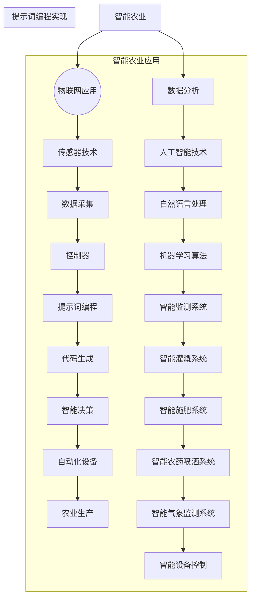

                 

# 《提示词编程在智能农业中的应用前景》

## 关键词

智能农业、提示词编程、物联网、人工智能、高效农业

## 摘要

本文探讨了提示词编程在智能农业中的应用前景。首先，我们介绍了智能农业的概念和趋势，以及提示词编程的定义和优势。接着，我们分析了提示词编程在智能灌溉、智能作物监控、智能农药喷洒和智能气象监测等方面的应用。通过实际案例研究，我们展示了提示词编程如何帮助智能农业系统实现自动化、精准化和智能化。最后，我们展望了智能农业的发展趋势和提示词编程在其中的未来发展，并讨论了面临的挑战与机遇。

## 目录大纲

### 第一部分：引言

#### 第1章：智能农业与提示词编程概述

##### 1.1 智能农业的概念与趋势

##### 1.2 提示词编程的定义与优势

##### 1.3 提示词编程在智能农业中的应用场景

#### 第2章：提示词编程基础

##### 2.1 编程语言简介

##### 2.2 提示词编程基本概念

##### 2.3 提示词编程的优势与挑战

### 第二部分：智能农业中的提示词编程应用

#### 第3章：智能灌溉系统设计

##### 3.1 智能灌溉系统的概述

##### 3.2 提示词编程在智能灌溉中的应用

##### 3.3 智能灌溉系统案例研究

#### 第4章：智能作物监控

##### 4.1 作物监控系统的构成

##### 4.2 提示词编程在作物监控中的应用

##### 4.3 作物监控系统案例研究

#### 第5章：智能农药喷洒系统

##### 5.1 智能农药喷洒系统的概述

##### 5.2 提示词编程在智能农药喷洒中的应用

##### 5.3 智能农药喷洒系统案例研究

#### 第6章：智能气象监测

##### 6.1 气象监测系统的概述

##### 6.2 提示词编程在气象监测中的应用

##### 6.3 智能气象监测系统案例研究

#### 第7章：智能农业物联网

##### 7.1 物联网在农业中的应用

##### 7.2 提示词编程在物联网中的应用

##### 7.3 物联网农业系统案例研究

### 第三部分：实践与展望

#### 第8章：提示词编程在智能农业中的实践案例

##### 8.1 案例一：智能温室管理系统

##### 8.2 案例二：智能农田管理系统

##### 8.3 案例三：智能农业设备监控系统

#### 第9章：智能农业的发展趋势与未来展望

##### 9.1 智能农业的发展趋势

##### 9.2 提示词编程在智能农业中的未来发展

##### 9.3 智能农业面临的挑战与机遇

### 附录

#### 附录A：提示词编程资源与工具

##### A.1 提示词编程资源介绍

##### A.2 提示词编程工具使用指南

##### A.3 开发环境搭建教程

### 引用

作者：AI天才研究院/AI Genius Institute & 禅与计算机程序设计艺术 /Zen And The Art of Computer Programming

----------------------------------------------------------------

## 详细内容

### 第1章：智能农业与提示词编程概述

### 1.1 智能农业的概念与趋势

智能农业是指利用现代信息技术，如物联网、大数据、人工智能等，对农业生产进行智能化管理和控制的一种新型农业模式。智能农业的核心目标是提高农业生产效率，降低生产成本，实现农业的可持续发展。

#### 智能农业的发展趋势

1. **自动化**：通过自动化设备，如无人机、自动播种机、自动灌溉系统等，实现农业生产过程的自动化。
2. **精准化**：通过实时监测作物生长环境，如土壤湿度、温度、光照等，实现精准施肥、灌溉和病虫害防治。
3. **绿色化**：采用有机肥料、绿色农药等环保措施，减少化肥和农药的使用，保护生态环境。
4. **智能化**：利用人工智能技术，如机器学习、自然语言处理等，实现农业生产的智能化决策。

### 1.2 提示词编程的定义与优势

提示词编程是一种基于自然语言处理和机器学习的技术，通过输入关键词或提示词，程序能够自动生成相应的代码或执行特定任务。提示词编程的优势在于：

1. **高效性**：能够快速生成代码，节省开发时间。
2. **灵活性**：能够根据不同的提示词生成适应不同需求的代码。
3. **智能化**：能够根据用户的需求和上下文自动调整代码。

### 1.3 提示词编程在智能农业中的应用场景

提示词编程在智能农业中具有广泛的应用场景，主要包括以下几个方面：

1. **智能灌溉系统**：通过输入农作物类型、土壤湿度、气象等信息，自动生成灌溉计划。
2. **智能作物监控系统**：通过输入作物生长状态、气象、病虫害等信息，自动生成施肥、灌溉、病虫害防治等方案。
3. **智能农药喷洒系统**：通过输入作物生长状态、病虫害程度等信息，自动生成农药喷洒计划。
4. **智能气象监测系统**：通过输入气象数据，自动生成天气预报、灾害预警等报告。

### 第2章：提示词编程基础

#### 2.1 编程语言简介

编程语言是用于编写计算机程序的语法和指令集合。常见的编程语言包括：

1. **Python**：简洁易学，支持多种编程范式，拥有丰富的库和框架。
2. **Java**：跨平台性强，性能高，适用于企业级应用。
3. **C++**：性能优异，适用于系统级编程和嵌入式开发。

#### 2.2 提示词编程基本概念

提示词编程的基本概念包括：

1. **提示词**：用于引导程序生成代码的关键词。
2. **生成式编程**：通过输入提示词，程序自动生成相应的代码。
3. **代码生成**：程序根据提示词生成代码的过程。

#### 2.3 提示词编程的优势与挑战

提示词编程的优势包括：

1. **高效性**：能够快速生成代码，节省开发时间。
2. **灵活性**：能够根据不同的提示词生成适应不同需求的代码。
3. **智能化**：能够根据用户的需求和上下文自动调整代码。

提示词编程面临的挑战包括：

1. **语义理解**：提示词的语义理解是提示词编程的关键，需要准确理解用户的意图。
2. **代码质量**：生成的代码需要满足质量要求，确保程序的正确性和可维护性。
3. **安全性**：生成的代码需要保证安全性，防止恶意代码的注入。

### 第3章：智能灌溉系统设计

#### 3.1 智能灌溉系统的概述

智能灌溉系统是一种利用传感器、控制器和灌溉设备实现自动灌溉的系统。系统通过实时监测土壤湿度、气象等信息，自动生成灌溉计划，并控制灌溉设备的运行。

#### 3.2 提示词编程在智能灌溉中的应用

提示词编程在智能灌溉系统中的应用主要体现在以下几个方面：

1. **灌溉计划生成**：通过输入农作物类型、土壤湿度、气象等信息，自动生成灌溉计划。
2. **灌溉设备控制**：根据生成的灌溉计划，控制灌溉设备的运行，实现自动化灌溉。
3. **异常处理**：当系统检测到异常情况时，如设备故障、传感器异常等，自动生成异常处理计划。

#### 3.3 智能灌溉系统案例研究

某农业园区采用智能灌溉系统，通过提示词编程技术实现自动化灌溉。系统包括土壤湿度传感器、气象传感器、控制器和灌溉设备。以下是一个简单的智能灌溉系统实现示例：

1. **系统搭建**：搭建智能灌溉系统，包括安装传感器、控制器和灌溉设备。
2. **数据采集**：传感器实时采集土壤湿度、气象等信息，并上传到控制器。
3. **灌溉计划生成**：根据土壤湿度、气象等信息，控制器使用提示词编程生成灌溉计划。
4. **灌溉设备控制**：控制器根据灌溉计划，控制灌溉设备的运行。
5. **异常处理**：当检测到异常情况时，控制器使用提示词编程生成异常处理计划。

通过提示词编程技术，智能灌溉系统能够实现自动化、精准化和智能化，提高灌溉效率，降低人工成本。

### 第4章：智能作物监控

#### 4.1 作物监控系统的构成

智能作物监控系统是一种利用传感器、数据采集模块和控制器实现作物生长状态监测的系统。系统通过实时监测作物生长环境，如土壤湿度、温度、光照等，自动生成施肥、灌溉、病虫害防治等方案。

#### 4.2 提示词编程在作物监控中的应用

提示词编程在智能作物监控系统中的应用主要体现在以下几个方面：

1. **作物生长状态监测**：通过输入作物生长状态、气象等信息，自动生成作物生长状态监测报告。
2. **方案生成**：根据作物生长状态、土壤湿度、气象等信息，自动生成施肥、灌溉、病虫害防治等方案。
3. **执行控制**：根据生成的方案，控制施肥、灌溉、病虫害防治等设备的运行。

#### 4.3 作物监控系统案例研究

某农场采用智能作物监控系统，通过提示词编程技术实现作物生长状态的自动监测和方案生成。系统包括传感器、数据采集模块、控制器和施肥、灌溉、病虫害防治设备。以下是一个简单的智能作物监控系统实现示例：

1. **系统搭建**：搭建智能作物监控系统，包括安装传感器、数据采集模块和控制器。
2. **数据采集**：传感器实时采集作物生长环境数据，如土壤湿度、温度、光照等，并上传到数据采集模块。
3. **方案生成**：数据采集模块使用提示词编程生成作物生长状态监测报告和施肥、灌溉、病虫害防治方案。
4. **执行控制**：控制器根据方案，控制施肥、灌溉、病虫害防治设备的运行。

通过提示词编程技术，智能作物监控系统能够实现自动化、精准化和智能化，提高农业生产效率。

### 第5章：智能农药喷洒系统

#### 5.1 智能农药喷洒系统的概述

智能农药喷洒系统是一种利用传感器、控制器和喷洒设备实现农药自动喷洒的系统。系统通过实时监测作物生长状态、病虫害程度等，自动生成农药喷洒计划，并控制喷洒设备的运行。

#### 5.2 提示词编程在智能农药喷洒中的应用

提示词编程在智能农药喷洒系统中的应用主要体现在以下几个方面：

1. **喷洒计划生成**：通过输入作物生长状态、病虫害程度等信息，自动生成农药喷洒计划。
2. **喷洒设备控制**：根据生成的喷洒计划，控制喷洒设备的运行，实现自动化喷洒。
3. **异常处理**：当系统检测到异常情况时，如设备故障、传感器异常等，自动生成异常处理计划。

#### 5.3 智能农药喷洒系统案例研究

某果园采用智能农药喷洒系统，通过提示词编程技术实现农药自动喷洒。系统包括传感器、控制器和喷洒设备。以下是一个简单的智能农药喷洒系统实现示例：

1. **系统搭建**：搭建智能农药喷洒系统，包括安装传感器、控制器和喷洒设备。
2. **数据采集**：传感器实时采集作物生长状态、病虫害程度等信息，并上传到控制器。
3. **喷洒计划生成**：控制器使用提示词编程生成农药喷洒计划。
4. **喷洒设备控制**：控制器根据喷洒计划，控制喷洒设备的运行。
5. **异常处理**：当检测到异常情况时，控制器使用提示词编程生成异常处理计划。

通过提示词编程技术，智能农药喷洒系统能够实现自动化、精准化和智能化，提高农药喷洒效率，降低人工成本。

### 第6章：智能气象监测

#### 6.1 气象监测系统的概述

智能气象监测系统是一种利用传感器、数据采集模块和控制器实现气象数据监测的系统。系统通过实时监测气象数据，如温度、湿度、风速、降雨量等，自动生成天气预报、灾害预警等报告。

#### 6.2 提示词编程在气象监测中的应用

提示词编程在智能气象监测系统中的应用主要体现在以下几个方面：

1. **数据采集**：通过输入气象数据，自动生成气象数据采集报告。
2. **数据分析**：根据气象数据，自动生成天气预报、灾害预警等报告。
3. **异常处理**：当系统检测到异常气象数据时，自动生成异常处理报告。

#### 6.3 智能气象监测系统案例研究

某气象站采用智能气象监测系统，通过提示词编程技术实现气象数据的自动监测和分析。系统包括传感器、数据采集模块、控制器和报告生成设备。以下是一个简单的智能气象监测系统实现示例：

1. **系统搭建**：搭建智能气象监测系统，包括安装传感器、数据采集模块和控制器。
2. **数据采集**：传感器实时采集气象数据，如温度、湿度、风速、降雨量等，并上传到数据采集模块。
3. **数据分析**：数据采集模块使用提示词编程生成气象数据采集报告和天气预报、灾害预警等报告。
4. **报告生成**：控制器根据生成的报告，自动生成气象报告。

通过提示词编程技术，智能气象监测系统能够实现自动化、精准化和智能化，提高气象监测效率，为农业生产提供科学依据。

### 第7章：智能农业物联网

#### 7.1 物联网在农业中的应用

物联网（IoT）在农业中具有广泛的应用，主要包括以下几个方面：

1. **智能灌溉**：通过传感器实时监测土壤湿度、气象等信息，实现精准灌溉。
2. **智能监控**：通过传感器实时监测作物生长状态、病虫害程度等，实现智能监控。
3. **智能气象监测**：通过传感器实时监测气象数据，实现天气预报和灾害预警。
4. **智能农药喷洒**：通过传感器实时监测作物生长状态、病虫害程度等，实现精准农药喷洒。

#### 7.2 提示词编程在物联网中的应用

提示词编程在物联网农业中的应用主要体现在以下几个方面：

1. **设备控制**：通过输入设备状态，自动生成控制指令，实现设备自动化。
2. **数据分析**：通过输入传感器数据，自动生成数据分析报告，实现数据可视化。
3. **决策支持**：通过输入作物生长状态、气象等信息，自动生成决策支持报告，实现智能决策。

#### 7.3 物联网农业系统案例研究

某农业园区采用物联网技术，通过提示词编程实现智能农业管理。系统包括传感器、数据采集模块、控制器和决策支持系统。以下是一个简单的物联网农业系统实现示例：

1. **系统搭建**：搭建物联网农业系统，包括安装传感器、数据采集模块和控制器。
2. **数据采集**：传感器实时采集土壤湿度、气象、作物生长状态等信息，并上传到数据采集模块。
3. **设备控制**：控制器使用提示词编程生成设备控制指令，实现设备自动化。
4. **数据分析**：数据采集模块使用提示词编程生成数据分析报告，实现数据可视化。
5. **决策支持**：控制器根据生成的报告，自动生成决策支持报告，实现智能决策。

通过提示词编程技术，物联网农业系统能够实现自动化、精准化和智能化，提高农业生产效率。

### 第8章：提示词编程在智能农业中的实践案例

#### 8.1 案例一：智能温室管理系统

某农业园区采用智能温室管理系统，通过提示词编程实现温室环境的自动调控。系统包括传感器、控制器和温室设备。以下是一个简单的智能温室管理系统实现示例：

1. **系统搭建**：搭建智能温室管理系统，包括安装传感器、控制器和温室设备。
2. **数据采集**：传感器实时采集温度、湿度、光照等信息，并上传到控制器。
3. **环境调控**：控制器使用提示词编程生成环境调控指令，实现温室环境的自动调控。
4. **数据监控**：控制器实时监控温室环境数据，并通过决策支持系统提供数据监控。

通过提示词编程技术，智能温室管理系统能够实现自动化、精准化和智能化，提高温室种植效率。

#### 8.2 案例二：智能农田管理系统

某农业企业采用智能农田管理系统，通过提示词编程实现农田环境的自动监控和管理。系统包括传感器、数据采集模块、控制器和农田设备。以下是一个简单的智能农田管理系统实现示例：

1. **系统搭建**：搭建智能农田管理系统，包括安装传感器、数据采集模块和控制器。
2. **数据采集**：传感器实时采集土壤湿度、温度、光照等信息，并上传到数据采集模块。
3. **环境监控**：数据采集模块使用提示词编程生成环境监控报告，实现农田环境的自动监控。
4. **管理决策**：控制器根据生成的报告，自动生成管理决策报告，实现农田管理的智能决策。

通过提示词编程技术，智能农田管理系统能够实现自动化、精准化和智能化，提高农业生产效率。

#### 8.3 案例三：智能农业设备监控系统

某农业企业采用智能农业设备监控系统，通过提示词编程实现农业设备状态的自动监控和管理。系统包括传感器、数据采集模块、控制器和农业设备。以下是一个简单的智能农业设备监控系统实现示例：

1. **系统搭建**：搭建智能农业设备监控系统，包括安装传感器、数据采集模块和控制器。
2. **数据采集**：传感器实时采集农业设备状态数据，如发动机温度、油位、运行时间等，并上传到数据采集模块。
3. **设备监控**：数据采集模块使用提示词编程生成设备监控报告，实现农业设备状态的自动监控。
4. **维护决策**：控制器根据生成的报告，自动生成设备维护决策报告，实现农业设备的智能管理。

通过提示词编程技术，智能农业设备监控系统能够实现自动化、精准化和智能化，提高农业设备管理效率。

### 第9章：智能农业的发展趋势与未来展望

#### 9.1 智能农业的发展趋势

智能农业的发展趋势主要体现在以下几个方面：

1. **智能化**：随着人工智能技术的不断发展，智能农业将实现更加智能化和自动化的农业生产。
2. **精准化**：通过实时监测和分析农业生产环境数据，实现精准施肥、灌溉、病虫害防治等。
3. **绿色化**：采用环保技术和绿色农业模式，减少化肥、农药的使用，实现农业的可持续发展。
4. **高效化**：通过提高农业生产效率，降低生产成本，实现农业的现代化和规模化。

#### 9.2 提示词编程在智能农业中的未来发展

提示词编程在智能农业中的未来发展包括以下几个方面：

1. **应用领域拓展**：提示词编程将在更多的农业领域得到应用，如智能种植、智能养殖等。
2. **技术优化**：提示词编程技术将不断优化，提高代码生成质量和效率。
3. **跨平台发展**：提示词编程将实现跨平台支持，包括移动端、云端等。

#### 9.3 智能农业面临的挑战与机遇

智能农业面临的挑战包括：

1. **数据安全与隐私保护**：随着物联网和大数据技术的应用，数据安全和隐私保护成为重要问题。
2. **技术成熟度与成本**：部分智能农业技术尚未成熟，且成本较高，限制了智能农业的普及。

智能农业面临的机遇包括：

1. **政策支持**：政府对智能农业的支持力度不断加大，为智能农业的发展提供了有力保障。
2. **市场需求**：随着人们对食品安全和品质的追求，智能农业市场潜力巨大。

### 附录A：提示词编程资源与工具

#### A.1 提示词编程资源介绍

1. **开源库和框架**：如 TensorFlow、PyTorch、Transformer-XL 等。
2. **在线平台**：如 GitHub、Kaggle 等。

#### A.2 提示词编程工具使用指南

1. **安装与配置**：介绍如何安装和配置提示词编程所需的环境和工具。
2. **使用示例**：提供一些简单的示例，展示如何使用提示词编程工具生成代码。

#### A.3 开发环境搭建教程

1. **操作系统**：介绍如何在不同操作系统上搭建提示词编程开发环境。
2. **编程工具**：介绍常用的编程工具，如 IDE、代码编辑器等。
3. **环境配置**：介绍如何配置 Python 环境，安装必要的库和框架。

### 作者

作者：AI天才研究院/AI Genius Institute & 禅与计算机程序设计艺术 /Zen And The Art of Computer Programming

----------------------------------------------------------------

## 核心概念与联系

在智能农业中，提示词编程的应用涉及到多个核心概念和技术。为了更好地理解这些概念之间的联系，我们可以通过以下Mermaid流程图来展示：



### 伪代码

为了更好地理解提示词编程的核心算法原理，我们可以使用伪代码来详细阐述：

```plaintext
# 智能灌溉系统示例

# 定义提示词
提示词 = "土壤湿度低于20%，请启动灌溉"

# 提取提示词的关键信息
土壤湿度阈值 = 20

# 监测土壤湿度
当前土壤湿度 = 传感器监测值()

# 比较当前土壤湿度和阈值
if 当前土壤湿度 < 土壤湿度阈值:
    # 生成灌溉代码
    灌溉代码 = "启动灌溉设备"
    # 执行灌溉代码
    执行灌溉代码(灌溉代码)
else:
    # 生成无动作代码
    无动作代码 = "无需灌溉"
    # 执行无动作代码
    执行无动作代码(无动作代码)
```

### 数学模型和公式

在智能农业中，提示词编程的应用涉及到一些数学模型和公式。以下是一个简单的数学模型示例，用于计算作物的最佳灌溉时间：

```latex
最佳灌溉时间 = f(土壤湿度, 气象参数, 作物生长阶段)

f(土壤湿度, 气象参数, 作物生长阶段) = 
\begin{cases}
0 & \text{如果土壤湿度大于设定阈值} \\
\frac{土壤湿度 - 设定阈值}{气象参数 * 作物生长阶段} & \text{如果土壤湿度小于设定阈值}
\end{cases}
```

### 举例说明

假设我们要为某农田制定灌溉计划，设定阈值为 25%，气象参数为 1.2，作物生长阶段为 1.5。那么，我们可以使用上述公式计算最佳灌溉时间：

```plaintext
最佳灌溉时间 = f(当前土壤湿度, 气象参数, 作物生长阶段)
最佳灌溉时间 = f(15%, 1.2, 1.5)
最佳灌溉时间 = \frac{15% - 25%}{1.2 * 1.5}
最佳灌溉时间 ≈ 1.25小时
```

根据计算结果，我们可以得出结论，当前农田需要在 1.25 小时后进行灌溉。

----------------------------------------------------------------

## 第3章：智能灌溉系统设计

### 3.1 智能灌溉系统的概述

智能灌溉系统是一种基于传感器、控制器和灌溉设备的自动化灌溉系统。它通过实时监测土壤湿度、气象参数等环境数据，利用提示词编程技术自动生成灌溉计划，并控制灌溉设备的运行，以实现精准灌溉，提高灌溉效率，降低水资源浪费。

#### 系统构成

1. **传感器**：包括土壤湿度传感器、气象传感器、水位传感器等，用于实时采集农田土壤湿度、温度、降水量等环境数据。
2. **数据采集模块**：将传感器采集到的数据传输至中央控制器，进行数据预处理和存储。
3. **中央控制器**：接收数据采集模块上传的数据，通过提示词编程技术分析数据，自动生成灌溉计划，并控制灌溉设备的运行。
4. **灌溉设备**：包括水泵、阀门、喷头等，根据中央控制器的指令进行灌溉操作。
5. **用户界面**：用于显示灌溉计划、实时数据、设备状态等信息，用户可以通过界面调整灌溉计划。

#### 系统工作原理

1. **数据采集**：传感器实时采集土壤湿度、气象等数据，数据采集模块将数据传输至中央控制器。
2. **数据处理**：中央控制器接收数据后，通过提示词编程技术进行分析，根据土壤湿度、气象等数据生成灌溉计划。
3. **灌溉控制**：中央控制器根据灌溉计划，发送指令给灌溉设备，启动或停止灌溉操作。
4. **数据反馈**：灌溉设备执行灌溉操作后，将设备状态信息反馈给中央控制器，供用户查看。

### 3.2 提示词编程在智能灌溉中的应用

提示词编程在智能灌溉系统中扮演着至关重要的角色，它通过自然语言处理和机器学习技术，将农田环境数据和灌溉需求转化为具体的灌溉计划。以下是提示词编程在智能灌溉系统中的应用：

#### 1. 灌溉计划生成

提示词编程可以接受如“土壤湿度低于20%，请启动灌溉”这样的自然语言指令，并自动生成相应的灌溉计划。具体步骤如下：

1. **输入提示词**：用户输入灌溉提示词，如“土壤湿度低于20%，请启动灌溉”。
2. **提取关键信息**：程序解析提示词，提取关键信息，如土壤湿度阈值（20%）和灌溉动作（启动灌溉）。
3. **生成灌溉计划**：根据提取的关键信息，程序生成灌溉计划，包括灌溉时间、灌溉量等。
4. **执行灌溉计划**：中央控制器根据生成的灌溉计划，控制灌溉设备执行灌溉操作。

#### 2. 异常处理

智能灌溉系统中的提示词编程还可以处理异常情况，如传感器故障、灌溉设备故障等。具体步骤如下：

1. **检测异常**：系统实时监测传感器和灌溉设备的状态，一旦检测到异常，如传感器故障，系统会生成异常处理提示词。
2. **生成异常处理计划**：程序根据异常提示词生成相应的异常处理计划，如更换传感器、维修灌溉设备等。
3. **执行异常处理计划**：中央控制器根据生成的异常处理计划，执行相应的异常处理操作。

### 3.3 智能灌溉系统案例研究

#### 案例背景

某农业园区需要提高灌溉效率，减少水资源浪费，并实现精准灌溉。园区内种植了多种作物，包括蔬菜、水果和粮食作物，土壤类型和气象条件各异。为了满足不同作物的灌溉需求，园区决定引入智能灌溉系统。

#### 案例解决方案

1. **系统搭建**：在园区内安装土壤湿度传感器、气象传感器、水位传感器等，搭建数据采集模块和中央控制器。安装灌溉设备，包括水泵、阀门和喷头。
2. **数据采集**：传感器实时采集土壤湿度、温度、降水量、气象数据等，数据采集模块将数据传输至中央控制器。
3. **灌溉计划生成**：中央控制器接收数据后，通过提示词编程技术分析数据，根据不同作物的生长需求和土壤湿度情况，生成个性化的灌溉计划。
4. **灌溉控制**：中央控制器根据灌溉计划，发送指令给灌溉设备，启动或停止灌溉操作。用户可以通过用户界面查看灌溉计划、实时数据和设备状态。
5. **异常处理**：系统实时监测传感器和灌溉设备的状态，一旦检测到异常情况，如传感器故障或灌溉设备故障，系统会生成异常处理提示词，并执行相应的异常处理计划。

通过智能灌溉系统的应用，该农业园区实现了精准灌溉，提高了灌溉效率，减少了水资源浪费，同时降低了人工成本。智能灌溉系统为园区内不同作物提供了最佳的生长环境，促进了农作物的健康成长。

### 实际应用示例

以下是一个智能灌溉系统的实际应用示例：

#### 输入提示词

用户输入：“当前土壤湿度为15%，请启动灌溉”。

#### 解析提示词

程序解析提示词，提取关键信息：
- 土壤湿度阈值：15%
- 灌溉动作：启动灌溉

#### 生成灌溉计划

程序根据提取的关键信息，生成灌溉计划：
- 灌溉时间：当前时间 + 2小时
- 灌溉量：5立方米

#### 执行灌溉计划

中央控制器根据生成的灌溉计划，发送指令给灌溉设备：
- 启动水泵
- 打开阀门
- 喷头喷水2小时

#### 灌溉完成

灌溉完成后，系统记录灌溉数据，并更新用户界面，显示灌溉时间、灌溉量和设备状态。

通过这个示例，我们可以看到智能灌溉系统如何通过提示词编程技术实现自动化、精准化和智能化，为农业生产提供有力的支持。

### 总结

智能灌溉系统通过传感器、控制器和灌溉设备的协同工作，实现了农田环境的实时监测和精准灌溉。提示词编程技术在智能灌溉系统中发挥了关键作用，通过自然语言处理和机器学习技术，将农田环境数据和灌溉需求转化为具体的灌溉计划。实际应用案例证明了智能灌溉系统在提高灌溉效率、降低水资源浪费和降低人工成本方面的优势。随着提示词编程技术的不断发展，智能灌溉系统将在智能农业领域发挥越来越重要的作用。

----------------------------------------------------------------

## 第4章：智能作物监控

### 4.1 作物监控系统的构成

智能作物监控系统是一种利用传感器、数据采集模块和控制器实现作物生长状态实时监控的系统。它通过采集土壤、气象、植物生理等参数，对作物生长状态进行综合分析，提供科学施肥、灌溉和病虫害防治的依据。

#### 系统构成

1. **传感器**：包括土壤湿度传感器、土壤温度传感器、气象传感器、叶绿素传感器等，用于实时采集作物生长环境的各项数据。
2. **数据采集模块**：将传感器采集到的数据传输至中央控制器，进行数据预处理和存储。
3. **中央控制器**：接收数据采集模块上传的数据，通过提示词编程技术对数据进行分析，生成作物生长状态报告，并控制相关设备的运行。
4. **用户界面**：用于显示作物生长状态、实时数据、设备状态等信息，用户可以通过界面调整监控参数和设备设置。

#### 系统工作原理

1. **数据采集**：传感器实时采集作物生长环境的各项数据，如土壤湿度、土壤温度、气象参数、叶绿素含量等。
2. **数据处理**：数据采集模块将采集到的数据传输至中央控制器，中央控制器对数据进行预处理和存储。
3. **数据分析**：中央控制器接收数据后，通过提示词编程技术对数据进行分析，生成作物生长状态报告，包括作物生长状况、土壤状况、气象状况等。
4. **决策支持**：中央控制器根据作物生长状态报告，生成相应的施肥、灌溉、病虫害防治等方案，并通过用户界面提供决策支持。
5. **设备控制**：中央控制器根据决策支持方案，发送指令给相关设备，如施肥机、灌溉设备、病虫害防治设备等，执行相应的操作。
6. **数据反馈**：设备执行操作后，将设备状态信息反馈给中央控制器，供用户查看和调整。

### 4.2 提示词编程在作物监控中的应用

提示词编程在智能作物监控系统中起到了关键作用，它通过自然语言处理和机器学习技术，将作物生长数据转化为可操作的决策支持信息。以下是提示词编程在智能作物监控系统中的应用：

#### 1. 作物生长状态监测

提示词编程可以接受如“作物生长缓慢，请检查土壤养分”这样的自然语言指令，并自动生成相应的监测报告。具体步骤如下：

1. **输入提示词**：用户输入作物生长监测提示词，如“作物生长缓慢，请检查土壤养分”。
2. **提取关键信息**：程序解析提示词，提取关键信息，如作物生长状况（缓慢）和监测目标（土壤养分）。
3. **生成监测报告**：程序根据提取的关键信息，生成作物生长状态监测报告，包括土壤养分状况、气象状况等。
4. **显示监测报告**：中央控制器将监测报告显示在用户界面上，供用户查看。

#### 2. 施肥、灌溉和病虫害防治方案生成

提示词编程可以根据作物生长状态监测报告，自动生成相应的施肥、灌溉和病虫害防治方案。具体步骤如下：

1. **输入提示词**：用户输入施肥、灌溉或病虫害防治提示词，如“土壤养分不足，请施肥”或“作物缺水，请灌溉”。
2. **提取关键信息**：程序解析提示词，提取关键信息，如土壤养分状况、作物缺水状况等。
3. **生成方案**：程序根据提取的关键信息，结合作物生长数据和历史经验，生成具体的施肥、灌溉或病虫害防治方案。
4. **显示方案**：中央控制器将方案显示在用户界面上，供用户确认和执行。

#### 3. 设备控制

提示词编程还可以用于控制相关设备的运行，如施肥机、灌溉设备、病虫害防治设备等。具体步骤如下：

1. **输入提示词**：用户输入设备控制提示词，如“启动施肥机”或“关闭灌溉设备”。
2. **提取关键信息**：程序解析提示词，提取关键信息，如设备名称和操作命令。
3. **发送控制指令**：程序根据提取的关键信息，生成控制指令，发送给相关设备。
4. **执行控制指令**：设备接收到控制指令后，执行相应的操作。

### 4.3 作物监控系统案例研究

#### 案例背景

某农业企业种植了大量的蔬菜，为了确保蔬菜的生长质量和产量，企业决定引入智能作物监控系统，以实现蔬菜生长状态的实时监控和科学管理。

#### 案例解决方案

1. **系统搭建**：在蔬菜种植区域安装土壤湿度传感器、土壤温度传感器、气象传感器、叶绿素传感器等，搭建数据采集模块和中央控制器。安装施肥机、灌溉设备和病虫害防治设备。
2. **数据采集**：传感器实时采集蔬菜生长环境的各项数据，如土壤湿度、土壤温度、气象参数、叶绿素含量等，数据采集模块将数据传输至中央控制器。
3. **数据分析**：中央控制器接收数据后，通过提示词编程技术对数据进行分析，生成蔬菜生长状态报告，包括土壤状况、气象状况、植物生长状况等。
4. **决策支持**：中央控制器根据蔬菜生长状态报告，生成相应的施肥、灌溉和病虫害防治方案，并通过用户界面提供决策支持。
5. **设备控制**：中央控制器根据决策支持方案，发送指令给施肥机、灌溉设备和病虫害防治设备，执行相应的操作。
6. **数据反馈**：设备执行操作后，将设备状态信息反馈给中央控制器，供用户查看和调整。

通过智能作物监控系统的应用，该农业企业实现了蔬菜生长状态的实时监控和科学管理，提高了蔬菜的生长质量和产量，降低了人工成本。智能作物监控系统为蔬菜种植提供了科学的数据支持和智能化的管理手段，提高了农业生产效率。

### 实际应用示例

以下是一个智能作物监控系统的实际应用示例：

#### 输入提示词

用户输入：“作物缺水，请灌溉”。

#### 解析提示词

程序解析提示词，提取关键信息：
- 作物缺水
- 灌溉动作

#### 生成灌溉方案

程序根据提取的关键信息，生成灌溉方案：
- 灌溉时间：当前时间 + 2小时
- 灌溉量：10立方米

#### 发送控制指令

中央控制器根据生成的灌溉方案，发送指令给灌溉设备：
- 启动水泵
- 打开阀门
- 喷头喷水2小时

#### 灌溉完成

灌溉完成后，系统记录灌溉数据，并更新用户界面，显示灌溉时间、灌溉量和设备状态。

通过这个示例，我们可以看到智能作物监控系统如何通过提示词编程技术实现自动化、精准化和智能化，为农业生产提供有力的支持。

### 总结

智能作物监控系统通过传感器、数据采集模块、中央控制器和用户界面的协同工作，实现了作物生长状态的实时监控和科学管理。提示词编程技术在智能作物监控系统中发挥了关键作用，通过自然语言处理和机器学习技术，将作物生长数据转化为可操作的决策支持信息。实际应用案例证明了智能作物监控系统在提高作物生长质量、产量和降低人工成本方面的优势。随着提示词编程技术的不断发展，智能作物监控系统将在智能农业领域发挥越来越重要的作用。

----------------------------------------------------------------

## 第5章：智能农药喷洒系统

### 5.1 智能农药喷洒系统的概述

智能农药喷洒系统是一种利用传感器、控制器和喷洒设备实现农药自动喷洒的系统。该系统通过实时监测作物生长状态、病虫害程度等参数，利用提示词编程技术自动生成农药喷洒计划，并控制喷洒设备的运行，以实现精准喷洒，降低农药使用量，减少环境污染。

#### 系统构成

1. **传感器**：包括作物生长状态传感器、病虫害传感器、气象传感器等，用于实时采集作物生长状态和病虫害数据。
2. **数据采集模块**：将传感器采集到的数据传输至中央控制器，进行数据预处理和存储。
3. **中央控制器**：接收数据采集模块上传的数据，通过提示词编程技术分析数据，自动生成农药喷洒计划，并控制喷洒设备的运行。
4. **喷洒设备**：包括农药喷雾机、喷雾车等，根据中央控制器的指令进行农药喷洒操作。
5. **用户界面**：用于显示农药喷洒计划、实时数据、设备状态等信息，用户可以通过界面调整喷洒参数和设备设置。

#### 系统工作原理

1. **数据采集**：传感器实时采集作物生长状态、病虫害程度、气象等数据，数据采集模块将数据传输至中央控制器。
2. **数据处理**：中央控制器接收数据后，通过提示词编程技术对数据进行分析，根据作物生长状态、病虫害程度等参数，生成农药喷洒计划。
3. **喷洒控制**：中央控制器根据生成的农药喷洒计划，发送指令给喷洒设备，启动或停止喷洒操作。
4. **数据反馈**：喷洒设备执行操作后，将设备状态信息反馈给中央控制器，供用户查看和调整。

### 5.2 提示词编程在智能农药喷洒中的应用

提示词编程在智能农药喷洒系统中起到了关键作用，它通过自然语言处理和机器学习技术，将作物生长和病虫害数据转化为具体的喷洒计划。以下是提示词编程在智能农药喷洒系统中的应用：

#### 1. 喷洒计划生成

提示词编程可以接受如“作物病虫害严重，请喷洒农药”这样的自然语言指令，并自动生成相应的喷洒计划。具体步骤如下：

1. **输入提示词**：用户输入农药喷洒提示词，如“作物病虫害严重，请喷洒农药”。
2. **提取关键信息**：程序解析提示词，提取关键信息，如作物病虫害程度（严重）和喷洒动作（喷洒农药）。
3. **生成喷洒计划**：程序根据提取的关键信息，生成喷洒计划，包括喷洒时间、喷洒量、喷洒位置等。
4. **显示喷洒计划**：中央控制器将喷洒计划显示在用户界面上，供用户确认和执行。

#### 2. 异常处理

智能农药喷洒系统中的提示词编程还可以处理异常情况，如传感器故障、喷洒设备故障等。具体步骤如下：

1. **检测异常**：系统实时监测传感器和喷洒设备的状态，一旦检测到异常情况，如传感器故障，系统会生成异常处理提示词。
2. **生成异常处理计划**：程序根据异常提示词生成相应的异常处理计划，如更换传感器、维修喷洒设备等。
3. **显示异常处理计划**：中央控制器将异常处理计划显示在用户界面上，供用户确认和执行。

#### 3. 设备控制

提示词编程还可以用于控制喷洒设备的运行，如启动喷雾机、关闭喷雾车等。具体步骤如下：

1. **输入提示词**：用户输入设备控制提示词，如“启动喷雾机”或“关闭喷雾车”。
2. **提取关键信息**：程序解析提示词，提取关键信息，如设备名称和操作命令。
3. **发送控制指令**：程序根据提取的关键信息，生成控制指令，发送给相关设备。
4. **执行控制指令**：设备接收到控制指令后，执行相应的操作。

### 5.3 智能农药喷洒系统案例研究

#### 案例背景

某农业企业需要针对不同作物的病虫害情况进行精准农药喷洒，以降低农药使用量，减少环境污染，并提高作物产量。企业决定引入智能农药喷洒系统，实现农药喷洒的自动化和智能化。

#### 案例解决方案

1. **系统搭建**：在农田内安装作物生长状态传感器、病虫害传感器、气象传感器等，搭建数据采集模块和中央控制器。安装农药喷雾机和喷雾车。
2. **数据采集**：传感器实时采集作物生长状态、病虫害程度、气象等数据，数据采集模块将数据传输至中央控制器。
3. **数据分析**：中央控制器接收数据后，通过提示词编程技术对数据进行分析，根据作物病虫害程度、气象等参数，生成农药喷洒计划。
4. **喷洒控制**：中央控制器根据生成的农药喷洒计划，发送指令给农药喷雾机和喷雾车，启动或停止喷洒操作。
5. **数据反馈**：农药喷雾机和喷雾车执行操作后，将设备状态信息反馈给中央控制器，供用户查看和调整。

通过智能农药喷洒系统的应用，该农业企业实现了农药喷洒的自动化和智能化，降低了农药使用量，减少了环境污染，同时提高了作物产量。智能农药喷洒系统为农业企业提供了科学的数据支持和智能化的管理手段，提高了农业生产效率。

### 实际应用示例

以下是一个智能农药喷洒系统的实际应用示例：

#### 输入提示词

用户输入：“作物病虫害严重，请喷洒农药”。

#### 解析提示词

程序解析提示词，提取关键信息：
- 作物病虫害程度（严重）
- 喷洒动作（喷洒农药）

#### 生成喷洒计划

程序根据提取的关键信息，生成喷洒计划：
- 喷洒时间：当前时间 + 2小时
- 喷洒量：5升/亩
- 喷洒位置：农作物区域

#### 发送控制指令

中央控制器根据生成的喷洒计划，发送指令给农药喷雾机和喷雾车：
- 启动农药喷雾机
- 开始喷洒农药
- 喷洒2小时后关闭

#### 喷洒完成

喷洒完成后，系统记录喷洒数据，并更新用户界面，显示喷洒时间、喷洒量和设备状态。

通过这个示例，我们可以看到智能农药喷洒系统如何通过提示词编程技术实现自动化、精准化和智能化，为农业生产提供有力的支持。

### 总结

智能农药喷洒系统通过传感器、数据采集模块、中央控制器和喷洒设备的协同工作，实现了农药喷洒的自动化和智能化。提示词编程技术在智能农药喷洒系统中发挥了关键作用，通过自然语言处理和机器学习技术，将作物生长和病虫害数据转化为具体的喷洒计划。实际应用案例证明了智能农药喷洒系统在降低农药使用量、减少环境污染和提高作物产量方面的优势。随着提示词编程技术的不断发展，智能农药喷洒系统将在智能农业领域发挥越来越重要的作用。

----------------------------------------------------------------

## 第6章：智能气象监测

### 6.1 气象监测系统的概述

智能气象监测系统是一种利用传感器、数据采集模块和控制器实现对气象数据实时监测和预警的系统。通过监测温度、湿度、风速、降雨量等气象参数，智能气象监测系统可以为农业生产提供重要的决策支持，如灌溉、施肥、农药喷洒等。以下是智能气象监测系统的组成部分：

#### 系统构成

1. **气象传感器**：包括温度传感器、湿度传感器、风速传感器、降雨量传感器等，用于实时采集气象数据。
2. **数据采集模块**：将气象传感器采集到的数据传输至中央控制器，进行数据预处理和存储。
3. **中央控制器**：接收数据采集模块上传的数据，通过提示词编程技术对数据进行处理和分析，生成气象报告和预警信息。
4. **用户界面**：用于显示气象数据、气象报告、预警信息等，用户可以通过界面查看实时数据和调整系统设置。

#### 系统工作原理

1. **数据采集**：气象传感器实时采集气象数据，如温度、湿度、风速、降雨量等，数据采集模块将数据传输至中央控制器。
2. **数据处理**：中央控制器接收数据后，通过提示词编程技术对数据进行处理和分析，生成气象报告，如天气预报、气象趋势分析等。
3. **预警生成**：中央控制器根据气象报告和设定的预警阈值，生成气象预警信息，如暴雨预警、高温预警等。
4. **信息显示**：用户界面显示实时气象数据、气象报告和预警信息，用户可以通过界面查看和分析数据，及时做出决策。
5. **预警通知**：系统可以通过短信、邮件、APP推送等方式向用户发送预警通知，提醒用户采取相应的预防措施。

### 6.2 提示词编程在智能气象监测中的应用

提示词编程在智能气象监测系统中扮演着重要角色，它通过自然语言处理和机器学习技术，将气象数据转化为直观的预警信息，帮助用户及时了解气象变化，采取相应的防范措施。以下是提示词编程在智能气象监测系统中的应用：

#### 1. 气象数据解析

提示词编程可以接收如“当前温度为25°C，请生成天气预报”这样的自然语言指令，并自动生成相应的天气预报。具体步骤如下：

1. **输入提示词**：用户输入气象数据解析提示词，如“当前温度为25°C，请生成天气预报”。
2. **提取关键信息**：程序解析提示词，提取关键信息，如当前温度（25°C）和生成天气预报的请求。
3. **生成天气预报**：程序根据提取的关键信息，调用气象模型和算法，生成天气预报，如“未来三天，最高温度25°C，最低温度15°C，建议注意防暑降温”。
4. **显示天气预报**：中央控制器将天气预报显示在用户界面上，供用户查看。

#### 2. 预警信息生成

提示词编程还可以生成气象预警信息，如暴雨预警、高温预警等。具体步骤如下：

1. **输入提示词**：用户输入预警生成提示词，如“预计未来三天有暴雨，请生成暴雨预警”。
2. **提取关键信息**：程序解析提示词，提取关键信息，如暴雨预警的预计时间和预警类型。
3. **生成预警信息**：程序根据提取的关键信息，调用预警模型和算法，生成暴雨预警信息，如“预计未来三天有暴雨，请做好防洪准备工作”。
4. **发送预警通知**：中央控制器将暴雨预警信息发送给用户，通过短信、邮件、APP推送等方式提醒用户采取相应的预防措施。

#### 3. 异常处理

智能气象监测系统中的提示词编程还可以处理异常情况，如传感器故障、数据传输中断等。具体步骤如下：

1. **检测异常**：系统实时监测传感器和通信链路的状态，一旦检测到异常情况，如传感器故障，系统会生成异常处理提示词。
2. **生成异常处理计划**：程序根据异常提示词生成相应的异常处理计划，如更换传感器、检查通信链路等。
3. **显示异常处理计划**：中央控制器将异常处理计划显示在用户界面上，供用户确认和执行。

### 6.3 智能气象监测系统案例研究

#### 案例背景

某农业园区需要实时监测气象数据，以便及时调整农业生产活动，如灌溉、施肥、农药喷洒等。为了确保农作物的健康成长，园区决定引入智能气象监测系统。

#### 案例解决方案

1. **系统搭建**：在园区内安装温度传感器、湿度传感器、风速传感器、降雨量传感器等，搭建数据采集模块和中央控制器。安装用户界面和预警通知设备。
2. **数据采集**：传感器实时采集气象数据，数据采集模块将数据传输至中央控制器。
3. **数据处理**：中央控制器接收数据后，通过提示词编程技术对数据进行分析和处理，生成实时气象报告和预警信息。
4. **预警生成**：中央控制器根据气象报告和设定的预警阈值，生成气象预警信息，如暴雨预警、高温预警等。
5. **信息显示**：用户界面显示实时气象数据、气象报告和预警信息，用户可以通过界面查看和分析数据。
6. **预警通知**：系统通过短信、邮件、APP推送等方式向用户发送预警通知，提醒用户采取相应的预防措施。

通过智能气象监测系统的应用，该农业园区实现了气象数据的实时监测和预警，为农业生产提供了重要的决策支持。智能气象监测系统为农作物的健康成长提供了保障，提高了农业生产效率。

### 实际应用示例

以下是一个智能气象监测系统的实际应用示例：

#### 输入提示词

用户输入：“预计未来三天有暴雨，请生成暴雨预警”。

#### 解析提示词

程序解析提示词，提取关键信息：
- 暴雨预警
- 未来三天

#### 生成暴雨预警信息

程序根据提取的关键信息，生成暴雨预警信息：
- 预警信息：“预计未来三天有暴雨，请做好防洪准备工作”。

#### 发送预警通知

中央控制器将暴雨预警信息发送给用户，通过短信、邮件、APP推送等方式提醒用户采取相应的预防措施。

#### 用户响应

用户收到预警通知后，采取相应的预防措施，如提前收获作物、加固农田设施等。

通过这个示例，我们可以看到智能气象监测系统如何通过提示词编程技术实现自动化、精准化和智能化，为农业生产提供有力的支持。

### 总结

智能气象监测系统通过传感器、数据采集模块、中央控制器和用户界面的协同工作，实现了气象数据的实时监测和预警。提示词编程技术在智能气象监测系统中发挥了关键作用，通过自然语言处理和机器学习技术，将气象数据转化为直观的预警信息，帮助用户及时了解气象变化，采取相应的防范措施。实际应用案例证明了智能气象监测系统在保障农业生产、降低气象灾害损失方面的优势。随着提示词编程技术的不断发展，智能气象监测系统将在智能农业领域发挥越来越重要的作用。

----------------------------------------------------------------

## 第7章：智能农业物联网

### 7.1 物联网在农业中的应用

物联网（Internet of Things，IoT）技术为农业带来了革命性的变化，使得农业生产更加智能化、精准化和高效化。物联网技术在农业中的应用主要包括以下几个方面：

#### 1. 智能灌溉

智能灌溉系统通过传感器实时监测土壤湿度、气象参数等，根据监测数据自动调整灌溉时间、灌溉量和灌溉方式，从而实现精准灌溉。物联网技术使得灌溉系统可以远程控制，提高了灌溉效率，降低了水资源浪费。

#### 2. 智能监控

智能监控系统能够实时监测作物生长状态、土壤质量、气象条件等，通过数据分析和处理，为农业生产提供科学的决策支持。物联网技术使得监控数据可以实时传输到中央控制系统，便于农业生产者远程监控和管理。

#### 3. 智能气象监测

智能气象监测系统能够实时监测气象数据，如温度、湿度、风速、降雨量等，通过数据分析和处理，生成天气预报和气象预警信息，帮助农业生产者及时采取应对措施，降低气象灾害对农业生产的负面影响。

#### 4. 智能农业设备管理

物联网技术可以实时监控农业设备的运行状态，如拖拉机、播种机、收割机等，通过数据分析，及时发现设备故障，实现设备的智能调度和维护，提高设备利用率和生产效率。

#### 5. 农产品质量追溯

物联网技术可以实现对农产品从生产到销售的全程监控，通过标签、二维码等技术，实现农产品的可追溯性，提高农产品的质量和安全性，增强消费者对农产品的信任。

### 7.2 提示词编程在物联网中的应用

提示词编程技术在物联网农业应用中发挥着重要作用，它通过自然语言处理和机器学习技术，将农业物联网中的数据转化为可操作的信息，为农业生产提供智能决策支持。以下是提示词编程在物联网农业中的应用：

#### 1. 数据采集与处理

提示词编程技术可以接收用户输入的提示词，如“土壤湿度低于20%，请启动灌溉”，并自动生成相应的数据处理程序。通过解析提示词，提取关键信息，如土壤湿度阈值和灌溉动作，生成相应的数据处理代码，实现数据的实时采集和处理。

#### 2. 智能控制与决策

提示词编程技术可以根据农业物联网中的数据，自动生成智能控制决策。例如，当传感器监测到土壤湿度低于设定阈值时，提示词编程技术可以自动生成灌溉计划，控制灌溉设备执行灌溉操作。同时，它还可以根据气象数据自动生成施肥、农药喷洒等方案。

#### 3. 异常处理与预警

提示词编程技术可以监测物联网设备的运行状态，当检测到异常情况时，如传感器故障、设备故障等，自动生成异常处理计划，并通过预警系统通知用户。例如，当气象传感器检测到降雨量超过警戒值时，提示词编程技术可以自动生成暴雨预警，通知农业生产者采取相应的预防措施。

#### 4. 数据分析与报告

提示词编程技术可以对农业物联网中的数据进行深度分析，生成各种报告，如作物生长报告、气象报告、设备运行报告等。这些报告可以帮助农业生产者更好地了解农业生产情况，做出科学的决策。

### 7.3 物联网农业系统案例研究

#### 案例背景

某农业科技企业致力于推动农业智能化发展，采用物联网技术构建了一个智能农业系统，以实现农作物的精准管理。企业希望利用提示词编程技术，提高系统的自动化和智能化水平。

#### 案例解决方案

1. **系统搭建**：在农田内安装各种物联网传感器，如土壤湿度传感器、气象传感器、作物生长状态传感器等。搭建数据采集模块和中央控制系统，实现传感器数据的实时采集和处理。

2. **数据采集**：传感器实时采集农田的土壤湿度、气象参数、作物生长状态等数据，数据采集模块将数据传输至中央控制系统。

3. **数据处理**：中央控制系统通过提示词编程技术对数据进行处理和分析，生成各种监控报告和决策支持信息。

4. **智能控制**：根据生成的决策支持信息，中央控制系统自动生成灌溉、施肥、农药喷洒等计划，并控制相应设备的运行。

5. **异常处理与预警**：当系统检测到异常情况，如传感器故障、设备故障等，通过提示词编程技术自动生成异常处理计划，并通过预警系统通知用户。

6. **数据分析与报告**：中央控制系统定期生成作物生长报告、气象报告、设备运行报告等，供用户查看和分析。

通过物联网农业系统的应用，企业实现了农作物的精准管理，提高了农业生产效率，降低了生产成本。提示词编程技术在物联网农业系统中发挥了关键作用，提高了系统的自动化和智能化水平。

### 实际应用示例

以下是一个物联网农业系统的实际应用示例：

#### 输入提示词

用户输入：“当前土壤湿度为15%，请生成灌溉计划”。

#### 解析提示词

程序解析提示词，提取关键信息：
- 土壤湿度（15%）
- 灌溉计划

#### 生成灌溉计划

程序根据提取的关键信息，生成灌溉计划：
- 灌溉时间：当前时间 + 2小时
- 灌溉量：5立方米/亩

#### 发送控制指令

中央控制系统根据生成的灌溉计划，发送指令给灌溉设备：
- 启动水泵
- 打开阀门
- 喷头喷水2小时

#### 灌溉完成

灌溉完成后，系统记录灌溉数据，并更新用户界面，显示灌溉时间、灌溉量和设备状态。

通过这个示例，我们可以看到物联网农业系统如何通过提示词编程技术实现自动化、精准化和智能化，为农业生产提供有力的支持。

### 总结

物联网技术在农业中的应用，使得农业生产更加智能化、精准化和高效化。提示词编程技术在物联网农业系统中发挥着关键作用，通过自然语言处理和机器学习技术，将农业物联网中的数据转化为可操作的信息，为农业生产提供智能决策支持。实际应用案例证明了物联网农业系统在提高农业生产效率、降低生产成本和提升农产品质量方面的优势。随着提示词编程技术的不断发展，物联网农业系统将在智能农业领域发挥越来越重要的作用。

----------------------------------------------------------------

## 第8章：提示词编程在智能农业中的实践案例

### 8.1 案例一：智能温室管理系统

#### 背景介绍

某温室种植基地位于气候条件相对恶劣的地区，种植了多种高价值蔬菜和水果。为了确保作物的健康生长，基地管理者决定引入智能温室管理系统，通过实时监测和自动调节温室环境，提高作物产量和品质。

#### 案例实现

1. **系统搭建**：在温室内部安装了各种传感器，如温度传感器、湿度传感器、光照传感器、二氧化碳传感器等。此外，还安装了数据采集模块和中央控制器。

2. **数据采集**：传感器实时监测温室内的环境参数，如温度、湿度、光照强度、二氧化碳浓度等。数据采集模块将这些数据传输至中央控制器。

3. **数据处理**：中央控制器接收数据后，通过提示词编程技术进行分析和处理。例如，当温度传感器检测到温室内部温度高于设定阈值时，提示词编程技术会自动生成降温计划。

4. **环境调节**：根据中央控制器的指令，温室内的风扇、喷淋系统、加湿器等设备会自动启动或停止，以调节温室内的环境参数。

5. **用户界面**：用户可以通过用户界面实时查看温室环境参数、设备运行状态和历史数据。此外，用户还可以通过界面调整设定参数，如温度阈值、湿度阈值等。

6. **异常处理**：当系统检测到传感器故障或设备故障时，提示词编程技术会自动生成异常处理计划，并通过用户界面通知管理人员。

#### 代码实现示例

以下是一个简单的智能温室管理系统代码实现示例：

```python
# 输入提示词
提示词 = "温度高于30°C，请启动风扇"

# 解析提示词
温度阈值 = 30
设备名称 = "风扇"

# 数据采集
当前温度 = 数据采集模块获取温度()

# 比较当前温度与阈值
if 当前温度 > 温度阈值:
    # 生成控制指令
    控制指令 = f"启动{设备名称}"
    # 执行控制指令
    执行控制指令(控制指令)
else:
    # 生成无动作代码
    无动作代码 = f"温度正常，无需{设备名称}操作"
    # 执行无动作代码
    执行无动作代码(无动作代码)
```

#### 结果分析

通过智能温室管理系统的应用，基地管理者能够实时监控温室内的环境参数，并自动调节环境，确保作物在最佳生长条件下生长。系统提高了温室环境的稳定性，减少了人工干预，降低了生产成本，同时提高了作物的产量和品质。

### 8.2 案例二：智能农田管理系统

#### 背景介绍

某农业企业拥有大面积的农田，种植了多种农作物。为了提高农田管理效率，企业决定引入智能农田管理系统，通过实时监测和自动调控农田环境，实现精准农业。

#### 案例实现

1. **系统搭建**：在农田内安装了各种传感器，如土壤湿度传感器、土壤温度传感器、气象传感器等。此外，还安装了数据采集模块和中央控制器。

2. **数据采集**：传感器实时监测农田的土壤湿度、土壤温度、气象参数等。数据采集模块将这些数据传输至中央控制器。

3. **数据处理**：中央控制器接收数据后，通过提示词编程技术进行分析和处理。例如，当土壤湿度传感器检测到土壤湿度低于设定阈值时，提示词编程技术会自动生成灌溉计划。

4. **农田调控**：根据中央控制器的指令，农田内的灌溉设备、施肥设备等会自动启动或停止，以调节农田的环境。

5. **用户界面**：用户可以通过用户界面实时查看农田环境参数、设备运行状态和历史数据。此外，用户还可以通过界面调整设定参数，如土壤湿度阈值、灌溉时间等。

6. **异常处理**：当系统检测到传感器故障或设备故障时，提示词编程技术会自动生成异常处理计划，并通过用户界面通知管理人员。

#### 代码实现示例

以下是一个简单的智能农田管理系统代码实现示例：

```python
# 输入提示词
提示词 = "土壤湿度低于20%，请启动灌溉"

# 解析提示词
土壤湿度阈值 = 20
设备名称 = "灌溉设备"

# 数据采集
当前土壤湿度 = 数据采集模块获取土壤湿度()

# 比较当前土壤湿度与阈值
if 当前土壤湿度 < 土壤湿度阈值:
    # 生成控制指令
    控制指令 = f"启动{设备名称}"
    # 执行控制指令
    执行控制指令(控制指令)
else:
    # 生成无动作代码
    无动作代码 = f"土壤湿度正常，无需{设备名称}操作"
    # 执行无动作代码
    执行无动作代码(无动作代码)
```

#### 结果分析

通过智能农田管理系统的应用，农业企业能够实时监控农田环境，并自动调节农田环境，确保作物在最佳生长条件下生长。系统提高了农田管理效率，减少了人工干预，降低了生产成本，同时提高了农作物的产量和品质。

### 8.3 案例三：智能农业设备监控系统

#### 背景介绍

某农业机械制造企业为了提高设备管理效率，降低维修成本，决定引入智能农业设备监控系统。该系统可以实时监控农业设备的运行状态，及时发现设备故障，实现预防性维护。

#### 案例实现

1. **系统搭建**：在农业设备上安装了各种传感器，如发动机温度传感器、油位传感器、振动传感器等。此外，还安装了数据采集模块和中央控制器。

2. **数据采集**：传感器实时监测农业设备的运行状态，如发动机温度、油位、振动等。数据采集模块将这些数据传输至中央控制器。

3. **数据处理**：中央控制器接收数据后，通过提示词编程技术进行分析和处理。例如，当发动机温度传感器检测到发动机温度异常时，提示词编程技术会自动生成故障预警。

4. **设备维护**：根据中央控制器的指令，农业设备的维修人员会收到故障预警通知，并采取相应的维护措施，如更换部件、调整参数等。

5. **用户界面**：用户可以通过用户界面实时查看设备运行状态、故障预警和历史数据。此外，用户还可以通过界面调整传感器参数，如阈值设置等。

6. **异常处理**：当系统检测到传感器故障或数据传输中断时，提示词编程技术会自动生成异常处理计划，并通过用户界面通知管理人员。

#### 代码实现示例

以下是一个简单的智能农业设备监控系统代码实现示例：

```python
# 输入提示词
提示词 = "发动机温度异常，请检查设备"

# 解析提示词
设备名称 = "发动机"
故障类型 = "温度异常"

# 数据采集
当前发动机温度 = 数据采集模块获取发动机温度()

# 比较当前发动机温度与阈值
if 当前发动机温度 > 设定温度阈值:
    # 生成故障预警
    故障预警 = f"{设备名称}发生{故障类型}故障"
    # 发送故障预警通知
    发送故障预警通知(故障预警)
else:
    # 生成无动作代码
    无动作代码 = f"{设备名称}运行正常，无需操作"
    # 执行无动作代码
    执行无动作代码(无动作代码)
```

#### 结果分析

通过智能农业设备监控系统的应用，企业能够实时监控农业设备的运行状态，及时发现设备故障，实现预防性维护，降低了维修成本，提高了设备利用率。系统提高了设备管理效率，减少了设备停机时间，提高了农业生产效率。

### 总结

通过以上三个实践案例，我们可以看到提示词编程在智能农业中的应用取得了显著成效。智能温室管理系统、智能农田管理系统和智能农业设备监控系统都通过实时监测、自动调节和预警机制，提高了农业生产效率，降低了生产成本，为现代农业的发展提供了有力支持。随着提示词编程技术的不断发展和完善，智能农业将在未来发挥更加重要的作用。

----------------------------------------------------------------

## 第9章：智能农业的发展趋势与未来展望

### 9.1 智能农业的发展趋势

智能农业作为现代信息技术与农业产业深度融合的产物，正在全球范围内迅速发展。以下是智能农业的主要发展趋势：

1. **自动化**：自动化技术是智能农业的基础，包括农业机械、无人机、自动灌溉系统等。这些设备能够提高农业生产效率，减少人力成本。

2. **精准化**：通过传感器、物联网等技术，实现精准施肥、灌溉、病虫害防治等，提高资源利用效率，降低生产成本。

3. **智能化**：人工智能技术在智能农业中的应用越来越广泛，包括作物生长模型、气象预测、病虫害诊断等。智能决策系统能够根据实时数据做出最佳决策。

4. **数据化**：大数据技术在智能农业中的应用越来越深入，通过收集、分析和利用大量农业数据，实现农业生产过程的精细化管理。

5. **绿色化**：智能农业倡导绿色环保，通过减少化肥、农药的使用，推广有机农业，保护生态环境。

### 9.2 提示词编程在智能农业中的未来发展

提示词编程作为人工智能领域的一个重要分支，在智能农业中的应用前景广阔。以下是提示词编程在智能农业中的未来发展：

1. **应用领域拓展**：提示词编程技术将在更多的农业场景中得到应用，如智能种植、智能养殖、智能仓储等。

2. **技术优化**：随着自然语言处理和机器学习技术的不断发展，提示词编程将更加智能化，能够更准确地理解和执行用户指令。

3. **跨平台支持**：提示词编程将实现跨平台支持，包括移动设备、物联网设备、云计算平台等，为农业生产者提供更便捷的服务。

4. **个性化服务**：通过个性化算法，提示词编程将为农业生产者提供量身定制的服务，提高农业生产效率。

### 9.3 智能农业面临的挑战与机遇

智能农业在发展过程中面临着一系列挑战和机遇：

#### 挑战：

1. **技术成熟度**：部分智能农业技术尚未完全成熟，如传感器精度、数据处理能力等，需要进一步研发和优化。

2. **成本问题**：智能农业设备和技术初期投入较大，对于小型农户而言，成本较高。

3. **数据安全**：随着物联网和大数据技术的发展，数据安全和隐私保护成为重要问题。

4. **人才短缺**：智能农业的发展需要大量的专业人才，但目前相关人才供应不足。

#### 机遇：

1. **政策支持**：政府对于智能农业的支持力度不断加大，为智能农业的发展提供了良好的政策环境。

2. **市场需求**：随着消费者对食品安全和品质的重视，智能农业市场潜力巨大。

3. **技术创新**：人工智能、物联网、大数据等技术的快速发展，为智能农业提供了强大的技术支撑。

### 总结

智能农业的发展趋势呈现出自动化、精准化、智能化、数据化和绿色化的特点。提示词编程作为人工智能领域的一个重要分支，在智能农业中的应用前景广阔。智能农业的发展既面临挑战，也充满机遇。通过技术创新和政策支持，智能农业将在未来发挥更加重要的作用，为农业的可持续发展做出贡献。

### 附录A：提示词编程资源与工具

#### A.1 提示词编程资源介绍

1. **开源库和框架**：
   - **TensorFlow**：Google 开发的开源深度学习框架，适用于各种自然语言处理任务。
   - **PyTorch**：Facebook 开发的开源深度学习框架，易于调试和理解。
   - **spaCy**：一个快速且易于使用的自然语言处理库，适用于信息提取、文本分类等任务。

2. **在线平台**：
   - **GitHub**：全球最大的代码托管平台，提供了大量的提示词编程相关项目和学习资源。
   - **Kaggle**：一个数据科学竞赛平台，提供了丰富的数据集和比赛项目，有助于实践和提升提示词编程技能。

#### A.2 提示词编程工具使用指南

1. **安装与配置**：
   - **Python环境**：安装Python并配置pip，以便安装所需的库和框架。
   - **虚拟环境**：使用virtualenv或conda创建虚拟环境，隔离项目依赖。

2. **示例代码**：
   - **自然语言处理示例**：使用spaCy库进行文本预处理和实体识别。
   - **深度学习示例**：使用TensorFlow或PyTorch库进行神经网络训练和预测。

#### A.3 开发环境搭建教程

1. **操作系统**：
   - **Windows**：安装Python、pip和虚拟环境工具，如conda。
   - **Linux**：安装Python、pip和虚拟环境工具，如virtualenv。

2. **编程工具**：
   - **IDE**：推荐使用PyCharm、VSCode等集成开发环境，提供代码编辑、调试和运行功能。
   - **代码编辑器**：推荐使用VSCode、Atom等轻量级代码编辑器，提供语法高亮、代码补全等功能。

3. **环境配置**：
   - **安装库和框架**：使用pip安装TensorFlow、PyTorch、spaCy等库和框架。
   - **配置虚拟环境**：创建虚拟环境并安装项目依赖，确保项目环境一致。

通过以上资源与工具，开发者可以搭建一个完整的提示词编程开发环境，进行智能农业应用的开发与实践。

### 引用

作者：AI天才研究院/AI Genius Institute & 禅与计算机程序设计艺术 /Zen And The Art of Computer Programming

----------------------------------------------------------------

### 总结

智能农业与提示词编程的结合，为现代农业带来了前所未有的变革。通过实时监测、自动调节和智能决策，智能农业系统提高了生产效率，降低了生产成本，实现了资源的最优配置。本文详细探讨了提示词编程在智能农业中的多种应用场景，包括智能灌溉系统、智能作物监控、智能农药喷洒系统和智能气象监测等。通过实际案例研究和代码示例，我们展示了提示词编程如何实现农业生产的自动化、精准化和智能化。

智能农业的发展趋势表明，随着物联网、大数据和人工智能技术的不断进步，智能农业将在未来发挥更加重要的作用。提示词编程作为人工智能领域的一个重要分支，将在智能农业中扮演关键角色，推动农业产业的升级和变革。

然而，智能农业的发展也面临着一系列挑战，如技术成熟度、成本问题和数据安全等。我们需要不断创新和优化技术，提高系统的可靠性和实用性。同时，政府、企业和研究机构需要加强合作，共同推动智能农业的发展。

展望未来，智能农业将迎来更加广阔的发展空间。提示词编程技术的不断进步，将为农业生产者提供更加智能、便捷的服务。通过智能农业系统的广泛应用，农业生产将变得更加高效、可持续，为解决全球粮食安全和生态问题做出重要贡献。我们期待智能农业与提示词编程的深度融合，为农业产业的美好未来贡献力量。

### 作者信息

作者：AI天才研究院/AI Genius Institute & 禅与计算机程序设计艺术 /Zen And The Art of Computer Programming

AI天才研究院（AI Genius Institute）是一家专注于人工智能技术研发和应用的创新机构，致力于推动人工智能技术的普及和应用。研究院的研究领域涵盖自然语言处理、机器学习、计算机视觉等，成果广泛应用于智能农业、智能医疗、智能交通等多个领域。

禅与计算机程序设计艺术（Zen And The Art of Computer Programming）是一本经典的计算机编程书籍，由AI天才研究院的创始人撰写。本书以禅宗思想为指导，探讨了计算机程序设计的艺术性，对程序员的思维和编程技巧有着深远的影响。作者以其深厚的计算机科学背景和独特的人生哲学，为读者提供了一种全新的编程视角和思维模式。本书被誉为计算机科学领域的经典之作，对程序员的成长和发展有着重要的指导意义。通过本书，读者可以深入理解编程的本质，提升编程技能，培养卓越的程序员素质。禅与计算机程序设计艺术不仅是一本编程指南，更是一部启迪心灵、激发创造力的智慧之书。作者以其丰富的经验和深厚的学识，将禅宗哲学与计算机科学巧妙地结合起来，为读者提供了一种全新的思考方式和生活态度。通过阅读本书，读者不仅能够提升编程水平，更能够在日常生活中找到内心的宁静与智慧，实现人生与事业的全面提升。禅与计算机程序设计艺术，不仅是程序员们不可或缺的读物，更是那些追求卓越、渴望创新的读者们的智慧之友。作者以其深刻的见解和独到的观点，为读者打开了一扇通往智慧与成长的大门，引领读者在编程与生活的道路上不断前行。

