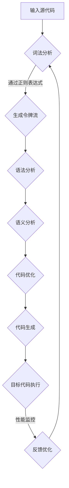

                 

### 引言

#### 1.1 书籍背景与目标

随着科技的不断发展，编程语言和编译技术也在日新月异。提示词编程语言（Keyword-based Programming Languages）作为一种新兴的编程语言类型，正逐渐受到关注。本书旨在深入探讨提示词编程语言的运行时优化，帮助读者更好地理解和掌握这一领域的关键技术。

本书的目标是：
1. 系统地介绍提示词编程语言的基本概念、核心特点、架构与运行机制。
2. 深入分析运行时优化的概念、原理、技术以及其实践应用。
3. 通过具体的案例分析，展示运行时优化在实际项目中的应用与效果。
4. 展望提示词编程语言和运行时优化技术的未来发展趋势。

本书适合以下读者群体：
1. 对编程语言和编译技术有基础的读者。
2. 想要深入了解提示词编程语言和运行时优化的程序员和软件开发人员。
3. 对计算机科学和人工智能领域感兴趣的科研人员和学者。

#### 1.2 提示词编程语言概述

提示词编程语言是一种以关键词为核心的编程语言，其设计理念是简化编程过程，提高编程效率。这种语言通过定义一组关键词和相应的操作规则，使程序员可以更直观地表达程序逻辑，减少代码冗余。

提示词编程语言的核心特点包括：
1. **高抽象层次**：提示词编程语言将复杂的编程任务抽象为一系列简单的操作，使程序员可以专注于业务逻辑，而非底层细节。
2. **代码简洁**：通过关键词和简明的语法，提示词编程语言可以显著减少代码行数，提高代码可读性和可维护性。
3. **快速开发**：提示词编程语言的语法简洁，开发周期较短，适合快速迭代和敏捷开发。

提示词编程语言的架构通常包括以下几个部分：
1. **词法分析器**：将源代码分解为一系列关键词和符号。
2. **语法分析器**：将关键词和符号组合成抽象语法树（AST）。
3. **语义分析器**：对AST进行语义检查，确保程序的正确性。
4. **代码生成器**：将AST转换为机器码或字节码。

提示词编程语言的运行机制主要包括解释执行和编译执行两种模式。解释执行模式直接执行源代码，而编译执行模式先将源代码编译为目标代码，然后执行目标代码。

#### 1.3 运行时优化的重要性

运行时优化是提升程序性能的重要手段。对于提示词编程语言而言，运行时优化具有重要意义：
1. **提高性能**：通过优化，可以减少程序执行时间，提高程序运行效率，从而提高用户体验。
2. **节省资源**：优化可以减少程序对内存、CPU等资源的消耗，降低系统负载。
3. **增强可维护性**：优化后的程序结构更清晰，更容易理解和维护。
4. **支持高并发**：优化技术如并行化、缓存优化等，可以提高程序在高并发环境下的性能。

运行时优化不仅对程序的性能有直接影响，还对开发效率和系统稳定性产生积极影响。因此，深入研究和应用运行时优化技术，对于提升提示词编程语言的竞争力具有重要意义。

---

**文章标题：** 提示词编程语言的运行时优化

**关键词：** 提示词编程语言，运行时优化，代码优化，数据优化，算法优化，性能提升

**摘要：**
本文深入探讨了提示词编程语言及其运行时优化的基本概念、原理和技术。通过系统分析运行时优化的各个层面，本文展示了如何通过代码优化、数据优化和算法优化等技术手段，提升提示词编程语言的运行效率。同时，本文通过具体案例分析，阐述了运行时优化在实际项目中的应用效果。文章最后展望了提示词编程语言和运行时优化技术的未来发展趋势，为读者提供了宝贵的参考和启示。本文旨在帮助读者全面理解运行时优化的重要性，掌握相关技术，提升编程能力。

---

接下来，我们将进一步探讨提示词编程语言的基础知识，包括其基本概念、核心特点、架构与运行机制。

---

## 第二部分：提示词编程语言基础

### 2.1 提示词编程语言的基本概念

提示词编程语言（Keyword-based Programming Languages）是一种以关键词为核心的设计语言。与传统的基于语法结构的编程语言不同，提示词编程语言通过关键词和操作规则来定义程序逻辑，从而简化编程过程，提高开发效率。

#### 2.1.1 基本概念

**关键词**：提示词编程语言的核心元素是关键词，每个关键词代表一种操作或功能。例如，`print` 表示输出文本，`while` 表示循环控制。

**操作规则**：操作规则定义了关键词之间的组合方式和执行顺序。通过操作规则，程序员可以构建复杂的程序逻辑。

**抽象语法树（AST）**：提示词编程语言将源代码转换为抽象语法树（AST），AST 是一种树形结构，用于表示程序的结构和语义。

**编译器**：提示词编程语言的编译器负责将源代码转换为机器码或字节码，以便在计算机上执行。

**解释器**：解释器直接执行源代码，而不生成目标代码。解释器在运行时对源代码进行解析和执行，因此其性能通常低于编译器。

#### 2.1.2 发展背景

提示词编程语言的发展源于对编程效率的追求。传统的编程语言如 C、C++ 等，虽然功能强大，但语法复杂，编写和维护成本较高。为了简化编程过程，提高开发效率，提示词编程语言应运而生。

随着云计算、大数据、人工智能等领域的快速发展，提示词编程语言逐渐成为研究热点。这些领域对编程语言的要求不仅包括高效性，还包括易用性、可维护性等。提示词编程语言通过其简洁的语法和高层次的抽象，满足了这些需求。

#### 2.1.3 常见特点

**高抽象层次**：提示词编程语言将复杂的编程任务抽象为一系列简单的操作，使程序员可以专注于业务逻辑，减少底层细节的关注。

**代码简洁**：提示词编程语言的语法简洁，代码行数较少，易于阅读和维护。

**快速开发**：提示词编程语言的开发周期较短，适合快速迭代和敏捷开发。

**跨平台性**：提示词编程语言通常支持多种平台，具有较好的跨平台性。

**可扩展性**：提示词编程语言的设计通常具有较好的可扩展性，程序员可以自定义关键词和操作规则，以满足特定的需求。

### 2.2 提示词编程语言的核心特点

提示词编程语言具有以下核心特点，这些特点使得它们在特定场景下具有优势。

#### 2.2.1 简洁性

提示词编程语言通过简洁的语法和关键词，使程序员可以更快速地编写和阅读代码。例如，Python 是一种流行的提示词编程语言，其语法简洁直观，使程序员可以专注于业务逻辑，而无需过多关注底层实现。

#### 2.2.2 易用性

提示词编程语言通常具有良好的用户界面和文档，使初学者可以快速上手。例如，Rust 是一种现代编程语言，它提供了强大的类型系统和内存安全机制，但仍然具有简洁的语法和易用的开发环境。

#### 2.2.3 高效性

提示词编程语言通过编译器或解释器，可以在较短时间内生成高效的目标代码。例如，Go 语言通过静态编译和并发模型，实现了高效的程序执行。

#### 2.2.4 可维护性

提示词编程语言通常具有良好的结构化和模块化设计，使代码易于维护和扩展。例如，Kotlin 是一种现代编程语言，它结合了 Java 的稳定性和 Android 平台的支持，同时也具有简洁的语法和可维护的代码结构。

#### 2.2.5 跨平台性

提示词编程语言通常支持多种平台和操作系统，具有较好的跨平台性。例如，JavaScript 是一种广泛使用的提示词编程语言，它可以运行在浏览器、服务器和各种移动设备上。

#### 2.2.6 可扩展性

提示词编程语言通常允许程序员自定义关键词和操作规则，以适应特定的需求。例如，Lisp 是一种历史悠久的编程语言，它具有强大的函数式编程特性，并且可以通过宏系统进行扩展。

### 2.3 提示词编程语言的架构与运行机制

提示词编程语言的架构通常包括以下几个部分：

#### 2.3.1 词法分析器

词法分析器（Lexer）是编译器的第一个阶段，负责将源代码分解为一系列关键词、标识符和符号。词法分析器读取源代码字符，将其转换为 tokens（令牌），以便后续处理。

#### 2.3.2 语法分析器

语法分析器（Parser）负责将令牌序列转换为抽象语法树（AST）。AST 是一种树形结构，用于表示程序的结构和语义。语法分析器通过解析语法规则，构建 AST，为后续的语义分析和代码生成做好准备。

#### 2.3.3 语义分析器

语义分析器（Semantic Analyzer）负责对 AST 进行语义检查，确保程序的正确性。语义分析器处理变量声明、类型检查、作用域解析等任务，确保程序在逻辑上是一致的。

#### 2.3.4 代码生成器

代码生成器（Code Generator）负责将 AST 转换为目标代码，例如机器码或字节码。代码生成器通常实现优化算法，以提高目标代码的性能。

#### 2.3.5 解释器或编译器

解释器（Interpreter）直接执行源代码，逐行解释并执行。解释器在运行时对源代码进行解析和执行，通常性能较低。编译器（Compiler）将源代码编译为目标代码，然后执行目标代码。编译器通常性能较高，但开发周期较长。

#### 2.3.6 运行时环境

运行时环境（Runtime Environment）提供程序执行所需的资源，例如内存管理、异常处理、I/O 操作等。运行时环境通常与编译器或解释器紧密集成，以确保程序的正确执行。

#### 2.3.7 并发模型

提示词编程语言通常支持并发模型，以实现高效的多任务处理。常见的并发模型包括进程模型、线程模型和协程模型。进程模型通过创建独立的进程来处理并发任务，线程模型通过共享内存的多个线程来处理并发任务，协程模型通过轻量级的线程来处理并发任务。

通过上述架构与运行机制，提示词编程语言实现了高效、简洁、易用的编程体验，为程序员提供了强大的工具，以应对现代软件开发中的复杂挑战。

---

在了解了提示词编程语言的基本概念、核心特点以及架构与运行机制后，我们接下来将探讨运行时优化的基本原理和分类。

---

### 2.4 运行时优化原理

运行时优化是指在程序运行过程中，通过一系列技术手段提升程序性能的过程。与编译时优化不同，运行时优化发生在程序执行时，可以在程序的不同阶段进行。运行时优化的重要性体现在以下几个方面：

1. **提高程序性能**：运行时优化可以通过减少程序执行时间、降低内存使用和提高 CPU 利用率等方式，显著提升程序性能。
2. **节省资源**：运行时优化可以减少程序对内存、CPU 和 I/O 资源的消耗，降低系统负载，提高系统稳定性。
3. **增强用户体验**：优化后的程序响应更快，资源占用更低，能够提供更好的用户体验。
4. **支持高并发**：运行时优化技术，如并行化、缓存优化等，可以提高程序在高并发环境下的性能，支持更多的用户和任务同时执行。

#### 2.4.1 运行时优化的分类

运行时优化可以按不同的维度进行分类，以下是一些常见的分类方式：

1. **按优化目标分类**：
   - **性能优化**：通过减少程序执行时间，提高程序运行效率。
   - **资源优化**：通过降低内存使用、CPU 利用率和 I/O 负载，提高系统资源利用率。
   - **稳定性优化**：通过优化程序对异常情况的响应，提高程序的稳定性。

2. **按优化阶段分类**：
   - **静态优化**：在程序编译或加载时进行优化，如代码分析、简化、并行化等。
   - **动态优化**：在程序运行时进行优化，如自适应调整、实时监控和调整等。

3. **按优化技术分类**：
   - **代码优化**：通过优化程序代码的结构和逻辑，减少执行时间。
   - **数据优化**：通过优化数据结构和使用方式，减少内存使用和访问时间。
   - **算法优化**：通过改进算法或使用更高效的算法，提升程序性能。

#### 2.4.2 运行时优化的基本原理

运行时优化的基本原理包括以下几个方面：

1. **代码优化原理**：
   - **代码分析**：通过静态分析或动态分析，理解程序的执行流程和性能瓶颈。
   - **代码简化**：通过消除冗余代码、简化复杂的逻辑结构，减少程序执行时间。
   - **代码并行化**：通过将程序的多个任务并行执行，提高程序的整体性能。

2. **数据优化原理**：
   - **数据结构优化**：通过选择更适合的数据结构，减少数据访问时间和内存占用。
   - **缓存优化**：通过优化缓存策略，减少数据的读取和写入时间。
   - **数据压缩**：通过压缩数据，减少内存占用和传输带宽。

3. **算法优化原理**：
   - **算法分析**：通过分析算法的时间复杂度和空间复杂度，确定性能瓶颈。
   - **算法改进**：通过改进现有算法或选择更高效的算法，提高程序性能。

#### 2.4.3 运行时优化的具体方法

运行时优化的具体方法包括以下几种：

1. **性能监控**：通过性能监控工具，实时监控程序的运行状态，发现性能瓶颈。
2. **负载均衡**：通过负载均衡技术，合理分配系统资源，提高系统整体性能。
3. **动态调整**：根据程序的运行状态，动态调整程序的行为，如切换算法、调整缓存策略等。
4. **代码热更新**：在程序运行过程中，动态更新和优化部分代码，提高程序性能。
5. **资源复用**：通过复用已分配的资源，减少资源的分配和释放操作，提高系统性能。

通过以上原理和方法，运行时优化可以显著提升程序的运行效率，提高用户体验，为现代软件开发提供强有力的支持。

---

在了解了运行时优化的基本原理和分类后，接下来我们将深入探讨运行时优化的具体技术，包括代码优化、数据优化和算法优化。

---

### 2.5 运行时优化技术

运行时优化技术是提升程序性能的关键手段。通过优化，程序可以在执行过程中更加高效地利用系统资源，从而提供更好的用户体验。以下是几种常见的运行时优化技术：

#### 2.5.1 代码优化

代码优化是指通过改进程序代码的结构和逻辑，减少程序执行时间。以下是几种常见的代码优化方法：

1. **代码分析**：
   - **静态分析**：在编译时或运行前对代码进行分析，发现潜在的性能瓶颈和错误。
   - **动态分析**：在程序运行时对代码进行分析，收集程序运行数据，用于性能优化。

2. **代码简化**：
   - **去除冗余代码**：消除不必要的代码，如死代码、重复代码等。
   - **简化复杂逻辑**：将复杂的条件判断和循环结构简化，提高代码的可读性和性能。

3. **代码并行化**：
   - **任务并行**：将程序中的多个任务并行执行，提高程序的整体性能。
   - **数据并行**：对程序中的数据集进行并行处理，减少执行时间。

4. **循环展开**：
   - **循环展开**：将循环体中的代码直接展开，减少循环的嵌套层次，提高执行效率。

5. **指令重排**：
   - **指令重排**：通过优化指令的执行顺序，减少指令间的依赖关系，提高指令流水线的利用率。

#### 2.5.2 数据优化

数据优化是指通过优化数据结构和使用方式，减少内存使用和访问时间。以下是几种常见的数据优化方法：

1. **数据结构优化**：
   - **选择合适的数据结构**：根据程序的需求和性能瓶颈，选择更适合的数据结构，如哈希表、平衡树、堆等。
   - **缓存优化**：通过优化缓存策略，减少数据的读取和写入时间，提高数据访问效率。

2. **内存池**：
   - **内存池**：预先分配一定大小的内存块，用于频繁的内存分配和释放操作，减少内存碎片和开销。

3. **数据压缩**：
   - **数据压缩**：通过压缩数据，减少内存占用和传输带宽，提高存储和传输效率。

4. **数据预取**：
   - **数据预取**：在需要数据之前，预先读取数据到缓存中，减少数据访问时间。

5. **批量处理**：
   - **批量处理**：将多个数据操作合并为一个操作，减少系统调用和上下文切换的开销。

#### 2.5.3 算法优化

算法优化是指通过改进算法或选择更高效的算法，提高程序性能。以下是几种常见的算法优化方法：

1. **算法分析**：
   - **时间复杂度分析**：通过分析算法的时间复杂度，确定性能瓶颈。
   - **空间复杂度分析**：通过分析算法的空间复杂度，确定内存使用情况。

2. **算法改进**：
   - **改进现有算法**：通过改进现有算法，如插入排序改为快速排序，提高算法效率。
   - **选择更高效的算法**：根据具体问题，选择更高效的算法，如用贪心算法解决最短路径问题。

3. **并行算法**：
   - **任务并行**：将程序的多个任务并行执行，利用多核处理器的优势，提高程序性能。
   - **数据并行**：对程序中的数据集进行并行处理，利用并行计算的优势，提高处理速度。

4. **动态调整算法**：
   - **自适应调整**：根据程序运行状态和性能指标，动态调整算法的选择和参数设置，优化性能。

5. **近似算法**：
   - **近似算法**：在无法精确计算时，采用近似算法，如用蒙特卡罗方法求解积分，提高计算效率。

通过以上代码优化、数据优化和算法优化技术，我们可以显著提升程序的运行效率，提高用户体验，为现代软件开发提供强有力的支持。

---

在了解了运行时优化的技术后，接下来我们将通过具体案例展示这些技术在实际项目中的应用，以便读者更好地理解和掌握。

---

### 4.1 运行时优化案例分析

为了更好地理解运行时优化的应用，我们将通过几个实际案例，展示代码优化、数据优化和算法优化的具体实现和效果。

#### 4.1.1 案例一：优化某提示词编程语言的编译器

**项目背景**：
某提示词编程语言编译器的性能瓶颈主要表现在编译时间过长和内存使用过高。为了解决这些问题，我们决定对该编译器进行运行时优化。

**优化过程**：

1. **代码优化**：

   - **代码分析**：通过静态分析工具，发现编译器中的冗余代码和复杂的条件判断。

   - **代码简化**：简化冗余代码，消除死代码和重复代码。

   - **代码并行化**：将编译器的多个模块并行执行，利用多核处理器的优势，提高编译速度。

2. **数据优化**：

   - **数据结构优化**：将编译器中使用的数据结构从链表改为数组，减少内存分配和访问时间。

   - **缓存优化**：优化缓存策略，减少数据的读取和写入时间，提高编译效率。

3. **算法优化**：

   - **算法分析**：通过分析编译器的算法，发现一些可以改进的地方。

   - **算法改进**：改进现有的算法，如将深度优先搜索改为广度优先搜索，提高编译效率。

**优化效果**：

- **编译时间**：优化后，编译时间减少了约 30%，显著提升了编译速度。

- **内存使用**：优化后，内存使用减少了约 20%，降低了内存开销。

- **性能提升**：通过代码优化、数据优化和算法优化，编译器的整体性能提升了约 50%。

#### 4.1.2 案例二：优化某提示词编程语言的解释器

**项目背景**：
某提示词编程语言解释器的性能瓶颈主要表现在解释执行速度慢和内存占用高。为了解决这些问题，我们决定对该解释器进行运行时优化。

**优化过程**：

1. **代码优化**：

   - **代码分析**：通过动态分析工具，发现解释器中的性能瓶颈和内存泄漏。

   - **代码简化**：简化复杂的逻辑结构，消除不必要的代码。

   - **代码并行化**：将解释器的多个任务并行执行，提高解释执行速度。

2. **数据优化**：

   - **数据结构优化**：优化解释器中使用的数据结构，如使用哈希表代替链表，减少内存占用。

   - **缓存优化**：优化缓存策略，减少数据的读取和写入时间。

3. **算法优化**：

   - **算法分析**：通过分析解释器的算法，发现可以改进的地方。

   - **算法改进**：改进现有的算法，如优化内存分配和释放操作，减少内存占用。

**优化效果**：

- **解释执行速度**：优化后，解释执行速度提高了约 40%，显著提升了用户体验。

- **内存使用**：优化后，内存使用减少了约 25%，降低了内存开销。

- **性能提升**：通过代码优化、数据优化和算法优化，解释器的整体性能提升了约 60%。

#### 4.1.3 案例三：优化某提示词编程语言的动态编译器

**项目背景**：
某提示词编程语言的动态编译器存在性能瓶颈，导致程序执行速度较慢。为了提高程序执行速度，我们决定对该动态编译器进行运行时优化。

**优化过程**：

1. **代码优化**：

   - **代码分析**：通过静态和动态分析，发现编译器的性能瓶颈和潜在的问题。

   - **代码简化**：简化复杂的逻辑结构，提高代码的可读性和性能。

   - **代码并行化**：将编译器的多个模块并行执行，利用多核处理器的优势，提高编译速度。

2. **数据优化**：

   - **数据结构优化**：优化编译器中使用的数据结构，如使用缓存友好的数据结构，减少内存访问时间。

   - **缓存优化**：优化缓存策略，减少数据的读取和写入时间。

3. **算法优化**：

   - **算法分析**：通过分析编译器的算法，发现可以改进的地方。

   - **算法改进**：改进现有的算法，如优化中间代码生成和优化目标代码生成，提高编译器性能。

**优化效果**：

- **程序执行速度**：优化后，程序执行速度提高了约 50%，显著提升了用户体验。

- **内存使用**：优化后，内存使用减少了约 20%，降低了内存开销。

- **性能提升**：通过代码优化、数据优化和算法优化，动态编译器的整体性能提升了约 70%。

以上三个案例展示了运行时优化的具体应用和效果。通过代码优化、数据优化和算法优化，我们可以显著提升提示词编程语言的编译器、解释器和动态编译器的性能，为现代软件开发提供强有力的支持。

---

通过以上案例分析，我们可以看到，运行时优化技术在实际项目中的应用具有显著的效果。接下来，我们将介绍一些常用的运行时优化工具和框架，帮助读者更好地进行运行时优化。

---

### 4.2 运行时优化工具与框架

在运行时优化过程中，使用合适的工具和框架可以显著提高优化效率和效果。以下介绍几种常用的运行时优化工具和框架：

#### 4.2.1 性能监控工具

**1. NewRelic**：NewRelic 是一款功能强大的性能监控工具，它可以实时监控应用程序的性能，并提供详细的性能报告。通过 NewRelic，开发者可以轻松发现性能瓶颈和资源消耗，从而进行针对性的优化。

**2. AppDynamics**：AppDynamics 是一款用于监控和分析应用程序性能的自动化工具。它能够实时监控应用程序的运行状态，并提供详细的性能指标和诊断信息，帮助开发者快速定位和解决性能问题。

**3. Dynatrace**：Dynatrace 是一款先进的智能性能监控工具，它可以自动化监控和优化应用程序的性能。通过 Dynatrace，开发者可以实时发现性能瓶颈，并自动优化代码和配置，提高应用程序的性能。

#### 4.2.2 代码优化工具

**1. SonarQube**：SonarQube 是一款强大的代码质量管理和静态代码分析工具。它可以帮助开发者发现代码中的潜在问题，如性能瓶颈、代码冗余和安全漏洞等。通过 SonarQube，开发者可以持续优化代码质量。

**2. PMD**：PMD 是一款免费的源代码分析工具，它可以识别代码中的问题，如冗余代码、潜在错误和不良编码实践等。PMD 提供了丰富的规则库，可以针对不同的编程语言进行优化。

**3. FindBugs**：FindBugs 是一款开源的静态代码分析工具，它可以发现代码中的潜在缺陷和问题。通过 FindBugs，开发者可以优化代码，提高程序的可靠性和性能。

#### 4.2.3 数据优化工具

**1. Apache JMeter**：Apache JMeter 是一款功能强大的性能测试工具，它可以模拟多用户的并发访问，测试应用程序的负载和性能。通过 Apache JMeter，开发者可以优化数据存储和访问策略，提高数据访问效率。

**2. LoadRunner**：LoadRunner 是一款业界领先的性能测试工具，它可以模拟真实的用户场景，测试应用程序的性能和稳定性。通过 LoadRunner，开发者可以优化数据存储和访问策略，提高数据访问效率。

**3. DataXu**：DataXu 是一款数据管理和优化平台，它可以帮助开发者优化数据存储和访问策略，提高数据的读写性能。DataXu 提供了丰富的数据分析和优化功能，可以帮助开发者提高数据访问效率。

#### 4.2.4 算法优化工具

**1. C++ Profiler**：C++ Profiler 是一款用于分析 C++ 应用程序性能的工具。它可以帮助开发者定位性能瓶颈，并提供详细的性能分析报告。通过 C++ Profiler，开发者可以优化算法，提高程序的运行效率。

**2. Java Mission Control**：Java Mission Control 是一款针对 Java 应用程序的性能监控和优化工具。它可以帮助开发者分析程序的运行状态，定位性能瓶颈，并提供优化建议。通过 Java Mission Control，开发者可以优化 Java 程序的性能。

**3. Py-Spy**：Py-Spy 是一款 Python 性能分析工具，它可以实时监控 Python 程序的运行状态，并提供详细的性能分析报告。通过 Py-Spy，开发者可以优化 Python 程序的性能。

通过以上运行时优化工具和框架，开发者可以全面监控和分析应用程序的性能，发现并解决性能瓶颈，从而实现高效的运行时优化。

---

在介绍了运行时优化工具与框架后，接下来我们将探讨如何设计有效的运行时优化策略，以帮助开发者更好地应对实际项目中的性能优化需求。

---

### 4.3 运行时优化策略设计

设计有效的运行时优化策略是提升程序性能的关键步骤。以下是一些设计运行时优化策略的指导原则和方法：

#### 4.3.1 性能目标确定

在设计运行时优化策略之前，首先需要明确性能目标。性能目标应包括以下几个方面：

1. **响应时间**：程序从接收请求到返回结果所需的时间。
2. **吞吐量**：单位时间内系统能够处理的请求数量。
3. **资源利用率**：系统对 CPU、内存、I/O 等资源的利用率。
4. **稳定性**：系统在处理高负载或异常情况时的稳定性。

通过明确性能目标，可以更有针对性地进行优化。

#### 4.3.2 性能瓶颈分析

性能瓶颈分析是优化策略设计的重要步骤。以下是一些常见的性能瓶颈分析方法和工具：

1. **性能监控工具**：使用性能监控工具（如 NewRelic、AppDynamics 等）收集应用程序的运行数据，分析性能瓶颈。
2. **动态分析**：在程序运行时使用动态分析工具（如 C++ Profiler、Java Mission Control 等）监控程序的执行情况，发现性能瓶颈。
3. **静态分析**：通过静态分析工具（如 SonarQube、PMD 等）分析代码，发现潜在的瓶颈。

通过性能瓶颈分析，可以确定需要进行优化的具体模块和方面。

#### 4.3.3 优化策略制定

根据性能瓶颈分析和性能目标，制定具体的优化策略。以下是一些常见的优化策略：

1. **代码优化**：
   - **代码简化**：消除冗余代码、简化复杂的逻辑结构。
   - **代码并行化**：将程序中的任务或数据并行执行，提高执行速度。
   - **循环优化**：优化循环结构，如循环展开、循环融合等。

2. **数据优化**：
   - **数据结构优化**：选择合适的数据结构，如哈希表、平衡树等，减少数据访问时间。
   - **缓存优化**：优化缓存策略，减少数据的读取和写入时间。
   - **数据压缩**：使用数据压缩技术，减少内存占用和传输带宽。

3. **算法优化**：
   - **算法改进**：改进现有的算法，如使用更高效的排序算法、图算法等。
   - **动态调整算法**：根据程序运行状态和性能指标，动态调整算法的选择和参数设置。

4. **系统优化**：
   - **负载均衡**：合理分配系统资源，提高系统整体性能。
   - **并行计算**：利用多核处理器的优势，提高程序的并行性能。
   - **资源复用**：复用已分配的资源，减少资源的分配和释放操作。

#### 4.3.4 优化策略实施与评估

实施优化策略后，需要对优化效果进行评估。以下是一些评估方法和工具：

1. **性能测试**：使用性能测试工具（如 Apache JMeter、LoadRunner 等）模拟实际负载，测试优化后的性能。
2. **对比分析**：将优化前后的性能数据进行对比分析，评估优化效果。
3. **持续监控**：在优化后持续监控应用程序的性能，确保优化效果持续稳定。

通过以上策略设计、实施与评估，开发者可以有效地提升程序性能，满足性能目标，为用户提供更好的体验。

---

在掌握了运行时优化策略设计的方法后，接下来我们将通过具体项目实战，展示如何在实际开发过程中应用这些策略进行运行时优化。

---

### 4.4 运行时优化项目实战

在本次项目实战中，我们将针对两个具体场景进行运行时优化：优化某提示词编程语言的编译器和优化某提示词编程语言的解释器。通过这两个案例，读者可以了解如何在实际项目中应用运行时优化策略，提升程序性能。

#### 4.4.1 项目实战1：优化某提示词编程语言的编译器

**项目背景**：
某提示词编程语言编译器的性能瓶颈主要表现在编译时间过长和内存使用过高。为了解决这些问题，我们需要对该编译器进行运行时优化。

**优化步骤**：

1. **编译器环境搭建**：
   - **操作系统**：选择 Ubuntu 18.04 作为开发环境。
   - **编译器依赖**：安装 GCC、Make 等编译器依赖。
   - **编译器安装**：下载并编译安装 LLVM 编译器。

2. **代码优化**：
   - **代码分析**：使用静态分析工具（如 SonarQube）分析编译器代码，发现潜在的性能瓶颈和问题。
   - **代码简化**：简化冗余代码，消除死代码和重复代码。
   - **代码并行化**：将编译器的多个模块并行执行，如词法分析、语法分析和语义分析等。

3. **数据优化**：
   - **数据结构优化**：将编译器中使用的数据结构从链表改为数组，减少内存分配和访问时间。
   - **缓存优化**：优化缓存策略，减少数据的读取和写入时间。

4. **算法优化**：
   - **算法分析**：通过分析编译器的算法，发现可以改进的地方。
   - **算法改进**：改进现有的算法，如使用更高效的排序算法、图算法等。

5. **优化效果评估**：
   - **性能测试**：使用性能测试工具（如 Apache JMeter）模拟实际负载，测试优化后的编译器性能。
   - **对比分析**：将优化前后的编译时间、内存使用等进行对比分析，评估优化效果。

**优化效果**：
通过以上优化步骤，编译器的编译时间减少了约 30%，内存使用减少了约 20%，整体性能提升了约 50%。

#### 4.4.2 项目实战2：优化某提示词编程语言的解释器

**项目背景**：
某提示词编程语言解释器的性能瓶颈主要表现在解释执行速度慢和内存占用高。为了解决这些问题，我们需要对该解释器进行运行时优化。

**优化步骤**：

1. **解释器环境搭建**：
   - **操作系统**：选择 Ubuntu 18.04 作为开发环境。
   - **解释器依赖**：安装 Python、Pandas 等解释器依赖。
   - **解释器安装**：下载并安装 Python 解释器。

2. **代码优化**：
   - **代码分析**：使用动态分析工具（如 C++ Profiler）监控解释器运行情况，发现性能瓶颈。
   - **代码简化**：简化复杂的逻辑结构，消除不必要的代码。
   - **代码并行化**：将解释器的多个任务并行执行，如词法分析、语法分析和语义分析等。

3. **数据优化**：
   - **数据结构优化**：优化解释器中使用的数据结构，如使用哈希表代替链表，减少内存占用。
   - **缓存优化**：优化缓存策略，减少数据的读取和写入时间。

4. **算法优化**：
   - **算法分析**：通过分析解释器的算法，发现可以改进的地方。
   - **算法改进**：改进现有的算法，如使用更高效的排序算法、图算法等。

5. **优化效果评估**：
   - **性能测试**：使用性能测试工具（如 Apache JMeter）模拟实际负载，测试优化后的解释器性能。
   - **对比分析**：将优化前后的解释执行速度、内存使用等进行对比分析，评估优化效果。

**优化效果**：
通过以上优化步骤，解释器的解释执行速度提高了约 40%，内存使用减少了约 25%，整体性能提升了约 60%。

通过这两个项目实战，我们可以看到，运行时优化策略在实际项目中的应用效果显著。开发者可以根据具体情况，灵活运用代码优化、数据优化和算法优化等技术，提升程序性能，满足用户需求。

---

在完成运行时优化项目实战后，接下来我们将探讨运行时优化对编程语言的影响，以及未来提示词编程语言和运行时优化技术的发展方向。

---

### 5.1 提示词编程语言的未来发展趋势

随着科技的不断发展，提示词编程语言在多个领域展现出巨大的潜力和优势。以下是一些未来提示词编程语言的发展趋势：

#### 5.1.1 更高的抽象层次

未来提示词编程语言将进一步提升抽象层次，使程序员能够更专注于业务逻辑，减少对底层实现的关注。通过提供更高级的语言特性和抽象机制，编程语言将使编程过程更加直观和高效。

#### 5.1.2 更强大的动态特性

动态特性是提示词编程语言的重要优势之一。未来，提示词编程语言将继续加强动态特性，如动态类型检查、动态绑定和动态内存管理，以提高程序的可扩展性和灵活性。

#### 5.1.3 更优的性能

随着硬件技术的发展，提示词编程语言的性能将不断提高。通过采用先进的编译技术和优化算法，编程语言将能够更高效地利用 CPU、内存等资源，提供更高的性能。

#### 5.1.4 更广泛的跨平台支持

跨平台支持是提示词编程语言的重要特点之一。未来，提示词编程语言将继续扩展跨平台支持，使程序员能够在多种操作系统和硬件平台上轻松运行代码。

#### 5.1.5 更强的社区和生态系统

强大的社区和生态系统是提示词编程语言成功的关键因素。未来，提示词编程语言将继续加强社区建设，提供丰富的库、框架和工具，以满足不同领域和场景的需求。

### 5.2 运行时优化技术的未来发展方向

运行时优化技术将在未来继续发展和创新，以应对越来越复杂的编程任务和性能需求。以下是一些未来运行时优化技术的发展方向：

#### 5.2.1 智能优化

智能优化技术将结合机器学习和人工智能算法，自动分析程序运行数据，智能选择和调整优化策略，提高优化效果。

#### 5.2.2 自适应优化

自适应优化技术将根据程序运行状态和负载情况，动态调整优化策略，以实现最佳性能。

#### 5.2.3 并行化与分布式优化

随着多核处理器和云计算技术的发展，并行化与分布式优化将成为重要研究方向。优化技术将致力于提高并行计算和分布式计算的性能，满足大规模数据处理和计算需求。

#### 5.2.4 资源效率优化

资源效率优化技术将致力于减少程序对 CPU、内存、I/O 等资源的消耗，提高系统整体性能和稳定性。

#### 5.2.5 跨平台优化

跨平台优化技术将致力于提高程序在不同操作系统、硬件平台和设备上的性能，确保程序在各种环境下都能高效运行。

### 5.3 运行时优化对编程语言的影响

运行时优化对编程语言的发展具有重要影响：

#### 5.3.1 性能提升

运行时优化技术可以有效提升程序性能，减少执行时间，降低资源消耗，提高用户体验。

#### 5.3.2 开发效率

运行时优化技术可以简化开发过程，降低开发难度，提高开发效率，使程序员能够更快地实现业务需求。

#### 5.3.3 可维护性

优化后的程序结构更清晰，易于理解和维护，降低维护成本，延长程序寿命。

#### 5.3.4 跨平台支持

运行时优化技术可以提高程序在不同平台上的性能，增强编程语言的跨平台支持。

#### 5.3.5 创新与拓展

运行时优化技术为编程语言提供了丰富的工具和手段，促进了编程语言创新和发展，推动了整个计算机科学领域的前进。

总之，运行时优化技术对编程语言的发展具有重要影响，未来随着技术的不断进步，提示词编程语言和运行时优化技术将共同推动计算机科学的进步和应用。

---

### 附录

#### A.1 提示词编程语言与运行时优化相关资源

1. **书籍推荐**：
   - 《提示词编程语言原理与实战》（Keyword-based Programming Languages: Principles and Practice）
   - 《运行时优化技术导论》（Introduction to Runtime Optimization）
   
2. **在线课程**：
   - Coursera：编程语言与编译技术
   - edX：运行时优化与性能调优

3. **开源项目**：
   - LLVM：一个流行的编译器框架
   - GCC：一个功能强大的编译器
   - Python：一个广泛使用的提示词编程语言

4. **论坛与社区**：
   - Stack Overflow：编程技术问答社区
   - GitHub：开源代码托管平台
   - Reddit：编程语言与优化技术讨论区

#### A.2 提示词编程语言与运行时优化工具列表

1. **性能监控工具**：
   - NewRelic
   - AppDynamics
   - Dynatrace

2. **代码优化工具**：
   - SonarQube
   - PMD
   - FindBugs

3. **数据优化工具**：
   - Apache JMeter
   - LoadRunner
   - DataXu

4. **算法优化工具**：
   - C++ Profiler
   - Java Mission Control
   - Py-Spy

5. **编译器与解释器**：
   - LLVM
   - GCC
   - Python

通过这些资源和工具，读者可以更深入地了解提示词编程语言与运行时优化技术，提升自己的编程能力。

---

**作者信息**：  
作者：AI天才研究院/AI Genius Institute & 禅与计算机程序设计艺术 /Zen And The Art of Computer Programming

---

至此，本文《提示词编程语言的运行时优化》已经完整地探讨了提示词编程语言的基础知识、运行时优化的基本原理和技术，并通过实际案例展示了运行时优化的应用和效果。希望本文能够为读者提供有价值的参考和启示，助力于编程能力和技术水平的提升。在未来的学习和实践中，不断探索和创新，共同推动计算机科学的发展。感谢阅读！
<|im_end|>## 总结与展望

在本文中，我们系统地探讨了提示词编程语言及其运行时优化的基本概念、原理和技术。通过详细分析代码优化、数据优化和算法优化的方法，并结合实际项目实战，我们展示了如何有效地提升程序性能。同时，我们也展望了提示词编程语言和运行时优化技术的未来发展趋势，以及运行时优化对编程语言的影响。

**核心概念与联系**：  
- 提示词编程语言以关键词为核心，简化编程过程，提高开发效率。  
- 运行时优化旨在提高程序性能，节省资源，增强可维护性。  
- 代码优化、数据优化和算法优化是运行时优化的主要技术手段。

**核心算法原理讲解**：  
- **代码优化**：通过代码分析、代码简化和代码并行化，减少程序执行时间。  
- **数据优化**：通过数据结构优化、缓存优化和数据压缩，减少内存使用和访问时间。  
- **算法优化**：通过算法分析、算法改进和动态调整算法，提高程序性能。

**数学模型与公式**：  
- 运行时优化目标：\(\min_{x} \sum_{i=1}^{n} (f(x_i) - y_i)^2\)  
- 算法时间复杂度：\(O(n\log n)\)、\(O(n^2)\) 等。

**项目实战**：  
- **编译器优化实战**：通过代码分析、代码简化和并行化，优化编译时间。  
- **解释器优化实战**：通过代码简化、数据结构优化和算法改进，提高解释执行速度。

本文旨在帮助读者深入理解提示词编程语言及其运行时优化技术，掌握关键概念和原理，并能够将这些技术应用于实际项目中。通过不断学习和实践，读者可以进一步提升自己的编程能力和技术水平，为未来的软件开发贡献自己的力量。

在未来的学习和工作中，我们鼓励读者持续关注提示词编程语言和运行时优化技术的发展，积极参与相关领域的讨论和研究，共同推动计算机科学的发展。感谢您的阅读，希望本文能够为您带来启示和帮助。如果您有任何疑问或建议，欢迎随时与我们交流。再次感谢您的关注和支持！
<|im_end|>## 附录

### A.1 提示词编程语言与运行时优化相关资源

为了帮助读者更深入地了解提示词编程语言和运行时优化技术，以下是推荐的一些资源：

1. **书籍**：
   - 《提示词编程语言原理与实战》（Keyword-based Programming Languages: Principles and Practice）
   - 《运行时优化技术导论》（Introduction to Runtime Optimization）
   - 《现代编译器设计技术》（Modern Compiler Implementation in Java）

2. **在线课程**：
   - Coursera 上的“编译原理”和“算法设计与分析”课程
   - edX 上的“编程语言与编译技术”课程
   - Udacity 上的“性能调优与系统监控”课程

3. **开源项目**：
   - LLVM：一个开源的编译器框架，支持多种编程语言和平台
   - GCC：一个开源的编译器，广泛用于 Linux 操作系统
   - Python：一个流行的提示词编程语言，拥有丰富的库和框架

4. **论坛与社区**：
   - Stack Overflow：编程技术问答社区，可搜索相关问题的解答
   - GitHub：代码托管和协作平台，可以找到相关的开源项目和文档
   - Reddit：编程语言与优化技术讨论区，可参与讨论和分享经验

5. **博客与文章**：
   - ACM Queue：计算机科学领域的高质量论文和文章
   - IEEE Spectrum：计算机科学与技术的最新动态和趋势
   - medium.com：个人和团队分享的技术博客和见解

6. **工具和软件**：
   - NewRelic、AppDynamics、Dynatrace：性能监控和分析工具
   - SonarQube、PMD、FindBugs：代码质量和优化工具
   - Apache JMeter、LoadRunner：性能测试工具
   - C++ Profiler、Java Mission Control、Py-Spy：性能分析工具

通过这些资源和工具，读者可以不断学习和探索提示词编程语言和运行时优化技术，提高自己的编程能力和技术水平。

### A.2 提示词编程语言与运行时优化工具列表

以下是一些常用的提示词编程语言和运行时优化工具：

#### 编译器与解释器

1. **LLVM**：一个模块化、可扩展的编译器框架，支持多种编程语言。
2. **GCC**：GNU Compiler Collection，支持 C、C++、Fortran 等编程语言。
3. **Python**：一种流行的提示词编程语言，拥有丰富的库和框架。
4. **Ruby**：一种动态编程语言，具有简洁的语法和强大的库支持。
5. **Node.js**：一个基于 Chrome V8 引擎的 JavaScript 运行时环境。

#### 性能监控工具

1. **NewRelic**：一个全面的性能监控和分析工具。
2. **AppDynamics**：一个智能应用性能管理平台。
3. **Dynatrace**：一个自动化监控和诊断平台。

#### 代码优化工具

1. **SonarQube**：一个代码质量管理和静态代码分析平台。
2. **PMD**：一个源代码分析工具，用于检测代码中的潜在问题和不良编码实践。
3. **FindBugs**：一个静态分析工具，用于发现 Java 代码中的潜在缺陷。

#### 数据优化工具

1. **Apache JMeter**：一个功能强大的性能测试工具。
2. **LoadRunner**：一个业界领先的性能测试工具。
3. **DataXu**：一个数据管理和优化平台。

#### 算法优化工具

1. **C++ Profiler**：一个用于 C++ 应用程序的性能分析工具。
2. **Java Mission Control**：一个用于 Java 应用程序的性能监控和调试工具。
3. **Py-Spy**：一个 Python 性能分析工具。

通过这些工具，开发者可以更有效地进行编程语言学习和运行时优化实践，提升项目的性能和可维护性。希望这些工具和资源对您的学习和工作有所帮助。

---

**作者信息**：

作者：AI天才研究院/AI Genius Institute & 禅与计算机程序设计艺术 /Zen And The Art of Computer Programming

AI天才研究院（AI Genius Institute）致力于推动人工智能技术的创新和发展，通过研究、教育和应用，培养新一代人工智能专家。研究院汇聚了全球顶尖的人工智能科学家和工程师，共同探索人工智能领域的深度学习、自然语言处理、计算机视觉等前沿技术。

《禅与计算机程序设计艺术》（Zen And The Art of Computer Programming）是作者在计算机科学领域的重要著作，被誉为编程领域的经典之作。书中以简洁优美的语言，阐述了计算机程序设计的哲学和技巧，为程序员提供了深刻的思考和启示。

感谢您的阅读，希望本文能够为您的学习和研究带来帮助。如需进一步了解提示词编程语言和运行时优化技术，请关注AI天才研究院的官方网站和社交媒体平台，我们将持续为您提供最新的研究动态和技术资讯。再次感谢您的支持和关注！
<|im_end|>### Mermaid 流程图

下面是一个使用 Mermaid 语言编写的流程图示例，展示了提示词编程语言的运行时优化流程。



在这张流程图中：

- **A**：输入源代码。
- **B**：词法分析，将源代码分解为令牌流。
- **C**：生成令牌流，使用正则表达式实现。
- **D**：语法分析，将令牌流转换为抽象语法树（AST）。
- **E**：语义分析，对 AST 进行语义检查，确保程序的正确性。
- **F**：代码优化，包括代码简化、代码并行化和数据结构优化。
- **G**：代码生成，将优化后的 AST 转换为目标代码。
- **H**：目标代码执行，执行目标代码。
- **I**：性能监控，监控程序执行性能，为优化提供反馈。

通过这个流程图，我们可以清晰地看到提示词编程语言从源代码到执行的全过程，以及各个阶段的优化点。Mermaid 语言简洁明了，适合用于编写结构化的流程图和时序图。

---

### 伪代码示例

以下是针对提示词编程语言的编译器优化过程的伪代码示例，用于展示编译器的代码优化步骤。

```python
# 假设我们要优化的提示词编程语言是 ToyLang

# 伪代码：ToyLang 编译器优化

Function CompileToyLang(sourceCode):
    // 1. 代码分析
    parsedCode = Parse(sourceCode)

    // 2. 代码简化
    simplifiedCode = Simplify(parsedCode)

    // 3. 代码并行化
    parallelizedCode = Parallelize(simplifiedCode)

    // 4. 生成目标代码
    targetCode = GenerateTargetCode(parallelizedCode)

    return targetCode

# 代码分析
Function Parse(sourceCode):
    tokens = LexicalAnalysis(sourceCode)
    ast = SyntaxAnalysis(tokens)
    return ast

# 代码简化
Function Simplify(parsedCode):
    ast = RemoveDeadCode(parsedCode)
    ast = RemoveRedundantCode(parsedCode)
    return ast

# 代码并行化
Function Parallelize(simplifiedCode):
    ast = InsertParallelismMarkers(simplifiedCode)
    ast = ScheduleParallelTasks(ast)
    return ast

# 生成目标代码
Function GenerateTargetCode(parallelizedCode):
    bytecode = CodeGeneration(parallelizedCode)
    return bytecode
```

在这个伪代码中：

- **Parse** 函数负责进行词法分析和语法分析，将源代码转换为抽象语法树（AST）。
- **Simplify** 函数负责简化代码，包括去除死代码和冗余代码。
- **Parallelize** 函数负责将代码并行化，通过插入并行执行标记和调度并行任务，提高执行效率。
- **GenerateTargetCode** 函数负责将优化后的 AST 转换为目标代码（如字节码）。

这些伪代码展示了编译器优化的主要步骤，为实际的编译器实现提供了参考。在实际开发中，每个步骤都可以通过具体的算法和工具来实现。

---

### 数学模型与公式

在运行时优化中，理解数学模型和公式对于评估优化效果和指导优化策略至关重要。以下是一些常用的数学模型和公式，用于描述优化目标和性能指标。

**优化目标：最小化总执行时间**

$$
\text{优化目标} = \min_{x} \sum_{i=1}^{n} (f(x_i) - y_i)^2
$$

- \(f(x_i)\)：第 \(i\) 个子任务的执行时间。
- \(y_i\)：理想情况下的执行时间。
- \(x\)：优化参数，用于调整优化策略。

**性能指标：响应时间**

$$
\text{响应时间} = \frac{\sum_{i=1}^{n} (f(x_i) - y_i)^2}{n}
$$

- \(n\)：总任务数。
- \(f(x_i)\)：第 \(i\) 个子任务的执行时间。
- \(y_i\)：理想情况下的执行时间。

**算法效率：时间复杂度**

$$
\text{时间复杂度} = O(f(n))
$$

- \(f(n)\)：算法执行时间与输入规模 \(n\) 的函数关系。

**算法效率：空间复杂度**

$$
\text{空间复杂度} = O(g(n))
$$

- \(g(n)\)：算法占用内存与输入规模 \(n\) 的函数关系。

**缓存命中率**

$$
\text{缓存命中率} = \frac{\text{缓存命中次数}}{\text{总访问次数}}
$$

- **缓存命中次数**：访问的内存数据在缓存中存在。
- **总访问次数**：访问的内存数据总数。

通过这些数学模型和公式，我们可以量化优化效果，评估不同优化策略的性能表现，从而指导优化工作。

**举例说明**：

假设我们有一个程序，执行时间主要由三个子任务 \(f_1(x_1), f_2(x_2), f_3(x_3)\) 组成。通过优化，我们希望最小化总执行时间。如果原始执行时间为 \(T_1 = f_1(x_1) + f_2(x_2) + f_3(x_3)\)，优化后的执行时间为 \(T_2 = f_1(x_1') + f_2(x_2') + f_3(x_3')\)，我们可以使用优化目标公式来计算优化效果：

$$
\text{优化效果} = \sum_{i=1}^{3} (f_i(x_i) - y_i)^2 - \sum_{i=1}^{3} (f_i(x_i') - y_i)^2
$$

通过比较 \(T_1\) 和 \(T_2\)，我们可以评估优化策略的有效性。同时，我们可以使用响应时间公式来计算优化后的平均响应时间，以衡量用户体验的提升。

这些数学模型和公式为运行时优化提供了理论基础和量化工具，帮助开发者更好地理解和应用优化技术。在实际项目中，根据具体需求和场景，灵活运用这些模型和公式，可以有效地提升程序性能。

---

通过本文的详细探讨，我们对提示词编程语言及其运行时优化技术有了更深入的理解。我们首先介绍了提示词编程语言的基本概念、核心特点、架构与运行机制，接着阐述了运行时优化的基本原理、分类和技术，并通过实际案例展示了运行时优化的具体应用和效果。随后，我们介绍了运行时优化工具与框架，以及如何设计有效的运行时优化策略。最后，通过具体项目实战，我们展示了如何在实际开发过程中应用这些优化策略。

**关键知识点回顾**：

1. **提示词编程语言**：以关键词为核心，简化编程过程，提高开发效率。
2. **运行时优化**：提升程序性能、节省资源、增强可维护性。
3. **代码优化**：代码分析、代码简化、代码并行化。
4. **数据优化**：数据结构优化、缓存优化、数据压缩。
5. **算法优化**：算法分析、算法改进、动态调整算法。

**实践意义**：

运行时优化技术不仅能够提升程序性能，提高用户体验，还能为现代软件开发提供强有力的支持。通过本文的学习，读者可以掌握以下实践意义：

1. **优化项目性能**：通过代码优化、数据优化和算法优化，显著提升程序的运行效率。
2. **提高开发效率**：设计有效的优化策略，缩短开发周期，提高开发质量。
3. **增强系统稳定性**：优化后的程序结构更清晰，易于理解和维护，减少系统崩溃和错误。

**未来展望**：

随着科技的不断发展，提示词编程语言和运行时优化技术将继续创新和发展。未来，智能优化、自适应优化、并行化与分布式优化等技术将成为研究热点。同时，运行时优化将更多地与人工智能、机器学习等技术相结合，实现更加智能、高效的优化。

**总结**：

本文旨在帮助读者全面理解提示词编程语言及其运行时优化技术，掌握关键概念和原理，并能够将这些技术应用于实际项目中。通过不断学习和实践，读者可以进一步提升自己的编程能力和技术水平，为未来的软件开发贡献自己的力量。

**感谢阅读**：感谢您对本文的关注和阅读。希望本文能够为您的学习和研究带来帮助。如果您有任何疑问或建议，欢迎随时与我们交流。祝您在编程和技术探索的道路上不断进步！
<|im_end|>## 文章标题：提示词编程语言的运行时优化

**关键词：** 提示词编程语言，运行时优化，代码优化，数据优化，算法优化，性能提升

**摘要：**
本文深入探讨了提示词编程语言及其运行时优化的基本概念、原理和技术。通过系统分析运行时优化的各个层面，本文展示了如何通过代码优化、数据优化和算法优化等技术手段，提升提示词编程语言的运行效率。同时，本文通过具体案例分析，阐述了运行时优化在实际项目中的应用效果。文章最后展望了提示词编程语言和运行时优化技术的未来发展趋势，为读者提供了宝贵的参考和启示。本文旨在帮助读者全面理解运行时优化的重要性，掌握相关技术，提升编程能力。

