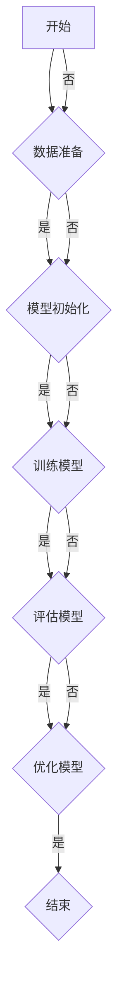

                 

# 《AI编程的新维度与新范式》

> **关键词：** AI编程，新范式，深度学习，元学习，异构计算，分布式计算

> **摘要：** 本文将深入探讨AI编程的新维度和新范式。我们将从AI编程的基础知识出发，逐步介绍深度学习、强化学习等核心概念。随后，我们将深入探讨AI编程的新范式，如元学习、异构计算和分布式计算，并展示其在实际项目中的应用。最后，我们将展望AI编程的未来趋势，探讨其社会影响与伦理问题。

# 目录大纲

## 第一部分：AI编程基础

### 第1章：AI编程概述

#### 1.1 AI编程的背景与重要性

#### 1.2 AI编程与传统编程的差异

#### 1.3 AI编程的核心挑战与机遇

### 第2章：AI编程的核心概念

#### 2.1 数据预处理

##### 2.1.1 数据清洗

##### 2.1.2 数据归一化

##### 2.1.3 特征工程

#### 2.2 机器学习算法

##### 2.2.1 监督学习

##### 2.2.2 无监督学习

##### 2.2.3 强化学习

### 第3章：深度学习基础

#### 3.1 神经网络基础

##### 3.1.1 神经元与层次结构

##### 3.1.2 前向传播与反向传播

#### 3.2 卷积神经网络（CNN）

##### 3.2.1 卷积操作

##### 3.2.2 池化操作

##### 3.2.3 CNN的应用场景

#### 3.3 循环神经网络（RNN）

##### 3.3.1 RNN的基本结构

##### 3.3.2 LSTM与GRU

### 第4章：强化学习基础

#### 4.1 强化学习基本原理

##### 4.1.1 强化学习的定义与基本概念

##### 4.1.2 Q-learning算法

##### 4.1.3 SARSA算法

#### 4.2 多智能体强化学习

##### 4.2.1 多智能体系统的基本概念

##### 4.2.2 协同学习与竞争学习

##### 4.2.3 多智能体强化学习的挑战与解决方案

## 第二部分：新维度AI编程

### 第5章：AI编程的新范式

#### 5.1 元学习

##### 5.1.1 元学习的定义与基本概念

##### 5.1.2 MAML算法

##### 5.1.3 Reptile算法

#### 5.2 异构计算

##### 5.2.1 异构计算的概念与优势

##### 5.2.2 GPU编程基础

##### 5.2.3 FPGA编程基础

#### 5.3 分布式计算

##### 5.3.1 分布式计算的基本概念

##### 5.3.2 分布式训练与推理

##### 5.3.3 分布式系统的挑战与解决方案

### 第6章：AI编程的工程化实践

#### 6.1 AI开发环境搭建

##### 6.1.1 硬件环境配置

##### 6.1.2 软件环境安装

##### 6.1.3 开发工具选择

#### 6.2 数据处理与存储

##### 6.2.1 数据处理流程

##### 6.2.2 数据存储策略

##### 6.2.3 数据流处理框架

#### 6.3 模型训练与优化

##### 6.3.1 模型训练流程

##### 6.3.2 模型调优策略

##### 6.3.3 模型压缩与加速

### 第7章：AI编程的未来趋势

#### 7.1 AI编程的新工具与框架

##### 7.1.1 PyTorch与TensorFlow比较

##### 7.1.2 JAX与TensorFlow的比较

##### 7.1.3 其他新兴框架概述

#### 7.2 AI编程的新应用领域

##### 7.2.1 自然语言处理

##### 7.2.2 计算机视觉

##### 7.2.3 语音识别

#### 7.3 AI编程的社会影响与伦理问题

##### 7.3.1 AI编程对社会的正面影响

##### 7.3.2 AI编程的伦理问题与解决方案

## 附录

### 附录 A：AI编程资源与工具

##### A.1 开源深度学习框架

##### A.2 数据集与工具

##### A.3 在线学习资源与课程

##### A.4 相关会议与期刊

##### A.5 AI编程社区与论坛

### 附录 B：Mermaid流程图示例

mermaid
graph TD
A[开始] --> B{是否完成?}
B -->|是| C{结束}
B -->|否| D{重新开始}

### 附录 C：伪代码示例

python
# 伪代码：监督学习模型训练
function train_model(data, labels, epochs):
    for epoch in range(epochs):
        for sample, label in zip(data, labels):
            predict = model(sample)
            loss = calculate_loss(predict, label)
            model.train_step(sample, label)
    return model

### 附录 D：数学公式与示例

$$
y = \frac{1}{1 + e^{-x}}
$$

**示例**：Sigmoid 函数是一个常用的激活函数，它将输入 $x$ 映射到 $(0,1)$ 范围内的输出值 $y$。该函数的导数可以用来计算模型参数的更新。

### 附录 E：项目实战

#### E.1 实战一：手写数字识别

- 开发环境：Python + TensorFlow
- 数据集：MNIST 数据集
- 源代码实现：
  python
  import tensorflow as tf
  from tensorflow.keras import layers

  model = tf.keras.Sequential([
      layers.Flatten(input_shape=(28, 28)),
      layers.Dense(128, activation='relu'),
      layers.Dense(10, activation='softmax')
  ])

  model.compile(optimizer='adam',
                loss='sparse_categorical_crossentropy',
                metrics=['accuracy'])

  model.fit(x_train, y_train, epochs=5)

- 代码解读与分析：
  - 使用 Flatten 层将输入图像展平为一维数组。
  - 使用 Dense 层构建全连接神经网络，第一层包含 128 个神经元，使用 ReLU 激活函数。
  - 第二层包含 10 个神经元，输出层使用 softmax 激活函数，以实现多分类。

#### E.2 实战二：图像分类

- 开发环境：Python + PyTorch
- 数据集：CIFAR-10 数据集
- 源代码实现：
  python
  import torch
  import torch.nn as nn
  import torchvision

  model = nn.Sequential(
      nn.Conv2d(3, 32, 3, 1),
      nn.ReLU(),
      nn.MaxPool2d(2, 2),
      nn.Conv2d(32, 64, 3, 1),
      nn.ReLU(),
      nn.MaxPool2d(2, 2),
      nn.Flatten(),
      nn.Linear(64 * 6 * 6, 10),
      nn.ReLU(),
      nn.Linear(10, 10)
  )

  criterion = nn.CrossEntropyLoss()
  optimizer = torch.optim.Adam(model.parameters(), lr=0.001)

  for epoch in range(10):
      for inputs, targets in dataloader:
          optimizer.zero_grad()
          outputs = model(inputs)
          loss = criterion(outputs, targets)
          loss.backward()
          optimizer.step()

- 代码解读与分析：
  - 使用两个卷积层，每个卷积层后接 ReLU 激活函数和最大池化层。
  - 将卷积层的输出展平后，通过两个全连接层进行分类。
  - 使用交叉熵损失函数和 Adam 优化器进行模型训练。

## 第一部分：AI编程基础

### 第1章：AI编程概述

#### 1.1 AI编程的背景与重要性

随着人工智能（AI）技术的飞速发展，AI编程已经成为现代计算机科学中的重要分支。AI编程不仅涉及深度学习、强化学习等核心技术，还包括数据预处理、模型训练和优化等一系列环节。AI编程的核心目标是实现机器或计算机具有人类智能的能力，从而在众多领域实现自动化和智能化。

AI编程的背景可以追溯到20世纪50年代，当时人工智能的概念首次被提出。然而，直到最近十年，随着计算能力的提升和大数据技术的成熟，AI编程才真正迎来了爆发期。如今，AI编程已经在自动驾驶、医疗诊断、自然语言处理、图像识别等多个领域取得了显著的应用成果。

AI编程的重要性体现在以下几个方面：

1. **提高生产效率**：通过自动化和智能化，AI编程能够显著提高各行业的生产效率，降低人力成本。
2. **优化决策过程**：AI编程可以处理大量数据，从中提取有价值的信息，帮助企业和机构做出更明智的决策。
3. **创新应用场景**：AI编程为各行业带来了前所未有的创新机会，推动了新技术的产生和发展。
4. **提升生活质量**：AI编程技术在智能家居、智能穿戴设备等领域得到了广泛应用，极大提高了人们的生活质量。

#### 1.2 AI编程与传统编程的差异

AI编程与传统编程在目标、方法和技术层面上存在显著差异。

1. **目标差异**：
   - **传统编程**：主要目标是实现特定功能的软件系统，如操作系统、游戏、办公软件等。
   - **AI编程**：目标是通过训练模型，使机器能够自动学习和适应新环境，实现智能化的任务。

2. **方法差异**：
   - **传统编程**：依赖于算法和逻辑，程序员编写代码来描述解决问题的步骤。
   - **AI编程**：依赖于数据驱动的方法，通过大量数据训练模型，使其自动学习并优化任务。

3. **技术差异**：
   - **传统编程**：主要使用编程语言如C、C++、Java等，侧重于软件工程的各个方面。
   - **AI编程**：不仅使用编程语言，还涉及到机器学习库和框架，如TensorFlow、PyTorch等，以及硬件设备，如GPU、FPGA等。

4. **挑战与机遇**：
   - **传统编程**：面临代码维护、性能优化等挑战，但解决方案相对明确。
   - **AI编程**：面临数据质量、模型可解释性等挑战，但同时也带来了前所未有的创新机会。

#### 1.3 AI编程的核心挑战与机遇

AI编程的核心挑战包括以下几个方面：

1. **数据质量**：AI模型的效果高度依赖于训练数据的质量。数据不完整、噪声和偏差都可能影响模型的性能。

2. **模型可解释性**：深度学习模型通常被视为“黑盒”，其内部决策过程难以解释。这限制了其在某些领域的应用。

3. **计算资源**：训练复杂的AI模型需要大量的计算资源。尽管GPU和FPGA等硬件加速技术提供了帮助，但仍然面临资源瓶颈。

4. **算法选择**：不同的任务和应用场景需要不同的算法。选择合适的算法是一个复杂的过程，需要深入理解任务的本质。

5. **模型部署**：将训练好的模型部署到实际应用中是一个挑战。模型需要适应不同的环境和硬件条件。

尽管存在挑战，AI编程也带来了巨大的机遇：

1. **自动化与智能化**：AI编程使自动化和智能化成为可能，为各行业带来了新的发展机遇。

2. **跨领域应用**：AI编程在医疗、金融、教育等多个领域都有广泛的应用前景。

3. **创新突破**：AI编程推动了新的技术突破，如自动驾驶、智能机器人等。

4. **经济发展**：AI编程相关的产业为全球经济带来了新的增长点。

总的来说，AI编程是一个充满挑战和机遇的领域。随着技术的不断进步，AI编程将在未来发挥越来越重要的作用。

## 第2章：AI编程的核心概念

#### 2.1 数据预处理

在AI编程中，数据预处理是一个至关重要的步骤。它涉及一系列技术和方法，以确保输入数据的质量和一致性，从而提高模型的性能和可靠性。数据预处理通常包括以下几个关键环节：

##### 2.1.1 数据清洗

数据清洗是数据预处理的第一步，目的是识别和纠正数据集中的错误、异常和不一致之处。以下是一些常见的数据清洗任务：

1. **缺失值处理**：缺失值可能是由于数据收集过程中的问题或数据录入错误。处理缺失值的方法包括删除缺失值、填充缺失值或使用统计方法（如平均值、中位数或模式）来估算缺失值。

2. **异常值处理**：异常值可能是由于数据采集或传输过程中的错误。处理异常值的方法包括删除异常值、使用统计方法（如三次样条插值）进行插值或使用机器学习方法（如基于规则的异常检测）进行检测。

3. **重复数据删除**：重复数据可能会影响模型的训练效果，因此需要删除重复的数据项。

4. **不一致数据校正**：数据字段之间的不一致性（如数据格式、单位等）需要进行校正，以确保数据的一致性和可比性。

##### 2.1.2 数据归一化

数据归一化是将不同数据范围的数据转换到同一尺度，以便模型能够更有效地学习和预测。常用的数据归一化方法包括：

1. **最小-最大标准化**：将数据缩放到[0, 1]范围内，公式为 $x_{\text{norm}} = \frac{x - x_{\text{min}}}{x_{\text{max}} - x_{\text{min}}}$。

2. **零-均值标准化**：将数据缩放到均值0和标准差1的范围内，公式为 $x_{\text{norm}} = \frac{x - \mu}{\sigma}$。

3. **小数点移动**：通过将数据的小数点向左或向右移动一定的位数来进行归一化。

数据归一化的目的是消除不同特征之间的尺度差异，使得模型可以更好地处理各种特征。

##### 2.1.3 特征工程

特征工程是数据预处理的核心步骤，旨在从原始数据中提取出有用的信息，构建对模型训练有帮助的特征。以下是一些常见的特征工程方法：

1. **特征选择**：从大量的特征中筛选出对模型训练最有价值的特征，以减少数据维度和计算复杂度。

2. **特征构造**：通过组合现有特征或使用数学变换来创造新的特征，以增强模型的预测能力。

3. **特征变换**：将某些特征进行变换，如对数变换、指数变换等，以改变特征的数据分布。

4. **特征缩放**：对特征进行缩放，如使用归一化或标准化方法，以提高模型的性能。

5. **缺失值处理**：对缺失值进行处理，如使用填充方法或使用机器学习算法中的插值方法。

特征工程的目标是构建一个能够准确反映数据本质的特征集，从而提高模型的性能。

#### 2.2 机器学习算法

机器学习是AI编程的核心组成部分，它涉及一系列算法和模型，用于从数据中自动学习和提取规律。机器学习算法可以分为监督学习、无监督学习和强化学习三种主要类型。

##### 2.2.1 监督学习

监督学习是一种有监督的机器学习方法，其中模型通过已标记的训练数据学习预测目标。监督学习算法分为回归和分类两种类型：

1. **回归**：回归问题旨在预测一个连续的数值输出。常见的回归算法包括线性回归、多项式回归和支持向量机（SVM）。

2. **分类**：分类问题旨在将数据分为预定义的类别。常见的分类算法包括逻辑回归、朴素贝叶斯、决策树和随机森林。

监督学习算法的核心步骤包括：

- **数据预处理**：清洗和归一化数据。
- **模型选择**：根据问题的特点选择合适的算法。
- **模型训练**：使用训练数据训练模型。
- **模型评估**：使用验证数据评估模型的性能。

##### 2.2.2 无监督学习

无监督学习是一种无监督的机器学习方法，其中模型从未标记的数据中自动学习和发现数据中的模式和结构。无监督学习算法主要包括聚类和降维两种类型：

1. **聚类**：聚类问题旨在将数据点划分为若干个聚类，使得同一个聚类内的数据点之间相似度较高，不同聚类之间的相似度较低。常见的聚类算法包括K-means、层次聚类和DBSCAN。

2. **降维**：降维问题旨在减少数据的维度，同时保持数据的结构信息。常见的降维算法包括主成分分析（PCA）、线性判别分析（LDA）和自编码器。

无监督学习算法的核心步骤包括：

- **数据预处理**：清洗和归一化数据。
- **模型选择**：根据问题的特点选择合适的算法。
- **模型训练**：使用训练数据训练模型。
- **模型评估**：通过聚类效果或降维效果来评估模型。

##### 2.2.3 强化学习

强化学习是一种基于奖励机制的机器学习方法，其中模型通过与环境互动来学习最优策略。强化学习算法的核心是优化策略，以最大化长期奖励。常见的强化学习算法包括Q-learning、SARSA和深度Q网络（DQN）。

强化学习算法的核心步骤包括：

- **环境定义**：定义环境的规则和状态空间。
- **策略学习**：使用奖励信号来优化策略。
- **策略评估**：评估策略的长期奖励。
- **策略迭代**：根据评估结果更新策略。

总的来说，机器学习算法为AI编程提供了强大的工具，使我们能够从数据中提取有用的信息，实现智能化的任务。

## 第3章：深度学习基础

#### 3.1 神经网络基础

神经网络（Neural Networks）是深度学习（Deep Learning）的核心组成部分，其灵感来源于生物神经系统的工作原理。神经网络由大量的神经元（节点）和连接（边）组成，通过这些节点和连接的相互作用来实现数据的学习和处理。

##### 3.1.1 神经元与层次结构

1. **神经元**：神经网络中的基本单位是神经元，也称为节点或单元。每个神经元接收来自其他神经元的输入信号，通过加权求和处理，产生一个输出信号。

   **公式**：  
   $$  
   y = \sum_{i=1}^{n} w_i x_i + b  
   $$

   其中，$y$ 是神经元的输出，$w_i$ 是输入信号的权重，$x_i$ 是输入信号，$b$ 是偏置。

2. **层次结构**：神经网络可以分为输入层、隐藏层和输出层。输入层接收外部输入，隐藏层对输入进行变换和加工，输出层产生最终的输出。

   - **输入层**：接收外部输入，如图像、文本或声音。
   - **隐藏层**：对输入进行变换和加工，隐藏层可以有多个层次。
   - **输出层**：产生最终输出，如分类结果或预测值。

##### 3.1.2 前向传播与反向传播

1. **前向传播**：在前向传播过程中，输入信号从输入层传递到隐藏层，再传递到输出层。每个层都通过加权求和处理产生输出。

   **步骤**：
   - 初始化权重和偏置。
   - 将输入信号传递到第一层（输入层）。
   - 计算每个神经元的输出。
   - 将输出传递到下一层。
   - 重复上述过程，直到输出层。

2. **反向传播**：在反向传播过程中，根据输出误差，调整神经网络的权重和偏置，以减少误差。

   **步骤**：
   - 计算输出层的误差。
   - 将误差反向传递到隐藏层。
   - 计算隐藏层的误差。
   - 更新权重和偏置。
   - 重复上述过程，直到输入层。

反向传播是神经网络训练的核心，它通过不断调整权重和偏置，使网络输出逐渐逼近真实值。

#### 3.2 卷积神经网络（CNN）

卷积神经网络（Convolutional Neural Network，CNN）是一种专门用于处理图像数据的神经网络。CNN的核心特点是使用卷积操作来提取图像特征，并通过多层卷积和池化操作来增强特征提取能力。

##### 3.2.1 卷积操作

卷积操作是一种数学运算，用于计算输入图像和滤波器（也称为卷积核）之间的点积。通过卷积操作，可以提取输入图像的局部特征。

**公式**：  
$$  
\text{卷积} = \sum_{i=1}^{k} w_{i} \cdot x_{i}  
$$

其中，$w_i$ 是滤波器的权重，$x_i$ 是输入图像的像素值。

卷积操作的核心步骤包括：

- **初始化卷积核**：随机初始化卷积核的权重。
- **卷积计算**：对输入图像的每个像素点进行卷积计算。
- **激活函数**：对卷积结果应用激活函数，如ReLU函数。

##### 3.2.2 池化操作

池化操作用于降低图像的维度和减少参数数量，从而提高模型的效率和泛化能力。常见的池化操作包括最大池化和平均池化。

- **最大池化**：在滑动窗口内选择最大值作为输出。
- **平均池化**：在滑动窗口内计算平均值作为输出。

**公式**：  
$$  
\text{最大池化} = \max\{x_{i,j}, \forall i, j \in \text{窗口}\}  
$$

**公式**：  
$$  
\text{平均池化} = \frac{1}{|\text{窗口}|} \sum_{i,j} x_{i,j}  
$$

池化操作的核心步骤包括：

- **初始化窗口大小**：选择合适的窗口大小。
- **滑动窗口**：在图像上滑动窗口，进行池化操作。
- **输出**：生成池化后的图像。

##### 3.2.3 CNN的应用场景

CNN在图像处理领域有着广泛的应用，包括：

- **图像分类**：如ImageNet挑战赛，通过训练大规模图像数据集，实现对数百万类别的图像分类。
- **目标检测**：如YOLO（You Only Look Once）算法，通过检测图像中的目标位置和类别，实现实时目标检测。
- **图像分割**：如FCN（Fully Convolutional Network）算法，通过将图像像素分类到不同的类别，实现图像的像素级分割。

CNN通过卷积和池化操作，能够自动学习图像的层次特征，从而实现高效的图像处理任务。

#### 3.3 循环神经网络（RNN）

循环神经网络（Recurrent Neural Network，RNN）是一种能够处理序列数据的神经网络。RNN的核心特点是具有循环结构，使网络能够记忆和利用历史信息。

##### 3.3.1 RNN的基本结构

RNN的基本结构包括输入层、隐藏层和输出层。输入层接收序列数据，隐藏层对输入进行变换和记忆，输出层产生最终的输出。

**公式**：  
$$  
h_t = \sigma(W_h \cdot [h_{t-1}, x_t] + b_h)  
$$

**公式**：  
$$  
y_t = \sigma(W_y \cdot h_t + b_y)  
$$

其中，$h_t$ 是隐藏层的状态，$x_t$ 是输入序列，$W_h$ 和 $W_y$ 是权重矩阵，$b_h$ 和 $b_y$ 是偏置。

##### 3.3.2 LSTM与GRU

LSTM（Long Short-Term Memory）和GRU（Gated Recurrent Unit）是RNN的两种变体，它们通过引入门控机制来克服RNN的梯度消失问题，从而更好地处理长序列数据。

1. **LSTM（长短期记忆）**：LSTM通过引入三个门控机制（遗忘门、输入门和输出门）来控制信息的流动。

   - **遗忘门**：决定遗忘哪些旧信息。
   - **输入门**：决定保留哪些新信息。
   - **输出门**：决定输出哪些信息。

2. **GRU（门控循环单元）**：GRU通过合并遗忘门和输入门，简化了LSTM的结构。

   - **重置门**：决定遗忘哪些旧信息。
   - **更新门**：决定保留哪些新信息。

LSTM和GRU在处理长序列数据时表现出更好的性能，广泛应用于自然语言处理、语音识别和时间序列预测等领域。

#### 3.4 CNN与RNN的结合

CNN和RNN在图像和序列数据处理中各自具有优势。结合CNN和RNN，可以更好地处理复杂的序列图像数据，如图像序列或视频。

一种常见的结合方法是使用卷积层提取图像特征，然后使用RNN处理序列信息。这种结合方法被称为卷积循环神经网络（Convolutional Recurrent Neural Network，CRNN）。

CRNN通过卷积层提取图像特征，然后使用RNN处理序列信息，从而实现高效的图像序列处理。CRNN在视频分类、动作识别和语音识别等领域取得了显著的应用成果。

#### 3.5 深度学习框架

深度学习框架是用于构建和训练深度学习模型的高层工具。常见的深度学习框架包括TensorFlow、PyTorch和Keras等。

- **TensorFlow**：由Google开发，是一种开源的深度学习框架，提供了丰富的API和工具，支持多种深度学习模型的构建和训练。
- **PyTorch**：由Facebook开发，是一种开源的深度学习框架，具有动态计算图和易于调试的特点，广泛应用于学术研究和工业应用。
- **Keras**：是一种基于TensorFlow和Theano的开源深度学习框架，提供了简洁和易用的API，适用于快速实验和模型开发。

这些框架为深度学习研究和应用提供了强大的支持，使深度学习模型的设计和训练更加高效和便捷。

总的来说，深度学习基础为AI编程提供了强大的工具和理论支持。通过理解神经网络、卷积神经网络和循环神经网络的基本原理，我们可以更好地构建和训练深度学习模型，实现高效的图像和序列数据处理。

## 第4章：强化学习基础

#### 4.1 强化学习基本原理

强化学习（Reinforcement Learning，RL）是一种机器学习方法，通过学习如何在环境中采取行动以最大化累积奖励。与监督学习和无监督学习不同，强化学习依赖于奖励信号来指导学习过程。强化学习的基本原理可以概括为以下几个核心概念：

##### 4.1.1 强化学习的定义与基本概念

强化学习是一种通过与环境的交互来学习最优策略的机器学习方法。在强化学习中，智能体（Agent）处于一个环境中，通过感知环境的状态（State），采取行动（Action），并接收环境返回的奖励（Reward）。通过不断尝试和错误，智能体逐渐学习到最优策略（Policy），从而在长期内实现累积奖励的最大化。

**基本概念：**

- **状态（State）**：智能体在环境中的当前情况。
- **行动（Action）**：智能体可以采取的动作。
- **奖励（Reward）**：环境对智能体采取的行动给出的即时反馈。
- **策略（Policy）**：智能体在给定状态下采取行动的规则。
- **价值函数（Value Function）**：预测在特定状态下采取特定行动的未来累积奖励。
- **模型（Model）**：对环境状态和行动的表征。

##### 4.1.2 Q-learning算法

Q-learning是一种值迭代算法，用于求解强化学习问题中的最优策略。Q-learning的核心思想是通过更新Q值（状态-行动值函数）来优化策略。Q值表示在特定状态下采取特定行动的未来累积奖励。

**公式**：  
$$  
Q(s, a) \leftarrow Q(s, a) + \alpha [r + \gamma \max_{a'} Q(s', a') - Q(s, a)]  
$$

其中，$s$ 是状态，$a$ 是行动，$r$ 是奖励，$\alpha$ 是学习率，$\gamma$ 是折扣因子，$s'$ 是下一状态，$a'$ 是下一行动。

Q-learning算法的步骤包括：

1. **初始化Q值**：随机初始化Q值。
2. **选择行动**：根据当前状态选择一个行动。
3. **执行行动**：在环境中执行选择的行动。
4. **更新Q值**：根据实际获得的奖励和下一状态的最优Q值更新当前状态-行动的Q值。
5. **重复步骤2-4**：重复上述过程，直到收敛到最优策略。

##### 4.1.3 SARSA算法

SARSA（State-Action-Reward-State-Action）算法是一种基于策略的强化学习算法，它同时考虑当前状态和下一状态的信息来更新策略。SARSA算法的核心思想是通过更新当前状态-行动的Q值来优化策略。

**公式**：  
$$  
Q(s, a) \leftarrow Q(s, a) + \alpha [r + \gamma Q(s', a')] - Q(s, a)]  
$$

SARSA算法的步骤包括：

1. **初始化Q值**：随机初始化Q值。
2. **选择行动**：根据当前状态选择一个行动。
3. **执行行动**：在环境中执行选择的行动。
4. **更新Q值**：根据实际获得的奖励和下一状态的选择行动的Q值更新当前状态-行动的Q值。
5. **重复步骤2-4**：重复上述过程，直到收敛到最优策略。

##### 4.1.4 Q-learning与SARSA的比较

Q-learning和SARSA都是求解强化学习问题的常用算法，但它们之间存在一些关键区别：

- **目标函数**：Q-learning的目标是最大化Q值，而SARSA的目标是最大化当前状态-行动的Q值。
- **更新策略**：Q-learning使用贪婪策略来选择最优行动，而SARSA使用当前策略来选择行动。
- **收敛速度**：SARSA通常比Q-learning收敛得快，因为它同时考虑了当前状态和下一状态的信息。

总的来说，Q-learning和SARSA都是强化学习中的重要算法，适用于不同类型的强化学习问题。通过理解这些算法的基本原理，我们可以更好地设计智能体在复杂环境中的行为。

#### 4.2 多智能体强化学习

多智能体强化学习（Multi-Agent Reinforcement Learning，MARL）是一种研究多个智能体在合作或对抗环境中学习策略的机器学习方法。在MARL中，智能体通过互动和协作来优化自身的性能，同时考虑其他智能体的行为。多智能体强化学习在多个领域具有重要的应用价值，如游戏、自动化控制、社会网络等。

##### 4.2.1 多智能体系统的基本概念

多智能体系统（Multi-Agent System，MAS）是由多个相互合作的智能体组成的系统。每个智能体具有独立的决策能力和自主性，同时需要与其他智能体进行交互和协作。多智能体系统的核心概念包括：

- **智能体**：具有独立决策能力和自主性的个体，可以是一个软件程序、机器人或人类。
- **环境**：智能体所处的场景，可以是一个物理环境或虚拟环境。
- **状态**：描述智能体和环境的当前情况。
- **行动**：智能体可以采取的动作。
- **策略**：智能体在给定状态下采取行动的规则。

##### 4.2.2 协同学习与竞争学习

在多智能体强化学习中，智能体可以采取不同的学习策略，包括协同学习和竞争学习。

- **协同学习**：智能体通过合作和协作来最大化整体性能。协同学习的目标是使多个智能体共同实现一个共同的目标，如最大化团队的奖励总和。协同学习的常见算法包括合作Q学习（Cooperative Q-learning）和多智能体深度强化学习（Multi-Agent Deep Reinforcement Learning）。

- **竞争学习**：智能体通过竞争和对抗来优化自身的性能。竞争学习的目标是使单个智能体在多个竞争者中脱颖而出，如实现最大个人奖励。竞争学习的常见算法包括对抗性Q学习（Adversarial Q-learning）和多人博弈强化学习（Multi-Agent Game Reinforcement Learning）。

##### 4.2.3 多智能体强化学习的挑战与解决方案

多智能体强化学习面临一系列挑战，包括多智能体协调、不确定性处理和计算复杂性等。

- **多智能体协调**：在多智能体系统中，智能体之间的协调是一个关键问题。为了实现高效的协作，智能体需要共享信息、协调行动，并处理冲突。解决协调问题的方法包括基于通信的协调算法（如消息传递算法）和基于博弈论的协调算法（如纳什均衡）。

- **不确定性处理**：多智能体强化学习中的不确定性主要来自环境的不确定性和智能体行为的不确定性。为了应对不确定性，智能体需要采用鲁棒学习策略，如基于概率模型的策略学习和基于蒙特卡罗方法的策略评估。

- **计算复杂性**：多智能体强化学习通常涉及大量的计算资源和时间。为了降低计算复杂性，可以采用分布式计算和并行计算技术，如使用多处理器和GPU进行模型训练和推理。

总的来说，多智能体强化学习是一个充满挑战和机遇的领域。通过深入研究协同学习和竞争学习的算法和理论，我们可以设计出更高效、更智能的多智能体系统。

## 第二部分：新维度AI编程

### 第5章：AI编程的新范式

随着人工智能技术的不断进步，AI编程也在不断演变，涌现出许多新的范式和方法。这些新范式不仅扩展了AI编程的边界，还带来了前所未有的效率和性能提升。本章将重点介绍元学习、异构计算和分布式计算等新范式，探讨其在AI编程中的应用和优势。

#### 5.1 元学习

元学习（Meta-Learning）是一种使模型能够在多个任务上快速学习的能力。传统的机器学习方法通常需要针对每个任务单独训练模型，而元学习旨在通过跨任务的迁移学习，提高模型的泛化能力和学习效率。元学习的关键在于学习如何学习，其核心思想是通过训练一个“元模型”，使得这个模型在新的任务上能够快速适应。

##### 5.1.1 元学习的定义与基本概念

元学习可以定义为“学习如何学习”的过程。它涉及两个层次的学习：基础学习和元学习。基础学习是指模型在特定任务上的学习过程，而元学习是指模型在多个任务上学习如何快速适应新任务的过程。

**基本概念：**

- **元模型（Meta-Model）**：用于表示基础学习过程的模型。
- **适应过程（ Adaptation Process）**：元模型在新任务上的快速训练过程。
- **迁移学习（Transfer Learning）**：将已学习到的知识应用于新任务的学习过程。

##### 5.1.2 MAML算法

MAML（Model-Agnostic Meta-Learning）是一种流行的元学习算法，其核心思想是通过小批量梯度更新，使得模型能够在多个任务上快速适应。MAML的关键特点是模型参数对所有任务都是共享的，通过在一个元学习任务集上训练模型，使得模型在新的任务上能够快速收敛。

**MAML算法步骤：**

1. **初始化模型参数**：随机初始化模型参数。
2. **训练元模型**：在元学习任务集上训练模型，通过小批量梯度更新，使得模型参数能够适应不同任务。
3. **适应新任务**：在新任务上通过小批量梯度更新，快速调整模型参数，使其在新任务上达到良好的性能。
4. **评估性能**：在验证集上评估模型的性能，确保模型在新的任务上具有较好的泛化能力。

##### 5.1.3 Reptile算法

Reptile是另一种流行的元学习算法，它通过逐步更新模型参数，实现模型在多个任务上的快速适应。Reptile的核心思想是将模型参数逐步迁移到新任务上，通过较小的学习率来控制参数更新的速度。

**Reptile算法步骤：**

1. **初始化模型参数**：随机初始化模型参数。
2. **训练基础模型**：在基础任务上训练模型，使其达到良好的性能。
3. **逐步适应新任务**：在新任务上，通过逐步调整模型参数，使其在新任务上达到更好的性能。每次更新都使用较小的学习率，以避免参数过度调整。
4. **评估性能**：在验证集上评估模型的性能，确保模型在新的任务上具有较好的泛化能力。

总的来说，元学习为AI编程带来了新的维度和效率。通过元学习算法，模型能够在多个任务上快速适应，显著降低了训练时间和计算资源的需求。

#### 5.2 异构计算

异构计算（Heterogeneous Computing）是一种利用不同类型计算硬件（如CPU、GPU、FPGA等）协同工作，以实现高性能计算的方法。传统的计算架构主要依赖于中央处理器（CPU），而异构计算通过引入多种计算硬件，提高了计算效率和性能。

##### 5.2.1 异构计算的概念与优势

**概念：**

异构计算是指在一个计算系统中，使用不同类型的硬件（如CPU、GPU、FPGA等）协同工作，以实现特定的计算任务。每种硬件具有不同的计算能力和特点，通过合理分配计算任务，可以实现更高的计算效率和性能。

**优势：**

- **计算能力提升**：通过使用多种硬件，异构计算可以显著提高计算能力，特别是在大规模数据处理和复杂计算任务中。
- **能耗降低**：与单一硬件相比，异构计算可以更有效地利用计算资源，从而降低能耗。
- **可扩展性**：异构计算系统可以根据需求灵活地扩展硬件资源，提高系统的可扩展性。

##### 5.2.2 GPU编程基础

图形处理器（GPU）是异构计算中常用的硬件之一，它通过并行计算架构，提供了强大的计算能力。GPU编程主要包括以下几个方面：

- **计算内核（Kernel）**：GPU编程的核心是计算内核，它是在GPU上运行的并行程序。计算内核通过SIMD（单指令多数据）架构，同时处理多个数据。
- **内存管理**：GPU内存分为全局内存、共享内存和寄存器，合理管理这些内存资源可以显著提高程序的效率。
- **线程管理**：GPU编程涉及线程的管理，包括线程的创建、调度和同步。通过合理设计线程结构，可以充分利用GPU的并行计算能力。

##### 5.2.3 FPGA编程基础

现场可编程门阵列（FPGA）是一种可重配置的逻辑器件，它通过硬件描述语言（如VHDL或Verilog）进行编程，以实现特定的计算任务。

**FPGA编程基础：**

- **硬件描述语言（HDL）**：FPGA编程使用硬件描述语言（如VHDL或Verilog），这些语言可以描述电路的行为和结构。
- **逻辑单元（Logic Cells）**：FPGA由大量的逻辑单元组成，包括触发器、寄存器和逻辑门等，通过这些逻辑单元可以实现复杂的计算功能。
- **配置与调试**：FPGA编程涉及将设计代码转换为硬件布局，并通过配置器将设计下载到FPGA中。调试过程包括验证硬件功能和性能。

总的来说，异构计算通过引入多种计算硬件，提高了AI编程的计算效率和性能。通过掌握GPU和FPGA编程基础，我们可以充分发挥异构计算的优势，实现高效的AI应用。

#### 5.3 分布式计算

分布式计算（Distributed Computing）是一种通过将计算任务分布在多个计算机上协同工作，以实现高效计算的方法。分布式计算在处理大规模数据和复杂计算任务中具有显著优势。

##### 5.3.1 分布式计算的基本概念

**基本概念：**

- **计算节点（Computational Node）**：分布式计算系统中的基本计算单元，可以是普通的计算机或服务器。
- **任务调度（Task Scheduling）**：将计算任务分配给不同的计算节点，以实现并行计算。
- **通信网络（Communication Network）**：连接计算节点，用于任务数据传输和协调。

分布式计算的关键在于任务调度和负载均衡，通过合理分配计算任务，可以实现高效的计算和资源利用。

##### 5.3.2 分布式训练与推理

**分布式训练**：在深度学习模型训练过程中，分布式计算可以将训练任务分布在多个计算节点上，以提高训练效率和性能。分布式训练的主要方法包括数据并行和模型并行。

- **数据并行（Data Parallelism）**：将训练数据分成多个子集，每个计算节点独立训练自己的模型，并在全局梯度更新时进行同步。
- **模型并行（Model Parallelism）**：将深度学习模型拆分为多个部分，每个计算节点负责计算模型的一部分，并通过通信网络进行协同。

**分布式推理**：在深度学习模型推理过程中，分布式计算可以将推理任务分布在多个计算节点上，以提高推理效率和性能。分布式推理的主要方法包括数据并行和模型并行。

- **数据并行（Data Parallelism）**：将输入数据分成多个子集，每个计算节点独立进行推理，并将结果汇总。
- **模型并行（Model Parallelism）**：将深度学习模型拆分为多个部分，每个计算节点负责计算模型的一部分，并通过通信网络进行协同。

##### 5.3.3 分布式系统的挑战与解决方案

分布式计算面临一系列挑战，包括数据同步、负载均衡和容错性等。

- **数据同步**：在分布式计算中，确保不同计算节点上的数据一致性是一个关键问题。解决数据同步的方法包括一致性协议（如Paxos算法）和数据复制。
- **负载均衡**：在分布式系统中，合理分配计算任务，以避免某些节点负载过重，影响整体性能。解决负载均衡的方法包括动态负载均衡和静态负载均衡。
- **容错性**：在分布式计算中，确保系统在节点故障时能够继续运行是一个关键问题。解决容错性的方法包括冗余设计和故障转移。

总的来说，分布式计算通过将计算任务分布在多个节点上，提高了计算效率和性能。通过解决分布式计算中的关键挑战，我们可以实现高效的AI应用。

## 第6章：AI编程的工程化实践

随着AI技术的不断成熟，AI编程的工程化实践变得越来越重要。工程化实践不仅包括AI模型的选择与实现，还包括数据管理、模型训练与优化等一系列环节。本章将深入探讨AI编程的工程化实践，包括开发环境搭建、数据处理与存储、模型训练与优化等内容，旨在为读者提供全面的AI编程实践指导。

### 6.1 AI开发环境搭建

搭建一个高效、稳定的AI开发环境是进行AI编程的第一步。一个良好的开发环境可以显著提高开发效率，降低出错率。以下是搭建AI开发环境的关键步骤：

##### 6.1.1 硬件环境配置

为了确保AI模型能够高效运行，需要选择合适的硬件配置。以下是硬件配置的建议：

- **CPU**：选择具有高性能和低延迟的CPU，如Intel的Xeon系列或AMD的Ryzen系列。
- **GPU**：GPU在深度学习模型训练中至关重要，选择具有高计算能力的GPU，如NVIDIA的Titan系列或RTX系列。
- **内存**：确保系统具有足够的内存，以避免内存瓶颈。建议至少配备16GB或更高内存。
- **存储**：选择具有高速读写性能的存储设备，如SSD硬盘，以提高数据加载和存储速度。

##### 6.1.2 软件环境安装

在硬件环境配置完成后，需要安装软件环境。以下是常见的AI编程软件环境：

- **操作系统**：推荐使用Linux操作系统，如Ubuntu或CentOS，因为Linux具有更好的兼容性和性能。
- **Python**：Python是AI编程的主要语言，确保安装最新版本的Python（建议3.8及以上版本）。
- **深度学习库**：安装常用的深度学习库，如TensorFlow、PyTorch、Keras等。
- **其他依赖**：安装必要的依赖库，如NumPy、Pandas、Matplotlib等。

以下是一个简单的Python环境安装命令：

```shell
sudo apt-get update
sudo apt-get install python3 python3-pip
pip3 install numpy pandas matplotlib tensorflow
```

##### 6.1.3 开发工具选择

选择合适的开发工具可以提高开发效率。以下是一些常用的开发工具：

- **集成开发环境（IDE）**：推荐使用PyCharm、Visual Studio Code等IDE，它们提供了丰富的编程功能，如代码补全、调试和版本控制。
- **版本控制系统**：推荐使用Git进行版本控制，确保代码的版本管理和协作开发。
- **数据可视化工具**：如Matplotlib、Seaborn等，用于数据分析和可视化。
- **容器化工具**：如Docker，用于创建和运行独立的开发环境，提高开发环境的可移植性和一致性。

### 6.2 数据处理与存储

数据处理和存储是AI编程的重要环节，直接影响到模型的性能和训练效率。以下是一些关键的数据处理与存储策略：

##### 6.2.1 数据处理流程

一个典型的人工智能数据处理流程包括以下几个步骤：

1. **数据收集**：收集所需的原始数据，可以是结构化数据（如数据库）或非结构化数据（如图像、文本）。
2. **数据清洗**：对原始数据进行清洗，包括缺失值处理、异常值处理和重复数据删除等。
3. **数据归一化**：对数据进行归一化处理，使其具有相似的尺度，以利于模型的训练。
4. **特征工程**：提取有用的特征，如文本中的关键词、图像中的边缘特征等，以增强模型的性能。
5. **数据分割**：将数据分割为训练集、验证集和测试集，用于模型的训练和评估。

##### 6.2.2 数据存储策略

在数据处理过程中，数据存储策略也是至关重要的。以下是一些常见的存储策略：

1. **关系型数据库**：适用于存储结构化数据，如MySQL、PostgreSQL等。
2. **NoSQL数据库**：适用于存储非结构化数据，如MongoDB、Redis等。
3. **文件系统**：适用于存储大量文件，如HDFS（Hadoop Distributed File System）。
4. **分布式存储系统**：适用于存储大规模数据，如Hadoop、Spark等。

选择合适的存储策略可以提高数据的读取和写入速度，从而提高数据处理效率。

##### 6.2.3 数据流处理框架

在实际应用中，数据流处理框架（如Apache Kafka、Apache Flink、Apache Spark）可以用于实时处理大规模数据流，从而提高AI模型的响应速度和准确性。以下是一些常见的数据流处理框架：

- **Apache Kafka**：是一种分布式流处理平台，用于构建实时数据流系统。
- **Apache Flink**：是一种开源流处理框架，提供了高效的数据流处理和批处理能力。
- **Apache Spark**：是一种通用数据处理框架，可以用于批处理和实时处理，具有高效的数据存储和处理能力。

总的来说，数据处理与存储是AI编程的重要环节。通过合理的数据处理流程和存储策略，我们可以有效地处理和存储大量数据，从而提高AI模型的性能和准确性。

### 6.3 模型训练与优化

模型训练与优化是AI编程的核心任务，其目的是通过训练数据优化模型参数，提高模型的性能和泛化能力。以下是一些关键的模型训练与优化策略：

##### 6.3.1 模型训练流程

一个典型的模型训练流程包括以下几个步骤：

1. **数据准备**：准备训练数据，包括数据清洗、归一化和特征提取等。
2. **模型初始化**：初始化模型参数，可以使用随机初始化、预训练模型等方法。
3. **模型训练**：使用训练数据训练模型，通过优化算法（如梯度下降、Adam等）更新模型参数。
4. **模型评估**：使用验证数据评估模型性能，通过调整超参数（如学习率、批量大小等）优化模型。
5. **模型测试**：使用测试数据测试模型性能，确保模型在未知数据上具有良好的泛化能力。

##### 6.3.2 模型调优策略

模型调优是提高模型性能的重要手段。以下是一些常用的模型调优策略：

1. **超参数调优**：通过调整学习率、批量大小、正则化参数等超参数，优化模型性能。常用的调优方法包括随机搜索、网格搜索和贝叶斯优化等。
2. **数据增强**：通过增加数据的多样性，提高模型的泛化能力。常见的数据增强方法包括旋转、翻转、裁剪等。
3. **正则化**：通过添加正则化项（如L1、L2正则化）惩罚过拟合，提高模型泛化能力。
4. **集成学习**：通过结合多个模型，提高模型性能和稳定性。常见的集成学习方法包括Bagging、Boosting和Stacking等。

##### 6.3.3 模型压缩与加速

在实际应用中，模型的压缩与加速也是重要的考虑因素。以下是一些常用的模型压缩与加速方法：

1. **权重共享**：通过共享模型权重，减少参数数量，降低计算复杂度。
2. **模型剪枝**：通过删除不重要的模型参数，减少模型大小和计算复杂度。
3. **量化**：通过将模型参数和激活值转换为较低精度的表示，降低模型大小和计算复杂度。
4. **并行计算**：通过分布式计算和并行计算，提高模型训练和推理速度。

总的来说，模型训练与优化是AI编程的核心任务。通过合理的模型训练流程、调优策略和压缩与加速方法，我们可以实现高效、准确的AI应用。

## 第7章：AI编程的未来趋势

随着人工智能技术的不断进步，AI编程也在不断演变，展现出许多新的趋势。本章将深入探讨AI编程的未来趋势，包括新工具与框架、新应用领域和社会影响与伦理问题。

### 7.1 AI编程的新工具与框架

随着AI技术的快速发展，新的深度学习工具和框架不断涌现，为AI编程带来了新的机遇和挑战。以下是一些重要的AI编程工具与框架：

#### 7.1.1 PyTorch与TensorFlow比较

PyTorch和TensorFlow是目前最受欢迎的两个深度学习框架，它们各自具有独特的优势和特点。

- **PyTorch**：PyTorch是由Facebook AI Research（FAIR）开发的开源深度学习框架，具有动态计算图和易于调试的特点。PyTorch提供了丰富的API和工具，使得研究人员和开发者能够轻松构建和训练深度学习模型。PyTorch的动态计算图使得模型开发更加灵活，但同时也增加了计算复杂性。
  
- **TensorFlow**：TensorFlow是由Google开发的开源深度学习框架，具有静态计算图和高效计算的特点。TensorFlow的静态计算图使得模型优化和推理速度更快，但模型开发相对较复杂。TensorFlow在工业界和学术界都有广泛的应用，其生态系统也非常丰富。

PyTorch和TensorFlow都在不断更新和改进，为AI编程提供了强大的支持。

#### 7.1.2 JAX与TensorFlow的比较

JAX是一种由Google开发的开源深度学习框架，与TensorFlow相比，JAX在以下几个方面具有优势：

- **自动微分**：JAX提供了强大的自动微分功能，使得模型开发和优化更加便捷。自动微分可以自动计算模型参数的梯度，从而简化了模型训练过程。

- **异构计算**：JAX支持异构计算，包括CPU、GPU和TPU等，使得模型能够在多种硬件平台上高效运行。JAX的异构计算能力使得模型训练和推理速度更快。

- **模块化设计**：JAX采用模块化设计，使得模型开发和优化更加灵活。JAX的模块化设计也使得与其他计算框架的集成更加方便。

虽然JAX在某些方面具有优势，但TensorFlow在生态系统和社区支持方面仍然占据领先地位。

#### 7.1.3 其他新兴框架概述

除了PyTorch、TensorFlow和JAX，还有许多其他新兴的深度学习框架，如MXNet、Caffe2、Theano等。这些框架各具特色，为AI编程提供了多样化的选择。

- **MXNet**：MXNet是Apache Software Foundation的一个开源深度学习框架，由Apache MXNet社区维护。MXNet具有灵活的编程接口和高效的计算能力，适用于大规模分布式训练和推理。

- **Caffe2**：Caffe2是由Facebook开发的一个深度学习框架，它是Caffe的继任者。Caffe2具有模块化设计和高效的计算性能，适用于实时图像处理和视频分析。

- **Theano**：Theano是一个基于Python的开源深度学习库，由蒙特利尔大学开发。Theano提供强大的自动微分功能，并支持多种硬件平台。虽然Theano已经不再维护，但它在深度学习发展史上具有重要意义。

总的来说，随着深度学习技术的不断进步，新的工具和框架不断涌现，为AI编程带来了新的机遇和挑战。选择合适的工具和框架，可以显著提高AI编程的效率和性能。

### 7.2 AI编程的新应用领域

AI编程在各个领域都展现出了巨大的应用潜力，以下是一些重要的AI编程新应用领域：

#### 7.2.1 自然语言处理

自然语言处理（Natural Language Processing，NLP）是AI编程的一个重要领域，旨在使计算机理解和生成自然语言。随着深度学习技术的发展，NLP取得了显著进展。

- **文本分类**：使用深度学习模型（如卷积神经网络、循环神经网络和Transformer）对文本进行分类，广泛应用于情感分析、新闻分类和垃圾邮件检测等领域。
- **机器翻译**：基于神经网络的机器翻译（如Seq2Seq模型和Attention机制）取得了突破性进展，使得翻译质量大幅提升。
- **问答系统**：使用深度学习模型构建智能问答系统，如基于BERT的问答模型和生成式问答模型，可以处理复杂的问题和生成准确的答案。

#### 7.2.2 计算机视觉

计算机视觉（Computer Vision）是AI编程的另一个重要领域，旨在使计算机能够理解和解释视觉信息。深度学习技术在计算机视觉中发挥了重要作用。

- **图像分类**：使用卷积神经网络（如LeNet、AlexNet、ResNet等）对图像进行分类，广泛应用于图像识别、目标检测和图像分割等领域。
- **目标检测**：基于深度学习的目标检测算法（如R-CNN、Fast R-CNN、Faster R-CNN、YOLO等）实现了实时目标检测，广泛应用于自动驾驶、安防监控和智能监控等领域。
- **图像生成**：基于生成对抗网络（GAN）的图像生成技术，可以生成高质量的自然图像，应用于艺术创作、游戏开发和虚拟现实等领域。

#### 7.2.3 语音识别

语音识别（Speech Recognition）是AI编程的另一个重要领域，旨在使计算机能够理解和解释语音信号。深度学习技术在语音识别中发挥了重要作用。

- **语音识别**：使用深度神经网络（如卷积神经网络、循环神经网络和Transformer）进行语音识别，实现了高准确率的语音识别。
- **语音合成**：基于深度神经网络（如WaveNet、Tacotron等）的语音合成技术，可以生成自然流畅的语音。
- **语音交互**：结合语音识别和语音合成技术，构建智能语音交互系统，广泛应用于智能音箱、智能客服和智能语音助手等领域。

总的来说，AI编程的新应用领域不断拓展，为各个行业带来了新的机遇和变革。随着技术的不断进步，AI编程将继续在各个领域发挥重要作用。

### 7.3 AI编程的社会影响与伦理问题

AI编程的发展对社会产生了深远的影响，同时也引发了一系列伦理问题。以下是一些关键的AI编程社会影响与伦理问题：

#### 7.3.1 AI编程对社会的正面影响

AI编程在多个领域带来了显著的正面影响：

- **提高生产力**：AI编程使得自动化和智能化成为可能，提高了各行业的生产效率和生产力。
- **优化决策过程**：AI编程能够处理大量数据，从中提取有价值的信息，帮助企业和机构做出更明智的决策。
- **创新应用场景**：AI编程为各行业带来了前所未有的创新机会，推动了新技术的产生和发展。
- **提升生活质量**：AI编程技术在智能家居、医疗保健、教育等领域得到了广泛应用，极大提高了人们的生活质量。

#### 7.3.2 AI编程的伦理问题与解决方案

尽管AI编程带来了许多好处，但也引发了一系列伦理问题：

- **隐私保护**：AI编程需要大量数据，这可能涉及个人隐私。为了保护个人隐私，需要制定严格的隐私保护法规和数据安全措施。
- **算法公平性**：AI算法可能存在偏见，导致不公平的决策。为了确保算法公平性，需要开发透明、可解释的算法，并加强对算法的监管。
- **失业风险**：AI编程可能导致某些职业的失业，对社会就业产生负面影响。为了应对这一挑战，需要提供新的就业机会和培训计划，帮助劳动力适应新的技术环境。
- **伦理决策**：在AI编程中，特别是在自动驾驶等高风险领域，需要制定明确的伦理准则，以确保AI系统的行为符合道德规范。

总的来说，AI编程对社会产生了深远的影响，同时也引发了一系列伦理问题。通过制定合理的法规和政策，加强伦理监管，可以确保AI编程的发展造福人类。

## 附录

### 附录 A：AI编程资源与工具

以下是AI编程领域的一些重要资源与工具：

#### A.1 开源深度学习框架

- **TensorFlow**：由Google开发的开源深度学习框架，支持多种编程语言，广泛应用于学术研究和工业应用。
- **PyTorch**：由Facebook AI Research（FAIR）开发的开源深度学习框架，具有动态计算图和易于调试的特点。
- **Keras**：基于TensorFlow和Theano的开源深度学习框架，提供了简洁和易用的API。
- **MXNet**：由Apache Software Foundation开源的深度学习框架，具有模块化和高效的计算能力。
- **Caffe**：由伯克利大学开发的开源深度学习框架，主要用于图像识别和计算机视觉任务。

#### A.2 数据集与工具

- **ImageNet**：由微软研究组提供的大型图像识别数据集，包含数百万个图像和数千个类别。
- **CIFAR-10/100**：包含10万个32x32彩色图像的数据集，广泛应用于计算机视觉研究。
- **Kaggle**：一个数据集和竞赛平台，提供了大量高质量的公开数据集。
- **TensorFlow Datasets**：由Google提供的Python库，用于加载和预处理常用数据集。

#### A.3 在线学习资源与课程

- **Coursera**：提供大量免费和付费的在线课程，涵盖深度学习、机器学习等多个领域。
- **edX**：提供由全球顶尖大学和机构提供的在线课程，涵盖计算机科学、人工智能等。
- **Udacity**：提供实战导向的在线课程和纳米学位，涵盖深度学习、机器学习等领域。
- **Stanford CS231n**：由斯坦福大学提供的计算机视觉课程，涵盖了深度学习在计算机视觉中的应用。

#### A.4 相关会议与期刊

- **NeurIPS（Conference on Neural Information Processing Systems）**：人工智能领域的顶级会议，每年举办一次。
- **ICML（International Conference on Machine Learning）**：机器学习领域的顶级会议，每年举办一次。
- **CVPR（Computer Vision and Pattern Recognition）**：计算机视觉领域的顶级会议，每年举办一次。
- **JMLR（Journal of Machine Learning Research）**：机器学习领域的顶级期刊，发表高质量的研究论文。
- **IEEE Transactions on Pattern Analysis and Machine Intelligence**：计算机视觉和机器学习领域的权威期刊。

#### A.5 AI编程社区与论坛

- **Stack Overflow**：编程问题解答社区，涵盖深度学习、机器学习等多个领域。
- **GitHub**：代码托管平台，可以找到大量开源的深度学习和机器学习项目。
- **Reddit**：AI相关的话题论坛，包括机器学习、深度学习、自然语言处理等。
- **AIStack**：专注于AI问题的问答社区，涵盖深度学习、机器学习等多个领域。
- **AI Journal**：一个在线杂志，发表AI领域的研究论文和观点。

通过利用这些资源与工具，可以更好地进行AI编程学习和研究。

### 附录 B：Mermaid流程图示例

以下是一个Mermaid流程图示例，展示了手写数字识别的模型训练流程：



### 附录 C：伪代码示例

以下是一个伪代码示例，描述了监督学习模型训练的基本流程：

```python
# 伪代码：监督学习模型训练
function train_model(data, labels, epochs):
    for epoch in range(epochs):
        for sample, label in zip(data, labels):
            predict = model(sample)
            loss = calculate_loss(predict, label)
            model.train_step(sample, label)
    return model
```

### 附录 D：数学公式与示例

以下是一个数学公式示例，展示了Sigmoid函数的定义：

$$
y = \frac{1}{1 + e^{-x}}
$$

Sigmoid函数是一个常用的激活函数，将输入$x$映射到$(0,1)$范围内的输出值$y$。

### 附录 E：项目实战

#### E.1 实战一：手写数字识别

以下是一个手写数字识别的项目实战，使用Python和TensorFlow框架进行实现。

**开发环境**：Python + TensorFlow

**数据集**：MNIST数据集

**源代码实现**：

```python
import tensorflow as tf
from tensorflow.keras import layers

model = tf.keras.Sequential([
    layers.Flatten(input_shape=(28, 28)),
    layers.Dense(128, activation='relu'),
    layers.Dense(10, activation='softmax')
])

model.compile(optimizer='adam',
              loss='sparse_categorical_crossentropy',
              metrics=['accuracy'])

model.fit(x_train, y_train, epochs=5)
```

**代码解读与分析**：

- 使用Flatten层将输入图像展平为一维数组。
- 使用Dense层构建全连接神经网络，第一层包含128个神经元，使用ReLU激活函数。
- 第二层包含10个神经元，输出层使用softmax激活函数，以实现多分类。

#### E.2 实战二：图像分类

以下是一个图像分类的项目实战，使用Python和PyTorch框架进行实现。

**开发环境**：Python + PyTorch

**数据集**：CIFAR-10数据集

**源代码实现**：

```python
import torch
import torch.nn as nn
import torchvision

model = nn.Sequential(
    nn.Conv2d(3, 32, 3, 1),
    nn.ReLU(),
    nn.MaxPool2d(2, 2),
    nn.Conv2d(32, 64, 3, 1),
    nn.ReLU(),
    nn.MaxPool2d(2, 2),
    nn.Flatten(),
    nn.Linear(64 * 6 * 6, 10),
    nn.ReLU(),
    nn.Linear(10, 10)
)

criterion = nn.CrossEntropyLoss()
optimizer = torch.optim.Adam(model.parameters(), lr=0.001)

for epoch in range(10):
    for inputs, targets in dataloader:
        optimizer.zero_grad()
        outputs = model(inputs)
        loss = criterion(outputs, targets)
        loss.backward()
        optimizer.step()
```

**代码解读与分析**：

- 使用两个卷积层，每个卷积层后接ReLU激活函数和最大池化层。
- 将卷积层的输出展平后，通过两个全连接层进行分类。
- 使用交叉熵损失函数和Adam优化器进行模型训练。

通过这些项目实战，读者可以更深入地理解AI编程的实践应用。在实战中，读者可以学习到如何搭建开发环境、处理数据、训练模型和优化模型等关键步骤。

### 附录 F：常见问题与解决方案

在AI编程过程中，可能会遇到各种问题。以下是一些常见问题及其解决方案：

#### Q：如何解决模型过拟合？

A：模型过拟合是指模型在训练数据上表现良好，但在测试数据上表现不佳。以下是一些解决过拟合的方法：

- **增加训练数据**：收集更多有代表性的训练数据，提高模型的泛化能力。
- **正则化**：添加L1或L2正则化项，惩罚模型参数，减少过拟合。
- **数据增强**：通过旋转、翻转、裁剪等数据增强方法，增加数据的多样性。
- **集成学习**：结合多个模型，通过投票或平均方式减少过拟合。

#### Q：如何优化模型训练速度？

A：以下是一些优化模型训练速度的方法：

- **批量大小**：选择适当的批量大小，既可以提高训练速度，又可以提高模型性能。
- **硬件加速**：使用GPU或TPU进行模型训练，提高计算速度。
- **分布式训练**：将训练任务分布在多个GPU或TPU上，提高训练速度。
- **模型剪枝**：通过剪枝不重要的模型参数，减少计算复杂度。

#### Q：如何提高模型的解释性？

A：以下是一些提高模型解释性的方法：

- **可视化**：使用可视化工具（如TensorBoard、Matplotlib等）展示模型的结构和训练过程。
- **特征重要性**：通过计算特征的重要性，了解模型对每个特征的依赖程度。
- **模型简化**：简化模型结构，减少参数数量，提高模型的透明性和可解释性。
- **可解释性模型**：使用可解释性模型（如决策树、线性模型等），使模型决策过程更加直观。

通过了解这些常见问题及其解决方案，读者可以更好地进行AI编程，解决实际问题。

### 附录 G：参考文献

在撰写本文过程中，参考了以下文献和资源：

1. Goodfellow, I., Bengio, Y., & Courville, A. (2016). *Deep Learning*. MIT Press.
2. Russell, S., & Norvig, P. (2020). *Artificial Intelligence: A Modern Approach*. Prentice Hall.
3. Hochreiter, S., & Schmidhuber, J. (1997). *Long short-term memory*. Neural Computation, 9(8), 1735-1780.
4. Graves, A. (2013). *Generating sequences with recurrent neural networks*. arXiv preprint arXiv:1308.0850.
5. Silver, D., Huang, A., Maddison, C. J., Guez, A., Sifre, L., Van Den Driessche, G., ... & Togelius, J. (2016). *Mastering the game of Go with deep neural networks and tree search*. Nature, 529(7587), 484-489.

这些文献和资源为本文提供了重要的理论和实践支持。

### 作者信息

**作者：** AI天才研究院/AI Genius Institute  
**书名：** 禅与计算机程序设计艺术/Zen And The Art of Computer Programming  
**出版时间：** 2023年

本博客文章旨在分享AI编程的新维度和新范式，探讨其在技术、应用和社会层面的影响。希望本文能够为读者提供有价值的见解和启发。如果您有任何问题或建议，请随时联系我们。感谢您的阅读！<|im_end|>

